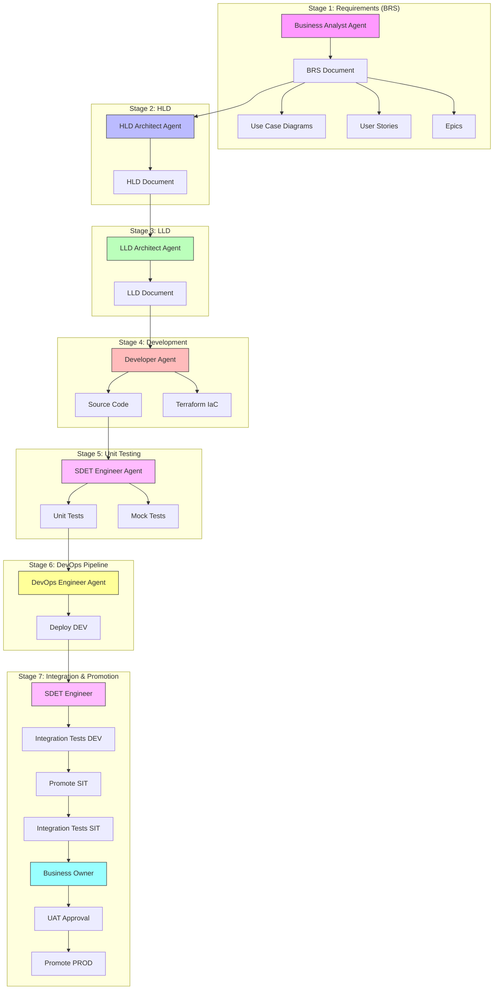

# SDLC Process - Software Development Lifecycle

**Version**: 1.0
**Created**: 2026-01-06
**Status**: Approved

---

## Overview

This document defines the standardized Software Development Lifecycle (SDLC) process for designing, developing, testing, and deploying software. Each stage has a designated agent responsible for execution.

---

## Process Flow



---

## Stage Summary

| Stage | Name | Agent | Outputs |
|-------|------|-------|---------|
| 1 | Requirements (BRS) | Business Analyst | BRS with use cases, user stories, epics |
| 2 | HLD Creation | HLD Architect | Component diagrams, HATEOAS API design |
| 3 | LLD Creation | LLD Architect | Class diagrams, sequence diagrams |
| 4 | Development | Developer | Source code, Terraform IaC, OpenAPI spec |
| 5 | Unit Testing | SDET Engineer | Unit tests, mock tests, API proxies |
| 6 | DevOps Pipeline | DevOps Engineer | GitHub Actions, deploy to DEV |
| 7 | Integration & Promotion | SDET + Business Owner | Integration tests, UAT, promote to PROD |

---

## Stage 1: Requirements (BRS)

**Agent**: `Business_Analyst_Agent.md`
**Template**: `templates/BRS_Template.md`

### Inputs
- Feature request or problem statement
- Stakeholder interviews

### Activities
1. Stakeholder identification
2. Requirements elicitation
3. Use case diagram creation
4. User story development (grouped into epics)
5. Business rules documentation
6. Success criteria definition

### Outputs
- BRS document with:
  - Use case diagrams (Mermaid)
  - User stories grouped into epics
  - Business rules
  - Success criteria

### Validation Gate
- [ ] All BRS template sections completed
- [ ] Use case diagrams created
- [ ] User stories have business context and success criteria
- [ ] Stakeholder sign-off obtained

---

## Stage 2: HLD Creation

**Agent**: `HLD_Architect_Agent.md`
**Template**: `templates/HLD_Template.md`

### Inputs
- Approved BRS from Stage 1

### Activities
1. Component diagram creation
2. HATEOAS API design (hierarchical URLs)
3. Data architecture (DynamoDB single-table design)
4. NFR specification
5. Technology decisions

### Outputs
- HLD document with:
  - Component diagrams (no sequence diagrams)
  - HATEOAS API structure
  - Data architecture with GSIs
  - NFRs with targets

### Validation Gate
- [ ] All HLD template sections completed
- [ ] Component diagrams created
- [ ] HATEOAS API structure defined
- [ ] References parent BRS

---

## Stage 3: LLD Creation

**Agent**: `LLD_Architect_Agent.md`
**Template**: `templates/LLD_Template.md`

### Inputs
- Approved HLD from Stage 2

### Activities
1. Class diagram design
2. Sequence diagram creation (with exception handling)
3. OpenAPI specification
4. Data model details
5. Implementation specifications

### Outputs
- LLD document with:
  - Class diagrams
  - Sequence diagrams (BusinessException + UnexpectedException)
  - OpenAPI specification
  - Implementation details

### Validation Gate
- [ ] All LLD template sections completed
- [ ] Sequence diagrams include exception handling
- [ ] Developer can implement from LLD alone
- [ ] References parent HLD

---

## Stage 4: Development

**Agent**: `Python_AWS_Developer_Agent.md` or `Web_Developer_Agent.md`

### Inputs
- Approved LLD from Stage 3

### Activities
1. Repository creation (`{phase}_{project}_{component}`)
2. TDD implementation (Red → Green → Refactor)
3. Lambda/service implementation
4. Terraform IaC (parameterized, no hardcoded credentials)
5. OpenAPI generation (separate YAML per microservice)

### Outputs
- Source code following SOLID principles
- Terraform configuration (environment parameterized)
- OpenAPI specification
- Unit tests (from TDD)

### Validation Gate
- [ ] Code follows SOLID, DRY, KISS principles
- [ ] TDD applied (tests written first)
- [ ] Terraform parameterized (no hardcoded env values)
- [ ] OpenAPI spec matches implementation

---

## Stage 5: Unit Testing

**Agent**: `SDET_Engineer_Agent.md`
**Skills**: `SDET_unit_test.skill.md`, `SDET_mock_test.skill.md`

### Inputs
- Source code from Stage 4

### Activities
1. Unit test creation (service, repository, handler layers)
2. Mock test creation (AWS services mocked with moto)
3. API proxy creation for environment switching

### API Proxy Pattern

```
tests/
├── proxies/
│   ├── base_proxy.py      # Base class
│   ├── dev_proxy.py       # DEV environment
│   ├── sit_proxy.py       # SIT environment
│   └── local_proxy.py     # Local/Mock
├── unit/
└── mock/
```

**CRITICAL**: No PROD endpoints in test code

### Outputs
- Unit test suite
- Mock test suite
- API proxies (DEV, SIT, Local only)

### Validation Gate
- [ ] Unit test coverage > 80%
- [ ] Mock tests run without AWS
- [ ] No PROD endpoints in test code
- [ ] All tests pass locally

---

## Stage 6: DevOps Pipeline

**Agent**: `DevOps_Engineer_Agent.md`

### Inputs
- Source code from Stage 4
- Test suite from Stage 5
- Terraform configuration

### Activities
1. GitHub Actions workflow creation
2. Pipeline configuration for DEV deployment
3. Environment-specific configurations

### Pipeline Structure

```
.github/workflows/
├── deploy-dev.yml        # Auto on push to main/develop
├── promote-sit.yml       # Manual trigger
└── promote-prod.yml      # Manual trigger (after UAT)
```

### Environment Configuration

| Environment | AWS Account | Region | Trigger |
|-------------|-------------|--------|---------|
| DEV | 536580886816 | eu-west-1 | Auto (push) |
| SIT | 815856636111 | eu-west-1 | Manual |
| PROD | 093646564004 | af-south-1 | Manual (after UAT) |

### Outputs
- GitHub Actions workflows
- DEV deployment successful

### Validation Gate
- [ ] DEV pipeline deploys successfully
- [ ] Unit tests pass in pipeline
- [ ] Terraform apply succeeds

---

## Stage 7: Integration Testing & Promotion

**Agent**: `SDET_Engineer_Agent.md` + Business Owner
**Skills**: `SDET_integration_test.skill.md`

### Flow

```
Deploy DEV → Integration Tests (DEV) → Promote SIT → Integration Tests (SIT) → UAT → Promote PROD
```

### 7.1 Integration Tests (DEV)

**Agent**: SDET Engineer

- Run integration tests against DEV environment
- Use `dev_proxy.py` for API calls
- Validate end-to-end functionality

**Gate**: All integration tests pass → Promote to SIT

### 7.2 Promote to SIT

**Agent**: DevOps Engineer

- Trigger `promote-sit.yml` workflow
- Deploy to SIT environment

### 7.3 Integration Tests (SIT)

**Agent**: SDET Engineer

- Run integration tests against SIT environment
- Use `sit_proxy.py` for API calls
- Validate in production-like environment

**Gate**: All integration tests pass → Proceed to UAT

### 7.4 UAT (User Acceptance Testing)

**Owner**: Business Owner

- Manual testing of business scenarios
- Validate against BRS requirements
- Sign-off on functionality

**Gate**: UAT approved → Promote to PROD

### 7.5 Promote to PROD

**Agent**: DevOps Engineer

- Trigger `promote-prod.yml` workflow
- Deploy to PROD environment (af-south-1)

### Validation Gates

| Gate | Owner | Criteria |
|------|-------|----------|
| DEV → SIT | SDET | Integration tests pass |
| SIT → UAT | SDET | Integration tests pass |
| UAT → PROD | Business Owner | UAT approved |

---

## Agent Reference

| Agent | File | Stages |
|-------|------|--------|
| Business Analyst | `Business_Analyst_Agent.md` | 1 |
| HLD Architect | `HLD_Architect_Agent.md` | 2 |
| LLD Architect | `LLD_Architect_Agent.md` | 3 |
| Python AWS Developer | `Python_AWS_Developer_Agent.md` | 4 |
| Web Developer | `Web_Developer_Agent.md` | 4 |
| SDET Engineer | `SDET_Engineer_Agent.md` | 5, 7 |
| DevOps Engineer | `DevOps_Engineer_Agent.md` | 6, 7 |

---

## Template Reference

| Template | Stage | Purpose |
|----------|-------|---------|
| `templates/BRS_Template.md` | 1 | Business Requirements Specification |
| `templates/HLD_Template.md` | 2 | High-Level Design |
| `templates/LLD_Template.md` | 3 | Low-Level Design |

---

## Key Rules

1. **No PROD endpoints in tests** - Use API proxies for DEV/SIT only
2. **No hardcoded credentials** - Parameterize all environment values
3. **Separate OpenAPI per microservice** - Not monolithic
4. **Separate Terraform per microservice** - Independent deployments
5. **TDD mandatory** - Write tests before code
6. **UAT required before PROD** - Business Owner sign-off

---

**End of Document**
