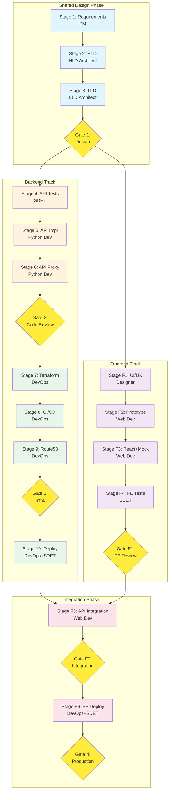

# BBWS Software Development Life Cycle (SDLC) - Process Design

**Process Name**: BBWS Full-Stack SDLC (API + React + WordPress + Multi-Tenant)
**Version**: 3.0
**Created**: 2026-01-01
**Process Designer**: Process Designer Agent v1.0
**Orchestrator**: Agentic Project Manager (PM)

---

## Executive Summary

This process defines the complete Software Development Life Cycle (SDLC) for BBWS (Building Blocks Web Services) full-stack applications. It includes **four parallel tracks**:
- **Backend Track**: API/Lambda development (Stages 1-10)
- **Frontend Track**: React application development (Stages F1-F6)
- **WordPress Track**: WordPress site management (Stages W1-W4)
- **Tenant Track**: Multi-tenant organization management (Stages T1-T3)

**Multi-Tenant Architecture**:
- Organizations can have multiple sites (React + WordPress)
- Hierarchical user management: Organization → Division → Group → Team → User
- Role-based access control with admin privileges
- Cross-team access via invitation system

**Value Proposition**:
- Parallel backend/frontend/WordPress development for faster delivery
- Multi-tenant isolation with shared infrastructure
- UI/UX design with prototyping before development
- Mock API playback enables frontend development before API completion
- AI-powered WordPress site generation (Bedrock: Claude + Stable Diffusion)
- TDD-first approach ensuring quality
- Integrated testing with real API before promotion
- Multi-environment deployment (DEV → SIT → PROD)
- Complete traceability from design to deployed application

**Automation Potential**: 85% of stages can be fully automated with agentic execution

---

## Process Overview

```
┌─────────────────────────────────────────────────────────────────────────────────┐
│                    BBWS FULL-STACK SDLC PROCESS FLOW                            │
│                     Orchestrated by: Project Manager (PM)                        │
└─────────────────────────────────────────────────────────────────────────────────┘

═══════════════════════════════════════════════════════════════════════════════════
                              SHARED DESIGN PHASE
═══════════════════════════════════════════════════════════════════════════════════

Stage 1: Requirements ──► Stage 2: HLD ──► Stage 3: LLD ──► [Gate 1: Design]
       (PM)              (HLD Architect)   (LLD Architect)

═══════════════════════════════════════════════════════════════════════════════════
                         PARALLEL DEVELOPMENT TRACKS
═══════════════════════════════════════════════════════════════════════════════════

┌──────────────────────────┐ ┌──────────────────────────┐ ┌──────────────────────────┐
│   BACKEND TRACK (API)    │ │  FRONTEND TRACK (React)  │ │  WORDPRESS TRACK (CMS)   │
├──────────────────────────┤ ├──────────────────────────┤ ├──────────────────────────┤
│                          │ │                          │ │                          │
│ Stage 4: API Tests (TDD) │ │ Stage F1: UI/UX Design   │ │ Stage W1: WP Theme Dev   │
│        (SDET)            │ │      (UI/UX Designer)    │ │      (Web Developer)     │
│           │              │ │           │              │ │           │              │
│           ▼              │ │           ▼              │ │           ▼              │
│ Stage 5: API Impl        │ │ Stage F2: Prototype      │ │ Stage W2: AI Generation  │
│      (Python Dev)        │ │      (Web Developer)     │ │      (AI + Web Dev)      │
│           │              │ │           │              │ │           │              │
│           ▼              │ │           ▼              │ │           ▼              │
│ Stage 6: API Proxy       │ │ Stage F3: React+Mock     │ │ Stage W3: WP Deploy      │
│      (Python Dev)        │ │      (Web Developer)     │ │      (DevOps)            │
│           │              │ │           │              │ │           │              │
│           ▼              │ │           ▼              │ │           ▼              │
│ [Gate 2: Code Review]    │ │ Stage F4: FE Tests       │ │ Stage W4: WP Testing     │
│           │              │ │        (SDET)            │ │      (SDET)              │
│           ▼              │ │           │              │ │           │              │
│ Stage 7: Infrastructure  │ │ [Gate F1: FE Review]     │ │ [Gate W1: WP Review]     │
│        (DevOps)          │ │                          │ │                          │
│           │              │ └──────────────────────────┘ └──────────────────────────┘
│           ▼              │
│ Stage 8: CI/CD Pipeline  │  ┌────────────────────────────────────────────────────┐
│        (DevOps)          │  │           TENANT MANAGEMENT TRACK                   │
│           │              │  ├────────────────────────────────────────────────────┤
│           ▼              │  │                                                    │
│ Stage 9: Route53/Domain  │  │ Stage T1: Tenant API ──► Stage T2: User Hierarchy  │
│        (DevOps)          │  │    (Python Dev)              (Python Dev)          │
│           │              │  │                                   │                │
│           ▼              │  │                                   ▼                │
│ [Gate 3: Infra Review]   │  │                           Stage T3: Access Control │
│           │              │  │                              (Python Dev + SDET)   │
│           ▼              │  │                                   │                │
│ Stage 10: Deploy & Test  │  │                           [Gate T1: Tenant Review] │
│     (DevOps + SDET)      │  │                                                    │
└──────────────────────────┘  └────────────────────────────────────────────────────┘

═══════════════════════════════════════════════════════════════════════════════════
                            INTEGRATION PHASE
═══════════════════════════════════════════════════════════════════════════════════

                    All tracks converge for integration
                              │
                              ▼
Stage F5: API Integration ──► Stage F6: Frontend + WP + Tenant Deploy & Promotion
    (Web Developer)                   (DevOps + SDET)
         │                                  │
         ▼                                  ▼
   [Gate F2: Integration]           [Gate 4: Production Ready]
```

---

## Project Tracking

### Overall Progress
| Metric | Value |
|--------|-------|
| Backend Stages | 10 |
| Frontend Stages | 6 |
| WordPress Stages | 4 |
| Tenant Stages | 3 |
| Total Stages | 23 |
| Total Workers | 74 |
| Status | ⏳ PENDING |
| Progress | `[░░░░░░░░░░] 0%` |

### Backend Track Progress

| # | Stage Name | Status | Agent/Skill | Workers | Sub-Plan |
|---|------------|--------|-------------|---------|----------|
| 1 | Requirements & Analysis | ⏳ PENDING | PM + Analyst | 4 | [stage-1-requirements.md](./stage-1-requirements.md) |
| 2 | HLD Creation | ⏳ PENDING | HLD Architect | 3 | [stage-2-hld.md](./stage-2-hld.md) |
| 3 | LLD Creation | ⏳ PENDING | LLD Architect | 4 | [stage-3-lld.md](./stage-3-lld.md) |
| 4 | API Tests (TDD) | ⏳ PENDING | SDET Engineer | 4 | [stage-4-api-tests.md](./stage-4-api-tests.md) |
| 5 | API Implementation | ⏳ PENDING | Python Developer | 5 | [stage-5-api-implementation.md](./stage-5-api-implementation.md) |
| 6 | API Proxy | ⏳ PENDING | Python Developer | 2 | [stage-6-api-proxy.md](./stage-6-api-proxy.md) |
| 7 | Infrastructure | ⏳ PENDING | DevOps Engineer | 4 | [stage-7-infrastructure.md](./stage-7-infrastructure.md) |
| 8 | CI/CD Pipeline | ⏳ PENDING | DevOps Engineer | 3 | [stage-8-cicd-pipeline.md](./stage-8-cicd-pipeline.md) |
| 9 | Route53/Domain | ⏳ PENDING | DevOps Engineer | 3 | [stage-9-route53-domain.md](./stage-9-route53-domain.md) |
| 10 | Deploy & Test | ⏳ PENDING | DevOps + SDET | 3 | [stage-10-deploy-test.md](./stage-10-deploy-test.md) |

### Frontend Track Progress

| # | Stage Name | Status | Agent/Skill | Workers | Sub-Plan |
|---|------------|--------|-------------|---------|----------|
| F1 | UI/UX Design | ⏳ PENDING | UI/UX Designer | 4 | [stage-f1-ui-ux-design.md](./stage-f1-ui-ux-design.md) |
| F2 | Prototype & Mockups | ⏳ PENDING | Web Developer | 3 | [stage-f2-prototype.md](./stage-f2-prototype.md) |
| F3 | React + Mock API | ⏳ PENDING | Web Developer | 5 | [stage-f3-react-mock-api.md](./stage-f3-react-mock-api.md) |
| F4 | Frontend Tests | ⏳ PENDING | SDET Engineer | 4 | [stage-f4-frontend-tests.md](./stage-f4-frontend-tests.md) |
| F5 | API Integration | ⏳ PENDING | Web Developer | 3 | [stage-f5-api-integration.md](./stage-f5-api-integration.md) |
| F6 | Frontend Deploy & Promotion | ⏳ PENDING | DevOps + SDET | 3 | [stage-f6-frontend-deploy.md](./stage-f6-frontend-deploy.md) |

### WordPress Track Progress

| # | Stage Name | Status | Agent/Skill | Workers | Sub-Plan |
|---|------------|--------|-------------|---------|----------|
| W1 | WordPress Theme Development | ⏳ PENDING | Web Developer | 3 | [stage-w1-theme-dev.md](./stage-w1-theme-dev.md) |
| W2 | AI Site Generation | ⏳ PENDING | AI + Web Developer | 4 | [stage-w2-ai-generation.md](./stage-w2-ai-generation.md) |
| W3 | WordPress Deployment | ⏳ PENDING | DevOps Engineer | 3 | [stage-w3-deployment.md](./stage-w3-deployment.md) |
| W4 | WordPress Testing | ⏳ PENDING | SDET Engineer | 3 | [stage-w4-testing.md](./stage-w4-testing.md) |

### Tenant Management Track Progress

| # | Stage Name | Status | Agent/Skill | Workers | Sub-Plan |
|---|------------|--------|-------------|---------|----------|
| T1 | Tenant API Implementation | ⏳ PENDING | Python Developer | 4 | [stage-t1-tenant-api.md](./stage-t1-tenant-api.md) |
| T2 | User Hierarchy System | ⏳ PENDING | Python Developer | 4 | [stage-t2-user-hierarchy.md](./stage-t2-user-hierarchy.md) |
| T3 | Access Control & RBAC | ⏳ PENDING | Python Dev + SDET | 5 | [stage-t3-access-control.md](./stage-t3-access-control.md) |

---

## Workflow Visualization



---

## Agent & Skill Assignments

### Backend Track

| Stage | Primary Agent | Primary Skill | Secondary Skills |
|-------|---------------|---------------|------------------|
| 1. Requirements | **Agentic_Project_Manager** | `project_planning_skill.md` | - |
| 2. HLD | **HLD_Architect_Agent** | `hld_architect.skill.md` | `HLD_TEMPLATE.md` |
| 3. LLD | **LLD_Architect_Agent** | `HLD_LLD_Naming_Convention.skill.md` | `DynamoDB_Single_Table.skill.md` |
| 4. API Tests | **SDET_Engineer_Agent** | `SDET_unit_test.skill.md` | `SDET_mock_test.skill.md` |
| 5. API Impl | **Python_AWS_Developer_Agent** | `AWS_Python_Dev.skill.md` | `Lambda_Management.skill.md` |
| 6. API Proxy | **Python_AWS_Developer_Agent** | `AWS_Python_Dev.skill.md` | - |
| 7. Infrastructure | **DevOps_Engineer_Agent** | `github_oidc_cicd.skill.md` | `aws_region_specification.skill.md` |
| 8. CI/CD | **DevOps_Engineer_Agent** | `github_oidc_cicd.skill.md` | - |
| 9. Route53 | **DevOps_Engineer_Agent** | `dns_environment_naming.skill.md` | - |
| 10. Deploy | **DevOps_Engineer_Agent** | `github_oidc_cicd.skill.md` | - |

### Frontend Track

| Stage | Primary Agent | Primary Skill | Secondary Skills |
|-------|---------------|---------------|------------------|
| F1. UI/UX | **UI_UX_Designer** | `ui_ux_designer.skill.md` | `web_design_fundamentals.skill.md` |
| F2. Prototype | **Web_Developer_Agent** | `web_design_fundamentals.skill.md` | - |
| F3. React+Mock | **Web_Developer_Agent** | `react_landing_page.skill.md` | `spa_developer.skill.md` |
| F4. FE Tests | **SDET_Engineer_Agent** | `website_testing.skill.md` | - |
| F5. Integration | **Web_Developer_Agent** | `react_landing_page.skill.md` | - |
| F6. FE Deploy | **DevOps_Engineer_Agent** | `github_oidc_cicd.skill.md` | - |

### WordPress Track

| Stage | Primary Agent | Primary Skill | Secondary Skills |
|-------|---------------|---------------|------------------|
| W1. Theme Dev | **Web_Developer_Agent** | `wordpress_theme.skill.md` | `web_design_fundamentals.skill.md` |
| W2. AI Gen | **AI_Website_Generator** | `aws-ai-website-generator.skill.md` | `bedrock_integration.skill.md` |
| W3. WP Deploy | **DevOps_Engineer_Agent** | `github_oidc_cicd.skill.md` | `s3_cloudfront.skill.md` |
| W4. WP Tests | **SDET_Engineer_Agent** | `website_testing.skill.md` | - |

### Tenant Management Track

| Stage | Primary Agent | Primary Skill | Secondary Skills |
|-------|---------------|---------------|------------------|
| T1. Tenant API | **Python_AWS_Developer_Agent** | `AWS_Python_Dev.skill.md` | `Lambda_Management.skill.md` |
| T2. Hierarchy | **Python_AWS_Developer_Agent** | `AWS_Python_Dev.skill.md` | `DynamoDB_Single_Table.skill.md` |
| T3. RBAC | **Python_AWS_Developer_Agent** | `AWS_Python_Dev.skill.md` | `SDET_integration_test.skill.md` |

### Agent File Locations

| Agent | File Path |
|-------|-----------|
| Project Manager | `agentic_architect/Agentic_Project_Manager.md` |
| HLD Architect | `agentic_architect/HLD_Architect_Agent.md` |
| LLD Architect | `agentic_architect/LLD_Architect_Agent.md` |
| Python Developer | `agentic_architect/Python_AWS_Developer_Agent.md` |
| Web Developer | `agentic_architect/Web_Developer_Agent.md` |
| DevOps Engineer | `agentic_architect/DevOps_Engineer_Agent.md` |
| SDET Engineer | `agentic_architect/SDET_Engineer_Agent.md` |
| UI/UX Designer | Uses `content/skills/ui_ux_designer.skill.md` |
| AI Website Generator | Uses `aws-ai-website-generator.skill.md` |

---

## Environment Configuration

### Backend (API)

| Environment | AWS Account | Region | Domain | Purpose |
|-------------|-------------|--------|--------|---------|
| **DEV** | 536580886816 | eu-west-1 | `api.dev.kimmyai.io` | Development |
| **SIT** | 815856636111 | eu-west-1 | `api.sit.kimmyai.io` | Integration |
| **PROD** | 093646564004 | af-south-1 | `api.kimmyai.io` | Production |

### Frontend (React)

| Environment | Hosting | Domain | Purpose |
|-------------|---------|--------|---------|
| **DEV** | S3 + CloudFront | `app.dev.kimmyai.io` | Development |
| **SIT** | S3 + CloudFront | `app.sit.kimmyai.io` | Integration |
| **PROD** | S3 + CloudFront | `app.kimmyai.io` | Production |

### WordPress Sites

| Environment | Hosting | Domain Pattern | Purpose |
|-------------|---------|----------------|---------|
| **DEV** | S3 + CloudFront | `{tenant}.sites.dev.kimmyai.io` | Development |
| **SIT** | S3 + CloudFront | `{tenant}.sites.sit.kimmyai.io` | Integration |
| **PROD** | S3 + CloudFront | `{tenant}.sites.kimmyai.io` | Production |

**Note**: WordPress sites are generated as static HTML/CSS/JS and hosted on S3 with CloudFront. Each tenant can have multiple sites.

### Tenant Management

| Environment | API Endpoint | DynamoDB Table | Purpose |
|-------------|--------------|----------------|---------|
| **DEV** | `api.dev.kimmyai.io/v1.0/tenants` | `tenants-dev` | Development |
| **SIT** | `api.sit.kimmyai.io/v1.0/tenants` | `tenants-sit` | Integration |
| **PROD** | `api.kimmyai.io/v1.0/tenants` | `tenants-prod` | Production |

**Multi-Tenant Data Model**:
```
Organization
├── Division (optional)
│   └── Group (optional)
│       └── Team
│           └── User
├── Sites (React + WordPress)
│   ├── Site 1
│   ├── Site 2
│   └── Site N
└── Roles & Permissions
```

---

## Approval Gates

| Gate | Location | Approvers | Criteria |
|------|----------|-----------|----------|
| **Gate 1** | After Stage 3 (LLD) | Tech Lead, Solutions Architect | Design docs complete |
| **Gate 2** | After Stage 6 (Proxy) | Tech Lead, Developer Lead | API tests pass, code reviewed |
| **Gate 3** | After Stage 9 (Route53) | DevOps Lead, Tech Lead | Infrastructure validated |
| **Gate F1** | After Stage F4 (FE Tests) | Tech Lead, UX Lead | Frontend tests pass |
| **Gate F2** | After Stage F5 (Integration) | Tech Lead, QA Lead | Integration tests pass |
| **Gate W1** | After Stage W4 (WP Tests) | Tech Lead, Content Lead | WordPress sites functional |
| **Gate T1** | After Stage T3 (RBAC) | Tech Lead, Security Lead | Tenant isolation verified |
| **Gate 4** | After Stage F6 (All Deploy) | Product Owner, Ops Lead | Full stack ready |

---

## Output Deliverables

### Backend Outputs
| Deliverable | Location | Stage |
|-------------|----------|-------|
| Requirements Document | `2_bbws_docs/requirements/{service}/` | Stage 1 |
| HLD Document | `2_bbws_docs/HLDs/` | Stage 2 |
| LLD Document | `2_bbws_docs/LLDs/` | Stage 3 |
| API Tests | `{api-repo}/tests/` | Stage 4 |
| Lambda Code | `{api-repo}/src/` | Stage 5 |
| API Proxy | `{api-repo}/tests/proxies/` | Stage 6 |
| Terraform | `{api-repo}/terraform/` | Stage 7 |
| CI/CD Workflows | `{api-repo}/.github/workflows/` | Stage 8 |

### Frontend Outputs
| Deliverable | Location | Stage |
|-------------|----------|-------|
| UI/UX Designs | `{fe-repo}/designs/` | Stage F1 |
| Figma Prototypes | `{fe-repo}/designs/prototypes/` | Stage F2 |
| Mock API Data | `{fe-repo}/src/mocks/` | Stage F3 |
| React Components | `{fe-repo}/src/components/` | Stage F3 |
| Frontend Tests | `{fe-repo}/src/__tests__/` | Stage F4 |
| Integration Tests | `{fe-repo}/tests/integration/` | Stage F5 |
| Deployment Configs | `{fe-repo}/terraform/` | Stage F6 |

### WordPress Outputs
| Deliverable | Location | Stage |
|-------------|----------|-------|
| Theme Templates | `{wp-repo}/themes/` | Stage W1 |
| AI-Generated Content | `{wp-repo}/generated/` | Stage W2 |
| Static Site Build | `{wp-repo}/dist/` | Stage W2 |
| WordPress Terraform | `{wp-repo}/terraform/` | Stage W3 |
| Site Test Reports | `{wp-repo}/reports/` | Stage W4 |

### Tenant Management Outputs
| Deliverable | Location | Stage |
|-------------|----------|-------|
| Tenant Lambda Code | `{tenant-repo}/src/` | Stage T1 |
| DynamoDB Schema | `{tenant-repo}/docs/data-model.md` | Stage T1 |
| User Hierarchy API | `{tenant-repo}/src/handlers/` | Stage T2 |
| RBAC Implementation | `{tenant-repo}/src/auth/` | Stage T3 |
| Tenant Tests | `{tenant-repo}/tests/` | Stage T1-T3 |

---

## Success Criteria

### Backend
- [ ] All 10 backend stages complete
- [ ] API test coverage ≥ 80%
- [ ] All E2E tests passing in DEV
- [ ] API accessible via custom domain

### Frontend
- [ ] All 6 frontend stages complete
- [ ] UI matches approved designs
- [ ] Frontend test coverage ≥ 70%
- [ ] Integration tests passing
- [ ] Performance metrics met (LCP < 2.5s)

### WordPress
- [ ] All 4 WordPress stages complete
- [ ] AI generation producing valid sites
- [ ] Static sites deployed to S3/CloudFront
- [ ] Site tests passing (accessibility, performance)
- [ ] Tenant-specific sites isolated

### Tenant Management
- [ ] All 3 tenant stages complete
- [ ] Organization CRUD operations working
- [ ] User hierarchy (Division→Group→Team→User) functional
- [ ] RBAC enforcement verified
- [ ] Cross-tenant isolation tested
- [ ] User invitation system working

### Full Stack
- [ ] All 8 approval gates passed
- [ ] CI/CD auto-deploys to DEV
- [ ] Documentation complete
- [ ] Runbooks available
- [ ] Multi-tenant isolation verified

---

## Estimated Duration

| Track | Stages | Agentic Time | Manual Time |
|-------|--------|--------------|-------------|
| Shared Design | 1-3 | 2 hours | 8 hours |
| Backend | 4-10 | 6 hours | 28 hours |
| Frontend | F1-F6 | 5 hours | 24 hours |
| WordPress | W1-W4 | 3 hours | 12 hours |
| Tenant | T1-T3 | 4 hours | 16 hours |
| **Total** | **23** | **20 hours** | **88 hours** |

**Note**: Backend, Frontend, WordPress, and Tenant tracks can run in parallel, reducing wall-clock time significantly.

**Parallel Execution Timeline**:
```
Shared Design (2h) ──► Backend (6h) ───────────────────────────────►
                   └─► Frontend (5h) ────────────────────►
                   └─► WordPress (3h) ──────►
                   └─► Tenant (4h) ───────►
                                                         Integration (2h)
─────────────────────────────────────────────────────────────────────►
                        Wall Clock: ~10 hours (agentic)
```

---

## Sub-Plans Index

### Backend Track
1. [Stage 1: Requirements & Analysis](./stage-1-requirements.md)
2. [Stage 2: HLD Creation](./stage-2-hld.md)
3. [Stage 3: LLD Creation](./stage-3-lld.md)
4. [Stage 4: API Tests (TDD)](./stage-4-api-tests.md)
5. [Stage 5: API Implementation](./stage-5-api-implementation.md)
6. [Stage 6: API Proxy](./stage-6-api-proxy.md)
7. [Stage 7: Infrastructure](./stage-7-infrastructure.md)
8. [Stage 8: CI/CD Pipeline](./stage-8-cicd-pipeline.md)
9. [Stage 9: Route53/Domain Mapping](./stage-9-route53-domain.md)
10. [Stage 10: Deploy & Test](./stage-10-deploy-test.md)

### Frontend Track
1. [Stage F1: UI/UX Design](./stage-f1-ui-ux-design.md)
2. [Stage F2: Prototype & Mockups](./stage-f2-prototype.md)
3. [Stage F3: React + Mock API](./stage-f3-react-mock-api.md)
4. [Stage F4: Frontend Tests](./stage-f4-frontend-tests.md)
5. [Stage F5: API Integration](./stage-f5-api-integration.md)
6. [Stage F6: Frontend Deploy & Promotion](./stage-f6-frontend-deploy.md)

### WordPress Track
1. [Stage W1: WordPress Theme Development](./stage-w1-theme-dev.md)
2. [Stage W2: AI Site Generation](./stage-w2-ai-generation.md)
3. [Stage W3: WordPress Deployment](./stage-w3-deployment.md)
4. [Stage W4: WordPress Testing](./stage-w4-testing.md)

### Tenant Management Track
1. [Stage T1: Tenant API Implementation](./stage-t1-tenant-api.md)
2. [Stage T2: User Hierarchy System](./stage-t2-user-hierarchy.md)
3. [Stage T3: Access Control & RBAC](./stage-t3-access-control.md)

---

**Approval Required**: This process design requires stakeholder review before implementation.

**Next Step**: Review and approve this plan, then PM will orchestrate parallel track execution.
