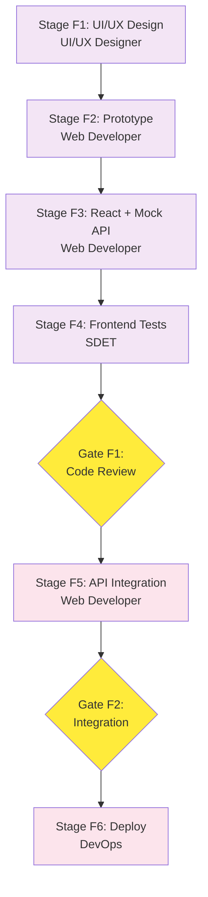

# React Application SDLC - Process Design

**Process Name**: BBWS React Application SDLC
**Version**: 1.0
**Created**: 2026-01-01
**Process Designer**: Process Designer Agent v1.0
**Orchestrator**: Agentic Project Manager (PM)

---

## Executive Summary

This process defines the complete Software Development Life Cycle (SDLC) for BBWS React single-page applications. It covers UI/UX design through deployment with mock API development enabling parallel backend work.

**Key Features**:
- UI/UX design with prototyping before development
- Mock API playback enables frontend development before API completion
- TDD-first approach with 70%+ test coverage
- S3/CloudFront hosting with custom domains
- Multi-environment deployment (DEV → SIT → PROD)

**Automation Potential**: 80% of stages can be fully automated with agentic execution

---

## Process Overview

```
┌─────────────────────────────────────────────────────────────────────────────────┐
│                    REACT APPLICATION SDLC PROCESS FLOW                          │
│                     Orchestrated by: Project Manager (PM)                        │
└─────────────────────────────────────────────────────────────────────────────────┘

Stage F1: UI/UX Design ──► Stage F2: Prototype ──► Stage F3: React + Mock API
    (UI/UX Designer)         (Web Developer)          (Web Developer)
                                                            │
                                                            ▼
                                                   [Gate F1: Code Review]
                                                            │
                                                            ▼
Stage F6: Deploy ◄──── Stage F5: API Integration ◄──── Stage F4: Frontend Tests
   (DevOps)                (Web Developer)                 (SDET)
      │
      ▼
[Gate F2: Production Ready]
```

---

## Project Tracking

### Overall Progress
| Metric | Value |
|--------|-------|
| Total Stages | 6 |
| Total Workers | 22 |
| Approval Gates | 2 |
| Status | ⏳ PENDING |
| Progress | `[░░░░░░░░░░] 0%` |

### Stage Progress

| # | Stage Name | Status | Agent/Skill | Workers | Sub-Plan |
|---|------------|--------|-------------|---------|----------|
| F1 | UI/UX Design | ⏳ PENDING | UI/UX Designer | 4 | [stage-f1-ui-ux-design.md](./stage-f1-ui-ux-design.md) |
| F2 | Prototype & Mockups | ⏳ PENDING | Web Developer | 3 | [stage-f2-prototype.md](./stage-f2-prototype.md) |
| F3 | React + Mock API | ⏳ PENDING | Web Developer | 5 | [stage-f3-react-mock-api.md](./stage-f3-react-mock-api.md) |
| F4 | Frontend Tests | ⏳ PENDING | SDET Engineer | 4 | [stage-f4-frontend-tests.md](./stage-f4-frontend-tests.md) |
| F5 | API Integration | ⏳ PENDING | Web Developer | 3 | [stage-f5-api-integration.md](./stage-f5-api-integration.md) |
| F6 | Frontend Deploy & Promotion | ⏳ PENDING | DevOps + SDET | 3 | [stage-f6-frontend-deploy.md](./stage-f6-frontend-deploy.md) |

---

## Workflow Visualization



---

## Agent & Skill Assignments

| Stage | Primary Agent | Primary Skill | Secondary Skills |
|-------|---------------|---------------|------------------|
| F1. UI/UX | **UI_UX_Designer** | `ui_ux_designer.skill.md` | `web_design_fundamentals.skill.md` |
| F2. Prototype | **Web_Developer_Agent** | `web_design_fundamentals.skill.md` | - |
| F3. React+Mock | **Web_Developer_Agent** | `react_landing_page.skill.md` | `spa_developer.skill.md` |
| F4. FE Tests | **SDET_Engineer_Agent** | `website_testing.skill.md` | - |
| F5. Integration | **Web_Developer_Agent** | `react_landing_page.skill.md` | - |
| F6. FE Deploy | **DevOps_Engineer_Agent** | `github_oidc_cicd.skill.md` | - |

### Agent File Locations

| Agent | File Path |
|-------|-----------|
| Project Manager | `agentic_architect/Agentic_Project_Manager.md` |
| Web Developer | `agentic_architect/Web_Developer_Agent.md` |
| DevOps Engineer | `agentic_architect/DevOps_Engineer_Agent.md` |
| SDET Engineer | `agentic_architect/SDET_Engineer_Agent.md` |
| UI/UX Designer | Uses `content/skills/ui_ux_designer.skill.md` |

---

## Technology Stack

| Category | Technology |
|----------|------------|
| Framework | React 18 with TypeScript |
| Build Tool | Vite |
| Styling | TailwindCSS |
| State Management | React Query + Zustand |
| Mock API | MSW (Mock Service Worker) |
| Testing | Vitest + React Testing Library |
| E2E Testing | Playwright (optional) |
| Hosting | S3 + CloudFront |
| CI/CD | GitHub Actions with OIDC |
| Infrastructure | Terraform |

---

## Environment Configuration

| Environment | AWS Account | Hosting | Domain | Purpose |
|-------------|-------------|---------|--------|---------|
| **DEV** | 536580886816 | S3 + CloudFront | `app.dev.kimmyai.io` | Development |
| **SIT** | 815856636111 | S3 + CloudFront | `app.sit.kimmyai.io` | Integration |
| **PROD** | 093646564004 | S3 + CloudFront | `app.kimmyai.io` | Production |

---

## Approval Gates

| Gate | Location | Approvers | Criteria |
|------|----------|-----------|----------|
| **Gate F1** | After Stage F4 (Tests) | Tech Lead, UX Lead | Test coverage >= 70%, UI matches designs |
| **Gate F2** | After Stage F5 (Integration) | Tech Lead, QA Lead | Integration tests pass, API working |

---

## Output Deliverables

| Deliverable | Location | Stage |
|-------------|----------|-------|
| User Research | `designs/research/` | F1 |
| Wireframes | `designs/wireframes/` | F1 |
| Design System | `designs/system/` | F1 |
| High-Fidelity Mockups | `designs/mockups/` | F1 |
| Figma Prototypes | `designs/prototypes/` | F2 |
| User Flow Docs | `designs/flows/` | F2 |
| Mock API Data | `src/mocks/` | F3 |
| React Components | `src/components/` | F3 |
| Application Pages | `src/pages/` | F3 |
| Unit Tests | `src/__tests__/unit/` | F4 |
| Component Tests | `src/__tests__/components/` | F4 |
| Integration Tests | `tests/integration/` | F5 |
| Terraform Config | `terraform/` | F6 |
| CI/CD Workflows | `.github/workflows/` | F6 |

---

## Project Structure

```
{app-name}_react/
├── src/
│   ├── components/       # Reusable UI components
│   ├── pages/            # Page components
│   ├── hooks/            # Custom React hooks
│   ├── services/         # API service layer
│   ├── store/            # State management
│   ├── types/            # TypeScript types
│   ├── utils/            # Utility functions
│   ├── mocks/            # MSW mock handlers
│   └── __tests__/        # Test files
├── designs/
│   ├── research/         # User research
│   ├── wireframes/       # Low-fidelity wireframes
│   ├── mockups/          # High-fidelity designs
│   ├── prototypes/       # Interactive prototypes
│   ├── flows/            # User flow documentation
│   └── system/           # Design system
├── tests/
│   └── integration/      # API integration tests
├── terraform/
│   └── environments/     # Environment configs
├── .github/workflows/    # CI/CD pipelines
├── public/
├── package.json
├── vite.config.ts
├── tailwind.config.js
├── tsconfig.json
└── CLAUDE.md
```

---

## Success Criteria

- [ ] All 6 stages complete
- [ ] UI matches approved designs
- [ ] Test coverage >= 70%
- [ ] All integration tests passing
- [ ] Performance metrics met (LCP < 2.5s)
- [ ] Both approval gates passed
- [ ] CI/CD auto-deploys to DEV
- [ ] Documentation complete

---

## Estimated Duration

| Stage | Agentic Time | Manual Time |
|-------|--------------|-------------|
| F1: UI/UX Design | 1.5 hours | 17 hours |
| F2: Prototype | 1.5 hours | 8 hours |
| F3: React + Mock | 2.5 hours | 18 hours |
| F4: Frontend Tests | 2 hours | 11 hours |
| F5: API Integration | 1 hour | 6 hours |
| F6: Deploy | 1 hour | 6 hours |
| **Total** | **9.5 hours** | **66 hours** |

---

## Sub-Plans Index

1. [Stage F1: UI/UX Design](./stage-f1-ui-ux-design.md)
2. [Stage F2: Prototype & Mockups](./stage-f2-prototype.md)
3. [Stage F3: React + Mock API](./stage-f3-react-mock-api.md)
4. [Stage F4: Frontend Tests](./stage-f4-frontend-tests.md)
5. [Stage F5: API Integration](./stage-f5-api-integration.md)
6. [Stage F6: Frontend Deploy & Promotion](./stage-f6-frontend-deploy.md)

---

## Dependencies

**External Dependencies**:
- Backend API (for Stage F5) - can proceed with mock API until available
- AWS accounts configured with OIDC
- Route53 hosted zone for custom domains
- ACM certificates for SSL

**Can Start Independently**: Stages F1-F4 can proceed without backend API

---

**Approval Required**: This process design requires stakeholder review before implementation.

**Next Step**: Review and approve this plan, then PM will orchestrate execution.
