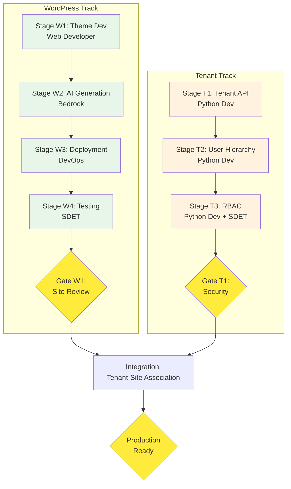

# WordPress & Tenant Management SDLC - Process Design

**Process Name**: BBWS WordPress Site & Multi-Tenant SDLC
**Version**: 1.0
**Created**: 2026-01-01
**Process Designer**: Process Designer Agent v1.0
**Orchestrator**: Agentic Project Manager (PM)

---

## Executive Summary

This process defines the complete SDLC for AI-generated WordPress sites with multi-tenant management. It covers theme development, AI content generation using AWS Bedrock, static site deployment, and organizational tenant management with RBAC.

**Key Features**:
- AI-powered site generation (Claude Sonnet 3.5 + Stable Diffusion XL)
- Static HTML/CSS/JS output hosted on S3/CloudFront
- Multi-tenant architecture with user hierarchy
- Role-based access control (RBAC)
- Per-tenant site isolation

**Automation Potential**: 85% of stages can be fully automated with agentic execution

---

## Process Overview

```
┌─────────────────────────────────────────────────────────────────────────────────┐
│              WORDPRESS & TENANT MANAGEMENT SDLC PROCESS FLOW                    │
│                     Orchestrated by: Project Manager (PM)                        │
└─────────────────────────────────────────────────────────────────────────────────┘

═══════════════════════════════════════════════════════════════════════════════════
                         PARALLEL DEVELOPMENT TRACKS
═══════════════════════════════════════════════════════════════════════════════════

┌─────────────────────────────────┐  ┌─────────────────────────────────────────────┐
│     WORDPRESS TRACK (Sites)     │  │         TENANT TRACK (Management)           │
├─────────────────────────────────┤  ├─────────────────────────────────────────────┤
│                                 │  │                                             │
│  Stage W1: Theme Development    │  │  Stage T1: Tenant API Implementation        │
│        (Web Developer)          │  │        (Python Developer)                   │
│             │                   │  │             │                               │
│             ▼                   │  │             ▼                               │
│  Stage W2: AI Site Generation   │  │  Stage T2: User Hierarchy System            │
│        (AI + Web Developer)     │  │        (Python Developer)                   │
│             │                   │  │             │                               │
│             ▼                   │  │             ▼                               │
│  Stage W3: WordPress Deployment │  │  Stage T3: Access Control & RBAC            │
│        (DevOps)                 │  │        (Python Developer + SDET)            │
│             │                   │  │             │                               │
│             ▼                   │  │             ▼                               │
│  Stage W4: WordPress Testing    │  │  [Gate T1: Security Review]                 │
│        (SDET)                   │  │                                             │
│             │                   │  └─────────────────────────────────────────────┘
│             ▼                   │
│  [Gate W1: Site Review]         │
└─────────────────────────────────┘

═══════════════════════════════════════════════════════════════════════════════════
                            INTEGRATION PHASE
═══════════════════════════════════════════════════════════════════════════════════

              Tenant-Site Association ──► Production Deployment
                                                │
                                                ▼
                                    [Gate: Production Ready]
```

---

## Project Tracking

### Overall Progress
| Metric | Value |
|--------|-------|
| WordPress Stages | 4 |
| Tenant Stages | 3 |
| Total Stages | 7 |
| Total Workers | 26 |
| Approval Gates | 2 |
| Status | ⏳ PENDING |
| Progress | `[░░░░░░░░░░] 0%` |

### WordPress Track Progress

| # | Stage Name | Status | Agent/Skill | Workers | Sub-Plan |
|---|------------|--------|-------------|---------|----------|
| W1 | WordPress Theme Development | ⏳ PENDING | Web Developer | 3 | [stage-w1-theme-dev.md](./stage-w1-theme-dev.md) |
| W2 | AI Site Generation | ⏳ PENDING | AI + Web Developer | 4 | [stage-w2-ai-generation.md](./stage-w2-ai-generation.md) |
| W3 | WordPress Deployment | ⏳ PENDING | DevOps Engineer | 3 | [stage-w3-deployment.md](./stage-w3-deployment.md) |
| W4 | WordPress Testing | ⏳ PENDING | SDET Engineer | 3 | [stage-w4-testing.md](./stage-w4-testing.md) |

### Tenant Management Track Progress

| # | Stage Name | Status | Agent/Skill | Workers | Sub-Plan |
|---|------------|--------|-------------|---------|----------|
| T1 | Tenant API Implementation | ⏳ PENDING | Python Developer | 4 | [stage-t1-tenant-api.md](./stage-t1-tenant-api.md) |
| T2 | User Hierarchy System | ⏳ PENDING | Python Developer | 4 | [stage-t2-user-hierarchy.md](./stage-t2-user-hierarchy.md) |
| T3 | Access Control & RBAC | ⏳ PENDING | Python Dev + SDET | 5 | [stage-t3-access-control.md](./stage-t3-access-control.md) |

---

## Workflow Visualization



---

## Agent & Skill Assignments

### WordPress Track

| Stage | Primary Agent | Primary Skill | Secondary Skills |
|-------|---------------|---------------|------------------|
| W1. Theme Dev | **Web_Developer_Agent** | `wordpress_theme.skill.md` | `web_design_fundamentals.skill.md` |
| W2. AI Gen | **AI_Website_Generator** | `aws-ai-website-generator.skill.md` | `bedrock_integration.skill.md` |
| W3. WP Deploy | **DevOps_Engineer_Agent** | `github_oidc_cicd.skill.md` | `s3_cloudfront.skill.md` |
| W4. WP Tests | **SDET_Engineer_Agent** | `website_testing.skill.md` | - |

### Tenant Track

| Stage | Primary Agent | Primary Skill | Secondary Skills |
|-------|---------------|---------------|------------------|
| T1. Tenant API | **Python_AWS_Developer_Agent** | `AWS_Python_Dev.skill.md` | `Lambda_Management.skill.md` |
| T2. Hierarchy | **Python_AWS_Developer_Agent** | `AWS_Python_Dev.skill.md` | `DynamoDB_Single_Table.skill.md` |
| T3. RBAC | **Python_AWS_Developer_Agent** | `AWS_Python_Dev.skill.md` | `SDET_integration_test.skill.md` |

### Agent File Locations

| Agent | File Path |
|-------|-----------|
| Project Manager | `agentic_architect/Agentic_Project_Manager.md` |
| Python Developer | `agentic_architect/Python_AWS_Developer_Agent.md` |
| Web Developer | `agentic_architect/Web_Developer_Agent.md` |
| DevOps Engineer | `agentic_architect/DevOps_Engineer_Agent.md` |
| SDET Engineer | `agentic_architect/SDET_Engineer_Agent.md` |
| AI Website Generator | Uses `aws-ai-website-generator.skill.md` |

---

## Technology Stack

### WordPress/AI Generation
| Category | Technology |
|----------|------------|
| Theme Engine | WordPress/PHP templates |
| AI Content | AWS Bedrock - Claude Sonnet 3.5 |
| AI Images | AWS Bedrock - Stable Diffusion XL |
| Output | Static HTML/CSS/JS |
| Hosting | S3 + CloudFront |
| CI/CD | GitHub Actions |

### Tenant Management
| Category | Technology |
|----------|------------|
| Runtime | Python 3.12 |
| Framework | AWS Lambda |
| Database | DynamoDB (Single Table) |
| API | API Gateway REST |
| Auth | Custom RBAC |
| Email | AWS SES (invitations) |

---

## Environment Configuration

### WordPress Sites

| Environment | Hosting | Domain Pattern | Purpose |
|-------------|---------|----------------|---------|
| **DEV** | S3 + CloudFront | `{tenant}.sites.dev.kimmyai.io` | Development |
| **SIT** | S3 + CloudFront | `{tenant}.sites.sit.kimmyai.io` | Integration |
| **PROD** | S3 + CloudFront | `{tenant}.sites.kimmyai.io` | Production |

### Tenant Management API

| Environment | AWS Account | API Endpoint | DynamoDB Table |
|-------------|-------------|--------------|----------------|
| **DEV** | 536580886816 | `api.dev.kimmyai.io/v1.0/tenants` | `tenants-dev` |
| **SIT** | 815856636111 | `api.sit.kimmyai.io/v1.0/tenants` | `tenants-sit` |
| **PROD** | 093646564004 | `api.kimmyai.io/v1.0/tenants` | `tenants-prod` |

---

## Multi-Tenant Data Model

```
Organization (Tenant)
├── tenant_id: "TEN-XXXXXXXX"
├── organization_name: "Acme Corp"
├── admin_email: "admin@acme.com"
├── destination_email: "forms@acme.com"
├── config:
│   ├── max_sites: 5
│   ├── max_users: 10
│   └── features_enabled: [...]
│
├── Hierarchy:
│   ├── Division (optional)
│   │   └── Group (optional)
│   │       └── Team
│   │           └── User
│
├── Sites:
│   ├── Site 1 (WordPress)
│   ├── Site 2 (WordPress)
│   └── Site N
│
└── Roles & Permissions:
    ├── org_admin
    ├── team_admin
    ├── team_lead
    └── member
```

---

## Approval Gates

| Gate | Location | Approvers | Criteria |
|------|----------|-----------|----------|
| **Gate W1** | After Stage W4 (Testing) | Tech Lead, Content Lead | Sites functional, accessible, performant |
| **Gate T1** | After Stage T3 (RBAC) | Tech Lead, Security Lead | Tenant isolation verified, RBAC working |

---

## Output Deliverables

### WordPress Outputs
| Deliverable | Location | Stage |
|-------------|----------|-------|
| Theme Templates | `themes/bbws-starter/` | W1 |
| Template System | `themes/bbws-starter/templates/` | W1 |
| Style System | `themes/bbws-starter/styles/` | W1 |
| AI Content | `generated/content.json` | W2 |
| AI Images | `generated/images/` | W2 |
| Static Build | `dist/` | W2 |
| Terraform | `terraform/` | W3 |
| Test Reports | `reports/` | W4 |

### Tenant Management Outputs
| Deliverable | Location | Stage |
|-------------|----------|-------|
| Tenant Models | `src/models/tenant.py` | T1 |
| Tenant Repository | `src/repositories/` | T1 |
| Tenant Service | `src/services/tenant_service.py` | T1 |
| Tenant Handlers | `src/handlers/` | T1 |
| Hierarchy Models | `src/models/hierarchy.py` | T2 |
| User Service | `src/services/user_service.py` | T2 |
| Invitation Service | `src/services/invitation_service.py` | T2 |
| Permission Models | `src/models/permissions.py` | T3 |
| Auth Middleware | `src/middleware/auth_middleware.py` | T3 |
| Isolation Tests | `tests/integration/` | T3 |

---

## Success Criteria

### WordPress
- [ ] All 4 WordPress stages complete
- [ ] AI generation producing valid sites
- [ ] Static sites deployed to S3/CloudFront
- [ ] Site tests passing (accessibility, performance)
- [ ] Lighthouse performance >= 80

### Tenant Management
- [ ] All 3 tenant stages complete
- [ ] Organization CRUD operations working
- [ ] User hierarchy functional
- [ ] RBAC enforcement verified
- [ ] Cross-tenant isolation tested
- [ ] User invitation system working

### Integration
- [ ] Sites associated with tenants
- [ ] Tenant-specific domains working
- [ ] Per-tenant site isolation verified

---

## Estimated Duration

| Track | Stages | Agentic Time | Manual Time |
|-------|--------|--------------|-------------|
| WordPress | W1-W4 | 3 hours | 12 hours |
| Tenant | T1-T3 | 5 hours | 22 hours |
| Integration | - | 1 hour | 4 hours |
| **Total** | **7** | **9 hours** | **38 hours** |

**Note**: WordPress and Tenant tracks can run in parallel.

---

## Sub-Plans Index

### WordPress Track
1. [Stage W1: WordPress Theme Development](./stage-w1-theme-dev.md)
2. [Stage W2: AI Site Generation](./stage-w2-ai-generation.md)
3. [Stage W3: WordPress Deployment](./stage-w3-deployment.md)
4. [Stage W4: WordPress Testing](./stage-w4-testing.md)

### Tenant Management Track
1. [Stage T1: Tenant API Implementation](./stage-t1-tenant-api.md)
2. [Stage T2: User Hierarchy System](./stage-t2-user-hierarchy.md)
3. [Stage T3: Access Control & RBAC](./stage-t3-access-control.md)

---

## Dependencies

**External Dependencies**:
- AWS Bedrock access (Claude Sonnet 3.5, Stable Diffusion XL)
- AWS accounts configured with OIDC
- Route53 hosted zone with wildcard certificate
- SES configured for email sending

**Can Run in Parallel**: WordPress (W1-W4) and Tenant (T1-T3) tracks

---

**Approval Required**: This process design requires stakeholder review before implementation.

**Next Step**: Review and approve this plan, then PM will orchestrate parallel track execution.
