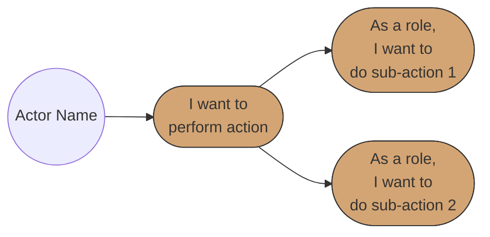

# BRS (Business Requirements Specification) Skill

**Version**: 1.0
**Created**: 2025-01-05
**Purpose**: Guide the creation of Business Requirements Specification documents using the standardized BRS template

---

## Skill Overview

This skill enables agents to create comprehensive Business Requirements Specification (BRS) documents following a standardized template. It provides structured guidance for requirements elicitation, documentation, and validation.

## When to Use This Skill

- Creating new BRS documents from scratch
- Converting informal requirements into structured BRS
- Conducting requirements gathering sessions
- Documenting epics, user stories, and scenarios
- Creating use case diagrams for requirements visualization

---

## Template Location

**BRS Template**: `templates/BRS_Template.md`

---

## BRS Creation Process

### Step 1: Initialize Document

Create a new BRS document with metadata:

```markdown
# Business Requirements Specification (BRS)

## Document Metadata

| Attribute | Value |
|-----------|-------|
| Document Title | [Project Name] Requirements Specification |
| Version | 1.0 |
| Last Updated | [Current Date] |
| Author | [Author Name / Team] |
| Reviewed By | [Reviewer Names] |
| Status | Draft |
```

### Step 2: Define Introduction

Capture the business context:

**Purpose**: Why does this system/feature exist?
- Business problem being solved
- Business value/ROI expected

**Scope**: What is included and excluded?
- System boundaries
- Integration points
- Out-of-scope items

**System Overview**: High-level description
- Key capabilities
- How it fits with existing systems

### Step 3: Identify Stakeholders

Create stakeholder matrix:

| Role | Name | Responsibility |
|------|------|----------------|
| Business Owner | [Name] | Final approval and funding |
| Product Owner | [Name] | Requirements prioritization |
| End Users | [Group] | Primary system users |
| Technical Lead | [Name] | Technical feasibility |

### Step 4: Define Epics

For each major functional area:

```markdown
## Epic [N]: [Epic Name]

**Epic ID:** EPIC-00[N]
**Description:** [What this epic delivers]
**Business Value:** [Why it matters to the business]
```

### Step 5: Create Use Case Diagrams

For each epic, create a Mermaid use case diagram:



**Diagram Standards:**
- Use `((Actor Name))` for actors (circle notation)
- Use `([Use Case Text])` for use cases (stadium/rounded rectangle)
- Use `fill:#d4a574` for consistent orange coloring
- Include `\n` for line breaks in use case text
- Show hierarchy with arrows from main use case to sub-use cases

### Step 6: Write User Stories

For each use case, create detailed user stories:

```markdown
#### User Story [N]: [Title]

**User Story:**
> As a [role/persona],
> I want to [action/feature],
> So that [benefit/value].

**Pre-conditions:**
- [What must be true before this story executes]

**Positive Scenario: [Happy Path Name]**
1. [Step 1 - User action]
2. [Step 2 - System response]
3. [Step 3 - Continue flow]
4. [Step 4 - Expected outcome]

**Negative Scenario: [Error Path Name]**
1. [Step 1 - User action with invalid input]
2. [Step 2 - System validation]
3. [Step 3 - Error message displayed]
4. [Step 4 - User guided to resolution]

**Edge Case: [Edge Case Name]**
1. [Step 1 - Unusual but valid condition]
2. [Step 2 - System handles gracefully]
3. [Step 3 - Expected outcome]

**Post-conditions:**
- [What is true after successful execution]

**Acceptance Criteria:**
- [ ] [Specific, testable criterion 1]
- [ ] [Specific, testable criterion 2]
- [ ] Error messages MUST be clear and actionable
- [ ] The system MUST handle connectivity issues gracefully
```

### Step 7: Define API References

List APIs that will be referenced in specifications:

```markdown
## API Definitions

- **AuthenticationAPI**: Handles user authentication and session management
- **ValidationAPI**: Handles input validation and data sanitization
- **NotificationAPI**: Manages system notifications and alerts
- **FrontendUI**: User interface components
```

### Step 8: Create Traceability Matrix

Link business requirements to user stories:

| Business Requirement | User Story Reference | Priority |
|---------------------|---------------------|----------|
| [Requirement 1] | EPIC1-US1, US2 | Critical |
| [Requirement 2] | EPIC2-US1 | High |

### Step 9: Document Non-Functional Requirements

**Performance:**
| Requirement | Specification |
|-------------|---------------|
| Response Time | < 2 seconds for 95th percentile |
| Throughput | 1000 requests per second |
| Concurrent Users | 500 simultaneous users |

**Security:**
- Authentication requirements
- Authorization requirements
- Data encryption requirements

**Availability:**
| Metric | Target |
|--------|--------|
| Uptime | 99.9% |
| RTO | 4 hours |
| RPO | 1 hour |

**Scalability:**
- Horizontal scaling requirements
- Expected growth projections

**Compliance:**
- GDPR, POPIA, SOC2, etc.

### Step 10: Document Constraints

| Constraint Type | Description |
|-----------------|-------------|
| Budget | [Budget limits] |
| Timeline | [Deadline constraints] |
| Technology | [Technology restrictions] |
| Resources | [Team/skill constraints] |
| Regulatory | [Legal/compliance constraints] |

### Step 11: Identify Assumptions and Risks

**Assumptions:**
| ID | Assumption | Impact if Invalid |
|----|------------|-------------------|
| A1 | [Assumption] | [Impact] |

**Risks:**
| ID | Risk | Probability | Impact | Mitigation |
|----|------|-------------|--------|------------|
| R1 | [Risk] | High/Medium/Low | High/Medium/Low | [Strategy] |

### Step 12: Create Glossary

| Term | Definition |
|------|------------|
| [Domain term] | [Clear definition] |

### Step 13: Prepare Sign-Off

| Role | Name | Signature | Date |
|------|------|-----------|------|
| Business Owner | | | |
| Product Owner | | | |
| Technical Lead | | | |

---

## Quality Checklist

Before finalizing a BRS, verify:

### Completeness
- [ ] All sections from template are present
- [ ] Each epic has at least 2 user stories
- [ ] Each user story has positive, negative, and edge case scenarios
- [ ] All acceptance criteria are documented
- [ ] Non-functional requirements are quantified
- [ ] Risks and assumptions are documented

### Consistency
- [ ] User story format is consistent throughout
- [ ] Terminology is consistent (use glossary terms)
- [ ] Epic numbering is sequential
- [ ] User story IDs follow pattern (EPIC[N]-US[N])

### Testability
- [ ] All acceptance criteria can be tested
- [ ] Scenarios provide clear pass/fail conditions
- [ ] Non-functional requirements have measurable targets

### Traceability
- [ ] Each requirement maps to at least one user story
- [ ] Traceability matrix is complete
- [ ] No orphan requirements or user stories

---

## Interview Question Bank

### Business Context Questions
1. What business problem are we solving?
2. What is the expected ROI or business value?
3. Who are the primary users of this system?
4. What existing systems does this integrate with?
5. What are the critical success factors?

### User Story Elicitation Questions
1. Who is the user performing this action?
2. What action do they want to perform?
3. Why do they want to perform this action?
4. What happens if they provide invalid input?
5. What edge cases might occur?
6. What must be true before they can do this?
7. What is true after successful completion?

### Non-Functional Requirements Questions
1. How fast must the system respond?
2. How many concurrent users are expected?
3. What is the required uptime?
4. What security standards apply?
5. What compliance requirements exist?
6. How should the system scale?

### Risk Identification Questions
1. What could prevent successful delivery?
2. What dependencies exist on external systems?
3. What assumptions are we making?
4. What happens if those assumptions are wrong?

---

## Staging Protocol

All BRS artifacts must be staged before finalization:

```
.claude/staging/staging_X/
├── brs_draft_v1.md
├── brs_draft_v2.md
├── epics_v1.md
├── user_stories_v1.md
├── use_case_diagrams_v1.mermaid
├── traceability_v1.md
└── risks_v1.md
```

### Version Progression
1. Create initial draft (v1)
2. Present for review
3. Incorporate feedback (v2, v3...)
4. Get approval
5. Move to final location

---

## Output Locations

| Artifact | Location |
|----------|----------|
| BRS Documents | `specs/` or `docs/requirements/` |
| BRS Template | `templates/BRS_Template.md` |
| Staged Drafts | `.claude/staging/staging_X/` |

---

## Related Skills

- **HLD_LLD_Naming_Convention.skill.md**: For naming BRS documents consistently
- **HATEOAS_Relational_Design.skill.md**: For API-related requirements
- **project_planning_skill.md**: For project-level planning that references BRS

---

## Version History

- v1.0 (2025-01-05): Initial BRS skill definition
