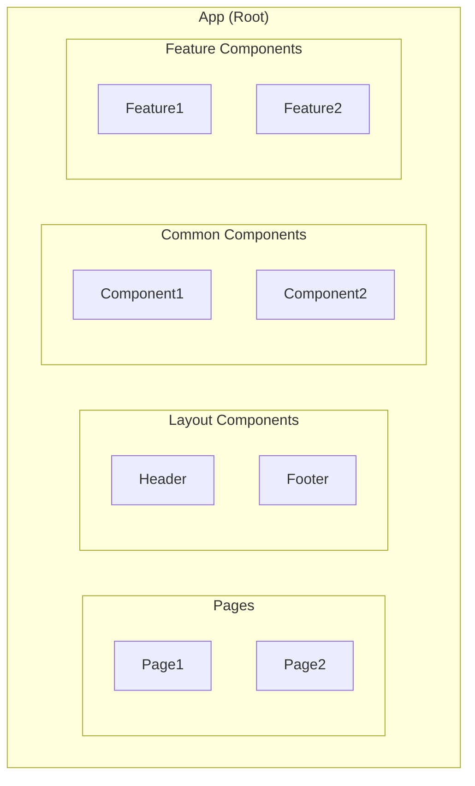
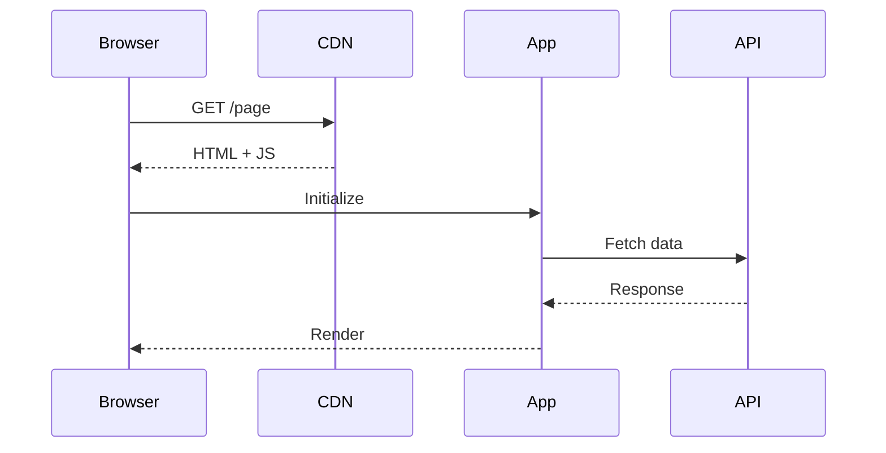
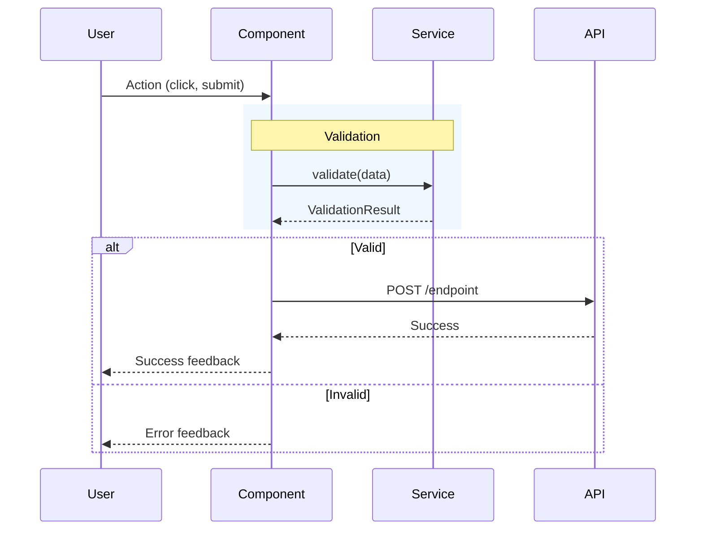
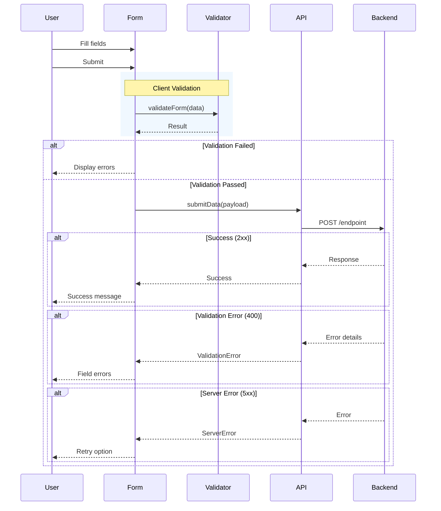

# Frontend LLD Template

**Version**: 1.0
**Created**: 2026-01-03
**Type**: Low-Level Design Template
**Domain**: Frontend / Web Applications

---

## Template Usage

This template is designed for creating Low-Level Design documents for frontend applications (React, Vue, Angular, etc.). Copy this template and fill in the sections relevant to your project.

---

# [Project Name] - Frontend Low-Level Design

**Version**: X.X
**Created**: YYYY-MM-DD
**Updated**: YYYY-MM-DD
**Status**: Draft | Active | Deprecated
**Component**: [Component Name]
**Parent HLD**: [Link to HLD]

---

## Document Control

| Version | Date | Author | Changes |
|---------|------|--------|---------|
| 1.0 | YYYY-MM-DD | [Author] | Initial version |

---

## Table of Contents

1. [Introduction](#1-introduction)
2. [Technology Stack & Libraries](#2-technology-stack--libraries)
3. [Field Mapping](#3-field-mapping)
4. [UI Component Diagram](#4-ui-component-diagram)
5. [Screens](#5-screens)
6. [Screen Rules](#6-screen-rules)
7. [Sequence Diagrams](#7-sequence-diagrams)
8. [Dependency APIs](#8-dependency-apis)
9. [User Stories](#9-user-stories)
10. [Data Models](#10-data-models)
11. [Messaging and Notifications](#11-messaging-and-notifications)
12. [NFRs](#12-nfrs)
13. [Risks and Mitigations](#13-risks-and-mitigations)
14. [Security](#14-security)
15. [Troubleshooting Playbook](#15-troubleshooting-playbook)
16. [References](#16-references)

---

## 1. Introduction

### 1.1 Purpose

[Describe the purpose of this frontend application and what problem it solves]

### 1.2 Component Overview

| Attribute | Value |
|-----------|-------|
| Repository | `[repo-name]` |
| Technology | [React/Vue/Angular] [version], TypeScript, [build-tool] |
| State Management | [Redux/Context/Vuex/etc.] |
| Styling | [CSS Modules/Tailwind/Styled Components] |
| API Client | [Axios/Fetch/etc.] |
| Testing | [Jest/Vitest], [Testing Library] |

---

## 2. Technology Stack & Libraries

### 2.1 Production Dependencies

| Library | Version | Purpose |
|---------|---------|---------|
| [library-name] | ^X.X.X | [purpose] |

### 2.2 Development Dependencies

| Library | Version | Purpose |
|---------|---------|---------|
| [library-name] | ^X.X.X | [purpose] |

### 2.3 Runtime Requirements

| Requirement | Minimum Version |
|-------------|-----------------|
| Node.js | >= X.X.X |
| npm/yarn | >= X.X.X |

---

## 3. Field Mapping

### 3.1 Frontend Form → Backend API Field Mapping

| Frontend Field | Frontend Type | Backend Field | Backend Type | Validation | Required |
|----------------|---------------|---------------|--------------|------------|----------|
| `fieldName` | string | `backendField` | string | [rules] | ✅/❌ |

### 3.2 Entity Mapping (if applicable)

| Frontend Type | Backend Type | Notes |
|---------------|--------------|-------|
| [FrontendEntity] | [BackendEntity] | [transformation notes] |

### 3.3 Payload Transformation Example

```typescript
// Frontend Data
{
  // frontend structure
}

// Backend Request
{
  // backend structure
}
```

---

## 4. UI Component Diagram

### 4.1 Component Hierarchy



### 4.2 Component Specifications

| Component | Props | State | Purpose |
|-----------|-------|-------|---------|
| `ComponentName` | prop1, prop2 | state1 | [description] |

---

## 5. Screens

### 5.1 [Screen Name]


**Purpose**: [What this screen does]

**Components Used**:
- Component1
- Component2
- Component3

**Entry Points**:
- [How user reaches this screen]

**Exit Points**:
- [Where user can go from this screen]

---

## 6. Screen Rules

### 6.1 Navigation Rules

| Current Screen | Action | Target Screen | Condition |
|----------------|--------|---------------|-----------|
| Screen1 | Click "Button" | Screen2 | [condition] |

### 6.2 Form Validation Rules

| Field | Rule | Error Message |
|-------|------|---------------|
| fieldName | Required, [other rules] | "Error message text" |

### 6.3 Button State Rules

| Button | Enabled When | Loading When | Disabled When |
|--------|--------------|--------------|---------------|
| ButtonName | [condition] | [condition] | [condition] |

### 6.4 Error Display Rules

| Error Type | Display Location | Duration | Action |
|------------|------------------|----------|--------|
| Field validation | Below field | Until corrected | Focus field |
| API error (4xx) | Toast + field | 5 seconds | Highlight field |
| Network error | Toast | Until dismissed | Show retry |
| Server error (5xx) | Full screen | Until dismissed | Show retry |

### 6.5 Loading State Rules

| Scenario | Component | Duration |
|----------|-----------|----------|
| Page load | Spinner | Until hydrated |
| Form submit | Button spinner | Until API response |

---

## 7. Sequence Diagrams

### 7.1 Screen Load Sequence



### 7.2 User Action Sequence



### 7.3 Form Submission Sequence



---

## 8. Dependency APIs

### 8.1 API Endpoints Summary

| API | Base URL | Endpoint | Method | Purpose |
|-----|----------|----------|--------|---------|
| [API Name] | `https://api.example.com` | `/path` | GET/POST | [purpose] |

### 8.2 Environment Configuration

| Environment | API Base URL | Notes |
|-------------|--------------|-------|
| DEV | `https://api.dev.example.com` | Development |
| SIT | `https://api.sit.example.com` | System Integration |
| PROD | `https://api.example.com` | Production |

### 8.3 API Authentication

| Header | Value | Required |
|--------|-------|----------|
| `X-Api-Key` | [key] | ✅ |
| `Authorization` | Bearer [token] | ✅/❌ |
| `Content-Type` | `application/json` | ✅ |

### 8.4 Error Response Format

```typescript
interface ApiError {
  error: string;
  errorCode: string;
  details?: {
    field: string;
    [key: string]: unknown;
  };
}
```

---

## 9. User Stories

| Story # | Epic | User Story | Test Scenario |
|---------|------|------------|---------------|
| US-001 | [Epic] | As a [user], I want to [action] | Given [context], then [outcome] |

---

## 10. Data Models

### 10.1 Frontend Types

```typescript
// Define TypeScript interfaces
interface EntityName {
  field1: string;
  field2: number;
  field3?: boolean;
}
```

---

## 11. Messaging and Notifications

### 11.1 Toast/Notification Messages

| Event | Type | Message |
|-------|------|---------|
| Success | Success | "Action completed successfully" |
| Error | Error | "Something went wrong" |

---

## 12. NFRs

### 12.1 Performance Targets

| Metric | Target |
|--------|--------|
| First Contentful Paint (FCP) | < 1.5s |
| Largest Contentful Paint (LCP) | < 2.5s |
| Bundle Size (gzipped) | < XXkB |
| Time to Interactive (TTI) | < 3.0s |

### 12.2 Browser Support

| Browser | Minimum Version |
|---------|-----------------|
| Chrome | 90+ |
| Firefox | 88+ |
| Safari | 14+ |
| Edge | 90+ |

---

## 13. Risks and Mitigations

| Risk | Impact | Probability | Mitigation |
|------|--------|-------------|------------|
| [Risk description] | High/Medium/Low | High/Medium/Low | [Mitigation strategy] |

---

## 14. Security

### 14.1 Data Protection

- [Security measure 1]
- [Security measure 2]

### 14.2 CORS Configuration

```
Access-Control-Allow-Origin: [origins]
Access-Control-Allow-Headers: [headers]
Access-Control-Allow-Methods: [methods]
```

---

## 15. Troubleshooting Playbook

### 15.1 Common Issues

| Issue | Symptoms | Resolution |
|-------|----------|------------|
| [Issue] | [Symptoms] | [Resolution steps] |

### 15.2 Debug Mode

```javascript
// Enable debug mode
localStorage.setItem('DEBUG', 'true');
```

---

## 16. References

- [Parent HLD](link)
- [Framework Documentation](link)
- [API Documentation](link)

---

**End of Document**
