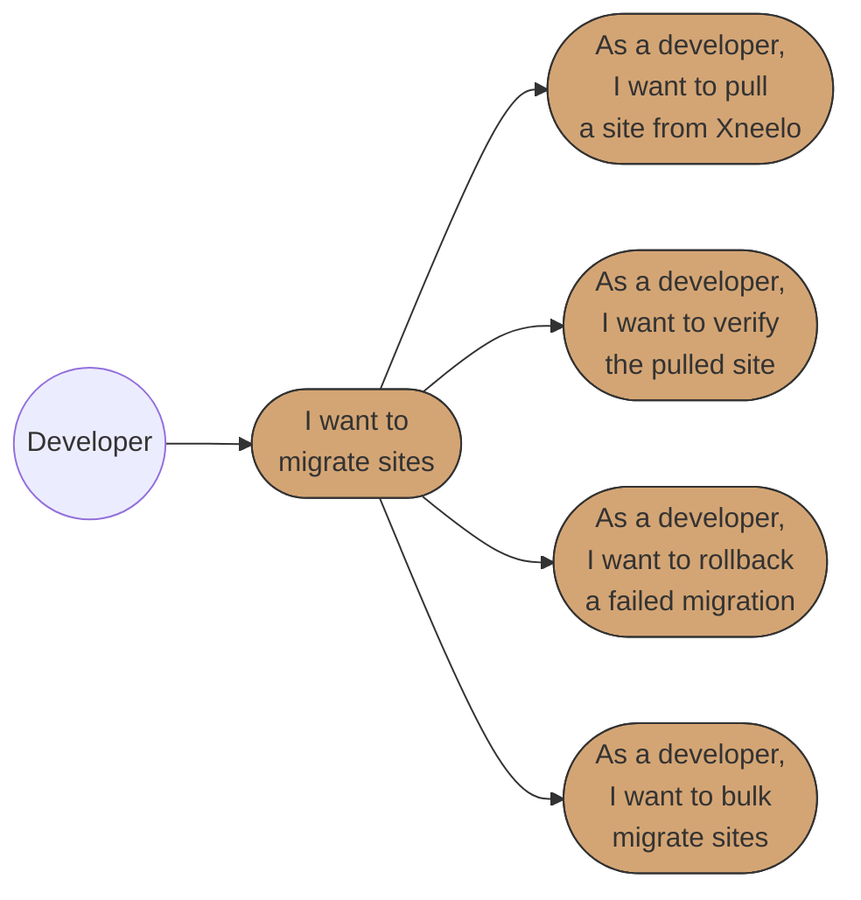
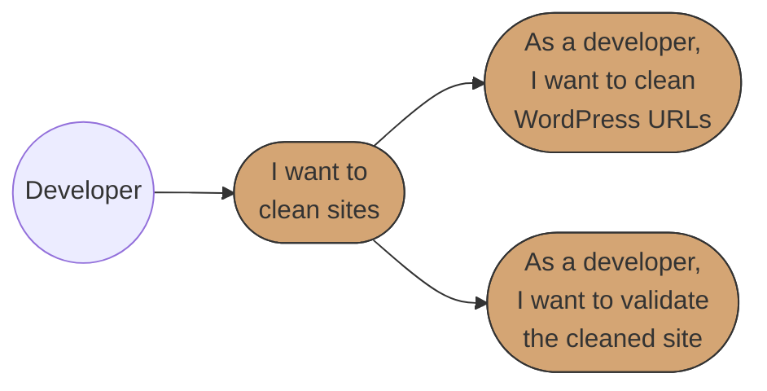
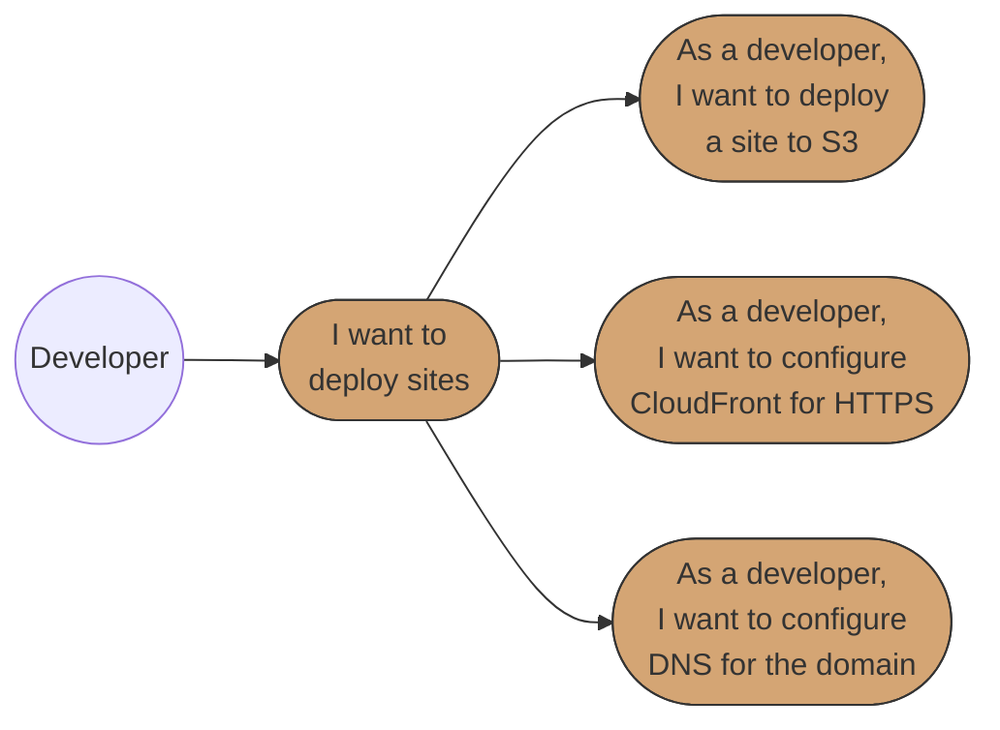
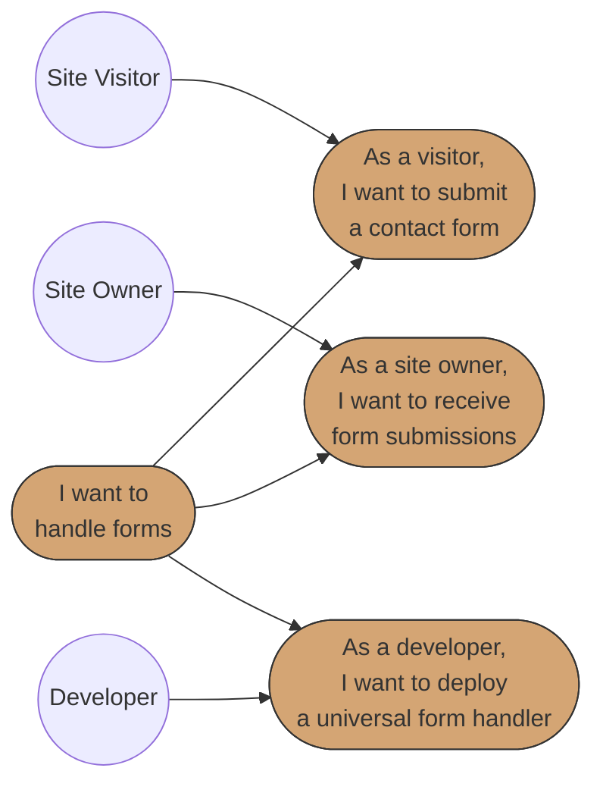

# Business Requirements Specification (BRS)
# BBWS Site Migration

## Document Metadata

| Attribute | Value |
|-----------|-------|
| Document Title | BBWS Site Migration Requirements Specification |
| Version | 1.0 |
| Last Updated | 2026-01-05 |
| Author | Business Analyst Agent |
| Reviewed By | [Pending Review] |
| Status | Draft |
| Related HLD | 1.0_BBWS_Migration_HLD.md |
| Phase | 1 (Migration) |

---

## 1. Introduction

### 1.1 Purpose

This document specifies the comprehensive business requirements for the BBWS Site Migration project, which migrates 40 customer websites from Xneelo hosting to AWS infrastructure.

**Problem Statement:** Big Beard Web Solutions (BBWS) currently faces challenges with their Xneelo-hosted customer websites in terms of cost, performance, scale, and operational complexity. The manual nature of website deployment and management results in time-to-market measured in days rather than minutes, limiting business agility and customer self-service capabilities.

**Solution:** Migrate customer websites to AWS serverless infrastructure (S3 + CloudFront) with automated form submission handling, enabling cost reduction, faster deployment, and simplified operations.

**Business Value:**
- Cost Reduction: Lower hosting costs through AWS serverless and pay-per-use pricing
- Performance Improvement: Leverage AWS CloudFront CDN for faster content delivery
- Simplified Operations: Streamline architecture for easier management
- Scalability: Enable auto-scaling to handle traffic growth
- Time-to-Market: Reduce deployment time from days to minutes

### 1.2 Scope

**In Scope:**
- Migration of 40 customer websites from Xneelo to AWS
- Static websites and WordPress sites (converted to static)
- S3 static hosting with versioning
- CloudFront CDN distribution with HTTPS
- Universal form submission handling (Lambda + DynamoDB + SES)
- DNS migration and cutover strategy
- Local migration utilities (Python scripts)

**Out of Scope:**
- Email hosting migration
- Database migration (MySQL/MariaDB)
- Application code rewrites
- Dynamic WordPress functionality (PHP execution)
- CMS features (content editing)

### 1.3 System Overview

The BBWS Site Migration system consists of:

1. **Migration Utilities (Local)**: Python scripts for pulling, cleaning, and deploying sites
2. **Static Hosting (AWS)**: S3 buckets for website storage with CloudFront CDN
3. **Form Processing (AWS)**: API Gateway + Lambda + DynamoDB + SES for form submissions
4. **Certificate Management (AWS)**: ACM for SSL/TLS certificates
5. **DNS Management**: Xneelo DNS updates pointing to CloudFront distributions

### 1.4 Use Case Diagrams

#### Epic 1: Site Migration

#### Epic 2: Site Cleanup

#### Epic 3: Site Deployment

#### Epic 4: Form Submission Handling

**Diagram Legend:**
- **Circle (( ))**: Actor/Role initiating use cases
- **Rounded rectangle ([ ])**: Use case in user story format
- **Solid arrows**: Actor initiates use case or use case hierarchy

### 1.5 Traceability Matrix

| Business Requirement | User Story Reference | Priority |
|---------------------|---------------------|----------|
| Migrate 40 sites from Xneelo to AWS | US-001, US-002, US-005 | Critical |
| Reduce hosting costs | US-005, US-006 | High |
| Enable HTTPS on all sites | US-006, US-007 | Critical |
| Maintain form submission functionality | US-008, US-009, US-010 | High |
| Maintain uptime during migration | US-007, US-011 | Critical |
| Enable rollback capability | US-005, US-011 | High |
| Support bulk migration | US-012 | Medium |

---

## 2. Stakeholders

| Role | Name | Responsibility |
|------|------|----------------|
| Architect | BBWS Architect | Technical design and implementation oversight |
| Executive Sponsor | BBWS Management | Business approval and budget authority |
| Sales Lead | BBWS Sales | Customer communication and migration coordination |
| Developers | BBWS Developers | Implementation and operations team |
| Site Owners | Customers | Website content owners |
| Site Visitors | General Public | End users visiting migrated websites |

---

## 3. API Definitions

The following APIs and components are referenced throughout this specification:

- **SiteMigrator**: Local Python script for pulling websites from Xneelo via HTTP
- **SiteCleaner**: Local Python script for cleaning WordPress URLs and fixing paths
- **SiteDeployer**: Local Python script for deploying sites to S3
- **CertificateManager**: Local Python script for ACM certificate management
- **CloudFrontManager**: Local Python script for CloudFront distribution management
- **FormSubmissionAPI**: API Gateway REST endpoint for form submissions
- **FormSubmissionHandler**: Lambda function for processing form submissions
- **SES**: Amazon Simple Email Service for sending form notifications
- **DynamoDB Forms Table**: Storage for form submission records

---

## Epic 1: Site Migration

**Epic ID:** EPIC-001
**Description:** Pull and prepare customer websites from Xneelo hosting for migration to AWS
**Business Value:** Enable systematic extraction of all 40 customer websites with verification, ensuring no content is lost during migration

### Use Case 1.1: Pull Website from Xneelo

#### User Story 1: Pull Website Using Configuration File

**User Story:**
> As a developer,
> I want to pull a website from Xneelo using a configuration file,
> So that I can migrate it to AWS with consistent settings.

**Pre-conditions:**
- Xneelo hosting credentials are available
- Configuration file exists with site details (URL, auth, output directory)
- Local workstation has Python and required dependencies installed
- Sufficient disk space for site content

**Positive Scenario: Successful Site Pull**

1. Developer creates configuration file with site URL, authentication credentials, and output directory
2. Developer executes SiteMigrator script with configuration file path
3. SiteMigrator validates configuration file format and required fields
4. SiteMigrator initiates HTTP connection to Xneelo site
5. SiteMigrator traverses folder structure recursively, downloading all files
6. SiteMigrator logs progress to console and local log file
7. SiteMigrator completes download and displays summary (files downloaded, size, duration)

**Negative Scenario: Authentication Failure**

1. Developer executes SiteMigrator with configuration file
2. SiteMigrator attempts to connect to Xneelo site
3. Xneelo returns 401 Unauthorized error
4. SiteMigrator logs error: "Authentication failed for site [site_url]"
5. SiteMigrator displays error message with troubleshooting steps
6. Developer verifies credentials in configuration file and retries

**Negative Scenario: Network Failure**

1. Developer executes SiteMigrator script
2. SiteMigrator attempts to connect to Xneelo site
3. Connection times out or network error occurs
4. SiteMigrator logs error with timestamp and error details
5. SiteMigrator provides retry option with exponential backoff
6. Developer checks network connectivity and retries

**Edge Case: Large Site (>1GB)**

1. Developer executes SiteMigrator for a large site
2. SiteMigrator detects site size exceeds 1GB threshold
3. SiteMigrator enables chunked download mode with progress tracking
4. SiteMigrator implements resume capability in case of interruption
5. SiteMigrator logs progress at regular intervals (every 100 files or 100MB)
6. Site download completes successfully with verification

**Edge Case: Site with Special Characters in URLs**

1. Developer executes SiteMigrator for site with special characters
2. SiteMigrator properly encodes/decodes URL characters
3. SiteMigrator preserves original file names on local filesystem
4. SiteMigrator handles Unicode characters in file paths
5. Download completes with all files correctly named

**Post-conditions:**
- All site files are downloaded to local directory
- Directory structure matches source site
- Log file contains download summary
- No files are corrupted or missing

**Acceptance Criteria:**
- [ ] Configuration file validates required fields (url, auth, output_dir)
- [ ] All site files are downloaded with correct directory structure
- [ ] Progress is logged to console and log file
- [ ] Download can be resumed after interruption
- [ ] Large sites (>1GB) are handled with chunked downloads
- [ ] Error messages MUST be clear and actionable
- [ ] The system MUST handle network failures with retry mechanism

---

#### User Story 2: Verify Pulled Site Locally

**User Story:**
> As a developer,
> I want to verify the pulled site locally,
> So that I can confirm all files were retrieved before proceeding.

**Pre-conditions:**
- Site has been pulled to local directory
- SiteMigrator script completed successfully

**Positive Scenario: Successful Verification**

1. Developer executes verification command on downloaded site directory
2. SiteMigrator scans local directory structure
3. SiteMigrator counts total files by type (HTML, CSS, JS, images, other)
4. SiteMigrator validates HTML files for basic structure
5. SiteMigrator checks for missing linked resources (CSS, JS, images)
6. SiteMigrator generates verification report with file inventory
7. Developer reviews report and confirms site is complete

**Negative Scenario: Missing Assets**

1. Developer executes verification on downloaded site
2. SiteMigrator parses HTML files and extracts resource links
3. SiteMigrator identifies missing CSS/JS/image files
4. SiteMigrator generates error report listing missing assets
5. Developer reviews missing files and re-pulls specific assets
6. Verification is re-run until all assets are present

**Edge Case: Corrupted Files**

1. Developer executes verification on downloaded site
2. SiteMigrator checks file integrity (non-zero size, valid format)
3. SiteMigrator identifies corrupted or truncated files
4. SiteMigrator logs corrupted files with details
5. Developer re-downloads corrupted files individually
6. Verification confirms all files are valid

**Post-conditions:**
- Verification report is generated
- All missing/corrupted files are identified
- Site is ready for cleanup phase

**Acceptance Criteria:**
- [ ] Verification scans all files in directory structure
- [ ] Missing linked resources are identified by parsing HTML
- [ ] File count summary is provided by type
- [ ] Corrupted files are detected (zero-size, invalid format)
- [ ] Report is generated in human-readable format
- [ ] Error messages MUST be clear and actionable
- [ ] The system MUST identify all missing dependencies

---

#### User Story 3: Rollback Failed Migration

**User Story:**
> As a developer,
> I want to rollback a failed migration,
> So that I can restore the previous working state and minimize downtime.

**Pre-conditions:**
- Site was previously migrated to S3
- S3 versioning is enabled on the bucket
- Migration failure has been identified

**Positive Scenario: Successful Rollback**

1. Developer identifies migration failure (broken site, missing files)
2. Developer executes rollback command with site identifier
3. SiteDeployer lists available versions from S3 versioning
4. Developer selects previous working version
5. SiteDeployer restores files from selected version
6. SiteDeployer invalidates CloudFront cache
7. Site is restored to previous working state

**Negative Scenario: No Previous Version Available**

1. Developer attempts rollback on newly deployed site
2. SiteDeployer checks S3 versioning history
3. No previous versions exist (first deployment)
4. SiteDeployer displays error: "No previous versions available"
5. Developer must revert DNS to Xneelo as fallback
6. System logs the rollback attempt

**Edge Case: Partial Version Restore**

1. Developer initiates rollback
2. Only some files have previous versions (mixed deployment)
3. SiteDeployer identifies files without previous versions
4. SiteDeployer restores available versions and reports gaps
5. Developer manually handles files without versions
6. Rollback completes with partial restoration

**Post-conditions:**
- Site is restored to previous working version
- CloudFront cache is invalidated
- Rollback is logged for audit purposes

**Acceptance Criteria:**
- [ ] S3 versioning provides rollback capability
- [ ] Previous versions are listed for developer selection
- [ ] CloudFront cache is automatically invalidated after rollback
- [ ] Rollback completes within 15 minutes
- [ ] Partial rollbacks are handled gracefully
- [ ] Error messages MUST be clear and actionable
- [ ] The system MUST log all rollback operations for audit

---

#### User Story 4: Bulk Migrate Multiple Sites

**User Story:**
> As a developer,
> I want to bulk migrate multiple sites,
> So that I can efficiently process all 40 sites without manual intervention.

**Pre-conditions:**
- Configuration files exist for all sites to migrate
- Local workstation has sufficient resources
- Batch configuration file lists all sites

**Positive Scenario: Successful Bulk Migration**

1. Developer creates batch configuration file listing all site configurations
2. Developer executes bulk migration command with batch file
3. SiteMigrator reads batch configuration
4. SiteMigrator processes sites sequentially (to manage resources)
5. For each site: pull, verify, clean, deploy
6. SiteMigrator logs progress after each site completion
7. SiteMigrator generates summary report of all migrations

**Negative Scenario: Single Site Failure in Batch**

1. Developer executes bulk migration
2. SiteMigrator processes sites sequentially
3. One site fails during pull phase
4. SiteMigrator logs failure and continues to next site
5. Failed site is added to retry queue
6. Bulk migration completes with partial success
7. Developer manually retries failed sites

**Edge Case: Resource Exhaustion**

1. Developer executes bulk migration
2. Disk space becomes insufficient mid-batch
3. SiteMigrator detects low disk space
4. SiteMigrator pauses migration and alerts developer
5. Developer frees disk space
6. Migration resumes from last checkpoint

**Post-conditions:**
- All sites in batch are processed
- Failed sites are logged separately
- Summary report shows success/failure count

**Acceptance Criteria:**
- [ ] Batch configuration file specifies all site configs
- [ ] Sites are processed sequentially to manage resources
- [ ] Individual site failures do not halt entire batch
- [ ] Progress is logged after each site
- [ ] Summary report includes success/failure counts
- [ ] Error messages MUST be clear and actionable
- [ ] The system MUST handle resource exhaustion gracefully

---

## Epic 2: Site Cleanup

**Epic ID:** EPIC-002
**Description:** Clean WordPress sites by converting absolute URLs to relative paths for static hosting compatibility
**Business Value:** Ensure migrated WordPress sites function correctly as static sites on AWS without requiring WordPress backend

### Use Case 2.1: Clean WordPress URLs

#### User Story 5: Clean WordPress Absolute URLs

**User Story:**
> As a developer,
> I want to clean WordPress absolute URLs,
> So that the site works correctly on AWS static hosting.

**Pre-conditions:**
- Site has been pulled and verified locally
- Site contains WordPress-generated content with absolute URLs

**Positive Scenario: Successful URL Cleanup**

1. Developer executes SiteCleaner with site directory path
2. SiteCleaner scans all HTML, CSS, and JS files
3. SiteCleaner identifies absolute URLs pointing to Xneelo domain
4. SiteCleaner replaces absolute paths with relative paths
5. SiteCleaner removes WordPress plugin dependencies (PHP references)
6. SiteCleaner fixes hardcoded domain references
7. SiteCleaner logs all changes to cleanup report
8. Cleaned site is ready for deployment

**Negative Scenario: Invalid HTML Structure**

1. Developer executes SiteCleaner on site directory
2. SiteCleaner encounters malformed HTML files
3. SiteCleaner logs warning for each malformed file
4. SiteCleaner attempts best-effort cleanup
5. SiteCleaner flags files requiring manual review
6. Developer manually fixes problematic files

**Edge Case: Multi-Domain Site**

1. Developer executes SiteCleaner on site with multiple domains
2. SiteCleaner configuration includes list of domains to process
3. SiteCleaner replaces URLs from all configured domains
4. SiteCleaner handles subdomain variations
5. Cleanup completes with all domains processed

**Edge Case: Minified Files**

1. Developer executes SiteCleaner
2. SiteCleaner detects minified CSS/JS files
3. SiteCleaner processes minified files carefully
4. SiteCleaner maintains minification after changes
5. File functionality is preserved

**Post-conditions:**
- All absolute URLs are converted to relative paths
- WordPress PHP references are removed
- Site is ready for static hosting

**Acceptance Criteria:**
- [ ] All HTML, CSS, JS files are scanned
- [ ] Absolute URLs to source domain are converted to relative
- [ ] WordPress plugin PHP references are removed
- [ ] Cleanup report lists all changes made
- [ ] Original files are backed up before modification
- [ ] Error messages MUST be clear and actionable
- [ ] The system MUST preserve file encoding and line endings

---

#### User Story 6: Validate Cleaned Site Locally

**User Story:**
> As a developer,
> I want to validate the cleaned site locally,
> So that I can ensure it will function properly before deployment.

**Pre-conditions:**
- Site has been cleaned by SiteCleaner
- Local web server available for testing

**Positive Scenario: Successful Local Validation**

1. Developer starts local HTTP server in cleaned site directory
2. Developer opens site in browser at localhost
3. SiteCleaner runs validation checks on site
4. SiteCleaner verifies all internal links resolve correctly
5. SiteCleaner checks CSS and JS files load without errors
6. SiteCleaner validates image paths are accessible
7. Developer manually tests key pages
8. Site passes validation and is ready for deployment

**Negative Scenario: Broken Internal Links**

1. Developer runs validation on cleaned site
2. SiteCleaner identifies broken internal links
3. SiteCleaner generates report of broken links with source pages
4. Developer investigates and fixes broken links
5. Validation is re-run until all links work

**Edge Case: JavaScript Errors**

1. Developer runs validation on cleaned site
2. SiteCleaner detects JavaScript console errors
3. Errors are logged with file and line number
4. Developer reviews and fixes JavaScript issues
5. Validation confirms no console errors

**Post-conditions:**
- Site is validated for static hosting
- All links and resources work correctly
- Site is approved for deployment

**Acceptance Criteria:**
- [ ] Local HTTP server can serve the site
- [ ] All internal links are verified as working
- [ ] CSS and JS files load without errors
- [ ] Images display correctly
- [ ] No JavaScript console errors
- [ ] Error messages MUST be clear and actionable
- [ ] The system MUST provide detailed validation report

---

## Epic 3: Site Deployment

**Epic ID:** EPIC-003
**Description:** Deploy cleaned sites to AWS infrastructure with S3, CloudFront, and DNS configuration
**Business Value:** Provide secure, fast, scalable hosting for customer websites with HTTPS and global CDN distribution

### Use Case 3.1: Deploy Site to S3

#### User Story 7: Deploy Cleaned Site to S3

**User Story:**
> As a developer,
> I want to deploy a cleaned site to S3,
> So that it is hosted on AWS infrastructure.

**Pre-conditions:**
- Site has been cleaned and validated locally
- S3 bucket exists or can be created
- AWS credentials are configured

**Positive Scenario: Successful S3 Deployment**

1. Developer executes SiteDeployer with site directory and bucket name
2. SiteDeployer validates AWS credentials
3. SiteDeployer creates S3 bucket if not exists (with versioning enabled)
4. SiteDeployer creates folder structure matching site
5. SiteDeployer uploads all files with appropriate content types
6. SiteDeployer configures bucket for static website hosting
7. SiteDeployer logs upload progress and completion summary
8. Site is accessible via S3 website endpoint

**Negative Scenario: Permission Denied**

1. Developer executes SiteDeployer
2. SiteDeployer attempts S3 operations
3. AWS returns Access Denied error
4. SiteDeployer logs error with required permissions
5. Developer updates IAM policy and retries
6. Deployment succeeds with correct permissions

**Negative Scenario: Bucket Already Exists**

1. Developer executes SiteDeployer with new bucket name
2. Bucket name already exists (globally unique requirement)
3. SiteDeployer displays error: "Bucket name already exists"
4. Developer chooses different bucket name
5. Deployment succeeds with new bucket name

**Edge Case: Large File Upload Failure**

1. Developer deploys site with large media files
2. Upload fails for files exceeding threshold
3. SiteDeployer automatically switches to multipart upload
4. Large files are uploaded in chunks
5. All files are successfully deployed

**Post-conditions:**
- All site files are in S3 bucket
- S3 versioning is enabled
- Bucket is configured for static hosting
- OAC is configured for CloudFront access

**Acceptance Criteria:**
- [ ] S3 bucket is created with versioning enabled
- [ ] All files maintain correct directory structure
- [ ] Content types are set correctly (text/html, text/css, etc.)
- [ ] Large files use multipart upload
- [ ] Upload progress is logged
- [ ] Error messages MUST be clear and actionable
- [ ] The system MUST block public access to S3 bucket (CloudFront only)

---

#### User Story 8: Configure CloudFront for HTTPS

**User Story:**
> As a developer,
> I want to configure CloudFront for a site,
> So that it is accessible via HTTPS with CDN caching.

**Pre-conditions:**
- Site is deployed to S3
- Domain name is available
- DNS can be updated

**Positive Scenario: Successful CloudFront Configuration**

1. Developer executes CloudFrontManager with domain and S3 bucket
2. CloudFrontManager initiates ACM certificate request for domain
3. CloudFrontManager displays DNS validation records
4. Developer adds DNS validation records to Xneelo DNS
5. ACM certificate is issued after DNS validation
6. CloudFrontManager creates CloudFront distribution with S3 origin
7. CloudFrontManager configures OAC for secure S3 access
8. CloudFrontManager configures HTTP to HTTPS redirect
9. Distribution is deployed and accessible

**Negative Scenario: Certificate Validation Timeout**

1. Developer initiates CloudFront configuration
2. ACM certificate request is created
3. DNS validation records are not added in time
4. Certificate validation times out (72 hours)
5. CloudFrontManager logs timeout error
6. Developer must restart certificate request

**Edge Case: Pre-Production Environment**

1. Developer configures CloudFront for pre-prod environment
2. CloudFrontManager enables basic authentication
3. Credentials are configured for site access
4. Pre-prod site is protected from public access
5. Testing can proceed with authentication

**Post-conditions:**
- CloudFront distribution is created
- ACM certificate is issued and attached
- HTTPS is enforced
- S3 is only accessible via CloudFront (OAC)

**Acceptance Criteria:**
- [ ] ACM certificate is requested and validated
- [ ] CloudFront distribution uses S3 as origin
- [ ] OAC restricts direct S3 access
- [ ] HTTP automatically redirects to HTTPS
- [ ] Pre-prod environments have basic auth protection
- [ ] Error messages MUST be clear and actionable
- [ ] The system MUST wait for certificate validation before distribution creation

---

#### User Story 9: Configure DNS for Domain

**User Story:**
> As a developer,
> I want to configure DNS for a site,
> So that the domain points to CloudFront.

**Pre-conditions:**
- CloudFront distribution is created and deployed
- DNS management access is available (Xneelo)

**Positive Scenario: Successful DNS Configuration**

1. Developer obtains CloudFront distribution domain name
2. Developer accesses Xneelo DNS management
3. Developer creates CNAME record pointing to CloudFront
4. Developer verifies DNS propagation using lookup tools
5. DNS propagation completes (typically 5-15 minutes)
6. Site is accessible via custom domain
7. HTTPS works correctly with ACM certificate

**Negative Scenario: DNS Propagation Delay**

1. Developer updates DNS records
2. Propagation takes longer than expected (>1 hour)
3. Developer monitors propagation using multiple DNS tools
4. Some regions see old DNS while others see new
5. Eventually propagation completes globally
6. Site is accessible via custom domain

**Edge Case: Parallel Running (Xneelo and AWS)**

1. DNS currently points to Xneelo
2. Developer configures CloudFront but delays DNS switch
3. Both environments run in parallel for testing
4. Developer validates AWS site via CloudFront domain
5. When ready, DNS is updated to CloudFront
6. Xneelo continues as fallback during transition

**Post-conditions:**
- DNS records point to CloudFront
- Site is accessible via custom domain
- HTTPS works correctly

**Acceptance Criteria:**
- [ ] CNAME record is created pointing to CloudFront
- [ ] DNS propagation is verified before declaring success
- [ ] Parallel running is supported during transition
- [ ] Rollback to Xneelo DNS is documented
- [ ] TTL values are appropriate for migration
- [ ] Error messages MUST be clear and actionable
- [ ] The system MUST verify DNS resolution before migration complete

---

## Epic 4: Form Submission Handling

**Epic ID:** EPIC-004
**Description:** Enable universal form submission handling for all migrated static sites
**Business Value:** Maintain customer contact functionality on static sites by processing forms through serverless backend

### Use Case 4.1: Form Submission Processing

#### User Story 10: Submit Contact Form

**User Story:**
> As a site visitor,
> I want to submit a contact form,
> So that I can reach the site owner with my inquiry.

**Pre-conditions:**
- Site is deployed to AWS
- Form submission handler is deployed
- Form is configured with correct API endpoint

**Positive Scenario: Successful Form Submission**

1. Visitor navigates to contact page on migrated site
2. Visitor fills out contact form fields (name, email, message)
3. Visitor clicks Submit button
4. Form submits via HTTPS POST to API Gateway endpoint
5. API Gateway invokes FormSubmissionHandler Lambda
6. Lambda validates form data
7. Lambda stores submission in DynamoDB Forms table
8. Lambda triggers email notification via SES
9. Visitor sees confirmation message on page
10. Site owner receives email notification

**Negative Scenario: Invalid Form Data**

1. Visitor submits form with missing required fields
2. API Gateway receives request
3. Lambda validates and finds missing fields
4. Lambda returns 400 Bad Request with field errors
5. Form displays validation errors to visitor
6. Visitor corrects fields and resubmits

**Negative Scenario: API Gateway Error**

1. Visitor submits form
2. API Gateway experiences temporary error
3. Form receives 500 error response
4. Form displays user-friendly error message
5. Visitor is prompted to retry
6. Retry succeeds

**Edge Case: High Volume Submissions (Spam)**

1. Multiple form submissions received rapidly
2. API Gateway rate limiting triggers
3. Excess submissions receive 429 Too Many Requests
4. Legitimate submissions are queued and processed
5. System logs potential spam activity

**Post-conditions:**
- Form data is stored in DynamoDB
- Email notification is sent to site owner
- Visitor receives confirmation

**Acceptance Criteria:**
- [ ] Form submits via HTTPS to API Gateway
- [ ] Form data is validated (required fields, email format)
- [ ] Submission is stored in DynamoDB with timestamp
- [ ] Email notification is sent within 1 minute
- [ ] User-friendly error messages are displayed
- [ ] Error messages MUST be clear and actionable
- [ ] The system MUST handle high volume with rate limiting

---

#### User Story 11: Receive Form Submissions via Email

**User Story:**
> As a site owner,
> I want to receive form submissions via email,
> So that I can respond to customer inquiries promptly.

**Pre-conditions:**
- Form submission is stored in DynamoDB
- SES is configured for sending
- Site owner email is configured

**Positive Scenario: Successful Email Delivery**

1. FormSubmissionHandler stores submission in DynamoDB
2. DynamoDB stream triggers MainFormRouter Lambda
3. MainFormRouter determines notification routing
4. MainFormRouter sends to SES for email delivery
5. SES composes and sends email to site owner
6. Site owner receives email with form details
7. Site owner can respond directly to submitter

**Negative Scenario: Email Delivery Failure**

1. SES attempts to send email
2. Email delivery fails (invalid address, bounce)
3. SES logs delivery failure
4. Dead letter queue captures failed notification
5. Administrator is alerted for investigation
6. Form submission remains in DynamoDB for recovery

**Edge Case: Multiple Email Recipients**

1. Site is configured with multiple notification emails
2. Form submission triggers Lambda
3. Lambda sends to all configured recipients
4. Each recipient receives the notification
5. All deliveries are logged

**Post-conditions:**
- Site owner receives email notification
- Submission is logged for record keeping
- Failed deliveries are captured for retry

**Acceptance Criteria:**
- [ ] Email is sent within 1 minute of submission
- [ ] Email includes all form field values
- [ ] Reply-to is set to submitter email
- [ ] Failed deliveries are logged and retried
- [ ] Multiple recipients are supported
- [ ] Error messages MUST be clear and actionable
- [ ] The system MUST use dead letter queue for failed notifications

---

#### User Story 12: Deploy Universal Form Handler

**User Story:**
> As a developer,
> I want to deploy a universal form handler,
> So that all migrated sites can accept form submissions.

**Pre-conditions:**
- AWS Lambda and API Gateway access
- DynamoDB table creation permissions
- SES configured for sending

**Positive Scenario: Successful Deployment**

1. Developer executes deployment script for form handler
2. Script creates DynamoDB Forms table with site-specific partition
3. Script deploys FormSubmissionHandler Lambda
4. Script creates API Gateway REST API with /submit endpoint
5. Script configures CORS for cross-origin requests
6. Script deploys MainFormRouter Lambda with DynamoDB trigger
7. Script configures SES for email sending
8. All components are deployed and connected
9. Form handler is ready for all sites

**Negative Scenario: Lambda Deployment Failure**

1. Developer executes deployment script
2. Lambda deployment fails (package too large, permission)
3. Script logs error with details
4. Developer investigates and fixes issue
5. Deployment is retried successfully

**Edge Case: CRM Integration Routing**

1. Form handler is deployed with CRM integration
2. MainFormRouter is configured with routing rules
3. MailChimpRouter, ZohoRouter, CampaignRouter are deployed
4. Form submissions are routed based on site configuration
5. CRM systems receive form data appropriately

**Post-conditions:**
- All form handling components are deployed
- API Gateway endpoint is accessible
- Forms from any migrated site can be processed

**Acceptance Criteria:**
- [ ] DynamoDB table is created with correct schema
- [ ] Lambda functions are deployed and configured
- [ ] API Gateway endpoint supports CORS
- [ ] SES is configured for sending
- [ ] CRM routing is optional and configurable
- [ ] Error messages MUST be clear and actionable
- [ ] The system MUST be idempotent (re-deployable)

---

## 4. Non-Functional Requirements

### 4.1 Performance

| Requirement | Specification |
|-------------|---------------|
| Static Page Load Time | < 2 seconds (via CloudFront CDN) |
| Form Submission Response | < 3 seconds end-to-end |
| Migration Time per Site | < 30 minutes for average site |
| CloudFront Cache Hit Ratio | > 80% for static assets |
| Lambda Cold Start | < 1 second for form handler |

### 4.2 Security

- All site traffic via HTTPS (TLS 1.2+)
- S3 bucket access restricted via CloudFront OAC
- No direct public access to S3 buckets
- API Gateway HTTPS-only endpoints
- SES SMTP credentials encrypted in Lambda environment
- SSE-S3 encryption for data at rest
- Pre-production sites protected with basic authentication
- CloudFront can be enhanced with WAF (TBC)
- Form data validated to prevent XSS and injection attacks

### 4.3 Availability

| Metric | Target |
|--------|--------|
| Uptime | 99.9% (8.76 hours downtime/year max) |
| RTO | 4 hours |
| RPO | 1 hour |
| CloudFront Edge Locations | Global distribution |

### 4.4 Scalability

- CloudFront auto-scales with traffic demand
- Lambda auto-scales for form processing
- DynamoDB on-demand capacity mode
- Solution designed for 40 sites initially
- Architecture supports 10x growth without changes
- S3 storage scales automatically

### 4.5 Compliance

- GDPR/POPIA assessment required for form data handling (TBC)
- Data retention policies to be defined (TBC)
- CloudTrail logging to be enabled (TBC)
- Access logs for audit trails (TBC)

---

## 5. Constraints

| Constraint Type | Description |
|-----------------|-------------|
| Budget | Single developer implementation to minimize costs |
| Timeline | 3 months for complete migration of all 40 sites |
| Technology | Serverless-first approach (S3, CloudFront, Lambda) |
| Resources | Local Python utilities run on developer workstation |
| Regulatory | Form data handling must comply with GDPR/POPIA (TBC) |
| Infrastructure | Xneelo DNS management required for domain migration |

---

## 6. Assumptions and Risks

### 6.1 Assumptions

| ID | Assumption | Impact if Invalid |
|----|------------|-------------------|
| A1 | All 40 sites can be converted to static hosting | Some sites may require alternative solutions |
| A2 | Xneelo credentials are available for all sites | Sites without access cannot be migrated |
| A3 | DNS propagation completes within 24 hours | Extended parallel running may be needed |
| A4 | Form submission volume is manageable (<1000/month) | May need additional capacity planning |
| A5 | WordPress plugins are not required for functionality | Some features may be lost in migration |
| A6 | Single developer can complete in 3 months | Timeline may need extension |

### 6.2 Risks

| ID | Risk | Probability | Impact | Mitigation |
|----|------|-------------|--------|------------|
| R1 | GDPR compliance unclear for form data | Medium | High | Assess form data handling and storage duration early |
| R2 | Large site migration failure (>1GB) | Medium | Medium | Implement incremental migration with resume capability |
| R3 | DNS propagation delays | Low | Medium | Parallel run strategy with gradual switchover |
| R4 | SES email delivery issues | Medium | Medium | Monitor bounce rates, configure DKIM/SPF properly |
| R5 | S3 versioning storage costs | Low | Low | Implement lifecycle policies for version cleanup |
| R6 | Form spam overwhelming system | Medium | Medium | Implement rate limiting and CAPTCHA consideration |
| R7 | Certificate validation failures | Low | High | Document DNS validation process clearly |

---

## 7. Glossary

| Term | Definition |
|------|------------|
| ACM | AWS Certificate Manager - managed service for SSL/TLS certificates |
| CDN | Content Delivery Network - distributed servers for content delivery |
| CloudFront | AWS CDN service for fast content delivery |
| DynamoDB | AWS managed NoSQL database service |
| Lambda | AWS serverless compute service |
| OAC | Origin Access Control - CloudFront feature restricting S3 access |
| RPO | Recovery Point Objective - maximum acceptable data loss |
| RTO | Recovery Time Objective - maximum acceptable downtime |
| S3 | Amazon Simple Storage Service - object storage |
| SES | Simple Email Service - AWS email sending service |
| SSE-S3 | Server-Side Encryption with S3-managed keys |
| Static Site | Website with HTML, CSS, JS files without server-side processing |
| TBC | To Be Confirmed - pending decision or information |
| Xneelo | South African web hosting provider (source system) |
| WordPress | Content management system - source platform for many sites |

---

## 8. Sign-Off

| Role | Name | Signature | Date |
|------|------|-----------|------|
| Architect | BBWS Architect | | |
| Executive Sponsor | | | |
| Sales Lead | | | |
| Security Team | | | |

---

## Appendix A: Component Reference

| Component | Service | Purpose | User Stories |
|-----------|---------|---------|--------------|
| SiteMigrator | Local Python | Pull sites from Xneelo | US-001, US-002, US-004 |
| SiteCleaner | Local Python | Clean WordPress URLs | US-005, US-006 |
| SiteDeployer | Local Python | Deploy to S3 | US-003, US-007 |
| CertificateManager | Local Python | ACM management | US-008 |
| CloudFrontManager | Local Python | CDN distribution | US-008, US-009 |
| Website Storage | S3 | Static file hosting | US-007 |
| CloudFront | CDN | Content delivery | US-008 |
| Form Submission API | API Gateway | Form handling | US-010 |
| FormSubmissionHandler | Lambda | Process forms | US-010, US-011 |
| Forms Table | DynamoDB | Store submissions | US-011 |
| SES | Email | Notifications | US-011 |
| MainFormRouter | Lambda | Email routing | US-011 |
| MailChimpRouter | Lambda | CRM integration | US-012 |
| ZohoRouter | Lambda | CRM integration | US-012 |
| CampaignRouter | Lambda | Campaign integration | US-012 |

---

## Appendix B: TBC Summary (From HLD)

| TBC ID | Category | Description | Status |
|--------|----------|-------------|--------|
| TBC-001 | Security | GDPR/data privacy for form submissions | Open |
| TBC-002 | Security | S3 bucket access logs for audit | Open |
| TBC-011 | NFR | Expected response time for static pages | Open |
| TBC-018 | NFR | Required uptime SLA | Open |
| TBC-019 | NFR | Acceptable RTO | Open |
| TBC-020 | NFR | Acceptable RPO | Open |
| TBC-022 | Operations | Monitoring/alerting tools | Open |
| TBC-029 | Environment | Required environments | Open |

---

**End of Document**
