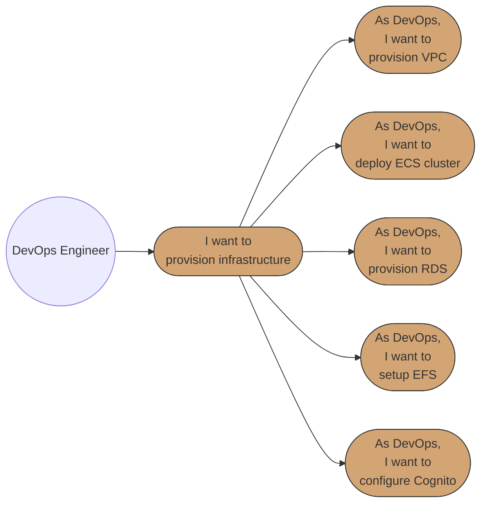
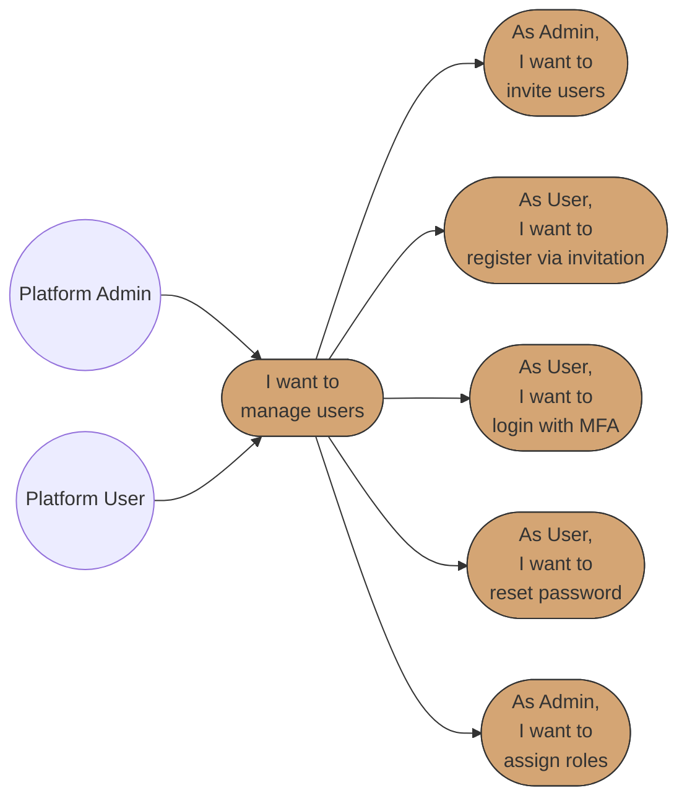
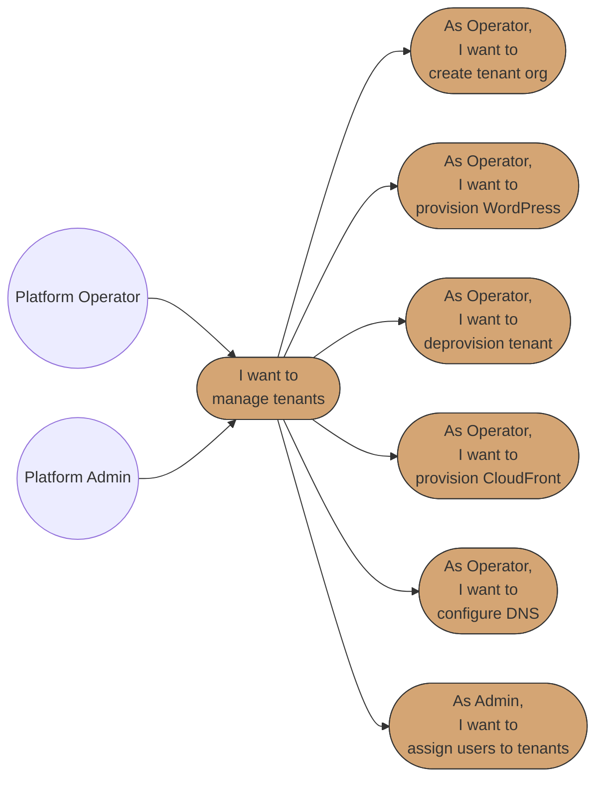
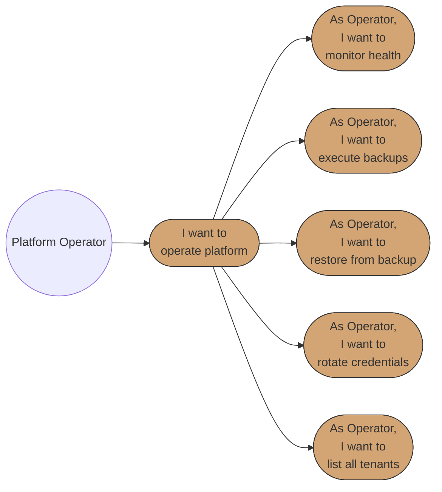
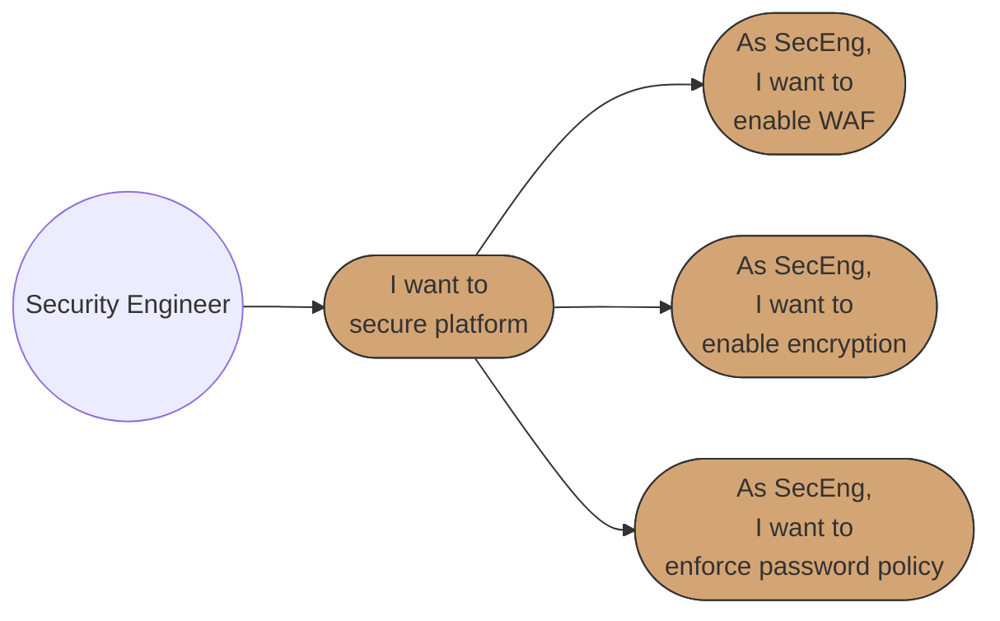
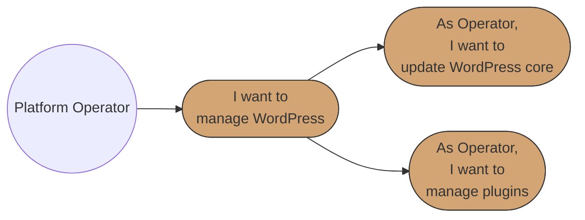
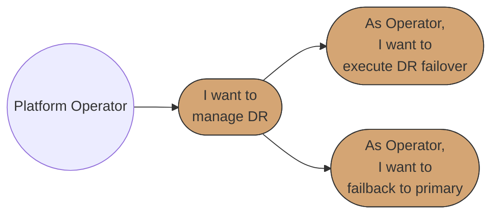

# Business Requirements Specification (BRS)
# BBWS ISP-Style ECS Fargate WordPress Hosting Platform

## Document Metadata

| Attribute | Value |
|-----------|-------|
| Document Title | BBWS ISP-Style ECS Fargate WordPress Hosting Platform Requirements Specification |
| Version | 1.0 |
| Last Updated | 2026-01-05 |
| Author | Business Analyst Agent |
| Reviewed By | [Pending Review] |
| Status | Draft |
| Related HLD | 2.0_BBWS_ECS_WordPress_HLD.md |
| Phase | 2 (Core Infrastructure) |

---

## 1. Introduction

### 1.1 Purpose

This document specifies the comprehensive business requirements for the BBWS ISP-Style ECS Fargate WordPress Hosting Platform, a multi-tenant containerized WordPress hosting solution on AWS designed to address critical challenges in traditional ISP-based WordPress hosting.

**Problem Statement:**

Traditional ISP-based WordPress hosting faces critical challenges that this platform addresses:

| Pain Point | Current State | Business Impact |
|------------|---------------|-----------------|
| Manual Management | Domain, tenant, database provisioning by hand (2+ hours per site) | Developer time wasted on operations instead of customer value |
| Tenant Isolation | Shared servers with poor separation | Security vulnerabilities, noisy neighbors affecting performance |
| User Management | No centralized identity management | Security risks, manual access control overhead |
| Database SPOF | Single database server per environment | Bottlenecks, data loss risk, scalability limitations |
| Backup Failures | 58% of backups fail; 50% of restores fail | Data loss, compliance issues, customer trust erosion |
| Security Exposure | 7,966 new WordPress vulnerabilities in 2024 | 57.6% auto-exploitable without authentication |

**Cost of Doing Nothing:**

| Category | Annual Cost/Impact | Description |
|----------|-------------------|-------------|
| Maintenance Burden | $416 - $3,185 per site | Developer time spent on WordPress maintenance (6.82-24.5 hours per site per year) |
| Outage Costs | >$100,000 per incident | 54% of outages exceed $100,000; single incident negates years of hosting savings |
| Security Incidents | $200,000+ per breach | Average cost of data breach for SMBs |
| Data Loss | Unquantifiable | 58% backup failure rate + 50% restore failure rate = high probability of permanent data loss |
| Opportunity Cost | Lost revenue | Developers managing infrastructure instead of building features |
| Reputation Damage | Customer churn | Security breaches and outages erode customer trust |

**Total Estimated Annual Risk Exposure**: $50,000 - $500,000+ depending on incident frequency and severity.

### 1.2 Scope

**In Scope:**

- Core AWS infrastructure provisioning (VPC, ECS, RDS, EFS, ALB)
- Multi-tenant WordPress container hosting on ECS Fargate
- Per-tenant database isolation (Bridge Model on shared RDS)
- Per-tenant EFS access points for persistent storage
- User authentication and management via Cognito (Phase 1: CLI/Agents)
- Tenant lifecycle management (provision, deprovision, migrate)
- CloudFront CDN with per-tenant distributions
- WAF protection with WordPress-specific rules
- Disaster recovery capability to eu-west-1
- Agent-driven operations (Phase 1)
- Microservices automation (Phase 2)

**Out of Scope:**

- Customer self-service portal (covered in BRS 2.1 - Customer Portal Public)
- End-customer WordPress admin interfaces (native WordPress functionality)
- Billing and payment processing (covered in BRS 2.1)
- Marketing website functionality (covered in BRS 2.1)
- Mobile applications

### 1.3 System Overview

The BBWS ISP-Style ECS Fargate WordPress Hosting Platform is a containerized, multi-tenant WordPress hosting solution with the following key architectural characteristics:

**Four-Layer Architecture:**

1. **Layer 1 - Consumers/Frontend**: CLI tools, Python scripts, Claude Code agents for operations
2. **Layer 2 - Middleware/Business Logic**: ALB path-based routing, ECS Fargate cluster with tenant containers
3. **Layer 3 - Backend/Data Layer**: Shared RDS MySQL with per-tenant databases, shared EFS with per-tenant access points
4. **Layer 4 - Management**: CloudWatch observability, Terraform IaC, agent-based operations

**Key Capabilities:**

- **Bridge Database Isolation**: Per-tenant databases within shared RDS instance
- **Container Isolation**: Each tenant runs as isolated ECS Fargate task
- **Agent-Driven Operations**: Claude Code agents for Phase 1 operations (provisioning, backup, monitoring)
- **Infrastructure as Code**: Terraform modules per microservice/component
- **JWT Token Claims**: Tenant ID embedded in token for stateless authorization
- **MFA Enforced**: Required for Admin and Operator roles

### 1.4 Use Case Diagrams

#### Epic 1: Infrastructure Setup

#### Epic 2: User Management

#### Epic 3: Tenant Management

#### Epic 4: Operations

#### Epic 5: Security

#### Epic 6: WordPress Management

#### Epic 7: Disaster Recovery

**Diagram Legend:**
- **Circle (( ))**: Actor/Role initiating use cases
- **Rounded rectangle ([ ])**: Use case in user story format
- **Solid arrows**: Actor initiates use case or use case hierarchy

### 1.5 Traceability Matrix

| Business Ask | User Story Reference | Priority |
|--------------|---------------------|----------|
| BA-001: Provision core AWS infrastructure with multi-tenant capability | US-001, US-002, US-003, US-004, US-005 | Critical |
| BA-002: Centralized user authentication with MFA and role-based access | US-006, US-007, US-008, US-009, US-010 | Critical |
| BA-003: Provision new WordPress tenant in < 15 minutes | US-011, US-012 | Critical |
| BA-004: Cleanly deprovision tenant without affecting others | US-013 | Critical |
| BA-005: Complete tenant isolation (database, filesystem, compute) | US-012, US-022 | Critical |
| BA-006: Automated daily backups with cross-region replication | US-018 | Critical |
| BA-007: Monitor platform health and alert on anomalies | US-017 | High |
| BA-008: Protection against WordPress-specific attacks | US-022 | Critical |
| BA-009: Encryption at rest and in transit | US-023 | Critical |
| BA-010: Per-tenant monthly cost of $25-$50 | US-017 (cost monitoring) | High |
| BA-011: Disaster recovery capability to eu-west-1 | US-027, US-028 | High |
| BA-012: Agent-based operations for routine tasks | US-001 to US-028 | High |
| BA-013: Support initial 5 tenants with growth to 20+ | US-002, US-003, US-004 | Medium |

---

## 2. Stakeholders

| Role | Name | Responsibility |
|------|------|----------------|
| Business Owner | BBWS Management | Final approval, funding, cost efficiency oversight |
| Product Owner | [TBD] | Requirements prioritization, acceptance criteria |
| Platform Admins | BBWS Staff | User management, tenant creation, platform configuration |
| Platform Operators | BBWS Staff | Tenant provisioning, day-to-day operations, monitoring |
| DevOps Engineers | BBWS Staff | Infrastructure deployment, CI/CD pipelines |
| Security Engineers | BBWS Staff | Security posture, compliance, access control |
| End Customers | WordPress Site Owners | WordPress site availability, performance |
| QA Engineer | [TBD] | Quality assurance, test execution |

---

## 3. API Definitions

The following APIs/interfaces are referenced throughout this specification:

- **Terraform Modules**: Infrastructure as Code for VPC, ECS, RDS, EFS, ALB, CloudFront, WAF, Route53
- **Python CLI Scripts**: Tenant provisioning, backup, DR, monitoring, credential rotation
- **Claude Code Agents**: Infra Creator, AWS Backuper, DR Manager, Cost Reporter, Monitor, Tenant Manager, Content Manager
- **Cognito API**: User authentication, MFA, password management, group-based access control
- **AWS SDK (boto3)**: Direct AWS service interactions for provisioning and management
- **tenants.md**: File-based tenant database for Phase 1 operations

---

## Epic 1: Infrastructure Setup

**Epic ID:** EPIC-001
**Description:** Provision core AWS infrastructure components required for the multi-tenant WordPress hosting platform
**Business Value:** Establishes the foundational infrastructure that enables tenant isolation, scalability, and operational efficiency

### Use Case 1.1: VPC Infrastructure

#### User Story 1: Provision Core VPC Infrastructure (US-001)

**User Story:**
> As a DevOps Engineer,
> I want to provision the core VPC infrastructure,
> So that I have a secure network foundation for the hosting platform.

**Pre-conditions:**
- AWS account is configured with appropriate permissions
- Terraform is installed and configured
- AWS CLI credentials are available (DEV: eu-west-1, SIT: eu-west-1, PROD: af-south-1)

**Positive Scenario: Successful VPC Creation**

1. DevOps Engineer runs Terraform module for VPC creation
2. Terraform creates VPC with CIDR block (e.g., 10.0.0.0/16)
3. Terraform creates multi-AZ subnets (public, private, database)
4. Terraform configures Internet Gateway for public subnets
5. Terraform creates NAT Gateway for private subnet outbound access
6. Terraform configures route tables for each subnet type
7. Terraform outputs VPC ID, subnet IDs, NAT Gateway ID
8. Infrastructure is validated via AWS Console or CLI

**Negative Scenario: CIDR Conflict**

1. DevOps Engineer attempts VPC creation
2. Terraform detects CIDR block conflict with existing VPC
3. Terraform returns error with conflicting CIDR details
4. DevOps Engineer adjusts CIDR block in Terraform variables
5. Terraform apply succeeds with new CIDR
6. System logs the conflict resolution

**Edge Case: NAT Gateway Limit Reached**

1. DevOps Engineer runs VPC creation
2. AWS returns error: NAT Gateway limit exceeded
3. Terraform fails with clear error message
4. DevOps Engineer requests limit increase via AWS Support
5. After limit increase, Terraform apply succeeds
6. System handles graceful retry

**Post-conditions:**
- VPC is created with multi-AZ subnets
- NAT Gateway provides outbound connectivity for private subnets
- Route tables are correctly configured
- Security groups are created for ALB, ECS, RDS, EFS

**Acceptance Criteria:**
- [ ] VPC created with appropriate CIDR block
- [ ] Public subnets in 2+ AZs with Internet Gateway routing
- [ ] Private subnets in 2+ AZs with NAT Gateway routing
- [ ] Database subnets in 2+ AZs (isolated)
- [ ] Security groups created for each tier (ALB, ECS, RDS, EFS)
- [ ] All resources tagged with environment and project identifiers
- [ ] Error messages MUST be clear and actionable
- [ ] The system MUST handle AWS quota limits gracefully

---

#### User Story 2: Deploy Shared ECS Fargate Cluster (US-002)

**User Story:**
> As a DevOps Engineer,
> I want to deploy a shared ECS Fargate cluster,
> So that I can host multiple tenant containers efficiently.

**Pre-conditions:**
- VPC infrastructure is provisioned (US-001)
- ECR repository exists for WordPress base image
- Private subnets are available

**Positive Scenario: Successful ECS Cluster Deployment**

1. DevOps Engineer runs ECS cluster Terraform module
2. Terraform creates ECS Fargate cluster with name (e.g., bbws-wp-cluster-{env})
3. Terraform configures FARGATE and FARGATE_SPOT capacity providers
4. Terraform creates service discovery namespace (e.g., bbws.local)
5. Terraform creates ECS task execution role with ECR pull permissions
6. Terraform creates ECS task role with Secrets Manager access
7. Terraform outputs cluster ARN and namespace ID
8. Cluster is ready to accept task definitions

**Negative Scenario: IAM Role Creation Failure**

1. DevOps Engineer runs ECS Terraform module
2. IAM role creation fails due to permissions
3. Terraform returns IAM permission error
4. DevOps Engineer verifies IAM permissions for Terraform user
5. After permission update, Terraform apply succeeds
6. System logs the permission issue for audit

**Edge Case: Service Discovery Namespace Conflict**

1. DevOps Engineer runs ECS cluster creation
2. Service discovery namespace already exists
3. Terraform imports existing namespace or creates unique name
4. ECS cluster creation continues successfully
5. System logs the namespace handling

**Post-conditions:**
- ECS Fargate cluster is operational
- Capacity providers are configured
- Service discovery namespace is available
- IAM roles are created with least privilege

**Acceptance Criteria:**
- [ ] ECS cluster created with FARGATE and FARGATE_SPOT providers
- [ ] Service discovery namespace created for internal DNS
- [ ] Task execution role has ECR pull and CloudWatch logs permissions
- [ ] Task role has Secrets Manager read permissions
- [ ] Cluster can run 5 tenants initially, scalable to 20+
- [ ] Error messages MUST be clear and actionable
- [ ] The system MUST handle namespace conflicts gracefully

---

#### User Story 3: Provision Shared RDS MySQL Instance (US-003)

**User Story:**
> As a DevOps Engineer,
> I want to provision a shared RDS MySQL instance,
> So that tenants have database capacity with isolation.

**Pre-conditions:**
- VPC with database subnets is provisioned (US-001)
- Secrets Manager is accessible
- KMS key for encryption is available

**Positive Scenario: Successful RDS Creation**

1. DevOps Engineer runs RDS Terraform module
2. Terraform creates DB subnet group from database subnets
3. Terraform creates RDS MySQL instance (db.t3.micro for DEV, db.t3.small for SIT/PROD)
4. Terraform configures storage encryption with KMS
5. Terraform creates master credentials in Secrets Manager
6. Terraform configures automated backups (7-day retention)
7. Terraform creates parameter group with optimized settings
8. Terraform outputs RDS endpoint, port, master secret ARN

**Negative Scenario: Storage Encryption Key Access Denied**

1. DevOps Engineer runs RDS Terraform module
2. KMS key access denied error occurs
3. Terraform fails with clear KMS permission error
4. DevOps Engineer grants RDS service access to KMS key
5. Terraform apply succeeds after permission update
6. System logs the security event

**Edge Case: RDS Instance Class Not Available in AZ**

1. DevOps Engineer runs RDS creation
2. Specified instance class not available in preferred AZ
3. Terraform fails with availability error
4. DevOps Engineer switches to available AZ or instance class
5. RDS creation succeeds in alternative configuration
6. System logs the configuration adjustment

**Post-conditions:**
- RDS MySQL instance is running
- Storage is encrypted at rest
- Automated backups are configured
- Master credentials are stored in Secrets Manager

**Acceptance Criteria:**
- [ ] RDS MySQL instance created with encryption enabled
- [ ] Automated backups configured with 7-day retention
- [ ] Multi-AZ disabled for DEV, enabled for SIT/PROD
- [ ] Master credentials stored in Secrets Manager
- [ ] Database subnet group uses private database subnets
- [ ] Parameter group optimized for WordPress
- [ ] Error messages MUST be clear and actionable
- [ ] The system MUST handle AZ availability issues gracefully

---

#### User Story 4: Set Up Shared EFS Filesystem (US-004)

**User Story:**
> As a DevOps Engineer,
> I want to set up a shared EFS filesystem,
> So that tenants have persistent storage for wp-content.

**Pre-conditions:**
- VPC with private subnets is provisioned (US-001)
- Security groups allow NFS traffic (port 2049)

**Positive Scenario: Successful EFS Creation**

1. DevOps Engineer runs EFS Terraform module
2. Terraform creates encrypted EFS filesystem
3. Terraform creates mount targets in each private subnet
4. Terraform configures Elastic Throughput mode for performance
5. Terraform creates lifecycle policy (transition to IA after 30 days)
6. Terraform configures backup policy for AWS Backup integration
7. Terraform outputs filesystem ID and mount target IPs

**Negative Scenario: Security Group Blocks NFS Traffic**

1. DevOps Engineer runs EFS Terraform module
2. EFS mounts fail due to security group misconfiguration
3. System returns connectivity error
4. DevOps Engineer updates security group to allow port 2049
5. Mount targets become accessible
6. System logs the security group update

**Edge Case: Mount Target AZ Mismatch**

1. DevOps Engineer creates EFS with mount targets
2. ECS tasks in different AZ cannot access mount target
3. System shows cross-AZ latency or connectivity issues
4. DevOps Engineer ensures mount targets in all task AZs
5. EFS access normalizes across all AZs
6. System handles AZ affinity automatically

**Post-conditions:**
- EFS filesystem is created and encrypted
- Mount targets are available in all private subnets
- Performance mode is optimized for WordPress workloads

**Acceptance Criteria:**
- [ ] EFS filesystem created with encryption at rest
- [ ] Mount targets in all private subnets used by ECS
- [ ] Elastic Throughput mode enabled for variable workloads
- [ ] Lifecycle policy configured for cost optimization
- [ ] Backup policy enabled for AWS Backup integration
- [ ] Security groups allow NFS traffic from ECS security group
- [ ] Error messages MUST be clear and actionable
- [ ] The system MUST handle cross-AZ access gracefully

---

#### User Story 5: Configure Cognito User Pool (US-005)

**User Story:**
> As a DevOps Engineer,
> I want to configure Cognito User Pool,
> So that platform users can authenticate securely.

**Pre-conditions:**
- AWS account has Cognito access
- SES is configured for email sending (verification, password reset)

**Positive Scenario: Successful Cognito Setup**

1. DevOps Engineer runs Cognito Terraform module
2. Terraform creates User Pool with name (e.g., bbws-wp-users-{env})
3. Terraform configures password policy (min 12 chars, complexity)
4. Terraform enables MFA (TOTP) with optional enforcement
5. Terraform creates app client for CLI/agent authentication
6. Terraform creates groups: Admins, Operators, Viewers
7. Terraform configures custom attributes: tenant_id, role
8. Terraform outputs User Pool ID, App Client ID, Pool ARN

**Negative Scenario: SES Not Verified**

1. DevOps Engineer runs Cognito Terraform module
2. Cognito email configuration fails due to unverified SES
3. System returns email configuration error
4. DevOps Engineer verifies SES domain or email address
5. Cognito configuration completes successfully
6. System logs the SES verification requirement

**Edge Case: Custom Attribute Limit**

1. DevOps Engineer adds custom attributes
2. Cognito custom attribute limit approached
3. System warns about attribute limit
4. DevOps Engineer consolidates attributes if needed
5. Configuration completes within limits
6. System handles attribute optimization

**Post-conditions:**
- Cognito User Pool is created with secure configuration
- Password policy enforces complexity requirements
- MFA is configured (optional or required based on role)
- Groups are created for role-based access

**Acceptance Criteria:**
- [ ] User Pool created with appropriate name and region
- [ ] Password policy: min 12 chars, uppercase, lowercase, number, symbol
- [ ] MFA configured (TOTP-based)
- [ ] App client created with appropriate OAuth flows
- [ ] Groups created: Admins, Operators, Viewers
- [ ] Custom attributes configured: tenant_id, role
- [ ] Email verification enabled via SES
- [ ] Error messages MUST be clear and actionable
- [ ] The system MUST handle SES configuration issues gracefully

---

## Epic 2: User Management

**Epic ID:** EPIC-002
**Description:** Manage platform user lifecycle including invitation, registration, authentication, and role assignment
**Business Value:** Enables secure, centralized identity management with role-based access control for platform operations

### Use Case 2.1: User Lifecycle Management

#### User Story 6: Invite Users to Platform (US-006)

**User Story:**
> As a Platform Admin,
> I want to invite users to the platform,
> So that team members can access tenant management capabilities.

**Pre-conditions:**
- Admin is authenticated with Admin role
- Cognito User Pool is configured (US-005)
- SES is configured for email sending

**Positive Scenario: Successful User Invitation**

1. Admin runs user invitation script/agent command
2. System validates admin has Admin role in Cognito
3. System creates temporary user in Cognito with provided email
4. System generates unique registration link with verification code
5. SES sends invitation email with registration link
6. System logs invitation event with admin identity
7. Invitation expires after 7 days if not used

**Negative Scenario: Invalid Email Format**

1. Admin attempts to invite user with invalid email
2. System validates email format
3. System returns error: "Invalid email format"
4. Admin corrects email address
5. Invitation proceeds successfully
6. System logs validation failure

**Edge Case: Duplicate Email Invitation**

1. Admin invites email that already exists in User Pool
2. System detects existing user
3. System returns: "User already exists. Use password reset if needed."
4. Admin can choose to resend invitation or notify existing user
5. System handles gracefully without creating duplicate

**Post-conditions:**
- User record created in Cognito with FORCE_CHANGE_PASSWORD status
- Invitation email sent with registration link
- Audit log records invitation event

**Acceptance Criteria:**
- [ ] Only Admin role can invite new users
- [ ] Email validation before invitation
- [ ] Invitation email sent within 1 minute
- [ ] Registration link expires after 7 days
- [ ] Duplicate email invitations prevented
- [ ] Audit trail for all invitations
- [ ] Error messages MUST be clear and actionable
- [ ] The system MUST handle email delivery failures gracefully

---

#### User Story 7: Register via Invitation (US-007)

**User Story:**
> As an Invited User,
> I want to register via the invitation link,
> So that I can access the platform with my own credentials.

**Pre-conditions:**
- User has received invitation email
- Registration link is valid (not expired)
- Cognito User Pool is accessible

**Positive Scenario: Successful Registration**

1. User clicks registration link in invitation email
2. System validates invitation code is valid and not expired
3. System presents registration form (name, password, MFA setup)
4. User enters required information and accepts terms
5. System validates password meets complexity requirements
6. System prompts for MFA setup (TOTP authenticator)
7. User configures MFA and verifies with code
8. System confirms registration and activates account
9. User is redirected to login or CLI usage instructions

**Negative Scenario: Expired Invitation Link**

1. User clicks registration link after 7 days
2. System detects expired invitation code
3. System displays: "This invitation has expired"
4. System provides option to request new invitation from Admin
5. User contacts Admin for new invitation
6. System logs expired invitation attempt

**Edge Case: Password Does Not Meet Requirements**

1. User attempts to set weak password
2. System validates password in real-time
3. System displays specific requirements not met
4. User adjusts password to meet all requirements
5. Registration continues successfully
6. System enforces policy without exception

**Post-conditions:**
- User account is active in Cognito
- MFA is configured for the account
- User can authenticate with new credentials

**Acceptance Criteria:**
- [ ] Registration link validation before form display
- [ ] Password complexity validation with clear feedback
- [ ] MFA setup required during registration
- [ ] Terms of service acceptance required
- [ ] Account activated only after successful MFA verification
- [ ] Expired invitations handled gracefully
- [ ] Error messages MUST be clear and actionable
- [ ] The system MUST guide users through MFA setup

---

#### User Story 8: Login with MFA (US-008)

**User Story:**
> As a Platform User,
> I want to login with MFA,
> So that my account is protected with strong authentication.

**Pre-conditions:**
- User account is active in Cognito
- MFA is configured for the account
- User has access to TOTP authenticator app

**Positive Scenario: Successful MFA Login**

1. User initiates authentication (CLI or API)
2. System prompts for username/email and password
3. User provides credentials
4. Cognito validates credentials
5. Cognito returns MFA challenge
6. System prompts for MFA code
7. User provides TOTP code from authenticator
8. Cognito validates MFA code
9. Cognito returns JWT tokens (access, ID, refresh)
10. User is authenticated and can access platform

**Negative Scenario: Invalid MFA Code**

1. User provides correct password
2. System prompts for MFA code
3. User enters incorrect MFA code
4. System returns: "Invalid MFA code"
5. User retries with correct code (max 3 attempts)
6. After 3 failures, session is invalidated
7. System logs failed MFA attempts

**Edge Case: MFA Device Lost**

1. User cannot access TOTP authenticator
2. User contacts Admin for MFA reset
3. Admin uses privileged operation to disable MFA
4. User logs in without MFA (temporarily)
5. User is forced to reconfigure MFA immediately
6. System logs MFA reset for security audit

**Post-conditions:**
- JWT tokens issued with user claims
- Tokens include role and tenant_id (if assigned)
- Session is established for configured duration

**Acceptance Criteria:**
- [ ] Username/password validated before MFA challenge
- [ ] MFA code validated within time window (30 seconds)
- [ ] JWT tokens include custom claims (role, tenant_id)
- [ ] Token expiry configurable (default: 1 hour access, 30 days refresh)
- [ ] Account lockout after 5 failed password attempts
- [ ] MFA reset procedure documented and audited
- [ ] Error messages MUST be clear and actionable
- [ ] The system MUST handle MFA timing issues gracefully

---

#### User Story 9: Reset Password (US-009)

**User Story:**
> As a Platform User,
> I want to reset my password,
> So that I can recover account access if I forget my credentials.

**Pre-conditions:**
- User account exists in Cognito
- User has access to registered email

**Positive Scenario: Successful Password Reset**

1. User initiates forgot password flow (CLI or API)
2. System prompts for email address
3. User provides registered email
4. Cognito sends verification code to email
5. User receives email with 6-digit code
6. User provides verification code and new password
7. System validates code and password complexity
8. Cognito updates password
9. User can login with new password

**Negative Scenario: Verification Code Expired**

1. User requests password reset
2. User waits too long (> 24 hours) to use code
3. User enters expired verification code
4. System returns: "Verification code expired"
5. User requests new verification code
6. Process restarts with fresh code

**Edge Case: Email Not Registered**

1. User enters email not in User Pool
2. System processes request (does not reveal email exists)
3. System displays: "If this email exists, you will receive a reset code"
4. No email is sent (email doesn't exist)
5. Security: does not confirm email existence

**Post-conditions:**
- Password is updated in Cognito
- User can login with new password
- Previous sessions remain valid until expiry

**Acceptance Criteria:**
- [ ] Verification code sent within 2 minutes
- [ ] Code expires after 24 hours
- [ ] New password must meet complexity requirements
- [ ] Maximum 3 reset requests per 24 hours per email
- [ ] System does not reveal if email exists (security)
- [ ] Successful reset logged for audit
- [ ] Error messages MUST be clear and actionable
- [ ] The system MUST handle rate limiting gracefully

---

#### User Story 10: Assign Roles to Users (US-010)

**User Story:**
> As a Platform Admin,
> I want to assign roles to users,
> So that access is controlled based on responsibility.

**Pre-conditions:**
- Admin is authenticated with Admin role
- Target user exists in Cognito
- Role groups exist (Admins, Operators, Viewers)

**Positive Scenario: Successful Role Assignment**

1. Admin initiates role assignment (CLI or API)
2. System validates admin has Admin role
3. Admin specifies target user and role
4. System validates target user exists
5. System adds user to Cognito group for role
6. System updates user's custom attribute (role)
7. System confirms role assignment
8. User's next login includes new role in JWT claims

**Negative Scenario: Non-Admin Attempts Role Change**

1. Operator attempts to assign role to user
2. System checks caller's role
3. System returns: "Insufficient permissions. Admin role required."
4. Operation is denied and logged
5. Security alert may be generated for repeated attempts

**Edge Case: User Already Has Role**

1. Admin assigns role user already has
2. System detects existing group membership
3. System returns: "User already has this role"
4. No duplicate assignment created
5. Operation logged as no-op

**Post-conditions:**
- User is member of appropriate Cognito group
- User's custom role attribute is updated
- Next authentication includes new role in claims

**Acceptance Criteria:**
- [ ] Only Admin role can assign roles
- [ ] Valid roles: Admin, Operator, Viewer
- [ ] User can have only one role at a time (single group)
- [ ] Previous role removed when new role assigned
- [ ] Role change effective on next authentication
- [ ] All role changes audited
- [ ] Error messages MUST be clear and actionable
- [ ] The system MUST handle role conflicts gracefully

---

## Epic 3: Tenant Management

**Epic ID:** EPIC-003
**Description:** Manage tenant lifecycle including organization creation, WordPress provisioning, DNS configuration, and deprovisioning
**Business Value:** Enables rapid tenant onboarding (< 15 minutes) and clean offboarding with complete resource isolation

### Use Case 3.1: Tenant Lifecycle

#### User Story 11: Create Tenant Organization (US-011)

**User Story:**
> As a Platform Operator,
> I want to create a tenant organization,
> So that customers are logically grouped and isolated.

**Pre-conditions:**
- Operator is authenticated with Operator or Admin role
- Cognito User Pool is configured
- tenants.md file is accessible

**Positive Scenario: Successful Tenant Organization Creation**

1. Operator runs tenant creation script/agent
2. System validates operator role (Operator or Admin)
3. Operator provides tenant details (name, ID, contact email)
4. System validates tenant ID is unique
5. System creates Cognito group for tenant (e.g., tenant-{id})
6. System creates entry in tenants.md with metadata
7. System generates tenant slug for URL path
8. System confirms tenant organization creation

**Negative Scenario: Duplicate Tenant ID**

1. Operator attempts to create tenant with existing ID
2. System checks tenants.md and Cognito groups
3. System returns: "Tenant ID already exists"
4. Operator provides unique tenant ID
5. Creation proceeds successfully

**Edge Case: Invalid Tenant Name Characters**

1. Operator provides tenant name with special characters
2. System validates name for URL/path compatibility
3. System returns: "Tenant name contains invalid characters"
4. Operator provides sanitized name
5. System generates appropriate slug

**Post-conditions:**
- Cognito group created for tenant
- tenants.md updated with tenant metadata
- Tenant is ready for WordPress provisioning

**Acceptance Criteria:**
- [ ] Operator or Admin role required
- [ ] Tenant ID must be unique (validated against existing)
- [ ] Tenant slug must be URL-safe
- [ ] Cognito group created with tenant-{id} naming
- [ ] tenants.md updated with: id, name, email, slug, created_date, status
- [ ] Audit log records creation
- [ ] Error messages MUST be clear and actionable
- [ ] The system MUST prevent duplicate tenants

---

#### User Story 12: Provision New WordPress Instance (US-012)

**User Story:**
> As a Platform Operator,
> I want to provision a new WordPress instance for a tenant,
> So that a customer can have their isolated WordPress site.

**Pre-conditions:**
- Tenant organization exists (US-011)
- ECS cluster is operational (US-002)
- RDS instance is available (US-003)
- EFS filesystem is available (US-004)

**Positive Scenario: Successful WordPress Provisioning**

1. Operator runs WordPress provisioning script/agent
2. System validates operator role and tenant exists
3. System creates tenant database in RDS (tenant_{id}_db)
4. System creates database user with tenant-specific credentials
5. System stores credentials in Secrets Manager
6. System creates EFS access point for tenant (tenant-{id}/wp-content)
7. System creates ECS task definition with tenant configuration
8. System creates ECS service with desired count = 1
9. System creates ALB target group for tenant
10. System creates ALB listener rule (/tenant-{id}/* -> target group)
11. System updates tenants.md with provisioning status
12. System validates container is healthy
13. Provisioning completes in < 15 minutes

**Negative Scenario: Database Creation Failure**

1. Operator runs WordPress provisioning
2. RDS database creation fails (e.g., name conflict)
3. System rolls back any partial resources
4. System returns: "Database creation failed: [reason]"
5. Operator resolves issue and retries
6. System logs failure for investigation

**Edge Case: Container Health Check Failure**

1. Operator provisions WordPress
2. Container starts but health check fails
3. System detects unhealthy state
4. System provides troubleshooting guidance
5. Operator investigates logs and resolves
6. System retries health check after fix

**Post-conditions:**
- Tenant database created with isolated credentials
- EFS access point created with tenant-specific path
- ECS service running with healthy container
- ALB rule routes tenant traffic to container
- tenants.md updated with active status

**Acceptance Criteria:**
- [ ] Complete provisioning in < 15 minutes
- [ ] Tenant database created with unique credentials
- [ ] Database credentials stored in Secrets Manager
- [ ] EFS access point with tenant-specific UID/GID
- [ ] ECS task definition with correct environment variables
- [ ] ALB path-based routing configured
- [ ] Container health check passes
- [ ] Rollback on failure (no orphaned resources)
- [ ] Error messages MUST be clear and actionable
- [ ] The system MUST handle partial failures with rollback

---

#### User Story 13: Deprovision Tenant (US-013)

**User Story:**
> As a Platform Operator,
> I want to deprovision a tenant,
> So that resources are cleaned up when a customer leaves.

**Pre-conditions:**
- Tenant exists and is provisioned
- Operator is authenticated with Operator or Admin role
- Backup has been taken (recommended)

**Positive Scenario: Successful Tenant Deprovisioning**

1. Operator runs tenant deprovisioning script/agent
2. System validates operator role and tenant exists
3. System prompts for confirmation (destructive operation)
4. Operator confirms deprovisioning
5. System removes ECS service (stops container)
6. System removes ALB listener rule and target group
7. System archives EFS access point data (optional)
8. System removes EFS access point
9. System exports database to S3 (optional archive)
10. System drops tenant database
11. System removes database user and credentials from Secrets Manager
12. System removes Cognito group for tenant
13. System updates tenants.md with deprovisioned status
14. System confirms complete deprovisioning

**Negative Scenario: Deprovisioning Interrupted**

1. Operator starts deprovisioning
2. Network interruption occurs mid-process
3. System detects incomplete deprovisioning
4. System logs remaining resources
5. Operator reruns deprovisioning to complete
6. System handles idempotent cleanup

**Edge Case: Shared Resource Still in Use**

1. Operator deprovisions tenant
2. System detects shared resources with dependencies
3. System warns: "Tenant resources still have dependencies"
4. Operator reviews and resolves dependencies
5. Deprovisioning continues after resolution

**Post-conditions:**
- All tenant-specific resources removed
- Data archived to S3 (if configured)
- Shared infrastructure unaffected
- tenants.md updated with deprovisioned status

**Acceptance Criteria:**
- [ ] Confirmation required before deprovisioning
- [ ] ECS service and task stopped and removed
- [ ] ALB rule and target group removed
- [ ] EFS access point data archived (optional) then removed
- [ ] Database backed up to S3 then dropped
- [ ] Secrets Manager secret removed
- [ ] Cognito group removed
- [ ] tenants.md updated with status and deprovisioned_date
- [ ] Error messages MUST be clear and actionable
- [ ] The system MUST handle partial deprovisioning gracefully

---

#### User Story 14: Provision CloudFront Distribution (US-014)

**User Story:**
> As a Platform Operator,
> I want to provision a CloudFront distribution for a tenant,
> So that they have CDN capability for performance and caching.

**Pre-conditions:**
- Tenant WordPress is provisioned (US-012)
- ACM certificate is available (or can be requested)
- ALB is configured as origin

**Positive Scenario: Successful CloudFront Provisioning**

1. Operator runs CloudFront provisioning script/agent
2. System validates tenant exists and WordPress is running
3. System requests or retrieves ACM certificate for tenant domain
4. System creates CloudFront distribution with ALB origin
5. System configures cache behaviors for static and dynamic content
6. System associates ACM certificate
7. System configures custom domain (if provided)
8. System waits for distribution deployment (15-30 minutes)
9. System outputs CloudFront domain and distribution ID

**Negative Scenario: ACM Certificate Validation Timeout**

1. Operator provisions CloudFront with custom domain
2. ACM certificate requires DNS validation
3. DNS validation times out (no CNAME added)
4. System returns: "Certificate validation timeout"
5. Operator adds DNS validation CNAME
6. Certificate validates and CloudFront deploys

**Edge Case: Origin Connection Failure**

1. Operator creates CloudFront distribution
2. Origin connection to ALB fails
3. CloudFront returns 5xx errors
4. System provides origin troubleshooting guidance
5. Operator validates ALB configuration
6. CloudFront origin health restores

**Post-conditions:**
- CloudFront distribution is deployed
- Cache behaviors configured for WordPress
- ACM certificate associated
- tenants.md updated with CloudFront details

**Acceptance Criteria:**
- [ ] CloudFront distribution created with ALB origin
- [ ] Cache behavior: static assets cached, dynamic bypassed
- [ ] ACM certificate from us-east-1 (CloudFront requirement)
- [ ] Custom domain configured if provided
- [ ] Price class configurable (default: PriceClass_All or PriceClass_100)
- [ ] Distribution deployment completed and healthy
- [ ] Error messages MUST be clear and actionable
- [ ] The system MUST handle certificate validation delays gracefully

---

#### User Story 15: Configure DNS for Tenant (US-015)

**User Story:**
> As a Platform Operator,
> I want to configure DNS for a tenant,
> So that their site is accessible via a custom domain.

**Pre-conditions:**
- Tenant WordPress is provisioned (US-012)
- CloudFront is provisioned (US-014, if using CDN)
- Route53 hosted zone exists for domain

**Positive Scenario: Successful DNS Configuration**

1. Operator runs DNS configuration script/agent
2. System validates tenant and CloudFront/ALB target
3. Operator provides custom domain (e.g., tenant.example.com)
4. System creates A record (alias to CloudFront or ALB)
5. System creates AAAA record for IPv6 (if CloudFront)
6. System creates Route53 health check
7. System associates health check with DNS record
8. System validates DNS resolution
9. Site is accessible via custom domain

**Negative Scenario: DNS Propagation Delay**

1. Operator configures DNS
2. DNS record created in Route53
3. DNS propagation takes time (up to 48 hours external)
4. System returns: "DNS configured. Propagation may take time."
5. Operator monitors propagation
6. Site becomes accessible as DNS propagates

**Edge Case: CNAME Flattening Required**

1. Operator wants apex domain (example.com)
2. CNAME not allowed for apex
3. System uses Route53 Alias record instead
4. DNS configuration succeeds for apex domain
5. System handles apex domain correctly

**Post-conditions:**
- DNS record created pointing to CloudFront or ALB
- Health check configured for monitoring
- Site accessible via custom domain (after propagation)

**Acceptance Criteria:**
- [ ] Route53 A record (Alias) created for domain
- [ ] AAAA record created for IPv6 support
- [ ] Health check configured with appropriate path
- [ ] TTL configured appropriately (default: 300 seconds)
- [ ] DNS validation confirms record exists
- [ ] Health check shows healthy status
- [ ] Error messages MUST be clear and actionable
- [ ] The system MUST handle apex domains with Alias records

---

#### User Story 16: Assign Users to Tenants (US-016)

**User Story:**
> As a Platform Admin,
> I want to assign users to tenants,
> So that access is scoped to specific customer sites.

**Pre-conditions:**
- Admin is authenticated with Admin role
- Target user exists in Cognito
- Tenant exists in system

**Positive Scenario: Successful User-Tenant Assignment**

1. Admin runs user-tenant assignment script/agent
2. System validates admin role
3. Admin specifies user and tenant ID
4. System validates user and tenant exist
5. System adds user to tenant's Cognito group
6. System updates user's custom attribute (tenant_id)
7. System updates tenants.md with user assignment
8. System confirms assignment
9. User's next login includes tenant_id in JWT

**Negative Scenario: User Assigned to Multiple Tenants**

1. Admin assigns user already assigned to another tenant
2. System detects existing tenant assignment
3. System prompts: "User is assigned to another tenant. Replace?"
4. Admin confirms replacement
5. System removes from previous tenant group
6. System adds to new tenant group
7. Assignment complete

**Edge Case: Tenant Being Deprovisioned**

1. Admin assigns user to tenant
2. Tenant is in deprovisioning state
3. System returns: "Cannot assign to tenant being deprovisioned"
4. Admin selects active tenant
5. Assignment proceeds

**Post-conditions:**
- User is member of tenant's Cognito group
- User's tenant_id attribute is updated
- tenants.md updated with user list

**Acceptance Criteria:**
- [ ] Only Admin role can assign users to tenants
- [ ] User can be assigned to one tenant at a time
- [ ] Existing assignment replaced with confirmation
- [ ] Tenant must be in active state for assignment
- [ ] tenant_id included in JWT claims after assignment
- [ ] tenants.md updated with user assignments
- [ ] Error messages MUST be clear and actionable
- [ ] The system MUST handle multi-tenant users appropriately

---

## Epic 4: Operations

**Epic ID:** EPIC-004
**Description:** Day-to-day platform operations including monitoring, backup, restore, and credential management
**Business Value:** Ensures platform reliability, data protection, and security through proactive operations

### Use Case 4.1: Platform Operations

#### User Story 17: Monitor Platform Health (US-017)

**User Story:**
> As a Platform Operator,
> I want to monitor platform health,
> So that I can detect and respond to issues proactively.

**Pre-conditions:**
- CloudWatch is configured
- Dashboards are created
- Alarms are configured

**Positive Scenario: Successful Health Monitoring**

1. Operator accesses monitoring dashboard/script
2. System retrieves CloudWatch metrics
3. System displays ECS cluster health (CPU, memory, running tasks)
4. System displays RDS health (connections, CPU, storage)
5. System displays EFS health (throughput, connections)
6. System displays ALB health (request count, errors, latency)
7. System shows alarm status (OK, ALARM, INSUFFICIENT_DATA)
8. Operator reviews metrics and identifies any anomalies

**Negative Scenario: Alarm Triggered**

1. CloudWatch alarm triggers (e.g., high CPU)
2. System sends SNS notification to operators
3. Operator receives alert
4. Operator investigates using dashboard and logs
5. Operator takes remediation action
6. Alarm returns to OK state
7. System logs incident and resolution

**Edge Case: CloudWatch API Throttling**

1. Operator requests detailed metrics
2. CloudWatch API returns throttling error
3. System implements exponential backoff
4. System retries request after delay
5. Metrics retrieved successfully
6. System handles rate limiting gracefully

**Post-conditions:**
- Operator has visibility into platform health
- Alarms are functioning and alerting
- Issues are detected and can be addressed

**Acceptance Criteria:**
- [ ] Dashboard displays ECS, RDS, EFS, ALB metrics
- [ ] Alarms configured for: CPU > 80%, Memory > 80%, Error rate > 1%
- [ ] SNS notifications sent when alarms trigger
- [ ] Historical metrics available for trend analysis
- [ ] Cost metrics included (estimated spend)
- [ ] Log aggregation accessible from dashboard
- [ ] Error messages MUST be clear and actionable
- [ ] The system MUST handle API throttling gracefully

---

#### User Story 18: Execute Tenant Backups (US-018)

**User Story:**
> As a Platform Operator,
> I want to execute tenant backups,
> So that customer data is protected against loss.

**Pre-conditions:**
- RDS automated backups are configured
- EFS backup is configured
- S3 bucket for backups exists
- Cross-region replication is configured

**Positive Scenario: Successful Backup Execution**

1. Operator runs backup script/agent (or scheduled)
2. System validates backup prerequisites
3. System creates RDS snapshot for tenant database
4. System creates EFS backup for tenant access point
5. System replicates backup to eu-west-1 (DR region)
6. System tags backup with tenant ID and timestamp
7. System confirms backup completion
8. System logs backup success with details

**Negative Scenario: RDS Snapshot Limit Reached**

1. Operator initiates backup
2. RDS snapshot creation fails (limit reached)
3. System returns: "RDS snapshot limit reached"
4. System identifies oldest snapshots for deletion
5. Operator authorizes old snapshot deletion
6. Backup proceeds after limit freed
7. System logs the limit issue

**Edge Case: Cross-Region Replication Delay**

1. Backup created in primary region
2. Replication to eu-west-1 delayed
3. System monitors replication progress
4. System reports: "Backup created. Replication in progress."
5. Replication completes eventually
6. System confirms cross-region backup available

**Post-conditions:**
- RDS snapshot created and tagged
- EFS backup completed
- Cross-region replication verified
- Backup logged and tracked

**Acceptance Criteria:**
- [ ] RDS snapshot created with tenant-specific naming
- [ ] EFS backup captures tenant access point data
- [ ] Backups replicated to eu-west-1 within 1 hour
- [ ] Backup retention: 7 days DEV, 30 days SIT/PROD
- [ ] 100% backup success rate target
- [ ] Backup completion logged with duration and size
- [ ] Error messages MUST be clear and actionable
- [ ] The system MUST handle replication delays gracefully

---

#### User Story 19: Restore Tenant from Backup (US-019)

**User Story:**
> As a Platform Operator,
> I want to restore a tenant from backup,
> So that I can recover from data loss or corruption.

**Pre-conditions:**
- Backup exists for the tenant
- Operator is authenticated with Operator or Admin role
- Restoration target is identified

**Positive Scenario: Successful Tenant Restoration**

1. Operator runs restoration script/agent
2. System lists available backups for tenant
3. Operator selects backup to restore
4. System prompts for restoration target (in-place or new)
5. System stops ECS service for tenant (if in-place)
6. System restores RDS database from snapshot
7. System restores EFS data from backup
8. System updates ECS service with restored resources
9. System starts ECS service
10. System validates tenant WordPress is healthy
11. Restoration complete

**Negative Scenario: Backup Corrupted**

1. Operator initiates restoration
2. System detects backup integrity issue
3. System returns: "Backup integrity check failed"
4. Operator selects alternative backup (older)
5. Restoration proceeds with good backup
6. System logs corruption for investigation

**Edge Case: Partial Restoration Needed**

1. Operator wants database-only restoration
2. System supports granular restore options
3. Operator selects database-only
4. System restores database, preserves EFS
5. Tenant restored with database from backup, current files

**Post-conditions:**
- Tenant database restored to selected point in time
- Tenant files restored (if selected)
- ECS service restarted and healthy
- Restoration logged

**Acceptance Criteria:**
- [ ] Available backups listed with timestamps
- [ ] Restoration options: full, database-only, files-only
- [ ] RDS point-in-time restore to any point within retention
- [ ] EFS restore from latest or selected backup
- [ ] Service downtime minimized (< 30 minutes)
- [ ] Post-restore validation confirms health
- [ ] Error messages MUST be clear and actionable
- [ ] The system MUST handle backup integrity issues gracefully

---

#### User Story 20: Rotate Database Credentials (US-020)

**User Story:**
> As a Platform Operator,
> I want to rotate database credentials,
> So that security is maintained through regular credential changes.

**Pre-conditions:**
- Tenant database credentials exist in Secrets Manager
- ECS service uses Secrets Manager reference

**Positive Scenario: Successful Credential Rotation**

1. Operator runs credential rotation script/agent
2. System validates tenant and current credentials
3. System generates new secure password
4. System creates new MySQL user or updates existing
5. System updates Secrets Manager with new credentials
6. System restarts ECS service to pick up new credentials
7. System validates database connectivity
8. System disables old credentials (if separate user)
9. Rotation complete and logged

**Negative Scenario: Service Fails After Rotation**

1. Operator initiates rotation
2. New credentials stored in Secrets Manager
3. ECS service restarts but fails health check
4. System detects failure
5. System rolls back to previous credentials
6. System logs rotation failure for investigation
7. Operator investigates and retries

**Edge Case: Concurrent Rotation Request**

1. Operator A initiates rotation
2. Operator B initiates rotation for same tenant
3. System detects concurrent operation
4. System returns: "Rotation already in progress"
5. Operator B waits for first rotation to complete
6. System handles concurrency correctly

**Post-conditions:**
- New credentials active in Secrets Manager
- ECS service using new credentials
- Old credentials disabled or removed
- Rotation logged with timestamp

**Acceptance Criteria:**
- [ ] Secrets Manager rotation triggered
- [ ] New password meets security requirements
- [ ] ECS service restarted within 5 minutes
- [ ] Database connectivity validated after rotation
- [ ] Rollback on failure preserves service availability
- [ ] Audit log records rotation event
- [ ] Error messages MUST be clear and actionable
- [ ] The system MUST handle concurrent rotations gracefully

---

#### User Story 21: List All Tenants (US-021)

**User Story:**
> As a Platform Operator,
> I want to list all tenants,
> So that I can see platform utilization and tenant status.

**Pre-conditions:**
- tenants.md file exists
- Operator is authenticated

**Positive Scenario: Successful Tenant Listing**

1. Operator runs tenant list script/agent
2. System reads tenants.md
3. System enriches with live data (ECS status, health)
4. System displays tenant list with: ID, name, status, created_date
5. System shows resource usage per tenant
6. System shows total platform utilization
7. Operator can filter by status (active, deprovisioned)

**Negative Scenario: tenants.md Corrupted**

1. Operator requests tenant list
2. System detects tenants.md parse error
3. System returns: "Tenant database corrupted"
4. System recovers from backup or reconstructs from AWS resources
5. Tenant list generated from recovered data
6. System logs corruption for investigation

**Edge Case: Large Tenant Count**

1. Operator lists tenants (20+ tenants)
2. System implements pagination
3. Operator navigates pages
4. System handles large data sets efficiently

**Post-conditions:**
- Complete tenant inventory displayed
- Status reflects current state
- Platform utilization visible

**Acceptance Criteria:**
- [ ] All tenants listed from tenants.md
- [ ] Live status enriched from ECS/RDS
- [ ] Columns: ID, Name, Status, Created, Users, Sites
- [ ] Filtering: active, deprovisioned, all
- [ ] Resource usage: CPU, memory, storage per tenant
- [ ] Total platform metrics displayed
- [ ] Error messages MUST be clear and actionable
- [ ] The system MUST handle data corruption gracefully

---

## Epic 5: Security

**Epic ID:** EPIC-005
**Description:** Security controls including WAF protection, encryption, and password policies
**Business Value:** Protects platform and tenants from security threats, ensures compliance with security standards

### Use Case 5.1: Security Configuration

#### User Story 22: Enable WAF Protection (US-022)

**User Story:**
> As a Security Engineer,
> I want WAF protection enabled,
> So that WordPress sites are protected from common attacks.

**Pre-conditions:**
- ALB or CloudFront is provisioned
- WAF quota is available

**Positive Scenario: Successful WAF Configuration**

1. Security Engineer runs WAF configuration via Terraform
2. Terraform creates WAF WebACL
3. Terraform enables AWS Managed Rules (OWASP Core, Known Bad Inputs)
4. Terraform enables WordPress-specific rules
5. Terraform associates WebACL with ALB and CloudFront
6. Terraform configures logging to CloudWatch/S3
7. WAF actively protecting traffic
8. System logs blocked requests for analysis

**Negative Scenario: Legitimate Traffic Blocked**

1. WAF deployed with restrictive rules
2. Legitimate user requests blocked
3. Security Engineer reviews WAF logs
4. Security Engineer adjusts rules (whitelist or exception)
5. Legitimate traffic allowed
6. System logs rule adjustment

**Edge Case: High Volume Attack**

1. DDoS attack generates high request volume
2. WAF rate limiting activates
3. Malicious traffic blocked
4. Legitimate traffic may be affected temporarily
5. Security Engineer reviews and adjusts thresholds
6. Attack mitigated

**Post-conditions:**
- WAF WebACL attached to ALB and CloudFront
- OWASP and WordPress rules active
- Logging enabled for analysis

**Acceptance Criteria:**
- [ ] WAF WebACL created with appropriate rules
- [ ] AWS Managed Rules: Core Rule Set, Known Bad Inputs
- [ ] WordPress-specific rules enabled
- [ ] Rate limiting configured (default: 2000 requests/5min per IP)
- [ ] WebACL associated with ALB and CloudFront
- [ ] WAF logs shipped to CloudWatch and S3
- [ ] Error messages MUST be clear and actionable
- [ ] The system MUST allow rule tuning for false positives

---

#### User Story 23: Enable Encryption at Rest and In Transit (US-023)

**User Story:**
> As a Security Engineer,
> I want encryption enabled at rest and in transit,
> So that data is protected from unauthorized access.

**Pre-conditions:**
- KMS keys available for encryption
- ACM certificates available for TLS

**Positive Scenario: Successful Encryption Configuration**

1. Security Engineer verifies encryption configuration via Terraform
2. RDS encryption enabled with KMS key
3. EFS encryption enabled with KMS key
4. S3 bucket encryption enabled (SSE-S3 or SSE-KMS)
5. ALB configured with TLS listener (port 443)
6. CloudFront configured with TLS
7. ECS task-to-RDS connections use TLS
8. All encryption validated and documented

**Negative Scenario: KMS Key Access Denied**

1. Encryption configuration attempted
2. KMS key access denied for service
3. Security Engineer grants service access to key
4. Encryption configuration succeeds
5. Access logged for audit

**Edge Case: Certificate Expiry Approaching**

1. ACM certificate nearing expiry
2. System alerts on upcoming expiry
3. ACM auto-renewal attempted (if DNS validated)
4. Security Engineer verifies renewal
5. No service disruption from expiry

**Post-conditions:**
- All data encrypted at rest
- All data encrypted in transit
- Encryption keys managed by KMS

**Acceptance Criteria:**
- [ ] RDS encryption enabled with KMS
- [ ] EFS encryption enabled with KMS
- [ ] S3 encryption enabled for all buckets
- [ ] ALB listener on port 443 with TLS
- [ ] CloudFront with minimum TLS 1.2
- [ ] Database connections enforce SSL
- [ ] ACM certificates auto-renew
- [ ] Error messages MUST be clear and actionable
- [ ] The system MUST alert on certificate expiry

---

#### User Story 24: Enforce Password Policy (US-024)

**User Story:**
> As a Security Engineer,
> I want Cognito to enforce password policies,
> So that user accounts are secure.

**Pre-conditions:**
- Cognito User Pool is provisioned (US-005)

**Positive Scenario: Successful Password Policy Configuration**

1. Security Engineer reviews Cognito password policy via Terraform
2. Policy enforces: minimum 12 characters
3. Policy requires: uppercase, lowercase, number, symbol
4. Policy prevents password reuse (last 6 passwords)
5. Password expiry configured (optional: 90 days)
6. MFA enforced for Admin and Operator roles
7. Policy documented and tested

**Negative Scenario: User Sets Weak Password**

1. User attempts to set password: "password123"
2. Cognito validates against policy
3. Cognito returns: "Password does not meet requirements"
4. User sets compliant password
5. Password accepted

**Edge Case: Password Policy Change Mid-Session**

1. Security Engineer updates policy to be stricter
2. Existing users not affected until password change
3. Next password change must meet new policy
4. Grace period may apply
5. Users notified of policy change

**Post-conditions:**
- Password policy enforced in Cognito
- MFA configured and required for privileged roles
- Policy documented for users

**Acceptance Criteria:**
- [ ] Minimum password length: 12 characters
- [ ] Complexity: uppercase, lowercase, number, special character
- [ ] Password history: prevent reuse of last 6 passwords
- [ ] Temporary password expiry: 7 days
- [ ] MFA required for Admin and Operator roles
- [ ] MFA optional for Viewer role
- [ ] Policy visible to users during password creation
- [ ] Error messages MUST be clear and actionable
- [ ] The system MUST enforce policy on all password operations

---

## Epic 6: WordPress Management

**Epic ID:** EPIC-006
**Description:** WordPress core and plugin management including updates and security patches
**Business Value:** Maintains WordPress security and functionality through managed updates

### Use Case 6.1: WordPress Lifecycle

#### User Story 25: Update WordPress Core (US-025)

**User Story:**
> As a Platform Operator,
> I want to update WordPress core,
> So that sites have the latest security patches and features.

**Pre-conditions:**
- WordPress container base image exists in ECR
- New WordPress version tested in DEV
- Backup of tenant data taken

**Positive Scenario: Successful WordPress Core Update**

1. Operator identifies new WordPress version for update
2. Operator builds new container image with updated WordPress
3. Operator pushes image to ECR with version tag
4. Operator updates ECS task definition with new image
5. Operator initiates rolling deployment
6. ECS replaces tasks one at a time
7. Health checks validate each new task
8. All tenants updated with zero downtime
9. Update logged with version details

**Negative Scenario: Update Causes Compatibility Issue**

1. Operator deploys new WordPress version
2. New container fails health check
3. ECS rolling deployment pauses
4. Operator reviews logs for issue
5. Operator rolls back to previous image version
6. Service restored with original version
7. Issue investigated and fixed before retry

**Edge Case: Tenant-Specific Plugin Incompatibility**

1. WordPress update breaks plugin for one tenant
2. Other tenants unaffected
3. Operator identifies affected tenant
4. Operator temporarily excludes tenant from update
5. Plugin updated or alternative found
6. Tenant updated separately

**Post-conditions:**
- WordPress core updated across all tenants
- No downtime during update
- Update logged and documented

**Acceptance Criteria:**
- [ ] Rolling deployment with zero downtime
- [ ] Health check validation before traffic shift
- [ ] Automatic rollback on health check failure
- [ ] All tenants updated within maintenance window
- [ ] Update version tracked in ECR tags
- [ ] Update logged with before/after versions
- [ ] Error messages MUST be clear and actionable
- [ ] The system MUST support rollback for failed updates

---

#### User Story 26: Manage WordPress Plugins (US-026)

**User Story:**
> As a Platform Operator,
> I want to manage WordPress plugins,
> So that tenants have required functionality with security maintained.

**Pre-conditions:**
- WordPress is provisioned for tenant
- Plugin repository accessible
- Plugin compatibility verified

**Positive Scenario: Successful Plugin Installation**

1. Operator identifies plugin requirement for tenant
2. Operator verifies plugin compatibility and security
3. Operator runs plugin management script/agent
4. System installs plugin to tenant's wp-content via EFS
5. System activates plugin in WordPress
6. System verifies plugin functionality
7. Plugin operational and logged

**Negative Scenario: Plugin Security Vulnerability**

1. Operator attempts to install known vulnerable plugin
2. System checks plugin against vulnerability database
3. System returns: "Plugin has known vulnerabilities"
4. Operator reviews and selects alternative plugin
5. Alternative installed successfully

**Edge Case: Plugin Conflict**

1. Operator installs new plugin
2. Plugin conflicts with existing plugin
3. WordPress throws error
4. Operator deactivates conflicting plugin
5. Conflict resolved
6. Both plugins can't coexist

**Post-conditions:**
- Plugin installed and activated
- Plugin functionality verified
- Installation logged

**Acceptance Criteria:**
- [ ] Plugin installed to tenant-specific EFS path
- [ ] Plugin compatibility checked before installation
- [ ] Security vulnerability check performed
- [ ] Plugin activation verified
- [ ] Bulk plugin updates supported
- [ ] Plugin inventory maintained per tenant
- [ ] Error messages MUST be clear and actionable
- [ ] The system MUST block known vulnerable plugins

---

## Epic 7: Disaster Recovery

**Epic ID:** EPIC-007
**Description:** Disaster recovery procedures for regional failover and failback
**Business Value:** Ensures business continuity during regional outages with defined RTO (4 hours) and RPO (1 hour)

### Use Case 7.1: DR Operations

#### User Story 27: Execute DR Failover (US-027)

**User Story:**
> As a Platform Operator,
> I want to execute DR failover,
> So that service continues during a regional outage in af-south-1.

**Pre-conditions:**
- Primary region (af-south-1) is unavailable or degraded
- Backups are replicated to eu-west-1
- DR infrastructure is pre-provisioned or can be provisioned quickly

**Positive Scenario: Successful DR Failover**

1. Operations Agent detects primary region failure
2. Platform Admin makes DR decision (invoke failover)
3. Operator runs DR failover script (dr_fail_over.py)
4. System provisions infrastructure in eu-west-1 from Terraform
5. System restores latest backups in DR region
6. System provisions Cognito User Pool in eu-west-1
7. System updates Route53 DNS to point to eu-west-1
8. System validates tenant accessibility
9. System notifies users of re-authentication requirement
10. DR failover complete within 4 hours (RTO)

**Negative Scenario: Backup Restore Failure in DR**

1. DR failover initiated
2. Backup restore fails in eu-west-1
3. System identifies issue (corrupted backup, incompatibility)
4. System attempts restore from previous backup
5. Restore succeeds with older backup
6. Data loss limited to time since last good backup
7. Incident logged for post-mortem

**Edge Case: Partial Region Failure**

1. Primary region partially available
2. Some services affected, others not
3. Operator evaluates partial vs full failover
4. Decision made based on impact
5. Partial failover or wait for region recovery

**Post-conditions:**
- Platform operational in eu-west-1
- DNS pointing to DR region
- Users can authenticate (may need to re-register MFA)
- Data restored to latest available backup

**Acceptance Criteria:**
- [ ] RTO: < 4 hours from decision to operational
- [ ] RPO: < 1 hour (based on backup frequency)
- [ ] Infrastructure provisioned from Terraform in eu-west-1
- [ ] Latest backups restored for all tenants
- [ ] Route53 DNS health check triggers failover
- [ ] Cognito User Pool recreated in DR region
- [ ] User notification sent about re-authentication
- [ ] Error messages MUST be clear and actionable
- [ ] The system MUST handle backup restore failures gracefully

---

#### User Story 28: Failback to Primary Region (US-028)

**User Story:**
> As a Platform Operator,
> I want to failback to the primary region,
> So that normal operations resume in af-south-1 after recovery.

**Pre-conditions:**
- DR is active in eu-west-1
- Primary region (af-south-1) is recovered
- Data sync from DR to primary is complete

**Positive Scenario: Successful Failback**

1. Operator confirms primary region is stable
2. Operator runs failback script (dr_fail_back.py)
3. System syncs data from eu-west-1 to af-south-1
4. System validates data integrity
5. System updates infrastructure in primary region
6. System updates Route53 DNS to point to af-south-1
7. System validates tenant accessibility
8. System decommissions DR infrastructure (or keeps warm)
9. Failback complete

**Negative Scenario: Data Sync Conflict**

1. Failback initiated
2. Data changes in DR during sync
3. System detects conflict
4. System prompts for conflict resolution
5. Operator resolves conflicts (latest wins or manual merge)
6. Sync completes
7. Failback proceeds

**Edge Case: Primary Region Not Fully Recovered**

1. Operator initiates failback
2. Primary region experiences intermittent issues
3. System detects instability
4. System recommends delaying failback
5. Operator monitors until stable
6. Failback proceeds when confirmed stable

**Post-conditions:**
- Platform operational in af-south-1
- DNS pointing to primary region
- DR region available for next incident
- Data consistent between regions

**Acceptance Criteria:**
- [ ] Data sync from DR to primary with integrity validation
- [ ] Route53 DNS repointed to af-south-1
- [ ] All tenants accessible in primary region
- [ ] DR infrastructure retained for future use
- [ ] Failback logged with duration and data metrics
- [ ] Users notified of return to primary
- [ ] Error messages MUST be clear and actionable
- [ ] The system MUST handle data sync conflicts gracefully

---

## 4. Non-Functional Requirements

### 4.1 Performance

| Requirement | Specification |
|-------------|---------------|
| Tenant Provisioning Time | < 15 minutes end-to-end |
| User Registration Time | < 5 minutes |
| Page Load Time | < 2 seconds (with CloudFront) |
| API Response Time | < 500ms for 95th percentile |
| Concurrent Tenants | 5 initially, scalable to 20+ |
| Container Startup Time | < 30 seconds |

### 4.2 Security

- All data transmission via HTTPS (TLS 1.2+)
- Passwords hashed using Cognito (AWS managed, bcrypt)
- JWT tokens for authentication with configurable expiry
- MFA enforced for Admin and Operator roles
- WAF protection with OWASP and WordPress-specific rules
- Per-tenant database isolation (Bridge Model)
- Per-tenant EFS access point isolation
- Secrets Manager for credential storage
- KMS encryption for data at rest
- No SSH access to containers (Fargate microVM isolation)

### 4.3 Availability

| Metric | Target |
|--------|--------|
| Uptime | 99.9% (8.76 hours downtime/year max) |
| RTO | 4 hours (DR failover) |
| RPO | 1 hour (based on backup frequency) |
| Backup Success Rate | 100% |
| Multi-AZ | All stateful services |

### 4.4 Scalability

- ECS Fargate auto-scales containers based on CPU/memory
- RDS supports 5 tenant databases initially, scalable to 20+
- EFS Elastic Throughput scales with demand
- ALB supports 100+ path-based routing rules
- CloudFront global edge distribution

### 4.5 Compliance

- Data residency: Primary in af-south-1 (South Africa)
- DR region: eu-west-1 (Ireland)
- Audit logging: CloudTrail for AWS API calls
- Cognito logs: User authentication events
- S3 public access: Blocked in all environments
- Container vulnerability scanning: ECR scanning enabled

---

## 5. Constraints

| Constraint Type | Description |
|-----------------|-------------|
| Budget | Phase 1: Agent-driven operations (lower initial cost); Phase 2: Microservices automation |
| Timeline | Phased delivery: TBC investigation -> POC -> Agents -> Infrastructure -> Tenant Management -> Content Management |
| Technology | AWS serverless (ECS Fargate, RDS, EFS, Cognito) - no EC2 management |
| Operations | Phase 1: CLI/Agent based; Phase 2: Lambda/API automation |
| Multi-Account | DEV (536580886816, eu-west-1), SIT (815856636111, eu-west-1), PROD (093646564004, af-south-1) |
| DR | Active-Passive with manual failover to eu-west-1 |
| Cost Target | $25-$37 USD per tenant per month |

---

## 6. Assumptions and Risks

### 6.1 Assumptions

| ID | Assumption | Impact if Invalid |
|----|------------|-------------------|
| A1 | Initial tenant count: 5 tenants (confirmed) | May need larger RDS instance if more tenants |
| A2 | RDS db.t3.micro sufficient for DEV | May need to upgrade if performance issues |
| A3 | Cognito regional limitation acceptable for DR | Users will need to re-authenticate after failover |
| A4 | Agent-based operations sufficient for Phase 1 | May need accelerated microservices if volume increases |
| A5 | WordPress OAuth plugin works with Cognito | May need custom integration if plugin issues |
| A6 | EFS Elastic Throughput sufficient for performance | May need optimization or caching layer |
| A7 | Route53 hosted zone exists or can be created | May need DNS delegation if external domain |

### 6.2 Risks

| ID | Risk | Probability | Impact | Mitigation |
|----|------|-------------|--------|------------|
| R-001 | WordPress vulnerabilities exploited (7,966 new in 2024, 57.6% auto-exploitable) | High | Critical | WAF with OWASP rules, automated patching, container isolation |
| R-002 | Tenant data breach due to poor isolation | High | Critical | Per-tenant DB, EFS access points, Fargate microVM isolation |
| R-003 | Unauthorized platform access | Medium | High | Cognito MFA, RBAC groups, JWT token authorization |
| R-004 | Data loss from backup failures (58% failure rate industry-wide) | High | Critical | AWS RDS automated backups, cross-region replication, 99.999999999% S3 durability |
| R-005 | Regional outage causing service unavailability | Low | Critical | DR strategy with eu-west-1 failover, Route53 health checks |
| R-006 | Developer time consumed by maintenance (6.82-24.5 hrs/site/year) | High | Medium | Managed services, agent automation, IaC |
| R-007 | Unexpected cost overruns | Medium | Medium | Cost monitoring, Fargate Spot, right-sizing, reserved capacity |
| R-008 | Data residency requirements not met | Medium | High | af-south-1 primary region, data encryption, audit logging |
| R-009 | Cognito SSO integration with WordPress fails | Medium | Medium | Fallback to native WordPress auth, plugin alternatives |
| R-010 | EFS latency impacts WordPress performance | Medium | Medium | Elastic Throughput, PHP OpCache, CloudFront CDN caching |

---

## 7. Glossary

| Term | Definition | Category |
|------|------------|----------|
| ALB | Application Load Balancer - AWS Layer 7 load balancer with path-based routing | AWS Service |
| Bridge Model | Per-tenant databases within shared RDS instance for isolation with cost efficiency | Architecture Pattern |
| Claude Code | Anthropic CLI tool for AI-assisted development and agent operations | Tool |
| CloudFront | AWS Content Delivery Network service for global content caching | AWS Service |
| Cognito | AWS managed identity service for user authentication and authorization | AWS Service |
| Cognito Group | Logical grouping of users for role and tenant-based authorization | AWS Service |
| Cognito User Pool | User directory for authentication with password and MFA | AWS Service |
| Custom Attribute | User-defined attribute in Cognito (e.g., tenant_id, role) | AWS Service |
| ECS | Elastic Container Service - AWS container orchestration service | AWS Service |
| EFS | Elastic File System - AWS managed NFS for persistent storage | AWS Service |
| EFS Access Point | Tenant-specific entry point to shared EFS with UID/GID isolation | AWS Service |
| Fargate | Serverless compute engine for containers - no EC2 management | AWS Service |
| IAM | Identity and Access Management for AWS resource access control | AWS Service |
| JWT | JSON Web Token - standard for secure claims transfer between parties | Security Standard |
| KMS | Key Management Service for encryption key management | AWS Service |
| MFA | Multi-Factor Authentication - additional authentication factor beyond password | Security Concept |
| MTTD | Mean Time to Detect - average time to detect an incident | DR Metric |
| MTTR | Mean Time to Recover - average time to recover from an incident | DR Metric |
| RBAC | Role-Based Access Control - access determined by user's role | Security Pattern |
| RDS | Relational Database Service - AWS managed MySQL database | AWS Service |
| Route 53 | AWS DNS and domain registration service with health checks | AWS Service |
| RPO | Recovery Point Objective - acceptable data loss (1 hour for this platform) | DR Metric |
| RTO | Recovery Time Objective - acceptable downtime (4 hours for this platform) | DR Metric |
| Secrets Manager | AWS credential and secret storage service with rotation | AWS Service |
| Tenant | Customer WordPress instance on the platform with isolated resources | Domain-Specific |
| Terraform | Infrastructure as Code tool by HashiCorp for AWS provisioning | Tool |
| TOTP | Time-based One-Time Password - algorithm for MFA codes | Security Standard |
| User Pool | Cognito user directory for platform authentication | AWS Service |
| VPC | Virtual Private Cloud - isolated AWS network for platform resources | AWS Service |
| WAF | Web Application Firewall - Layer 7 security filtering | AWS Service |
| wp-content | WordPress directory for themes, plugins, and uploads | WordPress |

---

## 8. Sign-Off

| Role | Name | Signature | Date |
|------|------|-----------|------|
| Business Owner | | | |
| Product Owner | | | |
| Technical Lead | | | |
| Security Lead | | | |
| QA Lead | | | |

---

## Appendix A: Component Reference

| Layer | Component | AWS Service | User Stories |
|-------|-----------|-------------|--------------|
| Frontend | CLI Tools + Python Scripts | Local | US-006 to US-028 |
| Edge | Route 53 Hosted Zone | Route 53 | US-015, US-027, US-028 |
| Edge | CloudFront Distribution | CloudFront | US-014 |
| Edge | WAF WebACL | AWS WAF | US-022 |
| Edge | ALB | ALB | US-012, US-013, US-015 |
| Compute | VPC + Subnets | VPC | US-001 |
| Compute | ECS Fargate Cluster | ECS | US-002 |
| Compute | WordPress Container | ECS Fargate | US-012, US-025, US-026 |
| Data | RDS MySQL | RDS | US-003, US-018, US-019 |
| Data | Tenant Database | MySQL | US-012, US-018 |
| Data | EFS Filesystem | EFS | US-004, US-018 |
| Data | EFS Access Point | EFS | US-012 |
| Data | Secrets Manager | Secrets Manager | US-012, US-020 |
| Management | CloudWatch | CloudWatch | US-017 |
| Management | Terraform Modules | Terraform | US-001 to US-005 |
| Agents | Infra Creator Agent | Agent | US-001 to US-005 |
| Agents | AWS Backuper Agent | Agent | US-018, US-019 |
| Agents | DR Manager Agent | Agent | US-027, US-028 |
| Agents | Cost Report Generator | Agent | US-017 |
| Agents | Infra Monitor Agent | Agent | US-017, US-020 |
| Agents | WP Tenant Manager | Agent | US-011 to US-016, US-021 |
| Agents | WP Content Agent | Agent | US-025, US-026 |

---

## Appendix B: Agent and Script Reference

| Component | Script/Agent | Purpose | User Stories |
|-----------|-------------|---------|--------------|
| Infra Agent | infra_creator_agent.md | VPC, ECS, RDS, EFS, Cognito provisioning | US-001 to US-005 |
| Backup Agent | aws_backuper_agent.md | Backup creation and restoration | US-018, US-019 |
| DR Agent | dr_manager_agent.md | DR failover and failback | US-027, US-028 |
| Cost Agent | cost_report_agent.md | Cost reporting and analysis | US-017 |
| Monitor Agent | monitoring_agent.md | Platform health monitoring | US-017, US-020 |
| Tenant Admin | tenant_CRUD_manager_agent.md | Tenant organization management | US-011 to US-016 |
| Tenant Manager | tenant_manager_agent.md | WordPress provisioning | US-012, US-013, US-021 |
| Content Agent | tenant_content_agent.md | WordPress content management | US-025, US-026 |
| Script | dr_fail_over.py | DR failover execution | US-027 |
| Script | dr_fail_back.py | DR failback execution | US-028 |
| Script | backup_create.py | Backup creation | US-018 |
| Script | backup_restore_to_prod.py | Backup restoration | US-019 |
| Script | tenants_create.py | Tenant provisioning | US-011, US-012 |
| Script | tenants_CRUD_sites.py | WordPress site management | US-012, US-013 |
| Script | tenants_CRUD_users.py | User management | US-006, US-010, US-016 |
| Script | tenants_rotate_credentials.py | Credential rotation | US-020 |
| Script | tenants_generate_report.py | Tenant reporting | US-021 |

---

## Appendix C: Repository Reference

| Repository | Purpose | Components |
|------------|---------|------------|
| 2_bbws_ecs_terraform | Infrastructure as Code | VPC, ECS, RDS, EFS, ALB, CloudFront, WAF, Route53 Terraform modules |
| 2_bbws_tenant_provisioner | Tenant Management CLI | Python scripts for tenant CRUD operations |
| 2_bbws_wordpress_container | WordPress Container | Custom WordPress Docker image for ECS Fargate |
| 2_bbws_ecs_tests | Integration Tests | Tenant isolation validation, infrastructure tests |
| 2_bbws_agent_utils | Agent Utilities | Shell/Python scripts for agent operations |
| 2_bbws_ecs_operations | Operations | Dashboards, alerts, DR runbooks, monitoring |

---

**End of Document**
