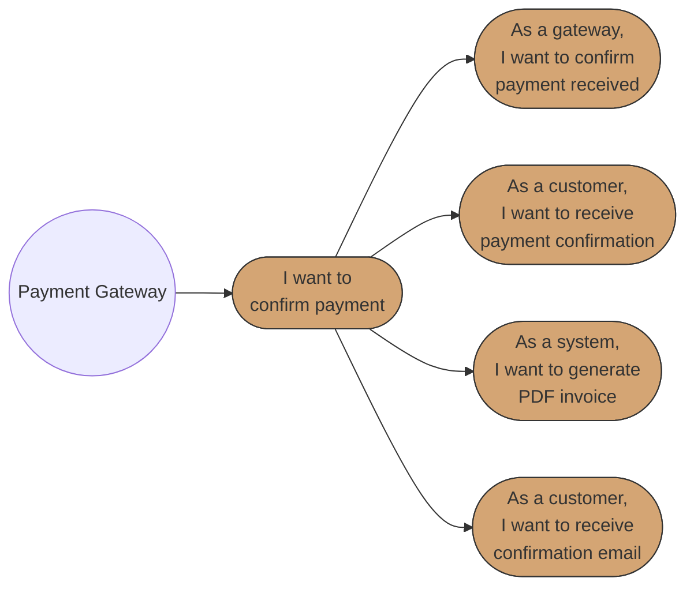

# Business Requirements Specification (BRS)
# BBWS Customer Portal (Public)

## Document Metadata

| Attribute | Value |
|-----------|-------|
| Document Title | BBWS Customer Portal (Public) Requirements Specification |
| Version | 1.3 |
| Last Updated | 2026-01-07 |
| Author | Business Analyst Agent |
| Reviewed By | [Pending Review] |
| Status | Draft |
| Related HLD | 2.1_BBWS_Customer_Portal_Public_HLD_V1.1.md |
| Related LLD | 2.1.1_LLD_Frontend_Architecture.md |
| Phase | 0 (First to Market) |

### Version History

| Version | Date | Author | Changes |
|---------|------|--------|---------|
| 1.0 | 2026-01-04 | Business Analyst Agent | Initial draft |
| 1.1 | 2026-01-05 | Business Analyst Agent | Added Epic 5: Payment Confirmation |
| 1.2 | 2026-01-05 | Researcher Agent | Added Section 3.5 Business Rules from LLD/Codebase reverse engineering: Form validation (17 rules), Data transformation (6 rules), Navigation (6 rules), Error handling (6 rules), UI states (4 rules), Product display (7 rules), UX timing (6 rules). Updated NFRs with frontend performance, browser compatibility, resilience requirements. Enhanced security with client-side requirements. Updated traceability matrix. |
| 1.3 | 2026-01-07 | Business Analyst Agent | Added Epic 6: Domain Management with domain purchase and transfer functionality |

---

## 1. Introduction

### 1.1 Purpose

This document specifies the comprehensive business requirements for the BBWS Customer Portal (Public), a public-facing website enabling marketing, pricing display, customer registration, and anonymous shopping for WordPress hosting services.

The primary business goal is to allow customers to order and pay for services online without BBWS staff assistance, enabling automation of tenant creation and website provisioning through backend agents.

### 1.2 Scope

**In Scope:**
- Landing pages (home, features, pricing, about, contact)
- Marketing pages (campaigns, offers)
- Pricing display (all products)
- Customer registration flow
- Login page (redirects to Private portal)
- Password reset and email verification
- Anonymous checkout flow (purchase without registration)
- Payment processing (PayFast integration)
- Domain search and availability checking
- Domain purchase and registration
- Domain transfer from other providers
- Newsletter subscription
- Contact forms

**Out of Scope:**
- Authenticated dashboard (Private Portal - separate BRS)
- Site management (Private Portal)
- Admin functions (Admin Portal - separate BRS)

### 1.3 System Overview

The BBWS Customer Portal (Public) is a React-based Single Page Application (SPA) that interfaces with serverless backend microservices (AWS Lambda) for product management, campaign management, and order processing. The system supports both registered and anonymous users, with automatic tenant creation during checkout.

### 1.4 Use Case Diagrams

#### Epic 1: Product Browsing & Marketing

#### Epic 2: Anonymous Shopping & Checkout

#### Epic 3: User Authentication

#### Epic 4: Campaign Management (Admin)

#### Epic 5: Payment Confirmation

#### Epic 6: Domain Management

**Diagram Legend:**
- **Circle (( ))**: Actor/Role initiating use cases
- **Rounded rectangle ([ ])**: Use case in user story format
- **Solid arrows**: Actor initiates use case or use case hierarchy

### 1.5 Traceability Matrix

#### 1.5.1 User Story Traceability

| Business Requirement | User Story Reference | Priority |
|---------------------|---------------------|----------|
| Professional landing pages for first impression | EPIC1-US1 | Critical |
| Product and pricing display | EPIC1-US2 | Critical |
| Campaign/offer display with validity | EPIC1-US3 | High |
| Anonymous checkout without registration | EPIC2-US1, US2 | Critical |
| Payment processing via PayFast | EPIC2-US2 | Critical |
| Order confirmation and receipt | EPIC2-US3 | Critical |
| Customer registration | EPIC3-US1 | High |
| User authentication | EPIC3-US2 | High |
| Password reset capability | EPIC3-US3 | High |
| Campaign creation and management | EPIC4-US1, US2 | High |
| Confirm order payments | EPIC5-US1 | Critical |
| Generate payment receipts (PDF) | EPIC5-US2 | High |
| Notify customers of payment | EPIC5-US3, US4 | High |
| Track payment events | EPIC5-US5 | Medium |
| Domain availability checking | EPIC6-US1 | High |
| Domain purchase capability | EPIC6-US2 | High |
| Domain transfer from other providers | EPIC6-US3 | High |

#### 1.5.2 Business Rules Traceability

| Business Rule Category | Rule IDs | Implementation Status | Source |
|------------------------|----------|----------------------|--------|
| Form Validation | BR-VAL-001 to BR-VAL-017 | Implemented | buy/src/utils/validation.ts |
| Data Transformation | BR-DATA-001 to BR-DATA-006 | Implemented | buy/src/services/orderApi.ts |
| Navigation | BR-NAV-001 to BR-NAV-006 | Implemented | buy/src/App.tsx |
| Error Handling | BR-ERR-001 to BR-ERR-006 | Implemented | buy/src/components/checkout/ |
| UI States | BR-UI-001 to BR-UI-004 | Implemented | buy/src/components/ |
| Product Display | BR-PROD-001 to BR-PROD-007 | Implemented | buy/src/components/pricing/ |
| UX Timing | BR-UX-001 to BR-UX-006 | Implemented | buy/src/components/checkout/ |

#### 1.5.3 NFR Traceability

| NFR Category | Reference | Implementation Status | Source |
|--------------|-----------|----------------------|--------|
| Frontend Performance | 4.1.2 | Implemented | Vite build optimization |
| Browser Compatibility | 4.1.3 | Implemented | No polyfills, ES6+ |
| Resilience | 4.1.4 | Implemented | productApi.ts, orderApi.ts |
| Client-Side Security | 4.2.4 | Implemented | Config, validation |

---

## 2. Stakeholders

| Role | Name | Responsibility |
|------|------|----------------|
| Business Owner | BBWS Management | Final approval, funding, business decisions |
| Product Owner | [TBD] | Requirements prioritization, acceptance |
| End Users - Visitors | General Public | Browse products, view marketing content |
| End Users - Customers | Purchasers | Place orders, make payments |
| End Users - Admins | BBWS Staff | Manage products, campaigns, orders |
| Technical Lead | [TBD] | Technical feasibility, architecture decisions |
| QA Engineer | [TBD] | Quality assurance, test execution |

---

## 3. API Definitions

The following APIs are referenced throughout this specification:

- **ProductAPI**: Handles product CRUD operations (create, read, update, soft-delete)
- **CampaignAPI**: Handles campaign CRUD operations with validity checking
- **OrderAPI**: Handles order creation, retrieval, and status updates
- **AuthenticationAPI**: Handles user registration, login, password reset via AWS Cognito
- **PaymentAPI**: Handles PayFast payment integration
- **DomainAPI**: Handles domain availability checking, registration, and transfer via AWS Route 53 Domains
- **FrontendUI**: React SPA user interface components

---

## 3.5 Business Rules

This section documents the business rules extracted from the LLD and codebase implementation. These rules govern system behavior and must be followed by all implementations.

### 3.5.1 Form Field Specifications

The checkout form collects customer information with the following field specifications:

| Field | Type | Required | Max Length | Placeholder | Description |
|-------|------|----------|------------|-------------|-------------|
| fullName | text | Yes | 100 | "John Doe" | Customer first and last name |
| email | email | Yes | 254 | "john@example.com" | Valid email address |
| phone | tel | Yes | 15 | "+27821234567" | Phone in SA or E.164 format |
| company | text | No | 100 | "Acme Corp (Optional)" | Company name |
| address | text | Yes | 200 | "123 Main Street" | Street address |
| city | text | Yes | 100 | "Cape Town" | City name |
| postalCode | text | Yes | 14 | "8001" | Postal/ZIP code |
| notes | textarea | No | 500 | "Any special requirements?" | Additional notes |

### 3.5.2 Form Validation Rules (BR-VAL)

| Rule ID | Field | Validation Logic | Error Message |
|---------|-------|------------------|---------------|
| BR-VAL-001 | fullName | Required, not empty | "Full name is required" |
| BR-VAL-002 | fullName | Minimum 2 characters | "Full name must be at least 2 characters" |
| BR-VAL-003 | fullName | Must contain first and last name (2+ words) | "Please enter your first and last name" |
| BR-VAL-004 | fullName | Letters, spaces, hyphens, apostrophes only | "Full name can only contain letters, spaces, hyphens, and apostrophes" |
| BR-VAL-005 | email | Required, not empty | "Email is required" |
| BR-VAL-006 | email | RFC 5322 format: `^[a-zA-Z0-9._%+-]+@[a-zA-Z0-9.-]+\.[a-zA-Z]{2,}$` | "Please enter a valid email address" |
| BR-VAL-007 | email | Maximum 254 characters | "Email address is too long" |
| BR-VAL-008 | email | Detect common typos (gmial.com, yahooo.com, etc.) | "Please check your email address for typos" |
| BR-VAL-009 | phone | Required, not empty | "Phone number is required" |
| BR-VAL-010 | phone | Minimum 10 digits | "Phone number is too short" |
| BR-VAL-011 | phone | Maximum 15 digits | "Phone number is too long" |
| BR-VAL-012 | phone | SA format: `^(\+27\|0)[6-8][0-9]{8}$` OR E.164: `^\+[1-9]\d{6,14}$` | "Please enter a valid phone number (e.g., +27821234567 or 0821234567)" |
| BR-VAL-013 | company | Optional, max 100 characters | "Company name must not exceed 100 characters" |
| BR-VAL-014 | address | Optional, max 200 characters | "Address must not exceed 200 characters" |
| BR-VAL-015 | city | Optional, max 100 characters | "City must not exceed 100 characters" |
| BR-VAL-016 | postalCode | Optional, alphanumeric 3-14 chars: `^[A-Z0-9]{3,10}(\s?[A-Z0-9]{0,4})?$` | "Please enter a valid postal code" |
| BR-VAL-017 | notes | Optional, max 500 characters | "Notes must not exceed 500 characters" |

### 3.5.3 Data Transformation Rules (BR-DATA)

| Rule ID | Transformation | Logic | Example |
|---------|----------------|-------|---------|
| BR-DATA-001 | Name splitting | Split `fullName` on first space → `firstName` + `lastName` | "John Doe" → firstName: "John", lastName: "Doe" |
| BR-DATA-002 | Single name handling | If no space in `fullName`, use same value for both names | "John" → firstName: "John", lastName: "John" |
| BR-DATA-003 | Email normalization | Trim whitespace, convert to lowercase | "  John@Example.COM  " → "john@example.com" |
| BR-DATA-004 | Phone normalization | Remove spaces, dashes, parentheses | "+27 82 123 4567" → "+27821234567" |
| BR-DATA-005 | Default country | Set country to "ZA" if not provided | billingAddress.country = "ZA" |
| BR-DATA-006 | Input sanitization | Remove XSS-prone characters from all text inputs | Sanitize `<script>`, `onclick`, etc. |

### 3.5.4 Navigation Rules (BR-NAV)

| Rule ID | From Screen | Action | To Screen | Condition |
|---------|-------------|--------|-----------|-----------|
| BR-NAV-001 | Pricing (CPP-003) | Click "Buy Now" on plan | Checkout (CPP-017) | Plan selected |
| BR-NAV-002 | Checkout (CPP-017) | Click "Back to Pricing" | Pricing (CPP-003) | Always |
| BR-NAV-003 | Checkout (CPP-017) | Submit valid form | Order Success | Form valid, API success |
| BR-NAV-004 | Checkout (CPP-017) | Submit valid form | Checkout with error | Form valid, API error |
| BR-NAV-005 | Order Success | After 5 seconds | Pricing (CPP-003) | Auto-redirect |
| BR-NAV-006 | Any | Session timeout | Home (CPP-001) | After 30 minutes inactivity |

### 3.5.5 Error Handling Rules (BR-ERR)

| Rule ID | Error Type | Display Location | Duration | User Action |
|---------|------------|------------------|----------|-------------|
| BR-ERR-001 | Field validation | Below the field | Until field corrected | Focus field, show error |
| BR-ERR-002 | Form-level validation | Toast + summary | 5 seconds | Highlight all invalid fields |
| BR-ERR-003 | API validation (400) | Toast + field errors | 5 seconds | Map backend errors to fields |
| BR-ERR-004 | Network error | Toast notification | Until dismissed | Show retry option |
| BR-ERR-005 | Server error (5xx) | Full screen error | Until dismissed | Show retry option, contact support |
| BR-ERR-006 | Timeout | Toast notification | Until dismissed | Show retry option |

### 3.5.6 UI State Rules (BR-UI)

| Rule ID | Element | Enabled State | Loading State | Disabled State |
|---------|---------|---------------|---------------|----------------|
| BR-UI-001 | Buy Now button | Plan visible | Never | Never |
| BR-UI-002 | Submit Order button | Form valid (no errors) | API call in progress | Form has validation errors |
| BR-UI-003 | Back to Pricing link | Always | Never | Never |
| BR-UI-004 | Form fields | Not submitting | Submitting (readonly) | Never |

**Button States:**
- **Enabled**: Normal appearance, clickable
- **Loading**: Shows spinner, text changes to "Processing Order...", not clickable
- **Disabled**: Grayed out, cursor not-allowed

### 3.5.7 Product Display Rules (BR-PROD)

| Rule ID | Rule | Implementation | Example |
|---------|------|----------------|---------|
| BR-PROD-001 | Popular badge | Show "Most Popular" when `plan.popular === true` | Professional plan |
| BR-PROD-002 | Gradient styling | Apply gradient border when `plan.gradient === true` | Professional plan border |
| BR-PROD-003 | POA pricing | Display "POA" when `priceNumeric === 0` | Enterprise Plus |
| BR-PROD-004 | Currency format | Display "R{amount}" for ZAR currency | "R5,000" |
| BR-PROD-005 | Price with "from" | Display "from R{amount}" for variable pricing | "from R95" |
| BR-PROD-006 | Card hover | Translate card up 8px on hover | Visual feedback |
| BR-PROD-007 | VAT notice | Display "All prices in ZAR, excluding VAT" | Footer note |

### 3.5.8 UX Timing Rules (BR-UX)

| Rule ID | Action | Timing | Description |
|---------|--------|--------|-------------|
| BR-UX-001 | Validation on blur | Immediate | Validate field when user moves focus away |
| BR-UX-002 | Form reset after success | 2 seconds | Clear form after successful order |
| BR-UX-003 | Auto-redirect after success | 5 seconds | Redirect to pricing after showing success |
| BR-UX-004 | Loading indicator | Until data loaded | Show spinner while fetching products |
| BR-UX-005 | Toast auto-dismiss | 5 seconds | Auto-hide success/info toasts |
| BR-UX-006 | Error toast | Until dismissed | Require user to dismiss error messages |

---

## Epic 1: Product Browsing & Marketing

**Epic ID:** EPIC-001
**Description:** Enable visitors to browse the public website, view products, pricing, and marketing campaigns
**Business Value:** First impression for potential customers, conversion funnel entry point, SEO optimization for lead generation

### Use Case 1.1: View Landing Pages

#### User Story 1: View Home Page

**User Story:**
> As a visitor,
> I want to view the home page,
> So that I can understand what BBWS offers and navigate to relevant sections.

**Pre-conditions:**
- User has internet access
- Website is accessible

**Positive Scenario: Successful Home Page Load**

1. Visitor navigates to https://kimmyai.io (PROD) or environment-specific URL
2. FrontendUI loads the home page (CPP-001)
3. FrontendUI displays hero section with value proposition
4. FrontendUI displays navigation menu with links to Features, Pricing, About, Contact
5. FrontendUI displays call-to-action buttons for registration/purchase
6. Visitor can navigate to any section of the website

**Negative Scenario: Website Unavailable**

1. Visitor attempts to access the website
2. Website is under maintenance or experiencing downtime
3. FrontendUI displays a friendly maintenance page with expected restoration time
4. Visitor is provided contact information for urgent inquiries
5. System logs the downtime incident

**Edge Case: Slow Network Connection**

1. Visitor accesses website on slow connection
2. FrontendUI displays loading indicators
3. Critical content loads progressively (skeleton loading)
4. System gracefully handles timeout with retry option

**Post-conditions:**
- Home page is fully rendered
- All navigation links are functional
- Analytics event is logged

**Acceptance Criteria:**
- [ ] Home page loads within 3 seconds on standard broadband
- [ ] All navigation links are functional and lead to correct pages
- [ ] Page is responsive across desktop, tablet, and mobile devices
- [ ] SEO meta tags are properly configured
- [ ] Error messages MUST be clear and actionable
- [ ] The system MUST handle connectivity issues gracefully

---

#### User Story 2: View Products and Pricing

**User Story:**
> As a visitor,
> I want to view all products and their pricing,
> So that I can compare options and make an informed purchase decision.

**Pre-conditions:**
- User can access the website
- Products exist in the system (active=true)

**Positive Scenario: View Product Listing**

1. Visitor navigates to Pricing page (CPP-003)
2. FrontendUI calls ProductAPI GET `/v1.0/products`
3. ProductAPI returns list of active products with name, description, price, features
4. FrontendUI displays products in a comparison-friendly layout
5. Each product shows billing cycle (monthly/annual) and features list
6. Visitor can see clear call-to-action to purchase each product

**Negative Scenario: No Products Available**

1. Visitor navigates to Pricing page
2. ProductAPI returns empty product list
3. FrontendUI displays message: "Products coming soon. Please check back later."
4. FrontendUI provides newsletter signup option to be notified
5. System logs the empty state for admin attention

**Edge Case: Product Data Loading Error**

1. Visitor navigates to Pricing page
2. ProductAPI call fails due to backend error
3. FrontendUI displays error message with retry option
4. System logs the error for investigation
5. Visitor is provided alternative contact method

**Post-conditions:**
- Product list is displayed with current pricing
- Products are filterable/sortable if multiple exist

**Acceptance Criteria:**
- [ ] All active products are displayed with accurate pricing
- [ ] Product features are clearly listed
- [ ] Billing cycle (monthly/annual) is clearly indicated
- [ ] Products with active=false are NOT displayed by default
- [ ] Page is responsive and accessible
- [ ] Error messages MUST be clear and actionable
- [ ] The system MUST handle API failures gracefully with retry option

---

#### User Story 3: View Campaign Offers

**User Story:**
> As a visitor,
> I want to view active campaign offers,
> So that I can take advantage of discounts and promotions.

**Pre-conditions:**
- Campaigns exist in the system
- Current date is within campaign validity period

**Positive Scenario: View Valid Campaign**

1. Visitor navigates to Campaign Landing page (CPP-012) via campaign URL or code
2. FrontendUI calls CampaignAPI GET `/v1.0/campaigns/{code}`
3. CampaignAPI returns campaign with isValid=true (within date range, active=true)
4. FrontendUI displays campaign description, discount percentage, terms link
5. FrontendUI displays original price, discounted price, and savings amount
6. FrontendUI displays campaign validity period (fromDate to toDate)
7. Visitor can proceed to purchase with campaign discount applied

**Negative Scenario: Expired Campaign**

1. Visitor navigates to campaign page with expired campaign code
2. CampaignAPI returns campaign with isValid=false (outside date range)
3. FrontendUI displays message: "This campaign has expired"
4. FrontendUI suggests current active campaigns or regular pricing
5. Visitor can navigate to standard pricing page

**Edge Case: Invalid Campaign Code**

1. Visitor enters invalid campaign code
2. CampaignAPI returns 404 Not Found
3. FrontendUI displays message: "Campaign not found. Please check your code."
4. FrontendUI provides option to browse current offers
5. System logs the invalid attempt for analytics

**Post-conditions:**
- Campaign details are displayed with validity status
- Discount is correctly calculated and shown

**Acceptance Criteria:**
- [ ] Campaign code lookup returns correct campaign details
- [ ] Campaign validity (isValid) is calculated based on fromDate/toDate and current date
- [ ] Discount percentage is applied correctly to show savings
- [ ] Terms and conditions link is displayed and functional
- [ ] Expired campaigns show clear messaging and alternatives
- [ ] Error messages MUST be clear and actionable
- [ ] The system MUST handle invalid campaign codes gracefully

---

## Epic 2: Anonymous Shopping & Checkout

**Epic ID:** EPIC-002
**Description:** Enable customers to purchase products without mandatory registration, with automatic tenant creation
**Business Value:** Lower friction, higher conversion rates, enables 24/7 self-service purchasing without staff intervention

### Use Case 2.1: Anonymous Checkout

#### User Story 1: Checkout Without Registering

**User Story:**
> As a customer,
> I want to checkout without registering an account,
> So that I can complete my purchase quickly without barriers.

**Pre-conditions:**
- Customer has selected a product to purchase
- Customer has a valid email address

**Positive Scenario: Successful Anonymous Checkout**

1. Customer adds product to cart (cookie-based, type=UNREGISTERED)
2. Customer proceeds to Checkout page (CPP-017)
3. FrontendUI requests customer email address
4. Customer enters email and billing address
5. FrontendUI calls OrderAPI POST `/v1.0/orders` with customer details
6. OrderAPI checks if tenant exists with provided email
7. If tenant NOT exists: OrderAPI creates new tenant with status=UNVALIDATED
8. If tenant EXISTS: OrderAPI associates order with existing tenant
9. OrderAPI creates order with status=PENDING_PAYMENT
10. OrderAPI returns 202 Accepted with orderId
11. Customer is redirected to Payment page (CPP-018)

**Negative Scenario: Invalid Email Format**

1. Customer enters invalid email format
2. FrontendUI validates email client-side
3. FrontendUI displays error: "Please enter a valid email address"
4. Customer corrects email and resubmits
5. Validation passes and checkout continues

**Edge Case: Returning Anonymous Customer**

1. Customer enters email that already has a tenant (previous purchase)
2. OrderAPI finds existing tenant by email (EmailIndex)
3. OrderAPI associates new order with existing tenant
4. No new tenant is created
5. Customer can complete purchase seamlessly

**Edge Case: System Creates Tenant During Checkout**

1. Customer is new (no existing tenant)
2. OrderAPI creates tenant with status=UNVALIDATED
3. OTP is sent to customer email for verification
4. Customer can complete purchase even before OTP verification
5. Tenant status updated to VALIDATED after OTP verification

**Post-conditions:**
- Order is created with PENDING_PAYMENT status
- Tenant exists (new or existing) linked to order
- Customer is ready for payment

**Acceptance Criteria:**
- [ ] Checkout does NOT require account registration
- [ ] Email address is validated (format check)
- [ ] Billing address is captured and validated
- [ ] Order is created with correct tenant association
- [ ] New tenants are created with status=UNVALIDATED
- [ ] Existing tenants are reused (lookup by email)
- [ ] Order ID is returned for payment processing
- [ ] Error messages MUST be clear and actionable
- [ ] The system MUST handle duplicate email gracefully (use existing tenant)

---

#### User Story 2: Complete Payment via PayFast

**User Story:**
> As a customer,
> I want to pay for my order using PayFast,
> So that I can securely complete my purchase with a trusted payment provider.

**Pre-conditions:**
- Order exists with status=PENDING_PAYMENT
- PayFast integration is configured

**Positive Scenario: Successful Payment**

1. Customer is on Payment page (CPP-018) with order summary
2. FrontendUI displays order total, items, and payment button
3. Customer clicks "Pay with PayFast"
4. FrontendUI redirects to PayFast payment page
5. Customer completes payment on PayFast
6. PayFast webhook notifies OrderAPI of successful payment
7. OrderAPI updates order status to PAID
8. OrderAPI creates payment record with payfastPaymentId
9. Customer is redirected to Order Confirmation page (CPP-019)
10. NotificationAPI sends order confirmation email

**Negative Scenario: Payment Declined**

1. Customer submits payment on PayFast
2. Payment is declined (insufficient funds, card error)
3. PayFast returns customer to Payment Failed page (CPP-020)
4. FrontendUI displays error message from PayFast
5. FrontendUI provides "Try Again" option
6. Order remains in PENDING_PAYMENT status
7. System logs payment failure for analytics

**Edge Case: Payment Timeout**

1. Customer initiates payment but abandons PayFast page
2. PayFast session times out
3. Order remains in PENDING_PAYMENT status
4. System can send cart abandonment email after configured period
5. Customer can return and retry payment

**Edge Case: Webhook Delivery Failure**

1. Payment succeeds on PayFast
2. Webhook delivery fails (network issue)
3. PayFast retries webhook delivery (exponential backoff)
4. Order status eventually updated
5. Customer can check order status via email link

**Post-conditions:**
- Order status is updated to PAID
- Payment record is created
- Customer receives confirmation email

**Acceptance Criteria:**
- [ ] PayFast redirect works correctly
- [ ] Order total matches PayFast amount
- [ ] Webhook correctly updates order status
- [ ] Payment record includes payfastPaymentId
- [ ] Confirmation email is sent on successful payment
- [ ] Failed payments show clear error and retry option
- [ ] Error messages MUST be clear and actionable
- [ ] The system MUST handle webhook failures with retry mechanism

---

#### User Story 3: Receive Order Confirmation

**User Story:**
> As a customer,
> I want to receive confirmation of my order,
> So that I have a record of my purchase and know what to expect next.

**Pre-conditions:**
- Payment has been successfully processed
- Order status is PAID

**Positive Scenario: View Confirmation Page**

1. Customer completes payment successfully
2. PayFast redirects to Order Confirmation page (CPP-019)
3. FrontendUI displays order summary (items, prices, total)
4. FrontendUI displays order ID and confirmation number
5. FrontendUI displays expected next steps (tenant provisioning)
6. FrontendUI provides "Print Receipt" option
7. NotificationAPI sends confirmation email with order details

**Negative Scenario: Confirmation Page Load Error**

1. Payment succeeds but confirmation page fails to load
2. FrontendUI displays generic success message
3. FrontendUI instructs customer to check email for details
4. System logs error for investigation
5. Customer receives confirmation email regardless

**Edge Case: Email Delivery Failure**

1. Payment succeeds, confirmation page displays
2. Email delivery fails
3. System retries email delivery (DLQ if persistent failure)
4. Customer can view order status via provided link
5. Support can manually resend confirmation

**Post-conditions:**
- Order confirmation is displayed
- Confirmation email is sent/queued
- Customer has record of purchase

**Acceptance Criteria:**
- [ ] Confirmation page displays accurate order details
- [ ] Order ID/confirmation number is prominently shown
- [ ] Next steps are clearly communicated
- [ ] Print receipt option is functional
- [ ] Confirmation email is sent within 5 minutes
- [ ] Email includes order summary and receipt
- [ ] Error messages MUST be clear and actionable
- [ ] The system MUST handle email failures with retry and DLQ

---

## Epic 3: User Authentication

**Epic ID:** EPIC-003
**Description:** Enable user registration, login, and password management via AWS Cognito
**Business Value:** Secure user access, account management, enables authenticated features in Private Portal

### Use Case 3.1: Account Management

#### User Story 1: Register an Account

**User Story:**
> As a visitor,
> I want to register an account,
> So that I can access authenticated features and manage my services.

**Pre-conditions:**
- Visitor has valid email address
- Visitor is not already registered

**Positive Scenario: Successful Registration**

1. Visitor navigates to Register page (CPP-006)
2. FrontendUI displays registration form (email, password, name)
3. Visitor completes form and accepts Terms of Service
4. FrontendUI calls AuthenticationAPI to create Cognito user
5. AuthenticationAPI creates user and tenant record
6. NotificationAPI sends verification email with link
7. FrontendUI displays "Check your email to verify your account"
8. Visitor clicks verification link in email
9. Account is activated, tenant status updated to REGISTERED

**Negative Scenario: Email Already Registered**

1. Visitor enters email that already exists
2. AuthenticationAPI returns error: email already registered
3. FrontendUI displays: "An account with this email already exists"
4. FrontendUI provides "Login" and "Forgot Password" links
5. Visitor can recover existing account

**Negative Scenario: Weak Password**

1. Visitor enters password that doesn't meet requirements
2. FrontendUI validates password client-side (real-time feedback)
3. FrontendUI displays password requirements:
   - Minimum 10 characters
   - At least one uppercase letter
   - At least one lowercase letter
   - At least one number
   - At least one special character
4. Visitor corrects password to meet requirements
5. Registration continues

**Edge Case: Verification Email Not Received**

1. Visitor completes registration but doesn't receive email
2. Visitor clicks "Resend verification email"
3. NotificationAPI sends new verification email
4. Limit of 3 resends per 24 hours enforced
5. System logs delivery issues for investigation

**Post-conditions:**
- Cognito user is created
- Tenant record is created/updated to REGISTERED status
- Verification email is sent

**Acceptance Criteria:**
- [ ] Registration form validates all required fields
- [ ] Password requirements are clearly displayed
- [ ] Terms of Service acceptance is required
- [ ] Verification email is sent within 1 minute
- [ ] Duplicate email registration is prevented
- [ ] Account is not fully active until email verified
- [ ] Error messages MUST be clear and actionable
- [ ] The system MUST handle email delivery issues gracefully

---

#### User Story 2: Log In to Account

**User Story:**
> As a registered user,
> I want to log in to my account,
> So that I can access authenticated features and manage my services.

**Pre-conditions:**
- User has a verified account
- User knows their credentials

**Positive Scenario: Successful Login**

1. User navigates to Login page (CPP-007)
2. FrontendUI displays login form (email, password)
3. User enters credentials and submits
4. AuthenticationAPI validates credentials via Cognito
5. Cognito returns JWT token
6. FrontendUI stores token and redirects to Private Portal
7. User can access authenticated features

**Negative Scenario: Invalid Credentials**

1. User enters incorrect email or password
2. AuthenticationAPI returns authentication error
3. FrontendUI displays: "Invalid email or password"
4. FrontendUI provides "Forgot Password" link
5. After 5 failed attempts, account is temporarily locked

**Edge Case: Account Not Verified**

1. User attempts to log in with unverified account
2. AuthenticationAPI returns: account not verified
3. FrontendUI displays: "Please verify your email first"
4. FrontendUI provides "Resend verification email" option
5. User can verify and then log in

**Post-conditions:**
- User is authenticated
- JWT token is issued and stored
- User is redirected to Private Portal

**Acceptance Criteria:**
- [ ] Login form validates email format
- [ ] Password field is masked
- [ ] Successful login redirects to Private Portal
- [ ] Invalid credentials show generic error (security)
- [ ] Account lockout after 5 failed attempts
- [ ] Unverified accounts cannot log in
- [ ] Error messages MUST be clear and actionable
- [ ] The system MUST NOT reveal whether email exists (security)

---

#### User Story 3: Reset Forgotten Password

**User Story:**
> As a user,
> I want to reset my forgotten password,
> So that I can regain access to my account.

**Pre-conditions:**
- User has a registered account
- User has access to their registered email

**Positive Scenario: Successful Password Reset**

1. User navigates to Forgot Password page (CPP-008)
2. FrontendUI displays email input form
3. User enters registered email and submits
4. AuthenticationAPI triggers Cognito password reset
5. NotificationAPI sends password reset email with secure link
6. FrontendUI displays: "Check your email for reset instructions"
7. User clicks reset link in email
8. User is directed to Reset Password page (CPP-009)
9. User enters new password (meeting requirements)
10. AuthenticationAPI updates password in Cognito
11. User can log in with new password

**Negative Scenario: Email Not Registered**

1. User enters email that is not registered
2. AuthenticationAPI processes request (no error revealed)
3. FrontendUI displays same message: "Check your email..."
4. No email is sent (email doesn't exist)
5. Security: does not reveal if email exists

**Edge Case: Reset Link Expired**

1. User clicks password reset link after 24 hours
2. Link is expired
3. FrontendUI displays: "This reset link has expired"
4. FrontendUI provides "Request new reset link" option
5. User can request fresh reset link

**Post-conditions:**
- Password is updated in Cognito
- User can log in with new password
- Previous sessions are invalidated

**Acceptance Criteria:**
- [ ] Password reset email sent within 2 minutes
- [ ] Reset link expires after 24 hours
- [ ] New password must meet strength requirements
- [ ] System does not reveal if email exists (security)
- [ ] Maximum 3 reset requests per 24 hours
- [ ] Error messages MUST be clear and actionable
- [ ] The system MUST handle expired links gracefully

---

## Epic 4: Campaign Management (Admin)

**Epic ID:** EPIC-004
**Description:** Enable administrators to create and manage promotional campaigns
**Business Value:** Drive sales through promotions, track campaign effectiveness, control discount offerings

### Use Case 4.1: Campaign Administration

#### User Story 1: Create a Campaign

**User Story:**
> As an administrator,
> I want to create a promotional campaign,
> So that I can offer discounts to attract customers.

**Pre-conditions:**
- User is authenticated as admin
- Product exists to associate with campaign

**Positive Scenario: Successful Campaign Creation**

1. Admin accesses campaign management (Admin Portal)
2. Admin clicks "Create Campaign"
3. FrontendUI displays campaign creation form
4. Admin enters: code, description, discountPercentage, productId, fromDate, toDate, termsLink
5. FrontendUI calls CampaignAPI POST `/v1.0/campaigns`
6. CampaignAPI validates campaign data
7. CampaignAPI creates campaign record with active=true
8. FrontendUI displays success message with campaign URL
9. Campaign is immediately available for customers

**Negative Scenario: Duplicate Campaign Code**

1. Admin enters campaign code that already exists
2. CampaignAPI returns 409 Conflict error
3. FrontendUI displays: "Campaign code already exists"
4. Admin enters unique code
5. Campaign creation succeeds

**Negative Scenario: Invalid Date Range**

1. Admin enters fromDate after toDate
2. CampaignAPI validates and returns error
3. FrontendUI displays: "Start date must be before end date"
4. Admin corrects dates
5. Campaign creation succeeds

**Edge Case: Discount Percentage Out of Range**

1. Admin enters discount > 100% or < 0%
2. FrontendUI validates client-side
3. FrontendUI displays: "Discount must be between 0 and 100"
4. Admin corrects value
5. Campaign creation succeeds

**Post-conditions:**
- Campaign is created and active
- Campaign is accessible via code lookup

**Acceptance Criteria:**
- [ ] Campaign code must be unique
- [ ] Discount percentage validated (0-100)
- [ ] Date range validated (fromDate < toDate)
- [ ] Product association is validated (product exists)
- [ ] Terms and conditions link is required
- [ ] Campaign is immediately active after creation
- [ ] Error messages MUST be clear and actionable
- [ ] The system MUST prevent duplicate campaign codes

---

#### User Story 2: Update a Campaign

**User Story:**
> As an administrator,
> I want to update an existing campaign,
> So that I can extend offers, adjust discounts, or deactivate campaigns.

**Pre-conditions:**
- Campaign exists
- User is authenticated as admin

**Positive Scenario: Extend Campaign End Date**

1. Admin selects existing campaign
2. Admin modifies toDate to extend campaign
3. FrontendUI calls CampaignAPI PUT `/v1.0/campaigns/{code}`
4. CampaignAPI updates campaign record
5. FrontendUI displays success message
6. Campaign continues with new end date

**Positive Scenario: Deactivate Campaign (Soft Delete)**

1. Admin selects campaign to deactivate
2. Admin sets active=false
3. FrontendUI calls CampaignAPI PUT with active=false
4. CampaignAPI soft deletes campaign
5. Campaign no longer appears in public listings
6. Campaign code returns 404 for customers

**Negative Scenario: Update Non-Existent Campaign**

1. Admin attempts to update campaign that doesn't exist
2. CampaignAPI returns 404 Not Found
3. FrontendUI displays error message
4. Admin is redirected to campaign list

**Edge Case: Update Campaign Currently in Use**

1. Campaign is currently being used in checkout
2. Admin updates campaign (extends, modifies discount)
3. Updates apply to new orders only
4. Orders already in progress use original terms
5. System logs modification for audit

**Post-conditions:**
- Campaign record is updated
- Changes apply to new uses immediately
- Audit trail is maintained

**Acceptance Criteria:**
- [ ] All campaign fields can be updated
- [ ] Soft delete sets active=false (no hard delete)
- [ ] Updates are immediately effective for new uses
- [ ] In-progress orders retain original campaign terms
- [ ] dateLastUpdated and lastUpdatedBy are updated
- [ ] Error messages MUST be clear and actionable
- [ ] The system MUST maintain audit trail of changes

---

## Epic 5: Payment Confirmation

**Epic ID:** EPIC-005
**Description:** Enable payment gateways and systems to confirm order payments, triggering automated invoice generation and email notifications
**Business Value:** Automate payment processing, provide customers with immediate confirmation, generate auditable payment records

### Use Case 5.1: Confirm Payment

#### User Story 1: Confirm Payment via Webhook

**User Story:**
> As a payment gateway,
> I want to send a payment confirmation to the order service,
> So that the order status is updated and downstream processes are triggered.

**Pre-conditions:**
- Order exists with status `PENDING` or `PAYMENT_PENDING`
- Valid payment reference from payment gateway
- Payment amount matches order total

**Positive Scenario: Successful Payment Confirmation**

1. Payment gateway sends POST to `/v1.0/orders/{orderId}/paymentconfirmation`
2. OrderAPI validates orderId exists and is in valid status
3. OrderAPI validates payment amount matches order total
4. OrderAPI validates payment reference is unique (idempotency)
5. OrderAPI updates order status from PENDING/PAYMENT_PENDING to PAID
6. OrderAPI stores paymentReference and paymentConfirmedAt timestamp
7. OrderAPI publishes PAYMENT_CONFIRMED event to SQS
8. OrderAPI returns 200 OK with updated order details
9. SQS triggers PDF generation Lambda
10. SQS triggers email notification Lambda

**Negative Scenario: Order Not Found**

1. Payment gateway sends confirmation for non-existent orderId
2. OrderAPI returns 404 Not Found
3. Response includes error message: "Order with id '{orderId}' not found"
4. System logs the failed attempt for investigation
5. Payment gateway can retry or investigate

**Negative Scenario: Payment Amount Mismatch**

1. Payment gateway sends confirmation with different amount than order total
2. OrderAPI validates amount against order.total
3. OrderAPI returns 400 Bad Request
4. Response includes error: "Payment amount {sent} does not match order total {expected}"
5. System logs mismatch for reconciliation
6. Payment gateway investigates discrepancy

**Negative Scenario: Order Already Paid**

1. Payment gateway sends confirmation for order with status=PAID
2. OrderAPI checks existing paymentReference
3. If same paymentReference: Return 200 OK (idempotent - already processed)
4. If different paymentReference: Return 409 Conflict
5. Response includes: "Order has already been paid on {paymentConfirmedAt}"
6. System logs duplicate attempt

**Negative Scenario: Order Cancelled**

1. Payment gateway sends confirmation for cancelled order
2. OrderAPI returns 422 Unprocessable Entity
3. Response includes: "Cannot confirm payment for order with status 'CANCELLED'"
4. Payment gateway must refund payment
5. System logs the attempt for investigation

**Edge Case: Idempotent Duplicate Request**

1. Payment gateway sends same confirmation twice (same paymentReference)
2. First request: Order updated to PAID, events published
3. Second request: OrderAPI detects same paymentReference
4. OrderAPI returns 200 OK without re-publishing events
5. Response identical to first request
6. Ensures exactly-once processing semantics

**Edge Case: Network Timeout During Processing**

1. Payment gateway sends confirmation
2. Processing succeeds but response times out
3. Payment gateway retries with same paymentReference
4. Idempotency ensures no duplicate processing
5. Order remains in PAID status

**Post-conditions:**
- Order status is updated to PAID
- Payment reference is stored on order
- Payment confirmation timestamp is recorded
- PAYMENT_CONFIRMED event is published to SQS (once only)

**Acceptance Criteria:**
- [ ] Order status changes from PENDING/PAYMENT_PENDING to PAID
- [ ] paymentReference is stored on order record
- [ ] paymentConfirmedAt timestamp is recorded (ISO 8601)
- [ ] Duplicate confirmations with same reference are idempotent
- [ ] Duplicate confirmations with different reference return 409
- [ ] Payment amount must match order total
- [ ] Cancelled orders cannot be confirmed (422)
- [ ] Error messages MUST be clear and actionable
- [ ] The system MUST handle network failures gracefully

---

#### User Story 2: Generate PDF Invoice

**User Story:**
> As the system,
> I want to generate a PDF invoice when payment is confirmed,
> So that customers have an official record of their purchase.

**Pre-conditions:**
- PAYMENT_CONFIRMED event received from SQS
- Order details are complete

**Positive Scenario: Successful PDF Generation**

1. OrderPDFCreator Lambda receives PAYMENT_CONFIRMED event from SQS
2. Lambda retrieves order details from DynamoDB
3. Lambda generates PDF invoice using template
4. PDF includes: order ID, items, prices, payment reference, timestamp
5. Lambda uploads PDF to S3 (orders bucket)
6. Lambda updates order record with pdfUrl
7. Lambda publishes PDF_GENERATED event for email notification

**Negative Scenario: PDF Generation Failure**

1. Lambda fails to generate PDF (template error, data issue)
2. Message returns to SQS for retry (exponential backoff)
3. After 3 retries, message moves to DLQ
4. CloudWatch alarm triggers for DLQ messages
5. Operations team investigates and manually resolves

**Edge Case: Large Order with Many Items**

1. Order contains many line items
2. PDF generation may take longer
3. Lambda timeout set to 30 seconds to accommodate
4. PDF pagination handles multi-page invoices

**Post-conditions:**
- PDF invoice is stored in S3
- Order record includes pdfUrl
- PDF_GENERATED event is published

**Acceptance Criteria:**
- [ ] PDF is generated within 30 seconds of payment confirmation
- [ ] PDF includes all order details and payment information
- [ ] PDF is stored in S3 with appropriate retention policy
- [ ] Order record is updated with pdfUrl
- [ ] Failed generations are retried with exponential backoff
- [ ] DLQ captures persistent failures for investigation
- [ ] Error messages MUST be clear and actionable
- [ ] The system MUST handle generation failures with retry mechanism

---

#### User Story 3: Receive Payment Confirmation (Customer)

**User Story:**
> As a customer,
> I want to see payment confirmation on screen,
> So that I know my payment was successful.

**Pre-conditions:**
- Customer completed payment via PayFast
- Payment confirmation was successful

**Positive Scenario: View Confirmation**

1. Customer completes payment on PayFast
2. PayFast redirects to Order Confirmation page (CPP-019)
3. FrontendUI calls OrderAPI GET `/v1.0/orders/{orderId}`
4. OrderAPI returns order with status=PAID
5. FrontendUI displays confirmation with:
   - Order ID and confirmation number
   - Payment reference
   - Payment timestamp
   - Order summary (items, prices, total)
   - "Download Invoice" link (when PDF ready)
6. FrontendUI displays next steps for service provisioning

**Negative Scenario: Confirmation Page Error**

1. FrontendUI fails to load order details
2. FrontendUI displays generic success message
3. FrontendUI instructs: "Check your email for confirmation details"
4. Customer can check email for full details
5. System logs error for investigation

**Post-conditions:**
- Customer has visual confirmation of payment
- Customer knows next steps

**Acceptance Criteria:**
- [ ] Confirmation page displays immediately after PayFast redirect
- [ ] Order details are accurate and complete
- [ ] Payment reference is prominently displayed
- [ ] Download Invoice link appears when PDF is ready
- [ ] Next steps are clearly communicated
- [ ] Error messages MUST be clear and actionable
- [ ] The system MUST handle page load errors gracefully

---

#### User Story 4: Receive Confirmation Email

**User Story:**
> As a customer,
> I want to receive a confirmation email with my invoice,
> So that I have a permanent record of my purchase.

**Pre-conditions:**
- PDF invoice has been generated
- Customer email address is valid

**Positive Scenario: Successful Email Delivery**

1. CustomerOrderConfirmationSender Lambda receives PDF_GENERATED event
2. Lambda retrieves order details and PDF URL
3. Lambda composes email with:
   - Subject: "Order Confirmed - {orderId}"
   - Body: Order summary, payment confirmation, next steps
   - Attachment: PDF invoice (or link to download)
4. Lambda sends email via SES
5. Customer receives email within 5 minutes

**Negative Scenario: Email Delivery Failure**

1. SES fails to deliver email (invalid address, mailbox full)
2. SES bounces notification triggers
3. Message returns to SQS for retry
4. After 3 retries, message moves to DLQ
5. Customer can download invoice from portal
6. Support can manually resend if needed

**Edge Case: Large PDF Attachment**

1. PDF exceeds email attachment size limits
2. Email includes download link instead of attachment
3. Link is time-limited for security (24 hours)
4. Customer can regenerate link from portal

**Post-conditions:**
- Customer receives confirmation email
- Email includes invoice (attached or linked)

**Acceptance Criteria:**
- [ ] Email is sent within 5 minutes of payment confirmation
- [ ] Email includes order summary and payment details
- [ ] Email includes PDF invoice (attached or linked)
- [ ] Email is correctly formatted for all email clients
- [ ] Bounce handling is implemented
- [ ] DLQ captures persistent delivery failures
- [ ] Error messages MUST be clear and actionable
- [ ] The system MUST handle delivery failures with retry mechanism

---

#### User Story 5: Track Payment Events (Admin)

**User Story:**
> As an administrator,
> I want to receive notifications of payments,
> So that I can track revenue in real-time.

**Pre-conditions:**
- PAYMENT_CONFIRMED event is published
- Admin notification channel is configured

**Positive Scenario: Admin Notification**

1. OrderInternalNotificationSender Lambda receives PAYMENT_CONFIRMED event
2. Lambda composes internal notification with:
   - Order ID and amount
   - Customer email
   - Payment reference
   - Timestamp
3. Lambda sends notification to configured channel (email, Slack, etc.)
4. Admin receives notification within 1 minute

**Negative Scenario: Notification Channel Unavailable**

1. Notification channel is temporarily unavailable
2. Lambda retries with exponential backoff
3. Message moves to DLQ after retries exhausted
4. System continues processing (non-blocking)
5. Notifications can be replayed from DLQ

**Post-conditions:**
- Admin is notified of payment
- Payment event is logged for auditing

**Acceptance Criteria:**
- [ ] Admin notification sent within 1 minute
- [ ] Notification includes all relevant payment details
- [ ] Notification channel failures do not block order processing
- [ ] All payment events are logged for auditing
- [ ] DLQ captures notification failures
- [ ] Error messages MUST be clear and actionable
- [ ] The system MUST handle channel failures gracefully

---

## Epic 6: Domain Management

**Epic ID:** EPIC-006
**Description:** Enable customers to search for, purchase, and transfer domain names to use with their WordPress hosting services
**Business Value:** Provide a one-stop solution for customers, increase revenue through domain sales, improve customer experience by eliminating external domain registrar requirements

### Use Case 6.1: Search and Purchase Domain

#### User Story 1: Check Domain Availability

**User Story:**
> As a customer,
> I want to search for available domain names,
> So that I can find and secure a domain for my website.

**Pre-conditions:**
- Customer is on the domain search page
- Domain registration API is available

**Positive Scenario: Find Available Domain**

1. Customer navigates to Domain Search page (CPP-021)
2. FrontendUI displays domain search form with input field
3. Customer enters desired domain name (e.g., "mycompany")
4. Customer selects domain extension(s) to check (.com, .co.za, .net, etc.)
5. FrontendUI calls DomainAPI POST `/v1.0/domains/check-availability`
6. DomainAPI queries domain registrar (e.g., Route 53 Domains API)
7. DomainAPI returns availability status for each extension
8. FrontendUI displays results:
   - Available domains with "Buy Now" button and price
   - Unavailable domains marked as "Not Available"
   - Similar domain suggestions for unavailable domains
9. Customer can add available domain(s) to cart

**Negative Scenario: Domain Not Available**

1. Customer searches for domain that is already registered
2. DomainAPI returns availability=false
3. FrontendUI displays "Not Available" status
4. FrontendUI suggests alternatives:
   - Different extensions (.net, .org, .co.za)
   - Similar names (add prefix/suffix, use hyphens)
5. Customer can search for alternatives
6. System logs search for analytics

**Edge Case: Invalid Domain Name**

1. Customer enters invalid domain name (special characters, spaces)
2. FrontendUI validates domain name format client-side
3. FrontendUI displays error: "Domain name can only contain letters, numbers, and hyphens"
4. Customer corrects input
5. Search proceeds with valid domain name

**Edge Case: API Timeout**

1. Customer searches for domain
2. Domain registrar API times out
3. FrontendUI displays error: "Domain search temporarily unavailable. Please try again."
4. FrontendUI provides retry option
5. System logs timeout for investigation

**Post-conditions:**
- Domain availability results are displayed
- Available domains can be added to cart
- Search history is logged for analytics

**Acceptance Criteria:**
- [ ] Domain name format is validated (alphanumeric and hyphens only)
- [ ] Multiple domain extensions can be checked simultaneously
- [ ] Results show clear availability status for each domain
- [ ] Pricing is displayed for available domains
- [ ] Alternative suggestions are provided for unavailable domains
- [ ] Search completes within 5 seconds
- [ ] Error messages MUST be clear and actionable
- [ ] The system MUST handle API failures gracefully with retry option

---

#### User Story 2: Purchase Available Domain

**User Story:**
> As a customer,
> I want to purchase an available domain,
> So that I can use it for my WordPress website.

**Pre-conditions:**
- Domain availability has been confirmed
- Customer has selected a domain to purchase
- Customer has valid payment method

**Positive Scenario: Successful Domain Purchase**

1. Customer clicks "Buy Now" on available domain
2. FrontendUI navigates to Domain Purchase page (CPP-022)
3. FrontendUI displays domain purchase form:
   - Domain name and extension
   - Registration period (1-10 years) selector
   - Total price calculation
   - Domain privacy protection option (optional)
   - Auto-renewal option (optional)
4. Customer selects registration period and options
5. FrontendUI displays registrant information form (required by ICANN):
   - Full name
   - Organization (optional)
   - Email address
   - Phone number
   - Mailing address (street, city, state/province, postal code, country)
6. Customer completes form and clicks "Add to Cart"
7. FrontendUI calls DomainAPI POST `/v1.0/domains/reserve`
8. DomainAPI reserves domain for 15 minutes (holds availability)
9. Domain is added to cart with other items (hosting, etc.)
10. Customer proceeds to checkout (EPIC-002 flow)
11. After successful payment, DomainAPI POST `/v1.0/domains/register`
12. DomainAPI registers domain with registrar (Route 53 Domains)
13. Domain status is updated to REGISTERED
14. Customer receives domain registration confirmation email

**Negative Scenario: Domain Becomes Unavailable During Purchase**

1. Customer adds domain to cart
2. Customer delays checkout beyond 15-minute reservation
3. Another customer registers the same domain
4. At checkout, DomainAPI validates availability
5. DomainAPI returns error: Domain no longer available
6. FrontendUI displays: "This domain is no longer available"
7. FrontendUI removes domain from cart
8. FrontendUI suggests searching for alternatives
9. Customer can search for new domain

**Negative Scenario: Incomplete Registrant Information**

1. Customer attempts to add domain to cart
2. Required ICANN registrant fields are missing
3. FrontendUI validates form client-side
4. FrontendUI highlights missing required fields
5. FrontendUI displays: "Please complete all required fields"
6. Customer completes form
7. Purchase proceeds

**Edge Case: Domain Registration Fails After Payment**

1. Payment is successful
2. DomainAPI attempts to register domain with registrar
3. Registrar API fails (service outage, domain sniped)
4. DomainAPI creates support ticket automatically
5. Customer receives email: "Domain registration in progress, confirmation within 24 hours"
6. Support team manually resolves registration
7. Customer receives full refund if registration cannot be completed

**Edge Case: Multi-Year Registration Pricing**

1. Customer selects 5-year registration period
2. FrontendUI calculates total: (annual price × 5 years)
3. FrontendUI displays per-year breakdown and total
4. Customer can adjust registration period
5. Price updates dynamically

**Post-conditions:**
- Domain is registered with customer as registrant
- Domain registration record is created in system
- Domain is linked to customer's WordPress hosting order
- Registration confirmation email is sent

**Acceptance Criteria:**
- [ ] Domain is reserved for 15 minutes after "Add to Cart"
- [ ] Registration period can be selected (1-10 years)
- [ ] Domain privacy protection option is available
- [ ] Auto-renewal option is available (default: enabled)
- [ ] All required ICANN registrant fields are collected
- [ ] Total price calculation is accurate for multi-year registrations
- [ ] Domain is registered immediately after successful payment
- [ ] Registration confirmation email includes domain details and nameservers
- [ ] Failed registrations trigger automatic support ticket
- [ ] Error messages MUST be clear and actionable
- [ ] The system MUST handle registration failures with manual fallback

---

### Use Case 6.2: Transfer Domain

#### User Story 3: Transfer Domain from Another Provider

**User Story:**
> As a customer,
> I want to transfer my domain from another service provider,
> So that I can manage my domain and hosting in one place.

**Pre-conditions:**
- Customer owns a domain registered with another provider
- Domain is eligible for transfer (unlocked, >60 days old, not recently transferred)
- Customer has access to domain's admin email
- Customer has authorization code (EPP code) from current registrar

**Positive Scenario: Successful Domain Transfer**

1. Customer navigates to Domain Transfer page (CPP-023)
2. FrontendUI displays domain transfer form
3. Customer enters domain name to transfer
4. FrontendUI calls DomainAPI POST `/v1.0/domains/check-transferability`
5. DomainAPI checks domain transfer eligibility:
   - Domain exists
   - Domain is not locked
   - Domain is >60 days old
   - Domain has not been transferred in last 60 days
6. DomainAPI returns transferability status
7. If eligible, FrontendUI displays transfer requirements:
   - Authorization code (EPP code) required
   - Transfer will renew domain for 1 additional year
   - Transfer price displayed
8. Customer enters authorization code
9. Customer enters registrant contact information (ICANN requirement)
10. Customer clicks "Add to Cart"
11. FrontendUI calls DomainAPI POST `/v1.0/domains/initiate-transfer`
12. DomainAPI initiates transfer with registrar
13. Transfer is added to cart
14. Customer proceeds to checkout and payment
15. After payment, DomainAPI confirms transfer with registrar
16. Transfer confirmation email sent to domain admin email
17. Customer must approve transfer at current registrar (standard process)
18. Transfer completes within 5-7 days
19. Customer receives transfer completion confirmation

**Negative Scenario: Domain Not Eligible for Transfer**

1. Customer enters domain to transfer
2. DomainAPI checks transferability
3. Domain is locked or recently transferred
4. DomainAPI returns ineligible status with reason
5. FrontendUI displays:
   - "Domain is not eligible for transfer"
   - Reason: "Domain is currently locked. Please unlock at your current registrar."
   - Instructions on how to prepare domain for transfer
6. Customer can unlock domain at current registrar and retry
7. System logs transfer attempt for support follow-up

**Negative Scenario: Invalid Authorization Code**

1. Customer initiates transfer with incorrect authorization code
2. DomainAPI attempts transfer with registrar
3. Registrar rejects transfer: invalid authorization code
4. DomainAPI returns error
5. FrontendUI displays: "Invalid authorization code. Please verify with your current registrar."
6. Customer can obtain correct code and retry
7. No charge until transfer is approved

**Edge Case: Domain Transfer Rejected by Current Registrar**

1. Customer initiates and pays for transfer
2. Transfer request sent to current registrar
3. Customer or current registrar denies transfer request
4. DomainAPI receives rejection notification
5. Customer is refunded transfer fee
6. Customer receives email: "Domain transfer was cancelled"
7. Customer can retry transfer or contact support

**Edge Case: Transfer Takes Longer Than Expected**

1. Customer initiates transfer
2. Standard 5-7 day window elapses
3. Transfer is still pending at current registrar
4. System sends update email every 3 days
5. After 14 days, support team contacts current registrar
6. Customer is kept informed of progress
7. Transfer completes or is cancelled with refund

**Post-conditions:**
- Domain transfer is initiated with registrar
- Transfer status is tracked in system
- Customer is notified at each transfer stage
- Domain is renewed for 1 additional year upon completion

**Acceptance Criteria:**
- [ ] Domain transferability is checked before accepting authorization code
- [ ] Clear messaging about transfer requirements and timeline (5-7 days)
- [ ] Authorization code is validated with registrar
- [ ] Transfer includes 1-year renewal (added to domain expiration)
- [ ] Transfer status is tracked and displayed to customer
- [ ] Customer receives email notifications at each transfer stage
- [ ] Failed transfers are automatically refunded
- [ ] Domain is automatically configured with BBWS nameservers after transfer
- [ ] Support ticket is created if transfer exceeds 14 days
- [ ] Error messages MUST be clear and actionable
- [ ] The system MUST handle transfer rejections with automatic refund

---

## 4. Non-Functional Requirements

### 4.1 Performance

#### 4.1.1 Backend Performance

| Requirement | Specification |
|-------------|---------------|
| Page Load Time | < 3 seconds for initial page load |
| API Response Time | < 500ms for 95th percentile |
| Payment Processing | < 5 seconds for PayFast redirect |
| Concurrent Users | Support 500 simultaneous users |

#### 4.1.2 Frontend Performance (Web Vitals)

| Metric | Target | Measurement Tool |
|--------|--------|------------------|
| First Contentful Paint (FCP) | < 1.5 seconds | Lighthouse |
| Largest Contentful Paint (LCP) | < 2.5 seconds | Lighthouse |
| Time to Interactive (TTI) | < 3.0 seconds | Lighthouse |
| Cumulative Layout Shift (CLS) | < 0.1 | Lighthouse |
| Bundle Size (gzipped) | < 60 KB | Build output |

#### 4.1.3 Browser Compatibility

| Browser | Minimum Version | Support Level |
|---------|-----------------|---------------|
| Chrome | 90+ | Full support |
| Firefox | 88+ | Full support |
| Safari | 14+ | Full support |
| Edge | 90+ | Full support |
| Mobile Safari (iOS) | 14+ | Full support |
| Chrome Mobile (Android) | 90+ | Full support |

**Notes:**
- ES6+ JavaScript features required
- CSS Grid and Flexbox required
- Older browsers not supported (no polyfills provided)

#### 4.1.4 Resilience Requirements

| Requirement | Specification | Environment |
|-------------|---------------|-------------|
| API Timeout | 10 seconds | DEV |
| API Timeout | 15 seconds | SIT, PROD |
| Retry Attempts | 2 | DEV |
| Retry Attempts | 3 | SIT, PROD |
| Retry Backoff | Exponential (1s, 2s, 4s, 8s...) | All |
| Product Cache | 5 minutes in-memory | All |
| Fallback Data | Local product data on API failure | All |

#### 4.1.5 UX Timing Requirements

| Action | Timing | Description |
|--------|--------|-------------|
| Form reset after success | 2 seconds | Clear form after order success |
| Auto-redirect after success | 5 seconds | Redirect to pricing page |
| Session timeout | 30 minutes | Redirect to home on inactivity |
| Loading spinner display | Until hydration | Show while fetching products |
| Toast auto-dismiss | 5 seconds | Auto-hide non-error toasts |

### 4.2 Security

#### 4.2.1 Transport Security

- All data transmission via HTTPS (TLS 1.2+)
- No sensitive data in URL parameters
- API keys transmitted via headers only (X-Api-Key)

#### 4.2.2 Authentication Security

- Passwords hashed using Cognito (AWS managed)
- JWT tokens for authentication with expiry
- Account lockout after 5 failed login attempts
- Session timeout after 30 minutes of inactivity

#### 4.2.3 Infrastructure Security

- WAF protection on API Gateway (rate limiting, common attack prevention)
- PCI compliance via PayFast (BBWS does not handle card data)
- CloudFront with security headers

#### 4.2.4 Client-Side Security

| Requirement | Implementation |
|-------------|----------------|
| No sensitive data in browser storage | Do not store API keys, passwords, or PII in localStorage/sessionStorage |
| API keys from environment variables | Load keys from Vite environment variables, not hardcoded |
| Input sanitization | Sanitize all user inputs to prevent XSS |
| XSS prevention | React's built-in escaping, no `dangerouslySetInnerHTML` |
| CORS configuration | Strict allowed origins per environment |

#### 4.2.5 Input Validation

- All user inputs validated on client-side before submission
- All inputs re-validated on server-side (defense in depth)
- XSS characters stripped from all text inputs
- SQL injection patterns rejected
- Email format validated per RFC 5322
- Phone numbers validated per E.164 format

### 4.3 Availability

| Metric | Target |
|--------|--------|
| Uptime | 99.9% (8.76 hours downtime/year max) |
| RTO | 4 hours |
| RPO | 1 hour |
| Scheduled Maintenance | Max 2 hours/month, off-peak hours |

### 4.4 Scalability

- Serverless architecture (Lambda) auto-scales
- DynamoDB on-demand capacity mode
- CloudFront CDN for static assets
- Design for 10x current load without architecture changes

### 4.5 Compliance

- POPIA (Protection of Personal Information Act) - South Africa
- Cookie consent required
- Privacy Policy and Terms of Service required
- Data retention policies defined

---

## 5. Constraints

| Constraint Type | Description |
|-----------------|-------------|
| Budget | Phase 0 MVP budget constraints - minimal viable functionality |
| Timeline | First to market priority - speed over feature completeness |
| Technology | AWS serverless (Lambda, DynamoDB, Cognito, S3, CloudFront) |
| Payment | PayFast only (South African market) |
| Resources | Small team - must prioritize ruthlessly |
| Regulatory | South African data residency preferred (af-south-1 primary) |

---

## 6. Assumptions and Risks

### 6.1 Assumptions

| ID | Assumption | Impact if Invalid |
|----|------------|-------------------|
| A1 | Customers will accept anonymous checkout with email-only | May need full registration if conversion is low |
| A2 | PayFast is reliable for ZAR payments | Need backup payment provider |
| A3 | AWS af-south-1 region meets latency requirements | May need CloudFront edge optimization |
| A4 | Users have modern browsers (ES6+ support) | May need polyfills for older browsers |
| A5 | Email delivery is reliable | Need fallback notification method |
| A6 | AWS Route 53 Domains supports required TLDs (.com, .co.za, .net, .org) | May need alternative domain registrar API |
| A7 | Customers will accept 5-7 day timeline for domain transfers | May need to set clear expectations or find faster transfer process |
| A8 | Domain purchase volume will justify Route 53 pricing | May need to negotiate pricing or use alternative registrar |

### 6.2 Risks

| ID | Risk | Probability | Impact | Mitigation |
|----|------|-------------|--------|------------|
| R1 | PayFast webhook failures cause order status inconsistency | Medium | High | Implement retry mechanism, DLQ, reconciliation job |
| R2 | High cart abandonment rate | Medium | Medium | Implement cart recovery emails, streamline checkout |
| R3 | DynamoDB throttling under load | Low | High | Use on-demand capacity, implement caching |
| R4 | Cognito service outage | Low | High | Implement graceful degradation, status page |
| R5 | Campaign abuse (discount code sharing) | Medium | Medium | Implement usage limits, single-use codes option |
| R6 | Email deliverability issues | Medium | Medium | Use SES with proper DKIM/SPF, monitor bounce rates |
| R7 | Route 53 Domains API failures during domain registration | Low | High | Implement retry with exponential backoff, manual fallback process, customer notification |
| R8 | Domain sniping (domain purchased between availability check and registration) | Medium | Medium | 15-minute reservation mechanism, clear error messaging, suggest alternatives |
| R9 | Domain transfer delays or failures at current registrar | Medium | Medium | Track transfer status, send status update emails, escalate to support after 14 days |
| R10 | ICANN compliance requirements changes | Low | Medium | Monitor ICANN policy updates, maintain flexible registrant data collection |

---

## 7. Glossary

| Term | Definition |
|------|------------|
| Anonymous Shopping | Purchasing without creating a registered account |
| Authorization Code | Also called EPP code - required to transfer a domain from another registrar |
| Campaign | Promotional offer with discount, validity period, and terms |
| Cart | Temporary collection of products before checkout |
| Domain Privacy | Service that hides registrant contact information from WHOIS lookup |
| Domain Registrar | Authorized service that manages domain registration (e.g., Route 53 Domains) |
| Domain Transfer | Process of moving domain from one registrar to another (takes 5-7 days) |
| EPP Code | Extensible Provisioning Protocol code - authorization code for domain transfers |
| HATEOAS | Hypermedia as the Engine of Application State - API design pattern |
| ICANN | Internet Corporation for Assigned Names and Numbers - governs domain registration |
| JWT | JSON Web Token - authentication token format |
| OTP | One-Time Password - verification code sent via email |
| PayFast | South African payment gateway provider |
| Private Portal | Authenticated area for managing services (separate application) |
| Registrant | Legal owner of a domain name |
| Route 53 Domains | AWS service for domain registration and management |
| Soft Delete | Setting active=false instead of permanently deleting records |
| Tenant | Customer entity in the system (can be UNVALIDATED, VALIDATED, or REGISTERED) |
| TLD | Top-Level Domain - domain extension (e.g., .com, .co.za, .net) |
| UNVALIDATED | Tenant status before email verification |
| VALIDATED | Tenant status after email verification |
| REGISTERED | Tenant status after full account registration |
| WHOIS | Protocol for querying domain registration information |

---

## 8. Sign-Off

| Role | Name | Signature | Date |
|------|------|-----------|------|
| Business Owner | | | |
| Product Owner | | | |
| Technical Lead | | | |
| QA Lead | | | |

---

## Appendix A: Screen Reference

| Screen ID | Screen Name | Epic |
|-----------|-------------|------|
| CPP-001 | Home | EPIC-001 |
| CPP-002 | Features | EPIC-001 |
| CPP-003 | Pricing | EPIC-001 |
| CPP-004 | About | EPIC-001 |
| CPP-005 | Contact | EPIC-001 |
| CPP-006 | Register | EPIC-003 |
| CPP-007 | Login | EPIC-003 |
| CPP-008 | Forgot Password | EPIC-003 |
| CPP-009 | Reset Password | EPIC-003 |
| CPP-010 | Verify Email | EPIC-003 |
| CPP-011 | Accept Invitation | EPIC-003 |
| CPP-012 | Campaign Landing | EPIC-001 |
| CPP-013 | Terms of Service | EPIC-001 |
| CPP-014 | Privacy Policy | EPIC-001 |
| CPP-015 | Cookie Policy | EPIC-001 |
| CPP-017 | Checkout | EPIC-002 |
| CPP-018 | Payment | EPIC-002 |
| CPP-019 | Order Confirmation | EPIC-002 |
| CPP-020 | Payment Failed | EPIC-002 |
| CPP-021 | Domain Search | EPIC-006 |
| CPP-022 | Domain Purchase | EPIC-006 |
| CPP-023 | Domain Transfer | EPIC-006 |

---

## Appendix B: API Endpoint Reference

| Service | Method | Endpoint | Epic |
|---------|--------|----------|------|
| Product | GET | `/v1.0/products` | EPIC-001 |
| Product | GET | `/v1.0/products/{productId}` | EPIC-001 |
| Campaign | GET | `/v1.0/campaigns/{code}` | EPIC-001 |
| Campaign | GET | `/v1.0/campaigns` | EPIC-001, EPIC-004 |
| Campaign | POST | `/v1.0/campaigns` | EPIC-004 |
| Campaign | PUT | `/v1.0/campaigns/{code}` | EPIC-004 |
| Order | POST | `/v1.0/orders` | EPIC-002 |
| Order | GET | `/v1.0/orders/{orderId}` | EPIC-002 |
| Order | PUT | `/v1.0/orders/{orderId}` | EPIC-002 |
| Order | POST | `/v1.0/orders/{orderId}/paymentconfirmation` | EPIC-005 |
| Domain | POST | `/v1.0/domains/check-availability` | EPIC-006 |
| Domain | POST | `/v1.0/domains/check-transferability` | EPIC-006 |
| Domain | POST | `/v1.0/domains/reserve` | EPIC-006 |
| Domain | POST | `/v1.0/domains/register` | EPIC-006 |
| Domain | POST | `/v1.0/domains/initiate-transfer` | EPIC-006 |
| Domain | GET | `/v1.0/domains/{domainId}` | EPIC-006 |
| Domain | GET | `/v1.0/domains/{domainId}/status` | EPIC-006 |

---

**End of Document**
