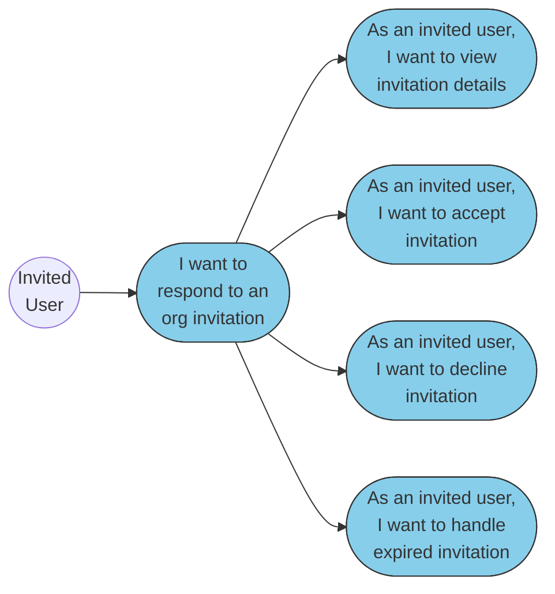

# Business Requirements Specification (BRS)
# BBWS Customer Portal (Private)

**Version**: 2.6
**Document ID**: BRS-2.2
**Created**: 2026-01-05
**Last Updated**: 2026-01-19
**Status**: Draft
**Author**: Business Analyst Agent
**Audience**: Business Owners, Executive Leadership, Product Management

---

## Document Control

| Version | Date | Author | Changes |
|---------|------|--------|---------|
| 2.6 | 2026-01-19 | Business Analyst Agent | Added Section 14 (UX/UI Design) with screen inventory, routes, design principles, and UI components; updated Related Documents |
| 2.5 | 2026-01-19 | Business Analyst Agent | Merged BRS 2.1.2 (Authentication Management): added Email Verification (US 1.5-1.8), Password Recovery (US 3.2-3.7), 48 business rules; 10 epics, 65 user stories |
| 2.4 | 2026-01-19 | Business Analyst Agent | Organisation-based hierarchy: Organisation → Tenant(s) → Sites; users belong to org and are assigned to tenants; ideal for agencies; 10 epics, 55 user stories |
| 2.3 | 2026-01-19 | Business Analyst Agent | Simplified hierarchy model: User → Tenant(s) → Sites; removed divisions/teams; 2+ tenants = organisation view |
| 2.2 | 2026-01-19 | Business Analyst Agent | Restructured epics for complete user journey: Epic 1 (Registration) → Epic 2 (Invitation) → Epic 3 (Authentication) |
| 2.1 | 2026-01-19 | Business Analyst Agent | Merged BRS 2.1.6 (Invitation Management) - added invitation response use cases, business rules BR-016-020 |
| 2.0 | 2026-01-19 | Business Analyst Agent | Restructured to conform to BRS template v2.0; added Executive Summary, Epic Summary, User Personas |
| 1.0 | 2026-01-05 | Business Analyst Agent | Initial version |

---

## Table of Contents

1. [Executive Summary (Narrative)](#1-executive-summary-narrative)
2. [List of Epics and User Stories](#2-list-of-epics-and-user-stories)
3. [Use Case Diagrams](#3-use-case-diagrams)
4. [User Personas](#4-user-personas)
5. [Business Capabilities](#5-business-capabilities)
6. [Business Rules](#6-business-rules)
7. [Success Criteria](#7-success-criteria)
8. [Scope](#8-scope)
9. [Risks and Mitigations](#9-risks-and-mitigations)
10. [Assumptions and Constraints](#10-assumptions-and-constraints)
11. [Dependencies](#11-dependencies)
12. [Glossary](#12-glossary)
13. [Related Documents](#13-related-documents)
14. [UX/UI Design](#14-uxui-design)
15. [Sign-Off](#15-sign-off)

---

## 1. Executive Summary (Narrative)

**The Problem**: Today, customers managing WordPress sites must navigate complex hosting environments, coordinate with technical staff for routine operations, and struggle with fragmented tools for billing, support, and site management. Site creation takes 3-5 business days, environment promotions require manual intervention, and customers lack visibility into their service status. This creates frustration for business users who want to focus on their websites, not infrastructure, and generates significant support overhead for routine tasks that should be self-service.

**The Solution**: The BBWS Customer Portal (Private) provides a unified self-service dashboard where authenticated customers can manage their entire WordPress hosting lifecycle. Customers can create new sites in minutes, promote changes through DEV/SIT/PROD environments with one click, manage backups, handle billing and subscriptions, and submit support tickets—all without technical assistance. The portal supports multi-tenant organisations, enabling enterprise customers to delegate access across teams while maintaining centralised billing and governance.

**The Conclusion**: This portal will reduce site creation time from 3-5 days to under 30 minutes, enable 80% of operations to be self-service (reducing support tickets by 60%), and provide customers with 24/7 visibility into their service status. The multi-tenant hierarchy supports enterprise customers with up to 100 sites across multiple teams, driving customer satisfaction scores above 4.5/5.0 and reducing churn by 25%.

---

## 2. List of Epics and User Stories

>This hierarchical table shows all Epics (bold rows) and their User Stories (indented rows) in **user journey order**. The journey starts with registration (creates organisation + first tenant), then invitation acceptance, authentication, and ongoing portal usage.
>
> **Hierarchy Model**: Organisation → Tenant(s) → Sites. Users belong to an Organisation and are assigned to specific Tenants. Ideal for agencies managing multiple client tenants.

| # | Name | One-Line Description | Persona | Phase |
|---|------|---------------------|---------|-------|
| **Epic 1** | **User Registration & Email Verification** | **Enable new users to register, verify email, and complete onboarding with organisation and tenant creation** | **New User** | **1** |
| US 1.1 | Register Account | As a new user, I want to register with my email so that I can access the platform | | |
| US 1.2 | Create Organisation & First Tenant | As a new user, I want my organisation and first tenant created during registration so that I have a workspace | | |
| US 1.3 | Become Organisation Admin | As a new user, I want to automatically become organisation admin so that I can manage users and tenants | | |
| US 1.4 | Secure Password Setup | As a new user, I want to set up my password securely so that my account is protected | | |
| US 1.5 | Receive Verification Email | As a new user, I want to receive a verification email so that I can confirm my email address | | |
| US 1.6 | Verify Email Address | As a new user, I want to click a link to verify my email so that my account is activated | | |
| US 1.7 | Request New Verification Email | As a new user, I want to request a new verification email so that I can verify if I lost the first email | | |
| US 1.8 | Receive Welcome Email | As a new user, I want to receive a welcome email so that I know verification succeeded | | |
| US 1.9 | Complete Registration Payment | As a new user, I want to complete payment so that my tenant is activated | | |
| US 1.10 | Guided Onboarding Tour | As a new user, I want a guided tour so that I can learn how to use the portal | | |
| **Epic 2** | **Invitation Response** | **Enable invited users to view, accept, or decline organisation invitations** | **Invited User** | **1** |
| US 2.1 | View Invitation Details | As an invited user, I want to view invitation details so that I know which organisation invited me | | |
| US 2.2 | Accept Invitation | As an invited user, I want to accept an invitation so that I can join the organisation | | |
| US 2.3 | Decline Invitation | As an invited user, I want to decline an invitation so that I can refuse if not interested | | |
| US 2.4 | Handle Expired Invitation | As an invited user, I want to see if an invitation expired so that I can request a new one | | |
| **Epic 3** | **Customer Authentication & Password Recovery** | **Enable customers to securely login, recover passwords, manage profiles, and use MFA** | **Customer** | **1** |
| US 3.1 | Login to Portal | As a customer, I want to login securely so that I can access my account | | |
| US 3.2 | Stay Logged In | As a customer, I want to stay logged in on my device so that I don't re-enter credentials every visit | | |
| US 3.3 | View Login Error Message | As a customer, I want to see a clear message if login fails so that I know what went wrong | | |
| US 3.4 | Request Password Reset | As a customer, I want to request a password reset so that I can regain access if I forget my password | | |
| US 3.5 | Receive Password Reset Code | As a customer, I want to receive a reset code by email so that I can securely reset my password | | |
| US 3.6 | Set New Password with Code | As a customer, I want to set a new password with my code so that I can access my account again | | |
| US 3.7 | Receive Password Change Notification | As a customer, I want to be notified my password was changed so that I know if someone else changed it | | |
| US 3.8 | View My Profile | As a customer, I want to view my profile information so that I can verify my account details | | |
| US 3.9 | Update My Profile | As a customer, I want to update my profile information so that I can keep my details current | | |
| US 3.10 | Enable MFA | As a customer, I want to enable multi-factor authentication so that my account is more secure | | |
| US 3.11 | Logout Securely | As a customer, I want to logout securely so that my session is properly terminated | | |
| **Epic 4** | **Dashboard & Account Management** | **Provide customers with a unified dashboard showing site status, subscriptions, and quick actions** | **Customer** | **1** |
| US 4.1 | View Dashboard | As a customer, I want to view my dashboard so that I can see all my sites and status at a glance | | |
| US 4.2 | Update Account Settings | As a customer, I want to update my account settings so that I can configure my preferences | | |
| US 4.3 | Setup MFA | As a customer, I want to setup MFA from account settings so that I can enhance my security | | |
| **Epic 5** | **Organisation & User Management** | **Enable org admins to manage organisation details, invite users, and assign them to tenants** | **Org Admin** | **1** |
| US 5.1 | View Organisation Details | As an org admin, I want to view my organisation details so that I can see the overview | | |
| US 5.2 | Manage Organisation Settings | As an org admin, I want to manage organisation settings so that I can configure policies | | |
| US 5.3 | Invite User to Organisation | As an org admin, I want to invite users to my organisation so that they can collaborate | | |
| US 5.4 | View Organisation Users | As an org admin, I want to view all users in my organisation so that I can manage them | | |
| US 5.5 | Assign User to Tenant | As an org admin, I want to assign users to specific tenants so that they can access those tenants | | |
| US 5.6 | Remove User from Tenant | As an org admin, I want to remove users from tenants so that they lose access to specific tenants | | |
| US 5.7 | Manage User Roles | As an org admin, I want to manage user roles so that users have appropriate permissions | | |
| US 5.8 | Remove User from Organisation | As an org admin, I want to remove users from my organisation so that former members lose all access | | |
| **Epic 6** | **Tenant Management** | **Enable org admins to create and manage multiple tenants within their organisation** | **Org Admin** | **1** |
| US 6.1 | View My Tenants | As an org admin, I want to view all tenants in my organisation so that I can manage them | | |
| US 6.2 | Create New Tenant | As an org admin, I want to create additional tenants so that I can manage different clients/projects | | |
| US 6.3 | Manage Tenant Settings | As an org admin, I want to manage tenant settings so that I can configure each tenant | | |
| US 6.4 | View Tenant Users | As an org admin, I want to view users assigned to a tenant so that I can manage tenant access | | |
| US 6.5 | Switch Between Tenants | As a user, I want to switch between tenants I'm assigned to so that I can work on different projects | | |
| **Epic 7** | **Site Management** | **Enable customers to create, manage, and operate WordPress sites with multi-environment support** | **Customer** | **1** |
| US 7.1 | Create New WordPress Site | As a customer, I want to create a new WordPress site so that I can establish my web presence | | |
| US 7.2 | View Site Details | As a customer, I want to view site details so that I can monitor my site status | | |
| US 7.3 | Manage Site Environments | As a customer, I want to manage site environments so that I can test changes safely | | |
| US 7.4 | Promote Site to Next Environment | As a customer, I want to promote my site so that tested changes go live | | |
| US 7.5 | Create Site Backup | As a customer, I want to create site backups so that I can recover from issues | | |
| US 7.6 | Restore Site from Backup | As a customer, I want to restore from backup so that I can recover lost content | | |
| US 7.7 | Launch Site to Production | As a customer, I want to launch my site to production so that it becomes publicly accessible | | |
| US 7.8 | Start WordPress Migration | As a customer, I want to migrate my existing WordPress so that I can move to BBWS hosting | | |
| US 7.9 | Complete Mode A Migration | As a customer, I want to complete full-access migration so that all content is transferred | | |
| US 7.10 | Complete Mode B Migration | As a customer, I want to complete scrape-and-rebuild migration so that I can migrate without admin access | | |
| US 7.11 | Create DNS-Only Site | As a customer, I want to create a DNS-only site so that I can manage DNS without hosting | | |
| US 7.12 | Manage DNS Records | As a customer, I want to manage DNS records so that I can configure my domain settings | | |
| US 7.13 | View DNS Site Details | As a customer, I want to view DNS site details so that I can verify DNS configuration | | |
| **Epic 8** | **Billing & Subscriptions** | **Allow customers to manage subscriptions, view invoices, and handle plan upgrades/downgrades** | **Org Admin** | **1** |
| US 8.1 | View My Subscription | As a customer, I want to view my subscription so that I can see my current plan and usage | | |
| US 8.2 | Upgrade My Plan | As a customer, I want to upgrade my plan so that I can access more features or capacity | | |
| US 8.3 | Downgrade My Plan | As a customer, I want to downgrade my plan so that I can reduce costs | | |
| US 8.4 | View Payment History | As a customer, I want to view payment history so that I can track my spending | | |
| US 8.5 | View and Download Invoice | As a customer, I want to download invoices so that I can keep financial records | | |
| US 8.6 | Complete Payment via Checkout | As a customer, I want to complete payment so that I can activate my subscription | | |
| **Epic 9** | **Support Tickets** | **Provide customers with self-service ticket creation and tracking for support requests** | **Customer** | **1** |
| US 9.1 | View My Tickets | As a customer, I want to view my tickets so that I can track support requests | | |
| US 9.2 | Create Support Ticket | As a customer, I want to create a ticket so that I can request help with issues | | |
| US 9.3 | View Ticket Details | As a customer, I want to view ticket details so that I can see the full conversation | | |
| US 9.4 | Reply to Ticket | As a customer, I want to reply to a ticket so that I can provide additional information | | |
| **Epic 10** | **White-Label & Marketplace** | **Enable partners to offer white-labelled portal access with custom branding and billing** | **Partner** | **2** |
| US 10.1 | Configure Custom Branding | As a partner, I want to configure branding so that my customers see my brand | | |
| US 10.2 | Delegated Administration | As a partner admin, I want delegated administration so that I can manage my customers | | |
| US 10.3 | Marketplace Subscription Management | As a partner, I want marketplace subscriptions so that customers can subscribe through marketplaces | | |
| US 10.4 | Billing and Metering Data | As a partner, I want billing data so that I can invoice my customers accurately | | |
| | **Total User Stories** | | | **65** |

---

## 3. Use Case Diagrams

> **Note**: Diagrams follow the user journey order - starting with registration (creates organisation + first tenant), then invitation, authentication, and ongoing portal usage.
>
> **Hierarchy Model**: Organisation → Tenant(s) → Sites. Users belong to an Organisation and are assigned to specific Tenants. Ideal for agencies managing multiple client tenants.

### 3.1 Epic 1: User Registration & Email Verification

### 3.2 Epic 2: Invitation Response

### 3.3 Epic 3: Customer Authentication & Password Recovery

### 3.4 Epic 4: Dashboard & Account Management

### 3.5 Epic 5: Organisation & User Management

### 3.6 Epic 6: Tenant Management

### 3.7 Epic 7: Site Management

#### 3.7.1 Epic 7: Site Migration & DNS

### 3.8 Epic 8: Billing & Subscriptions

### 3.9 Epic 9: Support Tickets

### 3.10 Epic 10: White-Label & Marketplace

### 3.11 Epic Colour Reference

| Epic # | Name | Colour | Hex Code |
|--------|------|--------|----------|
| Epic 1 | User Registration & Email Verification | Tan | #d4a574 |
| Epic 2 | Invitation Response | Sky Blue | #87ceeb |
| Epic 3 | Customer Authentication & Password Recovery | Light Green | #90ee90 |
| Epic 4 | Dashboard & Account Management | Plum | #dda0dd |
| Epic 5 | Organisation & User Management | Khaki | #f0e68c |
| Epic 6 | Tenant Management | Light Pink | #ffb6c1 |
| Epic 7 | Site Management | Pale Green | #98fb98 |
| Epic 8 | Billing & Subscriptions | Lavender | #e6e6fa |
| Epic 9 | Support Tickets | Light Salmon | #ffa07a |
| Epic 10 | White-Label & Marketplace | Silver | #c0c0c0 |

**Diagram Legend:**
- **Circle (( ))**: Actor/Role initiating use cases
- **Rounded rectangle ([ ])**: Use case in user story format
- **Solid arrows**: Actor initiates use case or use case hierarchy

---

## 4. User Personas

### 4.1 Organisation Admin (Owner)

**Roles**: Tenant Owner, Business Owner

| Attribute | Description |
|-----------|-------------|
| **Goals** | Full control over tenant, manage billing, oversee all sites and users |
| **Pain Points** | Need visibility across sites, billing complexity, user management overhead |
| **Success Criteria** | All sites running smoothly, costs optimised, users productive |
| **Permission Level** | Full access to all features including billing and admin management |
| **Access Scope** | All tenants they own, sites, and users within those tenants |

**Primary Activities**:
- Manage organisation settings and billing
- Invite and manage administrators
- Oversee subscription plans and invoices
- Configure organisation-wide policies

### 4.2 Customer (Admin)

**Roles**: Team Lead, Project Manager, Site Manager

| Attribute | Description |
|-----------|-------------|
| **Goals** | Manage team sites and users, ensure site availability, handle day-to-day operations |
| **Pain Points** | Site provisioning delays, environment promotion complexity, user access requests |
| **Success Criteria** | Sites deployed quickly, environments stable, team productive |
| **Permission Level** | Manage sites, users (except super-admins), tenants |
| **Access Scope** | Assigned tenants and their sites/users |

**Primary Activities**:
- Create and manage WordPress sites
- Promote changes through environments (DEV → SIT → PROD)
- Manage team user access
- Handle backups and restores

### 4.3 Customer (User)

**Roles**: Content Editor, Site Contributor, Developer

| Attribute | Description |
|-----------|-------------|
| **Goals** | Create and edit site content, manage assigned sites |
| **Pain Points** | Limited access to tools, dependency on admins for changes |
| **Success Criteria** | Content published quickly, site changes deployed smoothly |
| **Permission Level** | Create/edit sites and content, view own data |
| **Access Scope** | Assigned sites within assigned tenants |

**Primary Activities**:
- Edit WordPress content
- Request environment promotions
- View site status and logs

### 4.4 Customer (Viewer)

**Roles**: Stakeholder, Auditor, Read-Only User

| Attribute | Description |
|-----------|-------------|
| **Goals** | Monitor site status, review configurations, audit access |
| **Pain Points** | Need visibility without edit access |
| **Success Criteria** | Access to view all relevant data without disruption |
| **Permission Level** | Read-only access to sites and data |
| **Access Scope** | View-only access to assigned tenants |

**Primary Activities**:
- View dashboard and site status
- Review billing and invoices
- Monitor support tickets

### 4.5 White-Label Partner

**Roles**: Reseller, Agency, Managed Service Provider

| Attribute | Description |
|-----------|-------------|
| **Goals** | Offer white-labelled hosting service under their brand |
| **Pain Points** | Need custom branding, delegated billing, customer isolation |
| **Success Criteria** | Customers see partner brand, billing flows through partner |
| **Permission Level** | Delegated administration for their customers |
| **Access Scope** | Their own customer base only |

**Primary Activities**:
- Configure custom branding
- Manage delegated customer accounts
- Access billing and metering data

### 4.6 New User

**Roles**: First-Time User, Invited User

| Attribute | Description |
|-----------|-------------|
| **Goals** | Complete registration, set up account, learn the platform |
| **Pain Points** | Unfamiliarity with platform, need guidance |
| **Success Criteria** | Successful registration, productive within first session |
| **Permission Level** | Determined by invitation or subscription |
| **Access Scope** | Initial access per assigned role |

**Primary Activities**:
- Complete registration after payment
- Set up password and MFA
- Complete onboarding tour

### 4.7 Invited User

**Roles**: Email Invitation Recipient, Organisation Invitee

| Attribute | Description |
|-----------|-------------|
| **Goals** | Review invitation, decide to accept or decline, join organisation |
| **Pain Points** | Uncertainty about who invited them, unclear role assignment, expired links |
| **Success Criteria** | Clear understanding of invitation, quick decision process, successful joining |
| **Permission Level** | View invitation details, accept or decline |
| **Access Scope** | Invitation details only until acceptance |

**Primary Activities**:
- View invitation details (organisation, role, inviter)
- Accept invitation to join organisation
- Decline invitation if not interested
- Request new invitation if expired

---

## 5. Business Capabilities

> **Note**: The detailed user story specifications below use legacy numbering (US X.X format within each section). These map to the Epic table in Section 2 as follows:
> - Section 5.1 (US 1.1-1.4) → Epic 3: Customer Authentication (US 3.8-3.11)
> - Section 5.2 (US 2.1-2.3) → Epic 4: Dashboard & Account Management (US 4.1-4.3)
> - Section 5.3 (US 3.1-3.12) → Epics 2, 5, 6: Invitation, Organisation & Tenant Management
> - Section 5.4 (US 4.1-4.13) → Epic 7: Site Management (US 7.1-7.13)
> - Section 5.5 (US 5.1-5.6) → Epic 8: Billing & Subscriptions (US 8.1-8.6)
> - Section 5.6 (US 6.1-6.4) → Epic 9: Support Tickets (US 9.1-9.4)

### 5.1 Profile & Session Management (Epic 3: Customer Authentication)

**Business Need**: Enable customers to securely access the portal with profile management and multi-factor authentication.

### Use Case 1.1: Profile & Session Management

#### US 1.1: View My Profile

**User Story:**
> As a customer,
> I want to view my profile information,
> So that I can verify my account details are correct.

**Pre-conditions:**
- Customer is authenticated with valid JWT
- Session is active (not expired)

**Positive Scenario: View Profile Successfully**

1. Customer accesses Account Settings screen (CP-002)
2. FrontendUI calls Portal Auth Service GET `/portal/auth/me`
3. Portal Auth Service validates JWT and returns user profile
4. FrontendUI displays: name, email, phone, role, organisation, last login
5. Customer can see linked tenants and organisations
6. Customer can navigate to edit profile

**Negative Scenario: Session Expired**

1. Customer attempts to access profile
2. Portal Auth Service returns 401 Unauthorized (token expired)
3. FrontendUI redirects to login page with message "Session expired, please login again"
4. Customer logs in with credentials
5. Customer is redirected back to profile page

**Edge Case: Concurrent Session Conflict**

1. Customer is logged in on two devices
2. Customer changes password on Device A
3. Device B session is invalidated
4. Device B redirects to login with message "Session invalidated due to security update"

**Post-conditions:**
- Profile data is displayed
- Session remains active
- Audit log entry created

**Acceptance Criteria:**
- [ ] Profile loads within 500ms
- [ ] All user fields are displayed accurately
- [ ] Linked organisations and tenants are shown
- [ ] Role and permissions are displayed
- [ ] Last login timestamp is shown
- [ ] Error messages MUST be clear and actionable
- [ ] The system MUST handle session expiry gracefully

---

#### US 1.2: Update My Profile

**User Story:**
> As a customer,
> I want to update my profile information,
> So that I can keep my account details current.

**Pre-conditions:**
- Customer is authenticated
- Customer has permission to edit their own profile

**Positive Scenario: Update Profile Successfully**

1. Customer navigates to Account Settings (CP-002)
2. Customer edits fields: name, phone, notification preferences
3. Customer clicks "Save Changes"
4. FrontendUI calls Portal Auth Service PUT `/portal/auth/me`
5. Portal Auth Service validates and updates profile
6. FrontendUI displays success message: "Profile updated successfully"
7. Updated information is displayed

**Negative Scenario: Validation Error**

1. Customer enters invalid phone number format
2. FrontendUI validates client-side and shows error
3. Customer corrects phone number
4. Submission succeeds

**Edge Case: Concurrent Update Conflict**

1. Customer A and Customer B both editing same shared setting
2. Customer A saves first
3. Customer B's save shows conflict warning
4. Customer B can choose to override or reload

**Post-conditions:**
- Profile is updated in database
- Audit log entry created
- Email notification sent for sensitive changes

**Acceptance Criteria:**
- [ ] Name, phone, and preferences can be updated
- [ ] Email changes require re-verification
- [ ] Validation errors are shown inline
- [ ] Success confirmation is displayed
- [ ] Sensitive changes trigger email notification
- [ ] Error messages MUST be clear and actionable
- [ ] The system MUST prevent concurrent update conflicts

---

#### US 1.3: Enable MFA

**User Story:**
> As a customer,
> I want to enable Multi-Factor Authentication,
> So that my account is more secure.

**Pre-conditions:**
- Customer is authenticated
- MFA is not currently enabled

**Positive Scenario: Enable MFA Successfully**

1. Customer navigates to MFA Setup screen (CP-003)
2. FrontendUI calls Portal Auth Service POST `/portal/auth/mfa/enable`
3. Portal Auth Service generates TOTP secret and QR code
4. FrontendUI displays QR code and manual entry key
5. Customer scans QR code with authenticator app (Google Authenticator, Authy)
6. Customer enters 6-digit verification code
7. FrontendUI calls Portal Auth Service POST `/portal/auth/mfa/verify`
8. Portal Auth Service validates code and enables MFA
9. FrontendUI displays recovery codes (one-time use)
10. Customer saves recovery codes securely

**Negative Scenario: Invalid Verification Code**

1. Customer enters incorrect 6-digit code
2. Portal Auth Service returns verification error
3. FrontendUI displays: "Invalid code, please try again"
4. After 5 failed attempts, process is locked for 15 minutes
5. Customer can retry after cooldown

**Edge Case: Lost Authenticator Device**

1. Customer loses phone with authenticator app
2. Customer uses recovery code during login
3. Customer logs in successfully
4. System prompts to reconfigure MFA with new device
5. Old MFA configuration is invalidated

**Post-conditions:**
- MFA is enabled for account
- Recovery codes are generated
- Audit log entry created
- Confirmation email sent

**Acceptance Criteria:**
- [ ] QR code is scannable by standard authenticator apps
- [ ] Manual entry key is provided as alternative
- [ ] Recovery codes (10) are generated and displayed once
- [ ] Code verification works within 30-second TOTP window
- [ ] Failed attempts are rate-limited
- [ ] Error messages MUST be clear and actionable
- [ ] The system MUST support MFA recovery scenarios

---

#### US 1.4: Logout Securely

**User Story:**
> As a customer,
> I want to logout from my account,
> So that my session is terminated and data is protected.

**Pre-conditions:**
- Customer is authenticated
- Active session exists

**Positive Scenario: Logout Successfully**

1. Customer clicks "Logout" button
2. FrontendUI calls Portal Auth Service POST `/portal/auth/logout`
3. Portal Auth Service invalidates JWT token
4. FrontendUI clears local storage and cookies
5. Customer is redirected to public portal login page
6. Confirmation message: "You have been logged out successfully"

**Negative Scenario: Logout During Unsaved Changes**

1. Customer has unsaved changes on current page
2. Customer clicks logout
3. FrontendUI prompts: "You have unsaved changes. Logout anyway?"
4. Customer confirms or cancels
5. If confirmed, logout proceeds

**Edge Case: Force Logout All Sessions**

1. Customer clicks "Logout All Devices"
2. All active sessions are invalidated
3. Customer is redirected to login
4. Other devices show "Session terminated" on next action

**Post-conditions:**
- JWT token is invalidated
- Session is terminated
- Local storage is cleared
- Audit log entry created

**Acceptance Criteria:**
- [ ] JWT token is invalidated server-side
- [ ] Local storage and session cookies are cleared
- [ ] Redirect to public portal occurs
- [ ] "Logout All Devices" option is available
- [ ] Unsaved changes warning is shown
- [ ] Error messages MUST be clear and actionable
- [ ] The system MUST handle partial logout gracefully

---

## Epic 2: Dashboard & Account Management

**Epic ID:** EPIC-002
**Description:** Provide customer dashboard with summary widgets and account management
**Business Value:** Quick overview of service status, reduce navigation time, improve user experience
**Screens:** CP-001, CP-002, CP-003

### Use Case 2.1: Dashboard Overview (Epic 2)

#### US 2.1: View Dashboard

**User Story:**
> As a customer,
> I want to view my dashboard,
> So that I can see a summary of my sites, subscriptions, and recent activity.

**Pre-conditions:**
- Customer is authenticated
- Customer has at least one tenant

**Positive Scenario: View Dashboard Successfully**

1. Customer logs in and lands on Dashboard (CP-001)
2. FrontendUI makes parallel calls to multiple services:
   - GET `/portal/tenants` (list tenants)
   - GET `/portal/tenants/{tenantId}/sites` (list sites)
   - GET `/portal/subscription` (subscription status)
   - GET `/portal/tickets` (recent tickets)
3. FrontendUI displays summary widgets:
   - Total sites count with health status
   - Active subscription plan
   - Recent tickets (last 5)
   - Quick actions (Create Site, View Billing, Get Support)
4. Customer can click on any widget to navigate to details

**Negative Scenario: No Sites Yet**

1. New customer logs in for first time
2. Dashboard shows empty state for sites widget
3. FrontendUI displays: "You haven't created any sites yet"
4. Prominent "Create Your First Site" call-to-action is shown
5. Onboarding tips are displayed

**Edge Case: Service Partially Unavailable**

1. One of the dashboard API calls fails
2. FrontendUI displays available data with error widget
3. Error widget shows: "Some data unavailable. Click to retry."
4. Rest of dashboard remains functional
5. Customer can manually refresh failed widget

**Post-conditions:**
- Dashboard is rendered with available data
- Analytics event logged for dashboard view
- Widget state cached for performance

**Acceptance Criteria:**
- [ ] Dashboard loads within 2 seconds
- [ ] All widgets display accurate counts
- [ ] Site health status is color-coded (green/yellow/red)
- [ ] Quick actions navigate to correct screens
- [ ] Empty states have clear CTAs
- [ ] Partial failures don't break entire dashboard
- [ ] Error messages MUST be clear and actionable
- [ ] The system MUST handle partial service failures gracefully

---

#### US 2.2: Update Account Settings

**User Story:**
> As a customer,
> I want to update my account settings,
> So that I can configure my preferences and security options.

**Pre-conditions:**
- Customer is authenticated
- Customer is on Account Settings screen (CP-002)

**Positive Scenario: Update Notification Preferences**

1. Customer navigates to Account Settings (CP-002)
2. Customer modifies notification preferences:
   - Email notifications for billing
   - Email notifications for site health
   - Email notifications for support tickets
3. Customer clicks "Save Preferences"
4. FrontendUI calls Portal Auth Service PUT `/portal/auth/me`
5. Portal Auth Service updates preferences
6. FrontendUI displays: "Preferences saved successfully"

**Negative Scenario: Password Change Fails Validation**

1. Customer attempts to change password
2. New password doesn't meet requirements (see password policy)
3. FrontendUI displays inline validation errors
4. Customer corrects password
5. Password change succeeds

**Edge Case: Change Email Address**

1. Customer changes email address
2. Portal Auth Service sends verification to new email
3. Old email receives notification of pending change
4. Customer verifies new email within 24 hours
5. Email is updated after verification

**Post-conditions:**
- Settings are updated
- Confirmation displayed
- Audit log entry created

**Acceptance Criteria:**
- [ ] All configurable settings are displayed
- [ ] Changes are validated before submission
- [ ] Email changes require verification
- [ ] Password changes require current password
- [ ] Success confirmation is displayed
- [ ] Error messages MUST be clear and actionable
- [ ] The system MUST validate all input fields

---

#### US 2.3: Setup MFA

**User Story:**
> As a customer,
> I want to setup or manage my MFA configuration,
> So that I can enhance my account security.

**Pre-conditions:**
- Customer is authenticated
- Customer has admin or super-admin role

**Positive Scenario: Setup MFA from Account Screen**

1. Customer navigates to MFA Setup screen (CP-003)
2. If MFA not enabled: FrontendUI shows setup wizard
3. If MFA enabled: FrontendUI shows management options:
   - View recovery codes (requires password)
   - Regenerate recovery codes
   - Disable MFA (requires password and code)
4. Customer completes desired action
5. Confirmation message displayed

**Negative Scenario: Disable MFA Without Code**

1. Customer attempts to disable MFA
2. Customer enters password but wrong TOTP code
3. FrontendUI displays: "Invalid authentication code"
4. Customer must provide correct code to proceed
5. After 5 failures, action is locked for 1 hour

**Edge Case: Super-Admin Enforces MFA Policy**

1. Organisation has MFA required policy
2. Customer (admin/user) cannot disable MFA
3. FrontendUI displays: "MFA is required by your organisation policy"
4. Only regenerate recovery codes option is available

**Post-conditions:**
- MFA configuration updated
- Audit log entry created
- Notification sent for security changes

**Acceptance Criteria:**
- [ ] MFA setup wizard is user-friendly
- [ ] Recovery codes can be viewed/regenerated
- [ ] Disabling MFA requires password + code
- [ ] Organisation policies are enforced
- [ ] All security changes are audited
- [ ] Error messages MUST be clear and actionable
- [ ] The system MUST enforce MFA policies

---

## Epic 3: Organisation & Tenant Management

**Epic ID:** EPIC-003
**Description:** Enable customers to manage multi-tenant hierarchy (Organisation -> Tenant -> Site -> User)
**Business Value:** Support enterprise customers with multiple teams, enable delegation and access control
**Screens:** CP-010 to CP-014 (Organisation), CP-020 to CP-024 (Tenant)

### Use Case 3.1: Organisation Management (Epic 3)

#### US 3.1: View My Organisations

**User Story:**
> As a customer,
> I want to view my organisations,
> So that I can see which organisations I belong to and their details.

**Pre-conditions:**
- Customer is authenticated
- Customer belongs to at least one organisation

**Positive Scenario: View Organisation List**

1. Customer navigates to My Organisations screen (CP-010)
2. FrontendUI calls Portal Organisation Service GET `/portal/organisations`
3. Portal Organisation Service returns list of organisations where user has membership
4. FrontendUI displays organisation list with:
   - Organisation name
   - User's role in each organisation
   - Number of tenants
   - Number of users
5. Customer can click on any organisation to view details

**Negative Scenario: No Organisations**

1. Customer is individual user (no organisation)
2. FrontendUI displays empty state
3. Message: "You are not part of any organisation"
4. Option to create organisation or request invitation is shown

**Edge Case: Multiple Organisations with Different Roles**

1. Customer belongs to 3 organisations with different roles
2. Role-based actions are shown per organisation
3. Customer sees super-admin actions only for their owned org
4. View-only actions for orgs where they are viewer

**Post-conditions:**
- Organisation list is displayed
- Role-specific actions are available
- Navigation to organisation details is enabled

**Acceptance Criteria:**
- [ ] All organisations user belongs to are listed
- [ ] User's role in each organisation is displayed
- [ ] Tenant count per organisation is accurate
- [ ] User count per organisation is accurate
- [ ] Role-specific actions are contextual
- [ ] Error messages MUST be clear and actionable
- [ ] The system MUST support multiple organisation memberships

---

#### US 3.2: Manage Organisation Details

**User Story:**
> As an admin,
> I want to view and edit organisation details,
> So that I can keep organisation information current.

**Pre-conditions:**
- Customer is authenticated
- Customer has admin or super-admin role in organisation

**Positive Scenario: Update Organisation Details**

1. Customer navigates to Organisation Details (CP-011)
2. FrontendUI calls GET `/portal/organisations/{orgId}`
3. FrontendUI displays organisation details:
   - Name, description, logo
   - Address, phone, website
   - Billing email
   - Created date, last updated
4. Customer edits allowed fields
5. FrontendUI calls PUT `/portal/organisations/{orgId}`
6. Success message: "Organisation updated successfully"

**Negative Scenario: Insufficient Permissions**

1. Customer with viewer role tries to edit
2. FrontendUI shows fields as read-only
3. Edit button is disabled
4. Tooltip: "Contact an admin to make changes"

**Edge Case: Validate Unique Organisation Name**

1. Customer changes organisation name to one that exists
2. Portal Organisation Service returns conflict error
3. FrontendUI displays: "An organisation with this name already exists"
4. Customer enters unique name
5. Update succeeds

**Post-conditions:**
- Organisation is updated
- Audit log entry created
- All org members can see updated info

**Acceptance Criteria:**
- [ ] Organisation name can be updated (with uniqueness check)
- [ ] Logo upload is supported
- [ ] Address and contact info can be edited
- [ ] Billing email can be set
- [ ] Only admin/super-admin can edit
- [ ] Error messages MUST be clear and actionable
- [ ] The system MUST enforce role-based permissions

---

#### US 3.3: View Organisation Tenants

**User Story:**
> As an admin,
> I want to view tenants in my organisation,
> So that I can manage the teams/projects under my organisation.

**Pre-conditions:**
- Customer is authenticated
- Customer has admin or super-admin role

**Positive Scenario: List Organisation Tenants**

1. Customer navigates to Organisation Tenants (CP-012)
2. FrontendUI calls GET `/portal/organisations/{orgId}/tenants` (via OrgTenantsIndex GSI)
3. FrontendUI displays tenant list:
   - Tenant name
   - Number of sites
   - Number of users
   - Subscription plan
   - Status (active/suspended)
4. Customer can search and filter tenants
5. Customer can click to navigate to tenant details

**Negative Scenario: No Tenants Created**

1. New organisation has no tenants
2. FrontendUI displays empty state
3. Message: "No tenants created yet"
4. Prominent "Create First Tenant" button shown

**Edge Case: Suspended Tenant**

1. Tenant is suspended (non-payment)
2. Tenant shows with warning indicator
3. Limited actions available (view only, billing)
4. Message: "This tenant is suspended. Please update payment to restore access."

**Post-conditions:**
- Tenant list is displayed
- Tenant status indicators are accurate
- Navigation to tenant management is enabled

**Acceptance Criteria:**
- [ ] All tenants in organisation are listed
- [ ] Site count per tenant is accurate
- [ ] Subscription status is displayed
- [ ] Suspended tenants are clearly indicated
- [ ] Search and filter functionality works
- [ ] Error messages MUST be clear and actionable
- [ ] The system MUST display tenant health status

---

#### US 3.4: Invite User to Organisation

**User Story:**
> As an admin,
> I want to invite users to my organisation,
> So that team members can access organisation resources.

**Pre-conditions:**
- Customer is authenticated
- Customer has admin or super-admin role
- Customer is in organisation management context

**Positive Scenario: Invite User Successfully**

1. Customer navigates to Organisation Users (CP-013)
2. Customer clicks "Invite User"
3. Customer opens Invite Org User form (CP-014)
4. Customer enters:
   - Email address
   - Role (admin, user, viewer)
   - Optional: specific tenant access
5. FrontendUI calls POST `/portal/organisations/{orgId}/users/invite`
6. Portal Organisation Service creates invitation record
7. Invitation Service sends email with accept/decline link
8. FrontendUI displays: "Invitation sent successfully"

**Negative Scenario: Email Already Member**

1. Customer enters email of existing member
2. Portal Organisation Service returns conflict
3. FrontendUI displays: "This user is already a member"
4. Customer can update their role instead

**Edge Case: Invite Pending Expires**

1. Invitation is not accepted within 7 days
2. Cron job marks invitation as expired
3. Customer can resend invitation
4. New invitation link is generated

**Post-conditions:**
- Invitation record created
- Email sent to invitee
- Invitation appears in pending list

**Acceptance Criteria:**
- [ ] Email validation before submission
- [ ] Role selection is required
- [ ] Invitation email is sent within 1 minute
- [ ] Pending invitations are listed
- [ ] Invitations expire after 7 days
- [ ] Resend option is available
- [ ] Error messages MUST be clear and actionable
- [ ] The system MUST prevent duplicate invitations

---

### Use Case 3.2: Tenant Management (Epic 3)

#### US 3.5: View My Tenants

**User Story:**
> As a customer,
> I want to view my tenants,
> So that I can manage my team workspaces and sites.

**Pre-conditions:**
- Customer is authenticated
- Customer belongs to at least one tenant

**Positive Scenario: View Tenant List**

1. Customer navigates to My Tenants (CP-020)
2. FrontendUI calls GET `/portal/tenants`
3. Portal Tenant Service returns tenants where user has membership
4. FrontendUI displays tenant list:
   - Tenant name
   - Organisation (if applicable)
   - Number of sites
   - Subscription plan
   - User's role
5. Customer can click to view tenant details

**Negative Scenario: No Tenants**

1. Customer has no tenant memberships
2. FrontendUI displays empty state
3. Message: "You don't have any tenants yet"
4. Options: Create tenant or Accept pending invitation

**Edge Case: Tenant Without Organisation**

1. Customer has standalone tenant (no org)
2. Tenant shows "Independent" in organisation column
3. Full management capabilities available to owner

**Post-conditions:**
- Tenant list displayed
- Role-specific actions available
- Navigation to tenant details enabled

**Acceptance Criteria:**
- [ ] All tenants user belongs to are listed
- [ ] User's role in each tenant is displayed
- [ ] Site count per tenant is accurate
- [ ] Subscription plan is shown
- [ ] Independent tenants are indicated
- [ ] Error messages MUST be clear and actionable
- [ ] The system MUST support multi-tenant memberships

---

#### US 3.6: Create Tenant

**User Story:**
> As an admin,
> I want to create a new tenant,
> So that I can provision a workspace for a team or project.

**Pre-conditions:**
- Customer is authenticated
- Customer has permission to create tenants
- Subscription allows additional tenants

**Positive Scenario: Create Tenant Successfully**

1. Customer clicks "Create Tenant" on My Tenants (CP-020)
2. FrontendUI displays tenant creation form:
   - Tenant name (required)
   - Description
   - Associated organisation (if any)
3. Customer fills form and submits
4. FrontendUI calls POST `/portal/tenants`
5. Portal Tenant Service creates tenant record
6. Portal Tenant Service adds creator as super-admin
7. FrontendUI displays success and redirects to tenant details

**Negative Scenario: Tenant Limit Reached**

1. Customer's subscription has tenant limit (e.g., 5)
2. Customer already has 5 tenants
3. FrontendUI calls POST `/portal/tenants`
4. Portal Tenant Service returns 402 (subscription limit)
5. FrontendUI displays: "Tenant limit reached. Upgrade your plan to create more."
6. Link to upgrade plan is provided

**Edge Case: Duplicate Tenant Name**

1. Customer enters name of existing tenant in same org
2. Portal Tenant Service returns conflict
3. FrontendUI displays: "A tenant with this name already exists"
4. Customer enters unique name
5. Creation succeeds

**Post-conditions:**
- Tenant is created in DynamoDB
- Creator is assigned super-admin role
- Tenant appears in user's tenant list

**Acceptance Criteria:**
- [ ] Tenant name is required and validated
- [ ] Description is optional
- [ ] Organisation association is optional
- [ ] Creator becomes super-admin automatically
- [ ] Subscription limits are enforced
- [ ] Duplicate names within org are prevented
- [ ] Error messages MUST be clear and actionable
- [ ] The system MUST enforce subscription limits

---

#### US 3.7: Manage Tenant Users

**User Story:**
> As an admin,
> I want to manage users in my tenant,
> So that I can control access to tenant resources.

**Pre-conditions:**
- Customer is authenticated
- Customer has admin or super-admin role in tenant

**Positive Scenario: View and Manage Users**

1. Customer navigates to Tenant Users (CP-022)
2. FrontendUI calls GET `/portal/tenants/{tenantId}/users`
3. FrontendUI displays user list:
   - Name, email
   - Role (super-admin, admin, user, viewer)
   - Status (active, pending, suspended)
   - Last login
4. Customer can:
   - Change user role (if admin)
   - Remove user (if admin, except super-admin)
   - View user activity

**Negative Scenario: Cannot Remove Super-Admin**

1. Admin tries to remove super-admin user
2. FrontendUI disables remove action for super-admin
3. Tooltip: "Super-admins can only be removed by organisation owner"

**Edge Case: Last Admin Removal**

1. Admin attempts to remove last admin (themselves)
2. Portal Tenant Service prevents removal
3. FrontendUI displays: "Cannot remove last admin. Assign another admin first."

**Post-conditions:**
- User list is displayed
- Role changes are applied
- Audit log entries created

**Acceptance Criteria:**
- [ ] All tenant users are listed
- [ ] User roles can be changed by admin
- [ ] Users can be removed (except super-admin)
- [ ] Last admin cannot be removed
- [ ] Pending invitations are shown
- [ ] Error messages MUST be clear and actionable
- [ ] The system MUST prevent removal of last admin

---

#### US 3.8: Invite User to Tenant

**User Story:**
> As an admin,
> I want to invite users to my tenant,
> So that team members can access tenant sites and resources.

**Pre-conditions:**
- Customer is authenticated
- Customer has admin role in tenant

**Positive Scenario: Invite User Successfully**

1. Customer navigates to Invite Tenant User (CP-023)
2. Customer enters:
   - Email address
   - Role (admin, user, viewer)
3. FrontendUI calls POST `/portal/tenants/{tenantId}/users/invite`
4. Portal Tenant Service creates invitation
5. Invitation Service sends email
6. FrontendUI displays: "Invitation sent to [email]"

**Negative Scenario: Invalid Email**

1. Customer enters malformed email
2. FrontendUI validates client-side
3. Error displayed: "Please enter a valid email address"
4. Customer corrects and submits

**Edge Case: Existing Org Member**

1. Customer invites user who is already in organisation
2. Portal Tenant Service auto-links to existing user
3. User gets access immediately (no email required)
4. FrontendUI displays: "[Name] added to tenant"

**Post-conditions:**
- Invitation created or user added
- Email sent (if new user)
- Pending invitation listed

**Acceptance Criteria:**
- [ ] Email validation is enforced
- [ ] Role selection is required
- [ ] Existing org members are linked immediately
- [ ] New users receive invitation email
- [ ] Invitation expires after 7 days
- [ ] Duplicate invitations are prevented
- [ ] Error messages MUST be clear and actionable
- [ ] The system MUST support existing user linking

---

### Use Case 3.3: Invitation Response (Epic 3)

#### US 3.9: View Invitation Details

**User Story:**
> As an invited user,
> I want to view invitation details,
> So that I know which organisation invited me and what role I'll have.

**Pre-conditions:**
- User has received invitation email with unique token
- Invitation has not expired
- User clicks invitation link

**Positive Scenario: View Valid Invitation**

1. User clicks invitation link in email
2. FrontendUI loads invitation page with token from URL
3. FrontendUI calls GET `/portal/invitations/{token}`
4. Portal Invitation Service validates token and returns invitation details:
   - Organisation name
   - Inviter name
   - Assigned role
   - Expiry date
5. FrontendUI displays invitation details with Accept/Decline buttons

**Negative Scenario: Invalid Token**

1. User clicks link with invalid/tampered token
2. Portal Invitation Service returns 404 Not Found
3. FrontendUI displays: "Invalid invitation link. Please contact the person who invited you."
4. No Accept/Decline buttons shown

**Post-conditions:**
- Invitation details displayed
- User can choose to accept or decline

**Acceptance Criteria:**
- [ ] Invitation details load within 1 second
- [ ] Organisation name is clearly displayed
- [ ] Assigned role is shown
- [ ] Expiry date is visible
- [ ] Invalid tokens show clear error message
- [ ] Accept and Decline buttons are prominent

---

#### US 3.10: Accept Invitation

**User Story:**
> As an invited user,
> I want to accept an invitation,
> So that I can join the organisation with my assigned role.

**Pre-conditions:**
- User is viewing valid invitation details
- Invitation has not expired
- Invitation has not been previously accepted

**Positive Scenario: Accept Invitation (New User)**

1. User clicks "Accept Invitation" button
2. FrontendUI checks if user is authenticated
3. If not authenticated, redirect to registration/login
4. After authentication, FrontendUI calls POST `/portal/invitations/{token}/accept`
5. Portal Invitation Service:
   - Validates token is still valid
   - Links user to organisation with assigned role
   - Marks invitation as used
   - Notifies organisation admin
6. FrontendUI redirects to organisation dashboard
7. Success message: "Welcome to [Organisation Name]!"

**Positive Scenario: Accept Invitation (Existing User)**

1. Existing user clicks invitation link
2. User is already logged in
3. FrontendUI calls POST `/portal/invitations/{token}/accept`
4. User is added to organisation
5. FrontendUI redirects to organisation dashboard

**Negative Scenario: Invitation Already Used**

1. User tries to accept already-used invitation
2. Portal Invitation Service returns 410 Gone
3. FrontendUI displays: "This invitation has already been used."
4. Link to login page provided

**Post-conditions:**
- User is member of organisation
- User has assigned role
- Invitation is marked as used
- Admin is notified

**Acceptance Criteria:**
- [ ] Acceptance completes within 2 seconds
- [ ] User is added with correct role
- [ ] Single-use token cannot be reused
- [ ] Admin receives notification
- [ ] User is redirected to organisation dashboard
- [ ] Error messages MUST be clear and actionable

---

#### US 3.11: Decline Invitation

**User Story:**
> As an invited user,
> I want to decline an invitation,
> So that I can refuse if I'm not interested in joining.

**Pre-conditions:**
- User is viewing valid invitation details
- Invitation has not expired

**Positive Scenario: Decline Invitation**

1. User clicks "Decline Invitation" button
2. FrontendUI shows confirmation: "Are you sure you want to decline?"
3. User confirms decline
4. FrontendUI calls POST `/portal/invitations/{token}/decline`
5. Portal Invitation Service:
   - Marks invitation as declined
   - Notifies organisation admin
6. FrontendUI displays: "Invitation declined. The organisation admin has been notified."
7. Redirect to homepage

**Edge Case: Decline Without Account**

1. User without account clicks decline
2. No authentication required for decline
3. Invitation marked as declined
4. User shown confirmation message

**Post-conditions:**
- Invitation is marked as declined
- Admin is notified
- Token cannot be reused

**Acceptance Criteria:**
- [ ] Decline requires confirmation
- [ ] Admin is notified of decline
- [ ] Declined invitation cannot be accepted later
- [ ] No account required to decline
- [ ] Clear confirmation message shown

---

#### US 3.12: Handle Expired Invitation

**User Story:**
> As an invited user,
> I want to see if an invitation has expired,
> So that I can request a new invitation if needed.

**Pre-conditions:**
- User clicks invitation link
- Invitation has passed expiry date (7 days)

**Positive Scenario: View Expired Invitation**

1. User clicks expired invitation link
2. FrontendUI calls GET `/portal/invitations/{token}`
3. Portal Invitation Service returns 410 Gone with expiry info
4. FrontendUI displays:
   - "This invitation has expired"
   - Organisation name (for context)
   - "Please contact [Admin Name] to request a new invitation"
   - Admin email address (if permitted)

**Edge Case: Request New Invitation**

1. User sees expired invitation message
2. User clicks "Request New Invitation" (if available)
3. System sends notification to admin
4. FrontendUI displays: "A new invitation request has been sent to the organisation admin"

**Post-conditions:**
- User informed of expiry
- User knows how to get new invitation
- Admin may be notified

**Acceptance Criteria:**
- [ ] Expired invitations show clear expiry message
- [ ] Organisation name shown for context
- [ ] Contact information provided
- [ ] Request new invitation option available
- [ ] Invitations expire after 7 days

---

## Epic 4: Site Management

**Epic ID:** EPIC-004
**Description:** Enable customers to create, manage, and operate WordPress sites with multi-environment support
**Business Value:** Core product functionality, self-service site lifecycle, reduced support overhead
**Screens:** CP-030 to CP-043 (Sites), CP-050 to CP-055 (Migrations)

### Use Case 4.1: WordPress Site Management (Epic 4)

#### US 4.1: Create New WordPress Site

**User Story:**
> As a customer,
> I want to create a new WordPress site,
> So that I can host my website on the BBWS platform.

**Pre-conditions:**
- Customer is authenticated
- Customer has user role or higher
- Subscription allows additional sites

**Positive Scenario: Create Site Successfully**

1. Customer navigates to Sites List (CP-030)
2. Customer clicks "Create Site"
3. FrontendUI displays Create Site form (CP-031):
   - Site name (required)
   - Subdomain (required, validated for uniqueness)
   - Custom domain (optional)
   - WordPress admin email
4. Customer fills form and submits
5. FrontendUI calls POST `/portal/tenants/{tenantId}/sites`
6. Portal Site Service:
   - Validates subdomain availability
   - Creates site record with status=PROVISIONING
   - Triggers async provisioning (ECS task, RDS database)
7. FrontendUI shows provisioning progress
8. Site available within 10-15 minutes

**Negative Scenario: Subdomain Already Taken**

1. Customer enters subdomain that exists
2. Portal Site Service returns 409 Conflict
3. FrontendUI displays: "This subdomain is already in use"
4. Suggestions for similar available subdomains shown
5. Customer selects alternative

**Edge Case: Site Limit Reached**

1. Customer's plan has site limit (e.g., 3 sites)
2. Customer already has 3 sites
3. Portal Site Service returns 402
4. FrontendUI displays: "Site limit reached. Upgrade your plan."
5. Upgrade link provided

**Post-conditions:**
- Site record created in DynamoDB
- DEV environment is provisioned
- Customer receives email when ready
- Site appears in Sites List

**Acceptance Criteria:**
- [ ] Site name is required
- [ ] Subdomain is validated for format and uniqueness
- [ ] Provisioning status is shown in real-time
- [ ] Site is available within 15 minutes
- [ ] Subscription limits are enforced
- [ ] DEV environment is created by default
- [ ] Error messages MUST be clear and actionable
- [ ] The system MUST provision asynchronously

---

#### US 4.2: View Site Details

**User Story:**
> As a customer,
> I want to view my site details,
> So that I can see configuration, status, and access URLs.

**Pre-conditions:**
- Customer is authenticated
- Site exists and belongs to customer's tenant

**Positive Scenario: View Site Details**

1. Customer clicks on site in Sites List (CP-030)
2. FrontendUI navigates to Site Details (CP-032)
3. FrontendUI calls GET `/portal/tenants/{tenantId}/sites/{siteId}`
4. FrontendUI displays:
   - Site name, subdomain, custom domain
   - Status (active, provisioning, suspended)
   - WordPress admin URL
   - Environment summary (DEV/SIT/PROD status)
   - Recent backups
   - Health status
5. Quick actions: Settings, Environments, Backups, Launch

**Negative Scenario: Site Suspended**

1. Customer views suspended site
2. FrontendUI displays suspension banner
3. Message: "This site is suspended due to [reason]"
4. Limited actions available (billing, support)
5. Contact support link provided

**Edge Case: Site Provisioning In Progress**

1. Customer views site still provisioning
2. FrontendUI shows provisioning progress bar
3. Message: "Your site is being set up. This usually takes 10-15 minutes."
4. Auto-refresh every 30 seconds
5. Notification when complete

**Post-conditions:**
- Site details displayed
- Current status reflected
- Navigation to sub-pages available

**Acceptance Criteria:**
- [ ] All site metadata is displayed
- [ ] WordPress admin URL is clickable
- [ ] Environment statuses are shown
- [ ] Provisioning progress is visible
- [ ] Suspended sites show clear messaging
- [ ] Error messages MUST be clear and actionable
- [ ] The system MUST show real-time provisioning status

---

#### US 4.3: Manage Site Environments

**User Story:**
> As a customer,
> I want to manage my site environments (DEV, SIT, PROD),
> So that I can develop, test, and deploy changes safely.

**Pre-conditions:**
- Customer is authenticated
- Site is active
- Customer has user role or higher

**Positive Scenario: View Environments**

1. Customer navigates to Site Environments (CP-034)
2. FrontendUI calls GET `/portal/tenants/{tenantId}/sites/{siteId}/environments`
3. FrontendUI displays environment cards:
   - DEV: Development environment (always present)
   - SIT: Staging environment (optional)
   - PROD: Production environment (optional)
4. Each card shows:
   - URL
   - Status (running, stopped)
   - Last deployed
   - WordPress version
5. Customer can:
   - Access WordPress admin
   - Start/stop environment
   - Promote to next environment

**Negative Scenario: Environment Not Provisioned**

1. SIT or PROD environment not yet created
2. FrontendUI shows "Not Provisioned" status
3. "Create Environment" button available
4. Customer can trigger environment creation

**Edge Case: Environment Sync Conflict**

1. Changes made in both DEV and SIT
2. Customer tries to promote DEV to SIT
3. FrontendUI warns: "SIT has changes that will be overwritten"
4. Customer confirms or backs up SIT first

**Post-conditions:**
- Environment statuses displayed
- Promotion path visualized
- Actions available per environment

**Acceptance Criteria:**
- [ ] All environments are listed with status
- [ ] URLs for each environment are accessible
- [ ] Promotion actions are available
- [ ] Conflict warnings are shown
- [ ] Environment creation is supported
- [ ] Error messages MUST be clear and actionable
- [ ] The system MUST support DEV/SIT/PROD workflow

---

#### US 4.4: Promote Site to Next Environment

**User Story:**
> As a customer,
> I want to promote my site from DEV to SIT to PROD,
> So that I can deploy tested changes to production.

**Pre-conditions:**
- Customer is authenticated
- Customer has admin role or higher
- Source environment is active

**Positive Scenario: Promote DEV to SIT**

1. Customer navigates to Promote Environment (CP-035)
2. FrontendUI displays promotion confirmation:
   - Source: DEV
   - Target: SIT
   - Changes summary (if available)
   - Warning: "SIT content will be replaced"
3. Customer confirms promotion
4. FrontendUI calls POST `/portal/tenants/{tenantId}/sites/{siteId}/environments/sit/promote`
5. Portal Site Service:
   - Creates backup of target environment
   - Copies database and files from source
   - Updates DNS if needed
6. Progress shown during promotion
7. Success message when complete

**Negative Scenario: Promotion Fails**

1. Customer initiates promotion
2. File sync fails partway
3. Portal Site Service rolls back
4. FrontendUI displays: "Promotion failed. Previous state restored."
5. Error details in logs
6. Retry option available

**Edge Case: Promote to PROD (Launch)**

1. Customer promotes SIT to PROD
2. Additional warnings:
   - "This will make your site publicly accessible"
   - "Basic Auth will be removed"
3. Customer confirms
4. Site goes live

**Post-conditions:**
- Target environment updated
- Backup created before promotion
- DNS updated if applicable
- Audit log entry created

**Acceptance Criteria:**
- [ ] Promotion source and target are clear
- [ ] Confirmation required before promotion
- [ ] Backup created automatically
- [ ] Progress indicator shown
- [ ] Rollback on failure
- [ ] PROD promotion removes Basic Auth
- [ ] Error messages MUST be clear and actionable
- [ ] The system MUST create backup before promotion

---

#### US 4.5: Create Site Backup

**User Story:**
> As a customer,
> I want to create a backup of my site,
> So that I can restore it if something goes wrong.

**Pre-conditions:**
- Customer is authenticated
- Site is active
- Customer has user role or higher

**Positive Scenario: Create Manual Backup**

1. Customer navigates to Site Backups (CP-036)
2. Customer clicks "Create Backup"
3. FrontendUI displays Create Backup form (CP-037):
   - Backup name (optional)
   - Environment to backup (DEV/SIT/PROD)
   - Include: Database, Files, Both
4. Customer confirms
5. FrontendUI calls POST `/portal/tenants/{tenantId}/sites/{siteId}/backups`
6. Portal Site Service triggers async backup
7. Progress shown
8. Backup appears in list when complete

**Negative Scenario: Backup Storage Limit**

1. Customer has reached backup storage limit
2. Portal Site Service returns 402
3. FrontendUI displays: "Backup storage limit reached"
4. Options: Delete old backups or Upgrade plan

**Edge Case: Backup During High Traffic**

1. Customer creates backup on busy site
2. System schedules backup for off-peak
3. FrontendUI shows: "Backup scheduled for [time] to minimize impact"
4. Notification when complete

**Post-conditions:**
- Backup record created
- Files stored in S3
- Database exported
- Customer notified on completion

**Acceptance Criteria:**
- [ ] Manual backup can be triggered
- [ ] Environment selection is required
- [ ] Backup name is optional
- [ ] Progress is shown
- [ ] Storage limits are enforced
- [ ] Backups are stored securely
- [ ] Error messages MUST be clear and actionable
- [ ] The system MUST support async backup

---

#### US 4.6: Restore Site from Backup

**User Story:**
> As a customer,
> I want to restore my site from a backup,
> So that I can recover from errors or data loss.

**Pre-conditions:**
- Customer is authenticated
- Customer has admin role
- Valid backup exists

**Positive Scenario: Restore Backup**

1. Customer navigates to Site Backups (CP-036)
2. Customer selects backup and clicks "Restore"
3. FrontendUI displays Restore Backup confirmation (CP-038):
   - Backup date and name
   - Target environment
   - Warning: "Current content will be replaced"
4. Customer confirms
5. FrontendUI calls POST `/portal/tenants/{tenantId}/sites/{siteId}/backups/{id}/restore`
6. Portal Site Service:
   - Creates backup of current state (safety net)
   - Restores database
   - Restores files
7. Progress shown
8. Success message when complete

**Negative Scenario: Corrupted Backup**

1. Customer attempts to restore
2. Backup integrity check fails
3. FrontendUI displays: "This backup appears to be corrupted"
4. Options: Select different backup or Contact support

**Edge Case: Restore to Different Environment**

1. Customer wants to restore DEV backup to SIT
2. FrontendUI warns: "Restoring DEV backup to SIT environment"
3. Customer confirms cross-environment restore
4. Restore proceeds with environment-specific config preserved

**Post-conditions:**
- Target environment restored
- Current state backed up first
- Audit log entry created
- Customer notified

**Acceptance Criteria:**
- [ ] Backup selection and details shown
- [ ] Confirmation required
- [ ] Current state backed up first
- [ ] Progress indicator shown
- [ ] Corrupted backups are detected
- [ ] Cross-environment restore supported
- [ ] Error messages MUST be clear and actionable
- [ ] The system MUST backup before restore

---

#### US 4.7: Launch Site to Production

**User Story:**
> As a customer,
> I want to launch my site to production,
> So that it becomes publicly accessible.

**Pre-conditions:**
- Customer is authenticated
- Customer has super-admin role
- PROD environment exists
- Site not already launched

**Positive Scenario: Launch Site**

1. Customer navigates to Launch Site (CP-039)
2. FrontendUI displays launch checklist:
   - Custom domain configured (optional)
   - SSL certificate ready
   - Content reviewed
3. FrontendUI shows warnings:
   - "Basic Auth will be removed"
   - "Site will be publicly accessible"
4. Customer confirms launch
5. FrontendUI calls POST `/portal/tenants/{tenantId}/sites/{siteId}/launch`
6. Portal Site Service:
   - Removes Basic Auth
   - Updates DNS
   - Enables CDN
7. Site is live

**Negative Scenario: Domain Not Verified**

1. Customer has custom domain configured
2. DNS verification failed
3. FrontendUI displays: "Your domain is not verified"
4. DNS setup instructions provided
5. Launch blocked until verified

**Edge Case: Launch Without Custom Domain**

1. Customer launches without custom domain
2. Site accessible at subdomain.kimmyai.io
3. FrontendUI notes: "You can add a custom domain later in Settings"

**Post-conditions:**
- Site is publicly accessible
- Basic Auth removed
- CDN enabled
- Customer notified

**Acceptance Criteria:**
- [ ] Launch checklist is shown
- [ ] Custom domain is optional
- [ ] SSL is required
- [ ] Basic Auth is removed on launch
- [ ] DNS is updated
- [ ] Confirmation required
- [ ] Error messages MUST be clear and actionable
- [ ] The system MUST verify domain before launch

---

### Use Case 4.2: WordPress Migration (Epic 4)

#### US 4.8: Start WordPress Migration

**User Story:**
> As a customer,
> I want to migrate my existing WordPress site,
> So that I can move to the BBWS platform without losing content.

**Pre-conditions:**
- Customer is authenticated
- Customer has user role or higher
- Subscription supports migrations

**Positive Scenario: Start Migration Wizard**

1. Customer navigates to Migrations List (CP-050)
2. Customer clicks "Start Migration"
3. FrontendUI displays Start Migration form (CP-051):
   - Source site URL
   - Migration mode selection:
     - Mode A: Full access (admin credentials)
     - Mode B: Scrape and rebuild
   - Target site selection
4. Customer selects mode and continues
5. Proceeds to mode-specific screen

**Negative Scenario: Invalid Source URL**

1. Customer enters invalid URL
2. Portal Migration Service validates URL
3. FrontendUI displays: "Unable to reach the source site"
4. Customer verifies URL and retries

**Edge Case: Source Site Behind Authentication**

1. Customer's source site requires login to access
2. FrontendUI prompts for source site credentials
3. Migration proceeds with credentials

**Post-conditions:**
- Migration mode selected
- Source validated
- Proceeds to mode-specific flow

**Acceptance Criteria:**
- [ ] Source URL is validated
- [ ] Mode A and Mode B options explained
- [ ] Target site selection available
- [ ] Invalid URLs show clear error
- [ ] Protected sites prompt for credentials
- [ ] Error messages MUST be clear and actionable
- [ ] The system MUST validate source accessibility

---

#### US 4.9: Complete Mode A Migration (Full Access)

**User Story:**
> As a customer,
> I want to migrate using Mode A (full access),
> So that I can transfer my site with all data intact.

**Pre-conditions:**
- Customer has selected Mode A
- Source site has WordPress admin access

**Positive Scenario: Mode A Migration**

1. Customer navigates to Migration Mode A (CP-052)
2. FrontendUI requests source credentials:
   - WordPress admin URL
   - Admin username
   - Admin password
   - FTP/SFTP credentials (optional)
3. Customer provides credentials
4. FrontendUI calls POST `/portal/migrations` with mode=A
5. Portal Migration Service:
   - Installs migration plugin on source
   - Exports database
   - Exports files
   - Imports to BBWS
6. Progress shown on Migration Progress (CP-054)
7. Migration Complete (CP-055) when done

**Negative Scenario: Invalid Credentials**

1. Customer provides wrong admin credentials
2. Portal Migration Service cannot log in
3. FrontendUI displays: "Unable to authenticate with source site"
4. Customer corrects credentials

**Edge Case: Large Site Migration**

1. Source site has 10GB+ of files
2. Portal Migration Service estimates time
3. FrontendUI shows: "Estimated completion: 2-3 hours"
4. Customer receives email when complete

**Post-conditions:**
- Site migrated to BBWS
- Source unchanged
- Customer notified

**Acceptance Criteria:**
- [ ] Admin credentials are required
- [ ] FTP is optional but speeds up file transfer
- [ ] Progress is shown in real-time
- [ ] Large migrations show estimated time
- [ ] Credential errors are clear
- [ ] Migration can be cancelled
- [ ] Error messages MUST be clear and actionable
- [ ] The system MUST preserve source site

---

#### US 4.10: Complete Mode B Migration (Scrape & Rebuild)

**User Story:**
> As a customer,
> I want to migrate using Mode B (scrape),
> So that I can migrate a site without admin access.

**Pre-conditions:**
- Customer has selected Mode B
- Source site is publicly accessible

**Positive Scenario: Mode B Migration**

1. Customer navigates to Migration Mode B (CP-053)
2. FrontendUI requests:
   - Source site URL (already provided)
   - Template/theme preference
   - Content scope (pages, posts, media)
3. Customer confirms scope
4. FrontendUI calls POST `/portal/migrations` with mode=B
5. Portal Migration Service:
   - Scrapes publicly accessible content
   - Downloads media files
   - Rebuilds in new WordPress instance
   - AI assists with theme matching
6. Progress shown on Migration Progress (CP-054)
7. Customer reviews on Migration Complete (CP-055)

**Negative Scenario: Protected Content**

1. Source site has password-protected pages
2. Portal Migration Service cannot access
3. FrontendUI displays: "Some pages could not be accessed (password protected)"
4. Migration continues with accessible content
5. Customer can manually add protected content later

**Edge Case: Theme Cannot Be Matched**

1. Source uses unique custom theme
2. Portal Migration Service cannot replicate exactly
3. FrontendUI offers alternative themes
4. Customer selects closest match
5. Manual adjustments may be needed

**Post-conditions:**
- New site created with scraped content
- Customer reviews and accepts
- Manual adjustments may be needed

**Acceptance Criteria:**
- [ ] Only public content is scraped
- [ ] Content scope can be selected
- [ ] Theme matching attempted
- [ ] Protected content is skipped with notice
- [ ] Media files are downloaded
- [ ] Review before final import
- [ ] Error messages MUST be clear and actionable
- [ ] The system MUST handle missing content gracefully

---

### Use Case 4.3: DNS Site Management (Epic 4)

#### US 4.11: Create DNS-Only Site

**User Story:**
> As a customer,
> I want to create a DNS-only site,
> So that I can manage DNS for a domain without hosting.

**Pre-conditions:**
- Customer is authenticated
- Subscription includes DNS management

**Positive Scenario: Create DNS Site**

1. Customer navigates to DNS Sites List (CP-040)
2. Customer clicks "Add DNS Site"
3. FrontendUI displays Create DNS Site form (CP-041):
   - Domain name
   - Initial DNS records (optional)
4. Customer submits
5. FrontendUI calls POST `/portal/tenants/{tenantId}/dns-sites`
6. Portal Site Service creates DNS zone
7. FrontendUI displays nameserver configuration
8. Customer updates nameservers at registrar

**Negative Scenario: Domain Already Exists**

1. Customer enters domain already configured
2. Portal Site Service returns conflict
3. FrontendUI displays: "This domain is already configured"
4. Customer contacts support if legitimate

**Edge Case: Subdomain Management**

1. Customer wants to manage subdomain only
2. FrontendUI accepts subdomain format
3. Partial DNS delegation configured

**Post-conditions:**
- DNS zone created
- Nameservers provided
- Customer updates registrar

**Acceptance Criteria:**
- [ ] Domain format is validated
- [ ] DNS zone is created
- [ ] Nameservers are provided
- [ ] Duplicate domains prevented
- [ ] Subdomain delegation supported
- [ ] Error messages MUST be clear and actionable
- [ ] The system MUST validate domain format

---

#### US 4.12: Manage DNS Records

**User Story:**
> As a customer,
> I want to manage DNS records for my domain,
> So that I can configure where my domain points.

**Pre-conditions:**
- Customer is authenticated
- DNS site exists

**Positive Scenario: Add DNS Record**

1. Customer navigates to DNS Records (CP-043)
2. FrontendUI displays current records
3. Customer clicks "Add Record"
4. Customer enters:
   - Type (A, AAAA, CNAME, MX, TXT, etc.)
   - Name (subdomain or @)
   - Value (IP, hostname, text)
   - TTL
5. FrontendUI validates and calls API
6. Record is added
7. FrontendUI shows propagation status

**Negative Scenario: Invalid Record Value**

1. Customer enters invalid IP for A record
2. FrontendUI validates client-side
3. Error: "Please enter a valid IPv4 address"
4. Customer corrects value

**Edge Case: Conflicting Records**

1. Customer adds CNAME that conflicts with A record
2. Portal Site Service returns conflict
3. FrontendUI displays: "Cannot add CNAME when A record exists for same name"
4. Customer deletes A record first

**Post-conditions:**
- DNS record added/updated
- Propagation in progress
- Audit log entry created

**Acceptance Criteria:**
- [ ] All standard record types supported
- [ ] Validation for each type
- [ ] TTL can be configured
- [ ] Conflict detection
- [ ] Propagation status shown
- [ ] Error messages MUST be clear and actionable
- [ ] The system MUST prevent conflicting records

---

#### US 4.13: View DNS Site Details

**User Story:**
> As a customer,
> I want to view my DNS site details,
> So that I can see configuration and nameservers.

**Pre-conditions:**
- Customer is authenticated
- DNS site exists

**Positive Scenario: View DNS Details**

1. Customer navigates to DNS Site Details (CP-042)
2. FrontendUI displays:
   - Domain name
   - Nameservers (to configure at registrar)
   - Record count
   - Zone status
3. Customer can navigate to manage records

**Negative Scenario: DNS Propagation Pending**

1. Customer just updated nameservers
2. FrontendUI shows: "DNS propagation in progress"
3. Estimated time: "Usually 24-48 hours"
4. Check status button available

**Post-conditions:**
- DNS details displayed
- Navigation to records available

**Acceptance Criteria:**
- [ ] All zone details shown
- [ ] Nameservers clearly displayed
- [ ] Propagation status shown
- [ ] Record count accurate
- [ ] Navigation to records available
- [ ] Error messages MUST be clear and actionable

---

## Epic 5: Billing & Subscriptions

**Epic ID:** EPIC-005
**Description:** Enable customers to manage subscriptions, payments, and invoices
**Business Value:** Revenue management, self-service billing, reduced payment support
**Screens:** CP-060 to CP-066

### Use Case 5.1: Subscription Management (Epic 5)

#### US 5.1: View My Subscription

**User Story:**
> As a customer,
> I want to view my subscription details,
> So that I can see my current plan and billing status.

**Pre-conditions:**
- Customer is authenticated
- Customer has super-admin role (billing access)

**Positive Scenario: View Subscription**

1. Customer navigates to Subscription (CP-060)
2. FrontendUI calls GET `/portal/subscription`
3. FrontendUI displays:
   - Current plan name and pricing
   - Billing cycle (monthly/annual)
   - Next billing date
   - Payment method on file
   - Feature limits (sites, storage, etc.)
   - Usage vs limits

**Negative Scenario: No Active Subscription**

1. Customer has no active subscription
2. FrontendUI displays: "No active subscription"
3. Call-to-action: "Choose a Plan"
4. Redirects to pricing

**Edge Case: Subscription Expired**

1. Customer's subscription has expired
2. FrontendUI shows expired status
3. Sites are suspended
4. "Renew Subscription" button prominent

**Post-conditions:**
- Subscription details displayed
- Usage is accurate
- Navigation to actions available

**Acceptance Criteria:**
- [ ] Current plan details shown
- [ ] Billing cycle clear
- [ ] Next billing date displayed
- [ ] Usage limits shown
- [ ] Payment method indicated
- [ ] Error messages MUST be clear and actionable
- [ ] The system MUST show real-time usage

---

#### US 5.2: Upgrade My Plan

**User Story:**
> As a customer,
> I want to upgrade my subscription plan,
> So that I can access more features and resources.

**Pre-conditions:**
- Customer is authenticated
- Customer has super-admin role
- Higher tier plan available

**Positive Scenario: Upgrade Plan**

1. Customer navigates to Change Plan (CP-061)
2. FrontendUI displays available plans with:
   - Current plan highlighted
   - Higher tier options
   - Feature comparison
   - Price difference
3. Customer selects higher plan
4. FrontendUI calculates pro-rated amount
5. FrontendUI calls POST `/portal/subscription/upgrade`
6. Redirects to Checkout (CP-064) for payment
7. On payment success, plan is upgraded
8. Features available immediately

**Negative Scenario: Payment Failure**

1. Customer selects upgrade
2. Payment fails at PayFast
3. Redirects to Payment Failed (CP-066)
4. Subscription remains unchanged
5. "Try Again" option available

**Edge Case: Mid-Cycle Upgrade**

1. Customer upgrades 15 days into billing cycle
2. System calculates pro-rated credit
3. FrontendUI shows: "Credit: R200, Additional: R100, Total: R100"
4. Customer pays difference

**Post-conditions:**
- Plan upgraded (on payment)
- New features available
- Invoice generated
- Confirmation email sent

**Acceptance Criteria:**
- [ ] Plan comparison shown
- [ ] Pro-rated pricing calculated
- [ ] Payment required for upgrade
- [ ] Features immediate on success
- [ ] Failed payments handled gracefully
- [ ] Error messages MUST be clear and actionable
- [ ] The system MUST calculate pro-rated amounts

---

#### US 5.3: Downgrade My Plan

**User Story:**
> As a customer,
> I want to downgrade my subscription plan,
> So that I can reduce costs if my needs change.

**Pre-conditions:**
- Customer is authenticated
- Customer has super-admin role
- Lower tier plan available
- Usage within lower tier limits

**Positive Scenario: Downgrade Plan**

1. Customer navigates to Change Plan (CP-061)
2. Customer selects lower tier plan
3. FrontendUI displays warnings if applicable:
   - "You have 5 sites, new plan allows 3"
   - "You will need to delete 2 sites before downgrade"
4. If compliant, customer confirms
5. FrontendUI calls POST `/portal/subscription/downgrade`
6. Downgrade scheduled for end of billing cycle
7. Confirmation: "Your plan will change on [date]"

**Negative Scenario: Exceeds Lower Tier Limits**

1. Customer selects plan with lower limits
2. Current usage exceeds limits
3. FrontendUI displays: "Cannot downgrade - usage exceeds plan limits"
4. Shows which resources to reduce
5. Customer must reduce before downgrade

**Edge Case: Cancel Pending Downgrade**

1. Customer previously scheduled downgrade
2. Customer changes mind
3. Customer clicks "Cancel Downgrade"
4. Downgrade is cancelled
5. Current plan continues

**Post-conditions:**
- Downgrade scheduled (not immediate)
- Customer notified of effective date
- Can be cancelled before effective date

**Acceptance Criteria:**
- [ ] Plan comparison shown
- [ ] Usage limits checked
- [ ] Warnings for resource reduction
- [ ] Downgrade scheduled, not immediate
- [ ] Can cancel pending downgrade
- [ ] Error messages MUST be clear and actionable
- [ ] The system MUST validate usage limits

---

#### US 5.4: View Payment History

**User Story:**
> As a customer,
> I want to view my payment history,
> So that I can track my spending and find invoices.

**Pre-conditions:**
- Customer is authenticated
- Customer has super-admin role

**Positive Scenario: View Payments**

1. Customer navigates to Payment History (CP-062)
2. FrontendUI calls GET `/portal/subscription/orders`
3. FrontendUI displays payment list:
   - Date
   - Amount
   - Status (paid, failed, pending)
   - Description
   - Invoice link
4. Customer can filter by date range
5. Customer can click to view invoice details

**Negative Scenario: No Payment History**

1. Customer is new with no payments
2. FrontendUI displays empty state
3. Message: "No payment history yet"

**Edge Case: Failed Payment in History**

1. Payment history shows failed payment
2. Red indicator on failed entry
3. Customer can click to retry or view details
4. Support contact provided

**Post-conditions:**
- Payment history displayed
- Invoices accessible
- Status indicators clear

**Acceptance Criteria:**
- [ ] All payments listed chronologically
- [ ] Status indicators (paid/failed/pending)
- [ ] Date filtering available
- [ ] Invoice links work
- [ ] Failed payments clearly indicated
- [ ] Error messages MUST be clear and actionable
- [ ] The system MUST show complete history

---

#### US 5.5: View and Download Invoice

**User Story:**
> As a customer,
> I want to view and download my invoices,
> So that I can have records for accounting.

**Pre-conditions:**
- Customer is authenticated
- Invoice exists

**Positive Scenario: Download Invoice PDF**

1. Customer navigates to Invoice Details (CP-063)
2. FrontendUI displays invoice:
   - Invoice number
   - Date
   - Line items
   - Subtotal, tax, total
   - Payment status
3. Customer clicks "Download PDF"
4. FrontendUI calls GET `/portal/subscription/orders/{id}/invoices/{id}/pdf`
5. PDF downloads to customer's device

**Negative Scenario: PDF Generation Error**

1. Customer clicks download
2. PDF generation fails
3. FrontendUI displays: "Unable to generate PDF. Please try again."
4. Retry option provided

**Edge Case: Invoice Not Yet Paid**

1. Customer views invoice for pending payment
2. Invoice shows "Payment Pending"
3. "Pay Now" button prominent
4. PDF available but marked as unpaid

**Post-conditions:**
- Invoice displayed
- PDF downloaded
- Audit log for download

**Acceptance Criteria:**
- [ ] Invoice details clearly shown
- [ ] Line items itemized
- [ ] PDF download works
- [ ] Payment status shown
- [ ] Tax calculated correctly
- [ ] Error messages MUST be clear and actionable
- [ ] The system MUST generate valid PDFs

---

#### US 5.6: Complete Payment via Checkout

**User Story:**
> As a customer,
> I want to complete payment through checkout,
> So that I can pay for my subscription or upgrade.

**Pre-conditions:**
- Customer has initiated payment action
- Order created with amount due

**Positive Scenario: Successful Payment**

1. Customer navigates to Checkout (CP-064)
2. FrontendUI displays order summary
3. Customer clicks "Pay with PayFast"
4. Customer redirected to PayFast
5. Customer completes payment
6. PayFast webhook updates order status
7. Customer redirected to Payment Success (CP-065)
8. Confirmation email sent

**Negative Scenario: Payment Declined**

1. Customer submits payment
2. PayFast declines (insufficient funds)
3. Customer redirected to Payment Failed (CP-066)
4. Error message displayed
5. "Try Again" option available
6. Alternative payment methods suggested

**Edge Case: Abandoned Checkout**

1. Customer starts checkout but doesn't pay
2. Order remains in PENDING status
3. Reminder email sent after 24 hours
4. Order expires after 7 days

**Post-conditions:**
- Payment completed or failed
- Order status updated
- Customer notified

**Acceptance Criteria:**
- [ ] Order summary accurate
- [ ] PayFast redirect works
- [ ] Webhook updates status
- [ ] Success page shows confirmation
- [ ] Failed payments show clear next steps
- [ ] Error messages MUST be clear and actionable
- [ ] The system MUST handle PayFast integration reliably

---

## Epic 6: Support Tickets

**Epic ID:** EPIC-006
**Description:** Enable customers to create and manage support tickets
**Business Value:** Customer satisfaction, issue tracking, reduced phone/email support
**Screens:** CP-070 to CP-074

### Use Case 6.1: Ticket Management (Epic 6)

#### US 6.1: View My Tickets

**User Story:**
> As a customer,
> I want to view my support tickets,
> So that I can track the status of my issues.

**Pre-conditions:**
- Customer is authenticated
- Customer belongs to a tenant

**Positive Scenario: View Ticket List**

1. Customer navigates to My Tickets (CP-070)
2. FrontendUI calls GET `/portal/tickets`
3. FrontendUI displays ticket list:
   - Ticket ID
   - Subject
   - Status (open, in-progress, resolved, closed)
   - Created date
   - Last update
4. Customer can filter by status
5. Customer can click to view details

**Negative Scenario: No Tickets**

1. Customer has no tickets
2. FrontendUI displays empty state
3. Message: "No support tickets found"
4. "Create Ticket" button prominent

**Edge Case: Many Tickets**

1. Customer has 50+ tickets
2. FrontendUI paginates results (20 per page)
3. Search functionality available
4. Customer can find specific ticket

**Post-conditions:**
- Ticket list displayed
- Status indicators clear
- Navigation to details available

**Acceptance Criteria:**
- [ ] All customer tickets listed
- [ ] Status indicators with colors
- [ ] Date sorting (newest first by default)
- [ ] Filter by status
- [ ] Pagination for many tickets
- [ ] Error messages MUST be clear and actionable
- [ ] The system MUST support search

---

#### US 6.2: Create Support Ticket

**User Story:**
> As a customer,
> I want to create a support ticket,
> So that I can get help with an issue.

**Pre-conditions:**
- Customer is authenticated
- Customer has user role or higher

**Positive Scenario: Create Ticket**

1. Customer navigates to Create Ticket (CP-071)
2. FrontendUI displays ticket form:
   - Subject (required)
   - Category (billing, technical, general)
   - Priority (low, medium, high)
   - Description (required)
   - Attachments (optional)
   - Related site (optional)
3. Customer fills form and submits
4. FrontendUI calls POST `/portal/tickets`
5. Portal Ticket Service creates ticket with status=OPEN
6. FrontendUI displays confirmation with ticket ID
7. Confirmation email sent

**Negative Scenario: Missing Required Fields**

1. Customer submits without description
2. FrontendUI validates client-side
3. Error: "Description is required"
4. Customer adds description
5. Submission succeeds

**Edge Case: Attachment Too Large**

1. Customer attaches 25MB file
2. FrontendUI validates file size (max 10MB)
3. Error: "File too large. Maximum size is 10MB."
4. Customer compresses or removes file

**Post-conditions:**
- Ticket created with unique ID
- Status is OPEN
- Customer notified via email
- Support team alerted

**Acceptance Criteria:**
- [ ] Subject and description required
- [ ] Category and priority selectable
- [ ] File attachments supported (max 10MB)
- [ ] Related site can be linked
- [ ] Ticket ID provided on creation
- [ ] Confirmation email sent
- [ ] Error messages MUST be clear and actionable
- [ ] The system MUST validate file sizes

---

#### US 6.3: View Ticket Details

**User Story:**
> As a customer,
> I want to view ticket details,
> So that I can see the full conversation and status.

**Pre-conditions:**
- Customer is authenticated
- Ticket exists and belongs to customer

**Positive Scenario: View Ticket Thread**

1. Customer clicks on ticket in list (CP-070)
2. FrontendUI navigates to Ticket Details (CP-072)
3. FrontendUI calls GET `/portal/tickets/{ticketId}`
4. FrontendUI calls GET `/portal/tickets/{ticketId}/followups`
5. FrontendUI displays:
   - Original ticket details
   - Status and priority
   - Thread of follow-ups (chronological)
   - Attachments
6. Customer can reply from this screen

**Negative Scenario: Ticket Not Found**

1. Customer accesses invalid ticket ID
2. Portal Ticket Service returns 404
3. FrontendUI displays: "Ticket not found"
4. Back to tickets list link provided

**Edge Case: Ticket Closed**

1. Customer views closed ticket
2. Reply option is disabled
3. Message: "This ticket is closed. Create a new ticket for further assistance."
4. "Create New Ticket" button shown

**Post-conditions:**
- Ticket thread displayed
- Chronological order maintained
- Reply option available (if open)

**Acceptance Criteria:**
- [ ] Full ticket details shown
- [ ] Follow-ups in chronological order
- [ ] Attachments accessible
- [ ] Status clearly displayed
- [ ] Reply available for open tickets
- [ ] Error messages MUST be clear and actionable
- [ ] The system MUST maintain thread order

---

#### US 6.4: Reply to Ticket

**User Story:**
> As a customer,
> I want to reply to a ticket,
> So that I can provide additional information or respond to support.

**Pre-conditions:**
- Customer is authenticated
- Ticket is open or in-progress

**Positive Scenario: Add Reply**

1. Customer navigates to Reply to Ticket (CP-074)
2. FrontendUI displays reply form:
   - Message (required)
   - Attachments (optional)
3. Customer writes message and submits
4. FrontendUI calls POST `/portal/tickets/{ticketId}/followups`
5. Portal Ticket Service creates follow-up
6. Ticket status updated if needed
7. FrontendUI refreshes thread
8. Support team notified

**Negative Scenario: Empty Reply**

1. Customer tries to submit empty reply
2. FrontendUI validates: "Message cannot be empty"
3. Customer adds message
4. Submission succeeds

**Edge Case: Rapid Replies**

1. Customer submits multiple replies quickly
2. Rate limiting: max 5 replies per minute
3. FrontendUI displays: "Please wait before sending another reply"
4. Customer waits and continues

**Post-conditions:**
- Follow-up added to ticket
- Thread updated
- Support team notified

**Acceptance Criteria:**
- [ ] Message is required
- [ ] Attachments supported
- [ ] Reply appears in thread immediately
- [ ] Support team notified
- [ ] Rate limiting prevents spam
- [ ] Closed tickets cannot receive replies
- [ ] Error messages MUST be clear and actionable
- [ ] The system MUST prevent reply spam

---

## 6. Business Rules

### 6.1 Authentication & Login Rules

| Rule ID | Rule | Rationale |
|---------|------|-----------|
| BR-001 | Users must authenticate with email and password before accessing portal | Security and tenant isolation |
| BR-002 | One account per email address | Prevents duplicate accounts |
| BR-003 | Password must be minimum 10 characters with uppercase, lowercase, number, and special character | Security compliance |
| BR-004 | MFA can be enforced at organisation level | Enterprise security requirements |
| BR-005 | Failed login attempts are rate-limited (5 attempts, then 15-minute lockout) | Prevent brute force attacks |
| BR-006 | Never reveal if email exists on failed login | Prevents account enumeration attacks |
| BR-007 | Terms and conditions must be accepted during registration | Legal compliance |
| BR-008 | First and last name are required during registration | Enables personalisation |

### 6.2 Email Verification Rules

| Rule ID | Rule | Rationale |
|---------|------|-----------|
| BR-009 | Email must be verified within 24 hours of registration | Ensures valid contact information |
| BR-010 | Verification link is single-use | Prevents link sharing |
| BR-011 | Unverified accounts have limited access | Encourages verification |
| BR-012 | Users can request a new verification email | Handles lost emails |
| BR-013 | Welcome email sent after successful verification | Confirms activation |

### 6.3 Password Recovery Rules

| Rule ID | Rule | Rationale |
|---------|------|-----------|
| BR-014 | Password reset codes expire after 15 minutes | Security time window |
| BR-015 | Password reset codes are single-use | Prevents replay attacks |
| BR-016 | New password must differ from previous password | Security requirement |
| BR-017 | Notification email sent on password change | Alerts user to suspicious activity |
| BR-018 | Rate limit password reset requests (3 per hour) | Prevents abuse |

### 6.4 Session Rules

| Rule ID | Rule | Rationale |
|---------|------|-----------|
| BR-019 | Sessions expire after 30 minutes of inactivity | Security compliance |
| BR-020 | Refresh tokens valid for 7 days | Convenience for regular users |
| BR-021 | Logout invalidates all active tokens | Clean session termination |
| BR-022 | Concurrent sessions allowed (max 5 devices) | Multi-device support |
| BR-023 | Password change invalidates all other sessions | Security on credential update |

### 6.5 Tenant Isolation Rules

| Rule ID | Rule | Rationale |
|---------|------|-----------|
| BR-024 | Users can only access data belonging to their assigned tenants | Data privacy and security |
| BR-025 | Cross-tenant data access is prohibited at API level | POPIA compliance |
| BR-026 | Audit logs are created for all data access operations | Compliance and debugging |

### 6.6 Site Management Rules

| Rule ID | Rule | Rationale |
|---------|------|-----------|
| BR-027 | Sites must progress through environments in order: DEV → SIT → PROD | Quality assurance |
| BR-028 | PROD environment changes require admin approval | Production protection |
| BR-029 | Only one active backup operation per site at a time | Resource management |
| BR-030 | Deleted sites are soft-deleted and recoverable for 30 days | Accident recovery |

### 6.7 Billing Rules

| Rule ID | Rule | Rationale |
|---------|------|-----------|
| BR-031 | Only super-admin can access billing functions | Financial control |
| BR-032 | Subscription downgrades take effect at next billing cycle | Fair billing |
| BR-033 | Suspended accounts retain data for 90 days before deletion | Customer recovery |

### 6.8 Invitation Rules

| Rule ID | Rule | Rationale |
|---------|------|-----------|
| BR-034 | Invitations expire after 7 days | Security - prevent stale invitations |
| BR-035 | Each invitation token is single-use | Prevent sharing and unauthorized access |
| BR-036 | Accepted invitations cannot be reused | Security - one acceptance per invitation |
| BR-037 | Declining notifies organisation admin | Transparency and admin awareness |
| BR-038 | Invitation tokens must be cryptographically secure | Prevent guessing or tampering |

### 6.9 Registration & Organisation Rules

| Rule ID | Rule | Rationale |
|---------|------|-----------|
| BR-039 | Registration creates an Organisation + first Tenant automatically | Streamlined onboarding for agencies |
| BR-040 | User who registers becomes Organisation Admin | Organisation needs an administrator |
| BR-041 | Organisation can have multiple Tenants (each requires payment) | Support agencies managing multiple clients |
| BR-042 | Users belong to the Organisation (not directly to Tenants) | Centralised user management |
| BR-043 | Org Admins invite users to the Organisation first | Users join org before accessing tenants |
| BR-044 | Org Admins assign users to specific Tenants | Controlled access to client data |
| BR-045 | Users can be assigned to multiple Tenants within their Organisation | Flexible collaboration |
| BR-046 | Users from Tenant A cannot access Tenant B unless explicitly assigned | Data isolation between tenants |
| BR-047 | Hierarchy structure: Organisation → Tenant(s) → Sites | Clear structure for agencies |
| BR-048 | Users can switch between assigned Tenants within the portal | Efficient multi-tenant workflow |

---

## 7. Success Criteria

### 7.1 Customer Experience Metrics

| Metric | Current | Target | Measurement |
|--------|---------|--------|-------------|
| Page Load Time | 4 seconds | < 2 seconds | Lighthouse performance score |
| API Response Time | 1 second | < 500ms (p95) | CloudWatch metrics |
| Customer Satisfaction | 3.5/5 | > 4.5/5 | Post-interaction survey |
| Self-Service Rate | 40% | > 80% | Support ticket reduction |

### 7.2 Business Metrics

| Metric | Current | Target | Measurement |
|--------|---------|--------|-------------|
| Site Creation Time | 3-5 days | < 30 minutes | Provisioning logs |
| Support Tickets | 100/month | < 40/month | Zendesk metrics |
| Customer Churn | 15% annual | < 10% annual | Subscription cancellations |
| Revenue per Customer | R500/month | R750/month | Billing reports |

### 7.3 Operational Metrics

| Metric | Current | Target | Measurement |
|--------|---------|--------|-------------|
| Uptime | 99% | 99.9% | CloudWatch alarms |
| Environment Promotion | 1 hour | < 10 minutes | Pipeline metrics |
| Backup Success Rate | 90% | > 99% | Backup job logs |
| Migration Success Rate | 75% | > 95% | Migration job logs |

### 7.4 Performance Requirements

| Requirement | Specification |
|-------------|---------------|
| Page Load Time | < 2 seconds for initial page load |
| API Response Time | < 500ms for 95th percentile |
| Site Provisioning | < 15 minutes for new WordPress site |
| Environment Promotion | < 10 minutes for DEV to SIT |
| Backup Creation | < 30 minutes for sites up to 5GB |
| Concurrent Users | Support 500 simultaneous authenticated users |

### 4.2 Security

- All data transmission via HTTPS (TLS 1.2+)
- JWT authorization on all `/portal/*` endpoints
- Lambda Authorizer validates tenant isolation
- Role-based access control (super-admin, admin, user, viewer)
- MFA support (TOTP-based)
- Password requirements:
  - Minimum 10 characters
  - Uppercase, lowercase, number, special character
- Session timeout after 30 minutes inactivity
- Audit logging for all sensitive operations
- No cross-tenant data access (enforced at API level)

### 4.3 Availability

| Metric | Target |
|--------|--------|
| Uptime | 99.9% (8.76 hours downtime/year max) |
| RTO | 4 hours |
| RPO | 1 hour |
| Scheduled Maintenance | 23:00-05:00 SAST, max 2 hours/month |

### 4.4 Scalability

- Serverless architecture (Lambda) auto-scales
- DynamoDB on-demand capacity mode
- CloudFront CDN for static assets
- SQS for async processing (migrations, backups)
- Design for 10x current load without architecture changes

### 4.5 Compliance

- POPIA (Protection of Personal Information Act) - South Africa
- Data residency in af-south-1 (primary) with eu-west-1 (DR)
- Cookie consent required
- Privacy Policy and Terms of Service required
- Audit logs retained for 7 years

---

## 8. Scope

### 8.1 In Scope

| Capability | Description |
|------------|-------------|
| Customer Dashboard | Summary widgets showing sites, subscriptions, and activity |
| Organisation Management | Create and manage multi-tenant hierarchies |
| Tenant Management | Create workspaces, manage users and permissions |
| Site Management | WordPress sites with DEV/SIT/PROD environments |
| DNS-Only Sites | Domain management without hosting |
| WordPress Migrations | Mode A (full access) and Mode B (scrape & rebuild) |
| Environment Promotion | Move changes from DEV → SIT → PROD |
| Backup Management | Create and restore site backups |
| Billing & Subscriptions | Plan management, invoices, payment history |
| Support Tickets | Create, view, and reply to tickets |
| User Management | Invite users, assign roles, manage access |
| Account Settings | Profile, MFA, notifications |

### 8.2 Out of Scope

| Capability | Rationale | Reference |
|------------|-----------|-----------|
| Public Marketing Pages | Separate public-facing portal | BRS 2.1 |
| Admin/Staff Functionality | Internal operations portal | BRS 2.4 |
| Cross-Tenant Operations | Admin-only capability | BRS 2.4 |
| Native Mobile App | Responsive web design only | Future roadmap |

### 8.3 Phasing

| Phase | Epics | Target |
|-------|-------|--------|
| Phase 1 | Epic 1, 2, 3, 4, 5, 6, 10 | Q1 2026 |
| Phase 2 | Epic 9 (White-Label) | Q2 2026 |

---

## 9. Risks and Mitigations

### 9.1 Business Risks

| ID | Risk | Probability | Impact | Mitigation |
|----|------|-------------|--------|------------|
| R-001 | Payment failure causes order inconsistency | Medium | High | PayFast webhook retry, DLQ, reconciliation job |
| R-002 | Customer adoption is slower than expected | Medium | Medium | Onboarding tour, help documentation, support |
| R-003 | Competitor launches similar feature | Low | Medium | Focus on UX differentiation |

### 9.2 Operational Risks

| ID | Risk | Probability | Impact | Mitigation |
|----|------|-------------|--------|------------|
| R-004 | Large migration timeout | Medium | Medium | Async processing, progress updates, resumable |
| R-005 | Concurrent backup conflict | Low | Medium | Locking mechanism, queued processing |
| R-006 | Site provisioning failure | Low | High | Retry logic, alerts, manual intervention runbook |
| R-007 | Cross-tenant data leak | Very Low | Critical | Lambda Authorizer, integration tests, audit |
| R-008 | DynamoDB throttling | Low | High | On-demand capacity, caching layer |
| R-009 | Cognito service outage | Low | High | Graceful degradation, status page |
| R-010 | Email deliverability issues | Medium | Medium | SES with DKIM/SPF, bounce monitoring |

---

## 10. Assumptions and Constraints

### 10.1 Assumptions

| ID | Assumption | Impact if Invalid |
|----|------------|-------------------|
| A-001 | Customers have email access | Cannot receive notifications, OTPs |
| A-002 | PayFast is available and reliable | Payment processing blocked |
| A-003 | Customers understand DEV/SIT/PROD workflow | Additional training needed |
| A-004 | WordPress 6.x compatibility | May need to support older versions |
| A-005 | Customers have modern browsers | May need polyfills |
| A-006 | Internet connectivity is reliable | Offline mode not supported |

### 10.2 Constraints

| Constraint | Description | Impact |
|------------|-------------|--------|
| Payment Gateway | PayFast.io only (South African market) | Limited to SA customers |
| Authentication | Shared Cognito pool with Public Portal | SSO dependency |
| Region | Primary: af-south-1, DR: eu-west-1 | Data residency compliance |
| Browser Support | Chrome, Firefox, Safari, Edge (last 2 versions) | No IE11 support |
| Mobile | Responsive design only (no native app) | Limited offline capability |

---

## 11. Dependencies

| Dependency | Type | Description | Impact |
|------------|------|-------------|--------|
| AWS Cognito | External | Authentication and user management | Blocking |
| PayFast | External | Payment processing | Blocking for billing |
| AWS ECS | Internal | WordPress container hosting | Blocking for site features |
| Public Portal | Internal | Shared authentication and registration | Blocking |
| SES | External | Email notifications | Non-blocking (degraded UX) |

---

## 12. Glossary

| Term | Definition |
|------|------------|
| Tenant | Customer workspace containing sites, users, and billing |
| Organisation | Optional parent entity grouping multiple tenants |
| Site | WordPress hosting instance with environments |
| Environment | Deployment stage: DEV (development), SIT (staging), PROD (production) |
| Migration Mode A | Full access migration with admin credentials |
| Migration Mode B | Scrape and rebuild migration for public content |
| DNS-Site | Domain managed for DNS only (no hosting) |
| Backup | Point-in-time snapshot of site database and files |
| Promotion | Moving site content from one environment to next |
| Launch | Making site publicly accessible |
| Super-Admin | Highest permission level, full access including billing |
| Admin | Can manage sites and users (except super-admin) |
| User | Can create and edit sites and content |
| Viewer | Read-only access to sites and data |
| MFA | Multi-Factor Authentication - additional security step beyond password |
| POPIA | Protection of Personal Information Act - South African data privacy law |

---

## 13. Related Documents

| Document | Description | Location |
|----------|-------------|----------|
| HLD 2.2 Customer Portal Private | Architecture and design | `HLDs/2.2_HLD_Customer_Portal_Private.md` |
| BRS 2.1 Customer Portal Public | Public-facing portal requirements | `BRS/2.1_BRS_Customer_Portal_Public.md` |
| BRS 2.4 Admin Portal | Admin operations requirements | `BRS/2.4_BRS_Admin_Portal.md` |
| BRS 2.5 Tenant Management | Tenant management requirements | `BRS/2.5_BRS_Tenant_Management.md` |
| UX User Journey Map | User personas and journey flows | `UX/customer_self_service_ux/01_User_Journey_Map.md` |
| UX Wireframes & Screens | Complete wireframes for all screens | `UX/customer_self_service_ux/02_Wireframes_Screens.md` |
| UX Accessibility & Components | Accessibility guidelines and components | `UX/customer_self_service_ux/03_Accessibility_Components.md` |

---

## 14. UX/UI Design

This section provides an overview of the user experience design for the Customer Portal. Full wireframes and detailed screen designs are documented in the UX documentation folder.

### 14.1 UX Documentation Overview

| Document | Description | Screens |
|----------|-------------|---------|
| **01_User_Journey_Map.md** | User personas, journey flows, and touchpoints for all user types | N/A |
| **02_Wireframes_Screens.md** | Complete ASCII wireframes for all 40 screens covering 65 user stories | 40 |
| **03_Accessibility_Components.md** | WCAG 2.1 AA compliance guidelines, component library, and design tokens | N/A |

### 14.2 Screen Inventory by Epic

| Epic | Epic Name | Screens | Section in Wireframes |
|------|-----------|---------|----------------------|
| Epic 1 | User Registration & Email Verification | 5 | Section 2 (Onboarding) |
| Epic 2 | Invitation Response | 2 | Section 3 (Invitation) |
| Epic 3 | Customer Authentication & Password Recovery | 6 | Section 4 (Authentication) |
| Epic 4 | Dashboard & Account Management | 2 | Section 5 (Dashboard) |
| Epic 5 | Organisation & User Management | 5 | Section 6 (Organisation) |
| Epic 6 | Tenant Management | 5 | Section 7 (Tenant) |
| Epic 7 | Site Management | 11 | Section 8 (Sites) |
| Epic 8 | Billing & Subscription | 4 | Section 9 (Billing) |
| Epic 9 | Support & Help | 3 | Section 10 (Support) |
| | **Total** | **40** | |

### 14.3 Key Screen Routes

| Screen | Route | Epic | User Stories |
|--------|-------|------|--------------|
| Registration | `/register` | 1 | US 1.1-1.4 |
| Email Verification | `/verify-email` | 1 | US 1.5-1.8 |
| Login | `/login` | 3 | US 3.1-3.3 |
| Forgot Password | `/forgot-password` | 3 | US 3.4-3.5 |
| Reset Password | `/reset-password` | 3 | US 3.6-3.7 |
| User Profile | `/profile` | 3 | US 3.8-3.10 |
| Dashboard | `/dashboard` | 4 | US 4.1 |
| Account Settings | `/settings` | 4 | US 4.2-4.3 |
| Organisation Overview | `/organisation` | 5 | US 5.1 |
| Organisation Settings | `/organisation/settings` | 5 | US 5.2 |
| Organisation Users | `/organisation/users` | 5 | US 5.3-5.7 |
| Tenant List | `/organisation/tenants` | 6 | US 6.1-6.4 |
| Tenant Settings | `/tenants/:id/settings` | 6 | US 6.2-6.4 |
| Tenant Users | `/tenants/:id/users` | 6 | US 6.5-6.7 |
| Sites List | `/sites` | 7 | US 7.1 |
| Site Dashboard | `/sites/:id` | 7 | US 7.1-7.3 |
| Create Site | `/sites/new` | 7 | US 7.2 |
| Environment Management | `/sites/:id/environments` | 7 | US 7.3, 7.5 |
| Backup Management | `/sites/:id/backups` | 7 | US 7.6-7.8 |
| DNS Records | `/sites/:id/dns` | 7 | US 7.11-7.12 |
| Site Migration | `/sites/migrate` | 7 | US 7.4 |
| Billing Overview | `/billing` | 8 | US 8.1-8.2 |
| Change Plan | `/billing/plans` | 8 | US 8.3-8.4 |
| Payment History | `/billing/history` | 8 | US 8.6 |
| Invoice Details | `/billing/invoices/:id` | 8 | US 8.5, 8.7 |
| Support Tickets | `/support` | 9 | US 9.1, 9.3 |
| Create Ticket | `/support/new` | 9 | US 9.1 |
| Ticket Details | `/support/:id` | 9 | US 9.2, 9.4-9.5 |

### 14.4 Design Principles

1. **User Journey Alignment**: Screens are organised to follow the natural user journey from registration through ongoing portal usage
2. **Progressive Disclosure**: Complex features are revealed progressively to avoid overwhelming users
3. **Consistent Navigation**: Left sidebar navigation with tenant switcher in header for context switching
4. **Mobile-First Responsive**: All screens designed with responsive breakpoints (mobile, tablet, desktop)
5. **Accessibility**: WCAG 2.1 AA compliant with semantic HTML, ARIA labels, and keyboard navigation

### 14.5 Key UI Components

| Component | Description | Used In |
|-----------|-------------|---------|
| **Tenant Switcher** | Header dropdown for switching between tenants | All authenticated screens |
| **Side Navigation** | Persistent left sidebar with collapsible menu | All authenticated screens |
| **Data Tables** | Sortable, filterable lists with pagination | Sites, Users, Invoices, Tickets |
| **Action Modals** | Confirmation dialogs for destructive actions | Delete, Promote, Restore |
| **Form Wizards** | Multi-step forms with progress indicators | Registration, Migration |
| **Status Badges** | Visual indicators for environment/ticket status | Sites, Support |
| **Environment Flow** | Visual DEV → SIT → PROD promotion pipeline | Site Dashboard |

---

## 15. Sign-Off

| Role | Name | Date | Status |
|------|------|------|--------|
| Business Owner | | | Pending |
| Product Owner | | | Pending |
| Executive Sponsor | | | Pending |

---

## Appendix A: Screen Reference

| Screen ID | Screen Name | Category | Epic |
|-----------|-------------|----------|------|
| CP-001 | Dashboard | Dashboard & Account | EPIC-002 |
| CP-002 | Account Settings | Dashboard & Account | EPIC-001, EPIC-002 |
| CP-003 | MFA Setup | Dashboard & Account | EPIC-001, EPIC-002 |
| CP-010 | My Organisations | Organisation | EPIC-003 |
| CP-011 | Organisation Details | Organisation | EPIC-003 |
| CP-012 | Organisation Tenants | Organisation | EPIC-003 |
| CP-013 | Organisation Users | Organisation | EPIC-003 |
| CP-014 | Invite Org User | Organisation | EPIC-003 |
| CP-020 | My Tenants | Tenant | EPIC-003 |
| CP-021 | Tenant Details | Tenant | EPIC-003 |
| CP-022 | Tenant Users | Tenant | EPIC-003 |
| CP-023 | Invite Tenant User | Tenant | EPIC-003 |
| CP-024 | Tenant Subscription | Tenant | EPIC-003 |
| CP-030 | Sites List | Sites | EPIC-004 |
| CP-031 | Create Site | Sites | EPIC-004 |
| CP-032 | Site Details | Sites | EPIC-004 |
| CP-033 | Site Settings | Sites | EPIC-004 |
| CP-034 | Site Environments | Sites | EPIC-004 |
| CP-035 | Promote Environment | Sites | EPIC-004 |
| CP-036 | Site Backups | Sites | EPIC-004 |
| CP-037 | Create Backup | Sites | EPIC-004 |
| CP-038 | Restore Backup | Sites | EPIC-004 |
| CP-039 | Launch Site | Sites | EPIC-004 |
| CP-040 | DNS Sites List | DNS Sites | EPIC-004 |
| CP-041 | Create DNS Site | DNS Sites | EPIC-004 |
| CP-042 | DNS Site Details | DNS Sites | EPIC-004 |
| CP-043 | DNS Records | DNS Sites | EPIC-004 |
| CP-050 | Migrations List | Migrations | EPIC-004 |
| CP-051 | Start Migration | Migrations | EPIC-004 |
| CP-052 | Migration Mode A | Migrations | EPIC-004 |
| CP-053 | Migration Mode B | Migrations | EPIC-004 |
| CP-054 | Migration Progress | Migrations | EPIC-004 |
| CP-055 | Migration Complete | Migrations | EPIC-004 |
| CP-060 | Subscription | Billing | EPIC-005 |
| CP-061 | Change Plan | Billing | EPIC-005 |
| CP-062 | Payment History | Billing | EPIC-005 |
| CP-063 | Invoice Details | Billing | EPIC-005 |
| CP-064 | Checkout | Billing | EPIC-005 |
| CP-065 | Payment Success | Billing | EPIC-005 |
| CP-066 | Payment Failed | Billing | EPIC-005 |
| CP-070 | My Tickets | Support | EPIC-006 |
| CP-071 | Create Ticket | Support | EPIC-006 |
| CP-072 | Ticket Details | Support | EPIC-006 |
| CP-073 | Ticket Follow-ups | Support | EPIC-006 |
| CP-074 | Reply to Ticket | Support | EPIC-006 |

---

**End of Document**
