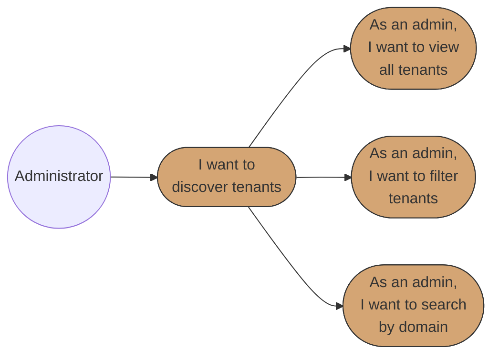

# Business Requirements Specification (BRS)
# BBWS Multi-Tenant WordPress Admin Application

## Document Metadata

| Attribute | Value |
|-----------|-------|
| Document Title | BBWS Admin App Requirements Specification |
| Version | 1.0 |
| Last Updated | 2026-01-05 |
| Author | Business Analyst Agent |
| Reviewed By | [Pending Review] |
| Status | Draft |
| Related HLD | 2.3_BBWS_Admin_App_HLD.md |
| Phase | 1-4 (Phased Delivery) |

---

## 1. Introduction

### 1.1 Purpose

This document specifies the comprehensive business requirements for the BBWS Admin App, a serverless web application providing centralized control over WordPress tenants across all three environments (DEV, SIT, PROD).

**Business Problem Being Solved:**

| Problem | Business Impact | Annual Cost |
|---------|----------------|-------------|
| Slow Tenant Provisioning | Customer onboarding delayed 24-48 hours | ~$50k/year |
| Manual Promotion Errors | 10% rollback rate, 2 hours recovery time | ~$20k/year |
| Reactive Incident Response | Customer reports issues before ops team | ~$30k/year |
| No Cost Visibility | Overprovisioned resources, idle tenants running | ~$15k/year |
| Manual Compliance Reporting | 40 hours/year for audit preparation | ~$5k/year |
| **Total Annual Cost** | | **~$120k/year** |

**Business Value Delivered:**

| Benefit Category | Metric | Annual Value |
|------------------|--------|--------------|
| Labor Savings | 500 hours/year saved (provisioning automation) | $50k |
| Reduced Downtime | 90% fewer rollbacks (20 hours downtime avoided) | $20k |
| Customer Retention | 3 customers retained (faster provisioning) | $30k |
| Cost Optimization | 20% reduction in wasted resources | $15k |
| Compliance Efficiency | 40 hours/year saved (automated audit logging) | $5k |
| **Total Annual Benefit** | | **$120k** |

**Return on Investment (ROI):**
- 3-Year Investment: $122k
- 3-Year Benefit: $360k
- Net Benefit: $238k
- ROI: 195% over 3 years
- Payback Period: 10 months

### 1.2 Scope

**In Scope:**
- User authentication with MFA and RBAC (4 roles)
- Tenant dashboard and discovery across all environments
- One-click tenant provisioning via wizard
- Tenant management (view, restart, scale, delete)
- Multi-environment promotion workflows (DEV to SIT to PROD)
- DNS and certificate management (Route53, ACM, CloudFront)
- Monitoring and alerting (CloudWatch integration)
- Backup and recovery operations
- Audit logging and compliance reporting
- Cost management and optimization

**Out of Scope:**
- Customer-facing portal (Public Portal - separate BRS)
- Site content management
- WordPress plugin/theme management
- Billing and invoicing

### 1.3 System Overview

The BBWS Admin App is a 4-layer serverless architecture:

1. **Frontend Layer**: React SPA (12 components) hosted on S3/CloudFront
2. **Middleware Layer**: API Gateway + 31 Lambda functions (8 microservices)
3. **Backend Layer**: DynamoDB (single table design), S3, Secrets Manager
4. **Management Layer**: Cross-account orchestration (DEV/SIT/PROD via AssumeRole)

**Cross-Account Structure:**
| Account | ID | Role | Access Method |
|---------|-----|------|---------------|
| PROD | 093646564004 | Primary Region | Direct Access |
| SIT | 815856636111 | Testing | AssumeRole |
| DEV | 536580886816 | Development | AssumeRole |

### 1.4 Success Criteria

| Metric | Baseline | Target | Improvement |
|--------|----------|--------|-------------|
| Tenant Provisioning Time | 2 hours | <15 minutes | 90% reduction |
| Promotion Rollback Rate | 10% | <1% | 90% reduction |
| Mean Time to Detect (MTTD) | 30 minutes | <5 minutes | 83% reduction |
| % Tenants with Cost Data | 0% | 100% | New capability |
| Audit Log Coverage | 0% | 100% | New capability |

### 1.5 Use Case Diagrams

#### Epic 1: Authentication & Access Control

#### Epic 2: Tenant Dashboard & Discovery

#### Epic 3: Tenant Provisioning

#### Epic 4: Tenant Management

#### Epic 5: Multi-Environment Promotion

#### Epic 6: DNS & Certificate Management

#### Epic 7: Monitoring & Alerting

#### Epic 8: Backup & Recovery

#### Epic 9: Audit & Compliance

#### Epic 10: Cost Management

**Diagram Legend:**
- **Circle (( ))**: Actor/Role initiating use cases
- **Rounded rectangle ([ ])**: Use case in user story format
- **Solid arrows**: Actor initiates use case or use case hierarchy

### 1.6 Traceability Matrix

| Business Requirement | User Story Reference | Priority |
|---------------------|---------------------|----------|
| Secure admin authentication with MFA | US-001, US-003 | Critical |
| Role-based access control (4 roles) | US-002 | Critical |
| Centralized tenant visibility | US-004, US-005, US-006 | Critical |
| One-click tenant provisioning | US-007, US-008, US-009 | Critical |
| Tenant lifecycle management | US-010, US-011, US-012, US-013 | Critical |
| Automated promotion workflows | US-014, US-015, US-016, US-017 | Critical |
| DNS and certificate automation | US-018, US-019, US-020 | High |
| Real-time monitoring and alerts | US-021, US-022, US-023 | Critical |
| Backup and disaster recovery | US-024, US-025, US-026 | Critical |
| Comprehensive audit logging | US-027, US-028, US-029 | High |
| Cost visibility and optimization | US-030, US-031, US-032 | Medium |

---

## 2. Stakeholders

| Role | Name | Responsibility |
|------|------|----------------|
| Business Owner | BBWS Management | Final approval, funding, business decisions |
| Platform Administrator | DevOps Engineers | Daily operations, tenant provisioning |
| Super Administrator | CTO, Platform Lead | PROD approvals, user access control |
| Support Operator | Support Engineers | Troubleshooting, monitoring |
| Business Stakeholder | Product Manager, Finance | Reports, cost visibility |
| Compliance Officer | [TBD] | Audit compliance, reporting |
| Security Lead | [TBD] | Security controls, threat detection |

---

## 3. API Definitions

The following APIs (Lambda functions organized into 8 microservices) are referenced throughout this specification:

### Tenant Management Service (6 functions)
- **createTenant**: Creates new tenant with all infrastructure (ECS, RDS, EFS, DNS, Cognito)
- **getTenant**: Retrieves detailed tenant information including infrastructure status
- **listTenants**: Lists all tenants with filtering and pagination
- **updateTenant**: Updates tenant configuration (restart, modify settings)
- **deleteTenant**: Soft deletes tenant with backup creation
- **scaleTenant**: Adjusts tenant resources (CPU, memory, task count)

### Promotion Service (4 functions)
- **validatePromotion**: Runs pre-promotion health checks
- **generatePromotionPlan**: Creates detailed promotion plan with estimates
- **executePromotion**: Orchestrates full promotion workflow via Step Functions
- **rollbackPromotion**: Reverts failed promotion to source state

### DNS & Certificate Service (4 functions)
- **createDNSRecord**: Creates Route53 DNS records
- **requestCertificate**: Requests and validates ACM certificates
- **createCloudFrontDistribution**: Creates CloudFront distribution with certificate
- **getCertificateStatus**: Retrieves certificate status and expiry

### Cognito Management Service (3 functions)
- **createUserPool**: Creates per-tenant Cognito User Pool
- **listUserPools**: Lists all Cognito User Pools for a tenant
- **createUser**: Creates user in tenant User Pool

### Monitoring Service (3 functions)
- **getTenantHealth**: Retrieves tenant health metrics (uptime, response time, errors)
- **getCloudWatchLogs**: Fetches filtered CloudWatch logs
- **getMetrics**: Retrieves custom metrics for dashboards

### Backup & Recovery Service (3 functions)
- **createBackup**: Creates manual backup (RDS snapshot, EFS archive)
- **restoreBackup**: Restores tenant from backup to target environment
- **verifyBackup**: Runs automated backup verification test

### Audit Service (3 functions)
- **logEvent**: Logs all operations to DynamoDB and S3
- **queryAuditLog**: Queries audit logs with filters
- **generateComplianceReport**: Generates compliance reports (PDF/CSV)

### Cost Management Service (4 functions)
- **getTenantCost**: Retrieves per-tenant cost breakdown
- **detectAnomalies**: Detects cost anomalies
- **setBudgetAlert**: Configures budget alerts per tenant
- **getIdleTenants**: Identifies idle tenants (no traffic)

### FrontendUI Components (12)
- Dashboard, Tenant Wizard, Tenant Details, Promotion Wizard, DNS Manager, Monitoring Dashboard, Auth, User Management, Audit Log Viewer, Backup Manager, Cost Dashboard, Compliance Report

---

## Epic 1: User Authentication and Access Control

**Epic ID:** EPIC-001
**Description:** Secure authentication with MFA and role-based access control
**Business Value:** Protects platform from unauthorized access, ensures compliance with security requirements
**Phase:** 1 (MVP)

### User Story 1: Log In with MFA (US-001)

**User Story:**
> As a BBWS Administrator,
> I want to log in to the Admin App with MFA,
> So that my account is secure.

**Pre-conditions:**
- User has valid Cognito credentials
- User is assigned to a role (Super Admin, Admin, Operator, or Viewer)
- MFA is configured for Super Admin accounts

**Positive Scenario: Successful Login with MFA**

1. Administrator navigates to Admin App login page
2. FrontendUI displays login form (email, password)
3. Administrator enters credentials and submits
4. AuthenticationAPI validates credentials via Cognito
5. If Super Admin role, Cognito prompts for MFA code
6. Administrator enters TOTP code from authenticator app
7. Cognito validates MFA and issues JWT token
8. FrontendUI stores token and establishes session in DynamoDB
9. FrontendUI redirects to Dashboard based on user role
10. Audit Lambda logs successful login event

**Negative Scenario: Invalid Credentials**

1. Administrator enters incorrect email or password
2. Cognito returns authentication error
3. FrontendUI displays: "Invalid email or password"
4. After 5 failed attempts, account is locked for 15 minutes
5. Audit Lambda logs failed login attempts
6. SNS alert sent if suspicious pattern detected (10+ failures in 5 min)

**Negative Scenario: Invalid MFA Code**

1. Administrator enters correct password but invalid MFA code
2. Cognito rejects MFA code
3. FrontendUI displays: "Invalid verification code"
4. Administrator can retry up to 3 times
5. After 3 failures, session is terminated
6. Audit Lambda logs MFA failures

**Edge Case: MFA Device Lost**

1. Administrator cannot access MFA device
2. Administrator contacts Super Admin
3. Super Admin resets MFA via Cognito
4. Administrator receives email with MFA reset instructions
5. Administrator configures new MFA device
6. Audit log records MFA reset with approver

**Post-conditions:**
- JWT token issued and stored securely
- Session recorded in DynamoDB (USER#{user_id}, SESSION#{session_id})
- User has access based on assigned role
- Login event logged to audit trail

**Acceptance Criteria:**
- [ ] User can log in via Cognito with email and password
- [ ] MFA is required for Super Admin role
- [ ] MFA is optional for Admin, Operator, and Viewer roles
- [ ] JWT token includes role claims (aud, iss, exp)
- [ ] Session established in DynamoDB with 8-hour absolute timeout
- [ ] Login attempts logged in audit trail
- [ ] Account locked after 5 failed attempts for 15 minutes
- [ ] Error messages MUST be clear and actionable
- [ ] The system MUST NOT reveal whether email exists (security)

---

### User Story 2: Assign Roles to Users (US-002)

**User Story:**
> As a Super Admin,
> I want to assign roles to users (Admin, Operator, Viewer),
> So that access is controlled based on job function.

**Pre-conditions:**
- User is authenticated as Super Admin
- Target user exists in Cognito User Pool
- Cognito groups (bbws-admin-super-admin, bbws-admin-admin, bbws-admin-operator, bbws-admin-viewer) exist

**Positive Scenario: Successful Role Assignment**

1. Super Admin navigates to User Management UI
2. FrontendUI calls listUsers Lambda to display users
3. Super Admin selects user from list
4. Super Admin selects new role from dropdown (Admin, Operator, Viewer)
5. FrontendUI calls updateUserRole Lambda
6. Lambda updates user's Cognito group membership
7. Lambda invalidates user's active sessions (force re-login)
8. Audit Lambda logs role assignment with approver
9. FrontendUI displays success confirmation
10. SNS notification sent to affected user

**Negative Scenario: Insufficient Permissions**

1. Admin (not Super Admin) attempts to assign roles
2. API Gateway returns 403 Forbidden
3. FrontendUI displays: "You do not have permission to assign roles"
4. Audit Lambda logs unauthorized access attempt
5. User is redirected to dashboard

**Negative Scenario: Assigning Super Admin Role**

1. Super Admin attempts to assign Super Admin role
2. System requires second Super Admin approval
3. Approval request created with 24-hour expiry
4. Email sent to all Super Admins for approval
5. Only after approval is role assigned
6. Audit trail records dual-approval

**Edge Case: Last Super Admin Demotion**

1. Super Admin attempts to demote themselves
2. System checks if they are the last Super Admin
3. If last, system blocks demotion: "Cannot remove last Super Admin"
4. Minimum of 2 Super Admins enforced
5. Audit log records blocked action

**Post-conditions:**
- User's Cognito group membership updated
- Previous sessions invalidated
- User receives notification email
- Role change logged in audit trail

**Acceptance Criteria:**
- [ ] Super Admin can create new users in Cognito
- [ ] Super Admin can assign users to Cognito groups (roles)
- [ ] RBAC enforced at API Gateway level
- [ ] Role assignments are immediately effective
- [ ] Previous sessions invalidated on role change
- [ ] Audit log records role assignments with timestamp and approver
- [ ] Super Admin role assignment requires dual approval
- [ ] Error messages MUST be clear and actionable
- [ ] The system MUST prevent removal of last Super Admin

---

### User Story 3: Session Timeout (US-003)

**User Story:**
> As an Administrator,
> I want my session to timeout after 30 minutes of inactivity,
> So that unauthorized access is prevented if I leave my workstation.

**Pre-conditions:**
- User has an active authenticated session
- Session is stored in DynamoDB

**Positive Scenario: Idle Timeout**

1. Administrator logs in successfully
2. FrontendUI sets 30-minute idle timer (client-side)
3. Administrator leaves workstation without activity
4. After 30 minutes of no API calls, idle timer expires
5. FrontendUI displays warning: "Session expiring in 60 seconds"
6. If no activity, FrontendUI clears local token
7. FrontendUI redirects to login page
8. Backend session marked as expired in DynamoDB (TTL)
9. Audit Lambda logs session timeout

**Positive Scenario: Absolute Timeout**

1. Administrator is actively using system for 8 hours
2. Absolute session timeout (8 hours) reached
3. API Gateway returns 401 Unauthorized
4. FrontendUI displays: "Session expired. Please log in again."
5. User redirected to login page
6. Audit Lambda logs absolute timeout

**Negative Scenario: Session Hijacking Attempt**

1. Attacker obtains valid JWT token
2. Attacker attempts to use token from different IP
3. API validates IP and user agent against session
4. If mismatch, session is flagged
5. SNS alert sent to security team
6. Session immediately invalidated
7. Legitimate user required to re-authenticate

**Edge Case: Multiple Active Sessions**

1. Administrator logs in from second device
2. System allows up to 3 concurrent sessions per user
3. Fourth login attempt triggers: "Maximum sessions reached"
4. User can view and terminate other sessions
5. Audit log records all session activity

**Post-conditions:**
- Session cleared from browser (token removed)
- Session marked as expired in DynamoDB
- User redirected to login page
- Timeout event logged

**Acceptance Criteria:**
- [ ] Session inactive for 30 minutes triggers automatic logout
- [ ] User receives warning 60 seconds before timeout
- [ ] Absolute session timeout of 8 hours enforced
- [ ] Session cleared from DynamoDB
- [ ] User redirected to login page with message
- [ ] Maximum 3 concurrent sessions per user
- [ ] Session timeout events logged in audit trail
- [ ] Error messages MUST be clear and actionable
- [ ] The system MUST detect suspicious session activity

---

## Epic 2: Tenant Dashboard and Discovery

**Epic ID:** EPIC-002
**Description:** Centralized view of all tenants across all environments
**Business Value:** Reduces time to find tenant information from 15 minutes to 5 seconds
**Phase:** 1 (MVP)

### User Story 4: View All Tenants Dashboard (US-004)

**User Story:**
> As an Administrator,
> I want to view all tenants across all environments in a dashboard,
> So that I can see the overall platform status at a glance.

**Pre-conditions:**
- User is authenticated with Admin, Operator, or Viewer role
- Tenants exist in the system

**Positive Scenario: Dashboard Load**

1. Administrator navigates to Dashboard
2. FrontendUI calls listTenants Lambda with environment=ALL
3. Lambda queries DynamoDB using GSI1 (EnvironmentIndex)
4. Lambda returns tenant list with status indicators
5. FrontendUI displays tabbed view (DEV, SIT, PROD, All)
6. Each tenant shows: ID, domain, status, environment, last updated
7. Status indicators: Green (Healthy), Yellow (Degraded), Red (Down)
8. Dashboard auto-refreshes every 30 seconds

**Negative Scenario: No Tenants Exist**

1. Administrator navigates to Dashboard
2. Lambda returns empty tenant list
3. FrontendUI displays: "No tenants found"
4. FrontendUI shows "Create First Tenant" call-to-action
5. Administrator can navigate to tenant wizard

**Negative Scenario: Cross-Account Access Failure**

1. Administrator navigates to Dashboard
2. Lambda attempts to AssumeRole to DEV account
3. AssumeRole fails (expired credentials, permission denied)
4. Lambda returns partial data with error for DEV tenants
5. FrontendUI displays available tenants with warning banner
6. Audit Lambda logs AssumeRole failure
7. SNS alert sent to platform team

**Edge Case: Large Tenant Count**

1. System has 500+ tenants
2. FrontendUI implements pagination (50 per page)
3. Lambda uses cursor-based pagination (DynamoDB LastEvaluatedKey)
4. Performance remains under 2 seconds per page
5. User can navigate pages without performance degradation

**Post-conditions:**
- Dashboard displays current tenant status
- Counts per environment are accurate
- Auto-refresh maintains currency

**Acceptance Criteria:**
- [ ] Dashboard shows all tenants across DEV, SIT, PROD
- [ ] Tabbed view allows filtering by environment
- [ ] Status indicators reflect real-time health (Healthy, Degraded, Down)
- [ ] Dashboard loads in under 2 seconds
- [ ] Auto-refresh every 30 seconds
- [ ] Pagination for 50+ tenants
- [ ] Error messages MUST be clear and actionable
- [ ] The system MUST handle partial failures gracefully

---

### User Story 5: Filter Tenants (US-005)

**User Story:**
> As an Administrator,
> I want to filter tenants by status, environment, or organization,
> So that I can quickly find specific tenants.

**Pre-conditions:**
- User is authenticated
- Tenants exist in the system

**Positive Scenario: Filter by Status**

1. Administrator clicks "Filter" button on Dashboard
2. FrontendUI displays filter panel
3. Administrator selects status: "Degraded"
4. FrontendUI calls listTenants Lambda with status=Degraded
5. Lambda queries DynamoDB using GSI2 (StatusIndex)
6. Results update in under 1 second
7. Dashboard shows only degraded tenants

**Positive Scenario: Combined Filters**

1. Administrator applies multiple filters:
   - Environment: PROD
   - Status: Healthy
   - Organization: "Acme Corp"
2. FrontendUI combines filters in query
3. Lambda applies all filters using DynamoDB filter expressions
4. Results show only matching tenants
5. Filter tags displayed for easy removal

**Negative Scenario: No Matching Results**

1. Administrator applies restrictive filters
2. Query returns empty results
3. FrontendUI displays: "No tenants match your filters"
4. FrontendUI suggests "Clear Filters" action
5. Administrator can adjust filters

**Edge Case: Filter with Special Characters**

1. Administrator searches for organization with special characters
2. FrontendUI sanitizes input (XSS prevention)
3. Lambda handles special characters in query
4. Results returned correctly

**Post-conditions:**
- Dashboard displays filtered results
- Filter state is maintained during session
- Results update in real-time

**Acceptance Criteria:**
- [ ] Filter by environment (DEV, SIT, PROD)
- [ ] Filter by status (Healthy, Degraded, Down)
- [ ] Filter by organization
- [ ] Filters can be combined
- [ ] Results update in under 1 second
- [ ] Filter state persists during session
- [ ] Error messages MUST be clear and actionable
- [ ] The system MUST sanitize filter inputs

---

### User Story 6: Search by Domain (US-006)

**User Story:**
> As an Administrator,
> I want to search for tenants by domain name,
> So that I can locate customer sites quickly.

**Pre-conditions:**
- User is authenticated
- Tenants with domains exist

**Positive Scenario: Exact Domain Search**

1. Administrator enters "acme.wp.kimmyai.io" in search box
2. FrontendUI calls listTenants Lambda with domain filter
3. Lambda queries DynamoDB for exact match
4. Result returned in under 1 second
5. Dashboard highlights matching tenant

**Positive Scenario: Partial Domain Search**

1. Administrator types "acme" in search box
2. FrontendUI calls search with partial match
3. Lambda returns all tenants containing "acme"
4. Results include "acme.wp.kimmyai.io", "acme-dev.wpdev.kimmyai.io"
5. Matches highlighted in results

**Negative Scenario: No Match Found**

1. Administrator searches for non-existent domain
2. Lambda returns empty results
3. FrontendUI displays: "No tenants found for 'xyz'"
4. FrontendUI suggests checking spelling or trying partial match

**Edge Case: Search During Provisioning**

1. Administrator searches for newly created tenant
2. Tenant is still being provisioned (status=PROVISIONING)
3. Lambda returns tenant with provisional status
4. FrontendUI shows tenant with provisioning progress indicator

**Post-conditions:**
- Search results displayed with matches highlighted
- Quick access to tenant details from search results

**Acceptance Criteria:**
- [ ] Search box accepts domain input
- [ ] Partial match supported (contains search)
- [ ] Results returned in under 1 second
- [ ] Matches highlighted in results
- [ ] Click on result navigates to tenant details
- [ ] Error messages MUST be clear and actionable
- [ ] The system MUST handle special characters in search

---

## Epic 3: Tenant Provisioning

**Epic ID:** EPIC-003
**Description:** One-click tenant provisioning via wizard
**Business Value:** Reduces provisioning time from 2 hours to 15 minutes, eliminates CLI errors
**Phase:** 1 (MVP)

### User Story 7: Provision Tenant via Wizard (US-007)

**User Story:**
> As an Administrator,
> I want to provision a new tenant through a wizard,
> So that I don't have to use AWS CLI commands.

**Pre-conditions:**
- User is authenticated as Admin or Super Admin
- Target environment (DEV/SIT/PROD) is accessible
- For PROD: User is Super Admin

**Positive Scenario: Successful DEV Tenant Provisioning**

1. Administrator clicks "Create Tenant" on Dashboard
2. FrontendUI displays 7-step wizard:
   - Step 1: Organization selection
   - Step 2: Tenant ID (auto-generated, editable)
   - Step 3: Domain configuration
   - Step 4: Resource allocation (CPU, memory)
   - Step 5: Cognito configuration
   - Step 6: Initial admin user
   - Step 7: Review and confirm
3. Administrator completes all steps
4. FrontendUI validates tenant ID uniqueness (DynamoDB query)
5. FrontendUI validates domain availability (Route53 check)
6. Administrator clicks "Create Tenant"
7. FrontendUI calls createTenant Lambda
8. Lambda triggers Step Functions: Tenant Provisioning Workflow
9. Workflow orchestrates 12 provisioning steps
10. FrontendUI displays progress indicator
11. On completion, tenant appears in dashboard

**Negative Scenario: Duplicate Tenant ID**

1. Administrator enters tenant ID that already exists
2. FrontendUI validates in real-time (debounced API call)
3. FrontendUI displays: "Tenant ID already exists"
4. Administrator must choose unique ID
5. Wizard cannot proceed until resolved

**Negative Scenario: PROD Provisioning by Admin**

1. Admin (not Super Admin) selects PROD environment
2. FrontendUI calls createTenant Lambda
3. Lambda checks user role against environment
4. Lambda returns 403: "PROD provisioning requires Super Admin"
5. FrontendUI displays error and suggests contacting Super Admin
6. Audit log records unauthorized attempt

**Edge Case: Provisioning Failure Mid-Process**

1. Administrator starts provisioning
2. RDS database creation fails (quota exceeded)
3. Step Functions enters failure state
4. Rollback workflow triggered automatically
5. Partially created resources cleaned up
6. Administrator notified with specific error
7. Audit log records failure and rollback

**Post-conditions:**
- Tenant record created in DynamoDB
- All infrastructure provisioned (ECS, RDS, EFS, Route53, ACM, CloudFront, Cognito)
- Credentials stored in Secrets Manager
- Tenant accessible via domain

**Acceptance Criteria:**
- [ ] 7-step wizard guides admin through provisioning
- [ ] Tenant ID uniqueness validated in real-time
- [ ] Domain availability checked before provisioning
- [ ] All fields validated before submission
- [ ] PROD provisioning restricted to Super Admin
- [ ] Step Functions orchestrates 12 provisioning steps
- [ ] Provisioning completes in under 15 minutes
- [ ] Error messages MUST be clear and actionable
- [ ] The system MUST rollback on failure

---

### User Story 8: View Provisioning Progress (US-008)

**User Story:**
> As an Administrator,
> I want to see real-time provisioning progress,
> So that I know when the tenant is ready.

**Pre-conditions:**
- Tenant provisioning is in progress
- Step Functions workflow is running

**Positive Scenario: View Progress**

1. Administrator initiates tenant provisioning
2. FrontendUI displays progress modal/page
3. Progress bar shows completion percentage
4. Step-by-step status displayed:
   - Creating DynamoDB record
   - Provisioning RDS database
   - Creating EFS access point
   - Deploying ECS task
   - Creating ALB target group
   - Creating Route53 DNS record
   - Requesting ACM certificate
   - Creating CloudFront distribution
   - Creating Cognito User Pool
   - Storing credentials
   - Initializing WordPress
   - Running health checks
5. Estimated time remaining displayed
6. On completion, success message shown

**Negative Scenario: Step Failure**

1. Administrator is viewing progress
2. Step 4 (ECS deployment) fails
3. FrontendUI immediately shows red indicator on failed step
4. Error message displayed with details
5. "View Logs" button available
6. Rollback status shown
7. Administrator can retry after fixing issue

**Edge Case: Browser Closed During Provisioning**

1. Administrator closes browser during provisioning
2. Step Functions continues running (server-side)
3. Administrator returns to Dashboard
4. Tenant shows "PROVISIONING" status with progress
5. Administrator can click to view detailed progress
6. Email notification sent on completion

**Post-conditions:**
- Administrator informed of completion
- Dashboard updated with new tenant

**Acceptance Criteria:**
- [ ] Progress bar shows completion percentage
- [ ] Step-by-step status with timestamps
- [ ] Estimated time remaining
- [ ] Errors displayed immediately with details
- [ ] Progress persists if browser closed
- [ ] Dashboard updated on completion
- [ ] Error messages MUST be clear and actionable
- [ ] The system MUST continue provisioning if browser closed

---

### User Story 9: Receive Provisioning Notification (US-009)

**User Story:**
> As an Administrator,
> I want to receive an email when tenant provisioning completes,
> So that I can notify the customer.

**Pre-conditions:**
- Tenant provisioning is in progress
- Administrator has valid email in Cognito

**Positive Scenario: Success Notification**

1. Tenant provisioning completes successfully
2. Step Functions emits "TenantProvisioningComplete" event
3. EventBridge triggers SNS notification
4. SNS sends email to provisioning administrator
5. Email includes:
   - Tenant ID and domain
   - WordPress admin URL
   - Initial credentials (masked/temporary)
   - Time to complete
   - Quick actions (View Tenant, Create Another)
6. Audit Lambda logs notification sent

**Negative Scenario: Failure Notification**

1. Tenant provisioning fails
2. Step Functions emits "TenantProvisioningFailed" event
3. SNS sends failure notification
4. Email includes:
   - Tenant ID
   - Failure step and error message
   - Rollback status
   - Link to logs
   - Support contact

**Edge Case: Email Delivery Failure**

1. SNS attempts email delivery
2. Email bounces (invalid address)
3. SNS logs delivery failure
4. Retry with exponential backoff
5. After 3 failures, alert sent to platform team
6. Administrator can view notification in-app

**Post-conditions:**
- Administrator has record of provisioning result
- Email logged in audit trail

**Acceptance Criteria:**
- [ ] Email sent via SNS on success
- [ ] Email includes tenant URL and credentials
- [ ] Email sent on failure with error details
- [ ] Notification logged in audit trail
- [ ] Retry mechanism for failed delivery
- [ ] Error messages MUST be clear and actionable
- [ ] The system MUST handle email failures gracefully

---

## Epic 4: Tenant Management

**Epic ID:** EPIC-004
**Description:** View, modify, and delete tenant infrastructure
**Business Value:** Enables day-to-day tenant operations without AWS console access
**Phase:** 2 (Core Operations)

### User Story 10: View Tenant Details (US-010)

**User Story:**
> As an Administrator,
> I want to view detailed tenant information,
> So that I can troubleshoot issues and understand tenant configuration.

**Pre-conditions:**
- User is authenticated
- Tenant exists

**Positive Scenario: View Tenant Details**

1. Administrator clicks on tenant in Dashboard
2. FrontendUI calls getTenant Lambda with tenant_id
3. Lambda retrieves tenant from DynamoDB
4. Lambda fetches real-time status from AWS services
5. FrontendUI displays tabbed interface:
   - Overview: ID, domain, status, created, organization
   - Infrastructure: ECS task, RDS instance, EFS, ALB
   - DNS: Route53 records, CloudFront distribution
   - Auth: Cognito User Pool, user count
   - Monitoring: CPU, memory, response time, error rate
   - Audit: Recent operations log
6. Data refreshes every 30 seconds

**Negative Scenario: Tenant Not Found**

1. Administrator navigates to tenant that was deleted
2. Lambda returns 404 Not Found
3. FrontendUI displays: "Tenant not found"
4. FrontendUI suggests returning to Dashboard

**Edge Case: Cross-Account Tenant**

1. Administrator views SIT tenant
2. Lambda AssumeRole to SIT account
3. Lambda fetches real-time data from SIT
4. FrontendUI displays with environment badge
5. Actions available based on environment

**Post-conditions:**
- Administrator has comprehensive tenant view
- Real-time data displayed

**Acceptance Criteria:**
- [ ] Tabbed view with 6 sections
- [ ] All infrastructure resources displayed with status
- [ ] Data refreshes every 30 seconds
- [ ] Cross-account tenants accessible via AssumeRole
- [ ] Error messages MUST be clear and actionable
- [ ] The system MUST handle missing data gracefully

---

### User Story 11: Restart Tenant (US-011)

**User Story:**
> As an Administrator,
> I want to restart a tenant,
> So that I can apply configuration changes or recover from issues.

**Pre-conditions:**
- User is authenticated as Admin or Super Admin
- Tenant exists and is running

**Positive Scenario: Rolling Restart**

1. Administrator navigates to Tenant Details
2. Administrator clicks "Restart" button
3. FrontendUI displays confirmation dialog with options:
   - Rolling restart (zero downtime)
   - Hard restart (brief downtime)
4. Administrator selects rolling restart
5. FrontendUI calls updateTenant Lambda with action=restart
6. Lambda initiates ECS service update (force new deployment)
7. ECS performs rolling update (new task starts, old task drains)
8. FrontendUI shows restart progress
9. Audit Lambda logs restart action

**Negative Scenario: Restart During Promotion**

1. Administrator attempts restart during active promotion
2. Lambda detects promotion in progress
3. Lambda returns 409 Conflict
4. FrontendUI displays: "Cannot restart during promotion"
5. Administrator must wait for promotion to complete

**Edge Case: Restart Failure**

1. Administrator initiates restart
2. New ECS task fails health check
3. ECS rolls back to previous task
4. FrontendUI displays error with health check details
5. Audit log records failed restart

**Post-conditions:**
- Tenant running with fresh containers
- Configuration changes applied
- Restart logged in audit trail

**Acceptance Criteria:**
- [ ] Restart button with confirmation dialog
- [ ] Rolling restart (zero downtime) supported
- [ ] Real-time restart status
- [ ] Restart blocked during promotion
- [ ] Audit log records restart
- [ ] Error messages MUST be clear and actionable
- [ ] The system MUST handle restart failures gracefully

---

### User Story 12: Scale Tenant (US-012)

**User Story:**
> As an Administrator,
> I want to scale a tenant,
> So that I can handle increased traffic.

**Pre-conditions:**
- User is authenticated as Admin or Super Admin
- Tenant exists

**Positive Scenario: Scale Up**

1. Administrator navigates to Tenant Details
2. Administrator clicks "Scale" button
3. FrontendUI displays scaling form:
   - CPU: 256, 512, 1024, 2048, 4096 (current highlighted)
   - Memory: 512, 1024, 2048, 4096, 8192 (current highlighted)
   - Task Count: 1-10 (current highlighted)
4. Administrator selects new values
5. FrontendUI calculates and displays cost impact
6. Administrator confirms scaling
7. FrontendUI calls scaleTenant Lambda
8. Lambda updates ECS service with new configuration
9. ECS performs zero-downtime scaling
10. Audit Lambda logs scaling action with before/after

**Negative Scenario: Invalid Scaling Configuration**

1. Administrator selects memory < CPU
2. FrontendUI validates ECS constraints
3. FrontendUI displays: "Memory must be >= CPU"
4. Administrator corrects configuration

**Edge Case: Scale During High Traffic**

1. Tenant experiencing high traffic
2. Administrator initiates scale-up
3. ECS adds new tasks while maintaining existing
4. New tasks start receiving traffic after health check
5. No interruption to existing users

**Post-conditions:**
- Tenant resources adjusted
- Cost reflects new configuration
- Scaling logged in audit trail

**Acceptance Criteria:**
- [ ] Scale form with CPU, memory, task count
- [ ] Cost impact preview before scaling
- [ ] Zero-downtime scaling
- [ ] ECS constraint validation
- [ ] Audit log records scaling with before/after
- [ ] Error messages MUST be clear and actionable
- [ ] The system MUST validate ECS constraints

---

### User Story 13: Delete Tenant (US-013)

**User Story:**
> As an Administrator,
> I want to delete a tenant,
> So that I can clean up resources when customer leaves.

**Pre-conditions:**
- User is authenticated
- Tenant exists
- For PROD: User is Super Admin

**Positive Scenario: Delete DEV Tenant**

1. Administrator navigates to Tenant Details (DEV)
2. Administrator clicks "Delete" button
3. FrontendUI displays confirmation dialog:
   - Type tenant ID to confirm
   - Checkbox: "I understand this cannot be undone"
   - Backup will be created automatically
4. Administrator types tenant ID and checks box
5. FrontendUI calls deleteTenant Lambda
6. Lambda creates backup (RDS snapshot, EFS archive)
7. Lambda soft-deletes tenant (sets active=false)
8. Lambda triggers cleanup workflow:
   - Terminate ECS service
   - Delete RDS instance
   - Delete EFS access point
   - Remove Route53 record
   - Disable Cognito User Pool
9. Audit Lambda logs deletion

**Negative Scenario: PROD Delete by Admin**

1. Admin attempts to delete PROD tenant
2. Lambda checks role and environment
3. Lambda returns 403: "PROD deletion requires Super Admin"
4. FrontendUI displays error
5. Audit log records unauthorized attempt

**Edge Case: Delete Tenant with Active Users**

1. Administrator attempts delete
2. Lambda checks for active Cognito sessions
3. Lambda warns: "Tenant has 5 active users"
4. Administrator confirms forced deletion
5. Active sessions terminated
6. Users receive notification email

**Post-conditions:**
- Tenant marked as deleted in DynamoDB
- All resources deprovisioned
- Backup created and retained (30 days)
- Deletion logged in audit trail

**Acceptance Criteria:**
- [ ] Confirmation dialog requires typing tenant ID
- [ ] PROD deletion requires Super Admin
- [ ] Backup created automatically before deletion
- [ ] All resources cleaned up (ECS, RDS, EFS, Route53, Cognito)
- [ ] Soft delete preserves audit history
- [ ] Deletion logged with all resources deleted
- [ ] Error messages MUST be clear and actionable
- [ ] The system MUST create backup before deletion

---

## Epic 5: Multi-Environment Promotion

**Epic ID:** EPIC-005
**Description:** Automated workflows to promote tenants between environments
**Business Value:** Reduces promotion errors by 90%, enables PROD deployments with approval gates
**Phase:** 2 (Core Operations)

### User Story 14: Promote DEV to SIT (US-014)

**User Story:**
> As an Administrator,
> I want to promote a tenant from DEV to SIT,
> So that I can test in a production-like environment.

**Pre-conditions:**
- User is authenticated as Admin or Super Admin
- Tenant exists in DEV with Healthy status
- SIT account accessible via AssumeRole

**Positive Scenario: Successful Promotion**

1. Administrator navigates to DEV tenant details
2. Administrator clicks "Promote to SIT"
3. FrontendUI displays Promotion Wizard (6 steps):
   - Step 1: Pre-validation checks
   - Step 2: Generate promotion plan
   - Step 3: Review plan
   - Step 4: Confirm promotion
   - Step 5: Execute promotion
   - Step 6: Post-validation
4. Lambda runs validatePromotion (health checks, dependencies)
5. Lambda generates promotion plan (database size, file count, estimated duration)
6. Administrator reviews and approves plan
7. FrontendUI calls executePromotion Lambda
8. Lambda triggers Step Functions: Promotion Workflow
9. Workflow executes 11 promotion steps
10. Post-validation verifies SIT tenant health
11. Administrator notified of success

**Negative Scenario: Pre-Validation Failure**

1. Administrator initiates promotion
2. validatePromotion Lambda runs health checks
3. DEV tenant has failing health check (error rate > 5%)
4. Lambda returns validation failure with details
5. FrontendUI displays: "Cannot promote unhealthy tenant"
6. Administrator must fix issues before retry

**Edge Case: SIT Tenant Already Exists**

1. Administrator initiates DEV to SIT promotion
2. SIT tenant with same ID already exists
3. Lambda offers options:
   - Replace existing SIT tenant (overwrite)
   - Create new SIT tenant with suffix
4. Administrator chooses overwrite
5. Old SIT backed up before replacement

**Post-conditions:**
- Tenant exists in SIT with same configuration
- Database and files migrated
- DNS updated for SIT environment
- Promotion logged in audit trail

**Acceptance Criteria:**
- [ ] 6-step promotion wizard
- [ ] Pre-validation checks (health, dependencies)
- [ ] Promotion plan shows database size, file count, duration
- [ ] Database exported and imported
- [ ] EFS synced to SIT
- [ ] DNS updated for SIT domain
- [ ] Cognito User Pool created in SIT
- [ ] Post-validation verifies SIT health
- [ ] Error messages MUST be clear and actionable
- [ ] The system MUST validate before promotion

---

### User Story 15: Approve PROD Promotion (US-015)

**User Story:**
> As a Super Admin,
> I want to approve promotions to PROD,
> So that only validated tenants reach production.

**Pre-conditions:**
- User is authenticated as Super Admin
- SIT to PROD promotion initiated by Admin
- Approval pending

**Positive Scenario: Approve Promotion**

1. Admin initiates SIT to PROD promotion
2. Step Functions workflow pauses at approval gate
3. SNS sends approval request email to all Super Admins
4. Email includes:
   - Tenant details
   - Promotion plan summary
   - Approval link (one-click)
   - Reject link
5. Super Admin clicks approval link
6. FrontendUI displays approval confirmation page
7. Super Admin clicks "Approve"
8. Lambda updates approval status
9. Step Functions resumes promotion workflow
10. Audit logs approval with approver details

**Negative Scenario: Approval Rejected**

1. Super Admin clicks reject link
2. FrontendUI displays rejection form (reason required)
3. Super Admin enters reason and submits
4. Step Functions workflow cancelled
5. Initiating Admin notified of rejection
6. Audit logs rejection with reason

**Edge Case: Approval Timeout**

1. Promotion waits for approval
2. 24 hours pass with no response
3. Step Functions marks promotion as timed out
4. SNS sends timeout notification to all parties
5. Admin must re-initiate promotion

**Post-conditions:**
- Promotion proceeds or is cancelled
- Approval decision logged with approver
- All parties notified

**Acceptance Criteria:**
- [ ] SIT to PROD requires Super Admin approval
- [ ] Approval gate pauses workflow
- [ ] Email sent to all Super Admins
- [ ] One-click approval/reject links
- [ ] Rejection requires reason
- [ ] 24-hour approval timeout
- [ ] Approval tracked in audit trail
- [ ] Error messages MUST be clear and actionable
- [ ] The system MUST enforce approval for PROD

---

### User Story 16: View Promotion Plan (US-016)

**User Story:**
> As an Administrator,
> I want to see a promotion plan before executing,
> So that I can validate what will be migrated.

**Pre-conditions:**
- User is authenticated
- Promotion wizard initiated

**Positive Scenario: View Detailed Plan**

1. Administrator initiates promotion
2. FrontendUI calls generatePromotionPlan Lambda
3. Lambda analyzes source tenant:
   - Database size (tables, rows, size in MB)
   - File count and size (uploads, themes, plugins)
   - Plugins and themes list
   - Active users count
4. Lambda estimates promotion duration
5. Lambda calculates target cost impact
6. FrontendUI displays plan summary
7. Administrator can download plan as PDF
8. Administrator can proceed or cancel

**Negative Scenario: Large Database Warning**

1. Administrator generates plan
2. Database size > 5 GB detected
3. Lambda adds warning: "Large database may take >1 hour"
4. FrontendUI displays warning prominently
5. Administrator can proceed with awareness

**Edge Case: Plugin Compatibility**

1. Administrator generates plan
2. Lambda detects plugin not supported in target
3. Plan includes compatibility warning
4. Administrator reviews and acknowledges
5. Promotion proceeds with warning logged

**Post-conditions:**
- Administrator has detailed promotion plan
- Plan can be exported for records

**Acceptance Criteria:**
- [ ] Plan shows database size and table count
- [ ] Plan shows file count and total size
- [ ] Plan lists plugins and themes
- [ ] Plan shows estimated duration
- [ ] Plan shows cost impact
- [ ] Plan downloadable as PDF
- [ ] Warnings for large data or compatibility issues
- [ ] Error messages MUST be clear and actionable
- [ ] The system MUST provide accurate estimates

---

### User Story 17: Rollback Failed Promotion (US-017)

**User Story:**
> As an Administrator,
> I want to rollback a failed promotion,
> So that the source environment is not affected.

**Pre-conditions:**
- Promotion is in progress or failed
- Source backup exists

**Positive Scenario: Automatic Rollback**

1. Promotion workflow is executing
2. Step 8 (WordPress initialization) fails
3. Step Functions enters failure state
4. Rollback workflow automatically triggered
5. Target resources cleaned up:
   - RDS instance deleted
   - EFS files deleted
   - ECS service removed
   - DNS record removed
6. Source tenant restored from snapshot
7. Administrator notified of failure and rollback
8. Audit logs failure reason and rollback actions

**Positive Scenario: Manual Rollback**

1. Promotion completed but issues discovered
2. Administrator clicks "Rollback" within 24-hour window
3. FrontendUI confirms rollback action
4. Lambda triggers rollback workflow
5. Target tenant deprovisioned
6. Source restored if modified
7. Rollback logged in audit

**Negative Scenario: Rollback Window Expired**

1. Promotion completed 48 hours ago
2. Administrator attempts rollback
3. Lambda returns: "Rollback window expired (24 hours)"
4. FrontendUI suggests creating new promotion
5. Administrator must use backup/restore instead

**Edge Case: Partial Rollback**

1. Promotion partially failed
2. Some resources created, others failed
3. Rollback workflow cleans up created resources
4. Source tenant untouched
5. Detailed rollback report provided

**Post-conditions:**
- Target resources cleaned up
- Source environment unaffected
- Rollback reason logged

**Acceptance Criteria:**
- [ ] Automatic rollback on promotion failure
- [ ] Manual rollback within 24-hour window
- [ ] Source restored from snapshot
- [ ] Target resources cleaned up
- [ ] Rollback reason logged in audit
- [ ] Notification sent to administrator
- [ ] Error messages MUST be clear and actionable
- [ ] The system MUST preserve source on failure

---

## Epic 6: DNS and Certificate Management

**Epic ID:** EPIC-006
**Description:** Automated DNS and SSL certificate management
**Business Value:** Reduces DNS/certificate setup time from 1 hour to 5 minutes
**Phase:** 2 (Core Operations)

### User Story 18: Create DNS Records (US-018)

**User Story:**
> As an Administrator,
> I want to create DNS records for tenants,
> So that they are accessible via custom domains.

**Pre-conditions:**
- User is authenticated as Admin or Super Admin
- Tenant exists
- Route53 hosted zone available

**Positive Scenario: Create A Record**

1. Administrator navigates to DNS Manager for tenant
2. Administrator clicks "Add DNS Record"
3. FrontendUI displays form:
   - Record type: A, CNAME, MX, TXT
   - Name: subdomain or @
   - Value: IP address or target
   - TTL: 300, 900, 3600 (default 300)
4. Administrator enters values
5. FrontendUI calls createDNSRecord Lambda
6. Lambda creates record in Route53
7. Lambda starts DNS propagation monitoring
8. FrontendUI shows propagation status
9. Lambda runs DNS resolution test

**Negative Scenario: Duplicate Record**

1. Administrator attempts to create existing record
2. Lambda detects duplicate
3. Lambda returns 409 Conflict
4. FrontendUI displays: "Record already exists"
5. Administrator can edit existing record instead

**Edge Case: CNAME at Root**

1. Administrator attempts CNAME at root (@)
2. Lambda validates record type
3. Lambda returns: "CNAME not allowed at root (use ALIAS)"
4. FrontendUI suggests alternative

**Post-conditions:**
- DNS record created in Route53
- Record resolvable (after propagation)
- Record creation logged

**Acceptance Criteria:**
- [ ] DNS form supports A, CNAME, MX, TXT records
- [ ] Route53 API creates record
- [ ] DNS propagation status tracked
- [ ] DNS resolution test verifies record
- [ ] Duplicate records prevented
- [ ] Audit log records creation
- [ ] Error messages MUST be clear and actionable
- [ ] The system MUST validate record types

---

### User Story 19: Request ACM Certificate (US-019)

**User Story:**
> As an Administrator,
> I want to request and manage ACM certificates,
> So that tenants have HTTPS.

**Pre-conditions:**
- User is authenticated as Admin or Super Admin
- Domain owned and DNS managed in Route53

**Positive Scenario: Request Wildcard Certificate**

1. Administrator navigates to Certificate Manager for tenant
2. Administrator clicks "Request Certificate"
3. FrontendUI displays form:
   - Domain: *.tenant.wp.kimmyai.io
   - Validation: DNS (automatic)
4. Administrator submits request
5. FrontendUI calls requestCertificate Lambda
6. Lambda requests certificate from ACM
7. Lambda creates DNS validation record in Route53
8. ACM validates domain ownership
9. Certificate issued (typically 15-30 minutes)
10. Auto-renewal configured by ACM

**Negative Scenario: Validation Failure**

1. Administrator requests certificate
2. DNS validation record created
3. ACM cannot validate (Route53 propagation delay)
4. FrontendUI shows "Validation pending" status
5. After 72 hours, request times out
6. Administrator can retry

**Edge Case: Custom Domain Certificate**

1. Customer wants custom domain (client.com)
2. Administrator requests certificate for client.com
3. DNS validation CNAME provided
4. Customer adds CNAME to their DNS
5. ACM validates and issues certificate
6. Certificate associated with CloudFront

**Post-conditions:**
- ACM certificate issued
- Certificate associated with CloudFront
- Auto-renewal configured

**Acceptance Criteria:**
- [ ] Certificate request form with domain
- [ ] DNS validation automated via Route53
- [ ] Certificate status tracked
- [ ] Auto-renewal configured
- [ ] Custom domain certificates supported
- [ ] Audit log records request
- [ ] Error messages MUST be clear and actionable
- [ ] The system MUST automate DNS validation

---

### User Story 20: View Certificate Expiry (US-020)

**User Story:**
> As an Administrator,
> I want to view certificate expiry dates,
> So that I can renew certificates before they expire.

**Pre-conditions:**
- User is authenticated
- Certificates exist

**Positive Scenario: View Certificate List**

1. Administrator navigates to Certificate Manager
2. FrontendUI calls getCertificateStatus Lambda
3. Lambda queries ACM for all certificates
4. FrontendUI displays certificate list:
   - Domain
   - Status (Issued, Pending, Expired)
   - Expiry date
   - Auto-renewal status
   - Days until expiry
5. Certificates expiring in <30 days highlighted orange
6. Expired certificates highlighted red

**Negative Scenario: Certificate Not Renewed**

1. Auto-renewal fails (DNS changed)
2. Certificate approaching expiry
3. CloudWatch alarm triggers at 30 days
4. SNS alert sent to administrators
5. FrontendUI shows alert banner

**Edge Case: Orphaned Certificate**

1. Tenant deleted but certificate remains
2. Certificate list shows unused certificate
3. Administrator can delete orphaned certificate
4. Cleanup logged in audit

**Post-conditions:**
- Administrator has visibility into certificate status
- Expiring certificates flagged

**Acceptance Criteria:**
- [ ] Certificate list shows all certificates
- [ ] Expiry dates clearly visible
- [ ] Auto-renewal status shown
- [ ] Certificates <30 days highlighted
- [ ] Alerts for expiring certificates
- [ ] Error messages MUST be clear and actionable
- [ ] The system MUST alert for expiring certificates

---

## Epic 7: Monitoring and Alerting

**Epic ID:** EPIC-007
**Description:** Real-time tenant health monitoring and alerting
**Business Value:** Reduces MTTD from 30 minutes to 5 minutes, proactive issue detection
**Phase:** 3 (Operations & Compliance)

### User Story 21: View Tenant Health (US-021)

**User Story:**
> As an Administrator,
> I want to see real-time tenant health status,
> So that I can detect issues proactively.

**Pre-conditions:**
- User is authenticated
- Tenant exists and is running
- CloudWatch metrics available

**Positive Scenario: View Health Dashboard**

1. Administrator navigates to Monitoring Dashboard
2. FrontendUI calls getTenantHealth Lambda
3. Lambda queries CloudWatch for metrics:
   - Uptime percentage (last 24h, 7d, 30d)
   - Response time (p50, p95, p99)
   - Error rate percentage
   - CPU utilization
   - Memory utilization
4. FrontendUI displays dashboard with charts
5. Color-coded status: Green (<1% errors), Yellow (1-5%), Red (>5%)
6. Historical trends displayed
7. Auto-refresh every 30 seconds

**Negative Scenario: Metrics Unavailable**

1. Administrator views health dashboard
2. Lambda cannot retrieve CloudWatch metrics (permission issue)
3. Lambda returns partial data with error
4. FrontendUI displays available data with warning
5. Alert sent to platform team

**Edge Case: New Tenant No Data**

1. Administrator views newly created tenant
2. Tenant running for < 5 minutes
3. CloudWatch has insufficient data points
4. FrontendUI displays: "Gathering metrics..."
5. Dashboard populates as data becomes available

**Post-conditions:**
- Administrator has visibility into tenant health
- Issues identifiable before customer impact

**Acceptance Criteria:**
- [ ] Health dashboard with uptime, response time, error rate
- [ ] CPU and memory utilization displayed
- [ ] Color-coded status indicators
- [ ] Historical trends (24h, 7d, 30d)
- [ ] Auto-refresh every 30 seconds
- [ ] Error messages MUST be clear and actionable
- [ ] The system MUST handle missing metrics gracefully

---

### User Story 22: Receive Tenant Down Alerts (US-022)

**User Story:**
> As an Administrator,
> I want to receive alerts when a tenant goes down,
> So that I can respond quickly.

**Pre-conditions:**
- CloudWatch alarms configured
- SNS topics set up
- Administrator subscribed to alerts

**Positive Scenario: Alert on Tenant Down**

1. Tenant health check fails
2. CloudWatch alarm triggers (unhealthy for 2 consecutive checks)
3. CloudWatch sends alert to SNS
4. SNS delivers email and SMS to subscribed admins
5. Alert includes:
   - Tenant ID and environment
   - Alert type (Tenant Down)
   - Timestamp
   - Quick action links (View Logs, Restart)
6. Audit Lambda logs alert

**Negative Scenario: Alert Storm (Multiple Tenants)**

1. Infrastructure issue affects multiple tenants
2. Multiple alarms trigger simultaneously
3. Alerting system aggregates alerts
4. Single summary email sent with affected tenants
5. Dashboard shows alert banner

**Edge Case: Alert During Maintenance**

1. Administrator schedules maintenance window
2. Tenant restarted during window
3. Health check fails temporarily
4. Alarm suppressed during maintenance window
5. No alert sent
6. Normal monitoring resumes after window

**Post-conditions:**
- Administrator notified promptly
- Alert logged in audit trail

**Acceptance Criteria:**
- [ ] SNS alert via email and SMS
- [ ] Alert threshold configurable
- [ ] Alert includes tenant ID, environment, timestamp
- [ ] Quick action links in email
- [ ] Alert aggregation for multiple failures
- [ ] Maintenance window suppression
- [ ] Alerts logged in audit trail
- [ ] Error messages MUST be clear and actionable
- [ ] The system MUST aggregate alert storms

---

### User Story 23: View CloudWatch Logs (US-023)

**User Story:**
> As an Administrator,
> I want to view CloudWatch logs for a tenant,
> So that I can troubleshoot errors.

**Pre-conditions:**
- User is authenticated
- Tenant exists
- CloudWatch logs available

**Positive Scenario: View and Search Logs**

1. Administrator navigates to Tenant Details > Logs tab
2. FrontendUI displays log viewer
3. Administrator sets time range (last 1h, 6h, 24h, 7d)
4. FrontendUI calls getCloudWatchLogs Lambda
5. Lambda queries CloudWatch Logs Insights
6. FrontendUI displays logs with:
   - Timestamp
   - Log level (INFO, WARN, ERROR)
   - Message
7. Administrator can search by keyword
8. Administrator can filter by log level
9. Administrator can export to CSV

**Negative Scenario: Log Retention Exceeded**

1. Administrator requests logs older than 30 days
2. Lambda returns: "Logs beyond retention period"
3. FrontendUI displays message with retention policy
4. Administrator can request archived logs (S3)

**Edge Case: Large Log Volume**

1. Tenant has high log volume
2. Query would return 10,000+ entries
3. Lambda implements pagination
4. FrontendUI displays first 1000 with "Load More"
5. Performance maintained

**Post-conditions:**
- Administrator can view and search logs
- Logs available for troubleshooting

**Acceptance Criteria:**
- [ ] Log viewer with time range selector
- [ ] Log level filter (INFO, WARN, ERROR)
- [ ] Keyword search
- [ ] Export to CSV
- [ ] Pagination for large results
- [ ] Refresh on demand
- [ ] Error messages MUST be clear and actionable
- [ ] The system MUST handle large log volumes

---

## Epic 8: Backup and Recovery

**Epic ID:** EPIC-008
**Description:** Manual backup and restore capabilities
**Business Value:** Ensures data protection and disaster recovery readiness
**Phase:** 3 (Operations & Compliance)

### User Story 24: Trigger Manual Backup (US-024)

**User Story:**
> As an Administrator,
> I want to trigger a manual backup before making major changes,
> So that I can rollback if needed.

**Pre-conditions:**
- User is authenticated as Admin or Super Admin
- Tenant exists

**Positive Scenario: Create Backup**

1. Administrator navigates to Tenant Details > Backup tab
2. Administrator clicks "Create Backup"
3. FrontendUI displays backup options:
   - Backup type: Full, Database Only, Files Only
   - Description/label for backup
4. Administrator selects Full backup and adds label
5. FrontendUI calls createBackup Lambda
6. Lambda creates:
   - RDS snapshot
   - EFS archive to S3
   - DynamoDB export
7. FrontendUI shows backup progress
8. Backup added to backup history list
9. Audit logs backup creation

**Negative Scenario: Backup Quota Exceeded**

1. Administrator triggers backup
2. Lambda checks backup count
3. Maximum backups (10) reached
4. Lambda returns: "Backup quota exceeded"
5. FrontendUI prompts to delete old backups first

**Edge Case: Backup During High Load**

1. Administrator triggers backup during peak traffic
2. Backup uses RDS snapshot (minimal impact)
3. EFS backup uses incremental sync
4. Performance impact minimized
5. Backup completes successfully

**Post-conditions:**
- Backup created and stored in S3
- Backup listed in history
- Backup creation logged

**Acceptance Criteria:**
- [ ] Manual backup button on tenant details
- [ ] Backup type options (Full, DB, Files)
- [ ] Description/label for backup
- [ ] Backup progress displayed
- [ ] Backup stored in S3
- [ ] Listed in backup history
- [ ] Audit log records backup
- [ ] Error messages MUST be clear and actionable
- [ ] The system MUST minimize performance impact

---

### User Story 25: Restore from Backup (US-025)

**User Story:**
> As an Administrator,
> I want to restore a tenant from backup,
> So that I can recover from data loss.

**Pre-conditions:**
- User is authenticated as Admin or Super Admin
- Backup exists
- For PROD restore: Super Admin required

**Positive Scenario: Restore to Same Environment**

1. Administrator navigates to Backup Manager
2. Administrator selects backup from list
3. Administrator clicks "Restore"
4. FrontendUI displays restore wizard:
   - Step 1: Select backup
   - Step 2: Choose target (same environment or different)
   - Step 3: Confirm (type tenant ID)
5. Administrator confirms restore to same environment
6. FrontendUI calls restoreBackup Lambda
7. Lambda triggers restore workflow:
   - Stop current ECS tasks
   - Restore RDS from snapshot
   - Restore EFS from S3
   - Start ECS with restored data
8. Lambda runs post-restore validation
9. FrontendUI shows restore progress
10. Tenant available with restored data

**Negative Scenario: Corrupted Backup**

1. Administrator attempts restore
2. Lambda validates backup integrity
3. Backup checksum mismatch detected
4. Lambda returns: "Backup integrity check failed"
5. FrontendUI suggests using different backup
6. Alert sent to platform team

**Edge Case: Restore to Different Environment**

1. Administrator selects PROD backup
2. Chooses to restore to DEV environment
3. Lambda creates new DEV tenant from backup
4. PROD tenant unaffected
5. Useful for debugging production issues

**Post-conditions:**
- Tenant restored to backup state
- Data recovered
- Restore logged in audit trail

**Acceptance Criteria:**
- [ ] Restore wizard with backup selection
- [ ] Target environment selection
- [ ] Confirmation required (type tenant ID)
- [ ] Restore progress displayed
- [ ] Post-restore validation
- [ ] Audit log records restore
- [ ] Error messages MUST be clear and actionable
- [ ] The system MUST validate backup integrity

---

### User Story 26: Verify Backups (US-026)

**User Story:**
> As an Administrator,
> I want to verify that backups are working,
> So that I can trust the DR process.

**Pre-conditions:**
- User is authenticated as Admin or Super Admin
- Backups exist
- DEV environment available for testing

**Positive Scenario: Automated Backup Verification**

1. Administrator navigates to Backup Manager
2. Administrator selects backup
3. Administrator clicks "Verify Backup"
4. FrontendUI calls verifyBackup Lambda
5. Lambda triggers verification workflow:
   - Create temporary DEV tenant from backup
   - Run health checks on restored tenant
   - Verify data integrity (row counts, checksums)
   - Clean up temporary tenant
6. FrontendUI displays verification results
7. Backup marked as "Verified" with timestamp

**Negative Scenario: Verification Failure**

1. Administrator verifies backup
2. Restored tenant fails health check
3. Lambda returns verification failure
4. Email notification sent to platform team
5. Backup marked as "Verification Failed"
6. Administrator alerted to investigate

**Edge Case: Scheduled Verification**

1. Automated daily verification job runs
2. Random backup selected for verification
3. Verification runs in DEV
4. Results logged
5. Failures alert platform team

**Post-conditions:**
- Backup verified and marked
- Confidence in DR process

**Acceptance Criteria:**
- [ ] Verification button on backup
- [ ] Automated restore test in DEV
- [ ] Data integrity checks
- [ ] Verification results displayed
- [ ] Email notification on failure
- [ ] Backup marked as verified
- [ ] Error messages MUST be clear and actionable
- [ ] The system MUST clean up test resources

---

## Epic 9: Audit and Compliance

**Epic ID:** EPIC-009
**Description:** Comprehensive audit logging for compliance
**Business Value:** Meets SOC 2 and GDPR requirements, enables forensic investigation
**Phase:** 3 (Operations & Compliance)

### User Story 27: View Audit Trail (US-027)

**User Story:**
> As a Compliance Officer,
> I want to view an audit trail of all operations,
> So that I can ensure compliance.

**Pre-conditions:**
- User is authenticated with Operator, Admin, or Super Admin role
- Audit logs exist

**Positive Scenario: Search Audit Logs**

1. Compliance Officer navigates to Audit Log Viewer
2. FrontendUI displays filter options:
   - User
   - Action type
   - Date range
   - Tenant
   - Keyword search
3. Officer applies filters
4. FrontendUI calls queryAuditLog Lambda
5. Lambda queries DynamoDB audit partition
6. FrontendUI displays results:
   - Timestamp
   - User
   - Action
   - Tenant
   - IP address
   - Result (success/failure)
   - Request details (expandable)
7. Officer can export to CSV/JSON

**Negative Scenario: No Matching Results**

1. Officer applies restrictive filters
2. Query returns empty results
3. FrontendUI displays: "No matching audit logs found"
4. Officer adjusts filters

**Edge Case: Audit Log Tampering Attempt**

1. Attacker attempts to modify audit log
2. S3 Object Lock prevents modification
3. Tampering attempt logged separately
4. Alert sent to security team
5. Original log remains intact

**Post-conditions:**
- Audit logs searchable and exportable
- Compliance requirements met

**Acceptance Criteria:**
- [ ] Audit log viewer with filters
- [ ] Filter by user, action, date, tenant, keyword
- [ ] Searchable by keyword
- [ ] Export to CSV/JSON
- [ ] Immutable storage (S3 Object Lock)
- [ ] 7-year retention
- [ ] Error messages MUST be clear and actionable
- [ ] The system MUST prevent log tampering

---

### User Story 28: Generate Compliance Reports (US-028)

**User Story:**
> As an Administrator,
> I want to generate compliance reports,
> So that I can provide to auditors.

**Pre-conditions:**
- User is authenticated as Admin or Super Admin
- Audit data exists for date range

**Positive Scenario: Generate User Activity Report**

1. Administrator navigates to Compliance Reports
2. Administrator clicks "Generate Report"
3. FrontendUI displays report wizard:
   - Report type: User Activity, Tenant Lifecycle, Promotions, Access
   - Date range
   - Format: PDF, CSV
   - Email delivery option
4. Administrator selects User Activity report for last month
5. FrontendUI calls generateComplianceReport Lambda
6. Lambda queues report generation (SQS)
7. Report generated asynchronously
8. Email sent with PDF attachment when complete

**Negative Scenario: Large Date Range**

1. Administrator requests 1-year report
2. Lambda estimates >100k records
3. Lambda warns: "Large report may take 30+ minutes"
4. Administrator confirms
5. Report queued for background processing
6. Email notification when complete

**Edge Case: Report Generation Failure**

1. Administrator generates report
2. Lambda fails mid-generation (timeout)
3. DLQ captures failure
4. Administrator notified of failure
5. Can retry report generation

**Post-conditions:**
- Report generated and delivered
- Report generation logged

**Acceptance Criteria:**
- [ ] Report wizard with type and date range
- [ ] Report types: User Activity, Tenant Lifecycle, Promotions, Access
- [ ] PDF export
- [ ] Email delivery
- [ ] Queued via SQS for large reports
- [ ] Audit log records report generation
- [ ] Error messages MUST be clear and actionable
- [ ] The system MUST handle large reports asynchronously

---

### User Story 29: View Security Logs (US-029)

**User Story:**
> As a Security Engineer,
> I want to view security logs,
> So that I can detect threats.

**Pre-conditions:**
- User is authenticated with security access
- Security events logged

**Positive Scenario: View Failed Login Attempts**

1. Security Engineer navigates to Security Log Viewer
2. FrontendUI displays security dashboard:
   - Failed logins (count, trend)
   - Blocked IPs
   - Privilege escalation attempts
   - Suspicious activity flags
3. Engineer clicks "Failed Logins"
4. FrontendUI displays detailed list:
   - Timestamp
   - Username/email
   - IP address
   - User agent
   - Failure reason
5. Engineer can filter by IP, user, or time

**Negative Scenario: Active Attack Detected**

1. System detects >100 failed logins in 5 minutes
2. CloudWatch Anomaly Detection triggers
3. SNS alert sent to security team
4. WAF rule automatically blocks attacker IPs
5. Security dashboard shows active threat banner

**Edge Case: Insider Threat**

1. Privileged user accessing unusual resources
2. Behavior anomaly detected
3. Flag raised in security dashboard
4. Security team investigates
5. Session can be terminated remotely

**Post-conditions:**
- Security threats visible
- Automated protections active

**Acceptance Criteria:**
- [ ] Security log dashboard
- [ ] Failed login attempts tracked
- [ ] Suspicious activity flagged
- [ ] IP-based filtering
- [ ] Real-time alerts for threats
- [ ] WAF integration for blocking
- [ ] Error messages MUST be clear and actionable
- [ ] The system MUST detect and alert on threats

---

## Epic 10: Cost Management

**Epic ID:** EPIC-010
**Description:** Cost visibility and optimization
**Business Value:** Enables 20% cost reduction through idle tenant identification
**Phase:** 4 (Optimization)

### User Story 30: View Per-Tenant Costs (US-030)

**User Story:**
> As a FinOps Engineer,
> I want to view per-tenant costs,
> So that I can identify expensive tenants.

**Pre-conditions:**
- User is authenticated
- Cost Explorer data available
- Tenant resource tagging configured

**Positive Scenario: View Cost Dashboard**

1. FinOps Engineer navigates to Cost Dashboard
2. FrontendUI calls getTenantCost Lambda
3. Lambda queries AWS Cost Explorer API
4. Lambda aggregates costs by tenant tags
5. FrontendUI displays cost dashboard:
   - Total platform cost
   - Per-tenant breakdown
   - Cost by service (ECS, RDS, EFS, CloudFront)
   - Daily, weekly, monthly views
   - Cost trends with charts
6. Engineer can export to CSV

**Negative Scenario: Cost Data Delayed**

1. Engineer views costs for today
2. Cost Explorer data has 24-48 hour delay
3. FrontendUI displays: "Costs updated through yesterday"
4. Engineer understands limitation

**Edge Case: Tenant Cost Anomaly**

1. Lambda runs detectAnomalies
2. Tenant X cost increased 200% week-over-week
3. Anomaly flagged in dashboard
4. SNS alert sent to platform team
5. Engineer investigates (possible attack, misconfiguration)

**Post-conditions:**
- Cost visibility per tenant
- Anomalies detected

**Acceptance Criteria:**
- [ ] Cost dashboard per tenant
- [ ] Cost breakdown by service
- [ ] Daily, weekly, monthly views
- [ ] Cost trends with charts
- [ ] Export to CSV
- [ ] Anomaly detection
- [ ] Error messages MUST be clear and actionable
- [ ] The system MUST handle Cost Explorer delays

---

### User Story 31: Set Budget Alerts (US-031)

**User Story:**
> As an Administrator,
> I want to set budget alerts per tenant,
> So that I can control spending.

**Pre-conditions:**
- User is authenticated as Admin or Super Admin
- AWS Budgets API accessible

**Positive Scenario: Create Budget Alert**

1. Administrator navigates to Budget Configuration
2. Administrator selects tenant
3. FrontendUI displays budget form:
   - Monthly budget amount ($)
   - Alert thresholds: 80%, 90%, 100%
   - Notification email(s)
4. Administrator sets $100/month budget
5. FrontendUI calls setBudgetAlert Lambda
6. Lambda creates AWS Budget with alerts
7. SNS subscription configured for notifications
8. Budget status shown on tenant dashboard

**Negative Scenario: Budget Exceeded**

1. Tenant approaches 100% budget
2. AWS Budgets triggers 100% alert
3. SNS sends email to administrator
4. FrontendUI shows warning on tenant dashboard
5. Administrator can scale down or accept overage

**Edge Case: Forecast Alert**

1. AWS Budgets forecasts budget will be exceeded
2. Forecast alert triggered at 80% month progress
3. Early warning email sent
4. Administrator can take preventive action

**Post-conditions:**
- Budget configured
- Alerts active

**Acceptance Criteria:**
- [ ] Budget configuration form
- [ ] Alert thresholds (80%, 90%, 100%)
- [ ] Email notifications via SNS
- [ ] Budget status on dashboard
- [ ] Forecast alerts
- [ ] Error messages MUST be clear and actionable
- [ ] The system MUST provide early warnings

---

### User Story 32: Identify Idle Tenants (US-032)

**User Story:**
> As an Administrator,
> I want to identify idle tenants,
> So that I can deprovision unused resources.

**Pre-conditions:**
- User is authenticated
- CloudWatch metrics available

**Positive Scenario: View Idle Tenant Report**

1. Administrator navigates to Idle Tenants Report
2. FrontendUI calls getIdleTenants Lambda
3. Lambda queries CloudWatch for traffic metrics
4. Lambda identifies tenants with no traffic for >7 days
5. FrontendUI displays idle tenant list:
   - Tenant ID
   - Last activity timestamp
   - Days idle
   - Monthly cost
   - Recommendation: Suspend, Delete, Keep
6. Administrator can one-click deprovision

**Negative Scenario: False Positive**

1. Tenant shows as idle
2. Administrator investigates
3. Tenant is internal testing site (expected low traffic)
4. Administrator marks as "Exempt from idle detection"
5. Tenant excluded from future reports

**Edge Case: Configurable Idle Threshold**

1. Administrator changes idle threshold to 30 days
2. Configuration saved
3. Report regenerates with new threshold
4. Fewer tenants shown as idle

**Post-conditions:**
- Idle tenants identified
- Cost savings opportunities visible

**Acceptance Criteria:**
- [ ] Idle tenant report (no traffic >7 days)
- [ ] Idle threshold configurable
- [ ] Recommendation displayed
- [ ] One-click deprovision option
- [ ] Exempt tenants from detection
- [ ] Error messages MUST be clear and actionable
- [ ] The system MUST accurately detect idle state

---

## 4. Non-Functional Requirements

### 4.1 Performance

| Requirement | Specification |
|-------------|---------------|
| Dashboard load | < 2 seconds |
| API response | < 500ms (95th percentile) |
| Tenant provisioning | < 15 minutes |
| Promotion execution | < 30 minutes |
| Backup creation | < 10 minutes for 5 GB database |
| Concurrent admin users | 50 simultaneous users |

### 4.2 Security

#### Authentication
| Requirement | Specification |
|-------------|---------------|
| Password policy | Min 12 chars, uppercase, lowercase, number, special char |
| Password reuse | Cannot reuse last 5 passwords |
| MFA | Required for Super Admin, optional for others |
| Session timeout | 30 min idle, 8 hour absolute |
| Login lockout | 5 failures = 15 min lockout |

#### Authorization (RBAC)

| Operation | Super Admin | Admin | Operator | Viewer |
|-----------|-------------|-------|----------|--------|
| View tenant dashboard | Yes | Yes | Yes | Yes |
| Create tenant (DEV/SIT) | Yes | Yes | No | No |
| Create tenant (PROD) | Yes | No | No | No |
| Delete tenant (DEV/SIT) | Yes | Yes | No | No |
| Delete tenant (PROD) | Yes | No | No | No |
| Promote DEV to SIT | Yes | Yes | No | No |
| Promote SIT to PROD | Yes | Requires Approval | No | No |
| Approve PROD promotion | Yes | No | No | No |
| View logs and metrics | Yes | Yes | Yes | Yes |
| View audit trails | Yes | Yes | Yes | No |
| Assign user roles | Yes | No | No | No |

#### Data Protection
| Requirement | Specification |
|-------------|---------------|
| Encryption at rest | AES-256 (KMS) |
| Encryption in transit | TLS 1.3 |
| Key management | Customer-managed KMS keys |
| Secrets | Secrets Manager with 30-day rotation |
| Audit logs | S3 Object Lock (immutable) |

### 4.3 Availability

| Metric | Target |
|--------|--------|
| Uptime | 99.9% |
| RTO | 4 hours |
| RPO | 1 hour |
| Scheduled maintenance | 2 hours/month max, off-peak |

### 4.4 Scalability

- Serverless architecture (Lambda) auto-scales
- DynamoDB on-demand capacity
- Design for 1000+ tenants without architecture changes
- Cross-region DR in eu-west-1

### 4.5 Compliance

- SOC 2 Type II: Security, availability, confidentiality
- GDPR: Data residency (af-south-1 primary, eu-west-1 DR)
- ISO 27001 alignment
- 7-year audit log retention

---

## 5. Constraints

| Constraint Type | Description |
|-----------------|-------------|
| Multi-Account | 3 AWS accounts (DEV, SIT, PROD) |
| Cross-Account | AssumeRole for DEV/SIT access from PROD |
| Phased Delivery | 4 phases over 7+ months |
| Budget | $325/month infrastructure |
| Technology | Python 3.11+ Lambda, React 18, DynamoDB |
| Primary Region | af-south-1 (PROD) |
| DR Region | eu-west-1 (active-passive) |

---

## 6. Assumptions and Risks

### 6.1 Assumptions

| ID | Assumption | Impact if Invalid |
|----|------------|-------------------|
| A1 | Cross-account AssumeRole is reliable | May need VPC peering alternative |
| A2 | Lambda cold starts acceptable (<3s) | May need provisioned concurrency |
| A3 | DynamoDB single table design sufficient | May need additional tables |
| A4 | Cognito meets auth requirements | May need custom auth |
| A5 | Step Functions handles long workflows | May need custom orchestration |

### 6.2 Risks

| ID | Risk | Probability | Impact | Mitigation |
|----|------|-------------|--------|------------|
| R1 | Cross-account AssumeRole failure | Low | High | External ID validation, session tagging, monitoring |
| R2 | PROD promotion without approval | Low | Critical | Approval gates in Step Functions, dual approval |
| R3 | Audit log tampering | Low | High | S3 Object Lock, immutable storage |
| R4 | Lambda timeout during provisioning | Medium | Medium | Step Functions with checkpointing, retry logic |
| R5 | Cost overrun due to idle tenants | Medium | Medium | Idle detection, budget alerts |
| R6 | Security breach via admin app | Low | Critical | WAF, MFA, IP whitelisting, penetration testing |

---

## 7. TBCs (To Be Confirmed)

| TBC ID | Item | Question | Decision Owner | Target Date |
|--------|------|----------|----------------|-------------|
| TBC-001 | CloudFront WAF Geo Blocking | Which countries should be blocked by default? | Security Lead | Phase 1 kickoff |
| TBC-002 | SMS Notification Budget | Is $50/month budget acceptable for SMS alerts, or email-only? | Finance Director | Phase 1 kickoff |
| TBC-003 | Lambda VPC Configuration | Should Lambda functions run in VPC or public mode? | Platform Lead | Phase 1 kickoff |
| TBC-004 | Custom Domain for Admin App | What domain for admin app? (e.g., admin.kimmyai.io) | Platform Lead | Before Phase 1 |
| TBC-005 | IP Whitelisting | Should admin app access be restricted to office/VPN IPs? | Security Lead | Phase 1 kickoff |
| TBC-006 | AWS Shield Advanced | Is $3,000/month for Shield Advanced justified? | CTO, Finance | Phase 2 |
| TBC-007 | Idle Tenant Threshold | Acceptable threshold for idle tenants? (7, 14, 30 days) | Platform Lead | Phase 4 |
| TBC-008 | Cost Anomaly Threshold | Acceptable cost increase for anomaly alerts? ($50, $100) | FinOps Engineer | Phase 4 |
| TBC-009 | Backup Retention Policy | Is 7/14/30 days (DEV/SIT/PROD) acceptable? | Compliance Officer | Phase 3 |
| TBC-010 | Penetration Testing Vendor | Which external vendor for quarterly pen testing? | Security Lead | Before Phase 1 |

---

## 8. Phased Delivery Plan

| Phase | Scope | User Stories | Goal | Timeline |
|-------|-------|--------------|------|----------|
| **Phase 1: MVP** | Authentication, Dashboard, Tenant Creation | US-001 to US-009 | Replace manual tenant provisioning | Months 1-2 |
| **Phase 2: Core Operations** | Tenant Management, Promotion, DNS/Certificates | US-010 to US-020 | Enable promotion workflows | Months 3-4 |
| **Phase 3: Operations & Compliance** | Monitoring, Backup/DR, Audit | US-021 to US-029 | Production-ready compliance | Months 5-6 |
| **Phase 4: Optimization** | Cost Management | US-030 to US-032 | Cost visibility and optimization | Months 7+ |

---

## 9. Glossary

| Term | Definition |
|------|------------|
| Admin App | BBWS Multi-Tenant WordPress Admin Application (this system) |
| AssumeRole | AWS STS operation to assume an IAM role in another account |
| BBWS | Big Beard Web Solutions (company name) |
| DEV | Development environment (AWS account 536580886816) |
| DR | Disaster Recovery (standby infrastructure in eu-west-1) |
| GSI | Global Secondary Index (DynamoDB index for alternate query patterns) |
| JWT | JSON Web Token (signed token for authentication) |
| MFA | Multi-Factor Authentication |
| MTTD | Mean Time to Detect |
| MTTR | Mean Time to Respond |
| P0/P1/P2 | Priority levels (P0 = critical, P1 = high, P2 = medium) |
| PK/SK | Partition Key / Sort Key (DynamoDB primary key) |
| PROD | Production environment (AWS account 093646564004) |
| Promotion | Process of migrating tenant between environments (DEV to SIT to PROD) |
| RBAC | Role-Based Access Control |
| Rollback | Reversal of failed promotion to restore source state |
| RPO | Recovery Point Objective (max acceptable data loss) |
| RTO | Recovery Time Objective (max acceptable downtime) |
| Single Table Design | DynamoDB pattern where all entities in one table using PK/SK |
| SIT | System Integration Testing environment (AWS account 815856636111) |
| Step Functions | AWS service for orchestrating multi-step workflows |
| Tenant | A WordPress site hosted on BBWS platform |

---

## 10. Sign-Off

| Role | Name | Signature | Date |
|------|------|-----------|------|
| Business Owner | | | |
| Platform Lead | | | |
| Security Lead | | | |
| Finance Director | | | |

---

## Appendix A: API Endpoint Reference

### Tenant Management Service
| Method | Endpoint | Description | User Stories |
|--------|----------|-------------|--------------|
| POST | `/v1.0/tenants` | Create tenant | US-007 |
| GET | `/v1.0/tenants` | List tenants | US-004, US-005, US-006 |
| GET | `/v1.0/tenants/{id}` | Get tenant details | US-010 |
| PUT | `/v1.0/tenants/{id}` | Update tenant | US-011 |
| DELETE | `/v1.0/tenants/{id}` | Delete tenant | US-013 |
| POST | `/v1.0/tenants/{id}/scale` | Scale tenant | US-012 |

### Promotion Service
| Method | Endpoint | Description | User Stories |
|--------|----------|-------------|--------------|
| POST | `/v1.0/promotions/validate` | Validate promotion | US-014, US-016 |
| POST | `/v1.0/promotions/plan` | Generate plan | US-016 |
| POST | `/v1.0/promotions` | Execute promotion | US-014, US-015 |
| POST | `/v1.0/promotions/{id}/rollback` | Rollback promotion | US-017 |

### DNS & Certificate Service
| Method | Endpoint | Description | User Stories |
|--------|----------|-------------|--------------|
| POST | `/v1.0/dns/records` | Create DNS record | US-018 |
| POST | `/v1.0/certificates` | Request certificate | US-019 |
| GET | `/v1.0/certificates` | List certificates | US-020 |
| GET | `/v1.0/certificates/{id}` | Get certificate status | US-020 |

### Monitoring Service
| Method | Endpoint | Description | User Stories |
|--------|----------|-------------|--------------|
| GET | `/v1.0/tenants/{id}/health` | Get tenant health | US-021 |
| GET | `/v1.0/tenants/{id}/logs` | Get CloudWatch logs | US-023 |
| GET | `/v1.0/tenants/{id}/metrics` | Get metrics | US-021 |

### Backup & Recovery Service
| Method | Endpoint | Description | User Stories |
|--------|----------|-------------|--------------|
| POST | `/v1.0/tenants/{id}/backups` | Create backup | US-024 |
| GET | `/v1.0/tenants/{id}/backups` | List backups | US-024 |
| POST | `/v1.0/backups/{id}/restore` | Restore from backup | US-025 |
| POST | `/v1.0/backups/{id}/verify` | Verify backup | US-026 |

### Audit Service
| Method | Endpoint | Description | User Stories |
|--------|----------|-------------|--------------|
| GET | `/v1.0/audit/logs` | Query audit logs | US-027, US-029 |
| POST | `/v1.0/reports` | Generate compliance report | US-028 |
| GET | `/v1.0/reports/{id}` | Get report status | US-028 |

### Cost Management Service
| Method | Endpoint | Description | User Stories |
|--------|----------|-------------|--------------|
| GET | `/v1.0/costs` | Get costs | US-030 |
| GET | `/v1.0/costs/anomalies` | Get cost anomalies | US-030 |
| POST | `/v1.0/budgets` | Set budget alert | US-031 |
| GET | `/v1.0/tenants/idle` | Get idle tenants | US-032 |

---

## Appendix B: Component Reference

### Frontend Components (12)

| Component ID | Component Name | User Stories |
|-------------|----------------|--------------|
| FE-001 | Dashboard Component | US-004, US-005, US-006 |
| FE-002 | Tenant Wizard Component | US-007, US-008 |
| FE-003 | Tenant Details Component | US-010, US-011, US-012, US-013 |
| FE-004 | Promotion Wizard Component | US-014, US-015, US-016, US-017 |
| FE-005 | DNS Manager Component | US-018, US-019, US-020 |
| FE-006 | Monitoring Dashboard Component | US-021, US-022, US-023 |
| FE-007 | Auth Component | US-001, US-003 |
| FE-008 | User Management Component | US-002 |
| FE-009 | Audit Log Viewer Component | US-027, US-029 |
| FE-010 | Backup Manager Component | US-024, US-025, US-026 |
| FE-011 | Cost Dashboard Component | US-030, US-031, US-032 |
| FE-012 | Compliance Report Component | US-028 |

### Lambda Functions (31)

| Service | Function | User Stories |
|---------|----------|--------------|
| Tenant Management | createTenant | US-007, US-008, US-009 |
| Tenant Management | getTenant | US-010 |
| Tenant Management | listTenants | US-004, US-005, US-006 |
| Tenant Management | updateTenant | US-011 |
| Tenant Management | deleteTenant | US-013 |
| Tenant Management | scaleTenant | US-012 |
| Promotion | validatePromotion | US-014, US-016 |
| Promotion | generatePromotionPlan | US-016 |
| Promotion | executePromotion | US-014, US-015 |
| Promotion | rollbackPromotion | US-017 |
| DNS & Certificate | createDNSRecord | US-018 |
| DNS & Certificate | requestCertificate | US-019 |
| DNS & Certificate | createCloudFrontDistribution | US-018, US-019 |
| DNS & Certificate | getCertificateStatus | US-020 |
| Cognito Management | createUserPool | US-007 |
| Cognito Management | listUserPools | US-010 |
| Cognito Management | createUser | US-010 |
| Monitoring | getTenantHealth | US-021 |
| Monitoring | getCloudWatchLogs | US-023 |
| Monitoring | getMetrics | US-021 |
| Backup & Recovery | createBackup | US-024 |
| Backup & Recovery | restoreBackup | US-025 |
| Backup & Recovery | verifyBackup | US-026 |
| Audit | logEvent | All |
| Audit | queryAuditLog | US-027, US-029 |
| Audit | generateComplianceReport | US-028 |
| Cost Management | getTenantCost | US-030 |
| Cost Management | detectAnomalies | US-030 |
| Cost Management | setBudgetAlert | US-031 |
| Cost Management | getIdleTenants | US-032 |

---

**End of Document**
