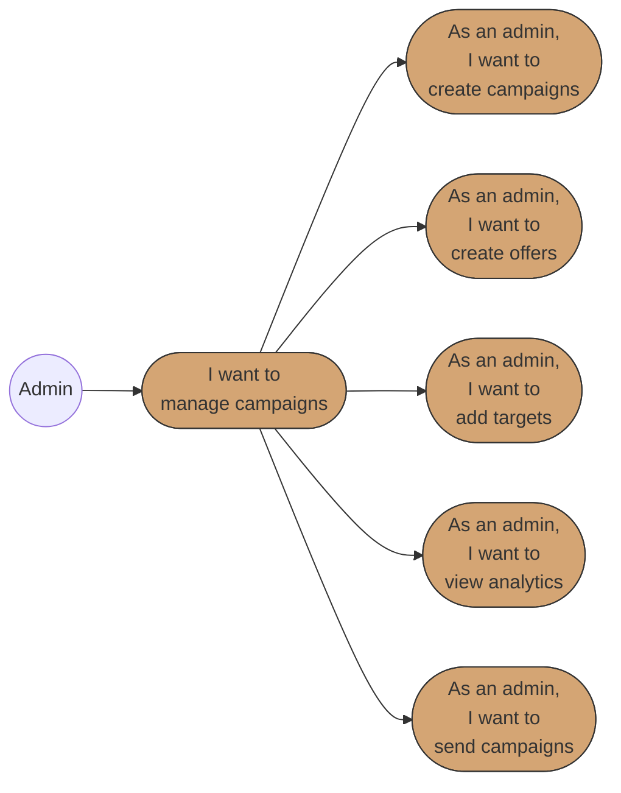

# Business Requirements Specification (BRS)
# BBWS Admin Portal

## Document Metadata

| Attribute | Value |
|-----------|-------|
| Document Title | BBWS Admin Portal Requirements Specification |
| Version | 1.0 |
| Last Updated | 2026-01-05 |
| Author | Business Analyst Agent |
| Reviewed By | [Pending Review] |
| Status | Draft |
| Related HLD | 2.4_BBWS_Admin_Portal_HLD.md |
| Phase | 2 (Operations) |

---

## 1. Introduction

### 1.1 Purpose

This document specifies the comprehensive business requirements for the BBWS Admin Portal, an **internal console for BBWS staff** to manage all customers, support tickets, campaigns, and platform operations. Unlike the customer-facing portals, this system provides cross-tenant visibility and administrative capabilities for operational efficiency.

**Problem Statement:** BBWS staff need a centralized operations console to manage customers across all tenants, handle support tickets, monitor SLA compliance, manage marketing campaigns, and track revenue without accessing individual customer accounts.

**Solution:** A secure, MFA-protected internal admin portal with role-based access control providing comprehensive cross-tenant operations management.

**Business Value:**
- Operational Efficiency: Single dashboard for all operations
- SLA Management: Monitor and enforce SLA compliance
- Revenue Visibility: Track subscriptions and revenue across all customers
- Campaign Management: Create and manage marketing campaigns
- Support Operations: Handle all customer tickets in one queue

### 1.2 Scope

**In Scope:**
- Admin dashboard (metrics, KPIs, alerts)
- All tenants view (cross-tenant visibility)
- All organisations view
- All sites view (health, status)
- Campaign management (create, offers, targets, analytics)
- Product management (pricing tiers, SLA configuration)
- SLA breach dashboard and management
- Support ticket queue (all tickets)
- Ticket assignment and escalation
- SLA configuration and thresholds
- Admin user administration
- Audit logs and compliance
- Reports and analytics
- System health monitoring

**Out of Scope:**
- Customer self-service (Private Portal - separate BRS)
- Public marketing website (Public Portal - separate BRS)
- Direct database access (all operations via APIs)
- Customer Cognito pool management (managed separately)

### 1.3 System Overview

The BBWS Admin Portal is a React-based Single Page Application (SPA) with the following architecture:

| Component | Technology |
|-----------|------------|
| Frontend | React SPA with admin routing |
| Authentication | Cognito Admin Pool (invite-only + MFA required) |
| API Gateway | REST API with JWT validation |
| Backend | 11 microservices, 68 Lambda functions |
| Database | DynamoDB with cross-tenant GSIs |
| Audit Logs | S3 + Athena for compliance queries |
| Notifications | SES for alerts and escalations |

**Environment URLs:**

| Environment | Portal URL | API URL |
|-------------|------------|---------|
| PROD | https://admin.kimmyai.io | https://admin-api.kimmyai.io/v1.0 |
| SIT | https://sit.admin.kimmyai.io | https://sit.admin-api.kimmyai.io/v1.0 |
| DEV | https://dev.admin.kimmyai.io | https://dev.admin-api.kimmyai.io/v1.0 |

### 1.4 Use Case Diagrams

#### Epic 1: Admin Authentication

#### Epic 2: Campaign Management

#### Epic 3: Tenant Administration

#### Epic 4: Organisation and Site Administration

#### Epic 5: Subscription Administration

#### Epic 6: Support Ticket Queue

#### Epic 7: SLA Management

#### Epic 8: Platform Administration

**Diagram Legend:**
- **Circle (( ))**: Actor/Role initiating use cases
- **Rounded rectangle ([ ])**: Use case in user story format
- **Solid arrows**: Actor initiates use case or use case hierarchy

### 1.5 Traceability Matrix

| Business Requirement | Screens | User Story Reference | Priority |
|---------------------|---------|---------------------|----------|
| Secure admin authentication with MFA | AP-001, AP-002 | EPIC1-US1, US2, US3 | P0 |
| Cross-tenant visibility | AP-020, AP-030, AP-040 | EPIC3-US1, EPIC4-US1, US2 | P0 |
| Campaign management | AP-010 to AP-018 | EPIC2-US1 to US8 | P0 |
| Support queue handling | AP-060 to AP-068 | EPIC6-US1 to US8 | P0 |
| SLA monitoring and enforcement | AP-065 to AP-067 | EPIC7-US1 to US4 | P0 |
| Revenue and subscription tracking | AP-050 to AP-053 | EPIC5-US1 to US4 | P1 |
| Tenant suspension capability | AP-022 | EPIC3-US3 | P1 |
| Audit log compliance | AP-072 | EPIC8-US2 | P1 |
| Admin user management | AP-070, AP-071 | EPIC8-US1 | P1 |
| SLA configuration | AP-066, AP-067 | EPIC7-US2 | P2 |

---

## 2. Stakeholders

### 2.1 Staff Roles

| Role | Cognito Group | Description | Capabilities |
|------|---------------|-------------|--------------|
| super-admin | `super-admin` | Platform administrators | Full access, user management, all operations |
| admin | `admin` | Operations managers | Tenant/campaign management, ticket handling |
| support-agent | `support-agent` | Support staff | Ticket handling, limited tenant view |

### 2.2 Role Permissions Matrix

| Operation | super-admin | admin | support-agent |
|-----------|-------------|-------|---------------|
| View admin dashboard | Yes | Yes | Yes |
| View all tenants | Yes | Yes | Limited |
| Manage campaigns | Yes | Yes | No |
| Handle support tickets | Yes | Yes | Yes |
| Assign tickets | Yes | Yes | Yes |
| Escalate tickets | Yes | Yes | Yes |
| Suspend tenants | Yes | Yes | No |
| Adjust tenant plans | Yes | Yes | No |
| Manage admin users | Yes | No | No |
| Invite admin users | Yes | No | No |
| Configure SLAs | Yes | Yes | No |
| View audit logs | Yes | Yes | No |
| Acknowledge system alerts | Yes | Yes | No |
| Compensate for SLA breach | Yes | Yes | No |

### 2.3 Authentication Requirements

| Attribute | Value |
|-----------|-------|
| Pool Name | `bbws-admin-pool-{env}` |
| Sign-in Method | Email only |
| MFA | **REQUIRED** (TOTP) |
| Self-Registration | **DISABLED** (invite-only) |
| Password Policy | Min 12 chars, upper, lower, number, special |
| Session Duration | 8 hours |
| Token Refresh | Automatic with sliding window |

**CRITICAL SECURITY REQUIREMENT:** All admin users MUST:
1. Be invited by an existing super-admin
2. Set up TOTP MFA on first login
3. Provide MFA code on every login
4. Use strong passwords (12+ characters)

---

## 3. API Definitions

The following APIs (11 microservices, 68 Lambda functions) are referenced throughout this specification:

### 3.1 Microservice Summary

| # | Service | Repository | API Prefix | Functions |
|---|---------|------------|------------|-----------|
| 1 | Admin Auth Service | bbws-admin-svc-auth | /admin/auth/* | 6 |
| 2 | Admin Marketing Service | bbws-admin-svc-marketing | /admin/campaigns/* | 12 |
| 3 | Admin Organisation Service | bbws-admin-svc-organisation | /admin/organisations/* | 4 |
| 4 | Admin Tenant Service | bbws-admin-svc-tenant | /admin/tenants/* | 6 |
| 5 | Admin Site Service | bbws-admin-svc-site | /admin/sites/* | 5 |
| 6 | Admin Product Service | bbws-admin-svc-product | /admin/products/* | 12 |
| 7 | Admin Billing Service | bbws-admin-svc-billing | /admin/subscriptions/* | 6 |
| 8 | Admin Ticket Service | bbws-admin-svc-ticket | /admin/tickets/* | 11 |
| 9 | Admin Audit Service | bbws-admin-svc-audit | /admin/audit/* | 3 |
| 10 | Admin System Service | bbws-admin-svc-system | /admin/system/* | 4 |
| 11 | Admin SLA Service | bbws-admin-svc-sla | /admin/sla/* | 3 |
| **Total** | | | | **68** |

### 3.2 Lambda Function Details

#### Admin Auth Service (6 functions)
| Function | Method | Endpoint | Description |
|----------|--------|----------|-------------|
| login | POST | /admin/auth/login | Admin login with MFA |
| me | GET | /admin/auth/me | Get current admin profile |
| list-users | GET | /admin/auth/users | List all admin users |
| invite | POST | /admin/auth/users/invite | Invite new admin |
| get-user | GET | /admin/auth/users/{id} | Get admin user details |
| update-role | PUT | /admin/auth/users/{id}/role | Update admin role |

#### Admin Marketing Service (12 functions)
| Function | Method | Endpoint | Description |
|----------|--------|----------|-------------|
| list-campaigns | GET | /admin/campaigns | List all campaigns |
| create-campaign | POST | /admin/campaigns | Create campaign |
| get-campaign | GET | /admin/campaigns/{id} | Get campaign details |
| update-campaign | PUT | /admin/campaigns/{id} | Update campaign |
| delete-campaign | DELETE | /admin/campaigns/{id} | Soft delete campaign |
| list-offers | GET | /admin/campaigns/{id}/offers | List campaign offers |
| create-offer | POST | /admin/campaigns/{id}/offers | Create offer |
| update-offer | PUT | /admin/campaigns/{id}/offers/{offerId} | Update offer |
| list-targets | GET | /admin/campaigns/{id}/offers/{offerId}/targets | List targets |
| add-target | POST | /admin/campaigns/{id}/offers/{offerId}/targets | Add target |
| send | POST | /admin/campaigns/{id}/offers/{offerId}/send | Send campaign |
| analytics | GET | /admin/campaigns/{id}/analytics | Get analytics |

#### Admin Organisation Service (4 functions)
| Function | Method | Endpoint | Description |
|----------|--------|----------|-------------|
| list | GET | /admin/organisations | List all organisations |
| get | GET | /admin/organisations/{id} | Get organisation details |
| update | PUT | /admin/organisations/{id} | Update organisation |
| suspend | POST | /admin/organisations/{id}/suspend | Suspend organisation |

#### Admin Tenant Service (6 functions)
| Function | Method | Endpoint | Description |
|----------|--------|----------|-------------|
| list | GET | /admin/tenants | List all tenants |
| search | GET | /admin/tenants/search | Search tenants |
| get | GET | /admin/tenants/{id} | Get tenant details |
| update | PUT | /admin/tenants/{id} | Update tenant |
| suspend | POST | /admin/tenants/{id}/suspend | Suspend tenant |
| adjust-plan | POST | /admin/tenants/{id}/adjust-plan | Override plan |

#### Admin Site Service (5 functions)
| Function | Method | Endpoint | Description |
|----------|--------|----------|-------------|
| list | GET | /admin/sites | List all sites |
| search | GET | /admin/sites/search | Search sites |
| get | GET | /admin/sites/{id} | Get site details |
| health | GET | /admin/sites/{id}/health | Get site health |
| force-action | POST | /admin/sites/{id}/force-action | Force site action |

#### Admin Product Service (12 functions)
| Function | Method | Endpoint | Description |
|----------|--------|----------|-------------|
| list | GET | /admin/products | List all products |
| create | POST | /admin/products | Create product |
| get | GET | /admin/products/{id} | Get product details |
| update | PUT | /admin/products/{id} | Update product |
| get-sla | GET | /admin/products/{id}/sla | Get SLA config |
| update-sla | PUT | /admin/products/{id}/sla | Update SLA config |
| update-priority-sla | PUT | /admin/products/{id}/sla/{priority} | Update priority SLA |
| list-breaches | GET | /admin/products/{id}/sla/breaches | List SLA breaches |
| get-breach | GET | /admin/products/{id}/sla/breaches/{breachId} | Get breach details |
| acknowledge | POST | /admin/products/{id}/sla/breaches/{breachId}/acknowledge | Acknowledge breach |
| resolve | POST | /admin/products/{id}/sla/breaches/{breachId}/resolve | Resolve breach |
| compensate | POST | /admin/products/{id}/sla/breaches/{breachId}/compensate | Compensate customer |

#### Admin Billing Service (6 functions)
| Function | Method | Endpoint | Description |
|----------|--------|----------|-------------|
| list | GET | /admin/subscriptions | List all subscriptions |
| search | GET | /admin/subscriptions/search | Search subscriptions |
| get | GET | /admin/subscriptions/{id} | Get subscription details |
| adjust | PUT | /admin/subscriptions/{id}/adjust | Adjust subscription |
| revenue | GET | /admin/subscriptions/revenue | Revenue reports |
| failed-payments | GET | /admin/subscriptions/failed-payments | Failed payment list |

#### Admin Ticket Service (11 functions)
| Function | Method | Endpoint | Description |
|----------|--------|----------|-------------|
| list | GET | /admin/tickets | List all tickets |
| search | GET | /admin/tickets/search | Search tickets |
| queue | GET | /admin/tickets/queue | Support queue view |
| metrics | GET | /admin/tickets/metrics | Support metrics |
| get | GET | /admin/tickets/{id} | Get ticket details |
| update | PUT | /admin/tickets/{id} | Update ticket |
| assign | PUT | /admin/tickets/{id}/assign | Assign to agent |
| escalate | POST | /admin/tickets/{id}/escalate | Escalate ticket |
| add-followup | POST | /admin/tickets/{id}/followups | Add follow-up |
| breaches | GET | /admin/tickets/breaches | Ticket SLA breaches |
| sla-report | GET | /admin/tickets/sla-report | SLA compliance report |

#### Admin Audit Service (3 functions)
| Function | Method | Endpoint | Description |
|----------|--------|----------|-------------|
| logs | GET | /admin/audit/logs | Query audit logs |
| get-log | GET | /admin/audit/logs/{id} | Get log entry |
| reports | GET | /admin/audit/reports | Audit reports |

#### Admin System Service (4 functions)
| Function | Method | Endpoint | Description |
|----------|--------|----------|-------------|
| health | GET | /admin/system/health | System health status |
| metrics | GET | /admin/system/metrics | System metrics |
| alerts | GET | /admin/system/alerts | Active alerts |
| acknowledge-alert | POST | /admin/system/alerts/{id}/acknowledge | Acknowledge alert |

#### Admin SLA Service (3 functions)
| Function | Method | Endpoint | Description |
|----------|--------|----------|-------------|
| breaches | GET | /admin/sla/breaches | All SLA breaches |
| search-breaches | GET | /admin/sla/breaches/search | Search breaches |
| compliance-report | GET | /admin/sla/reports | Compliance report |

---

## Epic 1: Admin Authentication

**Epic ID:** EPIC-001
**Description:** Enable secure authentication for BBWS staff with mandatory MFA
**Business Value:** Ensures only authorized personnel can access admin functions, protecting customer data and platform integrity
**Screens:** AP-001 (Admin Dashboard), AP-002 (Admin Login)

### Use Case 1.1: Admin Login

#### User Story 1: Log In with MFA

**User Story:**
> As an admin user,
> I want to log in to the admin portal with MFA,
> So that I can securely access administrative functions.

**Pre-conditions:**
- Admin user has been invited and completed initial setup
- Admin user has configured TOTP MFA
- Admin user has valid credentials

**Positive Scenario: Successful MFA Login**

1. Admin navigates to Admin Login page (AP-002)
2. FrontendUI displays login form with email and password fields
3. Admin enters email and password
4. FrontendUI calls AdminAuthAPI POST `/admin/auth/login`
5. AdminAuthAPI validates credentials against Cognito Admin Pool
6. AdminAuthAPI returns MFA challenge
7. FrontendUI displays TOTP code input
8. Admin enters 6-digit code from authenticator app
9. AdminAuthAPI validates MFA code
10. AdminAuthAPI returns JWT tokens (access, refresh)
11. FrontendUI stores tokens securely
12. FrontendUI redirects to Admin Dashboard (AP-001)

**Negative Scenario: Invalid Credentials**

1. Admin enters incorrect email or password
2. AdminAuthAPI returns authentication error
3. FrontendUI displays: "Invalid email or password"
4. FrontendUI increments failed login counter
5. After 5 failed attempts, account is temporarily locked (30 minutes)
6. System logs failed login attempt for security audit

**Negative Scenario: Invalid MFA Code**

1. Admin enters correct credentials
2. MFA challenge is presented
3. Admin enters incorrect TOTP code
4. AdminAuthAPI returns MFA validation error
5. FrontendUI displays: "Invalid verification code"
6. Admin can retry up to 3 times
7. After 3 failed MFA attempts, login session expires

**Edge Case: MFA Device Lost**

1. Admin cannot access authenticator app
2. Admin contacts super-admin
3. Super-admin initiates MFA reset via Cognito
4. Admin receives email with temporary access
5. Admin sets up new MFA device on next login
6. System logs MFA reset for audit

**Post-conditions:**
- Admin is authenticated with valid session
- JWT tokens are stored in browser
- Audit log records successful login

**Acceptance Criteria:**
- [ ] Login requires both password AND MFA code
- [ ] MFA is TOTP-based (6-digit code)
- [ ] Failed login attempts are rate-limited
- [ ] Account locks after 5 failed attempts
- [ ] Session expires after 8 hours of inactivity
- [ ] Error messages MUST be clear and actionable
- [ ] The system MUST log all authentication attempts

---

#### User Story 2: View Admin Profile

**User Story:**
> As an admin user,
> I want to view my profile information,
> So that I can verify my role and access level.

**Pre-conditions:**
- Admin is authenticated with valid session

**Positive Scenario: View Profile**

1. Admin clicks profile icon in navigation
2. FrontendUI calls AdminAuthAPI GET `/admin/auth/me`
3. AdminAuthAPI returns admin profile (name, email, role, lastLogin)
4. FrontendUI displays profile information
5. Admin can see their role (super-admin, admin, support-agent)
6. Admin can see last login timestamp

**Negative Scenario: Session Expired**

1. Admin attempts to view profile
2. JWT token has expired
3. AdminAuthAPI returns 401 Unauthorized
4. FrontendUI redirects to login page
5. Admin must re-authenticate

**Edge Case: Role Changed Mid-Session**

1. Super-admin changes admin's role while they are logged in
2. Admin's current session continues with old role
3. On next API call or page refresh, new role is fetched
4. FrontendUI updates navigation based on new role
5. Unauthorized actions are blocked

**Post-conditions:**
- Profile information is displayed
- Role-based navigation is updated

**Acceptance Criteria:**
- [ ] Profile displays name, email, role, last login
- [ ] Role changes are reflected on next page load
- [ ] Expired sessions redirect to login
- [ ] Error messages MUST be clear and actionable

---

#### User Story 3: Invite New Admin User

**User Story:**
> As a super-admin,
> I want to invite new admin users,
> So that I can onboard new staff members securely.

**Pre-conditions:**
- User is authenticated as super-admin
- Email address is not already registered

**Positive Scenario: Successful Invitation**

1. Super-admin navigates to Admin Users (AP-070)
2. Super-admin clicks "Invite Admin" button
3. FrontendUI displays invitation form (AP-071)
4. Super-admin enters: email, name, role (admin or support-agent)
5. FrontendUI calls AdminAuthAPI POST `/admin/auth/users/invite`
6. AdminAuthAPI creates Cognito user with temporary password
7. AdminAuthAPI sends invitation email with temporary credentials
8. FrontendUI displays success message
9. New admin receives email with login instructions
10. New admin must set password and configure MFA on first login

**Negative Scenario: Email Already Exists**

1. Super-admin enters email of existing admin
2. AdminAuthAPI returns 409 Conflict
3. FrontendUI displays: "Admin with this email already exists"
4. Super-admin can search for existing admin instead

**Negative Scenario: Insufficient Permissions**

1. Admin (not super-admin) attempts to invite user
2. FrontendUI hides invite button for non-super-admin
3. If API called directly, AdminAuthAPI returns 403 Forbidden
4. System logs unauthorized attempt

**Edge Case: Invitation Email Delivery Failure**

1. Invitation is created successfully
2. Email delivery fails
3. System retries email delivery (3 attempts)
4. If all retries fail, logs error
5. Super-admin can trigger manual resend

**Post-conditions:**
- Cognito user is created
- Invitation email is sent
- Admin must complete setup on first login

**Acceptance Criteria:**
- [ ] Only super-admins can invite new admins
- [ ] Invitation email includes temporary credentials
- [ ] New admin MUST set up MFA on first login
- [ ] Duplicate email addresses are rejected
- [ ] Role assignment is mandatory (admin or support-agent)
- [ ] Error messages MUST be clear and actionable

---

## Epic 2: Campaign Management

**Epic ID:** EPIC-002
**Description:** Enable admins to create and manage marketing campaigns with offers and distribution targets
**Business Value:** Drive customer acquisition and retention through targeted promotions
**Screens:** AP-010 to AP-018 (9 screens)

### Use Case 2.1: Campaign CRUD

#### User Story 4: List All Campaigns

**User Story:**
> As an admin,
> I want to view all campaigns,
> So that I can manage promotional activities.

**Pre-conditions:**
- Admin is authenticated
- Admin has campaign management permission

**Positive Scenario: View Campaign List**

1. Admin navigates to Campaigns List (AP-010)
2. FrontendUI calls AdminMarketingAPI GET `/admin/campaigns`
3. AdminMarketingAPI returns paginated list of campaigns
4. FrontendUI displays campaigns with: name, status, date range, offer count
5. Admin can filter by status (active, expired, draft)
6. Admin can search by campaign name or code
7. Admin can sort by date created or date range

**Negative Scenario: No Campaigns Exist**

1. AdminMarketingAPI returns empty list
2. FrontendUI displays: "No campaigns found"
3. FrontendUI shows "Create Campaign" call-to-action
4. Admin can create first campaign

**Edge Case: Large Campaign List**

1. System has 1000+ campaigns
2. API returns paginated results (50 per page)
3. FrontendUI displays pagination controls
4. Admin can navigate through pages
5. Search provides filtered results

**Post-conditions:**
- Campaign list is displayed with current status

**Acceptance Criteria:**
- [ ] All campaigns are listed with key information
- [ ] Filtering by status works correctly
- [ ] Search finds campaigns by name or code
- [ ] Pagination handles large datasets
- [ ] Error messages MUST be clear and actionable

---

#### User Story 5: Create New Campaign

**User Story:**
> As an admin,
> I want to create a new campaign,
> So that I can launch promotional offers.

**Pre-conditions:**
- Admin is authenticated with campaign permission
- Products exist to associate with campaign

**Positive Scenario: Successful Campaign Creation**

1. Admin clicks "Create Campaign" on Campaigns List (AP-010)
2. FrontendUI navigates to Create Campaign (AP-011)
3. FrontendUI displays campaign creation wizard
4. Admin enters: name, code, description, fromDate, toDate
5. Admin selects associated product(s)
6. Admin sets campaign status (draft or active)
7. FrontendUI calls AdminMarketingAPI POST `/admin/campaigns`
8. AdminMarketingAPI validates and creates campaign
9. FrontendUI displays success and redirects to campaign details
10. Campaign is ready for offer creation

**Negative Scenario: Duplicate Campaign Code**

1. Admin enters code that already exists
2. AdminMarketingAPI returns 409 Conflict
3. FrontendUI displays: "Campaign code already exists"
4. Admin enters unique code
5. Campaign creation succeeds

**Negative Scenario: Invalid Date Range**

1. Admin enters fromDate after toDate
2. FrontendUI validates client-side
3. FrontendUI displays: "Start date must be before end date"
4. Admin corrects dates
5. Campaign creation succeeds

**Edge Case: Past Start Date**

1. Admin enters start date in the past
2. System allows this for backdated campaigns
3. Campaign is immediately active if within date range
4. Warning displayed: "Campaign starts in the past"

**Post-conditions:**
- Campaign is created in database
- Campaign appears in list view
- Audit log records creation

**Acceptance Criteria:**
- [ ] Campaign code must be unique
- [ ] Date validation prevents invalid ranges
- [ ] Product association is required
- [ ] Campaign can be saved as draft
- [ ] Success redirects to campaign details
- [ ] Error messages MUST be clear and actionable

---

#### User Story 6: Edit Campaign Details

**User Story:**
> As an admin,
> I want to edit campaign details,
> So that I can update promotions as needed.

**Pre-conditions:**
- Campaign exists
- Admin has campaign permission

**Positive Scenario: Update Campaign**

1. Admin navigates to Campaign Details (AP-012)
2. FrontendUI calls AdminMarketingAPI GET `/admin/campaigns/{id}`
3. FrontendUI displays campaign with edit controls
4. Admin modifies: description, date range, or status
5. FrontendUI calls AdminMarketingAPI PUT `/admin/campaigns/{id}`
6. AdminMarketingAPI updates campaign
7. FrontendUI displays success message

**Negative Scenario: Campaign Not Found**

1. Admin navigates to non-existent campaign
2. AdminMarketingAPI returns 404 Not Found
3. FrontendUI displays: "Campaign not found"
4. FrontendUI redirects to campaign list

**Edge Case: Concurrent Edit**

1. Two admins edit same campaign simultaneously
2. First save succeeds
3. Second save receives version conflict
4. FrontendUI displays: "Campaign was modified by another user"
5. Admin can reload and retry edit

**Post-conditions:**
- Campaign is updated
- Audit log records modification

**Acceptance Criteria:**
- [ ] All editable fields can be modified
- [ ] Campaign code cannot be changed after creation
- [ ] Version control prevents lost updates
- [ ] Audit trail maintained for changes
- [ ] Error messages MUST be clear and actionable

---

#### User Story 7: Create Campaign Offer

**User Story:**
> As an admin,
> I want to create promotional offers within a campaign,
> So that I can define specific discounts and terms.

**Pre-conditions:**
- Campaign exists
- Admin has campaign permission

**Positive Scenario: Create Offer**

1. Admin navigates to Campaign Offers (AP-013)
2. Admin clicks "Create Offer" button
3. FrontendUI navigates to Create Offer (AP-014)
4. Admin enters: name, discountPercentage, description, termsLink
5. Admin selects applicable products
6. FrontendUI calls AdminMarketingAPI POST `/admin/campaigns/{id}/offers`
7. AdminMarketingAPI creates offer
8. FrontendUI displays success and redirects to offer details

**Negative Scenario: Invalid Discount Percentage**

1. Admin enters discount > 100% or < 0%
2. FrontendUI validates client-side
3. FrontendUI displays: "Discount must be between 0 and 100"
4. Admin corrects value
5. Offer creation succeeds

**Edge Case: Maximum Offers Per Campaign**

1. Campaign already has 50 offers (soft limit)
2. Admin attempts to create another
3. FrontendUI displays warning: "Consider creating new campaign"
4. Admin can proceed or create new campaign

**Post-conditions:**
- Offer is created and linked to campaign
- Offer appears in campaign offers list

**Acceptance Criteria:**
- [ ] Discount percentage validated (0-100)
- [ ] Terms link is required
- [ ] Offer is linked to parent campaign
- [ ] Multiple offers per campaign supported
- [ ] Error messages MUST be clear and actionable

---

#### User Story 8: Add Distribution Targets

**User Story:**
> As an admin,
> I want to add distribution targets to an offer,
> So that I can send campaigns to specific audiences.

**Pre-conditions:**
- Offer exists within a campaign
- Admin has campaign permission

**Positive Scenario: Add Email Targets**

1. Admin navigates to Offer Targets (AP-016)
2. Admin clicks "Add Target" (AP-017)
3. Admin selects target type: email
4. Admin enters email addresses (single or bulk upload)
5. FrontendUI calls AdminMarketingAPI POST `/admin/campaigns/{id}/offers/{offerId}/targets`
6. AdminMarketingAPI validates emails and creates targets
7. FrontendUI displays success with count of added targets

**Positive Scenario: Add SMS Targets**

1. Admin selects target type: SMS
2. Admin enters phone numbers
3. System validates phone number format
4. Targets are created for SMS distribution

**Negative Scenario: Invalid Email Format**

1. Admin enters invalid email addresses
2. AdminMarketingAPI validates each email
3. Valid emails are added, invalid rejected
4. FrontendUI displays: "X emails added, Y rejected (invalid format)"

**Edge Case: Bulk Upload (10,000+ targets)**

1. Admin uploads CSV with 10,000 emails
2. System processes asynchronously
3. FrontendUI displays: "Processing... This may take a few minutes"
4. Admin receives notification when complete
5. Report shows successful vs failed imports

**Post-conditions:**
- Targets are added to offer
- Target count is updated

**Acceptance Criteria:**
- [ ] Supports email, SMS, and social targets
- [ ] Bulk upload via CSV supported
- [ ] Invalid entries are reported with reasons
- [ ] Async processing for large uploads
- [ ] Error messages MUST be clear and actionable

---

#### User Story 9: Send Campaign

**User Story:**
> As an admin,
> I want to send a campaign to all targets,
> So that customers receive promotional communications.

**Pre-conditions:**
- Campaign and offer exist with targets
- Campaign is active
- Admin has campaign permission

**Positive Scenario: Successful Send**

1. Admin navigates to Offer Details (AP-015)
2. Admin reviews target count and content
3. Admin clicks "Send Campaign"
4. FrontendUI displays confirmation: "Send to X recipients?"
5. Admin confirms
6. FrontendUI calls AdminMarketingAPI POST `/admin/campaigns/{id}/offers/{offerId}/send`
7. AdminMarketingAPI queues messages to SQS
8. FrontendUI displays: "Campaign queued for delivery"
9. Admin can monitor progress in Campaign Analytics (AP-018)

**Negative Scenario: No Targets Configured**

1. Admin attempts to send offer with no targets
2. AdminMarketingAPI returns validation error
3. FrontendUI displays: "No targets configured for this offer"
4. Admin must add targets before sending

**Edge Case: Partial Delivery Failure**

1. Campaign is sent to 1000 targets
2. 950 delivered successfully, 50 failed
3. Failed messages are logged
4. Admin can view failure report in analytics
5. Admin can retry failed targets

**Post-conditions:**
- Campaign is queued for delivery
- Delivery status is trackable
- Analytics begin collecting data

**Acceptance Criteria:**
- [ ] Confirmation required before sending
- [ ] Async processing via SQS
- [ ] Progress and status are trackable
- [ ] Failed deliveries are logged and retriable
- [ ] Error messages MUST be clear and actionable

---

#### User Story 10: View Campaign Analytics

**User Story:**
> As an admin,
> I want to view campaign analytics,
> So that I can measure campaign effectiveness.

**Pre-conditions:**
- Campaign has been sent
- Admin has campaign permission

**Positive Scenario: View Analytics Dashboard**

1. Admin navigates to Campaign Analytics (AP-018)
2. FrontendUI calls AdminMarketingAPI GET `/admin/campaigns/{id}/analytics`
3. AdminMarketingAPI returns analytics data
4. FrontendUI displays metrics: sent, delivered, opened, clicked, converted
5. FrontendUI displays charts showing trends over time
6. Admin can filter by date range
7. Admin can export data as CSV

**Negative Scenario: No Data Available**

1. Campaign was just created (no sends)
2. AdminMarketingAPI returns empty analytics
3. FrontendUI displays: "No analytics data yet"
4. Suggests sending campaign first

**Edge Case: Real-time Data Updates**

1. Admin views analytics while campaign is sending
2. Data updates every 30 seconds automatically
3. FrontendUI shows "Last updated: X seconds ago"
4. Admin can manually refresh

**Post-conditions:**
- Analytics are displayed with current data
- Export is available for reporting

**Acceptance Criteria:**
- [ ] Key metrics displayed (sent, delivered, opened, clicked)
- [ ] Conversion tracking if applicable
- [ ] Date range filtering supported
- [ ] CSV export available
- [ ] Auto-refresh during active campaigns
- [ ] Error messages MUST be clear and actionable

---

#### User Story 11: Delete Campaign

**User Story:**
> As an admin,
> I want to soft-delete a campaign,
> So that it is no longer visible but data is preserved.

**Pre-conditions:**
- Campaign exists
- Admin has campaign permission

**Positive Scenario: Soft Delete Campaign**

1. Admin navigates to Campaign Details (AP-012)
2. Admin clicks "Delete Campaign"
3. FrontendUI displays confirmation: "Delete campaign? This cannot be undone."
4. Admin confirms deletion
5. FrontendUI calls AdminMarketingAPI DELETE `/admin/campaigns/{id}`
6. AdminMarketingAPI sets active=false (soft delete)
7. Campaign no longer appears in default list
8. Historical data and analytics are preserved

**Negative Scenario: Campaign Has Active Orders**

1. Admin attempts to delete campaign with orders in progress
2. AdminMarketingAPI checks for active orders
3. AdminMarketingAPI returns warning
4. FrontendUI displays: "Campaign has X orders in progress"
5. Admin can proceed (orders use original terms) or wait

**Edge Case: Restore Deleted Campaign**

1. Super-admin accesses deleted campaigns list
2. Selects campaign to restore
3. Sets active=true
4. Campaign reappears in active list

**Post-conditions:**
- Campaign is soft-deleted (active=false)
- Campaign is hidden from default views
- Data is preserved for audit/restore

**Acceptance Criteria:**
- [ ] Soft delete only (no hard delete)
- [ ] Confirmation required
- [ ] Active orders warned but allowed
- [ ] Super-admin can restore deleted campaigns
- [ ] Audit trail maintained
- [ ] Error messages MUST be clear and actionable

---

## Epic 3: Tenant Administration

**Epic ID:** EPIC-003
**Description:** Enable admins to view and manage all tenants with cross-tenant visibility
**Business Value:** Centralized customer management for support and operations
**Screens:** AP-020 to AP-023 (4 screens)

### Use Case 3.1: Cross-Tenant Management

#### User Story 12: View All Tenants

**User Story:**
> As an admin,
> I want to view all tenants across the platform,
> So that I can support customers and manage accounts.

**Pre-conditions:**
- Admin is authenticated
- Admin has tenant view permission

**Positive Scenario: View Tenant List**

1. Admin navigates to All Tenants (AP-020)
2. FrontendUI calls AdminTenantAPI GET `/admin/tenants`
3. AdminTenantAPI queries AllTenantsIndex (cross-tenant GSI)
4. FrontendUI displays tenant list with: name, email, status, plan, site count
5. Admin can filter by status (active, suspended, pending)
6. Admin can search by name or email
7. Admin can sort by created date or name

**Negative Scenario: Empty Search Results**

1. Admin searches for non-existent tenant
2. AdminTenantAPI returns empty list
3. FrontendUI displays: "No tenants match your search"
4. Admin can clear search and view all

**Edge Case: Support Agent Limited View**

1. Support agent views tenant list
2. API returns limited data (no billing info)
3. Suspension and plan adjustment buttons hidden
4. Agent can view basic info and link to tickets

**Post-conditions:**
- Tenant list is displayed with current data

**Acceptance Criteria:**
- [ ] All tenants visible across platform (cross-tenant)
- [ ] Filtering by status works correctly
- [ ] Search by name or email supported
- [ ] Role-based data visibility enforced
- [ ] Pagination for large tenant lists
- [ ] Error messages MUST be clear and actionable

---

#### User Story 13: View Tenant Details

**User Story:**
> As an admin,
> I want to view detailed tenant information,
> So that I can understand customer context for support.

**Pre-conditions:**
- Tenant exists
- Admin has tenant view permission

**Positive Scenario: View Tenant Admin View**

1. Admin clicks tenant from list
2. FrontendUI navigates to Tenant Admin View (AP-021)
3. FrontendUI calls AdminTenantAPI GET `/admin/tenants/{id}`
4. FrontendUI displays: contact info, subscription, sites, tickets, activity
5. Admin can view linked organisations
6. Admin can view recent support tickets
7. Admin can view subscription history

**Negative Scenario: Tenant Not Found**

1. Admin navigates to invalid tenant ID
2. AdminTenantAPI returns 404 Not Found
3. FrontendUI displays: "Tenant not found"
4. FrontendUI redirects to tenant list

**Edge Case: Tenant with Multiple Organisations**

1. Tenant has 5+ organisations
2. FrontendUI displays organisation list with pagination
3. Admin can drill into each organisation
4. Site count aggregated across all organisations

**Post-conditions:**
- Tenant details are displayed
- Admin can navigate to related entities

**Acceptance Criteria:**
- [ ] Complete tenant profile displayed
- [ ] Links to organisations, sites, tickets
- [ ] Subscription and payment history visible
- [ ] Activity log shows recent actions
- [ ] Error messages MUST be clear and actionable

---

#### User Story 14: Suspend Tenant

**User Story:**
> As an admin,
> I want to suspend a tenant account,
> So that I can enforce policies for non-payment or violations.

**Pre-conditions:**
- Tenant exists and is active
- Admin has suspension permission (not support-agent)

**Positive Scenario: Suspend Tenant**

1. Admin navigates to Tenant Admin View (AP-021)
2. Admin clicks "Suspend Tenant"
3. FrontendUI navigates to Suspend Tenant (AP-022)
4. Admin selects suspension reason from list
5. Admin enters additional notes
6. FrontendUI calls AdminTenantAPI POST `/admin/tenants/{id}/suspend`
7. AdminTenantAPI updates tenant status to SUSPENDED
8. All tenant sites are marked as suspended
9. Tenant receives suspension notification email
10. FrontendUI displays confirmation

**Negative Scenario: Already Suspended**

1. Admin attempts to suspend already suspended tenant
2. AdminTenantAPI returns validation error
3. FrontendUI displays: "Tenant is already suspended"
4. Admin can view suspension details instead

**Edge Case: Pending Subscriptions**

1. Tenant has subscriptions with pending payments
2. Suspension proceeds but warning shown
3. Pending payments are cancelled/refunded
4. Subscription marked as terminated
5. Audit log records suspension with reason

**Post-conditions:**
- Tenant status is SUSPENDED
- All tenant sites are inaccessible
- Notification email sent
- Audit log records suspension

**Acceptance Criteria:**
- [ ] Suspension reason is required
- [ ] All tenant sites are suspended
- [ ] Notification email sent to tenant
- [ ] Support-agents cannot suspend tenants
- [ ] Suspension is logged with reason and admin
- [ ] Error messages MUST be clear and actionable

---

#### User Story 15: Adjust Tenant Plan

**User Story:**
> As an admin,
> I want to adjust a tenant's subscription plan,
> So that I can apply manual overrides or corrections.

**Pre-conditions:**
- Tenant exists with active subscription
- Admin has plan adjustment permission

**Positive Scenario: Upgrade Tenant Plan**

1. Admin navigates to Adjust Plan (AP-023)
2. FrontendUI displays current plan and available plans
3. Admin selects new plan (e.g., Free to Pro)
4. Admin enters adjustment reason
5. Admin sets effective date (immediate or scheduled)
6. FrontendUI calls AdminTenantAPI POST `/admin/tenants/{id}/adjust-plan`
7. AdminTenantAPI updates subscription
8. Tenant receives notification of plan change
9. FrontendUI displays confirmation

**Negative Scenario: Invalid Plan Selection**

1. Admin selects plan that doesn't exist
2. AdminTenantAPI returns validation error
3. FrontendUI displays available plan options
4. Admin selects valid plan

**Edge Case: Downgrade with Active Features**

1. Admin downgrades from Enterprise to Free
2. System checks for features exceeding Free limits
3. Warning displayed: "Tenant has X sites, Free allows Y"
4. Admin can proceed (sites will be limited) or cancel
5. Tenant notified of feature restrictions

**Post-conditions:**
- Subscription is updated
- Tenant receives notification
- Audit log records adjustment

**Acceptance Criteria:**
- [ ] All available plans shown for selection
- [ ] Reason is required for adjustment
- [ ] Immediate or scheduled effective date
- [ ] Downgrade warnings displayed
- [ ] Audit trail maintained
- [ ] Error messages MUST be clear and actionable

---

## Epic 4: Organisation and Site Administration

**Epic ID:** EPIC-004
**Description:** Enable admins to view and manage all organisations and sites across tenants
**Business Value:** Centralized visibility into customer infrastructure for support and monitoring
**Screens:** AP-030 to AP-042 (5 screens)

### Use Case 4.1: Organisation Management

#### User Story 16: View All Organisations

**User Story:**
> As an admin,
> I want to view all organisations across all tenants,
> So that I can monitor and support customer structures.

**Pre-conditions:**
- Admin is authenticated
- Admin has organisation view permission

**Positive Scenario: View Organisation List**

1. Admin navigates to All Organisations (AP-030)
2. FrontendUI calls AdminOrganisationAPI GET `/admin/organisations`
3. AdminOrganisationAPI queries AllOrgsIndex (cross-tenant GSI)
4. FrontendUI displays: org name, tenant, site count, status
5. Admin can filter by status or tenant
6. Admin can search by organisation name

**Negative Scenario: No Organisations Exist**

1. Platform is new with no organisations
2. AdminOrganisationAPI returns empty list
3. FrontendUI displays: "No organisations found"

**Edge Case: Large Enterprise with Many Orgs**

1. Single tenant has 100+ organisations
2. All displayed in paginated list
3. Filter by tenant shows consolidated view
4. Aggregated statistics available

**Post-conditions:**
- Organisation list is displayed

**Acceptance Criteria:**
- [ ] All organisations visible across tenants
- [ ] Filter by tenant supported
- [ ] Site count shown per organisation
- [ ] Pagination for large lists
- [ ] Error messages MUST be clear and actionable

---

#### User Story 17: View Organisation Details

**User Story:**
> As an admin,
> I want to view organisation details,
> So that I can understand customer structure.

**Pre-conditions:**
- Organisation exists
- Admin has view permission

**Positive Scenario: View Organisation**

1. Admin clicks organisation from list
2. FrontendUI navigates to Organisation Admin View (AP-031)
3. FrontendUI calls AdminOrganisationAPI GET `/admin/organisations/{id}`
4. FrontendUI displays: details, sites, team members, activity
5. Admin can navigate to parent tenant
6. Admin can view all sites within organisation

**Post-conditions:**
- Organisation details displayed

**Acceptance Criteria:**
- [ ] Complete organisation profile shown
- [ ] Links to tenant and sites
- [ ] Team member list available
- [ ] Error messages MUST be clear and actionable

---

### Use Case 4.2: Site Management

#### User Story 18: View All Sites

**User Story:**
> As an admin,
> I want to view all sites across all tenants,
> So that I can monitor platform health.

**Pre-conditions:**
- Admin is authenticated

**Positive Scenario: View Site List**

1. Admin navigates to All Sites (AP-040)
2. FrontendUI calls AdminSiteAPI GET `/admin/sites`
3. AdminSiteAPI queries AllSitesIndex
4. FrontendUI displays: site name, tenant, status, health, last checked
5. Color coding: green (healthy), yellow (warning), red (error)
6. Admin can filter by health status

**Edge Case: Sites with Health Issues**

1. Multiple sites showing red status
2. FrontendUI highlights critical issues at top
3. Admin can prioritize investigation

**Post-conditions:**
- Site list with health status displayed

**Acceptance Criteria:**
- [ ] All sites visible across tenants
- [ ] Health status color-coded
- [ ] Filter by status and health
- [ ] Critical issues highlighted
- [ ] Error messages MUST be clear and actionable

---

#### User Story 19: View Site Health Dashboard

**User Story:**
> As an admin,
> I want to view detailed site health,
> So that I can diagnose and resolve issues.

**Pre-conditions:**
- Site exists
- Admin has view permission

**Positive Scenario: View Site Health**

1. Admin navigates to Site Admin View (AP-041)
2. Admin clicks "Health Dashboard" (AP-042)
3. FrontendUI calls AdminSiteAPI GET `/admin/sites/{id}/health`
4. FrontendUI displays: uptime, response time, error rate, resources
5. Charts show historical trends
6. Alerts show recent issues

**Negative Scenario: Site Unreachable**

1. Site health check fails
2. FrontendUI displays: "Site unreachable"
3. Last known status shown with timestamp
4. Admin can trigger manual health check

**Post-conditions:**
- Site health metrics displayed

**Acceptance Criteria:**
- [ ] Key health metrics shown
- [ ] Historical trend charts
- [ ] Alert list for recent issues
- [ ] Manual health check option
- [ ] Error messages MUST be clear and actionable

---

#### User Story 20: Force Site Action

**User Story:**
> As an admin,
> I want to force administrative actions on a site,
> So that I can resolve issues that customers cannot fix themselves.

**Pre-conditions:**
- Site exists
- Admin has admin permission (not support-agent)

**Positive Scenario: Force Restart**

1. Admin navigates to Site Admin View (AP-041)
2. Admin clicks "Force Action"
3. FrontendUI displays action options: restart, clear cache, repair
4. Admin selects "Force Restart" with reason
5. FrontendUI calls AdminSiteAPI POST `/admin/sites/{id}/force-action`
6. AdminSiteAPI triggers ECS task restart
7. FrontendUI displays: "Site restart initiated"
8. Admin can monitor restart progress

**Negative Scenario: Action Already In Progress**

1. Previous force action still executing
2. AdminSiteAPI returns 409 Conflict
3. FrontendUI displays: "Action already in progress"
4. Admin waits for completion or cancels

**Edge Case: Force Action Fails**

1. Restart action initiated
2. ECS task fails to start
3. System retries automatically (3 times)
4. If persistent failure, alert generated
5. Admin escalates to DevOps

**Post-conditions:**
- Force action executed
- Audit log records action with reason

**Acceptance Criteria:**
- [ ] Multiple action types supported
- [ ] Reason required for audit
- [ ] Progress monitoring available
- [ ] Failure alerts generated
- [ ] Only admin/super-admin can force actions
- [ ] Error messages MUST be clear and actionable

---

## Epic 5: Subscription Administration

**Epic ID:** EPIC-005
**Description:** Enable admins to view and manage all subscriptions and revenue
**Business Value:** Financial visibility and subscription management for business operations
**Screens:** AP-050 to AP-053 (4 screens)

### Use Case 5.1: Subscription Management

#### User Story 21: View All Subscriptions

**User Story:**
> As an admin,
> I want to view all subscriptions,
> So that I can monitor business revenue.

**Pre-conditions:**
- Admin is authenticated
- Admin has billing view permission

**Positive Scenario: View Subscriptions**

1. Admin navigates to All Subscriptions (AP-050)
2. FrontendUI calls AdminBillingAPI GET `/admin/subscriptions`
3. FrontendUI displays: tenant, plan, amount, status, next billing
4. Admin can filter by plan tier or status
5. Summary shows total MRR (Monthly Recurring Revenue)

**Edge Case: Mixed Currency Subscriptions**

1. Some subscriptions in ZAR, some in USD
2. FrontendUI displays in original currency
3. Summary converts to primary currency (ZAR)
4. Conversion rate shown

**Post-conditions:**
- Subscription list with revenue summary

**Acceptance Criteria:**
- [ ] All subscriptions visible
- [ ] Filter by plan and status
- [ ] MRR summary displayed
- [ ] Next billing date visible
- [ ] Error messages MUST be clear and actionable

---

#### User Story 22: View Failed Payments

**User Story:**
> As an admin,
> I want to view failed payments,
> So that I can follow up on billing issues.

**Pre-conditions:**
- Admin has billing permission

**Positive Scenario: View Failed Payments**

1. Admin navigates to Failed Payments (AP-052)
2. FrontendUI calls AdminBillingAPI GET `/admin/subscriptions/failed-payments`
3. FrontendUI displays: tenant, amount, failure reason, retry count, last attempt
4. Admin can filter by date range
5. Admin can trigger manual retry

**Negative Scenario: No Failed Payments**

1. All payments successful
2. FrontendUI displays: "No failed payments"
3. Positive indicator shown

**Edge Case: Chronic Payment Failure**

1. Tenant has failed 5+ payment attempts
2. FrontendUI highlights as critical
3. Auto-suspension warning displayed
4. Admin can contact tenant or suspend manually

**Post-conditions:**
- Failed payment list displayed

**Acceptance Criteria:**
- [ ] Failed payments listed with reasons
- [ ] Retry count and last attempt shown
- [ ] Manual retry option available
- [ ] Chronic failures highlighted
- [ ] Error messages MUST be clear and actionable

---

#### User Story 23: View Revenue Reports

**User Story:**
> As an admin,
> I want to view revenue reports,
> So that I can track business performance.

**Pre-conditions:**
- Admin has billing permission

**Positive Scenario: View Revenue Dashboard**

1. Admin navigates to Revenue Reports (AP-053)
2. FrontendUI calls AdminBillingAPI GET `/admin/subscriptions/revenue`
3. FrontendUI displays: MRR, ARR, churn rate, new subscriptions
4. Charts show revenue trends over time
5. Breakdown by plan tier shown
6. Admin can filter by date range

**Edge Case: Export for Accounting**

1. Admin needs revenue data for accountants
2. Admin selects date range
3. Admin clicks "Export CSV"
4. Detailed transaction export generated
5. CSV includes all necessary fields for reconciliation

**Post-conditions:**
- Revenue dashboard displayed

**Acceptance Criteria:**
- [ ] Key revenue metrics (MRR, ARR)
- [ ] Trend charts over time
- [ ] Breakdown by plan tier
- [ ] CSV export for accounting
- [ ] Error messages MUST be clear and actionable

---

#### User Story 24: Adjust Subscription

**User Story:**
> As an admin,
> I want to adjust a subscription,
> So that I can apply credits, discounts, or corrections.

**Pre-conditions:**
- Subscription exists
- Admin has billing adjustment permission

**Positive Scenario: Apply Credit**

1. Admin navigates to Subscription Admin View (AP-051)
2. Admin clicks "Adjust Subscription"
3. Admin selects adjustment type: credit
4. Admin enters amount and reason
5. FrontendUI calls AdminBillingAPI PUT `/admin/subscriptions/{id}/adjust`
6. AdminBillingAPI applies credit to account
7. Next invoice reflects credit
8. Tenant receives notification

**Negative Scenario: Invalid Adjustment Amount**

1. Admin enters negative credit (debit not allowed via UI)
2. FrontendUI validates input
3. FrontendUI displays: "Only credit adjustments allowed here"
4. Admin corrects input

**Edge Case: Credit Exceeds Subscription Value**

1. Admin applies credit larger than annual subscription
2. System allows (creates credit balance)
3. Credit applies to future invoices
4. Warning displayed about large credit

**Post-conditions:**
- Adjustment applied
- Audit trail created

**Acceptance Criteria:**
- [ ] Credit and discount adjustments supported
- [ ] Reason required for audit
- [ ] Tenant notification sent
- [ ] Adjustment reflected in next invoice
- [ ] Error messages MUST be clear and actionable

---

## Epic 6: Support Ticket Queue

**Epic ID:** EPIC-006
**Description:** Enable support staff to manage all customer tickets across the platform
**Business Value:** Efficient customer support operations with SLA enforcement
**Screens:** AP-060 to AP-068 (9 screens)

### Use Case 6.1: Ticket Queue Management

#### User Story 25: View Ticket Queue

**User Story:**
> As a support agent,
> I want to view the support ticket queue,
> So that I can process customer requests.

**Pre-conditions:**
- Agent is authenticated
- Agent has ticket handling permission

**Positive Scenario: View Queue**

1. Agent navigates to All Tickets (AP-060)
2. FrontendUI calls AdminTicketAPI GET `/admin/tickets/queue`
3. AdminTicketAPI queries AllTicketsIndex
4. FrontendUI displays: ticket ID, subject, priority, tenant, age, SLA status
5. Color coding: green (on track), yellow (warning), red (SLA breach)
6. Queue sorted by priority and age

**Edge Case: High Volume Queue**

1. Queue has 500+ open tickets
2. FrontendUI displays paginated list
3. Filter by priority shows critical first
4. Metrics show queue health summary

**Post-conditions:**
- Ticket queue displayed with SLA status

**Acceptance Criteria:**
- [ ] All tickets visible across tenants
- [ ] SLA status color-coded
- [ ] Filter by priority, status, tenant
- [ ] Queue sorted by urgency
- [ ] Error messages MUST be clear and actionable

---

#### User Story 26: Search Tickets

**User Story:**
> As a support agent,
> I want to search for specific tickets,
> So that I can find customer history quickly.

**Pre-conditions:**
- Agent is authenticated

**Positive Scenario: Search by Keyword**

1. Agent enters search term in search box
2. FrontendUI calls AdminTicketAPI GET `/admin/tickets/search`
3. Search returns tickets matching subject, description, or tenant
4. FrontendUI displays matching results
5. Agent can click to view ticket details

**Edge Case: Search Returns No Results**

1. Search term has no matches
2. FrontendUI displays: "No tickets found"
3. Suggestions: "Try different keywords" or "Create new ticket"

**Post-conditions:**
- Search results displayed

**Acceptance Criteria:**
- [ ] Search by subject, description, tenant, ticket ID
- [ ] Results highlight matching terms
- [ ] No results shows helpful suggestions
- [ ] Search is performant (< 1 second)
- [ ] Error messages MUST be clear and actionable

---

#### User Story 27: View Ticket Details

**User Story:**
> As a support agent,
> I want to view ticket details,
> So that I can understand and resolve customer issues.

**Pre-conditions:**
- Ticket exists
- Agent has ticket view permission

**Positive Scenario: View Ticket**

1. Agent clicks ticket from queue
2. FrontendUI navigates to Ticket Admin View (AP-061)
3. FrontendUI calls AdminTicketAPI GET `/admin/tickets/{id}`
4. FrontendUI displays: subject, description, tenant info, attachments
5. Conversation thread shows all follow-ups
6. SLA countdown timer displayed
7. Related tickets and customer history shown

**Edge Case: Ticket with Large Attachments**

1. Ticket has 50MB of attachments
2. Attachments displayed as thumbnails/links
3. Download on demand to avoid slow load
4. Preview available for common formats

**Post-conditions:**
- Full ticket context displayed

**Acceptance Criteria:**
- [ ] Complete ticket information shown
- [ ] Conversation thread in chronological order
- [ ] Attachments accessible
- [ ] SLA countdown visible
- [ ] Customer context (tenant, sites, history)
- [ ] Error messages MUST be clear and actionable

---

#### User Story 28: Assign Ticket

**User Story:**
> As a support agent,
> I want to assign a ticket to another agent,
> So that the right person handles the issue.

**Pre-conditions:**
- Ticket exists
- Agent has ticket assignment permission

**Positive Scenario: Assign to Agent**

1. Agent navigates to Assign Ticket (AP-063)
2. FrontendUI displays list of available agents
3. Agent selects target agent
4. Agent enters assignment note
5. FrontendUI calls AdminTicketAPI PUT `/admin/tickets/{id}/assign`
6. AdminTicketAPI updates ticket assignment
7. Target agent receives notification
8. FrontendUI confirms assignment

**Negative Scenario: Agent Unavailable**

1. Selected agent is on leave/unavailable
2. AdminTicketAPI returns warning
3. FrontendUI displays: "Agent is marked unavailable"
4. Agent can select different assignee or proceed

**Edge Case: Self-Assignment**

1. Agent assigns ticket to themselves
2. System allows self-assignment
3. Ticket moves to agent's personal queue
4. SLA timer continues

**Post-conditions:**
- Ticket is assigned to new agent
- Notification sent to assigned agent

**Acceptance Criteria:**
- [ ] Agent list shows availability
- [ ] Assignment note is optional but encouraged
- [ ] Notification sent to assigned agent
- [ ] Assignment history tracked
- [ ] Error messages MUST be clear and actionable

---

#### User Story 29: Escalate Ticket

**User Story:**
> As a support agent,
> I want to escalate a ticket,
> So that complex issues get appropriate attention.

**Pre-conditions:**
- Ticket exists
- Agent has escalation permission

**Positive Scenario: Manual Escalation**

1. Agent navigates to Escalate Ticket (AP-064)
2. Agent selects escalation level
3. Agent enters escalation reason
4. FrontendUI calls AdminTicketAPI POST `/admin/tickets/{id}/escalate`
5. AdminTicketAPI updates ticket priority
6. Escalation email sent per Escalation Matrix
7. FrontendUI confirms escalation

**Negative Scenario: Already Escalated**

1. Ticket already at highest escalation level
2. AdminTicketAPI returns validation error
3. FrontendUI displays: "Ticket already at Executive escalation"
4. Agent can add follow-up note instead

**Edge Case: Automatic SLA Escalation**

1. Ticket approaches SLA breach
2. System automatically escalates per SLA config
3. Agent notification sent
4. Escalation reason: "Automatic - SLA breach imminent"

**Post-conditions:**
- Ticket priority escalated
- Escalation notification sent

**Acceptance Criteria:**
- [ ] Multiple escalation levels supported
- [ ] Escalation reason required
- [ ] Email sent per Escalation Matrix
- [ ] Automatic escalation on SLA breach
- [ ] Escalation history tracked
- [ ] Error messages MUST be clear and actionable

---

#### User Story 30: Add Follow-Up Response

**User Story:**
> As a support agent,
> I want to add a follow-up response,
> So that I can communicate with the customer.

**Pre-conditions:**
- Ticket exists
- Agent has ticket update permission

**Positive Scenario: Add Customer Response**

1. Agent navigates to Add Follow-up (AP-062)
2. Agent types response message
3. Agent can attach files if needed
4. Agent selects visibility: customer-visible or internal note
5. FrontendUI calls AdminTicketAPI POST `/admin/tickets/{id}/followups`
6. AdminTicketAPI creates follow-up record
7. If customer-visible, email notification sent to customer
8. FrontendUI shows follow-up in thread

**Negative Scenario: Empty Response**

1. Agent submits without message
2. FrontendUI validates: message required
3. FrontendUI displays: "Please enter a response"
4. Agent enters message and resubmits

**Edge Case: Internal Note**

1. Agent adds internal note (not for customer)
2. Marked as internal: visible only to staff
3. Customer does not receive notification
4. Displayed differently in thread (e.g., yellow background)

**Post-conditions:**
- Follow-up added to ticket
- Customer notified if appropriate

**Acceptance Criteria:**
- [ ] Response message required
- [ ] Attachments supported
- [ ] Internal vs customer-visible option
- [ ] Customer email notification for visible responses
- [ ] Thread displays chronologically
- [ ] Error messages MUST be clear and actionable

---

#### User Story 31: View Support Metrics

**User Story:**
> As an admin,
> I want to view support metrics,
> So that I can monitor team performance.

**Pre-conditions:**
- Admin is authenticated

**Positive Scenario: View Metrics Dashboard**

1. Admin navigates to Support Metrics (AP-068)
2. FrontendUI calls AdminTicketAPI GET `/admin/tickets/metrics`
3. FrontendUI displays: open tickets, closed today, avg resolution time
4. Agent leaderboard shows individual performance
5. SLA compliance percentage displayed
6. Trends over time shown in charts

**Edge Case: No Data for Period**

1. Selected date range has no tickets
2. FrontendUI displays: "No data for selected period"
3. Admin selects different date range

**Post-conditions:**
- Metrics dashboard displayed

**Acceptance Criteria:**
- [ ] Key metrics visible (open, closed, resolution time)
- [ ] Agent performance leaderboard
- [ ] SLA compliance percentage
- [ ] Trend charts over time
- [ ] Date range filtering
- [ ] Error messages MUST be clear and actionable

---

#### User Story 32: View Ticket SLA Breaches

**User Story:**
> As an admin,
> I want to view tickets that have breached SLA,
> So that I can take corrective action.

**Pre-conditions:**
- Admin is authenticated

**Positive Scenario: View Breach List**

1. Admin navigates to ticket breaches view
2. FrontendUI calls AdminTicketAPI GET `/admin/tickets/breaches`
3. FrontendUI displays: ticket, tenant, breach type, breach duration
4. Color coding by severity of breach
5. Admin can filter by breach type (first response, resolution)

**Edge Case: High Breach Count**

1. Many tickets in breach state
2. FrontendUI highlights systemic issue
3. Summary shows breach patterns
4. Recommendations for improvement displayed

**Post-conditions:**
- Breach list displayed for action

**Acceptance Criteria:**
- [ ] Breached tickets listed
- [ ] Breach type and duration shown
- [ ] Filter by breach type
- [ ] Severity color coding
- [ ] Error messages MUST be clear and actionable

---

## Epic 7: SLA Management

**Epic ID:** EPIC-007
**Description:** Enable admins to monitor SLA compliance and configure SLA thresholds
**Business Value:** Ensure service level commitments are met, maintain customer trust
**Screens:** AP-065 to AP-067 (3 screens)

### Use Case 7.1: SLA Monitoring

#### User Story 33: Monitor SLA Dashboard

**User Story:**
> As an admin,
> I want to monitor SLA breaches across the platform,
> So that I can ensure compliance with service commitments.

**Pre-conditions:**
- Admin is authenticated

**Positive Scenario: View SLA Dashboard**

1. Admin navigates to SLA Dashboard (AP-065)
2. FrontendUI calls AdminSLAAPI GET `/admin/sla/breaches`
3. FrontendUI displays: active breaches, resolved breaches, breach rate
4. Breakdown by tier (Free, Pro, Enterprise)
5. Breakdown by priority (Low, Medium, High, Critical)
6. Trend chart shows breach history

**Edge Case: Zero Breaches**

1. No active SLA breaches
2. FrontendUI displays green status
3. Congratulations message shown
4. Historical compliance shown

**Post-conditions:**
- SLA breach overview displayed

**Acceptance Criteria:**
- [ ] Active and resolved breaches shown
- [ ] Breakdown by tier and priority
- [ ] Trend charts over time
- [ ] Green status when compliant
- [ ] Error messages MUST be clear and actionable

---

#### User Story 34: Configure SLA Thresholds

**User Story:**
> As an admin,
> I want to configure SLA thresholds per tier,
> So that I can define appropriate service levels.

**Pre-conditions:**
- Admin is authenticated with SLA permission

**Positive Scenario: Update SLA Configuration**

1. Admin navigates to SLA Configuration (AP-066)
2. FrontendUI displays current SLA matrix by tier and priority
3. Admin selects tier (e.g., Pro) and priority (e.g., Critical)
4. Admin updates: first response time, resolution time, escalate after
5. FrontendUI calls AdminProductAPI PUT `/admin/products/{id}/sla/{priority}`
6. AdminProductAPI updates SLA configuration
7. FrontendUI displays confirmation
8. New SLA applies to new tickets immediately

**Negative Scenario: Invalid Configuration**

1. Admin enters resolution time shorter than first response
2. AdminProductAPI validates configuration
3. Returns error: "Resolution time must be greater than first response"
4. Admin corrects configuration

**Edge Case: Changing Active SLAs**

1. Existing tickets have current SLA
2. Admin updates SLA to stricter values
3. Existing tickets retain original SLA
4. Only new tickets get new SLA
5. Admin can manually update existing tickets if needed

**Post-conditions:**
- SLA configuration updated
- New thresholds apply to new tickets

**Acceptance Criteria:**
- [ ] SLA matrix editable per tier/priority
- [ ] Validation prevents invalid configurations
- [ ] Changes apply to new tickets only
- [ ] Audit trail of SLA changes
- [ ] Error messages MUST be clear and actionable

---

#### User Story 35: Acknowledge SLA Breach

**User Story:**
> As an admin,
> I want to acknowledge an SLA breach,
> So that I can indicate the breach is being addressed.

**Pre-conditions:**
- SLA breach exists
- Admin has SLA permission

**Positive Scenario: Acknowledge Breach**

1. Admin views breach in SLA Dashboard
2. Admin clicks "Acknowledge"
3. Admin enters acknowledgment note
4. FrontendUI calls AdminProductAPI POST `/admin/products/{id}/sla/breaches/{breachId}/acknowledge`
5. Breach status updated to ACKNOWLEDGED
6. Breach removed from urgent list
7. Timer starts for resolution SLA

**Negative Scenario: Already Acknowledged**

1. Breach was already acknowledged
2. AdminProductAPI returns validation error
3. FrontendUI displays current acknowledgment details

**Post-conditions:**
- Breach acknowledged with timestamp

**Acceptance Criteria:**
- [ ] Acknowledgment note required
- [ ] Timestamp recorded
- [ ] Breach moves to acknowledged status
- [ ] Resolution SLA timer starts
- [ ] Error messages MUST be clear and actionable

---

#### User Story 36: Compensate for SLA Breach

**User Story:**
> As an admin,
> I want to compensate a customer for an SLA breach,
> So that we maintain customer trust and meet commitments.

**Pre-conditions:**
- SLA breach exists and is resolved
- Admin has compensation permission

**Positive Scenario: Apply Compensation**

1. Admin navigates to resolved breach
2. Admin clicks "Compensate"
3. FrontendUI displays compensation options: credit, extension, free month
4. Admin selects compensation type and value
5. Admin enters justification
6. FrontendUI calls AdminProductAPI POST `/admin/products/{id}/sla/breaches/{breachId}/compensate`
7. AdminProductAPI applies compensation to tenant account
8. Tenant receives notification
9. Breach marked as COMPENSATED

**Negative Scenario: Exceeds Compensation Limit**

1. Admin enters compensation exceeding policy limit
2. AdminProductAPI returns warning
3. Requires super-admin approval for high-value compensation
4. Escalation workflow initiated

**Edge Case: Multiple Breaches Same Tenant**

1. Tenant has multiple SLA breaches
2. Admin can consolidate compensation
3. Single compensation for multiple breaches
4. All breaches marked as compensated

**Post-conditions:**
- Compensation applied to tenant
- Breach marked compensated
- Audit trail created

**Acceptance Criteria:**
- [ ] Multiple compensation types supported
- [ ] Justification required
- [ ] Tenant notification sent
- [ ] High-value requires super-admin approval
- [ ] Audit trail maintained
- [ ] Error messages MUST be clear and actionable

---

## Epic 8: Platform Administration

**Epic ID:** EPIC-008
**Description:** Enable super-admins to manage admin users, audit logs, and system health
**Business Value:** Platform governance, security, and operational visibility
**Screens:** AP-070 to AP-073 (4 screens)

### Use Case 8.1: Admin User Management

#### User Story 37: Manage Admin Users

**User Story:**
> As a super-admin,
> I want to manage admin user accounts,
> So that I can control platform access.

**Pre-conditions:**
- User is authenticated as super-admin

**Positive Scenario: View Admin Users**

1. Super-admin navigates to Admin Users (AP-070)
2. FrontendUI calls AdminAuthAPI GET `/admin/auth/users`
3. FrontendUI displays: name, email, role, status, last login
4. Super-admin can filter by role
5. Super-admin can search by name or email

**Positive Scenario: Update Admin Role**

1. Super-admin selects admin user
2. Super-admin clicks "Update Role"
3. Selects new role (admin or support-agent)
4. FrontendUI calls AdminAuthAPI PUT `/admin/auth/users/{id}/role`
5. Role is updated
6. Admin receives notification of role change

**Negative Scenario: Cannot Demote Self**

1. Super-admin attempts to change own role
2. AdminAuthAPI returns validation error
3. FrontendUI displays: "Cannot modify your own role"
4. Another super-admin must make changes

**Edge Case: Last Super-Admin**

1. Attempt to demote last super-admin
2. AdminAuthAPI prevents action
3. FrontendUI displays: "At least one super-admin required"
4. Invite new super-admin first

**Post-conditions:**
- Admin user list displayed
- Role changes applied

**Acceptance Criteria:**
- [ ] All admin users listed
- [ ] Role changes supported
- [ ] Cannot modify own role
- [ ] At least one super-admin enforced
- [ ] Notification on role change
- [ ] Error messages MUST be clear and actionable

---

#### User Story 38: Query Audit Logs

**User Story:**
> As a super-admin,
> I want to query audit logs,
> So that I can investigate actions and ensure compliance.

**Pre-conditions:**
- Super-admin is authenticated
- Audit logs exist in S3/Athena

**Positive Scenario: Search Audit Logs**

1. Super-admin navigates to Audit Logs (AP-072)
2. FrontendUI displays search filters: date range, user, action type
3. Super-admin sets filters and clicks "Search"
4. FrontendUI calls AdminAuditAPI GET `/admin/audit/logs`
5. AdminAuditAPI queries Athena
6. Results displayed: timestamp, user, action, resource, details
7. Super-admin can export results to CSV

**Negative Scenario: Query Timeout**

1. Query covers large date range (1 year)
2. Athena query times out
3. FrontendUI displays: "Query is taking longer than expected"
4. Offers async option: "We'll email you when ready"

**Edge Case: Sensitive Action Alerts**

1. Audit log shows unusual pattern (many suspensions)
2. System flags for review
3. Alert shown in dashboard
4. Super-admin investigates

**Post-conditions:**
- Audit log results displayed
- Export available

**Acceptance Criteria:**
- [ ] Search by date, user, action type
- [ ] Results display key audit fields
- [ ] CSV export supported
- [ ] Async option for large queries
- [ ] Sensitive patterns flagged
- [ ] Error messages MUST be clear and actionable

---

#### User Story 39: Monitor System Health

**User Story:**
> As a super-admin,
> I want to monitor system health,
> So that I can ensure platform reliability.

**Pre-conditions:**
- Super-admin is authenticated

**Positive Scenario: View System Health**

1. Super-admin navigates to System Health (AP-073)
2. FrontendUI calls AdminSystemAPI GET `/admin/system/health`
3. FrontendUI displays: service status, response times, error rates
4. All services green = healthy
5. Any service yellow/red = needs attention
6. Click service for detailed metrics

**Negative Scenario: Service Degradation**

1. One service showing yellow status
2. FrontendUI highlights degraded service
3. Shows recent error logs
4. Super-admin can acknowledge and investigate

**Edge Case: Complete Outage**

1. Major service outage detected
2. FrontendUI shows red alert banner
3. Incident management triggered
4. Super-admin coordinates response

**Post-conditions:**
- System health overview displayed

**Acceptance Criteria:**
- [ ] All services status shown
- [ ] Color coding (green/yellow/red)
- [ ] Response time metrics
- [ ] Error rate monitoring
- [ ] Click-through for details
- [ ] Error messages MUST be clear and actionable

---

#### User Story 40: Manage System Alerts

**User Story:**
> As a super-admin,
> I want to manage system alerts,
> So that I can track and resolve platform issues.

**Pre-conditions:**
- Super-admin is authenticated
- Alerts exist

**Positive Scenario: View and Acknowledge Alert**

1. Super-admin views active alerts on System Health
2. FrontendUI calls AdminSystemAPI GET `/admin/system/alerts`
3. FrontendUI displays: alert type, severity, timestamp, description
4. Super-admin selects alert to acknowledge
5. Enters resolution note
6. FrontendUI calls AdminSystemAPI POST `/admin/system/alerts/{id}/acknowledge`
7. Alert moved to acknowledged state

**Negative Scenario: No Active Alerts**

1. No alerts in system
2. FrontendUI displays: "No active alerts"
3. Historical alerts viewable

**Edge Case: Recurring Alert**

1. Same alert fires repeatedly
2. System groups related alerts
3. Pattern recognition suggests root cause
4. Super-admin addresses underlying issue

**Post-conditions:**
- Alerts displayed and manageable

**Acceptance Criteria:**
- [ ] Active alerts listed
- [ ] Acknowledge with note
- [ ] Historical alerts viewable
- [ ] Recurring alerts grouped
- [ ] Severity-based priority
- [ ] Error messages MUST be clear and actionable

---

## 4. Non-Functional Requirements

### 4.1 Performance

| Requirement | Specification |
|-------------|---------------|
| Dashboard Load | < 2 seconds for initial load |
| Ticket Search | < 1 second for results |
| Campaign Send | Async (SQS), confirmation within 500ms |
| Audit Log Query | < 30 seconds for typical queries |
| Concurrent Admins | Support 50 simultaneous admin users |

### 4.2 Security

**CRITICAL - MFA REQUIREMENT:**
- All admin users MUST use Multi-Factor Authentication (TOTP)
- MFA setup required on first login
- MFA code required on every login
- No bypass or fallback mechanism

**Additional Security Measures:**
- All data transmission via HTTPS (TLS 1.2+)
- JWT tokens with 8-hour expiry
- Refresh tokens for seamless session continuation
- IP-based rate limiting on API endpoints
- WAF protection on API Gateway
- Audit logging for all admin actions (S3 + Athena)
- Role-based access control (RBAC)
- Separate Cognito pool from customers
- Invite-only registration (no self-registration)
- Password policy: minimum 12 characters, complexity required
- Session invalidation on role change

### 4.3 Availability

| Metric | Target |
|--------|--------|
| Uptime | 99.9% (8.76 hours downtime/year max) |
| RTO | 2 hours |
| RPO | 1 hour |
| Maintenance Window | 02:00-06:00 SAST Sundays |

### 4.4 Scalability

- Serverless architecture (Lambda) auto-scales
- DynamoDB on-demand capacity mode
- Cross-tenant GSIs for efficient queries
- CloudFront CDN for static assets
- SQS for async campaign processing

### 4.5 Compliance

- POPIA (Protection of Personal Information Act) - South Africa
- Audit logging for all admin actions
- Data access trails for compliance reporting
- Session recording for sensitive operations (optional)

---

## 5. SLA Configuration Matrix

From HLD Appendix B, the following SLA thresholds are defined:

| Tier | Priority | First Response | Resolution | Escalate After |
|------|----------|----------------|------------|----------------|
| Free | Low | 48 hours | 5 days | 72 hours |
| Free | Medium | 24 hours | 3 days | 48 hours |
| Free | High | 8 hours | 2 days | 24 hours |
| Free | Critical | 4 hours | 1 day | 8 hours |
| Pro | Low | 24 hours | 3 days | 48 hours |
| Pro | Medium | 12 hours | 2 days | 24 hours |
| Pro | High | 4 hours | 1 day | 8 hours |
| Pro | Critical | 1 hour | 4 hours | 2 hours |
| Enterprise | Low | 12 hours | 2 days | 24 hours |
| Enterprise | Medium | 4 hours | 1 day | 8 hours |
| Enterprise | High | 1 hour | 8 hours | 4 hours |
| Enterprise | Critical | 15 minutes | 1 hour | 30 minutes |

**Notes:**
- First Response: Time to initial human response
- Resolution: Time to ticket closure
- Escalate After: Auto-escalation trigger

---

## 6. Escalation Matrix

From HLD Appendix C, the following escalation levels are defined:

| Level | Email | Trigger | Response Time |
|-------|-------|---------|---------------|
| L1 - Initial | support-level1@bigbeard.co.za | Initial assignment | Per SLA |
| L2 - Management | support-management@bigbeard.co.za | SLA breach (first response) | 4 hours |
| L3 - Executive | support-exec@bigbeard.co.za | Management SLA breach (24h) | 1 hour |

**Escalation Workflow:**
1. Ticket created and assigned to L1
2. If first response SLA breached, escalate to L2 (Management)
3. If Management doesn't respond within 24 hours, escalate to L3 (Executive)
4. Each escalation sends email notification
5. Escalation history tracked on ticket

---

## 7. Constraints

| Constraint Type | Description |
|-----------------|-------------|
| Authentication | Separate Cognito pool from customers (no sharing) |
| MFA | Required for ALL admin users (no exceptions) |
| Registration | Invite-only (no self-registration) |
| Cross-Tenant | Staff can view all customer data (by design) |
| Technology | AWS serverless (Lambda, DynamoDB, Cognito, S3, Athena) |
| Region | Primary: af-south-1, Failover: eu-west-1 |
| Browser | Modern browsers only (ES6+, no IE11) |

---

## 8. Assumptions and Risks

### 8.1 Assumptions

| ID | Assumption | Impact if Invalid |
|----|------------|-------------------|
| A1 | All admins have smartphones for TOTP MFA | Need backup MFA method |
| A2 | Support staff trained on ticket handling | Training program required |
| A3 | SLA thresholds are appropriate for tiers | May need adjustment based on feedback |
| A4 | Athena queries perform within 30 seconds | May need query optimization |
| A5 | 50 concurrent admins is sufficient | Scaling may be needed for growth |

### 8.2 Risks

| ID | Risk | Probability | Impact | Mitigation |
|----|------|-------------|--------|------------|
| R1 | SLA breach goes undetected | Medium | High | Automated 15-minute SLA checker cron job |
| R2 | Unauthorized cross-tenant access | Low | High | Audit logging, role restrictions, reviews |
| R3 | Campaign send failure (email delivery) | Medium | Medium | SQS retry, DLQ monitoring, bounce handling |
| R4 | Admin account compromise | Low | Critical | MFA required, session monitoring, IP restrictions |
| R5 | Athena query performance degradation | Medium | Medium | Query optimization, partitioning, caching |
| R6 | Escalation emails not delivered | Medium | High | SES monitoring, secondary notification channel |

---

## 9. Cron Jobs

The following scheduled jobs support admin operations:

| Job | Schedule | Description |
|-----|----------|-------------|
| SLA Checker | Every 15 minutes | Detects SLA breaches and triggers escalations |
| Payment Retry | Every 6 hours | Retries failed payments automatically |
| Tenant Suspension | Daily at 02:00 SAST | Suspends tenants with chronic non-payment |

---

## 10. Glossary

| Term | Definition |
|------|------------|
| Admin Portal | Internal console for BBWS staff operations |
| Campaign | Marketing promotion with offers and distribution targets |
| Cross-Tenant | Ability to view and manage all customers from one interface |
| Escalation Matrix | Defined levels and contacts for ticket escalation |
| GSI | Global Secondary Index in DynamoDB for cross-tenant queries |
| MFA | Multi-Factor Authentication using TOTP (Time-based One-Time Password) |
| Offer | Specific discount within a campaign |
| SLA | Service Level Agreement defining response and resolution times |
| SLA Breach | Failure to meet defined SLA thresholds |
| Soft Delete | Setting active=false instead of permanently deleting records |
| super-admin | Highest admin role with full platform access |
| Target | Distribution recipient for campaign (email, SMS, social) |
| TOTP | Time-based One-Time Password for MFA |

---

## 11. Sign-Off

| Role | Name | Signature | Date |
|------|------|-----------|------|
| Business Owner | | | |
| Product Owner | | | |
| Technical Lead | | | |
| Security Lead | | | |

---

## Appendix A: Screen Reference

| # | Screen ID | Screen Name | Epic | Description |
|---|-----------|-------------|------|-------------|
| 1 | AP-001 | Admin Dashboard | EPIC-001 | Metrics, KPIs, alerts |
| 2 | AP-002 | Admin Login | EPIC-001 | MFA-required login |
| 3 | AP-010 | Campaigns List | EPIC-002 | List all campaigns |
| 4 | AP-011 | Create Campaign | EPIC-002 | New campaign wizard |
| 5 | AP-012 | Campaign Details | EPIC-002 | View/edit campaign |
| 6 | AP-013 | Campaign Offers | EPIC-002 | List offers in campaign |
| 7 | AP-014 | Create Offer | EPIC-002 | Add promo offer |
| 8 | AP-015 | Offer Details | EPIC-002 | View/edit offer |
| 9 | AP-016 | Offer Targets | EPIC-002 | Distribution list |
| 10 | AP-017 | Add Target | EPIC-002 | Add email/SMS/social |
| 11 | AP-018 | Campaign Analytics | EPIC-002 | Performance charts |
| 12 | AP-020 | All Tenants | EPIC-003 | Cross-tenant list |
| 13 | AP-021 | Tenant Admin View | EPIC-003 | View tenant as admin |
| 14 | AP-022 | Suspend Tenant | EPIC-003 | Suspend confirmation |
| 15 | AP-023 | Adjust Plan | EPIC-003 | Override plan |
| 16 | AP-030 | All Organisations | EPIC-004 | List all orgs |
| 17 | AP-031 | Organisation Admin View | EPIC-004 | View org as admin |
| 18 | AP-040 | All Sites | EPIC-004 | List all sites |
| 19 | AP-041 | Site Admin View | EPIC-004 | View site as admin |
| 20 | AP-042 | Site Health Dashboard | EPIC-004 | Health monitoring |
| 21 | AP-050 | All Subscriptions | EPIC-005 | List all subscriptions |
| 22 | AP-051 | Subscription Admin View | EPIC-005 | View subscription |
| 23 | AP-052 | Failed Payments | EPIC-005 | Payment issues |
| 24 | AP-053 | Revenue Reports | EPIC-005 | Financial reports |
| 25 | AP-060 | All Tickets | EPIC-006 | Ticket queue |
| 26 | AP-061 | Ticket Admin View | EPIC-006 | View ticket |
| 27 | AP-062 | Add Follow-up | EPIC-006 | Agent response |
| 28 | AP-063 | Assign Ticket | EPIC-006 | Assign to agent |
| 29 | AP-064 | Escalate Ticket | EPIC-006 | Manual escalation |
| 30 | AP-065 | SLA Dashboard | EPIC-007 | Breach monitoring |
| 31 | AP-066 | SLA Configuration | EPIC-007 | Configure SLAs |
| 32 | AP-067 | Escalation Matrix | EPIC-007 | Escalation emails |
| 33 | AP-068 | Support Metrics | EPIC-006 | Team performance |
| 34 | AP-070 | Admin Users | EPIC-008 | Manage admin users |
| 35 | AP-071 | Invite Admin | EPIC-008 | Invite admin user |
| 36 | AP-072 | Audit Logs | EPIC-008 | View audit trail |
| 37 | AP-073 | System Health | EPIC-008 | Platform health |

---

## Appendix B: API Endpoint Reference

| # | Service | Method | Endpoint | Description |
|---|---------|--------|----------|-------------|
| 1 | Auth | POST | /admin/auth/login | Admin login with MFA |
| 2 | Auth | GET | /admin/auth/me | Get current admin profile |
| 3 | Auth | GET | /admin/auth/users | List all admin users |
| 4 | Auth | POST | /admin/auth/users/invite | Invite new admin |
| 5 | Auth | GET | /admin/auth/users/{id} | Get admin user details |
| 6 | Auth | PUT | /admin/auth/users/{id}/role | Update admin role |
| 7 | Marketing | GET | /admin/campaigns | List all campaigns |
| 8 | Marketing | POST | /admin/campaigns | Create campaign |
| 9 | Marketing | GET | /admin/campaigns/{id} | Get campaign details |
| 10 | Marketing | PUT | /admin/campaigns/{id} | Update campaign |
| 11 | Marketing | DELETE | /admin/campaigns/{id} | Soft delete campaign |
| 12 | Marketing | GET | /admin/campaigns/{id}/offers | List campaign offers |
| 13 | Marketing | POST | /admin/campaigns/{id}/offers | Create offer |
| 14 | Marketing | PUT | /admin/campaigns/{id}/offers/{offerId} | Update offer |
| 15 | Marketing | GET | /admin/campaigns/{id}/offers/{offerId}/targets | List targets |
| 16 | Marketing | POST | /admin/campaigns/{id}/offers/{offerId}/targets | Add target |
| 17 | Marketing | POST | /admin/campaigns/{id}/offers/{offerId}/send | Send campaign |
| 18 | Marketing | GET | /admin/campaigns/{id}/analytics | Get analytics |
| 19 | Organisation | GET | /admin/organisations | List all organisations |
| 20 | Organisation | GET | /admin/organisations/{id} | Get organisation details |
| 21 | Organisation | PUT | /admin/organisations/{id} | Update organisation |
| 22 | Organisation | POST | /admin/organisations/{id}/suspend | Suspend organisation |
| 23 | Tenant | GET | /admin/tenants | List all tenants |
| 24 | Tenant | GET | /admin/tenants/search | Search tenants |
| 25 | Tenant | GET | /admin/tenants/{id} | Get tenant details |
| 26 | Tenant | PUT | /admin/tenants/{id} | Update tenant |
| 27 | Tenant | POST | /admin/tenants/{id}/suspend | Suspend tenant |
| 28 | Tenant | POST | /admin/tenants/{id}/adjust-plan | Override plan |
| 29 | Site | GET | /admin/sites | List all sites |
| 30 | Site | GET | /admin/sites/search | Search sites |
| 31 | Site | GET | /admin/sites/{id} | Get site details |
| 32 | Site | GET | /admin/sites/{id}/health | Get site health |
| 33 | Site | POST | /admin/sites/{id}/force-action | Force site action |
| 34 | Product | GET | /admin/products | List all products |
| 35 | Product | POST | /admin/products | Create product |
| 36 | Product | GET | /admin/products/{id} | Get product details |
| 37 | Product | PUT | /admin/products/{id} | Update product |
| 38 | Product | GET | /admin/products/{id}/sla | Get SLA config |
| 39 | Product | PUT | /admin/products/{id}/sla | Update SLA config |
| 40 | Product | PUT | /admin/products/{id}/sla/{priority} | Update priority SLA |
| 41 | Product | GET | /admin/products/{id}/sla/breaches | List SLA breaches |
| 42 | Product | GET | /admin/products/{id}/sla/breaches/{breachId} | Get breach details |
| 43 | Product | POST | /admin/products/{id}/sla/breaches/{breachId}/acknowledge | Acknowledge breach |
| 44 | Product | POST | /admin/products/{id}/sla/breaches/{breachId}/resolve | Resolve breach |
| 45 | Product | POST | /admin/products/{id}/sla/breaches/{breachId}/compensate | Compensate customer |
| 46 | Billing | GET | /admin/subscriptions | List all subscriptions |
| 47 | Billing | GET | /admin/subscriptions/search | Search subscriptions |
| 48 | Billing | GET | /admin/subscriptions/{id} | Get subscription details |
| 49 | Billing | PUT | /admin/subscriptions/{id}/adjust | Adjust subscription |
| 50 | Billing | GET | /admin/subscriptions/revenue | Revenue reports |
| 51 | Billing | GET | /admin/subscriptions/failed-payments | Failed payment list |
| 52 | Ticket | GET | /admin/tickets | List all tickets |
| 53 | Ticket | GET | /admin/tickets/search | Search tickets |
| 54 | Ticket | GET | /admin/tickets/queue | Support queue view |
| 55 | Ticket | GET | /admin/tickets/metrics | Support metrics |
| 56 | Ticket | GET | /admin/tickets/{id} | Get ticket details |
| 57 | Ticket | PUT | /admin/tickets/{id} | Update ticket |
| 58 | Ticket | PUT | /admin/tickets/{id}/assign | Assign to agent |
| 59 | Ticket | POST | /admin/tickets/{id}/escalate | Escalate ticket |
| 60 | Ticket | POST | /admin/tickets/{id}/followups | Add follow-up |
| 61 | Ticket | GET | /admin/tickets/breaches | Ticket SLA breaches |
| 62 | Ticket | GET | /admin/tickets/sla-report | SLA compliance report |
| 63 | Audit | GET | /admin/audit/logs | Query audit logs |
| 64 | Audit | GET | /admin/audit/logs/{id} | Get log entry |
| 65 | Audit | GET | /admin/audit/reports | Audit reports |
| 66 | System | GET | /admin/system/health | System health status |
| 67 | System | GET | /admin/system/metrics | System metrics |
| 68 | System | GET | /admin/system/alerts | Active alerts |
| 69 | System | POST | /admin/system/alerts/{id}/acknowledge | Acknowledge alert |
| 70 | SLA | GET | /admin/sla/breaches | All SLA breaches |
| 71 | SLA | GET | /admin/sla/breaches/search | Search breaches |
| 72 | SLA | GET | /admin/sla/reports | Compliance report |

---

**End of Document**
