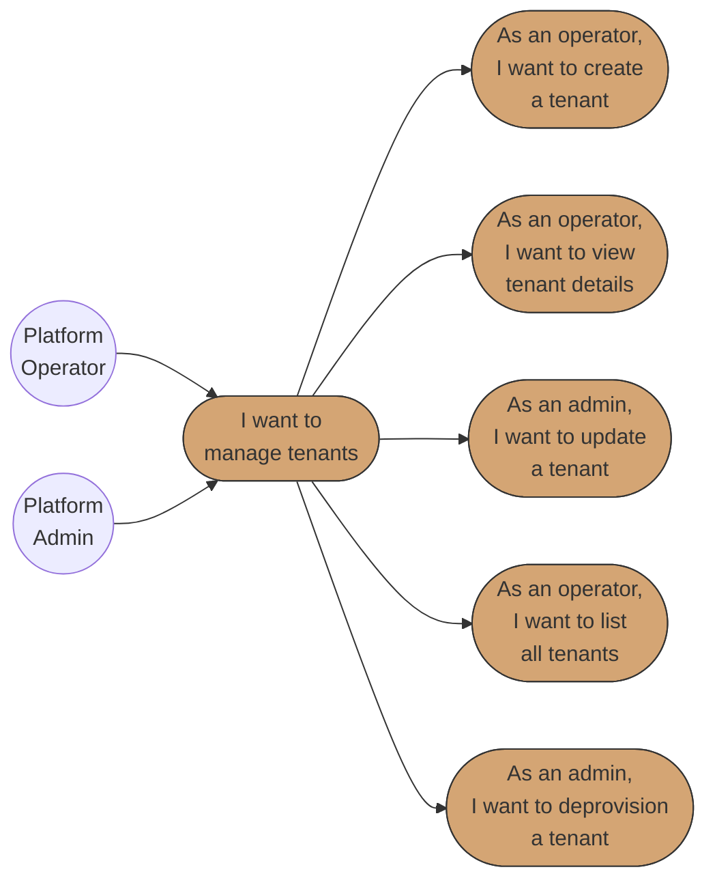
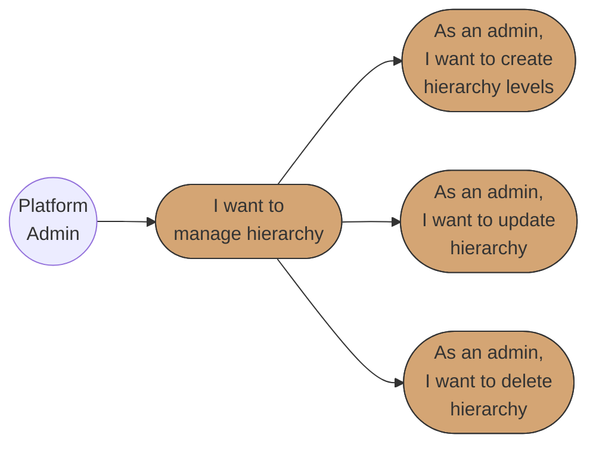
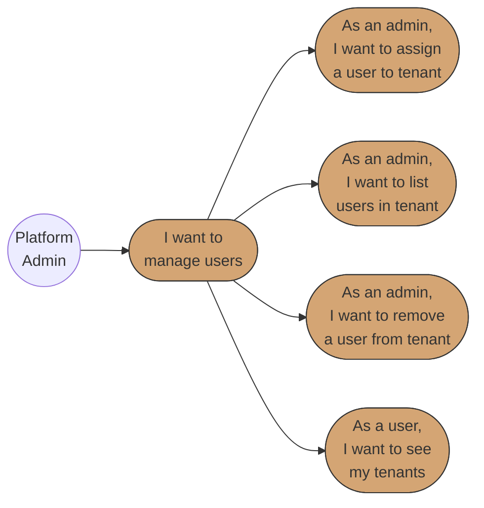
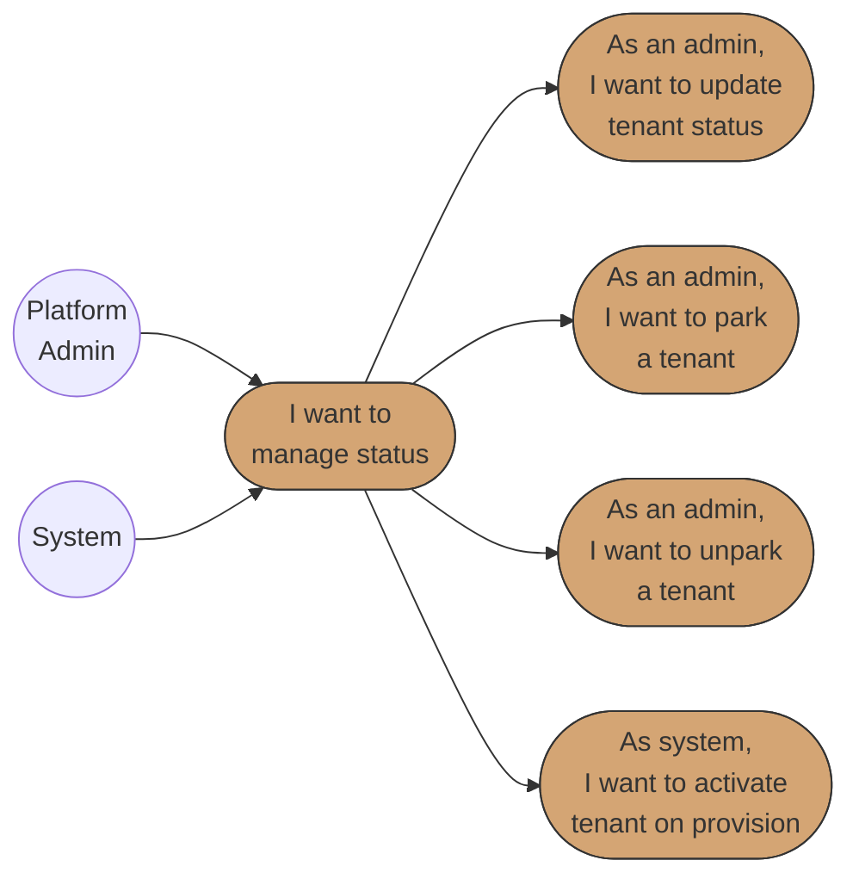
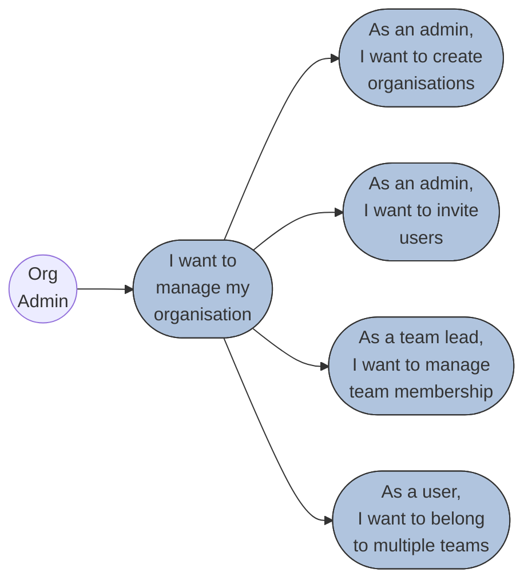

# Business Requirements Specification (BRS)
# BBWS Tenant Management

## Document Metadata

| Attribute | Value |
|-----------|-------|
| Document Title | BBWS Tenant Management Requirements Specification |
| Version | 1.0 |
| Last Updated | 2026-01-05 |
| Author | Business Analyst Agent |
| Reviewed By | Researcher Agent |
| Status | Final |
| Related HLD | 2.1_BBWS_Customer_Portal_Public_HLD_V1.1.md |
| Related LLD | Tenant_Management_LLD.md |
| Phase | 0 (First to Market) |

### Version History

| Version | Date | Author | Changes |
|---------|------|--------|---------|
| 1.0 | 2026-01-05 | Business Analyst Agent | Initial final version - Includes Park/Unpark operations, PARKED status in lifecycle |
| 1.1 (Plan) | 2026-01-05 | Researcher Agent | Plan document for BRS structure |

---

## 1. Executive Summary

### 1.1 Purpose

The **Tenant Management** module is a core microservice for managing customer tenant organizations in the BBWS platform. It provides RESTful API endpoints for tenant CRUD operations, organization hierarchy management, user assignments, and tenant lifecycle state transitions.

**Key distinction**: Tenant Management handles the **logical tenant entity** (organization, hierarchy, metadata, users) - it does NOT handle WordPress-specific provisioning (which is covered by the WordPress Tenant Management API in BRS 2.7).

### 1.2 Business Value

| Value Driver | Description |
|--------------|-------------|
| Self-Service Tenant Creation | Automate tenant onboarding reducing manual effort from 2+ hours to < 5 minutes |
| Organization Hierarchy | Support complex organizational structures (Division -> Group -> Team -> User) |
| Multi-Tenant Isolation | Logical separation of tenants enabling secure, isolated operations |
| Audit Compliance | Audit trail of tenant lifecycle events via DynamoDB streams |
| Platform Scalability | Support initial 5 tenants growing to 20+ without architecture changes |
| Cost Attribution | Enable per-tenant cost tracking and billing |
| Resource Management | Park/Unpark tenants to optimize resource utilization and costs |

### 1.3 Key Stakeholders

| Stakeholder | Interest | Responsibility |
|-------------|----------|----------------|
| Platform Operator | Primary user for tenant provisioning | Execute tenant CRUD operations |
| Platform Admin | User-tenant assignments, organization hierarchy | Manage users within tenants, park/unpark tenants |
| System (Automated) | Order processing triggers tenant creation | Automatic tenant provisioning on order completion |
| Business Owner | Cost efficiency, customer onboarding speed | Approve architecture and SLAs |
| DevOps Engineer | Infrastructure supporting the API | Deploy Lambda functions, DynamoDB tables |
| Security Engineer | Tenant isolation | Validate access controls and encryption |

### 1.4 Scope

**In Scope:**

| Capability | Description |
|------------|-------------|
| Tenant CRUD Operations | Create, Read, Update, Delete (soft) tenant organizations |
| Organization Hierarchy | Division -> Group -> Team structure management |
| User-Tenant Assignments | Assign users to tenants with roles |
| Tenant Status Lifecycle | PENDING -> ACTIVE -> SUSPENDED -> PARKED -> DEPROVISIONED state machine |
| Park/Unpark Operations | Temporarily disable tenants to reduce costs while preserving data |
| Tenant Metadata | Contact email, organization name, custom metadata |
| DynamoDB Storage | Single-table design with GSIs for access patterns |
| API Gateway Integration | RESTful API with Lambda handlers |

**Out of Scope:**

| Item | Rationale | Reference |
|------|-----------|-----------|
| WordPress Resource Provisioning | Separate concern - handled by WordPress Tenant Management API | BRS 2.7 |
| Cognito User Pool Management | Authentication layer - handled by Cognito Service | Cognito_Tenant_Pools_LLD.md |
| Site Management | WordPress site lifecycle - separate API | Site_Management_LLD.md |
| Content Management | EFS access points, wp-content - separate API | Content_Management_LLD.md |
| Payment Processing | Order/Payment flow - handled by Order API | BRS 2.1 |
| User Authentication | Login/MFA/Password - handled by Cognito | Cognito_Tenant_Pools_LLD.md |

### 1.5 Use Case Diagrams

#### Epic 1: Tenant Organization Management



#### Epic 2: Organization Hierarchy Management



#### Epic 3: User-Tenant Assignment Management



#### Epic 4: Tenant Status Lifecycle



#### Epic 7: Tenant Management (Site Builder Integration)

*Reference: BBWS_Site_Builder_BRS_v1.md Epic 7*



**Diagram Legend:**
- **Circle (( ))**: Actor/Role initiating use cases
- **Rounded rectangle ([ ])**: Use case in user story format
- **Solid arrows**: Actor initiates use case or use case hierarchy

### 1.6 Traceability Matrix

| Business Requirement | User Story Reference | Priority |
|---------------------|---------------------|----------|
| Self-service tenant creation | US-TEN-001 | Critical |
| View tenant details | US-TEN-002 | Critical |
| Update tenant information | US-TEN-003 | High |
| List all tenants with filtering | US-TEN-004 | Critical |
| Soft delete (deprovision) tenant | US-TEN-005 | High |
| Create organization hierarchy | US-TEN-006 | High |
| Update organization hierarchy | US-TEN-007 | Medium |
| Delete organization hierarchy | US-TEN-008 | Medium |
| Assign user to tenant | US-TEN-009 | Critical |
| List users in tenant | US-TEN-010 | High |
| Remove user from tenant | US-TEN-011 | High |
| Get user's tenants | US-TEN-012 | High |
| Update tenant status | US-TEN-013 | Critical |
| Park tenant | US-TEN-014 | High |
| Unpark tenant | US-TEN-015 | High |

---

## 2. Stakeholders

| Role | Name | Responsibility |
|------|------|----------------|
| Business Owner | BBWS Management | Final approval, funding, business decisions |
| Product Owner | [TBD] | Requirements prioritization, acceptance |
| Platform Operator | Operations Team | Execute tenant CRUD operations |
| Platform Admin | Admin Team | Manage users, hierarchy, tenant lifecycle |
| Technical Lead | [TBD] | Technical feasibility, architecture decisions |
| QA Engineer | [TBD] | Quality assurance, test execution |
| Security Engineer | [TBD] | Validate tenant isolation and access controls |

---

## 3. API Definitions

### 3.1 Tenant CRUD Endpoints

| Method | Endpoint | Description | Auth |
|--------|----------|-------------|------|
| POST | `/v1.0/tenants` | Create new tenant | JWT (Operator/Admin) |
| GET | `/v1.0/tenants/{tenantId}` | Get tenant details | JWT |
| PUT | `/v1.0/tenants/{tenantId}` | Update tenant | JWT (Admin) |
| DELETE | `/v1.0/tenants/{tenantId}` | Soft delete tenant | JWT (Admin) |
| GET | `/v1.0/tenants` | List tenants | JWT |
| PATCH | `/v1.0/tenants/{tenantId}/status` | Update status | JWT (Admin) |

### 3.2 Park/Unpark Endpoints

| Method | Endpoint | Description | Auth |
|--------|----------|-------------|------|
| POST | `/v1.0/tenants/{tenantId}/park` | Park tenant | JWT (Admin) |
| POST | `/v1.0/tenants/{tenantId}/unpark` | Unpark tenant | JWT (Admin) |

### 3.3 User Assignment Endpoints

| Method | Endpoint | Description | Auth |
|--------|----------|-------------|------|
| POST | `/v1.0/tenants/{tenantId}/users` | Assign user | JWT (Admin) |
| GET | `/v1.0/tenants/{tenantId}/users` | List users | JWT |
| DELETE | `/v1.0/tenants/{tenantId}/users/{userId}` | Remove user | JWT (Admin) |
| GET | `/v1.0/users/{userId}/tenants` | Get user's tenants | JWT |

### 3.4 Organization Hierarchy Endpoints

| Method | Endpoint | Description | Auth |
|--------|----------|-------------|------|
| POST | `/v1.0/tenants/{tenantId}/hierarchy` | Create hierarchy | JWT (Admin) |
| PUT | `/v1.0/tenants/{tenantId}/hierarchy` | Update hierarchy | JWT (Admin) |
| DELETE | `/v1.0/tenants/{tenantId}/hierarchy` | Delete hierarchy | JWT (Admin) |

---

## 3.5 Business Rules

### 3.5.1 Tenant Naming Rules (BR-TEN)

| Rule ID | Rule | Error Message |
|---------|------|---------------|
| BR-TEN-001 | Organization name must be unique | "Organization name already exists" |
| BR-TEN-002 | Organization name: 2-100 characters | "Organization name must be between 2 and 100 characters" |
| BR-TEN-003 | Organization name: alphanumeric, spaces, hyphens, apostrophes only | "Organization name contains invalid characters" |
| BR-TEN-004 | Tenant ID format: tenant-{uuid} | "Invalid tenant ID format" |
| BR-TEN-005 | Tenant ID is immutable after creation | "Tenant ID cannot be modified" |

### 3.5.2 User Assignment Rules (BR-USER)

| Rule ID | Rule | Error Message |
|---------|------|---------------|
| BR-USER-001 | User must exist in Cognito before assignment | "User not found in identity provider" |
| BR-USER-002 | User can be assigned to multiple tenants (with warning) | Warning: "User already assigned to another tenant" |
| BR-USER-003 | Valid roles: Admin, Operator, Viewer | "Invalid role. Must be Admin, Operator, or Viewer" |
| BR-USER-004 | Cannot remove last Admin from active tenant | "Cannot remove last Admin from tenant" |
| BR-USER-005 | Email must be valid RFC 5322 format | "Invalid email format" |

### 3.5.3 Status Transition Rules (BR-STATUS)

| Rule ID | Rule | Error Message |
|---------|------|---------------|
| BR-STATUS-001 | PENDING -> ACTIVE only when provisioning complete | "Cannot activate tenant before provisioning" |
| BR-STATUS-002 | ACTIVE -> SUSPENDED requires reason | "Suspension reason is required" |
| BR-STATUS-003 | DEPROVISIONED is terminal (no transitions allowed) | "Cannot modify deprovisioned tenant" |
| BR-STATUS-004 | SUSPENDED -> ACTIVE requires Admin approval | "Admin approval required to reactivate" |
| BR-STATUS-005 | Status change must record reason in audit | N/A (system enforcement) |
| BR-STATUS-006 | ACTIVE -> PARKED requires confirmation | "Confirm parking to proceed" |
| BR-STATUS-007 | PARKED -> ACTIVE (unpark) requires Admin approval | "Admin approval required to unpark" |
| BR-STATUS-008 | PARKED tenants cannot be suspended (must unpark first) | "Cannot suspend parked tenant. Unpark first." |

### 3.5.4 Park/Unpark Rules (BR-PARK)

| Rule ID | Rule | Error Message |
|---------|------|---------------|
| BR-PARK-001 | Only ACTIVE tenants can be parked | "Only active tenants can be parked" |
| BR-PARK-002 | Parked tenants retain all data but resources are released | N/A (system behavior) |
| BR-PARK-003 | Park operation requires reason | "Park reason is required" |
| BR-PARK-004 | Unpark restores tenant to ACTIVE status | N/A (system behavior) |
| BR-PARK-005 | Unpark may take up to 15 minutes for resource reprovisioning | Warning: "Unpark may take up to 15 minutes" |
| BR-PARK-006 | Parked tenants cannot create new resources | "Parked tenant cannot create resources" |

---

## Epic 1: Tenant Organization Management

**Epic ID:** EPIC-TEN-001
**Description:** Core CRUD operations for tenant organizations
**Business Value:** Enable self-service tenant provisioning, reducing manual onboarding effort

### User Story 1: Create Tenant Organization (US-TEN-001)

**User Story:**
> As a Platform Operator,
> I want to create a tenant organization,
> So that customers are logically grouped and can have resources provisioned.

**Pre-conditions:**
- Operator authenticated with Operator or Admin role
- Valid JWT token with role claim
- Unique organization name provided

**Positive Scenario: Successful Tenant Creation**

| Step | Action | Expected Result |
|------|--------|-----------------|
| 1 | POST `/v1.0/tenants` with organization details | Request received by API Gateway |
| 2 | Lambda validates JWT token and role | Authorization confirmed |
| 3 | Lambda validates request body schema | Validation passes |
| 4 | Lambda checks organization name uniqueness (GSI1 query) | Name is unique |
| 5 | Lambda generates tenant ID (UUID format) | `tenant-{uuid}` generated |
| 6 | Lambda creates tenant record in DynamoDB (PK=TENANT#{id}, SK=METADATA) | Item created |
| 7 | Lambda creates audit event (PK=TENANT#{id}, SK=EVENT#{timestamp}#{eventId}) | Audit logged |
| 8 | Lambda returns 201 Created with tenant details | Response includes tenantId, status=PENDING |

**Negative Scenario: Duplicate Organization Name**

| Step | Action | Expected Result |
|------|--------|-----------------|
| 1 | POST `/v1.0/tenants` with existing organization name | Request received |
| 2 | Lambda queries GSI1 (GSI1PK=ORG#{name}) | Existing tenant found |
| 3 | Lambda returns 409 Conflict | Error: "Organization name already exists" |

**Negative Scenario: Invalid Request Body**

| Step | Action | Expected Result |
|------|--------|-----------------|
| 1 | POST `/v1.0/tenants` with missing required fields | Request received |
| 2 | Lambda validates request body | Validation fails |
| 3 | Lambda returns 400 Bad Request | Error: Field-level validation errors |

**Edge Case: Organization Name with Special Characters**

| Step | Action | Expected Result |
|------|--------|-----------------|
| 1 | POST with name containing special characters | Request received |
| 2 | Lambda sanitizes and validates name | XSS/SQL injection characters rejected |
| 3 | Lambda returns 400 if invalid | Error: "Organization name contains invalid characters" |

**Post-conditions:**
- Tenant record created in DynamoDB with status PENDING
- TENANT_CREATED audit event logged
- Tenant ID returned for subsequent operations

**Acceptance Criteria:**
- [ ] Tenant ID generated in format `tenant-{uuid}`
- [ ] Organization name validated (2-100 chars, alphanumeric with spaces/hyphens)
- [ ] Contact email validated (RFC 5322 format)
- [ ] Duplicate organization names rejected with 409 Conflict
- [ ] Initial status set to PENDING
- [ ] createdAt timestamp in ISO 8601 format
- [ ] createdBy set to authenticated user's email/ID
- [ ] TENANT_CREATED audit event recorded
- [ ] Response includes HATEOAS links for related operations
- [ ] Idempotency key supported for retry safety

---

### User Story 2: Get Tenant by ID (US-TEN-002)

**User Story:**
> As a Platform Operator,
> I want to retrieve tenant details by ID,
> So that I can view the current state and configuration of a tenant.

**Pre-conditions:**
- Operator authenticated with valid role
- Tenant ID exists in system

**Positive Scenario: Successful Tenant Retrieval**

| Step | Action | Expected Result |
|------|--------|-----------------|
| 1 | GET `/v1.0/tenants/{tenantId}` | Request received |
| 2 | Lambda validates JWT and authorization | Authorization confirmed |
| 3 | Lambda queries DynamoDB (PK=TENANT#{id}, SK=METADATA) | Tenant found |
| 4 | Lambda returns 200 OK with tenant details | Complete tenant data returned |

**Negative Scenario: Tenant Not Found**

| Step | Action | Expected Result |
|------|--------|-----------------|
| 1 | GET `/v1.0/tenants/{invalidId}` | Request received |
| 2 | Lambda queries DynamoDB | No item found |
| 3 | Lambda returns 404 Not Found | Error: "Tenant not found" |

**Acceptance Criteria:**
- [ ] Returns complete tenant metadata including hierarchy
- [ ] Returns current status
- [ ] Returns list of assigned users (summary)
- [ ] Returns resource associations (if any)
- [ ] Viewers can only access assigned tenants
- [ ] Operators can access assigned tenants
- [ ] Admins can access all tenants
- [ ] Response includes HATEOAS links

---

### User Story 3: Update Tenant (US-TEN-003)

**User Story:**
> As a Platform Admin,
> I want to update tenant details,
> So that I can maintain accurate tenant information.

**Pre-conditions:**
- Admin authenticated
- Tenant exists and is not DEPROVISIONED

**Positive Scenario: Successful Tenant Update**

| Step | Action | Expected Result |
|------|--------|-----------------|
| 1 | PUT `/v1.0/tenants/{tenantId}` with updates | Request received |
| 2 | Lambda validates authorization (Admin only) | Authorized |
| 3 | Lambda validates updates (immutable fields protected) | Validation passes |
| 4 | Lambda updates tenant record with optimistic locking | Update successful |
| 5 | Lambda returns 200 OK with updated tenant | Updated data returned |

**Negative Scenario: Update Deprovisioned Tenant**

| Step | Action | Expected Result |
|------|--------|-----------------|
| 1 | PUT `/v1.0/tenants/{tenantId}` for DEPROVISIONED tenant | Request received |
| 2 | Lambda checks tenant status | Status is DEPROVISIONED |
| 3 | Lambda returns 422 Unprocessable Entity | Error: "Cannot update deprovisioned tenant" |

**Acceptance Criteria:**
- [ ] Only modifiable fields can be updated (not tenantId, createdAt)
- [ ] Organization name change validates uniqueness
- [ ] Contact email change validates format
- [ ] Metadata can be partially updated (merge)
- [ ] Version/ETag for optimistic locking
- [ ] DEPROVISIONED tenants cannot be updated
- [ ] Audit event records before and after values

---

### User Story 4: List Tenants (US-TEN-004)

**User Story:**
> As a Platform Operator,
> I want to list all tenants with filtering options,
> So that I can see platform utilization and find specific tenants.

**Pre-conditions:**
- Operator authenticated

**Positive Scenario: List All Tenants**

| Step | Action | Expected Result |
|------|--------|-----------------|
| 1 | GET `/v1.0/tenants` | Request received |
| 2 | Lambda validates JWT | Authorized |
| 3 | Lambda queries DynamoDB with pagination | Results returned |
| 4 | Lambda returns 200 OK with tenant list | Paginated list with metadata |

**Acceptance Criteria:**
- [ ] Pagination with limit and nextToken
- [ ] Filter by status (PENDING, ACTIVE, SUSPENDED, PARKED, DEPROVISIONED)
- [ ] Filter by organization name (partial match)
- [ ] Sort by createdAt (ascending/descending)
- [ ] Admins see all tenants
- [ ] Operators see assigned tenants only
- [ ] Viewers see assigned tenants only
- [ ] Response includes total count and pagination metadata

---

### User Story 5: Soft Delete (Deprovision) Tenant (US-TEN-005)

**User Story:**
> As a Platform Admin,
> I want to mark a tenant as deprovisioned,
> So that it is logically removed while preserving audit history.

**Pre-conditions:**
- Admin authenticated
- Tenant exists

**Positive Scenario: Successful Deprovisioning**

| Step | Action | Expected Result |
|------|--------|-----------------|
| 1 | DELETE `/v1.0/tenants/{tenantId}` | Request received |
| 2 | Lambda validates authorization (Admin only) | Authorized |
| 3 | Lambda checks for active resources | Resources check passed |
| 4 | Lambda updates status to DEPROVISIONED | Status updated |
| 5 | Lambda returns 200 OK | Soft delete confirmed |

**Acceptance Criteria:**
- [ ] Only Admins can delete tenants
- [ ] Soft delete (status change, not physical delete)
- [ ] Active resources must be deprovisioned first (unless force=true)
- [ ] force=true requires explicit confirmation
- [ ] Audit trail preserved
- [ ] GSI2 updated to STATUS#DEPROVISIONED
- [ ] User assignments marked as inactive

---

## Epic 2: Organization Hierarchy Management

**Epic ID:** EPIC-TEN-002
**Description:** Manage the organizational structure (Division -> Group -> Team)
**Business Value:** Support complex organizational structures for enterprise customers

### User Story 6: Create Organization Hierarchy (US-TEN-006)

**User Story:**
> As a Platform Admin,
> I want to create organization hierarchy levels for a tenant,
> So that users can be organized into divisions, groups, and teams.

**Pre-conditions:**
- Admin authenticated
- Tenant exists and is ACTIVE

**Acceptance Criteria:**
- [ ] Division is required, group and team are optional
- [ ] Hierarchy names validated (2-50 chars, alphanumeric)
- [ ] Duplicate combinations rejected
- [ ] tenantCount initialized to 0
- [ ] GSI1 indexed for hierarchy queries
- [ ] Can retrieve hierarchy by division

---

### User Story 7: Update Organization Hierarchy (US-TEN-007)

**User Story:**
> As a Platform Admin,
> I want to update organization hierarchy,
> So that I can restructure the organization as needed.

**Acceptance Criteria:**
- [ ] Hierarchy names can be renamed
- [ ] Users must be reassigned before hierarchy deletion
- [ ] HIERARCHY_UPDATED audit event logged

---

### User Story 8: Delete Organization Hierarchy (US-TEN-008)

**User Story:**
> As a Platform Admin,
> I want to delete organization hierarchy levels,
> So that I can remove unused organizational structures.

**Acceptance Criteria:**
- [ ] Only empty hierarchies can be deleted
- [ ] Cascading option requires explicit confirmation
- [ ] HIERARCHY_DELETED audit event logged

---

## Epic 3: User-Tenant Assignment Management

**Epic ID:** EPIC-TEN-003
**Description:** Manage the relationship between users and tenants
**Business Value:** Enable proper access control and multi-tenant user management

### User Story 9: Assign User to Tenant (US-TEN-009)

**User Story:**
> As a Platform Admin,
> I want to assign a user to a tenant,
> So that the user can access tenant-specific resources.

**Pre-conditions:**
- Admin authenticated
- Tenant is ACTIVE
- User exists in Cognito

**Positive Scenario: Successful User Assignment**

| Step | Action | Expected Result |
|------|--------|-----------------|
| 1 | POST `/v1.0/tenants/{tenantId}/users` with user details | Request received |
| 2 | Lambda validates user exists in Cognito | User validated |
| 3 | Lambda creates assignment record | Assignment created |
| 4 | Lambda updates Cognito custom attributes | tenant_id updated |
| 5 | Lambda returns 201 Created | Assignment confirmed |

**Acceptance Criteria:**
- [ ] Valid roles: Admin, Operator, Viewer
- [ ] Email validated (RFC 5322)
- [ ] User validated against Cognito
- [ ] Assignment includes assignedBy, assignedAt
- [ ] GSI1 indexed for user-to-tenant lookups
- [ ] Cognito custom attribute tenant_id updated
- [ ] Multiple tenant assignments require explicit confirmation

---

### User Story 10: List Users in Tenant (US-TEN-010)

**User Story:**
> As a Platform Admin,
> I want to list all users assigned to a tenant,
> So that I can manage access and permissions.

**Acceptance Criteria:**
- [ ] Query PK=TENANT#{id}, SK begins_with "USER#"
- [ ] Returns userId, email, role, assignedAt, assignedBy
- [ ] Pagination support for large user lists
- [ ] Filter by role
- [ ] Sort by assignedAt

---

### User Story 11: Remove User from Tenant (US-TEN-011)

**User Story:**
> As a Platform Admin,
> I want to remove a user from a tenant,
> So that they no longer have access to tenant resources.

**Acceptance Criteria:**
- [ ] Assignment record deleted from DynamoDB
- [ ] Cognito group membership removed
- [ ] USER_REMOVED audit event logged
- [ ] User's next JWT excludes tenant_id claim
- [ ] Cannot remove last Admin from tenant (safety check)

---

### User Story 12: Get User's Tenants (US-TEN-012)

**User Story:**
> As a user,
> I want to see which tenants I belong to,
> So that I can switch between organizations.

**Acceptance Criteria:**
- [ ] Query GSI1 (GSI1PK=USER#{userId})
- [ ] Returns list of tenants with roles
- [ ] Self-service: users can query their own assignments
- [ ] Admins can query any user's assignments

---

## Epic 4: Tenant Status Lifecycle

**Epic ID:** EPIC-TEN-004
**Description:** Manage tenant status transitions including Park/Unpark operations
**Business Value:** Enable proper lifecycle management and cost optimization through parking

### 4.1 Status State Machine

```
                 +------------------+
                 |     PENDING      |
                 | (Initial State)  |
                 +--------+---------+
                          |
          provisioning    | complete
                          v
                 +------------------+
      +--------->|     ACTIVE       |<---------+
      |          +--------+---------+          |
      |                   |                    |
reactivate              suspend              unpark
      |                   v                    |
      |          +------------------+          |
      +----------|    SUSPENDED     |          |
                 +--------+---------+          |
                          |                    |
                      park|                    |
                          v                    |
                 +------------------+          |
                 |     PARKED       |----------+
                 +--------+---------+
                          |
               deprovision|
                          v
                 +------------------+
                 |  DEPROVISIONED   |
                 |  (Terminal State)|
                 +------------------+
```

### 4.2 Valid Transitions

| From | To | Trigger | Authority |
|------|----|---------|-----------|
| PENDING | ACTIVE | Provisioning complete | System/Operator |
| ACTIVE | SUSPENDED | Payment issue, policy violation | Admin |
| SUSPENDED | ACTIVE | Issue resolved | Admin |
| ACTIVE | PARKED | Cost optimization, temporary deactivation | Admin |
| PARKED | ACTIVE | Reactivation requested | Admin |
| ACTIVE | DEPROVISIONED | Offboarding | Admin |
| SUSPENDED | DEPROVISIONED | Offboarding | Admin |
| PARKED | DEPROVISIONED | Offboarding | Admin |
| PENDING | FAILED | Provisioning failed | System |

### User Story 13: Update Tenant Status (US-TEN-013)

**User Story:**
> As a Platform Admin,
> I want to update a tenant's lifecycle status,
> So that I can manage the tenant through its lifecycle.

**Acceptance Criteria:**
- [ ] Invalid transitions rejected with 422
- [ ] STATUS_CHANGED audit event logged
- [ ] Previous status recorded in audit details
- [ ] GSI2 updated with new status
- [ ] Notification published for status changes
- [ ] DEPROVISIONED is terminal (no transitions allowed)

---

### User Story 14: Park Tenant (US-TEN-014)

**User Story:**
> As a Platform Admin,
> I want to park an active tenant,
> So that resources can be released while preserving tenant data for future reactivation.

**Pre-conditions:**
- Admin authenticated
- Tenant status is ACTIVE

**Positive Scenario: Successful Tenant Parking**

| Step | Action | Expected Result |
|------|--------|-----------------|
| 1 | POST `/v1.0/tenants/{tenantId}/park` with reason | Request received |
| 2 | Lambda validates authorization (Admin only) | Authorized |
| 3 | Lambda validates tenant status is ACTIVE | Status validated |
| 4 | Lambda updates status to PARKED | Status updated |
| 5 | Lambda publishes TENANT_PARKED event | Event published for resource cleanup |
| 6 | Lambda returns 200 OK | Park confirmed |

**Negative Scenario: Park Non-Active Tenant**

| Step | Action | Expected Result |
|------|--------|-----------------|
| 1 | POST `/v1.0/tenants/{tenantId}/park` for SUSPENDED tenant | Request received |
| 2 | Lambda checks tenant status | Status is not ACTIVE |
| 3 | Lambda returns 422 Unprocessable Entity | Error: "Only active tenants can be parked" |

**Post-conditions:**
- Tenant status is PARKED
- TENANT_PARKED audit event logged
- TENANT_PARKED event published to SNS/SQS for resource cleanup
- Parked timestamp recorded

**Acceptance Criteria:**
- [ ] Only ACTIVE tenants can be parked
- [ ] Park reason is required in request body
- [ ] TENANT_PARKED audit event logged with reason
- [ ] Tenant data preserved in DynamoDB
- [ ] Resources are released by downstream systems
- [ ] Parked users cannot log in to tenant resources
- [ ] Error messages MUST be clear and actionable

---

### User Story 15: Unpark Tenant (US-TEN-015)

**User Story:**
> As a Platform Admin,
> I want to unpark a parked tenant,
> So that the tenant can be reactivated and resume operations.

**Pre-conditions:**
- Admin authenticated
- Tenant status is PARKED

**Positive Scenario: Successful Tenant Unparking**

| Step | Action | Expected Result |
|------|--------|-----------------|
| 1 | POST `/v1.0/tenants/{tenantId}/unpark` | Request received |
| 2 | Lambda validates authorization (Admin only) | Authorized |
| 3 | Lambda validates tenant status is PARKED | Status validated |
| 4 | Lambda updates status to ACTIVE | Status updated |
| 5 | Lambda publishes TENANT_UNPARKED event | Event published for resource reprovisioning |
| 6 | Lambda returns 200 OK with warning | Unpark initiated (may take up to 15 minutes) |

**Negative Scenario: Unpark Non-Parked Tenant**

| Step | Action | Expected Result |
|------|--------|-----------------|
| 1 | POST `/v1.0/tenants/{tenantId}/unpark` for ACTIVE tenant | Request received |
| 2 | Lambda checks tenant status | Status is not PARKED |
| 3 | Lambda returns 422 Unprocessable Entity | Error: "Only parked tenants can be unparked" |

**Post-conditions:**
- Tenant status is ACTIVE
- TENANT_UNPARKED audit event logged
- TENANT_UNPARKED event published for resource reprovisioning
- Resources are reprovisioned by downstream systems

**Acceptance Criteria:**
- [ ] Only PARKED tenants can be unparked
- [ ] TENANT_UNPARKED audit event logged
- [ ] Warning returned about reprovisioning time (up to 15 minutes)
- [ ] Resources are reprovisioned by downstream systems
- [ ] Users can access tenant resources after reprovisioning
- [ ] Error messages MUST be clear and actionable

---

## 4. Data Model

### 4.1 Tenant Entity

| Attribute | Type | Required | Description |
|-----------|------|----------|-------------|
| tenantId | String | Yes | Primary identifier (format: tenant-{uuid}) |
| organizationName | String | Yes | Organization name (unique) |
| environment | String | Yes | Environment (dev, sit, prod) |
| status | Enum | Yes | Lifecycle status (PENDING, ACTIVE, SUSPENDED, PARKED, DEPROVISIONED, FAILED) |
| contactEmail | String | Yes | Primary contact email |
| division | String | No | Organization division |
| group | String | No | Organization group |
| team | String | No | Organization team |
| createdAt | DateTime | Yes | Creation timestamp (ISO 8601) |
| updatedAt | DateTime | No | Last update timestamp |
| createdBy | String | Yes | Email of creator |
| parkedAt | DateTime | No | Timestamp when parked |
| parkedBy | String | No | Email of user who parked |
| parkReason | String | No | Reason for parking |
| metadata | Map | No | Custom metadata key-value pairs |
| version | Number | Yes | Optimistic locking version |

### 4.2 TenantStatus Enum

| Value | Description | Allowed Transitions |
|-------|-------------|---------------------|
| PENDING | Initial state, awaiting provisioning | ACTIVE, FAILED |
| ACTIVE | Fully provisioned and operational | SUSPENDED, PARKED, DEPROVISIONED |
| SUSPENDED | Temporarily disabled due to policy/payment | ACTIVE, DEPROVISIONED |
| PARKED | Temporarily disabled for cost optimization | ACTIVE, DEPROVISIONED |
| DEPROVISIONED | Terminal state, soft deleted | None |
| FAILED | Provisioning failed | PENDING (retry) |

### 4.3 DynamoDB Table Design

**Table Name:** `{env}-Tenants`

**Capacity Mode:** On-Demand

**Primary Key:**
- PK (Partition Key): String
- SK (Sort Key): String

**Global Secondary Indexes:**

| Index | Partition Key | Sort Key | Purpose |
|-------|---------------|----------|---------|
| GSI1 | GSI1PK | GSI1SK | Organization lookup, user-to-tenant |
| GSI2 | GSI2PK | GSI2SK | Status queries, time-based queries |

**Item Patterns:**

| Entity | PK | SK |
|--------|----|----|
| Tenant Metadata | TENANT#{tenantId} | METADATA |
| Tenant Resource | TENANT#{tenantId} | RESOURCE#{resourceType} |
| User Assignment | TENANT#{tenantId} | USER#{userId} |
| Hierarchy | ORG#{orgName} | HIERARCHY#{div}#{group}#{team} |
| Audit Event | TENANT#{tenantId} | EVENT#{timestamp}#{eventId} |

---

## 5. Non-Functional Requirements

### 5.1 Performance

| Metric | Target |
|--------|--------|
| Create tenant response time | < 500ms |
| Get tenant response time | < 200ms |
| List tenants response time (20 items) | < 500ms |
| Park/Unpark response time | < 500ms |
| DynamoDB read latency | < 10ms (p99) |
| Lambda cold start | < 3 seconds |

### 5.2 Security

| Aspect | Implementation |
|--------|----------------|
| Authentication | JWT tokens via Cognito |
| Authorization | Role-based (Admin, Operator, Viewer) |
| API Key | Required for all requests (X-Api-Key header) |
| Encryption at rest | DynamoDB encryption with AWS-managed KMS |
| Encryption in transit | TLS 1.2+ |
| Rate limiting | API Gateway throttling (100 req/sec) |

### 5.3 Availability

| Metric | Target |
|--------|--------|
| Uptime | 99.9% |
| RTO | 4 hours (DR failover) |
| RPO | 1 hour (backup frequency) |

### 5.4 Scalability

- DynamoDB on-demand capacity mode
- Lambda auto-scaling
- Design for 100+ tenants without architecture changes

---

## 6. Constraints

| Constraint Type | Description |
|-----------------|-------------|
| Technology | AWS serverless (Lambda, DynamoDB, Cognito) |
| Data Residency | Primary region af-south-1, failover eu-west-1 |
| Integration | Must integrate with Order API for auto-provisioning |
| Security | Tenant isolation required at data level |

---

## 7. Assumptions and Risks

### 7.1 Assumptions

| ID | Assumption | Impact if Invalid |
|----|------------|-------------------|
| A1 | Tenant ID format tenant-{uuid} is sufficient | Need migration if format changes |
| A2 | Single Cognito user pool supports multi-tenant | May need user pool per tenant |
| A3 | DynamoDB single-table design scales sufficiently | May need table sharding |

### 7.2 Risks

| ID | Risk | Probability | Impact | Mitigation |
|----|------|-------------|--------|------------|
| R1 | Tenant data leakage between tenants | Low | High | Row-level security, access controls |
| R2 | Park/Unpark takes longer than expected | Medium | Medium | Async processing, user notification |
| R3 | Orphaned resources on deprovisioning | Medium | Medium | Cleanup jobs, resource tracking |

---

## 8. Glossary

| Term | Definition |
|------|------------|
| Tenant | Customer organization entity in the multi-tenant platform |
| Park | Temporarily disable a tenant to release resources while preserving data |
| Unpark | Reactivate a parked tenant and reprovision resources |
| Soft Delete | Setting status to DEPROVISIONED instead of physical deletion |
| Organization Hierarchy | Division -> Group -> Team structure for organizing users |
| Deprovisioned | Terminal status indicating tenant is logically deleted |

---

## 9. Sign-Off

| Role | Name | Signature | Date |
|------|------|-----------|------|
| Business Owner | | | |
| Product Owner | | | |
| Technical Lead | | | |
| QA Lead | | | |

---

## Appendix A: API Request/Response Examples

### A.1 Create Tenant Request

```json
{
  "organizationName": "Acme Corporation",
  "contactEmail": "admin@acme.com",
  "environment": "prod",
  "division": "Technology",
  "metadata": {
    "industry": "Software",
    "size": "Enterprise"
  }
}
```

### A.2 Create Tenant Response

```json
{
  "tenantId": "tenant-550e8400-e29b-41d4-a716-446655440000",
  "organizationName": "Acme Corporation",
  "contactEmail": "admin@acme.com",
  "environment": "prod",
  "status": "PENDING",
  "division": "Technology",
  "createdAt": "2026-01-05T10:30:00Z",
  "createdBy": "operator@bbws.io",
  "version": 1,
  "_links": {
    "self": { "href": "/v1.0/tenants/tenant-550e8400-e29b-41d4-a716-446655440000" },
    "users": { "href": "/v1.0/tenants/tenant-550e8400-e29b-41d4-a716-446655440000/users" },
    "park": { "href": "/v1.0/tenants/tenant-550e8400-e29b-41d4-a716-446655440000/park" }
  }
}
```

### A.3 Park Tenant Request

```json
{
  "reason": "Customer requested temporary suspension for cost reduction"
}
```

### A.4 Park Tenant Response

```json
{
  "tenantId": "tenant-550e8400-e29b-41d4-a716-446655440000",
  "status": "PARKED",
  "parkedAt": "2026-01-05T14:30:00Z",
  "parkedBy": "admin@bbws.io",
  "parkReason": "Customer requested temporary suspension for cost reduction",
  "message": "Tenant parked successfully. Resources will be released within 5 minutes.",
  "_links": {
    "self": { "href": "/v1.0/tenants/tenant-550e8400-e29b-41d4-a716-446655440000" },
    "unpark": { "href": "/v1.0/tenants/tenant-550e8400-e29b-41d4-a716-446655440000/unpark" }
  }
}
```

### A.5 Unpark Tenant Response

```json
{
  "tenantId": "tenant-550e8400-e29b-41d4-a716-446655440000",
  "status": "ACTIVE",
  "unparkedAt": "2026-01-05T16:00:00Z",
  "unparkedBy": "admin@bbws.io",
  "message": "Tenant unpark initiated. Resources will be reprovisioned within 15 minutes.",
  "warning": "Full functionality may not be available immediately. Resource reprovisioning in progress.",
  "_links": {
    "self": { "href": "/v1.0/tenants/tenant-550e8400-e29b-41d4-a716-446655440000" },
    "park": { "href": "/v1.0/tenants/tenant-550e8400-e29b-41d4-a716-446655440000/park" }
  }
}
```

---

## Appendix B: Error Code Reference

| HTTP Status | Error Code | Description |
|-------------|------------|-------------|
| 400 | VALIDATION_ERROR | Request body validation failed |
| 401 | UNAUTHORIZED | Invalid or missing JWT token |
| 403 | FORBIDDEN | User lacks required permissions |
| 404 | NOT_FOUND | Tenant or user not found |
| 409 | CONFLICT | Organization name already exists |
| 422 | INVALID_STATUS_TRANSITION | Invalid status transition attempted |
| 429 | RATE_LIMITED | Too many requests |
| 500 | INTERNAL_ERROR | Server error |

---

**End of Document**
