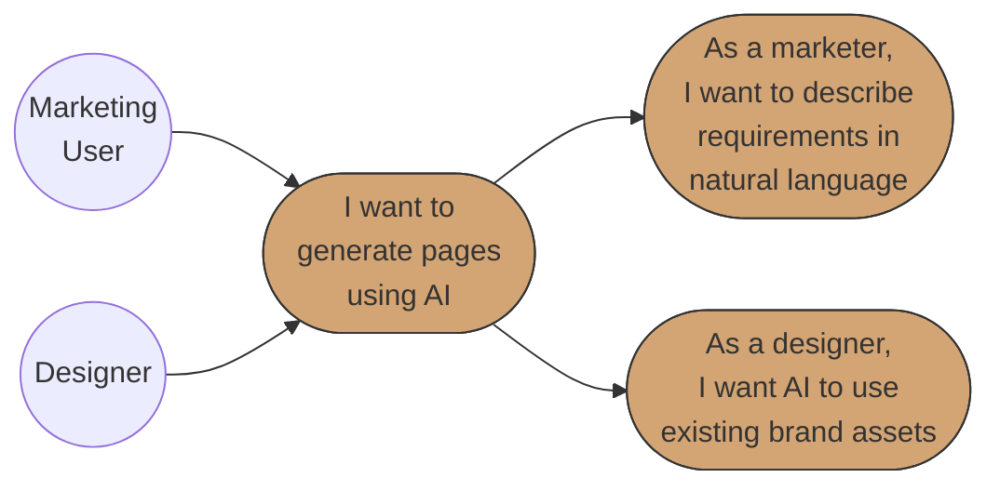
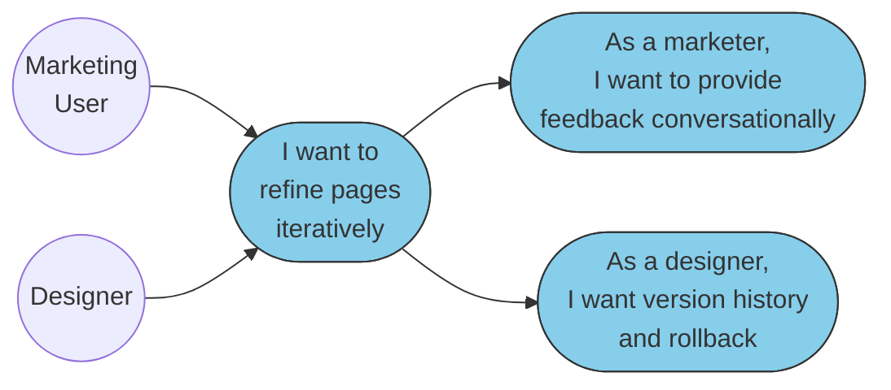
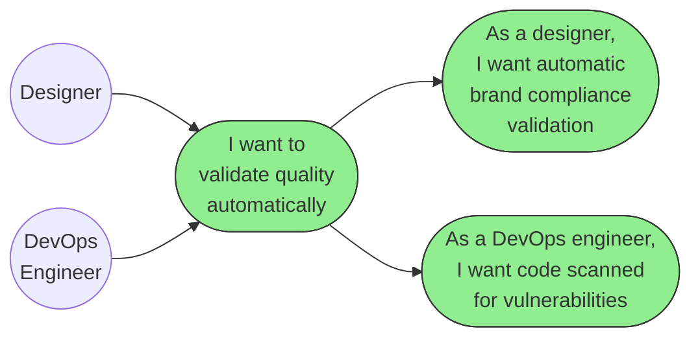
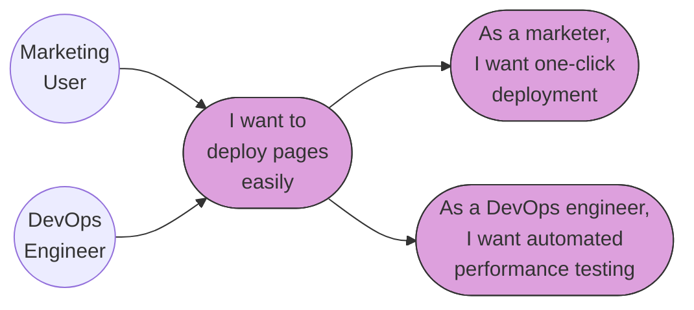
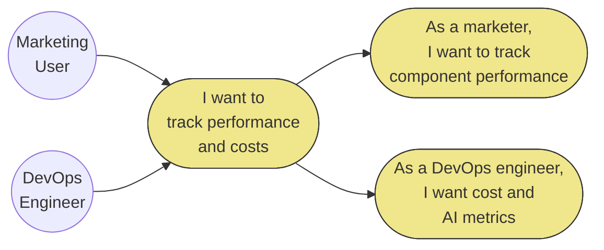
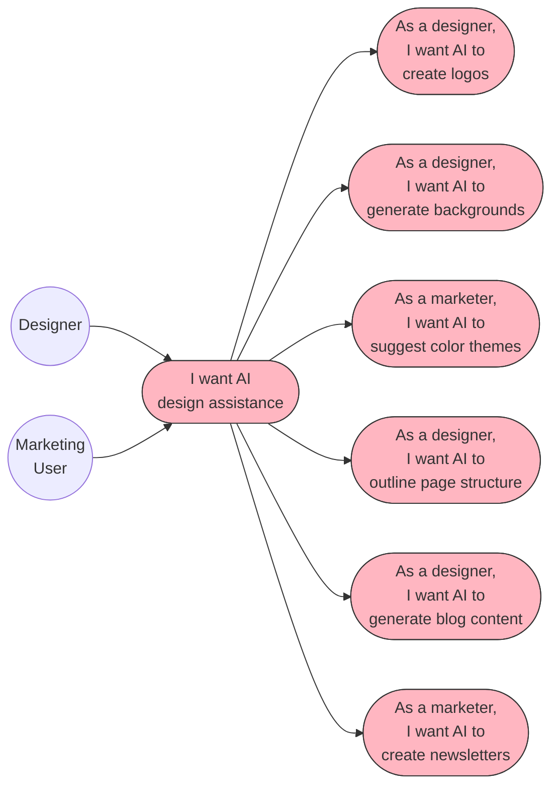
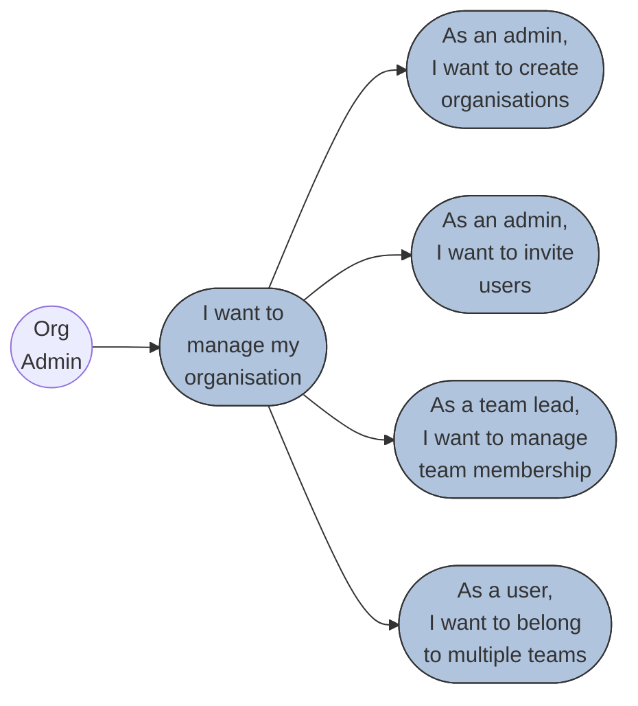
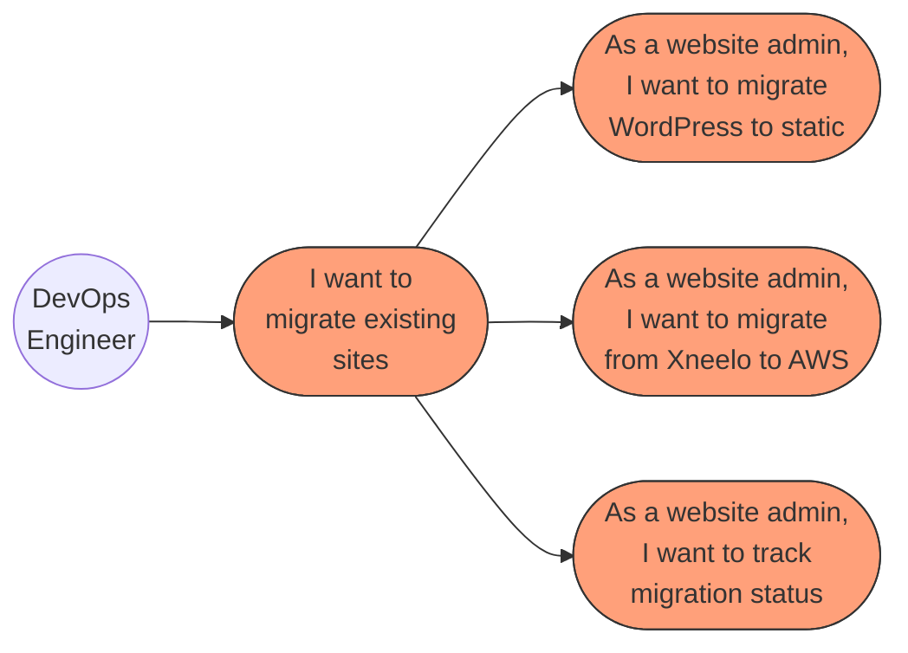
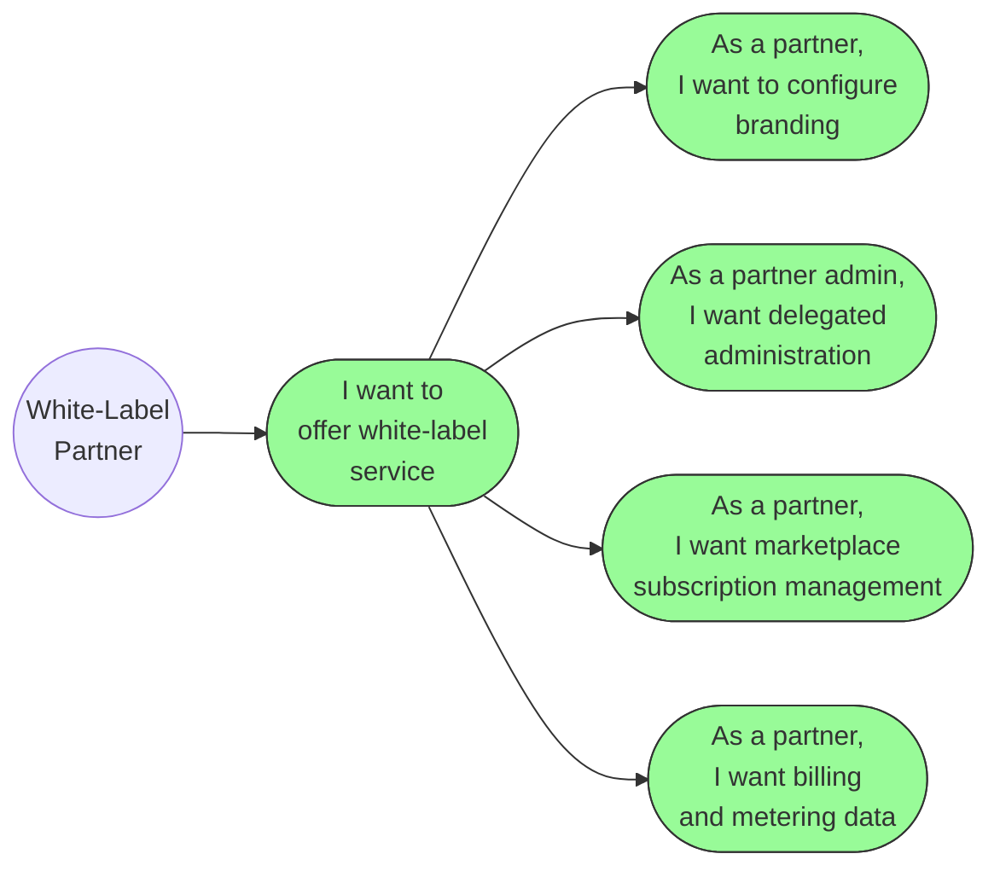
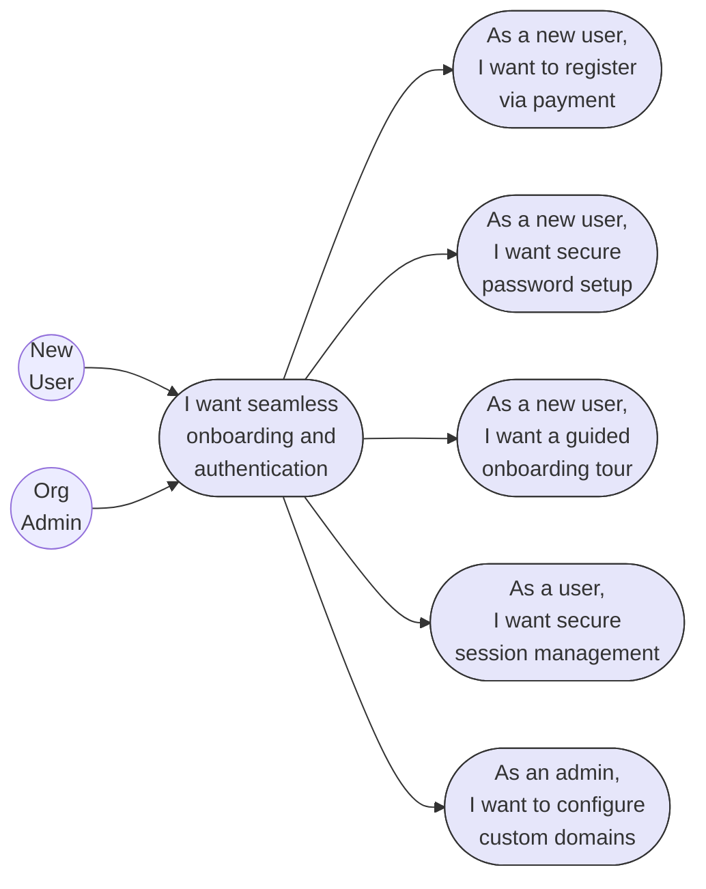

# BBWS AI-Powered Site Builder
## Business Requirements Specification (BRS)

**Version**: 1.3
**Author**: Business Analyst Agent
**Date**: 2026-01-18
**Status**: Draft for Review

---

## Related Documents

| Document | Location | Version |
|----------|----------|---------|
| HLD | `../HLDs/BBSW_Site_Builder_HLD_v3.md` | 3.1 |
| Frontend LLD | `../LLDs/3.1.1_LLD_Site_Builder_Frontend.md` | 1.1 |
| Generation API LLD | `../LLDs/3.1.2_LLD_Site_Builder_Generation_API.md` | 1.3 |
| UX Wireframes | `../UX/Site_Builder_Wireframes_v1.md` | 1.1 |

---

## Document History

| Version | Date | Changes | Owner |
|---------|------|---------|-------|
| 1.0 | 2026-01-16 | Initial BRS reverse-engineered from HLD v3, organized by 5 user personas, added White-Label/Marketplace epic (Epic 9) with user stories US-025 to US-028 | Business Analyst Agent |
| 1.1 | 2026-01-16 | Added Related Documents section with links to HLD, LLDs, and UX Wireframes | Business Analyst Agent |
| 1.2 | 2026-01-18 | Added Epic 10 (User Onboarding & Authentication) with user stories US-029 to US-033 covering payment handoff, tenant provisioning, first-time login, onboarding tour, session management, and custom domains. Added "New User" persona. Cross-referenced with Business Process documents BP-001 to BP-006. | Business Analyst Agent |
| 1.3 | 2026-01-18 | Added Section 1.5 Use Case Diagrams with mermaid flowcharts for all 10 epics, showing actor-to-use-case relationships with distinct color coding per epic. | Business Analyst Agent |

---

## 1. Business Context

### 1.1 Problem Statement

Marketing and Product teams face significant challenges in creating landing pages:

| Pain Point | Current State | Impact |
|------------|---------------|--------|
| **Time to Market** | 2-4 weeks per landing page | Missed campaign windows, competitive disadvantage |
| **Resource Constraints** | 20+ requests/month, only 5-7 delivered | Backlog growth, frustrated stakeholders |
| **Cost per Page** | R8,000 - R15,000 | Budget constraints limit campaign quantity |
| **Inconsistent Quality** | No centralized system | Brand dilution, variable user experience |
| **Limited A/B Testing** | Manual creation prohibitive | Optimization opportunities missed |
| **Technical Dependency** | Marketing waits for developers | Slow iteration, bottlenecked workflows |

*Reference: HLD v3 Section 1.1*

### 1.2 Solution Overview

The **AI-Powered Site Builder** is a serverless, multi-tenant SaaS platform that enables non-technical users to generate production-ready landing pages through conversational AI.

**Key Capabilities**:
- Natural language to landing page generation (10-15 seconds)
- AI-powered design agents via Bedrock AgentCore (7 agents)
- Automated brand compliance validation (8/10 minimum score)
- Multi-environment deployment (DEV, SIT, PROD)
- Legacy site migration (WordPress, Static HTML) - Phase 2
- Full multi-tenant organisation hierarchy (Org, Division, Group, Team, User)

**Architecture Highlights** (HLD v3):
- **Hybrid Regional Model**: eu-west-1 for AgentCore processing, af-south-1 for data residency
- **HATEOAS API Design**: Hypermedia-driven API navigation
- **Serverless-First**: All compute via Lambda and AgentCore Runtime

*Reference: HLD v3 Section 1.2, Section 3*

### 1.3 Success Metrics

| Metric | Current | Target |
|--------|---------|--------|
| Landing page creation time | 2-4 weeks | 24-48 hours |
| Cost per page | R8,000 - R15,000 | < R2,500 |
| Self-service requests | 0% | 80% |
| Brand consistency score | Variable | 95%+ (8/10 minimum) |
| User satisfaction | Unknown | 90%+ |

*Reference: HLD v3 Section 1.3*

### 1.4 Distribution Model

The platform will be distributed through multiple channels:

| Channel | Description | Target Audience |
|---------|-------------|-----------------|
| **AWS Marketplace** | Self-service SaaS subscription | SMBs, Enterprises |
| **Other Cloud Marketplaces** | Multi-cloud presence | Cross-cloud customers |
| **White-Label Offering** | Branded solution for partners | Agencies, hosting providers, resellers |

*Reference: HLD v3 Section 1.2*

### 1.5 Use Case Diagrams

#### Epic 1: AI Page Generation

#### Epic 2: Iterative Refinement

#### Epic 3: Quality & Validation

#### Epic 4: Deployment

#### Epic 5: Analytics & Optimization

#### Epic 6: Site Designer

#### Epic 7: Tenant Management

#### Epic 8: Site Migration (Phase 2)

#### Epic 9: White-Label & Marketplace

#### Epic 10: User Onboarding & Authentication

---

## 2. User Personas

### 2.1 Marketing User

**Roles**: Marketing Manager, Content Strategist, Growth Marketer

| Attribute | Description |
|-----------|-------------|
| **Goals** | Create landing pages quickly, track campaign performance, deploy with minimal friction |
| **Pain Points** | Long wait times for developers, inconsistent brand application, limited A/B testing capability |
| **Success Criteria** | Page created in < 24 hours, brand score >= 8.0, self-service deployment |
| **Permission Level** | Create, Edit, Deploy (within team scope) |
| **Access Scope** | Own team's sites, templates, and analytics |

**Primary Activities**:
- Creates landing pages via natural language prompts
- Provides iterative feedback for refinement
- Deploys pages to staging and production
- Tracks component engagement metrics
- Generates newsletters and campaign content

### 2.2 Designer

**Roles**: UI/UX Designer, Brand Designer

| Attribute | Description |
|-----------|-------------|
| **Goals** | Ensure visual quality, maintain brand consistency, create reusable assets |
| **Pain Points** | Off-brand AI generations, limited control over layout, time spent on repetitive tasks |
| **Success Criteria** | Brand score >= 9.0, reusable templates created, logo/image generation quality |
| **Permission Level** | Create, Edit, Approve, Manage Templates |
| **Access Scope** | Brand assets, templates, generated sites (review/approve) |

**Primary Activities**:
- Designs and approves themes and color palettes
- Creates professional logos via AI
- Generates custom background images
- Approves page layouts before generation
- Reviews and validates brand compliance
- Manages design library and templates

### 2.3 Org Admin

**Roles**: Administrator, Team Lead

| Attribute | Description |
|-----------|-------------|
| **Goals** | Onboard teams, manage access control, configure organisation structure |
| **Pain Points** | Complex permission management, user provisioning delays, audit requirements |
| **Success Criteria** | Users onboarded in < 1 day, clear access controls, audit trail complete |
| **Permission Level** | Full Admin (within organisation scope) |
| **Access Scope** | All organisation resources, user management, billing |

**Primary Activities**:
- Creates and manages tenant organisations
- Invites users and assigns roles
- Configures organisation hierarchy (Division, Group, Team)
- Manages team membership and permissions
- Views organisation-wide analytics
- Configures brand guidelines

### 2.4 DevOps Engineer

**Roles**: Platform Engineer, Operations

| Attribute | Description |
|-----------|-------------|
| **Goals** | Ensure platform reliability, monitor performance, optimize costs |
| **Pain Points** | Deployment failures, performance bottlenecks, cost overruns |
| **Success Criteria** | 99.9% uptime, page load < 3s, costs within budget |
| **Permission Level** | Read (monitoring), Deploy (infrastructure) |
| **Access Scope** | System metrics, deployment pipelines, cost dashboards |

**Primary Activities**:
- Monitors platform performance and availability
- Reviews deployment metrics and logs
- Ensures performance testing passes before production
- Manages infrastructure deployments
- Reviews cost metrics and optimization opportunities
- Handles incident response

### 2.5 White-Label Partner

**Roles**: White-label Customer, Partner Admin

| Attribute | Description |
|-----------|-------------|
| **Goals** | Offer branded site builder to customers, manage partner subscriptions, track usage |
| **Pain Points** | Custom branding requirements, delegated administration complexity, billing integration |
| **Success Criteria** | Seamless white-label experience, partner admin autonomy, accurate metering |
| **Permission Level** | Partner Admin (delegated tenant management) |
| **Access Scope** | Partner-specific branding, sub-tenants, marketplace billing |

**Primary Activities**:
- Configures white-label branding (logos, colors, domains)
- Manages delegated tenant administration
- Monitors partner-specific usage and billing
- Integrates with marketplace subscriptions
- Manages partner-level templates and assets

---

## 3. Epics Overview

### 3.1 Epic Summary

| Epic # | Epic Name | Description | Primary Persona(s) | User Stories | Phase |
|--------|-----------|-------------|-------------------|--------------|-------|
| 1 | AI Page Generation | Natural language to landing page generation | Marketing User, Designer | US-001, US-002 | 1 |
| 2 | Iterative Refinement | Conversational feedback and version control | Marketing User, Designer | US-003, US-004 | 1 |
| 3 | Quality & Validation | Brand compliance and security scanning | Designer, DevOps Engineer | US-005, US-006 | 1 |
| 4 | Deployment | Multi-environment deployment workflow | Marketing User, DevOps Engineer | US-007, US-008 | 1 |
| 5 | Analytics & Optimization | Performance tracking and cost monitoring | Marketing User, DevOps Engineer | US-009, US-010 | 1 |
| 6 | Site Designer | AI-powered aesthetic design agents (7 agents) | Designer, Marketing User | US-011, US-012, US-013, US-014, US-022, US-023, US-024 | 1 |
| 7 | Tenant Management | Multi-tenant organisation hierarchy | Org Admin | US-015, US-016, US-017, US-018 | 1 |
| 8 | Site Migration | Legacy site migration from external platforms | DevOps Engineer | US-019, US-020, US-021 | 2 |
| 9 | White-Label & Marketplace | Partner branding, delegated admin, billing integration | White-Label Partner | US-025, US-026, US-027, US-028 | 1 |
| 10 | User Onboarding & Authentication | Payment handoff, tenant provisioning, authentication, custom domains | New User, Org Admin | US-029, US-030, US-031, US-032, US-033 | 1 |

*Reference: HLD v3 Section 2.1*

### 3.2 Epic to Persona Ownership Matrix

| Epic | Marketing User | Designer | Org Admin | DevOps Engineer | White-Label Partner | New User |
|------|:--------------:|:--------:|:---------:|:---------------:|:-------------:|:--------:|
| Epic 1: AI Page Generation | Primary | Secondary | - | - | - | - |
| Epic 2: Iterative Refinement | Primary | Secondary | - | - | - | - |
| Epic 3: Quality & Validation | - | Primary | - | Secondary | - | - |
| Epic 4: Deployment | Primary | - | - | Secondary | - | - |
| Epic 5: Analytics & Optimization | Primary | - | - | Primary | - | - |
| Epic 6: Site Designer | Secondary | Primary | - | - | - | - |
| Epic 7: Tenant Management | - | - | Primary | - | - | - |
| Epic 8: Site Migration | - | - | - | Primary | - | - |
| Epic 9: White-Label & Marketplace | - | - | - | - | Primary | - |
| Epic 10: User Onboarding & Authentication | - | - | Secondary | - | - | Primary |

---

## 4. User Stories by Persona

### 4.1 Marketing User Stories

#### US-001: Describe Landing Page Requirements in Plain Language

**Priority**: P1 | **Phase**: 1 | **Epic**: AI Page Generation

> As a **Marketing User**,
> I want to describe my landing page requirements in plain language,
> So that I can quickly generate a draft page without technical knowledge.

**Acceptance Criteria**:

| # | Given | When | Then |
|---|-------|------|------|
| AC1 | I am authenticated and on the generation page | I submit a natural language prompt describing my page | A preview is generated within 15 seconds |
| AC2 | A preview is generated | I review the output | All requested sections are present and formatted correctly |
| AC3 | The AI service is unavailable | I submit a generation request | I receive a clear error message with retry guidance |
| AC4 | My requirements are ambiguous | I submit a generation request | The AI asks clarifying questions before proceeding |

*Reference: HLD v3 Section 2.2, US-001*

---

#### US-003: Provide Feedback and Request Changes Conversationally

**Priority**: P1 | **Phase**: 1 | **Epic**: Iterative Refinement

> As a **Marketing User**,
> I want to provide feedback and request changes conversationally,
> So that I can refine the page without starting over.

**Acceptance Criteria**:

| # | Given | When | Then |
|---|-------|------|------|
| AC1 | I have a generated page draft | I say "Make the hero section more minimal" | Only the hero section is updated, preserving other content |
| AC2 | I request multiple changes | I provide iterative feedback | Changes are accurately applied in sequence |
| AC3 | I provide conflicting instructions | I submit feedback | The AI asks for clarification before proceeding |

*Reference: HLD v3 Section 2.2, US-003*

---

#### US-007: Deploy Pages to Staging or Production with One Click

**Priority**: P1 | **Phase**: 1 | **Epic**: Deployment

> As a **Marketing User**,
> I want to deploy pages to staging or production with one click,
> So that I can quickly launch campaigns.

**Acceptance Criteria**:

| # | Given | When | Then |
|---|-------|------|------|
| AC1 | My page has passed brand validation (8.0+) and security scan | I click "Deploy to Staging" | The page is deployed and I receive a preview URL |
| AC2 | My page is staged and approved | I click "Promote to Production" | The page is deployed to production with tracked version |
| AC3 | My page has brand score below 8.0 | I attempt production deployment | Deployment is blocked with specific feedback |

*Reference: HLD v3 Section 2.2, US-007*

---

#### US-009: Track Which Components Perform Best

**Priority**: P2 | **Phase**: 1 | **Epic**: Analytics & Optimization

> As a **Marketing User** (Growth Marketer),
> I want to track which components perform best,
> So that I can optimize future page generations.

**Acceptance Criteria**:

| # | Given | When | Then |
|---|-------|------|------|
| AC1 | My pages are deployed and receiving traffic | I navigate to the Analytics dashboard | I see engagement metrics per component type |
| AC2 | I want to analyze performance | I filter by date range, page, or tenant | Analytics display relevant filtered data |
| AC3 | A page has insufficient data (< 100 views) | I view analytics | I see a message indicating insufficient data for significance |

*Reference: HLD v3 Section 2.2, US-009*

---

#### US-013: AI Suggests Cohesive Color Themes

**Priority**: P2 | **Phase**: 1 | **Epic**: Site Designer

> As a **Marketing User**,
> I want AI to suggest cohesive color themes,
> So that my pages look professionally designed.

**Acceptance Criteria**:

| # | Given | When | Then |
|---|-------|------|------|
| AC1 | I am creating a new page | I request theme suggestions for "summer sale campaign" | AI provides at least 3 cohesive theme options with previews |
| AC2 | I select a theme | I click on my preferred theme | The theme is applied across all page components |
| AC3 | A suggested theme conflicts with brand guidelines | The theme is displayed | I am notified of the conflict and offered compliant alternatives |

*Reference: HLD v3 Section 2.2, US-013*

---

#### US-024: Generate Newsletter Templates and Content

**Priority**: P2 | **Phase**: 1 | **Epic**: Site Designer

> As a **Marketing User**,
> I want AI to generate newsletter templates and content,
> So that I can engage subscribers effectively.

**Acceptance Criteria**:

| # | Given | When | Then |
|---|-------|------|------|
| AC1 | I provide a newsletter brief | I request newsletter generation | Email-optimized HTML is generated with subject line, preview text, content, and CTA |
| AC2 | I want to test the newsletter | I click "Send Test" | A test email is sent via SES to my address |
| AC3 | The template has email client compatibility issues | The template is generated | Compatibility issues are auto-corrected for major email clients |

*Reference: HLD v3 Section 2.2, US-024*

---

### 4.2 Designer User Stories

#### US-002: AI Uses Existing Design Components and Brand Assets

**Priority**: P1 | **Phase**: 1 | **Epic**: AI Page Generation

> As a **Designer**,
> I want the AI to use our existing design components and brand assets,
> So that I can maintain consistency across all pages.

**Acceptance Criteria**:

| # | Given | When | Then |
|---|-------|------|------|
| AC1 | My tenant has brand assets uploaded (logos, colors, fonts) | I request landing page generation | AI assembles using approved templates from the design library |
| AC2 | A page is generated | I review the output | The output matches brand guidelines (colors, fonts, logos) |
| AC3 | My tenant has no brand assets | I request generation | I am prompted to upload assets or use defaults |

*Reference: HLD v3 Section 2.2, US-002*

---

#### US-004: See Generation History and Rollback to Previous Versions

**Priority**: P1 | **Phase**: 1 | **Epic**: Iterative Refinement

> As a **Designer**,
> I want to see generation history and rollback to previous versions,
> So that I can experiment safely.

**Acceptance Criteria**:

| # | Given | When | Then |
|---|-------|------|------|
| AC1 | I have made multiple iterations on a page | I click "Version History" | I see all versions with timestamps and change descriptions |
| AC2 | I want to restore a previous version | I select a version and click "Restore" | The selected version is restored as a new version (non-destructive) |
| AC3 | Two users are editing the same page | User B attempts to save after User A | User B is notified of the conflict and can merge changes |

*Reference: HLD v3 Section 2.2, US-004*

---

#### US-005: Automatic Validation of Brand Compliance

**Priority**: P1 | **Phase**: 1 | **Epic**: Quality & Validation

> As a **Designer** (Brand Manager),
> I want automatic validation of brand compliance,
> So that I can ensure all pages meet our standards.

**Acceptance Criteria**:

| # | Given | When | Then |
|---|-------|------|------|
| AC1 | A page is generated | The Validator agent evaluates the page | The page is scored across 7 brand categories (10-point scale) |
| AC2 | A page scores >= 9.0 | Validation completes | The page is auto-approved for production |
| AC3 | A page scores between 8.0-8.9 | Validation completes | The page is approved with recommendations |
| AC4 | A page scores below 8.0 | Validation completes | Deployment is blocked with specific feedback for each failing category |

**Brand Scoring Categories** (Total: 10 points):
| Category | Max Points |
|----------|------------|
| Color Palette Compliance | 2.0 |
| Typography Compliance | 1.5 |
| Logo Usage | 1.5 |
| Layout & Spacing | 1.5 |
| Component Style Consistency | 1.5 |
| Imagery & Iconography | 1.0 |
| Content Tone & Voice | 1.0 |

*Reference: HLD v3 Section 2.2, US-005; Appendix C*

---

#### US-011: AI Creates Professional Logos

**Priority**: P2 | **Phase**: 1 | **Epic**: Site Designer

> As a **Designer**,
> I want AI to create professional logos for my landing pages,
> So that I maintain brand identity.

**Acceptance Criteria**:

| # | Given | When | Then |
|---|-------|------|------|
| AC1 | I am on the Logo Creator interface | I describe logo requirements | At least 4 logo options are generated within 15 seconds |
| AC2 | I select a logo option | I click "Apply" | The logo is applied to the page and saved to assets |
| AC3 | Generated logos don't match brand colors | Logo options are displayed | I am notified and offered regeneration with color constraints |

*Reference: HLD v3 Section 2.2, US-011*

---

#### US-012: AI Generates Background Images Matching Page Theme

**Priority**: P2 | **Phase**: 1 | **Epic**: Site Designer

> As a **Designer**,
> I want AI to generate background images matching my page theme,
> So that I have custom visuals.

**Acceptance Criteria**:

| # | Given | When | Then |
|---|-------|------|------|
| AC1 | I describe image requirements | I request background generation | Custom images are generated via Stable Diffusion XL |
| AC2 | Images are generated | I review options | Images are web-optimized (compressed, responsive sizes) |
| AC3 | Stable Diffusion service fails | I request generation | I am offered stock alternatives or retry option |

*Reference: HLD v3 Section 2.2, US-012*

---

#### US-014: AI Outlines Page Structure Before Generation

**Priority**: P2 | **Phase**: 1 | **Epic**: Site Designer

> As a **Designer**,
> I want AI to outline page structure before generation,
> So that I can approve the layout first.

**Acceptance Criteria**:

| # | Given | When | Then |
|---|-------|------|------|
| AC1 | I submit a generation request | The Outliner agent processes my request | A page structure is proposed before full generation |
| AC2 | I review the proposed structure | I approve or modify the structure | Full generation proceeds with my approved structure |
| AC3 | I reject the proposed structure | I provide feedback | A revised structure is proposed incorporating my feedback |

*Reference: HLD v3 Section 2.2, US-014*

---

#### US-022: AI Generates Blog Posts and Articles

**Priority**: P2 | **Phase**: 1 | **Epic**: Site Designer

> As a **Designer** (Content Marketer),
> I want AI to generate blog posts and articles,
> So that I can maintain consistent content publishing.

**Acceptance Criteria**:

| # | Given | When | Then |
|---|-------|------|------|
| AC1 | I provide a topic or brief | I request blog generation | SEO-optimized content is generated with title, meta, headings, body, and CTA |
| AC2 | Generated content drifts from topic | I provide feedback | The Blogger agent regenerates with refined focus |
| AC3 | I review the content | I approve or edit | Content is published to the site |

*Reference: HLD v3 Section 2.2, US-022*

---

#### US-023: AI Creates Responsive Page Layouts

**Priority**: P2 | **Phase**: 1 | **Epic**: Site Designer

> As a **Designer**,
> I want AI to create responsive page layouts,
> So that I can quickly structure new pages.

**Acceptance Criteria**:

| # | Given | When | Then |
|---|-------|------|------|
| AC1 | I describe the page purpose | I request layout generation | A grid-based responsive layout is generated |
| AC2 | I want to preview responsiveness | I toggle viewport sizes | The layout adapts to desktop, tablet, and mobile viewports |
| AC3 | The selected layout doesn't fit content volume | I select the layout | I am warned about potential content truncation and offered alternatives |

*Reference: HLD v3 Section 2.2, US-023*

---

### 4.3 Org Admin User Stories

#### US-015: Create and Manage Organisations

**Priority**: P1 | **Phase**: 1 | **Epic**: Tenant Management

> As an **Org Admin**,
> I want to create and manage organisations,
> So that I can onboard new customers.

**Acceptance Criteria**:

| # | Given | When | Then |
|---|-------|------|------|
| AC1 | I am a system administrator | I click "Create Organisation" | I can enter org name, admin email, and billing info |
| AC2 | I create an organisation | The organisation is created | Hierarchy is initialized (Division/Group/Team) and invitation sent to admin |
| AC3 | I enter a duplicate org name | I submit the form | I receive an error and must enter a unique name |

*Reference: HLD v3 Section 2.2, US-015*

---

#### US-016: Invite Users to Organisation

**Priority**: P1 | **Phase**: 1 | **Epic**: Tenant Management

> As an **Org Admin**,
> I want to invite users to my organisation,
> So that team members can access the platform.

**Acceptance Criteria**:

| # | Given | When | Then |
|---|-------|------|------|
| AC1 | I have admin permissions | I enter email, name, team, and role for a new user | An invitation email is sent with a secure link |
| AC2 | An invitee clicks the link | They complete registration | They are assigned to the specified team with the assigned role |
| AC3 | I invite an email already in the system | I submit the invitation | I am prompted to add the existing user to a team instead |
| AC4 | An invitation link is clicked after 7 days | The user attempts registration | The link is expired and they are advised to contact admin |

*Reference: HLD v3 Section 2.2, US-016*

---

#### US-017: Manage Team Membership

**Priority**: P1 | **Phase**: 1 | **Epic**: Tenant Management

> As an **Org Admin** (Team Lead),
> I want to manage team membership,
> So that I control who has access to team resources.

**Acceptance Criteria**:

| # | Given | When | Then |
|---|-------|------|------|
| AC1 | I am a team lead | I view team management | I see current team members with roles |
| AC2 | I add a member to the team | I select and confirm | The user is added and gains access to team resources |
| AC3 | I remove a member from the team | I confirm removal | The user loses access immediately |
| AC4 | I attempt to remove the last team admin | I confirm removal | The action is blocked with a message to assign another admin first |
| AC5 | A user from Team A attempts to access Team B data | They navigate to Team B | Access is denied and the attempt is logged |

*Reference: HLD v3 Section 2.2, US-017*

---

#### US-018: Belong to Multiple Teams

**Priority**: P2 | **Phase**: 1 | **Epic**: Tenant Management

> As an **Org Admin** (User),
> I want to belong to multiple teams,
> So that I can collaborate across projects.

**Acceptance Criteria**:

| # | Given | When | Then |
|---|-------|------|------|
| AC1 | I receive an invitation to an additional team | I accept the invitation | I can switch between team contexts |
| AC2 | I belong to multiple teams | I access the dashboard | I see a combined view or can select team-specific views |
| AC3 | I have conflicting roles across teams | I access overlapping resources | The most restrictive permission is applied |
| AC4 | A team I belong to is deleted | The deletion completes | I am automatically removed and retain access to other teams |

*Reference: HLD v3 Section 2.2, US-018*

---

### 4.4 DevOps Engineer User Stories

#### US-006: All Generated Code Scanned for Vulnerabilities

**Priority**: P1 | **Phase**: 1 | **Epic**: Quality & Validation

> As a **DevOps Engineer** (Security Engineer),
> I want all generated code to be scanned for vulnerabilities,
> So that I can prevent XSS and injection attacks.

**Acceptance Criteria**:

| # | Given | When | Then |
|---|-------|------|------|
| AC1 | HTML/CSS/JS is generated | The Security Validator agent scans the code | All checks pass and the page is cleared for deployment |
| AC2 | The scan detects a potential XSS vulnerability | The scan completes | Generation is rejected with a specific warning and the incident is logged |
| AC3 | A user attempts prompt injection | The request is submitted | Bedrock Guardrails block the request before generation and log the attempt |

*Reference: HLD v3 Section 2.2, US-006*

---

#### US-008: Automated Performance Testing Before Production Deployment

**Priority**: P1 | **Phase**: 1 | **Epic**: Deployment

> As a **DevOps Engineer**,
> I want automated performance testing before production deployment,
> So that I can ensure pages meet performance standards.

**Acceptance Criteria**:

| # | Given | When | Then |
|---|-------|------|------|
| AC1 | A page is deployed to staging | Performance tests run automatically | Page load time, resource sizes, and Core Web Vitals are measured |
| AC2 | Performance test returns load time under 3 seconds | The test completes | The page is cleared for production deployment |
| AC3 | Performance test returns load time over 3 seconds | The test completes | Production deployment is blocked with optimization suggestions |
| AC4 | The performance testing service times out | The test fails | The system retries with exponential backoff; manual override requires admin approval |

*Reference: HLD v3 Section 2.2, US-008*

---

#### US-010: See Cost and Performance Metrics for AI Generation

**Priority**: P2 | **Phase**: 1 | **Epic**: Analytics & Optimization

> As a **DevOps Engineer** (Product Owner),
> I want to see cost and performance metrics for AI generation,
> So that I can optimize resource usage.

**Acceptance Criteria**:

| # | Given | When | Then |
|---|-------|------|------|
| AC1 | AI generation is active | I navigate to the Cost Analytics dashboard | I see token usage, cost per generation, monthly totals, and latency |
| AC2 | I want detailed analysis | I filter by tenant, model, or date | The dashboard displays the filtered breakdown |
| AC3 | Daily Bedrock costs exceed 150% of average | The threshold is breached | An SNS alert is sent to FinOps and the anomaly is highlighted on the dashboard |
| AC4 | Projected monthly costs exceed budget | The projection is calculated | I receive an alert with cost optimization suggestions |

*Reference: HLD v3 Section 2.2, US-010*

---

#### US-019: Migrate WordPress Sites to Static HTML

**Priority**: P2 | **Phase**: 2 | **Epic**: Site Migration

> As a **DevOps Engineer** (Website Admin),
> I want to migrate WordPress sites to static HTML,
> So that I can reduce hosting costs.

**Acceptance Criteria**:

| # | Given | When | Then |
|---|-------|------|------|
| AC1 | I provide a WordPress site URL | I initiate migration | Content (posts, pages, media) is extracted and converted to static HTML |
| AC2 | Migration completes successfully | I check the status | I receive a preview URL and DNS migration instructions |
| AC3 | The WordPress site blocks migration (security plugin) | Migration fails | I receive instructions for temporary access configuration |
| AC4 | The site has 10GB+ of media | I initiate migration | I receive an estimated completion time and progress updates |

*Reference: HLD v3 Section 2.2, US-019*

---

#### US-020: Migrate Static HTML Sites from Xneelo to AWS

**Priority**: P2 | **Phase**: 2 | **Epic**: Site Migration

> As a **DevOps Engineer** (Website Admin),
> I want to migrate static HTML sites from Xneelo to AWS,
> So that I benefit from CDN performance.

**Acceptance Criteria**:

| # | Given | When | Then |
|---|-------|------|------|
| AC1 | I provide site files via upload or URL | I initiate migration | Files are processed, optimized, and deployed to S3 with CloudFront |
| AC2 | Migration completes | I check the status | I receive a preview URL and DNS instructions |
| AC3 | Some files fail validation (corrupt) | Migration proceeds | I am notified of issues and can skip or provide replacements |
| AC4 | The site contains HTTP references | Migration completes | I am offered automatic HTTPS upgrade |

*Reference: HLD v3 Section 2.2, US-020*

---

#### US-021: Track Migration Status

**Priority**: P2 | **Phase**: 2 | **Epic**: Site Migration

> As a **DevOps Engineer** (Website Admin),
> I want to track migration status,
> So that I know when my site is ready.

**Acceptance Criteria**:

| # | Given | When | Then |
|---|-------|------|------|
| AC1 | Migration has been initiated | I navigate to Migration Dashboard | I see status, files processed, and estimated time remaining |
| AC2 | Progress updates occur | I view the dashboard | The progress bar updates in real-time |
| AC3 | Migration completes or fails | The status changes | I receive a notification via email/app |
| AC4 | Migration exceeds 24 hours | The migration continues | I receive daily progress emails |

*Reference: HLD v3 Section 2.2, US-021*

---

### 4.5 White-Label Partner User Stories

#### US-025: Configure White-Label Branding

**Priority**: P1 | **Phase**: 1 | **Epic**: White-Label & Marketplace

> As a **White-Label Partner**,
> I want to configure white-label branding for my offering,
> So that my customers see a seamlessly branded experience.

**Acceptance Criteria**:

| # | Given | When | Then |
|---|-------|------|------|
| AC1 | I am a partner admin | I navigate to White-Label Configuration | I can upload partner logo, set primary/secondary colors, and configure custom domain |
| AC2 | I save branding configuration | I access the partner-branded portal | All UI elements reflect my branding (logo, colors, domain) |
| AC3 | I configure a custom domain | DNS is validated | SSL certificate is provisioned and the domain is active |
| AC4 | Branding changes are saved | My end customers access the platform | They see only my partner branding, not the BBWS brand |

---

#### US-026: Manage Delegated Partner Administration

**Priority**: P1 | **Phase**: 1 | **Epic**: White-Label & Marketplace

> As a **White-Label Partner**,
> I want delegated administration capabilities,
> So that I can manage my customers' tenants independently.

**Acceptance Criteria**:

| # | Given | When | Then |
|---|-------|------|------|
| AC1 | I am a partner admin | I navigate to Partner Admin Dashboard | I see all sub-tenants under my partner organisation |
| AC2 | I create a new sub-tenant | I enter tenant details | The sub-tenant is created with my partner branding applied by default |
| AC3 | I manage sub-tenant users | I invite or remove users | Changes apply immediately within my delegated scope |
| AC4 | I attempt to access tenants outside my partner scope | I navigate to an external tenant | Access is denied and the attempt is logged |
| AC5 | A sub-tenant requires support | I view their configuration | I have read access to troubleshoot (not modify core BBWS platform) |

---

#### US-027: Manage Marketplace Subscription

**Priority**: P1 | **Phase**: 1 | **Epic**: White-Label & Marketplace

> As a **White-Label Partner**,
> I want to manage my marketplace subscription,
> So that I can control my plan and usage.

**Acceptance Criteria**:

| # | Given | When | Then |
|---|-------|------|------|
| AC1 | I have an active AWS Marketplace subscription | I navigate to Subscription Management | I see my current plan, usage, and billing cycle |
| AC2 | I want to upgrade my plan | I select a higher tier | The upgrade is processed via AWS Marketplace and features are unlocked |
| AC3 | Usage approaches my plan limit | I am at 80% of limit | I receive a notification to upgrade or manage usage |
| AC4 | I cancel my subscription | I confirm cancellation | Access continues until the end of the billing period, then is suspended |

---

#### US-028: Access Partner Billing and Metering

**Priority**: P1 | **Phase**: 1 | **Epic**: White-Label & Marketplace

> As a **White-Label Partner**,
> I want to access billing and metering data,
> So that I can track usage and costs for my customers.

**Acceptance Criteria**:

| # | Given | When | Then |
|---|-------|------|------|
| AC1 | I am a partner admin | I navigate to Partner Billing Dashboard | I see aggregated usage across all my sub-tenants |
| AC2 | I want per-tenant breakdown | I drill into a specific sub-tenant | I see that tenant's page generations, storage, and API calls |
| AC3 | I need usage data for invoicing | I export metering data | I receive a CSV/API export with metering dimensions (generations, storage, bandwidth) |
| AC4 | AWS Marketplace reports usage | Usage is metered | BBWS reports accurate usage to AWS Marketplace Metering API for billing |

---

### 4.6 New User Stories (Epic 10: User Onboarding & Authentication)

#### US-029: Self-Service Registration via Payment

**Priority**: P1 | **Phase**: 1 | **Epic**: User Onboarding & Authentication

> As a **New User**,
> I want to complete payment and automatically receive access to Site Builder,
> So that I can start creating landing pages immediately after purchase.

**Acceptance Criteria**:

| # | Given | When | Then |
|---|-------|------|------|
| AC1 | I have selected a plan on the pricing page | I complete PayFast payment | A tenant is automatically provisioned for me |
| AC2 | Payment is successful | I am redirected to success page | I see my transaction ID, invoice number, and "Start Building" button |
| AC3 | I am a new user | I click "Start Building" | I am prompted to set my password (first-time login) |
| AC4 | I am an existing user | I click "Start Building" | I am redirected to login with my existing credentials |
| AC5 | Payment completes | Within 30 seconds | I receive a welcome email with login instructions |

**Technical Reference**: BP-001 (Tenant Provisioning), BP-006 (Payment Handoff)

---

#### US-030: First-Time Login and Password Setup

**Priority**: P1 | **Phase**: 1 | **Epic**: User Onboarding & Authentication

> As a **New User**,
> I want to securely set my password on first login,
> So that my account is protected from unauthorized access.

**Acceptance Criteria**:

| # | Given | When | Then |
|---|-------|------|------|
| AC1 | I have a temporary password from email | I enter it on the login page | I am prompted to create a new password |
| AC2 | I am setting a new password | I enter a password | It must meet security requirements (12+ chars, upper, lower, number, special) |
| AC3 | I successfully set my password | I complete password setup | I am automatically logged in and redirected to the dashboard |
| AC4 | I forget my password | I click "Forgot Password" | I receive a password reset email within 60 seconds |
| AC5 | My session expires | After 30 minutes of inactivity | I am redirected to login page with session expired message |

**Technical Reference**: BP-005 (User Authentication)

---

#### US-031: Onboarding Tour for First-Time Users

**Priority**: P2 | **Phase**: 1 | **Epic**: User Onboarding & Authentication

> As a **New User**,
> I want to receive a guided tour of the Site Builder interface,
> So that I understand how to use the platform effectively.

**Acceptance Criteria**:

| # | Given | When | Then |
|---|-------|------|------|
| AC1 | I am a first-time user | I log in for the first time | I see a welcome modal with option to start tour or skip |
| AC2 | I start the onboarding tour | I click "Start Tour" | I am guided through Chat Panel, Preview Panel, and Deploy features |
| AC3 | I want to skip the tour | I click "Skip for now" | I am taken directly to the dashboard without the tour |
| AC4 | I skipped the tour previously | I want to see it again | I can access "Help > Start Tour" from the menu |
| AC5 | I complete the tour | I finish all tour steps | My onboarding status is marked complete and not shown again |

**Technical Reference**: BP-006 (Payment Handoff), LLD 3.1.1 (Frontend Architecture)

---

#### US-032: Secure Session Management

**Priority**: P1 | **Phase**: 1 | **Epic**: User Onboarding & Authentication

> As an **Authenticated User**,
> I want my session to be securely managed,
> So that my data is protected and I can work across multiple devices.

**Acceptance Criteria**:

| # | Given | When | Then |
|---|-------|------|------|
| AC1 | I am logged in | I am idle for 30 minutes | My session expires and I am prompted to re-authenticate |
| AC2 | I have multiple devices | I log in on a new device | I can have up to 3 concurrent sessions |
| AC3 | I am logged in | I click "Logout" | All my tokens are revoked and I am redirected to login |
| AC4 | My access token expires | I have a valid refresh token | My session is silently refreshed without interruption |
| AC5 | I am a tenant admin | I view active sessions | I can see and revoke sessions for all users in my tenant |

**Technical Reference**: BP-005 (User Authentication)

---

#### US-033: Configure Custom Domain for Deployed Sites

**Priority**: P2 | **Phase**: 1 | **Epic**: User Onboarding & Authentication

> As an **Org Admin**,
> I want to configure a custom domain for my deployed sites,
> So that my landing pages appear under my own brand's domain.

**Acceptance Criteria**:

| # | Given | When | Then |
|---|-------|------|------|
| AC1 | I have a Professional or Enterprise plan | I navigate to Custom Domain settings | I can enter my custom domain (e.g., www.mybusiness.com) |
| AC2 | I enter a custom domain | I submit the request | I receive DNS validation instructions (TXT record) |
| AC3 | I add the DNS TXT record | The system verifies it | My domain status changes to "Validated" and certificate is requested |
| AC4 | Certificate is issued | I add the CNAME record | My custom domain becomes active and serves my deployed site |
| AC5 | My domain is active | I deploy a site | It is accessible at my custom domain with HTTPS |
| AC6 | I have a Basic plan | I try to add custom domain | I see an upgrade prompt (feature not available on Basic) |

**Technical Reference**: BP-004 (Custom Domain Setup)

---

## 5. User Story to Epic Mapping Matrix

| User Story | Epic 1 | Epic 2 | Epic 3 | Epic 4 | Epic 5 | Epic 6 | Epic 7 | Epic 8 | Epic 9 | Epic 10 | Primary Persona |
|------------|:------:|:------:|:------:|:------:|:------:|:------:|:------:|:------:|:------:|:-------:|-----------------|
| US-001 | X | | | | | | | | | | Marketing User |
| US-002 | X | | | | | | | | | | Designer |
| US-003 | | X | | | | | | | | | Marketing User |
| US-004 | | X | | | | | | | | | Designer |
| US-005 | | | X | | | | | | | | Designer |
| US-006 | | | X | | | | | | | | DevOps Engineer |
| US-007 | | | | X | | | | | | | Marketing User |
| US-008 | | | | X | | | | | | | DevOps Engineer |
| US-009 | | | | | X | | | | | | Marketing User |
| US-010 | | | | | X | | | | | | DevOps Engineer |
| US-011 | | | | | | X | | | | | Designer |
| US-012 | | | | | | X | | | | | Designer |
| US-013 | | | | | | X | | | | | Marketing User |
| US-014 | | | | | | X | | | | | Designer |
| US-015 | | | | | | | X | | | | Org Admin |
| US-016 | | | | | | | X | | | | Org Admin |
| US-017 | | | | | | | X | | | | Org Admin |
| US-018 | | | | | | | X | | | | Org Admin |
| US-019 | | | | | | | | X | | | DevOps Engineer |
| US-020 | | | | | | | | X | | | DevOps Engineer |
| US-021 | | | | | | | | X | | | DevOps Engineer |
| US-022 | | | | | | X | | | | | Designer |
| US-023 | | | | | | X | | | | | Designer |
| US-024 | | | | | | X | | | | | Marketing User |
| US-025 | | | | | | | | | X | | White-Label Partner |
| US-026 | | | | | | | | | X | | White-Label Partner |
| US-027 | | | | | | | | | X | | White-Label Partner |
| US-028 | | | | | | | | | X | | White-Label Partner |
| US-029 | | | | | | | | | | X | New User |
| US-030 | | | | | | | | | | X | New User |
| US-031 | | | | | | | | | | X | New User |
| US-032 | | | | | | | | | | X | Authenticated User |
| US-033 | | | | | | | | | | X | Org Admin |

---

## 6. Non-Functional Requirements

### 6.1 Performance

| Requirement | Specification | Reference |
|-------------|---------------|-----------|
| TTFT (Time To First Token) | < 2 seconds | HLD v3 Section 9.1 |
| TTLT (Time To Last Token) | < 60 seconds | HLD v3 Section 9.1 |
| Page generation time | 10-15 seconds | HLD v3 Section 1.2 |
| Preview generation (Haiku) | < 5 seconds | HLD v3 Section 8.1 |
| Non-generation API response | < 10ms | HLD v3 Section 9.1 |
| Concurrent users | 500 simultaneous | HLD v3 Section 9.1 |

### 6.2 Availability

| Requirement | Specification | Reference |
|-------------|---------------|-----------|
| Uptime | 99.9% | HLD v3 Section 12.1 |
| RPO (Recovery Point Objective) | 1 hour | HLD v3 Section 12.1 |
| RTO (Recovery Time Objective) | 4 hours | HLD v3 Section 12.1 |
| Primary Region | af-south-1 (Cape Town) | HLD v3 Section 3.1 |
| Agent Processing Region | eu-west-1 (Ireland) | HLD v3 Section 3.1 |
| Backup Strategy | DynamoDB PITR, S3 versioning | HLD v3 Section 12.1 |

### 6.3 Security

| Requirement | Implementation | Reference |
|-------------|----------------|-----------|
| Authentication | Cognito User Pools with MFA option | HLD v3 Section 10.2 |
| Authorization | RBAC via Cognito groups + AgentCore Policy | HLD v3 Section 10.2 |
| Tenant Isolation | tenant_id in JWT claims + Cedar policies | HLD v3 Section 8.2 |
| API Security | JWT validation at API Gateway | HLD v3 Section 10.2 |
| DDoS Protection | AWS WAF + Shield | HLD v3 Section 10.1 |
| Encryption at Rest | S3 SSE-S3, DynamoDB encryption, KMS | HLD v3 Section 10.4 |
| Encryption in Transit | TLS 1.2+ for all connections | HLD v3 Section 10.4 |
| Prompt Injection Prevention | AgentCore Policy + input sanitisation | HLD v3 Section 10.5 |
| Content Moderation | Bedrock Guardrails + Rekognition for images | HLD v3 Section 10.5 |

*Reference: HLD v3 Section 10*

### 6.4 Scalability

| Parameter | Value | Reference |
|-----------|-------|-----------|
| Monthly page generations | 10,000 | HLD v3 Section 9.1 |
| Concurrent users | 500 | HLD v3 Section 9.1 |
| Average pages per customer | 5 | HLD v3 Section 9.1 |
| Average storage per site | 500 MB | HLD v3 Section 9.1 |
| Monthly API calls | 750,000 | HLD v3 Section 9.1 |

*Reference: HLD v3 Section 9.1*

### 6.5 Compliance

| Requirement | Description |
|-------------|-------------|
| POPIA | Protection of Personal Information Act compliance |
| Data Residency | Customer data in af-south-1 (South Africa); only prompts traverse to eu-west-1 |
| AI Transparency | Audit logging for all AI generations |
| Cross-region Data | Only anonymised prompts and generation context traverse to eu-west-1 |

*Reference: HLD v3 Section 3.1, Section 7*

---

## 7. API Integration Requirements

### 7.1 HATEOAS API Structure

The platform implements HATEOAS (Hypermedia as the Engine of Application State) principles for API navigation:

| Principle | Implementation |
|-----------|----------------|
| Self-descriptive | Every response includes `_links` with available actions |
| Discoverable | Clients navigate via links, not hardcoded URLs |
| Stateless | Server provides all context needed for next actions |
| Versioned | API version in path (`/v1/`) |

*Reference: HLD v3 Section 5.1*

### 7.2 Key Endpoints by Persona

#### Marketing User Endpoints

| Endpoint | Methods | Purpose |
|----------|---------|---------|
| `/v1/tenants/{tenant_id}/generations` | GET, POST | List/create page generations |
| `/v1/tenants/{tenant_id}/generations/{gen_id}` | GET | Get generation status/result |
| `/v1/tenants/{tenant_id}/generations/{gen_id}/refine` | POST | Refine generation with feedback |
| `/v1/tenants/{tenant_id}/sites` | GET, POST | List/create sites |
| `/v1/tenants/{tenant_id}/sites/{site_id}/deployments` | GET, POST | List/create deployments |
| `/v1/tenants/{tenant_id}/sites/{site_id}/analytics` | GET | View site analytics |
| `/v1/tenants/{tenant_id}/templates` | GET | List available templates |

#### Designer Endpoints

| Endpoint | Methods | Purpose |
|----------|---------|---------|
| `/v1/tenants/{tenant_id}/sites/{site_id}/versions` | GET | List site versions |
| `/v1/tenants/{tenant_id}/sites/{site_id}/versions/{v_id}/restore` | POST | Restore previous version |
| `/v1/tenants/{tenant_id}/templates` | GET, POST | List/create templates |
| `/v1/tenants/{tenant_id}/assets` | GET, POST | List/upload brand assets |
| `/v1/tenants/{tenant_id}/brand` | GET, PUT | Manage brand settings |

#### Org Admin Endpoints

| Endpoint | Methods | Purpose |
|----------|---------|---------|
| `/v1/tenants` | GET, POST | List/create tenants |
| `/v1/tenants/{tenant_id}` | GET, PUT, DELETE | Manage tenant |
| `/v1/tenants/{tenant_id}/users` | GET, POST | List/invite users |
| `/v1/tenants/{tenant_id}/users/{user_id}` | GET, PUT, DELETE | Manage user |
| `/v1/tenants/{tenant_id}/divisions` | GET, POST | List/create divisions |
| `/v1/tenants/{tenant_id}/divisions/{div_id}/groups` | GET, POST | List/create groups |
| `/v1/tenants/{tenant_id}/.../teams` | GET, POST | List/create teams |
| `/v1/user/invitations` | GET | User's pending invitations |

#### DevOps Engineer Endpoints

| Endpoint | Methods | Purpose |
|----------|---------|---------|
| `/v1/admin/metrics` | GET | View system metrics |
| `/v1/admin/billing` | GET | View billing/cost data |
| `/v1/tenants/{tenant_id}/sites/{site_id}/deployments` | GET, POST | Manage deployments |

#### White-Label Partner Endpoints

| Endpoint | Methods | Purpose |
|----------|---------|---------|
| `/v1/admin/marketplace` | GET | View marketplace integration |
| `/v1/tenants/{tenant_id}/brand` | GET, PUT | Manage white-label branding |
| `/v1/tenants` | GET, POST | Manage sub-tenants (delegated) |

*Reference: HLD v3 Section 5.3, 5.5*

### 7.3 API Response Examples

See HLD v3 Section 5.4 for detailed HATEOAS response examples including:
- Tenant Resource (Section 5.4.1)
- Generation Resource with state transitions (Section 5.4.2)
- Generation Completed with available actions (Section 5.4.3)
- Site with Deployment Actions (Section 5.4.4)
- Collection with Pagination (Section 5.4.5)

---

## 8. Dependencies and Constraints

### 8.1 Regional Dependencies

| Dependency | Region | Impact |
|------------|--------|--------|
| Data Residency | af-south-1 | All customer data must reside in Cape Town |
| AgentCore Availability | eu-west-1 | Agent processing only available in Ireland |
| Cross-region Latency | af-south-1 <-> eu-west-1 | ~100ms for EventBridge events |

*Reference: HLD v3 Section 3.1*

### 8.2 Service Dependencies

| Service | Dependency | Mitigation |
|---------|------------|------------|
| Bedrock AgentCore | Availability in eu-west-1 | Circuit breaker; fallback to templates |
| Bedrock Claude | Model availability | Fallback to Claude Haiku for drafts |
| Bedrock SD XL | Image generation | Fallback to stock images |
| AWS Cognito | Authentication | Multi-AZ deployment in af-south-1 |
| AWS Marketplace | Billing integration | Graceful degradation; queue metering |

*Reference: HLD v3 Section 12.2*

### 8.3 Compliance Constraints

| Constraint | Description | Impact |
|------------|-------------|--------|
| POPIA | South African data protection | Data must not leave af-south-1 (only prompts to eu-west-1) |
| Data Residency | White-label partner requirement | Customer data in af-south-1 |
| Prompt Anonymisation | No PII in prompts | Prompts must be sanitised before cross-region transfer |

*Reference: HLD v3 Section 7*

### 8.4 Technical Constraints

| Constraint | Value | Rationale |
|------------|-------|-----------|
| Brand Score Minimum | 8.0/10 | Quality assurance for production |
| DynamoDB Capacity | On-demand | Cost optimization, auto-scaling |
| Cognito Implementation | AWS SDK (no Amplify) | First principles approach |
| Deployment Promotion | DEV -> SIT -> PROD | Environment consistency |

*Reference: HLD v3 Section 10.3, CLAUDE.md*

---

## 9. Approval Matrix

### 9.1 BRS Sign-off Requirements

| Signatory | Role | Area of Review | Status |
|-----------|------|----------------|--------|
| | Security | Security requirements, GenAI security controls | Pending |
| | Risk | Risk assessment, compliance requirements | Pending |
| | Product Owner | Business requirements, success metrics | Pending |
| | Enterprise Architecture | Architecture alignment, API design | Pending |
| | Legal (Data Residency) | POPIA compliance, data residency | Pending |
| | Business Owner | Overall approval, budget alignment | Pending |

*Reference: HLD v3 Section 14*

### 9.2 Environment Promotion Authority

| Stage | Trigger | Authority | Validation |
|-------|---------|-----------|------------|
| Staging | Automated | System | Brand score >= 8.0, Security pass |
| DEV | Manual | Developer | Unit tests pass |
| SIT | Manual | Tester | Integration tests pass |
| PROD | Manual | Business Owner | UAT complete |

*Reference: HLD v3 Appendix D*

---

## 10. Appendices

### Appendix A: TBCs (To Be Confirmed)

| TBC ID | Category | Description | Owner | Status |
|--------|----------|-------------|-------|--------|
| TBC-001 | Legal | POPIA compliance for prompt transit to EU | Legal | Open |
| TBC-003 | Product | Fallback behaviour when AgentCore unavailable | Product | Open |
| TBC-004 | Security | AgentCore Memory retention policy | Security | Open |
| TBC-005 | Commercial | AWS Marketplace metering dimensions | Product | Open |

*Reference: HLD v3 Appendix A*

### Appendix B: Usage Plan Tiers

| Tier | Rate Limit | Burst | Monthly Generations | Monthly Cost |
|------|------------|-------|---------------------|--------------|
| Free | 10 req/sec | 20 | 50 | R0 |
| Standard | 50 req/sec | 100 | 500 | R499 |
| Premium | 200 req/sec | 400 | 5,000 | R2,999 |
| Enterprise | Custom | Custom | Unlimited | Custom |

*Reference: HLD v3 Section 11.2*

### Appendix C: Agent Configuration Summary

| Agent | Model | Purpose | User Stories |
|-------|-------|---------|--------------|
| Site Generator | Claude Sonnet 4.5 | Orchestrates generation | US-001, US-002 |
| Outliner | Claude Haiku | Page structure | US-014 |
| Theme Selector | Claude Haiku | Colour/style | US-013 |
| Layout | Claude Sonnet 4.5 | Responsive layouts | US-023 |
| Logo Creator | SD XL | Logo generation | US-011 |
| Background Image | SD XL | Background images | US-012 |
| Blogger | Claude Sonnet 4.5 | Content writing | US-022 |
| Validator | Claude Haiku + Custom | Quality scoring | US-005, US-006 |

*Reference: HLD v3 Section 8.1*

### Appendix D: Estimated Monthly Costs

| Service | Region | Estimated Cost (ZAR) |
|---------|--------|----------------------|
| Lambda | af-south-1 | R1,500 |
| API Gateway | af-south-1 | R800 |
| DynamoDB | af-south-1 | R1,500 |
| S3 | af-south-1 | R1,500 |
| CloudFront | Global | R2,500 |
| Cognito | af-south-1 | R500 |
| EventBridge | Cross-region | R200 |
| AgentCore Runtime | eu-west-1 | R5,000 |
| AgentCore Gateway | eu-west-1 | R500 |
| AgentCore Memory | eu-west-1 | R300 |
| AgentCore Policy | eu-west-1 | R200 |
| Bedrock Claude Sonnet | eu-west-1 | R15,000 |
| Bedrock Claude Haiku | eu-west-1 | R2,000 |
| Bedrock SD XL | eu-west-1 | R5,000 |
| Cross-region transfer | af<->eu | R2,700 |
| Route 53 | Global | R300 |
| CloudWatch | Both | R1,000 |
| WAF | af-south-1 | R800 |
| Secrets Manager | af-south-1 | R150 |
| **Total Estimated** | | **~R41,450/month** |

*Reference: HLD v3 Section 9.2*

---

## 11. Glossary

| Term | Definition |
|------|------------|
| AgentCore | AWS Bedrock service for managed AI agent infrastructure |
| BRS | Business Requirements Specification |
| HATEOAS | Hypermedia as the Engine of Application State (API design principle) |
| HLD | High-Level Design document |
| POPIA | Protection of Personal Information Act (South African data protection law) |
| TTFT | Time To First Token (AI response start latency) |
| TTLT | Time To Last Token (AI response completion time) |
| White-Label | Rebranded product sold by a partner under their own brand |
| Cedar | Policy language used by AWS for authorization rules |

---

**End of Document**

*Document reverse-engineered from BBSW_Site_Builder_HLD_v3.md*
