# **BBWS Site Migration - High Level Design Version 1.0**

## **Document History**

| Version | Changes | Owner | Date |
| :---- | :---- | :---- | :---- |
| 1.0 | Initial Version | BBWS Architect | 2025-11-23 |

---

## **1. Business Purpose**

### Problem Statement
Big Beard Web Solutions (BBWS) currently faces challenges with their Xneelo-hosted customer websites in terms of cost, performance, scale, and operational complexity. The manual nature of website deployment and management results in time-to-market measured in days rather than minutes, limiting business agility and customer self-service capabilities.

### Business Objectives
This solution addresses these challenges by migrating 40 customer websites from Xneelo hosting to AWS infrastructure, enabling:
- **Cost Reduction**: Lower hosting costs through AWS serverless and pay-per-use pricing
- **Performance Improvement**: Leverage AWS CloudFront CDN for faster content delivery
- **Simplified Operations**: Streamline architecture for easier management
- **Scalability**: Enable auto-scaling to handle traffic growth
- **Time-to-Market**: Reduce deployment time from days to minutes
- **Self-Service**: Enable customers to manage their own sites

### Stakeholders
- **Architect**: Technical design and implementation oversight
- **Executive Sponsor**: Business approval and budget authority
- **Sales Lead**: Customer communication and migration coordination
- **BBWS Developers**: Implementation and operations team

### Timeline and Scope
- **Timeline**: 3 months for complete migration of all 40 sites
- **Scope**: Customer-facing static websites and WordPress sites hosted on Xneelo
- **Out of Scope**: Email hosting, database migration (MySQL/MariaDB), application code rewrites
- **Deployment Model**: Ideally implemented by one developer to maintain cost efficiency

### Success Criteria
- **Primary Metric**: Number of sites successfully migrated (target: 40)
- **Migration Strategy**: Parallel run with gradual switchover to minimize risk
- **Xneelo Decommission**: Gradual cutover post-validation

### Expected Business Outcomes
- Enable self-service website management for customers
- Reduce time-to-market from days to minutes
- Improve site performance and reliability
- Simplify operational architecture
- Reduce hosting costs

---

## **2. Epics, User Stories and Scenarios**

| Epic | User Story ID | User Story Description | Scenarios |
|------|---------------|------------------------|-----------|
| Site Migration | US-001 | As a developer, I want to pull a website from Xneelo using a config file so that I can migrate it to AWS | Pull via HTTP traversing folder structure, Handle large sites, Use config file for authentication, Write to local directory |
| Site Migration | US-002 | As a developer, I want to verify the pulled site locally so that I can confirm all files were retrieved | Check folder structure completeness, Validate file counts, Identify missing assets |
| Site Cleanup | US-003 | As a developer, I want to clean WordPress absolute URLs so that the site works on AWS | Replace absolute paths with relative paths, Remove WordPress plugin dependencies, Fix hardcoded domain references |
| Site Cleanup | US-004 | As a developer, I want to validate the cleaned site locally so that I can ensure it will function properly | Run local validation checks, Test static file references, Verify CSS/JS paths |
| Site Deployment | US-005 | As a developer, I want to deploy a cleaned site to S3 so that it's hosted on AWS | Create folder structure in S3 bucket, Upload all site files, Enable versioning for rollback support |
| Site Deployment | US-006 | As a developer, I want to configure CloudFront for a site so that it's accessible via HTTPS | Create ACM certificate for production domain, Configure CloudFront distribution with S3 origin, Set up basic auth for pre-prod environment, Configure HTTP to HTTPS redirects |
| Site Deployment | US-007 | As a developer, I want to configure DNS for a site so that the domain points to CloudFront | Update Xneelo DNS records, Point domain to CloudFront distribution, Verify DNS propagation |
| Form Submission | US-008 | As a site visitor, I want to submit a contact form so that I can reach the site owner | Fill out site-specific contact form, Submit via HTTPS POST, Receive confirmation message |
| Form Submission | US-009 | As a site owner, I want to receive form submissions via email so that I can respond to inquiries | Receive email notification when form is submitted, View form data in email, Store form submission in DynamoDB for record keeping |
| Form Submission | US-010 | As a developer, I want to deploy a universal form handler so that all migrated sites can accept form submissions | Deploy Lambda function for form processing, Configure API Gateway endpoint, Set up SES for email notifications, Create DynamoDB table for form storage |

---

## **3. Component Diagram**

```mermaid
graph TB
    subgraph "Layer 1: Consumers/Frontend"
        SiteVisitor["Web Browser Site Visitor"]
        DevLocal["Local Workstation BWS Developer"]
    end

    subgraph "Layer 2: AWS - Middleware/Business Logic"
        CloudFront["CDN CloudFront Distribution"]
        APIGateway["API Gateway Form Submission API"]
        FormLambda["Lambda Function FormSubmissionHandler"]
        MailChimpRouter["Lambda Function MailChimpRouter"]
        ZohoRouter["LambdaFunction ZohoRouter"]
        CampaignRouter["Lambda Function CampaignRouter"]
        MainFormRouter["Lambda Function MainFormRouter"]
        CampaignNote(Detailed integration analysis pending)

    end

    subgraph "Layer 3: Backend/Data Layer"
        S3Bucket["S3 Bucket WebsiteStorage"]
        DynamoDB["DynamoDB Table FormsTable"]
        SES["Email Service Amazon SES"]
    end

    subgraph "Layer 4: Local Machine - Management/Operations"
        SiteMigrator["Python Utility SiteMigrator (local)"]
        SiteCleaner["Python Utility SiteCleaner (local)"]
        SiteDeployer["Python Utility SiteDeployer (local)"]
        CertManager["Python Utility CertificateManager (local)"]
        CFManager["Python Utility CloudFrontManager (local)"]
        ACM["AWS Certificate Manager"]
        CloudWatch["CloudWatch Logs"]
        LocalLogs["Local Files Error Logs"]
    end

    subgraph "External Systems"
        Xneelo["External Hosting Xneelo Platform"]
        XneeloDNS["DNS Provider Xneelo DNS"]
    end

    %% Site Visitor interactions
    SiteVisitor -->|HTTPS| CloudFront
    SiteVisitor -->|HTTPS POST| APIGateway

    %% CloudFront to S3
    CloudFront -->|OAC/SDK| S3Bucket

    %% Form submission flow
    APIGateway -->|Invoke| FormLambda
    FormLambda -->|SDK Write| DynamoDB
    FormLambda -->|SDK Send| SES
    DynamoDB -->|On Create| MainFormRouter
    MainFormRouter -->|JSON/SQS| MailChimpRouter
    MainFormRouter -->|JSON/SQS| CampaignRouter
    MainFormRouter -->|JSON/SQS| ZohoRouter    
    CampaignRouter --> CampaignNote


    %% Developer local utilities to AWS
    DevLocal -->|Execute| SiteMigrator
    DevLocal -->|Execute| SiteCleaner
    DevLocal -->|Execute| SiteDeployer
    DevLocal -->|Execute| CertManager
    DevLocal -->|Execute| CFManager

    %% Migration workflow
    SiteMigrator -->|HTTP/Config| Xneelo
    SiteMigrator -->|Write Files| DevLocal
    SiteCleaner -->|Read/Write Files| DevLocal
    SiteDeployer -->|SDK Upload| S3Bucket

    %% Certificate and CloudFront management
    CertManager -->|API Create Cert| ACM
    CFManager -->|API Create Distribution| CloudFront
    CFManager -->|API Configure OAC| S3Bucket

    %% DNS management
    CertManager -.->|Manual Update| XneeloDNS

    %% Monitoring and logging
    SiteMigrator -.->|Write Errors| LocalLogs
    SiteCleaner -.->|Write Errors| LocalLogs
    SiteDeployer -.->|Write Errors| LocalLogs

    style CloudFront fill:#FF9900
    style S3Bucket fill:#569A31
    style FormLambda fill:#FF9900
    style DynamoDB fill:#FFB6C1
    style SES fill:#ADD8E6
    style ACM fill:#ADD8E6
    style CloudWatch fill:#FF4F8B
```

---

## **4. Component List**

| Component Name | Service(s) | User Stories |
|----------------|------------|--------------|
| **SiteMigrator** | Local Python script, HTTP client | US-001, US-002 |
| **SiteCleaner** | Local Python script, File I/O | US-003, US-004 |
| **SiteDeployer** | Local Python script, AWS SDK (boto3), S3 | US-005 |
| **CertificateManager** | Local Python script, AWS SDK (boto3), ACM | US-006, US-007 |
| **CloudFrontManager** | Local Python script, AWS SDK (boto3), CloudFront | US-006, US-007 |
| **Website Storage** | Amazon S3 (folder per site, versioning enabled) | US-005, US-006, US-008 |
| **CloudFront Distribution** | Amazon CloudFront (OAC, basic auth on pre-prod) | US-006, US-007, US-008 |
| **ACM** | AWS Certificate Manager | US-006, US-007 |
| **Form Submission API** | Amazon API Gateway (REST API) | US-008, US-010 |
| **FormSubmissionHandler** | AWS Lambda (Python runtime) | US-008, US-009, US-010 |
| **MailChimpRouter** | AWS Lambda (Python runtime) | US-008, US-009, US-010 |
| **CampaignRouter** | AWS Lambda (Python runtime) | US-008, US-009, US-010 |
| **ZohoRouter** | AWS Lambda (Python runtime) | US-008, US-009, US-010 |
| **Forms** | Amazon DynamoDB (site-specific form data) | US-009, US-010 |
| **SES** | Amazon Simple Email Service | US-009, US-010 |
| **CloudWatch** | Amazon CloudWatch Logs | US-010 |
| **Error Logs** | Local file system (migration utility logging) | US-001, US-002, US-003, US-004, US-005 |
| **Xneelo Platform** | Third-party hosting provider (source system) | US-001 |
| **Xneelo DNS** | Third-party DNS service | US-007 |

---

## **5. Cost Estimation**

### Serverless-First Approach
This solution follows the principles of [The Frugal Architect](https://thefrugalarchitect.com/) by adopting serverless-first technologies:
- **S3 Static Hosting**: Pay only for storage and data transfer
- **CloudFront**: CDN with pay-per-request pricing, no upfront commitment
- **Lambda**: Serverless compute, pay only for execution time
- **DynamoDB**: On-demand billing, scales automatically
- **ACM**: Free SSL/TLS certificates
- **SES**: Low-cost email service

### Estimated Monthly Costs (per site)
| Service | Usage Estimate | Monthly Cost (USD) |
|---------|---------------|-------------------|
| S3 Storage | 5GB per site x 40 sites = 200GB | $4.60 |
| S3 Requests | 100,000 GET requests per site | $0.40 |
| CloudFront | 10GB data transfer per site | $8.50 |
| Lambda (Forms) | 1,000 form submissions per month | $0.20 |
| DynamoDB | 1,000 write + 10,000 reads | $1.25 |
| SES | 1,000 emails | $0.10 |
| ACM Certificates | 40 certificates | $0.00 (free) |
| **Total per site** | | **~$0.37** |
| **Total for 40 sites** | | **~$15.00** |

### Cost Optimization Strategies
- **Non-Production Shutdown**: Pre-prod environments can be manually activated (no auto-shutdown needed as utilities are local)
- **CloudFront Regional Pricing**: Use standard CloudFront pricing (all regions)
- **S3 Lifecycle Policies**: Archive old site versions to Glacier for long-term backups
- **Lambda Memory Optimization**: Right-size Lambda memory allocation for cost efficiency
- **DynamoDB On-Demand**: Use on-demand billing initially, switch to provisioned capacity if predictable

### Scaling Considerations
- **Traffic Growth**: Costs scale linearly with traffic (pay-per-use model)
- **Storage Growth**: Minimal cost increase as S3 storage is inexpensive ($0.023/GB)
- **Form Submissions**: Lambda and DynamoDB scale automatically without pre-provisioning

---

## **6. Security**

### Authentication and Authorization
- **Access Control**: Developers access AWS services via AWS Console
- **IAM Strategy**: Role-based access control (RBAC) for AWS resources
- **MFA Requirement**: Not required for this solution (developer-managed environment)
- **Principle of Least Privilege**: IAM roles grant minimum necessary permissions

### Data Protection
- **S3 Encryption at Rest**: SSE-S3 (Server-Side Encryption with S3-managed keys)
- **CloudFront HTTPS**: All site traffic encrypted in transit using TLS
- **Form Data Protection**: Form submissions encrypted in transit (HTTPS) and at rest (DynamoDB encryption)

### Network Security
- **CloudFront Origin Access Control (OAC)**: Restrict direct S3 bucket access, require CloudFront
- **Pre-Production Environment**: Basic authentication on CloudFront for pre-prod sites
- **API Gateway**: HTTPS-only endpoints for form submissions

### Secrets Management
- **Configuration Files**: Site configuration (Xneelo credentials) stored locally during migration
- **AWS Credentials**: Developer AWS credentials managed via AWS CLI configuration
- **Email Configuration**: SES SMTP credentials stored in Lambda environment variables (encrypted)

### Compliance and Audit
- **GDPR Compliance**: TBC - Requires assessment of form data handling and storage duration
- **CloudTrail Logging**: TBC - Determine if full API audit logging is required
- **Access Logs**: TBC - Decide if S3 bucket access logs should be enabled for audit trails
- **Log Retention**: TBC - Define retention period for CloudWatch and access logs

---

## **7. Non-Functional Requirements (NFRs)**

### Performance Requirements
- **Static Page Load Time**: TBC - Expected TTFB (Time To First Byte) target
- **Form Submission Latency**: TBC - Expected response time for form POST requests
- **Concurrent Users**: TBC - Expected number of concurrent users per site
- **Data Transfer Volume**: TBC - Monthly data transfer estimates per site

### Scalability
- **Site Capacity**: Solution designed to support 40 sites initially
- **Auto-Scaling**: CloudFront and Lambda scale automatically based on demand
- **Growth Projections**: TBC - Expected number of additional sites over next 12 months
- **Traffic Spikes**: TBC - Seasonal or campaign-driven traffic patterns

### Availability and Reliability
- **Uptime SLA**: TBC - Required uptime percentage (99%, 99.9%, 99.99%)
- **Recovery Time Objective (RTO)**: TBC - Maximum acceptable downtime for site recovery
- **Recovery Point Objective (RPO)**: TBC - Maximum acceptable data loss timeframe
- **Multi-Region DR**: TBC - Determine if multi-region disaster recovery is required

### Operational Requirements
- **Monitoring and Alerting**: CloudWatch logs for Lambda errors, local file logging for migration utilities
- **Error Handling**: Manual intervention for migration utility errors, retry logic TBC
- **On-Call Support**: TBC - Define who responds to production issues
- **Automated Backups**: S3 versioning enabled for rollback support, backup schedule TBC
- **Maintenance Windows**: TBC - Define acceptable maintenance windows for updates

### Cost Constraints
- **Budget**: Solution designed for single-developer implementation to minimize costs
- **Cost vs Performance**: Serverless-first approach prioritizes cost optimization
- **Service Restrictions**: TBC - Identify any services to avoid due to cost concerns

### Environment Strategy
- **Environments**: TBC - Define required environments (dev, qa, uat, preprod, prod)
- **AWS Account Strategy**: TBC - Separate accounts vs same account for environments
- **Cost Optimization**: Local utilities eliminate need for cloud-based CI/CD infrastructure

---

## **8. Disaster Recovery**

### Backup Strategy
- **S3 Versioning**: Enabled on website storage bucket for file-level rollback
- **Version Retention**: TBC - Define how many versions to retain and for how long
- **Snapshot Frequency**: Manual snapshots before major changes, automated TBC

### Recovery Procedures
- **Site Rollback**: Use S3 versioning to restore previous site version
- **CloudFront Invalidation**: Clear CDN cache after rollback to serve updated content
- **DNS Failover**: Manual DNS update to point back to Xneelo if necessary during migration

### Business Continuity
- **Parallel Running**: Sites run on both Xneelo and AWS during migration period
- **Gradual Switchover**: DNS updated site-by-site to minimize blast radius
- **Rollback Plan**: Ability to revert DNS to Xneelo if issues arise

---

## **9. Messaging and Notifications**

| Type | Target Group | Description |
| :---- | :---- | :---- |
| Email | Site Owners | Form submission notifications via SES |
| CloudWatch Alerts | TBC | Lambda error rate alerts (if monitoring configured) |
| Local Logs | Developers | Migration utility error logs written to local filesystem |

### Email Address Management
Email notification addresses will be site-specific and configured per-site in the FormSubmissionHandler Lambda function.

---

## **10. Tagging Strategy**

| Tag Name | Value | Cost Allocated | Description |
| :---- | :---- | :---- | :---- |
| Project | BBWS-Site-Migration | Y | Identifies all resources for this migration project |
| CreatedBy | BBWS-Developer | N | Tracks resource creator |
| Environment | prod / preprod | Y | Differentiates production from pre-production |
| Site | {site_name} | Y | Identifies resources per customer site |
| CostCenter | BBWS | Y | Business unit cost allocation |

---

## **11. Governance**

### Cost Estimation
- **Non-Production**: Estimated $5-10 per month (minimal usage, local utilities)
- **Production**: Estimated $15-20 per month for 40 sites (see Cost Estimation section)

### Saving Guidelines
- **Serverless-First**: Adopts principles from [The Frugal Architect](https://thefrugalarchitect.com/)
- **Pay-Per-Use**: No upfront commitments, pay only for actual usage
- **Local Utilities**: Migration tools run locally to avoid cloud compute costs

### Monitoring Dashboards
| Metric | Description |
| :---- | :---- |
| Lambda Error Rate | Track form submission failures |
| S3 Storage Growth | Monitor storage consumption across sites |
| CloudFront Cache Hit Ratio | Optimize caching to reduce origin requests |
| DynamoDB Throttling | Monitor capacity for form storage table |

### Troubleshooting Playbook

#### Slow/Lost Transaction Tracing
- **Lambda Tracing**: CloudWatch Logs capture Lambda execution logs with request IDs
- **Error Tracking**: Migration utility errors logged to local files with timestamps
- **Form Submissions**: DynamoDB stores submission timestamp and site identifier

#### Business Error Handling
Business errors (e.g., invalid form data) will be logged only when detailed logging is enabled in Lambda environment variables.

#### Technical Error Handling
- **Lambda Errors**: Logged to CloudWatch with stack traces
- **Migration Utility Errors**: Written to local log files for developer review
- **Retry Logic**: TBC - Define retry behavior for transient failures

---

## **Appendix A: TBCs (To Be Confirmed)**

| TBC ID | Category | Description | Owner | Target Date | Status |
|--------|----------|-------------|-------|-------------|--------|
| TBC-001 | Security | Determine if GDPR or data privacy requirements apply to form submissions | BBWS Architect | TBD | Open |
| TBC-002 | Security | Decide if S3 bucket access logs should be enabled for audit trails | BBWS Architect | TBD | Open |
| TBC-003 | Security | Should versioning and MFA Delete be enabled on S3 buckets? | Security Team | TBD | Open |
| TBC-004 | Security | Should CloudFront use AWS WAF for DDoS/bot protection? | Security Team | TBD | Open |
| TBC-005 | Security | Should there be rate limiting on form submissions? | BBWS Architect | TBD | Open |
| TBC-006 | Security | Are there IP whitelisting or geo-blocking requirements? | BBWS Architect | TBD | Open |
| TBC-007 | Security | Should credentials be stored in AWS Secrets Manager or Parameter Store? | BBWS Architect | TBD | Open |
| TBC-008 | Security | Are there compliance requirements (PCI-DSS, HIPAA, SOC 2)? | Compliance Team | TBD | Open |
| TBC-009 | Security | Should all actions be logged to CloudTrail? | Security Team | TBD | Open |
| TBC-010 | Security | What are the audit retention requirements? | Compliance Team | TBD | Open |
| TBC-011 | NFR | What is the expected response time for static site pages? | Product Owner | TBD | Open |
| TBC-012 | NFR | What is the expected response time for form submissions? | Product Owner | TBD | Open |
| TBC-013 | NFR | How many concurrent users per site are expected? | Product Owner | TBD | Open |
| TBC-014 | NFR | What is the expected data transfer volume per month? | Product Owner | TBD | Open |
| TBC-015 | NFR | What is the expected growth in number of sites over next 12 months? | Executive Sponsor | TBD | Open |
| TBC-016 | NFR | Should the solution auto-scale based on traffic? (Already handled by serverless) | BBWS Architect | TBD | Resolved |
| TBC-017 | NFR | Are there expected traffic spikes (seasonal, campaigns)? | Sales Lead | TBD | Open |
| TBC-018 | NFR | What is the required uptime SLA? | Executive Sponsor | TBD | Open |
| TBC-019 | NFR | What is the acceptable Recovery Time Objective (RTO)? | BBWS Architect | TBD | Open |
| TBC-020 | NFR | What is the acceptable Recovery Point Objective (RPO)? | BBWS Architect | TBD | Open |
| TBC-021 | NFR | Should the solution be multi-region for disaster recovery? | Executive Sponsor | TBD | Open |
| TBC-022 | Operations | What monitoring/alerting tools should be used? (CloudWatch, SNS, PagerDuty) | BBWS Architect | TBD | Open |
| TBC-023 | Operations | Who will be on-call for production issues? | BBWS Management | TBD | Open |
| TBC-024 | Operations | Should there be automated backups beyond S3 versioning? | BBWS Architect | TBD | Open |
| TBC-025 | Operations | Are there maintenance windows for updates/migrations? | BBWS Management | TBD | Open |
| TBC-026 | Cost | What is the monthly AWS budget (hard limit, soft limit, no limit)? | Executive Sponsor | TBD | Open |
| TBC-027 | Cost | Should cost optimization be prioritized over performance/features? | Executive Sponsor | TBD | Open |
| TBC-028 | Cost | Are there specific AWS services to avoid due to cost? | BBWS Architect | TBD | Open |
| TBC-029 | Environment | What environments are needed (dev, qa, uat, preprod, prod)? | BBWS Architect | TBD | Open |
| TBC-030 | Environment | Should environments be in separate AWS accounts or same account? | BBWS Architect | TBD | Open |
| TBC-031 | Environment | Should non-prod environments auto-shutdown to save costs? | BBWS Architect | TBD | Open |
| TBC-032 | Integration | Are there external systems this solution integrates with? | BBWS Architect | TBD | Open |
| TBC-033 | Integration | Should migrated sites integrate with existing BBWS services? | Product Owner | TBD | Open |
| TBC-034 | Integration | Are there third-party tools/services to consider? | BBWS Architect | TBD | Open |
| TBC-035 | Testing | How should migrated sites be validated? | BBWS Architect | TBD | Open |
| TBC-036 | Testing | Should there be A/B testing (Xneelo vs AWS performance)? | Product Owner | TBD | Open |
| TBC-037 | Testing | What is the rollback strategy if migration fails? (Already addressed: S3 versioning + DNS revert) | BBWS Architect | TBD | Resolved |
| TBC-038 | Training | Who needs training on this solution? | BBWS Management | TBD | Open |
| TBC-039 | Documentation | What documentation is needed (runbooks, user guides, API docs)? | BBWS Architect | TBD | Open |
| TBC-040 | Future | Are there plans to extend beyond Xneelo or add CMS features? | Product Owner | TBD | Open |
| TBC-041 | Future | Should architecture support future container/serverless migration? | BBWS Architect | TBD | Open |

---

## **Appendix B: Referenced Documents**

| Reference ID | Document Title | Type | URL/Location | Description |
|--------------|----------------|------|--------------|-------------|
| REF-001 | The Frugal Architect | Best Practices | https://thefrugalarchitect.com/ | Cost optimization principles for AWS solutions |
| REF-002 | AWS Well-Architected Framework | Best Practices | https://aws.amazon.com/architecture/well-architected/ | Cloud architecture best practices |
| REF-003 | AWS S3 Documentation | Vendor Documentation | https://docs.aws.amazon.com/s3/ | S3 service documentation |
| REF-004 | AWS CloudFront Documentation | Vendor Documentation | https://docs.aws.amazon.com/cloudfront/ | CloudFront CDN documentation |
| REF-005 | AWS Lambda Documentation | Vendor Documentation | https://docs.aws.amazon.com/lambda/ | Lambda serverless compute documentation |
| REF-006 | AWS Certificate Manager Documentation | Vendor Documentation | https://docs.aws.amazon.com/acm/ | ACM SSL/TLS certificate documentation |
| REF-007 | Command File Requirements | Internal Document | agents/Agentic_Architect/architectures/BBWS/HLDs/command_Migration_HLD.md | Original requirements specification |

---

## **Appendix C: Definition of Terms**

| Term | Definition | Category |
|------|------------|----------|
| ACM | AWS Certificate Manager - managed service for provisioning, managing, and deploying SSL/TLS certificates | AWS Service |
| API Gateway | AWS service for creating, publishing, and managing REST and WebSocket APIs at any scale | AWS Service |
| Basic Auth | HTTP authentication scheme using username and password credentials transmitted in HTTP headers | Security Term |
| CDN | Content Delivery Network - distributed network of servers that deliver web content based on geographic location of users | Technical Concept |
| CloudFront | AWS content delivery network (CDN) service that securely delivers data with low latency and high transfer speeds | AWS Service |
| CloudWatch | AWS monitoring and observability service for collecting and tracking metrics, logs, and events | AWS Service |
| DynamoDB | AWS managed NoSQL database service providing fast and predictable performance with seamless scalability | AWS Service |
| DNS | Domain Name System - hierarchical naming system that translates domain names to IP addresses | Protocol/Standard |
| HTTPS | Hypertext Transfer Protocol Secure - encrypted version of HTTP protocol using TLS/SSL | Protocol/Standard |
| IAM | Identity and Access Management - AWS service for controlling access to AWS resources through users, groups, and roles | AWS Service |
| Lambda | AWS serverless compute service that runs code in response to events without provisioning or managing servers | AWS Service |
| OAC | Origin Access Control - CloudFront feature that restricts direct access to S3 buckets, requiring requests through CloudFront | AWS Service |
| RPO | Recovery Point Objective - maximum acceptable amount of data loss measured in time during disaster recovery | Technical Concept |
| RTO | Recovery Time Objective - maximum acceptable duration to restore service after disaster or disruption | Technical Concept |
| S3 | Amazon Simple Storage Service - object storage service offering scalability, availability, and security | AWS Service |
| SDK | Software Development Kit - collection of tools, libraries, and documentation for developing software for specific platforms | Technical Concept |
| SES | Simple Email Service - AWS cloud-based email sending service for marketing and transactional emails | AWS Service |
| SLA | Service Level Agreement - commitment between service provider and client defining expected level of service | Technical Concept |
| SSE-S3 | Server-Side Encryption with S3-managed keys - encryption method where S3 manages encryption keys automatically | Security Term |
| TBC | To Be Confirmed - placeholder indicating decision or information pending stakeholder input or validation | Acronym |
| TLS | Transport Layer Security - cryptographic protocol providing secure communication over computer networks | Protocol/Standard |
| WordPress | Open-source content management system (CMS) written in PHP for creating websites and blogs | Technical Concept |
| Xneelo | South African web hosting provider offering domain registration, hosting, and email services | Domain-Specific |

---

## **Signoff**

| Signatory Name | Role | Feedback | Status |
| :---- | :---- | :---- | :---- |
| BBWS Architect | Architect | | **Pending** |
| Executive Sponsor | Executive Sponsor | | **Pending** |
| Sales Lead | Sales Lead | | **Pending** |
| Security Team | Security | | **Pending** |

---

**Document Generated**: 2025-11-23
**Generated with**: [Claude Code](https://claude.com/claude-code)
**Co-Authored-By**: Claude <noreply@anthropic.com>
