# BBWS ISP-Style ECS Fargate WordPress Hosting Platform

## High-Level Design Document

**Version**: 1.1
**Author**: Tebogo Tseka
**Date**: 2025-12-13
**Status**: Draft for Review

---

## Document History

| Version | Date | Changes | Owner |
|---------|------|---------|-------|
| 1.0 | 2025-12-12 | Initial HLD based on ECS WordPress Research with Cognito integration | Tebogo Tseka |
| 1.1 | 2025-12-13 | Updated TBC section with investigation verdicts (TBC-012a-e resolved), added LLD reference table (Section 8), reorganized component table by layer (Section 4), fixed section numbering | Tebogo Tseka |

---

## Executive Summary

### Market Opportunity

Website business represents a substantial opportunity for organisations seeking to establish and grow their digital presence. WordPress powers 43.4 percent of all websites globally, representing over 38 million active installations and commanding 61 percent of the content management system market. This dominance extends across market segments, with 26 percent of the top one million websites running WordPress and one-third of all online shops utilising WooCommerce for e-commerce functionality. The scale of this market creates significant opportunity for managed hosting platforms that can address the operational challenges inherent in WordPress deployment while maintaining cost efficiency.

### Problem Statement

The problem with traditional ISP-based WordPress hosting is multifaceted and increasingly untenable as organisations scale their web presence. Management of domains remains a manual and error-prone process, consuming developer time that could otherwise create customer value. Tenant isolation in shared hosting environments is either non-existent or poorly implemented, with research indicating that when multiple WordPress installations share a single server, there is very little from a technical perspective separating each installation. This creates both security vulnerabilities and resource contention, where one tenant's traffic spike or security breach impacts all sites on the server.

Database management and provisioning typically relies on a single server, creating bottlenecks and single points of failure. Data loss is alarmingly common, with industry research revealing that 58 percent of data backups fail to complete successfully, 60 percent of backups are incomplete, and 50 percent of restore attempts fail. Perhaps most critically, developers spend 6.82 to 24.5 hours per year per site on maintenance tasks instead of delighting customers with beautiful, functional websites. When security incidents do occur, and they occur frequently with 7,966 new WordPress vulnerabilities discovered in 2024 alone, organisations discover their backup and recovery capabilities are insufficient. The business impact is severe, with 54 percent of outages costing organisations over $100,000.

### Document Scope

This document provides the High-Level Design for a multi-tenant WordPress hosting platform on AWS. The design addresses core compute infrastructure using ECS Fargate with a single VPC and single ECS cluster architecture optimised for the initial five-tenant deployment. Autoscaling strategies for both compute and database resources enable efficient resource utilisation aligned with actual demand. Database management follows the bridge isolation pattern, providing tenant-specific databases within a shared RDS instance for security without unnecessary cost multiplication. Load balancing through Application Load Balancer path-based routing enables tenant identification through URL structure, simplifying DNS management while maintaining clear tenant separation. Edge security and caching via CloudFront and WAF protect against common attack vectors while improving global performance through content delivery network capabilities. DNS management through Route53 enables health-check-based routing and supports disaster recovery failover scenarios. User and tenant management is centralised through Amazon Cognito with group-based access control.

### Purpose

This HLD serves as the architectural blueprint for all subsequent implementation work on the multi-tenant WordPress hosting platform. All design decisions, implementation choices, and operational procedures should trace back to the architecture documented herein. The design establishes that the AWS cloud approach addresses fundamental limitations of traditional WordPress hosting while providing capabilities that would be prohibitively expensive to implement on-premises. The estimated monthly cost of $25 to $37 per tenant includes enterprise-grade security, automated backups, auto-scaling, and global content delivery, representing substantially better value than traditional hosting when considering the complete operational picture including eliminated maintenance burden, reduced incident costs, and improved developer productivity.

### Risk

The following risks are associated with the current state and must be addressed by this platform:

| Risk ID | Risk Category | Description | Likelihood | Impact | Mitigation |
|---------|---------------|-------------|------------|--------|------------|
| R-001 | Security | WordPress vulnerabilities exploited (7,966 new in 2024, 57.6% auto-exploitable) | High | Critical | WAF with OWASP rules, automated patching, container isolation |
| R-002 | Security | Tenant data breach due to poor isolation | High | Critical | Per-tenant DB, EFS access points, Fargate microVM isolation |
| R-003 | Security | Unauthorized platform access | Medium | High | Cognito MFA, RBAC groups, JWT token authorization |
| R-004 | Operational | Data loss from backup failures (58% failure rate industry-wide) | High | Critical | AWS RDS automated backups, cross-region replication, 99.999999999% S3 durability |
| R-005 | Operational | Regional outage causing service unavailability | Low | Critical | DR strategy with eu-west-1 failover, Route53 health checks |
| R-006 | Operational | Developer time consumed by maintenance (6.82-24.5 hrs/site/year) | High | Medium | Managed services, agent automation, IaC |
| R-007 | Financial | Unexpected cost overruns | Medium | Medium | Cost monitoring, Fargate Spot, right-sizing, reserved capacity |
| R-008 | Compliance | Data residency requirements not met | Medium | High | af-south-1 primary region, data encryption, audit logging |

### Cost of Doing Nothing

Maintaining the current traditional ISP-based WordPress hosting approach will result in:

| Category | Annual Cost/Impact | Description |
|----------|-------------------|-------------|
| **Maintenance Burden** | $416 - $3,185 per site | Developer time spent on WordPress maintenance (6.82-24.5 hours × hourly rate) instead of customer value delivery |
| **Outage Costs** | >$100,000 per incident | 54% of outages exceed $100,000; single significant incident negates years of hosting "savings" |
| **Security Incidents** | $200,000+ per breach | Average cost of data breach for SMBs; WordPress sites are high-value targets with 7,966 vulnerabilities in 2024 |
| **Data Loss** | Unquantifiable | 58% backup failure rate + 50% restore failure rate = high probability of permanent data loss |
| **Opportunity Cost** | Lost revenue | Developers managing infrastructure instead of building features; slow provisioning delays customer onboarding |
| **Scalability Ceiling** | Growth limitation | Shared hosting supports only 1,000-2,000 visitors/day; traffic growth requires costly migration |
| **Reputation Damage** | Customer churn | Security breaches and outages erode customer trust; noisy neighbor issues affect service quality |

**Total Estimated Annual Risk Exposure**: $50,000 - $500,000+ depending on incident frequency and severity.

### Business Asks

The business requires the following capabilities from this platform:

| Ask ID | Category | Business Ask | Success Criteria | Priority |
|--------|----------|--------------|------------------|----------|
| BA-001 | Infrastructure | Provision core AWS infrastructure with multi-tenant capability | VPC, ECS cluster, RDS, EFS operational within 2 days | Critical |
| BA-002 | User Management | Centralized user authentication with MFA and role-based access | Cognito User Pool with Admins, Operators, Viewers roles; MFA enforced | Critical |
| BA-003 | Tenant Management | Provision new WordPress tenant in < 15 minutes | Automated script creates DB, EFS access point, ECS service, ALB rule | Critical |
| BA-004 | Tenant Management | Cleanly deprovision tenant without affecting others | All tenant resources removed; shared infrastructure unaffected | Critical |
| BA-005 | Operations | Complete tenant isolation (database, filesystem, compute) | Security testing validates no cross-tenant data access | Critical |
| BA-006 | Operations | Automated daily backups with cross-region replication | RDS snapshots, EFS backups replicated to eu-west-1 | Critical |
| BA-007 | Operations | Monitor platform health and alert on anomalies | CloudWatch dashboard, alarms for CPU, memory, errors | High |
| BA-008 | Security | Protection against WordPress-specific attacks | WAF with OWASP rules, WordPress rulesets enabled | Critical |
| BA-009 | Security | Encryption at rest and in transit | RDS encryption, EFS encryption, TLS for all connections | Critical |
| BA-010 | Cost | Per-tenant monthly cost of $25-$50 | Cost monitoring validates target range achieved | High |
| BA-011 | DR | Disaster recovery capability to eu-west-1 | DR playbook tested; RTO < 4 hours, RPO < 1 hour | High |
| BA-012 | Automation | Agent-based operations for routine tasks | Claude Code agents operational for provisioning, backup, monitoring | High |
| BA-013 | Scalability | Support initial 5 tenants with growth to 20+ | Architecture supports horizontal scaling without redesign | Medium |

---

## 1. Business Purpose

### 1.1 Problem Statement

Traditional ISP-style WordPress hosting faces critical challenges:

| Pain Point | Current State | Impact |
|------------|---------------|--------|
| Manual Management | Domain, tenant, database provisioning by hand | Developer time wasted on ops |
| Tenant Isolation | Shared servers with poor separation | Security vulnerabilities, noisy neighbors |
| User Management | No centralized identity management | Security risks, manual access control |
| Database SPOF | Single database server per environment | Bottlenecks, data loss risk |
| Backup Failures | 58% of backups fail; 50% of restores fail | Data loss, compliance issues |
| Security Exposure | 7,966 new WordPress vulnerabilities in 2024 | 57.6% exploitable without auth |

### 1.2 Solution Overview

The **BBWS ISP-Style ECS Fargate WordPress Hosting Platform** is a containerized, multi-tenant WordPress hosting solution on AWS with centralized user and tenant management via Amazon Cognito.

**Key Capabilities:**
- **Cognito User Pool** for centralized user authentication and management
- **Cognito Groups** for tenant-based access control and RBAC
- ECS Fargate serverless container hosting (no EC2 management)
- Per-tenant database isolation (bridge model on shared RDS)
- Per-tenant EFS access points for persistent storage
- Path-based ALB routing for tenant identification
- CloudFront CDN with per-tenant distributions
- Claude Code agent-based operations (Phase 1)
- Microservices automation (Phase 2)

### 1.3 Phased Approach

| Phase | Focus | Operations Model |
|-------|-------|------------------|
| **Phase 1** | Infrastructure, user management, tenant management | CLI Python scripts + Claude Code agents + Cognito |
| **Phase 2** | Microservices integration, automated workflows | Lambda functions, DynamoDB state, APIs |

### 1.4 Stakeholders

| Stakeholder | Role | Interest |
|-------------|------|----------|
| Platform Admins | Super User | User management, tenant creation, platform configuration |
| Platform Operators | Primary User | Tenant provisioning, operations, monitoring |
| DevOps Engineers | Operator | Infrastructure deployment, CI/CD |
| Security Engineers | Approver | Security posture, compliance, access control |
| End Customers | Beneficiary | WordPress site availability, performance |
| BBWS Management | Sponsor | Cost efficiency, customer satisfaction |

### 1.5 Success Criteria

| Metric | Target |
|--------|--------|
| User registration time | < 5 minutes |
| Tenant provisioning time | < 15 minutes |
| Per-tenant monthly cost | $25-$37 USD |
| Tenant isolation | Complete (DB, filesystem, container, Cognito group) |
| Backup success rate | 100% |
| MFA adoption | 100% for Admins/Operators |

---

## 2. Epics, User Stories and Scenarios

### 2.1 Epic Overview

| Epic # | Epic Name | Description | User Stories |
|--------|-----------|-------------|--------------|
| 1 | Infrastructure Setup | Core AWS infrastructure provisioning | US-001 to US-005 |
| 2 | User Management | Cognito-based user lifecycle | US-006 to US-010 |
| 3 | Tenant Management | Customer lifecycle management | US-011 to US-016 |
| 4 | Operations | Day-to-day platform operations | US-017 to US-021 |
| 5 | Security | Security controls and compliance | US-022 to US-024 |
| 6 | WordPress Management | WordPress core and plugin management | US-025, US-026 |
| 7 | Disaster Recovery | DR procedures and failover | US-027, US-028 |

### 2.2 User Stories Table

| Epic | User Story ID | User Story Description | Scenarios |
|------|---------------|------------------------|-----------|
| Infrastructure Setup | US-001 | As a DevOps Engineer, I want to provision the core VPC infrastructure so that I have a secure network foundation | VPC creation with multi-AZ subnets, NAT Gateway setup, Security group configuration |
| Infrastructure Setup | US-002 | As a DevOps Engineer, I want to deploy a shared ECS Fargate cluster so that I can host multiple tenant containers | ECS cluster creation, Capacity provider configuration, Service discovery namespace setup |
| Infrastructure Setup | US-003 | As a DevOps Engineer, I want to provision a shared RDS MySQL instance so that tenants have database capacity | RDS instance creation, Parameter group configuration, Subnet group setup |
| Infrastructure Setup | US-004 | As a DevOps Engineer, I want to set up a shared EFS filesystem so that tenants have persistent storage | EFS filesystem creation, Mount target configuration, Encryption enablement |
| Infrastructure Setup | US-005 | As a DevOps Engineer, I want to configure Cognito User Pool so that platform users can authenticate securely | User Pool creation, App client configuration, Password policy setup, MFA configuration |
| User Management | US-006 | As an Admin, I want to invite users to the platform so that team members can access tenant management | Email invitation, Registration link generation, Welcome email |
| User Management | US-007 | As a User, I want to register via invitation so that I can access the platform | Registration form, Email verification, Password creation |
| User Management | US-008 | As a User, I want to login with MFA so that my account is secure | Username/password login, MFA challenge, JWT token issuance |
| User Management | US-009 | As a User, I want to reset my password so that I can recover account access | Forgot password flow, Verification code, Password reset |
| User Management | US-010 | As an Admin, I want to assign roles to users so that access is controlled | Role assignment (Admin, Operator, Viewer), Cognito group membership |
| Tenant Management | US-011 | As a Platform Operator, I want to create a tenant organization so that customers are logically grouped | Cognito group creation, Tenant metadata in custom attributes |
| Tenant Management | US-012 | As a Platform Operator, I want to provision a new WordPress instance for a tenant so that a customer can have their site | Database creation, EFS access point creation, ECS service deployment, ALB rule configuration |
| Tenant Management | US-013 | As a Platform Operator, I want to deprovision a tenant so that resources are cleaned up when customer leaves | ECS service removal, Database deletion, EFS access point removal, ALB rule cleanup, Cognito group removal |
| Tenant Management | US-014 | As a Platform Operator, I want to provision a CloudFront distribution for a tenant so that they have CDN capability | CloudFront distribution creation, Origin configuration, Cache behavior setup |
| Tenant Management | US-015 | As a Platform Operator, I want to configure DNS for a tenant so that their site is accessible via domain | Route53 record creation, Health check configuration, SSL certificate association |
| Tenant Management | US-016 | As an Admin, I want to assign users to tenants so that access is scoped to specific customers | Cognito group membership, Tenant ID in JWT custom claims |
| Operations | US-017 | As a Platform Operator, I want to monitor platform health so that I can detect issues proactively | CloudWatch dashboard viewing, Alarm monitoring, Log analysis |
| Operations | US-018 | As a Platform Operator, I want to execute tenant backups so that customer data is protected | RDS snapshot creation, EFS backup execution, Cross-region replication verification |
| Operations | US-019 | As a Platform Operator, I want to restore a tenant from backup so that I can recover from data loss | Backup selection, RDS restore, EFS restore, Service restart |
| Operations | US-020 | As a Platform Operator, I want to rotate database credentials so that security is maintained | Secret rotation trigger, Service restart with new credentials, Old credential cleanup |
| Operations | US-021 | As a Platform Operator, I want to list all tenants so that I can see platform utilization | Tenant inventory listing, Status checking, Resource usage viewing |
| Security | US-022 | As a Security Engineer, I want WAF protection enabled so that WordPress sites are protected from attacks | WAF WebACL configuration, OWASP rules enablement, WordPress-specific rules |
| Security | US-023 | As a Security Engineer, I want encryption enabled at rest and in transit so that data is protected | RDS encryption, EFS encryption, TLS enforcement |
| Security | US-024 | As a Security Engineer, I want Cognito to enforce password policies so that accounts are secure | Minimum 12 chars, Complexity requirements, Password history, MFA enforcement |
| WordPress Management | US-025 | As a Platform Operator, I want to update WordPress core so that sites have latest security patches | Container image update, Rolling deployment, Rollback capability |
| WordPress Management | US-026 | As a Platform Operator, I want to manage WordPress plugins so that tenants have required functionality | Plugin installation, Compatibility checking, Update management |
| Disaster Recovery | US-027 | As a Platform Operator, I want to execute DR failover so that service continues during regional outage | DNS repoint to eu-west-1, Backup restoration in DR region, Service validation |
| Disaster Recovery | US-028 | As a Platform Operator, I want to failback to primary region so that normal operations resume | DNS repoint to af-south-1, Data sync verification, Service validation |

---

## 3. Component Diagram

### 3.1 Four-Layer Architecture with Cognito

```mermaid
graph TB
    subgraph "Layer 1: Consumers/Frontend"
        Users["End Users/Customers"]
        Operators["BBWS WP Admins"]
        Admins["BBWS Infra Admins"]
        CLI["[CLI] Claude Code + Python Scripts"]
    end

    subgraph "AWS Edge Services"
        Route53["[DNS Service] Route 53"]
        CloudFront["[CDN] CloudFront"]
        WAF["[Firewall] AWS WAF"]
    end

    subgraph "Layer 2: Middleware/Business Logic"

        ALB["[Load Balancer] Application Load Balancer"]

        subgraph "ECS Fargate Cluster"
            TenantA["[Container] WordPress Tenant A"]
            TenantB["[Container] WordPress Tenant B"]
            TenantC["[Container] WordPress Tenant C"]
        end
    end

    subgraph "Layer 3: Backend/Data Layer"
        subgraph "RDS MySQL (Shared)"
            DBA["[Database] tenant_a_db"]
            DBB["[Database] tenant_b_db"]
            DBC["[Database] tenant_c_db"]
        end

        subgraph "EFS (Shared)"
            EFSA["[Access Point] Tenant A wp-content"]
            EFSB["[Access Point] Tenant B wp-content"]
            EFSC["[Access Point] Tenant C wp-content"]
        end

        SecretsManager["[Secret Store] Secrets Manager"]
        ECR["[Container Registry] ECR"]
    end

    subgraph "Layer 4: Management"
        subgraph "Observability"
            CloudWatch["[Monitoring] CloudWatch"]
            Alarms["[Alerting] Alarms"]
        end

        subgraph "DevOps"
            Terraform["[IaC] Terraform"]
            GitHub["[Repository] GitHub"]
        end

        subgraph "Agents"
            %%AWS Management agents
            InfraAgent["[Infra Agent] Infra Creator [Skills] VPC,ECS,EFS,ACM,CF,R53,WAF,ECR,RDS,Backup"]
            BackupAgent["[Infra Agent] AWS Backuper [Skills] Backup, Restore"]
            DRAgent["[Infra Agent] AWS DR Manager [Skills] Failover, Failback"] 
            CostAgent["[Infra Agent] AWS Cost Report Generator [Skill] Generate report, Explain report"] 
            MonitorAgent["[Infra Agent] AWS Infra + Tenant Monitor [Skill] Security Checks, Performance Test,Respond to alerts, Escalate, Auto remidiate, Raise alarms"] 
            
            %%WP Management agents
            TenantCreationAgent["[Infra Agent] WP Admin  [Skills] CRUD Tenants, Export/Import, Migration, Invite Tenants/Users,ACM,CF,R53,Plugins"]
            TenantManagementAgent["[Infra Agent] WP Tenant Manager [Skills] CRUD Users, Sites,ACM,CF,R53,Plugins,Tenant Reports"] 
            ContentAgent["[Content Agent] WP Content Agent [Skills] CRUD Sites, Upload / Update"]

            TenantTable["[File]tenants.md"]
        end
    end

    subgraph "DR Region: eu-west-1"
        DRBackups["[S3 Bucket] Cross-Region Backups"]
    end

    %% End User Flow
    Users -->|HTTPS| Route53
    Route53 -->|DNS| CloudFront
    CloudFront -->|HTTPS| WAF
    WAF -->|HTTPS| ALB

    %% ALB to Tenants
    ALB -->|/tenant-a/*| TenantA
    ALB -->|/tenant-b/*| TenantB
    ALB -->|/tenant-c/*| TenantC

    %% Tenant to Data
    TenantA -->|MySQL| DBA
    TenantB -->|MySQL| DBB
    TenantC -->|MySQL| DBC

    TenantA -->|NFS| EFSA
    TenantB -->|NFS| EFSB
    TenantC -->|NFS| EFSC

    TenantA -.->|Get Credentials| SecretsManager
    TenantB -.->|Get Credentials| SecretsManager
    TenantC -.->|Get Credentials| SecretsManager

    %% Operator flows
    Operators -->|CLI| CLI
    CLI -->|Execute| Terraform
    CLI -->|Invoke| OpsAgent
    CLI -->|Invoke| TenantAgent
    CLI -->|Invoke| UserAgent

    %% Management flows
    TenantA -.->|Logs| CloudWatch
    TenantB -.->|Logs| CloudWatch
    TenantC -.->|Logs| CloudWatch
    CloudWatch -.->|Trigger| Alarms

    OpsAgent -.->|Monitor| CloudWatch
    BackupAgent -.->|Replicate| DRBackups

    ECR -.->|Pull Image| TenantA
    ECR -.->|Pull Image| TenantB
    ECR -.->|Pull Image| TenantC
```



### 3.2 Architecture Design Principles

2. **Group-Based Authorization**: Groups for admin access - tenants do not have access to AWS console
3. **JWT Token Claims**: Tenant ID embedded in token for stateless authorization
4. **MFA Enforced**: Required for Admin and Operator roles
5. **Containerized Multi-Tenancy**: Each tenant runs as isolated ECS Fargate task
6. **Bridge Database Isolation**: Per-tenant databases within shared RDS instance
7. **Agent-Driven Operations**: Claude Code agents for Phase 1 operations
8. **Infrastructure as Code**: Terraform modules per microservice/component

---

## 4. Component List

### 4.1 Layer 1: Consumers/Frontend

| Component | Service(s) | User Stories |
|-----------|------------|--------------|
| `[CLI Tool]` Claude Code + Python Scripts | Local Python, Claude Code | US-006 to US-028 |

### 4.2 Layer 2: Edge/Network

| Component | Service(s) | User Stories |
|-----------|------------|--------------|
| `[DNS Service]` Route 53 Hosted Zone | Route 53 | US-015, US-027, US-028 |
| `[DNS Record]` Per-Tenant DNS Record | Route 53 Record | US-015 |
| `[Health Check]` Route 53 Health Check | Route 53 Health Check | US-015, US-027 |
| `[CDN]` Per-Tenant CloudFront Distribution | CloudFront | US-014 |
| `[SSL Certificate]` Per-Tenant Certificate | ACM | US-014, US-015 |
| `[Firewall]` WAF WebACL | AWS WAF | US-022 |
| `[DDoS Protection]` Shield Standard | AWS Shield | US-022 |
| `[Load Balancer]` Application Load Balancer | ALB | US-012, US-013, US-015 |
| `[Target Group]` Tenant Target Group | ALB Target Group | US-012, US-013 |
| `[Listener Rule]` Path-Based Routing Rule | ALB Listener Rule | US-012, US-013 |

### 4.3 Layer 3: Compute

| Component | Service(s) | User Stories |
|-----------|------------|--------------|
| `[VPC]` Single VPC | VPC, Subnets, NAT GW, IGW | US-001 |
| `[Security Group]` ALB/ECS/RDS/EFS Security Groups | EC2 Security Group | US-001, US-022 |
| `[ECS Cluster]` Shared Fargate Cluster | ECS | US-002 |
| `[Container]` WordPress Tenant Container | ECS Fargate | US-012, US-013, US-025, US-026 |
| `[Container Registry]` WordPress Base Image | ECR | US-002, US-025 |

### 4.4 Layer 4: Data

| Component | Service(s) | User Stories |
|-----------|------------|--------------|
| `[RDS Instance]` Shared MySQL Instance | RDS MySQL | US-003, US-018, US-019, US-023 |
| `[Database]` Per-Tenant Database | MySQL Database | US-012, US-013, US-018, US-019 |
| `[EFS Filesystem]` Shared EFS | EFS | US-004, US-018, US-019, US-023 |
| `[EFS Access Point]` Per-Tenant Access Point | EFS Access Point | US-012, US-013 |
| `[Secret]` Per-Tenant DB Credentials | Secrets Manager | US-012, US-013, US-020, US-023 |

### 4.5 Layer 5: Management/Observability

| Component | Service(s) | User Stories |
|-----------|------------|--------------|
| `[Log Group]` ECS Log Group | CloudWatch Logs | US-017 |
| `[Dashboard]` Platform Dashboard | CloudWatch Dashboard | US-017 |
| `[Alarm]` Health Alarms | CloudWatch Alarms | US-017 |

### 4.6 Layer 6: Infrastructure as Code

| Component | Service(s) | User Stories |
|-----------|------------|--------------|
| `[IaC Module]` vpc | Terraform | US-001 |
| `[IaC Module]` ecs-cluster | Terraform | US-002 |
| `[IaC Module]` rds | Terraform | US-003 |
| `[IaC Module]` efs | Terraform | US-004 |
| `[IaC Module]` tenant | Terraform | US-012, US-013 |
| `[IaC Module]` cloudfront | Terraform | US-014 |
| `[IaC Module]` route53 | Terraform | US-015 |
| `[IaC Module]` monitoring | Terraform | US-017 |
| `[IaC Module]` security | Terraform | US-022 |

### 4.7 Layer 7: Agents and Scripts

| Component | Service(s) | User Stories |
|-----------|------------|--------------|
| `[Infra Agent]` Infra Creator Agent | infra_creator_agent.md | US-001 to US-005 |
| `[Infra Agent]` AWS Backuper | aws_backuper_agent.md | US-018, US-019 |
| `[Infra Agent]` AWS DR Manager | dr_manager_agent.md | US-027, US-028 |
| `[Infra Agent]` Cost Report Generator | cost_report_agent.md | US-017 |
| `[Infra Agent]` AWS Infra + Tenant Monitor | monitoring_agent.md | US-017, US-020 |
| `[WP Agent]` WP Tenant Creator Admin | tenant_CRUD_manager_agent.md | US-011 to US-016 |
| `[WP Agent]` WP Tenant Manager | tenant_manager_agent.md | US-012, US-013, US-021 |
| `[Content Agent]` WP Content Manager | tenant_content_agent.md | US-025, US-026 |
| `[File]` Tenant DB (Tenants,Site,Admin,CRUD) | tenants.md | US-011, US-016, US-021 |
| `[Script]` dr_fail_over.py | Python CLI | US-027 |
| `[Script]` dr_fail_back.py | Python CLI | US-028 |
| `[Script]` backup_create.py | Python CLI | US-018 |
| `[Script]` backup_test_to_dev.py | Python CLI | US-018 |
| `[Script]` backup_restore_to_prod.py | Python CLI | US-019 |
| `[Script]` cost_generate_report.py | Python CLI | US-017 |
| `[Script]` monitoring_generate_report.py | Python CLI | US-017 |
| `[Script]` monitoring_do_it.py | Python CLI | US-017 |
| `[Script]` tenants_create.py | Python CLI | US-011, US-012 |
| `[Script]` tenants_CRUD_sites.py | Python CLI | US-012, US-013 |
| `[Script]` tenants_CRUD_users.py | Python CLI | US-006, US-010, US-016 |
| `[Script]` tenants_rotate_credentials.py | Python CLI | US-020 |
| `[Script]` tenants_generate_report.py | Python CLI | US-021 |
| `[Script]` tenants_manage_content.py | Python CLI | US-025, US-026 |

---

## 5. Repositories

### 5.1 Repository List (6 Total)

| # | Repository | Type | Description |
|---|------------|------|-------------|
| 1 | `2_bbws_ecs_terraform` | Infrastructure | VPC, ECS, RDS, EFS, ALB, CloudFront Terraform modules |
| 2 | `2_bbws_tenant_provisioner` | Backend | Python CLI for tenant CRUD operations (provision, migrate, deprovision) |
| 3 | `2_bbws_wordpress_container` | Container | Custom WordPress Docker image for ECS Fargate |
| 4 | `2_bbws_ecs_tests` | Testing | Integration tests for tenant isolation and infrastructure validation |
| 5 | `2_bbws_agent_utils` | Utilities | Shell/Python scripts for agent operations (DB, Cognito, credentials) |
| 6 | `2_bbws_ecs_operations` | Operations | Dashboards, Alerts, DR runbooks, monitoring configurations |

### 5.2 Repository Structure

Each repository follows the standard BBWS microservice structure:

```
2_bbws_{service}/
├── src/                    # Source code
├── tests/                  # Unit/integration tests
├── terraform/              # Per-component Terraform (if applicable)
├── .github/workflows/      # CI/CD pipelines
├── docs/                   # Documentation
├── requirements.txt        # Python dependencies
├── Dockerfile              # Container definition (if applicable)
├── CLAUDE.md               # Agent instructions
└── README.md               # Repository documentation
```

---

## 6. High Level Implementation Plan

These are the steps we will follow in implementing this project. Each phase follows a Plan → Create → Test → Human Validate workflow.

| # | Phase | Step | Description | Status |
|---|-------|------|-------------|--------|
| 1.1 | TBC | Plan | Identify all TBC items requiring investigation; create research plan | **DONE** |
| 1.2 | TBC | Create | Execute research, document findings with verdicts and evidence | **DONE** |
| 1.3 | TBC | Test | Validate findings against AWS documentation and best practices | **DONE** |
| 1.4 | TBC | Human Validate | Review verdicts, approve investigation document, update HLD | **DONE** |
| 2.1 | POC1 (ECS) | Plan | Define POC scope: minimal ECS + EFS + RDS multi-tenant setup in DEV | PENDING |
| 2.2 | POC1 (ECS) | Create | Deploy POC infrastructure manually or with basic Terraform | PENDING |
| 2.3 | POC1 (ECS) | Test | Validate tenant isolation (DB, EFS, container), path-based routing | PENDING |
| 2.4 | POC1 (ECS) | Human Validate | Review POC results, confirm architecture decisions | PENDING |
| 3.1 | POC2 (Cognito) | Plan | Define Cognito POC scope: WP plugin integration with Cognito User Pool | PENDING |
| 3.2 | POC2 (Cognito) | Create | Deploy Cognito User Pool, install WP OAuth plugin (Login with Cognito/Gatey) | PENDING |
| 3.3 | POC2 (Cognito) | Test | Validate SSO login, user provisioning, group-based access | PENDING |
| 3.4 | POC2 (Cognito) | Human Validate | Review Cognito integration, approve for agent development | PENDING |
| 4.1 | Agents | Plan | Create agent specs: Infra Creator, Backuper, DR Manager, Cost Reporter, Monitor | PENDING |
| 4.2 | Agents | Create | Develop agents with TDD, implement skills and tool integrations | PENDING |
| 4.3 | Agents | Test | Unit test each agent, integration test agent workflows | PENDING |
| 4.4 | Agents | Human Validate | Review agent behavior, approve for infrastructure deployment | PENDING |
| 5.1 | Infra | Plan | Create Terraform module specs: VPC, ECS, RDS, EFS, ALB, CloudFront, WAF, Route53, Monitoring | PENDING |
| 5.2 | Infra | Create | Develop Terraform modules with Infra Creator Agent; deploy to DEV | PENDING |
| 5.3 | Infra | Test | Validate infrastructure: security groups, connectivity, encryption, backups | PENDING |
| 5.4 | Infra | Human Validate | Review DEV deployment, approve promotion to SIT | PENDING |
| 6.1 | Tenant Management | Plan | Design tenants.md schema: tenant ID, users, sites, roles, permissions, CRUD mappings | PENDING |
| 6.2 | Tenant Management | Create | Create Tenant CRUD and Tenant Manager agents; integrate with tenants.md | PENDING |
| 6.3 | Tenant Management | Test | Test tenant provisioning, user assignment, role-based access | PENDING |
| 6.4 | Tenant Management | Human Validate | Review tenant structure, approve initial tenant entries | PENDING |
| 7.1 | Content Management | Plan | Design content workflows: export, import, update, WP API integration | PENDING |
| 7.2 | Content Management | Create | Create Content Manager agent; implement WP API skills | PENDING |
| 7.3 | Content Management | Test | Test content operations: CRUD sites, media upload, backup/restore | PENDING |
| 7.4 | Content Management | Human Validate | Review content workflows, approve for production use | PENDING |

## 7. Security

### 7.1 Security Services

| Service | Purpose |
|---------|---------|
| AWS WAF | OWASP Top 10 protection, WordPress-specific rules |
| AWS Shield Standard | DDoS protection (included with CloudFront) |
| AWS Secrets Manager | Credential storage, automatic rotation |
| IAM | Role-based access control for AWS resources |
| KMS | Encryption key management |

### 7.2 Authentication & Authorization (Cognito)

| Aspect | Implementation |
|--------|----------------|
| User Authentication | WP User admin with username/password |
| MFA | TOTP-based MFA, mandatory for Admin/Operator roles |
| Password Policy | Min 12 chars, uppercase, lowercase, number, symbol, no reuse |
| Session Management | JWT tokens with configurable expiry |
| Role-Based Access | Cognito Groups: Admins, Operators, Viewers |
| Tenant-Based Access | Cognito Groups: tenant-a, tenant-b, etc. |
| Token Claims | custom:tenant_id, custom:role in JWT |

### 7.3 Authorization Model

```
┌─────────────────────────────────────────────────────────┐
│                  ROLE PERMISSIONS                        │
├───────────────┬─────────┬───────────┬───────────────────┤
│ Action        │ Admin   │ Operator  │ Viewer            │
├───────────────┼─────────┼───────────┼───────────────────┤
│ Invite Users  │ Yes     │ No        │ No                │
│ Assign Roles  │ Yes     │ No        │ No                │
│ Create Tenant │ Yes     │ Yes       │ No                │
│ Provision WP  │ Yes     │ Yes       │ No                │
│ View Tenants  │ All     │ Assigned  │ Assigned          │
│ Backup/Restore│ Yes     │ Yes       │ No                │
│ View Logs     │ Yes     │ Yes       │ Yes               │
│ Rotate Creds  │ Yes     │ Yes       │ No                │
└───────────────┴─────────┴───────────┴───────────────────┘
```

### 7.4 Data Protection

| Type | Implementation |
|------|----------------|
| Encryption at Rest | RDS encryption, EFS encryption, S3 SSE |
| Encryption in Transit | TLS 1.2+ for all connections |
| Backup Protection | Cross-region replication to eu-west-1 |
| S3 Bucket Security | Public access blocked in all environments |
| Cognito Data | AWS managed encryption |

### 7.5 Network Security

| Control | Implementation |
|---------|----------------|
| VPC Isolation | Private subnets for ECS, RDS, EFS |
| Security Groups | Least privilege between tiers |
| NACLs | Subnet-level filtering |
| NAT Gateway | Outbound-only internet access for private subnets |

---

## 8. Disaster Recovery

### 8.1 DR Strategy

| Aspect | Configuration |
|--------|---------------|
| Primary Region | af-south-1 (Cape Town) |
| Failover Region | eu-west-1 (Ireland) |
| DR Model | Active-Passive with manual failover |
| RPO | 1 hour (based on backup frequency) |
| RTO | 4 hours (manual DNS repoint + restore) |

### 8.2 Cognito DR Considerations

| Aspect | Strategy |
|--------|----------|
| User Pool | Recreate in DR region from IaC |
| Users | Users re-register or import from backup |
| Groups | Recreate from Terraform |
| Note | Cognito is regional; plan for user re-authentication |

### 8.3 DR Playbook Summary

**Playbook**: `playbooks/dr_failover_playbook.md`

| Step | Action | Owner |
|------|--------|-------|
| 1 | Detect primary region failure | Operations Agent |
| 2 | Decision: Invoke DR failover | Platform Admin |
| 3 | Restore latest backups in eu-west-1 | Backup Agent |
| 4 | Provision infrastructure from Terraform | DevOps Agent |
| 5 | Provision Cognito User Pool in eu-west-1 | User Manager Agent |
| 6 | Manually update Route53 DNS | DNS Agent |
| 7 | Notify users of re-authentication requirement | Platform Admin |
| 8 | Validate tenant accessibility | Operations Agent |

---

## 9. Related Low-Level Designs

| # | File Name | Description |
|---|-----------|-------------|
| 1 | VPC_LLD.md | VPC, subnets, NAT Gateway, security groups, NACLs |
| 1 | DNS_LLD.md | Shows DNS design across DEV, SIT  and PROD. |
| 1 | Cognito_Tenant_Pools_LLD.md | Details tenant cognito pools managememt |
| 1 | DevOps_Site_Promotion_Multi_ACC_LLD.md | Manages promotions of sites across the environments |
| 2 | Container_LLD.md | ECS cluster, task definitions, services, ECR |
| 3 | Tenant_Management_LLD.md | Tenant provisioning, deprovisioning workflows, RDS databases |
| 4 | Site_Management_LLD.md | WordPress site lifecycle, ALB rules, CloudFront distributions |
| 5 | Content_Management_LLD.md | EFS access points, wp-content management, backups |

---

## 10. Appendix A: TBCs (To Be Confirmed)

| TBC ID | Category | Description | Owner | Status |
|--------|----------|-------------|-------|--------|
| TBC-001 | Decision | Cognito User Pool name and configuration | DevOps | Open |
| TBC-002 | Decision | MFA enforcement policy (Admin only vs all users) | Security | Open |
| TBC-003 | Decision | Password policy parameters (length, complexity) | Security | Open |
| TBC-004 | Decision | Cognito hosted UI vs custom UI | Frontend | Open |
| TBC-005 | Decision | User invitation workflow (email provider) | DevOps | Open |
| TBC-006 | Assumption | Initial tenant count: 5 tenants | Product | Confirmed |
| TBC-007 | Assumption | RDS instance size: db.t3.micro for DEV | DevOps | Confirmed |
| TBC-008 | Decision | CloudFront price class | FinOps | Open |
| TBC-009 | Clarification | Tenant naming convention for Cognito groups | Platform Ops | Open |
| TBC-010 | Dependency | Route53 hosted zone (existing or new) | DNS | Open |
| TBC-011 | Risk | Cognito regional limitation for DR | Security | Open |
| TBC-012 | Decision | JWT token expiry duration | Security | Open |
| TBC-012a | Investigation | Can WP Use Cognito for user management through plugin or otherwise? | Security | **Resolved** |
| TBC-012b | Investigation | Can ALB and CF work together to separate tenants by ALB Path and CF Dist? | Security | **Resolved** |
| TBC-012c | Investigation | Can a single RDS DB instance be logically separated into multiple logical DBs using mysql client | Security | **Resolved** |
| TBC-012d | Investigation | Can a EFS be use to host WP content if so how would ECS be parameterised to do this? | Security | **Resolved** |
| TBC-012e | Investigation | To avoid EFS latency can the EBS be initialised from EFS the synch regularys or optimise EFS | Security | **Resolved** |

### 10.1 Investigation Verdicts Summary

The following TBC items were investigated in detail. See `investigation/ECS_WP_Multi_Tenancy_Investigation.md` for full findings.

| TBC ID | Question | Verdict | Key Finding |
|--------|----------|---------|-------------|
| TBC-012a | Cognito + WordPress | **YES** | OAuth plugins (Login with Cognito, Gatey) enable Cognito SSO with WordPress |
| TBC-012b | ALB + CloudFront | **YES** | Path-based routing (`/tenant-{id}/*`) works through both layers; ALB quotas adjustable |
| TBC-012c | RDS Multi-Database | **YES** | Bridge Model with per-tenant databases and isolated MySQL users in shared RDS |
| TBC-012d | EFS + ECS | **YES** | EFS Access Points provide tenant isolation; requires Fargate 1.4.0+ |
| TBC-012e | EFS Optimization | **OPTIMIZE EFS** | Use Elastic Throughput + PHP OpCache + CloudFront CDN; no EBS sync needed |

---

## 11. Appendix B: Referenced Documents

| Ref ID | Document | Type | Description |
|--------|----------|------|-------------|
| REF-001 | ECS WordPress Research | Internal | `0_playpen/research/ECS_WordPress_Research/` |
| REF-002 | AWS Well-Architected Framework | Best Practice | Cloud architecture guidance |
| REF-003 | BBWS Site Builder HLD | Internal | Multi-tenant patterns reference |
| REF-004 | HLD Architect Agent | Internal | `0_playpen/agents/Agentic_Architect/HLD_agent.md` |
| REF-005 | Amazon Cognito Developer Guide | AWS Documentation | User pool configuration |
| REF-006 | AWS ECS Best Practices | AWS Documentation | Container orchestration guidance |
| REF-007 | WordPress Hardening Guide | Best Practice | WordPress security configuration |
| REF-008 | ECS WP Multi-Tenancy Investigation | Internal | `investigation/ECS_WP_Multi_Tenancy_Investigation.md` - TBC-012a-e findings |

---

## 12. Appendix C: Definition of Terms

| Term | Definition | Category |
|------|------------|----------|
| ALB | Application Load Balancer - AWS Layer 7 load balancer | AWS Service |
| Bridge Model | Per-tenant databases within shared RDS instance | Architecture Pattern |
| Claude Code | Anthropic CLI tool for AI-assisted development | Tool |
| CloudFront | AWS Content Delivery Network service | AWS Service |
| Cognito | AWS managed identity service for authentication | AWS Service |
| Cognito Group | Logical grouping of users for authorization | AWS Service |
| Cognito User Pool | User directory for authentication | AWS Service |
| Custom Attribute | User-defined attribute in Cognito (e.g., tenant_id) | AWS Service |
| ECS | Elastic Container Service - AWS container orchestration | AWS Service |
| EFS | Elastic File System - AWS managed NFS | AWS Service |
| Fargate | Serverless compute engine for containers | AWS Service |
| IAM | Identity and Access Management | AWS Service |
| JWT | JSON Web Token - standard for secure token claims | Security Standard |
| MFA | Multi-Factor Authentication | Security Concept |
| RBAC | Role-Based Access Control | Security Pattern |
| RDS | Relational Database Service | AWS Service |
| Route 53 | AWS DNS and domain registration service | AWS Service |
| RPO | Recovery Point Objective - acceptable data loss | DR Metric |
| RTO | Recovery Time Objective - acceptable downtime | DR Metric |
| Secrets Manager | AWS credential and secret storage service | AWS Service |
| Tenant | Customer WordPress instance on the platform | Domain-Specific |
| Terraform | Infrastructure as Code tool by HashiCorp | Tool |
| TOTP | Time-based One-Time Password (for MFA) | Security Standard |
| User Pool | Cognito user directory | AWS Service |
| VPC | Virtual Private Cloud - isolated AWS network | AWS Service |
| WAF | Web Application Firewall | AWS Service |

---

## 13. Signoff

| Signatory | Role | Feedback | Status |
|-----------|------|----------|--------|
| | QA | | Pending |
| | Security | | Pending |
| | DevOps | | Pending |
| | Product Owner | | Pending |
| | Enterprise Architecture | | Pending |

---