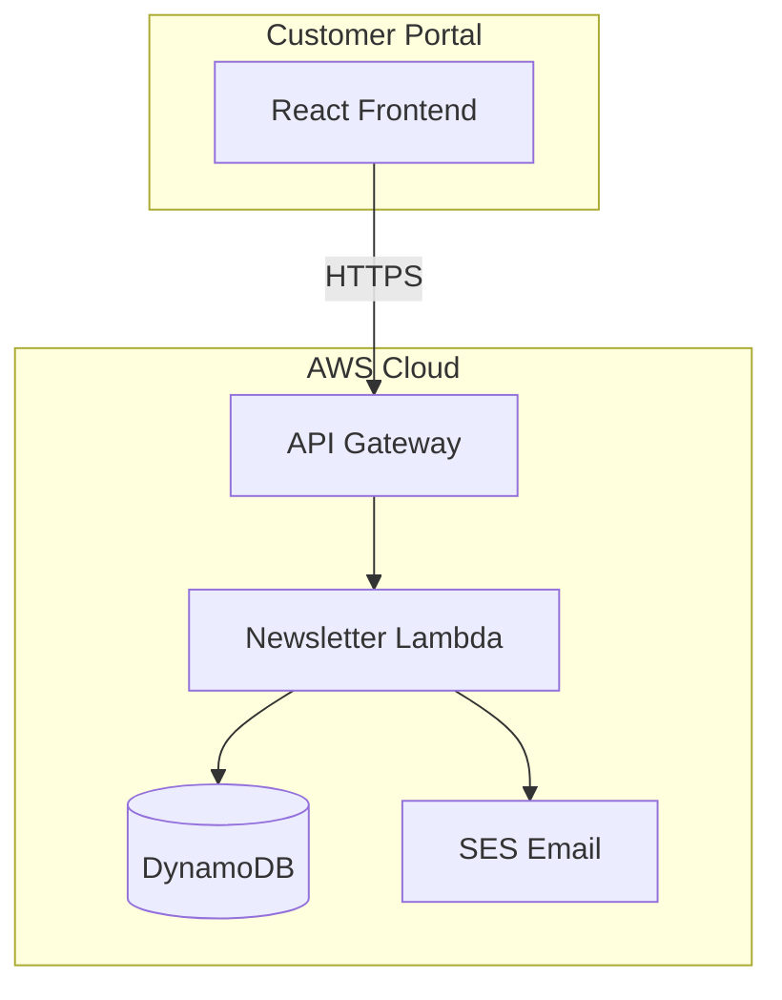
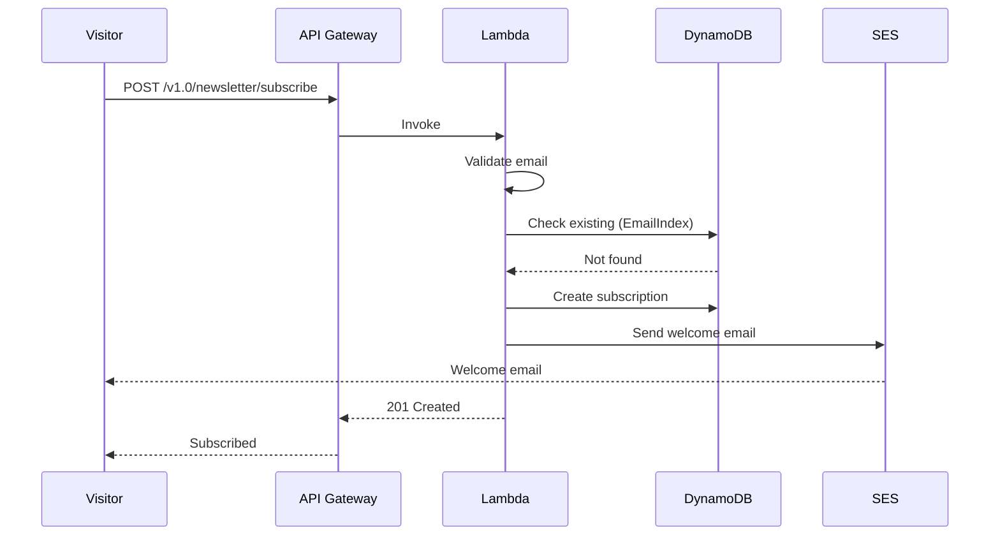
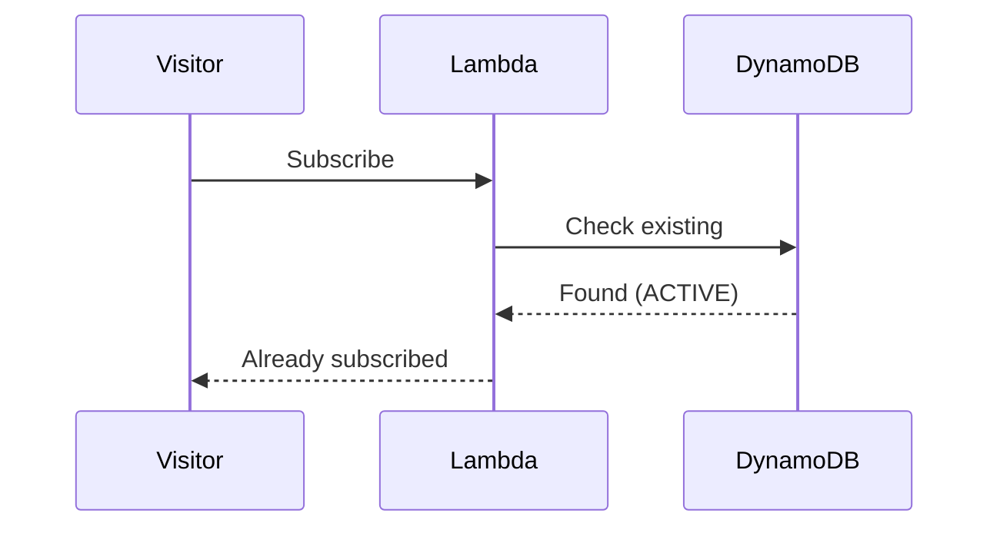
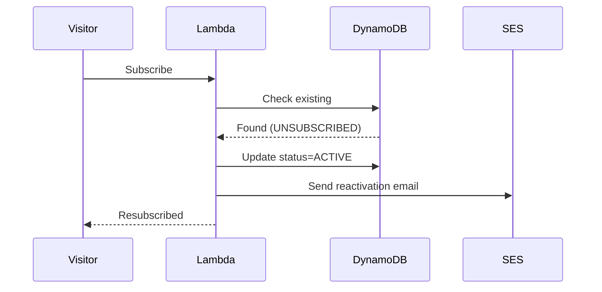

# HLD 2.1.10: Newsletter Management

**Version**: 1.0
**Document ID**: HLD-2.1.10
**Created**: 2026-01-06
**Last Updated**: 2026-01-06
**Status**: Draft
**Author**: Platform Architecture Team

---

## Document Control

| Version | Date | Author | Changes |
|---------|------|--------|---------|
| 1.0 | 2026-01-06 | Platform Architecture Team | Initial version |

---

## 1. Introduction

### 1.1 Purpose

This High-Level Design document describes the architecture for the Newsletter Management capability within the BBWS Customer Portal. This component enables website visitors to subscribe to email newsletters with automatic welcome emails and duplicate handling.

### 1.2 Scope

This HLD covers:
- Newsletter subscription
- Welcome email delivery
- Duplicate subscription handling
- Resubscription capability

### 1.3 Related Documents

| Document | Relationship |
|----------|--------------|
| BRS 2.1.10: Newsletter Management | Business requirements |
| LLD 2.1.10: Newsletter Lambda | Implementation details |
| HLD 2.1: Customer Portal Public | Parent architecture |

---

## 2. Architecture Overview

### 2.1 Context Diagram

### 2.2 Component Description

| Component | Purpose |
|-----------|---------|
| **React Frontend** | Subscription form UI |
| **API Gateway** | REST API endpoint |
| **Newsletter Lambda** | Subscription logic |
| **DynamoDB** | Subscriber storage |
| **SES** | Welcome emails |

---

## 3. System Components

### 3.1 Newsletter Lambda Service

| Attribute | Value |
|-----------|-------|
| Repository | `2_bbws_newsletter_lambda` |
| Runtime | Python 3.12 |
| Architecture | arm64 |
| Memory | 256MB |
| Timeout | 30s |

### 3.2 Lambda Functions

| Function | Endpoint | Description |
|----------|----------|-------------|
| subscribe | POST /v1.0/newsletter/subscribe | Subscribe to newsletter |

---

## 4. Data Architecture

### 4.1 DynamoDB Schema

**Table Name**: `bbws-customer-portal-{environment}`

| Attribute | Type | Description |
|-----------|------|-------------|
| PK | String | `SUBSCRIPTION#{subscriptionId}` |
| SK | String | `METADATA` |
| subscriptionId | String | UUID |
| email | String | Subscriber email |
| name | String | Subscriber name (optional) |
| status | String | ACTIVE/UNSUBSCRIBED |
| source | String | footer/popup/checkout |
| active | Boolean | Soft delete flag |
| createdAt | String | Timestamp |

### 4.2 GSI: EmailIndex

| Attribute | Key Type | Purpose |
|-----------|----------|---------|
| email | Partition Key | Email lookup |
| status | Sort Key | Status filtering |

---

## 5. Subscription Flow

### 5.1 New Subscription

### 5.2 Duplicate Handling

### 5.3 Resubscription

---

## 6. Email Notifications

### 6.1 Email Templates

| Template | Recipient | Trigger |
|----------|-----------|---------|
| newsletter_welcome | Subscriber | New subscription |
| newsletter_reactivated | Subscriber | Resubscription |

### 6.2 Email Content

| Template | Subject |
|----------|---------|
| newsletter_welcome | Welcome to Big Beard News |
| newsletter_reactivated | Welcome Back! |

---

## 7. Security Architecture

### 7.1 Access Control

| Endpoint | Authentication |
|----------|----------------|
| POST /v1.0/newsletter/subscribe | Public |

### 7.2 Security Measures

| Measure | Description |
|---------|-------------|
| Rate Limiting | 3 subscriptions/min per IP |
| Email Validation | Valid format required |
| GDPR Compliance | Consent-based, unsubscribe ready |
| Honeypot Field | Bot detection (future) |

### 7.3 Rate Limiting Configuration

| Limit | Value |
|-------|-------|
| Per IP per minute | 3 requests |
| Per email per day | 1 request |
| Burst limit | 5 requests |

---

## 8. Non-Functional Requirements

### 8.1 Performance

| Metric | Target |
|--------|--------|
| Subscribe latency (p95) | < 500ms |
| Cold start | < 500ms |
| Email delivery | < 5 minutes |

### 8.2 Availability

| Metric | Target |
|--------|--------|
| Subscription success | > 99% |
| Welcome email delivery | > 99% |
| Bounce rate | < 2% |

---

## 9. Business Rules

| Rule | Description |
|------|-------------|
| BR-NWS-001 | Valid email required |
| BR-NWS-002 | One subscription per email |
| BR-NWS-003 | Rate limit 3 per minute per IP |
| BR-NWS-004 | Track subscription source |

---

## 10. Deployment Architecture

### 10.1 Infrastructure

| Resource | Configuration |
|----------|---------------|
| Lambda | arm64, Python 3.12 |
| DynamoDB | On-demand capacity |
| API Gateway | Regional endpoint |
| SES | Production access |

### 10.2 Environments

| Environment | Region | Account |
|-------------|--------|---------|
| DEV | eu-west-1 | 536580886816 |
| SIT | eu-west-1 | 815856636111 |
| PROD | af-south-1 | 093646564004 |

---

## 11. Monitoring and Operations

### 11.1 CloudWatch Metrics

| Metric | Alarm Threshold |
|--------|-----------------|
| Lambda errors | > 5% |
| Email failures | > 1% |
| Rate limit hits | > 50/hour |
| Bounce rate | > 2% |

### 11.2 Logging

| Log Type | Retention |
|----------|-----------|
| Lambda logs | 90 days |
| Subscription events | Audit trail |

---

## 12. Risks and Mitigations

| Risk | Impact | Mitigation |
|------|--------|------------|
| Spam subscriptions | Medium | Rate limiting, honeypot |
| Email delivery failure | Low | Retry with backoff |
| Bot attacks | Medium | Rate limiting, CAPTCHA |

---

## 13. Future Considerations

| Item | Description |
|------|-------------|
| Unsubscribe | Self-service unsubscribe |
| Double opt-in | Email verification |
| CAPTCHA | Bot prevention |
| Preference center | Subscription preferences |
| Newsletter sending | Integration with mailing service |

---

## 14. Signoff

| Role | Name | Date | Signature |
|------|------|------|-----------|
| Solution Architect | | | |
| Technical Lead | | | |
| Business Owner | | | |

---

**End of Document**
