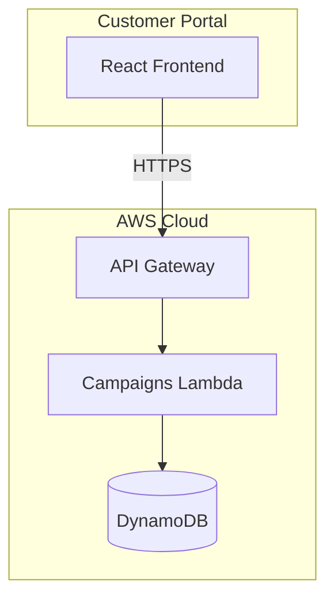
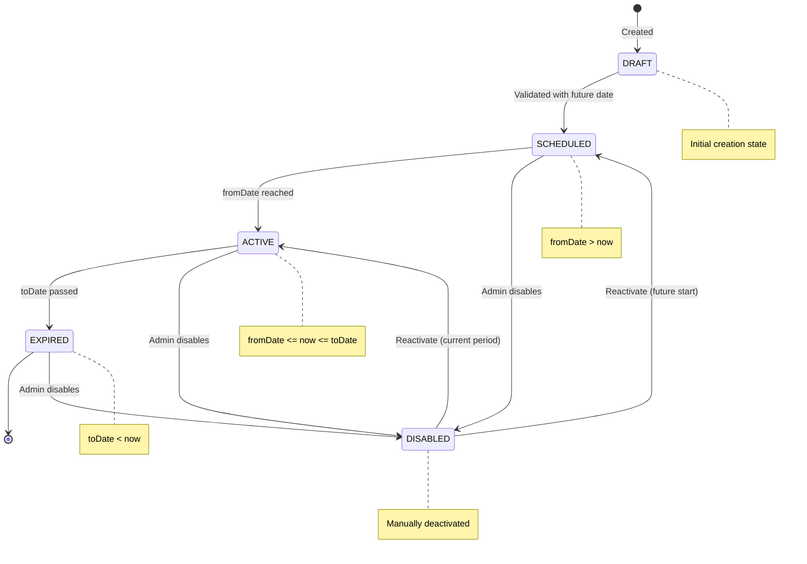
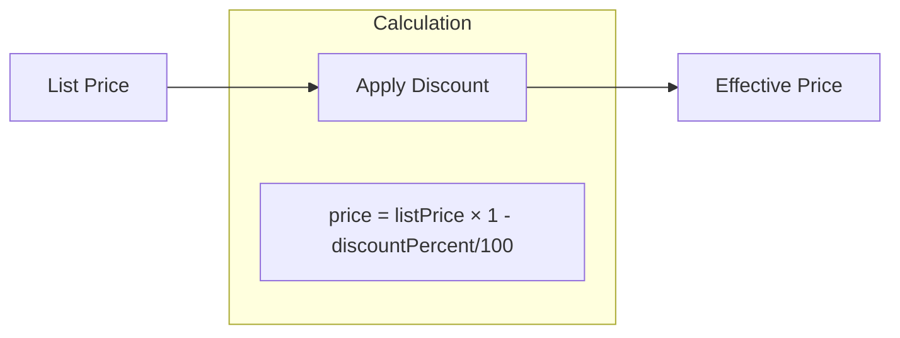
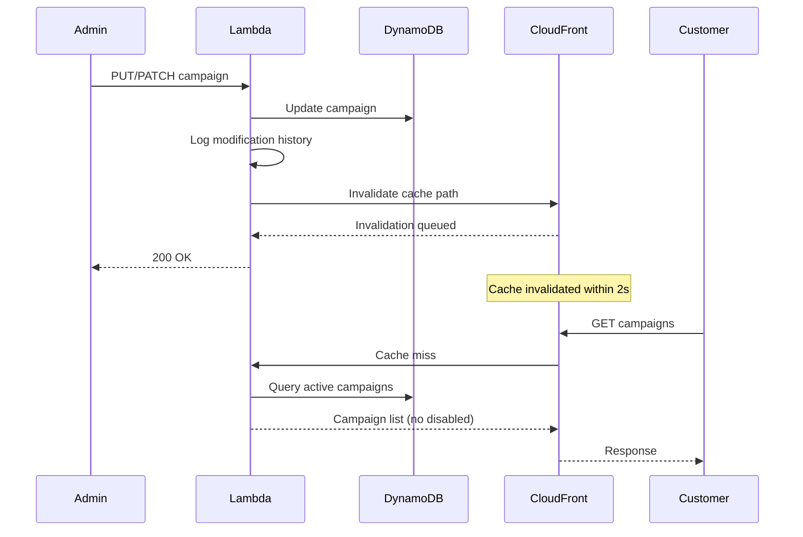
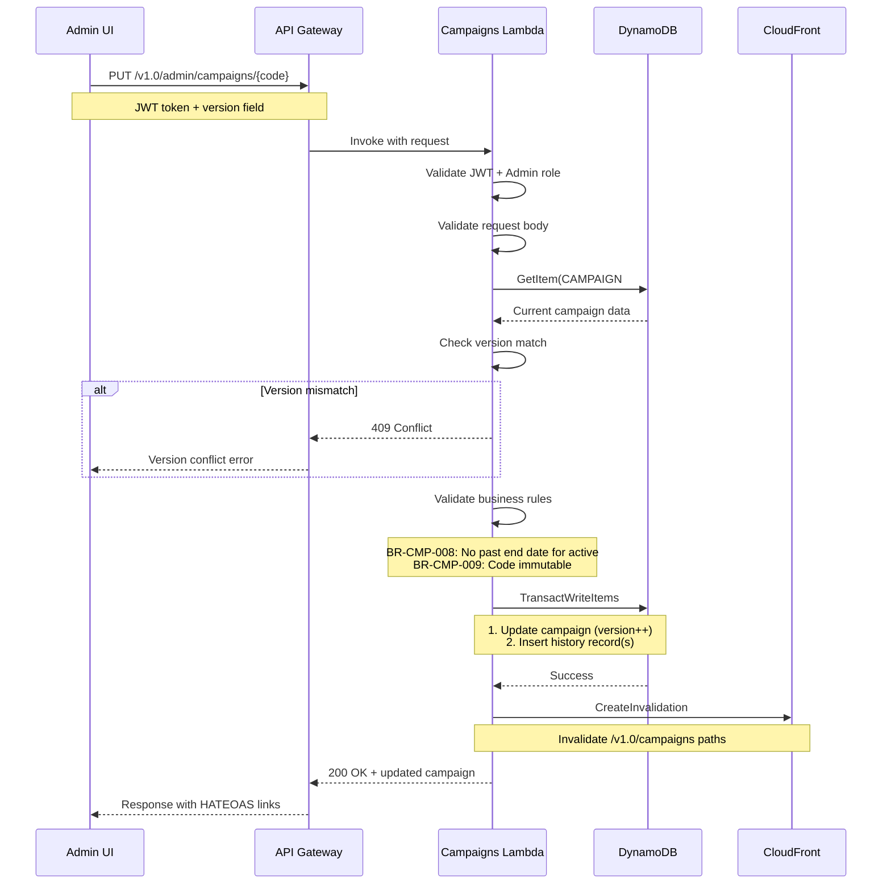
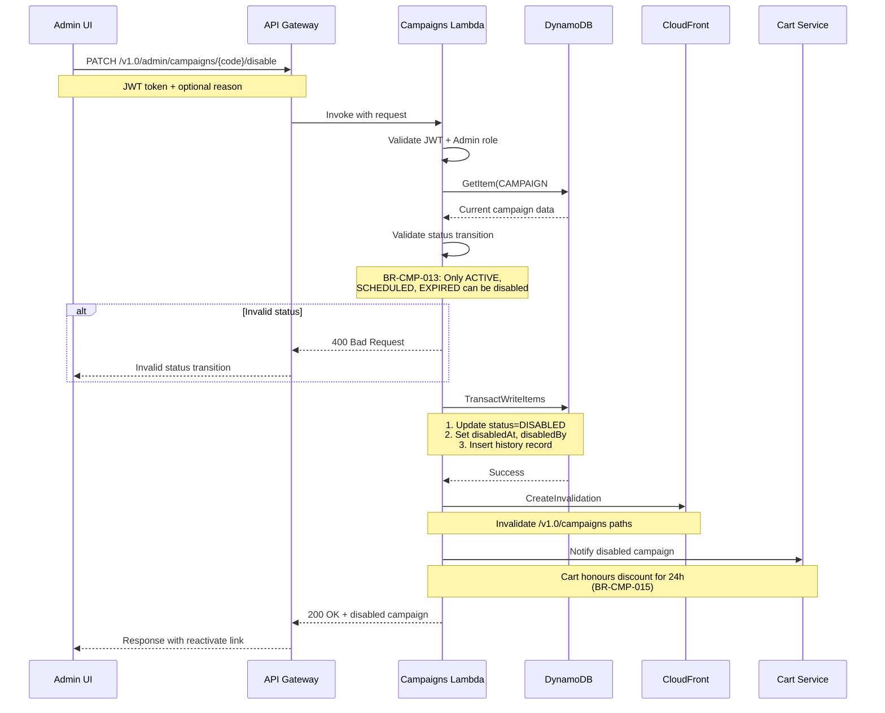
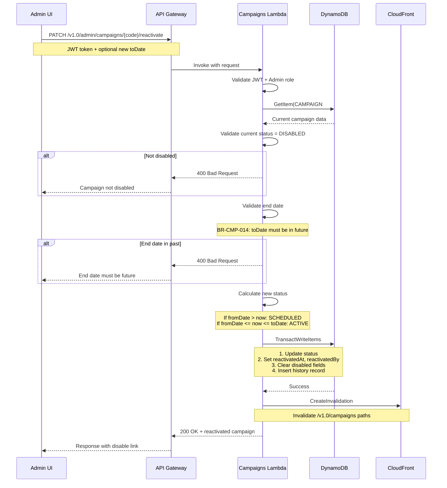
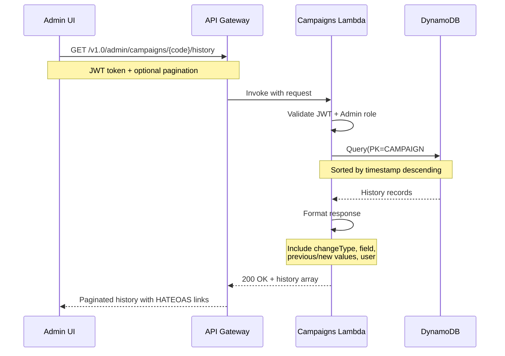

# HLD 2.1.3: Campaign Management

**Version**: 2.0
**Document ID**: HLD-2.1.3
**Created**: 2026-01-06
**Last Updated**: 2026-01-18
**Status**: Draft
**Author**: Platform Architecture Team

---

## Document Control

| Version | Date | Author | Changes |
|---------|------|--------|---------|
| 2.0 | 2026-01-18 | Platform Architecture Team | Added Update Promotions and Disable Promotions functionality; Extended data model with status lifecycle, modification tracking, and audit trail; Added cache invalidation strategy |
| 1.0 | 2026-01-06 | Platform Architecture Team | Initial version |

---

## 1. Introduction

### 1.1 Purpose

This High-Level Design document describes the architecture for the Campaign Management capability within the BBWS Customer Portal. This component enables creation and management of promotional campaigns with discounts for WordPress hosting packages.

### 1.2 Scope

This HLD covers:
- Campaign catalog display
- Campaign details with discount information
- Campaign administration (CRUD operations)
- Date-based campaign status management
- Campaign update operations with audit trail
- Campaign disable/reactivate functionality
- Cache invalidation strategy for real-time updates
- Modification history tracking

### 1.3 Related Documents

| Document | Relationship |
|----------|--------------|
| BRS 2.1.3: Campaign Management | Business requirements |
| LLD 2.1.3: Campaigns Lambda | Implementation details |
| HLD 2.1: Customer Portal Public | Parent architecture |
| BRS 2.1.7: Cart Management | Campaign application |

---

## 2. Architecture Overview

### 2.1 Context Diagram



### 2.2 Component Description

| Component | Purpose |
|-----------|---------|
| **React Frontend** | Campaign display UI |
| **API Gateway** | REST API endpoint |
| **Campaigns Lambda** | Business logic |
| **DynamoDB** | Campaign data storage |

---

## 3. System Components

### 3.1 Campaigns Lambda Service

| Attribute | Value |
|-----------|-------|
| Repository | `2_bbws_campaigns_lambda` |
| Runtime | Python 3.12 |
| Architecture | arm64 |
| Memory | 256MB |
| Timeout | 30s |

### 3.2 Lambda Functions

| Function | Endpoint | Description |
|----------|----------|-------------|
| list_campaigns | GET /v1.0/campaigns | List campaigns (with status filter) |
| get_campaign | GET /v1.0/campaigns/{code} | Get campaign details |
| create_campaign | POST /v1.0/campaigns | Create new campaign |
| update_campaign | PUT /v1.0/campaigns/{code} | Update campaign details |
| disable_campaign | PATCH /v1.0/campaigns/{code}/disable | Disable campaign |
| reactivate_campaign | PATCH /v1.0/campaigns/{code}/reactivate | Reactivate disabled campaign |
| get_campaign_history | GET /v1.0/campaigns/{code}/history | Get modification history |
| delete_campaign | DELETE /v1.0/campaigns/{code} | Soft delete campaign |

---

## 4. Data Architecture

### 4.1 DynamoDB Schema

**Table Name**: `campaigns`

#### 4.1.1 Campaign Record (Main Entity)

| Attribute | Type | Description |
|-----------|------|-------------|
| PK | String | `CAMPAIGN#{code}` |
| SK | String | `METADATA` |
| code | String | Unique campaign code (immutable after creation) |
| name | String | Campaign name |
| description | String | Campaign description |
| productId | String | Associated product |
| discountPercent | Number | Discount (0-100) |
| listPrice | Number | Original price |
| price | Number | Discounted price |
| status | String | DRAFT/SCHEDULED/ACTIVE/DISABLED/EXPIRED |
| fromDate | String | Start date (ISO 8601) |
| toDate | String | End date (ISO 8601) |
| termsAndConditions | String | Campaign terms (max 2000 chars) |
| createdAt | String | Creation timestamp |
| createdBy | String | User who created the campaign |
| updatedAt | String | Last update timestamp |
| updatedBy | String | User who last updated |
| disabledAt | String | Timestamp when disabled (nullable) |
| disabledBy | String | User who disabled (nullable) |
| disableReason | String | Reason for disabling (nullable, max 500 chars) |
| reactivatedAt | String | Timestamp when reactivated (nullable) |
| reactivatedBy | String | User who reactivated (nullable) |
| version | Number | Optimistic locking version |

#### 4.1.2 Modification History Record

| Attribute | Type | Description |
|-----------|------|-------------|
| PK | String | `CAMPAIGN#{code}` |
| SK | String | `HISTORY#{timestamp}#{uuid}` |
| modificationId | String | Unique identifier for change record |
| campaignCode | String | Reference to modified campaign |
| modifiedBy | String | User who made the change |
| modifiedAt | String | Timestamp of modification |
| fieldChanged | String | Name of field that was modified |
| previousValue | String | Value before change (JSON encoded) |
| newValue | String | Value after change (JSON encoded) |
| changeType | String | UPDATE/DISABLE/REACTIVATE |

### 4.2 Global Secondary Indexes

#### GSI1: CampaignsByStatusIndex

| Attribute | Key Type | Purpose |
|-----------|----------|---------|
| GSI1_PK | Partition Key | `CAMPAIGN` |
| GSI1_SK | Sort Key | `{status}#{code}` |

#### GSI2: CampaignsByDateIndex

| Attribute | Key Type | Purpose |
|-----------|----------|---------|
| GSI2_PK | Partition Key | `CAMPAIGN` |
| GSI2_SK | Sort Key | `{toDate}#{code}` |

**Purpose**: Efficiently query campaigns by end date for expiration processing

---

## 5. Campaign Status Management

### 5.1 Status Lifecycle



### 5.2 Status Definitions

| Status | Condition | Customer Visibility |
|--------|-----------|---------------------|
| DRAFT | Initial creation, not yet scheduled | Hidden |
| SCHEDULED | fromDate > current date | Hidden (future campaign) |
| ACTIVE | fromDate <= current date <= toDate | Visible |
| DISABLED | Manually deactivated by admin | Hidden |
| EXPIRED | toDate < current date | Hidden |

### 5.3 Status Transitions

| From Status | To Status | Trigger | Validation |
|-------------|-----------|---------|------------|
| DRAFT | SCHEDULED | Admin publishes | Valid dates required |
| SCHEDULED | ACTIVE | Automatic (cron/query) | fromDate reached |
| SCHEDULED | DISABLED | Admin action | None |
| ACTIVE | DISABLED | Admin action | None |
| ACTIVE | EXPIRED | Automatic (cron/query) | toDate passed |
| EXPIRED | DISABLED | Admin action | None |
| DISABLED | SCHEDULED | Admin reactivates | toDate must be in future, fromDate in future |
| DISABLED | ACTIVE | Admin reactivates | toDate in future, fromDate <= now |

### 5.4 Dynamic Status Calculation

Status is calculated dynamically at query time for non-DISABLED campaigns:

```python
def calculate_status(campaign):
    if campaign.status == "DISABLED":
        return "DISABLED"

    now = datetime.utcnow()
    from_date = parse_date(campaign.fromDate)
    to_date = parse_date(campaign.toDate)

    if now < from_date:
        return "SCHEDULED"
    elif from_date <= now <= to_date:
        return "ACTIVE"
    else:
        return "EXPIRED"
```

---

## 6. Integration Architecture

### 6.1 API Endpoints

#### 6.1.1 Public Endpoints (Read-Only)

| Endpoint | Method | Auth | Description |
|----------|--------|------|-------------|
| /v1.0/campaigns | GET | Public | List active campaigns |
| /v1.0/campaigns/{code} | GET | Public | Get campaign details |

#### 6.1.2 Admin Endpoints (Write Operations)

| Endpoint | Method | Auth | Description |
|----------|--------|------|-------------|
| /v1.0/admin/campaigns | GET | Admin | List all campaigns (all statuses) |
| /v1.0/admin/campaigns | POST | Admin | Create campaign |
| /v1.0/admin/campaigns/{code} | PUT | Admin | Update campaign details |
| /v1.0/admin/campaigns/{code}/disable | PATCH | Admin | Disable campaign |
| /v1.0/admin/campaigns/{code}/reactivate | PATCH | Admin | Reactivate disabled campaign |
| /v1.0/admin/campaigns/{code}/history | GET | Admin | Get modification history |
| /v1.0/admin/campaigns/{code} | DELETE | Admin | Soft delete campaign |

### 6.2 API Request/Response Specifications

#### 6.2.1 Update Campaign (PUT /v1.0/admin/campaigns/{code})

**Request Body**:
```json
{
  "name": "Summer Sale 2026",
  "description": "Get 25% off all hosting packages",
  "discountPercent": 25,
  "fromDate": "2026-06-01T00:00:00Z",
  "toDate": "2026-08-31T23:59:59Z",
  "productId": "PROD-001",
  "termsAndConditions": "Offer valid for new customers only",
  "version": 3
}
```

**Response** (200 OK):
```json
{
  "code": "SUMMER2026",
  "name": "Summer Sale 2026",
  "status": "SCHEDULED",
  "updatedAt": "2026-01-18T14:30:00Z",
  "updatedBy": "admin@example.com",
  "version": 4,
  "_links": {
    "self": "/v1.0/admin/campaigns/SUMMER2026",
    "history": "/v1.0/admin/campaigns/SUMMER2026/history",
    "disable": "/v1.0/admin/campaigns/SUMMER2026/disable"
  }
}
```

#### 6.2.2 Disable Campaign (PATCH /v1.0/admin/campaigns/{code}/disable)

**Request Body**:
```json
{
  "reason": "Campaign underperforming - pausing for review"
}
```

**Response** (200 OK):
```json
{
  "code": "SUMMER2026",
  "status": "DISABLED",
  "disabledAt": "2026-01-18T15:00:00Z",
  "disabledBy": "admin@example.com",
  "disableReason": "Campaign underperforming - pausing for review",
  "_links": {
    "self": "/v1.0/admin/campaigns/SUMMER2026",
    "reactivate": "/v1.0/admin/campaigns/SUMMER2026/reactivate"
  }
}
```

#### 6.2.3 Reactivate Campaign (PATCH /v1.0/admin/campaigns/{code}/reactivate)

**Request Body**:
```json
{
  "toDate": "2026-09-30T23:59:59Z"
}
```

**Response** (200 OK):
```json
{
  "code": "SUMMER2026",
  "status": "ACTIVE",
  "reactivatedAt": "2026-01-18T16:00:00Z",
  "reactivatedBy": "admin@example.com",
  "toDate": "2026-09-30T23:59:59Z",
  "_links": {
    "self": "/v1.0/admin/campaigns/SUMMER2026",
    "disable": "/v1.0/admin/campaigns/SUMMER2026/disable"
  }
}
```

#### 6.2.4 Get Campaign History (GET /v1.0/admin/campaigns/{code}/history)

**Response** (200 OK):
```json
{
  "campaignCode": "SUMMER2026",
  "history": [
    {
      "modificationId": "mod-uuid-001",
      "modifiedAt": "2026-01-18T16:00:00Z",
      "modifiedBy": "admin@example.com",
      "changeType": "REACTIVATE",
      "fieldChanged": "status",
      "previousValue": "DISABLED",
      "newValue": "ACTIVE"
    },
    {
      "modificationId": "mod-uuid-002",
      "modifiedAt": "2026-01-18T15:00:00Z",
      "modifiedBy": "admin@example.com",
      "changeType": "DISABLE",
      "fieldChanged": "status",
      "previousValue": "ACTIVE",
      "newValue": "DISABLED"
    }
  ],
  "_links": {
    "self": "/v1.0/admin/campaigns/SUMMER2026/history",
    "campaign": "/v1.0/admin/campaigns/SUMMER2026"
  }
}
```

### 6.3 Price Calculation



---

## 7. Security Architecture

### 7.1 Access Control

| Endpoint Type | Authentication | Authorization |
|---------------|----------------|---------------|
| Public Read (GET /v1.0/campaigns) | None | Public access |
| Admin Read (GET /v1.0/admin/campaigns) | Cognito JWT | Admin role required |
| Create (POST) | Cognito JWT | Admin role required |
| Update (PUT) | Cognito JWT | Admin role required |
| Disable (PATCH) | Cognito JWT | Admin role required |
| Reactivate (PATCH) | Cognito JWT | Admin role required |
| Delete (DELETE) | Cognito JWT | Admin role required |
| History (GET) | Cognito JWT | Admin role required |

### 7.2 Security Measures

| Measure | Description |
|---------|-------------|
| Rate Limiting | 100 req/s public, 50 req/s admin |
| Input Validation | Discount 0-100%, date validation, field length limits |
| Encryption | DynamoDB encryption at rest (AES-256) |
| Encryption in Transit | TLS 1.2+ for all API calls |
| Optimistic Locking | Version field prevents concurrent update conflicts |
| Audit Logging | All modifications logged with user identity |

### 7.3 Data Protection

| Data Type | Protection |
|-----------|------------|
| Campaign data | Encrypted at rest |
| Modification history | Immutable audit records |
| User identity | Extracted from JWT claims |
| API requests | CloudWatch Logs (90-day retention) |

### 7.4 Update/Disable Security Considerations

| Security Concern | Mitigation |
|------------------|------------|
| Unauthorized campaign modification | JWT validation + Admin role check |
| Concurrent update conflicts | Optimistic locking with version field |
| Audit trail tampering | History records are append-only, no delete/update |
| Campaign code manipulation | Code is immutable after creation (BR-CMP-009) |
| Mass disable attack | Rate limiting + CloudWatch alerting |

---

## 8. Non-Functional Requirements

### 8.1 Performance

| Metric | Target |
|--------|--------|
| List campaigns latency (p95) | < 300ms |
| Get campaign latency (p95) | < 100ms |
| Update campaign latency (p95) | < 500ms |
| Disable/Reactivate latency (p95) | < 300ms |
| Get history latency (p95) | < 500ms |
| Cache hit ratio | > 90% |
| Cache invalidation time | < 2 seconds |

### 8.2 Availability

| Metric | Target |
|--------|--------|
| API availability | 99.9% |
| Data durability | 99.999999999% |
| Update success rate | > 99.5% |
| Disable/Reactivate success rate | > 99.5% |

### 8.3 Scalability

| Metric | Target |
|--------|--------|
| Concurrent admin users | 100 |
| Campaigns per tenant | 10,000 |
| Modification history records | Unlimited (auto-archived after 1 year) |

---

## 9. Business Rules

### 9.1 General Campaign Rules

| Rule | Description |
|------|-------------|
| BR-CMP-001 | Discount must be 0-100% |
| BR-CMP-002 | End date must be after start date |
| BR-CMP-003 | Campaign code must be unique |
| BR-CMP-004 | Expired campaigns hidden from customers |

### 9.2 Update Promotion Rules

| Rule | Description |
|------|-------------|
| BR-CMP-005 | All campaign modifications must be logged with user, timestamp, and previous values |
| BR-CMP-006 | Discount percentage changes take effect immediately for new orders |
| BR-CMP-007 | Cart items with existing discount retain original discount until checkout or cart expiry |
| BR-CMP-008 | Campaign end date cannot be modified to a date in the past if campaign is active |
| BR-CMP-009 | Campaign code cannot be modified after campaign creation |
| BR-CMP-010 | Updating an expired campaign does not reactivate it; explicit reactivation required |

### 9.3 Disable Promotion Rules

| Rule | Description |
|------|-------------|
| BR-CMP-011 | Disabled campaigns are hidden from all customer-facing pages |
| BR-CMP-012 | Disabled campaigns retain all data for reporting and audit |
| BR-CMP-013 | Only ACTIVE, SCHEDULED, and EXPIRED campaigns can be disabled |
| BR-CMP-014 | Reactivating a disabled campaign requires end date to be in the future |
| BR-CMP-015 | When a campaign is disabled mid-promotion, cart items with that discount are honoured for 24 hours or until checkout |
| BR-CMP-016 | Disabled campaigns cannot be used for new orders |
| BR-CMP-017 | Disable reason is optional but recommended for compliance |
| BR-CMP-018 | A campaign can be disabled and reactivated multiple times; each transition is logged |

---

## 10. Deployment Architecture

### 10.1 Infrastructure

| Resource | Configuration |
|----------|---------------|
| Lambda | arm64, Python 3.12 |
| DynamoDB | On-demand capacity |
| API Gateway | Regional endpoint |
| CloudFront | Dynamic cache with invalidation |

### 10.2 Environments

| Environment | Region | Account |
|-------------|--------|---------|
| DEV | af-south-1 | 536580886816 |
| SIT | af-south-1 | 815856636111 |
| PROD | af-south-1 | 093646564004 |

### 10.3 Caching Strategy

#### 10.3.1 Cache Layers

| Layer | TTL | Invalidation Trigger |
|-------|-----|---------------------|
| CloudFront | 60 seconds | Campaign update/disable |
| API Gateway | 60 seconds | Campaign update/disable |
| Lambda (in-memory) | 30 seconds | Time-based expiry |

#### 10.3.2 Cache Invalidation Flow



#### 10.3.3 Invalidation Paths

| Operation | Invalidation Paths |
|-----------|--------------------|
| Update campaign | `/v1.0/campaigns`, `/v1.0/campaigns/{code}` |
| Disable campaign | `/v1.0/campaigns`, `/v1.0/campaigns/{code}` |
| Reactivate campaign | `/v1.0/campaigns`, `/v1.0/campaigns/{code}` |

---

## 11. Monitoring and Operations

### 11.1 CloudWatch Metrics

| Metric | Alarm Threshold |
|--------|-----------------|
| Lambda errors | > 5% |
| API latency (p95) | > 500ms |
| Campaign lookup failures | > 10/min |
| Update operation failures | > 5/min |
| Disable operation failures | > 5/min |
| Cache invalidation failures | > 3/min |
| Optimistic lock conflicts | > 10/min |

### 11.2 Logging

| Log Type | Retention | Purpose |
|----------|-----------|---------|
| Lambda logs | 90 days | Debugging and troubleshooting |
| Campaign modifications | Indefinite | Audit trail (stored in DynamoDB) |
| API Gateway access logs | 90 days | Traffic analysis |
| CloudFront access logs | 30 days | CDN performance |

### 11.3 Audit Trail Requirements

All modification operations (update, disable, reactivate) must log:

| Field | Description |
|-------|-------------|
| timestamp | ISO 8601 timestamp of change |
| user | Email/ID from JWT claims |
| operation | UPDATE, DISABLE, REACTIVATE |
| campaignCode | Affected campaign |
| fieldChanged | Which field was modified |
| previousValue | Value before change |
| newValue | Value after change |
| ipAddress | Client IP (from X-Forwarded-For) |
| userAgent | Client user agent |

### 11.4 Alerting

| Alert | Severity | Notification |
|-------|----------|--------------|
| High update failure rate | Critical | SNS -> PagerDuty |
| Cache invalidation failures | High | SNS -> Slack |
| Optimistic lock conflicts spike | Medium | SNS -> Email |
| Unusual disable activity | Medium | SNS -> Slack |

---

## 12. Risks and Mitigations

| Risk | Impact | Mitigation |
|------|--------|------------|
| Stale campaign status | Medium | Dynamic status calculation |
| Price calculation errors | High | Multi-layer validation |
| Duplicate codes | High | Unique check before insert |
| Concurrent update conflicts | Medium | Optimistic locking with version field |
| Accidental campaign disable | High | Confirmation UI + disable reason |
| Cache serving stale data | Medium | Proactive cache invalidation < 2s |
| Audit trail tampering | High | Append-only history records |
| Unauthorized modifications | Critical | JWT validation + Admin role check |
| Grace period violations | Medium | 24-hour cart discount honour policy |
| History table growth | Low | Auto-archive after 1 year to S3 |

---

## 13. Operational Flows

### 13.1 Update Campaign Flow



### 13.2 Disable Campaign Flow



### 13.3 Reactivate Campaign Flow



### 13.4 Get Campaign History Flow



---

## 14. Future Considerations

| Item | Description |
|------|-------------|
| Usage tracking | Track campaign redemptions |
| Multi-product campaigns | Apply to multiple products |
| Campaign scheduling | Auto-activate/expire |
| Campaign analytics | Effectiveness tracking |
| Bulk operations | Enable/disable multiple campaigns at once |
| Campaign templates | Save and reuse campaign configurations |
| Approval workflow | Multi-level approval for campaign changes |

---

## 15. Signoff

| Role | Name | Date | Signature |
|------|------|------|-----------|
| Solution Architect | | | |
| Technical Lead | | | |
| Business Owner | | | |

---

**End of Document**
