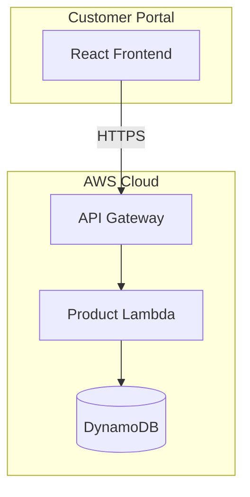
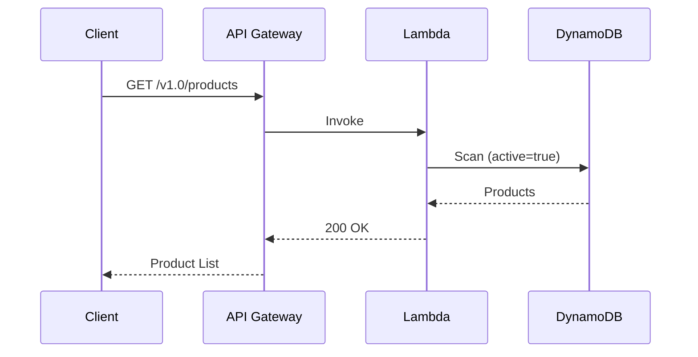

# HLD 2.1.4: Product Management

**Version**: 1.0
**Document ID**: HLD-2.1.4
**Created**: 2026-01-06
**Last Updated**: 2026-01-06
**Status**: Draft
**Author**: Platform Architecture Team

---

## Document Control

| Version | Date | Author | Changes |
|---------|------|--------|---------|
| 1.0 | 2026-01-06 | Platform Architecture Team | Initial version |

---

## 1. Introduction

### 1.1 Purpose

This High-Level Design document describes the architecture for the Product Management capability within the BBWS Customer Portal. This component enables display and management of WordPress hosting packages available for purchase.

### 1.2 Scope

This HLD covers:
- Product catalog browsing
- Product details display
- Product administration (CRUD operations)

### 1.3 Related Documents

| Document | Relationship |
|----------|--------------|
| BRS 2.1.4: Product Management | Business requirements |
| LLD 2.1.4: Product Lambda | Implementation details |
| HLD 2.1: Customer Portal Public | Parent architecture |

---

## 2. Architecture Overview

### 2.1 Context Diagram

### 2.2 Component Description

| Component | Purpose |
|-----------|---------|
| **React Frontend** | Product catalog UI |
| **API Gateway** | REST API endpoint |
| **Product Lambda** | Business logic |
| **DynamoDB** | Product data storage |

---

## 3. System Components

### 3.1 Product Lambda Service

| Attribute | Value |
|-----------|-------|
| Repository | `2_bbws_product_lambda` |
| Runtime | Python 3.12 |
| Architecture | arm64 |
| Memory | 256MB |
| Timeout | 30s |

### 3.2 Lambda Functions

| Function | Endpoint | Description |
|----------|----------|-------------|
| list_products | GET /v1.0/products | List all active products |
| get_product | GET /v1.0/products/{productId} | Get product details |
| create_product | POST /v1.0/products | Create new product |
| update_product | PUT /v1.0/products/{productId} | Update product |
| delete_product | DELETE /v1.0/products/{productId} | Soft delete product |

---

## 4. Data Architecture

### 4.1 DynamoDB Table

**Table Name**: `bbws-customer-portal-products-{environment}`

| Attribute | Type | Description |
|-----------|------|-------------|
| PK | String | `PRODUCT#{productId}` |
| SK | String | `METADATA` |
| name | String | Product name |
| description | String | Product description |
| price | Number | Product price |
| currency | String | Currency code (ZAR) |
| features | List | Feature list |
| active | Boolean | Soft delete flag |

### 4.2 GSI: ProductsByPriceIndex

| Attribute | Key Type | Purpose |
|-----------|----------|---------|
| GSI1_PK | Partition Key | `PRODUCT` |
| GSI1_SK | Sort Key | `{price}#{productId}` |

---

## 5. Integration Architecture

### 5.1 API Endpoints

| Endpoint | Method | Auth | Description |
|----------|--------|------|-------------|
| /v1.0/products | GET | Public | List products |
| /v1.0/products/{productId} | GET | Public | Get product |
| /v1.0/products | POST | Admin | Create product |
| /v1.0/products/{productId} | PUT | Admin | Update product |
| /v1.0/products/{productId} | DELETE | Admin | Delete product |

### 5.2 Request/Response Flow

---

## 6. Security Architecture

### 6.1 Access Control

| Endpoint Type | Authentication |
|---------------|----------------|
| Read (GET) | Public |
| Write (POST/PUT/DELETE) | Admin required |

### 6.2 Security Measures

| Measure | Description |
|---------|-------------|
| Rate Limiting | 100 req/s public, 50 req/s admin |
| Input Validation | Pydantic schema validation |
| Encryption | DynamoDB encryption at rest |
| CORS | Configured for web clients |

---

## 7. Non-Functional Requirements

### 7.1 Performance

| Metric | Target |
|--------|--------|
| List products latency (p95) | < 200ms |
| Get product latency (p95) | < 100ms |
| Cold start | < 500ms |

### 7.2 Availability

| Metric | Target |
|--------|--------|
| API availability | 99.9% |
| Data durability | 99.999999999% |

### 7.3 Scalability

| Metric | Target |
|--------|--------|
| Concurrent operations | 100/second |
| DynamoDB capacity | On-demand |

---

## 8. Deployment Architecture

### 8.1 Infrastructure

| Resource | Configuration |
|----------|---------------|
| Lambda | arm64, Python 3.12 |
| DynamoDB | On-demand capacity |
| API Gateway | Regional endpoint |
| CloudFront | 5-minute cache |

### 8.2 Environments

| Environment | Region | Account |
|-------------|--------|---------|
| DEV | eu-west-1 | 536580886816 |
| SIT | eu-west-1 | 815856636111 |
| PROD | af-south-1 | 093646564004 |

---

## 9. Monitoring and Operations

### 9.1 CloudWatch Metrics

| Metric | Alarm Threshold |
|--------|-----------------|
| Lambda errors | > 5% |
| API latency (p95) | > 500ms |
| DynamoDB throttling | Any |

### 9.2 Logging

| Log Type | Retention |
|----------|-----------|
| Lambda logs | 90 days |
| API Gateway logs | 30 days |

---

## 10. Risks and Mitigations

| Risk | Impact | Mitigation |
|------|--------|------------|
| DynamoDB throttling | Medium | On-demand capacity |
| Price manipulation | High | Multi-layer validation |
| Unauthorized changes | High | Admin authentication |

---

## 11. Future Considerations

| Item | Description |
|------|-------------|
| Product search | Full-text search capability |
| Product categories | Category-based filtering |
| Product images | Image upload and CDN |
| Multi-currency | Support for USD, EUR |

---

## 12. Signoff

| Role | Name | Date | Signature |
|------|------|------|-----------|
| Solution Architect | | | |
| Technical Lead | | | |
| Business Owner | | | |

---

**End of Document**
