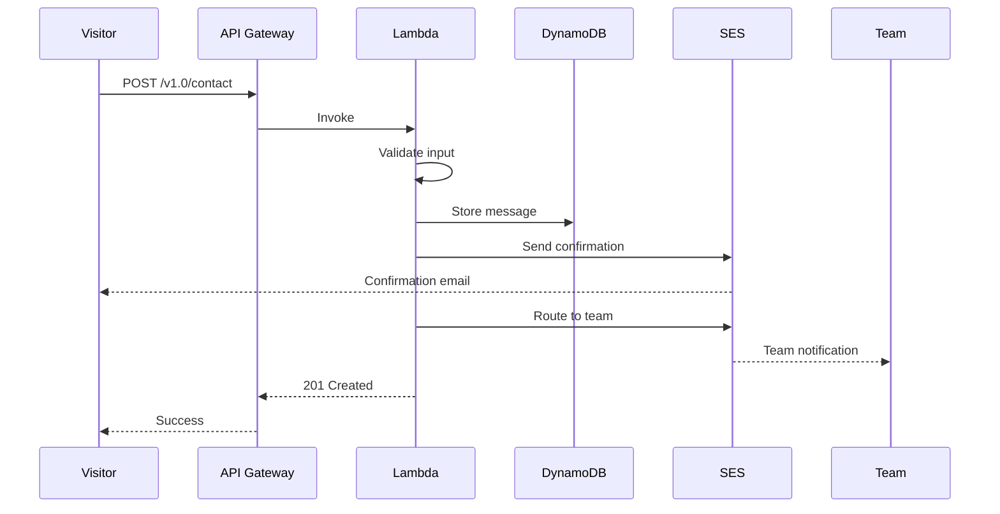

# HLD 2.1.5: Contact Management

**Version**: 1.0
**Document ID**: HLD-2.1.5
**Created**: 2026-01-06
**Last Updated**: 2026-01-06
**Status**: Draft
**Author**: Platform Architecture Team

---

## Document Control

| Version | Date | Author | Changes |
|---------|------|--------|---------|
| 1.0 | 2026-01-06 | Platform Architecture Team | Initial version |

---

## 1. Introduction

### 1.1 Purpose

This High-Level Design document describes the architecture for the Contact Management capability within the BBWS Customer Portal. This component enables website visitors to submit inquiries through a contact form with automatic routing to appropriate teams.

### 1.2 Scope

This HLD covers:
- Contact form submission
- Inquiry type routing (General, Sales, Support)
- Sender confirmation email
- Team notification

### 1.3 Related Documents

| Document | Relationship |
|----------|--------------|
| BRS 2.1.5: Contact Management | Business requirements |
| LLD 2.1.5: Contact Lambda | Implementation details |
| HLD 2.1: Customer Portal Public | Parent architecture |

---

## 2. Architecture Overview

### 2.1 Context Diagram

```mermaid
graph TB
    subgraph "Customer Portal"
        UI[React Frontend]
    end

    subgraph "AWS Cloud"
        APIGW[API Gateway]
        LAMBDA[Contact Lambda]
        DDB[(DynamoDB)]
        SES[SES Email]
    end

    UI -->|HTTPS| APIGW
    APIGW --> LAMBDA
    LAMBDA --> DDB
    LAMBDA --> SES

    subgraph "Recipients"
        INFO[info@bigbeard.co.za]
        SALES[sales@bigbeard.co.za]
        SUPPORT[support@bigbeard.co.za]
    end

    SES --> INFO
    SES --> SALES
    SES --> SUPPORT
```

### 2.2 Component Description

| Component | Purpose |
|-----------|---------|
| **React Frontend** | Contact form UI |
| **API Gateway** | REST API endpoint |
| **Contact Lambda** | Form processing |
| **DynamoDB** | Message storage |
| **SES** | Email delivery |

---

## 3. System Components

### 3.1 Contact Lambda Service

| Attribute | Value |
|-----------|-------|
| Repository | `2_bbws_contact_lambda` |
| Runtime | Python 3.12 |
| Architecture | arm64 |
| Memory | 256MB |
| Timeout | 30s |

### 3.2 Lambda Functions

| Function | Endpoint | Description |
|----------|----------|-------------|
| submit_contact | POST /v1.0/contact | Submit contact form |

---

## 4. Data Architecture

### 4.1 DynamoDB Schema

**Table Name**: `bbws-customer-portal-{environment}`

| Attribute | Type | Description |
|-----------|------|-------------|
| PK | String | `CONTACT#{contactId}` |
| SK | String | `METADATA` |
| contactId | String | UUID |
| email | String | Sender email |
| name | String | Sender name |
| type | String | GENERAL/SALES/SUPPORT |
| message | String | Contact message |
| active | Boolean | Soft delete flag |
| createdAt | String | Timestamp |

---

## 5. Contact Flow

### 5.1 Submission Flow



### 5.2 Team Routing

| Contact Type | Email Destination |
|--------------|-------------------|
| GENERAL | info@bigbeard.co.za |
| SALES | sales@bigbeard.co.za |
| SUPPORT | support@bigbeard.co.za |

---

## 6. Email Notifications

### 6.1 Email Templates

| Template | Recipient | Trigger |
|----------|-----------|---------|
| contact_confirmation | Sender | Form submission |
| contact_notification | Team inbox | Form submission |

### 6.2 Email Flow

```mermaid
graph LR
    A[Form Submitted] --> B[Store in DynamoDB]
    B --> C{Route by Type}
    C -->|GENERAL| D[info@]
    C -->|SALES| E[sales@]
    C -->|SUPPORT| F[support@]
    B --> G[Send Confirmation]
```

---

## 7. Security Architecture

### 7.1 Access Control

| Endpoint | Authentication |
|----------|----------------|
| POST /v1.0/contact | Public |

### 7.2 Security Measures

| Measure | Description |
|---------|-------------|
| Rate Limiting | 5 submissions/min per IP |
| Input Sanitization | XSS prevention |
| Email Validation | Valid email required |
| Message Length | Min 10, max 2000 chars |
| CAPTCHA | Future implementation |

---

## 8. Non-Functional Requirements

### 8.1 Performance

| Metric | Target |
|--------|--------|
| Submit latency (p95) | < 1000ms |
| Cold start | < 500ms |
| Email delivery | < 5 minutes |

### 8.2 Availability

| Metric | Target |
|--------|--------|
| Submission success | > 99% |
| Email delivery | > 99% |

---

## 9. Business Rules

| Rule | Description |
|------|-------------|
| BR-CTT-001 | Valid email required |
| BR-CTT-002 | Message minimum 10 characters |
| BR-CTT-003 | Rate limit 5 per minute per IP |

---

## 10. Deployment Architecture

### 10.1 Infrastructure

| Resource | Configuration |
|----------|---------------|
| Lambda | arm64, Python 3.12 |
| DynamoDB | On-demand capacity |
| API Gateway | Regional endpoint |
| SES | Production access |

### 10.2 Environments

| Environment | Region | Account |
|-------------|--------|---------|
| DEV | eu-west-1 | 536580886816 |
| SIT | eu-west-1 | 815856636111 |
| PROD | af-south-1 | 093646564004 |

---

## 11. Monitoring and Operations

### 11.1 CloudWatch Metrics

| Metric | Alarm Threshold |
|--------|-----------------|
| Lambda errors | > 5% |
| Email failures | > 1% |
| Rate limit hits | > 100/hour |

### 11.2 Logging

| Log Type | Retention |
|----------|-----------|
| Lambda logs | 90 days |
| Contact submissions | Audit trail |

---

## 12. Risks and Mitigations

| Risk | Impact | Mitigation |
|------|--------|------------|
| Spam submissions | Medium | Rate limiting, CAPTCHA |
| Email delivery failure | Medium | Retry with backoff |
| XSS attacks | High | Input sanitization |

---

## 13. Future Considerations

| Item | Description |
|------|-------------|
| CAPTCHA | Bot prevention |
| Attachments | File upload support |
| Ticket creation | CRM integration |
| Response tracking | SLA management |

---

## 14. Signoff

| Role | Name | Date | Signature |
|------|------|------|-----------|
| Solution Architect | | | |
| Technical Lead | | | |
| Business Owner | | | |

---

**End of Document**
