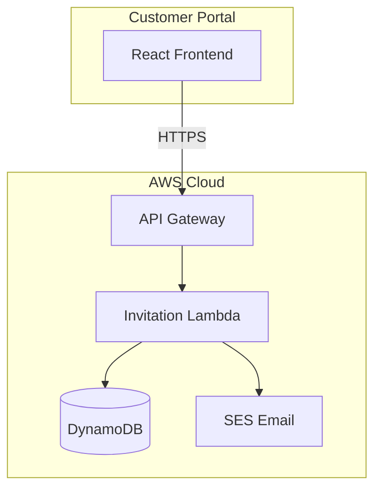
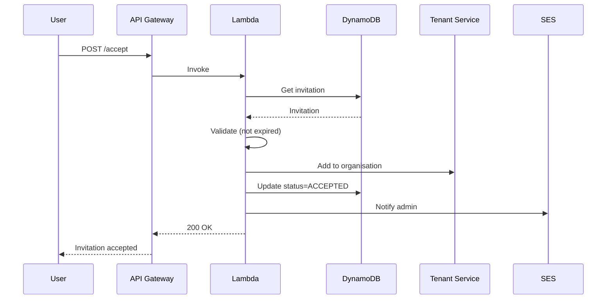
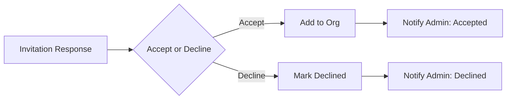

# HLD 2.1.6: Invitation Management

**Version**: 1.0
**Document ID**: HLD-2.1.6
**Created**: 2026-01-06
**Last Updated**: 2026-01-06
**Status**: Draft
**Author**: Platform Architecture Team

---

## Document Control

| Version | Date | Author | Changes |
|---------|------|--------|---------|
| 1.0 | 2026-01-06 | Platform Architecture Team | Initial version |

---

## 1. Introduction

### 1.1 Purpose

This High-Level Design document describes the architecture for the Invitation Management capability within the BBWS Customer Portal. This component enables users to view and respond to organisation invitations.

### 1.2 Scope

This HLD covers:
- View invitation details
- Accept organisation invitation
- Decline organisation invitation
- Expired invitation handling

### 1.3 Related Documents

| Document | Relationship |
|----------|--------------|
| BRS 2.1.6: Invitation Management | Business requirements |
| LLD 2.1.6: Invitation Lambda | Implementation details |
| HLD 2.1: Customer Portal Public | Parent architecture |
| BRS 2.5: Tenant Management | Upstream |

---

## 2. Architecture Overview

### 2.1 Context Diagram

### 2.2 Component Description

| Component | Purpose |
|-----------|---------|
| **React Frontend** | Invitation response UI |
| **API Gateway** | REST API endpoint |
| **Invitation Lambda** | Business logic |
| **DynamoDB** | Invitation storage |
| **SES** | Email notifications |

---

## 3. System Components

### 3.1 Invitation Lambda Service

| Attribute | Value |
|-----------|-------|
| Repository | `2_bbws_invitation_lambda` |
| Runtime | Python 3.12 |
| Architecture | arm64 |
| Memory | 256MB |
| Timeout | 30s |

### 3.2 Lambda Functions

| Function | Endpoint | Description |
|----------|----------|-------------|
| get_invitation | GET /v1.0/invitations/{token} | Get invitation details |
| accept_invitation | POST /v1.0/invitations/{token}/accept | Accept invitation |
| decline_invitation | POST /v1.0/invitations/{token}/decline | Decline invitation |

---

## 4. Data Architecture

### 4.1 DynamoDB Schema

**Table Name**: `bbws-customer-portal-{environment}`

| Attribute | Type | Description |
|-----------|------|-------------|
| PK | String | `INVITATION#{invitationId}` |
| SK | String | `METADATA` |
| token | String | Unique URL-safe token |
| email | String | Invitee email |
| organisationId | String | Target organisation |
| organisationName | String | Display name |
| role | String | Assigned role |
| status | String | PENDING/ACCEPTED/DECLINED/EXPIRED |
| expiresAt | String | Expiry timestamp |

### 4.2 GSI: TokenIndex

| Attribute | Key Type | Purpose |
|-----------|----------|---------|
| token | Partition Key | Token lookup |
| status | Sort Key | Status filtering |

---

## 5. Integration Architecture

### 5.1 API Endpoints

| Endpoint | Method | Description |
|----------|--------|-------------|
| /v1.0/invitations/{token} | GET | View invitation |
| /v1.0/invitations/{token}/accept | POST | Accept invitation |
| /v1.0/invitations/{token}/decline | POST | Decline invitation |

### 5.2 Accept Invitation Flow

---

## 6. Security Architecture

### 6.1 Token Security

| Measure | Description |
|---------|-------------|
| Token Generation | Cryptographically secure (UUID v4 + hash) |
| Token Expiry | 7 days default |
| Single Use | Token invalidated after accept/decline |
| Rate Limiting | Prevent token guessing |

### 6.2 Security Measures

| Measure | Description |
|---------|-------------|
| Rate Limiting | 10 req/min per IP |
| Token Validation | Check expiry on all operations |
| Audit Logging | All invitation actions logged |

---

## 7. Non-Functional Requirements

### 7.1 Performance

| Metric | Target |
|--------|--------|
| Get invitation latency (p95) | < 200ms |
| Accept/decline latency (p95) | < 500ms |
| Cold start | < 500ms |

### 7.2 Availability

| Metric | Target |
|--------|--------|
| API availability | 99.9% |
| Data durability | 99.999999999% |

### 7.3 Success Metrics

| Metric | Target |
|--------|--------|
| Invitation acceptance rate | > 80% |
| Security incidents | Zero |

---

## 8. Email Notifications

### 8.1 Email Templates

| Event | Recipient | Template |
|-------|-----------|----------|
| Invitation accepted | Org admin | invitation_accepted |
| Invitation declined | Org admin | invitation_declined |

### 8.2 Email Flow

---

## 9. Deployment Architecture

### 9.1 Infrastructure

| Resource | Configuration |
|----------|---------------|
| Lambda | arm64, Python 3.12 |
| DynamoDB | On-demand capacity |
| API Gateway | Regional endpoint |
| SES | Production access |

### 9.2 Environments

| Environment | Region | Account |
|-------------|--------|---------|
| DEV | eu-west-1 | 536580886816 |
| SIT | eu-west-1 | 815856636111 |
| PROD | af-south-1 | 093646564004 |

---

## 10. Business Rules

| Rule | Description |
|------|-------------|
| BR-INV-001 | Invitations expire after 7 days |
| BR-INV-002 | Tokens are single-use |
| BR-INV-003 | Accepted invitations cannot be reused |
| BR-INV-004 | Declining notifies org admin |

---

## 11. Monitoring and Operations

### 11.1 CloudWatch Metrics

| Metric | Alarm Threshold |
|--------|-----------------|
| Lambda errors | > 5% |
| Token validation failures | > 10/hour |
| Expired invitation attempts | Monitor |

### 11.2 Logging

| Log Type | Retention |
|----------|-----------|
| Lambda logs | 90 days |
| Invitation events | Audit trail |

---

## 12. Risks and Mitigations

| Risk | Impact | Mitigation |
|------|--------|------------|
| Token guessing | High | Cryptographically secure tokens |
| Expired token usage | Low | Validate expiry on all operations |
| Email delivery failure | Medium | Retry with backoff |

---

## 13. Future Considerations

| Item | Description |
|------|-------------|
| Resend invitation | Allow admin to resend |
| Invitation analytics | Track acceptance rates |
| Bulk invitations | Invite multiple users |

---

## 14. Signoff

| Role | Name | Date | Signature |
|------|------|------|-----------|
| Solution Architect | | | |
| Technical Lead | | | |
| Business Owner | | | |

---

**End of Document**
