# High-Level Design: BBWS Multi-Tenant WordPress Admin Application

**Document Type**: High-Level Design (HLD)
**System Name**: BBWS Admin App
**Architecture Style**: Serverless Web Application (4-Layer Architecture)
**Author**: Tebogo Tseka
**Date**: 2025-12-14
**Version**: 1.0
**Status**: Final

---

## Document Control

| Version | Date | Author | Changes |
|---------|------|--------|---------|
| 1.0 | 2025-12-14 | Tebogo Tseka | Initial HLD creation |

---

## Table of Contents

1. [Business Purpose](#1-business-purpose)
2. [Epics, User Stories and Scenarios](#2-epics-user-stories-and-scenarios)
3. [Component Diagram](#3-component-diagram)
4. [Component List](#4-component-list)
5. [Cost Estimation](#5-cost-estimation)
6. [Security](#6-security)
7. [Appendix A: TBCs (To Be Confirmed)](#appendix-a-tbcs-to-be-confirmed)
8. [Appendix B: Referenced Documents](#appendix-b-referenced-documents)
9. [Appendix C: Definition of Terms](#appendix-c-definition-of-terms)

---

## 1. Business Purpose

### 1.1 Executive Summary

The BBWS Admin App is a serverless web application that provides Big Beard Web Solutions (BBWS) administrators with centralized control over WordPress tenants across all three environments (DEV, SIT, PROD). The application eliminates manual AWS CLI operations, reduces operational overhead, and ensures consistent tenant management workflows with comprehensive audit trails for compliance.

**Key Benefits**:
- **Operational Efficiency**: 10x faster tenant provisioning (15 minutes vs. 2+ hours manual process)
- **Risk Reduction**: Automated promotion workflows with validation gates reduce deployment errors by 90%
- **Cost Optimization**: Centralized cost visibility enables 20% cost savings through idle tenant identification
- **Compliance**: Complete audit trail with 7-year retention meets regulatory requirements
- **Scalability**: Serverless architecture scales from 10 to 1000+ tenants without infrastructure changes

### 1.2 Business Problem Statement

**Current State Challenges**:

**Manual Tenant Management**:
- Tenant provisioning requires 15+ AWS CLI commands (error-prone, time-consuming)
- No centralized view of tenant status across environments
- Operators must navigate 5+ AWS console pages per tenant operation
- Average time to provision a tenant: 2+ hours (including manual DNS, certificate, Cognito setup)

**Promotion Complexity**:
- DEV → SIT → PROD promotion is entirely manual (50+ steps)
- No validation gates (tenants promoted to PROD without health checks)
- Frequent rollbacks due to configuration mismatches (10% promotion failure rate)
- No approval workflow (any engineer can promote to PROD)

**Business Impact**:

| Problem | Business Impact | Annual Cost |
|---------|----------------|-------------|
| **Slow Tenant Provisioning** | Customer onboarding delayed 24-48 hours | Lost revenue: ~$50k/year |
| **Manual Promotion Errors** | 10% rollback rate, 2 hours recovery time | Downtime cost: ~$20k/year |
| **Reactive Incident Response** | Customer reports issues before ops team | Customer churn: ~3 customers/year (~$30k) |
| **No Cost Visibility** | Overprovisioned resources, idle tenants running | Wasted spend: ~$15k/year |
| **Manual Compliance Reporting** | 40 hours/year for audit preparation | Labor cost: ~$5k/year |
| **Total** | | **~$120k/year** |

### 1.3 Proposed Solution

Build a **serverless web application** that consolidates all tenant management operations into a single, intuitive interface with:

1. **One-Click Tenant Provisioning**: Wizard-driven tenant creation (15 minutes vs. 2+ hours)
2. **Automated Promotion Workflows**: 6-step promotion process with validation gates and approval
3. **Centralized Dashboard**: Real-time tenant health across all environments
4. **Integrated DNS/Certificate Management**: Automated Route53, ACM, CloudFront provisioning
5. **Role-Based Access Control**: 4 roles (Super Admin, Admin, Operator, Viewer) with RBAC
6. **Comprehensive Audit Logging**: All operations logged with 7-year retention

**4-Layer Serverless Architecture**:
1. **Frontend Layer**: React SPA (hosted on S3/CloudFront)
2. **Middleware Layer**: API Gateway + 31 Lambda functions (8 microservices)
3. **Backend Layer**: DynamoDB (single table design), S3, Secrets Manager
4. **Management Layer**: Cross-account orchestration (DEV/SIT/PROD via AssumeRole)

### 1.4 Target Users

| User Persona | Role | Responsibilities | Assigned Role | Frequency |
|--------------|------|------------------|---------------|-----------|
| **Platform Administrator** | DevOps Engineer | Provision tenants, manage infrastructure, troubleshoot | Admin | Daily (5-10 operations/day) |
| **Super Administrator** | CTO, Platform Architect | PROD operations, user access control, compliance | Super Admin | Weekly (approvals, reviews) |
| **Support Operator** | Support Engineer | Troubleshoot issues, view logs, monitor health | Operator | Daily (troubleshooting) |
| **Business Stakeholder** | Product Manager, Finance | Platform status, costs, compliance reports | Viewer | Weekly/Monthly (reports) |

### 1.5 Business Value Proposition

**Quantified Benefits**:

| Benefit Category | Metric | Annual Value |
|------------------|--------|--------------|
| **Labor Savings** | 500 hours/year saved (provisioning automation) | $50k |
| **Reduced Downtime** | 90% fewer rollbacks (20 hours downtime avoided) | $20k |
| **Customer Retention** | 3 customers retained (faster provisioning) | $30k |
| **Cost Optimization** | 20% reduction in wasted resources | $15k |
| **Compliance Efficiency** | 40 hours/year saved (automated audit logging) | $5k |
| **Total Annual Benefit** | | **$120k** |

**Return on Investment (ROI)**:
- **3-Year Investment**: $80k (dev) + $12k (infra) + $30k (maintenance) = **$122k**
- **3-Year Benefit**: $120k/year × 3 years = **$360k**
- **Net Benefit**: $360k - $122k = **$238k**
- **ROI**: 195% over 3 years
- **Payback Period**: 10 months

### 1.6 Success Criteria

| Metric | Baseline | Target | Timeline |
|--------|----------|--------|----------|
| **Tenant Provisioning Time** | 2 hours | <15 minutes | 90% reduction |
| **Promotion Rollback Rate** | 10% | <1% | 90% reduction |
| **Mean Time to Detect (MTTD)** | 30 minutes | <5 minutes | 83% reduction |
| **% Tenants with Cost Data** | 0% | 100% | New capability |
| **Audit Log Coverage** | 0% | 100% | New capability |

---

## 2. Epics, User Stories and Scenarios

### 2.1 Epics Overview

| Epic | User Stories | Priority Mix | Completion Target |
|------|--------------|--------------|------------------|
| Epic 1: User Authentication and Access Control | US-001, US-002, US-003 | 2 P0, 1 P1 | Phase 1 |
| Epic 2: Tenant Dashboard and Discovery | US-004, US-005, US-006 | 1 P0, 2 P1 | Phase 1 |
| Epic 3: Tenant Provisioning | US-007, US-008, US-009 | 2 P0, 1 P1 | Phase 1 |
| Epic 4: Tenant Management | US-010, US-011, US-012, US-013 | 2 P0, 2 P1 | Phase 2 |
| Epic 5: Multi-Environment Promotion | US-014, US-015, US-016, US-017 | 3 P0, 1 P1 | Phase 2 |
| Epic 6: DNS and Certificate Management | US-018, US-019, US-020 | 2 P0, 1 P1 | Phase 2 |
| Epic 7: Monitoring and Alerting | US-021, US-022, US-023 | 2 P0, 1 P1 | Phase 3 |
| Epic 8: Backup and Recovery | US-024, US-025, US-026 | 2 P0, 1 P1 | Phase 3 |
| Epic 9: Audit and Compliance | US-027, US-028, US-029 | 2 P0, 1 P1 | Phase 3 |
| Epic 10: Cost Management | US-030, US-031, US-032 | 0 P0, 2 P1, 1 P2 | Phase 4 |

### 2.2 User Stories Table

| Story ID | Epic | User Story | Acceptance Criteria | Priority | Component Mapping |
|----------|------|------------|-------------------|----------|-------------------|
| **US-001** | Epic 1 | As a BBWS Administrator, I want to log in to the Admin App with MFA so that my account is secure. | User can log in via Cognito, MFA required for Super Admin, JWT token issued, Session established in DynamoDB | P0 | Auth Component, Cognito User Pool, Login Lambda |
| **US-002** | Epic 1 | As a Super Admin, I want to assign roles to users (Admin, Operator, Viewer) so that access is controlled. | Super Admin can create users, assign Cognito groups, RBAC enforced, Audit log records role assignments | P0 | User Management UI, IAM Authorization, Cognito Groups |
| **US-003** | Epic 1 | As an Administrator, I want my session to timeout after 30 minutes of inactivity so that unauthorized access is prevented. | Session inactive for 30 mins = auto logout, User redirected to login, Session cleared from DynamoDB | P1 | Session Management, Auth Middleware, Frontend Timer |
| **US-004** | Epic 2 | As an Administrator, I want to view all tenants across all environments in a dashboard so that I can see the overall platform status. | Dashboard shows all tenants, Tabbed view (DEV, SIT, PROD), Status indicators, Real-time updates every 30 seconds | P0 | TenantDashboard Component, listTenants Lambda, DynamoDB GSI1 |
| **US-005** | Epic 2 | As an Administrator, I want to filter tenants by status, environment, or organization so that I can quickly find specific tenants. | Filter by status, environment, organization, Filters can be combined, Results update in <1 second | P1 | TenantDashboard Component, DynamoDB GSI2/GSI3 |
| **US-006** | Epic 2 | As an Administrator, I want to search for tenants by domain name so that I can locate customer sites quickly. | Search box accepts domain, Results in <1 second, Partial match supported | P1 | Search Component, listTenants Lambda |
| **US-007** | Epic 3 | As an Administrator, I want to provision a new tenant through a wizard so that I don't have to use AWS CLI. | Multi-step wizard (7 steps), Tenant ID uniqueness validation, Domain availability check, All fields validated | P0 | CreateTenantWizard Component, createTenant Lambda, Step Functions |
| **US-008** | Epic 3 | As an Administrator, I want to see real-time provisioning progress so that I know when the tenant is ready. | Progress bar shows completion %, Step-by-step status, Estimated time remaining, Errors displayed immediately | P0 | ExecutionProgress Component, Step Functions state tracking |
| **US-009** | Epic 3 | As an Administrator, I want to receive an email when tenant provisioning completes so that I can notify the customer. | Email sent via SNS, Includes tenant URL and credentials, Sent on success/failure, Audit log records email | P1 | SNS Topic, createTenant Lambda |
| **US-010** | Epic 4 | As an Administrator, I want to view detailed tenant information (infrastructure, DNS, monitoring) so that I can troubleshoot issues. | Tabbed view (Overview, Infrastructure, DNS, Auth, Monitoring, Audit), All resources displayed, Data refreshes every 30 seconds | P0 | TenantDetailsView Component, getTenant Lambda |
| **US-011** | Epic 4 | As an Administrator, I want to restart a tenant so that I can apply configuration changes. | Restart button, Confirmation dialog, Rolling restart (zero downtime), Real-time status, Audit logged | P1 | TenantDetailsView Actions, updateTenant Lambda |
| **US-012** | Epic 4 | As an Administrator, I want to scale a tenant (increase CPU/memory) so that I can handle increased traffic. | Scale form (CPU, memory, tasks), Preview cost impact, Confirmation required, Zero-downtime scaling | P1 | ScaleTenant Component, scaleTenant Lambda |
| **US-013** | Epic 4 | As an Administrator, I want to delete a tenant so that I can clean up resources when customer leaves. | Delete confirmation (type tenant ID), PROD requires Super Admin, Backup created before deletion, All resources deprovisioned | P0 | Delete Action, deleteTenant Lambda |
| **US-014** | Epic 5 | As an Administrator, I want to promote a tenant from DEV to SIT so that I can test in a production-like environment. | Promotion wizard (6 steps), Pre-validation checks, Database/EFS exported, Target environment provisioned, DNS updated, Post-validation | P0 | PromotionWizard Component, executePromotion Lambda, Step Functions |
| **US-015** | Epic 5 | As a Super Admin, I want to approve promotions to PROD so that only validated tenants reach production. | SIT→PROD requires Super Admin approval, Approval gate in workflow, Email sent to approvers, Approval tracked in audit | P0 | ApprovalGate Component, Promotion Step Functions |
| **US-016** | Epic 5 | As an Administrator, I want to see a promotion plan (what will be migrated) before executing so that I can validate the promotion. | Plan shows database size, file count, plugins/themes, estimated duration, cost impact, Downloadable as PDF | P1 | PromotionPlan Component, generatePromotionPlan Lambda |
| **US-017** | Epic 5 | As an Administrator, I want to rollback a failed promotion so that the source environment is not affected. | Rollback button if promotion fails, Source restored from snapshot, Target resources cleaned up, Rollback reason logged | P0 | Rollback Action, rollbackPromotion Lambda |
| **US-018** | Epic 6 | As an Administrator, I want to create DNS records for tenants so that they are accessible via custom domains. | DNS form (record type, name, value), Route53 API creates record, DNS propagation status, Test DNS resolution | P0 | Route53Manager Component, createDNSRecord Lambda |
| **US-019** | Epic 6 | As an Administrator, I want to request and manage ACM certificates so that tenants have HTTPS. | Request certificate form, DNS validation automated, Certificate status tracked, Auto-renewal configured | P0 | ACMCertificateManager Component, requestCertificate Lambda |
| **US-020** | Epic 6 | As an Administrator, I want to view certificate expiry dates so that I can renew certificates before they expire. | Certificate list shows expiry, Alert for certs expiring in <30 days, Auto-renewal status visible | P1 | ACMCertificateManager Component, getCertificateStatus Lambda |
| **US-021** | Epic 7 | As an Administrator, I want to see real-time tenant health status so that I can detect issues proactively. | Health dashboard per tenant, Metrics (uptime, response time, error rate), Color-coded status, Historical trends, Auto-refresh 30s | P0 | TenantHealthDashboard Component, getTenantHealth Lambda |
| **US-022** | Epic 7 | As an Administrator, I want to receive alerts when a tenant goes down so that I can respond quickly. | SNS alert via email/SMS, Alert threshold configurable, Includes tenant ID/environment/timestamp, Logged in audit | P0 | CloudWatch Alarms, SNS Topics |
| **US-023** | Epic 7 | As an Administrator, I want to view CloudWatch logs for a tenant so that I can troubleshoot errors. | Logs viewer with search, Time range selector, Log level filter, Export to CSV, Refresh on demand | P1 | LogsViewer Component, getCloudWatchLogs Lambda |
| **US-024** | Epic 8 | As an Administrator, I want to trigger a manual backup before making major changes so that I can rollback if needed. | Manual backup button, Backup progress shown, Stored in S3, Listed in backup history, Audit logged | P0 | Backup Action, createBackup Lambda |
| **US-025** | Epic 8 | As an Administrator, I want to restore a tenant from backup so that I can recover from data loss. | Restore wizard (select backup, target environment), Confirmation required, Restore progress, Post-restore validation | P0 | RestoreWizard Component, restoreBackup Lambda |
| **US-026** | Epic 8 | As an Administrator, I want to verify that backups are working so that I can trust the DR process. | Backup verification button, Automated restore test in DEV, Verification results, Email notification on failure | P1 | BackupVerification Component, verifyBackup Lambda |
| **US-027** | Epic 9 | As a Compliance Officer, I want to view an audit trail of all operations so that I can ensure compliance. | Audit log viewer with filters (user, action, date, tenant), Searchable by keyword, Export to CSV/JSON, Immutable storage (S3 Object Lock), 7-year retention | P0 | AuditLogViewer Component, queryAuditLog Lambda |
| **US-028** | Epic 9 | As an Administrator, I want to generate compliance reports so that I can provide to auditors. | Report wizard (date range, report type), Report types (User Activity, Tenant Lifecycle, Promotions, Access), PDF export, Email delivery, Queued (SQS) | P1 | ComplianceReport Component, generateComplianceReport Lambda |
| **US-029** | Epic 9 | As a Security Engineer, I want to view security logs (failed logins, access attempts) so that I can detect threats. | Security log dashboard, Failed login attempts tracked, Suspicious activity flagged, IP-based filtering, Real-time alerts | P0 | SecurityLogViewer Component, Audit Lambda |
| **US-030** | Epic 10 | As a FinOps Engineer, I want to view per-tenant costs so that I can identify expensive tenants. | Cost dashboard per tenant, Cost breakdown by service (ECS, RDS, EFS, CloudFront), Cost trends (daily, weekly, monthly), Export to CSV | P1 | CostDashboard Component, getTenantCost Lambda |
| **US-031** | Epic 10 | As an Administrator, I want to set budget alerts per tenant so that I can control spending. | Budget configuration form, Alert thresholds (80%, 90%, 100%), Email notifications via SNS, Budget status on dashboard | P1 | BudgetConfig Component, AWS Budgets API |
| **US-032** | Epic 10 | As an Administrator, I want to identify idle tenants so that I can deprovision unused resources. | Idle tenant report (no traffic for >7 days), Idle threshold configurable, Recommendation to deprovision, One-click deprovision | P2 | IdleTenantsReport Component, CloudWatch metrics |

### 2.3 Phased Delivery Plan

| Phase | Scope | User Stories | Goal | Timeline |
|-------|-------|--------------|------|----------|
| **Phase 1: MVP** | Authentication, Dashboard, Tenant Creation | US-001 to US-009 | Replace manual tenant provisioning with wizard-driven UI | Months 1-2 |
| **Phase 2: Core Operations** | Tenant Management, Promotion, DNS/Certificates | US-010 to US-020 | Enable DEV → SIT → PROD promotion workflows | Months 3-4 |
| **Phase 3: Operations & Compliance** | Monitoring, Backup/DR, Audit | US-021 to US-029 | Production-ready monitoring and compliance | Months 5-6 |
| **Phase 4: Optimization** | Cost Management | US-030 to US-032 | Cost visibility and optimization | Months 7+ |

---

## 3. Component Diagram

### 3.1 4-Layer Architecture Overview

The BBWS Admin App follows a 4-layer serverless architecture pattern:

1. **Frontend Layer**: React SPA hosted on S3/CloudFront
2. **Middleware Layer**: API Gateway + Lambda functions
3. **Backend Layer**: DynamoDB, S3, Secrets Manager
4. **Management Layer**: Cross-account orchestration and AWS service management

### 3.2 Component Diagram (Mermaid)

```mermaid
graph TB
    subgraph "Frontend Layer - React SPA"
        A1[Dashboard Component]
        A2[Tenant Wizard Component]
        A3[Tenant Details Component]
        A4[Promotion Wizard Component]
        A5[DNS Manager Component]
        A6[Monitoring Dashboard Component]
        A7[Auth Component]
        A8[Audit Log Viewer Component]
        A9[Cost Dashboard Component]
    end

    subgraph "CDN & Hosting"
        B1[CloudFront Distribution]
        B2[S3 Static Website Bucket]
    end

    subgraph "Authentication"
        C1[Cognito User Pool - Admin Users]
        C2[Cognito Hosted UI]
    end

    subgraph "Middleware Layer - API Gateway"
        D1[API Gateway REST API]
    end

    subgraph "Middleware Layer - Lambda Functions"
        E1[Tenant Management Service]
        E2[Promotion Service]
        E3[DNS & Certificate Service]
        E4[Cognito Management Service]
        E5[Monitoring Service]
        E6[Backup & Recovery Service]
        E7[Audit Service]
        E8[Cost Management Service]
    end

    subgraph "Workflow Orchestration"
        F1[Step Functions - Tenant Provisioning]
        F2[Step Functions - Promotion Workflow]
        F3[EventBridge Rules]
        F4[SQS Queues]
    end

    subgraph "Backend Layer - Data & Storage"
        G1[DynamoDB - BBWS-Admin-Data]
        G2[S3 Buckets]
        G3[Secrets Manager]
    end

    subgraph "Management Layer - Cross-Account Orchestration"
        H1[PROD Account - Direct Access]
        H2[SIT Account - AssumeRole]
        H3[DEV Account - AssumeRole]
    end

    subgraph "Management Layer - AWS Services (Per Environment)"
        I1[ECS - Tenant Containers]
        I2[RDS - Tenant Databases]
        I3[EFS - Tenant File Storage]
        I4[Route53 - DNS Management]
        I5[ACM - Certificate Management]
        I6[CloudFront - Tenant CDN]
        I7[Cognito - Tenant User Pools]
        I8[ALB - Application Load Balancers]
    end

    subgraph "Monitoring & Alerting"
        J1[CloudWatch Metrics]
        J2[CloudWatch Logs]
        J3[CloudWatch Alarms]
        J4[SNS Topics]
        J5[X-Ray Tracing]
    end

    subgraph "External Integration"
        K1[provision_cognito.py Script]
        K2[Tenant Manager Agent]
        K3[ECS Cluster Manager Agent]
        K4[Content Manager Agent]
    end

    %% Frontend to CDN
    A1 --> B1
    A2 --> B1
    A3 --> B1
    A4 --> B1
    A5 --> B1
    A6 --> B1
    A7 --> B1
    A8 --> B1
    A9 --> B1
    B1 --> B2

    %% Frontend to Auth
    A7 --> C1
    C1 --> C2

    %% Frontend to API Gateway
    B1 --> D1

    %% API Gateway to Lambda
    D1 --> E1
    D1 --> E2
    D1 --> E3
    D1 --> E4
    D1 --> E5
    D1 --> E6
    D1 --> E7
    D1 --> E8

    %% Lambda to Workflow
    E1 --> F1
    E2 --> F2
    E6 --> F2
    F3 --> E7

    %% Lambda to Backend
    E1 --> G1
    E2 --> G1
    E3 --> G1
    E4 --> G1
    E5 --> G1
    E6 --> G1
    E7 --> G1
    E8 --> G1

    E6 --> G2
    E1 --> G3
    E2 --> G3

    %% Lambda to Management Layer
    E1 --> H1
    E1 --> H2
    E1 --> H3

    H1 --> I1
    H1 --> I2
    H1 --> I3
    H1 --> I4
    H1 --> I5
    H1 --> I6
    H1 --> I7
    H1 --> I8

    H2 --> I1
    H2 --> I2
    H2 --> I3
    H2 --> I4
    H2 --> I5
    H2 --> I6
    H2 --> I7
    H2 --> I8

    H3 --> I1
    H3 --> I2
    H3 --> I3
    H3 --> I4
    H3 --> I5
    H3 --> I6
    H3 --> I7
    H3 --> I8

    %% Lambda to Monitoring
    E5 --> J1
    E5 --> J2
    E5 --> J3
    J3 --> J4

    %% Lambda to External Integration
    E4 --> K1
    E1 --> K2
    E2 --> K3

    %% Monitoring to Lambda (feedback loop)
    J3 --> E7

    classDef frontend fill:#e1f5ff,stroke:#0066cc,stroke-width:2px
    classDef middleware fill:#fff4e1,stroke:#cc6600,stroke-width:2px
    classDef backend fill:#e8f5e9,stroke:#2e7d32,stroke-width:2px
    classDef management fill:#f3e5f5,stroke:#6a1b9a,stroke-width:2px
    classDef monitoring fill:#ffebee,stroke:#c62828,stroke-width:2px

    class A1,A2,A3,A4,A5,A6,A7,A8,A9,B1,B2 frontend
    class D1,E1,E2,E3,E4,E5,E6,E7,E8,F1,F2,F3,F4 middleware
    class G1,G2,G3 backend
    class H1,H2,H3,I1,I2,I3,I4,I5,I6,I7,I8,K1,K2,K3,K4 management
    class J1,J2,J3,J4,J5,C1,C2 monitoring
```



### 3.3 Layer Descriptions

**Layer 1: Frontend Layer (React SPA)**
- Technology: React 18 + TypeScript, Material-UI, React Query, Zustand
- Hosting: S3 Static Website + CloudFront CDN
- Authentication: Cognito User Pool (admin users)
- 9 major components: Dashboard, Tenant Wizard, Tenant Details, Promotion Wizard, DNS Manager, Monitoring Dashboard, Auth, Audit Log Viewer, Cost Dashboard

**Layer 2: Middleware Layer (API Gateway + Lambda)**
- Technology: Python 3.11+ Lambda functions, API Gateway REST API, Step Functions, EventBridge
- 8 microservices: Tenant Management (6 functions), Promotion (4 functions), DNS/Certificate (4 functions), Cognito Management (3 functions), Monitoring (3 functions), Backup/Recovery (3 functions), Audit (3 functions), Cost Management (2 functions)
- Total: 31 Lambda functions
- Workflow orchestration: 3 Step Functions workflows, EventBridge rules, SQS queues

**Layer 3: Backend Layer (Data & Storage)**
- DynamoDB: Single table design (BBWS-Admin-Data) with 3 GSIs
- S3 Buckets: Backup storage, Terraform state, Audit logs archive
- Secrets Manager: Tenant credentials, cross-account IAM credentials

**Layer 4: Management Layer (Cross-Account Orchestration)**
- Cross-account access: PROD (direct), SIT (AssumeRole), DEV (AssumeRole)
- Managed AWS services per environment: ECS, RDS, EFS, Route53, ACM, CloudFront, Cognito, ALB
- External integrations: provision_cognito.py, Tenant Manager Agent, ECS Cluster Manager Agent, Content Manager Agent

### 3.4 Data Flow Examples

**Example 1: Create Tenant Flow**
```
User clicks "Create Tenant"
→ Tenant Wizard Component collects data
→ API Gateway /tenants POST
→ createTenant Lambda
→ Validates tenant ID uniqueness (DynamoDB query)
→ Triggers Step Functions: Tenant Provisioning Workflow
→ Step Functions orchestrates:
  1. Create DynamoDB tenant record
  2. AssumeRole to target account (DEV/SIT/PROD)
  3. Create RDS database (via Tenant Manager Agent)
  4. Create EFS access point
  5. Create ECS task definition and service
  6. Create ALB target group
  7. Create Route53 DNS record
  8. Request ACM certificate
  9. Create CloudFront distribution
  10. Create Cognito User Pool (provision_cognito.py)
  11. Store credentials in Secrets Manager
  12. Initialize WordPress
→ EventBridge emits "TenantProvisioningComplete" event
→ Audit Lambda logs event
→ SNS sends email notification
→ Frontend polls getTenantStatus → displays success
```

**Example 2: Promote Tenant DEV → SIT Flow**
```
User clicks "Promote to SIT"
→ Promotion Wizard Component
→ API Gateway /promotions POST
→ validatePromotion Lambda → health checks
→ generatePromotionPlan Lambda → displays plan
→ User approves plan
→ executePromotion Lambda → triggers Step Functions: Promotion Workflow
→ Step Functions orchestrates:
  1. Create RDS snapshot (source DEV)
  2. Export RDS dump to S3
  3. Sync EFS to S3
  4. AssumeRole to SIT account
  5. Provision SIT infrastructure (if not exists)
  6. Import RDS dump to SIT
  7. Sync S3 to SIT EFS
  8. Update wp-config.php with SIT URLs
  9. Create SIT Cognito User Pool
  10. Update Route53 DNS (wpsit.kimmyai.io)
  11. Run smoke tests
→ Post-validation checks
→ EventBridge emits "PromotionComplete" event
→ Audit Lambda logs promotion
→ SNS sends notification
→ Frontend displays success
```

---

## 4. Component List

### 4.1 Frontend Components (React SPA)

| Component ID | Component Name | User Stories | Technology Stack | AWS Dependencies |
|-------------|----------------|--------------|------------------|------------------|
| **FE-001** | Dashboard Component | US-004, US-005, US-006 | React, Material-UI, React Query | API Gateway, CloudFront |
| **FE-002** | Tenant Wizard Component | US-007, US-008 | React, Material-UI, Formik | API Gateway, Step Functions |
| **FE-003** | Tenant Details Component | US-010, US-011, US-012, US-013 | React, Material-UI, React Query | API Gateway, CloudWatch |
| **FE-004** | Promotion Wizard Component | US-014, US-015, US-016, US-017 | React, Material-UI, Stepper | API Gateway, Step Functions |
| **FE-005** | DNS Manager Component | US-018, US-019, US-020 | React, Material-UI | API Gateway, Route53, ACM, CloudFront |
| **FE-006** | Monitoring Dashboard Component | US-021, US-022, US-023 | React, Chart.js, Material-UI | API Gateway, CloudWatch |
| **FE-007** | Auth Component | US-001, US-003 | React, AWS Amplify | Cognito User Pool, Cognito Hosted UI |
| **FE-008** | User Management Component | US-002 | React, Material-UI | API Gateway, Cognito |
| **FE-009** | Audit Log Viewer Component | US-027, US-029 | React, Material-UI, DataGrid | API Gateway, DynamoDB |
| **FE-010** | Backup Manager Component | US-024, US-025, US-026 | React, Material-UI | API Gateway, S3, RDS, EFS |
| **FE-011** | Cost Dashboard Component | US-030, US-031, US-032 | React, Chart.js, Material-UI | API Gateway, Cost Explorer API |
| **FE-012** | Compliance Report Component | US-028 | React, Material-UI | API Gateway, SQS, SNS |

### 4.2 Middleware Components (Lambda Functions)

**Tenant Management Service (6 functions)**:
- LMD-001: createTenant Lambda → US-007, US-008, US-009
- LMD-002: getTenant Lambda → US-010
- LMD-003: listTenants Lambda → US-004, US-005, US-006
- LMD-004: updateTenant Lambda → US-011
- LMD-005: deleteTenant Lambda → US-013
- LMD-006: scaleTenant Lambda → US-012

**Promotion Service (4 functions)**:
- LMD-007: validatePromotion Lambda → US-014, US-016
- LMD-008: generatePromotionPlan Lambda → US-016
- LMD-009: executePromotion Lambda → US-014, US-015
- LMD-010: rollbackPromotion Lambda → US-017

**DNS & Certificate Service (4 functions)**:
- LMD-011: createDNSRecord Lambda → US-018
- LMD-012: requestCertificate Lambda → US-019
- LMD-013: createCloudFrontDistribution Lambda → US-018, US-019
- LMD-015: getCertificateStatus Lambda → US-020

**Cognito Management Service (3 functions)**:
- LMD-016: createUserPool Lambda → US-007
- LMD-017: listUserPools Lambda → US-010
- LMD-018: createUser Lambda → US-010

**Monitoring Service (3 functions)**:
- LMD-019: getTenantHealth Lambda → US-021
- LMD-020: getCloudWatchLogs Lambda → US-023
- LMD-021: getMetrics Lambda → US-021

**Backup & Recovery Service (3 functions)**:
- LMD-022: createBackup Lambda → US-024
- LMD-023: restoreBackup Lambda → US-025
- LMD-024: verifyBackup Lambda → US-026

**Audit Service (3 functions)**:
- LMD-025: logEvent Lambda → All user stories
- LMD-026: queryAuditLog Lambda → US-027, US-029
- LMD-027: generateComplianceReport Lambda → US-028

**Cost Management Service (3 functions)**:
- LMD-028: getTenantCost Lambda → US-030
- LMD-029: detectAnomalies Lambda → US-030
- LMD-030: setBudgetAlert Lambda → US-031
- LMD-031: getIdleTenants Lambda → US-032

### 4.3 Backend Components

**DynamoDB Table**: BBWS-Admin-Data (single table design)
- Entity Types:
  - Tenant Metadata: PK=TENANT#{tenant_id}, SK=METADATA
  - Tenant Infrastructure: PK=TENANT#{tenant_id}, SK=INFRA#{resource_type}
  - Tenant DNS: PK=TENANT#{tenant_id}, SK=DNS#{record_type}
  - Tenant Cognito: PK=TENANT#{tenant_id}, SK=COGNITO
  - Promotion History: PK=TENANT#{tenant_id}, SK=PROMOTION#{timestamp}
  - Audit Events: PK=AUDIT#{date}, SK=EVENT#{timestamp}#{user_id}
  - User Sessions: PK=USER#{user_id}, SK=SESSION#{session_id}

**GSIs**:
- GSI1 - EnvironmentIndex: Query all tenants in environment (DEV/SIT/PROD)
- GSI2 - StatusIndex: Query all tenants by status (Healthy, Degraded, Down)
- GSI3 - OrganizationIndex: Query all tenants by organization

**S3 Buckets**:
- S3-001: Backup Storage (RDS dumps, EFS archives, cross-region replication)
- S3-002: Terraform State (remote state storage for IaC)
- S3-003: Audit Logs Archive (7-year retention, S3 Object Lock)

**Secrets Manager**:
- SEC-001: Tenant Credentials (RDS passwords, WordPress admin passwords)
- SEC-002: Cross-Account Credentials (AssumeRole credentials for DEV/SIT)

### 4.4 Management Layer Components

**Cross-Account Orchestration**:
- XACCT-001: PROD Account Direct Access (093646564004)
- XACCT-002: SIT Account AssumeRole (815856636111)
- XACCT-003: DEV Account AssumeRole (536580886816)

**AWS Services (Per Environment)**:
- MGT-001-003: ECS Cluster (DEV, SIT, PROD)
- MGT-004-006: RDS Instance (DEV, SIT, PROD)
- MGT-007-009: EFS File System (DEV, SIT, PROD)
- MGT-010-012: Route53 Hosted Zone (wpdev.kimmyai.io, wpsit.kimmyai.io, wp.kimmyai.io)
- MGT-013-015: ACM Wildcard Certificate (*.wpdev.kimmyai.io, *.wpsit.kimmyai.io, *.wp.kimmyai.io)
- MGT-016-018: ALB (DEV, SIT, PROD)

### 4.5 Monitoring & Alerting Components

- MON-001-003: CloudWatch Metrics (ECS, RDS, ALB)
- MON-004-005: CloudWatch Logs (Lambda, ECS)
- MON-006-008: CloudWatch Alarms (Tenant Down, High Error Rate, Certificate Expiry)
- MON-009-010: SNS Topics (Alerts, Provisioning)
- MON-011: X-Ray Tracing

### 4.6 External Integration Components

- EXT-001: provision_cognito.py (Cognito User Pool provisioning)
- EXT-002: Tenant Manager Agent (tenant lifecycle operations)
- EXT-003: ECS Cluster Manager Agent (ECS cluster and task operations)
- EXT-004: Content Manager Agent (WordPress content management)
- EXT-005: Terraform (Infrastructure as Code)
- EXT-006: GitHub (GitOps repository)

### 4.7 Component Technology Decisions

**Why Lambda over ECS for Backend?**
- Serverless: Zero infrastructure management
- Cost: Pay only for execution time (not idle time)
- Scalability: Auto-scales to workload
- Integration: Native API Gateway integration

**Why DynamoDB Single Table over RDS?**
- Serverless: No database instance to manage
- Performance: Single-digit millisecond latency
- Scalability: On-demand scaling to any workload
- Cost: Pay for actual usage

**Why Step Functions for Workflows?**
- Visual: State machine visualization
- Resilience: Built-in retry and error handling
- Orchestration: Coordinates multiple Lambda functions
- Auditing: Execution history for compliance

---

## 5. Cost Estimation

### 5.1 Monthly Cost Breakdown (Primary Region: af-south-1)

| Service | Component | Usage Estimate | Monthly Cost | Notes |
|---------|-----------|----------------|--------------|-------|
| **CloudFront** | Admin App CDN | 100 GB data transfer, 1M requests | **$13.20** | Global service |
| **S3** | Static website bucket | 5 GB storage, 100 GB transfer | **$0.13** | S3 to CloudFront free |
| **S3** | Backup storage | 500 GB storage, 100 GB/month uploads | **$13.00** | Cross-region replication |
| **S3** | Audit logs archive | 50 GB storage (7-year retention) | **$1.25** | S3 Glacier for long-term |
| **S3** | Terraform state | 1 GB storage | **$0.03** | Versioning enabled |
| **DynamoDB** | BBWS-Admin-Data table | 1M writes, 5M reads, 10 GB storage | **$3.91** | On-demand pricing |
| **Lambda** | 31 functions | 1M invocations, 512MB avg, 2s avg duration | **$17.33** | Compute time charges |
| **API Gateway** | REST API | 1M requests, 100KB avg payload | **$4.34** | REST API pricing |
| **Step Functions** | 3 workflows | 10,000 state transitions | **$0.25** | Standard workflows |
| **EventBridge** | Event rules | 100,000 events | **$0.10** | Custom events |
| **SQS** | 2 queues | 100,000 messages | **$0.04** | Standard queues |
| **SNS** | 2 topics | 10,000 emails, 1,000 SMS | **$50.20** | SMS expensive |
| **Cognito** | Admin User Pool | 50 MAU | **$0.00** | First 50k MAU free |
| **Secrets Manager** | 50 secrets | 50 secrets, 10,000 API calls | **$20.05** | Per-secret pricing |
| **CloudWatch Logs** | Lambda + ECS logs | 50 GB ingestion, 10 GB storage | **$31.83** | Logs Insights queries extra |
| **CloudWatch Metrics** | Custom metrics | 100 custom metrics | **$30.00** | Per-metric pricing |
| **CloudWatch Alarms** | 20 alarms | 20 alarms | **$2.00** | Standard alarms |
| **X-Ray** | Tracing | 1M traces, 100k scanned | **$5.05** | Distributed tracing |
| **Cost Explorer API** | Cost queries | 1,000 API calls | **$10.00** | Programmatic cost access |
| **AWS Backup** | EFS backups | 500 GB backup storage | **$25.00** | EFS backup pricing |
| **Route53** | Hosted zones (admin app) | 1 hosted zone, 1M queries | **$0.90** | Standard queries |
| **ACM** | SSL/TLS certificates | 2 certificates | **$0.00** | Public certificates free |
| **VPC** | VPC endpoints (optional) | 2 endpoints (DynamoDB, S3) | **$14.40** | Optional, for security |
| **KMS** | Encryption keys | 5 keys, 100k requests | **$5.30** | Customer-managed keys |
| **Data Transfer** | Internet egress | 50 GB/month | **$7.35** | API responses, downloads |
| | | **TOTAL (PRIMARY)** | **$255.66** | |

### 5.2 Disaster Recovery (DR) Region Costs (eu-west-1)

| Service | Component | Usage Estimate | Monthly Cost | Notes |
|---------|-----------|----------------|--------------|-------|
| **S3** | Cross-region replication (backups) | 500 GB storage, 100 GB/month replication | **$13.50** | Standby backups |
| **S3** | Cross-region replication (audit logs) | 50 GB storage, 10 GB/month replication | **$1.35** | Audit log replication |
| **DynamoDB** | Global table replication | 10 GB storage, 1M writes | **$4.36** | Cross-region replication |
| **Route53** | Health checks for failover | 2 health checks | **$1.00** | Automated failover |
| | | **TOTAL (DR)** | **$20.21** | |

### 5.3 Total Monthly Cost Estimate

| Category | Monthly Cost |
|----------|--------------|
| **Primary Region (af-south-1)** | $255.66 |
| **DR Region (eu-west-1)** | $20.21 |
| **SMS Notifications (SNS)** | $50.00 |
| **Total Admin App Infrastructure** | **$325.87** |

**NOTE**: This cost is for the admin app infrastructure only. Tenant infrastructure (ECS, RDS, EFS, CloudFront per tenant) is separate and calculated per-tenant (~$21-28/month per tenant).

### 5.4 Cost Optimization Opportunities

**Immediate Savings (~$76/month, 24% reduction)**:
1. Use Email-Only Notifications (save $40/month) - replace SMS with email for non-critical alerts
2. Reserved Capacity for CloudWatch Logs (save $9.50/month) - 1-year term
3. S3 Intelligent-Tiering for Backups (save $6.50/month) - auto-move to lower-cost tiers
4. Reduce CloudWatch Metrics (save $15/month) - use 50 instead of 100 metrics
5. Savings Plans for Lambda (save $2.60/month) - 1-year compute savings plan
6. Reduce Data Transfer (save $3/month) - optimize API payloads, CloudFront caching

**Optimized Monthly Cost**: ~$249/month

### 5.5 Cost Scaling Projections

| Scenario | Impact | New Total |
|----------|--------|-----------|
| **Double Admin Users (100 users)** | +$25/month | $350/month |
| **Double Managed Tenants (200 tenants)** | +$40/month | $365/month |
| **Global Expansion (multi-region active-active)** | +$100/month | $425/month |

---

## 6. Security

### 6.1 Authentication & Identity Management

**Admin User Authentication** (Cognito User Pool):

| Attribute | Configuration | Rationale |
|-----------|--------------|-----------|
| **Password Policy** | Min 12 chars, uppercase, lowercase, number, special char | Strong password requirements |
| **Password Reuse** | Cannot reuse last 5 passwords | Prevent password recycling |
| **MFA Requirement** | Required for Super Admin, optional for Admin/Operator/Viewer | Protect privileged accounts |
| **MFA Methods** | SMS, TOTP (authenticator app) | Multi-factor support |
| **Session Duration** | 30 minutes idle timeout, 8 hours absolute timeout | Balance security and usability |
| **Login Attempt Limit** | 5 failed attempts → 15-minute lockout | Brute-force protection |
| **Account Recovery** | Email-based password reset with 24-hour expiry | Secure recovery process |

**Session Management**:
- Session Storage: DynamoDB (USER#{user_id}, SESSION#{session_id})
- JWT tokens signed with RS256 (asymmetric keys)
- Tokens include `aud` (audience), `iss` (issuer), `exp` (expiry)
- Session invalidation on password change or role modification
- Concurrent session limit: 3 sessions per user

### 6.2 Authorization & Access Control

**Role-Based Access Control (RBAC)**:

| Role | Cognito Group | Permissions | Use Case |
|------|--------------|-------------|----------|
| **Super Admin** | `bbws-admin-super-admin` | Full access to all operations, including PROD deletion | CTO, Platform Lead |
| **Admin** | `bbws-admin-admin` | Create/update/delete tenants (DEV/SIT), promote to PROD with approval, no PROD deletion | DevOps Engineers |
| **Operator** | `bbws-admin-operator` | Read-only access to all tenants, view logs, metrics, audit trails | Support Engineers |
| **Viewer** | `bbws-admin-viewer` | Dashboard viewing only, no modifications | Stakeholders, Management |

**Permission Matrix**:

| Operation | Super Admin | Admin | Operator | Viewer |
|-----------|-------------|-------|----------|--------|
| View tenant dashboard | ✅ | ✅ | ✅ | ✅ |
| Create tenant (DEV/SIT) | ✅ | ✅ | ❌ | ❌ |
| Create tenant (PROD) | ✅ | ❌ | ❌ | ❌ |
| Delete tenant (DEV/SIT) | ✅ | ✅ | ❌ | ❌ |
| Delete tenant (PROD) | ✅ | ❌ | ❌ | ❌ |
| Promote DEV → SIT | ✅ | ✅ | ❌ | ❌ |
| Promote SIT → PROD | ✅ | ⚠️ (requires approval) | ❌ | ❌ |
| Approve PROD promotion | ✅ | ❌ | ❌ | ❌ |
| View logs and metrics | ✅ | ✅ | ✅ | ✅ |
| View audit trails | ✅ | ✅ | ✅ | ❌ |
| Assign user roles | ✅ | ❌ | ❌ | ❌ |

### 6.3 Data Protection

**Encryption at Rest**:

| Service | Encryption Method | Key Management |
|---------|------------------|----------------|
| **DynamoDB** | AES-256 | KMS (customer-managed key recommended) |
| **S3 Buckets** | SSE-S3 or SSE-KMS | KMS CMK for sensitive data (backups, audit logs) |
| **EFS** | AES-256 | KMS CMK |
| **RDS** | AES-256 | KMS CMK |
| **Secrets Manager** | AES-256 | KMS (AWS-managed or CMK) |
| **CloudWatch Logs** | AES-256 | KMS CMK (enable for audit logs) |

**KMS Key Strategy**:
- **Admin App Key**: Single CMK for admin app resources (DynamoDB, S3, Secrets Manager)
- **Tenant Key per Environment**: Separate CMK for DEV, SIT, PROD tenant resources
- **Key Rotation**: Automatic annual rotation enabled
- **Key Policy**: Least privilege access (only Lambda execution roles can decrypt)

**Encryption in Transit**:

| Communication Path | Encryption | Certificate |
|-------------------|------------|-------------|
| **User Browser ↔ CloudFront** | TLS 1.3 | ACM certificate |
| **CloudFront ↔ S3** | TLS 1.3 | AWS-managed |
| **User Browser ↔ API Gateway** | TLS 1.3 | ACM certificate |
| **API Gateway ↔ Lambda** | TLS 1.3 (AWS internal) | AWS-managed |
| **Lambda ↔ DynamoDB** | TLS 1.3 (AWS internal) | AWS-managed |
| **Lambda ↔ RDS** | TLS 1.2+ (enforced) | RDS CA certificate |
| **Cross-Account AssumeRole** | TLS 1.3 (STS) | AWS-managed |

**TLS Configuration**:
- CloudFront: TLSv1.2_2021 security policy (TLS 1.2+ only)
- API Gateway: TLS 1.2 minimum
- RDS: `require_secure_transport = ON` parameter
- No support for TLS 1.0 or 1.1 (deprecated)

**Sensitive Data Handling**:

| Data Type | Storage | Encryption | Access Control | Logging |
|-----------|---------|------------|----------------|---------|
| **Admin user credentials** | Cognito | AWS-managed | Cognito policies | Login attempts logged |
| **Tenant RDS passwords** | Secrets Manager | KMS CMK | IAM policies (Lambda only) | Access logged to CloudTrail |
| **Tenant API keys** | Secrets Manager | KMS CMK | IAM policies | Access logged |
| **Session tokens** | DynamoDB | KMS CMK | TTL 8 hours | Session events logged |
| **Audit logs** | S3 + DynamoDB | KMS CMK | Immutable (S3 Object Lock) | All access logged |
| **Backup data** | S3 | KMS CMK | Cross-region replication | Access logged |

**PII Masking**:
- Audit logs mask email addresses (show only `u***@example.com`)
- CloudWatch Logs scrub passwords/tokens from error messages
- Cost data aggregated (no per-user breakdown)

### 6.4 Network Security

**CloudFront WAF (Web Application Firewall)**:

| Rule | Purpose | Action |
|------|---------|--------|
| **AWS Managed Rules - Core** | OWASP Top 10 protection | Block |
| **Rate Limiting** | 2000 requests per 5 minutes per IP | Block (return 429) |
| **Geo Blocking** | Block traffic from high-risk countries | Block (configurable) |
| **IP Reputation List** | Block known malicious IPs | Block |
| **SQL Injection Protection** | Detect SQL injection attempts | Block |
| **XSS Protection** | Detect cross-site scripting | Block |

**API Gateway Throttling**:
- Account-level: 10,000 RPS
- Per-API: 1,000 RPS
- Per-method: 100 RPS (configurable per endpoint)
- Burst: 2,000 requests

**DDoS Protection**:
- CloudFront: AWS Shield Standard (automatic, free)
- API Gateway: Throttling + WAF
- Optional: AWS Shield Advanced ($3,000/month for enhanced protection)

### 6.5 Secrets Management

**AWS Secrets Manager Configuration**:

| Secret Name | Contains | Rotation | Access Control |
|------------|----------|----------|----------------|
| `bbws/admin-app/cognito` | Cognito app client secret | None (Cognito manages) | Lambda execution role |
| `bbws/{env}/{tenant_id}/rds` | RDS database password | 30 days (automatic) | Lambda + tenant isolation |
| `bbws/{env}/{tenant_id}/wordpress` | WordPress admin password, salts | None (manual reset) | Lambda only |
| `bbws/{env}/{tenant_id}/cognito` | Tenant Cognito app client secret | None | Lambda only |
| `bbws/cross-account/dev-role` | AssumeRole credentials for DEV | 90 days | Lambda only |
| `bbws/cross-account/sit-role` | AssumeRole credentials for SIT | 90 days | Lambda only |

**Automatic Rotation** (RDS passwords):
1. Secrets Manager invokes rotation Lambda
2. Rotation Lambda creates new password
3. Updates RDS user password
4. Updates secret in Secrets Manager
5. Old password valid for 24 hours (grace period)
6. Application retrieves new secret on next call

### 6.6 Audit Logging & Compliance

**Audit Trail Requirements**:

**What is Logged**:
- All user actions (create, update, delete, view)
- All API calls with request/response payloads
- All authentication attempts (success, failure)
- All authorization decisions (allowed, denied)
- All AWS service interactions (AssumeRole, S3 access, RDS queries)
- All configuration changes (security groups, IAM policies)
- All data exports (backup downloads, audit log exports)

**Audit Log Schema** (DynamoDB):
```json
{
  "PK": "AUDIT#2025-12-14",
  "SK": "EVENT#1702555800#user-123",
  "event_id": "evt_abc123",
  "timestamp": "2025-12-14T10:30:00Z",
  "user_id": "user-123",
  "user_email": "admin@bbws.com",
  "user_role": "Admin",
  "action": "delete_tenant",
  "resource_type": "tenant",
  "resource_id": "tenant-456",
  "environment": "DEV",
  "ip_address": "203.0.113.5",
  "user_agent": "Mozilla/5.0...",
  "request_payload": "{...}",
  "response_status": "200",
  "result": "success",
  "duration_ms": 1250
}
```

**Audit Log Storage**:
- **Primary Storage**: DynamoDB (90-day retention, TTL enabled)
- **Archive Storage**: S3 (7-year retention, S3 Object Lock for immutability)
- **Replication**: Cross-region replication to eu-west-1 (DR)

**Compliance Logging (CloudTrail)**:
- Multi-region trail enabled
- S3 bucket encryption (SSE-KMS)
- Log file validation enabled (detect tampering)
- S3 bucket access logging enabled
- SNS notification on log file delivery

### 6.7 Threat Detection & Monitoring

**AWS Security Services**:

| Service | Purpose | Configuration |
|---------|---------|---------------|
| **GuardDuty** | Threat detection (malicious activity, unauthorized behavior) | Enabled in all accounts (DEV, SIT, PROD) |
| **CloudWatch Anomaly Detection** | Detect unusual patterns (cost spikes, API call anomalies) | Enabled for critical metrics |
| **AWS Config** | Configuration compliance tracking | Rules: encrypted-volumes, mfa-enabled, s3-bucket-public-read-prohibited |
| **Security Hub** | Centralized security findings | Enabled, aggregates GuardDuty, Config, IAM Access Analyzer |
| **IAM Access Analyzer** | Identify overly permissive IAM policies | Enabled, scans all accounts |

**Security Alerts**:

| Alarm | Metric | Threshold | Action |
|-------|--------|-----------|--------|
| **Multiple Failed Logins** | Cognito failed login count | >10 in 5 minutes for single user | SNS alert + auto-lock account |
| **Unauthorized API Calls** | 403 Forbidden responses | >20 in 5 minutes | SNS alert to security team |
| **Privilege Escalation** | IAM policy changes | Any change to Super Admin group | SNS alert + require approval |
| **Data Exfiltration** | S3 GetObject calls | >1000 in 10 minutes from single IP | SNS alert + WAF block IP |
| **Secret Access Anomaly** | Secrets Manager GetSecretValue | >100 calls in 1 minute | SNS alert + investigate |

### 6.8 Cross-Account Security

**AssumeRole Configuration** (in DEV/SIT accounts):
```json
{
  "RoleName": "BBWS-Admin-DevOps-Role",
  "AssumeRolePolicyDocument": {
    "Version": "2012-10-17",
    "Statement": [
      {
        "Effect": "Allow",
        "Principal": {
          "AWS": "arn:aws:iam::093646564004:role/AdminAppLambdaExecutionRole"
        },
        "Action": "sts:AssumeRole",
        "Condition": {
          "StringEquals": {
            "sts:ExternalId": "bbws-admin-app-external-id-12345"
          }
        }
      }
    ]
  }
}
```

**Security Controls**:
- **External ID**: Required to prevent confused deputy attack
- **Session Duration**: 1 hour maximum
- **MFA**: Required for PROD account AssumeRole
- **Session Tagging**: Tag sessions with user ID for audit trail

### 6.9 Compliance & Certifications

**GDPR Compliance**:
- **Data Residency**: Primary region (af-south-1), DR region (eu-west-1, EU)
- **GDPR Rights**: Right to Access, Right to Erasure, Right to Portability, Right to Rectification
- **Data Processing Agreement**: AWS GDPR Data Processing Addendum (DPA) in place

**SOC 2 Compliance**:
- **Trust Service Criteria**: Security, Availability, Processing Integrity, Confidentiality, Privacy
- **Audit Evidence**: CloudTrail logs (immutable, 7-year retention), Audit logs in S3 (Object Lock)

**ISO 27001 Alignment**:
- A.9: Access Control → Cognito RBAC
- A.10: Cryptography → KMS encryption
- A.12: Operations Security → CloudWatch monitoring
- A.13: Communications Security → TLS 1.3
- A.17: Business Continuity → DR in eu-west-1
- A.18: Compliance → Audit logging

### 6.10 Security Metrics & KPIs

| Metric | Target | Measurement |
|--------|--------|-------------|
| **Mean Time to Detect (MTTD)** | <10 minutes | GuardDuty + CloudWatch Alarms |
| **Mean Time to Respond (MTTR)** | <30 minutes | Incident response time |
| **Failed Login Rate** | <1% | Cognito metrics |
| **Unauthorized API Calls** | 0 | CloudWatch 403 responses |
| **Critical Vulnerabilities** | 0 open >7 days | Snyk dashboard |
| **Compliance Audit Findings** | 0 critical | SOC 2 audit report |

---

## Appendix A: TBCs (To Be Confirmed)

The following items require confirmation before implementation:

| TBC ID | Item | Question | Decision Owner | Target Date |
|--------|------|----------|----------------|-------------|
| **TBC-001** | CloudFront WAF Geo Blocking | Which countries should be blocked by default? | Security Lead | Phase 1 kickoff |
| **TBC-002** | SMS Notification Budget | Is $50/month budget acceptable for SMS alerts, or should we use email-only? | Finance Director | Phase 1 kickoff |
| **TBC-003** | Lambda VPC Configuration | Should Lambda functions run in VPC or public mode? VPC adds security but complexity. | Platform Lead | Phase 1 kickoff |
| **TBC-004** | Custom Domain for Admin App | What domain should be used for admin app? (e.g., admin.kimmyai.io) | Platform Lead | Before Phase 1 deployment |
| **TBC-005** | IP Whitelisting | Should admin app access be restricted to office/VPN IP addresses? | Security Lead | Phase 1 kickoff |
| **TBC-006** | AWS Shield Advanced | Is $3,000/month for AWS Shield Advanced justified for DDoS protection? | CTO, Finance | Phase 2 |
| **TBC-007** | Idle Tenant Threshold | What is the acceptable threshold for idle tenants? (7 days, 14 days, 30 days?) | Platform Lead | Phase 4 |
| **TBC-008** | Cost Anomaly Threshold | What is the acceptable cost increase for cost anomaly alerts? ($50? $100?) | FinOps Engineer | Phase 4 |
| **TBC-009** | Backup Retention Policy | Is 7 days (DEV), 14 days (SIT), 30 days (PROD) acceptable, or should it be longer? | Compliance Officer | Phase 3 |
| **TBC-010** | Penetration Testing Vendor | Which external vendor should be used for quarterly penetration testing? | Security Lead | Before Phase 1 deployment |

---

## Appendix B: Referenced Documents

### Internal Documents

| Document ID | Document Name | Location | Purpose |
|------------|---------------|----------|---------|
| **REF-001** | BBWS ECS WordPress HLD | `../BBWS_ECS_WordPress_HLD.md` | Parent HLD for entire BBWS platform |
| **REF-002** | Tenant_Management_LLD | `../LLDs/Tenant_Management_LLD.md` | Low-level design for tenant data management (DynamoDB single table design) |
| **REF-003** | Cognito_Tenant_Pools_LLD | `../LLDs/Cognito_Tenant_Pools_LLD.md` | Low-level design for per-tenant Cognito User Pools |
| **REF-004** | Site_Management_LLD | `../LLDs/Site_Management_LLD.md` | Low-level design for site provisioning and management |
| **REF-005** | DevOps_Site_Promotion_Multi_ACC_LLD | `../LLDs/DevOps_Site_Promotion_Multi_ACC_LLD.md` | Low-level design for multi-environment promotion workflows |
| **REF-006** | Cognito Multi-Tenant Investigation | `../investigation/poc/docs/cognito_multi_tenant_investigation.md` | Investigation results for per-tenant Cognito User Pools |
| **REF-007** | Tenant Manager Agent | `../investigation/poc/bbws_ecs_cluster_agents/tenant_manager.md` | Agent definition for tenant lifecycle management |
| **REF-008** | ECS Cluster Manager Agent | `../investigation/poc/bbws_ecs_cluster_agents/ecs_cluster_manager.md` | Agent definition for ECS cluster and task operations |
| **REF-009** | provision_cognito.py Script | `../investigation/poc/scripts/provision_cognito.py` | Python script for Cognito User Pool provisioning |
| **REF-010** | BBWS Admin App HLD Specification | `../specs/BBWS_Admin_App_HLD_spec.md` | Detailed specification for this HLD |

### External Documents

| Document ID | Document Name | Source | Purpose |
|------------|---------------|--------|---------|
| **EXT-001** | AWS Well-Architected Framework | [AWS Documentation](https://aws.amazon.com/architecture/well-architected/) | Architecture best practices |
| **EXT-002** | DynamoDB Single Table Design | [AWS re:Invent 2019](https://www.youtube.com/watch?v=HaEPXoXVf2k) | DynamoDB design patterns |
| **EXT-003** | AWS Serverless Application Lens | [AWS Documentation](https://docs.aws.amazon.com/wellarchitected/latest/serverless-applications-lens/) | Serverless architecture guidance |
| **EXT-004** | AWS Security Best Practices | [AWS Documentation](https://docs.aws.amazon.com/security/) | Security controls and best practices |
| **EXT-005** | GDPR Compliance on AWS | [AWS Documentation](https://aws.amazon.com/compliance/gdpr-center/) | GDPR compliance guidance |
| **EXT-006** | SOC 2 Compliance on AWS | [AWS Documentation](https://aws.amazon.com/compliance/soc-2/) | SOC 2 compliance guidance |

---

## Appendix C: Definition of Terms

| Term | Definition |
|------|------------|
| **Admin App** | BBWS Multi-Tenant WordPress Admin Application (this system) |
| **BBWS** | Big Beard Web Solutions (company name) |
| **Tenant** | A WordPress site hosted on the BBWS platform (includes database, filesystem, container, DNS, Cognito User Pool) |
| **Multi-Tenant** | Architecture pattern where multiple customers (tenants) share infrastructure but have physical isolation |
| **Promotion** | Process of migrating a tenant from one environment to another (DEV → SIT → PROD) |
| **Rollback** | Reversal of a failed promotion to restore the source environment to its original state |
| **RBAC** | Role-Based Access Control (users assigned to groups with specific permissions) |
| **MFA** | Multi-Factor Authentication (requires 2+ factors to log in: password + OTP) |
| **JWT** | JSON Web Token (signed token for authentication, issued by Cognito) |
| **AssumeRole** | AWS STS operation to assume an IAM role in another account (cross-account access) |
| **Single Table Design** | DynamoDB design pattern where all entity types are stored in one table using PK/SK pattern |
| **PK/SK** | Partition Key / Sort Key (DynamoDB primary key components) |
| **GSI** | Global Secondary Index (DynamoDB index for alternate query patterns) |
| **Step Functions** | AWS service for orchestrating multi-step workflows using state machines |
| **EventBridge** | AWS service for event-driven architecture (publish/subscribe pattern) |
| **CloudFront** | AWS Content Delivery Network (CDN) for global edge caching |
| **ACM** | AWS Certificate Manager (SSL/TLS certificate management) |
| **Route53** | AWS DNS service (domain name management) |
| **Cognito** | AWS identity service (user authentication and authorization) |
| **Secrets Manager** | AWS service for storing and rotating secrets (passwords, API keys) |
| **KMS** | AWS Key Management Service (encryption key management) |
| **CloudTrail** | AWS service for logging all API calls (audit trail) |
| **GuardDuty** | AWS threat detection service (malicious activity, unauthorized behavior) |
| **SOC 2** | Service Organization Control 2 (audit standard for security, availability, confidentiality) |
| **GDPR** | General Data Protection Regulation (EU data privacy law) |
| **ISO 27001** | International standard for information security management systems |
| **RTO** | Recovery Time Objective (max acceptable downtime in a disaster) |
| **RPO** | Recovery Point Objective (max acceptable data loss in a disaster) |
| **MTTD** | Mean Time to Detect (average time to detect an incident) |
| **MTTR** | Mean Time to Respond (average time to respond to an incident) |
| **P0/P1/P2** | Priority levels for user stories (P0 = critical, P1 = high, P2 = medium) |
| **MVP** | Minimum Viable Product (Phase 1 of phased delivery) |
| **UAT** | User Acceptance Testing (testing by end users before launch) |
| **NPS** | Net Promoter Score (customer satisfaction metric) |
| **FinOps** | Financial Operations (cost management and optimization) |
| **TBC** | To Be Confirmed (item requiring decision before implementation) |
| **DEV** | Development environment (AWS account 536580886816) |
| **SIT** | System Integration Testing environment (AWS account 815856636111) |
| **PROD** | Production environment (AWS account 093646564004) |
| **DR** | Disaster Recovery (standby infrastructure in eu-west-1 for failover) |

---

## End of Document

**Next Steps**:
1. Review and approve this HLD document
2. Confirm all TBCs (Appendix A)
3. Create detailed LLD documents for each microservice (if not already created)
4. Begin Phase 1 (MVP) implementation
5. Conduct UAT testing before Phase 1 deployment

**Document Sign-Off**:

| Approver | Title | Signature | Date |
|----------|-------|-----------|------|
| [Name] | CTO | | |
| [Name] | Platform Lead | | |
| [Name] | Security Lead | | |
| [Name] | Finance Director | | |
