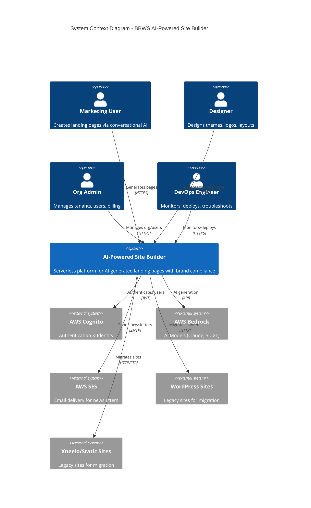

# BBWS AI-Powered Site Builder
## High-Level Design Document

**Version**: 2.0
**Author**: Tebogo Tseka
**Date**: 2025-12-07
**Status**: Draft for Review

---

## Document History

| Version | Date | Changes | Owner |
|---------|------|---------|-------|
| 1.0 | 2025-11-XX | Initial Version | Tebogo Tseka |
| 2.0 | 2025-12-07 | Enhanced with Site Designer agents, multi-tenant hierarchy, multi-region DR, brand scoring | Tebogo Tseka |

---

## 1. Business Purpose

### 1.1 Problem Statement

Marketing and Product teams at BBWS face significant challenges in creating landing pages:

| Pain Point | Current State | Impact |
|------------|---------------|--------|
| **Time to Market** | 2-4 weeks per landing page | Missed campaign windows, competitive disadvantage |
| **Resource Constraints** | 20+ requests/month, only 5-7 delivered | Backlog growth, frustrated stakeholders |
| **Cost per Page** | R8,000 - R15,000 | Budget constraints limit campaign quantity |
| **Inconsistent Quality** | No centralized system | Brand dilution, variable user experience |
| **Limited A/B Testing** | Manual creation prohibitive | Optimization opportunities missed |
| **Technical Dependency** | Marketing waits for developers | Slow iteration, bottlenecked workflows |

### 1.2 Solution Overview

The **AI-Powered Site Builder** is a serverless, multi-tenant platform that enables non-technical users to generate production-ready landing pages through conversational AI.

**Key Capabilities**:
- Natural language to landing page generation (10-15 seconds)
- AI-powered design agents (7 agents: Outliner, Logo Creator, Background Image Creator, Theme Selector, Blogger, Layout, Newsletter)
- Automated brand compliance validation (8/10 minimum score)
- Multi-environment deployment (DEV → SIT → PROD)
- Legacy site migration (WordPress, Static HTML, SquareSpace)
- Full multi-tenant organisation hierarchy (Org → Division → Group → Team → User)

### 1.3 Success Metrics

| Metric | Current | Target |
|--------|---------|--------|
| Landing page creation time | 2-4 weeks | 24-48 hours |
| Cost per page | R8,000 - R15,000 | < R2,500 |
| Self-service requests | 0% | 80% |
| Brand consistency score | Variable | 95%+ (8/10 minimum) |
| User satisfaction | Unknown | 90%+ |

### 1.4 Stakeholders

| Stakeholder | Role | Interest |
|-------------|------|----------|
| Marketing Manager | Primary user | Quick page generation, campaign agility |
| Content Strategist | User | Brand consistency, template reuse |
| Designer | User | Design quality, visual flexibility |
| Brand Manager | Approver | Brand compliance, quality standards |
| Security Engineer | Approver | Vulnerability prevention, code security |
| DevOps Engineer | Operator | Performance, deployment automation |
| Product Owner | Sponsor | Cost optimization, feature adoption |
| FinOps Team | Observer | Budget monitoring, cost alerts |

---

## 2. Epics, User Stories and Scenarios

### 2.1 Epic Overview

| Epic # | Epic Name | Description | User Stories |
|--------|-----------|-------------|--------------|
| 1 | AI Page Generation | Natural language to landing page generation | US-001, US-002 |
| 2 | Iterative Refinement | Conversational feedback and version control | US-003, US-004 |
| 3 | Quality & Validation | Brand compliance and security scanning | US-005, US-006 |
| 4 | Deployment | Multi-environment deployment workflow | US-007, US-008 |
| 5 | Analytics & Optimization | Performance tracking and cost monitoring | US-009, US-010 |
| 6 | Site Designer | AI-powered aesthetic design agents (7 agents) | US-011, US-012, US-013, US-014, US-022, US-023, US-024 |
| 7 | Tenant Management | Multi-tenant organisation hierarchy | US-015, US-016, US-017, US-018 |
| 8 | Site Migration | Legacy site migration from external platforms | US-019, US-020, US-021 |

### 2.2 User Stories Table

| Epic | User Story ID | User Story Description | Scenarios |
|------|---------------|------------------------|-----------|
| AI Page Generation | US-001 | As a Marketing Manager, I want to describe my landing page requirements in plain language so that I can quickly generate a draft page without technical knowledge | Submit natural language prompt, Receive preview within 15 seconds, All requested sections present and formatted |
| AI Page Generation | US-002 | As a Content Strategist, I want the AI to use our existing design components and brand assets so that I can maintain consistency across all pages | Request landing page, AI assembles using approved templates from design library, Output matches brand guidelines |
| Iterative Refinement | US-003 | As a Marketing Manager, I want to provide feedback and request changes conversationally so that I can refine the page without starting over | Say "Make hero section more minimal", AI updates only specified sections, Changes accurately applied while preserving other content |
| Iterative Refinement | US-004 | As a Designer, I want to see generation history and rollback to previous versions so that I can experiment safely | Make multiple iterations, Each version saved with timestamp, Restore any previous version on demand |
| Quality & Validation | US-005 | As a Brand Manager, I want automatic validation of brand compliance so that I can ensure all pages meet our standards | Page generated, Automatically scored for brand consistency (8/10 minimum), Receive specific feedback on validation failures |
| Quality & Validation | US-006 | As a Security Engineer, I want all generated code to be scanned for vulnerabilities so that I can prevent XSS and injection attacks | HTML generated, Passes security validation, Malicious patterns detected and generation rejected with warnings |
| Deployment | US-007 | As a Marketing Manager, I want to deploy pages to staging or production with one click so that I can quickly launch campaigns | Approve page, Deploy to staging environment, Promote to production with tracked versions |
| Deployment | US-008 | As a DevOps Engineer, I want automated performance testing before production deployment so that I can ensure pages meet performance standards | Deploy to production, Page load time tested, Block deployment if below threshold with optimization suggestions |
| Analytics & Optimization | US-009 | As a Growth Marketer, I want to track which components perform best so that I can optimize future page generations | Pages live, Engagement metrics collected per component, Analytics show which templates drive highest conversion |
| Analytics & Optimization | US-010 | As a Product Owner, I want to see cost and performance metrics for AI generation so that I can optimize resource usage | Review dashboards, See token usage/generation costs/latency per request, Receive alerts on cost spikes |
| Site Designer | US-011 | As a Designer, I want AI to create professional logos for my landing pages so that I maintain brand identity | Request logo generation, Logo Creator agent produces options, Select and apply to page |
| Site Designer | US-012 | As a Content Creator, I want AI to generate background images matching my page theme so that I have custom visuals | Describe image requirements, Background Image Creator generates options via Stable Diffusion XL, Apply to page sections |
| Site Designer | US-013 | As a Marketing Manager, I want AI to suggest cohesive color themes so that my pages look professionally designed | Request theme suggestions, Theme Selector agent provides options, Apply theme across all page components |
| Site Designer | US-014 | As a Designer, I want AI to outline page structure before generation so that I can approve the layout first | Submit requirements, Outliner agent proposes structure, Review and approve before full generation |
| Site Designer | US-022 | As a Content Marketer, I want AI to generate blog posts and articles so that I can maintain consistent content publishing | Provide topic/brief, Blogger agent generates SEO-optimized content, Review and publish to site |
| Site Designer | US-023 | As a Designer, I want AI to create responsive page layouts so that I can quickly structure new pages | Describe page purpose, Layout agent generates grid-based responsive layout, Apply layout to page generation |
| Site Designer | US-024 | As a Marketing Manager, I want AI to generate newsletter templates and content so that I can engage subscribers effectively | Provide newsletter brief, Newsletter agent creates email-optimized HTML, Preview and send via integration |
| Tenant Management | US-015 | As an Admin, I want to create and manage organisations so that I can onboard new customers | Create organisation, Configure hierarchy (Division/Group/Team), Assign initial admin user |
| Tenant Management | US-016 | As an Org Admin, I want to invite users to my organisation so that team members can access the platform | Send invitation email, User registers via invitation link, User assigned to specified team with role |
| Tenant Management | US-017 | As a Team Lead, I want to manage team membership so that I control who has access to team resources | Add/remove team members, Assign roles within team, Team data isolated from other teams |
| Tenant Management | US-018 | As a User, I want to belong to multiple teams so that I can collaborate across projects | Accept invitation to additional team, Switch between team contexts, Access resources for all assigned teams |
| Site Migration | US-019 | As a Website Admin, I want to migrate WordPress sites to static HTML so that I can reduce hosting costs | Provide WordPress site URL, Migration service extracts content, Static HTML generated and deployed to S3 |
| Site Migration | US-020 | As a Website Admin, I want to migrate static HTML sites from Xneelo to AWS so that I benefit from CDN performance | Provide site files or URL, Migration service processes assets, Site deployed to S3 with CloudFront |
| Site Migration | US-021 | As a Website Admin, I want to track migration status so that I know when my site is ready | Start migration, View progress in dashboard, Receive notification on completion/failure |

---

## 3. System Diagrams

### 3.1 Context Diagram (C4 Level 1)

The context diagram shows the Site Builder system and its interactions with external actors and systems.



**System Boundary Description**:

| External System | Integration | Data Flow |
|-----------------|-------------|-----------|
| AWS Cognito | JWT Authentication | User identity, tenant claims, roles |
| AWS Bedrock (Claude) | Text generation | Prompts → Generated HTML/CSS/content |
| AWS Bedrock (SD XL) | Image generation | Prompts → Logo/background images |
| AWS SES | Email delivery | Newsletter HTML → Subscriber emails |
| WordPress Sites | Migration source | Extract content, media, structure |
| Static HTML Sites | Migration source | Download files, transform to S3 |

### 3.2 Four-Layer Architecture

```mermaid
graph TB
    subgraph "Layer 1: Consumers/Frontend"
        WebApp["Web Application React Site Builder UI (S3 + CloudFront)"]
        AdminUI["Web Application Admin Dashboard (S3 + CloudFront)"]
    end

    subgraph "Layer 2: Middleware/Business Logic"
        Route53["Route 53"]
        WAF["WAF + CloudFront"]

        subgraph "API Gateway (Cognito Secured)"
            APIGW["API Gateway REST API Gateway"]
            Cognito["Cognito User Pool"]
        end

        subgraph "Tenant Management Service"
            TenantMgmt["Lambda  TenantManagement"]
            UserMgmt["Lambda  UserManagement"]
            AdminSvc["Lambda  AdminService"]
        end

        subgraph "Site Generation Service"
            SiteGen["Lambda  SiteGenerator"]
        end

        subgraph "Site Designer Multi-Agent System"

            SiteGeneratorAgent["Site Generator Agent"]
            AdvisorAgent["Build Advisor Agent"]

            subgraph "Themes, Colours and Layouts Agents"            
                ThemeSelectorAgent["Theme Selector Agent"]
                LayoutAgent["Layout Manager Agent"]
                TemplatesAgent["Templates Selector Agent"]
            end

            subgraph "Image Creating Agents"            
                LogoCreatorAgent["Logo Creator Agent"]
                BGImageCreatorAgent["BG Image Creator Agent"]
            end

            subgraph "Writer Agents"            
                BloggerAgent["Blogger Agent"]
                NewsletterAgent["Newsletter Writer Agent"]
            end

            subgraph "Validation Agents"
                ValidatorAgent["Website Validator Agent"]
                DesignScorerAgent["Design Scorer Agent"]
                SecurityValidatorAgent["Security Validator Agent"]
            end

            subgraph "Packaging and Deployment Agents"
                PackagerAgent["Site Packager"]
                DeployerAgent["Site Deployer Agent"]
                StagingAgent["Site Stager Agent"]
            end
        end

        subgraph "Staging and Deployment Service"
            DeployerQueue["SQS Generation Queue"]
            DeployerDLQ["SQS Generation DLQ"]

            StagingQueue["SQS Staging Queue"]
            StagingDLQ["SQS Staging DLQ"]

            PackagerQueue["SQS Packager Queue"]
            PackagerDLQ["SQS Packager DLQ"]


            SiteDeployer["Lambda Site Deployer"]
            SiteStager["Lambda Site Stager"]
            SitePackager["Lambda Site Packager"]

            SNS["SNS Notifications TBC"]
            DNS["Lambda DNS Management"]
        end

        subgraph "Migration Services"
            StaticMigrator["Lambda Static Migration Service"]
            WordPressMigrator["Lambda WordPress Migrator"]
        end

    end

    subgraph "Layer 3: Backend/Data Layer"

        SitesGenGitHub["Sites GitHub Repository"]

        subgraph "DynamoDB Tables"
            ProjectsDB["DynamoDB Projects"]
            TenantsDB["DynamoDB Tenants"]
            AssetsDB["DynamoDB Assets"]
            SitesDB["DynamoDB Sites"]
            GenerationDB["DynamoDB Generation"]
        end

        subgraph "S3 Buckets"
            StagingBucket["S3 Staging Bucket"]
            ProjectsBucket["S3 Project Bucket"]
            AssetsBucket["S3 Design Assets Bucket"]
            HostingBucket["S3 Site Hosting Bucket"]
        end

        subgraph "AI/ML Services"
            BedrockClaude["Bedrock Claude Sonnet 4.5"]
            BedrockSD["Bedrock Stable Diffusion XL"]
        end

        subgraph "CDN & DNS"
            CloudFront["CloudFront CDN"]
            Route53["Route 53 DNS"]
        end
    end

    subgraph "Layer 4: Management"
        CloudWatch["CloudWatch Logs & Dashboards"]
        XRay["X-Ray Tracing"]
        SiteGenGitHub["Site Generator GitHub Repository"]
        Terraform["Terraform IaC"]
        SecretsManager["Secrets Manager"]
    end

    WebApp -->|HTTPS| Route53
    AdminUI -->|HTTPS| Route53

    Route53 -->|HTTPS| WAF
    WAF -->|HTTPS| APIGW

    APIGW -->|JWT| Cognito
    APIGW --> TenantMgmt
    APIGW --> SiteGen

    SiteGen --> SiteGeneratorAgent
    SiteGen --> AdvisorAgent

    SiteGeneratorAgent --> ThemeSelectorAgent
    SiteGeneratorAgent --> LayoutAgent
    SiteGeneratorAgent --> TemplatesAgent
    SiteGeneratorAgent --> LogoCreatorAgent
    SiteGeneratorAgent --> BGImageCreatorAgent
    SiteGeneratorAgent --> BloggerAgent
    SiteGeneratorAgent --> NewsletterAgent
    SiteGeneratorAgent --> ValidatorAgent
    SiteGeneratorAgent --> DesignScorerAgent
    SiteGeneratorAgent --> SecurityValidatorAgent

    SiteGeneratorAgent --> PackagerAgent
    SiteGeneratorAgent --> DeployerAgent
    SiteGeneratorAgent --> StagingAgent

    DeployerAgent --> DeployerQueue
    PackagerAgent --> PackagerQueue
    StagingAgent --> StagingQueue

    DeployerQueue --> SiteDeployer
    SiteDeployer --> DeployerDLQ

    StagingQueue --> SiteStager
    SiteStager --> StagingDLQ

    PackagerQueue --> SitePackager
    SitePackager --> PackagerDLQ

    SiteDeployer --> SNS
    SiteDeployer --> DNS

    SiteStager --> StagingBucket
    SitePackager --> SitesGenGitHub
    SiteDeployer --> HostingBucket
    
    SiteDeployer --> Route53
    SiteDeployer --> CloudFront


    CloudFront["CloudFront CDN"]
    Route53["Route 53 DNS"]
 

```



### 3.2 Architecture Design Principles

1. **Serverless-First (Frugal Architecture)**: All compute via Lambda, no EC2/ECS, pay-per-use
2. **Component Assembly over Full Generation**: Leverage pre-approved templates for consistency
3. **AI-Powered Generation**: Claude Sonnet 4.5 for text, Stable Diffusion XL for images
4. **Validation Pipeline**: Brand compliance + security scanning before deployment
5. **Metadata-Driven**: DynamoDB stores all configuration, enabling version control
6. **Asynchronous Processing**: SQS decouples generation from deployment
7. **Multi-Tenant Separation**: Cognito + tenant_id in all API paths
8. **Edge-First Delivery**: CloudFront CDN with WAF protection
9. **Multi-Region DR**: af-south-1 (primary) + eu-west-1 (failover)

---

## 4. Component List

### 4.1 Layer 1: Frontend

| Component | Service(s) | User Stories |
|-----------|------------|--------------|
| `Web Application` React Site Builder UI | S3, CloudFront, WAF | US-001 to US-014 |
| `Web Application` Admin Dashboard | S3, CloudFront, WAF | US-010, US-015 to US-021 |

### 4.2 Layer 2: Middleware

| Component | Service(s) | User Stories |
|-----------|------------|--------------|
| `Lambda ` TenantManagement | Lambda, API Gateway | US-015 |
| `Lambda ` UserManagement | Lambda, API Gateway | US-016 to US-018 |
| `Lambda ` AdminService | Lambda, API Gateway | US-015 to US-017 |
| `Lambda ` SiteGenerator | Lambda, API Gateway, Bedrock | US-001 to US-003 |
| `Lambda ` TemplatesService | Lambda, S3 | US-002 |
| `Lambda ` AdvisorService | Lambda, Bedrock | US-003 |
| `Lambda Agent ` Outliner | Lambda, Bedrock Claude | US-014 |
| `Lambda Agent ` Logo Creator | Lambda, Bedrock SD XL | US-011 |
| `Lambda Agent ` Background Image Creator | Lambda, Bedrock SD XL | US-012 |
| `Lambda Agent ` Theme Selector | Lambda, Bedrock Claude | US-013 |
| `Lambda Agent ` Blogger | Lambda, Bedrock Claude | US-022 |
| `Lambda Agent ` Layout | Lambda, Bedrock Claude | US-023 |
| `Lambda Agent ` Newsletter | Lambda, Bedrock Claude, SES | US-024 |
| `Lambda ` SiteDeployer | Lambda, S3, CloudFront | US-007 |
| `Lambda ` DNSManagement | Lambda, Route 53 | US-007 |
| `Lambda ` MigrationService | Lambda, API Gateway | US-019 to US-021 |
| `Lambda ` WordPressParser | Lambda | US-019 |
| `Lambda ` HTMLCleaner | Lambda | US-019, US-020 |
| `Lambda ` WebsiteValidator | Lambda | US-005, US-006, US-008 |
| `Lambda ` BrandConsistencyScorer | Lambda, Bedrock Claude | US-005 |
| `Lambda ` SecurityScanner | Lambda | US-006 |
| `Lambda ` PromptManagement | Lambda, S3 | US-002 |
| `Lambda ` AnalyticsService | Lambda, CloudWatch | US-009, US-010 |

### 4.3 Layer 3: Backend

| Component | Service(s) | User Stories |
|-----------|------------|--------------|
| `DynamoDB` Tenants | DynamoDB Global Tables | US-015 |
| `DynamoDB` Users | DynamoDB Global Tables | US-016 to US-018 |
| `DynamoDB` Sites | DynamoDB Global Tables | US-001, US-002, US-007 |
| `DynamoDB` Generation (State Mgmt) | DynamoDB Global Tables | US-001, US-003, US-004, US-021 |
| `DynamoDB` Prompts | DynamoDB Global Tables | US-002 |
| `DynamoDB` Migrations | DynamoDB Global Tables | US-019 to US-021 |
| `DynamoDB` Templates | DynamoDB Global Tables | US-002, US-011 to US-013 |
| `S3` Design Assets | S3, CRR | US-002, US-011, US-012 |
| `S3` Generated Pages | S3, CRR | US-001, US-004 |
| `S3` Site Hosting | S3, CloudFront | US-007 |
| `S3` Prompt Library | S3, CRR | US-002 |
| `Bedrock` Claude Sonnet 4.5 | Amazon Bedrock | US-001 to US-003, US-005, US-013, US-014, US-022, US-023, US-024 |
| `Bedrock` Claude Haiku | Amazon Bedrock | US-001 (preview) |
| `Bedrock` Stable Diffusion XL | Amazon Bedrock | US-011, US-012 |
| `SQS` Generation Queue | SQS | US-001, US-007 |
| `SQS` Deployment Queue | SQS | US-007 |
| `SQS` Dead Letter Queue | SQS | All (error handling) |
| `SNS` Alerts & Notifications | SNS, SES | US-010, US-021 |
| `Cognito` User Pool | Cognito | US-015 to US-018 |

### 4.4 Layer 4: Management

| Component | Service(s) | User Stories |
|-----------|------------|--------------|
| `Repository` GitHub | GitHub | All |
| `CI/CD` GitHub Actions | GitHub Actions | US-007, US-008 |
| `IaC` Terraform (per microservice) | Terraform | All |
| `Monitoring` CloudWatch Logs | CloudWatch | US-010 |
| `Tracing` X-Ray | X-Ray | US-008, US-010 |
| `Dashboard` CloudWatch Dashboards | CloudWatch | US-009, US-010 |
| `WAF` Web Application Firewall | AWS WAF | US-006 |
| `Shield` DDoS Protection | AWS Shield | US-006 |
| `GuardDuty` Threat Detection | GuardDuty | US-006 |
| `Secrets Manager` API Keys | Secrets Manager | All |

### 4.5 Component Summary

| Layer | Count |
|-------|-------|
| Layer 1: Frontend | 3 |
| Layer 2: Middleware | 23 |
| Layer 3: Backend | 19 |
| Layer 4: Management | 10 |
| **Total** | **55** |

---

## 5. Cost Estimation

### 5.1 Capacity Parameters

| Parameter | Value |
|-----------|-------|
| Monthly page generations | 10,000 |
| Concurrent users | 500 |
| Average pages per customer | 5 |
| Average storage per site | 500 MB |
| Monthly API calls | 750,000 (50 calls × 500 users × 30 days) |

### 5.2 Estimated Monthly Costs (af-south-1)

| Service | Usage | Estimated Cost (ZAR) |
|---------|-------|----------------------|
| **Lambda** | 10M invocations @ 512MB, 500ms avg | R3,500 |
| **API Gateway** | 750K requests | R800 |
| **DynamoDB** | 7 tables, on-demand, ~50GB | R2,000 |
| **S3** | 500 users × 500MB = 250GB + requests | R1,500 |
| **CloudFront** | 1TB data transfer | R2,500 |
| **Bedrock - Claude Sonnet 4.5** | 10K generations × ~5K tokens | R15,000 |
| **Bedrock - Claude Haiku** | 20K previews × ~2K tokens | R2,000 |
| **Bedrock - Stable Diffusion XL** | 5K image generations | R5,000 |
| **Cognito** | 500 MAU | R500 |
| **Route 53** | 2 hosted zones + queries | R300 |
| **CloudWatch** | Logs, metrics, dashboards | R1,000 |
| **WAF** | Web ACL + rules | R800 |
| **SQS/SNS** | 1M messages | R200 |
| **Secrets Manager** | 10 secrets | R150 |
| **DR (eu-west-1)** | Cross-region replication | R5,000 |
| **Total Estimated** | | **~R40,250/month** |

### 5.3 Cost Optimization Strategies

1. **Serverless-first**: Zero cost when idle
2. **DynamoDB on-demand**: No over-provisioning
3. **Claude Haiku for previews**: 10x cheaper than Sonnet for drafts
4. **S3 Intelligent-Tiering**: Auto-optimize storage costs
5. **Reserved Capacity**: Consider for Bedrock if usage stabilizes
6. **Non-prod shutdown**: Auto-shutdown DEV/SIT resources outside business hours

---

## 6. Security

### 6.1 Security Services

| Service | Purpose |
|---------|---------|
| AWS WAF | DDoS protection, rate limiting, XSS/SQLi prevention |
| AWS Shield | Advanced DDoS protection |
| AWS GuardDuty | Threat detection, anomaly monitoring |
| AWS Secrets Manager | API keys, credentials storage |
| Amazon Cognito | Authentication, multi-tenant identity |
| IAM | Role-based access control |
| KMS | Encryption key management |

### 6.2 Authentication & Authorization

| Aspect | Implementation |
|--------|----------------|
| Authentication | Cognito User Pools with MFA option |
| Authorization | RBAC via Cognito groups + custom claims |
| Tenant Isolation | tenant_id in JWT claims, validated on all requests |
| API Security | JWT validation at API Gateway |
| OTP Verification | Required for customer data access |

#### 6.2.1 Cognito Implementation (First Principles - No Amplify)

**IMPORTANT**: Cognito must be implemented using first principles with the AWS SDK directly. **Amplify is NOT permitted**.

| Requirement | Implementation |
|-------------|----------------|
| **SDK** | `@aws-sdk/client-cognito-identity-provider` (v3) |
| **Auth Flow** | Direct Cognito API calls via SDK |
| **Token Management** | Manual JWT handling (access, refresh, id tokens) |
| **User Pool Operations** | Direct API: `InitiateAuth`, `RespondToAuthChallenge`, `SignUp`, `ConfirmSignUp` |
| **Token Refresh** | Manual implementation with `InitiateAuth` (REFRESH_TOKEN_AUTH) |
| **MFA** | Direct API: `SetUserMFAPreference`, `AssociateSoftwareToken`, `VerifySoftwareToken` |

**Rationale**:
- Full control over authentication flow
- No Amplify dependency bloat
- Explicit token management
- Easier debugging and troubleshooting
- Better alignment with enterprise security requirements

**Prohibited**:
- `aws-amplify` package
- `@aws-amplify/auth`
- Amplify CLI for Cognito configuration
- Amplify Hosting with Cognito integration

**Required Implementation Pattern**:

```typescript
// Frontend: Direct Cognito SDK usage
import {
  CognitoIdentityProviderClient,
  InitiateAuthCommand,
  SignUpCommand,
  ConfirmSignUpCommand,
  GetUserCommand
} from '@aws-sdk/client-cognito-identity-provider';

const cognitoClient = new CognitoIdentityProviderClient({
  region: process.env.AWS_REGION
});

// Sign in - direct API call
async function signIn(username: string, password: string) {
  const command = new InitiateAuthCommand({
    AuthFlow: 'USER_PASSWORD_AUTH',
    ClientId: process.env.COGNITO_CLIENT_ID,
    AuthParameters: {
      USERNAME: username,
      PASSWORD: password
    }
  });
  return cognitoClient.send(command);
}

// Token refresh - manual implementation
async function refreshTokens(refreshToken: string) {
  const command = new InitiateAuthCommand({
    AuthFlow: 'REFRESH_TOKEN_AUTH',
    ClientId: process.env.COGNITO_CLIENT_ID,
    AuthParameters: {
      REFRESH_TOKEN: refreshToken
    }
  });
  return cognitoClient.send(command);
}
```

### 6.3 Data Protection

| Type | Implementation |
|------|----------------|
| Encryption at Rest | S3 SSE-S3, DynamoDB encryption enabled |
| Encryption in Transit | TLS 1.2+ for all connections |
| PII Masking | Customer data masked in logs |
| Backup | Hourly DynamoDB backups, S3 versioning |
| Ransomware Protection | Cross-region backup vault |

### 6.4 Network Security

| Control | Implementation |
|---------|----------------|
| VPC | Not required (serverless architecture) |
| WAF Rules | OWASP Top 10 protection |
| Rate Limiting | Per-user API rate limits via WAF |
| IP Blocking | WAF IP reputation lists |

### 6.5 GenAI Security

| Control | Implementation |
|---------|----------------|
| LLM Guard Rails | Input/output validation via Bedrock Guardrails |
| Prompt Injection Prevention | Input sanitization, system prompt protection |
| Red Team Testing | Scheduled adversarial testing |
| Knowledge Base Isolation | Per-tenant knowledge bases, no cross-contamination |

### 6.6 Audit & Compliance

- All interactions with customer data logged
- Roles assumed by customers have no delete rights
- Deletes/drops blocked by explicit IAM deny
- Penetration testing scheduled quarterly

### 6.7 Multi-Tenant Infrastructure Solutions

The following AWS services provide multi-tenant capabilities across the Site Builder platform:

| Requirement | AWS Service | Feature | Implementation |
|-------------|-------------|---------|----------------|
| **Rate Limiting** | API Gateway | Usage Plans | Per-tenant throttling quotas (requests/sec, requests/month) |
| **Audit Logs** | CloudWatch | Resource Tags | Tenant-tagged log groups (`tenant_id` tag on all resources) |
| **Cost Allocation** | Cost Explorer | Cost Allocation Tags | `tenant_id` tag for per-tenant cost tracking and billing |
| **Authentication** | API Gateway + Cognito | API Keys + JWT | Dual-layer: API Keys for tenant identity, Cognito JWT for user auth |
| **Routing** | Lambda | Custom Logic | Tenant context extraction from path params and JWT claims |
| **Data Isolation** | DynamoDB | Partition Key | `tenant_id` as partition key prefix in all tables |
| **Asset Isolation** | S3 | Prefix Structure | `/{tenant_id}/` prefix for all tenant assets |
| **API Quotas** | API Gateway | Usage Plans | Per-tenant quota limits tied to subscription tier |

**Usage Plan Tiers**:

| Tier | Rate Limit | Burst | Monthly Quota |
|------|------------|-------|---------------|
| Free | 10 req/sec | 20 | 1,000 |
| Standard | 50 req/sec | 100 | 50,000 |
| Premium | 200 req/sec | 400 | Unlimited |
| Enterprise | Custom | Custom | Custom |

**Tenant Tagging Strategy**:

All AWS resources supporting tags MUST include:
- `tenant_id`: Unique tenant identifier
- `org_id`: Organization identifier
- `environment`: dev/sit/prod
- `project`: BBWS-SiteBuilder

**Cost Allocation Reporting**:

```
AWS Cost Explorer → Filter by Cost Allocation Tag (tenant_id)
                  → Group by Service
                  → Export to S3 for tenant billing
```

---

## 7. Appendix A: TBCs (To Be Confirmed)

| TBC ID | Category | Description | Owner | Status |
|--------|----------|-------------|-------|--------|
| TBC-001 | Decision | Notification mailing list for alarms | Tebogo | Resolved |
| TBC-002 | NFR | Response time thresholds: 10ms non-gen, 1min TTLT streaming | Nate | Resolved |
| TBC-003 | Decision | Solution Criticality: Business Critical / Business Support | Nate | Resolved |
| TBC-004 | Risk | BCP Risk Assessment | Nate | Pending |
| TBC-005 | DR | RPO: 1 hour | Team | Resolved |
| TBC-006 | DR | RTO: 1 minute | Team | Resolved |
| TBC-007 | Security | Security signoff from Security Team | Security Team | Pending |
| TBC-008 | Risk | Risks and mitigation approval by Sec Team | Security Team | Pending |

---

## 8. Appendix B: Referenced Documents

| Ref ID | Document | Type | Description |
|--------|----------|------|-------------|
| REF-001 | AWS Well-Architected Framework | Best Practice | Cloud architecture guidance |
| REF-002 | The Frugal Architect | Best Practice | Cost-optimization principles |
| REF-003 | OWASP Top 10 | Security Standard | Web security vulnerabilities |
| REF-004 | Page Builder HLD V1.0 | Internal | Original HLD document (PDF) |
| REF-005 | Enterprise Integration Patterns | Book | Gregor Hohpe & Bobby Woolf |
| REF-006 | BBWS Brand Guidelines | Internal | Brand compliance standards |

---

## 9. Appendix C: Definition of Terms

| Term | Definition | Category |
|------|------------|----------|
| API Gateway | AWS service for creating and managing REST APIs | AWS Service |
| Bedrock | AWS managed service for foundation AI models | AWS Service |
| Claude Sonnet 4.5 | Anthropic's high-capability AI model for text generation | AI Model |
| CloudFront | AWS Content Delivery Network for edge caching | AWS Service |
| Cognito | AWS identity service for authentication/authorization | AWS Service |
| CRR | Cross-Region Replication for S3 buckets | AWS Feature |
| DEV | Development environment | Environment |
| DLQ | Dead Letter Queue for failed message handling | Architecture Pattern |
| DynamoDB | AWS managed NoSQL database service | AWS Service |
| HLD | High-Level Design document | Document Type |
| Lambda | AWS serverless compute service | AWS Service |
| LLD | Low-Level Design document | Document Type |
| MAU | Monthly Active Users | Metric |
| NFR | Non-Functional Requirement | Requirement Type |
| OTP | One-Time Password for verification | Security |
| PROD | Production environment | Environment |
| RBAC | Role-Based Access Control | Security Pattern |
| RPO | Recovery Point Objective (data loss tolerance) | DR Metric |
| RTO | Recovery Time Objective (downtime tolerance) | DR Metric |
| S3 | AWS Simple Storage Service | AWS Service |
| SIT | System Integration Testing environment | Environment |
| SNS | AWS Simple Notification Service | AWS Service |
| SQS | AWS Simple Queue Service | AWS Service |
| Stable Diffusion XL | AI model for image generation | AI Model |
| TBC | To Be Confirmed | Status |
| TLS | Transport Layer Security encryption | Security Protocol |
| TTFT | Time To First Token (AI response latency) | Performance Metric |
| TTLT | Time To Last Token (AI response completion) | Performance Metric |
| WAF | Web Application Firewall | AWS Service |
| XSS | Cross-Site Scripting attack vector | Security Threat |

---

## 10. Signoff

| Signatory | Role | Feedback | Status |
|-----------|------|----------|--------|
| | Security | | Pending |
| | Risk | | Pending |
| | Product Owner | | Pending |
| | Enterprise Architecture | | Pending |

---

## 11. Appendix D: Brand Consistency Scoring

### Scoring Categories (Total: 10 points)

| Category | Max Points | Evaluation |
|----------|------------|------------|
| Color Palette Compliance | 2.0 | Match brand colors (primary, secondary, accent) |
| Typography Compliance | 1.5 | Correct fonts, sizes, weights |
| Logo Usage | 1.5 | Presence, placement, clear space |
| Layout & Spacing | 1.5 | Grid consistency, margins, padding |
| Component Style Consistency | 1.5 | Buttons, forms, cards match library |
| Imagery & Iconography | 1.0 | Visual style consistency |
| Content Tone & Voice | 1.0 | Copy matches brand voice |

### Thresholds

| Score | Status | Action |
|-------|--------|--------|
| 9.0 - 10.0 | Excellent | Auto-approve |
| 8.0 - 8.9 | Acceptable | Approve with recommendations |
| 6.0 - 7.9 | Needs Work | Block, provide feedback |
| 0.0 - 5.9 | Rejected | Regeneration required |

**Minimum Production Threshold: 8.0/10**

---

## 12. Appendix E: Environment Promotion Workflow

| Stage | Trigger | Authority | Validation |
|-------|---------|-----------|------------|
| Staging | Automated by tool | System | Brand score >= 8.0, Security scan pass |
| DEV | Manual deployment | Developer | Unit tests pass |
| SIT | Manual promotion | Tester | Integration tests pass |
| PROD | Manual promotion | Business Owner | UAT complete, all approvals |

**Note**: PROD is read-only for deployments - changes must flow through DEV → SIT → PROD.

---

## 13. Appendix F: API Endpoints

| Service | Endpoint | Method | Description |
|---------|----------|--------|-------------|
| Tenants | `/v1/tenants/{tenant_id}` | GET, PUT, DELETE | Manage tenant |
| Admin | `/v1/admin/{tenant_id}` | GET, POST | Back-office administration |
| Users | `/v1/user/registration` | POST | Register new user/org |
| Users | `/v1/user/forgot/password` | POST | Password reset |
| Users | `/v1/user/{tenant}` | GET, PUT | Manage user profile |
| Users | `/v1/user/invitation` | POST | Send invitation |
| Sites | `/v1/sites/{tenant_id}/templates` | GET | List templates |
| Sites | `/v1/sites/{tenant_id}/generation` | POST | Start generation |
| Sites | `/v1/sites/{tenant_id}/generation/{id}/advisor` | POST | AI advisor |
| Sites | `/v1/sites/{tenant_id}/dns` | GET, PUT | DNS management |
| Sites | `/v1/sites/{tenant_id}/files` | GET, POST | File management |
| Sites | `/v1/sites/{tenant_id}/deployments` | GET, POST | Deployment management |
| Migrations | `/v1/migrations/{tenant_id}` | GET, POST | Migration service |
| Prompts | `/v1/prompts/{tenant_id}` | GET, POST | Prompt management |

**Note**: All tenant-scoped endpoints require `tenant_id` path parameter except registration and password reset.

---

*Document generated with HLD Architect Agent*
