# BBWS AI-Powered Site Builder
## High-Level Design Document

**Version**: 3.1
**Author**: Tebogo Tseka
**Date**: 2026-01-16
**Status**: Draft for Review

---

## Document History

| Version | Date | Changes | Owner |
|---------|------|---------|-------|
| 1.0 | 2025-11-XX | Initial Version | Tebogo Tseka |
| 2.0 | 2025-12-07 | Enhanced with Site Designer agents, multi-tenant hierarchy, multi-region DR, brand scoring | Tebogo Tseka |
| 3.0 | 2026-01-16 | Hybrid AgentCore architecture (eu-west-1 processing + af-south-1 data residency), HATEOAS API design, repository structure, updated component list | Tebogo Tseka |
| 3.1 | 2026-01-16 | Added Epic 9 (White-Label & Marketplace) with user stories US-025 to US-028 for White-Label Partner persona | Tebogo Tseka |

---

## 1. Business Purpose

### 1.1 Problem Statement

Marketing and Product teams face significant challenges in creating landing pages:

| Pain Point | Current State | Impact |
|------------|---------------|--------|
| **Time to Market** | 2-4 weeks per landing page | Missed campaign windows, competitive disadvantage |
| **Resource Constraints** | 20+ requests/month, only 5-7 delivered | Backlog growth, frustrated stakeholders |
| **Cost per Page** | R8,000 - R15,000 | Budget constraints limit campaign quantity |
| **Inconsistent Quality** | No centralized system | Brand dilution, variable user experience |
| **Limited A/B Testing** | Manual creation prohibitive | Optimization opportunities missed |
| **Technical Dependency** | Marketing waits for developers | Slow iteration, bottlenecked workflows |

### 1.2 Solution Overview

The **AI-Powered Site Builder** is a serverless, multi-tenant SaaS platform that enables non-technical users to generate production-ready landing pages through conversational AI.

**Distribution Model**:
- AWS Marketplace listing
- Other cloud marketplace listings
- White-label offering for white-label partners

**Key Capabilities**:
- Natural language to landing page generation (10-15 seconds)
- AI-powered design agents via Bedrock AgentCore (7 agents)
- Automated brand compliance validation (8/10 minimum score)
- Multi-environment deployment (DEV → SIT → PROD)
- Legacy site migration (WordPress, Static HTML) — Phase 2
- Full multi-tenant organisation hierarchy (Org → Division → Group → Team → User)

### 1.3 Success Metrics

| Metric | Current | Target |
|--------|---------|--------|
| Landing page creation time | 2-4 weeks | 24-48 hours |
| Cost per page | R8,000 - R15,000 | < R2,500 |
| Self-service requests | 0% | 80% |
| Brand consistency score | Variable | 95%+ (8/10 minimum) |
| User satisfaction | Unknown | 90%+ |

### 1.4 Stakeholders

| Stakeholder | Role | Interest |
|-------------|------|----------|
| Marketing Manager | Primary user | Quick page generation, campaign agility |
| Content Strategist | User | Brand consistency, template reuse |
| Designer | User | Design quality, visual flexibility |
| Brand Manager | Approver | Brand compliance, quality standards |
| Security Engineer | Approver | Vulnerability prevention, code security |
| DevOps Engineer | Operator | Performance, deployment automation |
| Product Owner | Sponsor | Cost optimization, feature adoption |
| FinOps Team | Observer | Budget monitoring, cost alerts |
| White-Label Partners | White-label customer | Custom branding, delegated admin |
| Marketplace Customers | End customer | Self-service subscription |

---

## 2. Epics, User Stories and Scenarios

### 2.1 Epic Overview

| Epic # | Epic Name | Description | User Stories | Phase |
|--------|-----------|-------------|--------------|-------|
| 1 | AI Page Generation | Natural language to landing page generation | US-001, US-002 | 1 |
| 2 | Iterative Refinement | Conversational feedback and version control | US-003, US-004 | 1 |
| 3 | Quality & Validation | Brand compliance and security scanning | US-005, US-006 | 1 |
| 4 | Deployment | Multi-environment deployment workflow | US-007, US-008 | 1 |
| 5 | Analytics & Optimization | Performance tracking and cost monitoring | US-009, US-010 | 1 |
| 6 | Site Designer | AI-powered aesthetic design agents (7 agents) | US-011, US-012, US-013, US-014, US-022, US-023, US-024 | 1 |
| 7 | Tenant Management | Multi-tenant organisation hierarchy | US-015, US-016, US-017, US-018 | 1 |
| 8 | Site Migration | Legacy site migration from external platforms | US-019, US-020, US-021 | 2 |
| 9 | White-Label & Marketplace | Partner branding, delegated admin, marketplace billing | US-025, US-026, US-027, US-028 | 1 |

### 2.2 User Stories Table

| Epic | User Story ID | User Story Description | Scenarios |
|------|---------------|------------------------|-----------|
| AI Page Generation | US-001 | As a Marketing Manager, I want to describe my landing page requirements in plain language so that I can quickly generate a draft page without technical knowledge | Submit natural language prompt, Receive preview within 15 seconds, All requested sections present and formatted |
| AI Page Generation | US-002 | As a Content Strategist, I want the AI to use our existing design components and brand assets so that I can maintain consistency across all pages | Request landing page, AI assembles using approved templates from design library, Output matches brand guidelines |
| Iterative Refinement | US-003 | As a Marketing Manager, I want to provide feedback and request changes conversationally so that I can refine the page without starting over | Say "Make hero section more minimal", AI updates only specified sections, Changes accurately applied while preserving other content |
| Iterative Refinement | US-004 | As a Designer, I want to see generation history and rollback to previous versions so that I can experiment safely | Make multiple iterations, Each version saved with timestamp, Restore any previous version on demand |
| Quality & Validation | US-005 | As a Brand Manager, I want automatic validation of brand compliance so that I can ensure all pages meet our standards | Page generated, Automatically scored for brand consistency (8/10 minimum), Receive specific feedback on validation failures |
| Quality & Validation | US-006 | As a Security Engineer, I want all generated code to be scanned for vulnerabilities so that I can prevent XSS and injection attacks | HTML generated, Passes security validation, Malicious patterns detected and generation rejected with warnings |
| Deployment | US-007 | As a Marketing Manager, I want to deploy pages to staging or production with one click so that I can quickly launch campaigns | Approve page, Deploy to staging environment, Promote to production with tracked versions |
| Deployment | US-008 | As a DevOps Engineer, I want automated performance testing before production deployment so that I can ensure pages meet performance standards | Deploy to production, Page load time tested, Block deployment if below threshold with optimization suggestions |
| Analytics & Optimization | US-009 | As a Growth Marketer, I want to track which components perform best so that I can optimize future page generations | Pages live, Engagement metrics collected per component, Analytics show which templates drive highest conversion |
| Analytics & Optimization | US-010 | As a Product Owner, I want to see cost and performance metrics for AI generation so that I can optimize resource usage | Review dashboards, See token usage/generation costs/latency per request, Receive alerts on cost spikes |
| Site Designer | US-011 | As a Designer, I want AI to create professional logos for my landing pages so that I maintain brand identity | Request logo generation, Logo Creator agent produces options, Select and apply to page |
| Site Designer | US-012 | As a Content Creator, I want AI to generate background images matching my page theme so that I have custom visuals | Describe image requirements, Background Image Creator generates options via Stable Diffusion XL, Apply to page sections |
| Site Designer | US-013 | As a Marketing Manager, I want AI to suggest cohesive color themes so that my pages look professionally designed | Request theme suggestions, Theme Selector agent provides options, Apply theme across all page components |
| Site Designer | US-014 | As a Designer, I want AI to outline page structure before generation so that I can approve the layout first | Submit requirements, Outliner agent proposes structure, Review and approve before full generation |
| Site Designer | US-022 | As a Content Marketer, I want AI to generate blog posts and articles so that I can maintain consistent content publishing | Provide topic/brief, Blogger agent generates SEO-optimized content, Review and publish to site |
| Site Designer | US-023 | As a Designer, I want AI to create responsive page layouts so that I can quickly structure new pages | Describe page purpose, Layout agent generates grid-based responsive layout, Apply layout to page generation |
| Site Designer | US-024 | As a Marketing Manager, I want AI to generate newsletter templates and content so that I can engage subscribers effectively | Provide newsletter brief, Newsletter agent creates email-optimized HTML, Preview and send via integration |
| Tenant Management | US-015 | As an Admin, I want to create and manage organisations so that I can onboard new customers | Create organisation, Configure hierarchy (Division/Group/Team), Assign initial admin user |
| Tenant Management | US-016 | As an Org Admin, I want to invite users to my organisation so that team members can access the platform | Send invitation email, User registers via invitation link, User assigned to specified team with role |
| Tenant Management | US-017 | As a Team Lead, I want to manage team membership so that I control who has access to team resources | Add/remove team members, Assign roles within team, Team data isolated from other teams |
| Tenant Management | US-018 | As a User, I want to belong to multiple teams so that I can collaborate across projects | Accept invitation to additional team, Switch between team contexts, Access resources for all assigned teams |
| Site Migration | US-019 | As a Website Admin, I want to migrate WordPress sites to static HTML so that I can reduce hosting costs | Provide WordPress site URL, Migration service extracts content, Static HTML generated and deployed to S3 |
| Site Migration | US-020 | As a Website Admin, I want to migrate static HTML sites from Xneelo to AWS so that I benefit from CDN performance | Provide site files or URL, Migration service processes assets, Site deployed to S3 with CloudFront |
| Site Migration | US-021 | As a Website Admin, I want to track migration status so that I know when my site is ready | Start migration, View progress in dashboard, Receive notification on completion/failure |
| White-Label & Marketplace | US-025 | As a White-Label Partner, I want to configure white-label branding so that my customers see my brand identity | Upload partner logo/colors, Configure custom domain, End customers see partner branding only |
| White-Label & Marketplace | US-026 | As a White-Label Partner, I want delegated administration so that I can manage my sub-tenants independently | Create sub-tenants under partner scope, Assign partner admins, Access isolated from other partners |
| White-Label & Marketplace | US-027 | As a White-Label Partner, I want to manage my marketplace subscription so that I can control my plan and usage | View current plan/usage, Upgrade/downgrade subscription, Receive usage alerts at 80% threshold |
| White-Label & Marketplace | US-028 | As a White-Label Partner, I want to access billing and metering data so that I can bill my end customers | View detailed usage per sub-tenant, Export billing reports, Access AWS Marketplace metering data |

---

## 3. System Architecture

### 3.1 Architecture Decision: Hybrid Regional Model

| Decision | Rationale |
|----------|-----------|
| **eu-west-1** for agent processing | Bedrock AgentCore availability; managed agent infrastructure |
| **af-south-1** for data residency | POPIA compliance; white-label partner requirements; user latency |
| **EventBridge** for cross-region | Native retry, DLQ, low latency (~100ms) |

**Key Principle**: Data never leaves af-south-1. Only anonymised prompts and generation context traverse to eu-west-1.

### 3.2 Context Diagram (C4 Level 1)

```mermaid
flowchart TB
    subgraph Users["👥 Users"]
        marketing["🎯 Marketing User<br/><small>Creates landing pages</small>"]
        designer["🎨 Designer<br/><small>Designs themes, logos</small>"]
        admin["👔 Org Admin<br/><small>Manages tenants, users</small>"]
        devops["🔧 DevOps Engineer<br/><small>Monitors, deploys</small>"]
        telco["📱 White-Label Partner<br/><small>White-label customer</small>"]
    end

    subgraph Platform["BBWS Site Builder Platform"]
        subgraph AF["☀️ af-south-1 &lpar;Cape Town&rpar;<br/>DATA RESIDENCY ZONE"]
            af_south["🗄️ Data Zone<br/><small>User APIs, storage, hosting</small>"]
        end
        subgraph EU["🇪🇺 eu-west-1 &lpar;Ireland&rpar;<br/>AGENT PROCESSING ZONE"]
            eu_west["🤖 Agent Zone<br/><small>AI processing via AgentCore</small>"]
        end
    end

    subgraph External["☁️ External Services"]
        cognito["🔐 AWS Cognito<br/><small>Authentication</small>"]
        agentcore["🧠 Bedrock AgentCore<br/><small>Runtime, Gateway, Policy</small>"]
        bedrock["🤖 AWS Bedrock<br/><small>Claude, SD XL</small>"]
        marketplace["🛒 AWS Marketplace<br/><small>Billing</small>"]
        ses["📧 AWS SES<br/><small>Email</small>"]
    end

    marketing -->|"HTTPS"| af_south
    designer -->|"HTTPS"| af_south
    admin -->|"HTTPS"| af_south
    devops -->|"HTTPS"| af_south
    telco -->|"HTTPS"| af_south

    af_south <-->|"JWT"| cognito
    af_south <-->|"EventBridge"| eu_west
    af_south -->|"Metering API"| marketplace
    af_south -->|"SMTP"| ses

    eu_west -->|"API"| agentcore
    agentcore -->|"Inference"| bedrock

    style AF fill:#e8f5e9,stroke:#2e7d32,stroke-width:2px
    style EU fill:#e3f2fd,stroke:#1565c0,stroke-width:2px
    style Platform fill:#fff3e0,stroke:#ef6c00,stroke-width:2px
```



### 3.3 System Boundary Description

| External System | Region | Integration | Data Flow |
|-----------------|--------|-------------|-----------|
| AWS Cognito | af-south-1 | JWT Authentication | User identity, tenant claims, roles |
| Bedrock AgentCore | eu-west-1 | Agent orchestration | Prompts → Agent execution → Generated content |
| AWS Bedrock (Claude) | eu-west-1 | Text generation | Prompts → Generated HTML/CSS/content |
| AWS Bedrock (SD XL) | eu-west-1 | Image generation | Prompts → Logo/background images |
| AWS Marketplace | Global | Metering API | Usage metrics → Billing |
| AWS SES | af-south-1 | Email delivery | Notifications, invitations |

### 3.4 Hybrid Architecture Overview

```
┌─────────────────────────────────────────────────────────────────────────────┐
│                              USER REQUEST FLOW                               │
└─────────────────────────────────────────────────────────────────────────────┘

    User (Global)
           │
           ▼
    ┌──────────────┐
    │  CloudFront  │ ◄─── Global Edge (closest PoP)
    └──────┬───────┘
           │
           ▼
┌──────────────────────────────────────────────────────────────────────────────┐
│                           af-south-1 (Cape Town)                             │
│                              DATA RESIDENCY ZONE                             │
│                                                                              │
│  ┌─────────────────────────────────────────────────────────────────────┐    │
│  │                    API Gateway + WAF + Cognito                       │    │
│  └─────────────────────────────────────────────────────────────────────┘    │
│           │                                                                  │
│           ▼                                                                  │
│  ┌─────────────────┐    ┌─────────────────┐    ┌─────────────────┐         │
│  │ Tenant Service  │    │  User Service   │    │ Request Router  │         │
│  │    (Lambda)     │    │    (Lambda)     │    │    (Lambda)     │         │
│  └────────┬────────┘    └────────┬────────┘    └────────┬────────┘         │
│           │                      │                      │                   │
│           ▼                      ▼                      │                   │
│  ┌─────────────────────────────────────────────┐       │                   │
│  │              DynamoDB Tables                 │       │                   │
│  │  • Tenants  • Users  • Sites  • Generations │       │                   │
│  └─────────────────────────────────────────────┘       │                   │
│                                                         │                   │
│  ┌─────────────────────────────────────────────┐       │                   │
│  │              S3 Buckets                      │       │                   │
│  │  • Brand Assets  • Generated Sites          │       │                   │
│  └─────────────────────────────────────────────┘       │                   │
│                                                         │                   │
│           ┌─────────────────────────────────────────────┘                   │
│           │ Generation Request (anonymised)                                 │
│           ▼                                                                  │
│  ┌─────────────────────────────────────────────┐                           │
│  │         Cross-Region EventBridge            │                           │
│  └─────────────────────────────────────────────┘                           │
└──────────────────────────────────────────────────────────────────────────────┘
           │
           │ Prompt + context (no PII)
           ▼
┌──────────────────────────────────────────────────────────────────────────────┐
│                           eu-west-1 (Ireland)                                │
│                           AGENT PROCESSING ZONE                              │
│                                                                              │
│  ┌─────────────────────────────────────────────────────────────────────┐    │
│  │                    Bedrock AgentCore Platform                        │    │
│  │  ┌───────────┐ ┌───────────┐ ┌───────────┐ ┌───────────┐           │    │
│  │  │  Runtime  │ │  Gateway  │ │  Policy   │ │  Memory   │           │    │
│  │  └───────────┘ └───────────┘ └───────────┘ └───────────┘           │    │
│  │  ┌───────────┐ ┌───────────┐ ┌───────────┐                         │    │
│  │  │ Identity  │ │Observability│ │Evaluations│                        │    │
│  │  └───────────┘ └───────────┘ └───────────┘                         │    │
│  └─────────────────────────────────────────────────────────────────────┘    │
│                                                                              │
│  ┌─────────────────────────────────────────────────────────────────────┐    │
│  │                        Agent Orchestration                           │    │
│  │                                                                      │    │
│  │   ┌──────────────┐                                                  │    │
│  │   │    Site      │                                                  │    │
│  │   │  Generator   │ (Orchestrator)                                   │    │
│  │   └──────┬───────┘                                                  │    │
│  │          │                                                          │    │
│  │    ┌─────┼─────┬─────────┬─────────┬─────────┐                     │    │
│  │    ▼     ▼     ▼         ▼         ▼         ▼                     │    │
│  │ ┌──────┐┌──────┐┌──────┐┌──────┐┌──────┐┌──────┐┌──────┐          │    │
│  │ │Outline││Theme ││Layout││ Logo ││  BG  ││Blogger││Valid-│          │    │
│  │ │  r   ││Select││      ││Create││Image ││      ││ator  │          │    │
│  │ └──────┘└──────┘└──────┘└──────┘└──────┘└──────┘└──────┘          │    │
│  └─────────────────────────────────────────────────────────────────────┘    │
│                                                                              │
│  ┌─────────────────────────────────────────────────────────────────────┐    │
│  │                    Bedrock Foundation Models                         │    │
│  │         Claude Sonnet 4.5  │  Claude Haiku  │  Stable Diffusion XL  │    │
│  └─────────────────────────────────────────────────────────────────────┘    │
└──────────────────────────────────────────────────────────────────────────────┘
           │
           │ Generated content (HTML, CSS, images)
           ▼
┌──────────────────────────────────────────────────────────────────────────────┐
│                           af-south-1 (Cape Town)                             │
│                                                                              │
│  ┌─────────────────────────────────────────────────────────────────────┐    │
│  │   Response Handler → S3 Storage → CloudFront → User                  │    │
│  └─────────────────────────────────────────────────────────────────────┘    │
└──────────────────────────────────────────────────────────────────────────────┘
```

### 3.5 Architecture Design Principles

| # | Principle | Implementation |
|---|-----------|----------------|
| 1 | **Serverless-First** | All compute via Lambda and AgentCore Runtime; pay-per-use |
| 2 | **Data Residency** | Customer data in af-south-1; only prompts traverse to eu-west-1 |
| 3 | **Managed AI Infrastructure** | AgentCore for agent lifecycle, not custom orchestration |
| 4 | **Component Assembly** | Pre-approved templates for consistency |
| 5 | **Validation Pipeline** | Brand compliance + security scanning via AgentCore Evaluations |
| 6 | **Asynchronous Processing** | EventBridge decouples request from generation |
| 7 | **Multi-Tenant Isolation** | AgentCore Policy + tenant_id in all paths |
| 8 | **Edge-First Delivery** | CloudFront CDN with WAF protection |
| 9 | **HATEOAS API Design** | Hypermedia-driven API navigation |

---

## 4. Repository Structure

### 4.1 Repository Overview

| Repository | Description | Language | CI/CD |
|------------|-------------|----------|-------|
| `bbws-site-builder-infra` | Terraform IaC for all AWS resources | HCL | GitHub Actions |
| `bbws-site-builder-api` | API Gateway handlers, Lambda functions (af-south-1) | TypeScript | GitHub Actions |
| `bbws-site-builder-agents` | AgentCore agent definitions and tools (eu-west-1) | Python | GitHub Actions |
| `bbws-site-builder-web` | React frontend application | TypeScript | GitHub Actions |
| `bbws-site-builder-admin` | Admin dashboard application | TypeScript | GitHub Actions |
| `bbws-site-builder-docs` | Documentation, ADRs, runbooks | Markdown | GitHub Pages |
| `bbws-site-builder-templates` | Page templates and brand assets | HTML/CSS | GitHub Actions |

### 4.2 Repository Structure Details

#### 4.2.1 Infrastructure Repository (`bbws-site-builder-infra`)

```
bbws-site-builder-infra/
├── README.md
├── environments/
│   ├── dev/
│   │   ├── backend.tf
│   │   ├── main.tf
│   │   └── variables.tfvars
│   ├── sit/
│   │   └── ...
│   └── prod/
│       └── ...
├── modules/
│   ├── af-south-1/
│   │   ├── api-gateway/
│   │   ├── cognito/
│   │   ├── dynamodb/
│   │   ├── s3/
│   │   ├── cloudfront/
│   │   ├── eventbridge/
│   │   └── lambda/
│   ├── eu-west-1/
│   │   ├── agentcore/
│   │   ├── eventbridge/
│   │   └── bedrock/
│   └── global/
│       ├── route53/
│       ├── waf/
│       └── iam/
├── scripts/
│   ├── deploy.sh
│   └── destroy.sh
└── .github/
    └── workflows/
        ├── plan.yml
        └── apply.yml
```

#### 4.2.2 API Repository (`bbws-site-builder-api`)

```
bbws-site-builder-api/
├── README.md
├── package.json
├── tsconfig.json
├── src/
│   ├── handlers/
│   │   ├── tenants/
│   │   │   ├── create.ts
│   │   │   ├── get.ts
│   │   │   ├── update.ts
│   │   │   └── delete.ts
│   │   ├── users/
│   │   │   ├── register.ts
│   │   │   ├── invite.ts
│   │   │   └── profile.ts
│   │   ├── sites/
│   │   │   ├── generate.ts
│   │   │   ├── list.ts
│   │   │   └── deploy.ts
│   │   ├── generations/
│   │   │   ├── request.ts
│   │   │   ├── status.ts
│   │   │   └── response-handler.ts
│   │   └── admin/
│   │       └── ...
│   ├── middleware/
│   │   ├── auth.ts
│   │   ├── tenant-context.ts
│   │   └── hateoas.ts
│   ├── services/
│   │   ├── cognito.service.ts
│   │   ├── dynamodb.service.ts
│   │   ├── eventbridge.service.ts
│   │   └── s3.service.ts
│   ├── models/
│   │   ├── tenant.ts
│   │   ├── user.ts
│   │   ├── site.ts
│   │   └── generation.ts
│   └── utils/
│       ├── hateoas-builder.ts
│       └── response.ts
├── tests/
│   ├── unit/
│   └── integration/
└── .github/
    └── workflows/
        └── deploy.yml
```

#### 4.2.3 Agents Repository (`bbws-site-builder-agents`)

```
bbws-site-builder-agents/
├── README.md
├── pyproject.toml
├── agents/
│   ├── site_generator/
│   │   ├── agent.py
│   │   ├── prompts/
│   │   │   └── system.txt
│   │   └── tools/
│   │       └── orchestrate.py
│   ├── outliner/
│   │   ├── agent.py
│   │   └── prompts/
│   ├── theme_selector/
│   │   ├── agent.py
│   │   └── prompts/
│   ├── layout/
│   │   ├── agent.py
│   │   └── prompts/
│   ├── logo_creator/
│   │   ├── agent.py
│   │   └── prompts/
│   ├── background_image/
│   │   ├── agent.py
│   │   └── prompts/
│   ├── blogger/
│   │   ├── agent.py
│   │   └── prompts/
│   └── validator/
│       ├── agent.py
│       ├── prompts/
│       └── evaluators/
│           ├── brand_score.py
│           └── security_scan.py
├── policies/
│   ├── tenant_isolation.cedar
│   ├── tool_access.cedar
│   └── rate_limiting.cedar
├── config/
│   ├── agentcore.yaml
│   └── memory.yaml
├── tests/
│   ├── unit/
│   └── integration/
└── .github/
    └── workflows/
        └── deploy.yml
```

#### 4.2.4 Frontend Repository (`bbws-site-builder-web`)

```
bbws-site-builder-web/
├── README.md
├── package.json
├── tsconfig.json
├── src/
│   ├── components/
│   │   ├── common/
│   │   ├── generation/
│   │   ├── sites/
│   │   └── templates/
│   ├── pages/
│   │   ├── Dashboard.tsx
│   │   ├── Generate.tsx
│   │   ├── Sites.tsx
│   │   └── Settings.tsx
│   ├── services/
│   │   ├── api.ts
│   │   ├── auth.ts
│   │   └── hateoas-client.ts
│   ├── hooks/
│   │   ├── useHateoas.ts
│   │   └── useGeneration.ts
│   ├── store/
│   │   └── ...
│   └── utils/
│       └── ...
├── public/
├── tests/
└── .github/
    └── workflows/
        └── deploy.yml
```

### 4.3 Repository Dependencies

```mermaid
flowchart LR
    subgraph Infrastructure
        INFRA["📦 bbws-site-builder-infra<br/><small>Terraform IaC</small>"]
    end

    subgraph Backend
        API["⚡ bbws-site-builder-api<br/><small>Lambda handlers</small>"]
        AGENTS["🤖 bbws-site-builder-agents<br/><small>AgentCore agents</small>"]
    end

    subgraph Frontend
        WEB["🌐 bbws-site-builder-web<br/><small>React app</small>"]
        ADMIN["🔧 bbws-site-builder-admin<br/><small>Admin dashboard</small>"]
    end

    subgraph Shared
        DOCS["📚 bbws-site-builder-docs<br/><small>Documentation</small>"]
        TEMPLATES["🎨 bbws-site-builder-templates<br/><small>Page templates</small>"]
    end

    INFRA --> API
    INFRA --> AGENTS
    INFRA --> WEB
    INFRA --> ADMIN
    
    API --> TEMPLATES
    AGENTS --> TEMPLATES
    
    WEB --> API
    ADMIN --> API

    style Infrastructure fill:#fff3e0,stroke:#ef6c00
    style Backend fill:#e3f2fd,stroke:#1565c0
    style Frontend fill:#e8f5e9,stroke:#2e7d32
    style Shared fill:#f3e5f5,stroke:#7b1fa2
```



---

## 5. API Design (HATEOAS)

### 5.1 HATEOAS Principles

The API follows Hypermedia as the Engine of Application State (HATEOAS) principles:

| Principle | Implementation |
|-----------|----------------|
| **Self-descriptive** | Every response includes `_links` with available actions |
| **Discoverable** | Clients navigate via links, not hardcoded URLs |
| **Stateless** | Server provides all context needed for next actions |
| **Versioned** | API version in path (`/v1/`) |

### 5.2 API Entry Point

```http
GET /v1/
Authorization: Bearer {jwt_token}
```

```json
{
  "_links": {
    "self": { "href": "/v1/" },
    "tenants": { "href": "/v1/tenants" },
    "user": { "href": "/v1/user" },
    "sites": { "href": "/v1/tenants/{tenant_id}/sites", "templated": true },
    "generations": { "href": "/v1/tenants/{tenant_id}/generations", "templated": true },
    "templates": { "href": "/v1/tenants/{tenant_id}/templates", "templated": true },
    "docs": { "href": "/v1/docs" }
  },
  "user": {
    "id": "usr_abc123",
    "email": "user@example.com",
    "tenant_id": "ten_xyz789"
  }
}
```

### 5.3 Resource Hierarchy

```
/v1
├── /tenants
│   └── /{tenant_id}
│       ├── /users
│       │   └── /{user_id}
│       ├── /divisions
│       │   └── /{division_id}
│       │       └── /groups
│       │           └── /{group_id}
│       │               └── /teams
│       │                   └── /{team_id}
│       │                       └── /members
│       ├── /sites
│       │   └── /{site_id}
│       │       ├── /versions
│       │       │   └── /{version_id}
│       │       ├── /deployments
│       │       │   └── /{deployment_id}
│       │       └── /analytics
│       ├── /generations
│       │   └── /{generation_id}
│       │       ├── /status
│       │       └── /result
│       ├── /templates
│       │   └── /{template_id}
│       ├── /assets
│       │   └── /{asset_id}
│       └── /brand
│           ├── /colors
│           ├── /fonts
│           └── /logos
├── /user
│   ├── /profile
│   ├── /invitations
│   └── /teams
└── /admin
    ├── /metrics
    ├── /billing
    └── /marketplace
```

### 5.4 HATEOAS Response Examples

#### 5.4.1 Tenant Resource

```http
GET /v1/tenants/ten_xyz789
```

```json
{
  "id": "ten_xyz789",
  "name": "Acme Corp",
  "plan": "premium",
  "created_at": "2025-06-15T10:30:00Z",
  "settings": {
    "brand_score_threshold": 8.0,
    "auto_deploy": false
  },
  "_links": {
    "self": { "href": "/v1/tenants/ten_xyz789" },
    "users": { "href": "/v1/tenants/ten_xyz789/users" },
    "divisions": { "href": "/v1/tenants/ten_xyz789/divisions" },
    "sites": { "href": "/v1/tenants/ten_xyz789/sites" },
    "generations": { "href": "/v1/tenants/ten_xyz789/generations" },
    "templates": { "href": "/v1/tenants/ten_xyz789/templates" },
    "assets": { "href": "/v1/tenants/ten_xyz789/assets" },
    "brand": { "href": "/v1/tenants/ten_xyz789/brand" },
    "update": { "href": "/v1/tenants/ten_xyz789", "method": "PUT" },
    "invite_user": { "href": "/v1/tenants/ten_xyz789/users/invite", "method": "POST" }
  },
  "_embedded": {
    "owner": {
      "id": "usr_abc123",
      "email": "admin@acme.com",
      "_links": {
        "self": { "href": "/v1/tenants/ten_xyz789/users/usr_abc123" }
      }
    }
  }
}
```

#### 5.4.2 Generation Resource (with state transitions)

```http
POST /v1/tenants/ten_xyz789/generations
Content-Type: application/json

{
  "prompt": "Create a landing page for a fitness app with hero section, features, pricing, and CTA",
  "template_id": "tpl_modern_saas",
  "brand_profile": "default"
}
```

```json
{
  "id": "gen_def456",
  "status": "pending",
  "prompt": "Create a landing page for a fitness app...",
  "created_at": "2026-01-16T14:30:00Z",
  "estimated_completion": "2026-01-16T14:30:15Z",
  "_links": {
    "self": { "href": "/v1/tenants/ten_xyz789/generations/gen_def456" },
    "status": { "href": "/v1/tenants/ten_xyz789/generations/gen_def456/status" },
    "cancel": { "href": "/v1/tenants/ten_xyz789/generations/gen_def456/cancel", "method": "POST" },
    "tenant": { "href": "/v1/tenants/ten_xyz789" }
  }
}
```

#### 5.4.3 Generation Completed (with available actions)

```http
GET /v1/tenants/ten_xyz789/generations/gen_def456
```

```json
{
  "id": "gen_def456",
  "status": "completed",
  "prompt": "Create a landing page for a fitness app...",
  "created_at": "2026-01-16T14:30:00Z",
  "completed_at": "2026-01-16T14:30:12Z",
  "metrics": {
    "duration_ms": 12340,
    "tokens_used": 4521,
    "brand_score": 8.7,
    "agents_invoked": ["outliner", "theme_selector", "layout", "validator"]
  },
  "_links": {
    "self": { "href": "/v1/tenants/ten_xyz789/generations/gen_def456" },
    "result": { "href": "/v1/tenants/ten_xyz789/generations/gen_def456/result" },
    "preview": { "href": "https://preview.bbws.io/gen_def456" },
    "create_site": { "href": "/v1/tenants/ten_xyz789/sites", "method": "POST", "body": { "generation_id": "gen_def456" } },
    "regenerate": { "href": "/v1/tenants/ten_xyz789/generations", "method": "POST" },
    "refine": { "href": "/v1/tenants/ten_xyz789/generations/gen_def456/refine", "method": "POST" },
    "tenant": { "href": "/v1/tenants/ten_xyz789" }
  },
  "_embedded": {
    "result": {
      "html": "<!DOCTYPE html>...",
      "css": "/* Generated styles */...",
      "assets": [
        { "type": "image", "url": "https://assets.bbws.io/gen_def456/hero-bg.png" }
      ]
    }
  }
}
```

#### 5.4.4 Site with Deployment Actions

```http
GET /v1/tenants/ten_xyz789/sites/site_ghi789
```

```json
{
  "id": "site_ghi789",
  "name": "Fitness App Landing",
  "status": "staged",
  "current_version": "v3",
  "domain": "fitness.acme.com",
  "created_at": "2026-01-16T14:35:00Z",
  "_links": {
    "self": { "href": "/v1/tenants/ten_xyz789/sites/site_ghi789" },
    "versions": { "href": "/v1/tenants/ten_xyz789/sites/site_ghi789/versions" },
    "deployments": { "href": "/v1/tenants/ten_xyz789/sites/site_ghi789/deployments" },
    "analytics": { "href": "/v1/tenants/ten_xyz789/sites/site_ghi789/analytics" },
    "preview": { "href": "https://staging.bbws.io/site_ghi789" },
    "deploy_production": { 
      "href": "/v1/tenants/ten_xyz789/sites/site_ghi789/deployments", 
      "method": "POST",
      "body": { "environment": "production" }
    },
    "rollback": { 
      "href": "/v1/tenants/ten_xyz789/sites/site_ghi789/versions/{version_id}/restore", 
      "method": "POST",
      "templated": true
    },
    "update": { "href": "/v1/tenants/ten_xyz789/sites/site_ghi789", "method": "PUT" },
    "delete": { "href": "/v1/tenants/ten_xyz789/sites/site_ghi789", "method": "DELETE" },
    "tenant": { "href": "/v1/tenants/ten_xyz789" }
  }
}
```

#### 5.4.5 Collection with Pagination

```http
GET /v1/tenants/ten_xyz789/sites?page=2&limit=10
```

```json
{
  "count": 47,
  "page": 2,
  "limit": 10,
  "total_pages": 5,
  "_links": {
    "self": { "href": "/v1/tenants/ten_xyz789/sites?page=2&limit=10" },
    "first": { "href": "/v1/tenants/ten_xyz789/sites?page=1&limit=10" },
    "prev": { "href": "/v1/tenants/ten_xyz789/sites?page=1&limit=10" },
    "next": { "href": "/v1/tenants/ten_xyz789/sites?page=3&limit=10" },
    "last": { "href": "/v1/tenants/ten_xyz789/sites?page=5&limit=10" },
    "create": { "href": "/v1/tenants/ten_xyz789/sites", "method": "POST" },
    "tenant": { "href": "/v1/tenants/ten_xyz789" }
  },
  "_embedded": {
    "sites": [
      {
        "id": "site_001",
        "name": "Product Launch",
        "status": "live",
        "_links": {
          "self": { "href": "/v1/tenants/ten_xyz789/sites/site_001" }
        }
      },
      // ... more sites
    ]
  }
}
```

### 5.5 API Endpoints Summary

| Service | Endpoint | Methods | Description |
|---------|----------|---------|-------------|
| Root | `/v1/` | GET | API entry point with navigation links |
| Tenants | `/v1/tenants` | GET, POST | List/create tenants |
| Tenant | `/v1/tenants/{tenant_id}` | GET, PUT, DELETE | Manage tenant |
| Divisions | `/v1/tenants/{tenant_id}/divisions` | GET, POST | List/create divisions |
| Groups | `/v1/tenants/{tenant_id}/divisions/{div_id}/groups` | GET, POST | List/create groups |
| Teams | `/v1/tenants/{tenant_id}/.../groups/{grp_id}/teams` | GET, POST | List/create teams |
| Users | `/v1/tenants/{tenant_id}/users` | GET, POST | List/invite users |
| User | `/v1/tenants/{tenant_id}/users/{user_id}` | GET, PUT, DELETE | Manage user |
| Sites | `/v1/tenants/{tenant_id}/sites` | GET, POST | List/create sites |
| Site | `/v1/tenants/{tenant_id}/sites/{site_id}` | GET, PUT, DELETE | Manage site |
| Versions | `/v1/tenants/{tenant_id}/sites/{site_id}/versions` | GET | List versions |
| Deployments | `/v1/tenants/{tenant_id}/sites/{site_id}/deployments` | GET, POST | List/create deployments |
| Generations | `/v1/tenants/{tenant_id}/generations` | GET, POST | List/create generations |
| Generation | `/v1/tenants/{tenant_id}/generations/{gen_id}` | GET | Get generation |
| Refine | `/v1/tenants/{tenant_id}/generations/{gen_id}/refine` | POST | Refine generation |
| Templates | `/v1/tenants/{tenant_id}/templates` | GET | List templates |
| Assets | `/v1/tenants/{tenant_id}/assets` | GET, POST | List/upload assets |
| Brand | `/v1/tenants/{tenant_id}/brand` | GET, PUT | Manage brand settings |
| Profile | `/v1/user/profile` | GET, PUT | Current user profile |
| Invitations | `/v1/user/invitations` | GET | User's pending invitations |
| Registration | `/v1/user/registration` | POST | Register new user |
| Password Reset | `/v1/user/forgot-password` | POST | Initiate password reset |

---

## 6. Component List

### 6.1 af-south-1 Components (Data Residency Zone)

| Component | Service | Purpose | User Stories |
|-----------|---------|---------|--------------|
| `API Gateway` | API Gateway | REST API endpoint | All |
| `WAF` | WAF + Shield | Security, DDoS protection | US-006 |
| `Cognito User Pool` | Cognito | Authentication | US-015 to US-018 |
| `Lambda` Request Router | Lambda | Route generation requests to eu-west-1 | US-001 |
| `Lambda` Response Handler | Lambda | Process generation results | US-001 |
| `Lambda` Tenant Service | Lambda | Tenant CRUD operations | US-015 |
| `Lambda` User Service | Lambda | User management | US-016 to US-018 |
| `Lambda` Site Service | Lambda | Site CRUD operations | US-007 |
| `Lambda` Deployment Service | Lambda | Deploy to S3/CloudFront | US-007, US-008 |
| `Lambda` Analytics Service | Lambda | Usage metrics | US-009, US-010 |
| `DynamoDB` Tenants | DynamoDB | Tenant data | US-015 |
| `DynamoDB` Users | DynamoDB | User profiles | US-016 to US-018 |
| `DynamoDB` Sites | DynamoDB | Site metadata | US-001, US-007 |
| `DynamoDB` Generations | DynamoDB | Generation state/history | US-001 to US-004 |
| `DynamoDB` Templates | DynamoDB | Template definitions | US-002 |
| `S3` Brand Assets | S3 | Logos, images, fonts | US-002, US-011, US-012 |
| `S3` Generated Sites | S3 | Final site files | US-007 |
| `S3` Staging | S3 | Pre-deployment staging | US-007 |
| `CloudFront` CDN | CloudFront | Content delivery | US-007 |
| `Route 53` | Route 53 | DNS management | US-007 |
| `EventBridge` | EventBridge | Cross-region events | US-001 |
| `CloudWatch` | CloudWatch | Logging, metrics | US-010 |
| **Component Count** | | | **22** |

### 6.2 eu-west-1 Components (Agent Processing Zone)

| Component | Service | Purpose | User Stories |
|-----------|---------|---------|--------------|
| `AgentCore Runtime` | Bedrock AgentCore | Agent execution environment | US-001 to US-003 |
| `AgentCore Gateway` | Bedrock AgentCore | Tool integration | US-001 |
| `AgentCore Identity` | Bedrock AgentCore | Multi-tenant auth | US-015 to US-018 |
| `AgentCore Policy` | Bedrock AgentCore | Guardrails (Cedar) | US-005, US-006 |
| `AgentCore Memory` | Bedrock AgentCore | Session context | US-003, US-004 |
| `AgentCore Observability` | Bedrock AgentCore | Agent tracing | US-010 |
| `AgentCore Evaluations` | Bedrock AgentCore | Quality scoring | US-005 |
| `Agent` Site Generator | AgentCore Runtime | Orchestrates generation | US-001 |
| `Agent` Outliner | AgentCore Runtime | Page structure | US-014 |
| `Agent` Theme Selector | AgentCore Runtime | Color/style selection | US-013 |
| `Agent` Layout | AgentCore Runtime | Responsive layouts | US-023 |
| `Agent` Logo Creator | AgentCore Runtime | Logo generation | US-011 |
| `Agent` Background Image | AgentCore Runtime | Background images | US-012 |
| `Agent` Blogger | AgentCore Runtime | Content writing | US-022 |
| `Agent` Validator | AgentCore Runtime | Brand/security validation | US-005, US-006 |
| `Bedrock` Claude Sonnet 4.5 | Bedrock | Text generation | US-001 to US-003 |
| `Bedrock` Claude Haiku | Bedrock | Fast/cheap inference | US-001 |
| `Bedrock` SD XL | Bedrock | Image generation | US-011, US-012 |
| `EventBridge` | EventBridge | Cross-region events | US-001 |
| **Component Count** | | | **19** |

### 6.3 Global Components

| Component | Service | Purpose |
|-----------|---------|---------|
| `Route 53` Hosted Zones | Route 53 | Global DNS |
| `WAF` Web ACL | WAF | Global rules |
| `Secrets Manager` | Secrets Manager | API keys, credentials |
| `IAM` Roles/Policies | IAM | Access control |
| **Component Count** | | **4** |

### 6.4 Component Summary

| Zone | Count |
|------|-------|
| af-south-1 (Data Residency) | 22 |
| eu-west-1 (Agent Processing) | 19 |
| Global | 4 |
| **Total** | **45** |

---

## 7. Data Flow Classification

### 7.1 Data That Stays in af-south-1 (Never Leaves)

| Data Type | Storage | Justification |
|-----------|---------|---------------|
| Customer PII | DynamoDB | POPIA compliance |
| User credentials | Cognito | Authentication locality |
| Tenant configurations | DynamoDB | Business data |
| Brand assets | S3 | Customer IP |
| Generated sites | S3 | Customer deliverables |
| Billing/usage data | DynamoDB | Financial data |
| Audit logs | CloudWatch | Compliance |

### 7.2 Data That Traverses to eu-west-1 (Anonymised)

| Data Type | Content | PII Risk | Mitigation |
|-----------|---------|----------|------------|
| Generation prompt | "Create a landing page for..." | Low | No customer identifiers |
| Style preferences | "Blue theme, modern, minimal" | None | Generic |
| Template reference | "template_id: xyz123" | None | ID only |
| Brand guidelines | "Primary: #1E3A5F, Font: Inter" | None | Style only |

### 7.3 Data That Returns from eu-west-1

| Data Type | Handling |
|-----------|----------|
| Generated HTML/CSS | Stored immediately in af-south-1 S3 |
| Generated images | Downloaded to af-south-1 S3 |
| Brand score | Stored in af-south-1 DynamoDB |
| Generation metadata | Stored in af-south-1 for billing |

---

## 8. AgentCore Configuration

### 8.1 Agent Definitions

| Agent | Model | Purpose | Execution |
|-------|-------|---------|-----------|
| Site Generator | Claude Sonnet 4.5 | Orchestrates generation | Orchestrator |
| Outliner | Claude Haiku | Page structure | Parallel |
| Theme Selector | Claude Haiku | Colour/style | Parallel |
| Layout | Claude Sonnet 4.5 | Responsive layouts | After Outliner |
| Logo Creator | SD XL | Logo generation | Parallel (optional) |
| Background Image | SD XL | Background images | Parallel (optional) |
| Blogger | Claude Sonnet 4.5 | Content writing | Parallel (optional) |
| Validator | Claude Haiku + Custom | Quality scoring | Final |

### 8.2 Policy Configuration (Cedar)

```cedar
// Tenant isolation - agents can only access own tenant data
permit (
  principal,
  action == Action::"invokeAgent",
  resource
) when {
  principal.tenant_id == resource.tenant_id
};

// Tool access by subscription tier
permit (
  principal,
  action == Action::"useTool",
  resource == Tool::"stable-diffusion-xl"
) when {
  principal.subscription_tier in ["premium", "enterprise"]
};

// Rate limiting
forbid (
  principal,
  action == Action::"invokeAgent",
  resource
) when {
  principal.daily_generations >= principal.daily_limit
};

// Content moderation - block inappropriate image requests
forbid (
  principal,
  action == Action::"useTool",
  resource == Tool::"stable-diffusion-xl"
) when {
  context.prompt_classification == "inappropriate"
};
```

### 8.3 Memory Configuration

| Memory Type | Use Case | Retention |
|-------------|----------|-----------|
| Short-term | Current generation session | Session duration |
| Long-term | User preferences | 90 days |
| Episodic | Learning from successful generations | Indefinite |

---

## 9. Cost Estimation

### 9.1 Capacity Parameters

| Parameter | Value |
|-----------|-------|
| Monthly page generations | 10,000 |
| Concurrent users | 500 |
| Average pages per customer | 5 |
| Average storage per site | 500 MB |
| Monthly API calls | 750,000 |

### 9.2 Estimated Monthly Costs

| Service | Region | Usage | Estimated Cost (ZAR) |
|---------|--------|-------|----------------------|
| **Lambda** | af-south-1 | 5M invocations | R1,500 |
| **API Gateway** | af-south-1 | 750K requests | R800 |
| **DynamoDB** | af-south-1 | 5 tables, on-demand | R1,500 |
| **S3** | af-south-1 | 250GB + requests | R1,500 |
| **CloudFront** | Global | 1TB transfer | R2,500 |
| **Cognito** | af-south-1 | 500 MAU | R500 |
| **EventBridge** | Cross-region | 100K events | R200 |
| **AgentCore Runtime** | eu-west-1 | 10K generations | R5,000 |
| **AgentCore Gateway** | eu-west-1 | 50K tool calls | R500 |
| **AgentCore Memory** | eu-west-1 | 10K sessions | R300 |
| **AgentCore Policy** | eu-west-1 | 100K checks | R200 |
| **Bedrock Claude Sonnet** | eu-west-1 | 10K generations | R15,000 |
| **Bedrock Claude Haiku** | eu-west-1 | 20K calls | R2,000 |
| **Bedrock SD XL** | eu-west-1 | 5K images | R5,000 |
| **Cross-region transfer** | af↔eu | 250GB | R2,700 |
| **Route 53** | Global | 2 zones | R300 |
| **CloudWatch** | Both | Logs, metrics | R1,000 |
| **WAF** | af-south-1 | Web ACL | R800 |
| **Secrets Manager** | af-south-1 | 10 secrets | R150 |
| **Total Estimated** | | | **~R41,450/month** |

### 9.3 Cost Optimisation Strategies

1. **AgentCore Runtime** — Pay only for active compute, not I/O wait
2. **Claude Haiku for drafts** — 10x cheaper than Sonnet
3. **S3 Intelligent-Tiering** — Auto-optimise storage costs
4. **Reserved Capacity** — Consider for Bedrock if usage stabilises
5. **Non-prod shutdown** — Auto-shutdown DEV/SIT outside hours

---

## 10. Security

### 10.1 Security Services

| Service | Purpose |
|---------|---------|
| AWS WAF | DDoS protection, rate limiting, OWASP rules |
| AWS Shield | Advanced DDoS protection |
| AWS GuardDuty | Threat detection |
| AWS Secrets Manager | Credentials storage |
| Amazon Cognito | Authentication, MFA |
| AgentCore Policy | Agent guardrails |
| AgentCore Identity | Multi-tenant authorization |

### 10.2 Authentication & Authorization

| Aspect | Implementation |
|--------|----------------|
| Authentication | Cognito User Pools with MFA option |
| Authorization | RBAC via Cognito groups + AgentCore Policy |
| Tenant Isolation | tenant_id in JWT claims + Cedar policies |
| API Security | JWT validation at API Gateway |
| Agent Security | AgentCore Policy intercepts all tool calls |

### 10.3 Cognito Implementation (First Principles)

**IMPORTANT**: Cognito implemented using AWS SDK directly. **Amplify is NOT permitted**.

```typescript
import {
  CognitoIdentityProviderClient,
  InitiateAuthCommand,
  SignUpCommand,
  ConfirmSignUpCommand
} from '@aws-sdk/client-cognito-identity-provider';

const cognitoClient = new CognitoIdentityProviderClient({
  region: 'af-south-1'
});
```

### 10.4 Data Protection

| Type | Implementation |
|------|----------------|
| Encryption at Rest | S3 SSE-S3, DynamoDB encryption, KMS |
| Encryption in Transit | TLS 1.2+ for all connections |
| Cross-region | EventBridge encrypted in transit |
| PII Masking | Customer data masked in logs |

### 10.5 GenAI Security

| Control | Implementation |
|---------|----------------|
| Prompt Injection | AgentCore Policy + input sanitisation |
| Content Moderation | Bedrock Guardrails + Rekognition for images |
| Tenant Isolation | Cedar policies per tenant |
| Output Validation | Validator agent + security scan |

---

## 11. Multi-Tenant Infrastructure

### 11.1 Tenant Hierarchy

```
Organisation (tenant_id)
└── Division
    └── Group
        └── Team
            └── User (can belong to multiple teams)
```

### 11.2 Usage Plan Tiers

| Tier | Rate Limit | Burst | Monthly Generations | Monthly Cost |
|------|------------|-------|---------------------|--------------|
| Free | 10 req/sec | 20 | 50 | R0 |
| Standard | 50 req/sec | 100 | 500 | R499 |
| Premium | 200 req/sec | 400 | 5,000 | R2,999 |
| Enterprise | Custom | Custom | Unlimited | Custom |

### 11.3 Tenant Tagging Strategy

All resources include:
- `tenant_id`: Unique tenant identifier
- `org_id`: Organisation identifier  
- `environment`: dev/sit/prod
- `project`: BBWS-SiteBuilder

---

## 12. Disaster Recovery

### 12.1 DR Strategy

| Aspect | Configuration |
|--------|---------------|
| Primary Region | af-south-1 (data) + eu-west-1 (agents) |
| RPO | 1 hour |
| RTO | 4 hours |
| Backup | DynamoDB PITR, S3 versioning |

### 12.2 Failure Scenarios

| Scenario | Impact | Recovery |
|----------|--------|----------|
| eu-west-1 AgentCore down | Generation fails | Circuit breaker; fallback to templates |
| af-south-1 down | Full outage | Promote eu-west-1 to serve APIs |
| EventBridge failure | Requests queued | DLQ + automatic retry |
| Bedrock throttling | Slow generation | Backoff; notify user |

---

## 13. Appendices

### Appendix A: TBCs (To Be Confirmed)

| TBC ID | Category | Description | Owner | Status |
|--------|----------|-------------|-------|--------|
| TBC-001 | Legal | POPIA compliance for prompt transit to EU | Legal | Open |
| TBC-002 | Architecture | EventBridge vs SQS for cross-region | Architecture | Resolved (EventBridge) |
| TBC-003 | Product | Fallback behaviour when AgentCore unavailable | Product | Open |
| TBC-004 | Security | AgentCore Memory retention policy | Security | Open |
| TBC-005 | Commercial | AWS Marketplace metering dimensions | Product | Open |

### Appendix B: Referenced Documents

| Ref ID | Document | Type |
|--------|----------|------|
| REF-001 | AWS Well-Architected Framework | Best Practice |
| REF-002 | The Frugal Architect | Best Practice |
| REF-003 | OWASP Top 10 | Security Standard |
| REF-004 | Bedrock AgentCore Documentation | AWS Docs |
| REF-005 | HATEOAS (Richardson Maturity Model) | API Design |
| REF-006 | BBWS Brand Guidelines | Internal |

### Appendix C: Brand Consistency Scoring

| Category | Max Points | Evaluation |
|----------|------------|------------|
| Color Palette Compliance | 2.0 | Match brand colors |
| Typography Compliance | 1.5 | Correct fonts, sizes |
| Logo Usage | 1.5 | Presence, placement |
| Layout & Spacing | 1.5 | Grid consistency |
| Component Style | 1.5 | Match design library |
| Imagery & Iconography | 1.0 | Visual consistency |
| Content Tone & Voice | 1.0 | Brand voice match |

**Minimum Production Threshold: 8.0/10**

### Appendix D: Environment Promotion

| Stage | Trigger | Authority | Validation |
|-------|---------|-----------|------------|
| Staging | Automated | System | Brand score ≥ 8.0, Security pass |
| DEV | Manual | Developer | Unit tests pass |
| SIT | Manual | Tester | Integration tests pass |
| PROD | Manual | Business Owner | UAT complete |

---

## 14. Signoff

| Signatory | Role | Feedback | Status |
|-----------|------|----------|--------|
| | Security | | Pending |
| | Risk | | Pending |
| | Product Owner | | Pending |
| | Enterprise Architecture | | Pending |
| | Legal (Data Residency) | | Pending |

---

*Document generated with HLD Architect Agent v3.0*
