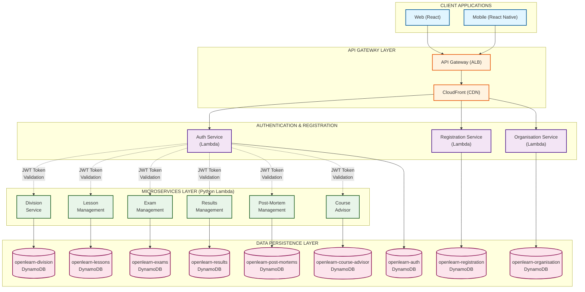

# OpenLearn Platform - High-Level Design

**Version**: 1.0.0
**Created**: 2025-12-21
**Status**: Draft
**Document Type**: High-Level Design (HLD)
**Application**: OpenLearn Platform
**Phase**: Phase 1 (Core LMS Implementation)

---

## Document Control

| Version | Date | Author | Changes |
|---------|------|--------|---------|
| 1.0 | 2025-12-21 | Agentic Architect | Initial version - 9 microservices, HATEOAS, single-table DynamoDB |

---

## Table of Contents

1. [Executive Summary](#1-executive-summary)
2. [Application Overview](#2-application-overview)
3. [Component Diagram](#3-component-diagram)
4. [Screens](#4-screens)
5. [Microservices](#5-microservices)
6. [API Endpoints](#6-api-endpoints)
7. [Authentication](#7-authentication)
8. [DynamoDB Schema](#8-dynamodb-schema)
9. [Infrastructure](#9-infrastructure)
10. [Repositories](#10-repositories)
11. [Business Approval Requirements](#11-business-approval-requirements)
12. [Implementation Plan](#12-implementation-plan)
13. [LLDs Reference](#13-llds-reference)
14. [Appendices](#14-appendices)

---

## 1. Executive Summary

### 1.1 Purpose

OpenLearn Platform is a modern, cloud-native Learning Management System (LMS) designed to provide scalable, multi-tenant educational services including lesson management, examinations, performance tracking, and intelligent course recommendations. Built on AWS serverless architecture, the platform delivers high availability, automatic scaling, and cost-effective operations.

### 1.2 Business Value

- **Scalability**: Serverless architecture automatically scales from 10 to 10,000+ concurrent users
- **Multi-Tenancy**: Organisation and division hierarchy supports multiple institutions on a single platform
- **Cost Efficiency**: Pay-per-use Lambda and DynamoDB pricing eliminates idle infrastructure costs
- **Rapid Development**: Microservices architecture enables parallel development by independent teams
- **Data-Driven Insights**: Course Advisor service provides personalized learning path recommendations
- **Exam Analytics**: Post-mortem analysis identifies knowledge gaps and curriculum improvements

### 1.3 Key Decisions

| Decision | Choice | Rationale |
|----------|--------|-----------|
| Architecture | Microservices (bounded contexts) | Independent scaling, deployment, team ownership |
| Backend | Lambda (Python 3.12) | Serverless, cost-effective, auto-scaling, no server management |
| Frontend | React SPA | Modern component-based UI, rich user experience, reusable components |
| Mobile | React Native | Code sharing with web, native performance, single codebase |
| Database | DynamoDB (single table per service) | NoSQL serverless, bounded context isolation, high performance |
| API Design | HATEOAS REST | Discoverability, loose coupling, hypermedia-driven navigation |
| Infrastructure | Per-component Terraform | Infrastructure as code, independent deployments, version control |
| Development | UI-first + API mocks | Early stakeholder validation, parallel frontend/backend development |
| Data Deletion | Soft delete (active=false) | Audit trail, data recovery, compliance, historical analysis |
| API Pattern | No DELETE operations | All state changes via PUT with status updates |

---

## 2. Application Overview

### 2.1 Application Definition

| Attribute | Value |
|-----------|-------|
| **HLD File** | `OpenLearn_Platform_HLD.md` |
| **HLD Prefix** | `openlearn` |
| **URL (PROD)** | `https://openlearn.io` |
| **URL (SIT)** | `https://sit.openlearn.io` |
| **URL (DEV)** | `https://dev.openlearn.io` |
| **API Base (PROD)** | `https://api.openlearn.io` |
| **API Base (SIT)** | `https://sit.api.openlearn.io` |
| **API Base (DEV)** | `https://dev.api.openlearn.io` |
| **Authentication** | JWT (Auth Service) with RBAC |
| **Target Users** | Students, Instructors, Administrators, Super Admins |
| **Priority** | Phase 1 (P0 - Core LMS Functionality) |

### 2.2 Scope

**In Scope:**
- User authentication and session management (JWT-based)
- Student registration and onboarding workflows
- Multi-tenant organization and division management
- Lesson content creation, scheduling, and delivery
- Exam creation, administration, and scheduling
- Results management with grading and certificates
- Post-mortem exam analysis and improvement tracking
- AI-powered course recommendations and learning paths
- Mobile application for iOS and Android

**Out of Scope (Future Phases):**
- Payment processing and subscription management
- Video conferencing integration (Zoom, Teams)
- Third-party LMS integrations (Canvas, Blackboard)
- Mobile offline mode
- Blockchain-based credential verification
- Advanced analytics and business intelligence dashboards

---

## 3. Component Diagram

### 3.1 High-Level Architecture



### 3.2 Architecture Description

**Client Layer**: Web and mobile applications provide user interfaces for students, instructors, and administrators.

**API Gateway Layer**: CloudFront CDN provides global content delivery and routes requests to API Gateway (ALB) for backend processing.

**Authentication & Registration Layer**: Dedicated services handle user authentication (JWT), new user registration, and organization management.

**Microservices Layer**: Six core services manage divisions, lessons, exams, results, post-mortem analysis, and course recommendations. All services validate JWT tokens via the Auth service.

**Data Persistence Layer**: Each microservice has its own single-table DynamoDB database, following the bounded context pattern for data isolation.

---

## 4. Screens

### 4.1 Screen Summary (25+ Total)

| Category | Screens | Count |
|----------|---------|-------|
| Authentication | Login, Registration, Password Reset, Profile | 4 |
| Dashboard | Student Dashboard, Instructor Dashboard, Admin Dashboard | 3 |
| Lessons | Lesson Library, Lesson Details, Lesson Materials, Lesson Schedule | 4 |
| Exams | Exam List, Exam Details, Exam Taking, Exam Review | 4 |
| Results | Results Dashboard, Grade Details, Certificates, Transcripts | 4 |
| Administration | Organisation Management, Division Management, User Management | 3 |
| Course Advisor | Recommendations, Learning Paths, Progress Tracking | 3 |
| **Total** | | **25** |

### 4.2 Screen List

#### Authentication Screens (4)

| # | Screen ID | Screen Name | Description |
|---|-----------|-------------|-------------|
| 1 | OL-AUTH-001 | Login | User authentication with email/password or SSO |
| 2 | OL-AUTH-002 | Registration | New user signup with email verification |
| 3 | OL-AUTH-003 | Password Reset | Password recovery flow with email link |
| 4 | OL-AUTH-004 | User Profile | View and edit user profile information |

#### Dashboard Screens (3)

| # | Screen ID | Screen Name | Description |
|---|-----------|-------------|-------------|
| 5 | OL-DASH-001 | Student Dashboard | Enrolled lessons, upcoming exams, recent grades |
| 6 | OL-DASH-002 | Instructor Dashboard | Class management, grading queue, student analytics |
| 7 | OL-DASH-003 | Admin Dashboard | Platform metrics, user stats, system health |

#### Lesson Screens (4)

| # | Screen ID | Screen Name | Description |
|---|-----------|-------------|-------------|
| 8 | OL-LESSON-001 | Lesson Library | Browse and search available lessons |
| 9 | OL-LESSON-002 | Lesson Details | Lesson description, syllabus, enrollment |
| 10 | OL-LESSON-003 | Lesson Materials | Access lecture notes, videos, assignments |
| 11 | OL-LESSON-004 | Lesson Schedule | View class schedule, due dates, events |

#### Exam Screens (4)

| # | Screen ID | Screen Name | Description |
|---|-----------|-------------|-------------|
| 12 | OL-EXAM-001 | Exam List | Upcoming and past exams |
| 13 | OL-EXAM-002 | Exam Details | Exam info, format, preparation resources |
| 14 | OL-EXAM-003 | Exam Taking | Online exam interface with timer |
| 15 | OL-EXAM-004 | Exam Review | Review answers and feedback after submission |

#### Results Screens (4)

| # | Screen ID | Screen Name | Description |
|---|-----------|-------------|-------------|
| 16 | OL-RESULTS-001 | Results Dashboard | Overall academic performance overview |
| 17 | OL-RESULTS-002 | Grade Details | Detailed breakdown of grades by lesson |
| 18 | OL-RESULTS-003 | Certificates | View and download earned certificates |
| 19 | OL-RESULTS-004 | Transcripts | Official academic transcripts |

#### Administration Screens (3)

| # | Screen ID | Screen Name | Description |
|---|-----------|-------------|-------------|
| 20 | OL-ADMIN-001 | Organisation Management | Create/edit organizations |
| 21 | OL-ADMIN-002 | Division Management | Manage departments, teams, groups |
| 22 | OL-ADMIN-003 | User Management | Assign roles, permissions, user accounts |

#### Course Advisor Screens (3)

| # | Screen ID | Screen Name | Description |
|---|-----------|-------------|-------------|
| 23 | OL-ADVISOR-001 | Recommendations | AI-powered course recommendations |
| 24 | OL-ADVISOR-002 | Learning Paths | Curated learning paths by skill/career |
| 25 | OL-ADVISOR-003 | Progress Tracking | Track progress along learning paths |

---

## 5. Microservices

### 5.1 Service Overview (9 Total)

| # | Service | Repository | API Prefix | Functions | Description |
|---|---------|------------|------------|-----------|-------------|
| 1 | Auth | `openlearn_auth_lambda` | `/v1.0/auth` | 8 | User authentication, JWT token management, session control |
| 2 | Registration | `openlearn_registration_lambda` | `/v1.0/registration` | 6 | New user registration, email verification, onboarding |
| 3 | Organisation | `openlearn_organisation_lambda` | `/v1.0/organisations` | 7 | Multi-tenant organization management, settings |
| 4 | Division | `openlearn_division_lambda` | `/v1.0/divisions` | 8 | Organizational divisions (departments, teams), membership |
| 5 | Lesson Management | `openlearn_lesson_management_lambda` | `/v1.0/lessons` | 15 | Lesson content, materials, scheduling, enrollment |
| 6 | Exam Management | `openlearn_exam_management_lambda` | `/v1.0/exams` | 15 | Exam creation, questions, scheduling, administration |
| 7 | Post-Mortem Management | `openlearn_post_mortem_management_lambda` | `/v1.0/post-mortems` | 10 | Exam analysis, feedback, improvement actions |
| 8 | Results Management | `openlearn_results_management_lambda` | `/v1.0/results` | 12 | Grading, transcripts, certificates, GPA calculation |
| 9 | Course Advisor | `openlearn_course_advisor_lambda` | `/v1.0/course-advisor` | 10 | AI recommendations, learning paths, skill tracking |

**Total Lambda Functions**: ~91

### 5.2 Lambda Function Count

| Service | Functions | Total |
|---------|-----------|-------|
| Auth | login, logout, refresh-token, validate-token, create-user, get-user, update-user, list-users | 8 |
| Registration | create-application, get-application, update-application, submit-application, verify-email, list-applications | 6 |
| Organisation | create-org, get-org, update-org, list-orgs, soft-delete-org, get-settings, update-settings | 7 |
| Division | create-division, get-division, update-division, list-divisions, soft-delete-division, add-member, remove-member, list-members | 8 |
| Lesson Management | create-lesson, get-lesson, update-lesson, list-lessons, soft-delete-lesson, add-material, list-materials, create-schedule, list-schedules, enroll-student, list-enrollments, unenroll-student, get-attendance, update-attendance, get-lesson-analytics | 15 |
| Exam Management | create-exam, get-exam, update-exam, list-exams, soft-delete-exam, add-question, list-questions, create-schedule, list-schedules, start-exam, submit-exam, get-submission, list-submissions, get-exam-analytics, publish-exam | 15 |
| Post-Mortem | create-analysis, get-analysis, update-analysis, list-analyses, soft-delete-analysis, create-feedback, list-feedback, create-action, update-action-status, list-actions | 10 |
| Results | create-result, get-result, update-result, list-results, soft-delete-result, calculate-gpa, get-transcript, generate-certificate, list-certificates, get-grade-distribution, get-student-summary, publish-results | 12 |
| Course Advisor | get-recommendations, create-path, get-path, update-path, list-paths, soft-delete-path, enroll-path, get-path-progress, update-skill, list-skills | 10 |
| **Total** | | **91** |

### 5.3 Lambda Configuration

| Setting | Value |
|---------|-------|
| Runtime | Python 3.12 |
| Memory | 256MB (standard), 512MB (AI/analytics functions) |
| Timeout | 30s (standard), 60s (long-running operations) |
| Architecture | arm64 (Graviton2 for cost savings) |
| Concurrency | Reserved 100 (PROD), 20 (SIT), 10 (DEV) |

### 5.4 Service Details

#### 5.4.1 Auth Service
**Purpose**: Centralized authentication and authorization

**Entities**: User, Session, Permission

**Key Operations**:
- JWT token generation and validation
- Session management (login, logout, refresh)
- User CRUD operations
- Role-based access control (RBAC)
- Password hashing and verification

**Security**: Passwords hashed with bcrypt, JWT tokens with 1-hour expiry, refresh tokens with 30-day expiry

#### 5.4.2 Registration Service
**Purpose**: New user onboarding and verification

**Entities**: Application, Profile

**Key Operations**:
- Student/instructor registration
- Email verification workflow
- Profile creation and validation
- Application status tracking
- Background check integration (for instructors)

#### 5.4.3 Organisation Service
**Purpose**: Multi-tenant organization management

**Entities**: Organisation, Settings

**Key Operations**:
- Create and manage organizations (schools, universities, companies)
- Organization-level settings and branding
- Subscription and billing information
- Organization hierarchy management
- Active/inactive organization control

#### 5.4.4 Division Service
**Purpose**: Organizational structure within organizations

**Entities**: Division, Member

**Key Operations**:
- Create divisions (departments, teams, classes)
- Division membership management
- Role assignment within divisions
- Division hierarchy (parent/child divisions)
- Access control by division

#### 5.4.5 Lesson Management Service
**Purpose**: Course content and delivery

**Entities**: Lesson, Material, Schedule, Enrollment, Attendance

**Key Operations**:
- Lesson content creation and versioning
- Learning material upload (videos, PDFs, slides)
- Class scheduling and calendar management
- Student enrollment and waitlists
- Attendance tracking
- Lesson analytics (completion rates, engagement)

#### 5.4.6 Exam Management Service
**Purpose**: Assessment creation and administration

**Entities**: Exam, Question, Schedule, Submission

**Key Operations**:
- Exam creation with question banks
- Multiple question types (MCQ, essay, coding)
- Exam scheduling with time limits
- Online proctoring integration
- Automated grading for MCQs
- Manual grading workflow for essays
- Exam analytics (average scores, difficulty analysis)

#### 5.4.7 Post-Mortem Management Service
**Purpose**: Exam analysis and continuous improvement

**Entities**: Analysis, Feedback, Action

**Key Operations**:
- Exam performance analysis
- Question difficulty and discrimination analysis
- Student feedback collection
- Knowledge gap identification
- Curriculum improvement recommendations
- Action item tracking for instructors

#### 5.4.8 Results Management Service
**Purpose**: Grading and academic records

**Entities**: Result, Grade, Certificate, Transcript

**Key Operations**:
- Grade calculation and GPA computation
- Weighted grading schemes
- Transcript generation
- Certificate issuance
- Honor roll and dean's list tracking
- Grade distribution analytics
- Results publication workflow

#### 5.4.9 Course Advisor Service
**Purpose**: AI-powered learning recommendations

**Entities**: Recommendation, Path, Skill

**Key Operations**:
- Course recommendations based on performance
- Learning path curation (beginner to advanced)
- Skill gap analysis
- Career path mapping
- Progress tracking along paths
- Prerequisite validation
- Adaptive learning suggestions

---

## 6. API Endpoints

### 6.1 API Structure

**Base URL (PROD)**: `https://api.openlearn.io`
**Base URL (SIT)**: `https://sit.api.openlearn.io`
**Base URL (DEV)**: `https://dev.api.openlearn.io`

> **Note**: API version (`/v1.0`) is included in each endpoint path, not the base URL.

**Authentication**: All endpoints (except login and registration) require JWT token in Authorization header:
```
Authorization: Bearer <jwt_token>
```

### 6.2 Auth Service Endpoints

#### 6.2.1 POST `/v1.0/auth/login` - User Login

**Request Body:**
```json
{
  "email": "student@openlearn.io",
  "password": "SecurePassword123!"
}
```

**Success Response (200 OK):**
```json
{
  "accessToken": "eyJhbGciOiJIUzI1NiIsInR5cCI6IkpXVCJ9...",
  "refreshToken": "eyJhbGciOiJIUzI1NiIsInR5cCI6IkpXVCJ9...",
  "expiresIn": 3600,
  "user": {
    "id": "user-123",
    "email": "student@openlearn.io",
    "firstName": "John",
    "lastName": "Doe",
    "role": "STUDENT",
    "organisationId": "org-456",
    "divisionIds": ["div-789"],
    "_links": {
      "self": "/v1.0/auth/users/user-123",
      "profile": "/v1.0/registration/profiles/user-123",
      "organisation": "/v1.0/organisations/org-456"
    }
  }
}
```

#### 6.2.2 POST `/v1.0/auth/logout` - User Logout

**Request Headers:**
```json
{
  "Authorization": "Bearer <token>"
}
```

**Success Response (200 OK):**
```json
{
  "message": "Logout successful",
  "sessionId": "session-123"
}
```

#### 6.2.3 POST `/v1.0/auth/refresh` - Refresh Access Token

**Request Body:**
```json
{
  "refreshToken": "eyJhbGciOiJIUzI1NiIsInR5cCI6IkpXVCJ9..."
}
```

**Success Response (200 OK):**
```json
{
  "accessToken": "eyJhbGciOiJIUzI1NiIsInR5cCI6IkpXVCJ9...",
  "expiresIn": 3600
}
```

### 6.3 HATEOAS Operations: Lesson

| Method | Endpoint | Description |
|--------|----------|-------------|
| POST | `/v1.0/lessons` | Create a new lesson |
| GET | `/v1.0/lessons/{id}` | Get lesson details |
| GET | `/v1.0/lessons` | List all lessons (active only by default, use `?include_inactive=true` for all) |
| PUT | `/v1.0/lessons/{id}` | Update lesson details |
| PUT | `/v1.0/lessons/{id}` | Soft delete lesson (set active=false) |
| POST | `/v1.0/lessons/{id}/materials` | Add material to lesson |
| GET | `/v1.0/lessons/{id}/materials` | List lesson materials |
| POST | `/v1.0/lessons/{id}/schedules` | Create lesson schedule |
| GET | `/v1.0/lessons/{id}/schedules` | List lesson schedules |
| POST | `/v1.0/lessons/{id}/enrollments` | Enroll student in lesson |
| GET | `/v1.0/lessons/{id}/enrollments` | List enrolled students |

#### 6.3.1 POST `/v1.0/lessons` - Create Lesson

**Request Headers:**
```json
{
  "Content-Type": "application/json",
  "Authorization": "Bearer <token>"
}
```

**Request Body:**
```json
{
  "title": "Introduction to Python Programming",
  "description": "Learn Python basics including syntax, data types, and control structures",
  "instructorId": "user-instructor-123",
  "organisationId": "org-456",
  "divisionId": "div-789",
  "credits": 3,
  "maxEnrollment": 30,
  "syllabus": "Week 1: Variables and Data Types\nWeek 2: Control Structures\n...",
  "prerequisites": ["lesson-101"],
  "metadata": {
    "difficulty": "beginner",
    "language": "en",
    "estimatedHours": 40
  }
}
```

**Success Response (201 Created):**
```json
{
  "id": "lesson-550e8400",
  "title": "Introduction to Python Programming",
  "description": "Learn Python basics including syntax, data types, and control structures",
  "instructorId": "user-instructor-123",
  "organisationId": "org-456",
  "divisionId": "div-789",
  "credits": 3,
  "maxEnrollment": 30,
  "currentEnrollment": 0,
  "status": "DRAFT",
  "syllabus": "Week 1: Variables and Data Types\nWeek 2: Control Structures\n...",
  "prerequisites": ["lesson-101"],
  "dateCreated": "2025-12-21T10:30:00Z",
  "dateLastUpdated": "2025-12-21T10:30:00Z",
  "lastUpdatedBy": "user-instructor-123",
  "active": true,
  "metadata": {
    "difficulty": "beginner",
    "language": "en",
    "estimatedHours": 40
  },
  "_links": {
    "self": "/v1.0/lessons/lesson-550e8400",
    "materials": "/v1.0/lessons/lesson-550e8400/materials",
    "schedules": "/v1.0/lessons/lesson-550e8400/schedules",
    "enrollments": "/v1.0/lessons/lesson-550e8400/enrollments",
    "instructor": "/v1.0/auth/users/user-instructor-123",
    "organisation": "/v1.0/organisations/org-456",
    "division": "/v1.0/divisions/div-789"
  }
}
```

#### 6.3.2 GET `/v1.0/lessons/{id}` - Get Lesson

**Request Headers:**
```json
{
  "Authorization": "Bearer <token>"
}
```

**Success Response (200 OK):**
```json
{
  "id": "lesson-550e8400",
  "title": "Introduction to Python Programming",
  "description": "Learn Python basics including syntax, data types, and control structures",
  "instructorId": "user-instructor-123",
  "organisationId": "org-456",
  "divisionId": "div-789",
  "credits": 3,
  "maxEnrollment": 30,
  "currentEnrollment": 15,
  "status": "PUBLISHED",
  "syllabus": "Week 1: Variables and Data Types\nWeek 2: Control Structures\n...",
  "prerequisites": ["lesson-101"],
  "dateCreated": "2025-12-21T10:30:00Z",
  "dateLastUpdated": "2025-12-21T14:00:00Z",
  "lastUpdatedBy": "user-instructor-123",
  "active": true,
  "metadata": {
    "difficulty": "beginner",
    "language": "en",
    "estimatedHours": 40,
    "completionRate": 0.65
  },
  "_links": {
    "self": "/v1.0/lessons/lesson-550e8400",
    "materials": "/v1.0/lessons/lesson-550e8400/materials",
    "schedules": "/v1.0/lessons/lesson-550e8400/schedules",
    "enrollments": "/v1.0/lessons/lesson-550e8400/enrollments",
    "instructor": "/v1.0/auth/users/user-instructor-123",
    "organisation": "/v1.0/organisations/org-456",
    "division": "/v1.0/divisions/div-789"
  }
}
```

### 6.4 HATEOAS Operations: Exam

| Method | Endpoint | Description |
|--------|----------|-------------|
| POST | `/v1.0/exams` | Create a new exam |
| GET | `/v1.0/exams/{id}` | Get exam details |
| GET | `/v1.0/exams` | List all exams |
| PUT | `/v1.0/exams/{id}` | Update exam details |
| PUT | `/v1.0/exams/{id}` | Soft delete exam |
| POST | `/v1.0/exams/{id}/questions` | Add question to exam |
| GET | `/v1.0/exams/{id}/questions` | List exam questions |
| POST | `/v1.0/exams/{id}/start` | Start exam session for student |
| POST | `/v1.0/exams/{id}/submit` | Submit exam answers |

### 6.5 HATEOAS Operations: Results

| Method | Endpoint | Description |
|--------|----------|-------------|
| POST | `/v1.0/results` | Create result record |
| GET | `/v1.0/results/{id}` | Get result details |
| GET | `/v1.0/results` | List results |
| PUT | `/v1.0/results/{id}` | Update result |
| GET | `/v1.0/results/student/{studentId}/transcript` | Get student transcript |
| POST | `/v1.0/results/{id}/certificate` | Generate certificate |
| GET | `/v1.0/results/student/{studentId}/gpa` | Calculate student GPA |

### 6.6 HATEOAS Operations: Course Advisor

| Method | Endpoint | Description |
|--------|----------|-------------|
| GET | `/v1.0/course-advisor/recommendations` | Get personalized course recommendations |
| POST | `/v1.0/course-advisor/paths` | Create learning path |
| GET | `/v1.0/course-advisor/paths/{id}` | Get learning path details |
| POST | `/v1.0/course-advisor/paths/{id}/enroll` | Enroll in learning path |
| GET | `/v1.0/course-advisor/paths/{id}/progress` | Get progress on learning path |

---

## 7. Authentication

### 7.1 Authentication Method

**JWT-based Authentication with Refresh Tokens**

OpenLearn Platform uses JSON Web Tokens (JWT) for stateless authentication. The Auth Service issues signed JWT tokens containing user identity and permissions.

**Authentication Types:**
- **Access Token (JWT)**: Short-lived (1 hour), contains user claims (id, email, role, organisationId, divisionIds)
- **Refresh Token**: Long-lived (30 days), used to obtain new access tokens without re-authentication
- **API Key**: For service-to-service communication (AI/analytics services)

**Token Structure:**
```json
{
  "header": {
    "alg": "HS256",
    "typ": "JWT"
  },
  "payload": {
    "sub": "user-123",
    "email": "student@openlearn.io",
    "role": "STUDENT",
    "organisationId": "org-456",
    "divisionIds": ["div-789"],
    "iat": 1640000000,
    "exp": 1640003600
  },
  "signature": "..."
}
```

### 7.2 User Roles

| Role | Description | Permissions |
|------|-------------|-------------|
| **STUDENT** | Enrolled learner | View lessons, take exams, view results |
| **INSTRUCTOR** | Course teacher | Create lessons, grade exams, view analytics |
| **ADMIN** | Organisation administrator | Manage users, divisions, settings |
| **SUPER_ADMIN** | Platform administrator | Full access across all organizations |

### 7.3 Protected Endpoints

| Endpoint Pattern | Auth Required | Roles |
|-----------------|---------------|-------|
| `/v1.0/auth/login` | No | - |
| `/v1.0/auth/logout` | Yes | All |
| `/v1.0/registration/*` | No (for creation), Yes (for updates) | - |
| `/v1.0/organisations/*` | Yes | ADMIN, SUPER_ADMIN |
| `/v1.0/divisions/*` | Yes | ADMIN, SUPER_ADMIN |
| `/v1.0/lessons/*` | Yes | STUDENT (read), INSTRUCTOR (write) |
| `/v1.0/exams/*` | Yes | STUDENT (take), INSTRUCTOR (create/grade) |
| `/v1.0/results/*` | Yes | STUDENT (own results), INSTRUCTOR (all) |
| `/v1.0/post-mortems/*` | Yes | INSTRUCTOR, ADMIN |
| `/v1.0/course-advisor/*` | Yes | STUDENT, INSTRUCTOR |

### 7.4 Authorization Flow

```
1. User submits credentials → POST /v1.0/auth/login
2. Auth Service validates credentials
3. Auth Service generates JWT access token + refresh token
4. Client stores tokens (localStorage for web, secure storage for mobile)
5. Client includes access token in Authorization header for API requests
6. Each microservice validates JWT signature and checks permissions
7. If token expired, client uses refresh token → POST /v1.0/auth/refresh
8. On logout, client discards tokens → POST /v1.0/auth/logout
```

---

## 8. DynamoDB Schema

### 8.1 Core Entity Rules

| Entity | Tenant Association | Rule |
|--------|-------------------|------|
| User | Required (organisationId) | Users belong to one organization |
| Lesson | Required (organisationId, divisionId) | Lessons scoped to division |
| Exam | Required (organisationId, divisionId) | Exams scoped to division |
| Result | Required (organisationId, studentId) | Results linked to student |
| Organisation | None | Top-level tenant entity |
| Division | Required (organisationId) | Divisions belong to organization |

### 8.2 Table List (9 Tables)

| # | Table Name | Environment Example | Entities | Purpose |
|---|------------|---------------------|----------|---------|
| 1 | `openlearn-auth-{env}` | `openlearn-auth-prod` | User, Session, Permission | Authentication and authorization |
| 2 | `openlearn-registration-{env}` | `openlearn-registration-sit` | Application, Profile | New user onboarding |
| 3 | `openlearn-organisation-{env}` | `openlearn-organisation-dev` | Organisation, Settings | Multi-tenant management |
| 4 | `openlearn-division-{env}` | `openlearn-division-prod` | Division, Member | Organizational structure |
| 5 | `openlearn-lessons-{env}` | `openlearn-lessons-prod` | Lesson, Material, Schedule, Enrollment | Course content |
| 6 | `openlearn-exams-{env}` | `openlearn-exams-prod` | Exam, Question, Schedule, Submission | Assessments |
| 7 | `openlearn-results-{env}` | `openlearn-results-prod` | Result, Grade, Certificate | Grading and records |
| 8 | `openlearn-post-mortems-{env}` | `openlearn-post-mortems-prod` | Analysis, Feedback, Action | Exam improvement |
| 9 | `openlearn-course-advisor-{env}` | `openlearn-course-advisor-prod` | Recommendation, Path, Skill | AI recommendations |

### 8.3 Single Table Design Pattern

> **Soft Delete Pattern**: All entities have an `active` boolean field (default=true). To delete, set `active=false`. Queries filter by `active=true` by default.

### 8.4 Entities and Keys

#### 8.4.1 Auth Service - `openlearn-auth-{env}`

| Entity | PK | SK | Attributes |
|--------|----|----|------------|
| User | `USER#{userId}` | `METADATA` | id, email, passwordHash, firstName, lastName, role, organisationId, divisionIds, dateCreated, dateLastUpdated, lastUpdatedBy, active |
| Session | `SESSION#{sessionId}` | `METADATA` | id, userId, accessToken, refreshToken, expiresAt, dateCreated, active |
| Permission | `USER#{userId}` | `PERM#{permissionId}` | permissionId, resource, action, granted |

**GSIs:**
- `EmailIndex`: PK=email, SK=METADATA (for login by email)
- `ActiveIndex`: PK=active, SK=dateCreated (filter active users)

#### 8.4.2 Registration Service - `openlearn-registration-{env}`

| Entity | PK | SK | Attributes |
|--------|----|----|------------|
| Application | `APP#{applicationId}` | `METADATA` | id, email, firstName, lastName, status (PENDING, VERIFIED, APPROVED, REJECTED), applicationType (STUDENT, INSTRUCTOR), organisationId, dateCreated, dateLastUpdated, lastUpdatedBy, active |
| Profile | `PROFILE#{userId}` | `METADATA` | userId, bio, avatar, phoneNumber, address, educationHistory, dateCreated, dateLastUpdated, lastUpdatedBy, active |

**GSIs:**
- `StatusIndex`: PK=status, SK=dateCreated (filter by application status)
- `EmailIndex`: PK=email, SK=METADATA (lookup by email)

#### 8.4.3 Organisation Service - `openlearn-organisation-{env}`

| Entity | PK | SK | Attributes |
|--------|----|----|------------|
| Organisation | `ORG#{orgId}` | `METADATA` | id, name, description, type (SCHOOL, UNIVERSITY, COMPANY), contactEmail, logoUrl, subscriptionTier, dateCreated, dateLastUpdated, lastUpdatedBy, active |
| Settings | `ORG#{orgId}` | `SETTING#{key}` | orgId, key, value, dataType, dateLastUpdated |

**GSIs:**
- `ActiveIndex`: PK=active, SK=dateCreated (active organizations)
- `TypeIndex`: PK=type, SK=name (filter by organization type)

#### 8.4.4 Division Service - `openlearn-division-{env}`

| Entity | PK | SK | Attributes |
|--------|----|----|------------|
| Division | `DIV#{divisionId}` | `METADATA` | id, name, description, organisationId, parentDivisionId, type (DEPARTMENT, TEAM, CLASS), dateCreated, dateLastUpdated, lastUpdatedBy, active |
| Member | `DIV#{divisionId}` | `MEMBER#{userId}` | divisionId, userId, role, joinedDate, active |

**GSIs:**
- `OrgIndex`: PK=organisationId, SK=name (divisions by organization)
- `UserIndex`: PK=userId, SK=divisionId (user's divisions)

#### 8.4.5 Lesson Management Service - `openlearn-lessons-{env}`

| Entity | PK | SK | Attributes |
|--------|----|----|------------|
| Lesson | `LESSON#{lessonId}` | `METADATA` | id, title, description, instructorId, organisationId, divisionId, credits, maxEnrollment, currentEnrollment, status (DRAFT, PUBLISHED, ARCHIVED), syllabus, prerequisites, dateCreated, dateLastUpdated, lastUpdatedBy, active |
| Material | `LESSON#{lessonId}` | `MATERIAL#{materialId}` | lessonId, materialId, title, type (VIDEO, PDF, SLIDES, LINK), url, size, dateCreated, active |
| Schedule | `LESSON#{lessonId}` | `SCHEDULE#{date}` | lessonId, date, startTime, endTime, location, meetingUrl, dateCreated |
| Enrollment | `LESSON#{lessonId}` | `STUDENT#{studentId}` | lessonId, studentId, enrolledDate, status (ENROLLED, COMPLETED, WITHDRAWN), completionPercentage, active |

**GSIs:**
- `InstructorIndex`: PK=instructorId, SK=dateCreated (lessons by instructor)
- `OrgIndex`: PK=organisationId, SK=title (lessons by organization)
- `StudentIndex`: PK=studentId, SK=lessonId (student enrollments)
- `StatusIndex`: PK=status, SK=dateCreated (published lessons)

#### 8.4.6 Exam Management Service - `openlearn-exams-{env}`

| Entity | PK | SK | Attributes |
|--------|----|----|------------|
| Exam | `EXAM#{examId}` | `METADATA` | id, title, description, lessonId, instructorId, organisationId, divisionId, totalPoints, passingScore, duration, status (DRAFT, SCHEDULED, PUBLISHED, GRADED), dateCreated, dateLastUpdated, lastUpdatedBy, active |
| Question | `EXAM#{examId}` | `QUESTION#{questionId}` | examId, questionId, questionText, questionType (MCQ, ESSAY, CODING), options, correctAnswer, points, dateCreated, active |
| Schedule | `EXAM#{examId}` | `SCHEDULE#{scheduleId}` | examId, scheduleId, startTime, endTime, location, dateCreated |
| Submission | `EXAM#{examId}` | `STUDENT#{studentId}` | examId, studentId, answers, submittedAt, score, graded, gradedBy, feedback, active |

**GSIs:**
- `LessonIndex`: PK=lessonId, SK=dateCreated (exams for lesson)
- `StudentIndex`: PK=studentId, SK=examId (student submissions)
- `StatusIndex`: PK=status, SK=dateCreated (published exams)

#### 8.4.7 Post-Mortem Service - `openlearn-post-mortems-{env}`

| Entity | PK | SK | Attributes |
|--------|----|----|------------|
| Analysis | `ANALYSIS#{analysisId}` | `METADATA` | id, examId, averageScore, medianScore, passRate, questionAnalysis, dateCreated, dateLastUpdated, lastUpdatedBy, active |
| Feedback | `ANALYSIS#{analysisId}` | `FEEDBACK#{feedbackId}` | analysisId, feedbackId, studentId, rating, comments, dateCreated, active |
| Action | `ANALYSIS#{analysisId}` | `ACTION#{actionId}` | analysisId, actionId, actionType, description, assignedTo, status (PENDING, IN_PROGRESS, COMPLETED), dateCreated, dateCompleted, active |

**GSIs:**
- `ExamIndex`: PK=examId, SK=dateCreated (analyses for exam)
- `ActionStatusIndex`: PK=status, SK=dateCreated (pending actions)

#### 8.4.8 Results Service - `openlearn-results-{env}`

| Entity | PK | SK | Attributes |
|--------|----|----|------------|
| Result | `RESULT#{resultId}` | `METADATA` | id, studentId, lessonId, examId, score, grade, gpa, dateCreated, dateLastUpdated, lastUpdatedBy, active |
| Grade | `STUDENT#{studentId}` | `LESSON#{lessonId}` | studentId, lessonId, letterGrade, numericGrade, comments, dateIssued, active |
| Certificate | `STUDENT#{studentId}` | `CERT#{certificateId}` | studentId, certificateId, lessonId, issuedDate, certificateUrl, verificationCode, active |

**GSIs:**
- `StudentIndex`: PK=studentId, SK=dateCreated (student results)
- `LessonIndex`: PK=lessonId, SK=score (results for lesson)
- `GradeIndex`: PK=grade, SK=dateCreated (students by grade)

#### 8.4.9 Course Advisor Service - `openlearn-course-advisor-{env}`

| Entity | PK | SK | Attributes |
|--------|----|----|------------|
| Recommendation | `STUDENT#{studentId}` | `REC#{recommendationId}` | studentId, recommendationId, lessonId, reason, confidence, dateCreated, active |
| Path | `PATH#{pathId}` | `METADATA` | id, title, description, difficulty, estimatedHours, lessonIds (ordered), dateCreated, dateLastUpdated, lastUpdatedBy, active |
| Skill | `STUDENT#{studentId}` | `SKILL#{skillName}` | studentId, skillName, level, dateAcquired, dateLastUpdated |

**GSIs:**
- `PathIndex`: PK=difficulty, SK=dateCreated (paths by difficulty)
- `StudentPathIndex`: PK=studentId, SK=pathId (student path enrollments)

### 8.5 Activatable Entity Pattern

**All entities** include these standard fields:

| Attribute | Type | Required | Description |
|-----------|------|----------|-------------|
| id | String | Yes | Unique entity identifier (UUID v4) |
| dateCreated | String | Yes | Creation timestamp (ISO 8601: YYYY-MM-DDTHH:mm:ssZ) |
| dateLastUpdated | String | Yes | Last update timestamp (ISO 8601) |
| lastUpdatedBy | String | Yes | Email or ID of user who last updated the entity |
| active | Boolean | Yes | Active status (default=true, false=soft deleted) |

**Query Pattern**: All list queries include `active=true` filter by default. Use `?include_inactive=true` parameter to include soft-deleted records.

---

## 9. Infrastructure

### 9.1 Per-Component Architecture

Each microservice manages its own infrastructure using Terraform:

```
openlearn_{service}_lambda/
├── src/
│   ├── handlers/          # Lambda function handlers
│   ├── services/          # Business logic
│   ├── models/            # Data models (Pydantic)
│   ├── repositories/      # DynamoDB access layer
│   └── utils/             # Shared utilities
├── tests/
│   ├── unit/              # Unit tests (pytest)
│   └── integration/       # Integration tests
├── terraform/
│   ├── main.tf            # Main infrastructure
│   ├── api_gateway.tf     # API Gateway REST API
│   ├── lambda.tf          # Lambda functions
│   ├── dynamodb.tf        # DynamoDB table + GSIs
│   ├── iam.tf             # IAM roles and policies
│   ├── cloudwatch.tf      # Logs and alarms
│   ├── variables.tf       # Input variables
│   └── outputs.tf         # Output values
├── requirements.txt       # Python dependencies
├── pytest.ini            # Pytest configuration
└── README.md             # Service documentation
```

### 9.2 AWS Services (Per Component)

| Service | Purpose | Configuration |
|---------|---------|---------------|
| Lambda | Python 3.12 function handlers | 256MB RAM, 30s timeout, arm64 |
| API Gateway | REST API endpoints | Regional, JWT authorizer |
| DynamoDB | Single table per service | On-demand, point-in-time recovery |
| CloudWatch Logs | Lambda execution logs | 7-day retention (DEV), 30-day (PROD) |
| CloudWatch Alarms | Error rate, duration monitoring | SNS alerts for critical errors |
| S3 | Lambda deployment packages, static assets | Versioning enabled, encrypted |
| IAM | Service roles and policies | Least privilege principle |
| Secrets Manager | Database credentials, API keys | Auto-rotation for sensitive secrets |

### 9.3 Deployment Strategy

- **Per-component Terraform**: Each service has `/terraform` folder with full infrastructure
- **Environment Isolation**: DEV, SIT, PROD using Terraform workspaces
- **Blue-Green Deployment**: Lambda aliases for zero-downtime updates
- **API Gateway Stages**: dev, sit, prod stages with separate CloudWatch logs
- **DynamoDB Backups**: Point-in-time recovery (35 days), on-demand backups before deployments
- **CI/CD Pipeline**: GitHub Actions → pytest → terraform plan → approval → terraform apply

### 9.4 Monitoring and Observability

#### CloudWatch Dashboards (Per Service)
- Lambda invocations, errors, duration
- DynamoDB read/write capacity, throttles
- API Gateway requests, latency, 4xx/5xx errors

#### CloudWatch Alarms
- Lambda error rate >5% → SNS alert
- Lambda duration >25s (approaching 30s timeout) → SNS alert
- DynamoDB throttled requests >10 → SNS alert
- API Gateway 5xx errors >1% → SNS alert

#### X-Ray Tracing
- End-to-end request tracing across microservices
- Performance bottleneck identification
- Dependency mapping

---

## 10. Repositories

### 10.1 Repository List (14 Total)

| # | Repository | Type | Description |
|---|------------|------|-------------|
| 1 | `openlearn_web` | Frontend | React SPA (student/instructor/admin portal) |
| 2 | `openlearn_mobile` | Mobile | React Native mobile app (iOS + Android) |
| 3 | `openlearn_auth_lambda` | Backend | Authentication and authorization service |
| 4 | `openlearn_registration_lambda` | Backend | User registration and onboarding service |
| 5 | `openlearn_organisation_lambda` | Backend | Multi-tenant organization management |
| 6 | `openlearn_division_lambda` | Backend | Organizational division management |
| 7 | `openlearn_lesson_management_lambda` | Backend | Lesson content and scheduling service |
| 8 | `openlearn_exam_management_lambda` | Backend | Exam creation and administration service |
| 9 | `openlearn_post_mortem_management_lambda` | Backend | Exam analysis and improvement service |
| 10 | `openlearn_results_management_lambda` | Backend | Grading and academic records service |
| 11 | `openlearn_course_advisor_lambda` | Backend | AI-powered recommendation service |
| 12 | `openlearn_docs` | Documentation | HLDs, LLDs, API docs, user guides, runbooks |
| 13 | `openlearn_operations` | Operations | CloudWatch dashboards, alarms, budgets, Config rules |
| 14 | `openlearn_agents` | Automation | AI agents for operations, testing, monitoring |

### 10.2 Repository Naming Convention

```
openlearn_web                               # Frontend web application
openlearn_mobile                            # Mobile application
openlearn_{service}_lambda                  # Backend microservices
openlearn_docs                              # Documentation repository
openlearn_operations                        # Operations and monitoring
openlearn_agents                            # AI automation agents
```

**Rules:**
- Prefix: `openlearn_` (project identifier)
- Backend services end with `_lambda`
- Each repo contains its own `/terraform` folder
- Underscores separate components (no hyphens in repo names)

### 10.3 Frontend Repository Structure

```
openlearn_web/
├── src/
│   ├── components/        # Reusable React components
│   ├── pages/             # Screen-level components
│   ├── services/          # API client services
│   ├── hooks/             # Custom React hooks
│   ├── context/           # React Context for state
│   ├── utils/             # Utility functions
│   └── App.tsx            # Main application component
├── public/
│   ├── index.html
│   └── assets/
├── terraform/
│   ├── s3.tf              # S3 bucket for static hosting
│   ├── cloudfront.tf      # CloudFront distribution
│   ├── route53.tf         # DNS records
│   └── variables.tf
├── package.json
├── tsconfig.json
└── README.md
```

### 10.4 Backend Repository Structure

```
openlearn_{service}_lambda/
├── src/
│   ├── handlers/
│   │   ├── create_{entity}.py
│   │   ├── get_{entity}.py
│   │   ├── update_{entity}.py
│   │   ├── list_{entities}.py
│   │   └── soft_delete_{entity}.py
│   ├── services/
│   │   └── {entity}_service.py
│   ├── models/
│   │   └── {entity}.py
│   ├── repositories/
│   │   └── dynamodb_repository.py
│   └── utils/
│       ├── auth.py
│       ├── validation.py
│       └── response.py
├── tests/
│   ├── unit/
│   │   └── test_{entity}_service.py
│   └── integration/
│       └── test_{entity}_api.py
├── terraform/
│   ├── main.tf
│   ├── api_gateway.tf
│   ├── lambda.tf
│   ├── dynamodb.tf
│   ├── iam.tf
│   ├── cloudwatch.tf
│   ├── variables.tf
│   └── outputs.tf
├── requirements.txt
├── pytest.ini
├── .env.example
└── README.md
```

### 10.5 Operations Repository

The `openlearn_operations` repository contains all operational configurations:

```
openlearn_operations/
├── cloudwatch/
│   ├── dashboards/
│   │   ├── auth_service_dashboard.json
│   │   ├── lesson_service_dashboard.json
│   │   └── platform_overview_dashboard.json
│   └── alarms/
│       ├── lambda_error_alarms.json
│       ├── dynamodb_throttle_alarms.json
│       └── api_gateway_alarms.json
├── budgets/
│   ├── dev_monthly_budget.json
│   ├── sit_monthly_budget.json
│   └── prod_monthly_budget.json
├── config_rules/
│   ├── s3_encryption_rule.json
│   ├── lambda_timeout_rule.json
│   └── dynamodb_pitr_rule.json
├── waf/
│   └── api_gateway_waf.json
├── sns_topics/
│   ├── critical_alerts.json
│   └── cost_alerts.json
├── runbooks/
│   ├── deployment_runbook.md
│   ├── incident_response.md
│   └── disaster_recovery.md
└── README.md
```

---

## 11. Business Approval Requirements

### 11.1 Artefacts Requiring Business Approval

The following artefacts **MUST** have Business Owner (BO) approval before deployment:

| Category | Artefacts | Approval Required |
|----------|-----------|-------------------|
| **UI/UX** | All screens, layouts, components, branding, color scheme | BO Sign-off |
| **Email Templates** | Welcome emails, password reset, exam notifications, certificates | BO Sign-off |
| **Customer Messaging** | Error messages, success messages, in-app notifications, tooltips | BO Sign-off |
| **Content** | Landing page copy, feature descriptions, help documentation | BO Sign-off |
| **Legal Content** | Terms of Service, Privacy Policy, Cookie Policy, FERPA compliance | BO + Legal Sign-off |
| **Certificates** | Certificate templates, branding, wording | BO Sign-off |
| **Exam Policies** | Proctoring rules, academic integrity policy, grading scales | BO + Academic Sign-off |

### 11.2 Business Approval Process

```
┌─────────────────────────────────────────────────────────────────┐
│              BUSINESS APPROVAL PROCESS                           │
├─────────────────────────────────────────────────────────────────┤
│                                                                 │
│  1. DEVELOPMENT                                                 │
│     └── Dev team completes artefact in DEV environment         │
│                                                                 │
│  2. DEV REVIEW                                                  │
│     ├── Technical review (code quality, security, tests)       │
│     └── Dev team self-QA                                       │
│                                                                 │
│  3. SIT DEPLOYMENT                                              │
│     └── Deploy to SIT for business review                      │
│                                                                 │
│  4. BUSINESS OWNER REVIEW                                       │
│     ├── BO reviews UI/messaging/content in SIT                 │
│     ├── BO provides feedback via documented channels           │
│     ├── Dev team iterates based on feedback                    │
│     └── Iterate until BO sign-off obtained (Jira/email)        │
│                                                                 │
│  5. QA TESTING (SIT)                                            │
│     ├── Functional testing                                     │
│     ├── Integration testing                                    │
│     └── UAT (User Acceptance Testing)                          │
│                                                                 │
│  6. PRODUCTION DEPLOYMENT                                       │
│     └── Only after documented BO + QA sign-off                 │
│                                                                 │
└─────────────────────────────────────────────────────────────────┘
```

---

## 12. Implementation Plan

### 12.1 UI-First Development Approach

```
┌─────────────────────────────────────────────────────────────────┐
│               UI-FIRST IMPLEMENTATION FLOW                       │
├─────────────────────────────────────────────────────────────────┤
│                                                                 │
│  Phase 1: UI SCREENS (Weeks 1-3)                                │
│  ├── Build all 25+ screens in React                            │
│  ├── Use mock data (static JSON files)                         │
│  ├── Component library setup (Material-UI or Ant Design)       │
│  ├── Responsive design (mobile, tablet, desktop)               │
│  └── Accessibility (WCAG 2.1 AA compliance)                    │
│                                                                 │
│  Phase 2: API MOCKS (Week 4)                                    │
│  ├── MSW (Mock Service Worker) setup for API mocking           │
│  ├── Mock all 91 endpoints with realistic responses            │
│  ├── Simulated loading states and errors                       │
│  └── Local development environment ready                       │
│                                                                 │
│  Phase 3: PLAYBACK & BO APPROVAL (Week 5)                       │
│  ├── Demo to Product Owner and stakeholders                    │
│  ├── User flow walkthroughs (student, instructor, admin)       │
│  ├── Gather feedback and iterate on UI/UX                      │
│  └── Obtain documented BO sign-off                             │
│                                                                 │
│  Phase 4: BACKEND IMPLEMENTATION (Weeks 6-12)                   │
│  ├── DynamoDB tables and GSIs (Terraform)                      │
│  ├── Lambda functions (Python 3.12) with unit tests            │
│  ├── API Gateway configuration (JWT authorizers)               │
│  ├── Per-component Terraform for all 9 services                │
│  └── CloudWatch monitoring and alarms                          │
│                                                                 │
│  Phase 5: INTEGRATION (Weeks 13-14)                             │
│  ├── Connect frontend to real APIs (replace MSW)               │
│  ├── E2E testing (Cypress or Playwright)                       │
│  ├── Integration testing across services                       │
│  ├── Performance testing (load, stress)                        │
│  └── Security testing (OWASP Top 10)                           │
│                                                                 │
│  Phase 6: UAT & PRODUCTION (Weeks 15-16)                        │
│  ├── User Acceptance Testing in SIT                            │
│  ├── Final BO approval for production deployment               │
│  ├── Production deployment (blue-green)                        │
│  └── Post-launch monitoring and support                        │
│                                                                 │
└─────────────────────────────────────────────────────────────────┘
```

### 12.2 Milestones (with Business Owner Gates)

> **IMPORTANT**: Each milestone requires **Business Owner (BO) Review** before proceeding to the next milestone. No milestone is considered complete without documented BO sign-off in Jira or email.

| # | Milestone | Deliverables | Tech Review | BO Review | Timeline |
|---|-----------|--------------|-------------|-----------|----------|
| 0.1 | UI Screens | 25+ React screens with mock data, component library | Dev Review | **BO Sign-off Required** | Week 3 |
| 0.2 | API Mocks | MSW handlers for all 91 endpoints, local dev setup | Dev Review | **BO Sign-off Required** | Week 4 |
| 0.3 | Playback | Demo walkthrough, user flows, feedback collection | PO Review | **BO Approval Required** | Week 5 |
| 0.4 | DynamoDB Schemas | 9 DynamoDB tables with GSIs, Terraform scripts | Dev Review | **BO Sign-off Required** | Week 6 |
| 0.5 | Auth + Registration | Auth + Registration Lambda services + Terraform | Dev Review | **BO Sign-off Required** | Week 7 |
| 0.6 | Organisation + Division | Org + Division Lambda services + Terraform | Dev Review | **BO Sign-off Required** | Week 8 |
| 0.7 | Lesson Management | Lesson Management Lambda service + Terraform | Dev Review | **BO Sign-off Required** | Week 9 |
| 0.8 | Exam Management | Exam Management Lambda service + Terraform | Dev Review | **BO Sign-off Required** | Week 10 |
| 0.9 | Results + Post-Mortem | Results + Post-Mortem Lambda services + Terraform | Dev Review | **BO Sign-off Required** | Week 11 |
| 0.10 | Course Advisor | Course Advisor Lambda service + Terraform | Dev Review | **BO Sign-off Required** | Week 12 |
| 0.11 | Integration | Frontend + Backend connected, E2E tests | QA Review | **BO Sign-off Required** | Week 14 |
| 0.12 | UAT | User Acceptance Testing in SIT environment | QA Approval | **BO Final Approval** | Week 15 |
| 0.13 | Production | Live deployment to production, monitoring active | Tech Lead | **BO Go-Live Approval** | Week 16 |

---

## 13. LLDs Reference

### 13.1 Parent HLD Information

| Attribute | Value |
|-----------|-------|
| HLD Document | `OpenLearn_Platform_HLD.md` |
| HLD Version | v1.0.0 |
| HLD Prefix | `openlearn` |
| Total LLDs | 11 technical + 4 operational |

### 13.2 Technical LLDs (11 Documents)

Following the naming convention: `openlearn.[LLD_Number]_LLD_[Name].md`

> **Repository Naming Convention:** All repositories follow the pattern `openlearn_{service}` where the HLD prefix is used consistently.

| LLD ID | LLD Name | Description | Repository | Status |
|--------|----------|-------------|------------|--------|
| openlearn.1 | `openlearn.1_LLD_Frontend_Architecture.md` | React SPA architecture, routing, state management, API client | `openlearn_web` | Draft |
| openlearn.2 | `openlearn.2_LLD_Mobile_Architecture.md` | React Native architecture, navigation, offline support | `openlearn_mobile` | Draft |
| openlearn.3 | `openlearn.3_LLD_Auth_Service.md` | Authentication service design, JWT implementation, RBAC | `openlearn_auth_lambda` | Draft |
| openlearn.4 | `openlearn.4_LLD_Registration_Service.md` | User registration and onboarding workflows | `openlearn_registration_lambda` | Draft |
| openlearn.5 | `openlearn.5_LLD_Organisation_Service.md` | Multi-tenant organization management | `openlearn_organisation_lambda` | Draft |
| openlearn.6 | `openlearn.6_LLD_Division_Service.md` | Division hierarchy and membership management | `openlearn_division_lambda` | Draft |
| openlearn.7 | `openlearn.7_LLD_Lesson_Management_Service.md` | Lesson content, materials, scheduling, enrollment | `openlearn_lesson_management_lambda` | Draft |
| openlearn.8 | `openlearn.8_LLD_Exam_Management_Service.md` | Exam creation, question banks, online proctoring | `openlearn_exam_management_lambda` | Draft |
| openlearn.9 | `openlearn.9_LLD_Post_Mortem_Service.md` | Exam analytics and continuous improvement | `openlearn_post_mortem_management_lambda` | Draft |
| openlearn.10 | `openlearn.10_LLD_Results_Service.md` | Grading, GPA calculation, certificate generation | `openlearn_results_management_lambda` | Draft |
| openlearn.11 | `openlearn.11_LLD_Course_Advisor_Service.md` | AI recommendation engine, learning path algorithm | `openlearn_course_advisor_lambda` | Draft |

### 13.3 Operational Runbooks (4 Documents)

Following the naming convention: `openlearn.[Number]_OPS_[Name].md`

| OPS ID | Runbook Name | Description | Status |
|--------|--------------|-------------|--------|
| openlearn.X | `openlearn.X_OPS_Deployment_Runbook.md` | Per-component deployment procedures, rollback steps | Draft |
| openlearn.Y | `openlearn.Y_OPS_Monitoring_Runbook.md` | CloudWatch dashboards, alarms, X-Ray tracing setup | Draft |
| openlearn.Z | `openlearn.Z_OPS_Incident_Response.md` | Incident escalation, on-call procedures, postmortem template | Draft |
| openlearn.W | `openlearn.W_OPS_Disaster_Recovery.md` | DynamoDB backup/restore, multi-region failover, RTO/RPO | Draft |

---

## 14. Appendices

### Appendix A: User Stories

| Story ID | User Story | Priority |
|----------|------------|----------|
| US-OL-001 | As a **student**, I want to browse available lessons so that I can find courses relevant to my learning goals | P0 |
| US-OL-002 | As a **student**, I want to enroll in a lesson so that I can access course materials and participate in class | P0 |
| US-OL-003 | As a **student**, I want to take online exams so that I can demonstrate my knowledge and earn grades | P0 |
| US-OL-004 | As a **student**, I want to view my grades and transcripts so that I can track my academic progress | P0 |
| US-OL-005 | As a **student**, I want to receive course recommendations so that I can discover new learning opportunities | P1 |
| US-OL-006 | As an **instructor**, I want to create lessons with materials so that students can access course content | P0 |
| US-OL-007 | As an **instructor**, I want to create and schedule exams so that I can assess student learning | P0 |
| US-OL-008 | As an **instructor**, I want to grade exams and provide feedback so that students can improve | P0 |
| US-OL-009 | As an **instructor**, I want to view exam analytics so that I can identify areas for curriculum improvement | P1 |
| US-OL-010 | As an **admin**, I want to manage organizations and divisions so that I can structure my institution | P0 |
| US-OL-011 | As an **admin**, I want to assign roles to users so that I can control access to platform features | P0 |
| US-OL-012 | As a **super admin**, I want to monitor platform health so that I can ensure system reliability | P0 |

### Appendix B: Screen-to-Service Matrix

| Screen | Auth | Reg | Org | Div | Lesson | Exam | Results | Post-Mortem | Advisor |
|--------|------|-----|-----|-----|--------|------|---------|-------------|---------|
| OL-AUTH-001 Login | ✓ | - | - | - | - | - | - | - | - |
| OL-AUTH-002 Registration | ✓ | ✓ | - | - | - | - | - | - | - |
| OL-DASH-001 Student Dashboard | ✓ | - | - | - | ✓ | ✓ | ✓ | - | ✓ |
| OL-DASH-002 Instructor Dashboard | ✓ | - | - | - | ✓ | ✓ | ✓ | ✓ | - |
| OL-LESSON-001 Lesson Library | ✓ | - | ✓ | ✓ | ✓ | - | - | - | - |
| OL-LESSON-002 Lesson Details | ✓ | - | - | - | ✓ | - | - | - | - |
| OL-EXAM-001 Exam List | ✓ | - | - | - | ✓ | ✓ | - | - | - |
| OL-EXAM-003 Exam Taking | ✓ | - | - | - | - | ✓ | - | - | - |
| OL-RESULTS-001 Results Dashboard | ✓ | - | - | - | - | - | ✓ | - | - |
| OL-ADMIN-001 Organisation Management | ✓ | - | ✓ | - | - | - | - | - | - |
| OL-ADMIN-002 Division Management | ✓ | - | ✓ | ✓ | - | - | - | - | - |
| OL-ADVISOR-001 Recommendations | ✓ | - | - | - | ✓ | - | ✓ | - | ✓ |

### Appendix C: HATEOAS Relationship Map

```
Organisation
  └── Division (1:many)
       ├── User (many:many via membership)
       └── Lesson (1:many)
            ├── Material (1:many)
            ├── Schedule (1:many)
            ├── Enrollment (many:many with Student)
            └── Exam (1:many)
                 ├── Question (1:many)
                 ├── Schedule (1:many)
                 ├── Submission (many:1 with Student)
                 │    └── Result (1:1)
                 │         └── Grade (1:1)
                 └── Post-Mortem (1:1)
                      ├── Analysis (1:1)
                      ├── Feedback (1:many)
                      └── Action (1:many)

Student
  ├── Enrollment (1:many with Lesson)
  ├── Submission (1:many with Exam)
  ├── Result (1:many)
  ├── Certificate (1:many)
  ├── Recommendation (1:many from Course Advisor)
  └── Path Enrollment (many:many with Learning Path)
```

### Appendix D: DynamoDB Capacity Planning

| Table | Environment | Estimated Items | Estimated Size | Backup Strategy |
|-------|-------------|-----------------|----------------|-----------------|
| openlearn-auth-prod | PROD | 100,000 users | 50 MB | Point-in-time recovery (35 days) |
| openlearn-lessons-prod | PROD | 10,000 lessons | 200 MB | Daily on-demand backups |
| openlearn-exams-prod | PROD | 50,000 exams | 500 MB | Daily on-demand backups |
| openlearn-results-prod | PROD | 500,000 results | 1 GB | Daily on-demand backups, cross-region replication |

---

## Related Documents

- [OpenLearn Platform Implementation Plan](/.claude/plans/iterative-plotting-quiche.md)
- [Teacher Agent Specification](/Users/tebogotseka/Documents/agentic_work/2_bbws_agents/schools_agents/teacher_agent/teacher_agent_spec.md)
- [Coding Instructor Agent](/Users/tebogotseka/Documents/agentic_work/2_bbws_agents/schools_agents/coding_instructor/coding_instructor.md)

---

**End of Document**

---

**Document Status**: Draft v1.0.0
**Next Review Date**: 2026-01-21
**Maintained By**: OpenLearn Platform Architecture Team
**Contact**: architecture@openlearn.io
