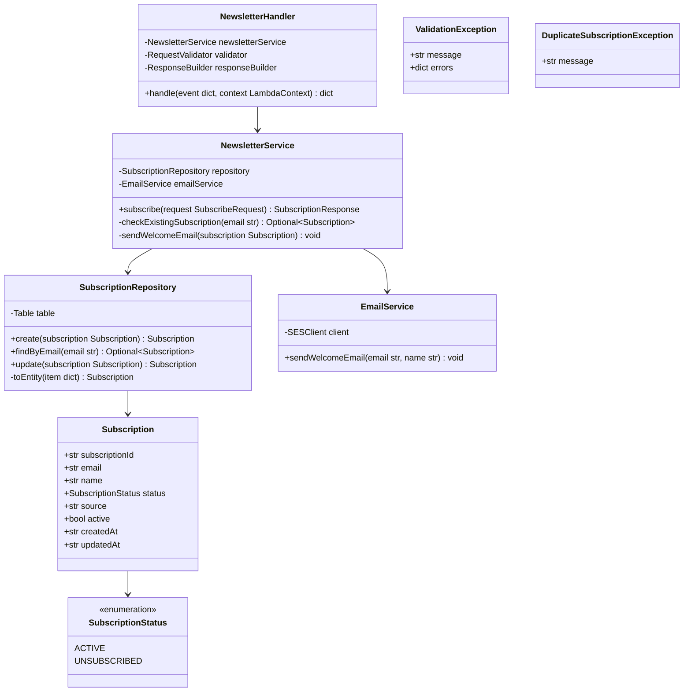
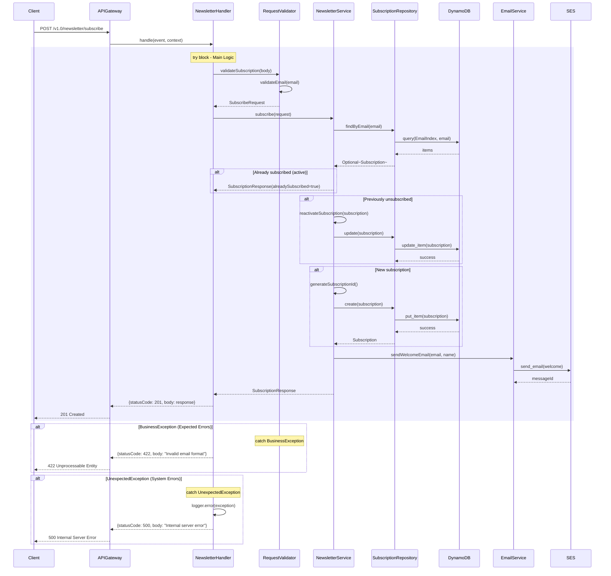

# CPP Newsletter Lambda - Low-Level Design

**Version**: 1.0
**Created**: 2025-12-15
**Status**: Draft
**Component**: Newsletter Service (2_bbws_newsletter_lambda)
**Parent BRS**: [BRS 2.1.10: Newsletter Management](../BRS/2.1.10_BRS_Newsletter_Management.md)
**Parent HLD**: [HLD 2.1.10: Newsletter Management](../HLDs/2.1.10_HLD_Newsletter_Management.md)

---

## Document Control

| Version | Date | Author | Changes |
|---------|------|--------|---------|
| 1.0 | 2025-12-15 | Agentic Architect | Initial version |

---

## 1. Introduction

### 1.1 Purpose

This LLD provides implementation-level details for the Newsletter Lambda service, which handles newsletter subscription management for the Customer Portal Public application.

### 1.2 Component Overview

| Attribute | Value |
|-----------|-------|
| Repository | `2_bbws_newsletter_lambda` |
| Runtime | Python 3.12 |
| Memory | 256MB |
| Timeout | 30s |
| Architecture | arm64 |

### 1.3 Lambda Functions (1 Total)

| Function | Endpoint | Description |
|----------|----------|-------------|
| subscribe | POST /v1.0/newsletter/subscribe | Subscribe to newsletter |

---

## 2. High Level Epic Overview

| User Story # | Epic | User Story | Test Scenario(s) |
|--------------|------|------------|------------------|
| US-NWS-001 | Newsletter | As a visitor, I want to subscribe to newsletter | Given valid email, then subscription created |
| US-NWS-002 | Newsletter | As a visitor, I see duplicate message | Given existing email, then "already subscribed" returned |
| US-NWS-003 | Newsletter | As a visitor, I receive confirmation email | Given subscription, then welcome email sent |
| US-NWS-004 | Newsletter | As a visitor, I see validation errors | Given invalid email, then 422 returned |

---

## 3. Component Diagram



---

## 4. Sequence Diagrams

### 4.1 Subscribe Flow



---

## 5. Data Models

### 5.1 DynamoDB Schema

#### Subscription Entity

| Attribute | Type | Description |
|-----------|------|-------------|
| PK | String | `SUBSCRIPTION#{subscriptionId}` |
| SK | String | `METADATA` |
| subscriptionId | String | UUID |
| email | String | Subscriber email |
| name | String | Subscriber name (optional) |
| status | String | ACTIVE, UNSUBSCRIBED |
| source | String | Subscription source (e.g., footer, popup) |
| active | Boolean | Soft delete flag |
| createdAt | String | ISO 8601 timestamp |
| updatedAt | String | ISO 8601 timestamp |

#### GSI: EmailIndex

| Attribute | Type |
|-----------|------|
| PK (email) | String |
| SK (status) | String |

### 5.2 Pydantic Models

```python
from pydantic import BaseModel, EmailStr, Field
from enum import Enum
from typing import Optional
from datetime import datetime

class SubscriptionStatus(str, Enum):
    ACTIVE = "ACTIVE"
    UNSUBSCRIBED = "UNSUBSCRIBED"

class SubscriptionSource(str, Enum):
    FOOTER = "footer"
    POPUP = "popup"
    CHECKOUT = "checkout"
    LANDING_PAGE = "landing_page"

class Subscription(BaseModel):
    subscription_id: str = Field(..., alias="subscriptionId")
    email: EmailStr
    name: Optional[str] = Field(None, max_length=100)
    status: SubscriptionStatus
    source: SubscriptionSource
    active: bool = True
    created_at: datetime = Field(..., alias="createdAt")
    updated_at: datetime = Field(..., alias="updatedAt")

class SubscribeRequest(BaseModel):
    email: EmailStr
    name: Optional[str] = Field(None, max_length=100)
    source: SubscriptionSource = SubscriptionSource.FOOTER

class SubscriptionResponse(BaseModel):
    subscription_id: str = Field(..., alias="subscriptionId")
    email: EmailStr
    status: SubscriptionStatus
    already_subscribed: bool = Field(False, alias="alreadySubscribed")
    message: str
```

---

## 6. Messaging and Notifications

### 6.1 Email Templates

| Template | Recipient | Trigger |
|----------|-----------|---------|
| newsletter_welcome | Subscriber | New subscription |
| newsletter_reactivated | Subscriber | Resubscription |

### 6.2 Email Content

| Template | Subject | Content |
|----------|---------|---------|
| newsletter_welcome | Welcome to Big Beard News | Welcome message, what to expect |
| newsletter_reactivated | Welcome Back! | Reactivation confirmation |

---

## 7. NFRs

| Metric | Target |
|--------|--------|
| Subscribe latency (p95) | < 500ms |
| Cold start | < 500ms |
| Email delivery | < 5 minutes |

---

## 8. Risks and Mitigations

| Risk | Impact | Mitigation |
|------|--------|------------|
| Spam subscriptions | Medium | Rate limiting, CAPTCHA (future) |
| Email delivery failure | Low | Retry with exponential backoff |
| Bot attacks | Medium | Honeypot field, rate limiting |

---

## 9. Tagging

| Tag | Value |
|-----|-------|
| Project | BBWS |
| Component | NewsletterLambda |
| CostCenter | BBWS-CPP |

---

## 10. Troubleshooting Playbook

| Issue | Resolution |
|-------|------------|
| Subscription not created | Check DynamoDB logs, verify email format |
| Welcome email not received | Check SES logs, verify email in SES sandbox |
| Duplicate subscriptions | Check EmailIndex GSI for existing records |

---

## 11. Security

- Public endpoint (no authentication)
- Rate limiting: 3 subscriptions per IP per minute
- Input sanitization for email validation
- GDPR compliant (unsubscribe capability future)
- No sensitive data stored

---

## 12. Signoff

| Role | Name | Date | Signature |
|------|------|------|-----------|
| Technical Lead | | | |
| Business Owner | | | |

---

## 13. TBC

| # | Item | Status |
|---|------|--------|
| TBC-001 | Unsubscribe functionality | Open |
| TBC-002 | Double opt-in | Open |
| TBC-003 | CAPTCHA integration | Open |
| TBC-004 | Preference center | Open |

---

## 14. Definition of Terms

| Term | Definition |
|------|------------|
| Newsletter | Periodic email updates to subscribers |
| Double Opt-in | Email verification before confirming subscription |
| GDPR | General Data Protection Regulation |

---

## 15. Appendices

### 15.1 Project Structure

```
2_bbws_newsletter_lambda/
├── src/
│   ├── handlers/
│   │   └── subscribe.py
│   ├── services/
│   │   ├── newsletter_service.py
│   │   └── email_service.py
│   ├── repositories/
│   │   └── subscription_repository.py
│   └── models/
│       └── subscription.py
├── tests/
├── terraform/
└── requirements.txt
```

### 15.2 Rate Limiting Configuration

| Limit | Value |
|-------|-------|
| Per IP per minute | 3 requests |
| Per email per day | 1 request |
| Burst limit | 5 requests |

---

## 16. References

- [Parent HLD: BBWS Customer Portal Public](../BBWS_Customer_Portal_Public_HLD.md)

---

**End of Document**
