# Domain Lambda - Low-Level Design

**Version**: 1.0
**Created**: 2026-01-08
**Last Updated**: 2026-01-08
**Status**: Draft
**Component**: Domain Service (2_1_11_bbws_domain_lambda)
**Parent BRS**: [BRS 2.1: Customer Portal Public](../BRS/2.1_BRS_Customer_Portal_Public.md) - Epic 6
**Parent HLD**: [HLD 2.1.11: Domain Search & Management](../HLDs/2.1.11_HLD_Domain_Search.md)

---

## Document Control

| Version | Date | Author | Changes |
|---------|------|--------|---------|
| 1.0 | 2026-01-08 | Agentic Architect | Initial version - Complete CRUD with TLD-based registrar router, Route 53 + COZA integration, stateless orchestrator pattern |

---

## 1. Introduction

### 1.1 Purpose

This LLD provides implementation-level details for the Domain Lambda service, which handles domain search, registration, and transfer operations for the BBWS Customer Portal. The service acts as a **stateless orchestrator** that routes domain operations to the appropriate registrar (Route 53 or COZA) based on TLD and integrates with the Order Service for payment processing.

### 1.2 Component Overview

| Attribute | Value |
|-----------|-------|
| Repository | `2_1_11_bbws_domain_lambda` |
| Runtime | Python 3.12 |
| Memory | 512MB |
| Timeout | 30s (search), 60s (registration/transfer) |
| Architecture | arm64 |
| Design Pattern | Stateless Orchestrator + Strategy Pattern (TLD Router) |

### 1.3 Key Architectural Decisions

| Decision | Rationale |
|----------|-----------|
| **Stateless Architecture** | No DynamoDB - domain state lives in Route 53/COZA registries |
| **TLD-Based Router** | Route 53 and COZA have different APIs - router dispatches based on TLD |
| **Strategy Pattern** | `RegistrarServiceInterface` enables adding new TLDs without changing handlers |
| **SSM Pricing** | Business can update pricing without code deployment |
| **Order Service Integration** | Reuse existing payment/checkout flow |
| **Webhook-Driven** | Domain registration triggered by payment confirmation |

### 1.4 Lambda Functions

#### 1.4.1 Lambda Functions (8 Total - 6 API Handlers + 2 Webhooks)

| Function | Endpoint | Trigger | Timeout | Description |
|----------|----------|---------|---------|-------------|
| search_domains | POST /v1.0/domains/search | API Gateway | 30s | Search multiple domains across TLDs |
| check_availability | GET /v1.0/domains/{domain}/availability | API Gateway | 30s | Check single domain availability |
| get_domain_status | GET /v1.0/domains/{domain}/status | API Gateway | 30s | Get domain status from registrar |
| get_pricing | GET /v1.0/domains/pricing | API Gateway | 10s | Retrieve pricing from SSM |
| register_domain | POST /v1.0/domains/register | API Gateway | 30s | Create order for domain purchase |
| transfer_domain | POST /v1.0/domains/transfer | API Gateway | 30s | Create order for domain transfer |
| order_paid_webhook | POST /v1.0/webhooks/order-paid | API Gateway | 60s | Process payment confirmation and register domain |
| transfer_paid_webhook | POST /v1.0/webhooks/transfer-paid | API Gateway | 60s | Process payment confirmation and initiate transfer |

#### 1.4.2 Architecture Pattern

The Domain Service uses a **stateless orchestration pattern**:

1. **Search/Pricing Operations**: Direct API calls to registrars and SSM (synchronous)
2. **Registration/Transfer Operations**: Create order via Order Service, then:
   - Customer redirected to payment gateway
   - Payment Service confirms payment to Order Service
   - Order Service calls webhook to trigger domain registration/transfer
3. **Webhook Processing**: Asynchronous domain registration/transfer via registrar APIs

**Benefits:**
- **No State Management**: Domain state lives in external registrars
- **Reuse Payment Flow**: Leverage existing Order Service + Payment Service
- **Scalability**: Stateless Lambdas scale independently
- **Reliability**: Webhook retries handle transient failures
- **Separation of Concerns**: Domain logic separate from payment logic

---

## 2. High Level Epic Overview

### 2.1 User Stories - Search & Pricing

| User Story # | Epic | User Story | Test Scenario(s) |
|--------------|------|------------|------------------|
| US-DOM-001 | Domain Search | As a visitor, I want to search for available domains across multiple TLDs | Given "myboutique" + [.co.za, .com, .net, .org], then availability + pricing returned for all TLDs |
| US-DOM-002 | Domain Search | As a visitor, I want to see domain suggestions when unavailable | Given unavailable domain, then alternative suggestions returned |
| US-DOM-003 | Domain Pricing | As a visitor, I want to see current domain pricing | Given request, then pricing for all supported TLDs returned from SSM |
| US-DOM-004 | Domain Availability | As a visitor, I want to check single domain availability | Given "myboutique.co.za", then availability status returned |

### 2.2 User Stories - Registration & Transfer

| User Story # | Epic | User Story | Test Scenario(s) |
|--------------|------|------------|------------------|
| US-DOM-005 | Domain Registration | As a customer, I want to register an available domain | Given available domain + registrant info, then order created and payment URL returned |
| US-DOM-006 | Domain Registration | As a customer, I receive confirmation after payment | Given payment confirmed, then domain registered and confirmation email sent |
| US-DOM-007 | Domain Transfer | As a customer, I want to transfer my existing domain | Given domain + auth code, then transferability checked and order created |
| US-DOM-008 | Domain Transfer | As a customer, I track transfer progress | Given transfer initiated, then status and estimated completion date returned |

### 2.3 User Stories - Error Handling

| User Story # | Epic | User Story | Test Scenario(s) |
|--------------|------|------------|------------------|
| US-DOM-009 | Error Handling | As a customer, I see clear error for unavailable domain | Given domain unavailable, then 400 with "Domain unavailable" message |
| US-DOM-010 | Error Handling | As a customer, I see clear error for invalid auth code | Given invalid auth code, then 400 with "Invalid authorization code" message |
| US-DOM-011 | Error Handling | As a customer, I see clear error for locked domain | Given locked domain, then 422 with unlock instructions |
| US-DOM-012 | Error Handling | As a system, I handle registrar API timeouts | Given registrar timeout, then retry 3x with exponential backoff |

---

## 3. Component Diagram (Class Diagram)

### 3.1 Complete Class Diagram

```mermaid
classDiagram
    %% API Handlers Layer
    class SearchDomainsHandler {
        -RegistrarRouter registrarRouter
        -PricingService pricingService
        -RequestValidator validator
        -ResponseBuilder responseBuilder
        +handle(event: dict, context: LambdaContext) dict
        -validateRequest(body: dict) DomainSearchRequest
        -searchDomains(request: DomainSearchRequest) List~DomainAvailability~
        -buildResponse(results: List) dict
    }

    class CheckAvailabilityHandler {
        -RegistrarRouter registrarRouter
        -PricingService pricingService
        -ResponseBuilder responseBuilder
        +handle(event: dict, context: LambdaContext) dict
        -extractDomain(event: dict) str
        -checkSingleDomain(domain: str) DomainAvailability
    }

    class RegisterDomainHandler {
        -RegistrarRouter registrarRouter
        -OrderServiceClient orderClient
        -RequestValidator validator
        +handle(event: dict, context: LambdaContext) dict
        -validateRequest(body: dict) DomainRegistrationRequest
        -checkAvailability(domain: str) bool
        -createOrder(request: DomainRegistrationRequest) dict
    }

    class TransferDomainHandler {
        -RegistrarRouter registrarRouter
        -OrderServiceClient orderClient
        -RequestValidator validator
        +handle(event: dict, context: LambdaContext) dict
        -validateRequest(body: dict) DomainTransferRequest
        -checkTransferability(domain: str, authCode: str) bool
        -createOrder(request: DomainTransferRequest) dict
    }

    class GetDomainStatusHandler {
        -RegistrarRouter registrarRouter
        -ResponseBuilder responseBuilder
        +handle(event: dict, context: LambdaContext) dict
        -extractDomain(event: dict) str
        -getStatus(domain: str) DomainStatus
    }

    class GetPricingHandler {
        -PricingService pricingService
        -ResponseBuilder responseBuilder
        +handle(event: dict, context: LambdaContext) dict
        -getAllPricing() List~TLDPricing~
    }

    class OrderPaidWebhookHandler {
        -RegistrarRouter registrarRouter
        -WebhookValidator webhookValidator
        -EmailService emailService
        +handle(event: dict, context: LambdaContext) dict
        -validateSignature(event: dict) bool
        -parseWebhookPayload(body: dict) OrderPaidEvent
        -registerDomain(event: OrderPaidEvent) RegistrationResult
        -sendConfirmation(result: RegistrationResult) None
    }

    class TransferPaidWebhookHandler {
        -RegistrarRouter registrarRouter
        -WebhookValidator webhookValidator
        -EmailService emailService
        +handle(event: dict, context: LambdaContext) dict
        -validateSignature(event: dict) bool
        -parseWebhookPayload(body: dict) TransferPaidEvent
        -initiateTransfer(event: TransferPaidEvent) TransferResult
        -sendConfirmation(result: TransferResult) None
    }

    %% Registrar Service Layer (CRITICAL - TLD Router)
    class RegistrarServiceInterface {
        <<interface>>
        +checkAvailability(domain: str) DomainAvailability
        +registerDomain(domain: str, registrant: RegistrantInfo, years: int) RegistrationResult
        +transferDomain(domain: str, authCode: str, registrant: RegistrantInfo) TransferResult
        +getDomainStatus(domain: str) DomainStatus
    }

    class RegistrarRouter {
        -Dict~str,RegistrarServiceInterface~ registrars
        -TLDExtractor tldExtractor
        +__init__()
        +getRegistrar(domain: str) RegistrarServiceInterface
        +checkAvailability(domain: str) DomainAvailability
        +registerDomain(domain: str, registrant: RegistrantInfo, years: int) RegistrationResult
        +transferDomain(domain: str, authCode: str, registrant: RegistrantInfo) TransferResult
        +getDomainStatus(domain: str) DomainStatus
        -routeToRegistrar(tld: str) RegistrarServiceInterface
    }

    class Route53Service {
        -boto3.client route53domains
        +checkAvailability(domain: str) DomainAvailability
        +registerDomain(domain: str, registrant: RegistrantInfo, years: int) RegistrationResult
        +transferDomain(domain: str, authCode: str, registrant: RegistrantInfo) TransferResult
        +getDomainStatus(domain: str) DomainStatus
        -normalizeError(error: Exception) DomainException
        -buildContactDetail(registrant: RegistrantInfo) dict
    }

    class CozaService {
        -str apiKey
        -str baseUrl
        -requests.Session session
        +checkAvailability(domain: str) DomainAvailability
        +registerDomain(domain: str, registrant: RegistrantInfo, years: int) RegistrationResult
        +transferDomain(domain: str, authCode: str, registrant: RegistrantInfo) TransferResult
        +getDomainStatus(domain: str) DomainStatus
        -makeRequest(method: str, endpoint: str, data: dict) dict
        -normalizeError(response: dict) DomainException
    }

    %% Client Services
    class OrderServiceClient {
        -str baseUrl
        -str apiKey
        -requests.Session session
        +createOrder(orderData: dict) dict
        +getOrder(orderId: str) dict
        +updateOrder(orderId: str, updateData: dict) dict
        -buildHeaders() dict
        -handleError(response: Response) None
    }

    class PricingService {
        -boto3.client ssm
        -int cacheTtl
        -Dict cache
        +getPricing(tld: str) TLDPricing
        +getAllPricing() List~TLDPricing~
        -fetchFromSSM(tld: str) dict
        -isCacheValid(tld: str) bool
    }

    class EmailService {
        -boto3.client ses
        -str fromEmail
        +sendRegistrationConfirmation(domain: str, email: str, details: dict) None
        +sendTransferConfirmation(domain: str, email: str, details: dict) None
        -buildEmailTemplate(templateName: str, data: dict) str
    }

    %% Request/Response Models
    class DomainSearchRequest {
        +str domainName
        +List~str~ tlds
        +validate() None
    }

    class DomainRegistrationRequest {
        +str domain
        +int registrationYears
        +RegistrantInfo registrantInfo
        +bool privacyProtection
        +bool autoRenew
        +validate() None
    }

    class DomainTransferRequest {
        +str domain
        +str authorizationCode
        +RegistrantInfo registrantInfo
        +validate() None
    }

    class RegistrantInfo {
        +str fullName
        +str organization
        +str email
        +str phone
        +Address address
        +validate() None
    }

    class Address {
        +str street
        +str city
        +str state
        +str postalCode
        +str country
        +validate() None
    }

    class DomainAvailability {
        +str domain
        +bool available
        +Decimal price
        +str currency
        +List~str~ suggestions
    }

    class RegistrationResult {
        +str domain
        +str status
        +str registrationId
        +datetime registeredAt
        +datetime expiresAt
    }

    class TransferResult {
        +str domain
        +str status
        +str transferId
        +datetime initiatedAt
        +datetime estimatedCompletionAt
    }

    class DomainStatus {
        +str domain
        +str status
        +datetime registeredAt
        +datetime expiresAt
        +bool autoRenew
        +List~str~ nameservers
    }

    class TLDPricing {
        +str tld
        +Decimal registrationPrice
        +Decimal renewalPrice
        +Decimal transferPrice
        +str currency
    }

    class OrderPaidEvent {
        +str orderId
        +str domain
        +Decimal paymentAmount
        +str paymentReference
        +RegistrantInfo registrantInfo
        +int registrationYears
        +bool privacyProtection
        +bool autoRenew
    }

    class TransferPaidEvent {
        +str orderId
        +str domain
        +str authorizationCode
        +Decimal paymentAmount
        +str paymentReference
        +RegistrantInfo registrantInfo
    }

    %% Utilities
    class WebhookValidator {
        -str secret
        +validateSignature(headers: dict, body: str) bool
        +validateTimestamp(timestamp: str) bool
        -computeHMAC(body: str) str
    }

    class ResponseBuilder {
        +success(data: dict, statusCode: int) dict
        +error(error: Exception) dict
        +created(data: dict) dict
        +notFound(message: str) dict
        -corsHeaders() dict
    }

    class TLDExtractor {
        +extractTLD(domain: str) str
        +isSupported(tld: str) bool
        +normalizeDomain(domain: str) str
    }

    %% Exception Hierarchy
    class DomainException {
        <<abstract>>
        +str message
        +int statusCode
    }

    class BusinessException {
        <<abstract>>
    }

    class UnexpectedException {
        <<abstract>>
    }

    class DomainUnavailableError {
        +str domain
    }

    class InvalidAuthorizationCodeError {
        +str domain
    }

    class DomainLockedError {
        +str domain
    }

    class UnsupportedTLDError {
        +str tld
    }

    class RegistrantValidationError {
        +List~str~ errors
    }

    class RegistrarTimeoutError {
        +str registrar
    }

    class Route53APIError {
        +str errorCode
    }

    class CozaAPIError {
        +int statusCode
        +str response
    }

    class OrderServiceError {
        +str errorCode
    }

    %% Relationships - Handlers
    SearchDomainsHandler --> RegistrarRouter
    SearchDomainsHandler --> PricingService
    CheckAvailabilityHandler --> RegistrarRouter
    CheckAvailabilityHandler --> PricingService
    RegisterDomainHandler --> RegistrarRouter
    RegisterDomainHandler --> OrderServiceClient
    TransferDomainHandler --> RegistrarRouter
    TransferDomainHandler --> OrderServiceClient
    GetDomainStatusHandler --> RegistrarRouter
    GetPricingHandler --> PricingService
    OrderPaidWebhookHandler --> RegistrarRouter
    OrderPaidWebhookHandler --> WebhookValidator
    OrderPaidWebhookHandler --> EmailService
    TransferPaidWebhookHandler --> RegistrarRouter
    TransferPaidWebhookHandler --> WebhookValidator
    TransferPaidWebhookHandler --> EmailService

    %% Relationships - Registrar Router (CRITICAL)
    RegistrarRouter --> RegistrarServiceInterface
    RegistrarRouter --> TLDExtractor
    Route53Service ..|> RegistrarServiceInterface
    CozaService ..|> RegistrarServiceInterface
    RegistrarRouter --> Route53Service
    RegistrarRouter --> CozaService

    %% Relationships - Models
    SearchDomainsHandler --> DomainSearchRequest
    RegisterDomainHandler --> DomainRegistrationRequest
    TransferDomainHandler --> DomainTransferRequest
    DomainRegistrationRequest --> RegistrantInfo
    DomainTransferRequest --> RegistrantInfo
    RegistrantInfo --> Address
    RegistrarRouter --> DomainAvailability
    RegistrarRouter --> RegistrationResult
    RegistrarRouter --> TransferResult
    RegistrarRouter --> DomainStatus
    PricingService --> TLDPricing
    OrderPaidWebhookHandler --> OrderPaidEvent
    TransferPaidWebhookHandler --> TransferPaidEvent

    %% Relationships - Utilities
    SearchDomainsHandler --> ResponseBuilder
    RegisterDomainHandler --> ResponseBuilder
    GetDomainStatusHandler --> ResponseBuilder

    %% Relationships - Exceptions
    DomainException <|-- BusinessException
    DomainException <|-- UnexpectedException
    BusinessException <|-- DomainUnavailableError
    BusinessException <|-- InvalidAuthorizationCodeError
    BusinessException <|-- DomainLockedError
    BusinessException <|-- UnsupportedTLDError
    BusinessException <|-- RegistrantValidationError
    UnexpectedException <|-- RegistrarTimeoutError
    UnexpectedException <|-- Route53APIError
    UnexpectedException <|-- CozaAPIError
    UnexpectedException <|-- OrderServiceError
```



### 3.2 TLD Router Architecture Details

The **RegistrarRouter** is the core architectural component that enables multi-registrar support:

**Key Responsibilities:**
1. **TLD Extraction**: Parse domain to extract TLD (e.g., "myboutique.co.za" → ".co.za")
2. **Registrar Selection**: Route to appropriate service based on TLD
3. **Error Normalization**: Convert registrar-specific errors to standard exceptions
4. **Interface Enforcement**: All registrars implement `RegistrarServiceInterface`

**TLD to Registrar Mapping:**
```python
TLD_REGISTRAR_MAP = {
    ".co.za": CozaService,
    ".com": Route53Service,
    ".net": Route53Service,
    ".org": Route53Service
}
```

**Benefits:**
- **Open/Closed Principle**: Add new TLDs without modifying existing handlers
- **Testability**: Mock individual registrar services in unit tests
- **Error Handling**: Consistent error format across all registrars
- **Maintainability**: Registrar logic isolated in separate classes

---

## 4. Sequence Diagrams

### 4.1 Domain Search Flow (with TLD Routing)


### 4.2 Domain Registration Flow (via Order Service + Webhook)


### 4.3 Domain Transfer Flow (with Auth Code Validation)


### 4.4 Payment Webhook Processing (Complete Flow)


---

## 5. Messaging and Notifications

### 5.1 Email Notifications

| Event | Recipient | Template | Trigger |
|-------|-----------|----------|---------|
| Domain Registered | Customer (registrant email) | registration_success.html | After successful registration via webhook |
| Domain Registration Failed | Customer | registration_failure.html | If registration fails after payment (refund initiated) |
| Domain Transfer Initiated | Customer | transfer_initiated.html | After successful transfer initiation via webhook |
| Domain Transfer Completed | Customer | transfer_completed.html | After transfer completes (external notification from registrar) |

### 5.2 Notification Content

#### Domain Registration Success Email
```
Subject: Domain Registered: myboutique.co.za

Dear Jane Smith,

Your domain myboutique.co.za has been successfully registered!

Domain Details:
- Domain: myboutique.co.za
- Registration Date: 2026-01-08
- Expiry Date: 2027-01-08
- Auto-Renew: Enabled
- Privacy Protection: Enabled

Nameservers:
- ns1.kimmyai.io
- ns2.kimmyai.io

Next Steps:
1. Configure your domain in the Customer Portal
2. Point your domain to your WordPress site

Thank you for choosing BBWS!
```

#### Domain Transfer Initiated Email
```
Subject: Domain Transfer Initiated: existing-domain.com

Dear Jane Smith,

Your domain transfer for existing-domain.com has been initiated!

Transfer Details:
- Domain: existing-domain.com
- Transfer Initiated: 2026-01-08
- Estimated Completion: 2026-01-15 (7 days)
- Status: Pending approval from current registrar

What Happens Next:
1. Your current registrar will send an approval email
2. Approve the transfer in that email
3. Transfer completes within 5-7 days
4. You'll receive confirmation when complete

Track your transfer status in the Customer Portal.
```

### 5.3 CloudWatch Alarms

| Metric | Threshold | Alert Channel |
|--------|-----------|---------------|
| Domain Registration Failures | > 5 failures/hour | SNS → DevOps team |
| Webhook Validation Failures | > 10 failures/hour | SNS → Security team |
| Registrar API Timeouts | > 5 timeouts/15 min | SNS → DevOps team |
| Domain Sniped Rate | > 2% of registrations | SNS → Product team |

---

## 6. Non-Functional Requirements

### 6.1 Performance

| Metric | Target | Measurement |
|--------|--------|-------------|
| Domain Search Latency | < 2s P95 | CloudWatch Lambda Duration |
| Domain Availability Check | < 1s P95 | CloudWatch Lambda Duration |
| Pricing Retrieval (cached) | < 100ms P95 | CloudWatch Lambda Duration |
| Order Creation | < 500ms P95 | CloudWatch Lambda Duration |
| Webhook Processing | < 5s P95 | CloudWatch Lambda Duration |
| Domain Registration (COZA) | < 30s P95 | Custom metric |
| Domain Registration (Route 53) | < 60s P95 | Custom metric |

### 6.2 Scalability

| Aspect | Target | Implementation |
|--------|--------|----------------|
| Concurrent Searches | 1000 req/s | Lambda auto-scaling |
| Concurrent Registrations | 100 req/s | Lambda concurrency limit |
| Webhook Processing | 50 concurrent | Lambda reserved concurrency |
| SSM Pricing Cache | 5 minutes | In-memory cache per Lambda |

### 6.3 Availability

| Component | Target | Measurement |
|-----------|--------|-------------|
| Domain Search API | 99.9% | CloudWatch Synthetics |
| Domain Registration API | 99.9% | CloudWatch Synthetics |
| Webhook Processing | 99.5% | CloudWatch Logs Insights |

### 6.4 Cost Optimization

| Resource | Cost Optimization |
|----------|-------------------|
| Lambda Invocations | Use arm64 for 20% cost reduction |
| Lambda Memory | Right-size: 512MB for handlers, 256MB for webhooks |
| SSM Parameter Store | Cache pricing for 5 minutes to reduce API calls |
| Route 53 API | Batch availability checks when possible |
| CloudWatch Logs | Set 30-day retention for cost control |

---

## 7. Risks and Mitigations

### 7.1 Technical Risks

| Risk | Impact | Likelihood | Mitigation |
|------|--------|------------|------------|
| **Domain Sniping** (customer pays, domain taken before registration) | High | Medium | Real-time availability check before order creation + refund process |
| **Registrar API Downtime** (Route 53 or COZA unavailable) | High | Low | Retry with exponential backoff + DLQ for webhooks + manual intervention runbook |
| **Invalid Auth Code** (customer provides wrong code) | Medium | Medium | Validate auth code format + clear error messaging + customer support escalation |
| **Webhook Replay Attack** | High | Low | HMAC signature validation + timestamp validation (5 min window) |
| **Payment-Registration Gap** (payment succeeds, registration fails) | High | Low | Idempotent webhook processing + refund workflow + manual support intervention |

### 7.2 Business Risks

| Risk | Impact | Likelihood | Mitigation |
|------|--------|------------|------------|
| **Pricing Discrepancy** (SSM pricing vs. actual registrar cost) | Medium | Low | Quarterly pricing review + SSM parameter change control |
| **COZA API Key Expiry** | High | Low | Secrets Manager with rotation alerts + quarterly renewal reminder |
| **ICANN Compliance** (missing registrant data) | High | Low | Strict validation of registrant info + legal review of data collection |

---

## 8. Tagging

All AWS resources must be tagged with the following:

| Tag Key | Tag Value | Purpose |
|---------|-----------|---------|
| Environment | dev / sit / prod | Environment identification |
| Project | BBWS | Project identifier |
| Component | domain-service | Component identifier |
| Owner | platform-team | Ownership |
| CostCenter | customer-portal | Cost allocation |
| Managed-by | terraform | Infrastructure management |
| HLD | 2.1.11 | Traceability to HLD |

---

## 9. Troubleshooting Playbook

### 9.1 Transaction Tracing

**Trace ID Propagation:**
- Generate `trace-id` (UUID) in API Gateway Lambda Authorizer
- Propagate via `X-Trace-ID` header to all downstream services
- Log `trace-id` in all CloudWatch log entries
- Include `trace-id` in error responses

**Example Log Entry:**
```json
{
  "timestamp": "2026-01-08T12:34:56Z",
  "level": "INFO",
  "trace_id": "550e8400-e29b-41d4-a716-446655440000",
  "handler": "OrderPaidWebhookHandler",
  "message": "Registering domain myboutique.co.za via COZA",
  "domain": "myboutique.co.za",
  "order_id": "ord_550e8400-e29b-41d4-a716-446655440000"
}
```

### 9.2 Common Issues

#### Issue: Domain Registration Fails After Payment

**Symptoms:**
- Customer paid for domain
- Domain not registered in Route 53 or COZA
- Webhook returned 400 or 500

**Troubleshooting Steps:**
1. Search CloudWatch Logs for `order_id` to find webhook invocation
2. Check for error: `DomainUnavailableError` (domain sniped) or `RegistrarTimeoutError` (API timeout)
3. If sniped: Initiate refund via Order Service API
4. If timeout: Check webhook DLQ for retry attempts
5. If in DLQ: Manually invoke webhook after confirming domain availability

**Resolution:**
- Sniped domains: Refund customer, send apology email
- Timeout: Retry webhook after confirming registrar API is healthy
- Manual intervention: Use `scripts/manual_registration.py` to register domain

#### Issue: Webhook Signature Validation Fails

**Symptoms:**
- Webhook returns 400 with "InvalidSignature" error
- Order Service logs show 400 response

**Troubleshooting Steps:**
1. Check webhook secret in Secrets Manager: `/bbws/webhooks/order-service-secret`
2. Compare signature computation logic in Order Service and Domain Lambda
3. Verify timestamp is within 5-minute window
4. Check if webhook payload was modified in transit

**Resolution:**
- Rotate webhook secret if compromised
- Update Order Service and Domain Lambda with new secret
- Test with sample webhook payload

#### Issue: COZA API Timeout

**Symptoms:**
- CloudWatch Logs show `RegistrarTimeoutError` for `.co.za` domains
- Domain registration takes > 30s

**Troubleshooting Steps:**
1. Check COZA Registry status page: https://www.registry.net.za/status
2. Test COZA API directly with `curl` (use COZA API key from Secrets Manager)
3. Check if timeout is specific to domain or systemic
4. Review CloudWatch metrics for `CozaService` latency

**Resolution:**
- If COZA API is down: Wait for recovery, retry webhook from DLQ
- If specific domain: Investigate domain-specific issue with COZA support
- If systemic Lambda timeout: Increase Lambda timeout to 90s

---

## 10. Security

### 10.1 Authentication

| Endpoint | Authentication Method | Authorization |
|----------|----------------------|---------------|
| POST /v1.0/domains/search | None (public) | N/A |
| GET /v1.0/domains/{domain}/availability | None (public) | N/A |
| GET /v1.0/domains/pricing | None (public) | N/A |
| POST /v1.0/domains/register | Cognito JWT | Customer or Admin role |
| POST /v1.0/domains/transfer | Cognito JWT | Customer or Admin role |
| GET /v1.0/domains/{domain}/status | Cognito JWT | Customer (own domain) or Admin |
| POST /v1.0/webhooks/order-paid | HMAC Signature | Order Service only |
| POST /v1.0/webhooks/transfer-paid | HMAC Signature | Order Service only |

### 10.2 Data Protection

| Data Type | At-Rest Encryption | In-Transit Encryption | Retention |
|-----------|-------------------|----------------------|-----------|
| Registrant PII | AES-256 (Order Service DynamoDB) | TLS 1.3 | Indefinite (legal requirement) |
| Authorization Codes | AES-256 (ephemeral in Lambda memory) | TLS 1.3 | Deleted after transfer initiation |
| Payment References | N/A (stored in Payment Service) | TLS 1.3 | 7 years (financial records) |
| CloudWatch Logs | AES-256 (default) | TLS 1.3 | 30 days |

### 10.3 API Rate Limiting (WAF)

| Endpoint Type | Rate Limit | Enforcement |
|---------------|------------|-------------|
| Public Search | 100 req/min per IP | WAF |
| Public Search | 1000 req/hour per IP | WAF |
| Registration/Transfer | 10 req/min per authenticated user | API Gateway Usage Plan |
| Webhooks | 50 req/min per source IP | WAF (Order Service IP whitelist) |

### 10.4 Credential Management

| Credential | Storage | Rotation |
|------------|---------|----------|
| COZA API Key | AWS Secrets Manager `/bbws/coza/api-key` | Annual (manual) |
| Webhook Secret | AWS Secrets Manager `/bbws/webhooks/order-service-secret` | Quarterly (automated) |
| Route 53 IAM Role | IAM | Managed by AWS |

### 10.5 Security Controls

| Control | Implementation |
|---------|----------------|
| **Webhook Signature Validation** | HMAC-SHA256 with shared secret |
| **Timestamp Validation** | Reject webhooks > 5 minutes old |
| **Input Validation** | Pydantic models for all request bodies |
| **SQL Injection Prevention** | N/A (DynamoDB NoSQL) |
| **XSS Prevention** | Sanitize domain names, escape HTML in emails |
| **CSRF Prevention** | N/A (API-only, no cookies) |
| **TLS Enforcement** | API Gateway enforces HTTPS only |
| **Least Privilege IAM** | Lambda roles restricted to specific resources |

---

## 11. Signoff

| Role | Name | Signature | Date |
|------|------|-----------|------|
| Security Lead | [TBD] |  |  |
| Risk Manager | [TBD] |  |  |
| Product Owner | [TBD] |  |  |
| Technical Lead | [TBD] |  |  |

---

## 12. TBC (To Be Confirmed)

| Item | Description | Owner | Target Date |
|------|-------------|-------|-------------|
| COZA API Credentials | Obtain production COZA API key and endpoint | DevOps | 2026-01-15 |
| Domain Pricing Final Approval | Business Owner sign-off on domain pricing (R95 .co.za, R250 .com/.net/.org) | Product Owner | 2026-01-10 |
| Email Templates | Design and approve HTML email templates for registration/transfer | Marketing | 2026-01-12 |
| Webhook Secret Rotation | Define automated rotation schedule for webhook secrets | Security | 2026-01-15 |
| Route 53 Sandbox Testing | Test domain registration in Route 53 sandbox environment | QA | 2026-01-20 |

---

## 13. Definition of Terms

| Term | Definition |
|------|------------|
| **TLD** | Top-Level Domain (e.g., .co.za, .com, .net, .org) |
| **Registrar** | Organization authorized to register domains (Route 53 Domains, COZA Registry) |
| **Registrant** | Person or organization registering a domain |
| **Authorization Code** | EPP code required to transfer domain from another registrar |
| **Domain Sniping** | Domain registered by another party between availability check and registration attempt |
| **WHOIS Privacy** | Service that masks registrant details in public WHOIS database |
| **Nameserver** | DNS server that translates domain names to IP addresses |
| **ICANN** | Internet Corporation for Assigned Names and Numbers (domain governance body) |
| **EPP** | Extensible Provisioning Protocol (standard for domain operations) |

---

## 14. Appendices

### Appendix A: OpenAPI 3.0 Specification

See: [Appendix A - OpenAPI Specification](#appendix-a-openapi-specification)

### Appendix B: Error Code Reference

See: [Appendix B - Error Codes](#appendix-b-error-codes)

### Appendix C: Test Strategy

See: [Appendix C - Test Strategy](#appendix-c-test-strategy)

### Appendix D: Deployment Procedures

See: [Appendix D - Deployment Procedures](#appendix-d-deployment-procedures)

---

## Appendix A: OpenAPI Specification

```yaml
openapi: 3.0.3
info:
  title: BBWS Domain Service API
  description: Domain search, registration, and transfer operations
  version: 1.0.0
  contact:
    name: BBWS Platform Team
    email: platform@kimmyai.io

servers:
  - url: https://api.kimmyai.io
    description: Production
  - url: https://sit.api.kimmyai.io
    description: SIT
  - url: https://dev.api.kimmyai.io
    description: Development

tags:
  - name: Search
    description: Domain search and availability
  - name: Registration
    description: Domain registration operations
  - name: Transfer
    description: Domain transfer operations
  - name: Pricing
    description: Domain pricing information
  - name: Webhooks
    description: Payment confirmation webhooks

paths:
  /v1.0/domains/search:
    post:
      tags:
        - Search
      summary: Search for available domains across multiple TLDs
      operationId: searchDomains
      security: []
      requestBody:
        required: true
        content:
          application/json:
            schema:
              $ref: '#/components/schemas/DomainSearchRequest'
      responses:
        '200':
          description: Search results with availability and pricing
          content:
            application/json:
              schema:
                $ref: '#/components/schemas/DomainSearchResponse'
        '400':
          description: Invalid request (e.g., unsupported TLD)
          content:
            application/json:
              schema:
                $ref: '#/components/schemas/ErrorResponse'
        '504':
          description: Registrar timeout
          content:
            application/json:
              schema:
                $ref: '#/components/schemas/ErrorResponse'

  /v1.0/domains/{domain}/availability:
    get:
      tags:
        - Search
      summary: Check availability of a single domain
      operationId: checkAvailability
      security: []
      parameters:
        - name: domain
          in: path
          required: true
          schema:
            type: string
          example: myboutique.co.za
      responses:
        '200':
          description: Domain availability status
          content:
            application/json:
              schema:
                $ref: '#/components/schemas/DomainAvailability'
        '400':
          description: Invalid domain format
          content:
            application/json:
              schema:
                $ref: '#/components/schemas/ErrorResponse'

  /v1.0/domains/pricing:
    get:
      tags:
        - Pricing
      summary: Get pricing for all supported TLDs
      operationId: getPricing
      security: []
      responses:
        '200':
          description: Pricing for all TLDs
          content:
            application/json:
              schema:
                $ref: '#/components/schemas/PricingResponse'

  /v1.0/domains/register:
    post:
      tags:
        - Registration
      summary: Create order for domain registration
      operationId: registerDomain
      security:
        - CognitoAuth: []
      requestBody:
        required: true
        content:
          application/json:
            schema:
              $ref: '#/components/schemas/DomainRegistrationRequest'
      responses:
        '201':
          description: Order created successfully
          content:
            application/json:
              schema:
                $ref: '#/components/schemas/OrderCreatedResponse'
        '400':
          description: Domain unavailable or validation error
          content:
            application/json:
              schema:
                $ref: '#/components/schemas/ErrorResponse'
        '422':
          description: Invalid registrant information
          content:
            application/json:
              schema:
                $ref: '#/components/schemas/ValidationErrorResponse'

  /v1.0/domains/transfer:
    post:
      tags:
        - Transfer
      summary: Create order for domain transfer
      operationId: transferDomain
      security:
        - CognitoAuth: []
      requestBody:
        required: true
        content:
          application/json:
            schema:
              $ref: '#/components/schemas/DomainTransferRequest'
      responses:
        '201':
          description: Transfer order created successfully
          content:
            application/json:
              schema:
                $ref: '#/components/schemas/TransferOrderCreatedResponse'
        '400':
          description: Invalid authorization code
          content:
            application/json:
              schema:
                $ref: '#/components/schemas/ErrorResponse'
        '422':
          description: Domain locked or invalid registrant info
          content:
            application/json:
              schema:
                $ref: '#/components/schemas/ErrorResponse'

  /v1.0/domains/{domain}/status:
    get:
      tags:
        - Registration
      summary: Get domain status from registrar
      operationId: getDomainStatus
      security:
        - CognitoAuth: []
      parameters:
        - name: domain
          in: path
          required: true
          schema:
            type: string
          example: myboutique.co.za
      responses:
        '200':
          description: Domain status
          content:
            application/json:
              schema:
                $ref: '#/components/schemas/DomainStatusResponse'
        '404':
          description: Domain not found
          content:
            application/json:
              schema:
                $ref: '#/components/schemas/ErrorResponse'

  /v1.0/webhooks/order-paid:
    post:
      tags:
        - Webhooks
      summary: Order Service webhook - domain purchase paid
      operationId: orderPaidWebhook
      security:
        - WebhookSignature: []
      requestBody:
        required: true
        content:
          application/json:
            schema:
              $ref: '#/components/schemas/OrderPaidWebhook'
      responses:
        '200':
          description: Domain registration initiated
          content:
            application/json:
              schema:
                $ref: '#/components/schemas/WebhookSuccessResponse'
        '400':
          description: Invalid signature or domain unavailable
          content:
            application/json:
              schema:
                $ref: '#/components/schemas/ErrorResponse'
        '504':
          description: Registrar timeout (will retry)
          content:
            application/json:
              schema:
                $ref: '#/components/schemas/ErrorResponse'

  /v1.0/webhooks/transfer-paid:
    post:
      tags:
        - Webhooks
      summary: Order Service webhook - domain transfer paid
      operationId: transferPaidWebhook
      security:
        - WebhookSignature: []
      requestBody:
        required: true
        content:
          application/json:
            schema:
              $ref: '#/components/schemas/TransferPaidWebhook'
      responses:
        '200':
          description: Domain transfer initiated
          content:
            application/json:
              schema:
                $ref: '#/components/schemas/WebhookSuccessResponse'
        '400':
          description: Invalid signature or auth code
          content:
            application/json:
              schema:
                $ref: '#/components/schemas/ErrorResponse'

components:
  securitySchemes:
    CognitoAuth:
      type: http
      scheme: bearer
      bearerFormat: JWT
      description: AWS Cognito JWT token
    WebhookSignature:
      type: apiKey
      in: header
      name: X-Webhook-Signature
      description: HMAC-SHA256 signature

  schemas:
    DomainSearchRequest:
      type: object
      required:
        - domainName
        - tlds
      properties:
        domainName:
          type: string
          pattern: '^[a-z0-9-]+$'
          example: myboutique
        tlds:
          type: array
          items:
            type: string
            enum: [".co.za", ".com", ".net", ".org"]
          example: [".co.za", ".com", ".net", ".org"]

    DomainSearchResponse:
      type: object
      properties:
        results:
          type: array
          items:
            $ref: '#/components/schemas/DomainAvailability'

    DomainAvailability:
      type: object
      properties:
        domain:
          type: string
          example: myboutique.co.za
        available:
          type: boolean
          example: true
        price:
          type: number
          format: decimal
          example: 95
          nullable: true
        currency:
          type: string
          example: ZAR
          nullable: true
        suggestions:
          type: array
          items:
            type: string
          example: ["myboutique-shop.co.za", "my-boutique.co.za"]
          nullable: true

    DomainRegistrationRequest:
      type: object
      required:
        - domain
        - registrationYears
        - registrantInfo
      properties:
        domain:
          type: string
          example: myboutique.co.za
        registrationYears:
          type: integer
          minimum: 1
          maximum: 10
          example: 1
        registrantInfo:
          $ref: '#/components/schemas/RegistrantInfo'
        privacyProtection:
          type: boolean
          example: true
        autoRenew:
          type: boolean
          example: true

    DomainTransferRequest:
      type: object
      required:
        - domain
        - authorizationCode
        - registrantInfo
      properties:
        domain:
          type: string
          example: existing-domain.co.za
        authorizationCode:
          type: string
          example: EPP-ABC-12345
        registrantInfo:
          $ref: '#/components/schemas/RegistrantInfo'

    RegistrantInfo:
      type: object
      required:
        - fullName
        - email
        - phone
        - address
      properties:
        fullName:
          type: string
          example: Jane Smith
        organization:
          type: string
          example: My Boutique
          nullable: true
        email:
          type: string
          format: email
          example: jane@myboutique.co.za
        phone:
          type: string
          pattern: '^\+[1-9]\d{1,14}$'
          example: "+27821234567"
        address:
          $ref: '#/components/schemas/Address'

    Address:
      type: object
      required:
        - street
        - city
        - postalCode
        - country
      properties:
        street:
          type: string
          example: 123 Main Street
        city:
          type: string
          example: Cape Town
        state:
          type: string
          example: Western Cape
          nullable: true
        postalCode:
          type: string
          example: "8001"
        country:
          type: string
          pattern: '^[A-Z]{2}$'
          example: ZA

    OrderCreatedResponse:
      type: object
      properties:
        orderId:
          type: string
          example: ord_550e8400-e29b-41d4-a716-446655440000
        domain:
          type: string
          example: myboutique.co.za
        registrationYears:
          type: integer
          example: 1
        totalPrice:
          type: number
          format: decimal
          example: 95
        currency:
          type: string
          example: ZAR
        status:
          type: string
          enum: [PENDING_PAYMENT]
          example: PENDING_PAYMENT
        paymentUrl:
          type: string
          format: uri
          example: https://portal.kimmyai.io/checkout?orderId=ord_550e8400
        dateCreated:
          type: string
          format: date-time
          example: "2026-01-08T10:30:00Z"

    TransferOrderCreatedResponse:
      type: object
      properties:
        orderId:
          type: string
          example: ord_660e8400-e29b-41d4-a716-446655440001
        domain:
          type: string
          example: existing-domain.co.za
        transferPrice:
          type: number
          format: decimal
          example: 95
        currency:
          type: string
          example: ZAR
        estimatedCompletionDays:
          type: integer
          example: 7
        status:
          type: string
          enum: [PENDING_PAYMENT]
          example: PENDING_PAYMENT
        paymentUrl:
          type: string
          format: uri
          example: https://portal.kimmyai.io/checkout?orderId=ord_660e8400
        dateCreated:
          type: string
          format: date-time
          example: "2026-01-08T11:00:00Z"

    DomainStatusResponse:
      type: object
      properties:
        domain:
          type: string
          example: myboutique.co.za
        status:
          type: string
          enum: [REGISTERED, PENDING, EXPIRED, TRANSFERRED]
          example: REGISTERED
        registeredAt:
          type: string
          format: date-time
          example: "2026-01-08T12:00:00Z"
        expiresAt:
          type: string
          format: date-time
          example: "2027-01-08T12:00:00Z"
        autoRenew:
          type: boolean
          example: true
        nameservers:
          type: array
          items:
            type: string
          example: ["ns1.kimmyai.io", "ns2.kimmyai.io"]

    PricingResponse:
      type: object
      properties:
        pricing:
          type: array
          items:
            $ref: '#/components/schemas/TLDPricing'

    TLDPricing:
      type: object
      properties:
        tld:
          type: string
          example: .co.za
        registrationPrice:
          type: number
          format: decimal
          example: 95
        renewalPrice:
          type: number
          format: decimal
          example: 95
        transferPrice:
          type: number
          format: decimal
          example: 95
        currency:
          type: string
          example: ZAR

    OrderPaidWebhook:
      type: object
      required:
        - orderId
        - domain
        - paymentAmount
        - paymentReference
        - registrantInfo
        - registrationYears
      properties:
        orderId:
          type: string
          example: ord_550e8400-e29b-41d4-a716-446655440000
        domain:
          type: string
          example: myboutique.co.za
        paymentAmount:
          type: number
          format: decimal
          example: 95
        paymentReference:
          type: string
          example: PF123456789
        registrantInfo:
          $ref: '#/components/schemas/RegistrantInfo'
        registrationYears:
          type: integer
          example: 1
        privacyProtection:
          type: boolean
          example: true
        autoRenew:
          type: boolean
          example: true

    TransferPaidWebhook:
      type: object
      required:
        - orderId
        - domain
        - authorizationCode
        - paymentAmount
        - paymentReference
        - registrantInfo
      properties:
        orderId:
          type: string
          example: ord_660e8400-e29b-41d4-a716-446655440001
        domain:
          type: string
          example: existing-domain.co.za
        authorizationCode:
          type: string
          example: EPP-ABC-12345
        paymentAmount:
          type: number
          format: decimal
          example: 95
        paymentReference:
          type: string
          example: PF987654321
        registrantInfo:
          $ref: '#/components/schemas/RegistrantInfo'

    WebhookSuccessResponse:
      type: object
      properties:
        status:
          type: string
          enum: [success]
          example: success
        message:
          type: string
          example: Domain registration initiated
        domain:
          type: string
          example: myboutique.co.za
        registrationStatus:
          type: string
          enum: [IN_PROGRESS, PENDING]
          example: IN_PROGRESS

    ErrorResponse:
      type: object
      properties:
        error:
          type: string
          example: DomainUnavailable
        message:
          type: string
          example: Domain 'myboutique.co.za' is no longer available

    ValidationErrorResponse:
      type: object
      properties:
        error:
          type: string
          example: ValidationError
        message:
          type: string
          example: Incomplete registrant information
        details:
          type: array
          items:
            $ref: '#/components/schemas/ValidationError'

    ValidationError:
      type: object
      properties:
        field:
          type: string
          example: registrantInfo.phone
        message:
          type: string
          example: Phone number is required by ICANN regulations
```

---

## Appendix B: Error Codes

### B.1 Business Exceptions (4xx)

| Error Code | HTTP Status | Description | Resolution |
|------------|-------------|-------------|------------|
| `DomainUnavailable` | 400 | Domain no longer available (sniped) | Try alternative domain or suggestions |
| `InvalidAuthorizationCode` | 400 | Authorization code invalid or expired | Obtain new auth code from current registrar |
| `DomainLocked` | 422 | Domain locked at current registrar | Unlock domain at current registrar before transfer |
| `UnsupportedTLD` | 400 | TLD not supported (.xyz, .io, etc.) | Use supported TLD (.co.za, .com, .net, .org) |
| `RegistrantValidationError` | 422 | Missing or invalid registrant information | Provide complete and valid registrant details |
| `InvalidSignature` | 400 | Webhook signature validation failed | Check webhook secret configuration |

### B.2 Unexpected Exceptions (5xx)

| Error Code | HTTP Status | Description | Resolution |
|------------|-------------|-------------|------------|
| `RegistrarTimeoutError` | 504 | Registrar API timeout | Automatic retry (webhook) or wait and retry (API) |
| `Route53APIError` | 500 | Route 53 Domains API error | Check AWS service health, contact support |
| `CozaAPIError` | 500 | COZA Registry API error | Check COZA status page, contact COZA support |
| `OrderServiceError` | 500 | Order Service API error | Check Order Service health, retry request |
| `InternalServerError` | 500 | Unexpected internal error | Contact support with trace-id |

---

## Appendix C: Test Strategy

### C.1 Unit Tests (80%+ Coverage Target)

#### C.1.1 Registrar Router Tests

**File**: `tests/unit/test_registrar_router.py`

```python
class TestRegistrarRouter:
    def test_extract_tld_coza(self):
        # Given: domain with .co.za TLD
        domain = "myboutique.co.za"
        # When: extracting TLD
        tld = TLDExtractor().extractTLD(domain)
        # Then: returns .co.za
        assert tld == ".co.za"

    def test_extract_tld_com(self):
        # Given: domain with .com TLD
        domain = "myboutique.com"
        # When: extracting TLD
        tld = TLDExtractor().extractTLD(domain)
        # Then: returns .com
        assert tld == ".com"

    def test_route_to_coza_service(self):
        # Given: router with registered services
        router = RegistrarRouter()
        # When: getting registrar for .co.za domain
        registrar = router.getRegistrar("myboutique.co.za")
        # Then: returns CozaService instance
        assert isinstance(registrar, CozaService)

    def test_route_to_route53_service(self):
        # Given: router with registered services
        router = RegistrarRouter()
        # When: getting registrar for .com domain
        registrar = router.getRegistrar("myboutique.com")
        # Then: returns Route53Service instance
        assert isinstance(registrar, Route53Service)

    def test_unsupported_tld_raises_error(self):
        # Given: router with registered services
        router = RegistrarRouter()
        # When: getting registrar for unsupported TLD
        # Then: raises UnsupportedTLDError
        with pytest.raises(UnsupportedTLDError):
            router.getRegistrar("myboutique.xyz")
```

#### C.1.2 Route 53 Service Tests

**File**: `tests/unit/test_route53_service.py`

```python
class TestRoute53Service:
    @pytest.fixture
    def route53_client_stub(self):
        from botocore.stub import Stubber
        import boto3
        client = boto3.client('route53domains', region_name='us-east-1')
        return Stubber(client)

    def test_check_availability_available(self, route53_client_stub):
        # Given: mocked Route 53 response
        route53_client_stub.add_response(
            'check_domain_availability',
            {'Availability': 'AVAILABLE'},
            {'DomainName': 'myboutique.com'}
        )
        route53_client_stub.activate()

        # When: checking availability
        service = Route53Service(client=route53_client_stub.client)
        result = service.checkAvailability("myboutique.com")

        # Then: returns available=True
        assert result.available == True
        assert result.domain == "myboutique.com"

    def test_check_availability_unavailable(self, route53_client_stub):
        # Given: mocked Route 53 response
        route53_client_stub.add_response(
            'check_domain_availability',
            {'Availability': 'UNAVAILABLE'},
            {'DomainName': 'myboutique.com'}
        )
        route53_client_stub.activate()

        # When: checking availability
        service = Route53Service(client=route53_client_stub.client)
        result = service.checkAvailability("myboutique.com")

        # Then: returns available=False
        assert result.available == False

    def test_register_domain_success(self, route53_client_stub):
        # Given: mocked Route 53 register response
        route53_client_stub.add_response(
            'register_domain',
            {'OperationId': 'op-123456'},
            {'DomainName': 'myboutique.com', 'DurationInYears': 1, 'AdminContact': ANY}
        )
        route53_client_stub.activate()

        # When: registering domain
        service = Route53Service(client=route53_client_stub.client)
        registrant = RegistrantInfo(fullName="Jane Smith", email="jane@example.com", ...)
        result = service.registerDomain("myboutique.com", registrant, 1)

        # Then: returns registration result
        assert result.status == "IN_PROGRESS"
        assert result.registrationId == "op-123456"
```

#### C.1.3 COZA Service Tests

**File**: `tests/unit/test_coza_service.py`

```python
class TestCozaService:
    @pytest.fixture
    def mock_coza_api(self):
        import responses
        responses.start()
        yield responses
        responses.stop()

    def test_check_availability_available(self, mock_coza_api):
        # Given: mocked COZA API response
        mock_coza_api.add(
            responses.POST,
            "https://registry.net.za/api/domains/check",
            json={"status": "available"},
            status=200
        )

        # When: checking availability
        service = CozaService(api_key="test-key", base_url="https://registry.net.za/api")
        result = service.checkAvailability("myboutique.co.za")

        # Then: returns available=True
        assert result.available == True
        assert result.domain == "myboutique.co.za"

    def test_check_availability_taken(self, mock_coza_api):
        # Given: mocked COZA API response
        mock_coza_api.add(
            responses.POST,
            "https://registry.net.za/api/domains/check",
            json={"status": "taken"},
            status=200
        )

        # When: checking availability
        service = CozaService(api_key="test-key", base_url="https://registry.net.za/api")
        result = service.checkAvailability("myboutique.co.za")

        # Then: returns available=False
        assert result.available == False

    def test_register_domain_success(self, mock_coza_api):
        # Given: mocked COZA API response
        mock_coza_api.add(
            responses.POST,
            "https://registry.net.za/api/domains/register",
            json={"registrationId": "COZA-123", "status": "success"},
            status=200
        )

        # When: registering domain
        service = CozaService(api_key="test-key", base_url="https://registry.net.za/api")
        registrant = RegistrantInfo(fullName="Jane Smith", email="jane@example.com", ...)
        result = service.registerDomain("myboutique.co.za", registrant, 1)

        # Then: returns registration result
        assert result.status == "IN_PROGRESS"
        assert result.registrationId == "COZA-123"
```

#### C.1.4 Handler Tests

**File**: `tests/unit/test_handlers.py`

```python
class TestSearchDomainsHandler:
    def test_search_domains_success(self, mock_registrar_router, mock_pricing_service):
        # Given: mocked dependencies
        mock_registrar_router.checkAvailability.side_effect = [
            DomainAvailability(domain="myboutique.co.za", available=True, price=95),
            DomainAvailability(domain="myboutique.com", available=False, suggestions=[...])
        ]
        mock_pricing_service.getAllPricing.return_value = [...]

        # When: handling search request
        handler = SearchDomainsHandler(mock_registrar_router, mock_pricing_service)
        event = {'body': json.dumps({'domainName': 'myboutique', 'tlds': ['.co.za', '.com']})}
        response = handler.handle(event, None)

        # Then: returns 200 with results
        assert response['statusCode'] == 200
        body = json.loads(response['body'])
        assert len(body['results']) == 2
        assert body['results'][0]['domain'] == "myboutique.co.za"
        assert body['results'][0]['available'] == True

class TestRegisterDomainHandler:
    def test_register_domain_success(self, mock_registrar_router, mock_order_client):
        # Given: available domain and successful order creation
        mock_registrar_router.checkAvailability.return_value = DomainAvailability(available=True)
        mock_order_client.createOrder.return_value = {'orderId': 'ord_123', 'paymentUrl': '...'}

        # When: handling registration request
        handler = RegisterDomainHandler(mock_registrar_router, mock_order_client)
        event = {'body': json.dumps({'domain': 'myboutique.co.za', 'registrationYears': 1, ...})}
        response = handler.handle(event, None)

        # Then: returns 201 with order details
        assert response['statusCode'] == 201
        body = json.loads(response['body'])
        assert body['orderId'] == 'ord_123'

    def test_register_domain_unavailable(self, mock_registrar_router):
        # Given: unavailable domain
        mock_registrar_router.checkAvailability.side_effect = DomainUnavailableError("myboutique.co.za")

        # When: handling registration request
        handler = RegisterDomainHandler(mock_registrar_router, None)
        event = {'body': json.dumps({'domain': 'myboutique.co.za', 'registrationYears': 1, ...})}
        response = handler.handle(event, None)

        # Then: returns 400 with error
        assert response['statusCode'] == 400
        body = json.loads(response['body'])
        assert body['error'] == 'DomainUnavailable'
```

### C.2 Integration Tests

#### C.2.1 Domain Search Flow Test

**File**: `tests/integration/test_domain_search_flow.py`

```python
class TestDomainSearchFlow:
    @pytest.mark.integration
    def test_search_coza_domain_real_api(self):
        # Given: real COZA API credentials (dev environment)
        api_key = os.getenv("COZA_API_KEY_DEV")
        service = CozaService(api_key=api_key, base_url="https://sandbox.registry.net.za/api")

        # When: searching for domain
        result = service.checkAvailability("test-integration-12345.co.za")

        # Then: returns valid response
        assert result.domain == "test-integration-12345.co.za"
        assert isinstance(result.available, bool)
        assert result.price > 0

    @pytest.mark.integration
    def test_search_com_domain_real_api(self):
        # Given: real Route 53 credentials (dev environment)
        service = Route53Service()

        # When: searching for domain
        result = service.checkAvailability("test-integration-12345.com")

        # Then: returns valid response
        assert result.domain == "test-integration-12345.com"
        assert isinstance(result.available, bool)
```

#### C.2.2 Domain Registration Flow Test

**File**: `tests/integration/test_domain_registration_flow.py`

```python
class TestDomainRegistrationFlow:
    @pytest.mark.integration
    @pytest.mark.slow
    def test_full_registration_flow_sandbox(self):
        # Given: available domain in Route 53 sandbox
        domain = f"test-registration-{uuid.uuid4()}.com"

        # Step 1: Check availability
        router = RegistrarRouter()
        availability = router.checkAvailability(domain)
        assert availability.available == True

        # Step 2: Create order via Order Service
        order_client = OrderServiceClient(base_url=os.getenv("ORDER_SERVICE_URL_DEV"))
        order_data = {
            'orderType': 'DOMAIN_REGISTRATION',
            'items': [{'domain': domain, 'price': availability.price}],
            ...
        }
        order = order_client.createOrder(order_data)
        assert order['orderId'] is not None

        # Step 3: Simulate webhook (skip payment for sandbox)
        webhook_handler = OrderPaidWebhookHandler(router, EmailService())
        webhook_payload = {
            'orderId': order['orderId'],
            'domain': domain,
            'registrantInfo': {...},
            'registrationYears': 1
        }

        # Step 4: Register domain (Route 53 sandbox mode)
        result = webhook_handler.handle({'body': json.dumps(webhook_payload)}, None)

        # Then: registration initiated
        assert result['statusCode'] == 200
        body = json.loads(result['body'])
        assert body['status'] == 'success'
```

### C.3 Mock Strategies

| Component | Mock Strategy | Tool |
|-----------|---------------|------|
| Route 53 API | Boto3 stubber | `botocore.stub.Stubber` |
| COZA API | HTTP mocking | `responses` library |
| Order Service API | HTTP mocking | `responses` library |
| SSM Parameter Store | Boto3 stubber | `botocore.stub.Stubber` |
| SES | Boto3 stubber | `botocore.stub.Stubber` |

---

## Appendix D: Deployment Procedures

### D.1 Environment-Specific Configurations

#### D.1.1 DEV Environment

**AWS Account**: 536580886816
**Region**: af-south-1

**Terraform Variables** (`terraform/environments/dev/terraform.tfvars`):
```hcl
environment                = "dev"
aws_region                = "af-south-1"
lambda_memory_size        = 512
lambda_timeout            = 30
lambda_architecture       = "arm64"
route53_sandbox_mode      = true
coza_base_url            = "https://sandbox.registry.net.za/api"
order_service_base_url   = "https://dev.api.kimmyai.io/v1.0/orders"
enable_xray_tracing      = true
log_retention_days       = 7
```

**SSM Parameters**:
```bash
aws ssm put-parameter --name "/bbws/dev/domain/pricing/co.za" \
  --value '{"registration": 95, "renewal": 95, "transfer": 95, "currency": "ZAR"}' \
  --type String --region af-south-1

aws ssm put-parameter --name "/bbws/dev/domain/pricing/com" \
  --value '{"registration": 250, "renewal": 250, "transfer": 250, "currency": "ZAR"}' \
  --type String --region af-south-1
```

**Secrets Manager**:
```bash
aws secretsmanager create-secret --name "/bbws/dev/coza/api-key" \
  --secret-string "sandbox-api-key-12345" --region af-south-1

aws secretsmanager create-secret --name "/bbws/dev/webhooks/order-service-secret" \
  --secret-string "dev-webhook-secret-abcdef" --region af-south-1
```

#### D.1.2 SIT Environment

**AWS Account**: 815856636111
**Region**: af-south-1

**Terraform Variables** (`terraform/environments/sit/terraform.tfvars`):
```hcl
environment                = "sit"
aws_region                = "af-south-1"
lambda_memory_size        = 512
lambda_timeout            = 30
lambda_architecture       = "arm64"
route53_sandbox_mode      = false  # Use real Route 53 with test domains
coza_base_url            = "https://staging.registry.net.za/api"
order_service_base_url   = "https://sit.api.kimmyai.io/v1.0/orders"
enable_xray_tracing      = true
log_retention_days       = 30
```

#### D.1.3 PROD Environment

**AWS Account**: 093646564004
**Region**: af-south-1

**Terraform Variables** (`terraform/environments/prod/terraform.tfvars`):
```hcl
environment                = "prod"
aws_region                = "af-south-1"
lambda_memory_size        = 512
lambda_timeout            = 60  # Longer timeout for production
lambda_architecture       = "arm64"
route53_sandbox_mode      = false
coza_base_url            = "https://registry.net.za/api"
order_service_base_url   = "https://api.kimmyai.io/v1.0/orders"
enable_xray_tracing      = true
log_retention_days       = 90
reserved_concurrency     = 100  # Limit concurrent executions
```

### D.2 Deployment Steps

#### D.2.1 Initial Deployment (DEV)

```bash
# Step 1: Clone repository
git clone https://github.com/org/2_1_11_bbws_domain_lambda.git
cd 2_1_11_bbws_domain_lambda

# Step 2: Install dependencies
pip install -r requirements.txt -t src/vendor/

# Step 3: Run unit tests
pytest tests/unit/ --cov=src --cov-report=html

# Step 4: Initialize Terraform
cd terraform
terraform init -backend-config=environments/dev/backend.tfvars

# Step 5: Plan deployment
terraform plan -var-file=environments/dev/terraform.tfvars -out=tfplan

# Step 6: Review plan and apply
terraform apply tfplan

# Step 7: Verify deployment
curl -X POST https://dev.api.kimmyai.io/v1.0/domains/search \
  -H "Content-Type: application/json" \
  -d '{"domainName": "test", "tlds": [".co.za", ".com"]}'
```

#### D.2.2 Promotion to SIT

**Approval Required**: Tech Lead + QA Sign-off

```bash
# Step 1: Merge dev to sit branch
git checkout sit
git merge dev
git push origin sit

# Step 2: Run integration tests in DEV
pytest tests/integration/ -v

# Step 3: Deploy to SIT (manual approval via GitHub Actions)
# Navigate to GitHub Actions → "Deploy to SIT" workflow
# Review deployment plan → Approve → Deploy

# Step 4: Run smoke tests in SIT
pytest tests/smoke/ --env=sit -v

# Step 5: Business Owner UAT in SIT
# BO tests domain search, registration, transfer flows
# BO approves email templates
# BO signs off on pricing
```

#### D.2.3 Promotion to PROD

**Approval Required**: Tech Lead + Product Owner + Security Lead

```bash
# Step 1: Merge sit to prod branch
git checkout prod
git merge sit
git push origin prod

# Step 2: Create release tag
git tag -a v1.0.0 -m "Domain Lambda - Initial Production Release"
git push origin v1.0.0

# Step 3: Deploy to PROD (manual approval via GitHub Actions)
# Navigate to GitHub Actions → "Deploy to PROD" workflow
# Review deployment plan → Obtain approvals → Deploy

# Step 4: Run smoke tests in PROD
pytest tests/smoke/ --env=prod -v

# Step 5: Monitor CloudWatch dashboards
# Watch for errors, latency spikes, failed registrations
```

### D.3 Rollback Procedures

#### D.3.1 Lambda Rollback

```bash
# Option 1: Terraform state rollback
cd terraform
terraform plan -target=module.lambda -var-file=environments/prod/terraform.tfvars
terraform apply -target=module.lambda -var-file=environments/prod/terraform.tfvars

# Option 2: Lambda version alias rollback
aws lambda update-alias \
  --function-name domain-lambda-prod \
  --name PROD \
  --function-version <previous-version> \
  --region af-south-1
```

#### D.3.2 Database Rollback

**N/A** - Domain Lambda is stateless with no DynamoDB tables. Order Service handles any order data rollback.

### D.4 CI/CD Pipeline

**GitHub Actions Workflow** (`.github/workflows/deploy.yml`):

```yaml
name: Deploy Domain Lambda

on:
  push:
    branches: [dev, sit, prod]
  workflow_dispatch:
    inputs:
      environment:
        description: 'Environment to deploy'
        required: true
        type: choice
        options:
          - dev
          - sit
          - prod

jobs:
  test:
    runs-on: ubuntu-latest
    steps:
      - uses: actions/checkout@v3
      - uses: actions/setup-python@v4
        with:
          python-version: '3.12'
      - name: Install dependencies
        run: pip install -r requirements.txt
      - name: Run unit tests
        run: pytest tests/unit/ --cov=src --cov-report=xml
      - name: Upload coverage
        uses: codecov/codecov-action@v3

  deploy-dev:
    needs: test
    if: github.ref == 'refs/heads/dev'
    runs-on: ubuntu-latest
    environment: dev
    steps:
      - uses: actions/checkout@v3
      - uses: hashicorp/setup-terraform@v2
      - name: Configure AWS Credentials
        uses: aws-actions/configure-aws-credentials@v2
        with:
          role-to-assume: arn:aws:iam::536580886816:role/github-actions-deploy
          aws-region: af-south-1
      - name: Terraform Init
        run: terraform init -backend-config=environments/dev/backend.tfvars
        working-directory: terraform
      - name: Terraform Plan
        run: terraform plan -var-file=environments/dev/terraform.tfvars -out=tfplan
        working-directory: terraform
      - name: Terraform Apply
        run: terraform apply -auto-approve tfplan
        working-directory: terraform

  deploy-sit:
    needs: test
    if: github.ref == 'refs/heads/sit'
    runs-on: ubuntu-latest
    environment: sit
    steps:
      - uses: actions/checkout@v3
      - uses: hashicorp/setup-terraform@v2
      - name: Configure AWS Credentials
        uses: aws-actions/configure-aws-credentials@v2
        with:
          role-to-assume: arn:aws:iam::815856636111:role/github-actions-deploy
          aws-region: af-south-1
      - name: Terraform Init
        run: terraform init -backend-config=environments/sit/backend.tfvars
        working-directory: terraform
      - name: Terraform Plan
        run: terraform plan -var-file=environments/sit/terraform.tfvars -out=tfplan
        working-directory: terraform
      - name: Manual Approval
        uses: trstringer/manual-approval@v1
        with:
          approvers: tech-lead,qa-lead
          minimum-approvals: 2
      - name: Terraform Apply
        run: terraform apply -auto-approve tfplan
        working-directory: terraform

  deploy-prod:
    needs: test
    if: github.ref == 'refs/heads/prod'
    runs-on: ubuntu-latest
    environment: prod
    steps:
      - uses: actions/checkout@v3
      - uses: hashicorp/setup-terraform@v2
      - name: Configure AWS Credentials
        uses: aws-actions/configure-aws-credentials@v2
        with:
          role-to-assume: arn:aws:iam::093646564004:role/github-actions-deploy
          aws-region: af-south-1
      - name: Terraform Init
        run: terraform init -backend-config=environments/prod/backend.tfvars
        working-directory: terraform
      - name: Terraform Plan
        run: terraform plan -var-file=environments/prod/terraform.tfvars -out=tfplan
        working-directory: terraform
      - name: Manual Approval (PROD)
        uses: trstringer/manual-approval@v1
        with:
          approvers: tech-lead,product-owner,security-lead
          minimum-approvals: 3
      - name: Terraform Apply
        run: terraform apply -auto-approve tfplan
        working-directory: terraform
      - name: Create Release
        uses: actions/create-release@v1
        env:
          GITHUB_TOKEN: ${{ secrets.GITHUB_TOKEN }}
        with:
          tag_name: v${{ github.run_number }}
          release_name: Domain Lambda v${{ github.run_number }}
```

---

## 15. References

| Document | Path |
|----------|------|
| **Parent HLD** | `/Users/tebogotseka/Documents/agentic_work/2_bbws_docs/HLDs/2.1.11_HLD_Domain_Search.md` |
| **BRS 2.1: Customer Portal Public** | `/Users/tebogotseka/Documents/agentic_work/2_bbws_docs/BRS/2.1_BRS_Customer_Portal_Public.md` |
| **HLD 2.1.8: Order Management** | `/Users/tebogotseka/Documents/agentic_work/2_bbws_docs/HLDs/2.1.8_HLD_Order_Management.md` |
| **HLD 2.1.9: Payment Management** | `/Users/tebogotseka/Documents/agentic_work/2_bbws_docs/HLDs/2.1.9_HLD_Payment_Management.md` |
| **AWS Route 53 Domains Developer Guide** | https://docs.aws.amazon.com/Route53/latest/DeveloperGuide/domain-register.html |
| **COZA Registry API Documentation** | https://www.registry.net.za/content.php?gen=1&contentid=75&title=API |
| **Python 3.12 Documentation** | https://docs.python.org/3.12/ |
| **Boto3 Route 53 Domains Documentation** | https://boto3.amazonaws.com/v1/documentation/api/latest/reference/services/route53domains.html |

---

**End of Document**
