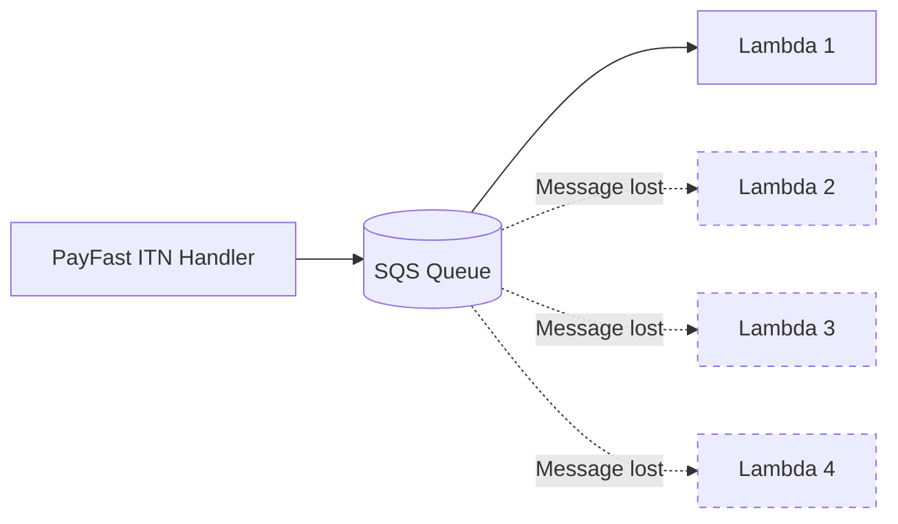
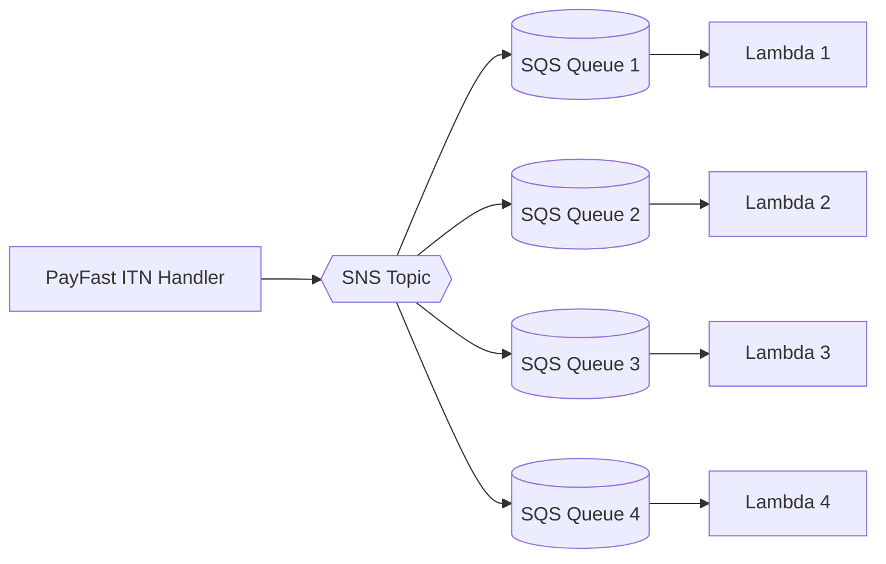
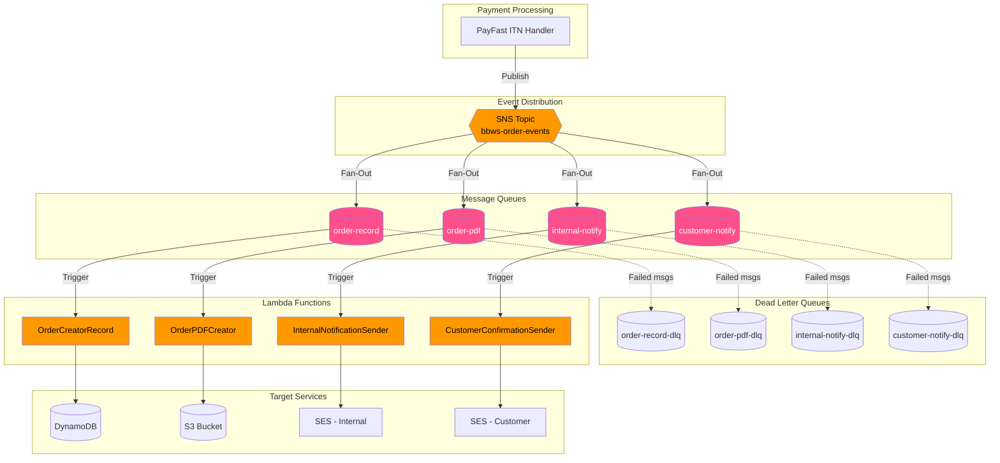

# CPP Event Architecture - Low-Level Design

**Version**: 1.0
**Created**: 2026-01-14
**Status**: Draft
**Component**: Event Architecture (SNS/SQS Fan-Out)
**Parent HLD**: [HLD 2.1 Customer Portal Public](../HLDs/2.1_HLD_Customer_Portal_Public.md)

---

## Document Control

| Version | Date | Author | Changes |
|---------|------|--------|---------|
| 1.0 | 2026-01-14 | Agentic Architect | Initial version - SNS fan-out pattern for order processing |

---

## 1. Introduction

### 1.1 Purpose

This LLD documents the event-driven architecture for the Customer Portal Public application, specifically the SNS fan-out pattern used to distribute order events to multiple Lambda consumers.

### 1.2 Problem Statement

The original architecture connected multiple Lambda functions to a single SQS queue:



**Issue**: SQS delivers each message to only ONE consumer. When `CustomerConfirmationSender` picks up a message first, `InternalNotificationSender` never receives it.

### 1.3 Solution: SNS Fan-Out Pattern



Each Lambda has its own dedicated SQS queue subscribed to the SNS topic, ensuring all consumers receive every message.

---

## 2. Architecture Overview

### 2.1 High-Level Architecture



### 2.2 Benefits of SNS Fan-Out

| Benefit | Description |
|---------|-------------|
| **Guaranteed Delivery** | Each subscriber receives every message |
| **Decoupled** | Lambdas are independent, scale separately |
| **Reliable** | Built-in retry and DLQ per queue |
| **Extensible** | Easy to add new consumers without code changes |
| **AWS Best Practice** | Recommended pattern for this use case |

---

## 3. Component Specifications

### 3.1 SNS Topic

**Topic Name**: `bbws-order-events-{environment}`

| Attribute | Value |
|-----------|-------|
| Display Name | BBWS Order Events |
| Type | Standard |
| Encryption | AWS-managed key (SSE) |
| Access Policy | Allow SQS subscriptions from same account |
| Delivery Retry Policy | 3 retries with linear backoff |
| Dead Letter Queue | Not applicable (SQS handles DLQ) |

**Topic ARN Pattern**: `arn:aws:sns:{region}:{account}:bbws-order-events-{env}`

### 3.2 SQS Queues

#### 3.2.1 Order Record Queue

**Queue Name**: `bbws-order-record-{environment}`

| Attribute | Value |
|-----------|-------|
| Queue Type | Standard |
| Visibility Timeout | 60 seconds |
| Message Retention | 4 days |
| Max Message Size | 256 KB |
| Receive Wait Time | 20 seconds (long polling) |
| Dead Letter Queue | `bbws-order-record-dlq-{env}` |
| Max Receive Count | 3 |

**Lambda Trigger**: `OrderCreatorRecord`

#### 3.2.2 PDF Creator Queue

**Queue Name**: `bbws-order-pdf-{environment}`

| Attribute | Value |
|-----------|-------|
| Queue Type | Standard |
| Visibility Timeout | 120 seconds (PDF generation takes longer) |
| Message Retention | 4 days |
| Max Message Size | 256 KB |
| Receive Wait Time | 20 seconds |
| Dead Letter Queue | `bbws-order-pdf-dlq-{env}` |
| Max Receive Count | 3 |

**Lambda Trigger**: `OrderPDFCreator`

#### 3.2.3 Internal Notification Queue

**Queue Name**: `bbws-order-internal-notify-{environment}`

| Attribute | Value |
|-----------|-------|
| Queue Type | Standard |
| Visibility Timeout | 30 seconds |
| Message Retention | 4 days |
| Max Message Size | 256 KB |
| Receive Wait Time | 20 seconds |
| Dead Letter Queue | `bbws-order-internal-notify-dlq-{env}` |
| Max Receive Count | 3 |

**Lambda Trigger**: `OrderInternalNotificationSender`

#### 3.2.4 Customer Notification Queue

**Queue Name**: `bbws-order-customer-notify-{environment}`

| Attribute | Value |
|-----------|-------|
| Queue Type | Standard |
| Visibility Timeout | 30 seconds |
| Message Retention | 4 days |
| Max Message Size | 256 KB |
| Receive Wait Time | 20 seconds |
| Dead Letter Queue | `bbws-order-customer-notify-dlq-{env}` |
| Max Receive Count | 3 |

**Lambda Trigger**: `CustomerOrderConfirmationSender`

### 3.3 Dead Letter Queues

Each primary queue has a corresponding DLQ for failed messages:

| DLQ Name | Message Retention | CloudWatch Alarm |
|----------|-------------------|------------------|
| `bbws-order-record-dlq-{env}` | 14 days | Yes (> 0 messages) |
| `bbws-order-pdf-dlq-{env}` | 14 days | Yes (> 0 messages) |
| `bbws-order-internal-notify-dlq-{env}` | 14 days | Yes (> 0 messages) |
| `bbws-order-customer-notify-dlq-{env}` | 14 days | Yes (> 0 messages) |

---

## 4. Message Schema

### 4.1 OrderCreatedEvent

This is the standard message format published to SNS and consumed by all SQS queues.

```json
{
  "messageId": "uuid-v4",
  "timestamp": "2026-01-14T10:30:00Z",
  "eventType": "ORDER_CREATED",
  "version": "1.0",
  "source": "payfast-itn-handler",
  "payload": {
    "orderId": "PAY-1705234567890-1234",
    "tenantId": "bigbeard",
    "customerId": "CUST-PAY-1705234567890-1234",
    "customerEmail": "customer@example.com",
    "firstName": "John",
    "lastName": "Doe",
    "primaryPhone": "+27821234567",
    "totalAmount": 299.00,
    "currency": "ZAR",
    "items": [
      {
        "productId": "starter-website-package",
        "productName": "Starter Website Package",
        "description": "Single page website with domain",
        "quantity": 1,
        "unitPrice": 299.00,
        "totalPrice": 299.00
      }
    ],
    "paymentDetails": {
      "paymentId": "PAY-1705234567890-1234",
      "payfastPaymentId": "1234567890",
      "status": "COMPLETE",
      "amountGross": "299.00",
      "amountFee": "8.97",
      "amountNet": "290.03"
    },
    "campaign": {
      "campaignId": "summer2026"
    },
    "createdAt": "2026-01-14T10:30:00Z"
  }
}
```

### 4.2 Pydantic Model

```python
from pydantic import BaseModel, EmailStr, Field
from typing import List, Optional
from decimal import Decimal
from datetime import datetime

class OrderItem(BaseModel):
    productId: str
    productName: str
    description: Optional[str] = None
    quantity: int = Field(ge=1)
    unitPrice: Decimal
    totalPrice: Decimal

class PaymentDetails(BaseModel):
    paymentId: str
    payfastPaymentId: str
    status: str
    amountGross: str
    amountFee: str
    amountNet: str

class Campaign(BaseModel):
    campaignId: Optional[str] = None

class OrderCreatedEventPayload(BaseModel):
    orderId: str
    tenantId: str
    customerId: str
    customerEmail: EmailStr
    firstName: str
    lastName: str
    primaryPhone: str  # Required field
    totalAmount: Decimal
    currency: str = "ZAR"
    items: List[OrderItem]
    paymentDetails: PaymentDetails
    campaign: Optional[Campaign] = None
    createdAt: datetime

class OrderCreatedEvent(BaseModel):
    messageId: str
    timestamp: datetime
    eventType: str = "ORDER_CREATED"
    version: str = "1.0"
    source: str
    payload: OrderCreatedEventPayload
```

---

## 5. SNS-to-SQS Subscription Configuration

### 5.1 Subscription Details

| Subscription | Protocol | Endpoint | Raw Message Delivery |
|--------------|----------|----------|----------------------|
| Order Record | SQS | `arn:aws:sqs:{region}:{account}:bbws-order-record-{env}` | Yes |
| PDF Creator | SQS | `arn:aws:sqs:{region}:{account}:bbws-order-pdf-{env}` | Yes |
| Internal Notify | SQS | `arn:aws:sqs:{region}:{account}:bbws-order-internal-notify-{env}` | Yes |
| Customer Notify | SQS | `arn:aws:sqs:{region}:{account}:bbws-order-customer-notify-{env}` | Yes |

**Raw Message Delivery**: Enabled to pass the message directly to Lambda without SNS envelope wrapper.

### 5.2 SQS Queue Policy

Each SQS queue must allow the SNS topic to send messages:

```json
{
  "Version": "2012-10-17",
  "Statement": [
    {
      "Sid": "AllowSNSToSendMessage",
      "Effect": "Allow",
      "Principal": {
        "Service": "sns.amazonaws.com"
      },
      "Action": "sqs:SendMessage",
      "Resource": "arn:aws:sqs:{region}:{account}:bbws-order-{queue-name}-{env}",
      "Condition": {
        "ArnEquals": {
          "aws:SourceArn": "arn:aws:sns:{region}:{account}:bbws-order-events-{env}"
        }
      }
    }
  ]
}
```

---

## 6. Lambda Event Source Mappings

### 6.1 Configuration Summary

| Lambda Function | Source Queue | Batch Size | Batch Window | Concurrency |
|-----------------|--------------|------------|--------------|-------------|
| OrderCreatorRecord | order-record | 10 | 5s | 5 |
| OrderPDFCreator | order-pdf | 5 | 2s | 10 |
| OrderInternalNotificationSender | internal-notify | 10 | 5s | 5 |
| CustomerOrderConfirmationSender | customer-notify | 10 | 5s | 5 |

### 6.2 Rationale

- **OrderCreatorRecord**: Lower concurrency (5) to avoid DynamoDB throttling
- **OrderPDFCreator**: Higher concurrency (10) as PDF generation is CPU-intensive
- **Notification Lambdas**: Medium concurrency (5) to avoid SES rate limits

---

## 7. Terraform Configuration

### 7.1 SNS Topic

```hcl
resource "aws_sns_topic" "order_events" {
  name         = "bbws-order-events-${var.environment}"
  display_name = "BBWS Order Events"

  kms_master_key_id = "alias/aws/sns"

  tags = {
    Project     = "BBWS"
    Component   = "EventArchitecture"
    Environment = var.environment
    CostCenter  = "BBWS-CPP"
  }
}

resource "aws_sns_topic_policy" "order_events" {
  arn = aws_sns_topic.order_events.arn

  policy = jsonencode({
    Version = "2012-10-17"
    Statement = [
      {
        Sid       = "AllowLambdaPublish"
        Effect    = "Allow"
        Principal = {
          Service = "lambda.amazonaws.com"
        }
        Action   = "sns:Publish"
        Resource = aws_sns_topic.order_events.arn
      }
    ]
  })
}
```

### 7.2 SQS Queues

```hcl
# Order Record Queue
resource "aws_sqs_queue" "order_record" {
  name                       = "bbws-order-record-${var.environment}"
  visibility_timeout_seconds = 60
  message_retention_seconds  = 345600  # 4 days
  receive_wait_time_seconds  = 20

  redrive_policy = jsonencode({
    deadLetterTargetArn = aws_sqs_queue.order_record_dlq.arn
    maxReceiveCount     = 3
  })

  tags = {
    Project     = "BBWS"
    Component   = "EventArchitecture"
    Environment = var.environment
  }
}

resource "aws_sqs_queue" "order_record_dlq" {
  name                       = "bbws-order-record-dlq-${var.environment}"
  message_retention_seconds  = 1209600  # 14 days

  tags = {
    Project     = "BBWS"
    Component   = "EventArchitecture"
    Environment = var.environment
  }
}

# PDF Creator Queue
resource "aws_sqs_queue" "order_pdf" {
  name                       = "bbws-order-pdf-${var.environment}"
  visibility_timeout_seconds = 120  # Longer for PDF generation
  message_retention_seconds  = 345600
  receive_wait_time_seconds  = 20

  redrive_policy = jsonencode({
    deadLetterTargetArn = aws_sqs_queue.order_pdf_dlq.arn
    maxReceiveCount     = 3
  })

  tags = {
    Project     = "BBWS"
    Component   = "EventArchitecture"
    Environment = var.environment
  }
}

resource "aws_sqs_queue" "order_pdf_dlq" {
  name                       = "bbws-order-pdf-dlq-${var.environment}"
  message_retention_seconds  = 1209600

  tags = {
    Project     = "BBWS"
    Component   = "EventArchitecture"
    Environment = var.environment
  }
}

# Internal Notification Queue
resource "aws_sqs_queue" "order_internal_notify" {
  name                       = "bbws-order-internal-notify-${var.environment}"
  visibility_timeout_seconds = 30
  message_retention_seconds  = 345600
  receive_wait_time_seconds  = 20

  redrive_policy = jsonencode({
    deadLetterTargetArn = aws_sqs_queue.order_internal_notify_dlq.arn
    maxReceiveCount     = 3
  })

  tags = {
    Project     = "BBWS"
    Component   = "EventArchitecture"
    Environment = var.environment
  }
}

resource "aws_sqs_queue" "order_internal_notify_dlq" {
  name                       = "bbws-order-internal-notify-dlq-${var.environment}"
  message_retention_seconds  = 1209600

  tags = {
    Project     = "BBWS"
    Component   = "EventArchitecture"
    Environment = var.environment
  }
}

# Customer Notification Queue
resource "aws_sqs_queue" "order_customer_notify" {
  name                       = "bbws-order-customer-notify-${var.environment}"
  visibility_timeout_seconds = 30
  message_retention_seconds  = 345600
  receive_wait_time_seconds  = 20

  redrive_policy = jsonencode({
    deadLetterTargetArn = aws_sqs_queue.order_customer_notify_dlq.arn
    maxReceiveCount     = 3
  })

  tags = {
    Project     = "BBWS"
    Component   = "EventArchitecture"
    Environment = var.environment
  }
}

resource "aws_sqs_queue" "order_customer_notify_dlq" {
  name                       = "bbws-order-customer-notify-dlq-${var.environment}"
  message_retention_seconds  = 1209600

  tags = {
    Project     = "BBWS"
    Component   = "EventArchitecture"
    Environment = var.environment
  }
}
```

### 7.3 SQS Queue Policies

```hcl
resource "aws_sqs_queue_policy" "order_record" {
  queue_url = aws_sqs_queue.order_record.id

  policy = jsonencode({
    Version = "2012-10-17"
    Statement = [
      {
        Sid       = "AllowSNSToSendMessage"
        Effect    = "Allow"
        Principal = { Service = "sns.amazonaws.com" }
        Action    = "sqs:SendMessage"
        Resource  = aws_sqs_queue.order_record.arn
        Condition = {
          ArnEquals = {
            "aws:SourceArn" = aws_sns_topic.order_events.arn
          }
        }
      }
    ]
  })
}

# Similar policies for other queues...
resource "aws_sqs_queue_policy" "order_pdf" {
  queue_url = aws_sqs_queue.order_pdf.id

  policy = jsonencode({
    Version = "2012-10-17"
    Statement = [
      {
        Sid       = "AllowSNSToSendMessage"
        Effect    = "Allow"
        Principal = { Service = "sns.amazonaws.com" }
        Action    = "sqs:SendMessage"
        Resource  = aws_sqs_queue.order_pdf.arn
        Condition = {
          ArnEquals = {
            "aws:SourceArn" = aws_sns_topic.order_events.arn
          }
        }
      }
    ]
  })
}

resource "aws_sqs_queue_policy" "order_internal_notify" {
  queue_url = aws_sqs_queue.order_internal_notify.id

  policy = jsonencode({
    Version = "2012-10-17"
    Statement = [
      {
        Sid       = "AllowSNSToSendMessage"
        Effect    = "Allow"
        Principal = { Service = "sns.amazonaws.com" }
        Action    = "sqs:SendMessage"
        Resource  = aws_sqs_queue.order_internal_notify.arn
        Condition = {
          ArnEquals = {
            "aws:SourceArn" = aws_sns_topic.order_events.arn
          }
        }
      }
    ]
  })
}

resource "aws_sqs_queue_policy" "order_customer_notify" {
  queue_url = aws_sqs_queue.order_customer_notify.id

  policy = jsonencode({
    Version = "2012-10-17"
    Statement = [
      {
        Sid       = "AllowSNSToSendMessage"
        Effect    = "Allow"
        Principal = { Service = "sns.amazonaws.com" }
        Action    = "sqs:SendMessage"
        Resource  = aws_sqs_queue.order_customer_notify.arn
        Condition = {
          ArnEquals = {
            "aws:SourceArn" = aws_sns_topic.order_events.arn
          }
        }
      }
    ]
  })
}
```

### 7.4 SNS Subscriptions

```hcl
resource "aws_sns_topic_subscription" "order_record" {
  topic_arn            = aws_sns_topic.order_events.arn
  protocol             = "sqs"
  endpoint             = aws_sqs_queue.order_record.arn
  raw_message_delivery = true
}

resource "aws_sns_topic_subscription" "order_pdf" {
  topic_arn            = aws_sns_topic.order_events.arn
  protocol             = "sqs"
  endpoint             = aws_sqs_queue.order_pdf.arn
  raw_message_delivery = true
}

resource "aws_sns_topic_subscription" "order_internal_notify" {
  topic_arn            = aws_sns_topic.order_events.arn
  protocol             = "sqs"
  endpoint             = aws_sqs_queue.order_internal_notify.arn
  raw_message_delivery = true
}

resource "aws_sns_topic_subscription" "order_customer_notify" {
  topic_arn            = aws_sns_topic.order_events.arn
  protocol             = "sqs"
  endpoint             = aws_sqs_queue.order_customer_notify.arn
  raw_message_delivery = true
}
```

### 7.5 Lambda Event Source Mappings

```hcl
resource "aws_lambda_event_source_mapping" "order_record" {
  event_source_arn                   = aws_sqs_queue.order_record.arn
  function_name                      = aws_lambda_function.order_creator_record.arn
  batch_size                         = 10
  maximum_batching_window_in_seconds = 5

  scaling_config {
    maximum_concurrency = 5
  }
}

resource "aws_lambda_event_source_mapping" "order_pdf" {
  event_source_arn                   = aws_sqs_queue.order_pdf.arn
  function_name                      = aws_lambda_function.order_pdf_creator.arn
  batch_size                         = 5
  maximum_batching_window_in_seconds = 2

  scaling_config {
    maximum_concurrency = 10
  }
}

resource "aws_lambda_event_source_mapping" "order_internal_notify" {
  event_source_arn                   = aws_sqs_queue.order_internal_notify.arn
  function_name                      = aws_lambda_function.order_internal_notification.arn
  batch_size                         = 10
  maximum_batching_window_in_seconds = 5

  scaling_config {
    maximum_concurrency = 5
  }
}

resource "aws_lambda_event_source_mapping" "order_customer_notify" {
  event_source_arn                   = aws_sqs_queue.order_customer_notify.arn
  function_name                      = aws_lambda_function.customer_confirmation.arn
  batch_size                         = 10
  maximum_batching_window_in_seconds = 5

  scaling_config {
    maximum_concurrency = 5
  }
}
```

### 7.6 CloudWatch Alarms

```hcl
# DLQ Depth Alarms
resource "aws_cloudwatch_metric_alarm" "order_record_dlq" {
  alarm_name          = "bbws-order-record-dlq-depth-${var.environment}"
  comparison_operator = "GreaterThanThreshold"
  evaluation_periods  = 1
  metric_name         = "ApproximateNumberOfMessagesVisible"
  namespace           = "AWS/SQS"
  period              = 60
  statistic           = "Average"
  threshold           = 0
  alarm_description   = "Alert when messages enter Order Record DLQ"
  alarm_actions       = [aws_sns_topic.alerts.arn]

  dimensions = {
    QueueName = aws_sqs_queue.order_record_dlq.name
  }
}

# Similar alarms for other DLQs...
resource "aws_cloudwatch_metric_alarm" "order_pdf_dlq" {
  alarm_name          = "bbws-order-pdf-dlq-depth-${var.environment}"
  comparison_operator = "GreaterThanThreshold"
  evaluation_periods  = 1
  metric_name         = "ApproximateNumberOfMessagesVisible"
  namespace           = "AWS/SQS"
  period              = 60
  statistic           = "Average"
  threshold           = 0
  alarm_description   = "Alert when messages enter Order PDF DLQ"
  alarm_actions       = [aws_sns_topic.alerts.arn]

  dimensions = {
    QueueName = aws_sqs_queue.order_pdf_dlq.name
  }
}

resource "aws_cloudwatch_metric_alarm" "order_internal_notify_dlq" {
  alarm_name          = "bbws-order-internal-notify-dlq-depth-${var.environment}"
  comparison_operator = "GreaterThanThreshold"
  evaluation_periods  = 1
  metric_name         = "ApproximateNumberOfMessagesVisible"
  namespace           = "AWS/SQS"
  period              = 60
  statistic           = "Average"
  threshold           = 0
  alarm_description   = "Alert when messages enter Internal Notify DLQ"
  alarm_actions       = [aws_sns_topic.alerts.arn]

  dimensions = {
    QueueName = aws_sqs_queue.order_internal_notify_dlq.name
  }
}

resource "aws_cloudwatch_metric_alarm" "order_customer_notify_dlq" {
  alarm_name          = "bbws-order-customer-notify-dlq-depth-${var.environment}"
  comparison_operator = "GreaterThanThreshold"
  evaluation_periods  = 1
  metric_name         = "ApproximateNumberOfMessagesVisible"
  namespace           = "AWS/SQS"
  period              = 60
  statistic           = "Average"
  threshold           = 0
  alarm_description   = "Alert when messages enter Customer Notify DLQ"
  alarm_actions       = [aws_sns_topic.alerts.arn]

  dimensions = {
    QueueName = aws_sqs_queue.order_customer_notify_dlq.name
  }
}
```

---

## 8. ITN Handler - SNS Publish

### 8.1 Code Implementation

The PayFast ITN handler must publish to SNS instead of SQS:

```python
import boto3
import json
import os
from datetime import datetime
import uuid

sns_client = boto3.client('sns')

SNS_TOPIC_ARN = os.environ.get('SNS_TOPIC_ARN', '')

def publish_order_event(payfast_data: dict, payment_id: str, pf_payment_id: str, amount: str) -> str:
    """
    Publish order created event to SNS topic.
    Returns the message ID.
    """
    # Get phone number - add country code if needed
    cell_number = payfast_data.get('cell_number', '')
    if cell_number and not cell_number.startswith('+'):
        cell_number = '+27' + cell_number.lstrip('0')

    # Build order event message
    order_event = {
        'messageId': str(uuid.uuid4()),
        'timestamp': datetime.utcnow().isoformat() + 'Z',
        'eventType': 'ORDER_CREATED',
        'version': '1.0',
        'source': 'payfast-itn-handler',
        'payload': {
            'orderId': payment_id,
            'tenantId': os.environ.get('DEFAULT_TENANT_ID', 'bigbeard'),
            'customerId': payfast_data.get('custom_str1', '') or f'CUST-{payment_id}',
            'customerEmail': payfast_data.get('email_address', ''),
            'firstName': payfast_data.get('name_first', ''),
            'lastName': payfast_data.get('name_last', ''),
            'primaryPhone': cell_number or '+27000000000',
            'totalAmount': float(amount),
            'currency': 'ZAR',
            'items': [{
                'productId': payfast_data.get('custom_str2', ''),
                'productName': payfast_data.get('item_name', ''),
                'description': payfast_data.get('item_description', ''),
                'quantity': 1,
                'unitPrice': float(amount),
                'totalPrice': float(amount)
            }],
            'paymentDetails': {
                'paymentId': payment_id,
                'payfastPaymentId': pf_payment_id,
                'status': payfast_data.get('payment_status', 'COMPLETE'),
                'amountGross': payfast_data.get('amount_gross', ''),
                'amountFee': payfast_data.get('amount_fee', ''),
                'amountNet': payfast_data.get('amount_net', '')
            },
            'campaign': {
                'campaignId': payfast_data.get('custom_str3', '')
            } if payfast_data.get('custom_str3') else None,
            'createdAt': datetime.utcnow().isoformat() + 'Z'
        }
    }

    # Publish to SNS
    response = sns_client.publish(
        TopicArn=SNS_TOPIC_ARN,
        Message=json.dumps(order_event),
        MessageAttributes={
            'EventType': {
                'DataType': 'String',
                'StringValue': 'ORDER_CREATED'
            },
            'PaymentId': {
                'DataType': 'String',
                'StringValue': payment_id
            }
        }
    )

    return response['MessageId']
```

### 8.2 Environment Variables

The ITN handler requires:

| Variable | Description | Example |
|----------|-------------|---------|
| SNS_TOPIC_ARN | ARN of the order events SNS topic | `arn:aws:sns:eu-west-1:123456789:bbws-order-events-dev` |
| DEFAULT_TENANT_ID | Default tenant for orders | `bigbeard` |
| S3_BUCKET_NAME | S3 bucket for storing raw ITN data | `bbws-payfast-responses-dev` |

---

## 9. Monitoring and Observability

### 9.1 CloudWatch Metrics

| Metric | Threshold | Alert |
|--------|-----------|-------|
| SNS NumberOfMessagesPublished | Baseline -50% | Decreased message publishing |
| SQS ApproximateAgeOfOldestMessage | > 300 seconds | Messages stuck in queue |
| SQS ApproximateNumberOfMessagesVisible | > 1000 | Queue backlog building |
| DLQ ApproximateNumberOfMessagesVisible | > 0 | Failed messages |
| Lambda Errors | > 5% error rate | Function failures |
| Lambda Duration | > timeout * 0.8 | Approaching timeout |

### 9.2 CloudWatch Dashboard

Create a dashboard with:
- SNS publish rate
- SQS queue depths (all 4 queues)
- DLQ message counts
- Lambda invocation counts and error rates
- End-to-end latency

---

## 10. Error Handling

### 10.1 Retry Strategy

| Scenario | Retry Behavior | Final Action |
|----------|----------------|--------------|
| Lambda function error | 3 retries with exponential backoff | Move to DLQ |
| DynamoDB throttling | Automatic retry via SQS visibility timeout | Eventually succeeds or DLQ |
| SES throttling | Automatic retry via SQS | Eventually succeeds or DLQ |
| S3 upload failure | Automatic retry via SQS | Eventually succeeds or DLQ |
| Invalid message format | Log error, delete message (no retry) | Logged for investigation |

### 10.2 DLQ Processing

Messages in DLQ require manual investigation:

1. Check CloudWatch logs for the failing Lambda
2. Identify the error (validation, external service, etc.)
3. Fix the issue (code or configuration)
4. Replay messages from DLQ using AWS CLI or Console

```bash
# Replay DLQ messages (example)
aws sqs receive-message \
  --queue-url https://sqs.eu-west-1.amazonaws.com/123456789/bbws-order-record-dlq-dev \
  --max-number-of-messages 10 | jq -r '.Messages[].Body' | while read msg; do
  aws sqs send-message \
    --queue-url https://sqs.eu-west-1.amazonaws.com/123456789/bbws-order-record-dev \
    --message-body "$msg"
done
```

---

## 11. Security

### 11.1 IAM Permissions

**ITN Handler Lambda - SNS Publish**:
```json
{
  "Version": "2012-10-17",
  "Statement": [
    {
      "Effect": "Allow",
      "Action": "sns:Publish",
      "Resource": "arn:aws:sns:{region}:{account}:bbws-order-events-{env}"
    }
  ]
}
```

**Consumer Lambdas - SQS Read**:
```json
{
  "Version": "2012-10-17",
  "Statement": [
    {
      "Effect": "Allow",
      "Action": [
        "sqs:ReceiveMessage",
        "sqs:DeleteMessage",
        "sqs:GetQueueAttributes"
      ],
      "Resource": "arn:aws:sqs:{region}:{account}:bbws-order-{queue}-{env}"
    }
  ]
}
```

### 11.2 Encryption

- SNS topic encrypted with AWS-managed key (SSE)
- SQS queues encrypted with AWS-managed key (SSE)
- All data in transit encrypted via HTTPS/TLS

---

## 12. NFRs

| Metric | Target |
|--------|--------|
| SNS publish latency (p95) | < 100ms |
| SQS to Lambda delivery (p95) | < 5 seconds |
| End-to-end processing (p95) | < 30 seconds |
| Message delivery guarantee | At-least-once |
| System availability | 99.9% |

---

## 13. References

- [AWS SNS Fan-Out Pattern](https://docs.aws.amazon.com/sns/latest/dg/sns-sqs-as-subscriber.html)
- [SQS and Lambda](https://docs.aws.amazon.com/lambda/latest/dg/with-sqs.html)
- [Order Lambda LLD](./2.1.8_LLD_Order_Lambda.md)
- [Payment Lambda LLD](./2.1.9_LLD_Payment_Lambda.md)
- [ARCHITECTURE_NOTE_SQS_FANOUT.md](../../0_playpen/2_LLD_payments_integration/ARCHITECTURE_NOTE_SQS_FANOUT.md)

---

## 14. Signoff

| Role | Name | Date | Signature |
|------|------|------|-----------|
| Technical Lead | | | |
| DevOps Lead | | | |

---

**End of Document**
