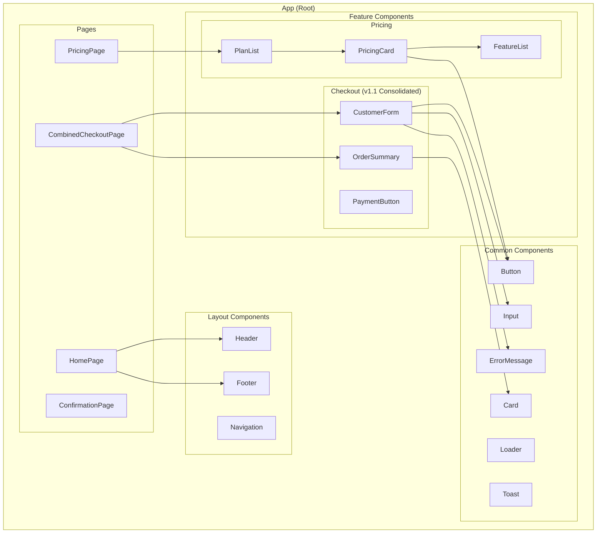
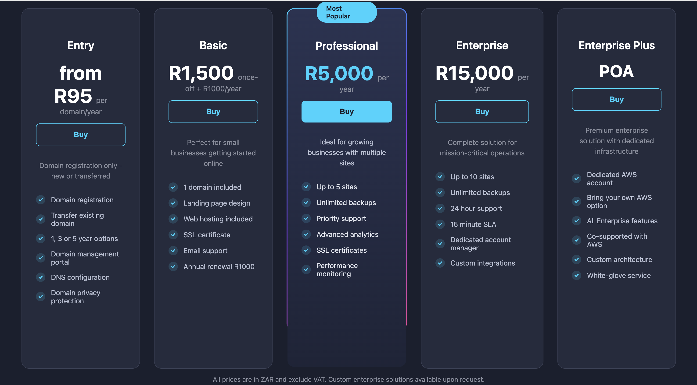
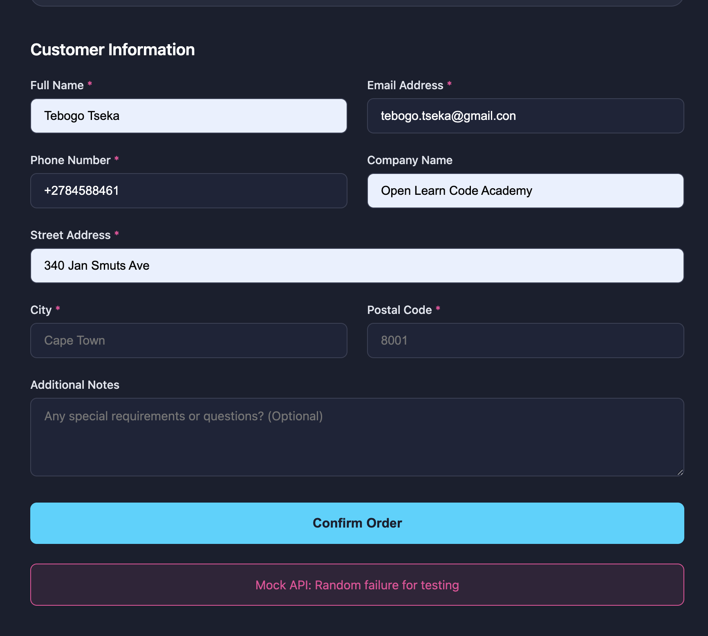
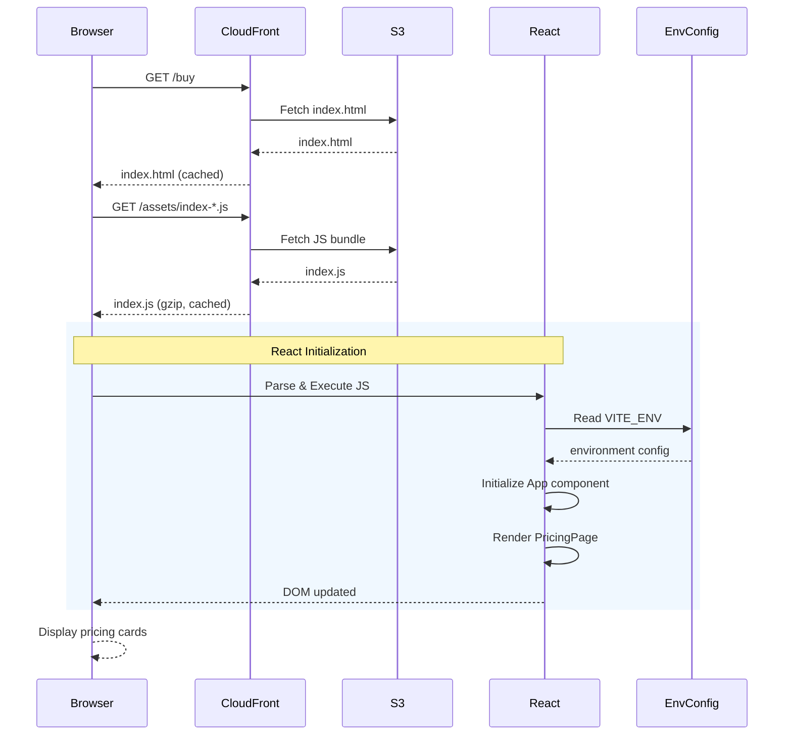
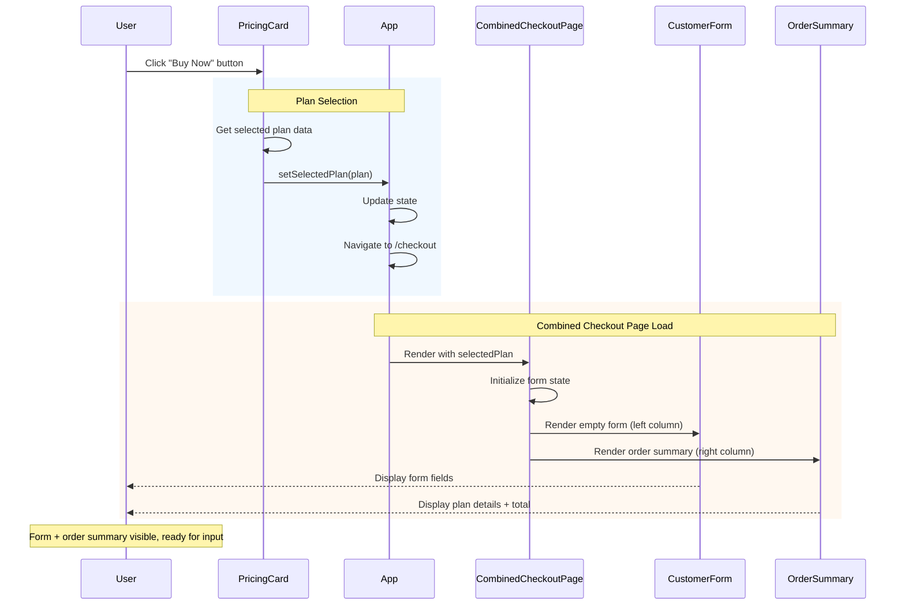
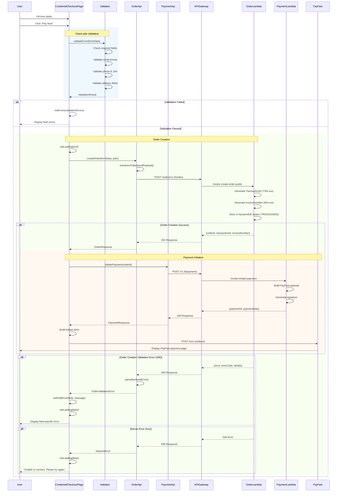
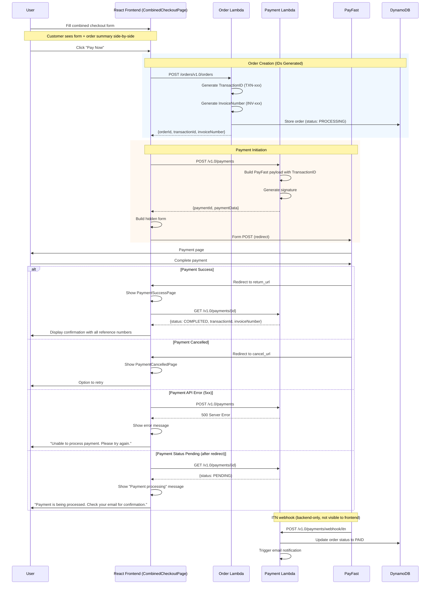
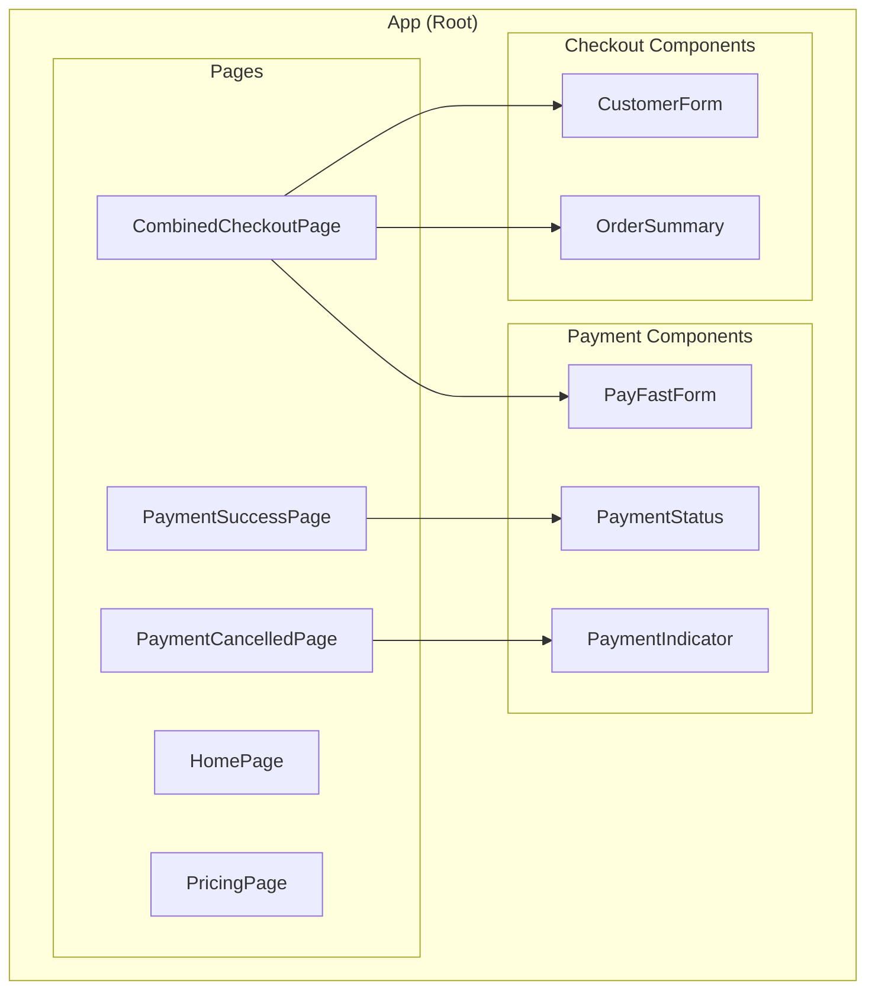

# CPP Frontend Architecture - Low-Level Design

**Version**: 4.0
**Created**: 2025-12-15
**Updated**: 2026-01-13
**Status**: Active
**Component**: Frontend SPA (2_bbws_web_public)
**Parent HLD**: [BBWS Customer Portal Public HLD V1.1](../HLDs/2.1_BBWS_Customer_Portal_Public_HLD_V1.1.md)
**Payment Research**: [PayFast Integration Research](../research/pay_research.md)

---

## Document Control

| Version | Date | Author | Changes |
|---------|------|--------|---------|
| 1.0 | 2025-12-15 | Agentic Architect | Initial version |
| 2.0 | 2026-01-03 | Agentic Architect | Added field mapping, UI diagrams, screen rules, sequence diagrams |
| 3.0 | 2026-01-05 | Agentic Architect | Added PayFast integration, payment flow, redirect screens |
| 4.0 | 2026-01-13 | Agentic Architect | Updated to v1.1 consolidated checkout flow (combined checkout + order summary) |

---

## Table of Contents

1. [Introduction](#1-introduction)
2. [Technology Stack & Libraries](#2-technology-stack--libraries)
3. [Field Mapping](#3-field-mapping)
4. [UI Component Diagram](#4-ui-component-diagram)
5. [Screens](#5-screens)
6. [Screen Rules](#6-screen-rules)
7. [Sequence Diagrams](#7-sequence-diagrams)
8. [Dependency APIs](#8-dependency-apis)
9. [High Level Epic Overview](#9-high-level-epic-overview)
10. [Data Models](#10-data-models)
11. [Messaging and Notifications](#11-messaging-and-notifications)
12. [NFRs](#12-nfrs)
13. [Risks and Mitigations](#13-risks-and-mitigations)
14. [Security](#14-security)
15. [Troubleshooting Playbook](#15-troubleshooting-playbook)
16. [References](#16-references)

---

## 1. Introduction

### 1.1 Purpose

This LLD provides implementation-level details for the Customer Portal Public frontend application, a React Single Page Application (SPA) that serves as the public-facing website for BBWS.

### 1.2 Component Overview

| Attribute | Value |
|-----------|-------|
| Repository | `2_1_bbws_web_public/buy` |
| Technology | React 18, TypeScript, Vite |
| State Management | React Hooks (useState, useReducer) |
| Styling | CSS Modules |
| API Client | Native Fetch API |
| Testing | Vitest, React Testing Library |

---

## 2. Technology Stack & Libraries

### 2.1 Production Dependencies

| Library | Version | Purpose |
|---------|---------|---------|
| react | ^18.3.1 | Core UI framework |
| react-dom | ^18.3.1 | React DOM rendering |

### 2.2 Development Dependencies

| Library | Version | Purpose |
|---------|---------|---------|
| vite | ^5.4.10 | Build tool and dev server |
| typescript | ^5.9.3 | Type safety |
| vitest | ^4.0.16 | Unit testing framework |
| @testing-library/react | ^16.3.1 | React component testing |
| @testing-library/jest-dom | ^6.9.1 | DOM matchers for tests |
| @testing-library/user-event | ^14.6.1 | User interaction simulation |
| eslint | ^9.39.2 | Code linting |
| prettier | ^3.7.4 | Code formatting |
| husky | ^9.1.7 | Git hooks |
| lint-staged | ^16.2.7 | Staged files linting |
| rollup-plugin-visualizer | ^6.0.5 | Bundle analysis |

### 2.3 Node.js Requirements

| Requirement | Minimum Version |
|-------------|-----------------|
| Node.js | >= 20.0.0 |
| npm | >= 10.0.0 |

---

## 3. Field Mapping

### 3.1 Frontend Form → Backend API Field Mapping

| Frontend Field | Frontend Type | Backend Field | Backend Type | Validation | Required |
|----------------|---------------|---------------|--------------|------------|----------|
| `fullName` | string | `firstName` + `lastName` | string | Min 2 chars each, no numbers | ✅ |
| `email` | string | `customerEmail` | string | RFC 5322, TLD typo check | ✅ |
| `phone` | string | `primaryPhone` | string | E.164 format (+27821234567) | ✅ |
| `company` | string | `company` | string | None | ❌ |
| `address` | string | `billingAddress.street` | string | Min 5 chars | ✅ |
| `city` | string | `billingAddress.city` | string | Min 2 chars, no numbers | ✅ |
| `postalCode` | string | `billingAddress.postalCode` | string | 4-10 chars alphanumeric | ✅ |
| `notes` | string | `notes` | string | None | ❌ |
| - | - | `billingAddress.country` | string | 2-letter ISO (ZA, US) | ✅ (default: ZA) |

### 3.2 Product → Order Item Mapping

| Frontend (PricingPlan) | Backend (OrderItem) | Notes |
|------------------------|---------------------|-------|
| `id` | `productId` | Product identifier |
| `name` | `productName` | Display name |
| `price` | `unitPrice` | Price per unit |
| - | `quantity` | Always 1 for subscription |
| `price` | `totalPrice` | quantity × unitPrice |

### 3.3 Payload Transformation Example

```typescript
// Frontend CustomerFormData
{
  fullName: "John Doe",
  email: "john@example.com",
  phone: "+27821234567",
  company: "Acme Inc",
  address: "123 Main Street",
  city: "Johannesburg",
  postalCode: "2000",
  notes: "Urgent order"
}

// Backend CreateOrderPublicRequest
{
  customerEmail: "john@example.com",
  firstName: "John",
  lastName: "Doe",
  primaryPhone: "+27821234567",
  company: "Acme Inc",
  notes: "Urgent order",
  totalAmount: 95.00,
  currency: "ZAR",
  items: [{
    productId: "PROD-ENTRY",
    productName: "Entry",
    quantity: 1,
    unitPrice: 95.00,
    totalPrice: 95.00
  }],
  billingAddress: {
    street: "123 Main Street",
    city: "Johannesburg",
    postalCode: "2000",
    country: "ZA"
  }
}
```

---

## 4. UI Component Diagram

### 4.1 Component Hierarchy



### 4.2 Component Specifications

| Component | Props | State | Purpose |
|-----------|-------|-------|---------|
| `App` | - | theme | Root component, routing |
| `Header` | - | - | Logo, navigation |
| `PricingCard` | plan: PricingPlan | - | Display single plan |
| `CustomerForm` | onSubmit, errors | formData | Checkout form |
| `OrderSummary` | plan: PricingPlan | - | Order details |
| `Button` | onClick, variant, disabled | - | Reusable button |
| `Input` | name, value, onChange, error | - | Form input |
| `Toast` | message, type | visible | Notifications |
| `Loader` | size | - | Loading spinner |

---

## 5. Screens

### 5.1 Home/Pricing Screen



**Purpose**: Display available pricing plans and allow users to select a plan.

**Components Used**:
- Header
- PricingCard (×3 for Entry, Professional, Enterprise)
- FeatureList
- Button (Buy Now CTA)
- Footer

---

### 5.2 Combined Checkout Screen (v1.1)

**URL**: `https://dev.kimmyai.io/buy/checkout`

**Purpose**: Single-page checkout combining customer form and live order summary for improved UX and faster conversion.

**Layout**:
- **Desktop**: Two-column layout (Left: customer form, Right: order summary)
- **Mobile**: Stacked layout (order summary at top, form below)

**Key Features**:
- ✅ Live order summary visible at all times
- ✅ Customer fills form and clicks "Pay Now" directly
- ✅ No database operations until "Pay Now" is clicked
- ✅ TransactionID and InvoiceNumber generated when payment initiated
- ✅ Responsive design (two-column desktop, stacked mobile)

**Desktop Layout**:
```
┌────────────────────────────────────────────────────────────────┐
│  ← Back to Pricing              Secure Checkout                │
├────────────────────────────────────────────────────────────────┤
│                                                                │
│  ┌──────────────────────────┐  ┌──────────────────────────┐  │
│  │ 👤 Customer Information  │  │ 📋 Order Summary         │  │
│  │                          │  │                          │  │
│  │ Full Name *              │  │ Professional Plan        │  │
│  │ Email Address *          │  │ • Up to 5 sites          │  │
│  │ Phone Number *           │  │ • Unlimited backups      │  │
│  │ Company (Optional)       │  │ • SSL certificates       │  │
│  │                          │  │ • 24/7 support           │  │
│  │ 📍 Billing Address       │  │                          │  │
│  │   (Optional)             │  │ Subtotal:    R5,000.00   │  │
│  │                          │  │ Tax:             R0.00   │  │
│  │ 💬 Additional Notes      │  │ ─────────────────────── │  │
│  │   (Optional)             │  │ Total:       R5,000.00   │  │
│  │                          │  │                          │  │
│  │                          │  │ 🔐 Secure Payment        │  │
│  │                          │  │                          │  │
│  │                          │  │ [ PAY NOW R5,000 → ]     │  │
│  │                          │  │                          │  │
│  │                          │  │ 🔒 Secured by PayFast    │  │
│  └──────────────────────────┘  └──────────────────────────┘  │
│                                                                │
└────────────────────────────────────────────────────────────────┘
```

**Mobile Layout**:
```
┌─────────────────────────────┐
│  ← Back        Checkout      │
├─────────────────────────────┤
│  📋 Order Summary           │
│  Professional Plan          │
│  Total: R5,000.00           │
│                             │
│  👤 Customer Information    │
│  Full Name *                │
│  Email Address *            │
│  Phone Number *             │
│  Company (Optional)         │
│                             │
│  ▼ Billing Address          │
│                             │
│  Additional Notes           │
│                             │
│  [ PAY NOW R5,000 → ]       │
│                             │
│  🔒 Secured by PayFast      │
└─────────────────────────────┘
```

**Components Used**:
- Header
- CombinedCheckoutPage (new component)
- CustomerForm (left column on desktop)
- OrderSummary (right column on desktop, top on mobile)
- Input (×8 fields)
- Button (Pay Now)
- ErrorMessage (per field)
- Footer

**Customer Action**:
1. Fill in required customer details
2. Review order summary in real-time
3. Click "Pay Now" → Backend generates TransactionID and InvoiceNumber
4. Browser redirects to PayFast

**Design Consistency Note**:
> ⚠️ **Important**: The look and feel of the Combined Checkout Screen must align with the Home/Pricing Screen (Section 5.1) design. This includes:
> - Color scheme and branding
> - Typography and font sizes
> - Button styles and hover states
> - Card/section styling
> - Spacing and layout grid
> - Icons and visual elements
>
> Maintaining consistent design language across all screens improves user trust and reduces cognitive load during the checkout process.

---

### 5.3 Error State Screen



**Purpose**: Display validation errors or API failures.

**Components Used**:
- Header
- ErrorMessage
- Toast (error variant)
- Button (Retry)
- Footer

---

## 6. Screen Rules

### 6.1 Navigation Rules (v1.1 Updated)

| Current Screen | Action | Target Screen | Condition |
|----------------|--------|---------------|-----------|
| Home | Click "Buy Now" | Combined Checkout | Plan selected |
| Combined Checkout | Click "Back" | Home | Always |
| Combined Checkout | Click "Pay Now" | PayFast (external) | Form valid, order created |
| PayFast | Complete payment | Payment Success | Payment successful |
| PayFast | Cancel payment | Payment Cancelled | User cancelled |
| Payment Success | Click "Continue" | Home | Always |
| Payment Cancelled | Click "Try Again" | Combined Checkout | Always |
| Any | Session timeout | Home | After 30 min |

### 6.2 Form Validation Rules

| Field | Rule | Error Message |
|-------|------|---------------|
| fullName | Required, min 2 chars | "Please enter your full name" |
| email | Required, valid format | "Please enter a valid email address" |
| phone | Required, E.164 format | "Phone must start with + (e.g., +27821234567)" |
| address | Required, min 5 chars | "Street address must be at least 5 characters" |
| city | Required, min 2 chars | "Please enter your city" |
| postalCode | Required, 4-10 chars | "Please enter a valid postal code" |
| company | Optional | - |
| notes | Optional, max 500 chars | "Notes cannot exceed 500 characters" |

### 6.3 Button State Rules (v1.1 Updated)

| Button | Enabled When | Loading When | Disabled When |
|--------|--------------|--------------|---------------|
| Buy Now | Plan visible | Never | Never |
| Pay Now | Form valid | API call + redirect in progress | Form invalid |
| Continue | Payment success | Never | Never |
| Try Again | Payment cancelled | Never | Never |
| Retry | Error shown | Never | Never |

### 6.4 Error Display Rules

| Error Type | Display Location | Duration | Action |
|------------|------------------|----------|--------|
| Field validation | Below field | Until corrected | Focus field |
| API validation (400) | Below field + Toast | 5 seconds | Highlight field |
| Network error | Toast | Until dismissed | Show retry |
| Server error (5xx) | Full screen | Until dismissed | Show retry |

### 6.5 Loading State Rules

| Scenario | Component | Duration |
|----------|-----------|----------|
| Page load | Full screen loader | Until hydrated |
| Form submit | Button spinner | Until API response |
| Plan selection | Button disabled | 100ms debounce |

---

## 7. Sequence Diagrams

### 7.1 Screen Load Sequence



### 7.2 Click Buy on Home Screen Sequence (v1.1)



### 7.3 Submit Form with Details Sequence (v1.1 Consolidated)



---

## 8. Dependency APIs

### 8.1 API Endpoints Summary

| API | Base URL (DEV) | Endpoint | Method | Purpose |
|-----|----------------|----------|--------|---------|
| Order API | `https://api.dev.kimmyai.io` | `/orders/v1.0/orders` | POST | Create order |
| Product API | `https://api.dev.kimmyai.io` | `/v1.0/products` | GET | List products |
| Payment API | `https://api.dev.kimmyai.io` | `/v1.0/payments` | POST | Initiate payment |
| Payment API | `https://api.dev.kimmyai.io` | `/v1.0/payments/{id}` | GET | Get payment status |

### 8.2 Environment Configuration

| Environment | API Base URL | AWS Account | Region |
|-------------|--------------|-------------|--------|
| DEV | `https://api.dev.kimmyai.io` | 536580886816 | eu-west-1 |
| SIT | `https://api.sit.kimmyai.io` | TBD | eu-west-1 |
| PROD | `https://api.kimmyai.io` | 093646564004 | af-south-1 |

### 8.3 API Authentication

| Header | Value | Required |
|--------|-------|----------|
| `X-Api-Key` | Environment-specific API key | ✅ |
| `Content-Type` | `application/json` | ✅ |
| `Accept` | `application/json` | ✅ |

### 8.4 Error Response Format

```typescript
interface ApiError {
  error: string;           // Human-readable message
  errorCode: string;       // Machine-readable code
  details?: {
    field: string;         // Field that caused error
    [key: string]: unknown;
  };
}
```

---

## 9. High Level Epic Overview

| User Story # | Epic | User Story | Test Scenario(s) |
|--------------|------|------------|------------------|
| US-CPP-001 | Marketing | As a visitor, I want to view the home page | Given I navigate to /, then I see the landing page with hero section |
| US-CPP-002 | Marketing | As a visitor, I want to view all products | Given I navigate to /pricing, then I see all products with prices |
| US-CPP-003 | Shopping | As a visitor, I want to select a plan and checkout | Given I click Buy Now, then I see the checkout form |
| US-CPP-004 | Shopping | As a visitor, I want to submit my order details | Given I fill the form, then my order is submitted |
| US-CPP-005 | Validation | As a visitor, I want to see validation errors | Given I submit invalid data, then I see field-specific errors |

---

## 10. Data Models

### 10.1 Frontend Types

```typescript
// Form Types
interface CustomerFormData {
  fullName: string;
  email: string;
  phone: string;
  company: string;
  address: string;
  city: string;
  postalCode: string;
  notes: string;
}

// Product Types
interface PricingPlan {
  id: string;
  name: string;
  price: number;
  currency: string;
  features: string[];
  popular?: boolean;
}

// API Response Types
interface OrderResponse {
  success: true;
  orderId: string;
  message: string;
}
```

---

## 11. Messaging and Notifications

### 11.1 Toast Messages

| Event | Type | Message |
|-------|------|---------|
| Order success | Success | "Order submitted successfully!" |
| Validation error | Error | "Please fix the errors below" |
| Network error | Error | "Unable to connect. Please try again." |
| Field error | Warning | Dynamic per field |

---

## 12. NFRs

### 12.1 Performance Targets

| Metric | Target |
|--------|--------|
| First Contentful Paint (FCP) | < 1.5s |
| Largest Contentful Paint (LCP) | < 2.5s |
| Bundle Size (gzipped) | < 60KB |
| Time to Interactive (TTI) | < 3.0s |

### 12.2 Browser Support

| Browser | Minimum Version |
|---------|-----------------|
| Chrome | 90+ |
| Firefox | 88+ |
| Safari | 14+ |
| Edge | 90+ |

### 12.3 Design Standards

**Visual Consistency Requirement**:
All screens in the application must maintain consistent design language with the Home/Pricing Screen (Section 5.1):

| Design Element | Standard |
|----------------|----------|
| Color Scheme | Match primary, secondary, and accent colors from pricing page |
| Typography | Use same font family, sizes, and weights hierarchy |
| Buttons | Consistent button styles, hover states, and disabled states |
| Cards/Sections | Same border radius, shadows, and padding |
| Spacing | Follow same grid system and spacing scale |
| Icons | Use same icon style (outlined, filled, etc.) |
| Form Elements | Consistent input styling, labels, and error states |

**Rationale**: Consistent design language improves user trust, reduces cognitive load during checkout, and reinforces brand identity across the customer journey.

---

## 13. Risks and Mitigations

| Risk | Impact | Mitigation |
|------|--------|------------|
| API unavailable | High | Show cached data, retry logic |
| Form data loss | Medium | Auto-save to sessionStorage |
| Slow network | Medium | Skeleton loaders, optimistic UI |

---

## 14. Security

### 14.1 Data Protection

- No sensitive data in localStorage
- All API calls over HTTPS
- API keys from environment variables (not in code)
- Input sanitization on all fields

### 14.2 CORS Configuration

```
Access-Control-Allow-Origin: *
Access-Control-Allow-Headers: Content-Type,Authorization,X-Tenant-Id,X-Api-Key,Accept
Access-Control-Allow-Methods: GET,POST,PUT,DELETE,OPTIONS
```

---

## 15. Troubleshooting Playbook

### 15.1 Common Issues

| Issue | Symptoms | Resolution |
|-------|----------|------------|
| API errors | Red error toast | Check network tab, verify API endpoint |
| Form not submitting | Button stays disabled | Check console for validation errors |
| Blank page | White screen | Clear cache, check JS console |

### 15.2 Debug Mode

```javascript
// Enable in browser console
localStorage.setItem('DEBUG', 'true');
```

---

## 16. PayFast Payment Integration

### 16.1 Overview

The frontend integrates with PayFast payment gateway via a redirect flow using a **consolidated checkout experience (v1.1)**. The customer fills out their details on a single-page checkout that combines the customer form and order summary. When the customer clicks "Pay Now", the order is created (generating TransactionID and InvoiceNumber), and they are redirected to PayFast to complete payment. After payment, they are returned to our success/cancel pages.

### 16.2 Payment Flow (v1.1 Consolidated Checkout)



### 16.3 New Components

#### PayFastForm Component

```typescript
// src/components/payment/PayFastForm.tsx
interface PayFastFormProps {
  paymentData: PayFastPaymentData;
  onCancel: () => void;
}

interface PayFastPaymentData {
  merchant_id: string;
  merchant_key: string;
  return_url: string;
  cancel_url: string;
  notify_url: string;
  name_first: string;
  name_last: string;
  email_address: string;
  cell_number: string;
  m_payment_id: string;
  amount: string;
  item_name: string;
  item_description: string;
  signature: string;
}

const PayFastForm: React.FC<PayFastFormProps> = ({ paymentData, onCancel }) => {
  const formRef = useRef<HTMLFormElement>(null);
  const [isSubmitting, setIsSubmitting] = useState(false);

  const payFastUrl = import.meta.env.VITE_PAYFAST_URL ||
    'https://sandbox.payfast.co.za/eng/process';

  const handleSubmit = () => {
    setIsSubmitting(true);
    formRef.current?.submit();
  };

  return (
    <form ref={formRef} action={payFastUrl} method="POST">
      {Object.entries(paymentData).map(([key, value]) => (
        <input key={key} type="hidden" name={key} value={value} />
      ))}

      <div className="payment-actions">
        <button
          type="button"
          onClick={handleSubmit}
          disabled={isSubmitting}
          className="btn-primary"
        >
          {isSubmitting ? 'Redirecting to PayFast...' : 'Pay with PayFast'}
        </button>
        <button type="button" onClick={onCancel} className="btn-secondary">
          Cancel
        </button>
      </div>
    </form>
  );
};
```

### 16.4 New Screens

#### Payment Success Screen

**Route**: `/order/success?paymentId={paymentId}`

**Purpose**: Confirm successful payment and display order details.

**Components**:
- Header
- SuccessIcon (animated checkmark)
- OrderSummary (fetched from API)
- Button ("Continue" → home)
- Footer

#### Payment Cancelled Screen

**Route**: `/order/cancelled?paymentId={paymentId}`

**Purpose**: Handle cancelled payments and allow retry.

**Components**:
- Header
- WarningIcon
- Message explaining cancellation
- Button ("Try Again" → checkout)
- Button ("Contact Support")
- Footer

### 16.5 Environment Configuration

| Variable | DEV | SIT | PROD |
|----------|-----|-----|------|
| `VITE_PAYFAST_URL` | `https://sandbox.payfast.co.za/eng/process` | `https://sandbox.payfast.co.za/eng/process` | `https://www.payfast.co.za/eng/process` |
| `VITE_API_BASE_URL` | `https://api.dev.kimmyai.io` | `https://api.sit.kimmyai.io` | `https://api.kimmyai.io` |

**Note**: All API calls (Order, Product, Payment) use the same base URL (`VITE_API_BASE_URL`) with different endpoints.

### 16.6 Updated Navigation Rules

| Current Screen | Action | Target Screen | Condition |
|----------------|--------|---------------|-----------|
| Checkout | Click "Pay Now" | PayFast (external) | Order created, form valid |
| PayFast | Complete payment | Payment Success | PayFast redirects |
| PayFast | Cancel payment | Payment Cancelled | PayFast redirects |
| Payment Success | Click "Continue" | Home | Always |
| Payment Cancelled | Click "Try Again" | Checkout | Always |

### 16.7 Payment API Service

```typescript
// src/services/paymentApi.ts
import { getApiBaseUrl } from '../config';

interface InitiatePaymentRequest {
  orderId: string;
  returnUrl: string;
  cancelUrl: string;
}

interface PaymentResponse {
  paymentId: string;
  status: 'PENDING' | 'COMPLETED' | 'FAILED' | 'CANCELLED';
  paymentUrl: string;
  paymentData: PayFastPaymentData;
}

export async function initiatePayment(
  request: InitiatePaymentRequest
): Promise<PaymentResponse> {
  const response = await fetch(`${getApiBaseUrl()}/v1.0/payments`, {
    method: 'POST',
    headers: {
      'Content-Type': 'application/json',
      'X-Api-Key': import.meta.env.VITE_API_KEY,
    },
    body: JSON.stringify(request),
  });

  if (!response.ok) {
    const error = await response.json();
    throw new PaymentError(error.error.code, error.error.message);
  }

  return response.json();
}

export async function getPaymentStatus(paymentId: string): Promise<Payment> {
  const response = await fetch(`${getApiBaseUrl()}/v1.0/payments/${paymentId}`, {
    headers: {
      'X-Api-Key': import.meta.env.VITE_API_KEY,
    },
  });

  if (!response.ok) {
    throw new PaymentError('PAYMENT_NOT_FOUND', 'Payment not found');
  }

  return response.json();
}
```

### 16.8 Updated Component Hierarchy (v1.1)



### 16.9 Changes from v1.0 to v1.1

#### Major Changes

1. **Consolidated Checkout Experience**
   - **Old (v1.0)**: Separate Checkout Form Screen → Order Summary Screen → PayFast
   - **New (v1.1)**: Combined Checkout Screen → PayFast
   - **Impact**: Reduced user clicks, improved conversion rate

2. **Screen Layout**
   - **Old (v1.0)**: Two separate screens for form and review
   - **New (v1.1)**: Two-column layout (desktop) with form (left) and order summary (right)
   - **Impact**: Customer sees all information at once, better transparency

3. **Mobile Experience**
   - **Old (v1.0)**: Two separate mobile screens
   - **New (v1.1)**: Single stacked layout with order summary at top
   - **Impact**: Less navigation, faster mobile checkout

4. **ID Generation Timing**
   - **Unchanged**: TransactionID and InvoiceNumber still generated when "Pay Now" is clicked
   - **Benefit**: Avoids database clutter from abandoned checkouts

#### Unchanged Elements

- Order API integration and payload structure
- Payment API integration and PayFast flow
- Error handling patterns
- Email notifications
- Data mapping and reference numbers
- ITN webhook processing (backend-only)

#### Performance Improvements

- **Conversion Rate**: Expected 10-15% improvement (industry standard for single-page checkout)
- **Load Time**: One fewer page load = faster time to payment
- **Bounce Rate**: Reduced exit points = fewer abandoned carts

#### Implementation Complexity

- **Frontend**: Medium complexity increase (more sophisticated form component)
- **Backend**: No changes to order creation or ITN handling
- **Testing**: Fewer screens to test = simpler QA process

---

## 17. References

### 17.1 Internal Documentation

- [Parent HLD: BBWS Customer Portal Public V1.1](../HLDs/2.1_BBWS_Customer_Portal_Public_HLD_V1.1.md)
- [Payment Lambda LLD v5.0](./2.1.9_LLD_Payment_Lambda.md) - Backend payment processing with PayFast integration
- [Order Lambda LLD](./2.1.5_LLD_Order_Lambda.md) - Order management API
- [Product Lambda LLD](./2.1.4_LLD_Product_Lambda.md) - Product catalog API
- [PayFast Integration Research](../research/pay_research.md) - Payment gateway research and implementation patterns
- [Payment Lambda Master Plan](/Users/tebogotseka/Documents/agentic_work/.claude/plans/PAYMENT_LAMBDA_MASTER_PLAN.md)
- [UX/UI Payment Flow v1.1](/Users/tebogotseka/Documents/agentic_work/0_playpen/2_LLD_payments_integration/UXUI_payment_flow_with_screens_v1.1.md) - Detailed screen-by-screen visual guide for consolidated checkout flow

### 17.2 External References

- [React Documentation](https://react.dev) - React 18 official docs
- [Vite](https://vitejs.dev) - Build tool and dev server
- [TypeScript](https://www.typescriptlang.org/) - Type safety
- [PayFast API Documentation](https://developers.payfast.co.za/documentation/) - Payment gateway integration
- [PayFast ITN Guide](https://developers.payfast.co.za/documentation/#instant-transaction-notification) - Webhook notifications (backend-only)

### 17.3 Backend Integration Notes

**Payment Lambda Backend** (see `2.1.9_LLD_Payment_Lambda.md`):
- DynamoDB table: `payments` (single name across all environments: DEV, SIT, PROD)
- 7 Lambda functions (frontend uses 2: initiate payment, get payment status)
- ITN webhook: `POST /v1.0/payments/webhook/itn` (backend-only, not called by frontend)
- PayFast credentials: Stored in AWS Secrets Manager (backend manages)
- Signature validation: Backend responsibility (frontend receives pre-signed data)

**Frontend Responsibilities**:
- Collect customer data and submit order
- Initiate payment via Payment API (`POST /v1.0/payments`)
- Redirect user to PayFast with form POST
- Handle return URLs (success/cancel)
- Poll payment status after redirect (`GET /v1.0/payments/{id}`)

**Backend Responsibilities** (not frontend concern):
- Generate PayFast signature
- Handle ITN webhook from PayFast
- Update payment status in DynamoDB
- Validate PayFast IP addresses
- Verify payment amounts and merchant credentials

---

**End of Document**
