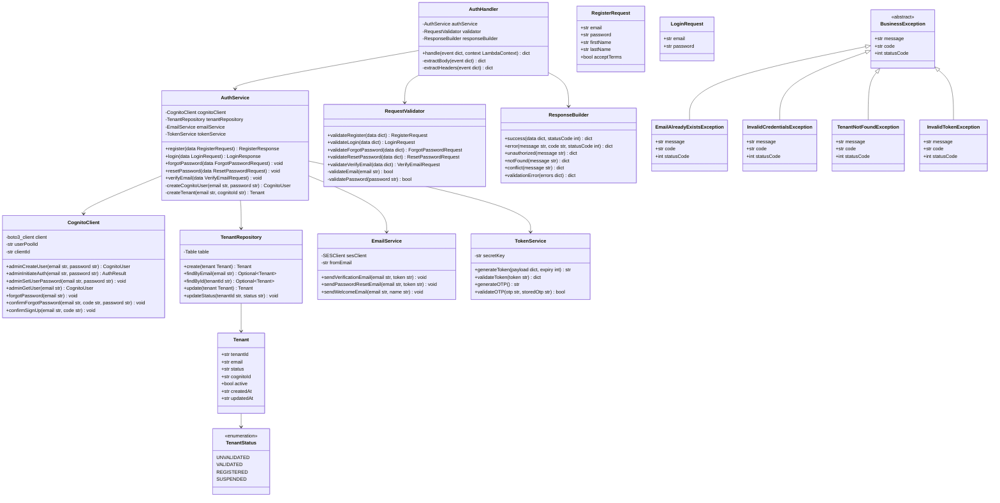
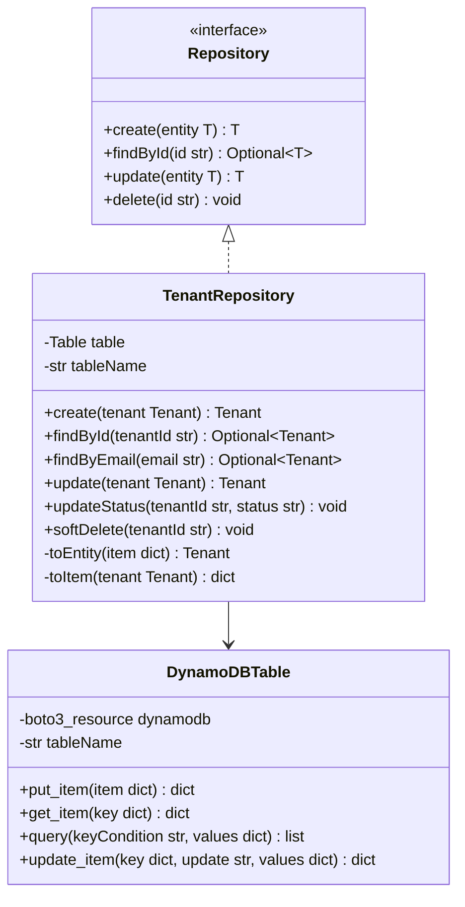
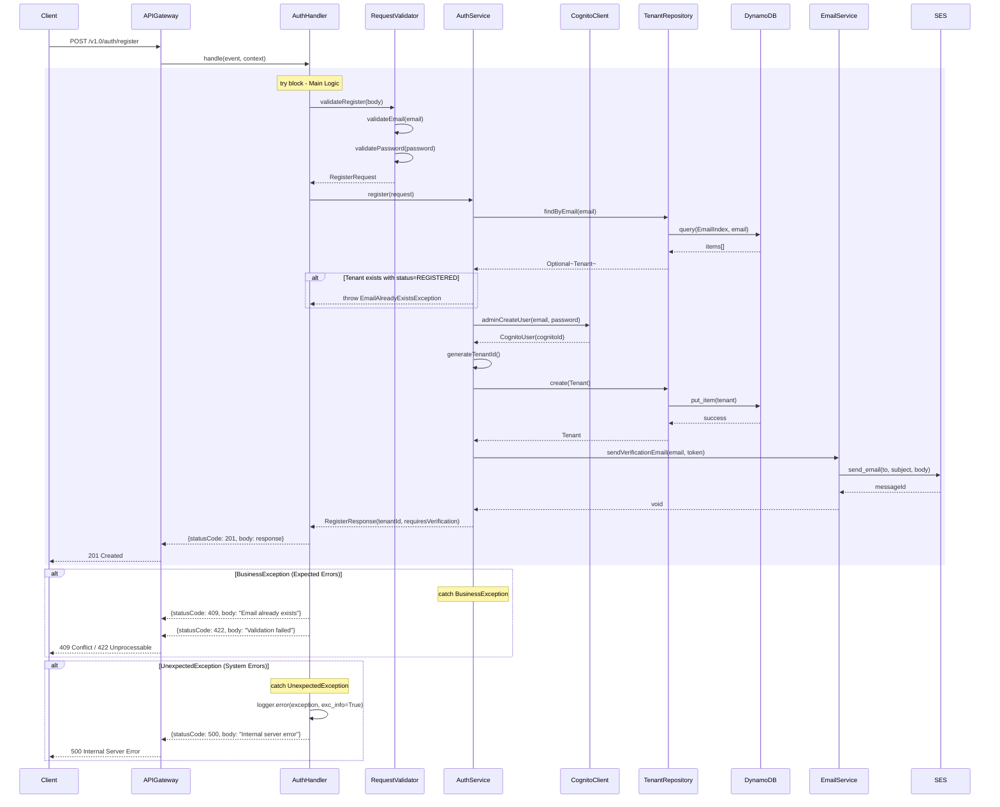
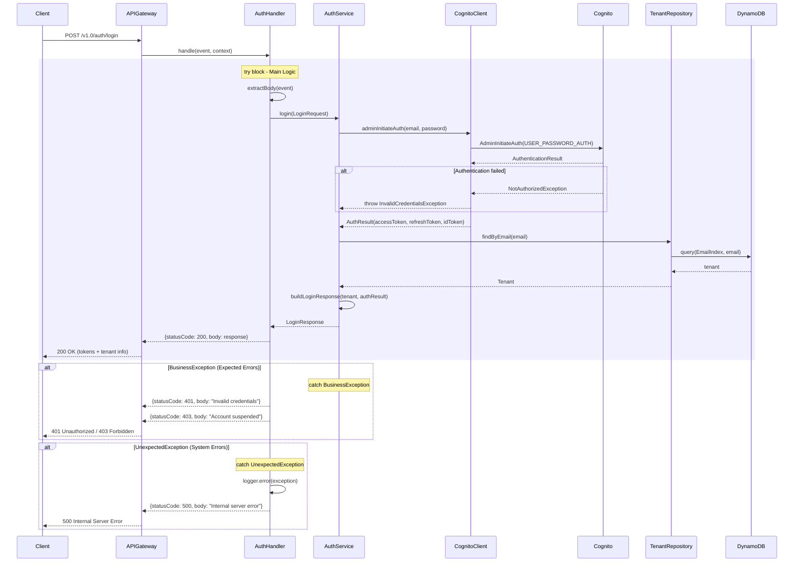
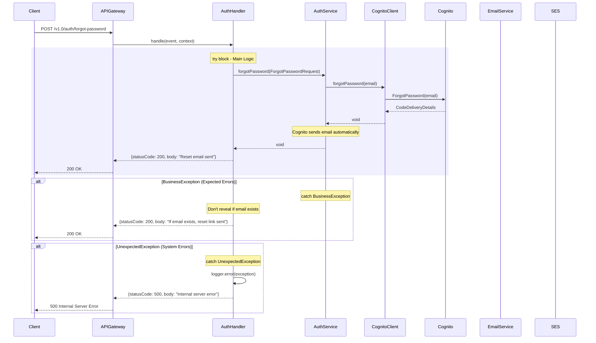
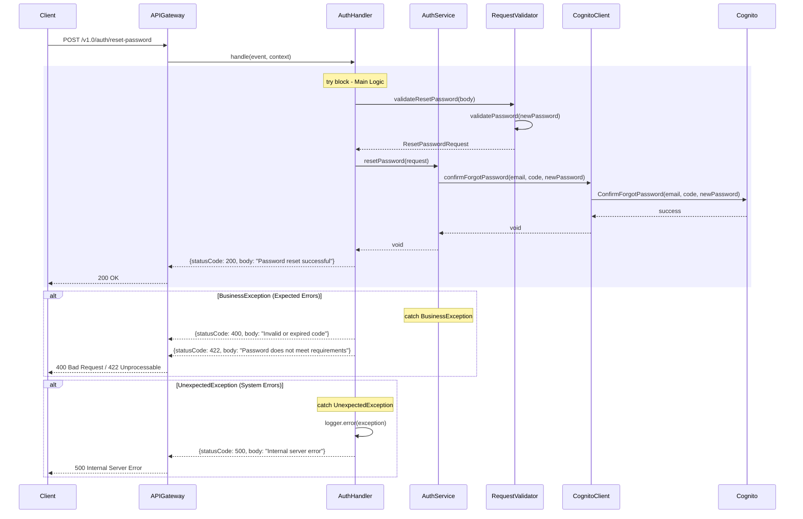
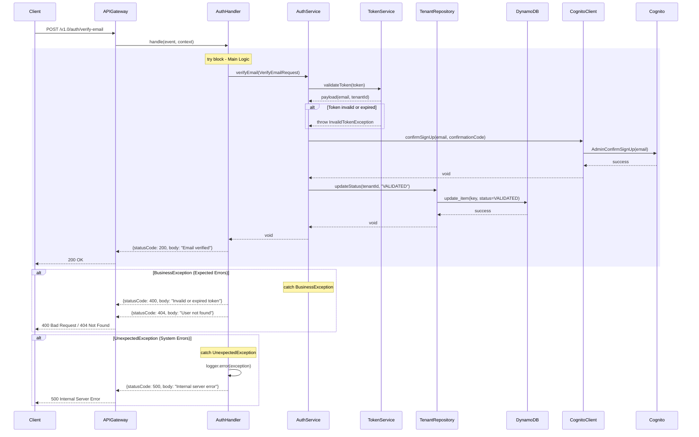

# CPP Auth Lambda - Low-Level Design

**Version**: 1.0
**Created**: 2025-12-15
**Status**: Draft
**Component**: Auth Service (2_bbws_auth_lambda)
**Parent HLD**: [HLD 2.1.2 Authentication Management](../HLDs/2.1.2_HLD_Authentication_Management.md)
**Parent BRS**: [BRS 2.1.2 Authentication Management](../BRS/2.1.2_BRS_Authentication_Management.md)

---

## Document Control

| Version | Date | Author | Changes |
|---------|------|--------|---------|
| 1.0 | 2025-12-15 | Agentic Architect | Initial version |

---

## Table of Contents

1. [Introduction](#1-introduction)
2. [High Level Epic Overview](#2-high-level-epic-overview)
3. [Component Diagram](#3-component-diagram)
4. [Sequence Diagrams](#4-sequence-diagrams)
5. [Data Models](#5-data-models)
6. [Messaging and Notifications](#6-messaging-and-notifications)
7. [NFRs](#7-nfrs)
8. [Risks and Mitigations](#8-risks-and-mitigations)
9. [Tagging](#9-tagging)
10. [Troubleshooting Playbook](#10-troubleshooting-playbook)
11. [Security](#11-security)
12. [Signoff](#12-signoff)
13. [TBC](#13-tbc)
14. [Definition of Terms](#14-definition-of-terms)
15. [Appendices](#15-appendices)
16. [References](#16-references)

---

## 1. Introduction

### 1.1 Purpose

This LLD provides implementation-level details for the Auth Lambda service, which handles user registration, authentication, password management, and email verification for the Customer Portal Public application.

### 1.2 Component Overview

| Attribute | Value |
|-----------|-------|
| Repository | `2_bbws_auth_lambda` |
| Runtime | Python 3.12 |
| Memory | 256MB |
| Timeout | 30s |
| Architecture | arm64 |

### 1.3 Lambda Functions (5 Total)

| Function | Endpoint | Description |
|----------|----------|-------------|
| register | POST /v1.0/auth/register | Customer registration |
| login | POST /v1.0/auth/login | User login |
| forgot_password | POST /v1.0/auth/forgot-password | Password reset request |
| reset_password | POST /v1.0/auth/reset-password | Set new password |
| verify_email | POST /v1.0/auth/verify-email | Email verification |

### 1.4 Dependencies

| Dependency | Purpose |
|------------|---------|
| AWS Cognito | User pool management, authentication |
| AWS DynamoDB | Tenant data storage |
| AWS SES | Email sending |
| AWS Secrets Manager | Cognito credentials |

---

## 2. High Level Epic Overview

| User Story # | Epic | User Story | Test Scenario(s) |
|--------------|------|------------|------------------|
| US-AUTH-001 | Registration | As a visitor, I want to register an account | Given valid data, then Cognito user and tenant created |
| US-AUTH-002 | Registration | As a visitor, I want to verify my email | Given valid token, then email marked verified |
| US-AUTH-003 | Login | As a user, I want to log in | Given valid credentials, then JWT tokens returned |
| US-AUTH-004 | Password | As a user, I want to reset my password | Given valid email, then reset link sent |
| US-AUTH-005 | Password | As a user, I want to set a new password | Given valid token and password, then password updated |
| US-AUTH-006 | Registration | As a visitor, I see error if email exists | Given existing email, then 409 Conflict returned |
| US-AUTH-007 | Login | As a user, I see error for invalid credentials | Given wrong password, then 401 Unauthorized |

---

## 3. Component Diagram

### 3.1 Class Structure



### 3.2 Repository Pattern



---

## 4. Sequence Diagrams

### 4.1 Register Flow



### 4.2 Login Flow



### 4.3 Forgot Password Flow



### 4.4 Reset Password Flow



### 4.5 Verify Email Flow



---

## 5. Data Models

### 5.1 DynamoDB Schema

#### Tenant Entity

| Attribute | Type | Description |
|-----------|------|-------------|
| PK | String | `TENANT#{tenantId}` |
| SK | String | `METADATA` |
| tenantId | String | UUID |
| email | String | User email (unique) |
| status | String | UNVALIDATED, VALIDATED, REGISTERED, SUSPENDED |
| cognitoId | String | Cognito user sub |
| firstName | String | User first name |
| lastName | String | User last name |
| active | Boolean | Soft delete flag (default: true) |
| createdAt | String | ISO 8601 timestamp |
| updatedAt | String | ISO 8601 timestamp |

#### GSI: EmailIndex

| Attribute | Type |
|-----------|------|
| PK (email) | String |
| SK (entity_type) | String |

### 5.2 Pydantic Models

```python
from pydantic import BaseModel, EmailStr, Field
from typing import Optional
from enum import Enum
from datetime import datetime

class TenantStatus(str, Enum):
    UNVALIDATED = "UNVALIDATED"
    VALIDATED = "VALIDATED"
    REGISTERED = "REGISTERED"
    SUSPENDED = "SUSPENDED"

class Tenant(BaseModel):
    tenant_id: str = Field(..., alias="tenantId")
    email: EmailStr
    status: TenantStatus
    cognito_id: Optional[str] = Field(None, alias="cognitoId")
    first_name: Optional[str] = Field(None, alias="firstName")
    last_name: Optional[str] = Field(None, alias="lastName")
    active: bool = True
    created_at: datetime = Field(..., alias="createdAt")
    updated_at: datetime = Field(..., alias="updatedAt")

    class Config:
        populate_by_name = True

class RegisterRequest(BaseModel):
    email: EmailStr
    password: str = Field(..., min_length=8, max_length=128)
    first_name: str = Field(..., alias="firstName", min_length=1, max_length=50)
    last_name: str = Field(..., alias="lastName", min_length=1, max_length=50)
    accept_terms: bool = Field(..., alias="acceptTerms")

class RegisterResponse(BaseModel):
    tenant_id: str = Field(..., alias="tenantId")
    email: EmailStr
    requires_verification: bool = Field(..., alias="requiresVerification")

class LoginRequest(BaseModel):
    email: EmailStr
    password: str

class LoginResponse(BaseModel):
    tenant_id: str = Field(..., alias="tenantId")
    email: EmailStr
    access_token: str = Field(..., alias="accessToken")
    refresh_token: str = Field(..., alias="refreshToken")
    id_token: str = Field(..., alias="idToken")
    expires_in: int = Field(..., alias="expiresIn")

class ForgotPasswordRequest(BaseModel):
    email: EmailStr

class ResetPasswordRequest(BaseModel):
    email: EmailStr
    code: str = Field(..., min_length=6, max_length=6)
    new_password: str = Field(..., alias="newPassword", min_length=8, max_length=128)

class VerifyEmailRequest(BaseModel):
    token: str
```

---

## 6. Messaging and Notifications

### 6.1 Email Templates

| Template | Subject | Trigger |
|----------|---------|---------|
| verification_email | "Verify your email - BBWS" | After registration |
| password_reset | "Reset your password - BBWS" | Forgot password |
| welcome_email | "Welcome to BBWS!" | After email verification |

### 6.2 Email Template Variables

```json
{
  "verification_email": {
    "firstName": "string",
    "verificationLink": "string",
    "expiryHours": "number"
  },
  "password_reset": {
    "firstName": "string",
    "resetLink": "string",
    "expiryMinutes": "number"
  },
  "welcome_email": {
    "firstName": "string",
    "loginLink": "string"
  }
}
```

---

## 7. NFRs

### 7.1 Performance

| Metric | Target |
|--------|--------|
| Register latency (p95) | < 2000ms |
| Login latency (p95) | < 500ms |
| Cold start | < 1000ms |
| Concurrent requests | 100/second |

### 7.2 Availability

| Metric | Target |
|--------|--------|
| Uptime | 99.9% |
| Error rate | < 0.1% |
| Failover time | < 30s |

### 7.3 Scalability

- Lambda auto-scales to handle traffic spikes
- DynamoDB on-demand capacity
- Cognito handles up to 400 requests/second

---

## 8. Risks and Mitigations

| Risk | Impact | Probability | Mitigation |
|------|--------|-------------|------------|
| Cognito throttling | High | Low | Implement exponential backoff |
| DynamoDB throttling | Medium | Low | Use on-demand capacity |
| Email delivery failures | Medium | Low | Implement retry with SES |
| Password brute force | High | Medium | Cognito rate limiting + lockout |
| Token leakage | High | Low | Short expiry, secure transmission |

---

## 9. Tagging

### 9.1 AWS Resource Tags

| Tag | Value |
|-----|-------|
| Project | BBWS |
| Application | CustomerPortalPublic |
| Component | AuthLambda |
| Environment | {dev\|sit\|prod} |
| CostCenter | BBWS-CPP |

---

## 10. Troubleshooting Playbook

### 10.1 Common Issues

| Issue | Symptoms | Resolution |
|-------|----------|------------|
| Registration fails | 500 error | Check Cognito user pool, DynamoDB table |
| Login fails | 401 error | Verify credentials, check Cognito status |
| Email not received | No verification email | Check SES sending limits, spam folder |
| Token expired | 400 error | User must request new token |
| Account locked | 403 error | Admin must unlock in Cognito |

### 10.2 Log Queries (CloudWatch Insights)

```sql
-- Find registration errors
fields @timestamp, @message
| filter @message like /ERROR/
| filter @message like /register/
| sort @timestamp desc
| limit 50

-- Find slow requests
fields @timestamp, @duration, @message
| filter @duration > 2000
| sort @duration desc
| limit 20
```

---

## 11. Security

### 11.1 Authentication

- Cognito handles password hashing (SRP protocol)
- JWT tokens with RS256 signing
- Access tokens expire in 1 hour
- Refresh tokens expire in 7 days

### 11.2 Password Policy

| Requirement | Value |
|-------------|-------|
| Minimum length | 8 characters |
| Require uppercase | Yes |
| Require lowercase | Yes |
| Require numbers | Yes |
| Require symbols | Yes |

### 11.3 Rate Limiting

| Operation | Limit |
|-----------|-------|
| Login attempts | 5 per minute per email |
| Password reset | 3 per hour per email |
| Registration | 10 per hour per IP |

### 11.4 Data Protection

- PII encrypted at rest (DynamoDB)
- TLS 1.2+ for all API calls
- Passwords never logged
- Tokens never logged

---

## 12. Signoff

| Role | Name | Date | Signature |
|------|------|------|-----------|
| Technical Lead | | | |
| Security | | | |
| Product Owner | | | |
| Business Owner | | | |

---

## 13. TBC

| # | Item | Status | Notes |
|---|------|--------|-------|
| TBC-001 | Social login (Google, Facebook) | Open | Phase 2 consideration |
| TBC-002 | MFA implementation | Open | Security review required |
| TBC-003 | Account merge for existing tenants | Open | Business rules needed |

---

## 14. Definition of Terms

| Term | Definition |
|------|------------|
| Cognito | AWS managed authentication service |
| JWT | JSON Web Token for stateless authentication |
| SRP | Secure Remote Password protocol |
| OTP | One-Time Password for verification |
| PII | Personally Identifiable Information |
| SES | AWS Simple Email Service |

---

## 15. Appendices

### Appendix A: Project Structure

```
2_bbws_auth_lambda/
├── src/
│   ├── __init__.py
│   ├── handlers/
│   │   ├── __init__.py
│   │   ├── register.py
│   │   ├── login.py
│   │   ├── forgot_password.py
│   │   ├── reset_password.py
│   │   └── verify_email.py
│   ├── services/
│   │   ├── __init__.py
│   │   ├── auth_service.py
│   │   ├── cognito_client.py
│   │   ├── email_service.py
│   │   └── token_service.py
│   ├── repositories/
│   │   ├── __init__.py
│   │   └── tenant_repository.py
│   ├── models/
│   │   ├── __init__.py
│   │   ├── tenant.py
│   │   └── requests.py
│   └── utils/
│       ├── __init__.py
│       ├── exceptions.py
│       ├── validators.py
│       └── response_builder.py
├── tests/
│   ├── __init__.py
│   ├── conftest.py
│   ├── unit/
│   │   ├── test_auth_service.py
│   │   ├── test_cognito_client.py
│   │   └── test_tenant_repository.py
│   └── integration/
│       └── test_handlers.py
├── terraform/
│   ├── main.tf
│   ├── lambda.tf
│   ├── api_gateway.tf
│   ├── iam.tf
│   ├── cognito.tf
│   └── variables.tf
├── requirements.txt
├── requirements-dev.txt
├── pytest.ini
└── README.md
```

### Appendix B: Environment Variables

```bash
COGNITO_USER_POOL_ID=af-south-1_xxxxxxxx
COGNITO_CLIENT_ID=xxxxxxxxxxxxxxxxxxxxxxxxxx
DYNAMODB_TABLE_NAME=bbws-tenants-{env}
SES_FROM_EMAIL=noreply@kimmyai.io
JWT_SECRET_ARN=arn:aws:secretsmanager:af-south-1:xxx:secret:jwt-secret
ENVIRONMENT={dev|sit|prod}
LOG_LEVEL=INFO
```

---

## 16. References

- [Parent HLD: BBWS Customer Portal Public](../BBWS_Customer_Portal_Public_HLD.md)
- [AWS Cognito Documentation](https://docs.aws.amazon.com/cognito/)
- [AWS Lambda Python](https://docs.aws.amazon.com/lambda/latest/dg/lambda-python.html)
- [Pydantic Documentation](https://docs.pydantic.dev/)

---

**End of Document**
