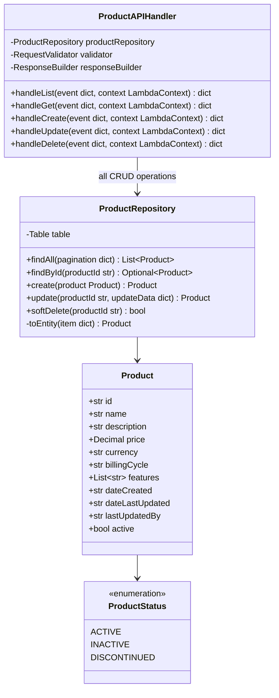
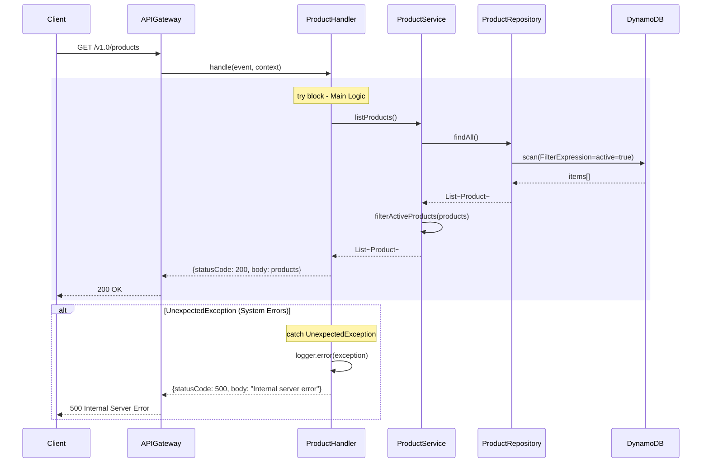
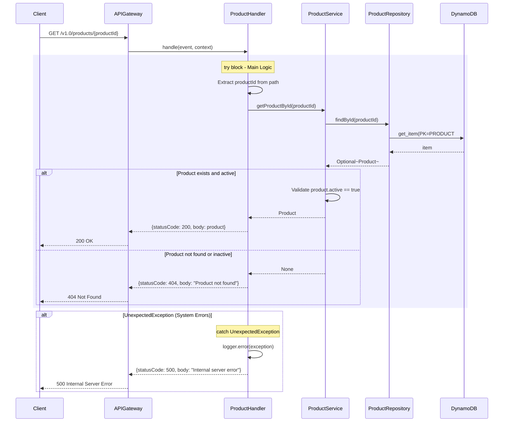
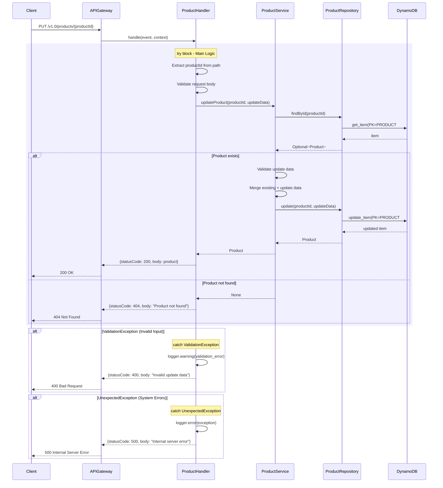
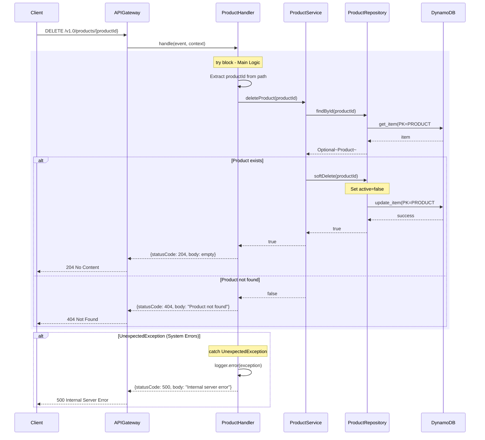

# CPP Product Lambda - Low-Level Design

**Version**: 4.0
**Created**: 2025-12-15
**Last Updated**: 2025-12-29
**Status**: Draft
**Component**: Product Service (2_bbws_product_lambda)
**Parent BRS**: [BRS 2.1.4: Product Management](../BRS/2.1.4_BRS_Product_Management.md)
**Parent HLD**: [HLD 2.1.4: Product Management](../HLDs/2.1.4_HLD_Product_Management.md)

---

## Document Control

| Version | Date | Author | Changes |
|---------|------|--------|---------|
| 1.0 | 2025-12-15 | Agentic Architect | Initial version - Synchronous CRUD operations with direct DynamoDB integration |
| 4.0 | 2025-12-29 | Agentic Architect | **Production Ready**: Finalized architecture with 5 Lambda functions (all API handlers). Direct synchronous DynamoDB integration. Single monorepo deployable unit. Comprehensive test coverage and documentation. |

---

## 1. Introduction

### 1.1 Purpose

This LLD provides implementation-level details for the Product Lambda service, which handles product listing for the Customer Portal Public application.

### 1.2 Component Overview

| Attribute | Value |
|-----------|-------|
| Repository | `2_bbws_product_lambda` |
| Runtime | Python 3.12 |
| Memory | 256MB |
| Timeout | 30s |
| Architecture | arm64 |

### 1.3 Lambda Functions

#### 1.3.1 Lambda Functions (5 Total - All API Handlers)

| Function | Endpoint | Trigger | Description |
|----------|----------|---------|-------------|
| list_products | GET /v1.0/products | API Gateway | List all active products with pagination (read from DynamoDB) |
| get_product | GET /v1.0/products/{productId} | API Gateway | Get product by ID (read from DynamoDB) |
| create_product | POST /v1.0/products | API Gateway | Validate request and create product in DynamoDB |
| update_product | PUT /v1.0/products/{productId} | API Gateway | Validate request and update product in DynamoDB |
| delete_product | DELETE /v1.0/products/{productId} | API Gateway | Soft delete product in DynamoDB (set active=false) |

#### 1.3.2 Architecture Pattern

The Product Service uses a **direct synchronous architecture** for all operations:
1. API Gateway receives product request (GET/POST/PUT/DELETE)
2. API Lambda handler processes request and directly interacts with DynamoDB
3. API returns appropriate response:
   - **201 Created** (POST - new product created)
   - **200 OK** (GET, PUT - data retrieved/updated)
   - **204 No Content** (DELETE - product soft deleted)
   - **404 Not Found** (GET, PUT, DELETE - product not found)

**All operations** are **synchronous** for immediate consistency.

**Benefits:**
- **Simplicity**: Direct DynamoDB integration, no message queues
- **Consistency**: Immediate consistency (read your writes)
- **Low Latency**: Single hop to database
- **Easy Testing**: Simple request-response flow
- **Reduced Cost**: No SQS charges
- **Single Deployable Unit**: All operations in monorepo (`2_bbws_product_lambda/`)

---

## 2. High Level Epic Overview

### 2.1 User Stories - API Operations

| User Story # | Epic | User Story | Test Scenario(s) |
|--------------|------|------------|------------------|
| US-PRD-001 | Products | As a visitor, I want to view all products | Given request, then all active products returned with pagination |
| US-PRD-002 | Products | As a visitor, I see product prices | Given products, then prices displayed correctly in specified currency |
| US-PRD-003 | Products | As a visitor, I see product features | Given products, then features list included with descriptions |
| US-PRD-004 | Products | As a visitor, I want to view a specific product | Given product ID, then product details returned (synchronous read) |
| US-PRD-005 | Products | As an admin, I want to create a new product | Given valid product data, then product created in DynamoDB and returns 201 Created with product details |
| US-PRD-006 | Products | As an admin, I want to update a product | Given product ID and update data, then product updated in DynamoDB and returns 200 OK with updated product |
| US-PRD-007 | Products | As an admin, I want to delete a product | Given product ID, then product soft deleted in DynamoDB (active=false) and returns 204 No Content |

### 2.2 User Stories - Data Operations

| User Story # | Epic | User Story | Test Scenario(s) |
|--------------|------|------------|------------------|
| US-PRD-008 | Product Processing | As a system, I want to persist product data | Given valid product data, then product saved to DynamoDB with all fields and returns 201 Created |
| US-PRD-009 | Product Processing | As a system, I want to handle validation errors | Given invalid product data, then return 400 Bad Request with validation errors |
| US-PRD-010 | Product Processing | As a system, I want to handle database errors | Given DynamoDB failure, then return 500 Internal Server Error and log error |

---

## 3. Component Diagram



---

## 4. Sequence Diagrams

### 4.1 List Products Flow



### 4.2 Get Product By ID Flow



### 4.3 Update Product Flow



### 4.5 Delete Product Flow (Soft Delete)



---

## 5. Data Models

### 5.1 DynamoDB Schema

#### 5.1.1 Single Table Design

**Table Name**: `bbws-customer-portal-products-{environment}`

**Capacity Mode**: On-Demand

#### 5.1.2 Access Patterns

| # | Access Pattern | Solution |
|---|----------------|----------|
| AP1 | List all active products | Base table scan with FilterExpression (active=true) |
| AP2 | Get product by ID | Base table query: PK=`PRODUCT#{productId}` AND SK=`METADATA` |
| AP3 | List products sorted by price | GSI1 query: GSI1_PK=`PRODUCT` sort by GSI1_SK (price) |
| AP4 | Search products by name | GSI2 query or OpenSearch |

#### 5.1.3 Primary Key Structure

| Key | Attribute | Pattern | Example |
|-----|-----------|---------|---------|
| PK (Partition Key) | `PK` | `PRODUCT#{productId}` | `PRODUCT#prod_550e8400-e29b-41d4-a716-446655440000` |
| SK (Sort Key) | `SK` | `METADATA` | `METADATA` |

#### 5.1.4 Product Entity Attributes

| Attribute | Type | Required | Description |
|-----------|------|----------|-------------|
| PK | String | Yes | `PRODUCT#{productId}` - Partition key |
| SK | String | Yes | `METADATA` - Sort key |
| entityType | String | Yes | `PRODUCT` - Entity type discriminator |
| id | String | Yes | UUID (same as productId in PK) |
| name | String | Yes | Product name |
| description | String | Yes | Product description |
| price | Number | Yes | Product price |
| currency | String | Yes | Currency code (e.g., ZAR, USD) |
| billingCycle | String | Yes | Billing cycle (monthly, yearly, one-time) |
| features | List | Yes | Array of feature strings |
| dateCreated | String | Yes | ISO 8601 timestamp |
| dateLastUpdated | String | Yes | ISO 8601 timestamp |
| lastUpdatedBy | String | Yes | User/system identifier who last updated |
| active | Boolean | Yes | Soft delete flag (true = active, false = deleted) |
| GSI1_PK | String | Yes | `PRODUCT` (for GSI1) |
| GSI1_SK | String | Yes | `{price}#{productId}` (for GSI1 sorting by price) |

#### 5.1.5 Global Secondary Indexes

**GSI1: ProductsByPriceIndex**

Enables querying all products sorted by price.

| Attribute | Type | Key Type | Description |
|-----------|------|----------|-------------|
| GSI1_PK | String | Partition Key | `PRODUCT` (constant for all products) |
| GSI1_SK | String | Sort Key | `{price}#{productId}` (sortable by price) |

**Projection**: ALL

**Use Case**: `GET /v1.0/products?sortBy=price&order=asc`

#### 5.1.6 Example DynamoDB Item

```json
{
  "PK": "PRODUCT#prod_550e8400-e29b-41d4-a716-446655440000",
  "SK": "METADATA",
  "entityType": "PRODUCT",
  "id": "prod_550e8400-e29b-41d4-a716-446655440000",
  "name": "WordPress Professional Plan",
  "description": "Complete WordPress hosting with premium support",
  "price": 299.99,
  "currency": "ZAR",
  "billingCycle": "monthly",
  "features": [
    "50 GB SSD Storage",
    "Unlimited Bandwidth",
    "Free SSL Certificate",
    "Daily Backups",
    "24/7 Premium Support"
  ],
  "dateCreated": "2025-01-15T10:00:00Z",
  "dateLastUpdated": "2025-12-19T10:30:00Z",
  "lastUpdatedBy": "admin@kimmyai.io",
  "active": true,
  "GSI1_PK": "PRODUCT",
  "GSI1_SK": "0299.99#prod_550e8400-e29b-41d4-a716-446655440000"
}
```

### 5.2 Pydantic Models

```python
from pydantic import BaseModel, Field
from decimal import Decimal
from typing import List, Optional
from datetime import datetime

class Product(BaseModel):
    """Product entity with Activatable Entity Pattern"""
    id: str
    name: str
    description: str
    price: Decimal
    currency: str
    billing_cycle: str = Field(..., alias="billingCycle")
    features: List[str] = []
    date_created: datetime = Field(..., alias="dateCreated")
    date_last_updated: datetime = Field(..., alias="dateLastUpdated")
    last_updated_by: str = Field(..., alias="lastUpdatedBy")
    active: bool = True

    class Config:
        populate_by_name = True

class ProductListResponse(BaseModel):
    """List response with pagination"""
    items: List[Product]
    start_at: Optional[str] = Field(None, alias="startAt")
    more_available: bool = Field(..., alias="moreAvailable")

    class Config:
        populate_by_name = True

class CreateProductRequest(BaseModel):
    """Request to create new product"""
    name: str = Field(..., min_length=1, max_length=100)
    description: str = Field(..., min_length=1, max_length=500)
    price: Decimal = Field(..., gt=0)
    currency: str = Field(default="ZAR", pattern="^[A-Z]{3}$")
    billing_cycle: str = Field(..., alias="billingCycle")
    features: List[str] = []

    class Config:
        populate_by_name = True

class UpdateProductRequest(BaseModel):
    """Request to update existing product"""
    name: Optional[str] = Field(None, min_length=1, max_length=100)
    description: Optional[str] = Field(None, min_length=1, max_length=500)
    price: Optional[Decimal] = Field(None, gt=0)
    currency: Optional[str] = Field(None, pattern="^[A-Z]{3}$")
    billing_cycle: Optional[str] = Field(None, alias="billingCycle")
    features: Optional[List[str]] = None
    active: Optional[bool] = None

    class Config:
        populate_by_name = True

```

---

## 6. REST API Operations

### 6.1 List Products

**Endpoint**: `GET /v1.0/products`

**Description**: Retrieve all active products available for purchase.

**Authentication**: None (public endpoint)

**Request Parameters**: None

**Request Headers**:
```
Accept: application/json
```

**Request Example**:
```http
GET /v1.0/products HTTP/1.1
Host: api.kimmyai.io
Accept: application/json
```

**Success Response (200 OK)**:

```json
{
  "products": [
    {
      "productId": "PROD-001",
      "name": "Entry",
      "description": "Domain registration only - new or transferred",
      "price": 95.00,
      "currency": "ZAR",
      "period": "per domain/year",
      "features": [
        "Domain registration",
        "Transfer existing domain",
        "1, 3 or 5 year options",
        "Domain management portal",
        "DNS configuration",
        "Domain privacy protection"
      ],
      "active": true,
      "createdAt": "2025-12-01T10:00:00Z"
    },
    {
      "productId": "PROD-002",
      "name": "Basic",
      "description": "Perfect for small businesses getting started online",
      "price": 1500.00,
      "currency": "ZAR",
      "period": "once-off + R1000/year",
      "features": [
        "1 domain included",
        "Landing page design",
        "Web hosting included",
        "SSL certificate",
        "Email support",
        "Annual renewal R1000"
      ],
      "active": true,
      "createdAt": "2025-12-01T10:00:00Z"
    }
  ],
  "count": 2
}
```

**Error Responses**:

| Status Code | Description | Response Body |
|-------------|-------------|---------------|
| 500 | Internal Server Error | `{"error": "Internal server error", "message": "An unexpected error occurred"}` |
| 503 | Service Unavailable | `{"error": "Service unavailable", "message": "DynamoDB is temporarily unavailable"}` |

**Response Schema**:

```json
{
  "type": "object",
  "properties": {
    "products": {
      "type": "array",
      "items": {
        "type": "object",
        "properties": {
          "productId": {"type": "string"},
          "name": {"type": "string"},
          "description": {"type": "string"},
          "price": {"type": "number"},
          "currency": {"type": "string"},
          "period": {"type": "string"},
          "features": {
            "type": "array",
            "items": {"type": "string"}
          },
          "active": {"type": "boolean"},
          "createdAt": {"type": "string", "format": "date-time"}
        },
        "required": ["productId", "name", "description", "price", "currency", "features", "active", "createdAt"]
      }
    },
    "count": {"type": "integer"}
  },
  "required": ["products", "count"]
}
```

**Business Rules**:
- Only products with `active=true` are returned
- Products are returned in creation order (oldest first)
- Empty array returned if no active products exist
- All prices are in the currency specified (default: ZAR)

**Performance Considerations**:
- Response time target: <300ms (p95)
- Caching: CloudFront cache for 5 minutes
- DynamoDB: Scan operation with FilterExpression

**Example cURL**:
```bash
curl -X GET "https://api.kimmyai.io/v1.0/products" \
  -H "Accept: application/json"
```

**Example JavaScript (Fetch)**:
```javascript
fetch('https://api.kimmyai.io/v1.0/products', {
  method: 'GET',
  headers: {
    'Accept': 'application/json'
  }
})
  .then(response => response.json())
  .then(data => console.log(data))
  .catch(error => console.error('Error:', error));
```

**Example Python (Requests)**:
```python
import requests

response = requests.get(
    'https://api.kimmyai.io/v1.0/products',
    headers={'Accept': 'application/json'}
)

if response.status_code == 200:
    products = response.json()
    print(f"Found {products['count']} products")
else:
    print(f"Error: {response.status_code}")
```

### 6.2 Get Product By ID

**Endpoint**: `GET /v1.0/products/{productId}`

**Description**: Retrieve a specific product by its unique identifier.

**Authentication**: None (public endpoint)

**Path Parameters**:

| Parameter | Type | Required | Description |
|-----------|------|----------|-------------|
| productId | string | Yes | Unique product identifier (e.g., PROD-001) |

**Request Headers**:
```
Accept: application/json
```

**Request Example**:
```http
GET /v1.0/products/PROD-001 HTTP/1.1
Host: api.kimmyai.io
Accept: application/json
```

**Success Response (200 OK)**:

```json
{
  "product": {
    "productId": "PROD-001",
    "name": "Entry",
    "description": "Domain registration only - new or transferred",
    "price": 95.00,
    "currency": "ZAR",
    "period": "per domain/year",
    "features": [
      "Domain registration",
      "Transfer existing domain",
      "1, 3 or 5 year options",
      "Domain management portal",
      "DNS configuration",
      "Domain privacy protection"
    ],
    "active": true,
    "createdAt": "2025-12-01T10:00:00Z"
  }
}
```

**Error Responses**:

| Status Code | Description | Response Body |
|-------------|-------------|---------------|
| 404 | Product Not Found | `{"error": "Product not found", "message": "Product with ID PROD-001 does not exist or is inactive"}` |
| 400 | Invalid Product ID | `{"error": "Invalid request", "message": "Product ID is required"}` |
| 500 | Internal Server Error | `{"error": "Internal server error", "message": "An unexpected error occurred"}` |

**Response Schema**:

```json
{
  "type": "object",
  "properties": {
    "product": {
      "type": "object",
      "properties": {
        "productId": {"type": "string"},
        "name": {"type": "string"},
        "description": {"type": "string"},
        "price": {"type": "number"},
        "currency": {"type": "string"},
        "period": {"type": "string"},
        "features": {
          "type": "array",
          "items": {"type": "string"}
        },
        "active": {"type": "boolean"},
        "createdAt": {"type": "string", "format": "date-time"}
      },
      "required": ["productId", "name", "description", "price", "currency", "features", "active", "createdAt"]
    }
  },
  "required": ["product"]
}
```

**Business Rules**:
- Only products with `active=true` can be retrieved
- Inactive products return 404 Not Found
- Invalid product ID format returns 400 Bad Request
- Product ID is case-sensitive

**Performance Considerations**:
- Response time target: <100ms (p95)
- Caching: CloudFront cache for 10 minutes per product
- DynamoDB: GetItem operation (single item lookup)

**Example cURL**:
```bash
curl -X GET "https://api.kimmyai.io/v1.0/products/PROD-001" \
  -H "Accept: application/json"
```

**Example JavaScript (Fetch)**:
```javascript
const productId = 'PROD-001';

fetch(`https://api.kimmyai.io/v1.0/products/${productId}`, {
  method: 'GET',
  headers: {
    'Accept': 'application/json'
  }
})
  .then(response => {
    if (response.status === 404) {
      throw new Error('Product not found');
    }
    return response.json();
  })
  .then(data => console.log(data.product))
  .catch(error => console.error('Error:', error));
```

**Example Python (Requests)**:
```python
import requests

product_id = 'PROD-001'
response = requests.get(
    f'https://api.kimmyai.io/v1.0/products/{product_id}',
    headers={'Accept': 'application/json'}
)

if response.status_code == 200:
    product = response.json()['product']
    print(f"Product: {product['name']} - {product['price']} {product['currency']}")
elif response.status_code == 404:
    print(f"Product {product_id} not found")
else:
    print(f"Error: {response.status_code}")
```

### 6.3 Create Product

**Endpoint**: `POST /v1.0/products`

**Description**: Create a new product in the system.

**Authentication**: Admin role required (future implementation)

**Request Headers**:
```
Content-Type: application/json
Accept: application/json
```

**Request Body**:

| Field | Type | Required | Description |
|-------|------|----------|-------------|
| name | string | Yes | Product name |
| description | string | Yes | Product description |
| price | number | Yes | Price (e.g., 95.00) |
| currency | string | No | Currency code (default: ZAR) |
| period | string | Yes | Billing period (e.g., "per domain/year") |
| features | array[string] | No | List of product features |

**Request Example**:
```http
POST /v1.0/products HTTP/1.1
Host: api.kimmyai.io
Content-Type: application/json
Accept: application/json

{
  "name": "Premium",
  "description": "Perfect for growing businesses",
  "price": 3500.00,
  "currency": "ZAR",
  "period": "once-off + R2500/year",
  "features": [
    "Up to 3 domains included",
    "Advanced landing page design",
    "Premium hosting",
    "SSL certificates",
    "Priority email support",
    "Monthly analytics reports"
  ]
}
```

**Success Response (201 Created)**:

```json
{
  "product": {
    "productId": "550e8400-e29b-41d4-a716-446655440000",
    "name": "Premium",
    "description": "Perfect for growing businesses",
    "price": 3500.00,
    "currency": "ZAR",
    "period": "once-off + R2500/year",
    "features": [
      "Up to 3 domains included",
      "Advanced landing page design",
      "Premium hosting",
      "SSL certificates",
      "Priority email support",
      "Monthly analytics reports"
    ],
    "active": true,
    "createdAt": "2025-12-18T10:30:00Z"
  }
}
```

**Error Responses**:

| Status Code | Description | Response Body |
|-------------|-------------|---------------|
| 400 | Invalid Request | `{"error": "Invalid request", "message": "Missing required field: name"}` |
| 400 | Validation Error | `{"error": "Validation error", "message": "Price must be greater than zero"}` |
| 401 | Unauthorized | `{"error": "Unauthorized", "message": "Admin authentication required"}` |
| 500 | Internal Server Error | `{"error": "Internal server error", "message": "An unexpected error occurred"}` |

**Response Schema**:

```json
{
  "type": "object",
  "properties": {
    "product": {
      "type": "object",
      "properties": {
        "productId": {"type": "string", "format": "uuid"},
        "name": {"type": "string"},
        "description": {"type": "string"},
        "price": {"type": "number"},
        "currency": {"type": "string"},
        "period": {"type": "string"},
        "features": {
          "type": "array",
          "items": {"type": "string"}
        },
        "active": {"type": "boolean"},
        "createdAt": {"type": "string", "format": "date-time"}
      },
      "required": ["productId", "name", "description", "price", "currency", "period", "features", "active", "createdAt"]
    }
  },
  "required": ["product"]
}
```

**Business Rules**:
- Product ID is auto-generated (UUID v4)
- `active` flag defaults to `true`
- `createdAt` timestamp is auto-generated (ISO 8601)
- All prices must be greater than zero
- Name must be unique within the system
- Currency defaults to "ZAR" if not provided

**Validation Rules**:
- `name`: 3-100 characters, alphanumeric with spaces
- `description`: 10-500 characters
- `price`: Decimal, min: 0.01, max: 999999.99
- `currency`: 3-letter ISO 4217 code (ZAR, USD, EUR, etc.)
- `period`: 5-100 characters
- `features`: Max 20 items, each 5-200 characters

**Performance Considerations**:
- Response time target: <200ms (p95)
- DynamoDB: PutItem operation (single write)

**Example cURL**:
```bash
curl -X POST "https://api.kimmyai.io/v1.0/products" \
  -H "Content-Type: application/json" \
  -H "Accept: application/json" \
  -d '{
    "name": "Premium",
    "description": "Perfect for growing businesses",
    "price": 3500.00,
    "currency": "ZAR",
    "period": "once-off + R2500/year",
    "features": [
      "Up to 3 domains included",
      "Advanced landing page design",
      "Premium hosting"
    ]
  }'
```

**Example JavaScript (Fetch)**:
```javascript
const newProduct = {
  name: "Premium",
  description: "Perfect for growing businesses",
  price: 3500.00,
  currency: "ZAR",
  period: "once-off + R2500/year",
  features: [
    "Up to 3 domains included",
    "Advanced landing page design",
    "Premium hosting"
  ]
};

fetch('https://api.kimmyai.io/v1.0/products', {
  method: 'POST',
  headers: {
    'Content-Type': 'application/json',
    'Accept': 'application/json'
  },
  body: JSON.stringify(newProduct)
})
  .then(response => {
    if (response.status === 201) {
      return response.json();
    }
    throw new Error(`HTTP ${response.status}`);
  })
  .then(data => console.log('Created product:', data.product))
  .catch(error => console.error('Error:', error));
```

**Example Python (Requests)**:
```python
import requests

new_product = {
    "name": "Premium",
    "description": "Perfect for growing businesses",
    "price": 3500.00,
    "currency": "ZAR",
    "period": "once-off + R2500/year",
    "features": [
        "Up to 3 domains included",
        "Advanced landing page design",
        "Premium hosting"
    ]
}

response = requests.post(
    'https://api.kimmyai.io/v1.0/products',
    headers={
        'Content-Type': 'application/json',
        'Accept': 'application/json'
    },
    json=new_product
)

if response.status_code == 201:
    product = response.json()['product']
    print(f"Created product: {product['productId']}")
elif response.status_code == 400:
    error = response.json()
    print(f"Validation error: {error['message']}")
else:
    print(f"Error: {response.status_code}")
```

### 6.4 Update Product

**Endpoint**: `PUT /v1.0/products/{productId}`

**Description**: Update an existing product by its unique identifier.

**Authentication**: Admin role required (future implementation)

**Path Parameters**:

| Parameter | Type | Required | Description |
|-----------|------|----------|-------------|
| productId | string | Yes | Unique product identifier (UUID) |

**Request Headers**:
```
Content-Type: application/json
Accept: application/json
```

**Request Body** (all fields optional):

| Field | Type | Required | Description |
|-------|------|----------|-------------|
| name | string | No | Product name |
| description | string | No | Product description |
| price | number | No | Price (e.g., 95.00) |
| currency | string | No | Currency code |
| period | string | No | Billing period |
| features | array[string] | No | List of product features |
| active | boolean | No | Active status flag |

**Request Example**:
```http
PUT /v1.0/products/550e8400-e29b-41d4-a716-446655440000 HTTP/1.1
Host: api.kimmyai.io
Content-Type: application/json
Accept: application/json

{
  "price": 3800.00,
  "description": "Perfect for growing businesses - now with more features",
  "features": [
    "Up to 3 domains included",
    "Advanced landing page design",
    "Premium hosting",
    "SSL certificates",
    "Priority email support",
    "Monthly analytics reports",
    "Free domain privacy"
  ]
}
```

**Success Response (200 OK)**:

```json
{
  "product": {
    "productId": "550e8400-e29b-41d4-a716-446655440000",
    "name": "Premium",
    "description": "Perfect for growing businesses - now with more features",
    "price": 3800.00,
    "currency": "ZAR",
    "period": "once-off + R2500/year",
    "features": [
      "Up to 3 domains included",
      "Advanced landing page design",
      "Premium hosting",
      "SSL certificates",
      "Priority email support",
      "Monthly analytics reports",
      "Free domain privacy"
    ],
    "active": true,
    "createdAt": "2025-12-18T10:30:00Z"
  }
}
```

**Error Responses**:

| Status Code | Description | Response Body |
|-------------|-------------|---------------|
| 400 | Invalid Request | `{"error": "Invalid request", "message": "Invalid price value"}` |
| 401 | Unauthorized | `{"error": "Unauthorized", "message": "Admin authentication required"}` |
| 404 | Product Not Found | `{"error": "Product not found", "message": "Product with ID {productId} does not exist"}` |
| 500 | Internal Server Error | `{"error": "Internal server error", "message": "An unexpected error occurred"}` |

**Response Schema**:

```json
{
  "type": "object",
  "properties": {
    "product": {
      "type": "object",
      "properties": {
        "productId": {"type": "string", "format": "uuid"},
        "name": {"type": "string"},
        "description": {"type": "string"},
        "price": {"type": "number"},
        "currency": {"type": "string"},
        "period": {"type": "string"},
        "features": {
          "type": "array",
          "items": {"type": "string"}
        },
        "active": {"type": "boolean"},
        "createdAt": {"type": "string", "format": "date-time"}
      },
      "required": ["productId", "name", "description", "price", "currency", "period", "features", "active", "createdAt"]
    }
  },
  "required": ["product"]
}
```

**Business Rules**:
- Only existing products can be updated
- At least one field must be provided in update request
- Product ID cannot be changed
- `createdAt` timestamp cannot be modified
- Partial updates are supported (only provided fields are updated)
- Updating `active` to `false` soft-deletes the product

**Validation Rules**:
- Same validation as Create Product for all fields
- Empty update body returns 400 Bad Request

**Performance Considerations**:
- Response time target: <150ms (p95)
- DynamoDB: GetItem + UpdateItem operations (conditional update)

**Example cURL**:
```bash
curl -X PUT "https://api.kimmyai.io/v1.0/products/550e8400-e29b-41d4-a716-446655440000" \
  -H "Content-Type: application/json" \
  -H "Accept: application/json" \
  -d '{
    "price": 3800.00,
    "description": "Perfect for growing businesses - now with more features"
  }'
```

**Example JavaScript (Fetch)**:
```javascript
const productId = '550e8400-e29b-41d4-a716-446655440000';
const updates = {
  price: 3800.00,
  description: "Perfect for growing businesses - now with more features"
};

fetch(`https://api.kimmyai.io/v1.0/products/${productId}`, {
  method: 'PUT',
  headers: {
    'Content-Type': 'application/json',
    'Accept': 'application/json'
  },
  body: JSON.stringify(updates)
})
  .then(response => {
    if (response.status === 200) {
      return response.json();
    } else if (response.status === 404) {
      throw new Error('Product not found');
    }
    throw new Error(`HTTP ${response.status}`);
  })
  .then(data => console.log('Updated product:', data.product))
  .catch(error => console.error('Error:', error));
```

**Example Python (Requests)**:
```python
import requests

product_id = '550e8400-e29b-41d4-a716-446655440000'
updates = {
    "price": 3800.00,
    "description": "Perfect for growing businesses - now with more features"
}

response = requests.put(
    f'https://api.kimmyai.io/v1.0/products/{product_id}',
    headers={
        'Content-Type': 'application/json',
        'Accept': 'application/json'
    },
    json=updates
)

if response.status_code == 200:
    product = response.json()['product']
    print(f"Updated product: {product['name']} - {product['price']} {product['currency']}")
elif response.status_code == 404:
    print(f"Product {product_id} not found")
else:
    print(f"Error: {response.status_code}")
```

### 6.5 Delete Product (Soft Delete)

**Endpoint**: `DELETE /v1.0/products/{productId}`

**Description**: Soft delete a product by setting its active flag to false. The product remains in the database but is excluded from public listings.

**Authentication**: Admin role required (future implementation)

**Path Parameters**:

| Parameter | Type | Required | Description |
|-----------|------|----------|-------------|
| productId | string | Yes | Unique product identifier (UUID) |

**Request Headers**:
```
Accept: application/json
```

**Request Example**:
```http
DELETE /v1.0/products/550e8400-e29b-41d4-a716-446655440000 HTTP/1.1
Host: api.kimmyai.io
Accept: application/json
```

**Success Response (204 No Content)**:

No response body returned. Status code 204 indicates successful deletion.

**Error Responses**:

| Status Code | Description | Response Body |
|-------------|-------------|---------------|
| 401 | Unauthorized | `{"error": "Unauthorized", "message": "Admin authentication required"}` |
| 404 | Product Not Found | `{"error": "Product not found", "message": "Product with ID {productId} does not exist"}` |
| 500 | Internal Server Error | `{"error": "Internal server error", "message": "An unexpected error occurred"}` |

**Business Rules**:
- This is a soft delete operation (sets `active=false`)
- Product data is retained in DynamoDB
- Deleted products do not appear in GET /v1.0/products listings
- Deleted products return 404 on GET /v1.0/products/{productId}
- Deleted products can be restored by updating `active=true`
- Hard delete is not supported (data retention policy)

**Performance Considerations**:
- Response time target: <100ms (p95)
- DynamoDB: GetItem + UpdateItem operations

**Example cURL**:
```bash
curl -X DELETE "https://api.kimmyai.io/v1.0/products/550e8400-e29b-41d4-a716-446655440000" \
  -H "Accept: application/json" \
  -w "HTTP Status: %{http_code}\n"
```

**Example JavaScript (Fetch)**:
```javascript
const productId = '550e8400-e29b-41d4-a716-446655440000';

fetch(`https://api.kimmyai.io/v1.0/products/${productId}`, {
  method: 'DELETE',
  headers: {
    'Accept': 'application/json'
  }
})
  .then(response => {
    if (response.status === 204) {
      console.log('Product deleted successfully');
    } else if (response.status === 404) {
      throw new Error('Product not found');
    } else {
      throw new Error(`HTTP ${response.status}`);
    }
  })
  .catch(error => console.error('Error:', error));
```

**Example Python (Requests)**:
```python
import requests

product_id = '550e8400-e29b-41d4-a716-446655440000'

response = requests.delete(
    f'https://api.kimmyai.io/v1.0/products/{product_id}',
    headers={'Accept': 'application/json'}
)

if response.status_code == 204:
    print(f"Product {product_id} deleted successfully")
elif response.status_code == 404:
    print(f"Product {product_id} not found")
else:
    print(f"Error: {response.status_code}")
```

**Restoration Example**:

To restore a soft-deleted product, use the Update Product endpoint:

```bash
curl -X PUT "https://api.kimmyai.io/v1.0/products/550e8400-e29b-41d4-a716-446655440000" \
  -H "Content-Type: application/json" \
  -H "Accept: application/json" \
  -d '{"active": true}'
```

---

## 7. Messaging and Notifications

No notifications for this service.

---

## 8. NFRs (Non-Functional Requirements)

### 8.1 Performance Targets

| Metric | Target | Notes |
|--------|--------|-------|
| List products API latency (p95) | < 200ms | Synchronous read from DynamoDB |
| Get product API latency (p95) | < 100ms | Direct DynamoDB get_item |
| Create product API latency (p95) | < 250ms | Direct DynamoDB write with validation |
| Update product API latency (p95) | < 250ms | Direct DynamoDB update with validation |
| Delete product API latency (p95) | < 150ms | Direct DynamoDB soft delete (update active=false) |

### 8.2 Scalability Targets

| Metric | Target |
|--------|--------|
| Concurrent product operations | 100 operations/second |
| Lambda concurrent executions | 100 per function (reserved) |
| DynamoDB read/write capacity | On-demand (auto-scaling) |

### 8.3 Availability and Reliability

| Metric | Target |
|--------|--------|
| API availability | 99.9% (SLA) |
| Product change processing success rate | 99.95% |
| Data durability | 99.999999999% (DynamoDB) |
| Recovery Time Objective (RTO) | < 30 minutes |
| Recovery Point Objective (RPO) | < 1 minute |

### 8.4 Data Retention

| Data Type | Retention Period | Storage |
|-----------|------------------|---------|
| Product records | Indefinite | DynamoDB with PITR |
| CloudWatch logs | 90 days | Log retention policy |
| Lambda function versions | 30 days | Automatic cleanup of old versions |

---

## 9. Risks and Mitigations

| Risk | Impact | Likelihood | Mitigation |
|------|--------|------------|------------|
| DynamoDB throttling | Medium | Low | On-demand capacity mode, reserved Lambda concurrency |
| Duplicate product creation | High | Low | Idempotency checks, DynamoDB conditional writes |
| Invalid product data | Medium | Medium | Schema validation in API handler, Pydantic models |
| Concurrent product updates | Medium | Low | Optimistic locking with version numbers |
| Price manipulation | High | Low | Multi-layer validation (API + service layer) |
| Unauthorized product changes | High | Low | Admin authentication (future), API key validation |
| Lambda timeout | Medium | Low | 30s timeout, CloudWatch alarms on duration |
| DynamoDB unavailable | High | Very Low | Multi-AZ deployment, automatic failover, PITR backups |
| API Gateway failures | High | Very Low | CloudWatch alarms, automatic retries with exponential backoff |

---

## 10. Tagging

| Tag | Value |
|-----|-------|
| Project | BBWS |
| Component | ProductLambda |
| CostCenter | BBWS-CPP |

---

## 11. Troubleshooting Playbook

| Issue | Resolution |
|-------|------------|
| Empty response | Check DynamoDB for active products |
| Slow response | Check DynamoDB read capacity |
| 404 on existing product | Check if product.active=false (soft deleted) |
| Create product fails | Validate request body against schema, check DynamoDB write capacity |
| Update conflicts | Check for concurrent updates, retry with exponential backoff |
| Unauthorized errors | Verify admin authentication (future implementation) |
| Validation errors | Check field constraints: price > 0, name length, etc. |

---

## 12. Security

**Public Endpoints** (no authentication):
- GET /v1.0/products (list all products)
- GET /v1.0/products/{productId} (get product by ID)

**Admin Endpoints** (authentication required - future implementation):
- POST /v1.0/products (create product)
- PUT /v1.0/products/{productId} (update product)
- DELETE /v1.0/products/{productId} (delete product)

**Security Measures**:
- Rate limiting at API Gateway: 100 req/s for public, 50 req/s for admin
- No PII handling in product data
- Input validation and sanitization for all fields
- Soft delete only (no hard delete to prevent data loss)
- CloudWatch logging for all operations
- DynamoDB encryption at rest (AWS managed keys)
- API Gateway CORS configuration for web clients
- Request body size limit: 10KB

---

## 13. Signoff

| Role | Name | Date | Signature |
|------|------|------|-----------|
| Technical Lead | | | |
| Business Owner | | | |

---

## 14. TBC

| # | Item | Status |
|---|------|--------|
| TBC-001 | Product filtering/search | Open |
| TBC-002 | Product categories | Open |
| TBC-003 | Admin authentication and authorization | Open |
| TBC-004 | Product versioning for audit trail | Open |
| TBC-005 | Bulk product import/export | Open |
| TBC-006 | Product image upload support | Open |
| TBC-007 | Pagination for list products | Open |
| TBC-008 | DynamoDB conditional updates with version numbers | Open |
| TBC-009 | Product name uniqueness constraint | Open |
| TBC-010 | Multi-currency support | Open |

---

## 15. Definition of Terms

| Term | Definition |
|------|------------|
| Product | Service/item available for purchase on the Big Beard platform |
| CRUD | Create, Read, Update, Delete - basic database operations |
| Soft Delete | Marking a record as inactive (active=false) instead of physically removing it |
| Hard Delete | Permanently removing a record from the database (not supported) |
| Active Product | Product with active=true, visible in listings and available for purchase |
| UUID | Universally Unique Identifier - 128-bit identifier (e.g., 550e8400-e29b-41d4-a716-446655440000) |
| PK | Partition Key - primary identifier in DynamoDB (PRODUCT#{productId}) |
| SK | Sort Key - secondary identifier in DynamoDB (METADATA for products) |
| Partial Update | Updating only specific fields while preserving others |
| Product Restoration | Re-activating a soft-deleted product by setting active=true |
| Idempotency | Property where multiple identical requests produce the same result |

---

## 16. Appendices

### CRUD Operations Summary

The Product Lambda service implements full CRUD (Create, Read, Update, Delete) operations:

| Operation | HTTP Method | Endpoint | Status Code | Description |
|-----------|-------------|----------|-------------|-------------|
| **Create** | POST | /v1.0/products | 201 Created | Create new product with auto-generated UUID |
| **Read (List)** | GET | /v1.0/products | 200 OK | List all active products |
| **Read (Single)** | GET | /v1.0/products/{productId} | 200 OK | Get product by ID (active only) |
| **Update** | PUT | /v1.0/products/{productId} | 200 OK | Update product (partial updates supported) |
| **Delete** | DELETE | /v1.0/products/{productId} | 204 No Content | Soft delete (set active=false) |

**Key Features**:
- Soft delete implementation using `active` boolean flag
- UUID v4 for product IDs (auto-generated on create)
- Partial updates supported (only provided fields updated)
- Public read endpoints (no authentication)
- Admin-only write endpoints (authentication TBC)
- Comprehensive validation and error handling
- DynamoDB single-table design with PK/SK pattern

**Data Lifecycle**:
1. **Created**: Product created with `active=true`, auto-generated UUID and timestamp
2. **Active**: Product visible in listings, available for purchase
3. **Updated**: Product modified while maintaining `productId` and `createdAt`
4. **Soft Deleted**: Product set to `active=false`, hidden from listings but retained in DB
5. **Restored**: Soft-deleted product reactivated by setting `active=true`

### Project Structure

```
2_1_bbws_product_lambda/
├── src/
│   ├── handlers/
│   │   ├── __init__.py
│   │   ├── list_products.py         # GET /v1.0/products
│   │   ├── get_product.py           # GET /v1.0/products/{productId}
│   │   ├── create_product.py        # POST /v1.0/products
│   │   ├── update_product.py        # PUT /v1.0/products/{productId}
│   │   └── delete_product.py        # DELETE /v1.0/products/{productId}
│   ├── services/
│   │   ├── __init__.py
│   │   └── product_service.py       # Business logic layer
│   ├── repositories/
│   │   ├── __init__.py
│   │   └── product_repository.py    # DynamoDB data access layer
│   ├── models/
│   │   ├── __init__.py
│   │   └── product.py               # Pydantic models
│   ├── validators/
│   │   ├── __init__.py
│   │   └── product_validator.py     # Input validation
│   ├── exceptions/
│   │   ├── __init__.py
│   │   └── product_exceptions.py    # Custom exceptions
│   └── utils/
│       ├── __init__.py
│       ├── response_builder.py      # API response formatting
│       └── logger.py                # CloudWatch logging
├── tests/
│   ├── unit/
│   │   ├── handlers/
│   │   │   ├── test_list_products.py
│   │   │   ├── test_get_product.py
│   │   │   ├── test_create_product.py
│   │   │   ├── test_update_product.py
│   │   │   └── test_delete_product.py
│   │   ├── services/
│   │   │   └── test_product_service.py
│   │   └── repositories/
│   │       └── test_product_repository.py
│   └── integration/
│       ├── test_product_api.py
│       └── test_product_crud_flow.py
├── terraform/
│   ├── main.tf                      # Main configuration
│   ├── api_gateway.tf               # API Gateway resources
│   ├── lambda.tf                    # Lambda functions
│   ├── dynamodb.tf                  # DynamoDB table
│   ├── iam.tf                       # IAM roles and policies
│   ├── cloudwatch.tf                # Logging and monitoring
│   ├── variables.tf                 # Input variables
│   ├── outputs.tf                   # Output values
│   └── environments/
│       ├── dev.tfvars
│       ├── sit.tfvars
│       └── prod.tfvars
├── openapi/
│   └── product-api.yaml             # OpenAPI 3.0 specification
├── requirements.txt                 # Python dependencies
├── requirements-dev.txt             # Development dependencies
├── pytest.ini                       # Pytest configuration
├── .gitignore
└── README.md                        # Project documentation
```

---

## 17. References

- [Parent HLD: BBWS Customer Portal Public](../HLDs/2.1_BBWS_Customer_Portal_Public_HLD.md)

---

**End of Document**
