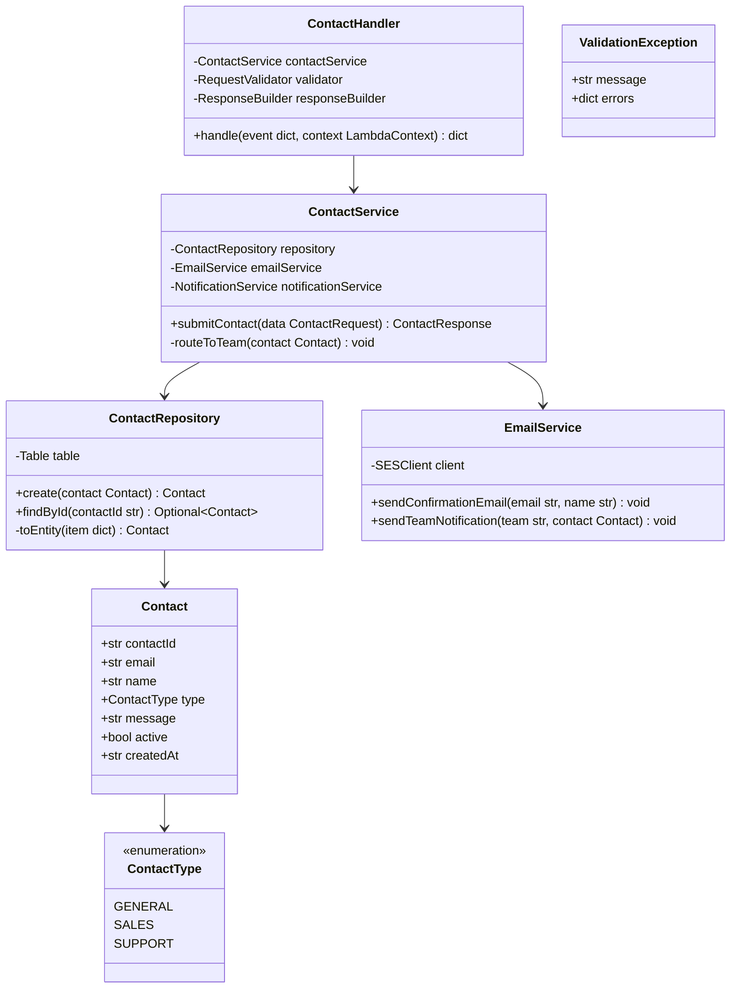
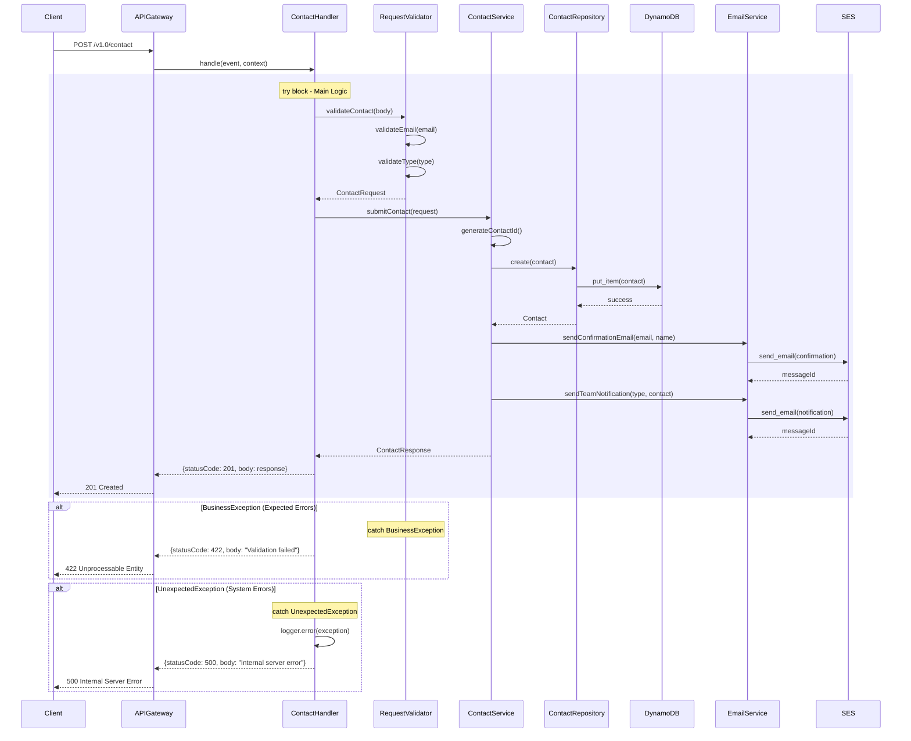

# CPP Contact Lambda - Low-Level Design

**Version**: 1.0
**Created**: 2025-12-15
**Status**: Draft
**Component**: Contact Service (2_bbws_contact_lambda)
**Parent BRS**: [BRS 2.1.5: Contact Management](../BRS/2.1.5_BRS_Contact_Management.md)
**Parent HLD**: [HLD 2.1.5: Contact Management](../HLDs/2.1.5_HLD_Contact_Management.md)

---

## Document Control

| Version | Date | Author | Changes |
|---------|------|--------|---------|
| 1.0 | 2025-12-15 | Agentic Architect | Initial version |

---

## 1. Introduction

### 1.1 Purpose

This LLD provides implementation-level details for the Contact Lambda service, which handles contact form submissions for general inquiries, sales, and support.

### 1.2 Component Overview

| Attribute | Value |
|-----------|-------|
| Repository | `2_bbws_contact_lambda` |
| Runtime | Python 3.12 |
| Memory | 256MB |
| Timeout | 30s |
| Architecture | arm64 |

### 1.3 Lambda Functions (1 Total)

| Function | Endpoint | Description |
|----------|----------|-------------|
| submit_contact | POST /v1.0/contact | Submit contact form |

---

## 2. High Level Epic Overview

| User Story # | Epic | User Story | Test Scenario(s) |
|--------------|------|------------|------------------|
| US-CTT-001 | Contact | As a visitor, I want to submit a contact form | Given valid data, then message stored and notification sent |
| US-CTT-002 | Contact | As a visitor, I can select inquiry type | Given type=sales, then routed to sales team |
| US-CTT-003 | Contact | As a visitor, I see validation errors | Given invalid email, then 422 returned |

---

## 3. Component Diagram



---

## 4. Sequence Diagrams

### 4.1 Submit Contact Flow



---

## 5. Data Models

### 5.1 DynamoDB Schema

#### Contact Entity

| Attribute | Type | Description |
|-----------|------|-------------|
| PK | String | `CONTACT#{contactId}` |
| SK | String | `METADATA` |
| contactId | String | UUID |
| email | String | Sender email |
| name | String | Sender name |
| type | String | GENERAL, SALES, SUPPORT |
| message | String | Contact message |
| active | Boolean | Soft delete flag |
| createdAt | String | ISO 8601 timestamp |

### 5.2 Pydantic Models

```python
from pydantic import BaseModel, EmailStr, Field
from enum import Enum

class ContactType(str, Enum):
    GENERAL = "general"
    SALES = "sales"
    SUPPORT = "support"

class ContactRequest(BaseModel):
    email: EmailStr
    name: str = Field(..., min_length=1, max_length=100)
    type: ContactType
    message: str = Field(..., min_length=10, max_length=2000)

class ContactResponse(BaseModel):
    contact_id: str = Field(..., alias="contactId")
    message: str = "Thank you for contacting us"
```

---

## 6. Messaging and Notifications

### 6.1 Email Templates

| Template | Recipient | Trigger |
|----------|-----------|---------|
| contact_confirmation | Sender | After form submission |
| contact_notification | Team inbox | After form submission |

### 6.2 Team Routing

| Contact Type | Email |
|--------------|-------|
| GENERAL | info@bigbeard.co.za |
| SALES | sales@bigbeard.co.za |
| SUPPORT | support@bigbeard.co.za |

---

## 7. NFRs

| Metric | Target |
|--------|--------|
| Submit latency (p95) | < 1000ms |
| Cold start | < 500ms |

---

## 8. Risks and Mitigations

| Risk | Impact | Mitigation |
|------|--------|------------|
| Spam submissions | Medium | Implement rate limiting, CAPTCHA |
| Email delivery failure | Medium | Retry with exponential backoff |

---

## 9. Tagging

| Tag | Value |
|-----|-------|
| Project | BBWS |
| Component | ContactLambda |
| CostCenter | BBWS-CPP |

---

## 10. Troubleshooting Playbook

| Issue | Resolution |
|-------|------------|
| Form not submitting | Check API Gateway logs |
| Email not received | Check SES sending limits |

---

## 11. Security

- Public endpoint (no authentication)
- Rate limiting: 5 submissions per minute per IP
- Input sanitization for XSS prevention
- No sensitive data storage

---

## 12. Signoff

| Role | Name | Date | Signature |
|------|------|------|-----------|
| Technical Lead | | | |
| Business Owner | | | |

---

## 13. TBC

| # | Item | Status |
|---|------|--------|
| TBC-001 | CAPTCHA implementation | Open |
| TBC-002 | Attachment support | Open |

---

## 14. Definition of Terms

| Term | Definition |
|------|------------|
| SES | AWS Simple Email Service |

---

## 15. Appendices

### Project Structure

```
2_bbws_contact_lambda/
├── src/
│   ├── handlers/
│   │   └── submit_contact.py
│   ├── services/
│   │   ├── contact_service.py
│   │   └── email_service.py
│   ├── repositories/
│   │   └── contact_repository.py
│   └── models/
│       └── contact.py
├── tests/
├── terraform/
└── requirements.txt
```

---

## 16. References

- [Parent HLD: BBWS Customer Portal Public](../BBWS_Customer_Portal_Public_HLD.md)

---

**End of Document**
