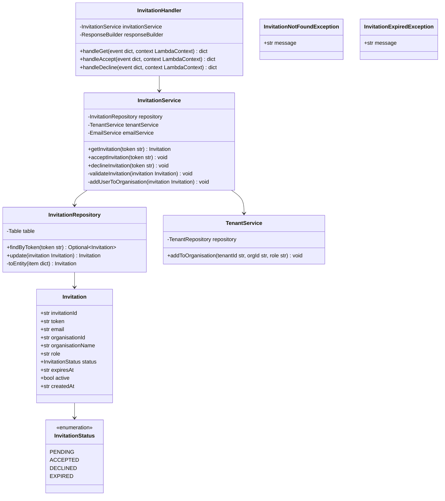
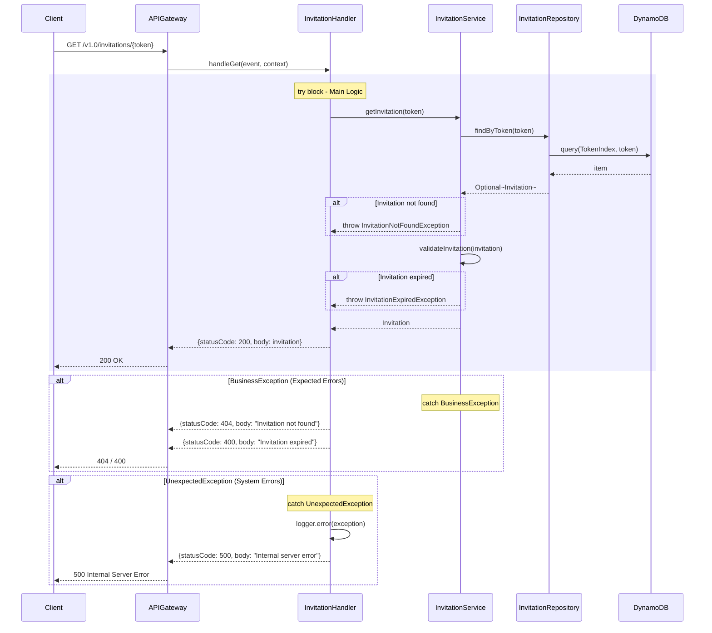
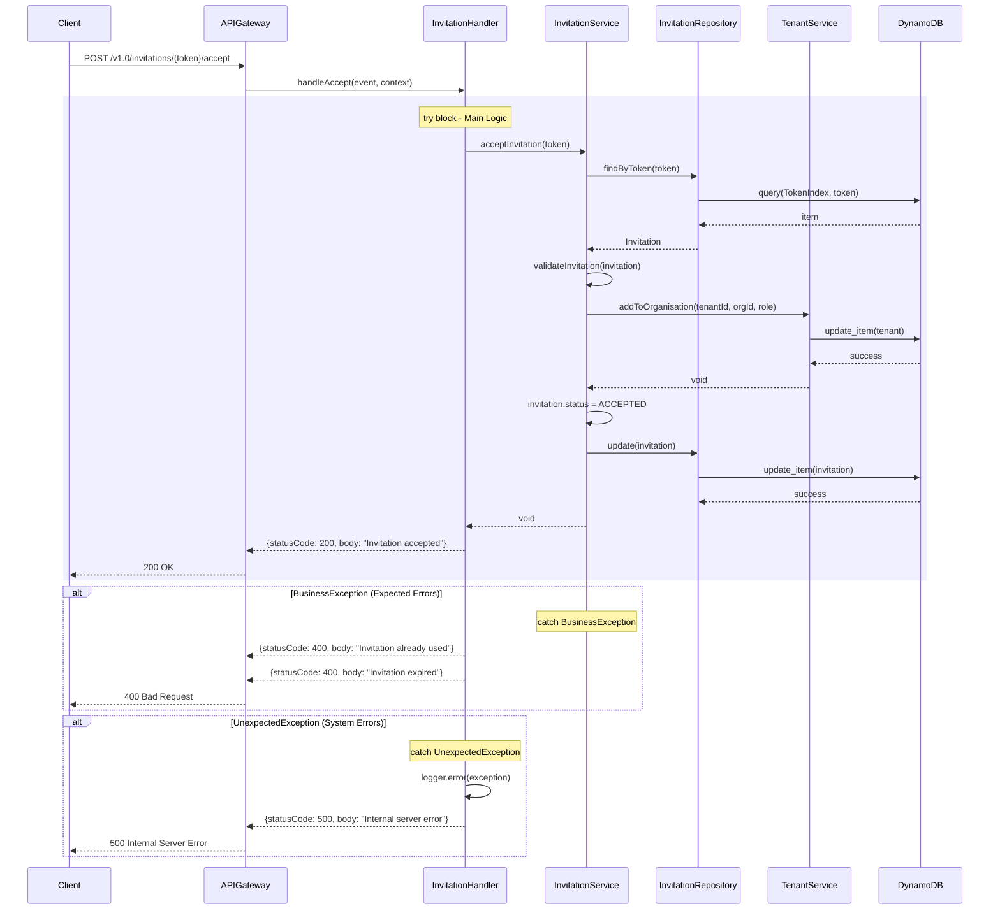

# CPP Invitation Lambda - Low-Level Design

**Version**: 1.0
**Created**: 2025-12-15
**Status**: Draft
**Component**: Invitation Service (2_bbws_invitation_lambda)
**Parent BRS**: [BRS 2.1.6: Invitation Management](../BRS/2.1.6_BRS_Invitation_Management.md)
**Parent HLD**: [HLD 2.1.6: Invitation Management](../HLDs/2.1.6_HLD_Invitation_Management.md)

---

## Document Control

| Version | Date | Author | Changes |
|---------|------|--------|---------|
| 1.0 | 2025-12-15 | Agentic Architect | Initial version |

---

## 1. Introduction

### 1.1 Purpose

This LLD provides implementation-level details for the Invitation Lambda service, which handles organisation and tenant invitations for the Customer Portal Public application.

### 1.2 Component Overview

| Attribute | Value |
|-----------|-------|
| Repository | `2_bbws_invitation_lambda` |
| Runtime | Python 3.12 |
| Memory | 256MB |
| Timeout | 30s |
| Architecture | arm64 |

### 1.3 Lambda Functions (3 Total)

| Function | Endpoint | Description |
|----------|----------|-------------|
| get_invitation | GET /v1.0/invitations/{token} | Get invitation details |
| accept_invitation | POST /v1.0/invitations/{token}/accept | Accept invitation |
| decline_invitation | POST /v1.0/invitations/{token}/decline | Decline invitation |

---

## 2. High Level Epic Overview

| User Story # | Epic | User Story | Test Scenario(s) |
|--------------|------|------------|------------------|
| US-INV-001 | Invitations | As a user, I want to view invitation details | Given valid token, then invitation info shown |
| US-INV-002 | Invitations | As a user, I want to accept an invitation | Given accept, then user added to organisation |
| US-INV-003 | Invitations | As a user, I want to decline an invitation | Given decline, then invitation marked declined |
| US-INV-004 | Invitations | As a user, I see error for expired invitation | Given expired token, then 400 returned |

---

## 3. Component Diagram



---

## 4. Sequence Diagrams

### 4.1 Get Invitation Flow



### 4.2 Accept Invitation Flow



---

## 5. Data Models

### 5.1 DynamoDB Schema

#### Invitation Entity

| Attribute | Type | Description |
|-----------|------|-------------|
| PK | String | `INVITATION#{invitationId}` |
| SK | String | `METADATA` |
| invitationId | String | UUID |
| token | String | Unique token (URL-safe) |
| email | String | Invitee email |
| organisationId | String | Target organisation |
| organisationName | String | Organisation display name |
| role | String | Assigned role |
| status | String | PENDING, ACCEPTED, DECLINED, EXPIRED |
| expiresAt | String | ISO 8601 timestamp |
| active | Boolean | Soft delete flag |
| createdAt | String | ISO 8601 timestamp |

#### GSI: TokenIndex

| Attribute | Type |
|-----------|------|
| PK (token) | String |
| SK (status) | String |

### 5.2 Pydantic Models

```python
from pydantic import BaseModel, EmailStr, Field
from enum import Enum
from datetime import datetime

class InvitationStatus(str, Enum):
    PENDING = "PENDING"
    ACCEPTED = "ACCEPTED"
    DECLINED = "DECLINED"
    EXPIRED = "EXPIRED"

class Invitation(BaseModel):
    invitation_id: str = Field(..., alias="invitationId")
    token: str
    email: EmailStr
    organisation_id: str = Field(..., alias="organisationId")
    organisation_name: str = Field(..., alias="organisationName")
    role: str
    status: InvitationStatus
    expires_at: datetime = Field(..., alias="expiresAt")
    active: bool = True
    created_at: datetime = Field(..., alias="createdAt")

class InvitationResponse(BaseModel):
    email: EmailStr
    organisation_name: str = Field(..., alias="organisationName")
    role: str
    status: InvitationStatus
    expires_at: datetime = Field(..., alias="expiresAt")
    is_valid: bool = Field(..., alias="isValid")
```

---

## 6. Messaging and Notifications

| Event | Email Sent To | Template |
|-------|---------------|----------|
| Invitation accepted | Organisation admin | invitation_accepted |
| Invitation declined | Organisation admin | invitation_declined |

---

## 7. NFRs

| Metric | Target |
|--------|--------|
| Get invitation latency (p95) | < 200ms |
| Accept/decline latency (p95) | < 500ms |

---

## 8. Risks and Mitigations

| Risk | Impact | Mitigation |
|------|--------|------------|
| Token guessing | High | Use cryptographically secure tokens |
| Expired token usage | Low | Validate expiry on all operations |

---

## 9. Tagging

| Tag | Value |
|-----|-------|
| Project | BBWS |
| Component | InvitationLambda |
| CostCenter | BBWS-CPP |

---

## 10. Troubleshooting Playbook

| Issue | Resolution |
|-------|------------|
| Token not found | Verify token in DynamoDB TokenIndex |
| Already accepted | Check invitation status |

---

## 11. Security

- Tokens are cryptographically secure (UUID v4 + timestamp hash)
- Tokens expire after 7 days
- Single-use tokens (status changes on accept/decline)
- Rate limiting on token validation

---

## 12. Signoff

| Role | Name | Date | Signature |
|------|------|------|-----------|
| Technical Lead | | | |
| Business Owner | | | |

---

## 13. TBC

| # | Item | Status |
|---|------|--------|
| TBC-001 | Resend invitation functionality | Open |

---

## 14. Definition of Terms

| Term | Definition |
|------|------------|
| Invitation | Request to join an organisation |
| Token | Unique identifier for invitation URL |

---

## 15. Appendices

### Project Structure

```
2_bbws_invitation_lambda/
├── src/
│   ├── handlers/
│   │   ├── get_invitation.py
│   │   ├── accept_invitation.py
│   │   └── decline_invitation.py
│   ├── services/
│   │   ├── invitation_service.py
│   │   └── tenant_service.py
│   ├── repositories/
│   │   └── invitation_repository.py
│   └── models/
│       └── invitation.py
├── tests/
├── terraform/
└── requirements.txt
```

---

## 16. References

- [Parent HLD: BBWS Customer Portal Public](../BBWS_Customer_Portal_Public_HLD.md)

---

**End of Document**
