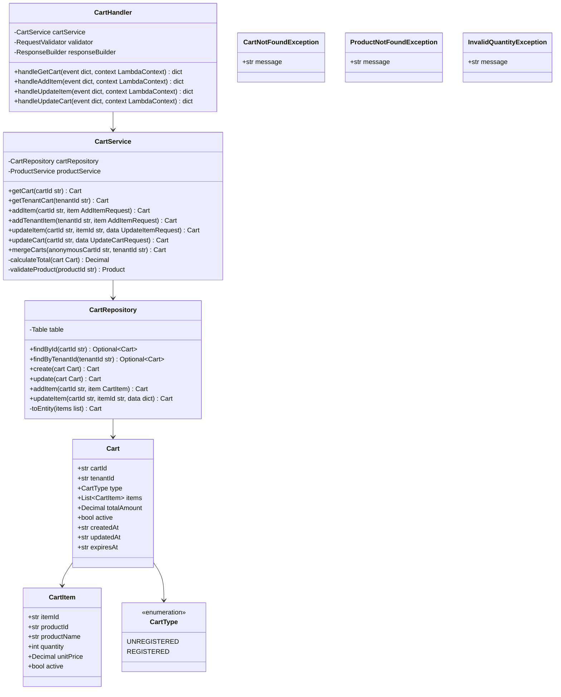
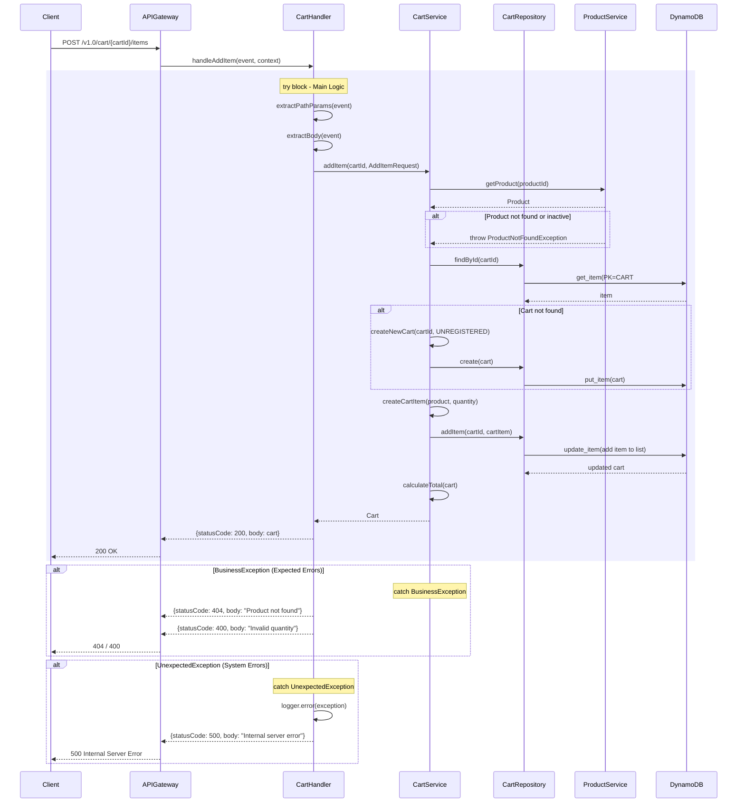
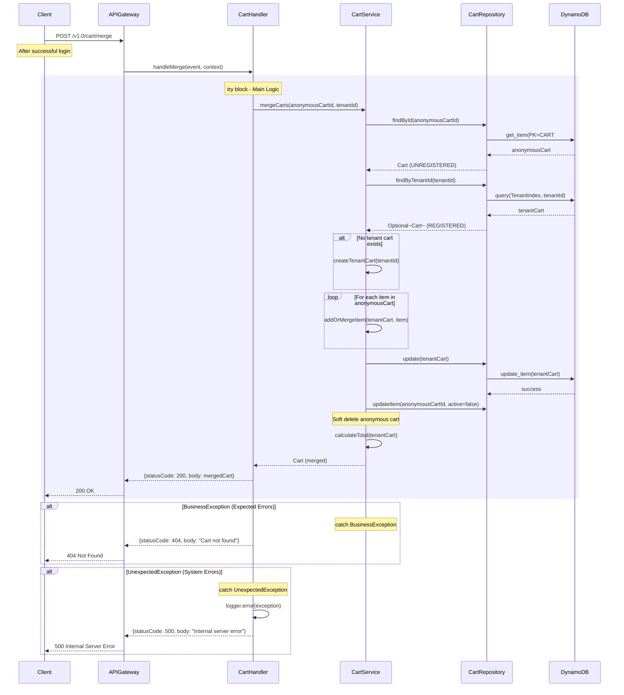
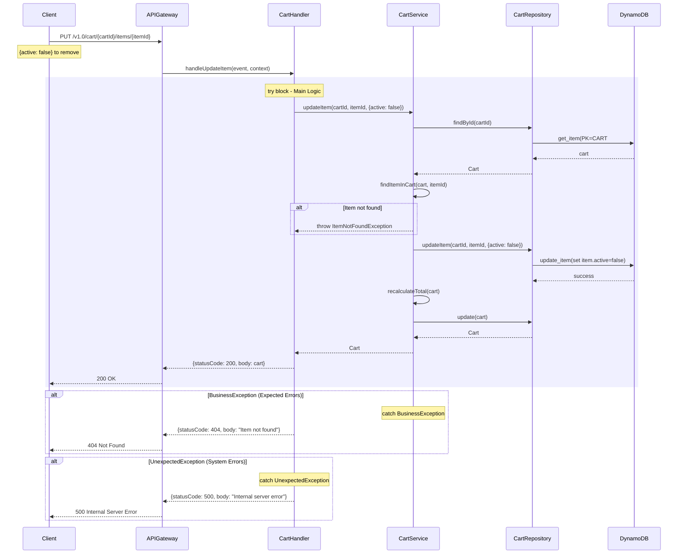

# CPP Cart Lambda - Low-Level Design

**Version**: 1.0
**Created**: 2025-12-15
**Status**: Draft
**Component**: Cart Service (2_bbws_cart_lambda)
**Parent HLD**: [HLD 2.1.7 Cart Management](../HLDs/2.1.7_HLD_Cart_Management.md)
**Parent BRS**: [BRS 2.1.7 Cart Management](../BRS/2.1.7_BRS_Cart_Management.md)

---

## Document Control

| Version | Date | Author | Changes |
|---------|------|--------|---------|
| 1.0 | 2025-12-15 | Agentic Architect | Initial version |

---

## 1. Introduction

### 1.1 Purpose

This LLD provides implementation-level details for the Cart Lambda service, which handles shopping cart operations for both anonymous (cookie-based) and registered (tenant-based) users.

### 1.2 Component Overview

| Attribute | Value |
|-----------|-------|
| Repository | `2_bbws_cart_lambda` |
| Runtime | Python 3.12 |
| Memory | 256MB |
| Timeout | 30s |
| Architecture | arm64 |

### 1.3 Lambda Functions (4 Total)

| Function | Endpoint | Description |
|----------|----------|-------------|
| get_cart | GET /v1.0/cart/{cartId} | Get anonymous cart |
| add_item | POST /v1.0/cart/{cartId}/items | Add item to anonymous cart |
| update_item | PUT /v1.0/cart/{cartId}/items/{itemId} | Update cart item |
| update_cart | PUT /v1.0/cart/{cartId} | Update cart (clear) |

**Tenant Cart Endpoints**:
| Function | Endpoint | Description |
|----------|----------|-------------|
| get_tenant_cart | GET /v1.0/tenants/{tenantId}/cart | Get tenant cart |
| add_tenant_item | POST /v1.0/tenants/{tenantId}/cart/items | Add item to tenant cart |
| update_tenant_item | PUT /v1.0/tenants/{tenantId}/cart/items/{itemId} | Update tenant cart item |
| update_tenant_cart | PUT /v1.0/tenants/{tenantId}/cart | Update tenant cart |

---

## 2. High Level Epic Overview

| User Story # | Epic | User Story | Test Scenario(s) |
|--------------|------|------------|------------------|
| US-CRT-001 | Cart | As a visitor, I want to add items to cart | Given product, then item added to anonymous cart |
| US-CRT-002 | Cart | As a visitor, I want to view my cart | Given cartId cookie, then cart contents returned |
| US-CRT-003 | Cart | As a visitor, I want to update item quantity | Given itemId and quantity, then item updated |
| US-CRT-004 | Cart | As a visitor, I want to remove an item | Given itemId, then item marked inactive |
| US-CRT-005 | Cart | As a user, I want to merge my anonymous cart | Given login, then anonymous cart merged to tenant cart |
| US-CRT-006 | Cart | As a user, I want to clear my cart | Given clear request, then cart marked inactive |

---

## 3. Component Diagram



---

## 4. Sequence Diagrams

### 4.1 Add Item to Anonymous Cart Flow



### 4.2 Merge Carts Flow (Login)



### 4.3 Update Item (Remove) Flow



---

## 5. Data Models

### 5.1 DynamoDB Schema

#### Cart Entity (Unregistered)

| Attribute | Type | Description |
|-----------|------|-------------|
| PK | String | `CART#{cartId}` |
| SK | String | `METADATA` |
| cartId | String | UUID (from cookie) |
| type | String | UNREGISTERED |
| totalAmount | Number | Cart total (cents) |
| active | Boolean | Soft delete flag |
| createdAt | String | ISO 8601 timestamp |
| updatedAt | String | ISO 8601 timestamp |
| expiresAt | String | ISO 8601 timestamp (30 days) |

#### CartItem Entity (Unregistered)

| Attribute | Type | Description |
|-----------|------|-------------|
| PK | String | `CART#{cartId}` |
| SK | String | `ITEM#{itemId}` |
| itemId | String | UUID |
| productId | String | Product reference |
| productName | String | Product name (denormalized) |
| quantity | Number | Item quantity |
| unitPrice | Number | Price per unit (cents) |
| active | Boolean | Soft delete flag |

#### Cart Entity (Registered)

| Attribute | Type | Description |
|-----------|------|-------------|
| PK | String | `TENANT#{tenantId}#CART#{cartId}` |
| SK | String | `METADATA` |
| tenantId | String | Tenant reference |
| cartId | String | UUID |
| type | String | REGISTERED |
| totalAmount | Number | Cart total (cents) |
| active | Boolean | Soft delete flag |
| updatedAt | String | ISO 8601 timestamp |

### 5.2 Pydantic Models

```python
from pydantic import BaseModel, Field
from decimal import Decimal
from typing import List, Optional
from enum import Enum

class CartType(str, Enum):
    UNREGISTERED = "UNREGISTERED"
    REGISTERED = "REGISTERED"

class CartItem(BaseModel):
    item_id: str = Field(..., alias="itemId")
    product_id: str = Field(..., alias="productId")
    product_name: str = Field(..., alias="productName")
    quantity: int = Field(..., ge=1, le=99)
    unit_price: Decimal = Field(..., alias="unitPrice")
    active: bool = True

class Cart(BaseModel):
    cart_id: str = Field(..., alias="cartId")
    tenant_id: Optional[str] = Field(None, alias="tenantId")
    type: CartType
    items: List[CartItem] = []
    total_amount: Decimal = Field(..., alias="totalAmount")
    active: bool = True
    created_at: str = Field(..., alias="createdAt")
    updated_at: str = Field(..., alias="updatedAt")
    expires_at: Optional[str] = Field(None, alias="expiresAt")

class AddItemRequest(BaseModel):
    product_id: str = Field(..., alias="productId")
    quantity: int = Field(1, ge=1, le=99)

class UpdateItemRequest(BaseModel):
    quantity: Optional[int] = Field(None, ge=1, le=99)
    active: Optional[bool] = None

class UpdateCartRequest(BaseModel):
    active: bool = False  # Used to clear cart
```

---

## 6. Messaging and Notifications

No email notifications for cart operations.

---

## 7. NFRs

| Metric | Target |
|--------|--------|
| Get cart latency (p95) | < 200ms |
| Add item latency (p95) | < 500ms |
| Cart expiry | 30 days for anonymous |
| Max items per cart | 50 |

---

## 8. Risks and Mitigations

| Risk | Impact | Mitigation |
|------|--------|------------|
| Cart abandonment | Low | 30-day expiry, email reminders |
| Price changes | Medium | Store price at add time, validate at checkout |
| Product removal | Medium | Validate product availability at checkout |

---

## 9. Tagging

| Tag | Value |
|-----|-------|
| Project | BBWS |
| Component | CartLambda |
| CostCenter | BBWS-CPP |

---

## 10. Troubleshooting Playbook

| Issue | Resolution |
|-------|------------|
| Cart not found | Check cartId cookie, verify in DynamoDB |
| Items not persisting | Check DynamoDB write capacity |
| Merge failed | Verify both carts exist and are active |

---

## 11. Security

- Anonymous carts identified by UUID (cookie)
- Tenant carts require valid JWT
- No PII in anonymous carts
- Cart expiry for data cleanup

---

## 12. Signoff

| Role | Name | Date | Signature |
|------|------|------|-----------|
| Technical Lead | | | |
| Business Owner | | | |

---

## 13. TBC

| # | Item | Status |
|---|------|--------|
| TBC-001 | Cart abandonment emails | Open |
| TBC-002 | Wishlist functionality | Open |

---

## 14. Definition of Terms

| Term | Definition |
|------|------------|
| Anonymous Cart | Cart without user authentication (cookie-based) |
| Tenant Cart | Cart associated with authenticated user |
| Soft Delete | Marking record inactive instead of deleting |

---

## 15. Appendices

### Project Structure

```
2_bbws_cart_lambda/
├── src/
│   ├── handlers/
│   │   ├── get_cart.py
│   │   ├── add_item.py
│   │   ├── update_item.py
│   │   └── update_cart.py
│   ├── services/
│   │   ├── cart_service.py
│   │   └── product_service.py
│   ├── repositories/
│   │   └── cart_repository.py
│   └── models/
│       ├── cart.py
│       └── cart_item.py
├── tests/
├── terraform/
└── requirements.txt
```

---

## 16. References

- [Parent HLD: BBWS Customer Portal Public](../BBWS_Customer_Portal_Public_HLD.md)

---

**End of Document**
