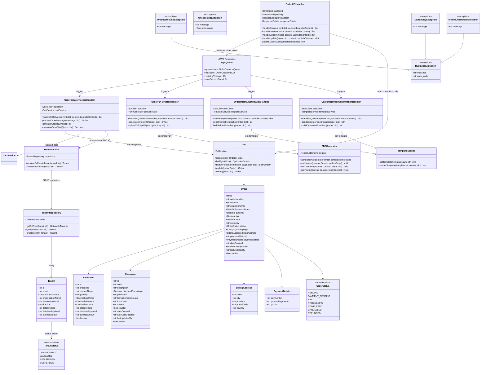

# CPP Order Lambda - Low-Level Design

**Version**: 1.5
**Created**: 2025-12-15
**Last Updated**: 2025-12-19
**Status**: Draft
**Component**: Order Service (2_bbws_order_lambda)
**Parent HLD**: [HLD 2.1.8 Order Management](../HLDs/2.1.8_HLD_Order_Management.md)
**Parent BRS**: [BRS 2.1.8 Order Management](../BRS/2.1.8_BRS_Order_Management.md)

---

## Document Control

| Version | Date | Author | Changes |
|---------|------|--------|---------|
| 1.0 | 2025-12-15 | Agentic Architect | Initial version |
| 1.1 | 2025-12-19 | Agentic Architect | Updated to align with HLD v1.3.5: embedded Campaign object, camelCase fields, pageSize/startAt/moreAvailable pagination, Activatable Entity Pattern |
| 1.2 | 2025-12-19 | Agentic Architect | Comprehensive DynamoDB schema: single-table design, access patterns, GSIs, query examples, Terraform config, showing Orders living hierarchically inside Tenants |
| 1.3 | 2025-12-19 | Agentic Architect | **Event-Driven Architecture**: Added 4 SQS-triggered Lambdas (OrderCreatorRecord, OrderPDFCreator, OrderInternalNotificationSender, CustomerOrderConfirmationSender), comprehensive SQS configuration, sequence diagrams for async processing, S3 email template storage, updated NFRs and risks |
| 1.4 | 2026-01-02 | Agentic Architect | **Public Order Creation**: Added `create_order_public` handler (POST /v1.0/orders without tenantId), TenantService for tenant auto-resolution by email, optional tenantId in OrderCreatedEvent, new sequence diagram for tenant resolution flow |
| 1.5 | 2026-01-05 | Agentic Architect | **Payment Confirmation POST**: Changed payment confirmation from PUT to POST method - aligns with REST conventions for action endpoints that trigger side effects |
| 1.6 | 2026-01-14 | Agentic Architect | **SNS Fan-Out Pattern**: Updated architecture to use SNS fan-out instead of single SQS queue. Each Lambda now has dedicated SQS queue subscribed to SNS topic. See [2.1.12_LLD_Event_Architecture.md](./2.1.12_LLD_Event_Architecture.md) for details. |

---

## 1. Introduction

### 1.1 Purpose

This LLD provides implementation-level details for the Order Lambda service, which handles order creation, retrieval, and management for the Customer Portal Public application.

### 1.2 Component Overview

| Attribute | Value |
|-----------|-------|
| Repository | `2_bbws_order_lambda` |
| Runtime | Python 3.12 |
| Memory | 512MB |
| Timeout | 30s |
| Architecture | arm64 |

### 1.3 Lambda Functions

#### 1.3.1 API Handler Functions (6 Total)

| Function | Endpoint | Trigger | Description |
|----------|----------|---------|-------------|
| create_order | POST /v1.0/tenants/{tenantId}/orders | API Gateway | Validate request with tenantId and publish to OrderCreationQueue |
| create_order_public | POST /v1.0/orders | API Gateway | Create order without tenantId - tenant resolved async by customerEmail |
| get_order | GET /v1.0/orders/{orderId} | API Gateway | Get order details from DynamoDB |
| list_orders | GET /v1.0/tenants/{tenantId}/orders | API Gateway | List tenant orders with pagination |
| update_order | PUT /v1.0/orders/{orderId} | API Gateway | Update order status (cancel, deactivate) |
| payment_confirmation | POST /v1.0/orders/{orderId}/paymentconfirmation | API Gateway | Confirm payment, update status to PAID, trigger PDF & email |

#### 1.3.2 Event-Driven Functions (4 Total)

> **IMPORTANT**: These functions now use the SNS fan-out pattern. Each Lambda has its own dedicated SQS queue subscribed to the `bbws-order-events-{env}` SNS topic. See [2.1.12_LLD_Event_Architecture.md](./2.1.12_LLD_Event_Architecture.md) for full details.

| Function | Trigger | Target | Description |
|----------|---------|--------|-------------|
| OrderCreatorRecord | SQS: `bbws-order-record-{env}` | DynamoDB | Create order record in DynamoDB table |
| OrderPDFCreator | SQS: `bbws-order-pdf-{env}` | S3 | Generate order PDF invoice and store in S3 |
| OrderInternalNotificationSender | SQS: `bbws-order-internal-notify-{env}` | SES | Send internal order notification to admin/support team |
| CustomerOrderConfirmationSender | SQS: `bbws-order-customer-notify-{env}` | SES | Send order confirmation email to customer |

#### 1.3.3 Architecture Pattern

The Order Service uses an **event-driven architecture with SNS fan-out** where:
1. API Gateway receives synchronous order creation request
2. `create_order` Lambda validates request and publishes event to **SNS Topic** (`bbws-order-events-{env}`)
3. API returns `202 Accepted` with order reference
4. SNS fans out to **4 dedicated SQS queues**, each triggering its own Lambda:
   - `bbws-order-record-{env}` → OrderCreatorRecord: Persists order to DynamoDB
   - `bbws-order-pdf-{env}` → OrderPDFCreator: Generates PDF invoice
   - `bbws-order-internal-notify-{env}` → OrderInternalNotificationSender: Notifies internal team
   - `bbws-order-customer-notify-{env}` → CustomerOrderConfirmationSender: Sends customer confirmation

> **Note**: For full SNS/SQS configuration details, see [2.1.12_LLD_Event_Architecture.md](./2.1.12_LLD_Event_Architecture.md).

**Benefits:**
- **Guaranteed Delivery**: Each Lambda receives every message (unlike single SQS queue)
- **Decoupling**: API response doesn't wait for DB writes, PDF generation, or emails
- **Resilience**: Each queue has its own DLQ for independent retry handling
- **Scalability**: Each Lambda scales independently based on its queue depth
- **Fault Tolerance**: Failure in one function doesn't affect others
- **Extensibility**: Easy to add new consumers without code changes

---

## 2. High Level Epic Overview

### 2.1 User Stories - API Operations

| User Story # | Epic | User Story | Test Scenario(s) |
|--------------|------|------------|------------------|
| US-ORD-001 | Orders | As a user, I want to create an order from my cart | Given valid cart, then order request accepted (202) and event published to SQS |
| US-ORD-002 | Orders | As a user, I want to view order details | Given orderId, then full order info returned with PDF link |
| US-ORD-003 | Orders | As a user, I want to see my order history | Given tenantId, then all orders listed with pagination |
| US-ORD-004 | Orders | As a user, I want to cancel an order | Given pending order, then status changed to cancelled |
| US-ORD-005 | Orders | As a system, I want to update order after payment | Given payment webhook, then order status updated |

### 2.2 User Stories - Event-Driven Operations

| User Story # | Epic | User Story | Test Scenario(s) |
|--------------|------|------------|------------------|
| US-ORD-006 | Order Processing | As a system, I want to persist order data | Given SQS message, then order saved to DynamoDB with all fields |
| US-ORD-007 | Order Processing | As a system, I want to generate order PDF | Given SQS message, then PDF invoice created and stored in S3 |
| US-ORD-008 | Order Processing | As an admin, I want to receive order notifications | Given new order, then internal notification email sent to support team |
| US-ORD-009 | Order Processing | As a customer, I want to receive order confirmation | Given new order, then confirmation email sent with order details and PDF link |
| US-ORD-010 | Order Processing | As a system, I want to handle processing failures | Given Lambda failure, then message retried via DLQ with exponential backoff |
| US-ORD-011 | Tenant Resolution | As a customer, I want to create an order without registering first | Given customerEmail in order request, then tenant auto-created (UNVALIDATED) or existing tenant used |
| US-ORD-012 | Tenant Resolution | As a system, I want to resolve tenant during async processing | Given order event without tenantId, then TenantService queries EmailIndex and creates tenant if not found |

---

## 3. Component Diagram



---

## 4. Sequence Diagrams

### 4.1 Create Order Flow (Event-Driven)

**Overview**: The create order operation is asynchronous. The API endpoint validates the request and publishes an event to SQS, then immediately returns `202 Accepted`. Four Lambda functions process the message in parallel.


### 4.1.2 Create Order Public Flow (Tenant Auto-Resolution) - v1.4

**Overview**: The public order creation endpoint (`POST /v1.0/orders`) allows customers to place orders without pre-registration. The tenantId is resolved asynchronously by the `OrderCreatorRecord` handler using the customer's email.


**Key Design Decisions**:
- **tenantId is optional** in `OrderCreatedEvent` for public endpoint
- **Synchronous prevalidation** ensures valid customerEmail before publishing
- **Asynchronous tenant resolution** happens in `OrderCreatorRecord` handler
- **EmailIndex GSI** on tenants table enables O(1) lookup by email
- **UNVALIDATED status** for new auto-created tenants (can upgrade via OTP verification)
- **Idempotent tenant creation** - if email exists, reuse existing tenant

### 4.1.3 OrderInternalNotificationSender Flow

```mermaid
sequenceDiagram
    participant SQS as OrderCreationQueue
    participant Handler as OrderInternalNotificationHandler
    participant TemplateService as TemplateService
    participant SES

    SQS->>Handler: SQS Event

    rect rgb(240, 240, 255)
        Note over Handler: Send Internal Notification

        loop For each message in batch
            Handler->>Handler: parseMessage(record)
            Handler->>Handler: extractOrderData(message)

            Handler->>TemplateService: getTemplate("internal_order_notification")
            TemplateService-->>Handler: emailTemplate

            Handler->>Handler: renderTemplate(template, orderData)

            Handler->>Handler: buildEmailBody(rendered)

            Handler->>SES: send_email(
                from: "orders@kimmyai.io",
                to: ["support@kimmyai.io", "sales@kimmyai.io"],
                subject: f"New Order: Tenant: {tenandId} , Oder #: {orderNumber}",
                body: emailBody
            )
            SES-->>Handler: messageId

            Handler->>Handler: logger.info(f"Internal notification sent: {messageId}")
            Handler->>Handler: markMessageAsSuccessful(messageId)
        end

        Handler-->>SQS: Delete successful messages
    end

    alt Email Send Error
        Note over Handler: Don't delete message
        Handler->>Handler: logger.error("Email send failed", exc_info=True)
        Note over SQS: Retry message
    end
```

### 4.2 Get Order Flow


### 4.3 List Orders Flow


### 4.4 Payment Confirmation Status Flow


### 4.5 PDFCreator Flow


### 4.6 EmailSender Flow

```mermaid
sequenceDiagram
    participant SQS as EmailQueue
    participant Handler as EmailHandler
    participant TemplateService as TemplateService
    participant SES
    participant S3

    SQS->>Handler: SQS Event

    rect rgb(255, 255, 240)
        Note over Handler: Send Customer Confirmation

        loop For each message in batch
            Handler->>Handler: parseMessage(record)
            Handler->>Handler: extractOrderData(message)

            Handler->>TemplateService: getTemplate(record[templateS3Uri]) # customer_order_confirmation or customer_receipt_confirmation
            TemplateService-->>Handler: emailTemplate

            Handler->>Handler: renderTemplate(template, orderData)
            Handler->>S3: get_objects(s3Uris): attachments
            Handler->>Handler: add_attachments(attachments)
            Handler->>Handler: buildEmailBody(rendered): emailBody

            Handler->>SES: send_email(
                from: {record[from]},
                to: {record[to]},
                subject: {record[subject]},
                body:  emailBody,
                attachments: [attachements]
            )
            SES-->>Handler: messageId

            Handler->>Handler: logger.info(f"Customer confirmation sent: {messageId}")
            Handler->>Handler: markMessageAsSuccessful(messageId)
        end

        Handler-->>SQS: Delete successful messages
    end

    alt Email Send Error
        Note over Handler: Don't delete message
        Handler->>Handler: logger.error("Customer email failed", exc_info=True)
        Note over SQS: Retry message
    end
```


---

## 5. Data Models

### 5.1 DynamoDB Schema

#### 5.1.1 Single Table Design Philosophy

The Order Lambda uses a **single-table design** where Orders live hierarchically inside Tenants, following the HATEOAS pattern defined in the HLD. This design:
- Supports the hierarchical URL structure: `GET /v1.0/tenants/{tenantId}/orders`
- Enables efficient querying of all orders for a specific tenant
- Maintains tenant isolation at the database level
- Optimizes for the most common access patterns

**Table Name**: `bbws-customer-portal-orders-{environment}`

**Capacity Mode**: On-Demand (as per project standards)

#### 5.1.2 Access Patterns

| # | Access Pattern | Solution |
|---|----------------|----------|
| AP1 | Get specific order for a tenant | Base table query: PK=`TENANT#{tenantId}` AND SK=`ORDER#{orderId}` |
| AP2 | List all orders for a tenant (paginated) | Base table query: PK=`TENANT#{tenantId}` AND SK begins_with `ORDER#` |
| AP3 | List orders for tenant sorted by date | GSI1 query: GSI1_PK=`TENANT#{tenantId}`, sort by GSI1_SK (dateCreated) |
| AP4 | Get order by orderId directly (cross-tenant admin) | GSI2 query: GSI2_PK=`ORDER#{orderId}` |
| AP5 | List orders by status for a tenant | Filter expression on base table query (AP2) |
| AP6 | Get tenant by email (for tenant resolution) | Tenants table: Query EmailIndex where email = `{customerEmail}` (v1.4) |

#### 5.1.3 Primary Key Structure

**Base Table Keys:**

| Key | Attribute | Pattern | Example |
|-----|-----------|---------|---------|
| PK (Partition Key) | `PK` | `TENANT#{tenantId}` | `TENANT#tenant_bb0e8400-e29b-41d4-a716-446655440006` |
| SK (Sort Key) | `SK` | `ORDER#{orderId}` | `ORDER#order_aa0e8400-e29b-41d4-a716-446655440005` |

**Design Rationale:**
- **PK = `TENANT#{tenantId}`**: Groups all orders under their parent tenant, enabling efficient "list all orders for tenant" queries
- **SK = `ORDER#{orderId}`**: Allows direct access to specific orders and supports begins_with queries
- **Tenant Isolation**: Different tenants are in different partitions, providing natural isolation and preventing cross-tenant data access

#### 5.1.4 Order Entity Attributes

| Attribute | Type | Required | Description |
|-----------|------|----------|-------------|
| PK | String | Yes | `TENANT#{tenantId}` - Partition key |
| SK | String | Yes | `ORDER#{orderId}` - Sort key |
| entityType | String | Yes | `ORDER` - Entity type discriminator |
| id | String | Yes | UUID (same as orderId in SK) |
| orderNumber | String | Yes | Human-readable order number (e.g., ORD-20251215-0001) |
| tenantId | String | Yes | Tenant UUID (same as in PK) |
| customerEmail | String | Yes | Customer email address |
| items | List | Yes | Array of OrderItem objects (embedded) |
| subtotal | Number | Yes | Subtotal amount |
| tax | Number | Yes | Tax amount |
| total | Number | Yes | Total amount |
| currency | String | Yes | Currency code (e.g., ZAR, USD) |
| status | String | Yes | Order status enum (PENDING_PAYMENT, PAID, etc.) |
| campaign | Map | No | Embedded Campaign object (denormalized, optional) |
| billingAddress | Map | Yes | Billing address object (embedded) |
| paymentMethod | String | Yes | Payment method (e.g., payfast) |
| paymentDetails | Map | No | Payment transaction details (embedded, optional) |
| dateCreated | String | Yes | ISO 8601 timestamp |
| dateLastUpdated | String | Yes | ISO 8601 timestamp |
| lastUpdatedBy | String | Yes | User/system identifier who last updated |
| active | Boolean | Yes | Soft delete flag (true = active, false = deleted) |
| GSI1_PK | String | Yes | `TENANT#{tenantId}` (for GSI1) |
| GSI1_SK | String | Yes | `{dateCreated}#{orderId}` (for GSI1 sorting) |
| GSI2_PK | String | Yes | `ORDER#{orderId}` (for GSI2) |
| GSI2_SK | String | Yes | `METADATA` (for GSI2) |

#### 5.1.5 Embedded Object Schemas

**OrderItem (Array of Objects in `items` attribute):**

| Field | Type | Required | Description |
|-------|------|----------|-------------|
| id | String | Yes | UUID (item ID) |
| productId | String | Yes | Product reference |
| productName | String | Yes | Product name (denormalized) |
| quantity | Number | Yes | Item quantity (minimum 1) |
| unitPrice | Number | Yes | Price per unit |
| discount | Number | Yes | Discount amount applied |
| subtotal | Number | Yes | Line subtotal (unitPrice × quantity - discount) |
| dateCreated | String | Yes | ISO 8601 timestamp |
| dateLastUpdated | String | Yes | ISO 8601 timestamp |
| lastUpdatedBy | String | Yes | User identifier |
| active | Boolean | Yes | Soft delete flag |

**BillingAddress (Map in `billingAddress` attribute):**

| Field | Type | Required | Description |
|-------|------|----------|-------------|
| street | String | Yes | Street address |
| city | String | Yes | City |
| province | String | Yes | Province/State |
| postalCode | String | Yes | Postal/ZIP code |
| country | String | Yes | Country code (ISO 3166-1 alpha-2, e.g., ZA) |

**PaymentDetails (Map in `paymentDetails` attribute, optional):**

| Field | Type | Required | Description |
|-------|------|----------|-------------|
| paymentId | String | Yes | Internal payment ID |
| payfastPaymentId | String | No | PayFast transaction ID |
| paidAt | String | No | ISO 8601 timestamp when payment completed |

**Campaign (Map in `campaign` attribute, optional):**

Campaign details are denormalized to preserve historical campaign state at order creation time.

| Field | Type | Required | Description |
|-------|------|----------|-------------|
| id | String | Yes | Campaign UUID |
| code | String | Yes | Campaign code (e.g., SUMMER2025) |
| description | String | Yes | Campaign description |
| discountPercentage | Number | Yes | Discount percentage (e.g., 20.0) |
| productId | String | Yes | Product reference |
| termsConditionsLink | String | Yes | Terms and conditions URL |
| fromDate | String | Yes | Campaign start date (ISO 8601) |
| toDate | String | Yes | Campaign end date (ISO 8601) |
| isValid | Boolean | Yes | Campaign validity at order creation |
| dateCreated | String | Yes | Campaign creation timestamp |
| dateLastUpdated | String | Yes | Campaign last update timestamp |
| lastUpdatedBy | String | Yes | User who last updated campaign |
| active | Boolean | Yes | Campaign soft delete flag |

#### 5.1.6 Global Secondary Indexes

**GSI1: OrdersByDateIndex**

Enables querying orders for a tenant sorted by creation date (newest first).

| Attribute | Type | Key Type | Description |
|-----------|------|----------|-------------|
| GSI1_PK | String | Partition Key | `TENANT#{tenantId}` |
| GSI1_SK | String | Sort Key | `{dateCreated}#{orderId}` (ISO 8601 timestamp) |

**Projection**: ALL (all attributes projected for read efficiency)

**Use Case**: `GET /v1.0/tenants/{tenantId}/orders?pageSize=20&startAt=2025-12-19T10:30:00Z`

**GSI2: OrderByIdIndex**

Enables direct order lookup by orderId without knowing tenantId (for admin/support operations).

| Attribute | Type | Key Type | Description |
|-----------|------|----------|-------------|
| GSI2_PK | String | Partition Key | `ORDER#{orderId}` |
| GSI2_SK | String | Sort Key | `METADATA` |

**Projection**: ALL (all attributes projected)

**Use Case**: Admin dashboard showing order details across all tenants

#### 5.1.7 Example DynamoDB Items

**Example Order Item (in DynamoDB):**

```json
{
  "PK": "TENANT#tenant_bb0e8400-e29b-41d4-a716-446655440006",
  "SK": "ORDER#order_aa0e8400-e29b-41d4-a716-446655440005",
  "entityType": "ORDER",
  "id": "order_aa0e8400-e29b-41d4-a716-446655440005",
  "orderNumber": "ORD-20251215-0001",
  "tenantId": "tenant_bb0e8400-e29b-41d4-a716-446655440006",
  "customerEmail": "customer@example.com",
  "items": [
    {
      "id": "item_cc0e8400-e29b-41d4-a716-446655440007",
      "productId": "prod_550e8400-e29b-41d4-a716-446655440000",
      "productName": "WordPress Professional Plan",
      "quantity": 1,
      "unitPrice": 299.99,
      "discount": 60.00,
      "subtotal": 239.99,
      "dateCreated": "2025-12-19T10:30:00Z",
      "dateLastUpdated": "2025-12-19T10:30:00Z",
      "lastUpdatedBy": "system",
      "active": true
    }
  ],
  "subtotal": 239.99,
  "tax": 35.99,
  "total": 275.98,
  "currency": "ZAR",
  "status": "PENDING_PAYMENT",
  "campaign": {
    "id": "camp_770e8400-e29b-41d4-a716-446655440002",
    "code": "SUMMER2025",
    "description": "Summer 2025 Special Offer - 20% off all WordPress plans",
    "discountPercentage": 20.0,
    "productId": "prod_550e8400-e29b-41d4-a716-446655440000",
    "termsConditionsLink": "https://kimmyai.io/terms/campaigns/summer2025",
    "fromDate": "2025-06-01",
    "toDate": "2025-08-31",
    "isValid": true,
    "dateCreated": "2025-05-01T08:00:00Z",
    "dateLastUpdated": "2025-05-01T08:00:00Z",
    "lastUpdatedBy": "admin@kimmyai.io",
    "active": true
  },
  "billingAddress": {
    "street": "123 Main Street",
    "city": "Cape Town",
    "province": "Western Cape",
    "postalCode": "8001",
    "country": "ZA"
  },
  "paymentMethod": "payfast",
  "paymentDetails": null,
  "dateCreated": "2025-12-19T10:30:00Z",
  "dateLastUpdated": "2025-12-19T10:30:00Z",
  "lastUpdatedBy": "customer@example.com",
  "active": true,
  "GSI1_PK": "TENANT#tenant_bb0e8400-e29b-41d4-a716-446655440006",
  "GSI1_SK": "2025-12-19T10:30:00Z#order_aa0e8400-e29b-41d4-a716-446655440005",
  "GSI2_PK": "ORDER#order_aa0e8400-e29b-41d4-a716-446655440005",
  "GSI2_SK": "METADATA"
}
```

#### 5.1.8 Query Examples (Python/boto3)

**AP1: Get Specific Order for Tenant**

```python
import boto3
from boto3.dynamodb.conditions import Key

dynamodb = boto3.resource('dynamodb')
table = dynamodb.Table('bbws-customer-portal-orders-dev')

def get_order(tenant_id: str, order_id: str):
    """Get specific order for a tenant."""
    response = table.query(
        KeyConditionExpression=Key('PK').eq(f'TENANT#{tenant_id}') &
                             Key('SK').eq(f'ORDER#{order_id}')
    )

    items = response.get('Items', [])
    return items[0] if items else None
```

**AP2: List All Orders for Tenant (Paginated)**

```python
def list_tenant_orders(tenant_id: str, page_size: int = 50, start_at: str = None):
    """List all orders for a tenant with pagination."""
    query_params = {
        'KeyConditionExpression': Key('PK').eq(f'TENANT#{tenant_id}') &
                                 Key('SK').begins_with('ORDER#'),
        'Limit': page_size,
        'ScanIndexForward': False  # Newest first
    }

    # Add pagination token if provided
    if start_at:
        query_params['ExclusiveStartKey'] = {
            'PK': f'TENANT#{tenant_id}',
            'SK': start_at
        }

    response = table.query(**query_params)

    # Build pagination response
    items = response.get('Items', [])
    last_evaluated_key = response.get('LastEvaluatedKey')

    return {
        'items': items,
        'startAt': last_evaluated_key['SK'] if last_evaluated_key else None,
        'moreAvailable': last_evaluated_key is not None
    }
```

**AP3: List Orders Sorted by Date (Using GSI1)**

```python
def list_orders_by_date(tenant_id: str, page_size: int = 50, start_at: str = None):
    """List orders for tenant sorted by creation date using GSI1."""
    query_params = {
        'IndexName': 'OrdersByDateIndex',
        'KeyConditionExpression': Key('GSI1_PK').eq(f'TENANT#{tenant_id}'),
        'Limit': page_size,
        'ScanIndexForward': False  # Newest first (descending date)
    }

    if start_at:
        # startAt format: "2025-12-19T10:30:00Z#order_id"
        query_params['ExclusiveStartKey'] = {
            'GSI1_PK': f'TENANT#{tenant_id}',
            'GSI1_SK': start_at,
            'PK': f'TENANT#{tenant_id}',
            'SK': f'ORDER#{start_at.split("#")[1]}'  # Extract order_id
        }

    response = table.query(**query_params)

    items = response.get('Items', [])
    last_evaluated_key = response.get('LastEvaluatedKey')

    return {
        'items': items,
        'startAt': last_evaluated_key['GSI1_SK'] if last_evaluated_key else None,
        'moreAvailable': last_evaluated_key is not None
    }
```

**AP4: Get Order by ID (Using GSI2, Admin Operation)**

```python
def get_order_by_id(order_id: str):
    """Get order by orderId without knowing tenantId (admin operation)."""
    response = table.query(
        IndexName='OrderByIdIndex',
        KeyConditionExpression=Key('GSI2_PK').eq(f'ORDER#{order_id}') &
                             Key('GSI2_SK').eq('METADATA')
    )

    items = response.get('Items', [])
    return items[0] if items else None
```

**AP5: List Orders by Status for Tenant**

```python
from boto3.dynamodb.conditions import Attr

def list_orders_by_status(tenant_id: str, status: str, page_size: int = 50):
    """List orders for tenant filtered by status."""
    response = table.query(
        KeyConditionExpression=Key('PK').eq(f'TENANT#{tenant_id}') &
                             Key('SK').begins_with('ORDER#'),
        FilterExpression=Attr('status').eq(status) & Attr('active').eq(True),
        Limit=page_size
    )

    return response.get('Items', [])
```

#### 5.1.9 DynamoDB Table Configuration

**Terraform Configuration Example:**

```hcl
resource "aws_dynamodb_table" "orders" {
  name           = "bbws-customer-portal-orders-${var.environment}"
  billing_mode   = "PAY_PER_REQUEST"  # On-demand capacity
  hash_key       = "PK"
  range_key      = "SK"

  attribute {
    name = "PK"
    type = "S"
  }

  attribute {
    name = "SK"
    type = "S"
  }

  attribute {
    name = "GSI1_PK"
    type = "S"
  }

  attribute {
    name = "GSI1_SK"
    type = "S"
  }

  attribute {
    name = "GSI2_PK"
    type = "S"
  }

  attribute {
    name = "GSI2_SK"
    type = "S"
  }

  global_secondary_index {
    name            = "OrdersByDateIndex"
    hash_key        = "GSI1_PK"
    range_key       = "GSI1_SK"
    projection_type = "ALL"
  }

  global_secondary_index {
    name            = "OrderByIdIndex"
    hash_key        = "GSI2_PK"
    range_key       = "GSI2_SK"
    projection_type = "ALL"
  }

  point_in_time_recovery {
    enabled = true
  }

  server_side_encryption {
    enabled = true
  }

  tags = {
    Project     = "BBWS"
    Component   = "OrderLambda"
    Environment = var.environment
    CostCenter  = "BBWS-CPP"
  }
}
```

#### 5.1.10 Data Retention and Archival

| Aspect | Configuration |
|--------|---------------|
| Retention Period | 7 years (compliance requirement) |
| Point-in-Time Recovery | Enabled (35-day window) |
| Backup Strategy | Daily automated backups to S3 via AWS Backup |
| Soft Delete | Orders marked with `active=false`, not physically deleted |
| Archival | Orders older than 2 years moved to S3 Glacier (future enhancement) |

### 5.2 Pydantic Models

```python
from pydantic import BaseModel, EmailStr, Field
from decimal import Decimal
from typing import List, Optional
from enum import Enum
from datetime import datetime

class OrderStatus(str, Enum):
    PENDING_PAYMENT = "PENDING_PAYMENT"
    PAID = "PAID"
    PROCESSING = "PROCESSING"
    COMPLETED = "COMPLETED"
    CANCELLED = "CANCELLED"
    EXPIRED = "EXPIRED"

class Campaign(BaseModel):
    """Embedded Campaign object (denormalized for historical accuracy)"""
    id: str
    code: str
    description: str
    discount_percentage: Decimal = Field(..., alias="discountPercentage")
    product_id: str = Field(..., alias="productId")
    terms_conditions_link: str = Field(..., alias="termsConditionsLink")
    from_date: str = Field(..., alias="fromDate")
    to_date: str = Field(..., alias="toDate")
    is_valid: bool = Field(..., alias="isValid")
    date_created: datetime = Field(..., alias="dateCreated")
    date_last_updated: datetime = Field(..., alias="dateLastUpdated")
    last_updated_by: str = Field(..., alias="lastUpdatedBy")
    active: bool = True

    class Config:
        populate_by_name = True

class OrderItem(BaseModel):
    """Order line item with Activatable Entity Pattern"""
    id: str
    product_id: str = Field(..., alias="productId")
    product_name: str = Field(..., alias="productName")
    quantity: int = Field(..., ge=1)
    unit_price: Decimal = Field(..., alias="unitPrice")
    discount: Decimal = Field(0.0)
    subtotal: Decimal
    date_created: datetime = Field(..., alias="dateCreated")
    date_last_updated: datetime = Field(..., alias="dateLastUpdated")
    last_updated_by: str = Field(..., alias="lastUpdatedBy")
    active: bool = True

    class Config:
        populate_by_name = True

class BillingAddress(BaseModel):
    """Billing address details"""
    street: str
    city: str
    province: str
    postal_code: str = Field(..., alias="postalCode")
    country: str

    class Config:
        populate_by_name = True

class PaymentDetails(BaseModel):
    """Payment transaction details"""
    payment_id: str = Field(..., alias="paymentId")
    payfast_payment_id: Optional[str] = Field(None, alias="payfastPaymentId")
    paid_at: Optional[datetime] = Field(None, alias="paidAt")

    class Config:
        populate_by_name = True

class Order(BaseModel):
    """Order entity with Activatable Entity Pattern and embedded Campaign"""
    id: str
    order_number: str = Field(..., alias="orderNumber")
    tenant_id: str = Field(..., alias="tenantId")
    customer_email: EmailStr = Field(..., alias="customerEmail")
    items: List[OrderItem] = []
    subtotal: Decimal
    tax: Decimal
    total: Decimal
    currency: str = "ZAR"
    status: OrderStatus
    campaign: Optional[Campaign] = None
    billing_address: BillingAddress = Field(..., alias="billingAddress")
    payment_method: str = Field(..., alias="paymentMethod")
    payment_details: Optional[PaymentDetails] = Field(None, alias="paymentDetails")
    date_created: datetime = Field(..., alias="dateCreated")
    date_last_updated: datetime = Field(..., alias="dateLastUpdated")
    last_updated_by: str = Field(..., alias="lastUpdatedBy")
    active: bool = True

    class Config:
        populate_by_name = True

class CreateOrderRequest(BaseModel):
    """Request to create order from cart"""
    tenant_id: str = Field(..., alias="tenantId")
    customer_email: EmailStr = Field(..., alias="customerEmail")
    campaign_code: Optional[str] = Field(None, alias="campaignCode")
    billing_address: BillingAddress = Field(..., alias="billingAddress")
    payment_method: str = Field(..., alias="paymentMethod")

    class Config:
        populate_by_name = True

class UpdateOrderRequest(BaseModel):
    """Request to update order status"""
    status: OrderStatus
    payment_details: Optional[PaymentDetails] = Field(None, alias="paymentDetails")
    cancellation_reason: Optional[str] = Field(None, alias="cancellationReason")

    class Config:
        populate_by_name = True

class OrderListResponse(BaseModel):
    """List response with pagination"""
    items: List[Order]
    start_at: Optional[str] = Field(None, alias="startAt")
    more_available: bool = Field(..., alias="moreAvailable")

    class Config:
        populate_by_name = True
```

### 5.3 Exception Handling

#### 5.3.1 Exception Hierarchy

The Order Lambda uses a two-tier exception hierarchy to distinguish between expected business errors and unexpected system failures.

**IMPORTANT:** The base exception classes (`BusinessException` and `UnexpectedException`) must be defined in a **common module** shared across all Lambda functions to ensure consistent error handling throughout the BBWS platform.

**Common Module Location:** `bbws_common/exceptions.py`

**Base Exception Classes:**

```python
class BusinessException(Exception):
    """
    Base class for expected business logic errors (4xx responses).
    These are recoverable errors caused by invalid input or business rule violations.
    """
    def __init__(self, message: str, error_code: str = None):
        self.message = message
        self.error_code = error_code or self.__class__.__name__
        super().__init__(self.message)

class UnexpectedException(Exception):
    """
    Base class for unexpected system errors (5xx responses).
    These are unrecoverable errors caused by system failures or bugs.
    """
    def __init__(self, message: str, cause: Exception = None):
        self.message = message
        self.cause = cause
        super().__init__(self.message)
```

**Business Exception Implementations:**

```python
from bbws_common.exceptions import BusinessException

class OrderNotFoundException(BusinessException):
    """Raised when order not found in database."""
    def __init__(self, order_id: str):
        super().__init__(
            message=f"Order not found: {order_id}",
            error_code="ORDER_NOT_FOUND"
        )

class CartEmptyException(BusinessException):
    """Raised when attempting to create order from empty cart."""
    def __init__(self, cart_id: str):
        super().__init__(
            message=f"Cannot create order from empty cart: {cart_id}",
            error_code="CART_EMPTY"
        )

class InvalidOrderStateException(BusinessException):
    """Raised when attempting invalid order status transition."""
    def __init__(self, order_id: str, from_status: str, to_status: str):
        super().__init__(
            message=f"Invalid status transition for order {order_id}: {from_status} -> {to_status}",
            error_code="INVALID_STATUS_TRANSITION"
        )
```

#### 5.3.2 Exception Handling Strategy

| Exception Type | HTTP Status | Response Body | Logging | Retry |
|----------------|-------------|---------------|---------|-------|
| BusinessException | 400-404 | `{"error": error_code, "message": message}` | Warning level | No |
| UnexpectedException | 500 | `{"error": "INTERNAL_SERVER_ERROR", "message": "An unexpected error occurred"}` | Error level with stack trace | Yes (SQS) |

**Handler Pattern:**

```python
from bbws_common.exceptions import BusinessException, UnexpectedException
import json
import logging

logger = logging.getLogger(__name__)

def lambda_handler(event: dict, context: LambdaContext) -> dict:
    """Standard exception handling pattern for all Lambda handlers."""
    try:
        # Main business logic
        result = process_request(event)
        return {
            'statusCode': 200,
            'body': json.dumps(result)
        }

    except BusinessException as e:
        logger.warning(f"Business exception: {e.error_code} - {e.message}")
        return {
            'statusCode': 400 if e.error_code != "ORDER_NOT_FOUND" else 404,
            'body': json.dumps({
                'error': e.error_code,
                'message': e.message
            })
        }

    except Exception as e:
        # Wrap unexpected exceptions
        logger.error(f"Unexpected error: {str(e)}", exc_info=True)
        return {
            'statusCode': 500,
            'body': json.dumps({
                'error': 'INTERNAL_SERVER_ERROR',
                'message': 'An unexpected error occurred'
            })
        }
```

### 5.4 Event Architecture Configuration

> **IMPORTANT**: The Order Lambda now uses the SNS fan-out pattern instead of a single shared SQS queue. For complete configuration details including:
> - SNS Topic specifications
> - 4 dedicated SQS queues (one per Lambda)
> - Dead Letter Queue configurations
> - Lambda event source mappings
> - Terraform configuration
>
> See: [2.1.12_LLD_Event_Architecture.md](./2.1.12_LLD_Event_Architecture.md)

#### 5.4.1 Queue Summary

| Lambda Function | Dedicated Queue | Visibility Timeout |
|-----------------|-----------------|-------------------|
| OrderCreatorRecord | `bbws-order-record-{env}` | 60s |
| OrderPDFCreator | `bbws-order-pdf-{env}` | 120s |
| OrderInternalNotificationSender | `bbws-order-internal-notify-{env}` | 30s |
| CustomerOrderConfirmationSender | `bbws-order-customer-notify-{env}` | 30s |

#### 5.4.2 OrderCreationDLQ (Dead Letter Queue)

**Holds Failed Messages for Manual Investigation**

| Attribute | Value | Description |
|-----------|-------|-------------|
| Queue Name | `bbws-order-creation-dlq-{environment}` | Dead letter queue |
| Queue Type | Standard | Matches source queue type |
| Message Retention | 14 days | Extended retention for investigation |
| CloudWatch Alarm | DLQDepthAlarm | Alerts when messages enter DLQ |
| Alert Threshold | > 0 messages | Immediate alert on any DLQ message |
| Alert Action | SNS Topic: `bbws-alerts-{environment}` | Notifies ops team |

#### 5.4.3 SQS Message Format

**Order Creation Event Schema:**

```json
{
  "messageId": "uuid-v4",
  "timestamp": "2025-12-19T10:30:00Z",
  "eventType": "ORDER_CREATED",
  "version": "1.0",
  "payload": {
    "orderId": "order_aa0e8400-e29b-41d4-a716-446655440005",
    "tenantId": "tenant_bb0e8400-e29b-41d4-a716-446655440006",
    "customerEmail": "customer@example.com",
    "cartId": "cart_123456",
    "campaignCode": "SUMMER2025",
    "billingAddress": {
      "street": "123 Main Street",
      "city": "Cape Town",
      "province": "Western Cape",
      "postalCode": "8001",
      "country": "ZA"
    },
    "paymentMethod": "payfast",
    "currency": "ZAR",
    "createdBy": "customer@example.com"
  }
}
```

#### 5.4.4 Lambda Event Source Mapping

**Configuration for SQS → Lambda Integration:**

| Lambda Function | Queue | Batch Size | Batch Window | Concurrency |
|----------------|-------|------------|--------------|-------------|
| OrderCreatorRecord | OrderCreationQueue | 10 | 5s | 5 |
| OrderPDFCreator | OrderCreationQueue | 5 | 2s | 10 |
| OrderInternalNotificationSender | OrderCreationQueue | 10 | 5s | 5 |
| CustomerOrderConfirmationSender | OrderCreationQueue | 10 | 5s | 5 |

**Rationale:**
- **OrderCreatorRecord**: Lower concurrency (5) to avoid DynamoDB throttling
- **OrderPDFCreator**: Higher concurrency (10) as PDF generation is CPU-intensive and can run in parallel
- **Notification Lambdas**: Medium concurrency (5) to avoid SES throttling limits

#### 5.4.5 Terraform Configuration

```hcl
# Main Queue
resource "aws_sqs_queue" "order_creation" {
  name                      = "bbws-order-creation-${var.environment}"
  visibility_timeout_seconds = 60
  message_retention_seconds  = 345600  # 4 days
  max_message_size          = 262144  # 256 KB
  receive_wait_time_seconds = 20  # Long polling

  redrive_policy = jsonencode({
    deadLetterTargetArn = aws_sqs_queue.order_creation_dlq.arn
    maxReceiveCount     = 3
  })

  tags = {
    Project     = "BBWS"
    Component   = "OrderLambda"
    Environment = var.environment
    CostCenter  = "BBWS-CPP"
  }
}

# Dead Letter Queue
resource "aws_sqs_queue" "order_creation_dlq" {
  name                      = "bbws-order-creation-dlq-${var.environment}"
  message_retention_seconds  = 1209600  # 14 days

  tags = {
    Project     = "BBWS"
    Component   = "OrderLambda"
    Environment = var.environment
    CostCenter  = "BBWS-CPP"
  }
}

# CloudWatch Alarm for DLQ
resource "aws_cloudwatch_metric_alarm" "dlq_depth" {
  alarm_name          = "bbws-order-dlq-depth-${var.environment}"
  comparison_operator = "GreaterThanThreshold"
  evaluation_periods  = 1
  metric_name         = "ApproximateNumberOfMessagesVisible"
  namespace           = "AWS/SQS"
  period              = 60
  statistic           = "Average"
  threshold           = 0
  alarm_description   = "Alert when messages enter Order Creation DLQ"
  alarm_actions       = [aws_sns_topic.alerts.arn]

  dimensions = {
    QueueName = aws_sqs_queue.order_creation_dlq.name
  }
}

# Event Source Mapping - OrderCreatorRecord
resource "aws_lambda_event_source_mapping" "order_creator_record" {
  event_source_arn                   = aws_sqs_queue.order_creation.arn
  function_name                      = aws_lambda_function.order_creator_record.arn
  batch_size                         = 10
  maximum_batching_window_in_seconds = 5
  scaling_config {
    maximum_concurrency = 5
  }
}

# Event Source Mapping - OrderPDFCreator
resource "aws_lambda_event_source_mapping" "order_pdf_creator" {
  event_source_arn                   = aws_sqs_queue.order_creation.arn
  function_name                      = aws_lambda_function.order_pdf_creator.arn
  batch_size                         = 5
  maximum_batching_window_in_seconds = 2
  scaling_config {
    maximum_concurrency = 10
  }
}

# Event Source Mapping - OrderInternalNotificationSender
resource "aws_lambda_event_source_mapping" "order_internal_notification" {
  event_source_arn                   = aws_sqs_queue.order_creation.arn
  function_name                      = aws_lambda_function.order_internal_notification.arn
  batch_size                         = 10
  maximum_batching_window_in_seconds = 5
  scaling_config {
    maximum_concurrency = 5
  }
}

# Event Source Mapping - CustomerOrderConfirmationSender
resource "aws_lambda_event_source_mapping" "customer_confirmation" {
  event_source_arn                   = aws_sqs_queue.order_creation.arn
  function_name                      = aws_lambda_function.customer_confirmation.arn
  batch_size                         = 10
  maximum_batching_window_in_seconds = 5
  scaling_config {
    maximum_concurrency = 5
  }
}
```

#### 5.4.6 Error Handling and Retry Strategy

| Scenario | Retry Behavior | Final Action |
|----------|----------------|--------------|
| Lambda function error | Automatic retry up to 3 times with exponential backoff | Move to DLQ after 3 failures |
| DynamoDB throttling | Message remains in queue, visibility timeout expires, automatic retry | Eventually succeeds or moves to DLQ |
| SES throttling | Message remains in queue, Lambda retries with exponential backoff | Eventually succeeds or moves to DLQ |
| S3 upload failure | Message remains in queue, automatic retry | Eventually succeeds or moves to DLQ |
| Invalid message format | Lambda logs error, deletes message (no retry) | Logged for investigation |
| Cart not found | Lambda logs error, message moved to DLQ | Manual investigation |

**Exponential Backoff Formula:**
```
wait_time = min(maximum_wait, base_delay * (2 ^ attempt_number))

Where:
- base_delay = 1 second
- maximum_wait = 60 seconds
- attempt_number = 0, 1, 2 (max 3 attempts)
```

#### 5.4.7 Monitoring and Observability

**CloudWatch Metrics to Monitor:**

| Metric | Threshold | Alert |
|--------|-----------|-------|
| ApproximateAgeOfOldestMessage | > 300 seconds | Messages stuck in queue |
| ApproximateNumberOfMessagesVisible | > 1000 | Queue backlog building up |
| NumberOfMessagesSent | < 1 for 1 hour | No orders being created (potential issue) |
| DLQ ApproximateNumberOfMessagesVisible | > 0 | Failed messages requiring attention |
| Lambda Errors | > 5% error rate | Lambda function failures |
| Lambda Duration | > 50 seconds | Approaching timeout |

---

## 6. Messaging and Notifications

### 6.1 Email Template Storage (S3)

Email templates are stored as HTML files in S3 and loaded dynamically by Lambda functions.

**S3 Bucket Structure:**
```
s3://bbws-email-templates-{environment}/
├── customer/
│   ├── order_confirmation.html
│   ├── order_status_update.html
│   └── order_cancelled.html
└── internal/
    └── order_notification.html
```

**Template Access Pattern:**
```python
def get_email_template(template_name: str, template_type: str = "customer") -> str:
    """Load email template from S3."""
    s3_client = boto3.client('s3')
    bucket = f"bbws-email-templates-{os.environ['ENVIRONMENT']}"
    key = f"{template_type}/{template_name}.html"

    response = s3_client.get_object(Bucket=bucket, Key=key)
    return response['Body'].read().decode('utf-8')
```

### 6.2 Email Templates

#### 6.2.1 Customer Order Confirmation Template

**Template**: `customer/order_confirmation.html`
**Recipient**: Customer
**Trigger**: Order created successfully
**Subject**: `Order Confirmation - #{orderNumber}`

**Variables Injected:**
- `{{orderNumber}}`: Human-readable order number
- `{{customerEmail}}`: Customer email address
- `{{items}}`: List of order items with pricing
- `{{subtotal}}`, `{{tax}}`, `{{total}}`: Order totals
- `{{billingAddress}}`: Formatted billing address
- `{{pdfLink}}`: S3 presigned URL to invoice PDF (expires in 7 days)
- `{{campaignCode}}`, `{{discountPercentage}}`: Campaign details (if applicable)
- `{{orderDate}}`: Order creation date/time

#### 6.2.2 Internal Order Notification Template

**Template**: `internal/order_notification.html`
**Recipients**: support@kimmyai.io, sales@kimmyai.io
**Trigger**: Order created successfully
**Subject**: `New Order: #{orderNumber} - #{customerEmail}`

**Variables Injected:**
- `{{orderNumber}}`: Human-readable order number
- `{{tenantId}}`: Tenant identifier
- `{{customerEmail}}`: Customer contact
- `{{total}}`, `{{currency}}`: Order value
- `{{items}}`: List of products ordered
- `{{orderLink}}`: Admin dashboard link to view order
- `{{pdfLink}}`: S3 link to invoice PDF

#### 6.2.3 Order Status Update Template

**Template**: `customer/order_status_update.html`
**Recipient**: Customer
**Trigger**: Order status changed
**Subject**: `Order #{orderNumber} - Status Update: #{newStatus}`

**Variables Injected:**
- `{{orderNumber}}`: Order identifier
- `{{oldStatus}}`: Previous status
- `{{newStatus}}`: New status
- `{{statusMessage}}`: Human-readable status explanation
- `{{nextSteps}}`: Customer action items (if any)

#### 6.2.4 Order Cancelled Template

**Template**: `customer/order_cancelled.html`
**Recipient**: Customer
**Trigger**: Order cancelled
**Subject**: `Order #{orderNumber} Cancelled`

**Variables Injected:**
- `{{orderNumber}}`: Order identifier
- `{{cancellationReason}}`: Reason for cancellation
- `{{refundInfo}}`: Refund processing details (if applicable)

### 6.3 S3 Template Configuration

**Terraform Configuration:**

```hcl
resource "aws_s3_bucket" "email_templates" {
  bucket = "bbws-email-templates-${var.environment}"

  tags = {
    Project     = "BBWS"
    Component   = "OrderLambda"
    Environment = var.environment
    CostCenter  = "BBWS-CPP"
  }
}

resource "aws_s3_bucket_public_access_block" "email_templates" {
  bucket = aws_s3_bucket.email_templates.id

  block_public_acls       = true
  block_public_policy     = true
  ignore_public_acls      = true
  restrict_public_buckets = true
}

resource "aws_s3_bucket_versioning" "email_templates" {
  bucket = aws_s3_bucket.email_templates.id

  versioning_configuration {
    status = "Enabled"
  }
}

# IAM policy for Lambda to read templates
resource "aws_iam_policy" "lambda_s3_template_access" {
  name        = "bbws-order-lambda-s3-template-access-${var.environment}"
  description = "Allow Lambda to read email templates from S3"

  policy = jsonencode({
    Version = "2012-10-17"
    Statement = [
      {
        Effect = "Allow"
        Action = [
          "s3:GetObject",
          "s3:ListBucket"
        ]
        Resource = [
          aws_s3_bucket.email_templates.arn,
          "${aws_s3_bucket.email_templates.arn}/*"
        ]
      }
    ]
  })
}
```

### 6.4 SES Configuration

| Configuration | Value |
|---------------|-------|
| SES Region | af-south-1 (primary), eu-west-1 (failover) |
| From Address (Customer) | noreply@kimmyai.io |
| From Address (Internal) | orders@kimmyai.io |
| Domain Verification | kimmyai.io (DKIM, SPF, DMARC configured) |
| Sending Limits | 50 emails/second, 10,000 emails/24h (DEV/SIT), 200 emails/second (PROD) |
| Bounce Handling | SNS topic: bbws-ses-bounces-{environment} |
| Complaint Handling | SNS topic: bbws-ses-complaints-{environment} |

---

## 7. NFRs (Non-Functional Requirements)

### 7.1 Performance Targets

| Metric | Target | Notes |
|--------|--------|-------|
| Create order API latency (p95) | < 300ms | API validates and publishes to SQS only |
| Order persistence latency (p95) | < 2 seconds | Time from SQS message to DynamoDB write |
| PDF generation latency (p95) | < 5 seconds | Includes S3 upload time |
| Email delivery latency (p95) | < 10 seconds | Time from SQS message to SES send |
| Get order latency (p95) | < 200ms | Direct DynamoDB read |
| List orders latency (p95) | < 500ms | DynamoDB query with pagination |
| End-to-end order processing | < 15 seconds | From API call to customer email received |

### 7.2 Scalability Targets

| Metric | Target |
|--------|--------|
| Concurrent order creations | 1000 orders/second |
| SQS queue throughput | 5000 messages/second |
| Lambda concurrent executions | 500 per function (reserved) |
| DynamoDB write capacity | On-demand (auto-scaling) |
| S3 upload throughput | Unlimited (AWS managed) |

### 7.3 Availability and Reliability

| Metric | Target |
|--------|--------|
| API availability | 99.9% (SLA) |
| Order processing success rate | 99.95% |
| Email delivery success rate | 99.5% |
| Data durability | 99.999999999% (S3/DynamoDB) |
| Recovery Time Objective (RTO) | < 1 hour |
| Recovery Point Objective (RPO) | < 5 minutes |

### 7.4 Data Retention

| Data Type | Retention Period | Storage |
|-----------|------------------|---------|
| Order records | 7 years (compliance) | DynamoDB + S3 backup |
| Order PDFs | 7 years | S3 Standard → Glacier after 2 years |
| SQS messages | 4 days | Automatic deletion after processing |
| CloudWatch logs | 90 days | Log retention policy |
| Email templates | Indefinite (versioned) | S3 with versioning |

---

## 8. Risks and Mitigations

| Risk | Impact | Likelihood | Mitigation |
|------|--------|------------|------------|
| SQS queue backlog | High | Medium | CloudWatch alarms on queue depth, auto-scaling Lambda concurrency |
| Message processing failure | High | Low | Dead Letter Queue with 3 retries, exponential backoff |
| Partial order processing | Medium | Low | Idempotent Lambda functions, message deduplication |
| DynamoDB throttling | Medium | Low | On-demand capacity mode, reserved concurrency on OrderCreatorRecord |
| PDF generation failure | Medium | Low | Retry via SQS, DLQ for manual investigation, alert on DLQ depth |
| Email delivery failure | Medium | Medium | SQS retries, SES bounce/complaint handling via SNS |
| S3 template unavailable | Medium | Very Low | Template versioning, Lambda caching, fallback to inline template |
| Lambda cold starts | Low | High | Provisioned concurrency for critical functions (OrderCreatorRecord) |
| Cart data race condition | High | Low | Optimistic locking on cart updates, validate cart state in Lambda |
| Duplicate order creation | High | Low | Idempotency key in API request, check for existing orderId in DynamoDB |
| Cross-region failover | High | Very Low | Multi-region DynamoDB replication, Route 53 health checks |
| Message poisoning (bad data) | Medium | Low | Schema validation in API and Lambda, DLQ for invalid messages |

---

## 9. Tagging

| Tag | Value |
|-----|-------|
| Project | BBWS |
| Component | OrderLambda |
| CostCenter | BBWS-CPP |

---

## 10. Troubleshooting Playbook

| Issue | Resolution |
|-------|------------|
| Order not found | Verify orderId, check TenantIndex |
| Status update failed | Check valid state transitions |
| Email not sent | Check SES logs, verify template |

---

## 11. Security

- Tenant isolation via JWT validation
- Orders only accessible by owning tenant
- Billing details encrypted at rest
- PCI DSS compliance for payment data handling

---

## 12. Signoff

| Role | Name | Date | Signature |
|------|------|------|-----------|
| Technical Lead | | | |
| Business Owner | | | |

---

## 13. TBC

| # | Item | Status |
|---|------|--------|
| TBC-001 | Order export functionality | Open |
| TBC-002 | Invoice PDF generation | Open |
| TBC-003 | Partial refund support | Open |

---

## 14. Definition of Terms

| Term | Definition |
|------|------------|
| Order | A confirmed purchase request |
| Order Number | Human-readable order identifier |
| Idempotency Key | Unique key to prevent duplicate orders |

---

## 15. Appendices

### 15.1 Project Structure

```
2_bbws_order_lambda/
├── src/
│   ├── handlers/
│   │   ├── create_order.py
│   │   ├── get_order.py
│   │   ├── list_orders.py
│   │   └── update_order.py
│   ├── services/
│   │   ├── order_service.py
│   │   ├── cart_service.py
│   │   └── email_service.py
│   ├── repositories/
│   │   └── order_dao.py
│   └── models/
│       ├── order.py
│       ├── order_item.py
│       └── billing_details.py
├── tests/
├── terraform/
└── requirements.txt
```

### 15.2 Valid Status Transitions

| From Status | Allowed To Status |
|-------------|-------------------|
| PENDING | PAYMENT_PENDING, CANCELLED |
| PAYMENT_PENDING | PAID, CANCELLED |
| PAID | PROCESSING, REFUNDED |
| PROCESSING | COMPLETED, REFUNDED |
| COMPLETED | REFUNDED |
| CANCELLED | (terminal) |
| REFUNDED | (terminal) |

---

## 16. References

- [Parent HLD: BBWS Customer Portal Public](../BBWS_Customer_Portal_Public_HLD.md)

---

**End of Document**
