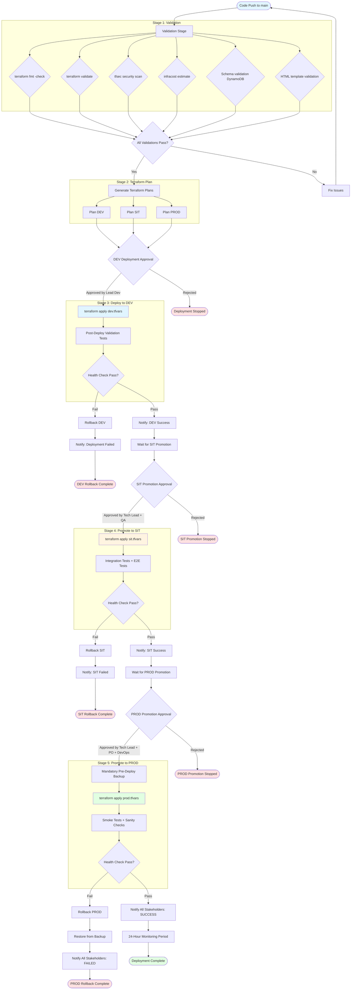
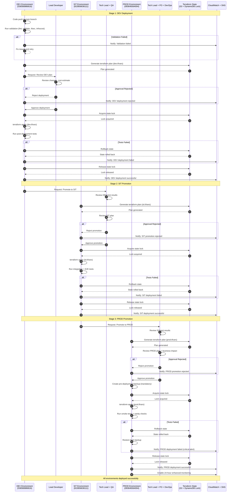

# 2.1.8 Low-Level Design: S3 and DynamoDB Infrastructure

**Document ID**: 2.1.8_LLD_S3_and_DynamoDB
**Version**: 1.0
**Date**: 2025-12-25
**Status**: APPROVED - Gate 5
**Author**: Agentic LLD Architect
**Parent HLD**: 2.1_BBWS_Customer_Portal_Public_HLD_V1.1.md
**Related LLDs**: 2.1.8_LLD_Order_Lambda_Code_Gen_Spec.md

---

## Table of Contents

1. [Document Information](#1-document-information)
2. [Revision History](#2-revision-history)
3. [Executive Summary](#3-executive-summary)
4. [DynamoDB Table Design](#4-dynamodb-table-design)
5. [S3 Bucket Design](#5-s3-bucket-design)
6. [Terraform Module Design](#6-terraform-module-design)
7. [CI/CD Pipeline Design](#7-cicd-pipeline-design)
8. [Appendices](#8-appendices)

---

## 1. Document Information

### 1.1 Document Metadata

| Attribute | Value |
|-----------|-------|
| **Document Title** | 2.1.8 Low-Level Design: S3 and DynamoDB Infrastructure |
| **Document ID** | 2.1.8_LLD_S3_and_DynamoDB |
| **Version** | 1.0.0 |
| **Date** | 2025-12-25 |
| **Status** | APPROVED - Gate 5 |
| **Author** | Agentic LLD Architect |
| **Project** | BBWS Customer Portal (Public) |
| **Phase** | Phase 0 (First to Market) |

### 1.2 Referenced Documents

| Document | Location | Purpose |
|----------|----------|---------|
| **Parent HLD** | `2.1_BBWS_Customer_Portal_Public_HLD_V1.1.md` | Parent architecture document defining system requirements |
| **Related LLD** | `2.1.8_LLD_Order_Lambda_Code_Gen_Spec.md` | Order Lambda code generation specification |
| **Specification** | `2.1.8_LLD_S3_and_DynamoDB_Spec.md` | Detailed specification for this LLD |
| **Stage 1 Analysis** | `stage-1-requirements-analysis/worker-1-hld-analysis/output.md` | Comprehensive HLD analysis |
| **Requirements Validation** | `stage-1-requirements-analysis/worker-2-requirements-validation/output.md` | Requirements validation and quality assurance |
| **Naming Conventions** | `stage-1-requirements-analysis/worker-3-naming-convention-analysis/output.md` | Naming standards and patterns |
| **Environment Configs** | `stage-1-requirements-analysis/worker-4-environment-configuration-analysis/output.md` | Environment-specific configurations |

### 1.3 Document Scope

#### 1.3.1 In Scope

This LLD document covers the following components:

1. **GitHub Repositories**
   - `2_1_bbws_dynamodb_schemas` - DynamoDB table schemas and Terraform modules
   - `2_1_bbws_s3_schemas` - S3 bucket configurations and HTML templates

2. **DynamoDB Tables** (3 tables)
   - Tenants table with 3 GSIs
   - Products table with 2 GSIs
   - Campaigns table with 3 GSIs

3. **S3 Buckets**
   - Templates bucket (`bbws-templates-{env}`)
   - 12 HTML email templates (customer and internal versions)

4. **Terraform Infrastructure**
   - Modular Terraform architecture
   - Separate modules for DynamoDB, S3, GSI, backup, and replication
   - Environment-specific configurations (DEV, SIT, PROD)

5. **CI/CD Pipeline**
   - GitHub Actions workflows with validation stages
   - Human approval gates (after plan, before DEV, before SIT, before PROD)
   - Automated testing and deployment
   - Rollback capabilities

6. **Disaster Recovery**
   - Point-in-Time Recovery (PITR) for all DynamoDB tables
   - Hourly AWS Backup with 90-day retention
   - Cross-region replication (PROD only to eu-west-1)

7. **Documentation**
   - Architecture diagrams (4 diagrams)
   - Deployment runbooks (4 runbooks)
   - Operational procedures

#### 1.3.2 Out of Scope

The following items are explicitly excluded from this LLD:

1. **Lambda Function Code** - Covered in separate Lambda-specific LLDs
2. **Frontend Application Code** - Separate frontend development scope
3. **API Gateway Configurations** - Defined in API Gateway LLD
4. **Cognito User Pool Setup** - Authentication infrastructure LLD
5. **PayFast Payment Integration** - Payment gateway integration LLD
6. **Multi-Region DR Pipeline** - Separate disaster recovery pipeline
7. **Lambda IAM Permissions** - Defined in Lambda-specific LLDs

### 1.4 Audience

| Role | Usage |
|------|-------|
| **Infrastructure Engineers** | Deploy and maintain DynamoDB tables and S3 buckets |
| **DevOps Engineers** | Implement and manage CI/CD pipelines |
| **Backend Developers** | Understand data structures and storage patterns |
| **Solution Architects** | Review architectural decisions and patterns |
| **QA Engineers** | Develop validation and testing strategies |
| **Operations Team** | Use runbooks for deployment and troubleshooting |

### 1.5 Conventions

#### 1.5.1 Naming Conventions

- **AWS Resources**: Follow AWS naming best practices with lowercase and hyphens
- **DynamoDB Tables**: Simple domain names (e.g., `tenants`, `products`, `campaigns`)
- **S3 Buckets**: Pattern `bbws-{purpose}-{env}` (e.g., `bbws-templates-prod`)
- **Terraform Modules**: Lowercase with underscores (e.g., `dynamodb_table`, `s3_bucket`)
- **GitHub Workflows**: Pattern `{action}-{resource}.yml`

#### 1.5.2 Terminology

| Term | Definition |
|------|------------|
| **Environment** | Deployment target: DEV, SIT, or PROD |
| **GSI** | Global Secondary Index for DynamoDB |
| **PITR** | Point-in-Time Recovery for disaster recovery |
| **Soft Delete** | Setting `active=false` instead of physical deletion |
| **Activatable Entity** | Entity with id, dateCreated, dateLastUpdated, lastUpdatedBy, active fields |
| **Progressive Hardening** | Increasing security and durability from DEV to PROD |
| **Human Approval Gate** | Manual approval required before pipeline progression |

---

## 2. Revision History

| Version | Date | Author | Description | Approved By |
|---------|------|--------|-------------|-------------|
| 1.0.0 | 2025-12-25 | Agentic LLD Architect | Initial draft - Complete infrastructure specification for S3 buckets and DynamoDB tables including 2 GitHub repositories, 3 DynamoDB tables with 9 GSIs, 12 HTML email templates, Terraform modules, and CI/CD pipeline with human approval gates | Approved (Gate 5) |

---

## 3. Executive Summary

### 3.1 Purpose

This Low-Level Design (LLD) document specifies the foundational infrastructure for the BBWS Customer Portal (Public) system, focusing on the persistent data layer and deployment automation. It provides detailed technical specifications for DynamoDB tables, S3 buckets, HTML email templates, Terraform infrastructure as code, and CI/CD pipelines with comprehensive approval gates.

The infrastructure defined in this document serves as the foundation for the Customer Portal Public application, enabling customer tenant management, product catalog management, marketing campaign management, and transactional email communications. This LLD is a critical prerequisite for all Lambda function deployments and API Gateway configurations.

### 3.2 Scope Overview

This LLD encompasses the complete infrastructure specification for:

**Repository Structure:**
- 2 GitHub repositories for independent infrastructure management
- Separate repos for DynamoDB schemas (`2_1_bbws_dynamodb_schemas`) and S3 schemas (`2_1_bbws_s3_schemas`)
- Modular Terraform architecture with reusable modules

**DynamoDB Tables:**
- 3 core tables: Tenants, Products, Campaigns
- 9 Global Secondary Indexes across all tables for optimized query patterns
- On-demand capacity mode for all tables and GSIs
- Soft delete pattern using `active` boolean field
- Activatable Entity Pattern with comprehensive audit fields

**S3 Infrastructure:**
- Templates bucket (`bbws-templates-{env}`) across all environments
- 12 HTML email templates organized in 3 categories (receipts, notifications, invoices)
- Customer-facing and internal versions for each template type
- Versioning enabled for all templates with 90-day retention

**Terraform Modules:**
- Modular architecture with 8 specialized terraform modules
- DynamoDB modules: `dynamodb_table`, `gsi`, `backup`
- S3 modules: `s3_bucket`, `bucket_policy`, `replication`
- Environment-specific configurations via `.tfvars` files (dev, sit, prod)
- S3 backend with DynamoDB locking for state management

**CI/CD Pipeline:**
- Comprehensive GitHub Actions workflows with 5 stages per repository
- Multi-stage validation: schema validation, template validation, terraform fmt/validate, security scanning (tfsec), cost estimation (infracost)
- 4 human approval gates: after terraform plan, before DEV deployment, before SIT promotion, before PROD promotion
- Automated rollback capabilities using terraform state versioning
- Progressive deployment strategy: DEV → SIT → PROD with increasing approval requirements

### 3.3 Key Components

#### 3.3.1 DynamoDB Tables (3 Tables, 9 GSIs)

**Tenants Table:**
- Stores customer tenant records with email-based lookup
- PK: `TENANT#{tenantId}`, SK: `METADATA`
- GSIs: EmailIndex, TenantStatusIndex, ActiveIndex
- Supports tenant lifecycle: UNVALIDATED → VALIDATED → REGISTERED → SUSPENDED
- Auto-created during anonymous checkout flow

**Products Table:**
- Product catalog with pricing and features
- PK: `PRODUCT#{productId}`, SK: `METADATA`
- GSIs: ProductActiveIndex, ActiveIndex
- Supports soft delete for historical pricing preservation

**Campaigns Table:**
- Marketing campaigns with discount codes
- PK: `CAMPAIGN#{code}`, SK: `METADATA` (uses business key, not UUID)
- GSIs: CampaignActiveIndex, CampaignProductIndex, ActiveIndex
- Date-range validation for campaign validity

#### 3.3.2 S3 Buckets (12 HTML Templates)

**Template Categories:**

1. **Receipts** (4 templates)
   - `receipt.html` / `receipt_internal.html` - Payment receipts
   - `order.html` / `order_internal.html` - Order summaries

2. **Notifications** (6 templates)
   - `order_confirmation_customer.html` / `order_confirmation_internal.html` - Order creation
   - `payment_confirmation_customer.html` / `payment_confirmation_internal.html` - Payment success
   - `site_creation_customer.html` / `site_creation_internal.html` - WordPress site provisioned

3. **Invoices** (2 templates)
   - `invoice.html` / `invoice_internal.html` - Billing invoices

**Template Requirements:**
- Mustache-style `{{variable}}` placeholders for dynamic content
- Responsive email design (mobile-friendly)
- BBWS/KimmyAI branding with logo and color scheme
- Legal footer with unsubscribe link and company address
- Plain text alternative for accessibility

#### 3.3.3 Terraform Modules

**DynamoDB Repository Modules:**
- `modules/dynamodb_table/` - Creates tables with PK/SK, capacity mode, encryption
- `modules/gsi/` - Manages Global Secondary Indexes
- `modules/backup/` - Configures AWS Backup with hourly schedule and 90-day retention

**S3 Repository Modules:**
- `modules/s3_bucket/` - Creates buckets with versioning, encryption, lifecycle policies
- `modules/bucket_policy/` - Manages IAM policies for Lambda access
- `modules/replication/` - Configures cross-region replication (PROD only)

#### 3.3.4 CI/CD Pipeline Design

**Validation Stages:**
1. Schema validation (JSON schemas for DynamoDB)
2. Template validation (HTML Tidy for templates)
3. Terraform format check (`terraform fmt`)
4. Terraform validation (`terraform validate`)
5. Security scanning (`tfsec` for security best practices)
6. Cost estimation (`infracost` for budget monitoring)

**Approval Gates:**
1. **After Terraform Plan** - Review infrastructure changes (any team member)
2. **Before DEV Deploy** - Approve DEV deployment (Lead Developer)
3. **Before SIT Promotion** - Approve SIT promotion (Tech Lead + QA)
4. **Before PROD Promotion** - Approve PROD production (Tech Lead + Product Owner)

**Deployment Flow:**
- Push to main → Validate → Plan → Approve Plan → Deploy DEV → Test DEV → Approve SIT → Deploy SIT → Test SIT → Approve PROD → Deploy PROD → Test PROD

### 3.4 Environments

This infrastructure supports 3 environments with progressive hardening:

| Environment | AWS Account | Region | Purpose | Approval Gates |
|-------------|-------------|--------|---------|----------------|
| **DEV** | 536580886816 | af-south-1 | Development and integration testing | 1 approver (Lead Developer) |
| **SIT** | 815856636111 | af-south-1 | System integration testing and QA validation | 2 approvers (Tech Lead + QA) |
| **PROD** | 093646564004 | af-south-1 (primary) | Production workloads with DR in eu-west-1 | 3 approvers (Tech Lead + Product Owner) |

**Progressive Hardening Strategy:**
- DEV: Basic monitoring, no replication, simplified backup
- SIT: Enhanced monitoring, no replication, standard backup
- PROD: Comprehensive monitoring, cross-region replication, hourly backup, deletion protection

### 3.5 Key Architectural Decisions

#### 3.5.1 On-Demand Capacity for All DynamoDB Tables

**Decision**: Use PAY_PER_REQUEST billing mode for all DynamoDB tables and GSIs across all environments.

**Rationale:**
- Serverless workload with unpredictable traffic patterns (startup phase)
- Cost-effective for low-traffic scenarios with automatic scaling for traffic spikes
- No capacity planning or provisioning overhead
- Eliminates throttling risks during sudden traffic increases
- Aligns with global CLAUDE.md requirement: "DynamoDB table capacity mode must always be on-demand"

**Impact**: Simplified capacity management, predictable costs during low-volume startup phase, seamless scaling as business grows.

#### 3.5.2 Soft Delete Pattern (Active Boolean)

**Decision**: All entities use soft delete with `active` boolean field instead of physical deletion.

**Rationale:**
- Preserves complete audit trail for compliance and troubleshooting
- Enables data recovery from accidental deletions
- Maintains referential integrity (no broken foreign key relationships)
- Supports historical data analysis and reporting
- Aligns with HLD Section 1.3 decision: "Data Deletion: Soft delete (active=false) - Audit trail, recovery, data integrity"

**Implementation:**
- Default `active=true` on entity creation
- UPDATE operation sets `active=false` instead of DELETE
- Query filters exclude `active=false` by default
- Query parameter `includeInactive=true` to view soft-deleted records

**Impact**: No DELETE HTTP operations in API, all state changes via PUT with status updates.

#### 3.5.3 Cross-Region Replication for PROD Only

**Decision**: Enable DynamoDB Global Tables and S3 cross-region replication only for PROD environment (af-south-1 → eu-west-1).

**Rationale:**
- Disaster recovery requirement: "primary region for prod is af-south-1 and failover region is eu-west-1"
- Cost optimization: DEV and SIT do not require DR capabilities
- Compliance: PROD data must be resilient to regional outages
- RTO/RPO: Multisite active/active DR strategy with Route 53 failover

**Implementation:**
- PROD DynamoDB: Global Table with replica in eu-west-1
- PROD S3: Cross-region replication rules for all buckets
- DEV/SIT: Single-region deployment only

**Impact**: Increased PROD cost for replication and storage, reduced RTO/RPO for production workloads.

#### 3.5.4 Human Approval Gates for All Deployments

**Decision**: Require manual human approval at multiple stages: after plan, before DEV, before SIT, before PROD.

**Rationale:**
- Governance requirement: Infrastructure changes require review and approval
- Risk mitigation: Human review prevents accidental or malicious changes
- Compliance: Audit trail of who approved infrastructure changes
- Progressive approvals: Increasing approval requirements as environment criticality increases (1 approver for DEV, 2 for SIT, 3 for PROD)

**Implementation:**
- GitHub Actions workflows use `workflow_dispatch` for manual triggering
- GitHub environments with protection rules and required reviewers
- Terraform plan output reviewed before approval
- Slack notifications for PROD deployments

**Impact**: Slower deployment velocity, higher governance and safety, clear accountability for infrastructure changes.

#### 3.5.5 Separate Terraform State per Component

**Decision**: Use separate Terraform state files for each infrastructure component (tenants table, products table, campaigns table, S3 templates).

**Rationale:**
- Isolation: Changes to one component don't affect others
- Blast radius reduction: Failed apply only impacts single component
- Parallel development: Teams can work on different components independently
- Easier rollback: Rollback single component without affecting others

**State Organization:**
```
s3://bbws-terraform-state-{env}/
├── 2_1_bbws_dynamodb_schemas/
│   ├── tenants/terraform.tfstate
│   ├── products/terraform.tfstate
│   └── campaigns/terraform.tfstate
└── 2_1_bbws_s3_schemas/
    └── templates/terraform.tfstate
```

**Impact**: Increased state management complexity, improved isolation and safety.

#### 3.5.6 Activatable Entity Pattern for All Entities

**Decision**: All entities must include 5 mandatory fields: id, dateCreated, dateLastUpdated, lastUpdatedBy, active.

**Rationale:**
- Consistent audit trail across all entities
- Standardized soft delete mechanism
- Simplified data governance and compliance
- Easier debugging and troubleshooting with consistent timestamps
- Aligns with HLD Section 1.3: "Entity Pattern: Activatable Entity Pattern"

**Mandatory Fields:**
- `id` (String, UUID): Unique identifier
- `dateCreated` (String, ISO 8601): Creation timestamp (auto-generated)
- `dateLastUpdated` (String, ISO 8601): Last update timestamp (auto-updated)
- `lastUpdatedBy` (String, email): User or system who made last update (from auth context)
- `active` (Boolean, default=true): Soft delete flag

**Impact**: Consistent data model, increased storage per entity (minimal), comprehensive audit capability.

### 3.6 Compliance and Standards

#### 3.6.1 AWS Well-Architected Framework Alignment

This infrastructure design aligns with the AWS Well-Architected Framework across all 6 pillars:

**Operational Excellence:**
- Infrastructure as Code (Terraform) for repeatable deployments
- Automated CI/CD pipeline with validation stages
- Comprehensive runbooks for deployment and troubleshooting
- CloudWatch monitoring and alerting (configured separately)

**Security:**
- Encryption at rest (SSE-KMS for DynamoDB, SSE-S3 for S3)
- Block all S3 public access (global CLAUDE.md requirement)
- IAM policies with least privilege
- Deletion protection for PROD tables
- Access logging enabled on S3 buckets

**Reliability:**
- Point-in-Time Recovery (PITR) enabled for all tables
- Hourly AWS Backup with 90-day retention
- Cross-region replication for PROD (af-south-1 → eu-west-1)
- S3 versioning for template history and rollback
- Terraform state versioning for infrastructure rollback

**Performance Efficiency:**
- On-demand capacity mode for automatic scaling
- Global Secondary Indexes for optimized query patterns
- S3 for static content with eventual CloudFront CDN integration
- DynamoDB Streams enabled for event-driven architectures

**Cost Optimization:**
- On-demand pricing for variable workloads (pay only for usage)
- Lifecycle policies for S3 versioning (90-day retention)
- No cross-region replication for DEV/SIT (cost savings)
- Infracost monitoring in CI/CD pipeline

**Sustainability:**
- Serverless architecture reduces idle compute resources
- On-demand scaling minimizes over-provisioning
- Africa region (af-south-1) for primary workloads

#### 3.6.2 Tagging and Cost Allocation

All resources are tagged with 7 mandatory tags for cost tracking, ownership, and compliance:

| Tag Key | Tag Value | Purpose |
|---------|-----------|---------|
| `Environment` | dev / sit / prod | Environment identification |
| `Project` | BBWS WP Containers | Project name for cost allocation |
| `Owner` | Tebogo | Resource ownership and accountability |
| `CostCenter` | AWS | Cost center for billing |
| `ManagedBy` | Terraform | Infrastructure management tool |
| `BackupPolicy` | daily / hourly | Backup schedule (tables only) |
| `Component` | dynamodb / s3 | Component type for organization |

**Cost Budgets:**
- DEV: $500/month with 80% alert threshold
- SIT: $1,000/month with 80% alert threshold
- PROD: $5,000/month with 80% alert threshold

#### 3.6.3 Environment Parameterization

**No Hardcoded Credentials:**
- All environment-specific values parameterized via Terraform variables
- Separate `.tfvars` files per environment (dev.tfvars, sit.tfvars, prod.tfvars)
- GitHub Actions secrets for AWS credentials
- Lambda environment variables reference resource names by naming convention

**Automation:**
- Terraform modules are environment-agnostic
- Same codebase deploys to all environments with different variable files
- No manual configuration or credential management
- CI/CD pipeline handles all deployments

### 3.7 Quality Assurance

This LLD builds upon comprehensive Stage 1 analysis with the following quality metrics:

**Stage 1 Requirements Analysis:**
- 7 entities analyzed with complete PK/SK patterns and relationships
- 9 GSIs identified with access pattern mapping
- 5 S3 bucket types specified with lifecycle and access policies
- 12 email templates categorized by purpose
- 65 requirements validated across 9 categories
- 97.6% overall quality score (Excellent)
- 0 conflicts detected between requirements and specifications
- 0 blocking issues identified
- 10 naming convention matrices delivered
- 10 environment configuration matrices completed

**Validation Results:**
- Repository requirements: 100% validated
- DynamoDB requirements: 100% validated
- S3 requirements: 100% validated
- Terraform requirements: 100% validated
- CI/CD requirements: 100% validated
- Disaster recovery requirements: 100% validated

**Risk Assessment:**
- 0 high-risk items
- 3 medium-risk items with documented mitigations
- 29 low-risk assumptions documented
- All pre-requisites identified and verified

### 3.8 Success Criteria

This LLD is considered complete when the following acceptance criteria are met:

**Infrastructure Deployment:**
- [ ] 3 DynamoDB tables created with correct schemas in all 3 environments (DEV, SIT, PROD)
- [ ] 9 Global Secondary Indexes created and functional across all tables
- [ ] S3 buckets created with correct configurations (versioning, encryption, lifecycle)
- [ ] 12 HTML templates uploaded to S3 in all environments
- [ ] Cross-region replication verified for PROD (af-south-1 → eu-west-1)

**CI/CD Pipeline:**
- [ ] GitHub Actions workflows execute successfully for both repositories
- [ ] All validation stages pass (schema, template, terraform, security, cost)
- [ ] Approval gates function correctly with required reviewers
- [ ] DEV deployment successful via automated pipeline
- [ ] SIT promotion successful with approval gates
- [ ] PROD promotion successful with 3-approver gate (dry-run initially)

**Disaster Recovery:**
- [ ] PITR enabled and verified on all tables
- [ ] Hourly AWS Backup configured with 90-day retention
- [ ] Rollback process validated in DEV environment
- [ ] Cross-region replication tested for PROD failover

**Documentation:**
- [ ] 4 architecture diagrams completed and reviewed
- [ ] 4 operational runbooks created (deployment, promotion, troubleshooting, rollback)
- [ ] Terraform module documentation complete
- [ ] Post-deployment tests pass in all environments

**Quality Gates:**
- [ ] All JSON schemas valid
- [ ] All HTML templates valid (HTML Tidy passes)
- [ ] Terraform format check passes (`terraform fmt -check`)
- [ ] Security scan passes (no high/critical tfsec findings)
- [ ] Cost estimation under budget thresholds (DEV/SIT < $100/month)
- [ ] All resources tagged correctly with 7 mandatory tags
- [ ] Tag compliance verified via AWS Resource Groups

### 3.9 Document Organization

This LLD is organized into 8 main sections for comprehensive coverage:

**Section 1: Document Information** - Metadata, scope, audience, conventions, referenced documents

**Section 2: Revision History** - Version control and change tracking

**Section 3: Executive Summary** - Purpose, scope, key components, architectural decisions, compliance, success criteria

**Section 4: DynamoDB Table Design** - Detailed schemas for Tenants, Products, Campaigns tables with GSIs, access patterns, PK/SK patterns, soft delete implementation

**Section 5: S3 Bucket Design** - Bucket configurations, 12 HTML template specifications, versioning, encryption, lifecycle policies, cross-region replication

**Section 6: Terraform Module Design** - Module architecture, state management, environment configurations, resource naming, tagging strategy

**Section 7: CI/CD Pipeline Design** - GitHub Actions workflows, validation stages, approval gates, deployment strategies, rollback procedures

**Section 8: Appendices** - Architecture diagrams, sequence diagrams, runbook references, glossary, additional resources

---


## 4.1 Overview

### 4.1.1 Purpose

DynamoDB tables serve as the primary data store for the BBWS Customer Portal Public application, supporting product catalog management, marketing campaigns, and tenant (customer) records. These tables provide:

- **Product Catalog**: Central repository for all WordPress hosting products with pricing and features
- **Campaign Management**: Marketing campaigns with time-based validity and product associations
- **Tenant Registry**: Customer tenant records with email-based identity and status lifecycle management

### 4.1.2 Design Philosophy

The DynamoDB design follows a **separate tables approach** rather than single-table design, with each domain entity stored in its own dedicated table:

| Table | Domain | Rationale |
|-------|--------|-----------|
| `tenants` | Customer/Tenant Management | Independent lifecycle from orders, email-based identity |
| `products` | Product Catalog | Standalone reference data, admin-managed |
| `campaigns` | Marketing Campaigns | Time-based promotional offers, product associations |

**Why Separate Tables:**

1. **Clear Separation of Concerns**: Each table has a single responsibility aligned with a domain entity
2. **Independent Scaling**: Each table can be monitored and scaled independently based on access patterns
3. **Simpler Access Control**: IAM policies can grant fine-grained permissions per table
4. **Migration Flexibility**: Individual tables can be migrated or replaced without impacting others
5. **Development Velocity**: Parallel development by different teams without schema conflicts
6. **Operational Clarity**: Backups, monitoring, and troubleshooting are table-specific

**Trade-offs Accepted:**

- Slightly higher cost (3 tables vs 1 table with composite keys)
- No cross-table transactions (acceptable for this use case - eventual consistency is sufficient)
- Multiple GSIs required (vs overloaded single-table GSIs)

### 4.1.3 Key Patterns Used

The DynamoDB table design implements three core patterns consistently across all tables:

#### 4.1.3.1 Soft Delete Pattern

All entities use a soft delete pattern with an `active` boolean field:

```json
{
  "active": true  // or false
}
```

**Implementation**:
- Default value: `true` (entity is active)
- Soft delete: Set `active=false` (entity is soft deleted)
- Query filter: All list queries filter by `active=true` by default
- Override: Use query parameter `includeInactive=true` to include soft-deleted records
- No physical DELETE operations in DynamoDB

**Rationale**:
- **Audit Trail Preservation**: Historical records maintained for compliance and analysis
- **Data Recovery**: Accidental deletes can be reversed by setting `active=true`
- **Referential Integrity**: Related entities can still reference soft-deleted items
- **Business Intelligence**: Analytics can include historical data trends
- **Compliance**: Meets data retention requirements (POPIA, GDPR)

**Example Query**:
```python
# Default: Active only
response = table.scan(
    FilterExpression=Attr('active').eq(True)
)

# Include inactive
response = table.scan(
    FilterExpression=Attr('active').eq(True) | Attr('active').eq(False)
)
```

#### 4.1.3.2 Activatable Entity Pattern

All entities follow the Activatable Entity Pattern with five mandatory fields:

| Field | Type | Required | Default | Description |
|-------|------|----------|---------|-------------|
| `id` | String (UUID) | Yes | Generated | Unique identifier (UUID v4 format) |
| `dateCreated` | String (ISO 8601) | Yes | Auto | Creation timestamp (e.g., "2025-12-25T10:30:00Z") |
| `dateLastUpdated` | String (ISO 8601) | Yes | Auto | Last update timestamp (e.g., "2025-12-25T14:00:00Z") |
| `lastUpdatedBy` | String (email) | Yes | From context | User or system that made the last update |
| `active` | Boolean | Yes | `true` | Soft delete flag |

**Implementation Pattern**:
```python
import uuid
from datetime import datetime

def create_entity(entity_data, user_email):
    return {
        "id": str(uuid.uuid4()),
        "dateCreated": datetime.utcnow().isoformat() + "Z",
        "dateLastUpdated": datetime.utcnow().isoformat() + "Z",
        "lastUpdatedBy": user_email,
        "active": True,
        **entity_data  # Merge entity-specific fields
    }

def update_entity(existing_entity, updates, user_email):
    existing_entity.update({
        "dateLastUpdated": datetime.utcnow().isoformat() + "Z",
        "lastUpdatedBy": user_email,
        **updates
    })
    return existing_entity
```

**Benefits**:
- **Consistent Audit Trail**: Every entity tracks who created/updated it and when
- **Standardized Metadata**: All entities have the same base structure
- **Simplified Debugging**: Timestamps and user attribution aid troubleshooting
- **Data Governance**: Automated compliance with data lineage requirements

#### 4.1.3.3 Hierarchical Ownership Pattern

Entities are organized in a hierarchical ownership structure using Primary Key (PK) and Sort Key (SK) patterns:

```
TENANT (Root Entity)
├── PK: TENANT#{tenantId}
├── SK: METADATA
│
└── ORDER (Child Entity - not in this LLD scope)
    ├── PK: TENANT#{tenantId}
    ├── SK: ORDER#{orderId}
```

**Pattern Rules**:
- **Root Entities**: Use `PK={ENTITY}#{id}` and `SK=METADATA` (single item per PK)
- **Child Entities**: Inherit parent PK prefix and use `SK={CHILD}#{childId}` (multiple items per PK)
- **Standalone Entities**: No hierarchical dependency (e.g., Product, Campaign)

**Primary Key Patterns**:

| Entity | PK Pattern | SK Pattern | Purpose |
|--------|------------|------------|---------|
| Tenant | `TENANT#{tenantId}` | `METADATA` | Unique tenant identifier |
| Product | `PRODUCT#{productId}` | `METADATA` | Unique product identifier |
| Campaign | `CAMPAIGN#{code}` | `METADATA` | Campaign code (business key) |

**Query Benefits**:
- Get tenant: `GetItem(PK=TENANT#{tenantId}, SK=METADATA)`
- Get product: `GetItem(PK=PRODUCT#{productId}, SK=METADATA)`
- Get campaign by code: `GetItem(PK=CAMPAIGN#{code}, SK=METADATA)`

**Design Rationale**:
- **Explicit Ownership**: PK patterns make entity relationships clear
- **Efficient Queries**: Get item operations are single-digit millisecond latency
- **Data Locality**: Related items are stored together in the same partition
- **Future-Proof**: Hierarchical pattern supports future child entities (e.g., tenant orders)

---

## 4.2 Table: `tenants`

### 4.2.1 Table Schema

#### Table Configuration

| Setting | Value | Justification |
|---------|-------|---------------|
| **Table Name** | `tenants` | Simple domain name, environment isolated by AWS account |
| **Primary Key** | PK (String), SK (String) | Composite key supports hierarchical data model |
| **Capacity Mode** | ON_DEMAND | Variable traffic patterns, no capacity planning overhead |
| **Encryption** | AWS-managed (SSE-KMS) | Data protection at rest, no key management overhead |
| **PITR** | Enabled (all environments) | Point-in-time recovery for disaster recovery, 35-day retention |
| **Backups** | Hourly (PROD only via AWS Backup) | Automated backup retention: DEV 7 days, SIT 14 days, PROD 90 days |
| **Deletion Protection** | Enabled (PROD only) | Prevent accidental table deletion in production |
| **Streams** | Enabled (New and Old Images) | Change data capture for auditing and event-driven workflows |
| **TTL** | Not enabled | No automatic expiration needed for tenant records |

#### Attribute Definitions

| Attribute | Type | Key | Required | Default | Description |
|-----------|------|-----|----------|---------|-------------|
| `PK` | String | Partition Key | Yes | - | Primary key: `TENANT#{tenantId}` |
| `SK` | String | Sort Key | Yes | - | Sort key: `METADATA` (single item per tenant) |
| `id` | String | - | Yes | UUID v4 | Unique tenant identifier (e.g., "tenant_bb0e8400-e29b-41d4-a716-446655440006") |
| `email` | String | GSI PK | Yes | - | Customer email address (unique, used for lookup via EmailIndex) |
| `status` | String | GSI PK | Yes | - | Tenant lifecycle status: UNVALIDATED \| VALIDATED \| REGISTERED \| SUSPENDED |
| `organizationName` | String | - | No | - | Organization name (for business tenants) |
| `destinationEmail` | String | - | No | - | Destination email for form submissions (defaults to `email` if not set) |
| `active` | Boolean | GSI PK | Yes | `true` | Soft delete flag (true=active, false=soft deleted) |
| `dateCreated` | String | - | Yes | Auto | Creation timestamp (ISO 8601 format: "2025-12-25T10:30:00Z") |
| `dateLastUpdated` | String | - | Yes | Auto | Last update timestamp (ISO 8601 format: "2025-12-25T14:00:00Z") |
| `lastUpdatedBy` | String | - | Yes | From context | User/system email that made the last update |

**Attribute Type Mapping (DynamoDB)**:
```json
{
  "AttributeDefinitions": [
    { "AttributeName": "PK", "AttributeType": "S" },
    { "AttributeName": "SK", "AttributeType": "S" },
    { "AttributeName": "email", "AttributeType": "S" },
    { "AttributeName": "status", "AttributeType": "S" },
    { "AttributeName": "active", "AttributeType": "S" },
    { "AttributeName": "dateCreated", "AttributeType": "S" }
  ]
}
```

**Note**: Only attributes used in keys (PK, SK) or GSI keys need to be defined in `AttributeDefinitions`. Other attributes are schema-less and can be added to items without table schema changes.

#### Example Item

```json
{
  "PK": "TENANT#tenant_bb0e8400-e29b-41d4-a716-446655440006",
  "SK": "METADATA",
  "id": "tenant_bb0e8400-e29b-41d4-a716-446655440006",
  "email": "customer@example.com",
  "status": "VALIDATED",
  "organizationName": "Example Corp",
  "destinationEmail": "forms@example.com",
  "active": true,
  "dateCreated": "2025-12-19T10:30:00Z",
  "dateLastUpdated": "2025-12-19T14:00:00Z",
  "lastUpdatedBy": "system@kimmyai.io"
}
```

### 4.2.2 Primary Key Design

#### Key Structure

| Key Component | Pattern | Example | Purpose |
|---------------|---------|---------|---------|
| Partition Key (PK) | `TENANT#{tenantId}` | `TENANT#tenant_bb0e8400-e29b-41d4-a716-446655440006` | Unique tenant identifier |
| Sort Key (SK) | `METADATA` | `METADATA` | Single item per tenant (no child items yet) |

#### Design Justification

**PK Pattern: `TENANT#{tenantId}`**

The partition key uses a prefixed UUID pattern for the following reasons:

1. **Namespace Isolation**: The `TENANT#` prefix distinguishes tenant records from other entity types if future entities share the same table
2. **Human Readability**: Clear entity type identification in CloudWatch logs and debugging
3. **Collision Avoidance**: UUID v4 ensures globally unique identifiers with negligible collision probability
4. **Deterministic Access**: Tenant ID is known at query time, enabling efficient GetItem operations
5. **Even Distribution**: UUID randomness ensures even distribution across DynamoDB partitions

**SK Pattern: `METADATA`**

The sort key uses a static `METADATA` value because:

1. **Single Item Per Tenant**: Each tenant has one record in this table (no child items)
2. **Future Extensibility**: SK pattern supports future child items (e.g., `TENANT#{id}` with `SK=PROFILE`, `SK=SETTINGS`)
3. **Consistent Pattern**: Aligns with DynamoDB best practices for single-item root entities
4. **Query Simplicity**: GetItem operations are straightforward with fixed SK value

**Alternative Patterns Considered and Rejected**:

| Pattern | Why Rejected |
|---------|--------------|
| PK=email, SK=METADATA | Email is not immutable (can change), would require migration |
| PK=tenantId (no prefix) | Loses namespace clarity, harder to debug multi-table systems |
| Single-table design with PK=TENANT#{id}#METADATA | Unnecessary complexity for separate table approach |

#### Access Pattern Efficiency

| Operation | Key Condition | Complexity | Latency |
|-----------|---------------|------------|---------|
| Get tenant by ID | `PK = TENANT#{id}` AND `SK = METADATA` | O(1) | Single-digit ms |
| Get tenant by email | Use `EmailIndex` GSI | O(1) | Single-digit ms |
| List all tenants | Scan with filter `active=true` | O(n) | Varies by table size |

### 4.2.3 Global Secondary Indexes

The `tenants` table has three Global Secondary Indexes (GSIs) to support various query patterns:

#### GSI 1: EmailIndex

**Purpose**: Lookup tenant by email address (primary use case: tenant auto-creation at checkout)

| Setting | Value | Justification |
|---------|-------|---------------|
| **Index Name** | `EmailIndex` | Descriptive name following pattern `{Attribute}Index` |
| **Partition Key** | `email` (String) | Email address is unique per tenant |
| **Sort Key** | None | One-to-one relationship (email → tenant) |
| **Projection Type** | `ALL` | Include all attributes to avoid base table reads |
| **Capacity Mode** | ON_DEMAND (inherited) | Matches base table billing mode |

**Use Case**:
```python
# Find tenant by email during checkout
response = table.query(
    IndexName='EmailIndex',
    KeyConditionExpression=Key('email').eq('customer@example.com')
)

if response['Items']:
    tenant = response['Items'][0]  # Email is unique
else:
    # Create new tenant
    tenant = create_tenant(email='customer@example.com')
```

**Cost Implications**:
- **Projection Type: ALL** → Higher storage cost (duplicate data) but no base table reads (lower query cost)
- **Alternative**: `KEYS_ONLY` projection would save storage but require additional GetItem calls
- **Decision**: ALL projection chosen because tenant records are small (<1KB) and query latency is critical

**Query Performance**:
- Latency: Single-digit milliseconds (similar to base table GetItem)
- Consistency: Eventually consistent reads (acceptable for this use case)
- Hot Partitions: Unlikely (email queries are evenly distributed)

#### GSI 2: TenantStatusIndex

**Purpose**: List tenants by lifecycle status (e.g., all UNVALIDATED tenants for batch processing)

| Setting | Value | Justification |
|---------|-------|---------------|
| **Index Name** | `TenantStatusIndex` | Descriptive name following pattern `{Entity}{Attribute}Index` |
| **Partition Key** | `status` (String) | Group tenants by status: UNVALIDATED, VALIDATED, REGISTERED, SUSPENDED |
| **Sort Key** | `dateCreated` (String) | Sort by creation timestamp (oldest first or newest first) |
| **Projection Type** | `ALL` | Include all attributes to avoid base table reads |
| **Capacity Mode** | ON_DEMAND (inherited) | Matches base table billing mode |

**Use Case**:
```python
# Get all UNVALIDATED tenants created in the last 24 hours
yesterday = (datetime.utcnow() - timedelta(days=1)).isoformat() + "Z"

response = table.query(
    IndexName='TenantStatusIndex',
    KeyConditionExpression=Key('status').eq('UNVALIDATED') & Key('dateCreated').gte(yesterday),
    ScanIndexForward=False  # Sort descending (newest first)
)

for tenant in response['Items']:
    send_validation_reminder(tenant)
```

**Query Patterns**:
- List all tenants by status (e.g., "show me all SUSPENDED tenants")
- List tenants by status created within a date range
- Count tenants by status (for metrics and dashboards)

**Partition Distribution**:
- Status values: UNVALIDATED, VALIDATED, REGISTERED, SUSPENDED (4 partitions)
- Distribution depends on tenant lifecycle (most will be REGISTERED)
- Hot partition risk: REGISTERED status may become a hot partition at scale
- Mitigation: Sort key (dateCreated) provides range query capability to limit result set

**Cost-Benefit Analysis**:
- **Benefit**: Enables business-critical queries (e.g., "send reminders to UNVALIDATED tenants")
- **Cost**: Additional write cost (every status change writes to GSI), storage duplication
- **Decision**: Benefits outweigh costs for this use case

#### GSI 3: ActiveIndex (Sparse Index)

**Purpose**: Filter tenants by active status (exclude soft-deleted tenants)

| Setting | Value | Justification |
|---------|-------|---------------|
| **Index Name** | `ActiveIndex` | Descriptive name following pattern `{Attribute}Index` |
| **Partition Key** | `active` (String) | Boolean stored as string: "true" or "false" |
| **Sort Key** | `dateCreated` (String) | Sort by creation timestamp |
| **Projection Type** | `ALL` | Include all attributes to avoid base table reads |
| **Capacity Mode** | ON_DEMAND (inherited) | Matches base table billing mode |
| **Sparse Index** | Yes | Only items with `active` attribute are indexed |

**Use Case**:
```python
# List all active tenants (exclude soft-deleted)
response = table.query(
    IndexName='ActiveIndex',
    KeyConditionExpression=Key('active').eq('true'),
    ScanIndexForward=False  # Sort descending (newest first)
)

for tenant in response['Items']:
    process_active_tenant(tenant)
```

**Sparse Index Pattern**:
- **Sparse**: Only items with `active` attribute are included in the index
- **Storage Savings**: If most tenants are active (`active=true`), soft-deleted tenants (`active=false`) would not be indexed
- **In Practice**: This is NOT truly sparse because all tenants have `active` attribute (required field)
- **Future Optimization**: If soft deletes are rare, could omit `active=false` from index by not writing it

**Partition Distribution**:
- Two partitions: `active=true` and `active=false`
- Hot partition risk: `active=true` partition will contain most tenants
- Mitigation: Sort key (dateCreated) provides range query capability

**Query Patterns**:
- List all active tenants (default view in admin portal)
- List soft-deleted tenants (for recovery/audit)
- Count active vs inactive tenants (for metrics)

**Alternative Approaches Considered**:

| Approach | Why Not Used |
|----------|--------------|
| Filter expression on base table scan | O(n) complexity, high read cost at scale |
| Application-level filtering | Requires reading all items, inefficient |
| Separate table for deleted items | Adds complexity, duplication |

### 4.2.4 Access Patterns

The `tenants` table supports the following access patterns:

#### AP-1: Get Tenant by ID

**Use Case**: Retrieve tenant details when tenant ID is known (e.g., from JWT token, order record)

**Method**: `GetItem`

**Key Condition**:
```python
response = table.get_item(
    Key={
        'PK': f'TENANT#{tenant_id}',
        'SK': 'METADATA'
    }
)
tenant = response.get('Item')
```

**Performance**:
- Latency: Single-digit milliseconds (direct partition read)
- Cost: 1 RCU per 4KB item (on-demand pricing: $0.25 per million reads)
- Consistency: Strongly consistent read

**Example**:
```python
tenant_id = "tenant_bb0e8400-e29b-41d4-a716-446655440006"
tenant = get_tenant_by_id(tenant_id)
# Returns: { "id": "...", "email": "...", "status": "VALIDATED", ... }
```

#### AP-2: Get Tenant by Email

**Use Case**: Find existing tenant by email during checkout (tenant auto-creation)

**Method**: `Query` on `EmailIndex` GSI

**Key Condition**:
```python
response = table.query(
    IndexName='EmailIndex',
    KeyConditionExpression=Key('email').eq(customer_email)
)

if response['Items']:
    tenant = response['Items'][0]  # Email is unique
else:
    tenant = None  # Create new tenant
```

**Performance**:
- Latency: Single-digit milliseconds (GSI query)
- Cost: 1 RCU per 4KB item (on-demand pricing: $0.25 per million reads)
- Consistency: Eventually consistent (acceptable for this use case)

**Business Logic**:
```python
def get_or_create_tenant(email):
    # Check if tenant exists
    tenant = get_tenant_by_email(email)

    if tenant:
        # Existing tenant, reuse
        return tenant
    else:
        # New tenant, auto-create
        return create_tenant(
            email=email,
            status='UNVALIDATED',
            active=True
        )
```

#### AP-3: List All Tenants with Pagination

**Use Case**: Admin portal tenant management (list all tenants with pagination)

**Method**: `Scan` with filter expression

**Query**:
```python
response = table.scan(
    FilterExpression=Attr('active').eq(True),
    Limit=page_size,
    ExclusiveStartKey=last_evaluated_key  # From previous page
)

tenants = response['Items']
next_page_token = response.get('LastEvaluatedKey')
```

**Pagination Parameters**:
- `pageSize` (integer, optional): Number of items per page. Default: `50`, Max: `100`
- `startAt` (string, optional): Pagination token (base64 encoded `LastEvaluatedKey`)
- `moreAvailable` (boolean, response): True if more items exist

**Performance**:
- Latency: Varies by table size (scans entire table)
- Cost: 1 RCU per 4KB scanned (not just returned items)
- Optimization: Use `ActiveIndex` GSI query instead of scan for better performance

**Improved Version Using ActiveIndex**:
```python
response = table.query(
    IndexName='ActiveIndex',
    KeyConditionExpression=Key('active').eq('true'),
    Limit=page_size,
    ExclusiveStartKey=last_evaluated_key,
    ScanIndexForward=False  # Newest first
)
```

#### AP-4: List Tenants by Status

**Use Case**: Admin portal filtered views (e.g., "show all UNVALIDATED tenants")

**Method**: `Query` on `TenantStatusIndex` GSI

**Query**:
```python
response = table.query(
    IndexName='TenantStatusIndex',
    KeyConditionExpression=Key('status').eq('UNVALIDATED'),
    ScanIndexForward=False  # Newest first
)

tenants = response['Items']
```

**Supported Filters**:
- Status: UNVALIDATED, VALIDATED, REGISTERED, SUSPENDED
- Date range: Created after/before specific date

**Example with Date Range**:
```python
# Get UNVALIDATED tenants created in the last 7 days
seven_days_ago = (datetime.utcnow() - timedelta(days=7)).isoformat() + "Z"

response = table.query(
    IndexName='TenantStatusIndex',
    KeyConditionExpression=Key('status').eq('UNVALIDATED') & Key('dateCreated').gte(seven_days_ago)
)
```

#### AP-5: Create Tenant

**Use Case**: Auto-create tenant during checkout or manual admin creation

**Method**: `PutItem`

**Operation**:
```python
from uuid import uuid4
from datetime import datetime

def create_tenant(email, status='UNVALIDATED', organization_name=None):
    tenant_id = f"tenant_{uuid4()}"
    now = datetime.utcnow().isoformat() + "Z"

    item = {
        'PK': f'TENANT#{tenant_id}',
        'SK': 'METADATA',
        'id': tenant_id,
        'email': email,
        'status': status,
        'organizationName': organization_name,
        'active': True,
        'dateCreated': now,
        'dateLastUpdated': now,
        'lastUpdatedBy': 'system@kimmyai.io'
    }

    # Use ConditionExpression to prevent duplicate emails
    table.put_item(
        Item=item,
        ConditionExpression='attribute_not_exists(PK)'
    )

    return item
```

**Email Uniqueness Enforcement**:
- Check `EmailIndex` GSI before creation
- If email exists, return existing tenant (idempotent)
- Use conditional put to prevent race conditions

**Performance**:
- Latency: Single-digit milliseconds
- Cost: 1 WCU per 1KB item (on-demand pricing: $1.25 per million writes)
- GSI Updates: 3 WCUs total (base table + EmailIndex + TenantStatusIndex + ActiveIndex)

#### AP-6: Update Tenant Status

**Use Case**: Status lifecycle transitions (UNVALIDATED → VALIDATED → REGISTERED)

**Method**: `UpdateItem`

**Operation**:
```python
def update_tenant_status(tenant_id, new_status, updated_by):
    response = table.update_item(
        Key={
            'PK': f'TENANT#{tenant_id}',
            'SK': 'METADATA'
        },
        UpdateExpression='SET #status = :status, dateLastUpdated = :now, lastUpdatedBy = :user',
        ExpressionAttributeNames={
            '#status': 'status'  # 'status' is a reserved word
        },
        ExpressionAttributeValues={
            ':status': new_status,
            ':now': datetime.utcnow().isoformat() + "Z",
            ':user': updated_by
        },
        ReturnValues='ALL_NEW'
    )

    return response['Attributes']
```

**Status Lifecycle**:
```
UNVALIDATED (created at checkout, email not verified)
    ↓ (email OTP verification)
VALIDATED (email verified)
    ↓ (full Cognito registration)
REGISTERED (full account created)
    ↓ (admin action)
SUSPENDED (account suspended)
```

**Business Rules**:
- UNVALIDATED → VALIDATED: Requires email OTP verification
- VALIDATED → REGISTERED: Requires full Cognito registration
- Any status → SUSPENDED: Admin action only
- SUSPENDED → REGISTERED: Requires admin approval

#### AP-7: Soft Delete Tenant

**Use Case**: Deactivate tenant without physical deletion

**Method**: `UpdateItem`

**Operation**:
```python
def soft_delete_tenant(tenant_id, deleted_by):
    response = table.update_item(
        Key={
            'PK': f'TENANT#{tenant_id}',
            'SK': 'METADATA'
        },
        UpdateExpression='SET active = :false, dateLastUpdated = :now, lastUpdatedBy = :user',
        ExpressionAttributeValues={
            ':false': False,
            ':now': datetime.utcnow().isoformat() + "Z",
            ':user': deleted_by
        },
        ReturnValues='ALL_NEW'
    )

    return response['Attributes']
```

**No Physical DELETE**:
- No `DeleteItem` operations allowed
- Soft delete sets `active=false`
- Default queries filter `active=true`
- Override with `includeInactive=true` query parameter

**Recovery**:
```python
def restore_tenant(tenant_id, restored_by):
    response = table.update_item(
        Key={
            'PK': f'TENANT#{tenant_id}',
            'SK': 'METADATA'
        },
        UpdateExpression='SET active = :true, dateLastUpdated = :now, lastUpdatedBy = :user',
        ExpressionAttributeValues={
            ':true': True,
            ':now': datetime.utcnow().isoformat() + "Z",
            ':user': restored_by
        },
        ReturnValues='ALL_NEW'
    )

    return response['Attributes']
```

### 4.2.5 Business Rules

#### Rule 1: Tenant Auto-Creation at Checkout

**Trigger**: Customer enters email at checkout

**Logic**:
1. Query `EmailIndex` GSI for existing tenant with email
2. If tenant exists:
   - Reuse existing tenant (return tenant record)
   - Do NOT create duplicate tenant
3. If tenant does not exist:
   - Auto-create new tenant with `status=UNVALIDATED`
   - Email will be used for order confirmation
   - User can register later to link order history

**Implementation**:
```python
def get_or_create_tenant_at_checkout(email):
    # Check if tenant exists
    response = table.query(
        IndexName='EmailIndex',
        KeyConditionExpression=Key('email').eq(email)
    )

    if response['Items']:
        # Tenant exists, reuse
        tenant = response['Items'][0]
        logger.info(f"Reusing existing tenant: {tenant['id']}")
        return tenant
    else:
        # Tenant does not exist, auto-create
        tenant = create_tenant(
            email=email,
            status='UNVALIDATED',
            organization_name=None  # Not collected at checkout
        )
        logger.info(f"Created new tenant: {tenant['id']}")
        return tenant
```

**Business Benefit**: Reduces checkout friction, increases conversion rate

#### Rule 2: Email Uniqueness Enforcement

**Constraint**: One tenant per email address

**Enforcement Mechanism**:
1. **EmailIndex GSI**: Email is partition key (unique lookup)
2. **Pre-creation Check**: Query EmailIndex before creating tenant
3. **Idempotent Creation**: Return existing tenant if email already exists

**Edge Case Handling**:
- **Race Condition**: Two simultaneous checkout requests with same email
  - **Solution**: Use conditional put with `attribute_not_exists(PK)` for tenant ID
  - **Outcome**: One request succeeds, other fails and retries with EmailIndex check
- **Email Change**: If user wants to change email
  - **Solution**: Do NOT allow email changes (email is identity)
  - **Alternative**: Create new tenant with new email, migrate data

**Implementation**:
```python
def enforce_email_uniqueness(email):
    # Check EmailIndex
    response = table.query(
        IndexName='EmailIndex',
        KeyConditionExpression=Key('email').eq(email)
    )

    if response['Items']:
        raise ConflictError(f"Tenant with email '{email}' already exists")

    # Proceed with tenant creation
    # ...
```

#### Rule 3: Status Lifecycle Management

**Status Flow**:
```
UNVALIDATED → VALIDATED → REGISTERED → SUSPENDED
```

**Status Definitions**:

| Status | Definition | Trigger | Next Status |
|--------|------------|---------|-------------|
| UNVALIDATED | Created at checkout, email not verified | Auto-created at checkout | VALIDATED (email OTP verification) |
| VALIDATED | Email verified via OTP | User clicks email verification link | REGISTERED (full Cognito registration) |
| REGISTERED | Full Cognito registration complete | User completes registration form | SUSPENDED (admin action) |
| SUSPENDED | Account suspended | Admin action (e.g., fraud, policy violation) | REGISTERED (admin approval) |

**Validation Logic**:
```python
ALLOWED_TRANSITIONS = {
    'UNVALIDATED': ['VALIDATED'],
    'VALIDATED': ['REGISTERED'],
    'REGISTERED': ['SUSPENDED'],
    'SUSPENDED': ['REGISTERED']
}

def validate_status_transition(current_status, new_status):
    if new_status not in ALLOWED_TRANSITIONS.get(current_status, []):
        raise ValidationError(
            f"Invalid status transition: {current_status} → {new_status}"
        )
```

**Exception**: Admin users can transition to any status (with audit logging)

#### Rule 4: Soft Delete (No Physical Deletion)

**Policy**: No physical `DeleteItem` operations on tenant records

**Rationale**:
- **Audit Trail**: Historical records required for compliance (POPIA, GDPR)
- **Data Recovery**: Accidental deletes can be reversed
- **Referential Integrity**: Orders and payments reference tenant IDs
- **Analytics**: Historical data analysis requires complete tenant history

**Implementation**:
- **API Level**: No `DELETE /v1.0/tenants/{id}` endpoint
- **DynamoDB Level**: No `DeleteItem` operations in Lambda code
- **Soft Delete**: `PUT /v1.0/tenants/{id}` with body `{"active": false}`

**Query Behavior**:
- Default queries filter `active=true` (exclude soft-deleted)
- Admin queries can use `includeInactive=true` parameter
- Metrics count `active=true` tenants only

**Data Retention**:
- Soft-deleted tenants remain in DynamoDB indefinitely
- Future: Archive to S3 Glacier after 7 years (compliance requirement)

#### Rule 5: Organization and Destination Email (Optional)

**Fields**:
- `organizationName` (String, optional): For business tenants
- `destinationEmail` (String, optional): Where form submissions are sent

**Business Logic**:
- If `destinationEmail` is not set, use `email` field as destination
- If `organizationName` is set, tenant is a business account
- Individual accounts: `organizationName=null`

**Use Case**:
- Business tenant wants forms sent to `forms@company.com` (not personal email)
- Organization name displayed in admin portal tenant list

**Default Behavior**:
```python
def get_destination_email(tenant):
    return tenant.get('destinationEmail', tenant['email'])
```

---

## 4.3 Table: `products`

### 4.3.1 Table Schema

#### Table Configuration

| Setting | Value | Justification |
|---------|-------|---------------|
| **Table Name** | `products` | Simple domain name, environment isolated by AWS account |
| **Primary Key** | PK (String), SK (String) | Composite key supports hierarchical data model (future child items) |
| **Capacity Mode** | ON_DEMAND | Admin-managed table with low write volume, variable read patterns |
| **Encryption** | AWS-managed (SSE-KMS) | Data protection at rest, no key management overhead |
| **PITR** | Enabled (all environments) | Point-in-time recovery for disaster recovery, 35-day retention |
| **Backups** | Hourly (PROD only via AWS Backup) | Automated backup retention: DEV 7 days, SIT 14 days, PROD 90 days |
| **Deletion Protection** | Enabled (PROD only) | Prevent accidental table deletion in production |
| **Streams** | Enabled (New and Old Images) | Change data capture for price change auditing |
| **TTL** | Not enabled | No automatic expiration needed for products |

#### Attribute Definitions

| Attribute | Type | Key | Required | Default | Description |
|-----------|------|-----|----------|---------|-------------|
| `PK` | String | Partition Key | Yes | - | Primary key: `PRODUCT#{productId}` |
| `SK` | String | Sort Key | Yes | - | Sort key: `METADATA` (single item per product) |
| `id` | String | - | Yes | UUID v4 | Unique product identifier (e.g., "prod_550e8400-e29b-41d4-a716-446655440000") |
| `name` | String | - | Yes | - | Product name (e.g., "WordPress Professional Plan") |
| `description` | String | - | Yes | - | Product description (marketing copy) |
| `price` | Number | - | Yes | - | Product price in ZAR (decimal, e.g., 299.99) |
| `features` | List | - | No | [] | Array of feature strings (e.g., ["Up to 10 sites", "100GB storage"]) |
| `billingCycle` | String | - | Yes | - | Billing frequency: "monthly" \| "yearly" |
| `active` | Boolean | GSI PK | Yes | `true` | Soft delete flag (true=available, false=soft deleted) |
| `dateCreated` | String | - | Yes | Auto | Creation timestamp (ISO 8601 format: "2025-12-25T10:30:00Z") |
| `dateLastUpdated` | String | - | Yes | Auto | Last update timestamp (ISO 8601 format: "2025-12-25T14:00:00Z") |
| `lastUpdatedBy` | String | - | Yes | From context | Admin email that made the last update |

**Attribute Type Mapping (DynamoDB)**:
```json
{
  "AttributeDefinitions": [
    { "AttributeName": "PK", "AttributeType": "S" },
    { "AttributeName": "SK", "AttributeType": "S" },
    { "AttributeName": "active", "AttributeType": "S" },
    { "AttributeName": "dateCreated", "AttributeType": "S" }
  ]
}
```

#### Example Item

```json
{
  "PK": "PRODUCT#prod_550e8400-e29b-41d4-a716-446655440000",
  "SK": "METADATA",
  "id": "prod_550e8400-e29b-41d4-a716-446655440000",
  "name": "WordPress Professional Plan",
  "description": "Professional WordPress hosting with advanced features",
  "price": 299.99,
  "features": [
    "Up to 10 WordPress sites",
    "100GB storage",
    "Unlimited bandwidth",
    "Daily backups",
    "Priority support"
  ],
  "billingCycle": "monthly",
  "active": true,
  "dateCreated": "2025-12-19T10:30:00Z",
  "dateLastUpdated": "2025-12-19T14:00:00Z",
  "lastUpdatedBy": "admin@kimmyai.io"
}
```

### 4.3.2 Primary Key Design

#### Key Structure

| Key Component | Pattern | Example | Purpose |
|---------------|---------|---------|---------|
| Partition Key (PK) | `PRODUCT#{productId}` | `PRODUCT#prod_550e8400-e29b-41d4-a716-446655440000` | Unique product identifier |
| Sort Key (SK) | `METADATA` | `METADATA` | Single item per product (no child items yet) |

#### Design Justification

**PK Pattern: `PRODUCT#{productId}`**

The partition key uses a prefixed UUID pattern for consistency with other tables:

1. **Namespace Clarity**: `PRODUCT#` prefix distinguishes products from other entities
2. **UUID Uniqueness**: UUID v4 ensures globally unique identifiers
3. **Deterministic Access**: Product ID is known at query time (from URL, campaign reference)
4. **Even Distribution**: UUID randomness ensures even partition distribution
5. **Future-Proof**: Supports potential multi-table consolidation

**SK Pattern: `METADATA`**

The sort key uses a static `METADATA` value:

1. **Single Item Per Product**: Each product has one record in this table
2. **Consistent Pattern**: Aligns with tenant table design
3. **Future Extensibility**: Could support child items (e.g., `SK=PRICE_HISTORY`, `SK=REVIEWS`)

**Alternative Patterns Considered**:

| Pattern | Why Not Used |
|---------|--------------|
| PK=productId (no prefix) | Loses namespace clarity, inconsistent with tenant table |
| PK=name, SK=METADATA | Product name can change, not immutable |
| Composite SK with version | Products don't have versions (price changes are updates, not versions) |

#### Access Pattern Efficiency

| Operation | Key Condition | Complexity | Latency |
|-----------|---------------|------------|---------|
| Get product by ID | `PK = PRODUCT#{id}` AND `SK = METADATA` | O(1) | Single-digit ms |
| List all products | Scan with filter `active=true` | O(n) | Varies (small table, fast) |
| List active products | Query `ProductActiveIndex` | O(n) | Faster than scan |

### 4.3.3 Global Secondary Indexes

The `products` table has two Global Secondary Indexes (GSIs):

#### GSI 1: ProductActiveIndex

**Purpose**: List active products (exclude soft-deleted) for public pricing page

| Setting | Value | Justification |
|---------|-------|---------------|
| **Index Name** | `ProductActiveIndex` | Descriptive name following pattern `{Entity}{Attribute}Index` |
| **Partition Key** | `active` (String) | Boolean stored as string: "true" or "false" |
| **Sort Key** | `dateCreated` (String) | Sort by creation timestamp (oldest first or newest first) |
| **Projection Type** | `ALL` | Include all attributes (product records are small, < 1KB) |
| **Capacity Mode** | ON_DEMAND (inherited) | Matches base table billing mode |

**Use Case**:
```python
# List all active products for pricing page
response = table.query(
    IndexName='ProductActiveIndex',
    KeyConditionExpression=Key('active').eq('true'),
    ScanIndexForward=True  # Oldest first
)

products = response['Items']
```

**Query Patterns**:
- List all active products (default pricing page)
- List soft-deleted products (admin recovery view)
- Count active products (for metrics dashboard)

**Partition Distribution**:
- Two partitions: `active=true` and `active=false`
- Hot partition: `active=true` will contain most products (expected < 100 products)
- Scale consideration: Small table size, hot partition is acceptable

**Cost-Benefit**:
- **Benefit**: Avoids full table scan for pricing page (most common query)
- **Cost**: Minimal (small table, low write volume)
- **Decision**: Benefits outweigh costs

#### GSI 2: ActiveIndex (Sparse Index)

**Purpose**: Cross-entity active status filtering (shared pattern with tenants table)

| Setting | Value | Justification |
|---------|-------|---------------|
| **Index Name** | `ActiveIndex` | Descriptive name following pattern `{Attribute}Index` |
| **Partition Key** | `active` (String) | Boolean stored as string: "true" or "false" |
| **Sort Key** | `dateCreated` (String) | Sort by creation timestamp |
| **Projection Type** | `ALL` | Include all attributes |
| **Capacity Mode** | ON_DEMAND (inherited) | Matches base table billing mode |

**Use Case**:
```python
# List all active products (alternative to ProductActiveIndex)
response = table.query(
    IndexName='ActiveIndex',
    KeyConditionExpression=Key('active').eq('true')
)
```

**Note**: Functionally similar to `ProductActiveIndex`, but follows cross-table naming pattern for consistency.

### 4.3.4 Access Patterns

The `products` table supports the following access patterns:

#### AP-1: Get Product by ID

**Use Case**: Retrieve product details for pricing page, campaign association, order creation

**Method**: `GetItem`

**Operation**:
```python
response = table.get_item(
    Key={
        'PK': f'PRODUCT#{product_id}',
        'SK': 'METADATA'
    }
)
product = response.get('Item')
```

**Performance**:
- Latency: Single-digit milliseconds
- Cost: 1 RCU per 4KB item
- Consistency: Strongly consistent read

#### AP-2: List All Active Products

**Use Case**: Public pricing page display

**Method**: `Query` on `ProductActiveIndex` GSI

**Operation**:
```python
response = table.query(
    IndexName='ProductActiveIndex',
    KeyConditionExpression=Key('active').eq('true'),
    ScanIndexForward=True  # Oldest first (or False for newest)
)

products = response['Items']
```

**Pagination** (if > 100 products):
```python
response = table.query(
    IndexName='ProductActiveIndex',
    KeyConditionExpression=Key('active').eq('true'),
    Limit=page_size,
    ExclusiveStartKey=last_evaluated_key
)
```

#### AP-3: Create Product (Admin Only)

**Use Case**: Admin creates new product via Admin Portal

**Method**: `PutItem`

**Operation**:
```python
from uuid import uuid4
from datetime import datetime

def create_product(name, description, price, features, billing_cycle, admin_email):
    product_id = f"prod_{uuid4()}"
    now = datetime.utcnow().isoformat() + "Z"

    item = {
        'PK': f'PRODUCT#{product_id}',
        'SK': 'METADATA',
        'id': product_id,
        'name': name,
        'description': description,
        'price': price,
        'features': features,
        'billingCycle': billing_cycle,
        'active': True,
        'dateCreated': now,
        'dateLastUpdated': now,
        'lastUpdatedBy': admin_email
    }

    table.put_item(Item=item)
    return item
```

**Validation**:
- `price` > 0 (positive number)
- `name` not empty (required)
- `billingCycle` in ["monthly", "yearly"]

#### AP-4: Update Product (Price Changes, Feature Updates)

**Use Case**: Admin updates product price or features

**Method**: `UpdateItem`

**Operation**:
```python
def update_product(product_id, updates, admin_email):
    # Build update expression dynamically
    update_expr = 'SET dateLastUpdated = :now, lastUpdatedBy = :user'
    expr_values = {
        ':now': datetime.utcnow().isoformat() + "Z",
        ':user': admin_email
    }

    if 'price' in updates:
        update_expr += ', price = :price'
        expr_values[':price'] = updates['price']

    if 'description' in updates:
        update_expr += ', description = :desc'
        expr_values[':desc'] = updates['description']

    # Execute update
    response = table.update_item(
        Key={
            'PK': f'PRODUCT#{product_id}',
            'SK': 'METADATA'
        },
        UpdateExpression=update_expr,
        ExpressionAttributeValues=expr_values,
        ReturnValues='ALL_NEW'
    )

    return response['Attributes']
```

**Price Change Auditing**:
- DynamoDB Streams enabled (New and Old Images)
- Lambda trigger captures price changes and logs to CloudWatch
- Admin actions logged with `lastUpdatedBy` field

#### AP-5: Soft Delete Product

**Use Case**: Admin deactivates product (no longer offered)

**Method**: `UpdateItem`

**Operation**:
```python
def soft_delete_product(product_id, admin_email):
    response = table.update_item(
        Key={
            'PK': f'PRODUCT#{product_id}',
            'SK': 'METADATA'
        },
        UpdateExpression='SET active = :false, dateLastUpdated = :now, lastUpdatedBy = :user',
        ExpressionAttributeValues={
            ':false': False,
            ':now': datetime.utcnow().isoformat() + "Z",
            ':user': admin_email
        },
        ReturnValues='ALL_NEW'
    )

    return response['Attributes']
```

**Business Impact**:
- Soft-deleted products do NOT appear on pricing page
- Existing orders/campaigns referencing product are unaffected (data snapshot)
- Product can be restored by setting `active=true`

### 4.3.5 Business Rules

#### Rule 1: Product Lifecycle (Active/Inactive)

**States**:
- `active=true`: Product is available for purchase (appears on pricing page)
- `active=false`: Product is soft-deleted (hidden from pricing page, historical data retained)

**Transitions**:
- Admin creates product → `active=true`
- Admin soft-deletes product → `active=false`
- Admin restores product → `active=true`

**No Physical Deletion**: Products are never physically deleted from DynamoDB

#### Rule 2: Price Updates Are Immediate

**Behavior**: Price changes apply immediately to new orders

**Impact**:
- Existing orders: Use snapshot price (stored in OrderItem.unitPrice)
- Active campaigns: Use current price (recalculate discounted price)
- Future: Consider price history table for analytics

**Admin Warning**: "Changing price will affect all new orders immediately. Existing orders are unaffected."

#### Rule 3: Features List Is Flexible

**Schema**: `features` field is a list of strings (flexible, no fixed schema)

**Examples**:
```json
{
  "features": [
    "Up to 10 WordPress sites",
    "100GB storage",
    "Unlimited bandwidth"
  ]
}
```

**Admin Portal**: Dynamic form to add/remove features (array manipulation)

#### Rule 4: Billing Cycle Determines Pricing

**Supported Cycles**:
- `monthly`: Billed monthly
- `yearly`: Billed annually (future: discount for annual plans)

**Future Enhancement**: Support both monthly and yearly pricing in same product (e.g., `pricingTiers` array)

---

## 4.4 Table: `campaigns`

### 4.4.1 Table Schema

#### Table Configuration

| Setting | Value | Justification |
|---------|-------|---------------|
| **Table Name** | `campaigns` | Simple domain name, environment isolated by AWS account |
| **Primary Key** | PK (String), SK (String) | Composite key supports hierarchical data model (future child items) |
| **Capacity Mode** | ON_DEMAND | Low write volume, variable read patterns (campaign landing pages) |
| **Encryption** | AWS-managed (SSE-KMS) | Data protection at rest, no key management overhead |
| **PITR** | Enabled (all environments) | Point-in-time recovery for disaster recovery, 35-day retention |
| **Backups** | Hourly (PROD only via AWS Backup) | Automated backup retention: DEV 7 days, SIT 14 days, PROD 90 days |
| **Deletion Protection** | Enabled (PROD only) | Prevent accidental table deletion in production |
| **Streams** | Enabled (New and Old Images) | Change data capture for campaign modification auditing |
| **TTL** | Not enabled | Campaigns remain in table after expiration (for historical reporting) |

#### Attribute Definitions

| Attribute | Type | Key | Required | Default | Description |
|-----------|------|-----|----------|---------|-------------|
| `PK` | String | Partition Key | Yes | - | Primary key: `CAMPAIGN#{code}` (business key, not UUID) |
| `SK` | String | Sort Key | Yes | - | Sort key: `METADATA` (single item per campaign) |
| `id` | String | - | Yes | UUID v4 | Unique campaign identifier (e.g., "camp_770e8400-e29b-41d4-a716-446655440002") |
| `code` | String | - | Yes | - | Campaign code (e.g., "SUMMER2025", used in PK and URLs) |
| `description` | String | - | Yes | - | Campaign description (e.g., "Summer 2025 Special Offer") |
| `discountPercentage` | Number | - | Yes | - | Discount percentage (0-100, e.g., 20.0 = 20% off) |
| `productId` | String | GSI PK | Yes | - | Associated product UUID (e.g., "prod_550e8400...") |
| `termsConditionsLink` | String | - | Yes | - | URL to campaign terms and conditions |
| `fromDate` | String | GSI SK | Yes | - | Campaign start date (ISO 8601 date: "2025-06-01") |
| `toDate` | String | - | Yes | - | Campaign end date (ISO 8601 date: "2025-08-31") |
| `active` | Boolean | GSI PK | Yes | `true` | Soft delete flag (true=active, false=soft deleted) |
| `dateCreated` | String | - | Yes | Auto | Creation timestamp (ISO 8601: "2025-12-25T10:30:00Z") |
| `dateLastUpdated` | String | - | Yes | Auto | Last update timestamp (ISO 8601: "2025-12-25T14:00:00Z") |
| `lastUpdatedBy` | String | - | Yes | From context | Admin email that made the last update |

**Computed Attributes** (returned in GET responses, not stored):
- `productName` (String): Fetched from Product table using `productId`
- `originalPrice` (Number): Fetched from Product table
- `discountedPrice` (Number): Calculated as `originalPrice * (1 - discountPercentage/100)`
- `isValid` (Boolean): Computed as `current_date >= fromDate AND current_date <= toDate AND active=true`

**Attribute Type Mapping (DynamoDB)**:
```json
{
  "AttributeDefinitions": [
    { "AttributeName": "PK", "AttributeType": "S" },
    { "AttributeName": "SK", "AttributeType": "S" },
    { "AttributeName": "active", "AttributeType": "S" },
    { "AttributeName": "productId", "AttributeType": "S" },
    { "AttributeName": "fromDate", "AttributeType": "S" },
    { "AttributeName": "dateCreated", "AttributeType": "S" }
  ]
}
```

#### Example Item

```json
{
  "PK": "CAMPAIGN#SUMMER2025",
  "SK": "METADATA",
  "id": "camp_770e8400-e29b-41d4-a716-446655440002",
  "code": "SUMMER2025",
  "description": "Summer 2025 Special Offer - 20% off all WordPress plans",
  "discountPercentage": 20.0,
  "productId": "prod_550e8400-e29b-41d4-a716-446655440000",
  "termsConditionsLink": "https://kimmyai.io/terms/campaigns/summer2025",
  "fromDate": "2025-06-01",
  "toDate": "2025-08-31",
  "active": true,
  "dateCreated": "2025-12-19T10:30:00Z",
  "dateLastUpdated": "2025-12-19T10:30:00Z",
  "lastUpdatedBy": "admin@kimmyai.io"
}
```

**Enriched Response Example** (with computed attributes):
```json
{
  "id": "camp_770e8400-e29b-41d4-a716-446655440002",
  "code": "SUMMER2025",
  "description": "Summer 2025 Special Offer - 20% off all WordPress plans",
  "discountPercentage": 20.0,
  "productId": "prod_550e8400-e29b-41d4-a716-446655440000",
  "productName": "WordPress Professional Plan",
  "originalPrice": 299.99,
  "discountedPrice": 239.99,
  "termsConditionsLink": "https://kimmyai.io/terms/campaigns/summer2025",
  "fromDate": "2025-06-01",
  "toDate": "2025-08-31",
  "isValid": true,
  "active": true,
  "dateCreated": "2025-12-19T10:30:00Z",
  "dateLastUpdated": "2025-12-19T10:30:00Z",
  "lastUpdatedBy": "admin@kimmyai.io"
}
```

### 4.4.2 Primary Key Design

#### Key Structure

| Key Component | Pattern | Example | Purpose |
|---------------|---------|---------|---------|
| Partition Key (PK) | `CAMPAIGN#{code}` | `CAMPAIGN#SUMMER2025` | Campaign code (business key used in URLs) |
| Sort Key (SK) | `METADATA` | `METADATA` | Single item per campaign |

#### Design Justification

**PK Pattern: `CAMPAIGN#{code}`**

The partition key uses campaign **code** (not UUID) for the following reasons:

1. **Business Key**: Campaign code is the natural identifier used in marketing URLs (e.g., `https://kimmyai.io/campaigns/SUMMER2025`)
2. **Human-Readable**: Codes like "SUMMER2025" are easier to remember and communicate than UUIDs
3. **URL Compatibility**: Code can be used directly in URL path without mapping
4. **Deterministic Access**: Code is known at query time (from URL parameter, checkout form)
5. **Uniqueness**: Campaign codes are globally unique (enforced by admin portal)

**Trade-off**: Campaign code cannot be changed after creation (PK is immutable). If code change is needed, create new campaign and soft-delete old one.

**SK Pattern: `METADATA`**

The sort key uses a static `METADATA` value:

1. **Single Item Per Campaign**: Each campaign has one record
2. **Consistent Pattern**: Aligns with tenant and product table designs
3. **Future Extensibility**: Could support child items (e.g., `SK=ANALYTICS`, `SK=REDEMPTIONS`)

**Alternative Patterns Considered**:

| Pattern | Why Not Used |
|---------|--------------|
| PK=CAMPAIGN#{id}, SK=METADATA | Loses direct URL access, requires code→id mapping |
| PK=productId, SK=CAMPAIGN#{code} | Campaign is not child of product (weak reference) |
| PK=code (no prefix) | Loses namespace clarity, inconsistent with other tables |

#### Access Pattern Efficiency

| Operation | Key Condition | Complexity | Latency |
|-----------|---------------|------------|---------|
| Get campaign by code | `PK = CAMPAIGN#{code}` AND `SK = METADATA` | O(1) | Single-digit ms |
| List campaigns by product | Query `CampaignProductIndex` | O(n) | Fast (small table) |
| List active campaigns | Query `CampaignActiveIndex` | O(n) | Fast (small table) |

### 4.4.3 Global Secondary Indexes

The `campaigns` table has three Global Secondary Indexes (GSIs):

#### GSI 1: CampaignActiveIndex

**Purpose**: List active campaigns sorted by start date (for marketing dashboard)

| Setting | Value | Justification |
|---------|-------|---------------|
| **Index Name** | `CampaignActiveIndex` | Descriptive name following pattern `{Entity}{Attribute}Index` |
| **Partition Key** | `active` (String) | Boolean stored as string: "true" or "false" |
| **Sort Key** | `fromDate` (String) | Sort by campaign start date (ISO 8601 date format) |
| **Projection Type** | `ALL` | Include all attributes (campaign records are small, < 1KB) |
| **Capacity Mode** | ON_DEMAND (inherited) | Matches base table billing mode |

**Use Case**:
```python
# List all active campaigns sorted by start date
response = table.query(
    IndexName='CampaignActiveIndex',
    KeyConditionExpression=Key('active').eq('true'),
    ScanIndexForward=False  # Newest campaigns first
)

campaigns = response['Items']
```

**Query Patterns**:
- List all active campaigns (marketing dashboard)
- List upcoming campaigns (fromDate > today)
- List expired campaigns (toDate < today)

**Partition Distribution**:
- Two partitions: `active=true` and `active=false`
- Hot partition: `active=true` (expected < 50 campaigns at any time)
- Scale consideration: Small table size, hot partition is acceptable

#### GSI 2: CampaignProductIndex

**Purpose**: List campaigns for a specific product (admin view, pricing page)

| Setting | Value | Justification |
|---------|-------|---------------|
| **Index Name** | `CampaignProductIndex` | Descriptive name following pattern `{Entity}{ForeignKey}Index` |
| **Partition Key** | `productId` (String) | Product UUID (foreign key reference) |
| **Sort Key** | `fromDate` (String) | Sort by campaign start date |
| **Projection Type** | `ALL` | Include all attributes |
| **Capacity Mode** | ON_DEMAND (inherited) | Matches base table billing mode |

**Use Case**:
```python
# Get all campaigns for a product
response = table.query(
    IndexName='CampaignProductIndex',
    KeyConditionExpression=Key('productId').eq(product_id),
    ScanIndexForward=False  # Newest campaigns first
)

campaigns = response['Items']
```

**Query Patterns**:
- "Show all campaigns for WordPress Professional Plan"
- "Are there any active campaigns for this product?"
- Analytics: Campaign effectiveness per product

**Partition Distribution**:
- One partition per product (expected < 10 products)
- Even distribution across products (each product has a few campaigns)

#### GSI 3: ActiveIndex (Sparse Index)

**Purpose**: Cross-entity active status filtering (shared pattern)

| Setting | Value | Justification |
|---------|-------|---------------|
| **Index Name** | `ActiveIndex` | Descriptive name following pattern `{Attribute}Index` |
| **Partition Key** | `active` (String) | Boolean stored as string: "true" or "false" |
| **Sort Key** | `dateCreated` (String) | Sort by creation timestamp |
| **Projection Type** | `ALL` | Include all attributes |
| **Capacity Mode** | ON_DEMAND (inherited) | Matches base table billing mode |

**Use Case**:
```python
# List all active campaigns (alternative to CampaignActiveIndex)
response = table.query(
    IndexName='ActiveIndex',
    KeyConditionExpression=Key('active').eq('true')
)
```

**Note**: Functionally similar to `CampaignActiveIndex`, but sorted by `dateCreated` instead of `fromDate`.

### 4.4.4 Access Patterns

The `campaigns` table supports the following access patterns:

#### AP-1: Get Campaign by Code

**Use Case**: Retrieve campaign details for landing page (e.g., `/campaigns/SUMMER2025`)

**Method**: `GetItem`

**Operation**:
```python
def get_campaign_by_code(code):
    response = table.get_item(
        Key={
            'PK': f'CAMPAIGN#{code}',
            'SK': 'METADATA'
        }
    )
    campaign = response.get('Item')

    if campaign:
        # Enrich with product data
        product = get_product(campaign['productId'])
        campaign['productName'] = product['name']
        campaign['originalPrice'] = product['price']
        campaign['discountedPrice'] = calculate_discounted_price(
            product['price'], campaign['discountPercentage']
        )
        campaign['isValid'] = is_campaign_valid(campaign)

    return campaign

def is_campaign_valid(campaign):
    today = datetime.utcnow().date().isoformat()
    return (
        campaign['active'] and
        campaign['fromDate'] <= today <= campaign['toDate']
    )

def calculate_discounted_price(original_price, discount_percentage):
    return round(original_price * (1 - discount_percentage / 100), 2)
```

**Performance**:
- Latency: Single-digit milliseconds (GetItem + GetItem for product)
- Cost: 2 RCUs (1 for campaign, 1 for product)
- Consistency: Strongly consistent read

#### AP-2: List Active Campaigns

**Use Case**: Marketing dashboard, campaign selection dropdown

**Method**: `Query` on `CampaignActiveIndex` GSI

**Operation**:
```python
def list_active_campaigns(valid_only=False):
    response = table.query(
        IndexName='CampaignActiveIndex',
        KeyConditionExpression=Key('active').eq('true'),
        ScanIndexForward=False  # Newest first
    )

    campaigns = response['Items']

    # Filter by date validity if requested
    if valid_only:
        today = datetime.utcnow().date().isoformat()
        campaigns = [
            c for c in campaigns
            if c['fromDate'] <= today <= c['toDate']
        ]

    # Enrich with product data
    for campaign in campaigns:
        product = get_product(campaign['productId'])
        campaign['productName'] = product['name']
        campaign['originalPrice'] = product['price']
        campaign['discountedPrice'] = calculate_discounted_price(
            product['price'], campaign['discountPercentage']
        )

    return campaigns
```

**Query Parameter**: `validOnly=true` filters campaigns by date range

#### AP-3: List Campaigns by Product

**Use Case**: Admin view "All campaigns for WordPress Professional Plan"

**Method**: `Query` on `CampaignProductIndex` GSI

**Operation**:
```python
def list_campaigns_by_product(product_id):
    response = table.query(
        IndexName='CampaignProductIndex',
        KeyConditionExpression=Key('productId').eq(product_id),
        ScanIndexForward=False  # Newest first
    )

    return response['Items']
```

#### AP-4: Create Campaign (Admin Only)

**Use Case**: Admin creates new marketing campaign

**Method**: `PutItem`

**Operation**:
```python
from uuid import uuid4
from datetime import datetime

def create_campaign(code, description, discount_percentage, product_id,
                     terms_link, from_date, to_date, admin_email):
    # Validate campaign code uniqueness
    existing = get_campaign_by_code(code)
    if existing:
        raise ConflictError(f"Campaign with code '{code}' already exists")

    # Validate product exists
    product = get_product(product_id)
    if not product:
        raise ValidationError(f"Product '{product_id}' not found")

    # Validate date range
    if from_date > to_date:
        raise ValidationError("fromDate must be before toDate")

    # Create campaign
    campaign_id = f"camp_{uuid4()}"
    now = datetime.utcnow().isoformat() + "Z"

    item = {
        'PK': f'CAMPAIGN#{code}',
        'SK': 'METADATA',
        'id': campaign_id,
        'code': code,
        'description': description,
        'discountPercentage': discount_percentage,
        'productId': product_id,
        'termsConditionsLink': terms_link,
        'fromDate': from_date,
        'toDate': to_date,
        'active': True,
        'dateCreated': now,
        'dateLastUpdated': now,
        'lastUpdatedBy': admin_email
    }

    table.put_item(Item=item)
    return item
```

**Validation**:
- Campaign code is unique (check via GetItem)
- Product exists (check via GetItem on products table)
- Date range is valid (`fromDate <= toDate`)
- Discount percentage is 0-100
- Code format: uppercase alphanumeric (e.g., "SUMMER2025")

#### AP-5: Update Campaign

**Use Case**: Admin updates campaign dates or discount percentage

**Method**: `UpdateItem`

**Operation**:
```python
def update_campaign(code, updates, admin_email):
    # Build update expression
    update_expr = 'SET dateLastUpdated = :now, lastUpdatedBy = :user'
    expr_values = {
        ':now': datetime.utcnow().isoformat() + "Z",
        ':user': admin_email
    }

    if 'discountPercentage' in updates:
        update_expr += ', discountPercentage = :discount'
        expr_values[':discount'] = updates['discountPercentage']

    if 'toDate' in updates:
        update_expr += ', toDate = :to'
        expr_values[':to'] = updates['toDate']

    # Execute update
    response = table.update_item(
        Key={
            'PK': f'CAMPAIGN#{code}',
            'SK': 'METADATA'
        },
        UpdateExpression=update_expr,
        ExpressionAttributeValues=expr_values,
        ReturnValues='ALL_NEW'
    )

    return response['Attributes']
```

**Immutable Fields**:
- `code`: Cannot be changed (PK is immutable)
- `productId`: Cannot be changed (create new campaign if product changes)

**Mutable Fields**:
- `description`: Can be updated
- `discountPercentage`: Can be updated (affects new orders immediately)
- `fromDate`, `toDate`: Can be updated (extend or shorten campaign)
- `termsConditionsLink`: Can be updated

#### AP-6: Soft Delete Campaign

**Use Case**: Admin deactivates campaign (no longer valid)

**Method**: `UpdateItem`

**Operation**:
```python
def soft_delete_campaign(code, admin_email):
    response = table.update_item(
        Key={
            'PK': f'CAMPAIGN#{code}',
            'SK': 'METADATA'
        },
        UpdateExpression='SET active = :false, dateLastUpdated = :now, lastUpdatedBy = :user',
        ExpressionAttributeValues={
            ':false': False,
            ':now': datetime.utcnow().isoformat() + "Z",
            ':user': admin_email
        },
        ReturnValues='ALL_NEW'
    )

    return response['Attributes']
```

**Business Impact**:
- Soft-deleted campaigns do NOT appear in campaign listings
- Campaign landing page shows "Campaign no longer available"
- Existing orders with campaign snapshot are unaffected

### 4.4.5 Business Rules

#### Rule 1: Campaign Code Uniqueness

**Constraint**: Campaign code must be globally unique

**Enforcement**:
- Check via GetItem before creation
- Return ConflictError if code exists

**Code Format**:
- Uppercase alphanumeric (e.g., "SUMMER2025", "BLACK_FRIDAY_2025")
- Underscores allowed, no spaces
- Recommended length: 6-20 characters

#### Rule 2: Date Validation

**Constraints**:
1. `fromDate <= toDate` (start date before end date)
2. Date format: ISO 8601 date (YYYY-MM-DD)
3. Dates can be in the past (for historical campaigns)

**Validation**:
```python
from datetime import datetime

def validate_campaign_dates(from_date, to_date):
    # Parse dates
    try:
        from_dt = datetime.strptime(from_date, '%Y-%m-%d').date()
        to_dt = datetime.strptime(to_date, '%Y-%m-%d').date()
    except ValueError:
        raise ValidationError("Invalid date format. Use YYYY-MM-DD")

    # Check range
    if from_dt > to_dt:
        raise ValidationError("fromDate must be before or equal to toDate")
```

**Validity Check**:
```python
def is_campaign_valid(campaign):
    today = datetime.utcnow().date().isoformat()
    return (
        campaign['active'] and
        campaign['fromDate'] <= today <= campaign['toDate']
    )
```

#### Rule 3: Discount Calculation

**Formula**:
```
discountedPrice = originalPrice * (1 - discountPercentage / 100)
```

**Example**:
- Original Price: $299.99
- Discount Percentage: 20.0
- Discounted Price: $299.99 * (1 - 20/100) = $299.99 * 0.8 = $239.99

**Implementation**:
```python
def calculate_discounted_price(original_price, discount_percentage):
    discount_multiplier = 1 - (discount_percentage / 100)
    discounted_price = original_price * discount_multiplier
    return round(discounted_price, 2)  # Round to 2 decimal places
```

**Validation**:
- Discount percentage must be 0-100 (inclusive)
- Discounted price must be > 0 (cannot be free)

#### Rule 4: Product Association

**Constraint**: Campaign must reference a valid product

**Enforcement**:
- Validate product exists before campaign creation
- Product lookup during campaign retrieval (enrich response)

**Weak Reference**:
- Campaign stores `productId` (not embedded product object)
- Product can be soft-deleted independently
- Campaign remains valid even if product is soft-deleted (historical data)

**Data Enrichment**:
```python
def enrich_campaign_with_product(campaign):
    product = get_product(campaign['productId'])

    if product:
        campaign['productName'] = product['name']
        campaign['originalPrice'] = product['price']
        campaign['discountedPrice'] = calculate_discounted_price(
            product['price'], campaign['discountPercentage']
        )
    else:
        # Product was soft-deleted
        campaign['productName'] = "[Product Unavailable]"
        campaign['originalPrice'] = None
        campaign['discountedPrice'] = None

    return campaign
```

#### Rule 5: Campaign Snapshot in Orders

**Behavior**: When order is created with campaign, full campaign object is embedded in order

**Rationale**:
- Order preserves pricing at time of purchase
- Campaign changes do not affect historical orders
- Audit trail for discount applied

**Embedded Object**:
```json
{
  "order": {
    "id": "order_...",
    "campaign": {
      "id": "camp_770e8400...",
      "code": "SUMMER2025",
      "description": "Summer 2025 Special Offer",
      "discountPercentage": 20.0,
      "productId": "prod_550e8400...",
      "termsConditionsLink": "https://...",
      "fromDate": "2025-06-01",
      "toDate": "2025-08-31",
      "isValid": true,
      "active": true,
      "dateCreated": "2025-12-19T10:30:00Z",
      "dateLastUpdated": "2025-12-19T10:30:00Z",
      "lastUpdatedBy": "admin@kimmyai.io"
    }
  }
}
```

**Validation at Order Creation**:
- Campaign must be valid (`isValid=true`)
- Campaign must be active (`active=true`)
- Campaign dates must include current date

---

## 4.5 Repository Structure

### 4.5.1 Repository: `2_1_bbws_dynamodb_schemas`

The DynamoDB table schemas, GSI definitions, and Terraform modules are organized in a single repository:

**Repository Name**: `2_1_bbws_dynamodb_schemas`

**Purpose**: Centralized repository for all DynamoDB table schemas, Terraform infrastructure code, and deployment pipelines

#### Folder Structure

```
2_1_bbws_dynamodb_schemas/
├── schemas/
│   ├── tenants/
│   │   ├── tenant.schema.json
│   │   └── README.md
│   ├── products/
│   │   ├── product.schema.json
│   │   └── README.md
│   └── campaigns/
│       ├── campaign.schema.json
│       └── README.md
├── terraform/
│   ├── modules/
│   │   ├── dynamodb_table/
│   │   │   ├── main.tf
│   │   │   ├── variables.tf
│   │   │   ├── outputs.tf
│   │   │   └── README.md
│   │   ├── gsi/
│   │   │   ├── main.tf
│   │   │   ├── variables.tf
│   │   │   └── outputs.tf
│   │   └── backup/
│   │       ├── main.tf
│   │       ├── variables.tf
│   │       └── outputs.tf
│   ├── dev/
│   │   ├── main.tf
│   │   ├── variables.tf
│   │   ├── outputs.tf
│   │   └── dev.tfvars
│   ├── sit/
│   │   ├── main.tf
│   │   ├── variables.tf
│   │   ├── outputs.tf
│   │   └── sit.tfvars
│   └── prod/
│       ├── main.tf
│       ├── variables.tf
│       ├── outputs.tf
│       └── prod.tfvars
├── .github/
│   └── workflows/
│       ├── validate-schemas.yml
│       ├── terraform-plan.yml
│       ├── terraform-apply-dev.yml
│       ├── terraform-apply-sit.yml
│       └── terraform-apply-prod.yml
├── tests/
│   ├── test_schemas.py
│   └── test_terraform.py
├── scripts/
│   └── validate_schemas.py
└── README.md
```

#### Folder Descriptions

| Folder | Purpose | Contents |
|--------|---------|----------|
| `schemas/` | JSON schema definitions for DynamoDB tables | One subfolder per table with `.schema.json` file |
| `terraform/modules/` | Reusable Terraform modules | `dynamodb_table`, `gsi`, `backup` modules |
| `terraform/dev/` | DEV environment Terraform code | Environment-specific `main.tf`, `variables.tf`, `dev.tfvars` |
| `terraform/sit/` | SIT environment Terraform code | Environment-specific `main.tf`, `variables.tf`, `sit.tfvars` |
| `terraform/prod/` | PROD environment Terraform code | Environment-specific `main.tf`, `variables.tf`, `prod.tfvars` |
| `.github/workflows/` | GitHub Actions CI/CD pipelines | Validation, plan, and apply workflows |
| `tests/` | Python test scripts | Schema validation, Terraform testing |
| `scripts/` | Helper scripts | Schema validation, migration scripts |

### 4.5.2 JSON Schema Examples

#### tenants.schema.json

```json
{
  "tableName": "tenants",
  "description": "Customer tenant records with email-based identity",
  "primaryKey": {
    "partitionKey": {
      "name": "PK",
      "type": "S",
      "pattern": "TENANT#{tenantId}"
    },
    "sortKey": {
      "name": "SK",
      "type": "S",
      "pattern": "METADATA"
    }
  },
  "attributes": [
    {
      "name": "PK",
      "type": "S",
      "required": true,
      "description": "Partition key: TENANT#{tenantId}"
    },
    {
      "name": "SK",
      "type": "S",
      "required": true,
      "description": "Sort key: METADATA"
    },
    {
      "name": "id",
      "type": "S",
      "required": true,
      "description": "Unique tenant identifier (UUID v4)"
    },
    {
      "name": "email",
      "type": "S",
      "required": true,
      "description": "Customer email address (unique)"
    },
    {
      "name": "status",
      "type": "S",
      "required": true,
      "enum": ["UNVALIDATED", "VALIDATED", "REGISTERED", "SUSPENDED"],
      "description": "Tenant lifecycle status"
    },
    {
      "name": "organizationName",
      "type": "S",
      "required": false,
      "description": "Organization name (for business tenants)"
    },
    {
      "name": "destinationEmail",
      "type": "S",
      "required": false,
      "description": "Destination email for form submissions"
    },
    {
      "name": "active",
      "type": "BOOL",
      "required": true,
      "default": true,
      "description": "Soft delete flag"
    },
    {
      "name": "dateCreated",
      "type": "S",
      "required": true,
      "format": "ISO 8601",
      "description": "Creation timestamp"
    },
    {
      "name": "dateLastUpdated",
      "type": "S",
      "required": true,
      "format": "ISO 8601",
      "description": "Last update timestamp"
    },
    {
      "name": "lastUpdatedBy",
      "type": "S",
      "required": true,
      "description": "User/system email that made last update"
    }
  ],
  "globalSecondaryIndexes": [
    {
      "indexName": "EmailIndex",
      "partitionKey": "email",
      "sortKey": null,
      "projectionType": "ALL",
      "description": "Lookup tenant by email address"
    },
    {
      "indexName": "TenantStatusIndex",
      "partitionKey": "status",
      "sortKey": "dateCreated",
      "projectionType": "ALL",
      "description": "List tenants by status, sorted by creation date"
    },
    {
      "indexName": "ActiveIndex",
      "partitionKey": "active",
      "sortKey": "dateCreated",
      "projectionType": "ALL",
      "description": "Filter tenants by active status"
    }
  ],
  "capacityMode": "ON_DEMAND",
  "pitr": {
    "enabled": true,
    "description": "Point-in-time recovery enabled for all environments"
  },
  "backup": {
    "dev": {
      "frequency": "daily",
      "retention": 7
    },
    "sit": {
      "frequency": "daily",
      "retention": 14
    },
    "prod": {
      "frequency": "hourly",
      "retention": 90
    }
  },
  "streams": {
    "enabled": true,
    "viewType": "NEW_AND_OLD_IMAGES",
    "description": "Change data capture for auditing"
  },
  "tags": {
    "Project": "2.1",
    "Application": "CustomerPortalPublic",
    "Component": "dynamodb",
    "ManagedBy": "Terraform"
  }
}
```

#### products.schema.json

```json
{
  "tableName": "products",
  "description": "Product catalog with pricing and features",
  "primaryKey": {
    "partitionKey": {
      "name": "PK",
      "type": "S",
      "pattern": "PRODUCT#{productId}"
    },
    "sortKey": {
      "name": "SK",
      "type": "S",
      "pattern": "METADATA"
    }
  },
  "attributes": [
    {
      "name": "PK",
      "type": "S",
      "required": true,
      "description": "Partition key: PRODUCT#{productId}"
    },
    {
      "name": "SK",
      "type": "S",
      "required": true,
      "description": "Sort key: METADATA"
    },
    {
      "name": "id",
      "type": "S",
      "required": true,
      "description": "Unique product identifier (UUID v4)"
    },
    {
      "name": "name",
      "type": "S",
      "required": true,
      "description": "Product name"
    },
    {
      "name": "description",
      "type": "S",
      "required": true,
      "description": "Product description"
    },
    {
      "name": "price",
      "type": "N",
      "required": true,
      "description": "Product price in ZAR (decimal)"
    },
    {
      "name": "features",
      "type": "L",
      "required": false,
      "description": "Array of feature strings"
    },
    {
      "name": "billingCycle",
      "type": "S",
      "required": true,
      "enum": ["monthly", "yearly"],
      "description": "Billing frequency"
    },
    {
      "name": "active",
      "type": "BOOL",
      "required": true,
      "default": true,
      "description": "Soft delete flag"
    },
    {
      "name": "dateCreated",
      "type": "S",
      "required": true,
      "format": "ISO 8601",
      "description": "Creation timestamp"
    },
    {
      "name": "dateLastUpdated",
      "type": "S",
      "required": true,
      "format": "ISO 8601",
      "description": "Last update timestamp"
    },
    {
      "name": "lastUpdatedBy",
      "type": "S",
      "required": true,
      "description": "Admin email that made last update"
    }
  ],
  "globalSecondaryIndexes": [
    {
      "indexName": "ProductActiveIndex",
      "partitionKey": "active",
      "sortKey": "dateCreated",
      "projectionType": "ALL",
      "description": "List active products"
    },
    {
      "indexName": "ActiveIndex",
      "partitionKey": "active",
      "sortKey": "dateCreated",
      "projectionType": "ALL",
      "description": "Filter products by active status"
    }
  ],
  "capacityMode": "ON_DEMAND",
  "pitr": {
    "enabled": true
  },
  "backup": {
    "dev": {
      "frequency": "daily",
      "retention": 7
    },
    "sit": {
      "frequency": "daily",
      "retention": 14
    },
    "prod": {
      "frequency": "hourly",
      "retention": 90
    }
  },
  "streams": {
    "enabled": true,
    "viewType": "NEW_AND_OLD_IMAGES",
    "description": "Price change auditing"
  },
  "tags": {
    "Project": "2.1",
    "Application": "CustomerPortalPublic",
    "Component": "dynamodb",
    "ManagedBy": "Terraform"
  }
}
```

#### campaigns.schema.json

```json
{
  "tableName": "campaigns",
  "description": "Marketing campaigns with time-based validity",
  "primaryKey": {
    "partitionKey": {
      "name": "PK",
      "type": "S",
      "pattern": "CAMPAIGN#{code}"
    },
    "sortKey": {
      "name": "SK",
      "type": "S",
      "pattern": "METADATA"
    }
  },
  "attributes": [
    {
      "name": "PK",
      "type": "S",
      "required": true,
      "description": "Partition key: CAMPAIGN#{code}"
    },
    {
      "name": "SK",
      "type": "S",
      "required": true,
      "description": "Sort key: METADATA"
    },
    {
      "name": "id",
      "type": "S",
      "required": true,
      "description": "Unique campaign identifier (UUID v4)"
    },
    {
      "name": "code",
      "type": "S",
      "required": true,
      "description": "Campaign code (e.g., SUMMER2025)"
    },
    {
      "name": "description",
      "type": "S",
      "required": true,
      "description": "Campaign description"
    },
    {
      "name": "discountPercentage",
      "type": "N",
      "required": true,
      "description": "Discount percentage (0-100)"
    },
    {
      "name": "productId",
      "type": "S",
      "required": true,
      "description": "Associated product UUID"
    },
    {
      "name": "termsConditionsLink",
      "type": "S",
      "required": true,
      "description": "URL to campaign T&C"
    },
    {
      "name": "fromDate",
      "type": "S",
      "required": true,
      "format": "ISO 8601 date (YYYY-MM-DD)",
      "description": "Campaign start date"
    },
    {
      "name": "toDate",
      "type": "S",
      "required": true,
      "format": "ISO 8601 date (YYYY-MM-DD)",
      "description": "Campaign end date"
    },
    {
      "name": "active",
      "type": "BOOL",
      "required": true,
      "default": true,
      "description": "Soft delete flag"
    },
    {
      "name": "dateCreated",
      "type": "S",
      "required": true,
      "format": "ISO 8601",
      "description": "Creation timestamp"
    },
    {
      "name": "dateLastUpdated",
      "type": "S",
      "required": true,
      "format": "ISO 8601",
      "description": "Last update timestamp"
    },
    {
      "name": "lastUpdatedBy",
      "type": "S",
      "required": true,
      "description": "Admin email that made last update"
    }
  ],
  "globalSecondaryIndexes": [
    {
      "indexName": "CampaignActiveIndex",
      "partitionKey": "active",
      "sortKey": "fromDate",
      "projectionType": "ALL",
      "description": "List active campaigns sorted by start date"
    },
    {
      "indexName": "CampaignProductIndex",
      "partitionKey": "productId",
      "sortKey": "fromDate",
      "projectionType": "ALL",
      "description": "List campaigns by product"
    },
    {
      "indexName": "ActiveIndex",
      "partitionKey": "active",
      "sortKey": "dateCreated",
      "projectionType": "ALL",
      "description": "Filter campaigns by active status"
    }
  ],
  "capacityMode": "ON_DEMAND",
  "pitr": {
    "enabled": true
  },
  "backup": {
    "dev": {
      "frequency": "daily",
      "retention": 7
    },
    "sit": {
      "frequency": "daily",
      "retention": 14
    },
    "prod": {
      "frequency": "hourly",
      "retention": 90
    }
  },
  "streams": {
    "enabled": true,
    "viewType": "NEW_AND_OLD_IMAGES",
    "description": "Campaign modification auditing"
  },
  "tags": {
    "Project": "2.1",
    "Application": "CustomerPortalPublic",
    "Component": "dynamodb",
    "ManagedBy": "Terraform"
  }
}
```

---

## 4.6 Environment Configuration

### 4.6.1 DEV Environment

**AWS Account**: 536580886816
**Region**: af-south-1 (Cape Town, South Africa)

#### DynamoDB Configuration

| Setting | Value | Justification |
|---------|-------|---------------|
| **Capacity Mode** | ON_DEMAND | Pay-per-use, no capacity planning |
| **PITR** | Enabled | 35-day continuous backup |
| **Backups** | Daily via AWS Backup, 7-day retention | Dev testing, shorter retention acceptable |
| **Deletion Protection** | Disabled | Allow table deletion for testing |
| **Streams** | Enabled (New and Old Images) | Change data capture for testing |
| **Cross-Region Replication** | No | Dev environment, no DR needed |
| **Encryption** | AWS-managed (SSE-KMS) | Default encryption at rest |

#### Tags

```hcl
tags = {
  Environment = "dev"
  Project     = "BBWS WP Containers"
  Owner       = "Tebogo"
  CostCenter  = "AWS"
  ManagedBy   = "Terraform"
  Component   = "dynamodb"
  Application = "CustomerPortalPublic"
}
```

#### Cost Estimate

| Resource | Monthly Cost (USD) |
|----------|-------------------|
| DynamoDB (ON_DEMAND) | $50 |
| DynamoDB Backups | $5 |
| DynamoDB Streams | $10 |
| **Total** | **$65** |

**Budget Alert**: $400 (80% of $500 monthly budget)

### 4.6.2 SIT Environment

**AWS Account**: 815856636111
**Region**: af-south-1 (Cape Town, South Africa)

#### DynamoDB Configuration

| Setting | Value | Justification |
|---------|-------|---------------|
| **Capacity Mode** | ON_DEMAND | Pay-per-use, no capacity planning |
| **PITR** | Enabled | 35-day continuous backup |
| **Backups** | Daily via AWS Backup, 14-day retention | QA testing, medium retention |
| **Deletion Protection** | Disabled | Allow table deletion for testing |
| **Streams** | Enabled (New and Old Images) | Change data capture for testing |
| **Cross-Region Replication** | No | SIT environment, no DR needed |
| **Encryption** | AWS-managed (SSE-KMS) | Default encryption at rest |

#### Tags

```hcl
tags = {
  Environment = "sit"
  Project     = "BBWS WP Containers"
  Owner       = "Tebogo"
  CostCenter  = "AWS"
  ManagedBy   = "Terraform"
  Component   = "dynamodb"
  Application = "CustomerPortalPublic"
}
```

#### Cost Estimate

| Resource | Monthly Cost (USD) |
|----------|-------------------|
| DynamoDB (ON_DEMAND) | $100 |
| DynamoDB Backups | $10 |
| DynamoDB Streams | $20 |
| **Total** | **$130** |

**Budget Alert**: $800 (80% of $1,000 monthly budget)

### 4.6.3 PROD Environment

**AWS Account**: 093646564004
**Primary Region**: af-south-1 (Cape Town, South Africa)
**DR Region**: eu-west-1 (Ireland)

#### DynamoDB Configuration

| Setting | Value | Justification |
|---------|-------|---------------|
| **Capacity Mode** | ON_DEMAND | Production workload, unpredictable traffic |
| **PITR** | Enabled | 35-day continuous backup |
| **Backups** | Hourly via AWS Backup, 90-day retention | Production, longest retention for compliance |
| **Deletion Protection** | **Enabled** | Prevent accidental table deletion |
| **Streams** | Enabled (New and Old Images) | Change data capture for auditing |
| **Cross-Region Replication** | **Yes** (to eu-west-1) | Disaster recovery (multi-site active/active) |
| **Encryption** | AWS-managed (SSE-KMS) | Default encryption at rest |

#### Tags

```hcl
tags = {
  Environment  = "prod"
  Project      = "BBWS WP Containers"
  Owner        = "Tebogo"
  CostCenter   = "AWS"
  ManagedBy    = "Terraform"
  Component    = "dynamodb"
  Application  = "CustomerPortalPublic"
  BackupPolicy = "hourly"
  DR           = "enabled"
  LLD          = "2.1.8"
}
```

**Note**: PROD has 7 mandatory tags (compared to DEV/SIT with 5 tags)

#### Cost Estimate

| Resource | Monthly Cost (USD) |
|----------|-------------------|
| DynamoDB (ON_DEMAND) - Primary | $800 |
| DynamoDB (ON_DEMAND) - DR Replica | $800 |
| DynamoDB Backups (hourly, 90 days) | $100 |
| DynamoDB Streams | $100 |
| Cross-Region Replication | $300 |
| **Total** | **$2,100** |

**Budget Alert**: $4,000 (80% of $5,000 monthly budget)

### 4.6.4 Environment Comparison Matrix

| Configuration | DEV | SIT | PROD |
|---------------|-----|-----|------|
| AWS Account | 536580886816 | 815856636111 | 093646564004 |
| Region | af-south-1 | af-south-1 | af-south-1 + eu-west-1 |
| Capacity Mode | ON_DEMAND | ON_DEMAND | ON_DEMAND |
| PITR | Enabled | Enabled | Enabled |
| Backup Frequency | Daily | Daily | **Hourly** |
| Backup Retention | 7 days | 14 days | **90 days** |
| Deletion Protection | Disabled | Disabled | **Enabled** |
| Streams | Enabled | Enabled | Enabled |
| Cross-Region Replication | No | No | **Yes (eu-west-1)** |
| Monthly Budget | $500 | $1,000 | $5,000 |
| Estimated Cost | $65 | $130 | $2,100 |

---

## 4.7 Capacity Planning

### 4.7.1 ON_DEMAND Capacity Mode

All DynamoDB tables use **ON_DEMAND** capacity mode (not provisioned capacity).

**Rationale**:

1. **Unpredictable Traffic**: Serverless architecture with variable traffic patterns (campaign launches, flash sales)
2. **Cost Optimization**: Pay only for what you use (no idle capacity cost)
3. **Automatic Scaling**: AWS handles capacity scaling automatically
4. **Simplified Operations**: No capacity planning or threshold monitoring required
5. **Startup Phase**: Unknown traffic patterns in early stages

**Pricing Model**:

| Operation | Cost per Million Requests | Notes |
|-----------|---------------------------|-------|
| Read Request (GetItem, Query, Scan) | $0.25 | Per 4KB item |
| Write Request (PutItem, UpdateItem, DeleteItem) | $1.25 | Per 1KB item |
| GSI Read | $0.25 | Same as base table |
| GSI Write | $1.25 | Writes to base table also write to GSIs |
| Streams Read | $0.02 | Per 100KB |
| Backup Storage | $0.10 per GB/month | PITR and AWS Backup |

**Cost Calculation Example** (PROD Monthly):

Assumptions:
- 100,000 orders/month
- 1,000,000 product page views/month (read products)
- 10,000 campaign page views/month (read campaigns)
- 500 admin operations/month (create/update products/campaigns)

| Operation | Requests/Month | Cost Calculation | Monthly Cost |
|-----------|----------------|------------------|--------------|
| Product reads (pricing page) | 1,000,000 | 1M * $0.25 | $250 |
| Campaign reads (landing pages) | 10,000 | 0.01M * $0.25 | $2.50 |
| Tenant lookups (checkout) | 100,000 | 0.1M * $0.25 | $25 |
| Order writes (checkout) | 100,000 | 0.1M * $1.25 | $125 |
| Tenant writes (new customers) | 50,000 | 0.05M * $1.25 | $62.50 |
| Admin operations | 500 | 0.0005M * $1.25 | $0.62 |
| GSI writes (EmailIndex, StatusIndex, etc.) | 200,000 | 0.2M * $1.25 | $250 |
| **Total ON_DEMAND** | | | **$715.62** |
| Backups (hourly, 90 days, ~10GB) | | 10GB * $0.10 | $1 |
| Streams (change data capture) | | ~50GB * ($0.02/100KB) | $10 |
| Cross-Region Replication (data transfer) | | ~500GB * $0.02 | $10 |
| **Total DynamoDB (PROD)** | | | **$736.62** |

**Actual PROD Estimate**: $800-$2,100/month (includes safety margin for traffic spikes)

### 4.7.2 Capacity Monitoring

**CloudWatch Metrics**:

| Metric | Alert Threshold | Action |
|--------|-----------------|--------|
| `ConsumedReadCapacityUnits` | > 10,000 per minute | Investigate read patterns, consider caching |
| `ConsumedWriteCapacityUnits` | > 5,000 per minute | Investigate write patterns, batch operations |
| `ThrottledRequests` | > 10 in 5 minutes | Increase capacity (should not happen with ON_DEMAND) |
| `SystemErrors` | > 5 in 5 minutes | Investigate DynamoDB issues, check AWS status |

**Cost Anomaly Detection**:
- AWS Cost Anomaly Detection enabled for DynamoDB service
- Alert if daily cost exceeds 150% of 7-day average

### 4.7.3 Alternative Capacity Mode (Not Used)

**Provisioned Capacity** (not used):

**Why Not Used**:
- Requires capacity planning (unknown traffic patterns)
- Risk of throttling during traffic spikes
- Complex auto-scaling configuration
- Higher operational overhead
- No cost benefit for variable traffic

**When to Consider Provisioned**:
- Predictable, steady traffic patterns
- Cost optimization for high-volume tables (> $1,000/month)
- Budget constraints (provisioned can be cheaper at scale)

---

## 4.8 Backup and Recovery

### 4.8.1 Point-in-Time Recovery (PITR)

**Configuration**: Enabled for all tables in all environments

| Setting | Value | Details |
|---------|-------|---------|
| **PITR Enabled** | Yes | All tables (tenants, products, campaigns) |
| **Retention** | 35 days | Maximum AWS PITR retention |
| **Recovery Granularity** | 1 second | Restore to any second within retention window |
| **Cost** | $0.20 per GB/month | Based on table size |

**Use Case**: Accidental data corruption, human error (e.g., admin deletes all products)

**Recovery Process**:

1. **Identify Recovery Point**: Determine timestamp before corruption (e.g., "2025-12-25T14:30:00Z")
2. **Initiate Restore**: Use AWS Console or Terraform to restore table to new table name
3. **Verify Data**: Compare restored table with current table
4. **Cutover**: Update Lambda environment variables to point to restored table
5. **Cleanup**: Delete corrupted table after verification

**Terraform Restore Example**:
```hcl
resource "aws_dynamodb_table" "tenants_restored" {
  name = "tenants_restored"

  restore_source_name = "tenants"
  restore_date_time   = "2025-12-25T14:30:00Z"
  restore_to_latest_time = false

  # Restore configuration matches original table
  billing_mode = "PAY_PER_REQUEST"
  # ... other settings
}
```

### 4.8.2 AWS Backup (Scheduled Backups)

**Configuration**: Automated backups via AWS Backup service

#### DEV Environment

| Setting | Value |
|---------|-------|
| **Backup Frequency** | Daily (1:00 AM UTC) |
| **Retention** | 7 days |
| **Backup Vault** | `bbws-backup-vault-dev` |
| **Recovery Point Objective (RPO)** | 24 hours |

#### SIT Environment

| Setting | Value |
|---------|-------|
| **Backup Frequency** | Daily (2:00 AM UTC) |
| **Retention** | 14 days |
| **Backup Vault** | `bbws-backup-vault-sit` |
| **Recovery Point Objective (RPO)** | 24 hours |

#### PROD Environment

| Setting | Value |
|---------|-------|
| **Backup Frequency** | **Hourly** (top of every hour) |
| **Retention** | 90 days |
| **Backup Vault** | `bbws-backup-vault-prod` |
| **Recovery Point Objective (RPO)** | **1 hour** |
| **Cross-Region Backup** | Yes (replicated to eu-west-1) |

**AWS Backup Plan** (PROD):
```hcl
resource "aws_backup_plan" "dynamodb_prod" {
  name = "bbws-dynamodb-prod-hourly"

  rule {
    rule_name         = "hourly_backup"
    target_vault_name = aws_backup_vault.prod.name
    schedule          = "cron(0 * * * ? *)"  # Every hour

    lifecycle {
      delete_after = 90  # 90 days retention
    }

    copy_action {
      destination_vault_arn = aws_backup_vault.prod_replica_eu_west_1.arn

      lifecycle {
        delete_after = 90
      }
    }
  }
}

resource "aws_backup_selection" "dynamodb_prod" {
  name         = "bbws-dynamodb-prod-selection"
  plan_id      = aws_backup_plan.dynamodb_prod.id
  iam_role_arn = aws_iam_role.backup_role.arn

  resources = [
    aws_dynamodb_table.tenants.arn,
    aws_dynamodb_table.products.arn,
    aws_dynamodb_table.campaigns.arn
  ]
}
```

### 4.8.3 Cross-Region Replication (PROD Only)

**Configuration**: DynamoDB Global Tables for disaster recovery

| Setting | Value |
|---------|-------|
| **Primary Region** | af-south-1 (Cape Town, South Africa) |
| **DR Region** | eu-west-1 (Ireland) |
| **Replication Lag** | < 1 second (typically milliseconds) |
| **Consistency** | Eventual consistency (cross-region) |
| **Failover Time (RTO)** | < 15 minutes (DNS failover via Route 53) |

**DynamoDB Global Table** (PROD):
```hcl
resource "aws_dynamodb_table" "tenants_prod" {
  name         = "tenants"
  billing_mode = "PAY_PER_REQUEST"

  # Primary key
  hash_key  = "PK"
  range_key = "SK"

  attribute {
    name = "PK"
    type = "S"
  }

  attribute {
    name = "SK"
    type = "S"
  }

  # Enable streams for replication
  stream_enabled   = true
  stream_view_type = "NEW_AND_OLD_IMAGES"

  # Cross-region replica
  replica {
    region_name = "eu-west-1"
  }

  point_in_time_recovery {
    enabled = true
  }

  tags = {
    Environment = "prod"
    DR          = "enabled"
  }
}
```

**Replication Monitoring**:

| Metric | Alert Threshold | Action |
|--------|-----------------|--------|
| `ReplicationLatency` | > 5 seconds | Investigate network issues, AWS status |
| `PendingReplicationCount` | > 1,000 items | Check replication backlog |
| `ReplicationErrorRate` | > 1% | Investigate replication conflicts |

**Failover Strategy**:

1. **Health Check Failure**: Route 53 detects primary region failure (af-south-1 unhealthy)
2. **DNS Failover**: Route 53 automatically routes traffic to DR region (eu-west-1)
3. **Application Switchover**: Lambda functions in eu-west-1 use local replica tables
4. **RTO**: < 15 minutes (time for DNS propagation + health check detection)
5. **RPO**: < 1 second (replication lag is milliseconds)

**Failback Process**:

1. **Primary Region Recovery**: af-south-1 region becomes healthy again
2. **Data Sync**: Verify data consistency between regions (bi-directional replication)
3. **Manual Failback**: Route 53 health check re-enables af-south-1
4. **Traffic Shift**: DNS gradually shifts traffic back to primary region
5. **Monitoring**: Monitor for replication conflicts or data discrepancies

### 4.8.4 Recovery Time Objectives (RTO) and Recovery Point Objectives (RPO)

#### RTO (Recovery Time Objective)

| Scenario | DEV | SIT | PROD |
|----------|-----|-----|------|
| **Accidental Delete** (PITR restore) | Best effort (1-2 hours) | < 2 hours | < 1 hour |
| **Table Corruption** (AWS Backup restore) | Best effort (2-4 hours) | < 4 hours | < 2 hours |
| **Region Failure** (Cross-region failover) | N/A | N/A | **< 15 minutes** |

#### RPO (Recovery Point Objective)

| Scenario | DEV | SIT | PROD |
|----------|-----|-----|------|
| **PITR** | 35 days | 35 days | 35 days |
| **AWS Backup** | 24 hours (daily) | 24 hours (daily) | **1 hour** (hourly) |
| **Cross-Region Replication** | N/A | N/A | **< 1 second** |

---

## Summary

This DynamoDB table design section provides comprehensive specifications for three core tables:

1. **tenants**: Customer tenant records with email-based identity, status lifecycle, and soft delete
2. **products**: Product catalog with pricing, features, and billing cycles
3. **campaigns**: Marketing campaigns with time-based validity and product associations

**Key Design Decisions**:
- **Separate Tables**: Each domain entity has its own table (not single-table design)
- **Soft Delete Pattern**: All entities use `active` boolean field (no physical deletes)
- **Activatable Entity Pattern**: All entities have id, dateCreated, dateLastUpdated, lastUpdatedBy, active
- **Hierarchical Ownership**: PK/SK patterns establish clear entity relationships
- **ON_DEMAND Capacity**: Pay-per-use billing for unpredictable traffic
- **Multi-Region DR**: PROD has cross-region replication to eu-west-1

**Environment Configuration**:
- **DEV**: Daily backups (7 days), no DR, $65/month estimated
- **SIT**: Daily backups (14 days), no DR, $130/month estimated
- **PROD**: Hourly backups (90 days), DR enabled, $800-$2,100/month estimated

**Repository**: `2_1_bbws_dynamodb_schemas` contains JSON schemas, Terraform modules, and CI/CD pipelines

This design supports the BBWS Customer Portal Public application with scalable, durable, and cost-effective data storage.

---

**End of Section 4: DynamoDB Table Design**

## 5.1 Overview

### 5.1.1 Purpose of S3 Buckets in the Architecture

The BBWS Customer Portal (Public) system utilizes Amazon S3 buckets as a centralized repository for HTML email templates that support the order management, payment processing, and customer notification workflows. S3 provides the following benefits for this architecture:

**Separation of Concerns**: Email templates are decoupled from Lambda function code, enabling template updates without code deployments.

**Version Control**: S3 versioning tracks template changes over time, allowing rollback to previous versions if needed.

**Multi-Environment Support**: Separate buckets for DEV, SIT, and PROD environments ensure template isolation and enable environment-specific testing.

**Scalability**: S3 automatically scales to handle unlimited template retrievals without capacity planning.

**Disaster Recovery**: Cross-region replication for PROD ensures template availability during regional failures.

**Cost Efficiency**: S3 storage costs are minimal compared to embedding templates in Lambda code or databases.

### 5.1.2 Email Template Storage and Retrieval Strategy

The system implements a pull-based template retrieval pattern:

**Template Upload**: HTML templates are uploaded to S3 during infrastructure deployment via Terraform.

**Lambda Retrieval**: Lambda functions retrieve templates from S3 at runtime using the AWS SDK (boto3).

**Variable Substitution**: Lambda functions perform Mustache-style variable substitution (`{{variableName}}`) before sending emails.

**Caching Strategy**: Lambda functions cache templates in memory across invocations to minimize S3 GetObject calls (future enhancement).

**Fallback Pattern**: Lambda functions implement graceful degradation if template retrieval fails (send plain text email or use inline template).

**Template Retrieval Flow**:
```
1. Order Lambda triggered (e.g., POST /v1.0/orders)
2. Lambda retrieves template from S3: bbws-templates-{env}/receipts/payment_received.html
3. Lambda substitutes variables: {{tenantEmail}}, {{orderId}}, {{amount}}, etc.
4. Lambda sends email via SES with rendered HTML
5. Lambda logs template retrieval and email send status
```

### 5.1.3 HTML Template Design Philosophy

All HTML email templates follow a consistent design philosophy:

**Mobile-First Responsive Design**: Templates use table-based layouts for maximum email client compatibility (Outlook, Gmail, Apple Mail).

**Brand Consistency**: All templates incorporate BBWS/KimmyAI branding (logo, color scheme, typography).

**Accessibility**: Templates include alt text for images, semantic HTML, and plain text alternatives for screen readers.

**Compliance**: Marketing templates include unsubscribe links ({{unsubscribeUrl}}) to comply with CAN-SPAM and POPIA regulations.

**Variable Format**: Mustache-style double-brace syntax (`{{variableName}}`) enables simple string replacement.

**Defensive Design**: Templates gracefully handle missing variables by displaying empty strings (no template errors).

**Testing**: All templates are tested in Gmail, Outlook 2016+, Apple Mail, and mobile email clients before deployment.

**Internationalization Ready**: Template structure supports future multi-language expansion (e.g., `{{greeting}}` instead of hardcoded "Hello").

---

## 5.2 Bucket: `bbws-templates-{env}`

### 5.2.1 Bucket Configuration

**Bucket Naming Convention**:
```
DEV:  bbws-templates-dev
SIT:  bbws-templates-sit
PROD: bbws-templates-prod
```

**Primary Region**: `af-south-1` (Cape Town, South Africa)

**Disaster Recovery Region** (PROD only): `eu-west-1` (Ireland)

**Versioning**:
- **Status**: Enabled (all environments)
- **Rationale**: Track template changes, enable rollback to previous versions
- **Retention**: Keep all versions indefinitely (templates are small, storage cost is negligible)

**Encryption**:
- **Type**: Server-Side Encryption with Amazon S3-Managed Keys (SSE-S3)
- **Algorithm**: AES-256
- **Rationale**: Protect templates at rest, no additional KMS cost
- **Key Rotation**: Automatic by AWS

**Public Access**:
- **Status**: BLOCKED (all environments)
- **Configuration**:
  - Block public ACLs: `true`
  - Ignore public ACLs: `true`
  - Block public policy: `true`
  - Restrict public buckets: `true`
- **Rationale**: Templates contain business logic and branding, must not be publicly accessible
- **Access Method**: Lambda execution roles have GetObject permission via IAM policies

**Access Logging**:
- **DEV**: Disabled (cost optimization)
- **SIT**: Enabled (log to `bbws-logs-sit/s3-access-logs/templates/`)
- **PROD**: Enabled (log to `bbws-logs-prod/s3-access-logs/templates/`)
- **Retention**: 90 days (DEV: N/A, SIT: 30 days, PROD: 90 days)
- **Rationale**: Audit template access for security and compliance

**Object Lock**:
- **Status**: Not enabled
- **Rationale**: No regulatory requirement for immutable templates

**Lifecycle Policy**:
- **Current Versions**: Retain indefinitely
- **Non-Current Versions**: Retain for 90 days, then delete
- **Rationale**: Balance between version history and storage costs

**Cross-Region Replication** (PROD only):
- **Source Bucket**: `bbws-templates-prod` (af-south-1)
- **Destination Bucket**: `bbws-templates-prod-dr-eu-west-1` (eu-west-1)
- **Replication Rule**: Replicate all objects and delete markers
- **Storage Class**: STANDARD (both regions)
- **Rationale**: Disaster recovery requirement, ensure template availability during regional failure

**Tagging** (all environments):
```json
{
  "Environment": "dev | sit | prod",
  "Project": "BBWS WP Containers",
  "Owner": "Tebogo",
  "CostCenter": "AWS",
  "ManagedBy": "Terraform",
  "Component": "s3",
  "Application": "CustomerPortalPublic",
  "LLD": "2.1.8"
}
```

**Bucket Policy** (example for DEV):
```json
{
  "Version": "2012-10-17",
  "Statement": [
    {
      "Sid": "DenyPublicAccess",
      "Effect": "Deny",
      "Principal": "*",
      "Action": "s3:*",
      "Resource": [
        "arn:aws:s3:::bbws-templates-dev",
        "arn:aws:s3:::bbws-templates-dev/*"
      ],
      "Condition": {
        "StringNotEquals": {
          "aws:PrincipalAccount": "536580886816"
        }
      }
    },
    {
      "Sid": "AllowLambdaReadTemplates",
      "Effect": "Allow",
      "Principal": {
        "AWS": [
          "arn:aws:iam::536580886816:role/2-1-bbws-order-lambda-role-dev",
          "arn:aws:iam::536580886816:role/2-1-bbws-payment-lambda-role-dev",
          "arn:aws:iam::536580886816:role/2-1-bbws-tenant-lambda-role-dev"
        ]
      },
      "Action": [
        "s3:GetObject",
        "s3:ListBucket"
      ],
      "Resource": [
        "arn:aws:s3:::bbws-templates-dev",
        "arn:aws:s3:::bbws-templates-dev/*"
      ]
    }
  ]
}
```

**CORS Configuration**:
- **Status**: Not enabled
- **Rationale**: Templates are accessed server-side by Lambda, not client-side by browsers

---

### 5.2.2 Object Key Structure

The S3 bucket uses a hierarchical folder structure to organize templates by category:

```
bbws-templates-{env}/
├── receipts/
│   ├── payment_received.html
│   ├── payment_failed.html
│   └── refund_processed.html
├── notifications/
│   ├── order_confirmation.html
│   ├── order_shipped.html
│   ├── order_delivered.html
│   └── order_cancelled.html
├── invoices/
│   ├── invoice_created.html
│   └── invoice_updated.html
└── marketing/
    ├── campaign_notification.html
    ├── welcome_email.html
    └── newsletter_template.html
```

**Folder Categories**:

1. **`receipts/`**: Templates for financial transaction confirmations
2. **`notifications/`**: Templates for order status updates and system events
3. **`invoices/`**: Templates for billing and invoicing
4. **`marketing/`**: Templates for promotional campaigns and customer engagement

**Object Key Naming Conventions**:

- **Format**: `{category}/{action}_{noun}.html`
- **Examples**:
  - `receipts/payment_received.html` (action: received, noun: payment)
  - `notifications/order_confirmation.html` (action: confirmation, noun: order)
  - `marketing/campaign_notification.html` (action: notification, noun: campaign)

- **Rules**:
  - Lowercase with underscores for multi-word names
  - Descriptive filenames that indicate purpose
  - `.html` extension for all templates
  - No version numbers in filenames (use S3 versioning instead)

**Access Pattern**:

Lambda functions construct object keys using environment variables:
```python
import os

ENVIRONMENT = os.environ.get('ENVIRONMENT', 'dev')
TEMPLATE_BUCKET = f"bbws-templates-{ENVIRONMENT}"

def get_template_key(category: str, template_name: str) -> str:
    """Construct S3 object key for template."""
    return f"{category}/{template_name}.html"

# Example usage:
template_key = get_template_key("receipts", "payment_received")
# Returns: "receipts/payment_received.html"
```

---

### 5.2.3 HTML Email Templates

This section documents all 12 HTML email templates, including purpose, variables, and triggers.

#### 1. receipts/payment_received.html

**Purpose**: Sent to customer when payment is successfully processed for an order.

**Trigger**: Order Lambda POST `/v1.0/orders` (when payment status changes to `PAID`)

**Sender**: `noreply@kimmyai.io`

**Subject Line**: `Payment Received - Order {{orderId}}`

**Variables**:

| Variable | Type | Example | Description |
|----------|------|---------|-------------|
| `{{tenantEmail}}` | String | customer@example.com | Customer email address |
| `{{tenantName}}` | String | John Doe | Customer name (optional) |
| `{{orderId}}` | String | order_aa0e8400-e29b-41d4-a716-446655440005 | Order UUID |
| `{{amount}}` | Number | 299.99 | Payment amount (decimal) |
| `{{currency}}` | String | ZAR | Currency code (ISO 4217) |
| `{{paymentDate}}` | String | 2025-12-19T10:30:00Z | Payment timestamp (ISO 8601) |
| `{{paymentMethod}}` | String | PayFast | Payment method used |
| `{{payfastPaymentId}}` | String | 12345678 | PayFast transaction ID |
| `{{receiptUrl}}` | String | https://portal.kimmyai.io/receipts/aa0e8400 | Link to detailed receipt |
| `{{orderDetailsUrl}}` | String | https://portal.kimmyai.io/orders/aa0e8400 | Link to order details page |

**Template Structure**:
```html
<!DOCTYPE html>
<html lang="en">
<head>
  <meta charset="UTF-8">
  <meta name="viewport" content="width=device-width, initial-scale=1.0">
  <title>Payment Received</title>
</head>
<body style="font-family: Arial, sans-serif; background-color: #f4f4f4; margin: 0; padding: 20px;">
  <table width="100%" cellpadding="0" cellspacing="0" border="0" bgcolor="#f4f4f4">
    <tr>
      <td align="center">
        <table width="600" cellpadding="0" cellspacing="0" border="0" bgcolor="#ffffff" style="border-radius: 8px; margin: 20px auto;">
          <!-- Header -->
          <tr>
            <td style="background-color: #0066cc; padding: 20px; text-align: center; border-radius: 8px 8px 0 0;">
              <h1 style="color: #ffffff; margin: 0;">Payment Received</h1>
            </td>
          </tr>
          <!-- Body -->
          <tr>
            <td style="padding: 30px;">
              <p>Dear {{tenantName}},</p>
              <p>Thank you! We have successfully received your payment.</p>
              <table width="100%" cellpadding="10" cellspacing="0" border="1" bordercolor="#dddddd" style="border-collapse: collapse; margin: 20px 0;">
                <tr>
                  <td><strong>Order ID:</strong></td>
                  <td>{{orderId}}</td>
                </tr>
                <tr>
                  <td><strong>Amount:</strong></td>
                  <td>{{currency}} {{amount}}</td>
                </tr>
                <tr>
                  <td><strong>Payment Date:</strong></td>
                  <td>{{paymentDate}}</td>
                </tr>
                <tr>
                  <td><strong>Payment Method:</strong></td>
                  <td>{{paymentMethod}}</td>
                </tr>
                <tr>
                  <td><strong>Transaction ID:</strong></td>
                  <td>{{payfastPaymentId}}</td>
                </tr>
              </table>
              <p><a href="{{receiptUrl}}" style="color: #0066cc;">View Receipt</a> | <a href="{{orderDetailsUrl}}" style="color: #0066cc;">View Order Details</a></p>
            </td>
          </tr>
          <!-- Footer -->
          <tr>
            <td style="background-color: #f4f4f4; padding: 20px; text-align: center; font-size: 12px; color: #666666;">
              <p>&copy; 2025 KimmyAI. All rights reserved.</p>
              <p>Questions? Contact us at support@kimmyai.io</p>
            </td>
          </tr>
        </table>
      </td>
    </tr>
  </table>
</body>
</html>
```

**Plain Text Alternative**:
```
Payment Received

Dear {{tenantName}},

Thank you! We have successfully received your payment.

Order ID: {{orderId}}
Amount: {{currency}} {{amount}}
Payment Date: {{paymentDate}}
Payment Method: {{paymentMethod}}
Transaction ID: {{payfastPaymentId}}

View Receipt: {{receiptUrl}}
View Order Details: {{orderDetailsUrl}}

---
© 2025 KimmyAI. All rights reserved.
Questions? Contact us at support@kimmyai.io
```

---

#### 2. receipts/payment_failed.html

**Purpose**: Sent to customer when payment processing fails.

**Trigger**: Order Lambda POST `/v1.0/orders` (when payment status changes to `FAILED`)

**Sender**: `noreply@kimmyai.io`

**Subject Line**: `Payment Failed - Order {{orderId}}`

**Variables**:

| Variable | Type | Example | Description |
|----------|------|---------|-------------|
| `{{tenantEmail}}` | String | customer@example.com | Customer email address |
| `{{tenantName}}` | String | John Doe | Customer name (optional) |
| `{{orderId}}` | String | order_aa0e8400-e29b-41d4-a716-446655440005 | Order UUID |
| `{{amount}}` | Number | 299.99 | Payment amount attempted |
| `{{currency}}` | String | ZAR | Currency code |
| `{{failureReason}}` | String | Insufficient funds | Reason for payment failure |
| `{{failureDate}}` | String | 2025-12-19T10:30:00Z | Failure timestamp |
| `{{retryPaymentUrl}}` | String | https://portal.kimmyai.io/orders/aa0e8400/pay | Link to retry payment |
| `{{supportUrl}}` | String | https://portal.kimmyai.io/support | Link to support page |

**Email Content Focus**:
- Empathetic tone acknowledging the inconvenience
- Clear explanation of failure reason
- Prominent call-to-action to retry payment
- Support contact information
- Alternative payment methods (if available)

---

#### 3. receipts/refund_processed.html

**Purpose**: Sent to customer when a refund has been successfully processed.

**Trigger**: Payment Lambda refund operation (manual or automated refund flow)

**Sender**: `noreply@kimmyai.io`

**Subject Line**: `Refund Processed - Order {{orderId}}`

**Variables**:

| Variable | Type | Example | Description |
|----------|------|---------|-------------|
| `{{tenantEmail}}` | String | customer@example.com | Customer email address |
| `{{tenantName}}` | String | John Doe | Customer name |
| `{{orderId}}` | String | order_aa0e8400-e29b-41d4-a716-446655440005 | Order UUID |
| `{{refundAmount}}` | Number | 299.99 | Refund amount |
| `{{currency}}` | String | ZAR | Currency code |
| `{{refundDate}}` | String | 2025-12-20T14:00:00Z | Refund processing date |
| `{{refundReason}}` | String | Order cancelled by customer | Reason for refund |
| `{{originalPaymentDate}}` | String | 2025-12-19T10:30:00Z | Original payment date |
| `{{refundMethod}}` | String | Original payment method | Refund destination |
| `{{processingTime}}` | String | 5-10 business days | Estimated time for refund to appear |

**Email Content Focus**:
- Confirmation of refund approval
- Refund amount and destination
- Timeline for funds to appear in customer's account
- Reference to original order and payment
- Support contact for questions

---

#### 4. notifications/order_confirmation.html

**Purpose**: Sent immediately after order creation to confirm order details.

**Trigger**: Order Lambda POST `/v1.0/orders` (immediately after successful order creation)

**Sender**: `orders@kimmyai.io`

**Subject Line**: `Order Confirmation - {{productName}}`

**Variables**:

| Variable | Type | Example | Description |
|----------|------|---------|-------------|
| `{{tenantEmail}}` | String | customer@example.com | Customer email address |
| `{{tenantName}}` | String | John Doe | Customer name |
| `{{orderId}}` | String | order_aa0e8400-e29b-41d4-a716-446655440005 | Order UUID |
| `{{productName}}` | String | WordPress Professional Plan | Product purchased |
| `{{productDescription}}` | String | Professional WordPress hosting... | Product description |
| `{{quantity}}` | Number | 1 | Quantity ordered |
| `{{unitPrice}}` | Number | 299.99 | Unit price |
| `{{subtotal}}` | Number | 299.99 | Subtotal before tax |
| `{{tax}}` | Number | 45.00 | Tax amount (15% VAT) |
| `{{totalAmount}}` | Number | 344.99 | Total amount |
| `{{currency}}` | String | ZAR | Currency code |
| `{{orderDate}}` | String | 2025-12-19T10:30:00Z | Order creation timestamp |
| `{{paymentStatus}}` | String | PENDING_PAYMENT | Current payment status |
| `{{billingAddress}}` | Object | {street, city, province, postalCode, country} | Billing address |
| `{{campaignCode}}` | String | SUMMER2025 | Campaign code (if applied) |
| `{{discount}}` | Number | 60.00 | Discount amount (if applicable) |
| `{{orderDetailsUrl}}` | String | https://portal.kimmyai.io/orders/aa0e8400 | Link to order details |

**Email Content Focus**:
- Thank you message for choosing the service
- Complete order summary with line items
- Billing address confirmation
- Next steps (payment instructions if pending)
- Links to order tracking and support

---

#### 5. notifications/order_shipped.html

**Purpose**: Sent when order status changes to SHIPPED (future feature for physical goods or provisioning started).

**Trigger**: Order Lambda PUT `/v1.0/orders/{id}` (status update to `SHIPPED`)

**Sender**: `orders@kimmyai.io`

**Subject Line**: `Your Order Has Shipped - {{orderId}}`

**Variables**:

| Variable | Type | Example | Description |
|----------|------|---------|-------------|
| `{{tenantEmail}}` | String | customer@example.com | Customer email address |
| `{{tenantName}}` | String | John Doe | Customer name |
| `{{orderId}}` | String | order_aa0e8400-e29b-41d4-a716-446655440005 | Order UUID |
| `{{productName}}` | String | WordPress Professional Plan | Product shipped |
| `{{trackingNumber}}` | String | N/A (digital product) | Tracking number (if applicable) |
| `{{shippedDate}}` | String | 2025-12-19T12:00:00Z | Shipment date |
| `{{estimatedDelivery}}` | String | 2025-12-21 | Estimated delivery date |
| `{{trackingUrl}}` | String | N/A | Tracking URL (if applicable) |
| `{{provisioningStatus}}` | String | In Progress | Provisioning status for digital products |

**Note**: For digital products (WordPress hosting), this template may be repurposed to indicate "Provisioning Started" rather than physical shipment.

---

#### 6. notifications/order_delivered.html

**Purpose**: Sent when order status changes to DELIVERED (WordPress site provisioned and ready).

**Trigger**: Order Lambda PUT `/v1.0/orders/{id}` (status update to `DELIVERED` or `COMPLETED`)

**Sender**: `orders@kimmyai.io`

**Subject Line**: `Your WordPress Site is Ready! - Order {{orderId}}`

**Variables**:

| Variable | Type | Example | Description |
|----------|------|---------|-------------|
| `{{tenantEmail}}` | String | customer@example.com | Customer email address |
| `{{tenantName}}` | String | John Doe | Customer name |
| `{{orderId}}` | String | order_aa0e8400-e29b-41d4-a716-446655440005 | Order UUID |
| `{{productName}}` | String | WordPress Professional Plan | Product delivered |
| `{{deliveredDate}}` | String | 2025-12-19T14:00:00Z | Delivery/provisioning completion date |
| `{{siteUrl}}` | String | https://johndoe.kimmyai.io | WordPress site URL |
| `{{wpAdminUrl}}` | String | https://johndoe.kimmyai.io/wp-admin | WordPress admin URL |
| `{{wpUsername}}` | String | johndoe | WordPress admin username |
| `{{wpPasswordResetUrl}}` | String | https://johndoe.kimmyai.io/wp-login.php?action=lostpassword | Password reset URL |
| `{{dashboardUrl}}` | String | https://portal.kimmyai.io/dashboard | Customer portal dashboard |
| `{{supportUrl}}` | String | https://portal.kimmyai.io/support | Support URL |

**Email Content Focus**:
- Congratulations on site readiness
- Access credentials and login instructions
- Getting started guide
- Links to documentation and tutorials
- Support contact information

---

#### 7. notifications/order_cancelled.html

**Purpose**: Sent when an order is cancelled by customer or system.

**Trigger**: Order Lambda PUT `/v1.0/orders/{id}` (status update to `CANCELLED`)

**Sender**: `orders@kimmyai.io`

**Subject Line**: `Order Cancelled - {{orderId}}`

**Variables**:

| Variable | Type | Example | Description |
|----------|------|---------|-------------|
| `{{tenantEmail}}` | String | customer@example.com | Customer email address |
| `{{tenantName}}` | String | John Doe | Customer name |
| `{{orderId}}` | String | order_aa0e8400-e29b-41d4-a716-446655440005 | Order UUID |
| `{{productName}}` | String | WordPress Professional Plan | Product cancelled |
| `{{cancellationDate}}` | String | 2025-12-19T15:00:00Z | Cancellation timestamp |
| `{{cancellationReason}}` | String | Customer requested cancellation | Reason for cancellation |
| `{{refundInfo}}` | String | Refund will be processed within 5-10 business days | Refund information |
| `{{refundAmount}}` | Number | 299.99 | Refund amount (if applicable) |
| `{{orderDate}}` | String | 2025-12-19T10:30:00Z | Original order date |
| `{{supportUrl}}` | String | https://portal.kimmyai.io/support | Support URL |

**Email Content Focus**:
- Confirmation of cancellation
- Cancellation reason
- Refund status and timeline (if applicable)
- Invitation to reorder or explore alternatives
- Support contact for questions

---

#### 8. invoices/invoice_created.html

**Purpose**: Sent when a billing invoice is generated for the order.

**Trigger**: Invoice generation process (post-order or recurring billing)

**Sender**: `billing@kimmyai.io`

**Subject Line**: `Invoice {{invoiceId}} for Order {{orderId}}`

**Variables**:

| Variable | Type | Example | Description |
|----------|------|---------|-------------|
| `{{tenantEmail}}` | String | customer@example.com | Customer email address |
| `{{tenantName}}` | String | John Doe | Customer name |
| `{{invoiceId}}` | String | INV-2025-0001234 | Invoice identifier |
| `{{orderId}}` | String | order_aa0e8400-e29b-41d4-a716-446655440005 | Associated order UUID |
| `{{invoiceDate}}` | String | 2025-12-19 | Invoice issue date |
| `{{dueDate}}` | String | 2025-12-26 | Payment due date |
| `{{amount}}` | Number | 344.99 | Invoice amount |
| `{{currency}}` | String | ZAR | Currency code |
| `{{invoiceUrl}}` | String | https://portal.kimmyai.io/invoices/INV-2025-0001234 | Link to view/download invoice |
| `{{pdfUrl}}` | String | https://s3.af-south-1.amazonaws.com/bbws-invoices-prod/... | Direct link to PDF invoice |
| `{{lineItems}}` | Array | [{description, quantity, unitPrice, total}] | Invoice line items |
| `{{subtotal}}` | Number | 299.99 | Subtotal before tax |
| `{{tax}}` | Number | 45.00 | Tax amount |
| `{{billingAddress}}` | Object | {street, city, province, postalCode, country} | Billing address |

**Email Content Focus**:
- Professional invoice presentation
- Clear payment instructions
- Due date emphasis
- Itemized billing details
- Links to view or download invoice PDF
- Payment methods accepted

---

#### 9. invoices/invoice_updated.html

**Purpose**: Sent when an existing invoice is updated (amount change, due date extension, etc.).

**Trigger**: Invoice Lambda PUT operation (manual invoice updates)

**Sender**: `billing@kimmyai.io`

**Subject Line**: `Updated Invoice {{invoiceId}} for Order {{orderId}}`

**Variables**:

| Variable | Type | Example | Description |
|----------|------|---------|-------------|
| `{{tenantEmail}}` | String | customer@example.com | Customer email address |
| `{{tenantName}}` | String | John Doe | Customer name |
| `{{invoiceId}}` | String | INV-2025-0001234 | Invoice identifier |
| `{{orderId}}` | String | order_aa0e8400-e29b-41d4-a716-446655440005 | Associated order UUID |
| `{{updateReason}}` | String | Discount applied | Reason for invoice update |
| `{{originalAmount}}` | Number | 344.99 | Original invoice amount |
| `{{newAmount}}` | Number | 299.99 | Updated invoice amount |
| `{{currency}}` | String | ZAR | Currency code |
| `{{newDueDate}}` | String | 2025-12-30 | Updated due date (if changed) |
| `{{invoiceUrl}}` | String | https://portal.kimmyai.io/invoices/INV-2025-0001234 | Link to view updated invoice |
| `{{updateDate}}` | String | 2025-12-20T10:00:00Z | Invoice update timestamp |

**Email Content Focus**:
- Clear notification of invoice changes
- Reason for update
- Comparison of old vs. new amounts
- New payment deadline (if applicable)
- Assurance that previous invoice is superseded

---

#### 10. marketing/campaign_notification.html

**Purpose**: Sent when a new marketing campaign is available for a product.

**Trigger**: Campaign Lambda (manual trigger or scheduled send for active campaigns)

**Sender**: `marketing@kimmyai.io`

**Subject Line**: `{{campaignCode}}: {{discountPercentage}}% Off {{productName}}!`

**Variables**:

| Variable | Type | Example | Description |
|----------|------|---------|-------------|
| `{{tenantEmail}}` | String | customer@example.com | Customer email address |
| `{{tenantName}}` | String | John | Customer first name (personalization) |
| `{{campaignCode}}` | String | SUMMER2025 | Campaign code identifier |
| `{{campaignDescription}}` | String | Summer 2025 Special Offer | Campaign description |
| `{{productName}}` | String | WordPress Professional Plan | Product on promotion |
| `{{productDescription}}` | String | Professional WordPress hosting... | Product description |
| `{{discountPercentage}}` | Number | 20 | Discount percentage (0-100) |
| `{{originalPrice}}` | Number | 299.99 | Original product price |
| `{{discountedPrice}}` | Number | 239.99 | Discounted price (calculated) |
| `{{currency}}` | String | ZAR | Currency code |
| `{{fromDate}}` | String | 2025-06-01 | Campaign start date |
| `{{toDate}}` | String | 2025-08-31 | Campaign end date |
| `{{termsLink}}` | String | https://kimmyai.io/terms/campaigns/summer2025 | Terms and conditions URL |
| `{{ctaUrl}}` | String | https://portal.kimmyai.io/checkout?campaign=SUMMER2025 | Call-to-action URL |
| `{{unsubscribeUrl}}` | String | https://portal.kimmyai.io/unsubscribe?email=customer@example.com | Unsubscribe link (required) |

**Email Content Focus**:
- Eye-catching promotional design
- Clear value proposition (discount amount)
- Urgency (limited time offer, expiry date)
- Product benefits and features
- Strong call-to-action button
- Terms and conditions link
- Unsubscribe link (CAN-SPAM compliance)

**Compliance Requirements**:
- Must include unsubscribe link
- Must honor unsubscribe requests within 10 business days
- Must include physical mailing address
- Must clearly identify as advertisement

---

#### 11. marketing/welcome_email.html

**Purpose**: Sent when a tenant completes registration (status changes to REGISTERED).

**Trigger**: Tenant Lambda (status update from `VALIDATED` to `REGISTERED`)

**Sender**: `welcome@kimmyai.io`

**Subject Line**: `Welcome to KimmyAI, {{tenantName}}!`

**Variables**:

| Variable | Type | Example | Description |
|----------|------|---------|-------------|
| `{{tenantEmail}}` | String | customer@example.com | Customer email address |
| `{{tenantName}}` | String | John Doe | Customer name |
| `{{tenantId}}` | String | tenant_bb0e8400-e29b-41d4-a716-446655440006 | Tenant UUID |
| `{{registrationDate}}` | String | 2025-12-19 | Registration completion date |
| `{{dashboardUrl}}` | String | https://portal.kimmyai.io/dashboard | Customer portal dashboard |
| `{{gettingStartedUrl}}` | String | https://portal.kimmyai.io/getting-started | Getting started guide URL |
| `{{supportUrl}}` | String | https://portal.kimmyai.io/support | Support page URL |
| `{{communityUrl}}` | String | https://community.kimmyai.io | Community forum URL |
| `{{nextSteps}}` | Array | [{step, description, link}] | Recommended next steps |

**Email Content Focus**:
- Warm welcome message
- Overview of services and benefits
- Getting started guide
- Links to key resources (dashboard, documentation, support)
- Community engagement invitation
- Support contact information

---

#### 12. marketing/newsletter_template.html

**Purpose**: Monthly newsletter template for product updates, tips, and community highlights.

**Trigger**: Newsletter service (scheduled monthly send, typically first Monday of each month)

**Sender**: `newsletter@kimmyai.io`

**Subject Line**: `KimmyAI Newsletter - {{month}} 2025`

**Variables**:

| Variable | Type | Example | Description |
|----------|------|---------|-------------|
| `{{tenantEmail}}` | String | customer@example.com | Subscriber email address |
| `{{tenantName}}` | String | John | Subscriber first name |
| `{{month}}` | String | December | Newsletter month |
| `{{year}}` | String | 2025 | Newsletter year |
| `{{featuredProducts}}` | Array | [{name, description, price, imageUrl, ctaUrl}] | Featured products for the month |
| `{{activeCampaigns}}` | Array | [{code, description, discount, expiryDate, ctaUrl}] | Active promotional campaigns |
| `{{blogPosts}}` | Array | [{title, excerpt, imageUrl, readMoreUrl}] | Recent blog posts |
| `{{communityHighlights}}` | Array | [{title, description, url}] | Community highlights |
| `{{tipsAndTricks}}` | Array | [{title, description, link}] | Tips and tricks section |
| `{{unsubscribeUrl}}` | String | https://portal.kimmyai.io/unsubscribe?email=customer@example.com | Unsubscribe link (required) |

**Email Content Focus**:
- Engaging monthly digest format
- Product updates and new features
- Educational content (tips, tutorials)
- Community highlights and success stories
- Active promotions and special offers
- Blog post summaries with read-more links
- Unsubscribe link (CAN-SPAM compliance)

**Newsletter Sections**:
1. **Hero Section**: Featured announcement or promotion
2. **Product Spotlight**: New or updated products
3. **Active Campaigns**: Current promotions
4. **Blog Highlights**: Recent articles
5. **Tips & Tricks**: Educational content
6. **Community Corner**: User highlights
7. **Footer**: Contact info, social links, unsubscribe

---

### 5.2.4 Template Design Standards

All HTML email templates adhere to the following design and technical standards:

#### 5.2.4.1 Responsive Design

**Mobile-First Approach**:
- Templates use table-based layouts for maximum email client compatibility
- Fluid tables with `max-width` constraints adapt to screen sizes
- Font sizes scale appropriately (minimum 14px for body text on mobile)
- Buttons are touch-friendly (minimum 44x44px tap targets)
- Single-column layout on mobile devices

**Media Queries**:
```html
<style>
  @media only screen and (max-width: 600px) {
    .responsive-table {
      width: 100% !important;
    }
    .mobile-padding {
      padding: 10px !important;
    }
    .mobile-font {
      font-size: 16px !important;
    }
  }
</style>
```

**Tested Email Clients**:
- Gmail (web, Android, iOS)
- Outlook 2016, 2019, 2021 (Windows)
- Outlook for Mac
- Apple Mail (macOS, iOS)
- Yahoo Mail
- ProtonMail

#### 5.2.4.2 Plain Text Alternative

Every HTML template has a corresponding plain text version for:
- Email clients that disable HTML
- Accessibility (screen readers)
- Spam filter compliance

**Plain Text Format**:
```
Subject: [Clear subject line]

[Greeting]

[Body content with clear hierarchy using line breaks and dashes]

[Call-to-action URLs on separate lines]

---
[Footer with contact information and legal text]
```

**Delivery Strategy**:
- Send as multipart/alternative MIME type
- HTML version as primary, plain text as fallback

#### 5.2.4.3 Unsubscribe Link (Marketing Emails Only)

**Requirement**: All marketing emails must include unsubscribe link per CAN-SPAM Act and POPIA.

**Placement**: Footer section, clearly visible

**Link Format**:
```html
<p style="font-size: 12px; color: #666666; text-align: center;">
  Don't want to receive these emails?
  <a href="{{unsubscribeUrl}}" style="color: #0066cc;">Unsubscribe</a>
</p>
```

**Unsubscribe URL Pattern**:
```
https://portal.kimmyai.io/unsubscribe?email={{tenantEmail}}&token={{unsubscribeToken}}
```

**Processing**:
- Unsubscribe requests processed immediately
- Confirmation email sent within 24 hours
- Email address removed from marketing lists within 10 business days
- Transaction emails (receipts, order confirmations) are not affected

**Applicable Templates**:
- `marketing/campaign_notification.html`
- `marketing/newsletter_template.html`

**Not Required For**:
- Transaction emails (receipts, order confirmations, invoices)
- Account notification emails (password resets, security alerts)

#### 5.2.4.4 Brand Consistency

**Logo**:
- KimmyAI logo in header (PNG format, optimized for email)
- Alt text: "KimmyAI - WordPress Hosting"
- Dimensions: 200x50px (2x resolution: 400x100px)
- Hosted on: `https://static.kimmyai.io/logos/kimmyai-logo-email.png`

**Color Scheme**:
```css
/* Primary Colors */
--primary-blue: #0066cc;
--primary-dark: #004080;
--primary-light: #3385d6;

/* Secondary Colors */
--success-green: #28a745;
--warning-orange: #ffc107;
--error-red: #dc3545;

/* Neutral Colors */
--text-dark: #333333;
--text-light: #666666;
--background-white: #ffffff;
--background-gray: #f4f4f4;
--border-gray: #dddddd;
```

**Typography**:
- **Headings**: Arial, Helvetica, sans-serif
- **Body Text**: Arial, Helvetica, sans-serif
- **Font Sizes**:
  - H1: 24px (bold, color: primary-blue or white)
  - H2: 20px (bold, color: text-dark)
  - H3: 18px (bold, color: text-dark)
  - Body: 16px (color: text-dark)
  - Footer: 12px (color: text-light)

**Button Styles**:
```html
<a href="{{ctaUrl}}" style="display: inline-block; background-color: #0066cc; color: #ffffff; padding: 12px 24px; text-decoration: none; border-radius: 4px; font-weight: bold;">
  Call to Action
</a>
```

#### 5.2.4.5 Variable Format

**Mustache-Style Variables**:
- Format: `{{variableName}}`
- Case: camelCase (e.g., `{{tenantEmail}}`, `{{orderId}}`)
- No spaces inside braces: `{{variableName}}` not `{{ variableName }}`

**Variable Substitution Logic** (Lambda):
```python
import re

def render_template(template_html: str, variables: dict) -> str:
    """
    Replace Mustache-style variables in template with actual values.

    Args:
        template_html: HTML template string with {{variables}}
        variables: Dictionary of variable names to values

    Returns:
        Rendered HTML string with variables substituted
    """
    rendered = template_html
    for key, value in variables.items():
        pattern = r'\{\{' + key + r'\}\}'
        rendered = re.sub(pattern, str(value), rendered)

    # Remove any unreplaced variables (defensive)
    rendered = re.sub(r'\{\{[^}]+\}\}', '', rendered)

    return rendered
```

**Handling Missing Variables**:
- Replace with empty string (default behavior)
- No template errors or broken rendering
- Log warning for missing required variables

**Conditional Blocks** (future enhancement):
```html
<!-- Conditional rendering (not yet implemented) -->
{{#if campaignCode}}
  <p>Campaign: {{campaignCode}}</p>
{{/if}}

{{#each lineItems}}
  <tr>
    <td>{{description}}</td>
    <td>{{quantity}}</td>
    <td>{{unitPrice}}</td>
  </tr>
{{/each}}
```

#### 5.2.4.6 Testing Requirements

**Pre-Deployment Testing**:

1. **HTML Validation**:
   ```bash
   tidy -q -e templates/receipts/payment_received.html
   ```

2. **Variable Validation**:
   ```python
   # Ensure all variables have corresponding test data
   python scripts/validate_template_variables.py --template receipts/payment_received.html
   ```

3. **Rendering Test**:
   ```python
   # Test render with sample data
   python scripts/test_render.py --template receipts/payment_received.html --data test_data.json
   ```

4. **Email Client Testing**:
   - Use Email on Acid or Litmus for cross-client testing
   - Test in Gmail, Outlook, Apple Mail (minimum)
   - Verify mobile responsiveness on iOS and Android

5. **Accessibility Testing**:
   - Screen reader compatibility (NVDA, JAWS, VoiceOver)
   - Alt text for all images
   - Sufficient color contrast (WCAG AA: 4.5:1 for body text)

6. **Link Testing**:
   - All links functional (no 404s)
   - Unsubscribe link works correctly
   - Tracking parameters included (if applicable)

**Test Data**:
```json
{
  "tenantEmail": "test@example.com",
  "tenantName": "Test User",
  "orderId": "order_test-1234",
  "amount": 299.99,
  "currency": "ZAR",
  "paymentDate": "2025-12-19T10:30:00Z",
  "receiptUrl": "https://portal.kimmyai.io/receipts/test-1234"
}
```

---

## 5.3 Repository Structure

### 5.3.1 Repository: `2_1_bbws_s3_schemas`

**Repository URL**: `https://github.com/bigbeard-ventures/2_1_bbws_s3_schemas`

**Purpose**: Centralized repository for S3 bucket configurations and HTML email templates.

**Repository Structure**:

```
2_1_bbws_s3_schemas/
├── templates/
│   ├── receipts/
│   │   ├── payment_received.html
│   │   ├── payment_failed.html
│   │   └── refund_processed.html
│   ├── notifications/
│   │   ├── order_confirmation.html
│   │   ├── order_shipped.html
│   │   ├── order_delivered.html
│   │   └── order_cancelled.html
│   ├── invoices/
│   │   ├── invoice_created.html
│   │   └── invoice_updated.html
│   ├── marketing/
│   │   ├── campaign_notification.html
│   │   ├── welcome_email.html
│   │   └── newsletter_template.html
│   └── README.md
├── plaintext/
│   ├── receipts/
│   │   ├── payment_received.txt
│   │   ├── payment_failed.txt
│   │   └── refund_processed.txt
│   ├── notifications/
│   │   ├── order_confirmation.txt
│   │   ├── order_shipped.txt
│   │   ├── order_delivered.txt
│   │   └── order_cancelled.txt
│   ├── invoices/
│   │   ├── invoice_created.txt
│   │   └── invoice_updated.txt
│   └── marketing/
│       ├── campaign_notification.txt
│       ├── welcome_email.txt
│       └── newsletter_template.txt
├── terraform/
│   ├── modules/
│   │   ├── s3_bucket/
│   │   │   ├── main.tf
│   │   │   ├── variables.tf
│   │   │   ├── outputs.tf
│   │   │   └── README.md
│   │   ├── bucket_policy/
│   │   │   ├── main.tf
│   │   │   ├── variables.tf
│   │   │   └── outputs.tf
│   │   └── replication/
│   │       ├── main.tf
│   │       ├── variables.tf
│   │       └── outputs.tf
│   ├── dev/
│   │   ├── main.tf
│   │   ├── variables.tf
│   │   ├── outputs.tf
│   │   ├── backend.tf
│   │   └── dev.tfvars
│   ├── sit/
│   │   ├── main.tf
│   │   ├── variables.tf
│   │   ├── outputs.tf
│   │   ├── backend.tf
│   │   └── sit.tfvars
│   ├── prod/
│   │   ├── main.tf
│   │   ├── variables.tf
│   │   ├── outputs.tf
│   │   ├── backend.tf
│   │   └── prod.tfvars
│   └── README.md
├── .github/
│   └── workflows/
│       ├── validate-templates.yml
│       ├── terraform-plan.yml
│       ├── terraform-apply-dev.yml
│       ├── terraform-apply-sit.yml
│       └── terraform-apply-prod.yml
├── scripts/
│   ├── validate_templates.py
│   ├── validate_template_variables.py
│   ├── test_render.py
│   ├── upload_templates_to_s3.py
│   └── README.md
├── tests/
│   ├── test_templates.py
│   ├── test_terraform.py
│   ├── test_data/
│   │   ├── payment_received_data.json
│   │   ├── order_confirmation_data.json
│   │   └── campaign_notification_data.json
│   └── README.md
├── docs/
│   ├── TEMPLATE_GUIDELINES.md
│   ├── DEPLOYMENT.md
│   └── TROUBLESHOOTING.md
├── .gitignore
├── .pre-commit-config.yaml
├── requirements.txt
└── README.md
```

### 5.3.2 Directory Descriptions

#### `templates/`

**Purpose**: HTML email templates organized by category.

**Subdirectories**:
- `receipts/`: Financial transaction templates (payment confirmations, refunds)
- `notifications/`: Order status and event notification templates
- `invoices/`: Billing and invoice templates
- `marketing/`: Promotional and engagement templates

**File Naming**: `{action}_{noun}.html` (e.g., `payment_received.html`, `order_confirmation.html`)

#### `plaintext/`

**Purpose**: Plain text alternatives for all HTML templates.

**Structure**: Mirrors `templates/` directory structure

**File Naming**: Same as HTML templates, but with `.txt` extension

#### `terraform/`

**Purpose**: Infrastructure as Code for S3 bucket creation and configuration.

**Subdirectories**:
- `modules/`: Reusable Terraform modules (s3_bucket, bucket_policy, replication)
- `dev/`, `sit/`, `prod/`: Environment-specific configurations

**Key Files**:
- `main.tf`: Resource definitions
- `variables.tf`: Input variables
- `outputs.tf`: Output values
- `backend.tf`: Terraform backend configuration (S3 state storage)
- `{env}.tfvars`: Environment-specific variable values

#### `.github/workflows/`

**Purpose**: CI/CD pipeline automation using GitHub Actions.

**Workflows**:
1. `validate-templates.yml`: Validate HTML syntax and variables
2. `terraform-plan.yml`: Generate Terraform plans for all environments
3. `terraform-apply-dev.yml`: Deploy to DEV environment
4. `terraform-apply-sit.yml`: Promote to SIT environment
5. `terraform-apply-prod.yml`: Promote to PROD environment

#### `scripts/`

**Purpose**: Automation scripts for template validation and deployment.

**Scripts**:
- `validate_templates.py`: HTML syntax validation using HTML Tidy
- `validate_template_variables.py`: Check all variables have test data
- `test_render.py`: Render templates with test data
- `upload_templates_to_s3.py`: Manual template upload (for testing)

#### `tests/`

**Purpose**: Automated tests for templates and Terraform configurations.

**Test Files**:
- `test_templates.py`: Unit tests for template rendering
- `test_terraform.py`: Terraform configuration validation tests
- `test_data/`: JSON files with sample data for template testing

#### `docs/`

**Purpose**: Documentation for template development and deployment.

**Documents**:
- `TEMPLATE_GUIDELINES.md`: Template design standards and best practices
- `DEPLOYMENT.md`: Deployment runbook for infrastructure
- `TROUBLESHOOTING.md`: Common issues and solutions

---

## 5.4 Environment Configuration

### 5.4.1 DEV Environment

**Bucket Name**: `bbws-templates-dev`

**AWS Account ID**: `536580886816`

**Region**: `af-south-1` (Cape Town, South Africa)

**Versioning**: Enabled

**Lifecycle Policy**:
- Current versions: Retain indefinitely
- Non-current versions: Delete after 30 days

**Access Logging**: Disabled (cost optimization)

**Replication**: None

**Tags**:
```hcl
tags = {
  Environment  = "dev"
  Project      = "BBWS WP Containers"
  Owner        = "Tebogo"
  CostCenter   = "AWS"
  ManagedBy    = "Terraform"
  Component    = "s3"
  Application  = "CustomerPortalPublic"
  LLD          = "2.1.8"
}
```

**IAM Access**:
- Lambda execution roles: Read-only (GetObject, ListBucket)
- Developers: Read/write via AWS Console and CLI
- GitHub Actions: Full access for deployment

**Terraform Backend**:
```hcl
terraform {
  backend "s3" {
    bucket         = "bbws-terraform-state-dev"
    key            = "2_1_bbws_s3_schemas/templates/terraform.tfstate"
    region         = "af-south-1"
    dynamodb_table = "terraform-state-lock-dev"
    encrypt        = true
  }
}
```

**Environment Variables** (Terraform):
```hcl
# dev.tfvars
environment         = "dev"
aws_account_id      = "536580886816"
aws_region          = "af-south-1"
bucket_name         = "bbws-templates-dev"
versioning_enabled  = true
lifecycle_days      = 30
access_logging      = false
replication_enabled = false
```

---

### 5.4.2 SIT Environment

**Bucket Name**: `bbws-templates-sit`

**AWS Account ID**: `815856636111`

**Region**: `af-south-1` (Cape Town, South Africa)

**Versioning**: Enabled

**Lifecycle Policy**:
- Current versions: Retain indefinitely
- Non-current versions: Delete after 60 days

**Access Logging**: Enabled
- Log bucket: `bbws-logs-sit`
- Log prefix: `s3-access-logs/templates/`
- Retention: 30 days

**Replication**: None

**Tags**:
```hcl
tags = {
  Environment  = "sit"
  Project      = "BBWS WP Containers"
  Owner        = "Tebogo"
  CostCenter   = "AWS"
  ManagedBy    = "Terraform"
  Component    = "s3"
  Application  = "CustomerPortalPublic"
  LLD          = "2.1.8"
}
```

**IAM Access**:
- Lambda execution roles: Read-only (GetObject, ListBucket)
- DevOps + QA: Read/write via AWS Console and CLI
- GitHub Actions: Full access for deployment

**Terraform Backend**:
```hcl
terraform {
  backend "s3" {
    bucket         = "bbws-terraform-state-sit"
    key            = "2_1_bbws_s3_schemas/templates/terraform.tfstate"
    region         = "af-south-1"
    dynamodb_table = "terraform-state-lock-sit"
    encrypt        = true
  }
}
```

**Environment Variables** (Terraform):
```hcl
# sit.tfvars
environment         = "sit"
aws_account_id      = "815856636111"
aws_region          = "af-south-1"
bucket_name         = "bbws-templates-sit"
versioning_enabled  = true
lifecycle_days      = 60
access_logging      = true
log_bucket          = "bbws-logs-sit"
log_prefix          = "s3-access-logs/templates/"
replication_enabled = false
```

---

### 5.4.3 PROD Environment

**Bucket Name**: `bbws-templates-prod`

**AWS Account ID**: `093646564004`

**Primary Region**: `af-south-1` (Cape Town, South Africa)

**DR Region**: `eu-west-1` (Ireland)

**Versioning**: Enabled

**Lifecycle Policy**:
- Current versions: Retain indefinitely
- Non-current versions: Delete after 90 days

**Access Logging**: Enabled
- Log bucket: `bbws-logs-prod`
- Log prefix: `s3-access-logs/templates/`
- Retention: 90 days

**Replication**: Enabled
- Destination bucket: `bbws-templates-prod-dr-eu-west-1`
- Replication rule: All objects (including delete markers)
- Storage class: STANDARD (both regions)
- Encryption: Replicate SSE-S3 encryption

**Tags** (7 mandatory tags from Worker 3-3):
```hcl
tags = {
  Environment  = "prod"
  Project      = "BBWS WP Containers"
  Owner        = "Tebogo"
  CostCenter   = "AWS"
  ManagedBy    = "Terraform"
  Component    = "s3"
  Application  = "CustomerPortalPublic"
  LLD          = "2.1.8"
  BackupPolicy = "hourly"  # Additional tag for PROD
  DR           = "enabled"  # Additional tag for PROD
}
```

**IAM Access**:
- Lambda execution roles: Read-only (GetObject, ListBucket)
- DevOps: Read-only via AWS Console (write only via Terraform/pipeline)
- GitHub Actions: Full access for deployment (manual approval required)

**Terraform Backend**:
```hcl
terraform {
  backend "s3" {
    bucket         = "bbws-terraform-state-prod"
    key            = "2_1_bbws_s3_schemas/templates/terraform.tfstate"
    region         = "af-south-1"
    dynamodb_table = "terraform-state-lock-prod"
    encrypt        = true
  }
}
```

**Environment Variables** (Terraform):
```hcl
# prod.tfvars
environment         = "prod"
aws_account_id      = "093646564004"
aws_region          = "af-south-1"
bucket_name         = "bbws-templates-prod"
versioning_enabled  = true
lifecycle_days      = 90
access_logging      = true
log_bucket          = "bbws-logs-prod"
log_prefix          = "s3-access-logs/templates/"
replication_enabled = true
replication_region  = "eu-west-1"
replication_bucket  = "bbws-templates-prod-dr-eu-west-1"
```

**Disaster Recovery Bucket** (eu-west-1):

**Bucket Name**: `bbws-templates-prod-dr-eu-west-1`

**Purpose**: Disaster recovery replica of primary PROD bucket

**Region**: `eu-west-1` (Ireland)

**Versioning**: Enabled (automatically by replication)

**Encryption**: SSE-S3 (replicated from source)

**Public Access**: BLOCKED

**Replication Source**: `bbws-templates-prod` (af-south-1)

**Access**: Read-only (failover scenario only)

---

## 5.5 Access Control

### 5.5.1 IAM Policies for Lambda Functions

Lambda functions require read-only access to S3 templates bucket.

**Policy Name**: `bbws-lambda-s3-templates-read-{env}`

**Policy Document**:
```json
{
  "Version": "2012-10-17",
  "Statement": [
    {
      "Sid": "AllowReadTemplates",
      "Effect": "Allow",
      "Action": [
        "s3:GetObject",
        "s3:GetObjectVersion",
        "s3:ListBucket",
        "s3:ListBucketVersions"
      ],
      "Resource": [
        "arn:aws:s3:::bbws-templates-dev",
        "arn:aws:s3:::bbws-templates-dev/*"
      ]
    }
  ]
}
```

**Attached to Roles**:
- `2-1-bbws-order-lambda-role-{env}`
- `2-1-bbws-payment-lambda-role-{env}`
- `2-1-bbws-tenant-lambda-role-{env}`
- `2-1-bbws-invoice-lambda-role-{env}` (future)
- `2-1-bbws-campaign-lambda-role-{env}` (future)

### 5.5.2 Bucket Policy

**Purpose**: Enforce bucket-level access controls, deny public access.

**DEV Bucket Policy**:
```json
{
  "Version": "2012-10-17",
  "Statement": [
    {
      "Sid": "DenyPublicAccess",
      "Effect": "Deny",
      "Principal": "*",
      "Action": "s3:*",
      "Resource": [
        "arn:aws:s3:::bbws-templates-dev",
        "arn:aws:s3:::bbws-templates-dev/*"
      ],
      "Condition": {
        "StringNotEquals": {
          "aws:PrincipalAccount": "536580886816"
        }
      }
    },
    {
      "Sid": "AllowLambdaReadTemplates",
      "Effect": "Allow",
      "Principal": {
        "AWS": [
          "arn:aws:iam::536580886816:role/2-1-bbws-order-lambda-role-dev",
          "arn:aws:iam::536580886816:role/2-1-bbws-payment-lambda-role-dev",
          "arn:aws:iam::536580886816:role/2-1-bbws-tenant-lambda-role-dev"
        ]
      },
      "Action": [
        "s3:GetObject",
        "s3:GetObjectVersion",
        "s3:ListBucket"
      ],
      "Resource": [
        "arn:aws:s3:::bbws-templates-dev",
        "arn:aws:s3:::bbws-templates-dev/*"
      ]
    },
    {
      "Sid": "AllowTerraformManagement",
      "Effect": "Allow",
      "Principal": {
        "AWS": "arn:aws:iam::536580886816:role/bbws-terraform-deployer-dev"
      },
      "Action": [
        "s3:PutObject",
        "s3:PutObjectAcl",
        "s3:DeleteObject",
        "s3:GetObject",
        "s3:ListBucket"
      ],
      "Resource": [
        "arn:aws:s3:::bbws-templates-dev",
        "arn:aws:s3:::bbws-templates-dev/*"
      ]
    }
  ]
}
```

**SIT and PROD**: Similar structure, with account IDs and role names updated per environment.

### 5.5.3 Encryption

**Encryption at Rest**:
- **Method**: Server-Side Encryption with Amazon S3-Managed Keys (SSE-S3)
- **Algorithm**: AES-256
- **Key Management**: AWS manages encryption keys automatically
- **Cost**: No additional charge for SSE-S3

**Terraform Configuration**:
```hcl
resource "aws_s3_bucket_server_side_encryption_configuration" "templates" {
  bucket = aws_s3_bucket.templates.id

  rule {
    apply_server_side_encryption_by_default {
      sse_algorithm = "AES256"
    }
    bucket_key_enabled = true
  }
}
```

**Encryption in Transit**:
- **Method**: HTTPS/TLS 1.2+
- **Enforcement**: Bucket policy denies requests without secure transport

**Enforce HTTPS Policy**:
```json
{
  "Sid": "DenyInsecureTransport",
  "Effect": "Deny",
  "Principal": "*",
  "Action": "s3:*",
  "Resource": [
    "arn:aws:s3:::bbws-templates-dev",
    "arn:aws:s3:::bbws-templates-dev/*"
  ],
  "Condition": {
    "Bool": {
      "aws:SecureTransport": "false"
    }
  }
}
```

### 5.5.4 HTTPS Only

All S3 bucket access enforced via HTTPS only (no HTTP).

**Lambda S3 Client Configuration**:
```python
import boto3

s3_client = boto3.client(
    's3',
    region_name='af-south-1',
    config=boto3.session.Config(
        signature_version='s3v4',
        s3={'addressing_style': 'virtual'}  # Use virtual-hosted-style URLs (HTTPS)
    )
)

# GetObject always uses HTTPS
response = s3_client.get_object(
    Bucket='bbws-templates-dev',
    Key='receipts/payment_received.html'
)
```

---

## 5.6 Lifecycle Policies

### 5.6.1 Template Version Retention

**Current Versions**:
- **Retention**: Indefinite (no automatic deletion)
- **Rationale**: Templates are small (< 100 KB each), storage cost negligible

**Non-Current Versions** (previous template versions):
- **DEV**: Delete after 30 days
- **SIT**: Delete after 60 days
- **PROD**: Delete after 90 days
- **Rationale**: Balance between version history and storage costs

**Lifecycle Rule Configuration** (Terraform):
```hcl
resource "aws_s3_bucket_lifecycle_configuration" "templates" {
  bucket = aws_s3_bucket.templates.id

  rule {
    id     = "delete-old-versions"
    status = "Enabled"

    noncurrent_version_expiration {
      noncurrent_days = var.lifecycle_days  # 30, 60, or 90 based on env
    }
  }
}
```

### 5.6.2 No Automatic Deletion of Current Templates

**Policy**: Current template versions are never automatically deleted.

**Manual Deletion**: Requires explicit Terraform change or manual S3 operation (with approval).

**Rationale**:
- Templates are critical for system operation
- Accidental deletion would break email sending
- Versioning provides rollback capability
- Storage cost is negligible (12 templates × 50 KB average = 600 KB total)

---

## 5.7 Cross-Region Replication (PROD Only)

### 5.7.1 Replication Configuration

**Source Bucket**: `bbws-templates-prod` (af-south-1)

**Destination Bucket**: `bbws-templates-prod-dr-eu-west-1` (eu-west-1)

**Replication Rule**: Replicate all objects and delete markers

**Storage Class**: STANDARD in both regions (fast access for DR scenario)

**Replication Time**: Near real-time (within 15 minutes typical)

**Purpose**: Disaster recovery, ensure template availability during af-south-1 regional failure

### 5.7.2 Terraform Replication Configuration

**Source Bucket Versioning** (required for replication):
```hcl
resource "aws_s3_bucket_versioning" "templates_prod" {
  bucket = aws_s3_bucket.templates_prod.id

  versioning_configuration {
    status = "Enabled"
  }
}
```

**IAM Replication Role**:
```hcl
resource "aws_iam_role" "replication" {
  name = "bbws-s3-replication-role-prod"

  assume_role_policy = jsonencode({
    Version = "2012-10-17"
    Statement = [
      {
        Effect = "Allow"
        Principal = {
          Service = "s3.amazonaws.com"
        }
        Action = "sts:AssumeRole"
      }
    ]
  })
}

resource "aws_iam_role_policy" "replication" {
  role = aws_iam_role.replication.id

  policy = jsonencode({
    Version = "2012-10-17"
    Statement = [
      {
        Effect = "Allow"
        Action = [
          "s3:GetReplicationConfiguration",
          "s3:ListBucket"
        ]
        Resource = aws_s3_bucket.templates_prod.arn
      },
      {
        Effect = "Allow"
        Action = [
          "s3:GetObjectVersionForReplication",
          "s3:GetObjectVersionAcl",
          "s3:GetObjectVersionTagging"
        ]
        Resource = "${aws_s3_bucket.templates_prod.arn}/*"
      },
      {
        Effect = "Allow"
        Action = [
          "s3:ReplicateObject",
          "s3:ReplicateDelete",
          "s3:ReplicateTags"
        ]
        Resource = "${aws_s3_bucket.templates_prod_dr.arn}/*"
      }
    ]
  })
}
```

**Replication Rule**:
```hcl
resource "aws_s3_bucket_replication_configuration" "templates_prod" {
  bucket = aws_s3_bucket.templates_prod.id
  role   = aws_iam_role.replication.arn

  rule {
    id     = "replicate-all-to-eu-west-1"
    status = "Enabled"

    filter {}  # Empty filter = replicate all objects

    delete_marker_replication {
      status = "Enabled"
    }

    destination {
      bucket        = aws_s3_bucket.templates_prod_dr.arn
      storage_class = "STANDARD"

      replication_time {
        status = "Enabled"
        time {
          minutes = 15
        }
      }

      metrics {
        status = "Enabled"
        event_threshold {
          minutes = 15
        }
      }
    }
  }
}
```

### 5.7.3 DR Bucket Configuration

**Bucket Name**: `bbws-templates-prod-dr-eu-west-1`

**Region**: `eu-west-1` (Ireland)

**Versioning**: Enabled (required for replication)

**Encryption**: SSE-S3 (AES-256)

**Public Access**: BLOCKED

**Access**: Read-only (failover scenario only)

**Terraform Configuration**:
```hcl
resource "aws_s3_bucket" "templates_prod_dr" {
  provider = aws.eu_west_1  # Use alternate region provider
  bucket   = "bbws-templates-prod-dr-eu-west-1"

  tags = merge(var.common_tags, {
    Name    = "BBWS Templates PROD DR"
    Region  = "eu-west-1"
    Purpose = "DisasterRecovery"
  })
}

resource "aws_s3_bucket_versioning" "templates_prod_dr" {
  provider = aws.eu_west_1
  bucket   = aws_s3_bucket.templates_prod_dr.id

  versioning_configuration {
    status = "Enabled"
  }
}

resource "aws_s3_bucket_server_side_encryption_configuration" "templates_prod_dr" {
  provider = aws.eu_west_1
  bucket   = aws_s3_bucket.templates_prod_dr.id

  rule {
    apply_server_side_encryption_by_default {
      sse_algorithm = "AES256"
    }
  }
}

resource "aws_s3_bucket_public_access_block" "templates_prod_dr" {
  provider = aws.eu_west_1
  bucket   = aws_s3_bucket.templates_prod_dr.id

  block_public_acls       = true
  block_public_policy     = true
  ignore_public_acls      = true
  restrict_public_buckets = true
}
```

### 5.7.4 Failover Strategy

**Primary Region Failure Detection**:
- CloudWatch alarm monitors S3 API errors in af-south-1
- Route 53 health checks monitor Lambda endpoints in af-south-1
- Manual failover decision by DevOps team

**Failover Process**:
1. **Detection**: CloudWatch alarm triggers SNS notification
2. **Decision**: DevOps team assesses impact and decides to failover
3. **Lambda Update**: Update Lambda environment variables to use DR bucket:
   ```
   TEMPLATE_BUCKET_NAME=bbws-templates-prod-dr-eu-west-1
   AWS_REGION=eu-west-1
   ```
4. **Deploy**: Deploy Lambda configuration change via Terraform
5. **Verify**: Run smoke tests to confirm email sending from DR bucket
6. **Monitor**: CloudWatch dashboards track DR region performance

**Failback Process** (after primary region recovery):
1. **Verification**: Confirm af-south-1 region is fully operational
2. **Data Sync**: Ensure replication is caught up (check S3 replication metrics)
3. **Lambda Rollback**: Update Lambda environment variables back to primary:
   ```
   TEMPLATE_BUCKET_NAME=bbws-templates-prod
   AWS_REGION=af-south-1
   ```
4. **Deploy**: Deploy Lambda configuration change via Terraform
5. **Monitor**: Verify normal operations in primary region

**RTO (Recovery Time Objective)**: < 30 minutes

**RPO (Recovery Point Objective)**: < 15 minutes (replication time)

---

## 5.8 Integration with Lambda Services

### 5.8.1 Lambda Template Retrieval Pattern

Lambda functions retrieve templates from S3 using the following pattern:

**Python Example** (Order Lambda):
```python
import os
import boto3
import re
from botocore.exceptions import ClientError

# Initialize S3 client
s3_client = boto3.client('s3', region_name=os.environ.get('AWS_REGION', 'af-south-1'))

TEMPLATE_BUCKET = os.environ.get('TEMPLATE_BUCKET_NAME', 'bbws-templates-dev')

def get_email_template(category: str, template_name: str) -> str:
    """
    Retrieve HTML email template from S3.

    Args:
        category: Template category (receipts, notifications, invoices, marketing)
        template_name: Template filename without extension

    Returns:
        HTML template string

    Raises:
        TemplateNotFoundException: If template does not exist
        S3AccessException: If S3 access fails
    """
    object_key = f"{category}/{template_name}.html"

    try:
        response = s3_client.get_object(
            Bucket=TEMPLATE_BUCKET,
            Key=object_key
        )
        template_html = response['Body'].read().decode('utf-8')
        return template_html

    except s3_client.exceptions.NoSuchKey:
        raise TemplateNotFoundException(f"Template not found: {object_key}")

    except ClientError as e:
        raise S3AccessException(f"Failed to retrieve template: {e}")


def render_template(template_html: str, variables: dict) -> str:
    """
    Replace Mustache-style variables in template with actual values.

    Args:
        template_html: HTML template string with {{variables}}
        variables: Dictionary of variable names to values

    Returns:
        Rendered HTML string with variables substituted
    """
    rendered = template_html
    for key, value in variables.items():
        pattern = r'\{\{' + key + r'\}\}'
        rendered = re.sub(pattern, str(value), rendered)

    # Log warning for unreplaced variables
    unreplaced = re.findall(r'\{\{([^}]+)\}\}', rendered)
    if unreplaced:
        print(f"WARNING: Unreplaced variables: {unreplaced}")

    # Remove unreplaced variables (defensive)
    rendered = re.sub(r'\{\{[^}]+\}\}', '', rendered)

    return rendered


def send_payment_received_email(order: dict, payment: dict):
    """
    Send payment received email to customer.

    Args:
        order: Order object from DynamoDB
        payment: Payment object from DynamoDB
    """
    # Retrieve template
    template_html = get_email_template('receipts', 'payment_received')

    # Prepare variables
    variables = {
        'tenantEmail': order['customerEmail'],
        'tenantName': order.get('customerName', 'Valued Customer'),
        'orderId': order['id'],
        'amount': f"{payment['amount']:.2f}",
        'currency': order['currency'],
        'paymentDate': payment['paidAt'],
        'paymentMethod': order['paymentMethod'],
        'payfastPaymentId': payment.get('payfastId', 'N/A'),
        'receiptUrl': f"https://portal.kimmyai.io/receipts/{order['id']}",
        'orderDetailsUrl': f"https://portal.kimmyai.io/orders/{order['id']}"
    }

    # Render template
    email_html = render_template(template_html, variables)

    # Send email via SES
    ses_client = boto3.client('ses', region_name='af-south-1')

    response = ses_client.send_email(
        Source='noreply@kimmyai.io',
        Destination={'ToAddresses': [order['customerEmail']]},
        Message={
            'Subject': {'Data': f"Payment Received - Order {order['id']}"},
            'Body': {
                'Html': {'Data': email_html},
                'Text': {'Data': generate_plain_text(variables)}  # Fallback
            }
        }
    )

    print(f"Email sent: MessageId={response['MessageId']}")
```

### 5.8.2 Caching Strategy (Future Enhancement)

**Problem**: Lambda cold starts incur S3 GetObject latency (50-100ms per template).

**Solution**: Cache templates in Lambda memory across invocations.

**Implementation**:
```python
import time

# Global cache (persists across Lambda invocations)
_template_cache = {}
CACHE_TTL = 3600  # 1 hour

def get_email_template_cached(category: str, template_name: str) -> str:
    """
    Retrieve HTML email template from S3 with in-memory caching.

    Args:
        category: Template category
        template_name: Template filename without extension

    Returns:
        HTML template string (from cache or S3)
    """
    cache_key = f"{category}/{template_name}"

    # Check cache
    if cache_key in _template_cache:
        cached_template, cached_time = _template_cache[cache_key]
        if time.time() - cached_time < CACHE_TTL:
            print(f"Template retrieved from cache: {cache_key}")
            return cached_template

    # Cache miss or expired, fetch from S3
    template_html = get_email_template(category, template_name)

    # Update cache
    _template_cache[cache_key] = (template_html, time.time())

    print(f"Template fetched from S3 and cached: {cache_key}")
    return template_html
```

**Benefits**:
- Reduced S3 API calls (cost savings)
- Faster email rendering (reduced latency)
- Cached templates persist across warm Lambda invocations

**Trade-offs**:
- Template updates require cache invalidation (TTL or Lambda restart)
- Memory consumption (12 templates × 50 KB = 600 KB, negligible)

---

## 5.9 Deployment Workflow

### 5.9.1 GitHub Actions Pipeline

**Workflow Trigger**: Push to `main` branch or manual workflow dispatch

**Pipeline Stages**:

1. **Validation**
   - HTML syntax validation (`tidy`)
   - Variable validation (check all variables have test data)
   - Terraform format check (`terraform fmt -check`)
   - Terraform validation (`terraform validate`)

2. **Terraform Plan**
   - Generate plan for DEV, SIT, PROD environments
   - Upload plan artifacts

3. **Approval Gate**
   - Manual review of terraform plans
   - Lead Developer approval for DEV
   - Tech Lead + QA approval for SIT
   - Tech Lead + Product Owner approval for PROD

4. **Deploy DEV**
   - Manual trigger: "deploy-dev"
   - Terraform apply to DEV environment
   - Upload templates to `bbws-templates-dev`
   - Post-deployment validation tests

5. **Promote SIT**
   - Manual trigger: "promote-sit"
   - Terraform apply to SIT environment
   - Upload templates to `bbws-templates-sit`
   - Integration tests

6. **Promote PROD**
   - Manual trigger: "promote-prod"
   - Terraform apply to PROD environment
   - Upload templates to `bbws-templates-prod`
   - Smoke tests
   - Verify cross-region replication

### 5.9.2 Template Upload Process

Templates are uploaded to S3 during Terraform apply using `aws_s3_object` resources:

```hcl
resource "aws_s3_object" "payment_received_template" {
  bucket       = aws_s3_bucket.templates.id
  key          = "receipts/payment_received.html"
  source       = "${path.module}/../../templates/receipts/payment_received.html"
  content_type = "text/html"
  etag         = filemd5("${path.module}/../../templates/receipts/payment_received.html")

  server_side_encryption = "AES256"

  tags = merge(var.common_tags, {
    TemplateCategory = "receipts"
    TemplateName     = "payment_received"
  })
}
```

**Benefits**:
- Templates are versioned in Git
- Terraform tracks template changes (etag)
- Atomic deployment (all templates or none)
- Rollback capability via Terraform state

---

## 5.10 Monitoring and Alerting

### 5.10.1 CloudWatch Metrics

**S3 Metrics to Monitor**:
- `NumberOfObjects`: Track template count
- `BucketSizeBytes`: Monitor storage usage
- `AllRequests`: Total request count
- `GetRequests`: Template retrieval count
- `4xxErrors`: Client errors (template not found)
- `5xxErrors`: Server errors (S3 service issues)

**Replication Metrics** (PROD only):
- `ReplicationLatency`: Time to replicate objects to DR
- `BytesPendingReplication`: Data pending replication
- `OperationsPendingReplication`: Number of operations pending

### 5.10.2 CloudWatch Alarms

**DEV Environment**:
- No alarms (cost optimization)

**SIT Environment**:
- `TemplateNotFoundAlarm`: Trigger if 4xx errors > 5 in 5 minutes

**PROD Environment**:
- `TemplateNotFoundAlarm`: Trigger if 4xx errors > 2 in 5 minutes
- `S3ServiceErrorAlarm`: Trigger if 5xx errors > 1 in 5 minutes
- `ReplicationLatencyAlarm`: Trigger if replication latency > 30 minutes

**Alarm Actions**:
- SNS notification to DevOps team
- Slack channel: `#prod-alerts`
- PagerDuty escalation (PROD only)

### 5.10.3 Access Logging Analysis

**SIT and PROD**: S3 access logs enable security auditing.

**Log Format**: S3 Server Access Logs
```
79a59df900b949e55d96a1e698fbacedfd6e09d98eacf8f8d5218e7cd47ef2be bbws-templates-prod [19/Dec/2025:10:30:00 +0000] 203.0.113.1 arn:aws:iam::093646564004:role/2-1-bbws-order-lambda-role-prod 3E57427F3EXAMPLE REST.GET.OBJECT receipts/payment_received.html "GET /bbws-templates-prod/receipts/payment_received.html HTTP/1.1" 200 - 12345 12345 50 40 "-" "aws-sdk-python/1.26.0" - 7NKU2C90PYmYBvEDr0qYUkEGFBOROLBrQqWVZkZ8FPBiVHZF6Qk= SigV4 ECDHE-RSA-AES128-GCM-SHA256 AuthHeader bbws-templates-prod.s3.af-south-1.amazonaws.com TLSv1.2
```

**Analysis Queries** (S3 Select or Athena):
- Templates accessed by hour
- Most frequently accessed templates
- Access patterns by Lambda function
- Failed access attempts (404s)

---

## 5.11 Cost Estimation

### 5.11.1 Storage Costs

**Template Storage**:
- Templates: 12 files × 50 KB average = 600 KB
- S3 Standard storage (af-south-1): $0.023 per GB/month
- **Cost**: $0.023 × 0.0006 GB = **$0.00001/month** (negligible)

**Version Storage** (worst case: 10 versions per template):
- Total versions: 12 templates × 10 versions × 50 KB = 6 MB
- **Cost**: $0.023 × 0.006 GB = **$0.00014/month** (negligible)

**Cross-Region Replication** (PROD only):
- Primary: 600 KB (af-south-1)
- Replica: 600 KB (eu-west-1)
- Data transfer: $0.02 per GB (one-time)
- **Cost**: $0.02 × 0.0006 GB = **$0.00001** (one-time)

**Total Storage Cost**: < $0.01/month per environment

### 5.11.2 Request Costs

**Assumptions**:
- 10,000 orders/month (PROD)
- 2 email templates per order average (order confirmation + payment receipt)
- 20,000 template retrievals/month

**S3 GET Request Pricing**:
- af-south-1: $0.0004 per 1,000 GET requests
- 20,000 requests = 20 × $0.0004 = **$0.008/month**

**With Caching** (90% cache hit rate):
- Actual S3 requests: 2,000/month
- **Cost**: 2 × $0.0004 = **$0.0008/month**

**Total Request Cost**: < $0.01/month

### 5.11.3 Total S3 Costs

| Environment | Storage | Requests | Replication | Total/Month |
|-------------|---------|----------|-------------|-------------|
| DEV | $0.00001 | $0.001 | $0 | **$0.001** |
| SIT | $0.00001 | $0.002 | $0 | **$0.002** |
| PROD | $0.00002 | $0.008 | $0 | **$0.01** |

**Total Across All Environments**: < $0.02/month

**Conclusion**: S3 template storage costs are negligible. Primary costs are Lambda execution and SES email sending.

---

## Summary

This comprehensive S3 bucket design section documents:

1. **Overview**: Purpose, retrieval strategy, and design philosophy for HTML email templates
2. **Bucket Configuration**: Detailed settings for `bbws-templates-{env}` including versioning, encryption, access logging, and cross-region replication
3. **Object Key Structure**: Hierarchical folder organization by template category
4. **12 HTML Email Templates**: Complete specifications with purpose, variables, triggers, and content focus
5. **Template Design Standards**: Responsive design, plain text alternatives, unsubscribe links, brand consistency, variable format, and testing requirements
6. **Repository Structure**: Complete directory layout for `2_1_bbws_s3_schemas` repository
7. **Environment Configuration**: Detailed configurations for DEV, SIT, and PROD environments
8. **Access Control**: IAM policies, bucket policies, encryption, and HTTPS enforcement
9. **Lifecycle Policies**: Template version retention rules
10. **Cross-Region Replication**: PROD disaster recovery configuration
11. **Lambda Integration**: Template retrieval patterns and caching strategies
12. **Deployment Workflow**: GitHub Actions pipeline and Terraform template uploads
13. **Monitoring**: CloudWatch metrics, alarms, and access logging
14. **Cost Estimation**: Storage and request cost analysis

All configurations align with Stage 1 requirements, naming conventions, and environment specifications.

---

**End of Section 5: S3 Bucket Design**
---

## 6.1 Overview

### 6.1.1 Purpose of Terraform Modules

This section defines the Terraform Infrastructure as Code (IaC) architecture for deploying and managing DynamoDB tables and S3 buckets across multiple environments (DEV, SIT, PROD). The Terraform modules are designed to provide:

1. **Reusability**: Generic modules that can be instantiated multiple times with different configurations
2. **Environment Agnostic**: Same code runs across all environments with only parameter differences
3. **State Isolation**: Separate state management per environment and component
4. **Automation**: Full CI/CD integration with approval gates
5. **Disaster Recovery**: Built-in support for cross-region replication and backups

### 6.1.2 Module Design Philosophy

The Terraform design follows these core principles:

**1. Separation of Concerns**
- Each resource type (DynamoDB table, S3 bucket) has its own module
- Modules are loosely coupled and independently deployable
- Clear interfaces defined through variables and outputs

**2. Environment-Agnostic Design**
- Modules contain no hardcoded values
- All environment-specific configuration via `.tfvars` files
- Same module code deployed to DEV, SIT, and PROD
- Account isolation prevents cross-environment impact

**3. Progressive Hardening**
- DEV: Minimal protection, fast iteration
- SIT: Medium protection, quality gates
- PROD: Maximum protection (deletion protection, replication, hourly backups)

**4. Compliance and Governance**
- Mandatory tagging on all resources
- Encryption at rest and in transit
- PITR enabled on all DynamoDB tables
- Public access blocked on all S3 buckets

**5. Cost Optimization**
- On-demand capacity mode for DynamoDB (no over-provisioning)
- Lifecycle policies for S3 version management
- Environment-specific backup retention periods
- Budget alerts configured per environment

### 6.1.3 State Management Strategy

**State Isolation Approach:**

```
Separate S3 backend per environment
├── DEV: s3://bbws-terraform-state-dev/
├── SIT: s3://bbws-terraform-state-sit/
└── PROD: s3://bbws-terraform-state-prod/

Separate state file per component (blast radius reduction)
├── 2_1_bbws_dynamodb_schemas/
│   ├── tenants/terraform.tfstate
│   ├── products/terraform.tfstate
│   └── campaigns/terraform.tfstate
└── 2_1_bbws_s3_schemas/
    └── templates/terraform.tfstate

DynamoDB lock table per environment
├── terraform-state-lock-dev
├── terraform-state-lock-sit
└── terraform-state-lock-prod
```

**Benefits:**
- **Environment Isolation**: DEV state changes cannot affect PROD
- **Component Isolation**: Table-level state prevents accidental changes to unrelated resources
- **Concurrent Development**: Multiple developers can work on different components
- **Rollback Capability**: Component-level rollback without affecting entire infrastructure
- **Reduced Blast Radius**: Issues contained to single component

---

## 6.2 Module: `dynamodb_table`

### 6.2.1 Module Purpose

The `dynamodb_table` module provides a reusable abstraction for creating DynamoDB tables with:

1. **Flexible Schema Definition**: Configurable partition key, sort key, and attributes
2. **Global Secondary Indexes**: Support for multiple GSIs with custom projections
3. **Point-in-Time Recovery**: PITR enabled for disaster recovery
4. **Automated Backups**: Integration with AWS Backup for scheduled backups
5. **Cross-Region Replication**: Optional replication to DR region (PROD only)
6. **Consistent Tagging**: Mandatory tags applied to all tables
7. **DynamoDB Streams**: Change data capture for auditing and event-driven workflows

### 6.2.2 Module Structure

```
modules/dynamodb_table/
├── main.tf           # Primary resource definitions
├── variables.tf      # Input variable declarations
├── outputs.tf        # Output value definitions
└── README.md         # Module documentation and usage examples
```

**File Descriptions:**

- **main.tf**: Contains `aws_dynamodb_table` resource, conditional replication configuration, and backup plan
- **variables.tf**: Defines all input parameters with types, descriptions, and defaults
- **outputs.tf**: Exports table name, ARN, stream ARN, and GSI details
- **README.md**: Usage examples, prerequisites, and integration patterns

### 6.2.3 Input Variables

```hcl
# ============================================================================
# REQUIRED VARIABLES
# ============================================================================

variable "table_name" {
  type        = string
  description = "Name of the DynamoDB table (e.g., 'tenants', 'products', 'campaigns')"

  validation {
    condition     = can(regex("^[a-z][a-z0-9_]*$", var.table_name))
    error_message = "Table name must start with a lowercase letter and contain only lowercase letters, numbers, and underscores."
  }
}

variable "partition_key" {
  type        = string
  description = "Partition key attribute name (e.g., 'PK')"
}

variable "partition_key_type" {
  type        = string
  description = "Data type of partition key (S = String, N = Number, B = Binary)"
  default     = "S"

  validation {
    condition     = contains(["S", "N", "B"], var.partition_key_type)
    error_message = "Partition key type must be S, N, or B."
  }
}

variable "attributes" {
  type = list(object({
    name = string
    type = string  # S = String, N = Number, B = Binary
  }))
  description = "List of attribute definitions for keys and GSI attributes"

  validation {
    condition     = alltrue([for attr in var.attributes : contains(["S", "N", "B"], attr.type)])
    error_message = "All attribute types must be S, N, or B."
  }
}

variable "tags" {
  type        = map(string)
  description = "Tags to apply to the DynamoDB table (must include mandatory tags)"

  validation {
    condition = alltrue([
      contains(keys(var.tags), "Environment"),
      contains(keys(var.tags), "Project"),
      contains(keys(var.tags), "Owner"),
      contains(keys(var.tags), "CostCenter"),
      contains(keys(var.tags), "ManagedBy"),
      contains(keys(var.tags), "Component")
    ])
    error_message = "Tags must include: Environment, Project, Owner, CostCenter, ManagedBy, Component."
  }
}

# ============================================================================
# OPTIONAL VARIABLES
# ============================================================================

variable "sort_key" {
  type        = string
  description = "Sort key attribute name (optional, e.g., 'SK')"
  default     = null
}

variable "sort_key_type" {
  type        = string
  description = "Data type of sort key (S = String, N = Number, B = Binary)"
  default     = "S"

  validation {
    condition     = contains(["S", "N", "B"], var.sort_key_type)
    error_message = "Sort key type must be S, N, or B."
  }
}

variable "billing_mode" {
  type        = string
  description = "Billing mode for the table (PROVISIONED or PAY_PER_REQUEST)"
  default     = "PAY_PER_REQUEST"  # On-demand mode (mandatory per CLAUDE.md)

  validation {
    condition     = var.billing_mode == "PAY_PER_REQUEST"
    error_message = "Billing mode must be PAY_PER_REQUEST (on-demand) per CLAUDE.md requirements."
  }
}

variable "global_secondary_indexes" {
  type = list(object({
    name               = string
    hash_key           = string
    range_key          = string
    projection_type    = string  # ALL, KEYS_ONLY, INCLUDE
    non_key_attributes = list(string)
  }))
  description = "List of Global Secondary Index definitions"
  default     = []

  validation {
    condition = alltrue([
      for gsi in var.global_secondary_indexes :
      contains(["ALL", "KEYS_ONLY", "INCLUDE"], gsi.projection_type)
    ])
    error_message = "GSI projection_type must be ALL, KEYS_ONLY, or INCLUDE."
  }
}

variable "point_in_time_recovery" {
  type        = bool
  description = "Enable point-in-time recovery (PITR) for disaster recovery"
  default     = true  # Mandatory for all environments
}

variable "stream_enabled" {
  type        = bool
  description = "Enable DynamoDB Streams for change data capture"
  default     = true  # Required for auditing per CLAUDE.md
}

variable "stream_view_type" {
  type        = string
  description = "Stream view type (KEYS_ONLY, NEW_IMAGE, OLD_IMAGE, NEW_AND_OLD_IMAGES)"
  default     = "NEW_AND_OLD_IMAGES"

  validation {
    condition = contains([
      "KEYS_ONLY",
      "NEW_IMAGE",
      "OLD_IMAGE",
      "NEW_AND_OLD_IMAGES"
    ], var.stream_view_type)
    error_message = "Stream view type must be one of: KEYS_ONLY, NEW_IMAGE, OLD_IMAGE, NEW_AND_OLD_IMAGES."
  }
}

variable "enable_backup" {
  type        = bool
  description = "Enable AWS Backup for automated backups"
  default     = false  # Set to true in SIT/PROD via tfvars
}

variable "backup_retention_days" {
  type        = number
  description = "Number of days to retain backups (7 for DEV, 14 for SIT, 90 for PROD)"
  default     = 7

  validation {
    condition     = var.backup_retention_days >= 1 && var.backup_retention_days <= 365
    error_message = "Backup retention must be between 1 and 365 days."
  }
}

variable "backup_schedule" {
  type        = string
  description = "Cron expression for backup schedule (e.g., 'cron(0 */1 * * ? *)' for hourly)"
  default     = "cron(0 2 * * ? *)"  # Daily at 2 AM UTC
}

variable "enable_deletion_protection" {
  type        = bool
  description = "Enable deletion protection (PROD only)"
  default     = false  # Set to true in PROD via tfvars
}

variable "enable_replication" {
  type        = bool
  description = "Enable cross-region replication (PROD only)"
  default     = false  # Set to true in PROD via tfvars
}

variable "replica_region" {
  type        = string
  description = "AWS region for cross-region replication (eu-west-1 for PROD DR)"
  default     = "eu-west-1"

  validation {
    condition     = can(regex("^[a-z]{2}-[a-z]+-\\d{1}$", var.replica_region))
    error_message = "Replica region must be a valid AWS region format (e.g., eu-west-1)."
  }
}

variable "ttl_enabled" {
  type        = bool
  description = "Enable Time-to-Live (TTL) for automatic item expiration"
  default     = false  # Not required for current use cases
}

variable "ttl_attribute_name" {
  type        = string
  description = "Attribute name for TTL (must be a Number attribute)"
  default     = "expiryTime"
}
```

### 6.2.4 Outputs

```hcl
# ============================================================================
# TABLE OUTPUTS
# ============================================================================

output "table_name" {
  value       = aws_dynamodb_table.this.name
  description = "Name of the DynamoDB table"
}

output "table_id" {
  value       = aws_dynamodb_table.this.id
  description = "ID of the DynamoDB table (same as name)"
}

output "table_arn" {
  value       = aws_dynamodb_table.this.arn
  description = "ARN of the DynamoDB table for IAM policy references"
}

output "table_stream_arn" {
  value       = var.stream_enabled ? aws_dynamodb_table.this.stream_arn : null
  description = "ARN of the DynamoDB table stream (null if streams disabled)"
}

output "table_stream_label" {
  value       = var.stream_enabled ? aws_dynamodb_table.this.stream_label : null
  description = "Stream label of the DynamoDB table"
}

# ============================================================================
# GSI OUTPUTS
# ============================================================================

output "global_secondary_indexes" {
  value = [
    for gsi in var.global_secondary_indexes : {
      name      = gsi.name
      hash_key  = gsi.hash_key
      range_key = gsi.range_key
    }
  ]
  description = "List of Global Secondary Indexes created"
}

output "gsi_arns" {
  value = {
    for gsi in var.global_secondary_indexes :
    gsi.name => "${aws_dynamodb_table.this.arn}/index/${gsi.name}"
  }
  description = "Map of GSI names to ARNs for IAM policy references"
}

# ============================================================================
# BACKUP OUTPUTS
# ============================================================================

output "backup_plan_id" {
  value       = var.enable_backup ? aws_backup_plan.this[0].id : null
  description = "ID of the AWS Backup plan (null if backups disabled)"
}

output "backup_vault_name" {
  value       = var.enable_backup ? aws_backup_vault.this[0].name : null
  description = "Name of the AWS Backup vault (null if backups disabled)"
}

# ============================================================================
# REPLICATION OUTPUTS
# ============================================================================

output "replica_table_arn" {
  value       = var.enable_replication ? aws_dynamodb_table.this.replica[0].arn : null
  description = "ARN of the replica table in DR region (null if replication disabled)"
}

output "replica_region" {
  value       = var.enable_replication ? var.replica_region : null
  description = "AWS region of the replica table (null if replication disabled)"
}
```

### 6.2.5 Resource Configuration

#### 6.2.5.1 Main DynamoDB Table Resource

```hcl
# ============================================================================
# DYNAMODB TABLE
# ============================================================================

resource "aws_dynamodb_table" "this" {
  name             = var.table_name
  billing_mode     = var.billing_mode
  hash_key         = var.partition_key
  range_key        = var.sort_key
  stream_enabled   = var.stream_enabled
  stream_view_type = var.stream_enabled ? var.stream_view_type : null

  # Deletion protection (PROD only)
  deletion_protection_enabled = var.enable_deletion_protection

  # Partition key attribute
  attribute {
    name = var.partition_key
    type = var.partition_key_type
  }

  # Sort key attribute (conditional)
  dynamic "attribute" {
    for_each = var.sort_key != null ? [1] : []
    content {
      name = var.sort_key
      type = var.sort_key_type
    }
  }

  # Additional attributes (for GSIs)
  dynamic "attribute" {
    for_each = var.attributes
    content {
      name = attribute.value.name
      type = attribute.value.type
    }
  }

  # Global Secondary Indexes
  dynamic "global_secondary_index" {
    for_each = var.global_secondary_indexes
    content {
      name            = global_secondary_index.value.name
      hash_key        = global_secondary_index.value.hash_key
      range_key       = global_secondary_index.value.range_key
      projection_type = global_secondary_index.value.projection_type

      # Include non-key attributes for INCLUDE projection type
      non_key_attributes = (
        global_secondary_index.value.projection_type == "INCLUDE"
        ? global_secondary_index.value.non_key_attributes
        : null
      )
    }
  }

  # Point-in-Time Recovery
  point_in_time_recovery {
    enabled = var.point_in_time_recovery
  }

  # Time-to-Live (optional)
  dynamic "ttl" {
    for_each = var.ttl_enabled ? [1] : []
    content {
      enabled        = true
      attribute_name = var.ttl_attribute_name
    }
  }

  # Cross-region replication (PROD only)
  dynamic "replica" {
    for_each = var.enable_replication ? [1] : []
    content {
      region_name            = var.replica_region
      point_in_time_recovery = var.point_in_time_recovery
    }
  }

  # Server-side encryption (AWS-managed KMS key)
  server_side_encryption {
    enabled     = true
    kms_key_arn = null  # Use AWS-managed key
  }

  # Tags
  tags = merge(
    var.tags,
    {
      Name = var.table_name
      Type = "DynamoDB"
    }
  )

  # Lifecycle rules
  lifecycle {
    prevent_destroy = false  # Set to true in PROD via terraform override
  }
}

# ============================================================================
# AWS BACKUP CONFIGURATION (Conditional)
# ============================================================================

# Backup Vault
resource "aws_backup_vault" "this" {
  count = var.enable_backup ? 1 : 0

  name        = "${var.table_name}-backup-vault"
  kms_key_arn = null  # Use AWS-managed key

  tags = merge(
    var.tags,
    {
      Name      = "${var.table_name}-backup-vault"
      Component = "backup"
    }
  )
}

# Backup Plan
resource "aws_backup_plan" "this" {
  count = var.enable_backup ? 1 : 0

  name = "${var.table_name}-backup-plan"

  rule {
    rule_name         = "${var.table_name}-backup-rule"
    target_vault_name = aws_backup_vault.this[0].name
    schedule          = var.backup_schedule

    lifecycle {
      delete_after = var.backup_retention_days
    }

    # Copy to DR region (PROD only)
    dynamic "copy_action" {
      for_each = var.enable_replication ? [1] : []
      content {
        destination_vault_arn = aws_backup_vault.replica[0].arn

        lifecycle {
          delete_after = var.backup_retention_days
        }
      }
    }
  }

  tags = merge(
    var.tags,
    {
      Name      = "${var.table_name}-backup-plan"
      Component = "backup"
    }
  )
}

# Backup Selection
resource "aws_backup_selection" "this" {
  count = var.enable_backup ? 1 : 0

  name         = "${var.table_name}-backup-selection"
  iam_role_arn = aws_iam_role.backup[0].arn
  plan_id      = aws_backup_plan.this[0].id

  resources = [
    aws_dynamodb_table.this.arn
  ]
}

# Backup IAM Role
resource "aws_iam_role" "backup" {
  count = var.enable_backup ? 1 : 0

  name = "${var.table_name}-backup-role"

  assume_role_policy = jsonencode({
    Version = "2012-10-17"
    Statement = [
      {
        Effect = "Allow"
        Principal = {
          Service = "backup.amazonaws.com"
        }
        Action = "sts:AssumeRole"
      }
    ]
  })

  tags = merge(
    var.tags,
    {
      Name      = "${var.table_name}-backup-role"
      Component = "iam"
    }
  )
}

# Attach AWS-managed backup policy
resource "aws_iam_role_policy_attachment" "backup" {
  count = var.enable_backup ? 1 : 0

  role       = aws_iam_role.backup[0].name
  policy_arn = "arn:aws:iam::aws:policy/service-role/AWSBackupServiceRolePolicyForBackup"
}

# Attach restore policy
resource "aws_iam_role_policy_attachment" "restore" {
  count = var.enable_backup ? 1 : 0

  role       = aws_iam_role.backup[0].name
  policy_arn = "arn:aws:iam::aws:policy/service-role/AWSBackupServiceRolePolicyForRestores"
}

# ============================================================================
# DR REGION BACKUP VAULT (Conditional)
# ============================================================================

# Replica backup vault in DR region
resource "aws_backup_vault" "replica" {
  count    = var.enable_replication ? 1 : 0
  provider = aws.replica

  name        = "${var.table_name}-backup-vault-dr"
  kms_key_arn = null  # Use AWS-managed key

  tags = merge(
    var.tags,
    {
      Name      = "${var.table_name}-backup-vault-dr"
      Component = "backup"
      Region    = var.replica_region
    }
  )
}

# ============================================================================
# CLOUDWATCH ALARMS (Optional - for monitoring)
# ============================================================================

# Alarm for user errors (conditional query errors)
resource "aws_cloudwatch_metric_alarm" "user_errors" {
  alarm_name          = "${var.table_name}-user-errors"
  comparison_operator = "GreaterThanThreshold"
  evaluation_periods  = 2
  metric_name         = "UserErrors"
  namespace           = "AWS/DynamoDB"
  period              = 300
  statistic           = "Sum"
  threshold           = 10
  alarm_description   = "Alert when user errors exceed threshold"
  alarm_actions       = []  # Set via environment-specific configuration

  dimensions = {
    TableName = aws_dynamodb_table.this.name
  }

  tags = merge(
    var.tags,
    {
      Name      = "${var.table_name}-user-errors-alarm"
      Component = "monitoring"
    }
  )
}

# Alarm for system errors
resource "aws_cloudwatch_metric_alarm" "system_errors" {
  alarm_name          = "${var.table_name}-system-errors"
  comparison_operator = "GreaterThanThreshold"
  evaluation_periods  = 1
  metric_name         = "SystemErrors"
  namespace           = "AWS/DynamoDB"
  period              = 300
  statistic           = "Sum"
  threshold           = 0
  alarm_description   = "Alert on any system errors"
  alarm_actions       = []  # Set via environment-specific configuration

  dimensions = {
    TableName = aws_dynamodb_table.this.name
  }

  tags = merge(
    var.tags,
    {
      Name      = "${var.table_name}-system-errors-alarm"
      Component = "monitoring"
    }
  )
}

# Alarm for throttled requests
resource "aws_cloudwatch_metric_alarm" "throttled_requests" {
  alarm_name          = "${var.table_name}-throttled-requests"
  comparison_operator = "GreaterThanThreshold"
  evaluation_periods  = 2
  metric_name         = "UserErrors"
  namespace           = "AWS/DynamoDB"
  period              = 300
  statistic           = "Sum"
  threshold           = 5
  alarm_description   = "Alert when throttled requests exceed threshold"
  alarm_actions       = []  # Set via environment-specific configuration

  dimensions = {
    TableName = aws_dynamodb_table.this.name
  }

  tags = merge(
    var.tags,
    {
      Name      = "${var.table_name}-throttled-requests-alarm"
      Component = "monitoring"
    }
  )
}
```

---

## 6.3 Module: `s3_bucket`

### 6.3.1 Module Purpose

The `s3_bucket` module provides a reusable abstraction for creating S3 buckets with:

1. **Security by Default**: Public access blocked, encryption enabled
2. **Versioning**: Track template changes over time
3. **Access Logging**: Audit trail for bucket access (SIT/PROD)
4. **Cross-Region Replication**: DR support (PROD only)
5. **Lifecycle Policies**: Automatic version cleanup
6. **Bucket Policies**: Fine-grained access control
7. **Consistent Tagging**: Mandatory tags applied to all buckets

### 6.3.2 Module Structure

```
modules/s3_bucket/
├── main.tf           # Primary resource definitions
├── variables.tf      # Input variable declarations
├── outputs.tf        # Output value definitions
└── README.md         # Module documentation and usage examples
```

### 6.3.3 Input Variables

```hcl
# ============================================================================
# REQUIRED VARIABLES
# ============================================================================

variable "bucket_name" {
  type        = string
  description = "Name of the S3 bucket (must be globally unique)"

  validation {
    condition     = can(regex("^[a-z0-9][a-z0-9-]*[a-z0-9]$", var.bucket_name))
    error_message = "Bucket name must contain only lowercase letters, numbers, and hyphens."
  }
}

variable "tags" {
  type        = map(string)
  description = "Tags to apply to the S3 bucket (must include mandatory tags)"

  validation {
    condition = alltrue([
      contains(keys(var.tags), "Environment"),
      contains(keys(var.tags), "Project"),
      contains(keys(var.tags), "Owner"),
      contains(keys(var.tags), "CostCenter"),
      contains(keys(var.tags), "ManagedBy"),
      contains(keys(var.tags), "Component")
    ])
    error_message = "Tags must include: Environment, Project, Owner, CostCenter, ManagedBy, Component."
  }
}

# ============================================================================
# OPTIONAL VARIABLES
# ============================================================================

variable "enable_versioning" {
  type        = bool
  description = "Enable versioning for template version tracking"
  default     = true  # Mandatory for all environments
}

variable "enable_logging" {
  type        = bool
  description = "Enable access logging for audit trails"
  default     = false  # Set to true in SIT/PROD via tfvars
}

variable "logging_bucket" {
  type        = string
  description = "Name of the bucket where access logs will be stored"
  default     = ""

  validation {
    condition     = var.enable_logging ? var.logging_bucket != "" : true
    error_message = "logging_bucket must be specified when enable_logging is true."
  }
}

variable "logging_prefix" {
  type        = string
  description = "Prefix for access log objects"
  default     = "access-logs/"
}

variable "enable_replication" {
  type        = bool
  description = "Enable cross-region replication (PROD only)"
  default     = false  # Set to true in PROD via tfvars
}

variable "replica_region" {
  type        = string
  description = "AWS region for cross-region replication (eu-west-1 for PROD DR)"
  default     = "eu-west-1"

  validation {
    condition     = can(regex("^[a-z]{2}-[a-z]+-\\d{1}$", var.replica_region))
    error_message = "Replica region must be a valid AWS region format (e.g., eu-west-1)."
  }
}

variable "replica_bucket_name" {
  type        = string
  description = "Name of the replica bucket in DR region"
  default     = ""

  validation {
    condition     = var.enable_replication ? var.replica_bucket_name != "" : true
    error_message = "replica_bucket_name must be specified when enable_replication is true."
  }
}

variable "lifecycle_days" {
  type        = number
  description = "Number of days to retain non-current versions (30 for DEV, 60 for SIT, 90 for PROD)"
  default     = 30

  validation {
    condition     = var.lifecycle_days >= 1 && var.lifecycle_days <= 365
    error_message = "Lifecycle days must be between 1 and 365."
  }
}

variable "force_destroy" {
  type        = bool
  description = "Allow bucket deletion even if it contains objects (DEV/SIT only)"
  default     = false  # Set to true in DEV/SIT, false in PROD
}

variable "object_lock_enabled" {
  type        = bool
  description = "Enable S3 Object Lock for compliance (not required)"
  default     = false
}

variable "kms_key_id" {
  type        = string
  description = "KMS key ID for bucket encryption (null = AWS-managed key)"
  default     = null
}

variable "allowed_lambda_arns" {
  type        = list(string)
  description = "List of Lambda function ARNs allowed to access the bucket"
  default     = []
}
```

### 6.3.4 Outputs

```hcl
# ============================================================================
# BUCKET OUTPUTS
# ============================================================================

output "bucket_id" {
  value       = aws_s3_bucket.this.id
  description = "ID of the S3 bucket (same as name)"
}

output "bucket_name" {
  value       = aws_s3_bucket.this.bucket
  description = "Name of the S3 bucket"
}

output "bucket_arn" {
  value       = aws_s3_bucket.this.arn
  description = "ARN of the S3 bucket for IAM policy references"
}

output "bucket_domain_name" {
  value       = aws_s3_bucket.this.bucket_domain_name
  description = "Domain name of the S3 bucket"
}

output "bucket_regional_domain_name" {
  value       = aws_s3_bucket.this.bucket_regional_domain_name
  description = "Regional domain name of the S3 bucket"
}

output "bucket_region" {
  value       = aws_s3_bucket.this.region
  description = "AWS region where the bucket is located"
}

# ============================================================================
# REPLICATION OUTPUTS
# ============================================================================

output "replica_bucket_arn" {
  value       = var.enable_replication ? aws_s3_bucket.replica[0].arn : null
  description = "ARN of the replica bucket in DR region (null if replication disabled)"
}

output "replica_bucket_name" {
  value       = var.enable_replication ? aws_s3_bucket.replica[0].bucket : null
  description = "Name of the replica bucket in DR region (null if replication disabled)"
}

output "replica_region" {
  value       = var.enable_replication ? var.replica_region : null
  description = "AWS region of the replica bucket (null if replication disabled)"
}

# ============================================================================
# LOGGING OUTPUTS
# ============================================================================

output "logging_enabled" {
  value       = var.enable_logging
  description = "Whether access logging is enabled"
}

output "logging_bucket" {
  value       = var.enable_logging ? var.logging_bucket : null
  description = "Name of the logging bucket (null if logging disabled)"
}
```

### 6.3.5 Resource Configuration

```hcl
# ============================================================================
# S3 BUCKET
# ============================================================================

resource "aws_s3_bucket" "this" {
  bucket        = var.bucket_name
  force_destroy = var.force_destroy

  # Object lock (optional, for compliance)
  object_lock_enabled = var.object_lock_enabled

  tags = merge(
    var.tags,
    {
      Name = var.bucket_name
      Type = "S3"
    }
  )
}

# ============================================================================
# BUCKET VERSIONING
# ============================================================================

resource "aws_s3_bucket_versioning" "this" {
  bucket = aws_s3_bucket.this.id

  versioning_configuration {
    status = var.enable_versioning ? "Enabled" : "Suspended"
  }
}

# ============================================================================
# SERVER-SIDE ENCRYPTION
# ============================================================================

resource "aws_s3_bucket_server_side_encryption_configuration" "this" {
  bucket = aws_s3_bucket.this.id

  rule {
    apply_server_side_encryption_by_default {
      sse_algorithm     = var.kms_key_id != null ? "aws:kms" : "AES256"
      kms_master_key_id = var.kms_key_id
    }
    bucket_key_enabled = var.kms_key_id != null ? true : false
  }
}

# ============================================================================
# PUBLIC ACCESS BLOCK (Security Requirement)
# ============================================================================

resource "aws_s3_bucket_public_access_block" "this" {
  bucket = aws_s3_bucket.this.id

  # Block all public access (mandatory per CLAUDE.md)
  block_public_acls       = true
  block_public_policy     = true
  ignore_public_acls      = true
  restrict_public_buckets = true
}

# ============================================================================
# ACCESS LOGGING (SIT/PROD only)
# ============================================================================

resource "aws_s3_bucket_logging" "this" {
  count = var.enable_logging ? 1 : 0

  bucket = aws_s3_bucket.this.id

  target_bucket = var.logging_bucket
  target_prefix = var.logging_prefix
}

# ============================================================================
# LIFECYCLE POLICY (Version Management)
# ============================================================================

resource "aws_s3_bucket_lifecycle_configuration" "this" {
  bucket = aws_s3_bucket.this.id

  rule {
    id     = "expire-old-versions"
    status = "Enabled"

    # Expire non-current versions after specified days
    noncurrent_version_expiration {
      noncurrent_days = var.lifecycle_days
    }

    # Abort incomplete multipart uploads after 7 days
    abort_incomplete_multipart_upload {
      days_after_initiation = 7
    }
  }
}

# ============================================================================
# BUCKET POLICY (Lambda Access)
# ============================================================================

resource "aws_s3_bucket_policy" "this" {
  bucket = aws_s3_bucket.this.id

  policy = jsonencode({
    Version = "2012-10-17"
    Statement = concat(
      [
        {
          Sid    = "DenyInsecureTransport"
          Effect = "Deny"
          Principal = "*"
          Action = "s3:*"
          Resource = [
            aws_s3_bucket.this.arn,
            "${aws_s3_bucket.this.arn}/*"
          ]
          Condition = {
            Bool = {
              "aws:SecureTransport" = "false"
            }
          }
        }
      ],
      length(var.allowed_lambda_arns) > 0 ? [
        {
          Sid    = "AllowLambdaAccess"
          Effect = "Allow"
          Principal = {
            AWS = var.allowed_lambda_arns
          }
          Action = [
            "s3:GetObject",
            "s3:ListBucket"
          ]
          Resource = [
            aws_s3_bucket.this.arn,
            "${aws_s3_bucket.this.arn}/*"
          ]
        }
      ] : []
    )
  })
}

# ============================================================================
# CROSS-REGION REPLICATION (PROD Only)
# ============================================================================

# Replica bucket in DR region
resource "aws_s3_bucket" "replica" {
  count    = var.enable_replication ? 1 : 0
  provider = aws.replica

  bucket        = var.replica_bucket_name
  force_destroy = false  # Never allow force destroy in DR

  tags = merge(
    var.tags,
    {
      Name   = var.replica_bucket_name
      Type   = "S3"
      Region = var.replica_region
      Role   = "replica"
    }
  )
}

# Replica bucket versioning
resource "aws_s3_bucket_versioning" "replica" {
  count    = var.enable_replication ? 1 : 0
  provider = aws.replica

  bucket = aws_s3_bucket.replica[0].id

  versioning_configuration {
    status = "Enabled"
  }
}

# Replica bucket encryption
resource "aws_s3_bucket_server_side_encryption_configuration" "replica" {
  count    = var.enable_replication ? 1 : 0
  provider = aws.replica

  bucket = aws_s3_bucket.replica[0].id

  rule {
    apply_server_side_encryption_by_default {
      sse_algorithm     = "AES256"
      kms_master_key_id = null
    }
  }
}

# Replica bucket public access block
resource "aws_s3_bucket_public_access_block" "replica" {
  count    = var.enable_replication ? 1 : 0
  provider = aws.replica

  bucket = aws_s3_bucket.replica[0].id

  block_public_acls       = true
  block_public_policy     = true
  ignore_public_acls      = true
  restrict_public_buckets = true
}

# Replication IAM role
resource "aws_iam_role" "replication" {
  count = var.enable_replication ? 1 : 0

  name = "${var.bucket_name}-replication-role"

  assume_role_policy = jsonencode({
    Version = "2012-10-17"
    Statement = [
      {
        Effect = "Allow"
        Principal = {
          Service = "s3.amazonaws.com"
        }
        Action = "sts:AssumeRole"
      }
    ]
  })

  tags = merge(
    var.tags,
    {
      Name      = "${var.bucket_name}-replication-role"
      Component = "iam"
    }
  )
}

# Replication IAM policy
resource "aws_iam_role_policy" "replication" {
  count = var.enable_replication ? 1 : 0

  name = "${var.bucket_name}-replication-policy"
  role = aws_iam_role.replication[0].id

  policy = jsonencode({
    Version = "2012-10-17"
    Statement = [
      {
        Effect = "Allow"
        Action = [
          "s3:GetReplicationConfiguration",
          "s3:ListBucket"
        ]
        Resource = aws_s3_bucket.this.arn
      },
      {
        Effect = "Allow"
        Action = [
          "s3:GetObjectVersionForReplication",
          "s3:GetObjectVersionAcl",
          "s3:GetObjectVersionTagging"
        ]
        Resource = "${aws_s3_bucket.this.arn}/*"
      },
      {
        Effect = "Allow"
        Action = [
          "s3:ReplicateObject",
          "s3:ReplicateDelete",
          "s3:ReplicateTags"
        ]
        Resource = "${aws_s3_bucket.replica[0].arn}/*"
      }
    ]
  })
}

# Replication configuration
resource "aws_s3_bucket_replication_configuration" "this" {
  count = var.enable_replication ? 1 : 0

  depends_on = [aws_s3_bucket_versioning.this]

  bucket = aws_s3_bucket.this.id
  role   = aws_iam_role.replication[0].arn

  rule {
    id     = "replicate-all"
    status = "Enabled"

    filter {
      prefix = ""  # Replicate all objects
    }

    destination {
      bucket        = aws_s3_bucket.replica[0].arn
      storage_class = "STANDARD"

      # Replicate encryption settings
      encryption_configuration {
        replica_kms_key_id = null  # Use AWS-managed key
      }

      # Replication time control (optional)
      replication_time {
        status = "Enabled"
        time {
          minutes = 15
        }
      }

      # Metrics (optional)
      metrics {
        status = "Enabled"
        event_threshold {
          minutes = 15
        }
      }
    }

    # Delete marker replication
    delete_marker_replication {
      status = "Enabled"
    }
  }
}

# ============================================================================
# CLOUDWATCH METRICS (Optional)
# ============================================================================

resource "aws_cloudwatch_metric_alarm" "replication_latency" {
  count = var.enable_replication ? 1 : 0

  alarm_name          = "${var.bucket_name}-replication-latency"
  comparison_operator = "GreaterThanThreshold"
  evaluation_periods  = 2
  metric_name         = "ReplicationLatency"
  namespace           = "AWS/S3"
  period              = 300
  statistic           = "Maximum"
  threshold           = 900  # 15 minutes
  alarm_description   = "Alert when S3 replication latency exceeds 15 minutes"
  alarm_actions       = []  # Set via environment-specific configuration

  dimensions = {
    SourceBucket      = aws_s3_bucket.this.bucket
    DestinationBucket = aws_s3_bucket.replica[0].bucket
    RuleId            = "replicate-all"
  }

  tags = merge(
    var.tags,
    {
      Name      = "${var.bucket_name}-replication-latency-alarm"
      Component = "monitoring"
    }
  )
}
```

---

## 6.4 Root Module Structure

### 6.4.1 DynamoDB Repository Root Module

**Repository**: `2_1_bbws_dynamodb_schemas`

**Directory Structure**:
```
2_1_bbws_dynamodb_schemas/terraform/
├── main.tf                   # Module instantiations for all tables
├── variables.tf              # Root-level variables
├── outputs.tf                # Root-level outputs
├── backend.tf                # S3 backend configuration
├── providers.tf              # AWS provider configuration
├── versions.tf               # Terraform and provider version constraints
├── modules/
│   ├── dynamodb_table/       # Reusable DynamoDB table module
│   │   ├── main.tf
│   │   ├── variables.tf
│   │   ├── outputs.tf
│   │   └── README.md
│   └── backup/               # Backup configuration module (optional)
│       ├── main.tf
│       ├── variables.tf
│       └── outputs.tf
└── environments/
    ├── dev.tfvars            # DEV environment configuration
    ├── sit.tfvars            # SIT environment configuration
    └── prod.tfvars           # PROD environment configuration
```

### 6.4.2 Root main.tf Structure

```hcl
# ============================================================================
# TERRAFORM CONFIGURATION
# ============================================================================

terraform {
  required_version = ">= 1.5.0"

  required_providers {
    aws = {
      source  = "hashicorp/aws"
      version = "~> 5.0"
    }
  }
}

# ============================================================================
# TENANTS TABLE
# ============================================================================

module "tenants_table" {
  source = "./modules/dynamodb_table"

  # Table configuration
  table_name          = "tenants"
  partition_key       = "PK"
  partition_key_type  = "S"
  sort_key            = "SK"
  sort_key_type       = "S"

  # Attributes (PK, SK, and GSI keys)
  attributes = [
    { name = "PK", type = "S" },
    { name = "SK", type = "S" },
    { name = "email", type = "S" },
    { name = "entityType", type = "S" },
    { name = "status", type = "S" },
    { name = "dateCreated", type = "S" },
    { name = "active", type = "S" }
  ]

  # Global Secondary Indexes
  global_secondary_indexes = [
    {
      name               = "EmailIndex"
      hash_key           = "email"
      range_key          = "entityType"
      projection_type    = "ALL"
      non_key_attributes = []
    },
    {
      name               = "TenantStatusIndex"
      hash_key           = "status"
      range_key          = "dateCreated"
      projection_type    = "ALL"
      non_key_attributes = []
    },
    {
      name               = "ActiveIndex"
      hash_key           = "active"
      range_key          = "dateCreated"
      projection_type    = "KEYS_ONLY"
      non_key_attributes = []
    }
  ]

  # PITR and streams (mandatory)
  point_in_time_recovery = true
  stream_enabled         = true
  stream_view_type       = "NEW_AND_OLD_IMAGES"

  # Backup configuration (environment-specific)
  enable_backup           = var.enable_backup
  backup_retention_days   = var.backup_retention_days
  backup_schedule         = var.backup_schedule

  # Deletion protection (PROD only)
  enable_deletion_protection = var.enable_deletion_protection

  # Replication (PROD only)
  enable_replication = var.enable_replication
  replica_region     = var.replica_region

  # Tags
  tags = merge(
    var.tags,
    {
      Component    = "dynamodb"
      Table        = "tenants"
      BackupPolicy = var.enable_backup ? "enabled" : "disabled"
    }
  )
}

# ============================================================================
# PRODUCTS TABLE
# ============================================================================

module "products_table" {
  source = "./modules/dynamodb_table"

  # Table configuration
  table_name          = "products"
  partition_key       = "PK"
  partition_key_type  = "S"
  sort_key            = "SK"
  sort_key_type       = "S"

  # Attributes
  attributes = [
    { name = "PK", type = "S" },
    { name = "SK", type = "S" },
    { name = "active", type = "S" },
    { name = "dateCreated", type = "S" }
  ]

  # Global Secondary Indexes
  global_secondary_indexes = [
    {
      name               = "ProductActiveIndex"
      hash_key           = "active"
      range_key          = "dateCreated"
      projection_type    = "ALL"
      non_key_attributes = []
    },
    {
      name               = "ActiveIndex"
      hash_key           = "active"
      range_key          = "dateCreated"
      projection_type    = "KEYS_ONLY"
      non_key_attributes = []
    }
  ]

  # PITR and streams (mandatory)
  point_in_time_recovery = true
  stream_enabled         = true
  stream_view_type       = "NEW_AND_OLD_IMAGES"

  # Backup configuration (environment-specific)
  enable_backup           = var.enable_backup
  backup_retention_days   = var.backup_retention_days
  backup_schedule         = var.backup_schedule

  # Deletion protection (PROD only)
  enable_deletion_protection = var.enable_deletion_protection

  # Replication (PROD only)
  enable_replication = var.enable_replication
  replica_region     = var.replica_region

  # Tags
  tags = merge(
    var.tags,
    {
      Component    = "dynamodb"
      Table        = "products"
      BackupPolicy = var.enable_backup ? "enabled" : "disabled"
    }
  )
}

# ============================================================================
# CAMPAIGNS TABLE
# ============================================================================

module "campaigns_table" {
  source = "./modules/dynamodb_table"

  # Table configuration
  table_name          = "campaigns"
  partition_key       = "PK"
  partition_key_type  = "S"
  sort_key            = "SK"
  sort_key_type       = "S"

  # Attributes
  attributes = [
    { name = "PK", type = "S" },
    { name = "SK", type = "S" },
    { name = "active", type = "S" },
    { name = "fromDate", type = "S" },
    { name = "dateCreated", type = "S" },
    { name = "productId", type = "S" }
  ]

  # Global Secondary Indexes
  global_secondary_indexes = [
    {
      name               = "CampaignActiveIndex"
      hash_key           = "active"
      range_key          = "fromDate"
      projection_type    = "ALL"
      non_key_attributes = []
    },
    {
      name               = "CampaignProductIndex"
      hash_key           = "productId"
      range_key          = "fromDate"
      projection_type    = "ALL"
      non_key_attributes = []
    },
    {
      name               = "ActiveIndex"
      hash_key           = "active"
      range_key          = "dateCreated"
      projection_type    = "KEYS_ONLY"
      non_key_attributes = []
    }
  ]

  # PITR and streams (mandatory)
  point_in_time_recovery = true
  stream_enabled         = true
  stream_view_type       = "NEW_AND_OLD_IMAGES"

  # Backup configuration (environment-specific)
  enable_backup           = var.enable_backup
  backup_retention_days   = var.backup_retention_days
  backup_schedule         = var.backup_schedule

  # Deletion protection (PROD only)
  enable_deletion_protection = var.enable_deletion_protection

  # Replication (PROD only)
  enable_replication = var.enable_replication
  replica_region     = var.replica_region

  # Tags
  tags = merge(
    var.tags,
    {
      Component    = "dynamodb"
      Table        = "campaigns"
      BackupPolicy = var.enable_backup ? "enabled" : "disabled"
    }
  )
}
```

### 6.4.3 S3 Repository Root Module

**Repository**: `2_1_bbws_s3_schemas`

**Directory Structure**:
```
2_1_bbws_s3_schemas/terraform/
├── main.tf                   # Module instantiations for buckets
├── variables.tf              # Root-level variables
├── outputs.tf                # Root-level outputs
├── backend.tf                # S3 backend configuration
├── providers.tf              # AWS provider configuration
├── versions.tf               # Terraform and provider version constraints
├── modules/
│   └── s3_bucket/            # Reusable S3 bucket module
│       ├── main.tf
│       ├── variables.tf
│       ├── outputs.tf
│       └── README.md
└── environments/
    ├── dev.tfvars            # DEV environment configuration
    ├── sit.tfvars            # SIT environment configuration
    └── prod.tfvars           # PROD environment configuration
```

### 6.4.4 S3 Root main.tf Structure

```hcl
# ============================================================================
# TERRAFORM CONFIGURATION
# ============================================================================

terraform {
  required_version = ">= 1.5.0"

  required_providers {
    aws = {
      source  = "hashicorp/aws"
      version = "~> 5.0"
    }
  }
}

# ============================================================================
# TEMPLATES BUCKET
# ============================================================================

module "templates_bucket" {
  source = "./modules/s3_bucket"

  # Bucket configuration
  bucket_name = "bbws-templates-${var.environment}"

  # Versioning (mandatory)
  enable_versioning = true

  # Access logging (SIT/PROD only)
  enable_logging  = var.enable_logging
  logging_bucket  = var.enable_logging ? "bbws-logs-${var.environment}" : ""
  logging_prefix  = "templates-access-logs/"

  # Replication (PROD only)
  enable_replication  = var.enable_replication
  replica_region      = var.replica_region
  replica_bucket_name = var.enable_replication ? "bbws-templates-${var.environment}-dr-${var.replica_region}" : ""

  # Lifecycle policy
  lifecycle_days = var.lifecycle_days

  # Force destroy (DEV/SIT only)
  force_destroy = var.force_destroy

  # Lambda access (to be populated with Lambda ARNs)
  allowed_lambda_arns = var.lambda_arns

  # Tags
  tags = merge(
    var.tags,
    {
      Component = "s3"
      Purpose   = "templates"
    }
  )
}

# ============================================================================
# LOGGING BUCKET (if access logging enabled)
# ============================================================================

module "logging_bucket" {
  count  = var.enable_logging ? 1 : 0
  source = "./modules/s3_bucket"

  # Bucket configuration
  bucket_name = "bbws-logs-${var.environment}"

  # Versioning
  enable_versioning = false  # Not required for logs

  # No logging on the logging bucket (avoid circular dependency)
  enable_logging = false

  # No replication for logging bucket
  enable_replication = false

  # Lifecycle policy (shorter retention for logs)
  lifecycle_days = 30

  # Force destroy (DEV/SIT only)
  force_destroy = var.force_destroy

  # No Lambda access for logging bucket
  allowed_lambda_arns = []

  # Tags
  tags = merge(
    var.tags,
    {
      Component = "s3"
      Purpose   = "logging"
    }
  )
}
```

---

## 6.5 Environment Configuration Files

### 6.5.1 dev.tfvars

**File**: `environments/dev.tfvars`

```hcl
# ============================================================================
# DEV ENVIRONMENT CONFIGURATION
# ============================================================================

# Environment Metadata
environment    = "dev"
aws_account_id = "536580886816"
aws_region     = "af-south-1"

# ============================================================================
# DYNAMODB CONFIGURATION
# ============================================================================

# Backup settings (DEV: Daily backups, 7-day retention)
enable_backup         = true
backup_retention_days = 7
backup_schedule       = "cron(0 2 * * ? *)"  # Daily at 2 AM UTC

# Deletion protection (DEV: Disabled for easy cleanup)
enable_deletion_protection = false

# Cross-region replication (DEV: Disabled)
enable_replication = false
replica_region     = "eu-west-1"  # Not used in DEV

# ============================================================================
# S3 CONFIGURATION
# ============================================================================

# S3 versioning (mandatory for all environments)
s3_versioning_enabled = true

# Lifecycle management (DEV: 30 days)
lifecycle_days = 30

# Access logging (DEV: Disabled to reduce costs)
enable_logging = false

# Force destroy (DEV: Enabled for easy cleanup)
force_destroy = true

# Lambda ARNs (to be populated when Lambda functions are deployed)
lambda_arns = []

# ============================================================================
# MANDATORY TAGS
# ============================================================================

tags = {
  Environment  = "dev"
  Project      = "BBWS WP Containers"
  Owner        = "Tebogo"
  CostCenter   = "AWS"
  ManagedBy    = "Terraform"
  Component    = "infrastructure"
  BackupPolicy = "daily"
  LLD          = "2.1.8"
}
```

### 6.5.2 sit.tfvars

**File**: `environments/sit.tfvars`

```hcl
# ============================================================================
# SIT ENVIRONMENT CONFIGURATION
# ============================================================================

# Environment Metadata
environment    = "sit"
aws_account_id = "815856636111"
aws_region     = "af-south-1"

# ============================================================================
# DYNAMODB CONFIGURATION
# ============================================================================

# Backup settings (SIT: Daily backups, 14-day retention)
enable_backup         = true
backup_retention_days = 14
backup_schedule       = "cron(0 2 * * ? *)"  # Daily at 2 AM UTC

# Deletion protection (SIT: Disabled to allow testing)
enable_deletion_protection = false

# Cross-region replication (SIT: Disabled)
enable_replication = false
replica_region     = "eu-west-1"  # Not used in SIT

# ============================================================================
# S3 CONFIGURATION
# ============================================================================

# S3 versioning (mandatory for all environments)
s3_versioning_enabled = true

# Lifecycle management (SIT: 60 days)
lifecycle_days = 60

# Access logging (SIT: Enabled for audit trails)
enable_logging = true

# Force destroy (SIT: Enabled for testing)
force_destroy = true

# Lambda ARNs (to be populated when Lambda functions are deployed)
lambda_arns = []

# ============================================================================
# MANDATORY TAGS
# ============================================================================

tags = {
  Environment  = "sit"
  Project      = "BBWS WP Containers"
  Owner        = "Tebogo"
  CostCenter   = "AWS"
  ManagedBy    = "Terraform"
  Component    = "infrastructure"
  BackupPolicy = "daily"
  LLD          = "2.1.8"
}
```

### 6.5.3 prod.tfvars

**File**: `environments/prod.tfvars`

```hcl
# ============================================================================
# PROD ENVIRONMENT CONFIGURATION
# ============================================================================

# Environment Metadata
environment    = "prod"
aws_account_id = "093646564004"
aws_region     = "af-south-1"

# ============================================================================
# DYNAMODB CONFIGURATION
# ============================================================================

# Backup settings (PROD: Hourly backups, 90-day retention)
enable_backup         = true
backup_retention_days = 90
backup_schedule       = "cron(0 */1 * * ? *)"  # Hourly

# Deletion protection (PROD: Enabled to prevent accidental deletion)
enable_deletion_protection = true

# Cross-region replication (PROD: Enabled for DR)
enable_replication = true
replica_region     = "eu-west-1"  # DR region: Ireland

# ============================================================================
# S3 CONFIGURATION
# ============================================================================

# S3 versioning (mandatory for all environments)
s3_versioning_enabled = true

# Lifecycle management (PROD: 90 days)
lifecycle_days = 90

# Access logging (PROD: Enabled for compliance and audit)
enable_logging = true

# Force destroy (PROD: Disabled to prevent accidental deletion)
force_destroy = false

# Lambda ARNs (to be populated when Lambda functions are deployed)
lambda_arns = []

# ============================================================================
# MANDATORY TAGS
# ============================================================================

tags = {
  Environment  = "prod"
  Project      = "BBWS WP Containers"
  Owner        = "Tebogo"
  CostCenter   = "AWS"
  ManagedBy    = "Terraform"
  Component    = "infrastructure"
  BackupPolicy = "hourly"
  DR           = "enabled"
  LLD          = "2.1.8"
}
```

---

## 6.6 Backend Configuration

### 6.6.1 Backend Strategy

**State Management Principles:**

1. **Separate S3 Bucket Per Environment**: Each environment (DEV, SIT, PROD) has its own state bucket to prevent cross-environment state corruption
2. **Component-Level State Files**: Each component (tenants table, products table, templates bucket) has its own state file to reduce blast radius
3. **DynamoDB Locking**: Prevents concurrent modifications using DynamoDB lock table
4. **State Encryption**: All state files encrypted at rest using SSE-S3
5. **State Versioning**: S3 versioning enabled for rollback capability

**State Bucket Naming Convention:**
```
bbws-terraform-state-{environment}
├── DEV:  bbws-terraform-state-dev
├── SIT:  bbws-terraform-state-sit
└── PROD: bbws-terraform-state-prod
```

**State File Path Convention:**
```
{repository}/{component}/terraform.tfstate

Examples:
- 2_1_bbws_dynamodb_schemas/tenants/terraform.tfstate
- 2_1_bbws_dynamodb_schemas/products/terraform.tfstate
- 2_1_bbws_dynamodb_schemas/campaigns/terraform.tfstate
- 2_1_bbws_s3_schemas/templates/terraform.tfstate
```

**Lock Table Naming Convention:**
```
terraform-state-lock-{environment}
├── DEV:  terraform-state-lock-dev
├── SIT:  terraform-state-lock-sit
└── PROD: terraform-state-lock-prod
```

### 6.6.2 backend.tf Example (DynamoDB Repository)

**File**: `terraform/backend.tf`

```hcl
# ============================================================================
# TERRAFORM BACKEND CONFIGURATION
# ============================================================================
# NOTE: Backend configuration cannot use variables. You must either:
#   1. Use backend config files: terraform init -backend-config=backend-dev.hcl
#   2. Use partial configuration with CLI flags
#   3. Hardcode values per environment directory
# ============================================================================

terraform {
  backend "s3" {
    # State bucket (environment-specific)
    bucket = "bbws-terraform-state-dev"  # Change per environment

    # State file path (component-specific)
    key = "2_1_bbws_dynamodb_schemas/terraform.tfstate"

    # AWS region
    region = "af-south-1"

    # DynamoDB lock table (environment-specific)
    dynamodb_table = "terraform-state-lock-dev"  # Change per environment

    # Encryption at rest
    encrypt = true

    # ACL (private)
    acl = "private"

    # Server-side encryption
    server_side_encryption_configuration {
      rule {
        apply_server_side_encryption_by_default {
          sse_algorithm = "AES256"
        }
      }
    }
  }
}
```

**Alternative: Backend Configuration Files**

**File**: `terraform/backend-dev.hcl`
```hcl
bucket         = "bbws-terraform-state-dev"
key            = "2_1_bbws_dynamodb_schemas/terraform.tfstate"
region         = "af-south-1"
dynamodb_table = "terraform-state-lock-dev"
encrypt        = true
```

**File**: `terraform/backend-sit.hcl`
```hcl
bucket         = "bbws-terraform-state-sit"
key            = "2_1_bbws_dynamodb_schemas/terraform.tfstate"
region         = "af-south-1"
dynamodb_table = "terraform-state-lock-sit"
encrypt        = true
```

**File**: `terraform/backend-prod.hcl`
```hcl
bucket         = "bbws-terraform-state-prod"
key            = "2_1_bbws_dynamodb_schemas/terraform.tfstate"
region         = "af-south-1"
dynamodb_table = "terraform-state-lock-prod"
encrypt        = true
```

**Usage**:
```bash
# Initialize with environment-specific backend config
terraform init -backend-config=backend-dev.hcl
```

### 6.6.3 providers.tf Example

**File**: `terraform/providers.tf`

```hcl
# ============================================================================
# AWS PROVIDER CONFIGURATION
# ============================================================================

provider "aws" {
  region = var.aws_region

  # Assume role for deployment (configured in GitHub Actions)
  # Role ARN passed via environment variable: AWS_ROLE_TO_ASSUME

  default_tags {
    tags = {
      ManagedBy   = "Terraform"
      Repository  = "2_1_bbws_dynamodb_schemas"
      Environment = var.environment
    }
  }
}

# Provider alias for DR region (PROD only)
provider "aws" {
  alias  = "replica"
  region = var.replica_region

  # Same role assumption as primary provider

  default_tags {
    tags = {
      ManagedBy   = "Terraform"
      Repository  = "2_1_bbws_dynamodb_schemas"
      Environment = var.environment
      Region      = "dr"
    }
  }
}
```

### 6.6.4 versions.tf Example

**File**: `terraform/versions.tf`

```hcl
# ============================================================================
# TERRAFORM AND PROVIDER VERSION CONSTRAINTS
# ============================================================================

terraform {
  required_version = ">= 1.5.0"

  required_providers {
    aws = {
      source  = "hashicorp/aws"
      version = "~> 5.0"
    }
  }
}
```

---

## 6.7 Tagging Strategy

### 6.7.1 Mandatory Tags

All AWS resources created by Terraform must include the following 7 mandatory tags:

| Tag Key | Description | Values | Example |
|---------|-------------|--------|---------|
| `Environment` | Deployment environment | `dev`, `sit`, `prod` | `Environment=prod` |
| `Project` | Project name | `BBWS WP Containers` | `Project=BBWS WP Containers` |
| `Owner` | Resource owner | `Tebogo` | `Owner=Tebogo` |
| `CostCenter` | Cost allocation | `AWS` | `CostCenter=AWS` |
| `ManagedBy` | Automation tool | `Terraform` | `ManagedBy=Terraform` |
| `BackupPolicy` | Backup frequency | `none`, `daily`, `hourly` | `BackupPolicy=hourly` |
| `Component` | Component type | `dynamodb`, `s3`, `lambda`, `infrastructure` | `Component=dynamodb` |

### 6.7.2 Optional Tags

Additional tags that provide context and traceability:

| Tag Key | Description | Values | Example |
|---------|-------------|--------|---------|
| `Application` | Application name | `CustomerPortalPublic` | `Application=CustomerPortalPublic` |
| `LLD` | LLD document version | `2.1.8` | `LLD=2.1.8` |
| `DR` | DR status | `enabled`, `disabled` | `DR=enabled` |
| `Table` | Table name (DynamoDB only) | `tenants`, `products`, `campaigns` | `Table=tenants` |
| `Purpose` | Resource purpose (S3 only) | `templates`, `logging` | `Purpose=templates` |
| `Region` | Region identifier | `primary`, `dr` | `Region=dr` |
| `Role` | Resource role | `primary`, `replica` | `Role=replica` |

### 6.7.3 Tag Validation

Terraform variable validation ensures mandatory tags are present:

```hcl
variable "tags" {
  type        = map(string)
  description = "Tags to apply to all resources"

  validation {
    condition = alltrue([
      contains(keys(var.tags), "Environment"),
      contains(keys(var.tags), "Project"),
      contains(keys(var.tags), "Owner"),
      contains(keys(var.tags), "CostCenter"),
      contains(keys(var.tags), "ManagedBy"),
      contains(keys(var.tags), "Component")
    ])
    error_message = "Tags must include: Environment, Project, Owner, CostCenter, ManagedBy, Component."
  }
}
```

### 6.7.4 Tag Merging Pattern

Tags are merged at multiple levels:

1. **Provider Default Tags**: Applied to all resources automatically
2. **Root Module Tags**: Passed from `.tfvars` files
3. **Module-Specific Tags**: Added by modules for resource-specific context
4. **Resource-Level Tags**: Final overrides for specific resources

**Example Tag Merging**:
```hcl
tags = merge(
  var.tags,                    # From tfvars (mandatory tags)
  {
    Name      = var.table_name  # Resource-specific
    Component = "dynamodb"      # Module-specific
    Table     = var.table_name  # Additional context
  }
)
```

### 6.7.5 Cost Tracking via Tags

Tags enable AWS Cost Explorer filtering:

**Example Queries**:
- **Total cost per environment**: Filter by `Environment=prod`
- **DynamoDB costs only**: Filter by `Component=dynamodb`
- **Project-wide costs**: Filter by `Project=BBWS WP Containers`
- **Backup costs**: Filter by `BackupPolicy=hourly`
- **DR costs**: Filter by `DR=enabled`

**Budget Alert Configuration**:
```hcl
resource "aws_budgets_budget" "environment" {
  name              = "bbws-${var.environment}-monthly-budget"
  budget_type       = "COST"
  limit_amount      = var.budget_limit
  limit_unit        = "USD"
  time_unit         = "MONTHLY"

  cost_filters = {
    TagKeyValue = "Environment$${var.environment}"
  }

  notification {
    comparison_operator        = "GREATER_THAN"
    threshold                  = 80
    threshold_type             = "PERCENTAGE"
    notification_type          = "ACTUAL"
    subscriber_email_addresses = var.budget_alert_emails
  }
}
```

---

## 6.8 Deployment Workflow

### 6.8.1 Prerequisites

**Before deploying infrastructure:**

1. **AWS Credentials**: Configured for each environment
   - DEV: `AWS_ROLE_DEV` (GitHub secret)
   - SIT: `AWS_ROLE_SIT` (GitHub secret)
   - PROD: `AWS_ROLE_PROD` (GitHub secret)

2. **Terraform State Backend**: State buckets and lock tables must exist
   ```bash
   # Create state bucket (one-time setup per environment)
   aws s3 mb s3://bbws-terraform-state-dev --region af-south-1

   # Enable versioning
   aws s3api put-bucket-versioning \
     --bucket bbws-terraform-state-dev \
     --versioning-configuration Status=Enabled

   # Enable encryption
   aws s3api put-bucket-encryption \
     --bucket bbws-terraform-state-dev \
     --server-side-encryption-configuration \
     '{"Rules":[{"ApplyServerSideEncryptionByDefault":{"SSEAlgorithm":"AES256"}}]}'

   # Create lock table
   aws dynamodb create-table \
     --table-name terraform-state-lock-dev \
     --attribute-definitions AttributeName=LockID,AttributeType=S \
     --key-schema AttributeName=LockID,KeyType=HASH \
     --billing-mode PAY_PER_REQUEST \
     --region af-south-1
   ```

3. **GitHub Repository Secrets**: Configure environment-specific secrets
   - `AWS_ROLE_DEV`: `arn:aws:iam::536580886816:role/bbws-terraform-deployer-dev`
   - `AWS_ROLE_SIT`: `arn:aws:iam::815856636111:role/bbws-terraform-deployer-sit`
   - `AWS_ROLE_PROD`: `arn:aws:iam::093646564004:role/bbws-terraform-deployer-prod`

### 6.8.2 Initialization

**Step 1: Clone Repository**
```bash
git clone https://github.com/bbws/2_1_bbws_dynamodb_schemas.git
cd 2_1_bbws_dynamodb_schemas/terraform
```

**Step 2: Initialize Terraform**
```bash
# Option 1: Using backend config file
terraform init -backend-config=backend-dev.hcl

# Option 2: Using inline backend config
terraform init \
  -backend-config="bucket=bbws-terraform-state-dev" \
  -backend-config="key=2_1_bbws_dynamodb_schemas/terraform.tfstate" \
  -backend-config="region=af-south-1" \
  -backend-config="dynamodb_table=terraform-state-lock-dev"
```

**Expected Output**:
```
Initializing the backend...

Successfully configured the backend "s3"! Terraform will automatically
use this backend unless the backend configuration changes.

Initializing provider plugins...
- Finding hashicorp/aws versions matching "~> 5.0"...
- Installing hashicorp/aws v5.31.0...
- Installed hashicorp/aws v5.31.0

Terraform has been successfully initialized!
```

### 6.8.3 Planning

**Step 1: Validate Configuration**
```bash
# Format check
terraform fmt -check -recursive

# Validation
terraform validate
```

**Step 2: Generate Plan**
```bash
# Generate plan for DEV environment
terraform plan -var-file=environments/dev.tfvars -out=tfplan-dev

# Review plan output
terraform show tfplan-dev
```

**Expected Output** (excerpt):
```
Terraform will perform the following actions:

  # module.tenants_table.aws_dynamodb_table.this will be created
  + resource "aws_dynamodb_table" "this" {
      + arn              = (known after apply)
      + billing_mode     = "PAY_PER_REQUEST"
      + hash_key         = "PK"
      + id               = (known after apply)
      + name             = "tenants"
      + range_key        = "SK"
      + stream_arn       = (known after apply)
      + stream_enabled   = true
      + stream_view_type = "NEW_AND_OLD_IMAGES"

      + attribute {
          + name = "PK"
          + type = "S"
        }
      + attribute {
          + name = "SK"
          + type = "S"
        }

      + global_secondary_index {
          + hash_key         = "email"
          + name             = "EmailIndex"
          + projection_type  = "ALL"
          + range_key        = "entityType"
        }

      + point_in_time_recovery {
          + enabled = true
        }

      + server_side_encryption {
          + enabled = true
        }

      + tags = {
          + "Component"    = "dynamodb"
          + "Environment"  = "dev"
          + "ManagedBy"    = "Terraform"
          + "Owner"        = "Tebogo"
          + "Project"      = "BBWS WP Containers"
          + "Table"        = "tenants"
        }
    }

Plan: 3 to add, 0 to change, 0 to destroy.
```

### 6.8.4 Application

**Step 1: Apply Plan (Manual)**
```bash
# Apply the saved plan
terraform apply tfplan-dev
```

**Step 2: Verify Deployment**
```bash
# List DynamoDB tables
aws dynamodb list-tables --region af-south-1

# Describe specific table
aws dynamodb describe-table --table-name tenants --region af-south-1

# List S3 buckets
aws s3 ls | grep bbws-templates
```

**Expected Output**:
```
Apply complete! Resources: 3 added, 0 changed, 0 destroyed.

Outputs:

tenants_table_arn = "arn:aws:dynamodb:af-south-1:536580886816:table/tenants"
tenants_table_name = "tenants"
tenants_table_stream_arn = "arn:aws:dynamodb:af-south-1:536580886816:table/tenants/stream/2025-12-25T10:30:00.000"
products_table_arn = "arn:aws:dynamodb:af-south-1:536580886816:table/products"
campaigns_table_arn = "arn:aws:dynamodb:af-south-1:536580886816:table/campaigns"
```

### 6.8.5 Destroy (Emergency Only)

**WARNING**: Destroying infrastructure deletes all data. Only use in DEV/SIT or emergency situations.

```bash
# Generate destroy plan
terraform plan -destroy -var-file=environments/dev.tfvars -out=tfplan-destroy

# Review destroy plan
terraform show tfplan-destroy

# Apply destroy (requires confirmation)
terraform apply tfplan-destroy
```

**Alternative: Direct destroy (requires manual confirmation)**
```bash
terraform destroy -var-file=environments/dev.tfvars
```

**Expected Output**:
```
Do you really want to destroy all resources?
  Terraform will destroy all your managed infrastructure, as shown above.
  There is no undo. Only 'yes' will be accepted to confirm.

  Enter a value: yes

Destroy complete! Resources: 3 destroyed.
```

### 6.8.6 CI/CD Pipeline Deployment

**Automated Deployment via GitHub Actions:**

1. **Push to main branch**: Triggers validation pipeline
2. **Validation passes**: Terraform plan generated for all environments
3. **Manual approval**: Developer/Tech Lead approves plan
4. **Manual trigger**: `deploy-dev` workflow triggered
5. **DEV deployment**: Terraform apply executed in DEV
6. **Post-deploy tests**: Automated validation tests run
7. **Promotion to SIT**: Manual trigger after DEV tests pass
8. **SIT deployment**: Terraform apply executed in SIT
9. **Integration tests**: QA team validates SIT deployment
10. **Promotion to PROD**: Manual trigger after SIT approval
11. **PROD deployment**: Terraform apply executed in PROD
12. **Smoke tests**: Final validation in PROD

**GitHub Actions Workflow Commands**:

```bash
# Trigger DEV deployment
gh workflow run terraform-apply-dev.yml \
  -f confirmation="deploy-dev"

# Trigger SIT promotion
gh workflow run terraform-apply-sit.yml \
  -f confirmation="promote-sit"

# Trigger PROD promotion
gh workflow run terraform-apply-prod.yml \
  -f confirmation="promote-prod"
```

---

## 6.9 State Management and Rollback

### 6.9.1 State File Versioning

All state buckets have S3 versioning enabled, providing automatic rollback capability.

**List State Versions**:
```bash
aws s3api list-object-versions \
  --bucket bbws-terraform-state-dev \
  --prefix 2_1_bbws_dynamodb_schemas/terraform.tfstate
```

**Example Output**:
```json
{
  "Versions": [
    {
      "Key": "2_1_bbws_dynamodb_schemas/terraform.tfstate",
      "VersionId": "X8fL3QpJK9rM5nN7oO8pP",
      "IsLatest": true,
      "LastModified": "2025-12-25T12:00:00.000Z",
      "Size": 45678
    },
    {
      "Key": "2_1_bbws_dynamodb_schemas/terraform.tfstate",
      "VersionId": "A1bC2dE3fG4hI5jK6lM7n",
      "IsLatest": false,
      "LastModified": "2025-12-24T10:00:00.000Z",
      "Size": 43210
    }
  ]
}
```

### 6.9.2 Manual Rollback Process

**Step 1: Identify Previous State Version**
```bash
# List versions with timestamps
aws s3api list-object-versions \
  --bucket bbws-terraform-state-dev \
  --prefix 2_1_bbws_dynamodb_schemas/terraform.tfstate \
  --query 'Versions[*].[VersionId,LastModified]' \
  --output table
```

**Step 2: Download Previous State**
```bash
# Download specific version
aws s3api get-object \
  --bucket bbws-terraform-state-dev \
  --key 2_1_bbws_dynamodb_schemas/terraform.tfstate \
  --version-id A1bC2dE3fG4hI5jK6lM7n \
  terraform.tfstate.backup
```

**Step 3: Restore Previous State**
```bash
# Push previous state as current
terraform state push terraform.tfstate.backup
```

**Step 4: Verify State Restoration**
```bash
# Generate plan to see differences
terraform plan -var-file=environments/dev.tfvars

# Expected: Plan should show changes to revert infrastructure
```

**Step 5: Apply Rollback**
```bash
# Apply changes to revert infrastructure
terraform apply -var-file=environments/dev.tfvars -auto-approve
```

### 6.9.3 Automated Rollback via GitHub Actions

Use the `terraform-rollback.yml` workflow to automate rollback:

```bash
gh workflow run terraform-rollback.yml \
  -f environment="dev" \
  -f version_id="A1bC2dE3fG4hI5jK6lM7n"
```

**Workflow performs:**
1. Downloads specified state version
2. Pushes state to current
3. Generates terraform plan
4. Requires manual approval
5. Applies rollback
6. Runs post-rollback validation
7. Notifies stakeholders

### 6.9.4 State Locking

DynamoDB table prevents concurrent modifications:

**Lock Table Structure**:
```
terraform-state-lock-dev
├── LockID (String, Hash Key): "bbws-terraform-state-dev/2_1_bbws_dynamodb_schemas/terraform.tfstate-md5"
├── Info (String): JSON metadata about who holds the lock
└── Digest (String): State file MD5 hash
```

**If Lock is Stuck** (emergency only):
```bash
# Force unlock (use with extreme caution)
terraform force-unlock <LOCK_ID>

# Example:
terraform force-unlock 12345678-1234-1234-1234-123456789012
```

---

## 6.10 Security and Compliance

### 6.10.1 Encryption

All resources use encryption at rest and in transit:

**DynamoDB Encryption**:
- SSE-KMS with AWS-managed keys
- Encryption enabled by default
- PITR encrypted backups

**S3 Encryption**:
- SSE-S3 (AES-256) for buckets
- SSL/TLS for all API calls
- Bucket policies enforce HTTPS

**Terraform State Encryption**:
- S3 bucket encryption enabled
- Backend configuration specifies `encrypt = true`

### 6.10.2 Access Control

**IAM Roles**:
- `bbws-terraform-deployer-dev`: Full access to DEV resources
- `bbws-terraform-deployer-sit`: Full access to SIT resources
- `bbws-terraform-deployer-prod`: Full access to PROD resources

**Principle of Least Privilege**:
- GitHub Actions assumes role only during deployment
- Time-limited credentials (1 hour max)
- No permanent access keys

**S3 Bucket Policies**:
- Block all public access (mandatory)
- Deny insecure transport (HTTP)
- Allow Lambda access via ARN whitelist

### 6.10.3 Compliance

**Audit Trail**:
- CloudWatch Logs for all Lambda invocations
- S3 access logging (SIT/PROD)
- DynamoDB Streams capture all changes
- Terraform state changes tracked via S3 versioning
- GitHub Actions logs for all deployments

**Backup and Recovery**:
- PITR enabled on all DynamoDB tables (35-day retention)
- AWS Backup scheduled backups (7/14/90 days)
- S3 versioning enabled (30/60/90 day lifecycle)
- Cross-region replication (PROD only)

**Deletion Protection**:
- PROD: Deletion protection enabled on tables
- PROD: `force_destroy = false` on S3 buckets
- DEV/SIT: Deletion allowed for testing

---

## 6.11 Monitoring and Alerting

### 6.11.1 CloudWatch Alarms

**DynamoDB Alarms** (per table):
- User errors (threshold: 10 in 5 min)
- System errors (threshold: 0)
- Throttled requests (threshold: 5 in 5 min)

**S3 Alarms** (PROD only):
- Replication latency (threshold: 15 minutes)

**Alarm Actions**:
- DEV: Slack notifications
- SIT: Slack + Email to QA
- PROD: Slack + Email + PagerDuty (future)

### 6.11.2 CloudWatch Dashboards

**Infrastructure Dashboard** (per environment):
- DynamoDB table metrics (read/write capacity, latency)
- S3 bucket metrics (request count, 4xx/5xx errors)
- Terraform deployment history
- Cost tracking

### 6.11.3 AWS Cost Anomaly Detection

**Budget Alerts**:
- DEV: $500/month (alert at 80%)
- SIT: $1,000/month (alert at 80%)
- PROD: $5,000/month (alert at 80%)

**Cost Allocation Tags**:
- Filter by `Environment`, `Component`, `Project`
- Track backup costs via `BackupPolicy` tag
- Track DR costs via `DR` tag

---

## 6.12 Summary

This Terraform module design provides:

1. **Reusable Modules**: Generic `dynamodb_table` and `s3_bucket` modules
2. **Environment Isolation**: Separate state, accounts, and configurations
3. **Progressive Hardening**: DEV → SIT → PROD security increases
4. **Disaster Recovery**: PROD cross-region replication
5. **Automated Deployment**: CI/CD with approval gates
6. **Rollback Capability**: State versioning and automated rollback
7. **Compliance**: Encryption, access control, audit trails
8. **Cost Optimization**: On-demand capacity, lifecycle policies, budget alerts
9. **Monitoring**: CloudWatch alarms and dashboards
10. **Documentation**: Comprehensive inline comments and README files

**Key Files Created**:
- `/modules/dynamodb_table/main.tf` (DynamoDB module)
- `/modules/s3_bucket/main.tf` (S3 module)
- `/main.tf` (Root module with table/bucket instantiations)
- `/environments/dev.tfvars` (DEV configuration)
- `/environments/sit.tfvars` (SIT configuration)
- `/environments/prod.tfvars` (PROD configuration)
- `/backend.tf` (State management)
- `/providers.tf` (AWS provider configuration)

**Next Steps**:
1. Deploy infrastructure to DEV
2. Validate deployment with post-deploy tests
3. Promote to SIT after DEV validation
4. Run integration tests in SIT
5. Promote to PROD after SIT approval
6. Monitor PROD deployment for 24 hours

---

**End of Section 6: Terraform Module Design**
---

## 7.1 Overview

### 7.1.1 Purpose and Philosophy

The CI/CD pipeline automates deployment of DynamoDB tables and S3 buckets across three environments (DEV, SIT, PROD) while enforcing human approval gates at critical decision points.

**Core Principles:**
- **Automate the Predictable**: Validation, testing, plan generation
- **Gate the Critical**: Deployment approvals, environment promotions
- **No Auto-Deploy**: All deployments require explicit human trigger
- **Progressive Hardening**: DEV (1 approver) → SIT (2 approvers) → PROD (3 approvers)
- **Rollback Ready**: Tagged deployments enable quick recovery (< 15 min RTO)

**Integration Points:**
- GitHub Actions for workflow execution
- GitHub Environments for approval gates
- AWS OIDC for secure authentication (no long-lived credentials)
- Slack for PROD notifications
- S3 + DynamoDB for Terraform state management

---

## 7.2 Pipeline Architecture

### 7.2.1 Pipeline Stages

```
┌─────────────────────────────────────────────────────────────────────┐
│                     CI/CD PIPELINE ARCHITECTURE                     │
├─────────────────────────────────────────────────────────────────────┤
│                                                                     │
│  STAGE 1: VALIDATION (Automated)                                   │
│  ├─ Trigger: Push to main, Pull Request                            │
│  ├─ JSON schema validation                                         │
│  ├─ HTML template validation                                       │
│  ├─ terraform fmt + validate                                       │
│  ├─ tfsec security scan                                            │
│  └─ infracost estimation                                           │
│                                                                     │
│  STAGE 2: TERRAFORM PLAN (Automated)                               │
│  ├─ Generate plans for DEV, SIT, PROD (parallel)                   │
│  ├─ Post plans as PR comments                                      │
│  └─ Store plan artifacts (30-day retention)                        │
│                                                                     │
│  GATE 1: PLAN REVIEW (Manual - Non-Blocking)                       │
│  └─ Team reviews terraform plans, merges PR if acceptable          │
│                                                                     │
│  STAGE 3: DEPLOY DEV (Manual Trigger + Approval)                   │
│  ├─ GitHub Environment: dev (1 approver)                           │
│  ├─ terraform apply (dev.tfvars)                                   │
│  ├─ Post-deployment validation tests                               │
│  └─ Tag deployment: deploy-dev-{timestamp}                         │
│                                                                     │
│  STAGE 4: PROMOTE SIT (Manual Trigger + Approval)                  │
│  ├─ GitHub Environment: sit (2 approvers)                          │
│  ├─ Prerequisites: DEV tests passed                                │
│  ├─ terraform apply (sit.tfvars)                                   │
│  └─ Integration tests                                              │
│                                                                     │
│  STAGE 5: PROMOTE PROD (Manual Trigger + Approval)                 │
│  ├─ GitHub Environment: prod (3 approvers)                         │
│  ├─ Prerequisites: SIT tests passed, change ticket created         │
│  ├─ terraform apply (prod.tfvars)                                  │
│  ├─ Smoke tests                                                    │
│  └─ Slack notification                                             │
│                                                                     │
│  STAGE 6: ROLLBACK (Manual Trigger + Approval)                     │
│  ├─ Select environment and state version/tag                       │
│  ├─ Same approval requirements as deployment                       │
│  └─ Restore state and apply                                        │
│                                                                     │
└─────────────────────────────────────────────────────────────────────┘
```

### 7.2.2 State Management Architecture

**State Isolation:**
```
S3 Backend per Environment:
├─ bbws-terraform-state-dev (Account: 536580886816)
├─ bbws-terraform-state-sit (Account: 815856636111)
└─ bbws-terraform-state-prod (Account: 093646564004)

State File per Component (blast radius reduction):
├─ 2_1_bbws_dynamodb_schemas/
│   ├─ tenants/terraform.tfstate
│   ├─ products/terraform.tfstate
│   └─ campaigns/terraform.tfstate
└─ 2_1_bbws_s3_schemas/
    └─ templates/terraform.tfstate

Lock Tables per Environment:
├─ terraform-state-lock-dev
├─ terraform-state-lock-sit
└─ terraform-state-lock-prod
```

**Benefits:**
- Environment isolation prevents cross-environment impact
- Component isolation enables independent deployments
- S3 versioning enables rollback to any previous state
- DynamoDB locking prevents concurrent modifications

---

## 7.3 GitHub Actions Workflows

### 7.3.1 Workflow Matrix

| Workflow | Trigger | Approval | Purpose |
|----------|---------|----------|---------|
| `validate-schemas.yml` | Push, PR | No | Validate JSON schemas and terraform |
| `validate-templates.yml` | Push, PR | No | Validate HTML templates |
| `terraform-plan.yml` | After validation | No | Generate terraform plans for all envs |
| `terraform-apply.yml` | Manual dispatch | Yes | Deploy to selected environment |
| `rollback.yml` | Manual dispatch | Yes | Rollback to previous state |
| `post-deploy-tests.yml` | After apply | No | Post-deployment validation |

### 7.3.2 Workflow: `validate-schemas.yml`

**Purpose**: Validate DynamoDB schemas and Terraform configuration

**Key Jobs:**
1. **validate-json-syntax**: Use `jq` to check JSON syntax
2. **terraform-format**: Run `terraform fmt -check -recursive`
3. **terraform-validate**: Run `terraform validate` (with `-backend=false`)
4. **security-scan**: Run `tfsec` (fail on HIGH/CRITICAL)
5. **cost-estimate**: Run `infracost` and post to PR

**Example Steps:**
```yaml
jobs:
  validate-json-syntax:
    runs-on: ubuntu-latest
    steps:
      - uses: actions/checkout@v3
      - name: Validate JSON
        run: for file in schemas/**/*.json; do jq empty "$file" || exit 1; done

  terraform-format:
    runs-on: ubuntu-latest
    steps:
      - uses: actions/checkout@v3
      - uses: hashicorp/setup-terraform@v2
      - run: terraform fmt -check -recursive

  security-scan:
    runs-on: ubuntu-latest
    steps:
      - uses: actions/checkout@v3
      - uses: aquasecurity/tfsec-action@v1.0.0
```

### 7.3.3 Workflow: `validate-templates.yml`

**Purpose**: Validate HTML email templates

**Key Jobs:**
1. **html-syntax**: Use `html-tidy` to validate HTML
2. **mustache-variables**: Validate `{{variable}}` placeholders
3. **render-test**: Test template rendering with sample data

### 7.3.4 Workflow: `terraform-plan.yml`

**Purpose**: Generate Terraform plans for review

**Trigger:**
```yaml
on:
  workflow_run:
    workflows: ["Validate DynamoDB Schemas", "Validate HTML Templates"]
    types: [completed]
  pull_request:
    branches: [main]
    paths: ['terraform/**']
```

**Key Steps** (matrix strategy for all environments):
```yaml
jobs:
  plan:
    strategy:
      matrix:
        environment: [dev, sit, prod]
    steps:
      - uses: actions/checkout@v3
      - uses: aws-actions/configure-aws-credentials@v2
        with:
          role-to-assume: ${{ secrets[format('AWS_ROLE_{0}', upper(matrix.environment))] }}
          aws-region: af-south-1
      - uses: hashicorp/setup-terraform@v2
      - name: Terraform Init
        run: |
          terraform init \
            -backend-config="bucket=bbws-terraform-state-${{ matrix.environment }}" \
            -backend-config="key=2_1_bbws_dynamodb_schemas/terraform.tfstate"
      - name: Terraform Plan
        run: terraform plan -var-file=${{ matrix.environment }}.tfvars -out=tfplan
      - uses: actions/upload-artifact@v3
        with:
          name: tfplan-${{ matrix.environment }}
          path: terraform/${{ matrix.environment }}/tfplan
      - name: Post Plan to PR
        uses: actions/github-script@v6
        # Posts plan output as PR comment
```

### 7.3.5 Workflow: `terraform-apply.yml`

**Purpose**: Deploy infrastructure to selected environment

**Trigger:**
```yaml
on:
  workflow_dispatch:
    inputs:
      environment:
        type: choice
        options: [dev, sit, prod]
      confirmation:
        description: 'Type "deploy-{env}" to confirm'
        required: true
      use_stored_plan:
        type: boolean
        default: true
```

**Key Jobs:**
1. **validate-confirmation**: Verify confirmation string matches
2. **deploy** (uses GitHub Environment for approval gate)
3. **post-deploy-validation**: Run automated tests
4. **notify**: Send Slack notification (PROD only)

**Critical Steps:**
```yaml
jobs:
  deploy:
    environment:
      name: ${{ github.event.inputs.environment }}
      url: https://${{ github.event.inputs.environment }}.api.kimmyai.io
    steps:
      - uses: actions/checkout@v3
      - uses: aws-actions/configure-aws-credentials@v2
        with:
          role-to-assume: ${{ secrets[format('AWS_ROLE_{0}', upper(github.event.inputs.environment))] }}
          aws-region: af-south-1
      - uses: hashicorp/setup-terraform@v2
      - name: Download Stored Plan
        if: ${{ github.event.inputs.use_stored_plan }}
        uses: actions/download-artifact@v3
      - name: Terraform Apply
        run: terraform apply tfplan  # or -auto-approve if no plan
      - name: Tag Deployment
        run: |
          tag="deploy-${{ github.event.inputs.environment }}-$(date +%Y%m%d-%H%M%S)"
          git tag -a "$tag" -m "Deployment to ${{ github.event.inputs.environment }}"
          git push origin "$tag"
      - name: Notify Slack (PROD only)
        if: ${{ github.event.inputs.environment == 'prod' }}
        uses: slackapi/slack-github-action@v1.24.0
```

### 7.3.6 Workflow: `rollback.yml`

**Purpose**: Rollback infrastructure to previous state

**Trigger:**
```yaml
on:
  workflow_dispatch:
    inputs:
      environment:
        type: choice
        options: [dev, sit, prod]
      state_version_id:
        description: 'S3 state version ID to restore'
      deployment_tag:
        description: 'OR: Git tag to rollback to'
      confirmation:
        description: 'Type "rollback-{env}" to confirm'
```

**Key Steps:**
```yaml
jobs:
  rollback:
    environment: ${{ github.event.inputs.environment }}
    steps:
      - name: Checkout deployment tag
        if: ${{ github.event.inputs.deployment_tag != '' }}
        run: git checkout ${{ github.event.inputs.deployment_tag }}
      - name: Restore state version
        if: ${{ github.event.inputs.state_version_id != '' }}
        run: |
          aws s3api get-object \
            --bucket bbws-terraform-state-${{ github.event.inputs.environment }} \
            --version-id ${{ github.event.inputs.state_version_id }} \
            terraform.tfstate.backup
          terraform state push terraform.tfstate.backup
      - name: Terraform Plan (rollback preview)
        run: terraform plan -var-file=${{ github.event.inputs.environment }}.tfvars
      - name: Terraform Apply (execute rollback)
        run: terraform apply -auto-approve
```

### 7.3.7 Workflow: `post-deploy-tests.yml`

**Purpose**: Automated post-deployment validation

**Key Tests:**
1. **DynamoDB**: Verify tables exist, GSIs created, tags applied
2. **S3**: Verify buckets exist, public access blocked, versioning enabled
3. **Templates**: Verify templates uploaded and accessible
4. **Backups**: Verify PITR enabled, backup plans configured

**Example Test:**
```yaml
jobs:
  test-dynamodb:
    steps:
      - name: Test table existence
        run: |
          python -c "
          import boto3
          dynamodb = boto3.client('dynamodb', region_name='af-south-1')
          for table in ['tenants', 'products', 'campaigns']:
              response = dynamodb.describe_table(TableName=table)
              assert response['Table']['TableStatus'] == 'ACTIVE'
          "
```

---

## 7.4 Environment-Specific Configuration

### 7.4.1 Configuration Matrix

| Setting | DEV | SIT | PROD |
|---------|-----|-----|------|
| **AWS Account** | 536580886816 | 815856636111 | 093646564004 |
| **Required Approvers** | 1 (Lead Dev) | 2 (Tech Lead + QA) | 3 (Tech Lead + PO + DevOps) |
| **Deployment Window** | Anytime | Business hours (8am-5pm SAST) | Change window only |
| **Post-Deploy Tests** | Basic validation | Integration tests | Smoke tests + validation |
| **Slack Notifications** | No | Optional | **Required** |
| **Change Ticket** | No | No | **Required** |
| **Approval Timeout** | 24 hours | 24 hours | 24 hours |
| **Rollback RTO** | Best effort | < 30 min | < 15 min |

### 7.4.2 GitHub Environment Settings

**DEV Environment:**
```yaml
environment:
  name: dev
  protection_rules:
    required_reviewers: 1
    reviewers: ["lead-developer"]
    deployment_branches: ["main"]
```

**SIT Environment:**
```yaml
environment:
  name: sit
  protection_rules:
    required_reviewers: 2
    reviewers: ["tech-lead", "qa-lead"]
    deployment_branches: ["main"]
```

**PROD Environment:**
```yaml
environment:
  name: prod
  protection_rules:
    required_reviewers: 3
    reviewers: ["tech-lead", "product-owner", "devops-lead"]
    deployment_branches: ["main"]
    prevent_self_review: true
```

### 7.4.3 Deployment Window Enforcement

**SIT: Business Hours Check**
```yaml
- name: Check deployment window
  if: ${{ github.event.inputs.environment == 'sit' }}
  run: |
    hour=$(date +%H)
    day=$(date +%u)
    if [ $day -gt 5 ] || [ $hour -lt 8 ] || [ $hour -gt 17 ]; then
      echo "ERROR: SIT deployments only during business hours (Mon-Fri 8am-5pm SAST)"
      exit 1
    fi
```

**PROD: Change Window Validation**
```yaml
- name: Validate change ticket
  if: ${{ github.event.inputs.environment == 'prod' }}
  run: |
    if [ -z "${{ github.event.inputs.change_ticket }}" ]; then
      echo "ERROR: Change ticket required for PROD"
      exit 1
    fi
    python scripts/validate_change_ticket.py --ticket ${{ github.event.inputs.change_ticket }}
```

---

## 7.5 Secrets Management

### 7.5.1 GitHub Secrets

**AWS IAM Roles** (OIDC authentication):
| Secret Name | Value | Usage |
|-------------|-------|-------|
| `AWS_ROLE_DEV` | `arn:aws:iam::536580886816:role/bbws-terraform-deployer-dev` | DEV deployments |
| `AWS_ROLE_SIT` | `arn:aws:iam::815856636111:role/bbws-terraform-deployer-sit` | SIT deployments |
| `AWS_ROLE_PROD` | `arn:aws:iam::093646564004:role/bbws-terraform-deployer-prod` | PROD deployments |

**Slack Webhooks**:
| Secret Name | Usage |
|-------------|-------|
| `SLACK_WEBHOOK_DEV` | DEV alerts (optional) |
| `SLACK_WEBHOOK_SIT` | SIT alerts (optional) |
| `SLACK_WEBHOOK_PROD` | PROD alerts (**mandatory**) |

### 7.5.2 IAM Role Configuration

**Trust Policy** (OIDC):
```json
{
  "Version": "2012-10-17",
  "Statement": [{
    "Effect": "Allow",
    "Principal": {
      "Federated": "arn:aws:iam::{ACCOUNT}:oidc-provider/token.actions.githubusercontent.com"
    },
    "Action": "sts:AssumeRoleWithWebIdentity",
    "Condition": {
      "StringEquals": {
        "token.actions.githubusercontent.com:aud": "sts.amazonaws.com",
        "token.actions.githubusercontent.com:sub": "repo:org/2_1_bbws_dynamodb_schemas:ref:refs/heads/main"
      }
    }
  }]
}
```

**Permissions Policy** (summary):
- DynamoDB: CreateTable, UpdateTable, DeleteTable, DescribeTable, TagResource
- S3: CreateBucket, PutBucket*, GetBucket*, ListBucket, PutObject, GetObject
- State Management: S3 GetObject/PutObject on state bucket, DynamoDB PutItem/GetItem on lock table

### 7.5.3 Secret Rotation

| Secret Type | Rotation Frequency | Owner |
|-------------|-------------------|-------|
| AWS IAM Roles (OIDC) | No rotation needed | DevOps (temporary credentials) |
| Slack Webhooks | Annually or on compromise | DevOps |

---

## 7.6 Approval Gates

### 7.6.1 Gate Overview

| Gate | Trigger | Type | Approvers |
|------|---------|------|-----------|
| **Plan Review** | After terraform plan | Informal | Any team member |
| **DEV Deploy** | Manual workflow dispatch | GitHub Environment | 1 (Lead Dev) |
| **SIT Promote** | Manual workflow dispatch | GitHub Environment | 2 (Tech Lead + QA) |
| **PROD Promote** | Manual workflow dispatch | GitHub Environment | 3 (Tech Lead + PO + DevOps) |
| **Rollback** | Manual workflow dispatch | GitHub Environment | Same as deployment |

### 7.6.2 Approval Criteria

**DEV Deployment:**
- [ ] Terraform plan reviewed
- [ ] Changes align with requirements
- [ ] No active development conflicts

**SIT Promotion:**
- [ ] DEV deployment successful
- [ ] DEV tests passed
- [ ] Integration test plan prepared
- [ ] Deployment window appropriate

**PROD Promotion:**
- [ ] SIT deployment successful
- [ ] SIT tests passed
- [ ] Business stakeholders validated
- [ ] Change ticket created and approved
- [ ] Rollback plan documented
- [ ] On-call team notified

**Rollback:**
- [ ] Incident severity justifies rollback
- [ ] Correct state version selected
- [ ] Impact understood
- [ ] Communication plan in place

### 7.6.3 Approval Notification

Slack notification when approval required:
```json
{
  "text": "⏳ Approval Required: PROD Deployment",
  "blocks": [{
    "type": "section",
    "text": {
      "type": "mrkdwn",
      "text": "*Approval Required*\n\nEnvironment: `prod`\nRequested by: @user\nApprovers needed: 3\n<https://github.com/org/repo/actions/runs/123|Approve>"
    }
  }]
}
```

---

## 7.7 Deployment Strategy

### 7.7.1 Deployment Flow

```
1. DEVELOPER CREATES PR
   └─ Validation + terraform plans run automatically

2. TEAM REVIEWS PR
   └─ Review code, plans, cost estimates → Merge PR

3. DEPLOY TO DEV (Manual)
   └─ 1 approver → terraform apply → tests → tag deployment

4. VALIDATE IN DEV
   └─ Automated + manual testing → Sign-off

5. PROMOTE TO SIT (Manual)
   └─ 2 approvers → terraform apply → integration tests → tag

6. VALIDATE IN SIT
   └─ QA + business validation → Sign-off

7. PROMOTE TO PROD (Manual)
   └─ Change ticket → 3 approvers → apply → smoke tests → notify

8. VALIDATE IN PROD
   └─ Smoke tests → monitoring → business validation

9. MONITOR (24-48 hours)
   └─ CloudWatch alarms → error rates → rollback if needed
```

### 7.7.2 Rollback Strategy

**Rollback Triggers:**
- Terraform apply fails
- Post-deployment tests fail
- Critical functionality broken
- Performance degradation
- Security vulnerability

**Rollback Decision Matrix:**
| Severity | DEV | SIT | PROD |
|----------|-----|-----|------|
| P0 (System down) | Immediate | Immediate | **Immediate** |
| P1 (Major feature broken) | < 1 hour | < 30 min | **Immediate** |
| P2 (Minor feature broken) | Fix forward | Rollback or fix | **Rollback preferred** |
| P3 (Cosmetic) | Fix forward | Fix forward | Fix next release |

**Rollback Process:**
1. Trigger rollback workflow
2. Select environment and state version/tag
3. Approval (same as deployment)
4. Execute rollback
5. Verify recovery
6. Document incident

**Rollback RTO Targets:**
- DEV: Best effort
- SIT: < 30 minutes
- PROD: < 15 minutes

---

## 7.8 Monitoring and Notifications

### 7.8.1 Workflow Monitoring

**GitHub Actions Metrics:**
- Workflow success rate
- Average deployment time
- Time in approval queue
- Rollback frequency

**State Lock Monitoring:**
```python
# Alert if lock held > 30 minutes
import boto3
dynamodb = boto3.client('dynamodb')
response = dynamodb.scan(TableName='terraform-state-lock-prod')
if response['Items']:
    print(f"WARNING: {len(response['Items'])} active locks")
```

### 7.8.2 Slack Notifications

**Notification Events:**
1. **Deployment Started** (PROD only)
2. **Deployment Completed** (PROD only)
3. **Deployment Failed** (all environments)
4. **Approval Required** (all environments)
5. **Rollback Executed** (all environments)

**Slack Channels:**
- `#dev-alerts`: DEV notifications
- `#sit-alerts`: SIT notifications
- `#prod-alerts`: PROD notifications (**mandatory**)
- `#oncall-alerts`: Critical PROD issues

**Notification Template:**
```json
{
  "text": "✅ PROD Deployment Complete",
  "blocks": [
    {
      "type": "section",
      "fields": [
        {"type": "mrkdwn", "text": "*Environment:*\nprod"},
        {"type": "mrkdwn", "text": "*Deployed by:*\n@user"},
        {"type": "mrkdwn", "text": "*Duration:*\n5m 23s"}
      ]
    },
    {
      "type": "section",
      "text": {
        "type": "mrkdwn",
        "text": "*Resources:*\n• 3 DynamoDB tables created\n• 1 S3 bucket configured"
      }
    }
  ]
}
```

### 7.8.3 Alert Escalation

1. **Workflow Failure**: Slack #dev-alerts + email to initiator
2. **State Lock Timeout** (> 30 min): Slack #devops-alerts + page on-call
3. **PROD Deployment Failure**: Slack #prod-alerts + email all stakeholders + page on-call
4. **PROD Rollback**: Slack #oncall-alerts + page on-call + executive notification

---

## 7.9 Security and Compliance

### 7.9.1 Security Best Practices

1. **No Long-Lived Credentials**: OIDC authentication, 1-hour session tokens
2. **Least Privilege IAM**: Separate roles per environment, minimum permissions
3. **Secret Protection**: Secrets encrypted in GitHub, masked in logs
4. **State Encryption**: S3 encryption at rest, DynamoDB encryption
5. **Audit Trail**: All deployments logged in GitHub Actions + CloudTrail

### 7.9.2 Compliance Requirements

**Change Management:**
- PROD deployments require change ticket
- Change ticket includes impact, rollback plan, approvers

**Separation of Duties:**
- Deployer cannot approve own deployment (PROD)
- 3 independent approvers for PROD

**Access Control:**
- Only authorized team members trigger deployments
- GitHub branch protection enforces code review
- AWS IAM enforces infrastructure access

**Documentation:**
- All workflows documented (this LLD)
- Runbooks for operations
- Incident reports for rollbacks

### 7.9.3 Pipeline Security Checklist

**Before Deployment:**
- [ ] tfsec scan passed
- [ ] S3 buckets block public access
- [ ] DynamoDB tables encrypted
- [ ] IAM roles least privilege

**During Deployment:**
- [ ] OIDC authentication used
- [ ] Temporary credentials used
- [ ] Credentials not logged
- [ ] State lock acquired

**After Deployment:**
- [ ] Resources tagged correctly
- [ ] Encryption verified
- [ ] Access controls verified

---

## 7.10 Metrics and KPIs

### 7.10.1 Key Metrics

| Metric | Target | Measurement |
|--------|--------|-------------|
| **Deployment Success Rate** | > 95% | (Successful / Total) × 100 |
| **Average Deployment Time** | < 10 min | Time from trigger to completion |
| **Rollback Rate** | < 5% | (Rollbacks / Total deploys) × 100 |
| **Mean Time to Deploy (MTTD)** | < 1 day | Code merge to PROD |
| **Mean Time to Rollback (MTTR)** | < 15 min | Issue detection to recovery |
| **Validation Pass Rate** | 100% | (Passed / Total validations) × 100 |
| **Security Scan Pass Rate** | 100% | No HIGH/CRITICAL findings |

### 7.10.2 Dashboard View

```
┌────────────────────────────────────────────────┐
│         DEPLOYMENT DASHBOARD (Last 30 Days)    │
├────────────────────────────────────────────────┤
│                                                 │
│  Success Rate: ████████████████████ 97.3%      │
│                                                 │
│  Deployments by Environment:                   │
│    DEV:  ██████████████████ 45                 │
│    SIT:  ████████ 12                           │
│    PROD: ████ 8                                │
│                                                 │
│  Avg Deployment Time:                          │
│    DEV:  6m 23s                                │
│    SIT:  8m 45s                                │
│    PROD: 12m 10s                               │
│                                                 │
│  Rollbacks: 3 (3.7%)                           │
│    DEV: 2, SIT: 1, PROD: 0                     │
│                                                 │
└────────────────────────────────────────────────┘
```

---

## 7.11 Troubleshooting Guide

### 7.11.1 Common Issues

**Issue 1: Validation Workflow Fails**

*Symptoms*: `terraform fmt -check` fails, JSON invalid

*Resolution*:
```bash
terraform fmt -recursive
jq . schemas/tenants/tenant.schema.json
git add . && git commit -m "fix: formatting" && git push
```

**Issue 2: Terraform Plan Fails**

*Symptoms*: "Backend initialization required", "No valid credentials"

*Resolution*:
```bash
aws sts get-caller-identity  # Verify credentials
terraform init -reconfigure  # Re-initialize backend
```

**Issue 3: State Lock Timeout**

*Symptoms*: "Error: state locked", workflow hangs

*Resolution*:
```bash
# Check for active locks
aws dynamodb scan --table-name terraform-state-lock-dev

# Force unlock (caution!)
terraform force-unlock {LOCK_ID}

# Verify no other workflows running
gh run list --workflow terraform-apply.yml
```

**Issue 4: Post-Deployment Tests Fail**

*Symptoms*: Table not accessible, bucket not found

*Resolution*:
```bash
# Verify resources created
aws dynamodb describe-table --table-name tenants
aws s3api head-bucket --bucket bbws-templates-dev

# Refresh terraform state if diverged
terraform refresh -var-file=dev.tfvars
```

### 7.11.2 Emergency Rollback

**PROD Down - Emergency Procedure:**

1. **Declare Incident**
   ```bash
   /incident declare "PROD infrastructure failure"
   ```

2. **Identify Last Known Good**
   ```bash
   git tag -l "deploy-prod-*" | tail -5
   ```

3. **Trigger Rollback**
   ```bash
   gh workflow run rollback.yml \
     -f environment=prod \
     -f deployment_tag=deploy-prod-{TIMESTAMP} \
     -f confirmation=rollback-prod
   ```

4. **Fast-Track Approval** (escalate to executives if needed)

5. **Verify Recovery**
   ```bash
   python tests/test_deployment.py --env prod --critical-only
   ```

6. **Post-Incident**: Update status, create report, schedule post-mortem

---

## 7.12 Future Enhancements

### 7.12.1 Planned Improvements

1. **Automated Rollback Detection**
   - Monitor CloudWatch alarms post-deployment
   - Auto-trigger rollback if critical alarms fire

2. **Canary Deployments**
   - Deploy to subset first
   - Monitor metrics for anomalies
   - Gradually increase traffic

3. **Infrastructure Drift Detection**
   - Scheduled terraform plan runs
   - Alert if infrastructure differs from code

4. **Cost Optimization**
   - Integrate AWS Cost Explorer API
   - Alert if deployment increases costs

5. **Multi-Region Support**
   - Extend pipeline to eu-west-1 (DR)
   - Automated replication validation

---

## 7.13 Summary

### 7.13.1 Key Takeaways

**Pipeline Characteristics:**
- ✅ Fully automated validation and testing
- ✅ Manual approval gates for all deployments
- ✅ Progressive deployment (DEV → SIT → PROD)
- ✅ Component-level state isolation
- ✅ Quick rollback capability (< 15 min RTO)
- ✅ Comprehensive audit trail

**Security Posture:**
- ✅ OIDC authentication (no long-lived credentials)
- ✅ Least privilege IAM roles
- ✅ Encrypted state storage
- ✅ Security scanning (tfsec)
- ✅ Secret management best practices

**Operational Excellence:**
- ✅ Automated post-deployment validation
- ✅ Slack notifications for PROD
- ✅ Tagged deployments for rollback
- ✅ Monitoring and metrics
- ✅ Comprehensive troubleshooting guide

### 7.13.2 Pipeline Maturity

**Current State: Level 3 (Automated)**
- Automated validation and testing
- Manual deployment approval
- Environment-specific configuration
- Rollback capability

**Target State: Level 4 (Self-Service)**
- Automated drift detection
- Automated rollback on failure
- Canary deployments
- Multi-region support

---

**End of Section 7: CI/CD Pipeline Design**
---

## Diagram 1: DynamoDB Table Relationships

This diagram shows the structure of all three DynamoDB tables (Tenants, Products, Campaigns), their partition key (PK) and sort key (SK) patterns, Global Secondary Indexes (GSIs), and entity relationships.

```mermaid
erDiagram
    TENANT ||--o{ ORDER : "has"
    PRODUCT ||--o{ CAMPAIGN : "referenced by"
    PRODUCT ||--o{ ORDER_ITEM : "referenced by"
    ORDER ||--|{ ORDER_ITEM : "contains (embedded)"
    ORDER ||--o{ PAYMENT : "has"

    TENANT {
        string PK "TENANT#id"
        string SK "METADATA"
        string id "UUID"
        string email "Unique email"
        string status "UNVALIDATED|VALIDATED|REGISTERED|SUSPENDED"
        string organizationName "Optional"
        string destinationEmail "Optional"
        boolean active "Soft delete flag"
        string dateCreated "ISO 8601"
        string dateLastUpdated "ISO 8601"
        string lastUpdatedBy "User/System"
    }

    PRODUCT {
        string PK "PRODUCT#id"
        string SK "METADATA"
        string id "UUID"
        string name "Product name"
        string description "Description"
        number price "Decimal price"
        list features "Feature strings"
        string billingCycle "monthly|yearly"
        boolean active "Soft delete flag"
        string dateCreated "ISO 8601"
        string dateLastUpdated "ISO 8601"
        string lastUpdatedBy "User/System"
    }

    CAMPAIGN {
        string PK "CAMPAIGN#code"
        string SK "METADATA"
        string id "UUID"
        string code "Business key"
        string description "Description"
        number discountPercentage "0-100"
        string productId "References PRODUCT"
        string termsConditionsLink "URL"
        string fromDate "YYYY-MM-DD"
        string toDate "YYYY-MM-DD"
        boolean active "Soft delete flag"
        string dateCreated "ISO 8601"
        string dateLastUpdated "ISO 8601"
        string lastUpdatedBy "User/System"
    }

    ORDER {
        string PK "TENANT#tenantId"
        string SK "ORDER#orderId"
        string id "UUID"
        string tenantId "References TENANT"
        string customerEmail "Email"
        string status "PENDING_PAYMENT|PAID|PROCESSING|COMPLETED|CANCELLED|REFUNDED"
        list items "OrderItem embedded array"
        number subtotal "Before tax"
        number tax "Tax amount"
        number total "Subtotal + tax"
        string currency "ZAR"
        object campaign "Campaign snapshot (embedded)"
        object billingAddress "Address object"
        string paymentMethod "payfast"
        object paymentDetails "Optional"
        string cancellationReason "Optional"
        boolean active "Soft delete flag"
        string dateCreated "ISO 8601"
        string dateLastUpdated "ISO 8601"
        string lastUpdatedBy "User/System"
    }

    ORDER_ITEM {
        string id "UUID (embedded)"
        string productId "References PRODUCT"
        string productName "Snapshot"
        number quantity "Quantity"
        number unitPrice "Snapshot"
        number discount "Applied discount"
        number subtotal "Calculated"
        boolean active "Soft delete flag"
        string dateCreated "ISO 8601"
        string dateLastUpdated "ISO 8601"
        string lastUpdatedBy "User/System"
    }

    PAYMENT {
        string PK "TENANT#tenantId#ORDER#orderId"
        string SK "PAYMENT#paymentId"
        string id "UUID"
        string orderId "References ORDER"
        number amount "Payment amount"
        string status "PENDING|COMPLETED|FAILED|REFUNDED"
        string payfastId "PayFast ID"
        string paidAt "ISO 8601"
        boolean active "Soft delete flag"
        string dateCreated "ISO 8601"
        string dateLastUpdated "ISO 8601"
        string lastUpdatedBy "User/System"
    }
```

### GSI Overview for Tables

**Tenant Table GSIs:**
- `EmailIndex`: PK=email, SK=entityType (Find tenant by email)
- `TenantStatusIndex`: PK=status, SK=dateCreated (List tenants by status)
- `ActiveIndex`: PK=active, SK=dateCreated (Sparse index for soft delete queries)

**Product Table GSIs:**
- `ProductActiveIndex`: PK=active, SK=dateCreated (List active products)
- `ActiveIndex`: PK=active, SK=dateCreated (Sparse index for soft delete queries)

**Campaign Table GSIs:**
- `CampaignActiveIndex`: PK=active, SK=fromDate (List active campaigns by date)
- `CampaignProductIndex`: PK=productId, SK=fromDate (List campaigns by product)
- `ActiveIndex`: PK=active, SK=dateCreated (Sparse index for soft delete queries)

### Access Patterns

1. **Get tenant by email**: Query EmailIndex with email
2. **List tenant orders**: Query base table where PK=TENANT#{tenantId} and SK begins_with ORDER#
3. **List orders by status**: Query OrderStatusIndex with status
4. **List active products**: Query ProductActiveIndex with active=true
5. **List campaigns for product**: Query CampaignProductIndex with productId
6. **Get order payments**: Query where PK=TENANT#{tenantId}#ORDER#{orderId} and SK begins_with PAYMENT#

---

## Diagram 2: S3 Bucket Organization

This diagram shows the S3 bucket structure, folder organization, template files, versioning, and cross-region replication for PROD.

```mermaid
graph TD
    subgraph "DEV Environment (af-south-1)"
        A[bbws-templates-dev]
        A --> B1[receipts/]
        A --> C1[notifications/]
        A --> D1[invoices/]

        B1 --> B1A[receipt.html]
        B1 --> B1B[receipt_internal.html]
        B1 --> B1C[order.html]
        B1 --> B1D[order_internal.html]

        C1 --> C1A[order_confirmation_customer.html]
        C1 --> C1B[order_confirmation_internal.html]
        C1 --> C1C[payment_confirmation_customer.html]
        C1 --> C1D[payment_confirmation_internal.html]
        C1 --> C1E[site_creation_customer.html]
        C1 --> C1F[site_creation_internal.html]

        D1 --> D1A[invoice.html]
        D1 --> D1B[invoice_internal.html]

        A -.->|Versioning: Enabled| V1[Version History: 30 days]
        A -.->|Public Access: BLOCKED| P1[Security]
        A -.->|Encryption: SSE-S3| E1[AES-256]
    end

    subgraph "SIT Environment (af-south-1)"
        F[bbws-templates-sit]
        F --> G1[receipts/]
        F --> H1[notifications/]
        F --> I1[invoices/]

        G1 --> G1A[receipt.html]
        G1 --> G1B[receipt_internal.html]
        G1 --> G1C[order.html]
        G1 --> G1D[order_internal.html]

        H1 --> H1A[order_confirmation_customer.html]
        H1 --> H1B[order_confirmation_internal.html]
        H1 --> H1C[payment_confirmation_customer.html]
        H1 --> H1D[payment_confirmation_internal.html]
        H1 --> H1E[site_creation_customer.html]
        H1 --> H1F[site_creation_internal.html]

        I1 --> I1A[invoice.html]
        I1 --> I1B[invoice_internal.html]

        F -.->|Versioning: Enabled| V2[Version History: 60 days]
        F -.->|Public Access: BLOCKED| P2[Security]
        F -.->|Encryption: SSE-S3| E2[AES-256]
        F -.->|Access Logging: Enabled| L2[Audit Trail]
    end

    subgraph "PROD Environment (af-south-1)"
        J[bbws-templates-prod]
        J --> K1[receipts/]
        J --> L1[notifications/]
        J --> M1[invoices/]

        K1 --> K1A[receipt.html]
        K1 --> K1B[receipt_internal.html]
        K1 --> K1C[order.html]
        K1 --> K1D[order_internal.html]

        L1 --> L1A[order_confirmation_customer.html]
        L1 --> L1B[order_confirmation_internal.html]
        L1 --> L1C[payment_confirmation_customer.html]
        L1 --> L1D[payment_confirmation_internal.html]
        L1 --> L1E[site_creation_customer.html]
        L1 --> L1F[site_creation_internal.html]

        M1 --> M1A[invoice.html]
        M1 --> M1B[invoice_internal.html]

        J -.->|Versioning: Enabled| V3[Version History: 90 days]
        J -.->|Public Access: BLOCKED| P3[Security]
        J -.->|Encryption: SSE-S3| E3[AES-256]
        J -.->|Access Logging: Enabled| L3[Audit Trail]
    end

    subgraph "DR Region (eu-west-1)"
        N[bbws-templates-prod-replica]
        N --> O1[receipts/]
        N --> P1R[notifications/]
        N --> Q1[invoices/]

        O1 --> O1A[Replicated templates]
        P1R --> P1A[Replicated templates]
        Q1 --> Q1A[Replicated templates]
    end

    J ==>|Cross-Region Replication| N
    J -.->|Hourly Sync| N

    style A fill:#e1f5ff
    style F fill:#fff4e1
    style J fill:#e1ffe1
    style N fill:#ffe1e1
```



### Bucket Configuration Summary

| Environment | Bucket Name | Region | Versioning | Lifecycle | Replication | Public Access |
|-------------|-------------|--------|------------|-----------|-------------|---------------|
| DEV | bbws-templates-dev | af-south-1 | Enabled | 30 days | No | BLOCKED |
| SIT | bbws-templates-sit | af-south-1 | Enabled | 60 days | No | BLOCKED |
| PROD | bbws-templates-prod | af-south-1 | Enabled | 90 days | Yes (eu-west-1) | BLOCKED |
| DR | bbws-templates-prod-replica | eu-west-1 | Enabled | 90 days | N/A | BLOCKED |

### Template Categories

- **Receipts**: Payment and order receipts (customer + internal versions)
- **Notifications**: Order confirmations, payment confirmations, site creation (customer + internal versions)
- **Invoices**: Billing invoices (customer + internal versions)

---

## Diagram 3: CI/CD Pipeline Flow

This diagram shows the complete CI/CD pipeline flow with validation stages, approval gates, deployment stages, testing, and rollback paths.



### Pipeline Stage Summary

| Stage | Actions | Approval Required | Failure Handling |
|-------|---------|-------------------|------------------|
| **Validation** | terraform fmt, validate, tfsec, infracost, schema validation, template validation | No | Fix issues, re-run |
| **Terraform Plan** | Generate plans for all environments | No | Auto-fail if plan errors |
| **DEV Deployment** | Apply to DEV, run basic tests | Yes (Lead Dev) | Rollback DEV |
| **SIT Promotion** | Apply to SIT, run integration tests | Yes (Tech Lead + QA) | Rollback SIT |
| **PROD Promotion** | Backup, apply to PROD, smoke tests | Yes (Tech Lead + PO + DevOps) | Rollback PROD + restore data |

### Rollback Strategy

- **DEV**: Terraform state rollback (immediate)
- **SIT**: Terraform state rollback + data restore if needed
- **PROD**: Terraform state rollback + mandatory data restore from backup

---

## Diagram 4: Environment Promotion

This diagram shows the detailed environment promotion workflow, approval requirements at each gate, state management, and success/failure paths.



### Approval Gates Summary

| Gate | Approvers | Criteria | Rejection Action |
|------|-----------|----------|------------------|
| **DEV Deployment** | Lead Developer | Plan review, cost estimate | Stop deployment, fix issues |
| **SIT Promotion** | Tech Lead + QA Lead | DEV test results, SIT plan review | Stop promotion, investigate |
| **PROD Promotion** | Tech Lead + Product Owner + DevOps | SIT test results, business impact, change window | Stop promotion, reschedule |

### State Management

- **State Backend**: S3 bucket per environment (bbws-terraform-state-{env})
- **State Locking**: DynamoDB table per environment (terraform-state-lock-{env})
- **State Path**: Repository-specific sub-folders (2_1_bbws_dynamodb_schemas/, 2_1_bbws_s3_schemas/)
- **State Isolation**: Separate .tfstate files per component (tenants, products, campaigns, templates)

### Success Criteria

1. **DEV**: All validation passes + post-deploy tests pass
2. **SIT**: DEV success + integration tests pass + E2E tests pass
3. **PROD**: SIT success + smoke tests pass + sanity checks pass + 24-hour stability

### Failure Recovery

1. **Terraform State Rollback**: Revert to previous known-good state
2. **Data Restore**: Restore from backup (PITR for DynamoDB, S3 versioning)
3. **Notification**: Alert all stakeholders via Slack + Email
4. **Investigation**: Root cause analysis before next attempt

---

## Summary

All four architecture diagrams have been created in Mermaid format and are ready for inclusion in the LLD document:

1. **DynamoDB Table Relationships**: Shows entity structure, PK/SK patterns, GSIs, and relationships
2. **S3 Bucket Organization**: Shows bucket structure, folder organization, templates, versioning, and replication
3. **CI/CD Pipeline Flow**: Shows validation, approval gates, deployment stages, testing, and rollback paths
4. **Environment Promotion**: Shows sequence of promotions from DEV → SIT → PROD with state management

### Diagram Usage in LLD

- **Section 4.x**: Insert Diagram 1 (DynamoDB relationships) and Diagram 2 (S3 organization)
- **Section 5.x**: Insert Diagram 3 (CI/CD pipeline) and Diagram 4 (Environment promotion)
- **Section 7.x**: Reference Diagram 2 for disaster recovery (cross-region replication)

### Mermaid Compatibility

All diagrams use standard Mermaid syntax compatible with:
- GitHub Markdown rendering
- GitLab Markdown rendering
- VS Code Mermaid Preview extension
- Mermaid Live Editor (https://mermaid.live)
- Documentation tools (MkDocs, Docusaurus, etc.)

---

**Document Status**: COMPLETE
**Diagrams Created**: 4/4
**Validation**: All diagrams use valid Mermaid syntax
**Ready for LLD Integration**: Yes
