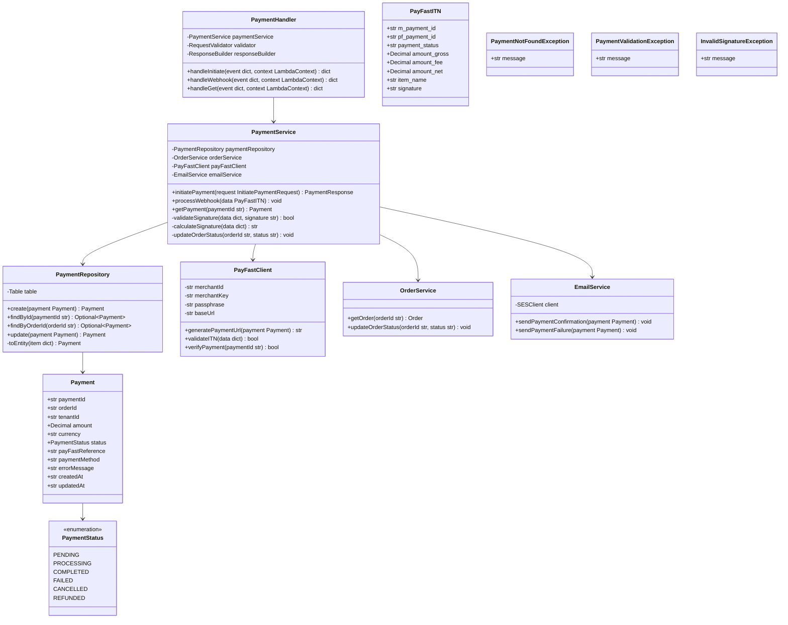
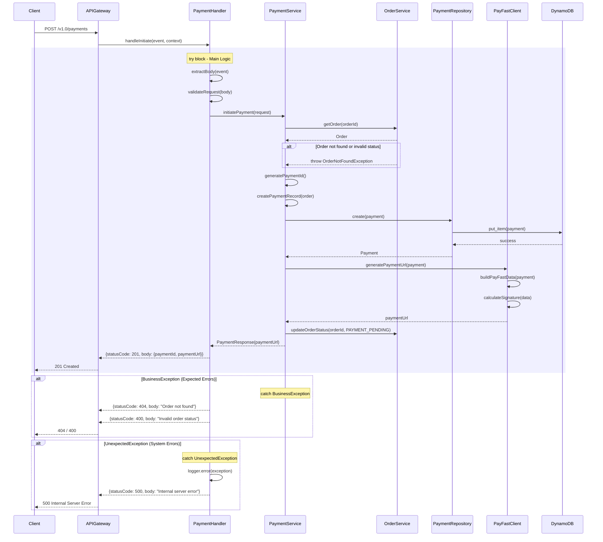
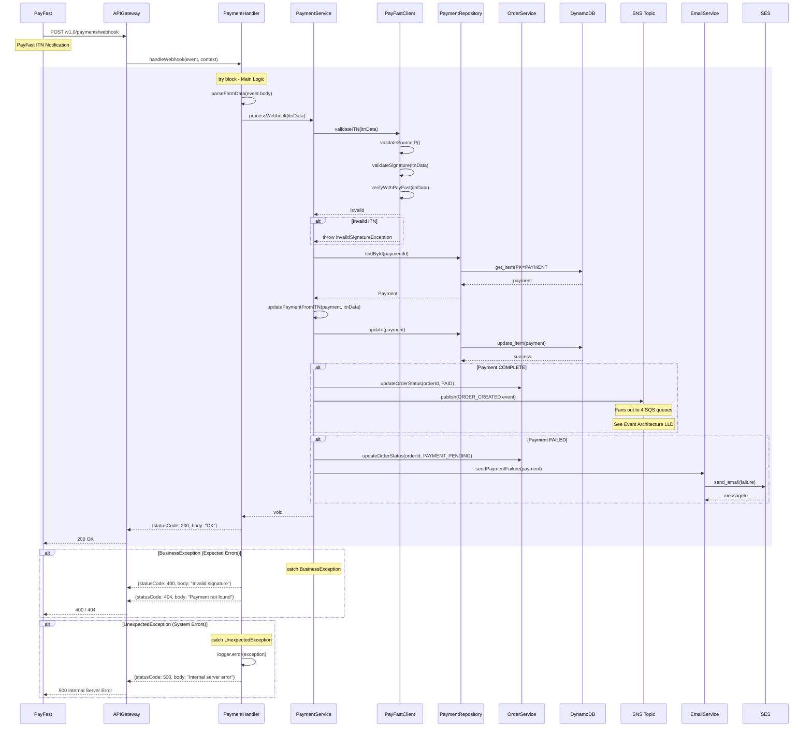
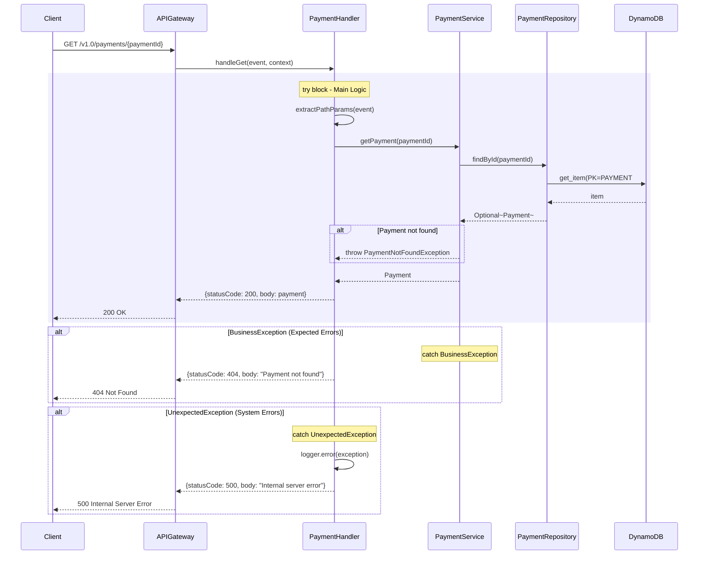

# CPP Payment Lambda - Low-Level Design

**Version**: 5.0
**Created**: 2025-12-15
**Updated**: 2026-01-11
**Status**: Active
**Component**: Payment Service (2_bbws_payment_lambda)
**Parent HLD**: [HLD 2.1.9 Payment Management](../HLDs/2.1.9_HLD_Payment_Management.md)
**Parent BRS**: [BRS 2.1.9 Payment Management](../BRS/2.1.9_BRS_Payment_Management.md)
**Payment Research**: [PayFast Integration Research](../research/pay_research.md)

---

## Document Control

| Version | Date | Author | Changes |
|---------|------|--------|---------|
| 1.0 | 2025-12-15 | Agentic Architect | Initial version |
| 2.0 | 2026-01-05 | Agentic Architect | Enhanced PayFast integration details, signature algorithm, ITN validation, environment config |
| 5.0 | 2026-01-11 | Agentic Architect | Reorganized following HLD/LLD separation standards. Added Section 6 (REST API Operations), Section 8 (Authentication), Section 9 (Environment Variables), enhanced Section 7 (DynamoDB Implementation with GSI details). Renumbered existing sections accordingly. |
| 5.1 | 2026-01-14 | Agentic Architect | **SNS Fan-Out Integration**: Added reference to Event Architecture LLD for ITN handler SNS publishing. See [2.1.12_LLD_Event_Architecture.md](./2.1.12_LLD_Event_Architecture.md) |

---

## 1. Introduction

### 1.1 Purpose

This LLD provides implementation-level details for the Payment Lambda service, which handles payment processing via PayFast payment gateway for the Customer Portal Public application.

### 1.2 Component Overview

| Attribute | Value |
|-----------|-------|
| Repository | `2_bbws_payment_lambda` |
| Runtime | Python 3.12 |
| Memory | 512MB |
| Timeout | 30s |
| Architecture | arm64 |

### 1.3 Lambda Functions (3 Total)

| Function | Endpoint | Description |
|----------|----------|-------------|
| initiate_payment | POST /v1.0/payments | Initiate PayFast payment |
| payment_webhook | POST /v1.0/payments/webhook | Handle PayFast ITN callback |
| get_payment | GET /v1.0/payments/{paymentId} | Get payment details |

---

## 2. High Level Epic Overview

| User Story # | Epic | User Story | Test Scenario(s) |
|--------------|------|------------|------------------|
| US-PAY-001 | Payments | As a user, I want to initiate payment | Given order, then PayFast redirect URL returned |
| US-PAY-002 | Payments | As system, I process payment notifications | Given ITN callback, then payment status updated |
| US-PAY-003 | Payments | As a user, I want to view payment status | Given paymentId, then payment details returned |
| US-PAY-004 | Payments | As system, I validate payment signatures | Given ITN, then signature validated |
| US-PAY-005 | Payments | As a user, I see payment failure reasons | Given failed payment, then error message shown |

---

## 3. Component Diagram



---

## 4. Sequence Diagrams

### 4.1 Initiate Payment Flow



### 4.2 PayFast Webhook (ITN) Flow

> **SNS Fan-Out**: When payment is COMPLETE, the ITN handler publishes an `ORDER_CREATED` event to the SNS topic (`bbws-order-events-{env}`). This triggers 4 Lambda functions via dedicated SQS queues. See [2.1.12_LLD_Event_Architecture.md](./2.1.12_LLD_Event_Architecture.md) for details.



### 4.3 Get Payment Flow



---

## 5. Data Models

### 5.1 DynamoDB Schema

#### Payment Entity

| Attribute | Type | Description |
|-----------|------|-------------|
| PK | String | `PAYMENT#{paymentId}` |
| SK | String | `METADATA` |
| paymentId | String | UUID (sent to PayFast as m_payment_id) |
| orderId | String | Associated order |
| tenantId | String | Tenant reference |
| amount | Number | Amount in cents |
| currency | String | Currency code (ZAR) |
| status | String | Payment status |
| payFastReference | String | PayFast pf_payment_id |
| paymentMethod | String | Payment method used |
| errorMessage | String | Error details if failed |
| itnData | Map | Raw ITN data for audit |
| createdAt | String | ISO 8601 timestamp |
| updatedAt | String | ISO 8601 timestamp |

#### GSI: OrderIndex

| Attribute | Type |
|-----------|------|
| PK (orderId) | String |
| SK (createdAt) | String |

### 5.2 Pydantic Models

```python
from pydantic import BaseModel, Field
from decimal import Decimal
from typing import Optional, Dict, Any
from enum import Enum
from datetime import datetime

class PaymentStatus(str, Enum):
    PENDING = "PENDING"
    PROCESSING = "PROCESSING"
    COMPLETED = "COMPLETED"
    FAILED = "FAILED"
    CANCELLED = "CANCELLED"
    REFUNDED = "REFUNDED"

class Payment(BaseModel):
    payment_id: str = Field(..., alias="paymentId")
    order_id: str = Field(..., alias="orderId")
    tenant_id: str = Field(..., alias="tenantId")
    amount: Decimal
    currency: str = "ZAR"
    status: PaymentStatus
    pay_fast_reference: Optional[str] = Field(None, alias="payFastReference")
    payment_method: Optional[str] = Field(None, alias="paymentMethod")
    error_message: Optional[str] = Field(None, alias="errorMessage")
    itn_data: Optional[Dict[str, Any]] = Field(None, alias="itnData")
    created_at: datetime = Field(..., alias="createdAt")
    updated_at: datetime = Field(..., alias="updatedAt")

class InitiatePaymentRequest(BaseModel):
    order_id: str = Field(..., alias="orderId")
    return_url: str = Field(..., alias="returnUrl")
    cancel_url: str = Field(..., alias="cancelUrl")

class PaymentResponse(BaseModel):
    payment_id: str = Field(..., alias="paymentId")
    payment_url: str = Field(..., alias="paymentUrl")
    status: PaymentStatus

class PayFastITN(BaseModel):
    m_payment_id: str  # Our paymentId
    pf_payment_id: str  # PayFast reference
    payment_status: str
    item_name: str
    amount_gross: Decimal
    amount_fee: Decimal
    amount_net: Decimal
    name_first: Optional[str] = None
    name_last: Optional[str] = None
    email_address: Optional[str] = None
    merchant_id: str
    signature: str
```

---

## 6. REST API Operations

### 6.1 API Structure

**Base URL (PROD)**: `https://api.kimmyai.io`
**Base URL (SIT)**: `https://sit.api.kimmyai.io`
**Base URL (DEV)**: `https://dev.api.kimmyai.io`

> **Note**: API version (`/v1.0`) is included in each endpoint path, not the base URL.

### 6.2 HATEOAS Operations: Payment

| Method | Endpoint | Description |
|--------|----------|-------------|
| POST | `/v1.0/payments` | Create a new payment (initiate PayFast transaction) |
| GET | `/v1.0/payments/{id}` | Get payment details by ID |
| GET | `/v1.0/payments` | List all payments (active only by default, use `?include_inactive=true` for all) |
| PUT | `/v1.0/payments/{id}` | Update payment details |
| PUT | `/v1.0/payments/{id}` | Soft delete payment (set active=false) |
| POST | `/v1.0/payments/webhook/itn` | PayFast ITN (Instant Transaction Notification) callback handler |
| GET | `/v1.0/payments/order/{orderId}` | Get payments by order ID |

#### 6.2.1 POST `/v1.0/payments` - Initiate Payment

**Request Headers:**
```json
{
  "Content-Type": "application/json",
  "Authorization": "Bearer <token>"
}
```

**Request Body:**
```json
{
  "orderId": "ord_550e8400-e29b-41d4-a716-446655440000",
  "tenantId": "ten_660e8400-e29b-41d4-a716-446655440001",
  "amount": 29900,
  "currency": "ZAR",
  "returnUrl": "https://portal.kimmyai.io/payment/return",
  "cancelUrl": "https://portal.kimmyai.io/payment/cancel",
  "notifyUrl": "https://api.kimmyai.io/v1.0/payments/webhook/itn",
  "itemName": "WordPress Hosting - Starter Plan",
  "itemDescription": "Monthly subscription for WordPress hosting"
}
```

**Success Response (201 Created):**
```json
{
  "id": "pay_770e8400-e29b-41d4-a716-446655440002",
  "orderId": "ord_550e8400-e29b-41d4-a716-446655440000",
  "tenantId": "ten_660e8400-e29b-41d4-a716-446655440001",
  "amount": 29900,
  "currency": "ZAR",
  "status": "PENDING",
  "paymentUrl": "https://www.payfast.co.za/eng/process?cmd=_paynow&amount=299.00&merchant_id=10000100&merchant_key=46f0cd694581a&return_url=...",
  "payfastRef": null,
  "paymentMethod": null,
  "errorMessage": null,
  "itemName": "WordPress Hosting - Starter Plan",
  "itemDescription": "Monthly subscription for WordPress hosting",
  "dateCreated": "2026-01-08T10:30:00Z",
  "dateLastUpdated": "2026-01-08T10:30:00Z",
  "lastUpdatedBy": "customer@example.com",
  "active": true
}
```

**Error Response (400 Bad Request):**
```json
{
  "error": "ValidationError",
  "message": "Invalid payment request",
  "details": [
    {
      "field": "orderId",
      "message": "Order not found or already paid"
    }
  ]
}
```

**Error Response (404 Not Found):**
```json
{
  "error": "NotFound",
  "message": "Order with id 'ord_550e8400-e29b-41d4-a716-446655440000' not found"
}
```

#### 6.2.2 GET `/v1.0/payments/{id}` - Get Payment

**Request Headers:**
```json
{
  "Authorization": "Bearer <token>"
}
```

**Success Response (200 OK):**
```json
{
  "id": "pay_770e8400-e29b-41d4-a716-446655440002",
  "orderId": "ord_550e8400-e29b-41d4-a716-446655440000",
  "tenantId": "ten_660e8400-e29b-41d4-a716-446655440001",
  "amount": 29900,
  "currency": "ZAR",
  "status": "COMPLETED",
  "paymentUrl": "https://www.payfast.co.za/eng/process?cmd=_paynow&...",
  "payfastRef": "1234567890",
  "paymentMethod": "Credit Card",
  "errorMessage": null,
  "itemName": "WordPress Hosting - Starter Plan",
  "itemDescription": "Monthly subscription for WordPress hosting",
  "itnData": {
    "m_payment_id": "pay_770e8400-e29b-41d4-a716-446655440002",
    "pf_payment_id": "1234567890",
    "payment_status": "COMPLETE",
    "amount_gross": "299.00",
    "amount_fee": "8.97",
    "amount_net": "290.03"
  },
  "dateCreated": "2026-01-08T10:30:00Z",
  "dateLastUpdated": "2026-01-08T10:35:00Z",
  "lastUpdatedBy": "system",
  "active": true
}
```

**Error Response (404 Not Found):**
```json
{
  "error": "NotFound",
  "message": "Payment with id 'pay_770e8400-e29b-41d4-a716-446655440002' not found"
}
```

#### 6.2.3 GET `/v1.0/payments` - List Payments

**Query Parameters:**
- `include_inactive` (boolean, optional): Include soft-deleted records. Default: `false`
- `pageSize` (integer, optional): Number of items to return per page. Default: `50`, Max: `100`
- `startAt` (string, optional): Pagination token to start at a specific position
- `tenantId` (string, optional): Filter by tenant ID
- `orderId` (string, optional): Filter by order ID
- `status` (string, optional): Filter by status (PENDING, PROCESSING, COMPLETED, FAILED, REFUNDED)

**Request Headers:**
```json
{
  "Authorization": "Bearer <token>"
}
```

**Success Response (200 OK):**
```json
{
  "items": [
    {
      "id": "pay_770e8400-e29b-41d4-a716-446655440002",
      "orderId": "ord_550e8400-e29b-41d4-a716-446655440000",
      "tenantId": "ten_660e8400-e29b-41d4-a716-446655440001",
      "amount": 29900,
      "currency": "ZAR",
      "status": "COMPLETED",
      "payfastRef": "1234567890",
      "paymentMethod": "Credit Card",
      "dateCreated": "2026-01-08T10:30:00Z",
      "dateLastUpdated": "2026-01-08T10:35:00Z",
      "lastUpdatedBy": "system",
      "active": true
    },
    {
      "id": "pay_880e8400-e29b-41d4-a716-446655440003",
      "orderId": "ord_990e8400-e29b-41d4-a716-446655440004",
      "tenantId": "ten_660e8400-e29b-41d4-a716-446655440001",
      "amount": 59900,
      "currency": "ZAR",
      "status": "PENDING",
      "payfastRef": null,
      "paymentMethod": null,
      "dateCreated": "2026-01-08T11:00:00Z",
      "dateLastUpdated": "2026-01-08T11:00:00Z",
      "lastUpdatedBy": "customer@example.com",
      "active": true
    }
  ],
  "startAt": "pay_880e8400-e29b-41d4-a716-446655440003",
  "moreAvailable": false
}
```

#### 6.2.4 PUT `/v1.0/payments/{id}` - Update Payment

**Request Headers:**
```json
{
  "Content-Type": "application/json",
  "Authorization": "Bearer <token>"
}
```

**Request Body (Update Status):**
```json
{
  "status": "CANCELLED",
  "errorMessage": "Customer cancelled payment"
}
```

**Success Response (200 OK):**
```json
{
  "id": "pay_770e8400-e29b-41d4-a716-446655440002",
  "orderId": "ord_550e8400-e29b-41d4-a716-446655440000",
  "tenantId": "ten_660e8400-e29b-41d4-a716-446655440001",
  "amount": 29900,
  "currency": "ZAR",
  "status": "CANCELLED",
  "payfastRef": null,
  "paymentMethod": null,
  "errorMessage": "Customer cancelled payment",
  "dateCreated": "2026-01-08T10:30:00Z",
  "dateLastUpdated": "2026-01-08T11:15:00Z",
  "lastUpdatedBy": "admin@example.com",
  "active": true
}
```

#### 6.2.5 PUT `/v1.0/payments/{id}` - Soft Delete Payment

**Request Headers:**
```json
{
  "Content-Type": "application/json",
  "Authorization": "Bearer <token>"
}
```

**Request Body (Soft Delete):**
```json
{
  "active": false
}
```

**Success Response (200 OK):**
```json
{
  "id": "pay_770e8400-e29b-41d4-a716-446655440002",
  "orderId": "ord_550e8400-e29b-41d4-a716-446655440000",
  "tenantId": "ten_660e8400-e29b-41d4-a716-446655440001",
  "amount": 29900,
  "currency": "ZAR",
  "status": "CANCELLED",
  "dateCreated": "2026-01-08T10:30:00Z",
  "dateLastUpdated": "2026-01-08T11:20:00Z",
  "lastUpdatedBy": "admin@example.com",
  "active": false
}
```

#### 6.2.6 POST `/v1.0/payments/webhook/itn` - PayFast ITN Webhook

**Description**: This endpoint receives Instant Transaction Notifications (ITN) from PayFast servers. It is called by PayFast, not by clients.

**Request Headers:**
```json
{
  "Content-Type": "application/x-www-form-urlencoded"
}
```

**Request Body (Form Data from PayFast):**
```
m_payment_id=pay_770e8400-e29b-41d4-a716-446655440002
pf_payment_id=1234567890
payment_status=COMPLETE
item_name=WordPress+Hosting+-+Starter+Plan
item_description=Monthly+subscription+for+WordPress+hosting
amount_gross=299.00
amount_fee=8.97
amount_net=290.03
custom_str1=ord_550e8400-e29b-41d4-a716-446655440000
custom_str2=ten_660e8400-e29b-41d4-a716-446655440001
name_first=John
name_last=Doe
email_address=customer@example.com
merchant_id=10000100
signature=af3a876a2e8c9fd4b6c7d8e9f0a1b2c3
```

**Success Response (200 OK):**
```json
{
  "status": "success",
  "message": "Payment notification processed successfully",
  "paymentId": "pay_770e8400-e29b-41d4-a716-446655440002",
  "paymentStatus": "COMPLETED"
}
```

**Error Response (400 Bad Request - Invalid Signature):**
```json
{
  "error": "InvalidSignature",
  "message": "Payment notification signature validation failed"
}
```

**Error Response (400 Bad Request - Amount Mismatch):**
```json
{
  "error": "AmountMismatch",
  "message": "Payment amount does not match order amount"
}
```

#### 6.2.7 GET `/v1.0/payments/order/{orderId}` - Get Payments by Order

**Request Headers:**
```json
{
  "Authorization": "Bearer <token>"
}
```

**Success Response (200 OK):**
```json
{
  "items": [
    {
      "id": "pay_770e8400-e29b-41d4-a716-446655440002",
      "orderId": "ord_550e8400-e29b-41d4-a716-446655440000",
      "tenantId": "ten_660e8400-e29b-41d4-a716-446655440001",
      "amount": 29900,
      "currency": "ZAR",
      "status": "COMPLETED",
      "payfastRef": "1234567890",
      "paymentMethod": "Credit Card",
      "dateCreated": "2026-01-08T10:30:00Z",
      "dateLastUpdated": "2026-01-08T10:35:00Z",
      "lastUpdatedBy": "system",
      "active": true
    }
  ],
  "startAt": "pay_770e8400-e29b-41d4-a716-446655440002",
  "moreAvailable": false
}
```

**Error Response (404 Not Found):**
```json
{
  "error": "NotFound",
  "message": "No payments found for order 'ord_550e8400-e29b-41d4-a716-446655440000'"
}
```

---

## 7. DynamoDB Implementation

### 7.1 Core Entity Rules

| Entity | Tenant Association | Rule |
|--------|-------------------|------|
| Payment | Required | Every payment must belong to a tenant |
| Order | Required | Every payment must reference an order |

### 7.2 Entities

> **Soft Delete Pattern**: All entities have an `active` boolean field (default=true). To delete, set `active=false`. Queries filter by `active=true` by default.

| Entity | PK | SK | Attributes |
|--------|----|----|------------|
| Payment | `PAYMENT#{id}` | `METADATA` | id, orderId, tenantId, amount, currency, status, payfastRef, paymentMethod, paymentUrl, errorMessage, itnData, itemName, itemDescription, dateCreated, dateLastUpdated, lastUpdatedBy, active |

### 7.3 GSIs

| GSI Name | PK | SK | Purpose |
|----------|----|----|---------|
| ActiveIndex | active | dateCreated | Filter by active status (sparse index, all payments) |
| TenantIndex | tenantId | dateCreated | List all payments for a tenant |
| OrderIndex | orderId | dateCreated | Find payments for a specific order |
| StatusIndex | status | dateCreated | Query payments by status (PENDING, COMPLETED, etc.) |

> **Query Pattern**: All list queries include `active=true` filter by default. Use `include_inactive=true` parameter to include soft-deleted records.

### 7.4 Entity Details

#### 7.4.1 Payment

| Attribute | Type | Required | Description |
|-----------|------|----------|-------------|
| id | String (UUID) | Yes | Unique payment identifier (prefixed with `pay_`) |
| orderId | String (UUID) | Yes | Reference to the order being paid |
| tenantId | String (UUID) | Yes | Customer tenant identifier |
| amount | Integer | Yes | Payment amount in cents (e.g., 29900 = R299.00) |
| currency | String | Yes | Currency code (always "ZAR" for PayFast) |
| status | String | Yes | Payment status: PENDING, PROCESSING, COMPLETED, FAILED, CANCELLED, REFUNDED |
| payfastRef | String | No | PayFast payment reference (pf_payment_id) |
| paymentMethod | String | No | Payment method used (Credit Card, EFT, etc.) |
| paymentUrl | String | No | Generated PayFast redirect URL |
| errorMessage | String | No | Error description if payment failed |
| itnData | Object | No | Raw ITN callback data from PayFast (for audit) |
| itemName | String | Yes | Product/service name displayed on PayFast |
| itemDescription | String | No | Product/service description |
| dateCreated | String (ISO 8601) | Yes | Creation timestamp |
| dateLastUpdated | String (ISO 8601) | Yes | Last update timestamp |
| lastUpdatedBy | String | Yes | Email or ID of user/system who last updated the payment |
| active | Boolean | Yes | Active status (default=true, false=soft deleted) |

---

## 8. Authentication

### 8.1 Authentication Method

**Authentication Type**: AWS Cognito Bearer Token

All API endpoints (except ITN webhook) require authentication using JWT tokens issued by AWS Cognito.

**Protected Endpoints:**
- All `/v1.0/payments/*` endpoints require valid Cognito token
- Customer can only access their own tenant's payments
- Admin role can access all payments

**Unprotected Endpoints:**
- `/v1.0/payments/webhook/itn` - Called by PayFast servers (validated by signature and IP whitelist)

### 8.2 Protected Endpoints

| Endpoint Pattern | Auth Required | Roles |
|-----------------|---------------|-------|
| `POST /v1.0/payments` | Yes | Customer, Admin |
| `GET /v1.0/payments/{id}` | Yes | Customer (own tenant), Admin |
| `GET /v1.0/payments` | Yes | Customer (own tenant), Admin |
| `PUT /v1.0/payments/{id}` | Yes | Admin only |
| `POST /v1.0/payments/webhook/itn` | No (signature validation) | N/A |
| `GET /v1.0/payments/order/{orderId}` | Yes | Customer (own tenant), Admin |

---

## 9. Environment Variables

### 9.1 Required Environment Variables

Each Lambda function requires the following environment variables for proper operation:

| Variable | Description | Example Value | Required |
|----------|-------------|---------------|----------|
| `DYNAMODB_TABLE` | DynamoDB table name for payments (same across all environments) | `payments` | Yes |
| `ENVIRONMENT` | Deployment environment | `dev`, `sit`, `prod` | Yes |
| `LOG_LEVEL` | Logging verbosity | `DEBUG`, `INFO`, `WARN`, `ERROR` | Yes |
| `PAYFAST_MERCHANT_ID` | PayFast merchant identifier (from Secrets Manager) | `10000100` (sandbox), `12345678` (prod) | Yes |
| `PAYFAST_MERCHANT_KEY` | PayFast merchant key (from Secrets Manager) | `46f0cd694581a` | Yes |
| `PAYFAST_PASSPHRASE` | PayFast security passphrase (from Secrets Manager) | `jt7NOE43FZPn` | Yes |
| `PAYFAST_ENDPOINT` | PayFast API base URL | `https://sandbox.payfast.co.za` (dev/sit), `https://www.payfast.co.za` (prod) | Yes |

### 9.2 Environment-Specific Configuration

#### DEV Environment
```bash
DYNAMODB_TABLE=payments
ENVIRONMENT=dev
LOG_LEVEL=DEBUG
PAYFAST_MERCHANT_ID=10000100  # Sandbox merchant ID
PAYFAST_MERCHANT_KEY=46f0cd694581a
PAYFAST_PASSPHRASE=jt7NOE43FZPn
PAYFAST_ENDPOINT=https://sandbox.payfast.co.za
```

#### SIT Environment
```bash
DYNAMODB_TABLE=payments
ENVIRONMENT=sit
LOG_LEVEL=INFO
PAYFAST_MERCHANT_ID=10000100  # Sandbox merchant ID
PAYFAST_MERCHANT_KEY=46f0cd694581a
PAYFAST_PASSPHRASE=jt7NOE43FZPn
PAYFAST_ENDPOINT=https://sandbox.payfast.co.za
```

#### PROD Environment
```bash
DYNAMODB_TABLE=payments
ENVIRONMENT=prod
LOG_LEVEL=WARN
PAYFAST_MERCHANT_ID=<LIVE_MERCHANT_ID>  # Production merchant ID
PAYFAST_MERCHANT_KEY=<LIVE_MERCHANT_KEY>
PAYFAST_PASSPHRASE=<LIVE_PASSPHRASE>
PAYFAST_ENDPOINT=https://www.payfast.co.za
```

### 9.3 Secrets Management

PayFast credentials are stored in **AWS Secrets Manager** and injected as environment variables at Lambda runtime.

**Secret Name Pattern**: `{environment}/payfast/credentials`

**Secret Structure**:
```json
{
  "merchantId": "10000100",
  "merchantKey": "46f0cd694581a",
  "passphrase": "jt7NOE43FZPn"
}
```

**Terraform Configuration**:
```hcl
data "aws_secretsmanager_secret_version" "payfast_credentials" {
  secret_id = "${var.environment}/payfast/credentials"
}

locals {
  payfast_secrets = jsondecode(data.aws_secretsmanager_secret_version.payfast_credentials.secret_string)
}

resource "aws_lambda_function" "payment_lambda" {
  environment {
    variables = {
      DYNAMODB_TABLE         = aws_dynamodb_table.payments.name
      ENVIRONMENT            = var.environment
      LOG_LEVEL              = var.log_level
      PAYFAST_MERCHANT_ID    = local.payfast_secrets.merchantId
      PAYFAST_MERCHANT_KEY   = local.payfast_secrets.merchantKey
      PAYFAST_PASSPHRASE     = local.payfast_secrets.passphrase
      PAYFAST_ENDPOINT       = var.payfast_endpoint
    }
  }
}
```

---

## 10. Messaging and Notifications

### 10.1 Email Templates

| Template | Recipient | Trigger |
|----------|-----------|---------|
| payment_confirmation | Customer | Payment successful |
| payment_failed | Customer | Payment failed |
| payment_refunded | Customer | Payment refunded |

### 10.2 Admin Notifications

| Event | Notification |
|-------|--------------|
| Payment failed (3+ times) | Admin alert via SNS |
| Large payment (>R10,000) | Admin notification |

---

## 11. NFRs

| Metric | Target |
|--------|--------|
| Initiate payment latency (p95) | < 500ms |
| Webhook processing latency (p95) | < 1000ms |
| Payment data retention | 7 years |
| Webhook idempotency | Guaranteed |

---

## 12. Risks and Mitigations

| Risk | Impact | Mitigation |
|------|--------|------------|
| ITN not received | High | Implement payment status polling |
| Duplicate ITN processing | High | Idempotency via paymentId |
| Invalid ITN signature | High | Strict signature validation |
| PayFast service unavailable | High | Retry with exponential backoff |

---

## 13. Tagging

| Tag | Value |
|-----|-------|
| Project | BBWS |
| Component | PaymentLambda |
| CostCenter | BBWS-CPP |

---

## 14. Troubleshooting Playbook

| Issue | Resolution |
|-------|------------|
| Payment stuck in PENDING | Check PayFast dashboard, verify ITN endpoint |
| Invalid signature error | Verify passphrase, check URL encoding |
| ITN not received | Check API Gateway logs, verify PayFast IP whitelist |

---

## 15. Security

- PayFast credentials stored in AWS Secrets Manager
- ITN webhook validates:
  - Source IP (PayFast IP ranges)
  - Signature verification
  - Server-to-server confirmation
- PCI DSS compliance (no card data stored)
- All payment data encrypted at rest

### 15.1 PayFast IP Whitelist

```
197.97.145.144/28
197.97.145.160/28
41.74.179.192/27
```

---

## 16. Signoff

| Role | Name | Date | Signature |
|------|------|------|-----------|
| Technical Lead | | | |
| Business Owner | | | |

---

## 17. TBC

| # | Item | Status |
|---|------|--------|
| TBC-001 | EFT payment support | Open |
| TBC-002 | Recurring payments | Open |
| TBC-003 | Refund automation | Open |

---

## 18. Definition of Terms

| Term | Definition |
|------|------------|
| ITN | Instant Transaction Notification from PayFast |
| PayFast | South African payment gateway |
| PCI DSS | Payment Card Industry Data Security Standard |
| Idempotency | Ensuring duplicate requests have same effect |

---

## 19. Appendices

### 19.1 Project Structure

```
2_bbws_payment_lambda/
├── .claude/                    # TBT workflow structure
│   ├── logs/                   # Command history
│   ├── plans/                  # Execution plans
│   ├── snapshots/              # File backups
│   ├── staging/                # Work staging area
│   └── state/state.md          # Progress tracking
├── .github/
│   └── workflows/              # CI/CD pipelines
│       ├── deploy-dev.yml
│       ├── deploy-sit.yml
│       └── deploy-prod.yml
├── src/
│   ├── __init__.py
│   ├── handlers/               # Lambda handler functions (7)
│   │   ├── __init__.py
│   │   ├── initiate_payment.py      # POST /v1.0/payments
│   │   ├── get_payment.py           # GET /v1.0/payments/{id}
│   │   ├── list_payments.py         # GET /v1.0/payments
│   │   ├── update_payment.py        # PUT /v1.0/payments/{id}
│   │   ├── delete_payment.py        # PUT /v1.0/payments/{id} (soft delete)
│   │   ├── payfast_itn_handler.py   # POST /v1.0/payments/webhook/itn
│   │   └── get_payment_by_order.py  # GET /v1.0/payments/order/{orderId}
│   ├── services/               # Business logic layer
│   │   ├── __init__.py
│   │   ├── payment_service.py       # Payment business logic
│   │   └── payfast_service.py       # PayFast API integration
│   ├── repositories/           # Data access layer
│   │   ├── __init__.py
│   │   └── payment_repository.py    # DynamoDB operations
│   ├── models/                 # Pydantic data models
│   │   ├── __init__.py
│   │   ├── payment.py               # Payment entity model
│   │   ├── requests.py              # Request models
│   │   └── responses.py             # Response models
│   ├── validators/             # Input validation
│   │   ├── __init__.py
│   │   └── payment_validator.py     # Request validation + PayFast signature
│   ├── exceptions/             # Custom exceptions
│   │   ├── __init__.py
│   │   └── payment_exceptions.py    # Payment-specific exceptions
│   └── utils/                  # Utilities
│       ├── __init__.py
│       ├── logger.py                # Structured logging
│       ├── response_builder.py      # API response builder
│       └── payfast_helpers.py       # PayFast signature generation
├── tests/                      # Test suite (80%+ coverage)
│   ├── __init__.py
│   ├── conftest.py             # Root-level pytest fixtures
│   ├── unit/                   # Unit tests
│   │   ├── __init__.py
│   │   ├── handlers/
│   │   ├── services/
│   │   ├── repositories/
│   │   ├── models/
│   │   ├── validators/
│   │   ├── exceptions/
│   │   └── utils/
│   ├── integration/            # Integration tests
│   │   └── __init__.py
│   ├── e2e/                    # End-to-end tests
│   │   ├── __init__.py
│   │   ├── conftest.py         # E2E-specific fixtures
│   │   ├── config.py
│   │   └── README.md
│   ├── proxies/                # API proxy for E2E tests
│   │   ├── __init__.py
│   │   ├── conftest.py         # Proxy-specific fixtures
│   │   ├── payment_api_proxy.py
│   │   └── proxy_config.py
│   └── bootstrap/              # Test data bootstrappers
│       ├── __init__.py
│       └── payment_bootstrapper.py
├── terraform/                  # Infrastructure as Code
│   ├── environments/
│   │   ├── dev.tfvars
│   │   ├── sit.tfvars
│   │   └── prod.tfvars
│   ├── main.tf                 # Provider and tags
│   ├── variables.tf            # Input variables
│   ├── backend.tf              # S3 backend configuration
│   ├── data.tf                 # Data sources (DynamoDB table)
│   ├── lambda.tf               # Lambda function resources
│   ├── api_gateway.tf          # REST API definition
│   ├── api_gateway_integration.tf  # Lambda integrations
│   ├── iam.tf                  # IAM roles and policies
│   ├── secrets.tf              # AWS Secrets Manager references
│   ├── cloudwatch.tf           # Alarms and monitoring
│   └── outputs.tf              # Terraform outputs
├── scripts/                    # Helper scripts
│   ├── package_lambda.sh       # Package Lambda functions
│   └── validate_terraform.sh  # Validate Terraform configs
├── .gitignore                  # Git ignore patterns
├── CLAUDE.md                   # Project-specific TBT instructions
├── README.md                   # Developer guide
├── pytest.ini                  # Pytest configuration
├── requirements.txt            # Production dependencies
└── requirements-dev.txt        # Development dependencies
```

### 19.2 PayFast Integration Configuration

| Environment | Merchant ID | Base URL |
|-------------|-------------|----------|
| dev | sandbox_merchant | sandbox.payfast.co.za |
| sit | sandbox_merchant | sandbox.payfast.co.za |
| prod | live_merchant | www.payfast.co.za |

### 19.3 PayFast Signature Generation

**CRITICAL: Parameter Order**

The signature MUST be generated with parameters in this exact order (NOT alphabetical):

```python
PAYFAST_PARAM_ORDER = [
    'merchant_id', 'merchant_key', 'return_url', 'cancel_url',
    'notify_url', 'name_first', 'name_last', 'email_address',
    'cell_number', 'm_payment_id', 'amount', 'item_name',
    'item_description', 'custom_int1', 'custom_int2', 'custom_int3',
    'custom_int4', 'custom_int5', 'custom_str1', 'custom_str2',
    'custom_str3', 'custom_str4', 'custom_str5', 'email_confirmation',
    'confirmation_address', 'payment_method', 'subscription_type',
    'billing_date', 'recurring_amount', 'frequency', 'cycles'
]
```

**Signature Generation Algorithm:**

```python
import hashlib
from urllib.parse import quote_plus

def calculate_signature(data: dict, passphrase: str) -> str:
    """
    Generate MD5 signature for PayFast.

    IMPORTANT: Parameters must be in PayFast-specified order, NOT alphabetical.
    """
    # 1. Build parameter string in correct order (only non-empty values)
    param_string = ''
    for key in PAYFAST_PARAM_ORDER:
        if key in data and data[key] and str(data[key]).strip():
            value = str(data[key])
            # URL encode with spaces as '+' not '%20'
            encoded_value = quote_plus(value).replace('%20', '+')
            param_string += f"{key}={encoded_value}&"

    # 2. Add passphrase (required for sandbox, optional for production)
    if passphrase:
        param_string += f"passphrase={quote_plus(passphrase).replace('%20', '+')}"
    else:
        # Remove trailing '&' if no passphrase
        param_string = param_string.rstrip('&')

    # 3. Generate MD5 hash
    return hashlib.md5(param_string.encode()).hexdigest()
```

**Common Signature Issues:**

| Issue | Cause | Solution |
|-------|-------|----------|
| Signature mismatch | Wrong parameter order | Use exact PayFast order (NOT alphabetical) |
| Signature mismatch | Incorrect URL encoding | Encode spaces as '+' not '%20' |
| Signature mismatch | Empty passphrase in prod | Don't include passphrase param if empty |
| Signature mismatch | Including empty values | Only include non-empty parameters |

### 19.4 ITN Validation Steps

The ITN handler MUST perform these validation steps in order:

```python
async def validate_itn(itn_data: dict, source_ip: str) -> bool:
    """
    Validate PayFast ITN notification.
    All steps must pass for ITN to be valid.
    """
    # Step 1: Verify source IP (PayFast servers only)
    if not is_payfast_ip(source_ip):
        logger.warning(f"ITN from invalid IP: {source_ip}")
        return False

    # Step 2: Validate signature
    received_signature = itn_data.pop('signature', '')
    calculated_signature = calculate_signature(itn_data, PASSPHRASE)
    if received_signature != calculated_signature:
        logger.warning("ITN signature mismatch")
        return False

    # Step 3: Verify payment amount matches
    payment = await get_payment(itn_data['m_payment_id'])
    if payment.amount != Decimal(itn_data['amount_gross']):
        logger.warning("ITN amount mismatch")
        return False

    # Step 4: Verify with PayFast server
    is_valid = await verify_with_payfast_server(itn_data)
    if not is_valid:
        logger.warning("PayFast server verification failed")
        return False

    return True

async def verify_with_payfast_server(data: dict) -> bool:
    """Server-to-server verification with PayFast."""
    host = 'www.payfast.co.za' if ENVIRONMENT == 'prod' else 'sandbox.payfast.co.za'

    async with aiohttp.ClientSession() as session:
        response = await session.post(
            f'https://{host}/eng/query/validate',
            data=data,
            headers={'Content-Type': 'application/x-www-form-urlencoded'}
        )
        result = await response.text()
        return result == 'VALID'
```

---

## 20. References

- [Parent HLD: BBWS Customer Portal Public](../BBWS_Customer_Portal_Public_HLD.md)
- [PayFast Integration Documentation](https://developers.payfast.co.za/)

---

## Reorganization Summary (v5.0)

**Reorganization Date**: 2026-01-11

This LLD has been reorganized to version 5.0 following proper HLD/LLD separation standards:

### Changes Made:

- **Section 6: REST API Operations (NEW)** - Added 338 lines of detailed API specifications from HLD backup
  - 6.2.1: POST /v1.0/payments - Initiate Payment
  - 6.2.2: GET /v1.0/payments/{id} - Get Payment
  - 6.2.3: GET /v1.0/payments - List Payments
  - 6.2.4: PUT /v1.0/payments/{id} - Update Payment
  - 6.2.5: PUT /v1.0/payments/{id} - Soft Delete Payment
  - 6.2.6: POST /v1.0/payments/webhook/itn - PayFast ITN Webhook
  - 6.2.7: GET /v1.0/payments/order/{orderId} - Get Payments by Order
  - Each endpoint includes: Request Headers, Request Body, Success Response, Error Responses, full JSON examples

- **Section 7: DynamoDB Implementation (ENHANCED)** - Enhanced with 52 lines from HLD backup
  - Added GSI details: ActiveIndex, TenantIndex, OrderIndex, StatusIndex
  - Added complete entity attributes table with types, requirements, descriptions

- **Section 8: Authentication (NEW)** - Added 27 lines of authentication details from HLD backup
  - Authentication method (AWS Cognito Bearer Token)
  - Protected endpoints table with roles matrix

- **Section 9: Environment Variables (NEW)** - Created comprehensive environment variables section
  - All required Lambda environment variables documented
  - Environment-specific configurations (DEV, SIT, PROD)
  - Secrets Manager integration details
  - Terraform configuration examples

- **Sections Renumbered** - Existing sections 6-16 renumbered to 10-20 to accommodate new sections

### Result:

- LLD now contains all implementation details needed for development
- HLD focuses on high-level architecture and design decisions
- Clear separation of concerns between HLD and LLD documents
- Implementation-ready specifications for developers

### Post-Reorganization Update (2026-01-11):

- **Section 19.1: Project Structure (UPDATED)** - Expanded to reflect actual repository structure created in Phase 2 - Sub-plan 2.1
  - Added complete directory tree with all files and folders
  - Added 7 Lambda handler files (was 3)
  - Added comprehensive test structure (unit, integration, e2e, proxies, bootstrap)
  - Added three-level conftest.py structure (root, e2e, proxies)
  - Added TBT workflow directories (.claude/)
  - Added CI/CD workflows (.github/workflows/)
  - Added all project documentation files (CLAUDE.md, README.md, pytest.ini, requirements files)
  - Added complete terraform structure with all .tf files
  - Now matches actual repository structure in `2_bbws_payment_lambda/`

---

**End of Document**
