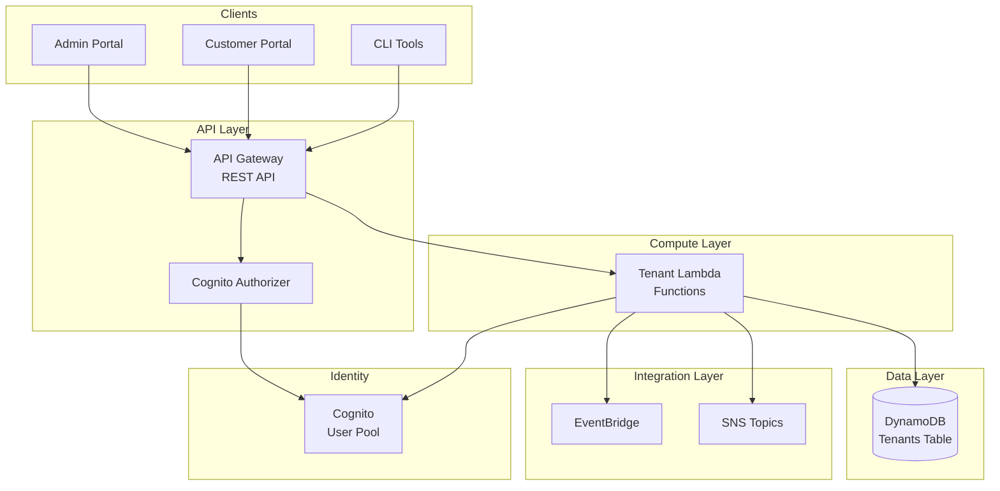
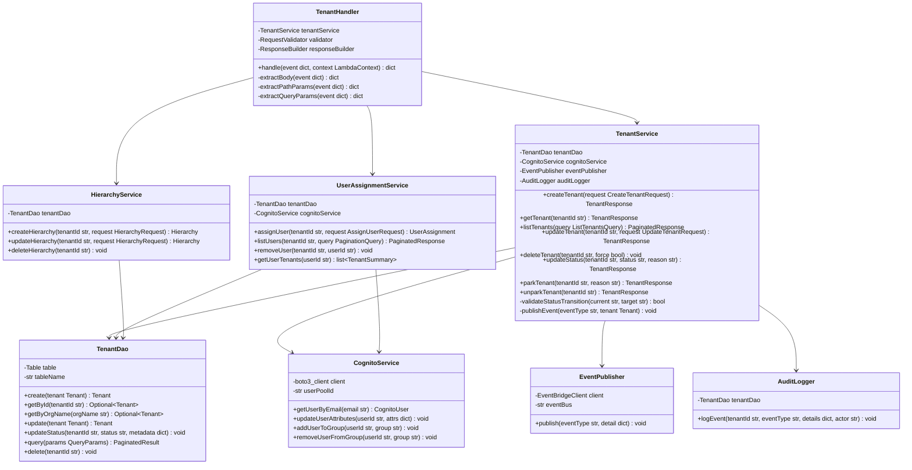
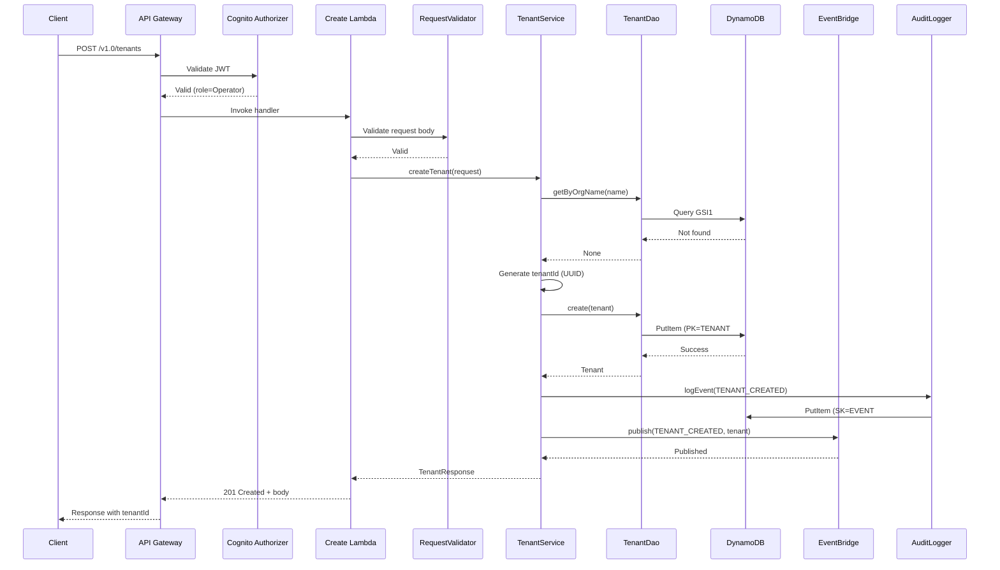
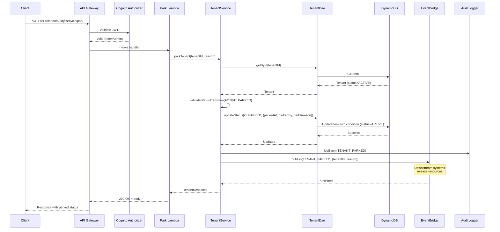
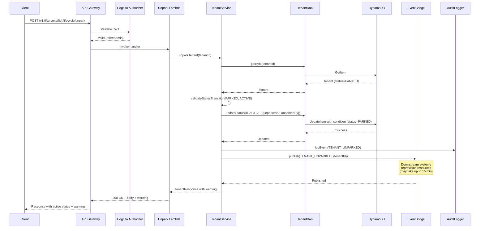
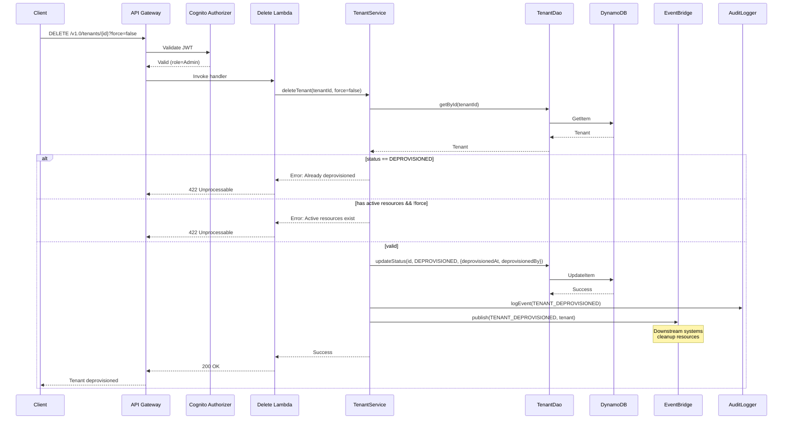
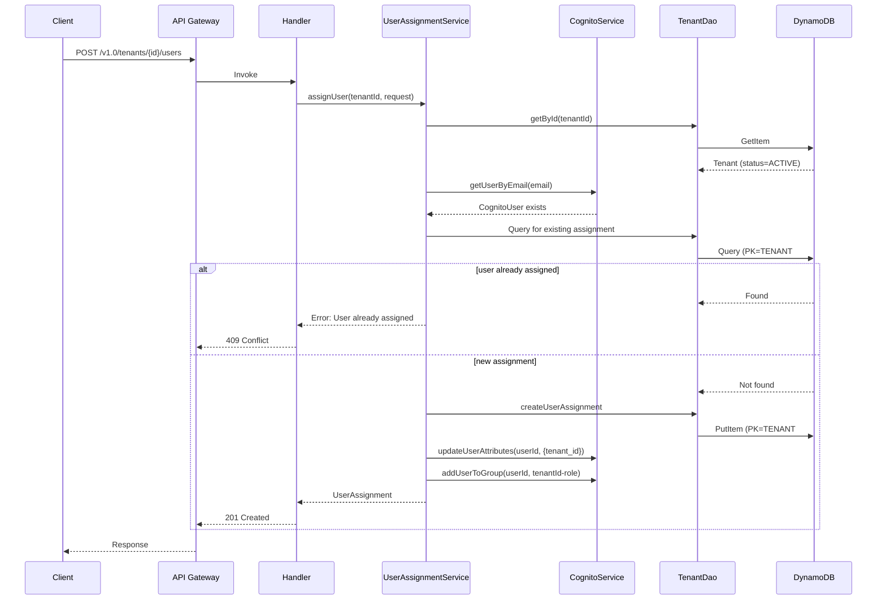

# Tenant Management Lambda - Low-Level Design

**Version**: 1.0
**Created**: 2026-01-05
**Status**: Draft
**Component**: Tenant Management Service (2_bbws_tenant_lambda)
**Parent HLD**: [HLD 2.5 Tenant Management](../HLDs/2.5_HLD_Tenant_Management.md)
**Parent BRS**: [BRS 2.5 Tenant Management](../BRS/2.5_BRS_Tenant_Management.md)

---

## Document Control

| Version | Date | Author | Changes |
|---------|------|--------|---------|
| 1.0 | 2026-01-05 | Agentic Architect | Initial version - Complete LLD for Tenant Management |

---

## Table of Contents

1. [Introduction](#1-introduction)
2. [High Level Epic Overview](#2-high-level-epic-overview)
3. [Component Diagram](#3-component-diagram)
4. [Sequence Diagrams](#4-sequence-diagrams)
5. [Data Models](#5-data-models)
6. [API Design](#6-api-design)
7. [Lambda Functions](#7-lambda-functions)
8. [ECS Integration](#8-ecs-integration)
9. [Security](#9-security)
10. [Monitoring & Alerting](#10-monitoring--alerting)
11. [Error Handling](#11-error-handling)
12. [NFRs](#12-nfrs)
13. [Risks and Mitigations](#13-risks-and-mitigations)
14. [Troubleshooting Playbook](#14-troubleshooting-playbook)
15. [Signoff](#15-signoff)
16. [Definition of Terms](#16-definition-of-terms)
17. [Appendices](#17-appendices)
18. [References](#18-references)

---

## 1. Introduction

### 1.1 Purpose

This Low-Level Design (LLD) document provides implementation-level details for the **Tenant Management** microservice. This service manages the logical tenant entity (organization, hierarchy, metadata, users) and provides RESTful API endpoints for tenant CRUD operations, organization hierarchy management, user assignments, and tenant lifecycle state transitions including Park/Unpark operations.

**Key Distinction**: Tenant Management handles the **logical tenant entity** - it does NOT handle WordPress-specific provisioning (covered by BRS 2.7 - WordPress Tenant Management API).

### 1.2 Component Overview

| Attribute | Value |
|-----------|-------|
| Repository | `2_bbws_tenant_lambda` |
| Runtime | Python 3.12 |
| Memory | 256-512MB (varies by function) |
| Timeout | 10-120s (varies by function) |
| Architecture | arm64 |
| Framework | AWS Lambda Powertools |

### 1.3 Lambda Functions (8 Total)

| Function | Endpoint | Description | Memory | Timeout |
|----------|----------|-------------|--------|---------|
| tenant-create | POST /v1.0/tenants | Create tenant | 256MB | 30s |
| tenant-get | GET /v1.0/tenants/{tenantId} | Get tenant | 128MB | 10s |
| tenant-list | GET /v1.0/tenants | List tenants | 256MB | 15s |
| tenant-update | PUT /v1.0/tenants/{tenantId} | Update tenant | 256MB | 30s |
| tenant-delete | DELETE /v1.0/tenants/{tenantId} | Soft delete tenant | 256MB | 30s |
| tenant-status | PATCH /v1.0/tenants/{tenantId}/status | Update status | 256MB | 30s |
| tenant-park | POST /v1.0/tenants/{tenantId}/park | Park tenant | 512MB | 120s |
| tenant-unpark | POST /v1.0/tenants/{tenantId}/unpark | Unpark tenant | 512MB | 120s |

### 1.4 Dependencies

| Dependency | Purpose |
|------------|---------|
| AWS DynamoDB | Tenant metadata and state storage |
| AWS Cognito | User authentication, JWT validation |
| AWS API Gateway | REST API exposure |
| AWS EventBridge | Event publishing for downstream systems |
| AWS SNS | Notifications for status changes |
| AWS CloudWatch | Logging, metrics, alarms |
| AWS Secrets Manager | Configuration secrets |

### 1.5 Related Documents

| Document | Relationship |
|----------|--------------|
| BRS 2.5 Tenant Management | Business requirements |
| HLD 2.1 Customer Portal Public | Parent architecture |
| BRS 2.7 WordPress Tenant Management API | WordPress resource provisioning |
| Cognito_Tenant_Pools_LLD | Authentication details |

---

## 2. High Level Epic Overview

| User Story # | Epic | User Story | Test Scenario(s) |
|--------------|------|------------|------------------|
| US-TEN-001 | Tenant CRUD | As an Operator, I want to create a tenant | Given valid data, then tenant created with PENDING status |
| US-TEN-002 | Tenant CRUD | As an Operator, I want to view tenant details | Given valid tenantId, then complete tenant data returned |
| US-TEN-003 | Tenant CRUD | As an Admin, I want to update tenant info | Given valid updates, then tenant updated with audit |
| US-TEN-004 | Tenant CRUD | As an Operator, I want to list all tenants | Given query params, then paginated list returned |
| US-TEN-005 | Tenant CRUD | As an Admin, I want to deprovision a tenant | Given tenantId, then status set to DEPROVISIONED |
| US-TEN-006 | Hierarchy | As an Admin, I want to create organization hierarchy | Given hierarchy data, then Division/Group/Team created |
| US-TEN-007 | Hierarchy | As an Admin, I want to update hierarchy | Given updates, then hierarchy modified |
| US-TEN-008 | Hierarchy | As an Admin, I want to delete hierarchy | Given empty hierarchy, then hierarchy deleted |
| US-TEN-009 | User Assignment | As an Admin, I want to assign user to tenant | Given userId and role, then user assigned |
| US-TEN-010 | User Assignment | As an Admin, I want to list users in tenant | Given tenantId, then user list returned |
| US-TEN-011 | User Assignment | As an Admin, I want to remove user from tenant | Given userId, then user removed |
| US-TEN-012 | User Assignment | As a User, I want to see my tenants | Given my userId, then my tenant list returned |
| US-TEN-013 | Lifecycle | As an Admin, I want to update tenant status | Given valid transition, then status updated |
| US-TEN-014 | Lifecycle | As an Admin, I want to park a tenant | Given ACTIVE tenant, then tenant PARKED |
| US-TEN-015 | Lifecycle | As an Admin, I want to unpark a tenant | Given PARKED tenant, then tenant ACTIVE |

---

## 3. Component Diagram

### 3.1 System Context



### 3.2 Class Structure



### 3.3 Package Structure

```
2_bbws_tenant_lambda/
├── src/
│   ├── handlers/
│   │   ├── __init__.py
│   │   ├── tenant_create_handler.py
│   │   ├── tenant_get_handler.py
│   │   ├── tenant_list_handler.py
│   │   ├── tenant_update_handler.py
│   │   ├── tenant_delete_handler.py
│   │   ├── tenant_status_handler.py
│   │   ├── tenant_park_handler.py
│   │   └── tenant_unpark_handler.py
│   ├── services/
│   │   ├── __init__.py
│   │   ├── tenant_service.py
│   │   ├── user_assignment_service.py
│   │   ├── hierarchy_service.py
│   │   ├── cognito_service.py
│   │   └── event_publisher.py
│   ├── dao/
│   │   ├── __init__.py
│   │   └── tenant_dao.py
│   ├── models/
│   │   ├── __init__.py
│   │   ├── tenant.py
│   │   ├── user_assignment.py
│   │   ├── hierarchy.py
│   │   ├── requests.py
│   │   └── responses.py
│   ├── validators/
│   │   ├── __init__.py
│   │   └── request_validator.py
│   └── utils/
│       ├── __init__.py
│       ├── response_builder.py
│       └── audit_logger.py
├── tests/
│   ├── unit/
│   └── integration/
├── terraform/
│   ├── main.tf
│   ├── variables.tf
│   ├── dynamodb.tf
│   └── lambda.tf
├── requirements.txt
├── requirements-dev.txt
└── README.md
```

---

## 4. Sequence Diagrams

### 4.1 Create Tenant



### 4.2 Park Tenant



### 4.3 Unpark Tenant



### 4.4 Delete (Deprovision) Tenant



### 4.5 Assign User to Tenant



---

## 5. Data Models

### 5.1 DynamoDB Table Design

**Table Name**: `bbws-tenants-{env}`

**Capacity Mode**: On-Demand (as per global standards)

**Primary Key**:
- **PK** (Partition Key): String
- **SK** (Sort Key): String

### 5.2 Item Patterns

| Entity | PK | SK | Purpose |
|--------|----|----|---------|
| Tenant Metadata | `TENANT#{tenantId}` | `METADATA` | Core tenant data |
| User Assignment | `TENANT#{tenantId}` | `USER#{userId}` | User-tenant mapping |
| Hierarchy | `TENANT#{tenantId}` | `HIERARCHY#{division}#{group}#{team}` | Org structure |
| Audit Event | `TENANT#{tenantId}` | `EVENT#{timestamp}#{eventId}` | Audit trail |

### 5.3 Global Secondary Indexes

| Index | PK (GSI1PK/GSI2PK) | SK (GSI1SK/GSI2SK) | Purpose |
|-------|--------------------|--------------------|---------|
| GSI1 | `ORG#{organizationName}` | `TENANT#{tenantId}` | Organization name lookup |
| GSI1 | `USER#{userId}` | `TENANT#{tenantId}` | User's tenants lookup |
| GSI2 | `STATUS#{status}` | `{updatedAt}#{tenantId}` | Status queries, time-based |
| GSI2 | `ENV#{environment}` | `{createdAt}#{tenantId}` | Environment filtering |

### 5.4 Tenant Metadata Schema

```json
{
  "PK": "TENANT#tenant-550e8400-e29b-41d4-a716-446655440000",
  "SK": "METADATA",
  "tenantId": "tenant-550e8400-e29b-41d4-a716-446655440000",
  "organizationName": "Acme Corporation",
  "contactEmail": "admin@acme.com",
  "environment": "prod",
  "status": "ACTIVE",
  "division": "Technology",
  "group": "Engineering",
  "team": "Platform",
  "createdAt": "2026-01-05T10:30:00Z",
  "createdBy": "operator@bbws.io",
  "updatedAt": "2026-01-05T14:30:00Z",
  "updatedBy": "admin@bbws.io",
  "parkedAt": null,
  "parkedBy": null,
  "parkReason": null,
  "metadata": {
    "industry": "Software",
    "size": "Enterprise",
    "tier": "PREMIUM"
  },
  "version": 3,
  "GSI1PK": "ORG#Acme Corporation",
  "GSI1SK": "TENANT#tenant-550e8400-e29b-41d4-a716-446655440000",
  "GSI2PK": "STATUS#ACTIVE",
  "GSI2SK": "2026-01-05T14:30:00Z#tenant-550e8400-e29b-41d4-a716-446655440000"
}
```

### 5.5 User Assignment Schema

```json
{
  "PK": "TENANT#tenant-550e8400-e29b-41d4-a716-446655440000",
  "SK": "USER#user-123e4567-e89b-12d3-a456-426614174000",
  "tenantId": "tenant-550e8400-e29b-41d4-a716-446655440000",
  "userId": "user-123e4567-e89b-12d3-a456-426614174000",
  "email": "john.doe@acme.com",
  "role": "Admin",
  "assignedAt": "2026-01-05T11:00:00Z",
  "assignedBy": "admin@bbws.io",
  "active": true,
  "GSI1PK": "USER#user-123e4567-e89b-12d3-a456-426614174000",
  "GSI1SK": "TENANT#tenant-550e8400-e29b-41d4-a716-446655440000"
}
```

### 5.6 Audit Event Schema

```json
{
  "PK": "TENANT#tenant-550e8400-e29b-41d4-a716-446655440000",
  "SK": "EVENT#2026-01-05T14:30:00.000Z#evt-abc123",
  "tenantId": "tenant-550e8400-e29b-41d4-a716-446655440000",
  "eventId": "evt-abc123",
  "eventType": "TENANT_PARKED",
  "timestamp": "2026-01-05T14:30:00Z",
  "actor": "admin@bbws.io",
  "details": {
    "previousStatus": "ACTIVE",
    "newStatus": "PARKED",
    "reason": "Customer requested temporary suspension"
  },
  "ttl": 1736096400
}
```

### 5.7 Access Patterns

| # | Access Pattern | Key Condition | Index |
|---|----------------|---------------|-------|
| 1 | Get tenant by ID | PK = `TENANT#{id}`, SK = `METADATA` | Table |
| 2 | Get tenant by org name | GSI1PK = `ORG#{name}` | GSI1 |
| 3 | List tenants by status | GSI2PK = `STATUS#{status}` | GSI2 |
| 4 | List tenants by environment | GSI2PK = `ENV#{env}` | GSI2 |
| 5 | Get user's tenants | GSI1PK = `USER#{userId}` | GSI1 |
| 6 | List users in tenant | PK = `TENANT#{id}`, SK begins_with `USER#` | Table |
| 7 | Get tenant audit events | PK = `TENANT#{id}`, SK begins_with `EVENT#` | Table |
| 8 | Get hierarchy for tenant | PK = `TENANT#{id}`, SK begins_with `HIERARCHY#` | Table |

### 5.8 Pydantic Models

```python
from pydantic import BaseModel, Field, EmailStr
from typing import Optional, Dict, Any, List
from datetime import datetime
from enum import Enum

class TenantStatus(str, Enum):
    PENDING = "PENDING"
    ACTIVE = "ACTIVE"
    SUSPENDED = "SUSPENDED"
    PARKED = "PARKED"
    DEPROVISIONED = "DEPROVISIONED"
    FAILED = "FAILED"

class UserRole(str, Enum):
    ADMIN = "Admin"
    OPERATOR = "Operator"
    VIEWER = "Viewer"

class Tenant(BaseModel):
    tenant_id: str = Field(alias="tenantId")
    organization_name: str = Field(alias="organizationName", min_length=2, max_length=100)
    contact_email: EmailStr = Field(alias="contactEmail")
    environment: str
    status: TenantStatus
    division: Optional[str] = None
    group: Optional[str] = None
    team: Optional[str] = None
    created_at: datetime = Field(alias="createdAt")
    created_by: str = Field(alias="createdBy")
    updated_at: Optional[datetime] = Field(alias="updatedAt", default=None)
    updated_by: Optional[str] = Field(alias="updatedBy", default=None)
    parked_at: Optional[datetime] = Field(alias="parkedAt", default=None)
    parked_by: Optional[str] = Field(alias="parkedBy", default=None)
    park_reason: Optional[str] = Field(alias="parkReason", default=None)
    metadata: Optional[Dict[str, Any]] = None
    version: int = 1

    class Config:
        populate_by_name = True
        use_enum_values = True

class UserAssignment(BaseModel):
    tenant_id: str = Field(alias="tenantId")
    user_id: str = Field(alias="userId")
    email: EmailStr
    role: UserRole
    assigned_at: datetime = Field(alias="assignedAt")
    assigned_by: str = Field(alias="assignedBy")
    active: bool = True

    class Config:
        populate_by_name = True
        use_enum_values = True

class CreateTenantRequest(BaseModel):
    organization_name: str = Field(alias="organizationName", min_length=2, max_length=100)
    contact_email: EmailStr = Field(alias="contactEmail")
    environment: str = Field(pattern="^(dev|sit|prod)$")
    division: Optional[str] = Field(default=None, min_length=2, max_length=50)
    group: Optional[str] = Field(default=None, min_length=2, max_length=50)
    team: Optional[str] = Field(default=None, min_length=2, max_length=50)
    metadata: Optional[Dict[str, Any]] = None

    class Config:
        populate_by_name = True

class ParkTenantRequest(BaseModel):
    reason: str = Field(min_length=10, max_length=500)

class AssignUserRequest(BaseModel):
    email: EmailStr
    role: UserRole

    class Config:
        use_enum_values = True
```

---

## 6. API Design (HATEOAS)

### 6.1 Base URLs

| Environment | Base URL |
|-------------|----------|
| DEV | `https://api.dev.bbws.io/v1.0` |
| SIT | `https://api.sit.bbws.io/v1.0` |
| PROD | `https://api.bbws.io/v1.0` |

### 6.2 Hierarchical URL Structure

All APIs follow hierarchical HATEOAS design:

```
/v1.0/tenants
└── /{tenantId}
    ├── /divisions
    │   └── /{divisionId}
    │       └── /groups
    │           └── /{groupId}
    │               └── /teams
    │                   └── /{teamId}
    │                       └── /users
    ├── /users (direct tenant users)
    ├── /invitations
    │   └── /{invitationId}
    │       ├── /resend
    │       └── /revoke
    └── /lifecycle
        ├── /suspend
        ├── /resume
        ├── /park
        └── /unpark
```

### 6.3 Authentication

All endpoints require:
- **Authorization**: Bearer JWT token from Cognito
- **X-Api-Key**: API Gateway API key

### 6.4 Tenant Operations

| Method | Path | Description | Auth Roles |
|--------|------|-------------|------------|
| POST | `/v1.0/tenants` | Create tenant | Operator, Admin |
| GET | `/v1.0/tenants` | List tenants (paginated) | Operator, Admin, Viewer |
| GET | `/v1.0/tenants/{tenantId}` | Get tenant | Operator, Admin, Viewer |
| PUT | `/v1.0/tenants/{tenantId}` | Update tenant | Admin |
| DELETE | `/v1.0/tenants/{tenantId}` | Soft delete tenant | Admin |

### 6.5 Lifecycle Operations

| Method | Path | Description | Auth Roles |
|--------|------|-------------|------------|
| POST | `/v1.0/tenants/{tenantId}/lifecycle/suspend` | Suspend tenant | Admin |
| POST | `/v1.0/tenants/{tenantId}/lifecycle/resume` | Resume tenant | Admin |
| POST | `/v1.0/tenants/{tenantId}/lifecycle/park` | Park tenant | Admin |
| POST | `/v1.0/tenants/{tenantId}/lifecycle/unpark` | Unpark tenant | Admin |

### 6.6 Organization Hierarchy Operations

| Method | Path | Description | Auth Roles |
|--------|------|-------------|------------|
| GET | `/v1.0/tenants/{tenantId}/divisions` | List divisions | Admin, Operator |
| POST | `/v1.0/tenants/{tenantId}/divisions` | Create division | Admin |
| GET | `/v1.0/tenants/{tenantId}/divisions/{divisionId}` | Get division | Admin, Operator |
| PUT | `/v1.0/tenants/{tenantId}/divisions/{divisionId}` | Update division | Admin |
| DELETE | `/v1.0/tenants/{tenantId}/divisions/{divisionId}` | Delete division | Admin |
| GET | `.../{divisionId}/groups` | List groups in division | Admin, Operator |
| POST | `.../{divisionId}/groups` | Create group | Admin |
| GET | `.../{groupId}/teams` | List teams in group | Admin, Operator |
| POST | `.../{groupId}/teams` | Create team | Admin |

### 6.7 User Operations

| Method | Path | Description | Auth Roles |
|--------|------|-------------|------------|
| GET | `/v1.0/tenants/{tenantId}/users` | List tenant users | Admin, Operator |
| POST | `/v1.0/tenants/{tenantId}/users` | Assign user to tenant | Admin |
| GET | `/v1.0/tenants/{tenantId}/users/{userId}` | Get user details | Admin, Operator |
| DELETE | `/v1.0/tenants/{tenantId}/users/{userId}` | Remove user | Admin |
| GET | `/v1.0/users/{userId}/tenants` | Get user's tenants | Self, Admin |

### 6.8 Invitation Operations

| Method | Path | Description | Auth Roles |
|--------|------|-------------|------------|
| GET | `/v1.0/tenants/{tenantId}/invitations` | List invitations | Admin |
| POST | `/v1.0/tenants/{tenantId}/invitations` | Create invitation | Admin |
| GET | `/v1.0/tenants/{tenantId}/invitations/{invitationId}` | Get invitation | Admin |
| DELETE | `/v1.0/tenants/{tenantId}/invitations/{invitationId}` | Cancel invitation | Admin |
| POST | `/v1.0/tenants/{tenantId}/invitations/{invitationId}/resend` | Resend invitation | Admin |

### 6.4 Endpoint Details

#### POST /v1.0/tenants - Create Tenant

**Request Body**:
```json
{
  "organizationName": "Acme Corporation",
  "contactEmail": "admin@acme.com",
  "environment": "prod",
  "division": "Technology",
  "metadata": {
    "industry": "Software",
    "size": "Enterprise"
  }
}
```

**Response** (201 Created):
```json
{
  "tenantId": "tenant-550e8400-e29b-41d4-a716-446655440000",
  "organizationName": "Acme Corporation",
  "contactEmail": "admin@acme.com",
  "environment": "prod",
  "status": "PENDING",
  "division": "Technology",
  "createdAt": "2026-01-05T10:30:00Z",
  "createdBy": "operator@bbws.io",
  "version": 1,
  "_links": {
    "self": { "href": "/v1.0/tenants/tenant-550e8400-e29b-41d4-a716-446655440000" },
    "users": { "href": "/v1.0/tenants/tenant-550e8400-e29b-41d4-a716-446655440000/users" },
    "park": { "href": "/v1.0/tenants/tenant-550e8400-e29b-41d4-a716-446655440000/park" }
  }
}
```

#### GET /v1.0/tenants - List Tenants

**Query Parameters**:
| Parameter | Type | Description | Default |
|-----------|------|-------------|---------|
| status | string | Filter by status | - |
| environment | string | Filter by environment | - |
| limit | integer | Page size (1-100) | 20 |
| nextToken | string | Pagination token | - |

**Response** (200 OK):
```json
{
  "items": [
    {
      "tenantId": "tenant-550e8400-e29b-41d4-a716-446655440000",
      "organizationName": "Acme Corporation",
      "status": "ACTIVE",
      "environment": "prod",
      "createdAt": "2026-01-05T10:30:00Z"
    }
  ],
  "count": 1,
  "nextToken": null,
  "_links": {
    "self": { "href": "/v1.0/tenants?limit=20" }
  }
}
```

#### POST /v1.0/tenants/{tenantId}/lifecycle/park - Park Tenant

**Request Body**:
```json
{
  "reason": "Customer requested temporary suspension for cost reduction"
}
```

**Response** (200 OK):
```json
{
  "tenantId": "tenant-550e8400-e29b-41d4-a716-446655440000",
  "status": "PARKED",
  "parkedAt": "2026-01-05T14:30:00Z",
  "parkedBy": "admin@bbws.io",
  "parkReason": "Customer requested temporary suspension for cost reduction",
  "message": "Tenant parked successfully. Resources will be released within 5 minutes.",
  "_links": {
    "self": { "href": "/v1.0/tenants/tenant-550e8400-e29b-41d4-a716-446655440000" },
    "unpark": { "href": "/v1.0/tenants/tenant-550e8400-e29b-41d4-a716-446655440000/lifecycle/unpark" },
    "lifecycle": { "href": "/v1.0/tenants/tenant-550e8400-e29b-41d4-a716-446655440000/lifecycle" }
  }
}
```

#### POST /v1.0/tenants/{tenantId}/lifecycle/unpark - Unpark Tenant

**Response** (200 OK):
```json
{
  "tenantId": "tenant-550e8400-e29b-41d4-a716-446655440000",
  "status": "ACTIVE",
  "unparkedAt": "2026-01-05T16:00:00Z",
  "unparkedBy": "admin@bbws.io",
  "message": "Tenant unpark initiated. Resources will be reprovisioned within 15 minutes.",
  "warning": "Full functionality may not be available immediately. Resource reprovisioning in progress.",
  "_links": {
    "self": { "href": "/v1.0/tenants/tenant-550e8400-e29b-41d4-a716-446655440000" },
    "park": { "href": "/v1.0/tenants/tenant-550e8400-e29b-41d4-a716-446655440000/lifecycle/park" },
    "lifecycle": { "href": "/v1.0/tenants/tenant-550e8400-e29b-41d4-a716-446655440000/lifecycle" }
  }
}
```

### 6.5 Error Responses

| HTTP Status | Error Code | Description |
|-------------|------------|-------------|
| 400 | VALIDATION_ERROR | Request body validation failed |
| 401 | UNAUTHORIZED | Invalid or missing JWT token |
| 403 | FORBIDDEN | User lacks required permissions |
| 404 | TENANT_NOT_FOUND | Tenant does not exist |
| 409 | CONFLICT | Organization name already exists |
| 422 | INVALID_STATUS_TRANSITION | Invalid status transition attempted |
| 429 | RATE_LIMITED | Too many requests |
| 500 | INTERNAL_ERROR | Server error |

**Error Response Format**:
```json
{
  "error": {
    "code": "INVALID_STATUS_TRANSITION",
    "message": "Cannot park a tenant that is not ACTIVE",
    "details": {
      "currentStatus": "SUSPENDED",
      "requestedStatus": "PARKED",
      "allowedTransitions": ["ACTIVE", "DEPROVISIONED"]
    }
  },
  "requestId": "req-abc123",
  "timestamp": "2026-01-05T14:30:00Z"
}
```

### 6.6 OpenAPI Specification

See [Appendix A: OpenAPI Specification](#appendix-a-openapi-specification) for the complete OpenAPI 3.0 YAML.

---

## 7. Lambda Functions

### 7.1 Function Inventory

| Function | Handler | Runtime | Memory | Timeout | Concurrency |
|----------|---------|---------|--------|---------|-------------|
| bbws-tenant-create-{env} | handlers.tenant_create_handler.handler | Python 3.12 | 256MB | 30s | 10 |
| bbws-tenant-get-{env} | handlers.tenant_get_handler.handler | Python 3.12 | 128MB | 10s | 50 |
| bbws-tenant-list-{env} | handlers.tenant_list_handler.handler | Python 3.12 | 256MB | 15s | 20 |
| bbws-tenant-update-{env} | handlers.tenant_update_handler.handler | Python 3.12 | 256MB | 30s | 10 |
| bbws-tenant-delete-{env} | handlers.tenant_delete_handler.handler | Python 3.12 | 256MB | 30s | 5 |
| bbws-tenant-status-{env} | handlers.tenant_status_handler.handler | Python 3.12 | 256MB | 30s | 10 |
| bbws-tenant-park-{env} | handlers.tenant_park_handler.handler | Python 3.12 | 512MB | 120s | 5 |
| bbws-tenant-unpark-{env} | handlers.tenant_unpark_handler.handler | Python 3.12 | 512MB | 120s | 5 |

### 7.2 Environment Variables

| Variable | Description | Example |
|----------|-------------|---------|
| ENVIRONMENT | Current environment | `dev`, `sit`, `prod` |
| DYNAMODB_TABLE | Tenants table name | `bbws-tenants-dev` |
| EVENT_BUS_NAME | EventBridge bus name | `bbws-events-dev` |
| SNS_TOPIC_ARN | Notifications topic | `arn:aws:sns:...` |
| LOG_LEVEL | Logging level | `INFO` |
| POWERTOOLS_SERVICE_NAME | Service name for Powertools | `tenant-management` |

### 7.3 Handler Implementation: Create Tenant

```python
from aws_lambda_powertools import Logger, Tracer, Metrics
from aws_lambda_powertools.event_handler import APIGatewayRestResolver
from aws_lambda_powertools.utilities.typing import LambdaContext
from aws_lambda_powertools.utilities.validation import validate
from aws_lambda_powertools.metrics import MetricUnit

from services.tenant_service import TenantService
from models.requests import CreateTenantRequest
from utils.response_builder import ResponseBuilder
from validators.schemas import CREATE_TENANT_SCHEMA

logger = Logger()
tracer = Tracer()
metrics = Metrics()
app = APIGatewayRestResolver()

tenant_service = TenantService()
response_builder = ResponseBuilder()

@app.post("/v1.0/tenants")
@tracer.capture_method
def create_tenant():
    """Create a new tenant organization."""
    try:
        # 1. Parse and validate request
        body = app.current_event.json_body
        validate(event=body, schema=CREATE_TENANT_SCHEMA)
        request = CreateTenantRequest(**body)

        # 2. Get authenticated user
        user_email = app.current_event.request_context.authorizer.claims.get("email")

        # 3. Create tenant
        tenant = tenant_service.create_tenant(request, created_by=user_email)

        # 4. Record metric
        metrics.add_metric(name="TenantCreated", unit=MetricUnit.Count, value=1)

        # 5. Return response
        return response_builder.created(
            data=tenant.dict(by_alias=True),
            links={
                "self": {"href": f"/v1.0/tenants/{tenant.tenant_id}"},
                "users": {"href": f"/v1.0/tenants/{tenant.tenant_id}/users"},
                "park": {"href": f"/v1.0/tenants/{tenant.tenant_id}/park"}
            }
        )

    except ValidationError as e:
        logger.warning(f"Validation error: {e}")
        return response_builder.bad_request(
            code="VALIDATION_ERROR",
            message="Request validation failed",
            details=e.errors()
        )
    except ConflictError as e:
        return response_builder.conflict(
            code="CONFLICT",
            message=str(e)
        )

@logger.inject_lambda_context
@tracer.capture_lambda_handler
@metrics.log_metrics
def handler(event: dict, context: LambdaContext) -> dict:
    return app.resolve(event, context)
```

### 7.4 Handler Implementation: Park Tenant

```python
from aws_lambda_powertools import Logger, Tracer, Metrics
from aws_lambda_powertools.event_handler import APIGatewayRestResolver
from aws_lambda_powertools.utilities.typing import LambdaContext
from aws_lambda_powertools.metrics import MetricUnit

from services.tenant_service import TenantService
from models.requests import ParkTenantRequest
from utils.response_builder import ResponseBuilder
from exceptions import TenantNotFoundError, InvalidStatusTransitionError

logger = Logger()
tracer = Tracer()
metrics = Metrics()
app = APIGatewayRestResolver()

tenant_service = TenantService()
response_builder = ResponseBuilder()

@app.post("/v1.0/tenants/<tenant_id>/lifecycle/park")
@tracer.capture_method
def park_tenant(tenant_id: str):
    """Park an active tenant to release resources."""
    try:
        # 1. Parse request
        body = app.current_event.json_body or {}
        request = ParkTenantRequest(**body)

        # 2. Get authenticated user
        user_email = app.current_event.request_context.authorizer.claims.get("email")

        # 3. Park tenant
        tenant = tenant_service.park_tenant(
            tenant_id=tenant_id,
            reason=request.reason,
            parked_by=user_email
        )

        # 4. Record metric
        metrics.add_metric(name="TenantParked", unit=MetricUnit.Count, value=1)

        # 5. Return response
        return response_builder.success(
            data={
                "tenantId": tenant.tenant_id,
                "status": tenant.status,
                "parkedAt": tenant.parked_at.isoformat(),
                "parkedBy": tenant.parked_by,
                "parkReason": tenant.park_reason,
                "message": "Tenant parked successfully. Resources will be released within 5 minutes."
            },
            links={
                "self": {"href": f"/v1.0/tenants/{tenant_id}"},
                "unpark": {"href": f"/v1.0/tenants/{tenant_id}/unpark"}
            }
        )

    except TenantNotFoundError:
        return response_builder.not_found(
            code="TENANT_NOT_FOUND",
            message=f"Tenant {tenant_id} not found"
        )
    except InvalidStatusTransitionError as e:
        metrics.add_metric(name="ParkFailures", unit=MetricUnit.Count, value=1)
        return response_builder.unprocessable(
            code="INVALID_STATUS_TRANSITION",
            message=str(e),
            details={
                "currentStatus": e.current_status,
                "requestedStatus": "PARKED",
                "allowedTransitions": e.allowed_transitions
            }
        )

@logger.inject_lambda_context
@tracer.capture_lambda_handler
@metrics.log_metrics
def handler(event: dict, context: LambdaContext) -> dict:
    return app.resolve(event, context)
```

### 7.5 Service Implementation: TenantService

```python
import uuid
from datetime import datetime
from typing import Optional

from aws_lambda_powertools import Logger

from dao.tenant_dao import TenantDao
from services.event_publisher import EventPublisher
from services.cognito_service import CognitoService
from utils.audit_logger import AuditLogger
from models.tenant import Tenant, TenantStatus
from models.requests import CreateTenantRequest, UpdateTenantRequest
from exceptions import (
    TenantNotFoundError,
    ConflictError,
    InvalidStatusTransitionError
)

logger = Logger()

# Valid status transitions
STATUS_TRANSITIONS = {
    TenantStatus.PENDING: [TenantStatus.ACTIVE, TenantStatus.FAILED],
    TenantStatus.ACTIVE: [TenantStatus.SUSPENDED, TenantStatus.PARKED, TenantStatus.DEPROVISIONED],
    TenantStatus.SUSPENDED: [TenantStatus.ACTIVE, TenantStatus.DEPROVISIONED],
    TenantStatus.PARKED: [TenantStatus.ACTIVE, TenantStatus.DEPROVISIONED],
    TenantStatus.FAILED: [TenantStatus.PENDING],
    TenantStatus.DEPROVISIONED: []  # Terminal state
}

class TenantService:
    def __init__(self):
        self.dao = TenantDao()
        self.event_publisher = EventPublisher()
        self.audit_logger = AuditLogger()
        self.cognito_service = CognitoService()

    def create_tenant(self, request: CreateTenantRequest, created_by: str) -> Tenant:
        """Create a new tenant organization."""
        # Check for duplicate organization name
        existing = self.dao.get_by_org_name(request.organization_name)
        if existing:
            raise ConflictError(f"Organization '{request.organization_name}' already exists")

        # Generate tenant ID
        tenant_id = f"tenant-{uuid.uuid4()}"

        # Create tenant entity
        tenant = Tenant(
            tenant_id=tenant_id,
            organization_name=request.organization_name,
            contact_email=request.contact_email,
            environment=request.environment,
            status=TenantStatus.PENDING,
            division=request.division,
            group=request.group,
            team=request.team,
            created_at=datetime.utcnow(),
            created_by=created_by,
            metadata=request.metadata,
            version=1
        )

        # Persist tenant
        self.dao.create(tenant)

        # Log audit event
        self.audit_logger.log_event(
            tenant_id=tenant_id,
            event_type="TENANT_CREATED",
            details={"organizationName": request.organization_name},
            actor=created_by
        )

        # Publish event
        self.event_publisher.publish(
            event_type="TENANT_CREATED",
            detail={"tenantId": tenant_id, "status": "PENDING"}
        )

        logger.info(f"Created tenant {tenant_id}")
        return tenant

    def park_tenant(self, tenant_id: str, reason: str, parked_by: str) -> Tenant:
        """Park an active tenant to release resources."""
        tenant = self.dao.get_by_id(tenant_id)
        if not tenant:
            raise TenantNotFoundError(tenant_id)

        # Validate status transition
        self._validate_status_transition(tenant.status, TenantStatus.PARKED)

        # Update tenant
        now = datetime.utcnow()
        self.dao.update_status(
            tenant_id=tenant_id,
            status=TenantStatus.PARKED,
            metadata={
                "parkedAt": now.isoformat(),
                "parkedBy": parked_by,
                "parkReason": reason,
                "updatedAt": now.isoformat(),
                "updatedBy": parked_by
            },
            condition_status=TenantStatus.ACTIVE
        )

        # Log audit event
        self.audit_logger.log_event(
            tenant_id=tenant_id,
            event_type="TENANT_PARKED",
            details={
                "previousStatus": tenant.status,
                "newStatus": "PARKED",
                "reason": reason
            },
            actor=parked_by
        )

        # Publish event for downstream systems to release resources
        self.event_publisher.publish(
            event_type="TENANT_PARKED",
            detail={
                "tenantId": tenant_id,
                "reason": reason,
                "parkedBy": parked_by
            }
        )

        # Return updated tenant
        tenant.status = TenantStatus.PARKED
        tenant.parked_at = now
        tenant.parked_by = parked_by
        tenant.park_reason = reason

        logger.info(f"Parked tenant {tenant_id}")
        return tenant

    def unpark_tenant(self, tenant_id: str, unparked_by: str) -> Tenant:
        """Unpark a parked tenant to reprovision resources."""
        tenant = self.dao.get_by_id(tenant_id)
        if not tenant:
            raise TenantNotFoundError(tenant_id)

        # Validate status transition
        self._validate_status_transition(tenant.status, TenantStatus.ACTIVE)

        # Update tenant
        now = datetime.utcnow()
        self.dao.update_status(
            tenant_id=tenant_id,
            status=TenantStatus.ACTIVE,
            metadata={
                "unparkedAt": now.isoformat(),
                "unparkedBy": unparked_by,
                "updatedAt": now.isoformat(),
                "updatedBy": unparked_by
            },
            condition_status=TenantStatus.PARKED
        )

        # Log audit event
        self.audit_logger.log_event(
            tenant_id=tenant_id,
            event_type="TENANT_UNPARKED",
            details={
                "previousStatus": "PARKED",
                "newStatus": "ACTIVE"
            },
            actor=unparked_by
        )

        # Publish event for downstream systems to reprovision resources
        self.event_publisher.publish(
            event_type="TENANT_UNPARKED",
            detail={
                "tenantId": tenant_id,
                "unparkedBy": unparked_by
            }
        )

        # Return updated tenant
        tenant.status = TenantStatus.ACTIVE

        logger.info(f"Unparked tenant {tenant_id}")
        return tenant

    def _validate_status_transition(self, current: TenantStatus, target: TenantStatus):
        """Validate that the status transition is allowed."""
        allowed = STATUS_TRANSITIONS.get(current, [])
        if target not in allowed:
            raise InvalidStatusTransitionError(
                current_status=current,
                target_status=target,
                allowed_transitions=allowed
            )
```

---

## 8. ECS Integration

### 8.1 Overview

The Tenant Management service publishes events to EventBridge when tenants are parked/unparked. Downstream systems (WordPress Tenant Management API - BRS 2.7) subscribe to these events and manage ECS resources accordingly.

### 8.2 Event Flow

```mermaid
graph LR
    subgraph "Tenant Management"
        TM[Tenant Lambda]
    end

    subgraph "Event Bus"
        EB[EventBridge]
    end

    subgraph "WordPress Tenant Management"
        WP[WP Tenant Lambda]
    end

    subgraph "ECS"
        ECS[ECS Service]
    end

    TM -->|TENANT_PARKED| EB
    TM -->|TENANT_UNPARKED| EB
    EB -->|Rule: tenant-park| WP
    EB -->|Rule: tenant-unpark| WP
    WP -->|UpdateService desiredCount=0| ECS
    WP -->|UpdateService desiredCount=1| ECS
```

### 8.3 Event Schemas

#### TENANT_PARKED Event

```json
{
  "version": "0",
  "id": "evt-abc123",
  "source": "bbws.tenant-management",
  "detail-type": "TENANT_PARKED",
  "time": "2026-01-05T14:30:00Z",
  "region": "af-south-1",
  "resources": [],
  "detail": {
    "tenantId": "tenant-550e8400-e29b-41d4-a716-446655440000",
    "reason": "Customer requested temporary suspension",
    "parkedBy": "admin@bbws.io",
    "timestamp": "2026-01-05T14:30:00Z"
  }
}
```

#### TENANT_UNPARKED Event

```json
{
  "version": "0",
  "id": "evt-xyz789",
  "source": "bbws.tenant-management",
  "detail-type": "TENANT_UNPARKED",
  "time": "2026-01-05T16:00:00Z",
  "region": "af-south-1",
  "resources": [],
  "detail": {
    "tenantId": "tenant-550e8400-e29b-41d4-a716-446655440000",
    "unparkedBy": "admin@bbws.io",
    "timestamp": "2026-01-05T16:00:00Z"
  }
}
```

### 8.4 EventBridge Rules

```hcl
# Terraform configuration for EventBridge rules

resource "aws_cloudwatch_event_rule" "tenant_parked" {
  name           = "bbws-tenant-parked-${var.environment}"
  event_bus_name = aws_cloudwatch_event_bus.main.name

  event_pattern = jsonencode({
    source      = ["bbws.tenant-management"]
    detail-type = ["TENANT_PARKED"]
  })
}

resource "aws_cloudwatch_event_rule" "tenant_unparked" {
  name           = "bbws-tenant-unparked-${var.environment}"
  event_bus_name = aws_cloudwatch_event_bus.main.name

  event_pattern = jsonencode({
    source      = ["bbws.tenant-management"]
    detail-type = ["TENANT_UNPARKED"]
  })
}
```

---

## 9. Security

### 9.1 Authentication

**Cognito Configuration**:

| Setting | Value |
|---------|-------|
| User Pool | `bbws-customer-portal-{env}` |
| App Client | `bbws-portal-client-{env}` |
| Token Type | JWT (ID Token) |
| Token Expiry | 1 hour |
| Refresh Token Expiry | 30 days |

**Required JWT Claims**:

```json
{
  "sub": "user-uuid",
  "email": "user@example.com",
  "cognito:groups": ["Admins", "tenant-123-admins"],
  "custom:customerId": "customer-uuid",
  "custom:tenantIds": "tenant-1,tenant-2"
}
```

### 9.2 Authorization

**Role-Based Access Control**:

| Role | Create | Read | Update | Delete | Park/Unpark | Assign Users |
|------|--------|------|--------|--------|-------------|--------------|
| Admin | Yes | All | Yes | Yes | Yes | Yes |
| Operator | Yes | Assigned | No | No | No | No |
| Viewer | No | Assigned | No | No | No | No |

**Resource-Based Access**:
- Users can only access tenants they are assigned to
- Admins within a customer can access all customer tenants
- Platform Admins can access all tenants

### 9.3 IAM Policies

**Lambda Execution Role**:

```json
{
  "Version": "2012-10-17",
  "Statement": [
    {
      "Sid": "DynamoDBAccess",
      "Effect": "Allow",
      "Action": [
        "dynamodb:GetItem",
        "dynamodb:PutItem",
        "dynamodb:UpdateItem",
        "dynamodb:DeleteItem",
        "dynamodb:Query",
        "dynamodb:Scan"
      ],
      "Resource": [
        "arn:aws:dynamodb:${region}:${account}:table/bbws-tenants-${env}",
        "arn:aws:dynamodb:${region}:${account}:table/bbws-tenants-${env}/index/*"
      ]
    },
    {
      "Sid": "EventBridgeAccess",
      "Effect": "Allow",
      "Action": [
        "events:PutEvents"
      ],
      "Resource": "arn:aws:events:${region}:${account}:event-bus/bbws-events-${env}"
    },
    {
      "Sid": "CognitoAccess",
      "Effect": "Allow",
      "Action": [
        "cognito-idp:AdminGetUser",
        "cognito-idp:AdminUpdateUserAttributes",
        "cognito-idp:AdminAddUserToGroup",
        "cognito-idp:AdminRemoveUserFromGroup"
      ],
      "Resource": "arn:aws:cognito-idp:${region}:${account}:userpool/${userPoolId}"
    },
    {
      "Sid": "SNSAccess",
      "Effect": "Allow",
      "Action": [
        "sns:Publish"
      ],
      "Resource": "arn:aws:sns:${region}:${account}:bbws-tenant-notifications-${env}"
    },
    {
      "Sid": "CloudWatchLogs",
      "Effect": "Allow",
      "Action": [
        "logs:CreateLogGroup",
        "logs:CreateLogStream",
        "logs:PutLogEvents"
      ],
      "Resource": "arn:aws:logs:${region}:${account}:log-group:/aws/lambda/bbws-tenant-*"
    }
  ]
}
```

### 9.4 Data Protection

| Aspect | Implementation |
|--------|----------------|
| Encryption at Rest | DynamoDB encryption with AWS-managed KMS |
| Encryption in Transit | TLS 1.2+ enforced |
| API Key | Required for all requests (X-Api-Key header) |
| Rate Limiting | API Gateway throttling (100 req/sec) |
| Input Validation | Schema validation on all inputs |
| Output Encoding | JSON response encoding |

---

## 10. Monitoring & Alerting

### 10.1 CloudWatch Metrics

**Custom Metrics** (Namespace: `BBWS/TenantManagement`):

| Metric | Unit | Dimensions | Description |
|--------|------|------------|-------------|
| TenantCreated | Count | Environment | Tenant creation count |
| TenantParked | Count | Environment | Tenant park count |
| TenantUnparked | Count | Environment | Tenant unpark count |
| TenantDeleted | Count | Environment | Tenant deletion count |
| ParkFailures | Count | Environment | Park operation failures |
| UnparkFailures | Count | Environment | Unpark operation failures |
| StatusTransitionErrors | Count | Environment, FromStatus, ToStatus | Invalid transitions |

### 10.2 CloudWatch Alarms

| Alarm | Metric | Threshold | Period | Actions |
|-------|--------|-----------|--------|---------|
| HighParkFailures | ParkFailures | > 3 | 5 min | SNS Alert |
| HighUnparkFailures | UnparkFailures | > 3 | 5 min | SNS Alert |
| LambdaErrors | Errors | > 5 | 5 min | SNS Alert |
| HighLatency | Duration | > 10s avg | 5 min | SNS Alert |
| DLQMessages | ApproximateNumberOfMessagesVisible | > 0 | 1 min | SNS Alert |

### 10.3 Dashboard Widgets

```json
{
  "widgets": [
    {
      "type": "metric",
      "properties": {
        "title": "Tenant Operations",
        "metrics": [
          ["BBWS/TenantManagement", "TenantCreated"],
          [".", "TenantParked"],
          [".", "TenantUnparked"],
          [".", "TenantDeleted"]
        ],
        "period": 300,
        "stat": "Sum"
      }
    },
    {
      "type": "metric",
      "properties": {
        "title": "Operation Failures",
        "metrics": [
          ["BBWS/TenantManagement", "ParkFailures"],
          [".", "UnparkFailures"],
          [".", "StatusTransitionErrors"]
        ],
        "period": 300,
        "stat": "Sum"
      }
    },
    {
      "type": "metric",
      "properties": {
        "title": "Lambda Invocations",
        "metrics": [
          ["AWS/Lambda", "Invocations", "FunctionName", "bbws-tenant-create-${env}"],
          [".", ".", ".", "bbws-tenant-park-${env}"],
          [".", ".", ".", "bbws-tenant-unpark-${env}"]
        ],
        "period": 300,
        "stat": "Sum"
      }
    }
  ]
}
```

### 10.4 Logging

**Log Structure** (JSON Lines format):

```json
{
  "timestamp": "2026-01-05T14:30:00.123Z",
  "level": "INFO",
  "service": "tenant-management",
  "function": "bbws-tenant-park",
  "requestId": "req-abc123",
  "xrayTraceId": "1-abc123-def456",
  "tenantId": "tenant-550e8400",
  "action": "PARK_TENANT",
  "status": "SUCCESS",
  "duration": 1234,
  "message": "Tenant parked successfully"
}
```

**Log Groups**:

| Log Group | Retention | Purpose |
|-----------|-----------|---------|
| `/aws/lambda/bbws-tenant-create-{env}` | 30 days | Create function logs |
| `/aws/lambda/bbws-tenant-park-{env}` | 30 days | Park function logs |
| `/aws/lambda/bbws-tenant-unpark-{env}` | 30 days | Unpark function logs |

**Useful Log Insights Queries**:

```sql
-- Find all park failures in last 24 hours
fields @timestamp, @message, tenantId, errorCode
| filter action = "PARK_TENANT" and status = "FAILURE"
| sort @timestamp desc
| limit 100

-- Count operations by type
fields action
| filter ispresent(action)
| stats count(*) by action
| sort count desc
```

---

## 11. Error Handling

### 11.1 Exception Hierarchy

```python
class TenantManagementError(Exception):
    """Base exception for tenant management errors."""
    pass

class BusinessException(TenantManagementError):
    """Business rule violation - client error (4xx)."""
    def __init__(self, code: str, message: str, details: dict = None):
        self.code = code
        self.message = message
        self.details = details or {}
        super().__init__(message)

class TenantNotFoundError(BusinessException):
    def __init__(self, tenant_id: str):
        super().__init__(
            code="TENANT_NOT_FOUND",
            message=f"Tenant {tenant_id} not found",
            details={"tenantId": tenant_id}
        )

class ConflictError(BusinessException):
    def __init__(self, message: str):
        super().__init__(code="CONFLICT", message=message)

class InvalidStatusTransitionError(BusinessException):
    def __init__(self, current_status: str, target_status: str, allowed_transitions: list):
        super().__init__(
            code="INVALID_STATUS_TRANSITION",
            message=f"Cannot transition from {current_status} to {target_status}",
            details={
                "currentStatus": current_status,
                "targetStatus": target_status,
                "allowedTransitions": allowed_transitions
            }
        )
        self.current_status = current_status
        self.allowed_transitions = allowed_transitions

class UnexpectedException(TenantManagementError):
    """Unexpected system error - server error (5xx)."""
    def __init__(self, message: str, cause: Exception = None):
        self.cause = cause
        super().__init__(message)
```

### 11.2 Error Code Reference

| Code | HTTP | Description | Retry |
|------|------|-------------|-------|
| VALIDATION_ERROR | 400 | Request body validation failed | No |
| UNAUTHORIZED | 401 | Missing or invalid JWT token | No |
| FORBIDDEN | 403 | Insufficient permissions | No |
| TENANT_NOT_FOUND | 404 | Tenant does not exist | No |
| CONFLICT | 409 | Organization name already exists | No |
| INVALID_STATUS_TRANSITION | 422 | Invalid status transition | No |
| RATE_LIMITED | 429 | Too many requests | Yes (backoff) |
| INTERNAL_ERROR | 500 | Unexpected server error | Yes |
| DYNAMODB_ERROR | 500 | DynamoDB operation failed | Yes |
| EVENTBRIDGE_ERROR | 500 | Event publishing failed | Yes |

### 11.3 Retry Configuration

| Operation | Max Retries | Backoff | Notes |
|-----------|-------------|---------|-------|
| DynamoDB | 3 | Exponential (base 100ms) | Built into boto3 |
| EventBridge | 3 | Exponential (base 200ms) | Custom implementation |
| Cognito | 3 | Exponential (base 100ms) | Built into boto3 |

### 11.4 Dead Letter Queue

**Configuration**:

```hcl
resource "aws_sqs_queue" "tenant_dlq" {
  name                      = "bbws-tenant-dlq-${var.environment}"
  message_retention_seconds = 1209600  # 14 days

  tags = {
    Environment = var.environment
    Service     = "tenant-management"
  }
}

resource "aws_cloudwatch_metric_alarm" "dlq_messages" {
  alarm_name          = "bbws-tenant-dlq-messages-${var.environment}"
  comparison_operator = "GreaterThanThreshold"
  evaluation_periods  = 1
  metric_name         = "ApproximateNumberOfMessagesVisible"
  namespace           = "AWS/SQS"
  period              = 60
  statistic           = "Sum"
  threshold           = 0
  alarm_actions       = [aws_sns_topic.alerts.arn]

  dimensions = {
    QueueName = aws_sqs_queue.tenant_dlq.name
  }
}
```

---

## 12. NFRs

### 12.1 Performance

| Metric | Target | Measurement |
|--------|--------|-------------|
| Create tenant response time | < 500ms | p99 |
| Get tenant response time | < 200ms | p99 |
| List tenants response time (20 items) | < 500ms | p99 |
| Park/Unpark response time | < 500ms | p99 (API only, not resource changes) |
| DynamoDB read latency | < 10ms | p99 |
| Lambda cold start | < 3 seconds | p99 |

### 12.2 Scalability

| Aspect | Target |
|--------|--------|
| Concurrent API requests | 100 req/sec |
| Maximum tenants | 1000+ without architecture changes |
| DynamoDB capacity | On-demand (auto-scaling) |
| Lambda concurrency | Auto-scaling (reserved: 50) |

### 12.3 Availability

| Metric | Target |
|--------|--------|
| API Uptime | 99.9% |
| RTO | 4 hours (DR failover) |
| RPO | 1 hour (backup frequency) |

### 12.4 Security

| Aspect | Implementation |
|--------|----------------|
| Authentication | Cognito JWT |
| Authorization | RBAC + Resource-based |
| Encryption at rest | DynamoDB encryption (AWS KMS) |
| Encryption in transit | TLS 1.2+ |
| Input validation | Schema validation |
| Rate limiting | 100 req/sec |

---

## 13. Risks and Mitigations

| ID | Risk | Probability | Impact | Mitigation |
|----|------|-------------|--------|------------|
| R1 | Tenant data leakage between tenants | Low | High | Row-level security, JWT tenant claims validation |
| R2 | Park/Unpark takes longer than expected | Medium | Medium | Async processing via EventBridge, user notification |
| R3 | Orphaned resources on deprovisioning | Medium | Medium | Cleanup jobs, resource tracking in DynamoDB |
| R4 | DynamoDB hot partition | Low | Medium | GSI design, consistent hashing |
| R5 | Event publishing failure | Low | Medium | DLQ, retry with backoff |
| R6 | Unauthorized status changes | Low | High | RBAC enforcement, audit logging |

---

## 14. Troubleshooting Playbook

### 14.1 Tenant Creation Fails with Conflict

**Symptoms**: 409 Conflict error when creating tenant

**Diagnosis**:
```sql
-- Check for existing organization
fields @timestamp, @message
| filter action = "CREATE_TENANT" and errorCode = "CONFLICT"
| sort @timestamp desc
| limit 10
```

**Resolution**:
1. Verify organization name uniqueness
2. Check GSI1 for existing entry
3. If stale data, update or remove duplicate

### 14.2 Park Operation Fails

**Symptoms**: 422 or 500 error when parking tenant

**Diagnosis**:
1. Check current tenant status
2. Verify EventBridge connectivity
3. Check DynamoDB condition expression

**Resolution**:
1. Ensure tenant is ACTIVE before parking
2. Check IAM permissions for EventBridge
3. Retry if transient failure

### 14.3 High Latency on List Tenants

**Symptoms**: List tenants taking > 1 second

**Diagnosis**:
```sql
-- Check slow queries
fields @timestamp, duration, @message
| filter action = "LIST_TENANTS" and duration > 1000
| sort @timestamp desc
```

**Resolution**:
1. Verify GSI is being used (not table scan)
2. Check for missing GSI attributes
3. Add pagination if large result sets

---

## 15. Signoff

| Role | Name | Signature | Date |
|------|------|-----------|------|
| Technical Lead | | | |
| Security Engineer | | | |
| QA Lead | | | |
| DevOps Lead | | | |

---

## 16. Definition of Terms

| Term | Definition |
|------|------------|
| Tenant | Customer organization entity in the multi-tenant platform |
| Park | Temporarily disable a tenant to release resources while preserving data |
| Unpark | Reactivate a parked tenant and reprovision resources |
| Soft Delete | Setting status to DEPROVISIONED instead of physical deletion |
| Organization Hierarchy | Division -> Group -> Team structure for organizing users |
| HATEOAS | Hypermedia As The Engine Of Application State - REST constraint |
| GSI | Global Secondary Index (DynamoDB) |
| DLQ | Dead Letter Queue |

---

## 17. Appendices

### Appendix A: OpenAPI Specification

See separate file: `openapi/tenant-management-api.yaml`

### Appendix B: Terraform Modules

See separate file: `terraform/README.md`

### Appendix C: Test Scenarios

| Scenario | Input | Expected Output |
|----------|-------|-----------------|
| Create tenant - success | Valid request | 201 + tenant data |
| Create tenant - duplicate | Existing org name | 409 Conflict |
| Park tenant - success | ACTIVE tenant | 200 + PARKED status |
| Park tenant - wrong status | SUSPENDED tenant | 422 Invalid transition |
| Unpark tenant - success | PARKED tenant | 200 + ACTIVE status |

---

## 18. References

| Document | Location |
|----------|----------|
| BRS 2.5 Tenant Management | ../BRS/2.5_BRS_Tenant_Management.md |
| HLD 2.1 Customer Portal Public | ../HLDs/2.1_BBWS_Customer_Portal_Public_HLD_V1.1.md |
| BRS 2.7 WordPress Tenant Management API | ../BRS/2.7_BRS_WordPress_Tenant_Management_API.md |
| Cognito Tenant Pools LLD | ./Cognito_Tenant_Pools_LLD.md |
| AWS Lambda Powertools | https://docs.powertools.aws.dev/lambda/python/ |
| DynamoDB Best Practices | https://docs.aws.amazon.com/amazondynamodb/latest/developerguide/best-practices.html |

---

**End of Document**
