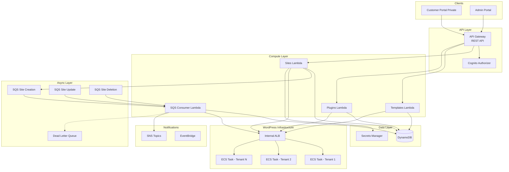
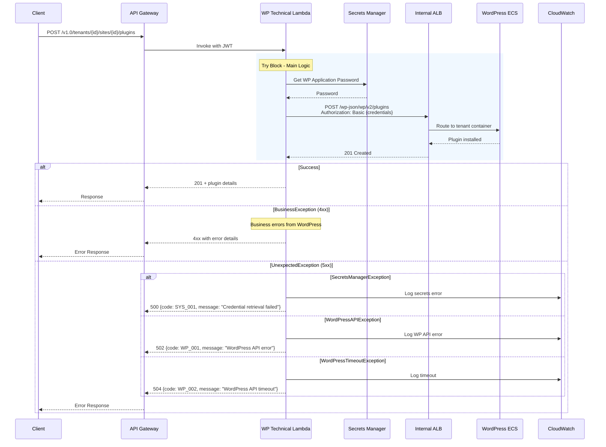
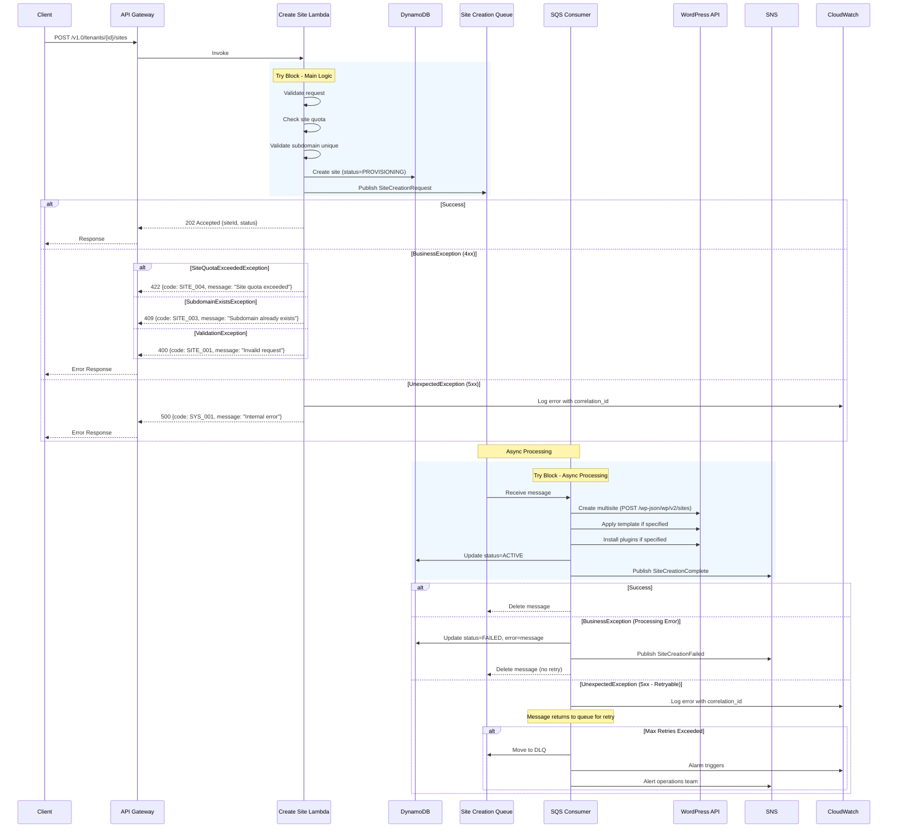
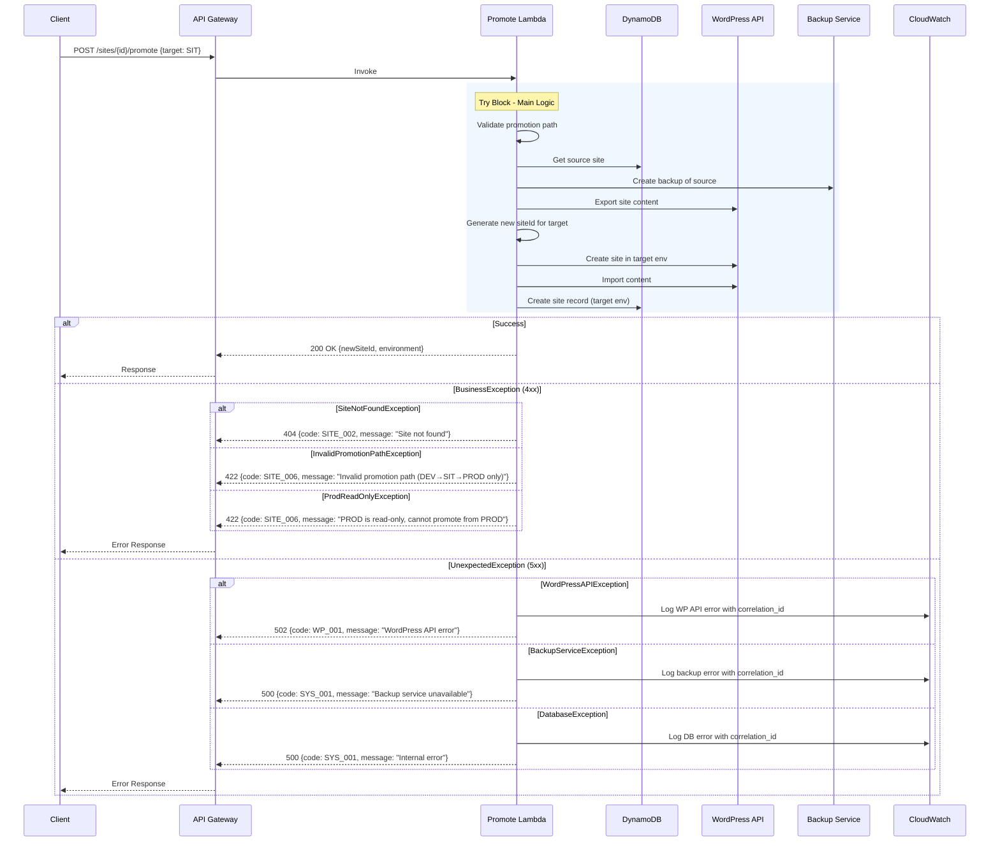
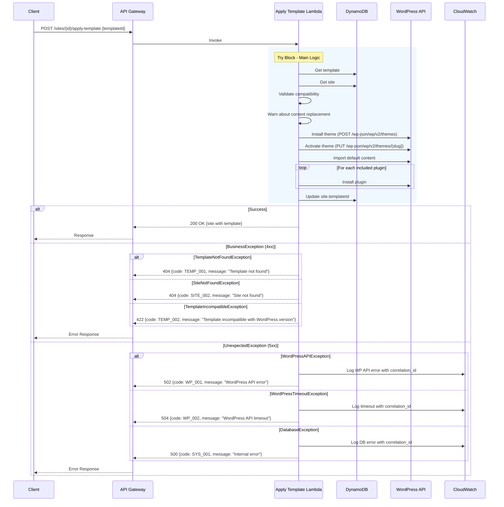
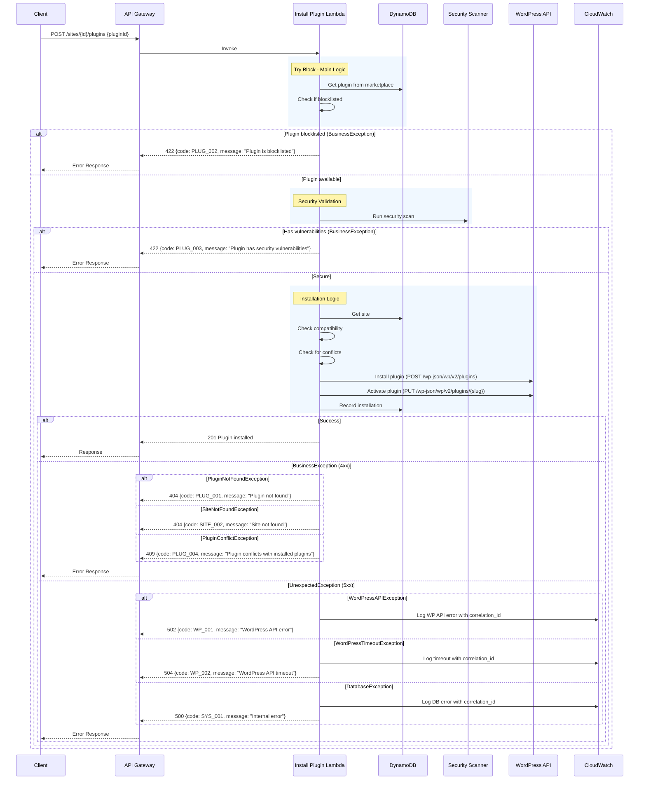
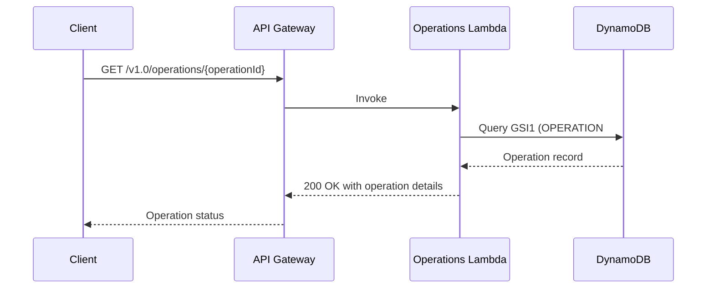

# WordPress Technical Management - Low-Level Design

**Version**: 1.1
**Created**: 2026-01-05
**Last Updated**: 2026-01-13
**Status**: Draft
**Component**: WordPress Site Management Service (2_bbws_wordpress_site_management_lambda)
**Parent HLD**: [HLD 2.6 WordPress Site Management](../HLDs/2.6_HLD_WordPress_Site_Management.md)
**Parent BRS**: [BRS 2.6 WordPress Site Management](../BRS/2.6_BRS_WordPress_Site_Management.md)

---

## Document Control

| Version | Date | Author | Changes |
|---------|------|--------|---------|
| 1.0 | 2026-01-05 | Agentic Architect | Initial version - Complete LLD for WordPress Technical Management |
| 1.1 | 2026-01-13 | Agentic Architect | Added UML class diagrams, exception handling patterns in sequence diagrams, updated repo name to 2_bbws_wordpress_site_management_lambda, DynamoDB table renamed to `sites` |

---

## Table of Contents

1. [Introduction](#1-introduction)
2. [High Level Epic Overview](#2-high-level-epic-overview)
3. [Architecture](#3-architecture)
4. [Sites API](#4-sites-api)
5. [Templates API](#5-templates-api)
6. [Plugins API](#6-plugins-api)
7. [SQS Operations](#7-sqs-operations)
8. [Data Model](#8-data-model)
9. [Lambda Functions](#9-lambda-functions)
10. [Security](#10-security)
11. [Monitoring & Alerting](#11-monitoring--alerting)
12. [Error Handling](#12-error-handling)
13. [NFRs](#13-nfrs)
14. [Risks and Mitigations](#14-risks-and-mitigations)
15. [Troubleshooting Playbook](#15-troubleshooting-playbook)
16. [Signoff](#16-signoff)
17. [Definition of Terms](#17-definition-of-terms)
18. [Appendices](#18-appendices)
19. [Related Repositories](#19-related-repositories)
20. [References](#20-references)

---

## 1. Introduction

### 1.1 Purpose

This Low-Level Design (LLD) document provides implementation-level details for the **WordPress Technical Management** microservice. This service provides the API layer that exposes WordPress functionality to consumer applications (Customer Portal Private, Admin Portal) and manages WordPress sites, templates, plugins, and asynchronous site operations.

### 1.2 Scope

This LLD covers **four distinct domains**:

| Domain | Description | User Stories |
|--------|-------------|--------------|
| **Sites API** | WordPress site CRUD operations, lifecycle management | 9 |
| **Templates API** | Template management and application | 5 |
| **Plugins API** | Plugin marketplace and per-site management | 6 |
| **SQS Operations** | Asynchronous site creation via event-driven architecture | 4 |
| **Total** | | **24** |

### 1.3 Key Differentiators

| API | Scope | Primary Consumer |
|-----|-------|------------------|
| **WordPress Technical Management (This LLD)** | Sites, Templates, Plugins, Async Creation | Customer Portal Private, Admin Portal |
| **Tenant Management (LLD 2.5)** | Organisation/Tenant management, User invitations | Customer Portal Private, Admin Portal |
| **WordPress Tenant Mgmt API (BRS 2.7)** | Infrastructure provisioning (ECS, RDS, EFS) | Internal agents, backend orchestration |

### 1.4 Component Overview

| Attribute | Value |
|-----------|-------|
| Repository | `2_bbws_wordpress_site_management_lambda` |
| Runtime | Python 3.12 |
| Memory | 256-512MB (varies by function) |
| Timeout | 10-120s (varies by function) |
| Architecture | arm64 |
| Framework | AWS Lambda Powertools |

### 1.5 Lambda Functions Summary

| Domain | Functions | Description |
|--------|-----------|-------------|
| Sites API | 11 | Site CRUD, clone, promote, health, backup |
| Templates API | 5 | Template CRUD, apply, preview |
| Plugins API | 6 | Marketplace, install, uninstall, configure |
| SQS Consumers | 3 | Site creation, update, deletion |

### 1.6 Dependencies

| Dependency | Purpose |
|------------|---------|
| AWS DynamoDB | Site, template, plugin metadata storage |
| AWS SQS | Async site operations |
| AWS SNS | Notifications for site events |
| AWS Cognito | User authentication, JWT validation |
| AWS API Gateway | REST API exposure |
| AWS Secrets Manager | WordPress application passwords |
| Internal ALB | WordPress REST API access |
| ECS Fargate | WordPress container hosting |

### 1.7 Container Architecture

**One ECS Task per Tenant** - Each Tenant (WordPress installation) runs in its own dedicated ECS Fargate task. Sites are managed within WordPress Multisite.

```
+------------------------------------------------------------+
|                      Customer A                             |
+------------------------------------------------------------+
        |                                    |
        v                                    v
+---------------------+            +---------------------+
|     Tenant 1        |            |     Tenant 2        |
|  (ECS Task 1)       |            |  (ECS Task 2)       |
|  WordPress Instance |            |  WordPress Instance |
|  +---------------+  |            |  +---------------+  |
|  | Site A        |  |            |  | Site D        |  |
|  | Site B        |  |            |  | Site E        |  |
|  | Site C        |  |            |  +---------------+  |
|  +---------------+  |            |  (Multisite)        |
|  (Multisite)        |            +---------------------+
+---------------------+
```

---

## 2. High Level Epic Overview

### 2.1 Sites API User Stories

| User Story # | Epic | User Story | Test Scenario(s) |
|--------------|------|------------|------------------|
| US-SITES-001 | Site Lifecycle | As a Tenant Admin, I want to create a WordPress site | Given valid data, then 202 Accepted, site PROVISIONING |
| US-SITES-002 | Site Lifecycle | As a Site Owner, I want to update site configuration | Given site is ACTIVE, then config updated |
| US-SITES-003 | Site Lifecycle | As a Customer, I want to view my site details | Given access, then full site details returned |
| US-SITES-004 | Site Lifecycle | As a Customer, I want to list all sites in my tenant | Given tenant access, then paginated list returned |
| US-SITES-005 | Site Lifecycle | As a Tenant Admin, I want to delete a site | Given admin role, then site soft-deleted with backup |
| US-SITES-006 | Site Lifecycle | As a Tenant Admin, I want to suspend/activate a site | Given site exists, then status toggled |
| US-SITES-007 | Site Lifecycle | As a Site Owner, I want to clone a site | Given quota available, then async clone initiated |
| US-SITES-008 | Site Lifecycle | As a Tenant Admin, I want to promote DEV→SIT→PROD | Given valid path, then site promoted |
| US-SITES-009 | Site Lifecycle | Site health endpoint | Given site, then health status returned |

### 2.2 Templates API User Stories

| User Story # | Epic | User Story | Test Scenario(s) |
|--------------|------|------------|------------------|
| US-TEMP-001 | Templates | As a Customer, I want to view available templates | Given auth, then PUBLISHED templates returned |
| US-TEMP-002 | Templates | As a Customer, I want to view template details | Given templateId, then full details returned |
| US-TEMP-003 | Templates | As a Site Owner, I want to apply a template | Given compatible template, then applied |
| US-TEMP-004 | Templates | As a Platform Admin, I want to create templates | Given admin, then template saved as DRAFT |
| US-TEMP-005 | Templates | As a Customer, I want to preview a template | Given templateId, then demo URL returned |

### 2.3 Plugins API User Stories

| User Story # | Epic | User Story | Test Scenario(s) |
|--------------|------|------------|------------------|
| US-PLUG-001 | Plugins | As a Customer, I want to view plugin marketplace | Given auth, then approved plugins returned |
| US-PLUG-002 | Plugins | As a Site Owner, I want to install a plugin | Given security check passes, then plugin installed |
| US-PLUG-003 | Plugins | As a Site Owner, I want to uninstall a plugin | Given plugin installed, then removed |
| US-PLUG-004 | Plugins | As a Site Owner, I want to configure plugin settings | Given plugin active, then config saved |
| US-PLUG-005 | Plugins | As a Site Owner, I want to update a plugin | Given update available, then plugin updated |
| US-PLUG-006 | Plugins | As a Site Owner, I want to enable/disable a plugin | Given plugin installed, then status toggled |

### 2.4 SQS Operations User Stories

| User Story # | Epic | User Story | Test Scenario(s) |
|--------------|------|------------|------------------|
| US-SQS-001 | Async | As a Customer, I want async site creation | Given valid request, then 202 + SQS message |
| US-SQS-002 | Async | As a Customer, I want to poll creation status | Given siteId, then current status returned |
| US-SQS-003 | Async | As a System, I want failed creations retried | Given failure, then retry with backoff |
| US-SQS-004 | Async | As a Customer, I want completion notification | Given complete, then email sent |

---

## 3. Architecture

### 3.1 System Context



### 3.2 WordPress REST API Integration



### 3.3 Internal ALB Security

The WordPress REST API is **NEVER exposed** to the public internet:

```
+---------------------------------------------------------------+
|                      Customer Portal                           |
|                   (Public - Internet Facing)                   |
+---------------------------------------------------------------+
                              |
                              | HTTPS (Public API Gateway)
                              v
+---------------------------------------------------------------+
|              WordPress Technical Management API                |
|                    (Lambda Functions)                          |
|                      [VPC Connected]                           |
+---------------------------------------------------------------+
                              |
                              | HTTPS (Private - VPC Only)
                              v
+---------------------------------------------------------------+
|                 Internal ALB (Private Subnets)                 |
|                   [Not Internet Accessible]                    |
+---------------------------------------------------------------+
                              |
            +-----------------+-----------------+
            |                 |                 |
            v                 v                 v
     +-----------+     +-----------+     +-----------+
     |  Tenant A |     |  Tenant B |     |  Tenant C |
     | WordPress |     | WordPress |     | WordPress |
     |   (ECS)   |     |   (ECS)   |     |   (ECS)   |
     | /wp-json/ |     | /wp-json/ |     | /wp-json/ |
     +-----------+     +-----------+     +-----------+
```

**Security Controls:**
- ALB is in private subnets (no internet gateway)
- Security groups allow only Lambda → ALB → ECS traffic
- WordPress `/wp-json/` endpoint not publicly accessible
- Application Passwords stored in Secrets Manager

### 3.4 Package Structure

```
2_bbws_wordpress_site_management_lambda/
├── src/
│   ├── handlers/
│   │   ├── sites/
│   │   │   ├── create_site_handler.py
│   │   │   ├── get_site_handler.py
│   │   │   ├── list_sites_handler.py
│   │   │   ├── update_site_handler.py
│   │   │   ├── delete_site_handler.py
│   │   │   ├── clone_site_handler.py
│   │   │   ├── promote_site_handler.py
│   │   │   ├── site_status_handler.py
│   │   │   └── site_health_handler.py
│   │   ├── templates/
│   │   │   ├── list_templates_handler.py
│   │   │   ├── get_template_handler.py
│   │   │   ├── apply_template_handler.py
│   │   │   └── preview_template_handler.py
│   │   ├── plugins/
│   │   │   ├── list_plugins_handler.py
│   │   │   ├── install_plugin_handler.py
│   │   │   ├── uninstall_plugin_handler.py
│   │   │   ├── configure_plugin_handler.py
│   │   │   ├── update_plugin_handler.py
│   │   │   └── plugin_status_handler.py
│   │   └── sqs/
│   │       ├── site_creation_consumer.py
│   │       ├── site_update_consumer.py
│   │       └── site_deletion_consumer.py
│   ├── services/
│   │   ├── site_service.py
│   │   ├── template_service.py
│   │   ├── plugin_service.py
│   │   ├── wordpress_client.py
│   │   └── notification_service.py
│   ├── dao/
│   │   ├── site_dao.py
│   │   ├── template_dao.py
│   │   └── plugin_dao.py
│   ├── models/
│   │   ├── site.py
│   │   ├── template.py
│   │   ├── plugin.py
│   │   ├── requests.py
│   │   └── responses.py
│   └── utils/
│       ├── wordpress_auth.py
│       └── response_builder.py
├── tests/
├── terraform/
└── requirements.txt
```

### 3.5 UML Class Diagram

```mermaid
classDiagram
    direction TB

    %% Handler Layer
    class CreateSiteHandler {
        <<Handler>>
        -site_service: SiteService
        -logger: Logger
        -tracer: Tracer
        +handle(event: dict, context: LambdaContext) APIResponse
    }

    class GetSiteHandler {
        <<Handler>>
        -site_service: SiteService
        +handle(event: dict, context: LambdaContext) APIResponse
    }

    class ListSitesHandler {
        <<Handler>>
        -site_service: SiteService
        +handle(event: dict, context: LambdaContext) APIResponse
    }

    class ApplyTemplateHandler {
        <<Handler>>
        -template_service: TemplateService
        +handle(event: dict, context: LambdaContext) APIResponse
    }

    class InstallPluginHandler {
        <<Handler>>
        -plugin_service: PluginService
        +handle(event: dict, context: LambdaContext) APIResponse
    }

    %% Service Layer
    class SiteService {
        <<Service>>
        -site_dao: SiteDAO
        -wp_client: WordPressClient
        -notification_service: NotificationService
        +create_site(tenant_id: str, request: CreateSiteRequest) Site
        +get_site(tenant_id: str, site_id: str) Site
        +list_sites(tenant_id: str, page_size: int, start_at: str) PaginatedResponse
        +update_site(tenant_id: str, site_id: str, request: UpdateSiteRequest) Site
        +delete_site(tenant_id: str, site_id: str) None
        +clone_site(tenant_id: str, site_id: str, request: CloneSiteRequest) Site
        +promote_site(tenant_id: str, site_id: str, target_env: str) Site
        +update_status(tenant_id: str, site_id: str, status: str) Site
        +get_health(tenant_id: str, site_id: str) HealthStatus
        -_validate_quota(tenant_id: str) None
        -_validate_subdomain(subdomain: str) None
    }

    class TemplateService {
        <<Service>>
        -template_dao: TemplateDAO
        -wp_client: WordPressClient
        +list_templates(category: str, page_size: int) PaginatedResponse
        +get_template(template_id: str) Template
        +apply_template(tenant_id: str, site_id: str, template_id: str) Site
        +preview_template(template_id: str) PreviewResponse
        +create_template(request: CreateTemplateRequest) Template
        +publish_template(template_id: str) Template
        -_validate_compatibility(site: Site, template: Template) None
        -_install_theme(wp_client: WordPressClient, theme_slug: str) None
        -_import_content(wp_client: WordPressClient, template: Template) None
    }

    class PluginService {
        <<Service>>
        -plugin_dao: PluginDAO
        -wp_client: WordPressClient
        -security_scanner: SecurityScanner
        +list_marketplace(category: str, page_size: int) PaginatedResponse
        +get_plugin(plugin_id: str) Plugin
        +list_installed(tenant_id: str, site_id: str) list~InstalledPlugin~
        +install_plugin(tenant_id: str, site_id: str, plugin_id: str) InstalledPlugin
        +uninstall_plugin(tenant_id: str, site_id: str, plugin_id: str) None
        +configure_plugin(tenant_id: str, site_id: str, plugin_id: str, config: dict) InstalledPlugin
        +update_plugin(tenant_id: str, site_id: str, plugin_id: str) InstalledPlugin
        +toggle_status(tenant_id: str, site_id: str, plugin_id: str, active: bool) InstalledPlugin
        -_check_blocklist(plugin_id: str) None
        -_scan_security(plugin: Plugin) SecurityResult
        -_check_conflicts(site_id: str, plugin: Plugin) list~Conflict~
    }

    class NotificationService {
        <<Service>>
        -sns_client: SNSClient
        +publish_site_created(site_id: str, tenant_id: str, site_url: str) None
        +publish_site_failed(site_id: str, tenant_id: str, error: str) None
        +publish_site_deleted(site_id: str, tenant_id: str) None
        +publish_operation_complete(operation_id: str, status: str) None
    }

    class WordPressClient {
        <<Client>>
        -tenant_id: str
        -alb_dns: str
        -username: str
        -password: str
        +__init__(tenant_id: str)
        +create_site(name: str, slug: str) dict
        +get_site(site_id: int) dict
        +update_site(site_id: int, data: dict) dict
        +delete_site(site_id: int) None
        +install_plugin(slug: str) dict
        +activate_plugin(plugin: str) dict
        +deactivate_plugin(plugin: str) dict
        +delete_plugin(plugin: str) None
        +install_theme(slug: str) dict
        +activate_theme(theme_slug: str) dict
        +get_settings() dict
        +update_settings(settings: dict) dict
        -_load_credentials() None
        -_get_auth_header() str
        -_request(method: str, path: str, **kwargs) dict
    }

    class SecurityScanner {
        <<Service>>
        +scan_plugin(plugin: Plugin) SecurityResult
        +check_vulnerabilities(plugin_slug: str, version: str) list~Vulnerability~
        +is_blocklisted(plugin_id: str) bool
    }

    %% DAO Layer
    class SiteDAO {
        <<Repository>>
        -table: DynamoDBTable
        +create(site: Site) Site
        +get(tenant_id: str, site_id: str) Site
        +list_by_tenant(tenant_id: str, page_size: int, start_at: str) PaginatedResponse
        +update(site: Site) Site
        +delete(tenant_id: str, site_id: str) None
        +update_status(tenant_id: str, site_id: str, status: str) Site
        +exists_by_subdomain(subdomain: str) bool
        +count_by_tenant(tenant_id: str) int
    }

    class TemplateDAO {
        <<Repository>>
        -table: DynamoDBTable
        +create(template: Template) Template
        +get(template_id: str) Template
        +list_published(category: str, page_size: int) PaginatedResponse
        +update(template: Template) Template
        +delete(template_id: str) None
        +update_usage_count(template_id: str) None
    }

    class PluginDAO {
        <<Repository>>
        -table: DynamoDBTable
        +get_marketplace_plugin(plugin_id: str) Plugin
        +list_marketplace(category: str, page_size: int) PaginatedResponse
        +get_installed(site_id: str, plugin_id: str) InstalledPlugin
        +list_installed(site_id: str) list~InstalledPlugin~
        +create_installed(installed: InstalledPlugin) InstalledPlugin
        +update_installed(installed: InstalledPlugin) InstalledPlugin
        +delete_installed(site_id: str, plugin_id: str) None
    }

    class OperationDAO {
        <<Repository>>
        -table: DynamoDBTable
        +create(operation: Operation) Operation
        +get(operation_id: str) Operation
        +list_by_tenant(tenant_id: str, status: str, page_size: int) PaginatedResponse
        +update_status(operation_id: str, status: str, message: str) Operation
        +complete(operation_id: str, status: str, error: str) Operation
    }

    %% Model Layer
    class Site {
        <<Entity>>
        +site_id: str
        +tenant_id: str
        +site_name: str
        +subdomain: str
        +status: SiteStatus
        +environment: Environment
        +template_id: str
        +wp_site_id: int
        +wordpress_version: str
        +php_version: str
        +health_status: HealthStatus
        +created_at: datetime
        +created_by: str
        +updated_at: datetime
    }

    class Template {
        <<Entity>>
        +template_id: str
        +name: str
        +description: str
        +category: TemplateCategory
        +version: str
        +thumbnail_url: str
        +demo_url: str
        +status: TemplateStatus
        +min_wordpress_version: str
        +included_plugins: list~str~
        +theme_slug: str
        +usage_count: int
        +rating: float
    }

    class Plugin {
        <<Entity>>
        +plugin_id: str
        +name: str
        +slug: str
        +description: str
        +category: PluginCategory
        +version: str
        +rating: float
        +install_count: int
        +pricing: str
        +is_blocklisted: bool
        +min_wordpress_version: str
        +vulnerabilities: list~Vulnerability~
    }

    class InstalledPlugin {
        <<Entity>>
        +plugin_id: str
        +site_id: str
        +installed_version: str
        +is_active: bool
        +configuration: dict
        +installed_at: datetime
        +installed_by: str
    }

    class Operation {
        <<Entity>>
        +operation_id: str
        +tenant_id: str
        +site_id: str
        +operation_type: OperationType
        +status: OperationStatus
        +resource_type: str
        +resource_id: str
        +started_at: datetime
        +completed_at: datetime
        +progress: int
        +message: str
        +error: str
    }

    %% Enumerations
    class SiteStatus {
        <<enumeration>>
        PROVISIONING
        ACTIVE
        SUSPENDED
        DEPROVISIONING
        DELETED
        FAILED
    }

    class Environment {
        <<enumeration>>
        DEV
        SIT
        PROD
    }

    class OperationType {
        <<enumeration>>
        SITE_CREATION
        SITE_UPDATE
        SITE_DELETION
        SITE_CLONE
        SITE_PROMOTION
        TEMPLATE_APPLICATION
        PLUGIN_INSTALLATION
    }

    class OperationStatus {
        <<enumeration>>
        PENDING
        IN_PROGRESS
        COMPLETED
        FAILED
        CANCELLED
    }

    %% Exception Classes
    class BusinessException {
        <<Exception>>
        +code: str
        +message: str
        +details: dict
        +http_status: int
    }

    class SiteNotFoundException {
        <<BusinessException>>
    }

    class SiteQuotaExceededException {
        <<BusinessException>>
    }

    class SubdomainExistsException {
        <<BusinessException>>
    }

    class TemplateNotFoundException {
        <<BusinessException>>
    }

    class TemplateIncompatibleException {
        <<BusinessException>>
    }

    class PluginNotFoundException {
        <<BusinessException>>
    }

    class PluginBlocklistedException {
        <<BusinessException>>
    }

    class PluginVulnerabilityException {
        <<BusinessException>>
    }

    class UnexpectedException {
        <<Exception>>
        +code: str
        +message: str
        +http_status: int
    }

    class WordPressAPIException {
        <<UnexpectedException>>
    }

    class DatabaseException {
        <<UnexpectedException>>
    }

    %% Relationships
    CreateSiteHandler --> SiteService
    GetSiteHandler --> SiteService
    ListSitesHandler --> SiteService
    ApplyTemplateHandler --> TemplateService
    InstallPluginHandler --> PluginService

    SiteService --> SiteDAO
    SiteService --> WordPressClient
    SiteService --> NotificationService
    SiteService --> OperationDAO

    TemplateService --> TemplateDAO
    TemplateService --> WordPressClient
    TemplateService --> SiteDAO

    PluginService --> PluginDAO
    PluginService --> WordPressClient
    PluginService --> SecurityScanner
    PluginService --> SiteDAO

    SiteDAO --> Site
    TemplateDAO --> Template
    PluginDAO --> Plugin
    PluginDAO --> InstalledPlugin
    OperationDAO --> Operation

    Site --> SiteStatus
    Site --> Environment
    Operation --> OperationType
    Operation --> OperationStatus

    SiteNotFoundException --|> BusinessException
    SiteQuotaExceededException --|> BusinessException
    SubdomainExistsException --|> BusinessException
    TemplateNotFoundException --|> BusinessException
    TemplateIncompatibleException --|> BusinessException
    PluginNotFoundException --|> BusinessException
    PluginBlocklistedException --|> BusinessException
    PluginVulnerabilityException --|> BusinessException

    WordPressAPIException --|> UnexpectedException
    DatabaseException --|> UnexpectedException
```



### 3.6 Class Specifications

#### 3.6.1 Service Layer Methods

**SiteService**

| Method | Parameters | Return Type | Description | Exceptions |
|--------|------------|-------------|-------------|------------|
| `create_site` | `tenant_id: str, request: CreateSiteRequest` | `Site` | Create new site, queue async provisioning | `SiteQuotaExceededException`, `SubdomainExistsException` |
| `get_site` | `tenant_id: str, site_id: str` | `Site` | Get site by ID | `SiteNotFoundException` |
| `list_sites` | `tenant_id: str, page_size: int, start_at: str` | `PaginatedResponse` | List tenant sites with pagination | - |
| `update_site` | `tenant_id: str, site_id: str, request: UpdateSiteRequest` | `Site` | Update site configuration | `SiteNotFoundException` |
| `delete_site` | `tenant_id: str, site_id: str` | `None` | Soft delete site | `SiteNotFoundException` |
| `clone_site` | `tenant_id: str, site_id: str, request: CloneSiteRequest` | `Site` | Clone site (async) | `SiteNotFoundException`, `SiteQuotaExceededException` |
| `promote_site` | `tenant_id: str, site_id: str, target_env: str` | `Site` | Promote to next environment | `SiteNotFoundException`, `InvalidPromotionPathException` |
| `update_status` | `tenant_id: str, site_id: str, status: str` | `Site` | Update site status | `SiteNotFoundException`, `InvalidStatusTransitionException` |
| `get_health` | `tenant_id: str, site_id: str` | `HealthStatus` | Get site health | `SiteNotFoundException` |

**TemplateService**

| Method | Parameters | Return Type | Description | Exceptions |
|--------|------------|-------------|-------------|------------|
| `list_templates` | `category: str, page_size: int` | `PaginatedResponse` | List published templates | - |
| `get_template` | `template_id: str` | `Template` | Get template details | `TemplateNotFoundException` |
| `apply_template` | `tenant_id: str, site_id: str, template_id: str` | `Site` | Apply template to site | `TemplateNotFoundException`, `TemplateIncompatibleException` |
| `preview_template` | `template_id: str` | `PreviewResponse` | Get preview URL | `TemplateNotFoundException` |
| `create_template` | `request: CreateTemplateRequest` | `Template` | Create template (admin) | - |
| `publish_template` | `template_id: str` | `Template` | Publish template | `TemplateNotFoundException` |

**PluginService**

| Method | Parameters | Return Type | Description | Exceptions |
|--------|------------|-------------|-------------|------------|
| `list_marketplace` | `category: str, page_size: int` | `PaginatedResponse` | List approved plugins | - |
| `get_plugin` | `plugin_id: str` | `Plugin` | Get plugin details | `PluginNotFoundException` |
| `list_installed` | `tenant_id: str, site_id: str` | `list[InstalledPlugin]` | List site's installed plugins | - |
| `install_plugin` | `tenant_id: str, site_id: str, plugin_id: str` | `InstalledPlugin` | Install plugin | `PluginNotFoundException`, `PluginBlocklistedException`, `PluginVulnerabilityException` |
| `uninstall_plugin` | `tenant_id: str, site_id: str, plugin_id: str` | `None` | Uninstall plugin | `PluginNotFoundException` |
| `configure_plugin` | `tenant_id: str, site_id: str, plugin_id: str, config: dict` | `InstalledPlugin` | Configure plugin | `PluginNotFoundException` |
| `update_plugin` | `tenant_id: str, site_id: str, plugin_id: str` | `InstalledPlugin` | Update plugin version | `PluginNotFoundException` |
| `toggle_status` | `tenant_id: str, site_id: str, plugin_id: str, active: bool` | `InstalledPlugin` | Enable/disable plugin | `PluginNotFoundException` |

#### 3.6.2 DAO Layer Methods

**SiteDAO**

| Method | Parameters | Return Type | Description |
|--------|------------|-------------|-------------|
| `create` | `site: Site` | `Site` | Create site record |
| `get` | `tenant_id: str, site_id: str` | `Site` | Get site by PK/SK |
| `list_by_tenant` | `tenant_id: str, page_size: int, start_at: str` | `PaginatedResponse` | Query by tenant |
| `update` | `site: Site` | `Site` | Update site record |
| `delete` | `tenant_id: str, site_id: str` | `None` | Delete site record |
| `update_status` | `tenant_id: str, site_id: str, status: str` | `Site` | Update status field |
| `exists_by_subdomain` | `subdomain: str` | `bool` | Check subdomain uniqueness via GSI4 |
| `count_by_tenant` | `tenant_id: str` | `int` | Count sites for quota check |

**TemplateDAO**

| Method | Parameters | Return Type | Description |
|--------|------------|-------------|-------------|
| `create` | `template: Template` | `Template` | Create template record |
| `get` | `template_id: str` | `Template` | Get template by ID |
| `list_published` | `category: str, page_size: int` | `PaginatedResponse` | List published templates |
| `update` | `template: Template` | `Template` | Update template record |
| `delete` | `template_id: str` | `None` | Delete template record |
| `update_usage_count` | `template_id: str` | `None` | Increment usage counter |

**PluginDAO**

| Method | Parameters | Return Type | Description |
|--------|------------|-------------|-------------|
| `get_marketplace_plugin` | `plugin_id: str` | `Plugin` | Get marketplace plugin |
| `list_marketplace` | `category: str, page_size: int` | `PaginatedResponse` | List marketplace plugins |
| `get_installed` | `site_id: str, plugin_id: str` | `InstalledPlugin` | Get installed plugin |
| `list_installed` | `site_id: str` | `list[InstalledPlugin]` | List site's plugins |
| `create_installed` | `installed: InstalledPlugin` | `InstalledPlugin` | Record installation |
| `update_installed` | `installed: InstalledPlugin` | `InstalledPlugin` | Update installation |
| `delete_installed` | `site_id: str, plugin_id: str` | `None` | Remove installation record |

---

## 4. Sites API

### 4.1 Endpoint Specifications

| Method | Path | Description | Auth Roles |
|--------|------|-------------|------------|
| POST | `/v1.0/tenants/{tenantId}/sites` | Create site (async) | Admin, User |
| GET | `/v1.0/tenants/{tenantId}/sites` | List sites | Admin, User, Viewer |
| GET | `/v1.0/tenants/{tenantId}/sites/{siteId}` | Get site | Admin, User, Viewer |
| PUT | `/v1.0/tenants/{tenantId}/sites/{siteId}` | Update site | Admin, Owner |
| DELETE | `/v1.0/tenants/{tenantId}/sites/{siteId}` | Delete site | Admin |
| PUT | `/v1.0/tenants/{tenantId}/sites/{siteId}/status` | Suspend/activate | Admin, Owner |
| POST | `/v1.0/tenants/{tenantId}/sites/{siteId}/clone` | Clone site (async) | Admin, User |
| POST | `/v1.0/tenants/{tenantId}/sites/{siteId}/promote` | Promote environment | Admin |
| GET | `/v1.0/tenants/{tenantId}/sites/{siteId}/health` | Get health | Admin, User, Viewer |
| POST | `/v1.0/tenants/{tenantId}/sites/{siteId}/backup` | Create backup | Admin |
| POST | `/v1.0/tenants/{tenantId}/sites/{siteId}/restore` | Restore backup | Admin |

### 4.2 Site Status Lifecycle

```
                     +------------------+
                     |   PROVISIONING   |
                     | (Initial State)  |
                     +--------+---------+
                              |
              success         |         failure
                   +----------+----------+
                   |                     |
                   v                     v
          +------------------+   +------------------+
          |     ACTIVE       |   |     FAILED       |
          +--------+---------+   +------------------+
                   |
       +-----------+-----------+
       |                       |
   suspend                  delete
       |                       |
       v                       v
+------------------+   +------------------+
|    SUSPENDED     |   | DEPROVISIONING   |
+--------+---------+   +--------+---------+
       |                       |
   activate                    |
       |                       v
       +-------->      +------------------+
                       |    DELETED       |
                       | (Terminal State) |
                       +------------------+
```

### 4.3 Create Site Flow



### 4.4 WordPress REST API Calls

| Operation | WordPress Endpoint | Method |
|-----------|-------------------|--------|
| Create Site | `/wp-json/wp/v2/sites` | POST |
| Get Site | `/wp-json/wp/v2/sites/{id}` | GET |
| Update Site | `/wp-json/wp/v2/sites/{id}` | PUT |
| Delete Site | `/wp-json/wp/v2/sites/{id}` | DELETE |
| Get Site Options | `/wp-json/wp/v2/settings` | GET |
| Update Site Options | `/wp-json/wp/v2/settings` | PUT |

### 4.5 Create Site Request/Response

**Request:**
```json
{
  "siteName": "My Business Site",
  "subdomain": "mybusiness",
  "environment": "DEV",
  "templateId": "template-uuid",
  "plugins": ["pluginId1", "pluginId2"],
  "configuration": {
    "wordpressVersion": "6.5",
    "phpVersion": "8.2"
  }
}
```

**Response (202 Accepted):**
```json
{
  "siteId": "site-550e8400-e29b-41d4-a716-446655440000",
  "tenantId": "tenant-123",
  "siteName": "My Business Site",
  "subdomain": "mybusiness",
  "status": "PROVISIONING",
  "environment": "DEV",
  "createdAt": "2026-01-05T10:30:00Z",
  "message": "Site creation initiated. Check status at /sites/{siteId}",
  "_links": {
    "self": {"href": "/v1.0/tenants/tenant-123/sites/site-550e8400"},
    "status": {"href": "/v1.0/tenants/tenant-123/sites/site-550e8400"}
  }
}
```

### 4.6 Environment Promotion

**Promotion Rules:**
- DEV → SIT only
- SIT → PROD only
- PROD cannot be promoted (read-only per global standards)



---

## 5. Templates API

### 5.1 Endpoint Specifications

| Method | Path | Description | Auth Roles |
|--------|------|-------------|------------|
| GET | `/v1.0/templates` | List templates | All authenticated |
| GET | `/v1.0/templates/{templateId}` | Get template details | All authenticated |
| GET | `/v1.0/templates/{templateId}/preview` | Get preview URL | All authenticated |
| POST | `/v1.0/tenants/{tenantId}/sites/{siteId}/apply-template` | Apply template | Admin, Owner |
| POST | `/admin/templates` | Create template | Platform Admin |
| PUT | `/admin/templates/{templateId}` | Update template | Platform Admin |
| DELETE | `/admin/templates/{templateId}` | Delete template | Platform Admin |
| POST | `/admin/templates/{templateId}/publish` | Publish template | Platform Admin |

### 5.2 Template Status Lifecycle

```
DRAFT → PUBLISHED → ARCHIVED
         ↑
         | (can be re-published)
         +------+
```

### 5.3 Apply Template Flow



### 5.4 Template Data

**List Templates Response:**
```json
{
  "items": [
    {
      "templateId": "template-123",
      "name": "Business Pro",
      "description": "Professional business template",
      "category": "BUSINESS",
      "thumbnailUrl": "https://cdn.bbws.io/templates/business-pro.jpg",
      "rating": 4.5,
      "usageCount": 1250,
      "version": "2.1.0",
      "status": "PUBLISHED"
    }
  ],
  "count": 1,
  "nextToken": null
}
```

---

## 6. Plugins API

### 6.1 Endpoint Specifications

| Method | Path | Description | Auth Roles |
|--------|------|-------------|------------|
| GET | `/v1.0/plugins` | List marketplace | All authenticated |
| GET | `/v1.0/plugins/{pluginId}` | Get plugin details | All authenticated |
| GET | `/v1.0/tenants/{tenantId}/sites/{siteId}/plugins` | List installed | Admin, User, Viewer |
| POST | `/v1.0/tenants/{tenantId}/sites/{siteId}/plugins` | Install plugin | Admin, User |
| DELETE | `/v1.0/tenants/{tenantId}/sites/{siteId}/plugins/{pluginId}` | Uninstall | Admin, Owner |
| PUT | `/v1.0/tenants/{tenantId}/sites/{siteId}/plugins/{pluginId}/config` | Configure | Admin, Owner |
| PUT | `/v1.0/tenants/{tenantId}/sites/{siteId}/plugins/{pluginId}/update` | Update | Admin, Owner |
| PUT | `/v1.0/tenants/{tenantId}/sites/{siteId}/plugins/{pluginId}/status` | Enable/disable | Admin, Owner |

### 6.2 Plugin Installation Flow



### 6.3 Plugin Security Scanning

| Check | Description | Action on Failure |
|-------|-------------|-------------------|
| Blocklist Check | Plugin in BBWS blocklist | Reject installation |
| Vulnerability Scan | Known CVEs | Reject installation |
| Compatibility Check | WordPress version | Reject with warning |
| Conflict Detection | Conflicts with installed plugins | Warn user |

### 6.4 WordPress Plugin API Calls

| Operation | WordPress Endpoint | Method |
|-----------|-------------------|--------|
| List Plugins | `/wp-json/wp/v2/plugins` | GET |
| Install Plugin | `/wp-json/wp/v2/plugins` | POST |
| Activate Plugin | `/wp-json/wp/v2/plugins/{plugin}` | PUT |
| Deactivate Plugin | `/wp-json/wp/v2/plugins/{plugin}` | PUT |
| Delete Plugin | `/wp-json/wp/v2/plugins/{plugin}` | DELETE |

---

## 7. SQS Operations

### 7.1 Queue Architecture

```mermaid
graph TB
    subgraph "API Layer"
        SitesAPI[Sites API Lambda]
    end

    subgraph "Queues"
        CreateQ[Site Creation Queue<br/>bbws-wp-site-creation-{env}]
        UpdateQ[Site Update Queue<br/>bbws-wp-site-update-{env}]
        DeleteQ[Site Deletion Queue<br/>bbws-wp-site-deletion-{env}]
        DLQ[Dead Letter Queue<br/>bbws-wp-site-operations-dlq-{env}]
    end

    subgraph "Consumers"
        CreateConsumer[Site Creator Lambda]
        UpdateConsumer[Site Updater Lambda]
        DeleteConsumer[Site Deleter Lambda]
    end

    subgraph "Notifications"
        SNS[SNS Topic]
        CWAlarm[CloudWatch Alarm]
    end

    SitesAPI --> CreateQ
    SitesAPI --> UpdateQ
    SitesAPI --> DeleteQ

    CreateQ --> CreateConsumer
    UpdateQ --> UpdateConsumer
    DeleteQ --> DeleteConsumer

    CreateConsumer -.->|After 3 failures| DLQ
    UpdateConsumer -.->|After 3 failures| DLQ
    DeleteConsumer -.->|After 3 failures| DLQ

    CreateConsumer --> SNS
    DLQ --> CWAlarm
    CWAlarm --> SNS
```

### 7.2 Queue Configuration

| Queue | Visibility Timeout | Retention | Max Receives |
|-------|-------------------|-----------|--------------|
| Site Creation | 900s (15 min) | 4 days | 3 |
| Site Update | 600s (10 min) | 4 days | 3 |
| Site Deletion | 600s (10 min) | 4 days | 3 |
| DLQ | N/A | 14 days | N/A |

### 7.3 SQS Message Schemas

**SiteCreationRequest:**
```json
{
  "messageType": "SITE_CREATION_REQUEST",
  "correlationId": "corr-uuid",
  "timestamp": "2026-01-05T10:30:00Z",
  "idempotencyKey": "idem-uuid",
  "payload": {
    "siteId": "site-uuid",
    "tenantId": "tenant-uuid",
    "siteName": "My Business Site",
    "subdomain": "mybusiness",
    "templateId": "template-uuid",
    "environment": "DEV",
    "configuration": {
      "wordpressVersion": "6.5",
      "phpVersion": "8.2",
      "plugins": ["pluginId1"]
    }
  }
}
```

**SiteCreationComplete (SNS):**
```json
{
  "eventType": "SITE_CREATION_COMPLETE",
  "correlationId": "corr-uuid",
  "timestamp": "2026-01-05T10:35:00Z",
  "payload": {
    "siteId": "site-uuid",
    "tenantId": "tenant-uuid",
    "status": "ACTIVE",
    "siteUrl": "https://mybusiness.wpdev.bbws.io",
    "provisioningDuration": 300
  }
}
```

### 7.4 SQS Consumer Implementation

```python
from aws_lambda_powertools import Logger, Tracer, Metrics
from aws_lambda_powertools.utilities.batch import BatchProcessor, EventType
from aws_lambda_powertools.utilities.typing import LambdaContext

logger = Logger()
tracer = Tracer()
metrics = Metrics()
processor = BatchProcessor(event_type=EventType.SQS)

@tracer.capture_method
def process_site_creation(record: dict):
    """Process a single site creation message."""
    message = json.loads(record["body"])
    payload = message["payload"]
    correlation_id = message["correlationId"]

    logger.append_keys(correlation_id=correlation_id, site_id=payload["siteId"])
    logger.info("Processing site creation")

    try:
        # 1. Get WordPress credentials
        wp_client = WordPressClient(tenant_id=payload["tenantId"])

        # 2. Create multisite
        wp_site = wp_client.create_site(
            name=payload["siteName"],
            slug=payload["subdomain"]
        )

        # 3. Apply template if specified
        if payload.get("templateId"):
            template_service.apply_template(
                wp_client=wp_client,
                site_id=wp_site["id"],
                template_id=payload["templateId"]
            )

        # 4. Install plugins
        for plugin_id in payload.get("configuration", {}).get("plugins", []):
            plugin_service.install_plugin(
                wp_client=wp_client,
                site_id=wp_site["id"],
                plugin_id=plugin_id
            )

        # 5. Update DynamoDB status
        site_dao.update_status(
            site_id=payload["siteId"],
            status="ACTIVE",
            wp_site_id=wp_site["id"]
        )

        # 6. Publish completion event
        notification_service.publish_site_created(
            site_id=payload["siteId"],
            tenant_id=payload["tenantId"],
            site_url=f"https://{payload['subdomain']}.wpdev.bbws.io"
        )

        metrics.add_metric(name="SiteCreated", unit="Count", value=1)
        logger.info("Site creation completed successfully")

    except Exception as e:
        metrics.add_metric(name="SiteCreationFailed", unit="Count", value=1)
        logger.exception("Site creation failed")
        raise  # Let SQS handle retry

@logger.inject_lambda_context
@tracer.capture_lambda_handler
@metrics.log_metrics
def handler(event: dict, context: LambdaContext):
    batch = event["Records"]
    with processor(records=batch, handler=process_site_creation):
        processor.process()
    return processor.response()
```

### 7.5 Retry and DLQ Handling

| Attempt | Delay | Action |
|---------|-------|--------|
| 1 | Immediate | Process message |
| 2 | ~1 min (visibility timeout) | Retry |
| 3 | ~2 min (visibility timeout) | Retry |
| 4 | N/A | Move to DLQ |

**DLQ Processing:**
1. CloudWatch Alarm triggers on DLQ message
2. SNS notification sent to operations team
3. Site status set to FAILED in DynamoDB
4. Manual intervention required

---

## 7A. Operations API (Async Tracking)

### 7A.1 Endpoint Specifications

| Method | Path | Description | Auth Roles |
|--------|------|-------------|------------|
| GET | `/v1.0/operations/{operationId}` | Get operation status | Admin, User, Viewer |
| GET | `/v1.0/tenants/{tenantId}/operations` | List tenant operations (paginated) | Admin, User, Viewer |

### 7A.2 Get Operation Flow



### 7A.3 Get Operation Response

```json
{
  "operationId": "op-uuid-456",
  "tenantId": "tenant-123",
  "siteId": "site-789",
  "operationType": "SITE_CREATION",
  "status": "IN_PROGRESS",
  "resourceType": "SITE",
  "resourceId": "site-789",
  "startedAt": "2026-01-06T10:00:00Z",
  "completedAt": null,
  "progress": 45,
  "message": "Installing plugins...",
  "_links": {
    "self": { "href": "/v1.0/operations/op-uuid-456" },
    "resource": { "href": "/v1.0/tenants/tenant-123/sites/site-789" }
  }
}
```

### 7A.4 List Operations Response

```json
{
  "items": [
    {
      "operationId": "op-uuid-456",
      "operationType": "SITE_CREATION",
      "status": "IN_PROGRESS",
      "resourceType": "SITE",
      "resourceId": "site-789",
      "startedAt": "2026-01-06T10:00:00Z"
    }
  ],
  "count": 1,
  "moreAvailable": false,
  "_links": {
    "self": { "href": "/v1.0/tenants/tenant-123/operations" }
  }
}
```

### 7A.5 Operation Status Values

| Status | Description |
|--------|-------------|
| `PENDING` | Operation queued, not yet started |
| `IN_PROGRESS` | Operation executing |
| `COMPLETED` | Operation finished successfully |
| `FAILED` | Operation failed (check error field) |
| `CANCELLED` | Operation was cancelled |

---

## 8. Data Model

### 8.1 DynamoDB Tables

**Table Name**: `sites`
**Capacity Mode**: On-Demand

> **Note**: The table name `sites` is consistent across all environments (DEV, SIT, PROD). Environment isolation is achieved through separate AWS accounts, not table name suffixes.

### 8.2 Item Patterns

| Entity | PK | SK | Purpose |
|--------|----|----|---------|
| Site | `TENANT#{tenantId}` | `SITE#{siteId}` | Site metadata |
| Template | `TEMPLATE` | `TEMPLATE#{templateId}` | Template catalog |
| Plugin (Marketplace) | `PLUGIN` | `PLUGIN#{pluginId}` | Plugin catalog |
| Installed Plugin | `SITE#{siteId}` | `PLUGIN#{pluginId}` | Site's plugins |
| Site Backup | `SITE#{siteId}` | `BACKUP#{backupId}` | Backup records |
| Operation | `TENANT#{tenantId}` | `OP#{operationId}` | Async operation tracking |

### 8.3 Site Schema

```json
{
  "PK": "TENANT#tenant-123",
  "SK": "SITE#site-456",
  "siteId": "site-456",
  "tenantId": "tenant-123",
  "siteName": "My Business Site",
  "subdomain": "mybusiness",
  "status": "ACTIVE",
  "environment": "DEV",
  "templateId": "template-789",
  "wpSiteId": 2,
  "wordpressVersion": "6.5",
  "phpVersion": "8.2",
  "healthStatus": "HEALTHY",
  "createdAt": "2026-01-05T10:30:00Z",
  "createdBy": "user@example.com",
  "updatedAt": "2026-01-05T14:30:00Z",
  "GSI1PK": "STATUS#ACTIVE",
  "GSI1SK": "2026-01-05T14:30:00Z#site-456",
  "GSI2PK": "SUBDOMAIN#mybusiness",
  "GSI2SK": "SITE#site-456"
}
```

### 8.4 Template Schema

```json
{
  "PK": "TEMPLATE",
  "SK": "TEMPLATE#template-789",
  "templateId": "template-789",
  "name": "Business Pro",
  "description": "Professional business template",
  "category": "BUSINESS",
  "version": "2.1.0",
  "thumbnailUrl": "https://cdn.bbws.io/templates/business-pro.jpg",
  "demoUrl": "https://demo.bbws.io/business-pro",
  "status": "PUBLISHED",
  "minWordPressVersion": "6.0",
  "includedPlugins": ["plugin-1", "plugin-2"],
  "themeSlug": "business-pro",
  "usageCount": 1250,
  "rating": 4.5,
  "createdAt": "2025-06-15T10:00:00Z"
}
```

### 8.5 Plugin Schema

**Marketplace Plugin:**
```json
{
  "PK": "PLUGIN",
  "SK": "PLUGIN#plugin-123",
  "pluginId": "plugin-123",
  "name": "SEO Master",
  "slug": "seo-master",
  "description": "Advanced SEO optimization",
  "category": "SEO",
  "version": "3.2.1",
  "rating": 4.8,
  "installCount": 5000,
  "pricing": "FREE",
  "isBlocklisted": false,
  "minWordPressVersion": "5.8",
  "lastSecurityScan": "2026-01-04T00:00:00Z",
  "vulnerabilities": []
}
```

**Installed Plugin:**
```json
{
  "PK": "SITE#site-456",
  "SK": "PLUGIN#plugin-123",
  "pluginId": "plugin-123",
  "siteId": "site-456",
  "installedVersion": "3.2.1",
  "isActive": true,
  "configuration": {
    "enableSitemap": true,
    "robotsTxt": "custom"
  },
  "installedAt": "2026-01-05T11:00:00Z",
  "installedBy": "user@example.com"
}
```

### 8.6 Operation Schema

```json
{
  "PK": "TENANT#tenant-123",
  "SK": "OP#op-uuid-456",
  "operationId": "op-uuid-456",
  "tenantId": "tenant-123",
  "siteId": "site-789",
  "operationType": "SITE_CREATION",
  "status": "IN_PROGRESS",
  "resourceType": "SITE",
  "resourceId": "site-789",
  "startedAt": "2026-01-06T10:00:00Z",
  "completedAt": null,
  "error": null,
  "createdBy": "user@example.com",
  "GSI1PK": "OPERATION#op-uuid-456",
  "GSI2PK": "TENANT#tenant-123#STATUS",
  "GSI2SK": "IN_PROGRESS#2026-01-06T10:00:00Z"
}
```

### 8.7 GSI Design

| Index | PK | SK | Purpose |
|-------|----|----|---------|
| GSI1 | `OPERATION#{operationId}` | - | Get operation by ID (direct lookup) |
| GSI2 | `TENANT#{tenantId}#STATUS` | `{status}#{createdAt}` | List operations by status |
| GSI3 | `STATUS#{status}` | `{updatedAt}#{siteId}` | Filter sites by status |
| GSI4 | `SUBDOMAIN#{subdomain}` | `SITE#{siteId}` | Subdomain uniqueness check |
| GSI5 | `ENV#{environment}` | `{createdAt}#{siteId}` | Filter by environment |

---

## 9. Lambda Functions

### 9.1 Function Inventory

| Function | Handler | Memory | Timeout | Trigger |
|----------|---------|--------|---------|---------|
| bbws-wp-site-create-{env} | sites.create_site_handler | 256MB | 30s | API Gateway |
| bbws-wp-site-get-{env} | sites.get_site_handler | 128MB | 10s | API Gateway |
| bbws-wp-site-list-{env} | sites.list_sites_handler | 256MB | 15s | API Gateway |
| bbws-wp-site-update-{env} | sites.update_site_handler | 256MB | 30s | API Gateway |
| bbws-wp-site-delete-{env} | sites.delete_site_handler | 256MB | 30s | API Gateway |
| bbws-wp-site-clone-{env} | sites.clone_site_handler | 256MB | 30s | API Gateway |
| bbws-wp-site-promote-{env} | sites.promote_site_handler | 256MB | 60s | API Gateway |
| bbws-wp-template-list-{env} | templates.list_templates_handler | 128MB | 10s | API Gateway |
| bbws-wp-template-apply-{env} | templates.apply_template_handler | 256MB | 60s | API Gateway |
| bbws-wp-plugin-list-{env} | plugins.list_plugins_handler | 128MB | 10s | API Gateway |
| bbws-wp-plugin-install-{env} | plugins.install_plugin_handler | 256MB | 60s | API Gateway |
| bbws-wp-site-creator-{env} | sqs.site_creation_consumer | 512MB | 900s | SQS |
| bbws-wp-site-updater-{env} | sqs.site_update_consumer | 512MB | 600s | SQS |
| bbws-wp-site-deleter-{env} | sqs.site_deletion_consumer | 512MB | 600s | SQS |

### 9.2 Environment Variables

| Variable | Description | Example |
|----------|-------------|---------|
| ENVIRONMENT | Current environment | `dev`, `sit`, `prod` |
| SITES_TABLE | DynamoDB table name | `sites` |
| SITE_CREATION_QUEUE | SQS queue URL | `https://sqs...` |
| SNS_TOPIC_ARN | Notifications topic | `arn:aws:sns:...` |
| ALB_DNS_NAME | Internal ALB DNS | `internal-alb.vpc.local` |
| SECRETS_PREFIX | Secrets Manager prefix | `bbws/wp/` |
| LOG_LEVEL | Logging level | `INFO` |

### 9.3 WordPress Client Implementation

```python
import boto3
import requests
from base64 import b64encode
from aws_lambda_powertools import Logger

logger = Logger()

class WordPressClient:
    """Client for WordPress REST API via internal ALB."""

    def __init__(self, tenant_id: str):
        self.tenant_id = tenant_id
        self.alb_dns = os.environ["ALB_DNS_NAME"]
        self._load_credentials()

    def _load_credentials(self):
        """Load WordPress application password from Secrets Manager."""
        secrets_client = boto3.client("secretsmanager")
        secret_name = f"{os.environ['SECRETS_PREFIX']}{self.tenant_id}/wp-app-password"
        response = secrets_client.get_secret_value(SecretId=secret_name)
        secret = json.loads(response["SecretString"])
        self.username = secret["username"]
        self.password = secret["password"]

    def _get_auth_header(self) -> str:
        """Generate Basic Auth header."""
        credentials = f"{self.username}:{self.password}"
        encoded = b64encode(credentials.encode()).decode()
        return f"Basic {encoded}"

    def _request(self, method: str, path: str, **kwargs) -> dict:
        """Make request to WordPress REST API."""
        url = f"https://{self.alb_dns}/wp-json{path}"
        headers = {
            "Authorization": self._get_auth_header(),
            "Content-Type": "application/json",
            "X-Tenant-Id": self.tenant_id
        }

        response = requests.request(
            method=method,
            url=url,
            headers=headers,
            timeout=30,
            **kwargs
        )
        response.raise_for_status()
        return response.json()

    def create_site(self, name: str, slug: str) -> dict:
        """Create a new WordPress multisite site."""
        return self._request("POST", "/wp/v2/sites", json={
            "name": name,
            "slug": slug
        })

    def get_site(self, site_id: int) -> dict:
        """Get WordPress site details."""
        return self._request("GET", f"/wp/v2/sites/{site_id}")

    def install_plugin(self, slug: str) -> dict:
        """Install a WordPress plugin."""
        return self._request("POST", "/wp/v2/plugins", json={
            "slug": slug,
            "status": "active"
        })

    def activate_theme(self, theme_slug: str) -> dict:
        """Activate a WordPress theme."""
        return self._request("PUT", f"/wp/v2/themes/{theme_slug}", json={
            "status": "active"
        })
```

---

## 10. Security

### 10.1 Authentication

**Customer Authentication** (via Cognito):

| Setting | Value |
|---------|-------|
| User Pool | `bbws-customer-portal-{env}` |
| Token Type | JWT (ID Token) |
| Required Claims | `sub`, `email`, `cognito:groups`, `custom:tenantIds` |

**WordPress Authentication** (Application Passwords):

| Aspect | Implementation |
|--------|----------------|
| Method | HTTP Basic Auth |
| Credentials | Stored in Secrets Manager |
| Per-Tenant | Each WordPress instance has unique credentials |
| Rotation | Automatic rotation via Lambda |

### 10.2 Authorization

**Role-Based Access Control:**

| Role | Sites | Templates | Plugins |
|------|-------|-----------|---------|
| CUSTOMER_SUPER_ADMIN | Full CRUD | Read + Apply | Full |
| CUSTOMER_ADMIN | Full CRUD | Read + Apply | Full |
| CUSTOMER_USER | Create/Read/Update | Read + Apply | Read/Install |
| CUSTOMER_VIEWER | Read | Read | Read |
| super-admin (Staff) | Full Cross-Tenant | Full CRUD | Full |

### 10.3 Resource Authorization

```python
def authorize_site_access(user: User, site: Site, action: str) -> bool:
    """Check if user can perform action on site."""
    # Platform admin has full access
    if "super-admin" in user.groups:
        return True

    # User must have access to tenant
    if site.tenant_id not in user.tenant_ids:
        return False

    # Check role-based permissions
    if action == "read":
        return True  # All authenticated users can read

    if action in ["update", "delete"]:
        return user.role in ["CUSTOMER_SUPER_ADMIN", "CUSTOMER_ADMIN"] or \
               site.owner_id == user.user_id

    if action == "create":
        return user.role in ["CUSTOMER_SUPER_ADMIN", "CUSTOMER_ADMIN", "CUSTOMER_USER"]

    return False
```

### 10.4 IAM Policies

**Lambda Execution Role:**

```json
{
  "Version": "2012-10-17",
  "Statement": [
    {
      "Sid": "DynamoDBAccess",
      "Effect": "Allow",
      "Action": [
        "dynamodb:GetItem",
        "dynamodb:PutItem",
        "dynamodb:UpdateItem",
        "dynamodb:DeleteItem",
        "dynamodb:Query",
        "dynamodb:Scan"
      ],
      "Resource": [
        "arn:aws:dynamodb:${region}:${account}:table/sites",
        "arn:aws:dynamodb:${region}:${account}:table/sites/index/*"
      ]
    },
    {
      "Sid": "SQSAccess",
      "Effect": "Allow",
      "Action": [
        "sqs:SendMessage",
        "sqs:ReceiveMessage",
        "sqs:DeleteMessage",
        "sqs:GetQueueAttributes"
      ],
      "Resource": "arn:aws:sqs:${region}:${account}:bbws-wp-site-*-${env}"
    },
    {
      "Sid": "SecretsAccess",
      "Effect": "Allow",
      "Action": [
        "secretsmanager:GetSecretValue"
      ],
      "Resource": "arn:aws:secretsmanager:${region}:${account}:secret:bbws/wp/*"
    },
    {
      "Sid": "SNSAccess",
      "Effect": "Allow",
      "Action": [
        "sns:Publish"
      ],
      "Resource": "arn:aws:sns:${region}:${account}:bbws-wp-*-${env}"
    },
    {
      "Sid": "VPCAccess",
      "Effect": "Allow",
      "Action": [
        "ec2:CreateNetworkInterface",
        "ec2:DescribeNetworkInterfaces",
        "ec2:DeleteNetworkInterface"
      ],
      "Resource": "*"
    }
  ]
}
```

### 10.5 Network Security

| Layer | Security Control |
|-------|------------------|
| API Gateway | WAF, Rate Limiting, API Keys |
| Lambda | VPC, Security Groups |
| ALB | Private subnets only, Security Groups |
| ECS | Private subnets, Security Groups |
| DynamoDB | VPC Endpoints, Encryption at rest |

---

## 11. Monitoring & Alerting

### 11.1 CloudWatch Metrics

**Custom Metrics** (Namespace: `BBWS/WPTechnical`):

| Metric | Unit | Dimensions | Description |
|--------|------|------------|-------------|
| SiteCreated | Count | Environment | Site creation count |
| SiteDeleted | Count | Environment | Site deletion count |
| SiteCreationDuration | Seconds | Environment | Async creation time |
| SiteCreationFailed | Count | Environment | Failed creations |
| TemplateApplied | Count | Environment, TemplateId | Template applications |
| PluginInstalled | Count | Environment, PluginId | Plugin installations |
| PluginSecurityBlocked | Count | Environment | Blocked due to security |
| WordPressAPILatency | Milliseconds | Environment, Operation | WP API response time |
| DLQMessages | Count | Environment | Messages in DLQ |

### 11.2 CloudWatch Alarms

| Alarm | Metric | Threshold | Period | Actions |
|-------|--------|-----------|--------|---------|
| HighSiteCreationFailures | SiteCreationFailed | > 5 | 15 min | SNS Alert |
| SiteCreationTimeout | SiteCreationDuration | > 600s | 5 min | SNS Alert |
| DLQMessagesPresent | DLQMessages | > 0 | 1 min | SNS Alert |
| HighWordPressLatency | WordPressAPILatency | > 5000ms | 5 min | SNS Alert |
| LambdaErrors | Errors | > 10 | 5 min | SNS Alert |
| HighThrottling | Throttles | > 5 | 5 min | SNS Alert |

### 11.3 Dashboard

```json
{
  "widgets": [
    {
      "type": "metric",
      "properties": {
        "title": "Site Operations",
        "metrics": [
          ["BBWS/WPTechnical", "SiteCreated"],
          [".", "SiteDeleted"],
          [".", "SiteCreationFailed"]
        ]
      }
    },
    {
      "type": "metric",
      "properties": {
        "title": "Site Creation Duration",
        "metrics": [
          ["BBWS/WPTechnical", "SiteCreationDuration", {"stat": "p99"}],
          [".", ".", {"stat": "Average"}]
        ]
      }
    },
    {
      "type": "metric",
      "properties": {
        "title": "WordPress API Latency",
        "metrics": [
          ["BBWS/WPTechnical", "WordPressAPILatency", {"stat": "p99"}]
        ]
      }
    },
    {
      "type": "metric",
      "properties": {
        "title": "DLQ Messages",
        "metrics": [
          ["BBWS/WPTechnical", "DLQMessages"]
        ]
      }
    }
  ]
}
```

### 11.4 Logging

**Log Structure:**

```json
{
  "timestamp": "2026-01-05T10:30:00.123Z",
  "level": "INFO",
  "service": "wp-technical",
  "function": "bbws-wp-site-create",
  "requestId": "req-abc123",
  "correlationId": "corr-xyz789",
  "tenantId": "tenant-123",
  "siteId": "site-456",
  "action": "CREATE_SITE",
  "status": "SUCCESS",
  "duration": 1234,
  "message": "Site created successfully"
}
```

---

## 12. Error Handling

### 12.1 Error Codes

| Code | HTTP | Description | Retry |
|------|------|-------------|-------|
| SITE_001 | 400 | Invalid request | No |
| SITE_002 | 404 | Site not found | No |
| SITE_003 | 409 | Subdomain already exists | No |
| SITE_004 | 422 | Site quota exceeded | No |
| SITE_005 | 422 | Invalid status transition | No |
| SITE_006 | 422 | Invalid promotion path | No |
| TEMP_001 | 404 | Template not found | No |
| TEMP_002 | 422 | Template incompatible | No |
| PLUG_001 | 404 | Plugin not found | No |
| PLUG_002 | 422 | Plugin blocklisted | No |
| PLUG_003 | 422 | Plugin has vulnerabilities | No |
| PLUG_004 | 409 | Plugin conflicts | No |
| WP_001 | 502 | WordPress API error | Yes |
| WP_002 | 504 | WordPress API timeout | Yes |
| SYS_001 | 500 | Internal error | Yes |

### 12.2 Error Response Format

```json
{
  "error": {
    "code": "SITE_004",
    "message": "Site limit reached for your plan",
    "details": {
      "currentSites": 5,
      "maxSites": 5,
      "tier": "BASIC"
    },
    "suggestion": "Upgrade to Standard tier for up to 20 sites"
  },
  "requestId": "req-abc123",
  "timestamp": "2026-01-05T10:30:00Z"
}
```

### 12.3 Retry Configuration

| Operation | Max Retries | Backoff |
|-----------|-------------|---------|
| WordPress API | 3 | Exponential (100ms base) |
| DynamoDB | 3 | Exponential (built-in) |
| Secrets Manager | 2 | Exponential (100ms base) |
| SQS Message | 3 | Visibility timeout (1min, 2min, 4min) |

---

## 13. NFRs

### 13.1 Performance

| Metric | Target |
|--------|--------|
| API Response Time (sync) | < 500ms (p95) |
| Site Creation Time (async) | < 15 minutes |
| Template Application Time | < 60 seconds |
| Plugin Installation Time | < 30 seconds |
| WordPress API Latency | < 2 seconds (p95) |
| Lambda Cold Start | < 3 seconds |

### 13.2 Scalability

| Aspect | Target |
|--------|--------|
| Concurrent Site Creations | 10 simultaneous |
| Sites per Tenant | Unlimited (tier-based) |
| Templates in Catalog | 100+ |
| Plugins in Marketplace | 500+ |
| SQS Throughput | Unlimited (standard queues) |

### 13.3 Availability

| Metric | Target |
|--------|--------|
| API Availability | 99.9% |
| SQS Availability | 99.999% (AWS SLA) |
| RTO | 4 hours |
| RPO | 1 hour |

---

## 14. Risks and Mitigations

| ID | Risk | Probability | Impact | Mitigation |
|----|------|-------------|--------|------------|
| R1 | WordPress API unavailable | Medium | High | Circuit breaker, health checks |
| R2 | Site creation takes > 15 min | Medium | Medium | Optimize steps, parallel operations |
| R3 | Subdomain collision | Low | Medium | Atomic check-and-create with GSI |
| R4 | Plugin security vulnerability | Medium | High | Automated scanning, blocklist |
| R5 | SQS message loss | Low | High | DLQ, idempotency keys |
| R6 | ALB routing to wrong tenant | Low | High | X-Tenant-Id header validation |

---

## 15. Troubleshooting Playbook

### 15.1 Site Creation Stuck in PROVISIONING

**Symptoms:** Site status remains PROVISIONING for > 15 minutes

**Diagnosis:**
```sql
-- Check SQS message status
fields @timestamp, @message
| filter siteId = "site-xxx"
| sort @timestamp desc
```

**Resolution:**
1. Check SQS message in flight
2. Check DLQ for failed message
3. Verify WordPress API connectivity
4. Manually retry if transient failure

### 15.2 WordPress API Connection Failures

**Symptoms:** 502/504 errors from WordPress API calls

**Diagnosis:**
1. Check ALB health checks
2. Verify ECS task is running
3. Check security group rules

**Resolution:**
1. Restart ECS task if unhealthy
2. Verify Lambda VPC configuration
3. Check Secrets Manager credentials

### 15.3 Plugin Installation Fails

**Symptoms:** Plugin install returns 422

**Diagnosis:**
1. Check security scan results
2. Verify plugin compatibility
3. Check for conflicts

**Resolution:**
1. If security issue: Plugin cannot be installed
2. If compatibility: Update WordPress version
3. If conflict: Remove conflicting plugin first

---

## 16. Signoff

| Role | Name | Signature | Date |
|------|------|-----------|------|
| Technical Lead | | | |
| Security Engineer | | | |
| QA Lead | | | |
| DevOps Lead | | | |

---

## 17. Definition of Terms

| Term | Definition |
|------|------------|
| Tenant | A WordPress installation running in a dedicated ECS task |
| Site | A WordPress Multisite site within a tenant |
| Template | Pre-configured WordPress theme with default content |
| Plugin | WordPress plugin available in the BBWS marketplace |
| Environment | DEV, SIT, or PROD deployment stage |
| Subdomain | Unique identifier for site URL (e.g., mybusiness.wpdev.bbws.io) |
| ALB | Application Load Balancer |
| Multisite | WordPress feature allowing multiple sites in one installation |
| Application Password | WordPress authentication method for REST API |

---

## 18. Appendices

### Appendix A: OpenAPI Specification

See separate file: `openapi/wp-technical-management-api.yaml`

### Appendix B: Terraform Modules

See separate file: `terraform/README.md`

### Appendix C: SQS Message Examples

See Section 7.3 for complete message schemas.

---

## 19. Related Repositories

| Repository | Purpose | Description |
|------------|---------|-------------|
| `2_bbws_wordpress_site_management_lambda` | This Component | Lambda functions for Sites, Templates, Plugins APIs |
| `2_bbws_ecs_terraform` | Infrastructure as Code | Terraform scripts for ECS, ALB, EFS, and VPC |
| `2_bbws_tenant_provisioner` | Tenant Management CLI | CLI tool for provisioning tenant infrastructure |
| `2_bbws_wordpress_container` | WordPress Docker Image | Custom WordPress container with platform integrations |
| `2_bbws_ecs_tests` | Integration Tests | Automated tests for WordPress site management APIs |
| `2_bbws_ecs_operations` | Operations | Dashboards, alerts, and runbooks |

---

## 20. References

| Document | Location |
|----------|----------|
| BRS 2.6 WordPress Technical Management | ../BRS/2.6_BRS_WordPress_Technical_Management.md |
| HLD 2.1 Customer Portal Public | ../HLDs/2.1_BBWS_Customer_Portal_Public_HLD_V1.1.md |
| LLD 2.5 Tenant Management | ./2.5_LLD_Tenant_Management.md |
| BRS 2.7 WordPress Tenant Management API | ../BRS/2.7_BRS_WordPress_Tenant_Management_API.md |
| WordPress REST API Documentation | https://developer.wordpress.org/rest-api/ |
| AWS Lambda Powertools | https://docs.powertools.aws.dev/lambda/python/ |

---

**End of Document**
