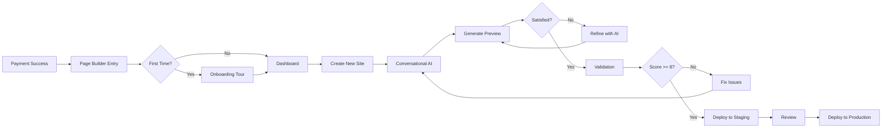
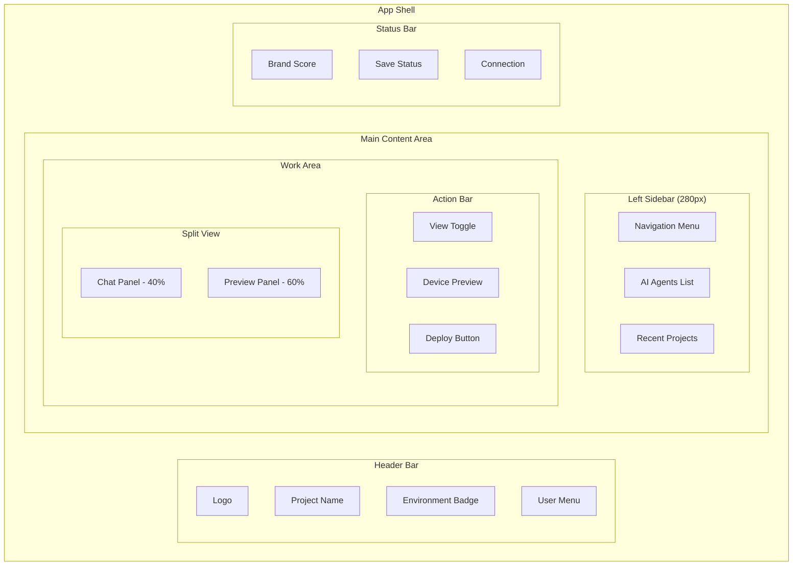
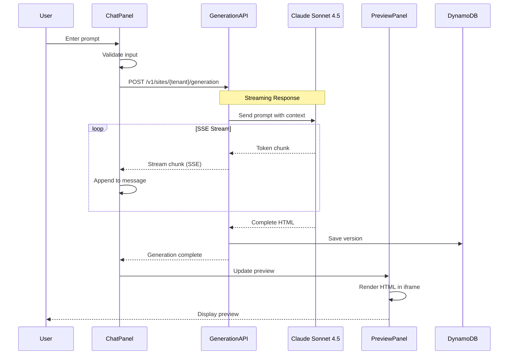
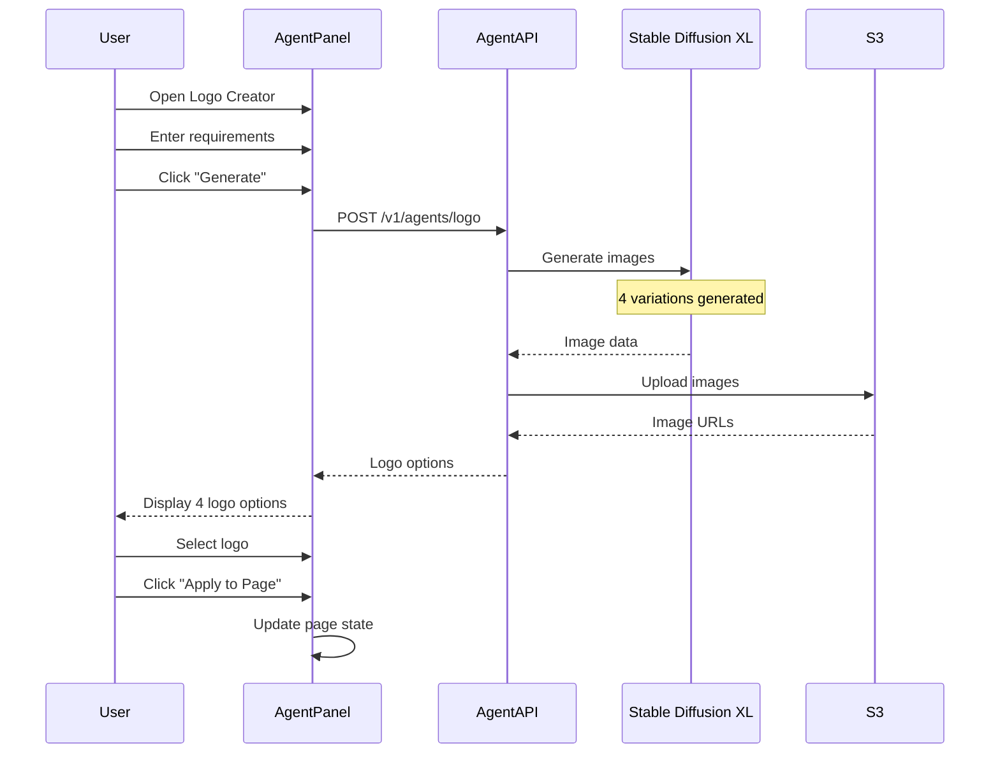
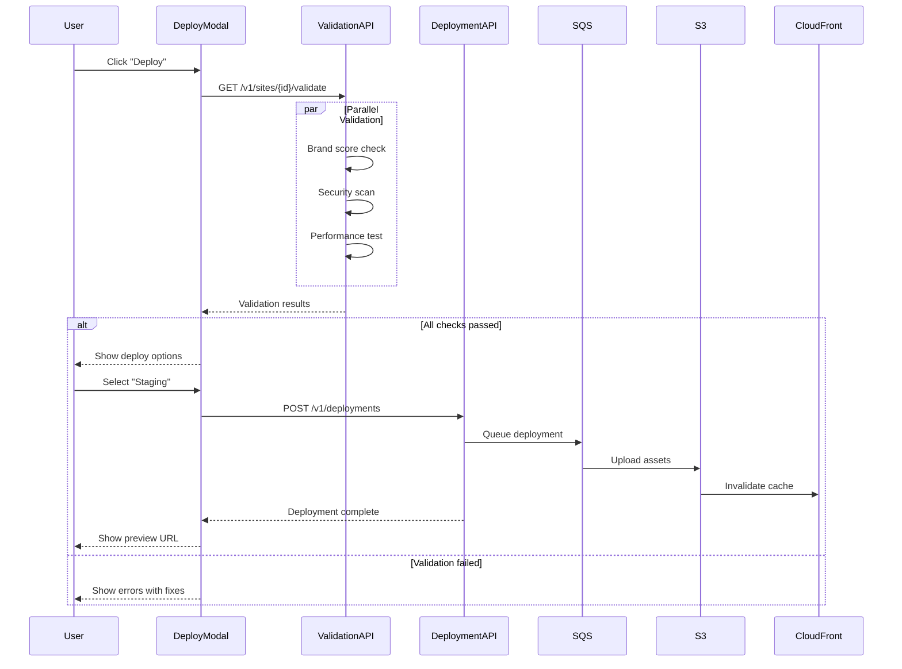

# Site Builder Frontend Architecture - Low-Level Design

**Version**: 1.1
**Created**: 2026-01-15
**Updated**: 2026-01-16
**Status**: Draft
**Component**: Site Builder UI (3_site_builder)
**Parent HLD**: [BBWS AI-Powered Site Builder HLD](../HLDs/BBSW_Site_Builder_HLD_v3.md)
**Parent BRS**: [BBWS AI-Powered Site Builder BRS](../BRS/BBWS_Site_Builder_BRS_v1.md)

---

## Document Control

| Version | Date | Author | Changes |
|---------|------|--------|---------|
| 1.0 | 2026-01-15 | Agentic Architect | Initial version |
| 1.1 | 2026-01-16 | Claude Opus 4.5 | Added Epic 6 (Site Designer: US-022, US-023, US-024) and Epic 9 (White-Label & Marketplace: US-025 to US-028), Partner Portal screens (5.6-5.10), Partner data models, Partner API endpoints |

---

## Table of Contents

1. [Introduction](#1-introduction)
2. [Technology Stack & Libraries](#2-technology-stack--libraries)
3. [User Journey](#3-user-journey)
4. [UI Component Diagram](#4-ui-component-diagram)
5. [Screens](#5-screens)
6. [Screen Rules](#6-screen-rules)
7. [Sequence Diagrams](#7-sequence-diagrams)
8. [Dependency APIs](#8-dependency-apis)
9. [High Level Epic Overview](#9-high-level-epic-overview)
10. [Data Models](#10-data-models)
11. [AI Agent Integration](#11-ai-agent-integration)
12. [State Management](#12-state-management)
13. [NFRs](#13-nfrs)
14. [Security](#14-security)
15. [References](#15-references)

---

## 1. Introduction

### 1.1 Purpose

This LLD provides implementation-level details for the Site Builder Frontend application, a React Single Page Application (SPA) that enables non-technical users to generate landing pages through conversational AI interaction.

### 1.2 Component Overview

| Attribute | Value |
|-----------|-------|
| Repository | `3_site_builder` |
| Technology | React 18, TypeScript, Vite |
| State Management | React Context + useReducer |
| Styling | Tailwind CSS |
| API Client | Native Fetch API with React Query |
| Testing | Vitest, React Testing Library |
| Real-time | Server-Sent Events (SSE) for streaming |

### 1.3 Entry Point

Users access the Site Builder after completing payment on the `/buy` checkout flow:

```
/buy (Pricing) → /buy/checkout → PayFast → /buy/payment/success → /page_builder
```

---

## 2. Technology Stack & Libraries

### 2.1 Production Dependencies

| Library | Version | Purpose |
|---------|---------|---------|
| react | ^18.3.1 | Core UI framework |
| react-dom | ^18.3.1 | React DOM rendering |
| react-router-dom | ^7.x | Client-side routing |
| @tanstack/react-query | ^5.x | Server state management, caching |
| tailwindcss | ^3.4.x | Utility-first CSS framework |
| lucide-react | ^0.x | Icon library |
| framer-motion | ^11.x | Animations |
| react-markdown | ^9.x | Markdown rendering for AI responses |
| highlight.js | ^11.x | Code syntax highlighting |

### 2.2 Development Dependencies

| Library | Version | Purpose |
|---------|---------|---------|
| vite | ^5.4.x | Build tool and dev server |
| typescript | ^5.x | Type safety |
| vitest | ^4.x | Unit testing framework |
| @testing-library/react | ^16.x | React component testing |
| eslint | ^9.x | Code linting |
| prettier | ^3.x | Code formatting |

### 2.3 Node.js Requirements

| Requirement | Minimum Version |
|-------------|-----------------|
| Node.js | >= 20.0.0 |
| npm | >= 10.0.0 |

---

## 3. User Journey

### 3.1 Primary User Flow



### 3.2 User Personas

| Persona | Primary Actions | Key Needs |
|---------|-----------------|-----------|
| Marketing Manager | Generate landing pages quickly | Speed, simplicity, brand consistency |
| Content Strategist | Refine content, ensure brand voice | Templates, tone control, version history |
| Designer | Visual customization | Theme control, layout options, preview |
| Brand Manager | Approve deployments | Brand scoring, validation reports |

---

## 4. UI Component Diagram

### 4.1 Application Shell



### 4.2 Component Hierarchy

```
src/
├── App.tsx
├── components/
│   ├── layout/
│   │   ├── AppShell.tsx
│   │   ├── Header.tsx
│   │   ├── Sidebar.tsx
│   │   ├── StatusBar.tsx
│   │   └── SplitPane.tsx
│   ├── chat/
│   │   ├── ChatPanel.tsx
│   │   ├── ChatMessage.tsx
│   │   ├── ChatInput.tsx
│   │   ├── StreamingMessage.tsx
│   │   └── SuggestionChips.tsx
│   ├── preview/
│   │   ├── PreviewPanel.tsx
│   │   ├── PreviewFrame.tsx
│   │   ├── DeviceSelector.tsx
│   │   └── PreviewToolbar.tsx
│   ├── agents/
│   │   ├── AgentCard.tsx
│   │   ├── AgentPanel.tsx
│   │   ├── LogoCreator.tsx
│   │   ├── ThemeSelector.tsx
│   │   ├── LayoutEditor.tsx
│   │   └── BackgroundGenerator.tsx
│   ├── validation/
│   │   ├── BrandScoreCard.tsx
│   │   ├── ValidationReport.tsx
│   │   └── SecurityScanResult.tsx
│   ├── deployment/
│   │   ├── DeploymentModal.tsx
│   │   ├── EnvironmentSelector.tsx
│   │   └── DeploymentHistory.tsx
│   ├── common/
│   │   ├── Button.tsx
│   │   ├── Input.tsx
│   │   ├── Modal.tsx
│   │   ├── Card.tsx
│   │   ├── Badge.tsx
│   │   ├── Spinner.tsx
│   │   └── Toast.tsx
│   └── onboarding/
│       ├── OnboardingTour.tsx
│       ├── TourStep.tsx
│       └── WelcomeModal.tsx
├── pages/
│   ├── DashboardPage.tsx
│   ├── BuilderPage.tsx
│   ├── SettingsPage.tsx
│   ├── TemplatesPage.tsx
│   └── HistoryPage.tsx
├── hooks/
│   ├── useChat.ts
│   ├── usePreview.ts
│   ├── useAgents.ts
│   ├── useDeployment.ts
│   └── useBrandScore.ts
├── services/
│   ├── siteApi.ts
│   ├── generationApi.ts
│   ├── agentApi.ts
│   ├── deploymentApi.ts
│   └── validationApi.ts
├── context/
│   ├── AuthContext.tsx
│   ├── ProjectContext.tsx
│   └── ThemeContext.tsx
├── types/
│   └── index.ts
└── utils/
    ├── markdown.ts
    └── validation.ts
```

---

## 5. Screens

### 5.1 Dashboard Screen

**Route**: `/page_builder`

**Purpose**: Central hub showing recent projects, quick actions, and AI agent access.

```
┌────────────────────────────────────────────────────────────────────────┐
│  [Logo] Site Builder                    DEV │ [?] [Settings] [Avatar] │
├────────────────────────────────────────────────────────────────────────┤
│                                                                        │
│  Welcome back, Tebogo!                                                 │
│                                                                        │
│  ┌─────────────────────────────────────────────────────────────────┐  │
│  │  [+] Create New Landing Page                                     │  │
│  │      Start with AI or choose a template                         │  │
│  └─────────────────────────────────────────────────────────────────┘  │
│                                                                        │
│  Recent Projects                                        [View All →]   │
│  ┌──────────────┐ ┌──────────────┐ ┌──────────────┐                   │
│  │ [Preview]    │ │ [Preview]    │ │ [Preview]    │                   │
│  │ Summer Sale  │ │ Product Launch│ │ Newsletter   │                   │
│  │ Draft • 2h   │ │ Live • 1d    │ │ Draft • 3d   │                   │
│  │ Score: 8.5   │ │ Score: 9.2   │ │ Score: 7.8   │                   │
│  └──────────────┘ └──────────────┘ └──────────────┘                   │
│                                                                        │
│  AI Design Agents                                                      │
│  ┌──────┐ ┌──────┐ ┌──────┐ ┌──────┐ ┌──────┐ ┌──────┐ ┌──────┐     │
│  │ Logo │ │ BG   │ │Theme │ │Layout│ │ Blog │ │News- │ │Outline│     │
│  │      │ │ Image│ │      │ │      │ │      │ │letter│ │      │     │
│  └──────┘ └──────┘ └──────┘ └──────┘ └──────┘ └──────┘ └──────┘     │
│                                                                        │
│  Templates                                              [Browse All →] │
│  ┌──────────────┐ ┌──────────────┐ ┌──────────────┐                   │
│  │ SaaS Landing │ │ E-commerce   │ │ Event Page   │                   │
│  └──────────────┘ └──────────────┘ └──────────────┘                   │
│                                                                        │
├────────────────────────────────────────────────────────────────────────┤
│  Brand Score: 8.5/10  │  Auto-saved  │  ● Connected                   │
└────────────────────────────────────────────────────────────────────────┘
```

---

### 5.2 Builder Screen (Main Workspace)

**Route**: `/page_builder/project/:projectId`

**Purpose**: Primary workspace for AI-driven page generation with split-view interface.

```
┌────────────────────────────────────────────────────────────────────────┐
│  [Logo] Site Builder    Summer Sale Campaign    DEV │ [Deploy ▼] [☰]  │
├────────┬───────────────────────────────────────────────────────────────┤
│        │  [Chat] [Agents] [History]          [Desktop] [Tablet] [Mobile]│
│  Nav   ├───────────────────────────────┬───────────────────────────────┤
│        │                               │                               │
│ □ Dash │  AI Assistant                 │  Live Preview                 │
│ □ Build│  ─────────────────────────── │  ┌─────────────────────────┐ │
│ □ Templ│                               │  │                         │ │
│ □ Hist │  🤖 Hi! I'll help you create  │  │    [Hero Section]       │ │
│        │     your landing page.        │  │                         │ │
│ ─────  │     What would you like       │  │    Your Summer Sale     │ │
│ Agents │     to build today?           │  │    Headline Here        │ │
│ ─────  │                               │  │                         │ │
│ ◉ Logo │  💡 Suggestions:              │  │    [CTA Button]         │ │
│ ◉ BG   │  • Product launch page        │  │                         │ │
│ ◉ Theme│  • Summer sale campaign       │  │  ─────────────────────  │ │
│ ◉ Layout│  • Newsletter signup         │  │                         │ │
│ ◉ Blog │                               │  │    [Features Grid]      │ │
│ ◉ News │  ─────────────────────────── │  │                         │ │
│        │                               │  │    □ □ □                │ │
│ ─────  │  👤 Create a summer sale      │  │                         │ │
│ Recent │     landing page with hero,   │  │  ─────────────────────  │ │
│ ─────  │     3 product highlights,     │  │                         │ │
│ • Proj1│     and newsletter signup     │  │    [Newsletter Form]    │ │
│ • Proj2│                               │  │                         │ │
│        │  🤖 Great! I'll create that   │  │    [Footer]             │ │
│        │     for you. Generating...    │  │                         │ │
│        │     ████████░░ 80%            │  └─────────────────────────┘ │
│        │                               │                               │
│        ├───────────────────────────────┴───────────────────────────────┤
│        │  [Type your message or describe what you want...]      [Send] │
├────────┴───────────────────────────────────────────────────────────────┤
│  Brand: 8.5/10 [▲0.3]  │  Saving...  │  ● Connected │ v3 of 5        │
└────────────────────────────────────────────────────────────────────────┘
```

---

### 5.3 Agent Panel (Modal/Slide-over)

**Trigger**: Click on any AI Agent in sidebar

**Purpose**: Dedicated interface for specific design agents.

```
┌─────────────────────────────────────────────────────────────┐
│  Logo Creator Agent                                    [×]  │
├─────────────────────────────────────────────────────────────┤
│                                                             │
│  Describe your logo requirements:                           │
│  ┌─────────────────────────────────────────────────────┐   │
│  │ Modern tech company logo with abstract geometric    │   │
│  │ shapes, using brand colors blue and white           │   │
│  └─────────────────────────────────────────────────────┘   │
│                                                             │
│  Style:  [Modern ▼]   Colors: [Brand ▼]   Shape: [Any ▼]   │
│                                                             │
│  [Generate Logos]                                           │
│                                                             │
│  ─────────────────────────────────────────────────────────  │
│                                                             │
│  Generated Options (4)                                      │
│  ┌─────────┐ ┌─────────┐ ┌─────────┐ ┌─────────┐          │
│  │  [L1]   │ │  [L2]   │ │  [L3]   │ │  [L4]   │          │
│  │         │ │         │ │         │ │         │          │
│  │ ○ Select│ │ ● Select│ │ ○ Select│ │ ○ Select│          │
│  └─────────┘ └─────────┘ └─────────┘ └─────────┘          │
│                                                             │
│  [Regenerate]                          [Apply to Page]      │
│                                                             │
└─────────────────────────────────────────────────────────────┘
```

---

### 5.4 Deployment Screen (Modal)

**Trigger**: Click Deploy button

**Purpose**: Multi-environment deployment workflow.

```
┌─────────────────────────────────────────────────────────────┐
│  Deploy "Summer Sale Campaign"                         [×]  │
├─────────────────────────────────────────────────────────────┤
│                                                             │
│  Pre-deployment Validation                                  │
│  ─────────────────────────────────────────────────────────  │
│  ✅ Brand Score: 8.5/10 (Minimum: 8.0)                      │
│  ✅ Security Scan: Passed                                   │
│  ✅ Performance: Load time 1.2s (Max: 3s)                   │
│  ✅ Accessibility: WCAG 2.1 AA Compliant                    │
│                                                             │
│  Select Environment                                         │
│  ─────────────────────────────────────────────────────────  │
│  ┌──────────────────┐ ┌──────────────────┐                 │
│  │   ○ Staging      │ │   ○ Production   │                 │
│  │   Preview & Test │ │   Go Live        │                 │
│  │   [Recommended]  │ │   Requires 8.0+  │                 │
│  └──────────────────┘ └──────────────────┘                 │
│                                                             │
│  Custom Domain (Optional)                                   │
│  ┌─────────────────────────────────────────────────────┐   │
│  │ summer-sale.mybrand.com                             │   │
│  └─────────────────────────────────────────────────────┘   │
│                                                             │
│  ─────────────────────────────────────────────────────────  │
│                                                             │
│  [Cancel]                              [Deploy to Staging]  │
│                                                             │
└─────────────────────────────────────────────────────────────┘
```

---

### 5.5 Version History Screen

**Route**: `/page_builder/project/:projectId/history`

**Purpose**: View and restore previous versions.

```
┌────────────────────────────────────────────────────────────────────────┐
│  Version History - Summer Sale Campaign                          [×]   │
├────────────────────────────────────────────────────────────────────────┤
│                                                                        │
│  Current Version: v5                                                   │
│                                                                        │
│  ┌─────────┬─────────────────────────────────┬─────────┬───────────┐  │
│  │ Version │ Changes                          │ Time    │ Actions   │  │
│  ├─────────┼─────────────────────────────────┼─────────┼───────────┤  │
│  │ v5 ●    │ Updated hero headline           │ 2m ago  │ [Current] │  │
│  │ v4      │ Changed color theme to Ocean    │ 15m ago │ [Restore] │  │
│  │ v3      │ Added testimonials section      │ 1h ago  │ [Restore] │  │
│  │ v2      │ Regenerated product grid        │ 2h ago  │ [Restore] │  │
│  │ v1      │ Initial generation              │ 3h ago  │ [Restore] │  │
│  └─────────┴─────────────────────────────────┴─────────┴───────────┘  │
│                                                                        │
│  Preview Comparison                                                    │
│  ┌───────────────────────┐    ┌───────────────────────┐               │
│  │ v5 (Current)          │ vs │ v4 (Selected)         │               │
│  │                       │    │                       │               │
│  │ [Preview]             │    │ [Preview]             │               │
│  │                       │    │                       │               │
│  └───────────────────────┘    └───────────────────────┘               │
│                                                                        │
└────────────────────────────────────────────────────────────────────────┘
```

---

### 5.6 Partner Portal Dashboard (Epic 9)

**Route**: `/partner`

**Purpose**: Central hub for white-label partners to manage branding, sub-tenants, and billing.

**Access**: White-Label Partner persona only (requires `partner_admin` role)

```
┌────────────────────────────────────────────────────────────────────────┐
│  [Partner Logo] Partner Portal                    │ [?] [Settings] [👤] │
├────────────────────────────────────────────────────────────────────────┤
│                                                                        │
│  Welcome, Acme Partner!                              Plan: Premium     │
│                                                                        │
│  ┌──────────────────┐ ┌──────────────────┐ ┌──────────────────┐       │
│  │ Sub-Tenants      │ │ Generations      │ │ Monthly Bill     │       │
│  │     12 / 50      │ │   3,450 / 5,000  │ │   R 24,500       │       │
│  │ [Manage →]       │ │ [View Usage →]   │ │ [View Invoice →] │       │
│  └──────────────────┘ └──────────────────┘ └──────────────────┘       │
│                                                                        │
│  Quick Actions                                                         │
│  ┌──────────┐ ┌──────────┐ ┌──────────┐ ┌──────────┐                 │
│  │ + Add    │ │ Update   │ │ Manage   │ │ Export   │                 │
│  │ Tenant   │ │ Branding │ │ Admins   │ │ Reports  │                 │
│  └──────────┘ └──────────┘ └──────────┘ └──────────┘                 │
│                                                                        │
│  Recent Sub-Tenants                                    [View All →]    │
│  ┌───────────────────────────────────────────────────────────────┐    │
│  │ Name            │ Status  │ Sites │ Usage This Month │ Plan   │    │
│  ├───────────────────────────────────────────────────────────────┤    │
│  │ TechCorp Ltd    │ Active  │  5    │ 245 generations  │ Std    │    │
│  │ StartupXYZ      │ Active  │  3    │ 123 generations  │ Free   │    │
│  │ RetailMax       │ Pending │  0    │ -                │ Prem   │    │
│  └───────────────────────────────────────────────────────────────┘    │
│                                                                        │
│  Usage Alerts                                                          │
│  ⚠️ Usage at 69% of monthly limit (3,450 / 5,000 generations)         │
│                                                                        │
├────────────────────────────────────────────────────────────────────────┤
│  Partner ID: ptn_abc123  │  Custom Domain: builder.acmepartner.com    │
└────────────────────────────────────────────────────────────────────────┘
```

---

### 5.7 Partner Branding Configuration (Epic 9 - US-025)

**Route**: `/partner/branding`

**Purpose**: Configure white-label branding including logo, colors, and custom domain.

```
┌────────────────────────────────────────────────────────────────────────┐
│  [←] Partner Portal    Branding Configuration                          │
├────────────────────────────────────────────────────────────────────────┤
│                                                                        │
│  Brand Identity                                                        │
│  ┌─────────────────────────────────────────────────────────────────┐  │
│  │  Logo                          │  Favicon                       │  │
│  │  ┌─────────────────┐           │  ┌──────┐                      │  │
│  │  │                 │           │  │      │                      │  │
│  │  │  [Partner Logo] │           │  │ [Fav]│                      │  │
│  │  │                 │           │  │      │                      │  │
│  │  └─────────────────┘           │  └──────┘                      │  │
│  │  [Upload New Logo]             │  [Upload Favicon]              │  │
│  └─────────────────────────────────────────────────────────────────┘  │
│                                                                        │
│  Colors                                                                │
│  ┌─────────────────────────────────────────────────────────────────┐  │
│  │  Primary Color         │  Secondary Color                       │  │
│  │  [■] #1E3A5F           │  [■] #F5A623                           │  │
│  │  [Color Picker]        │  [Color Picker]                        │  │
│  └─────────────────────────────────────────────────────────────────┘  │
│                                                                        │
│  Company Details                                                       │
│  ┌─────────────────────────────────────────────────────────────────┐  │
│  │  Company Name: [Acme Partner                                  ] │  │
│  │  Support Email: [support@acmepartner.com                      ] │  │
│  │  Footer Text: [Powered by Acme Partner                        ] │  │
│  │  □ Hide "Powered by BBWS" badge                                 │  │
│  └─────────────────────────────────────────────────────────────────┘  │
│                                                                        │
│  Custom Domain                                                         │
│  ┌─────────────────────────────────────────────────────────────────┐  │
│  │  Domain: [builder.acmepartner.com                             ] │  │
│  │  Status: ● Verified (SSL Active)                                │  │
│  │                                                                  │  │
│  │  DNS Records Required:                                          │  │
│  │  ┌──────────────────────────────────────────────────────────┐   │  │
│  │  │ Type  │ Name                    │ Value                  │   │  │
│  │  │ CNAME │ builder.acmepartner.com │ partner.bbws.io        │   │  │
│  │  │ TXT   │ _verify.acmepartner.com │ bbws-verify=abc123     │   │  │
│  │  └──────────────────────────────────────────────────────────┘   │  │
│  │  [Verify Domain]                                                │  │
│  └─────────────────────────────────────────────────────────────────┘  │
│                                                                        │
│  Preview                                                               │
│  ┌─────────────────────────────────────────────────────────────────┐  │
│  │  [Live preview of partner-branded interface]                    │  │
│  └─────────────────────────────────────────────────────────────────┘  │
│                                                                        │
│  [Cancel]                                              [Save Changes]  │
└────────────────────────────────────────────────────────────────────────┘
```

---

### 5.8 Partner Sub-Tenant Management (Epic 9 - US-026)

**Route**: `/partner/tenants`

**Purpose**: Create, view, and manage sub-tenants under the partner account.

```
┌────────────────────────────────────────────────────────────────────────┐
│  [←] Partner Portal    Sub-Tenant Management          [+ Add Tenant]   │
├────────────────────────────────────────────────────────────────────────┤
│                                                                        │
│  Sub-Tenants (12 / 50)                              [Search...] [Filter]│
│  ┌───────────────────────────────────────────────────────────────────┐│
│  │ Name           │ Status │ Admin Email        │ Sites│ Usage │Plan ││
│  ├───────────────────────────────────────────────────────────────────┤│
│  │ TechCorp Ltd   │●Active │ admin@techcorp.com │  5   │ 245   │ Std ││
│  │ StartupXYZ     │●Active │ ceo@startupxyz.com │  3   │ 123   │ Free││
│  │ RetailMax      │○Pending│ ops@retailmax.com  │  0   │ -     │ Prem││
│  │ MediaGroup     │●Active │ it@mediagroup.co   │  8   │ 567   │ Std ││
│  │ FinanceHub     │⊘Suspnd │ admin@finhub.com   │  2   │ 89    │ Std ││
│  └───────────────────────────────────────────────────────────────────┘│
│                                                                        │
│  │ ← │ Page 1 of 3 │ → │                                              │
│                                                                        │
├────────────────────────────────────────────────────────────────────────┤
│  Selected: TechCorp Ltd                                                │
│  ┌─────────────────────────────────────────────────────────────────┐  │
│  │  Tenant Details                                                  │  │
│  │  ID: ten_xyz789                     Created: 2025-06-15          │  │
│  │  Admin: admin@techcorp.com          Plan: Standard               │  │
│  │                                                                   │  │
│  │  Usage This Month                                                 │  │
│  │  • Generations: 245 / 500                                        │  │
│  │  • Sites: 5                                                       │  │
│  │  • Storage: 1.2 GB                                                │  │
│  │                                                                   │  │
│  │  [View Details] [Edit Plan] [Suspend] [Delete]                   │  │
│  └─────────────────────────────────────────────────────────────────┘  │
└────────────────────────────────────────────────────────────────────────┘
```

**Add Tenant Modal**:

```
┌────────────────────────────────────────────────────────────────────────┐
│  Create New Sub-Tenant                                            [×]  │
├────────────────────────────────────────────────────────────────────────┤
│                                                                        │
│  Organisation Name *                                                   │
│  [                                                                  ]  │
│                                                                        │
│  Admin Email *                                                         │
│  [                                                                  ]  │
│                                                                        │
│  Subscription Plan                                                     │
│  ○ Free (50 generations/month)                                         │
│  ● Standard (500 generations/month)                                    │
│  ○ Premium (5,000 generations/month)                                   │
│                                                                        │
│  ℹ️ An invitation email will be sent to the admin email address.       │
│                                                                        │
│  [Cancel]                                           [Create Tenant]    │
└────────────────────────────────────────────────────────────────────────┘
```

---

### 5.9 Partner Subscription Management (Epic 9 - US-027)

**Route**: `/partner/subscription`

**Purpose**: View and manage marketplace subscription, upgrade/downgrade plans.

```
┌────────────────────────────────────────────────────────────────────────┐
│  [←] Partner Portal    Subscription Management                         │
├────────────────────────────────────────────────────────────────────────┤
│                                                                        │
│  Current Plan                                                          │
│  ┌─────────────────────────────────────────────────────────────────┐  │
│  │  ★ PREMIUM                                        R 2,999/month  │  │
│  │                                                                   │  │
│  │  • Up to 50 sub-tenants                                          │  │
│  │  • 5,000 generations/month                                        │  │
│  │  • 50 GB storage                                                  │  │
│  │  • Custom domain                                                  │  │
│  │  • White-label branding                                           │  │
│  │  • Priority support                                               │  │
│  │                                                                   │  │
│  │  Billing Period: Monthly                                          │  │
│  │  Next Renewal: 2026-02-01                                         │  │
│  │  Marketplace ID: mkt_abc123                                       │  │
│  └─────────────────────────────────────────────────────────────────┘  │
│                                                                        │
│  Usage This Period (Jan 1 - Jan 31, 2026)                             │
│  ┌─────────────────────────────────────────────────────────────────┐  │
│  │  Generations     ████████████████░░░░░░  3,450 / 5,000 (69%)    │  │
│  │  Sub-Tenants     ████░░░░░░░░░░░░░░░░░░  12 / 50 (24%)          │  │
│  │  Storage         ██████░░░░░░░░░░░░░░░░  15.2 / 50 GB (30%)     │  │
│  └─────────────────────────────────────────────────────────────────┘  │
│                                                                        │
│  ⚠️ You are at 69% of your monthly generation limit.                   │
│     Consider upgrading to Enterprise for unlimited generations.        │
│                                                                        │
│  Change Plan                                                           │
│  ┌──────────────┐ ┌──────────────┐ ┌──────────────┐                   │
│  │ STANDARD     │ │ ★ PREMIUM    │ │ ENTERPRISE   │                   │
│  │ R 499/mo     │ │ R 2,999/mo   │ │ Custom       │                   │
│  │              │ │ Current Plan │ │              │                   │
│  │ [Downgrade]  │ │              │ │ [Contact Us] │                   │
│  └──────────────┘ └──────────────┘ └──────────────┘                   │
│                                                                        │
│  [Cancel Subscription]                                                 │
└────────────────────────────────────────────────────────────────────────┘
```

---

### 5.10 Partner Billing & Reports (Epic 9 - US-028)

**Route**: `/partner/billing`

**Purpose**: View billing history, usage reports, and export data for customer billing.

```
┌────────────────────────────────────────────────────────────────────────┐
│  [←] Partner Portal    Billing & Reports                               │
├────────────────────────────────────────────────────────────────────────┤
│                                                                        │
│  Billing Summary - January 2026                                        │
│  ┌─────────────────────────────────────────────────────────────────┐  │
│  │  Total Amount Due                               R 24,500.00      │  │
│  │                                                                   │  │
│  │  Breakdown:                                                       │  │
│  │  • Platform Fee (Premium Plan)                  R 2,999.00       │  │
│  │  • Additional Generations (450 @ R 5)           R 2,250.00       │  │
│  │  • Storage Overage (5.2 GB @ R 50)              R 260.00         │  │
│  │  • Sub-Tenant Usage Fees                        R 18,991.00      │  │
│  │                                                                   │  │
│  │  [Download Invoice]                    [View Details]            │  │
│  └─────────────────────────────────────────────────────────────────┘  │
│                                                                        │
│  Usage by Sub-Tenant                               [Export CSV]        │
│  ┌───────────────────────────────────────────────────────────────────┐│
│  │ Tenant         │ Generations │ Storage │ API Calls │ Amount      ││
│  ├───────────────────────────────────────────────────────────────────┤│
│  │ TechCorp Ltd   │ 245         │ 1.2 GB  │ 12,450    │ R 4,500     ││
│  │ MediaGroup     │ 567         │ 3.1 GB  │ 28,350    │ R 8,200     ││
│  │ StartupXYZ     │ 123         │ 0.5 GB  │ 6,150     │ R 2,100     ││
│  │ ...            │             │         │           │             ││
│  └───────────────────────────────────────────────────────────────────┘│
│                                                                        │
│  Billing History                                                       │
│  ┌───────────────────────────────────────────────────────────────────┐│
│  │ Period       │ Amount      │ Status    │ Invoice                  ││
│  ├───────────────────────────────────────────────────────────────────┤│
│  │ Jan 2026     │ R 24,500    │ ● Due     │ [Download]               ││
│  │ Dec 2025     │ R 22,100    │ ✓ Paid    │ [Download]               ││
│  │ Nov 2025     │ R 19,800    │ ✓ Paid    │ [Download]               ││
│  └───────────────────────────────────────────────────────────────────┘│
│                                                                        │
│  AWS Marketplace Metering                                              │
│  ┌─────────────────────────────────────────────────────────────────┐  │
│  │  Metering Status: ● Active                                       │  │
│  │  Last Submitted: 2026-01-16 14:30:00                             │  │
│  │  Records This Period: 3,450 generations                          │  │
│  │                                                                   │  │
│  │  [View Metering History]                                         │  │
│  └─────────────────────────────────────────────────────────────────┘  │
└────────────────────────────────────────────────────────────────────────┘
```

---

## 6. Screen Rules

### 6.1 Navigation Rules

| Current Screen | Action | Target Screen | Condition |
|----------------|--------|---------------|-----------|
| Payment Success | Click "Start Building" | Dashboard | Payment verified |
| Dashboard | Click "Create New" | Builder (new project) | Always |
| Dashboard | Click project card | Builder (existing) | Project exists |
| Builder | Click "Deploy" | Deployment Modal | Brand score visible |
| Builder | Click agent | Agent Panel (modal) | Agent available |
| Builder | Click "History" | Version History | Project has versions |
| Any | Session timeout | Login redirect | After 30 min |

**Partner Portal Navigation (Epic 9)**:

| Current Screen | Action | Target Screen | Condition |
|----------------|--------|---------------|-----------|
| Any | Click "Partner Portal" | Partner Dashboard | Has `partner_admin` role |
| Partner Dashboard | Click "Update Branding" | Partner Branding | Always |
| Partner Dashboard | Click "Manage" on tenants | Partner Tenants | Always |
| Partner Dashboard | Click "View Usage" | Partner Subscription | Always |
| Partner Dashboard | Click "View Invoice" | Partner Billing | Always |
| Partner Tenants | Click "+ Add Tenant" | Add Tenant Modal | Quota not exceeded |
| Partner Tenants | Click tenant row | Tenant Details | Always |
| Partner Subscription | Click "Downgrade/Upgrade" | Plan Change Modal | Always |
| Partner Branding | Click "Verify Domain" | Domain Verification | Domain entered |

### 6.2 Chat Input Rules

| Action | Behavior | API Call |
|--------|----------|----------|
| Send message | Stream AI response | POST `/generation` |
| Click suggestion | Pre-fill input | None |
| Abort generation | Stop stream | Cancel request |
| Regenerate | Re-send last prompt | POST `/generation` |

### 6.3 Preview Rules

| Trigger | Preview Update | Delay |
|---------|----------------|-------|
| AI generation complete | Full refresh | Immediate |
| Section edit | Partial refresh | 500ms debounce |
| Theme change | CSS variables update | Immediate |
| Device toggle | Viewport resize | Immediate |

### 6.4 Deployment Rules

| Condition | Staging | Production |
|-----------|---------|------------|
| Brand Score < 8.0 | Allowed with warning | Blocked |
| Brand Score 8.0-8.9 | Allowed | Allowed with recommendations |
| Brand Score >= 9.0 | Allowed | Auto-approved |
| Security scan failed | Blocked | Blocked |
| Performance > 3s | Warning | Blocked |

---

## 7. Sequence Diagrams

### 7.1 Page Generation Flow



### 7.2 Agent Interaction Flow



### 7.3 Deployment Flow



---

## 8. Dependency APIs

### 8.1 API Endpoints

**Core Site Builder APIs**:

| Service | Endpoint | Method | Purpose |
|---------|----------|--------|---------|
| Sites | `/v1/sites/{tenant_id}/templates` | GET | List templates |
| Sites | `/v1/sites/{tenant_id}/generation` | POST | Start generation (SSE) |
| Sites | `/v1/sites/{tenant_id}/generation/{id}/advisor` | POST | AI advisor feedback |
| Sites | `/v1/sites/{tenant_id}/files` | GET, POST | File management |
| Sites | `/v1/sites/{tenant_id}/deployments` | GET, POST | Deployment management |
| Agents | `/v1/agents/logo` | POST | Logo generation |
| Agents | `/v1/agents/background` | POST | Background generation |
| Agents | `/v1/agents/theme` | POST | Theme suggestions |
| Agents | `/v1/agents/layout` | POST | Layout generation |
| Agents | `/v1/agents/blog` | POST | Blog content |
| Agents | `/v1/agents/newsletter` | POST | Newsletter generation |
| Validation | `/v1/sites/{id}/validate` | GET | Run all validations |
| Validation | `/v1/sites/{id}/brand-score` | GET | Get brand score |

**Partner Portal APIs (Epic 9)**:

| Service | Endpoint | Method | Purpose |
|---------|----------|--------|---------|
| Partners | `/v1/partners/{partner_id}` | GET | Get partner details |
| Branding | `/v1/partners/{partner_id}/branding` | GET, PUT | Get/update branding config |
| Domain | `/v1/partners/{partner_id}/domain` | POST | Configure custom domain |
| Domain | `/v1/partners/{partner_id}/domain/verify` | POST | Verify domain ownership |
| Tenants | `/v1/partners/{partner_id}/tenants` | GET, POST | List/create sub-tenants |
| Tenants | `/v1/partners/{partner_id}/tenants/{id}` | GET, PUT, DELETE | Manage sub-tenant |
| Admins | `/v1/partners/{partner_id}/admins` | GET, POST | List/invite partner admins |
| Subscription | `/v1/partners/{partner_id}/subscription` | GET, PUT | Get/update subscription |
| Usage | `/v1/partners/{partner_id}/usage` | GET | Get usage metrics |
| Billing | `/v1/partners/{partner_id}/billing` | GET | Get billing summary |
| Reports | `/v1/partners/{partner_id}/billing/reports` | GET | Get billing reports |
| Metering | `/v1/partners/{partner_id}/metering` | GET | Get AWS Marketplace metering |

### 8.2 Environment Configuration

| Environment | API Base URL | Region |
|-------------|--------------|--------|
| DEV | `https://api.dev.kimmyai.io` | eu-west-1 |
| SIT | `https://api.sit.kimmyai.io` | eu-west-1 |
| PROD | `https://api.kimmyai.io` | af-south-1 |

### 8.3 Authentication

| Header | Value | Required |
|--------|-------|----------|
| `Authorization` | `Bearer {jwt_token}` | Yes |
| `X-Tenant-Id` | Tenant identifier | Yes |
| `Content-Type` | `application/json` | Yes |

---

## 9. High Level Epic Overview

### 9.1 Epic 1: AI Page Generation

| User Story | Description | Test Scenario |
|------------|-------------|---------------|
| US-001 | Describe requirements in plain language | Given prompt, then preview in 15s |
| US-002 | Use existing brand assets | Given assets, then applied to output |

### 9.2 Epic 2: Iterative Refinement

| User Story | Description | Test Scenario |
|------------|-------------|---------------|
| US-003 | Provide feedback conversationally | Given feedback, only target sections update |
| US-004 | Version history and rollback | Given versions, can restore any |

### 9.3 Epic 3: Quality & Validation

| User Story | Description | Test Scenario |
|------------|-------------|---------------|
| US-005 | Automatic brand validation | Given page, score calculated |
| US-006 | Security vulnerability scanning | Given code, vulnerabilities detected |

### 9.4 Epic 4: Deployment

| User Story | Description | Test Scenario |
|------------|-------------|---------------|
| US-007 | One-click deployment | Given approved page, deploys to staging |
| US-008 | Performance testing | Given deployment, load time validated |

### 9.5 Epic 6: Site Designer

| User Story | Description | Test Scenario | AI Model |
|------------|-------------|---------------|----------|
| US-011 | Generate professional logos | Given requirements, 4 options generated | Stable Diffusion XL |
| US-012 | Generate background images | Given theme, images generated | Stable Diffusion XL |
| US-013 | Theme suggestions | Given context, themes suggested | Claude Sonnet 4.5 |
| US-014 | Page structure outline | Given requirements, structure proposed | Claude Sonnet 4.5 |
| US-022 | Blog content generation | Given topic/brief, SEO-optimized article generated | Claude Sonnet 4.5 |
| US-023 | Responsive layout generation | Given page purpose, grid-based layout generated | Claude Sonnet 4.5 |
| US-024 | Newsletter template generation | Given brief, email-optimized HTML generated | Claude Sonnet 4.5 |

### 9.6 Epic 9: White-Label & Marketplace (Partner Portal)

| User Story | Description | Test Scenario | Primary Persona |
|------------|-------------|---------------|-----------------|
| US-025 | Configure white-label branding | Given partner login, can upload logo/colors/domain | White-Label Partner |
| US-026 | Delegated partner administration | Given partner, can create/manage sub-tenants | White-Label Partner |
| US-027 | Marketplace subscription management | Given subscription, can view/upgrade/downgrade plan | White-Label Partner |
| US-028 | Partner billing and metering | Given billing period, can view usage/export reports | White-Label Partner |

---

## 10. Data Models

### 10.1 Frontend Types

```typescript
// Project Types
interface Project {
  id: string;
  tenantId: string;
  name: string;
  status: 'draft' | 'staging' | 'production';
  brandScore: number;
  currentVersion: number;
  createdAt: string;
  updatedAt: string;
  deployedUrl?: string;
}

// Generation Types
interface GenerationRequest {
  prompt: string;
  projectId?: string;
  templateId?: string;
  brandAssets?: BrandAssets;
}

interface GenerationResponse {
  id: string;
  html: string;
  css: string;
  version: number;
  brandScore: number;
  suggestions?: string[];
}

// Chat Types
interface ChatMessage {
  id: string;
  role: 'user' | 'assistant' | 'system';
  content: string;
  timestamp: string;
  isStreaming?: boolean;
  metadata?: {
    generationId?: string;
    agentType?: AgentType;
  };
}

// Agent Types
type AgentType = 'logo' | 'background' | 'theme' | 'layout' | 'blog' | 'newsletter' | 'outliner';

interface AgentRequest {
  type: AgentType;
  prompt: string;
  options?: Record<string, unknown>;
}

interface AgentResponse {
  type: AgentType;
  results: AgentResult[];
}

interface AgentResult {
  id: string;
  url?: string;
  content?: string;
  preview?: string;
}

// Validation Types
interface ValidationResult {
  brandScore: number;
  securityPassed: boolean;
  performanceMs: number;
  accessibilityPassed: boolean;
  issues: ValidationIssue[];
}

interface ValidationIssue {
  category: 'brand' | 'security' | 'performance' | 'accessibility';
  severity: 'error' | 'warning' | 'info';
  message: string;
  suggestion?: string;
}

// Deployment Types
interface Deployment {
  id: string;
  projectId: string;
  environment: 'staging' | 'production';
  status: 'pending' | 'deploying' | 'deployed' | 'failed';
  url?: string;
  createdAt: string;
}

// ==========================================
// Epic 9: White-Label & Marketplace Types
// ==========================================

// Partner Types
interface Partner {
  partnerId: string;
  name: string;
  status: PartnerStatus;
  subscription: PartnerSubscription;
  branding: PartnerBranding;
  limits: PartnerLimits;
  marketplaceCustomerId?: string;
  createdAt: string;
  updatedAt: string;
}

type PartnerStatus = 'active' | 'suspended' | 'pending_verification';

interface PartnerBranding {
  logoUrl?: string;
  faviconUrl?: string;
  primaryColor: string;
  secondaryColor: string;
  companyName: string;
  footerText?: string;
  supportEmail: string;
  customDomain?: string;
  domainStatus: DomainStatus;
  hidePoweredBy: boolean;
}

type DomainStatus = 'pending' | 'verified' | 'active' | 'failed';

interface PartnerSubscription {
  plan: SubscriptionPlan;
  status: SubscriptionStatus;
  billingPeriod: 'monthly' | 'annual';
  currentPeriodStart: string;
  currentPeriodEnd: string;
  marketplaceSubscriptionId?: string;
}

type SubscriptionPlan = 'standard' | 'premium' | 'enterprise';
type SubscriptionStatus = 'active' | 'suspended' | 'cancelled' | 'past_due';

interface PartnerLimits {
  maxTenants: number;
  maxGenerationsPerMonth: number;
  maxStorageGb: number;
  maxAdmins: number;
}

// Sub-Tenant Types
interface SubTenant {
  tenantId: string;
  partnerId: string;
  name: string;
  status: 'active' | 'suspended' | 'pending';
  plan: string;
  adminEmail: string;
  createdAt: string;
  usage: SubTenantUsage;
}

interface SubTenantUsage {
  generationsThisMonth: number;
  sitesCount: number;
  storageMb: number;
}

// Partner Usage Types
interface PartnerUsage {
  partnerId: string;
  period: {
    start: string;
    end: string;
  };
  totals: {
    generations: number;
    apiCalls: number;
    storageGb: number;
    activeSites: number;
    activeTenants: number;
  };
  byTenant: TenantUsageSummary[];
  usageVsLimit: {
    generationsUsed: number;
    generationsLimit: number;
    percentage: number;
    alertThresholdReached: boolean;
  };
}

interface TenantUsageSummary {
  tenantId: string;
  tenantName: string;
  generations: number;
  storageMb: number;
}

// Partner Billing Types
interface PartnerBilling {
  partnerId: string;
  period: string;
  currency: string;
  totalAmount: number;
  breakdown: BillingLineItem[];
  byTenant: TenantBillingSummary[];
  invoiceUrl?: string;
}

interface BillingLineItem {
  item: string;
  quantity: number;
  unitPrice: number;
  amount: number;
}

interface TenantBillingSummary {
  tenantId: string;
  tenantName: string;
  amount: number;
}

// Domain Configuration Types
interface DomainConfiguration {
  domain: string;
  status: DomainStatus;
  dnsRecords: DnsRecord[];
}

interface DnsRecord {
  type: 'CNAME' | 'TXT';
  name: string;
  value: string;
}
```

---

## 11. AI Agent Integration

### 11.1 Agent Configuration

| Agent | AI Model | Timeout | Output |
|-------|----------|---------|--------|
| Site Generator | Claude Sonnet 4.5 | 60s | HTML/CSS |
| AI Advisor | Claude Sonnet 4.5 | 30s | Text |
| Logo Creator | Stable Diffusion XL | 30s | 4 images |
| Background Creator | Stable Diffusion XL | 30s | 4 images |
| Theme Selector | Claude Sonnet 4.5 | 15s | 3 themes |
| Layout Agent | Claude Sonnet 4.5 | 20s | Layout spec |
| Blogger | Claude Sonnet 4.5 | 45s | Markdown |
| Newsletter | Claude Sonnet 4.5 | 45s | HTML email |
| Outliner | Claude Sonnet 4.5 | 15s | Structure |

### 11.2 Streaming Implementation

```typescript
// hooks/useChat.ts
const useChat = (projectId: string) => {
  const [messages, setMessages] = useState<ChatMessage[]>([]);
  const [isStreaming, setIsStreaming] = useState(false);

  const sendMessage = async (content: string) => {
    const userMessage: ChatMessage = {
      id: crypto.randomUUID(),
      role: 'user',
      content,
      timestamp: new Date().toISOString(),
    };

    setMessages(prev => [...prev, userMessage]);
    setIsStreaming(true);

    const assistantMessage: ChatMessage = {
      id: crypto.randomUUID(),
      role: 'assistant',
      content: '',
      timestamp: new Date().toISOString(),
      isStreaming: true,
    };

    setMessages(prev => [...prev, assistantMessage]);

    try {
      const response = await fetch(`${API_BASE}/v1/sites/${projectId}/generation`, {
        method: 'POST',
        headers: { 'Content-Type': 'application/json' },
        body: JSON.stringify({ prompt: content }),
      });

      const reader = response.body?.getReader();
      const decoder = new TextDecoder();

      while (reader) {
        const { done, value } = await reader.read();
        if (done) break;

        const chunk = decoder.decode(value);
        setMessages(prev => {
          const updated = [...prev];
          const last = updated[updated.length - 1];
          last.content += chunk;
          return updated;
        });
      }
    } finally {
      setIsStreaming(false);
      setMessages(prev => {
        const updated = [...prev];
        const last = updated[updated.length - 1];
        last.isStreaming = false;
        return updated;
      });
    }
  };

  return { messages, sendMessage, isStreaming };
};
```

---

## 12. State Management

### 12.1 Context Structure

```typescript
// context/ProjectContext.tsx
interface ProjectState {
  currentProject: Project | null;
  messages: ChatMessage[];
  preview: {
    html: string;
    css: string;
    device: 'desktop' | 'tablet' | 'mobile';
  };
  validation: ValidationResult | null;
  isGenerating: boolean;
  isSaving: boolean;
}

type ProjectAction =
  | { type: 'SET_PROJECT'; payload: Project }
  | { type: 'ADD_MESSAGE'; payload: ChatMessage }
  | { type: 'UPDATE_PREVIEW'; payload: { html: string; css: string } }
  | { type: 'SET_DEVICE'; payload: 'desktop' | 'tablet' | 'mobile' }
  | { type: 'SET_VALIDATION'; payload: ValidationResult }
  | { type: 'SET_GENERATING'; payload: boolean }
  | { type: 'SET_SAVING'; payload: boolean };
```

### 12.2 React Query Configuration

```typescript
// services/queryClient.ts
const queryClient = new QueryClient({
  defaultOptions: {
    queries: {
      staleTime: 5 * 60 * 1000, // 5 minutes
      cacheTime: 30 * 60 * 1000, // 30 minutes
      retry: 2,
      refetchOnWindowFocus: false,
    },
  },
});
```

---

## 13. NFRs

### 13.1 Performance Targets

| Metric | Target |
|--------|--------|
| First Contentful Paint (FCP) | < 1.5s |
| Largest Contentful Paint (LCP) | < 2.5s |
| Time to Interactive (TTI) | < 3.0s |
| AI Generation Response | < 15s |
| Preview Update | < 500ms |
| Bundle Size (gzipped) | < 150KB |

### 13.2 Accessibility

| Requirement | Standard |
|-------------|----------|
| Compliance | WCAG 2.1 AA |
| Keyboard Navigation | Full support |
| Screen Reader | ARIA labels |
| Color Contrast | 4.5:1 minimum |

### 13.3 Browser Support

| Browser | Minimum Version |
|---------|-----------------|
| Chrome | 90+ |
| Firefox | 88+ |
| Safari | 14+ |
| Edge | 90+ |

---

## 14. Security

### 14.1 Authentication

- JWT tokens via Cognito
- Token refresh on expiry
- Tenant isolation via claims

### 14.2 Data Protection

- No sensitive data in localStorage
- All API calls over HTTPS
- Input sanitization on all fields
- XSS prevention in preview iframe (sandbox)

### 14.3 Content Security Policy

```
Content-Security-Policy:
  default-src 'self';
  script-src 'self';
  style-src 'self' 'unsafe-inline';
  img-src 'self' data: https:;
  frame-src 'self' blob:;
  connect-src 'self' https://api.*.kimmyai.io;
```

---

## 15. References

### 15.1 Internal Documentation

- [Parent HLD: BBWS AI-Powered Site Builder](../HLDs/3.0_BBSW_Site_Builder_HLD.md)
- [Parent BRS: BBWS AI-Powered Site Builder](../BRS/3.0_BRS_Site_Builder.md)
- [Customer Portal Frontend LLD](./2.1.1_LLD_Frontend_Architecture.md)

### 15.2 External References

- [React Documentation](https://react.dev)
- [Tailwind CSS](https://tailwindcss.com)
- [Vite](https://vitejs.dev)
- [React Query](https://tanstack.com/query)
- [Framer Motion](https://www.framer.com/motion/)

---

**End of Document**
