# Site Builder Generation API - Low-Level Design

**Version**: 1.4
**Created**: 2026-01-15
**Updated**: 2026-01-17
**Status**: Draft
**Component**: Site Builder Generation API (Bedrock Backend)
**Parent HLD**: [BBWS AI-Powered Site Builder HLD](../HLDs/BBSW_Site_Builder_HLD_v3.md)
**Related LLD**: [Site Builder Frontend LLD](./3.1.1_LLD_Site_Builder_Frontend.md)

---

## Document Control

| Version | Date | Author | Changes |
|---------|------|--------|---------|
| 1.0 | 2026-01-15 | LLD Architect Agent | Initial version |
| 1.1 | 2026-01-15 | Claude Opus 4.5 | Added Section 8: Deployment Architecture (WordPress→ECS, Serverless→S3+CF) |
| 1.2 | 2026-01-16 | Claude Opus 4.5 | Added Section 11.7: Multi-Tenant Infrastructure Solutions (rate limiting, audit, cost allocation, API keys, routing) |
| 1.3 | 2026-01-16 | Claude Opus 4.5 | Added Epic 6 (Site Designer) and Epic 9 (White-Label & Marketplace) with API endpoints, data models, DynamoDB tables |
| 1.4 | 2026-01-17 | Claude Opus 4.5 | Added Section 17: Architecture Decision Records (ADRs) - 6 ADRs covering SSE streaming, Lambda per agent, DynamoDB on-demand, S3 private access, hybrid brand scoring, Cognito first principles |

---

## Table of Contents

1. [Introduction](#1-introduction)
2. [Technology Stack](#2-technology-stack)
3. [API Endpoints (OpenAPI)](#3-api-endpoints-openapi)
4. [Class Diagrams](#4-class-diagrams)
5. [Sequence Diagrams](#5-sequence-diagrams)
6. [DynamoDB Tables](#6-dynamodb-tables)
7. [S3 Bucket Structure](#7-s3-bucket-structure)
8. [Deployment Architecture](#8-deployment-architecture)
9. [Environment Configuration](#9-environment-configuration)
10. [Non-Functional Requirements (NFRs)](#10-non-functional-requirements-nfrs)
11. [Security](#11-security)
12. [Error Handling](#12-error-handling)
13. [Monitoring (CloudWatch)](#13-monitoring-cloudwatch)
14. [Risks and Mitigations](#14-risks-and-mitigations)
15. [Troubleshooting Playbook](#15-troubleshooting-playbook)
16. [References](#16-references)
17. [Architecture Decision Records (ADRs)](#17-architecture-decision-records-adrs)

---

## 1. Introduction

### 1.1 Purpose

This Low-Level Design (LLD) document provides implementation-level details for the **Site Builder Generation API**, a serverless backend service that provides AI-powered generation capabilities via AWS Bedrock. This API powers the conversational AI features of the Site Builder, enabling users to generate landing pages, logos, themes, and other content through natural language.

### 1.2 Component Overview

| Attribute | Value |
|-----------|-------|
| Component Name | Site Builder Generation API |
| Type | Serverless REST API |
| Runtime | Python 3.12 on AWS Lambda |
| AI Services | AWS Bedrock (Claude Sonnet 4.5, Stable Diffusion XL) |
| API Gateway | REST API with Lambda proxy integration |
| Authentication | Amazon Cognito JWT |

### 1.3 Scope

This LLD covers:
- Page generation with SSE streaming
- AI Agent orchestration (Logo, Background, Theme, Layout, Blog, Newsletter)
- Brand validation and auto-fix capabilities
- Agent persona loading from S3
- Session management for generation tracking
- **White-label partner configuration and branding** (Epic 9)
- **Marketplace subscription and billing integration** (Epic 9)

### 1.4 Epics and User Stories Covered

#### Epic 1: AI Page Generation

| User Story | Description |
|------------|-------------|
| US-001 | Natural language to landing page generation |
| US-002 | Use existing brand assets |

#### Epic 2: Iterative Refinement

| User Story | Description |
|------------|-------------|
| US-003 | Conversational refinement |

#### Epic 3: Quality & Validation

| User Story | Description |
|------------|-------------|
| US-005 | Brand compliance validation |

#### Epic 6: Site Designer

| User Story | Description | AI Model |
|------------|-------------|----------|
| US-011 | Logo generation | Stable Diffusion XL |
| US-012 | Background image generation | Stable Diffusion XL |
| US-013 | Theme suggestions | Claude Sonnet 4.5 |
| US-014 | Page structure outline | Claude Sonnet 4.5 |
| US-022 | Blog content generation | Claude Sonnet 4.5 |
| US-023 | Layout generation | Claude Sonnet 4.5 |
| US-024 | Newsletter generation | Claude Sonnet 4.5 |

#### Epic 9: White-Label & Marketplace

| User Story | Description | Primary Persona |
|------------|-------------|-----------------|
| US-025 | Configure white-label branding (logo, colors, domain) | White-Label Partner |
| US-026 | Delegated partner administration for sub-tenants | White-Label Partner |
| US-027 | Marketplace subscription management | White-Label Partner |
| US-028 | Partner billing and metering data access | White-Label Partner |

---

## 2. Technology Stack

### 2.1 Runtime Environment

| Component | Technology | Version |
|-----------|------------|---------|
| Runtime | Python | 3.12 |
| Compute | AWS Lambda | Latest |
| API | API Gateway REST | v1 |
| IaC | Terraform | >= 1.6 |

### 2.2 AI/ML Services

| Service | Model | Purpose |
|---------|-------|---------|
| AWS Bedrock | Claude Sonnet 4.5 (`anthropic.claude-sonnet-4-5-20251101`) | Text generation, page content, themes |
| AWS Bedrock | Stable Diffusion XL (`stability.stable-diffusion-xl-v1`) | Logo and background image generation |
| AWS Bedrock | Claude Haiku | Quick previews (cost optimization) |

### 2.3 Data Storage

| Service | Purpose | Capacity Mode |
|---------|---------|---------------|
| DynamoDB | Session tracking, generated content, validation reports | On-Demand |
| S3 | Agent personas, skills, generated assets | Standard |

### 2.4 Python Dependencies

```python
# requirements.txt
boto3>=1.34.0
pydantic>=2.5.0
python-json-logger>=2.0.7
aws-lambda-powertools>=2.30.0
httpx>=0.25.0  # For streaming responses
```

### 2.5 AWS Services Integration

| Service | Purpose |
|---------|---------|
| Lambda | Serverless compute for API handlers |
| API Gateway | REST API with Lambda proxy |
| Cognito | JWT authentication and tenant claims |
| DynamoDB | State management and content storage |
| S3 | Asset storage (private, no public access) |
| CloudWatch | Logging, metrics, alarms |
| X-Ray | Distributed tracing |
| SQS | Async processing with DLQ |
| SNS | Notifications for failures and alerts |
| VPC Endpoints | Private Bedrock access |

---

## 3. API Endpoints (OpenAPI)

### 3.1 OpenAPI Specification

```yaml
openapi: 3.1.0
info:
  title: Site Builder Generation API
  version: 1.0.0
  description: AI-powered generation services for the Site Builder platform

servers:
  - url: https://api.dev.kimmyai.io/v1
    description: Development environment
  - url: https://api.sit.kimmyai.io/v1
    description: SIT environment
  - url: https://api.kimmyai.io/v1
    description: Production environment

security:
  - bearerAuth: []
  - tenantId: []

components:
  securitySchemes:
    bearerAuth:
      type: http
      scheme: bearer
      bearerFormat: JWT
    tenantId:
      type: apiKey
      in: header
      name: X-Tenant-Id

  schemas:
    GenerationRequest:
      type: object
      required:
        - prompt
      properties:
        prompt:
          type: string
          description: Natural language description of the page
          minLength: 10
          maxLength: 5000
        template_id:
          type: string
          format: uuid
        sections:
          type: array
          items:
            type: string
            enum: [hero, features, testimonials, pricing, cta, footer, faq]
        brand_override:
          $ref: '#/components/schemas/BrandConfig'

    GenerationResponse:
      type: object
      properties:
        generation_id:
          type: string
          format: uuid
        status:
          type: string
          enum: [pending, generating, complete, failed]
        html:
          type: string
        css:
          type: string
        version:
          type: integer
        brand_score:
          type: number
          format: float
          minimum: 0
          maximum: 10
        created_at:
          type: string
          format: date-time

    AgentRequest:
      type: object
      required:
        - type
        - prompt
      properties:
        type:
          type: string
          enum: [logo, background, theme, layout, blog, newsletter]
        prompt:
          type: string
        options:
          type: object

    AgentResponse:
      type: object
      properties:
        agent_id:
          type: string
          format: uuid
        type:
          type: string
        results:
          type: array
          items:
            $ref: '#/components/schemas/AgentResult'
        created_at:
          type: string
          format: date-time

    AgentResult:
      type: object
      properties:
        id:
          type: string
        url:
          type: string
          format: uri
        content:
          type: string
        thumbnail_url:
          type: string
          format: uri
        metadata:
          type: object

    ValidationResult:
      type: object
      properties:
        validation_id:
          type: string
          format: uuid
        overall_score:
          type: number
          format: float
        deployment_status:
          type: object
          properties:
            staging:
              type: string
              enum: [approved, blocked]
            production:
              type: string
              enum: [approved, approved_with_recommendations, blocked]
        category_scores:
          type: object
        issues:
          type: array
          items:
            $ref: '#/components/schemas/ValidationIssue'
        auto_fix_available:
          type: boolean

    ValidationIssue:
      type: object
      properties:
        check_id:
          type: string
        severity:
          type: string
          enum: [critical, major, minor, info]
        message:
          type: string
        location:
          type: string
        auto_fixable:
          type: boolean
        fix_suggestion:
          type: string

    BrandConfig:
      type: object
      properties:
        company_name:
          type: string
        primary_color:
          type: string
          pattern: '^#[0-9A-Fa-f]{6}$'
        secondary_color:
          type: string
          pattern: '^#[0-9A-Fa-f]{6}$'
        accent_color:
          type: string
          pattern: '^#[0-9A-Fa-f]{6}$'
        font_heading:
          type: string
        font_body:
          type: string
        tone:
          type: string

    ErrorResponse:
      type: object
      properties:
        error:
          type: string
        error_code:
          type: string
        message:
          type: string
        timestamp:
          type: string
          format: date-time
        trace_id:
          type: string

paths:
  /sites/{tenant_id}/generation:
    post:
      summary: Generate a landing page from natural language
      description: Streams the generation process via SSE
      operationId: generatePage
      tags:
        - Generation
      parameters:
        - name: tenant_id
          in: path
          required: true
          schema:
            type: string
            format: uuid
      requestBody:
        required: true
        content:
          application/json:
            schema:
              $ref: '#/components/schemas/GenerationRequest'
      responses:
        '200':
          description: SSE stream of generation progress
          content:
            text/event-stream:
              schema:
                type: string
        '400':
          description: Invalid request
          content:
            application/json:
              schema:
                $ref: '#/components/schemas/ErrorResponse'
        '401':
          description: Unauthorized
        '403':
          description: Forbidden - tenant mismatch
        '429':
          description: Rate limit exceeded
        '500':
          description: Internal server error

  /agents/logo:
    post:
      summary: Generate logo options
      description: Uses Stable Diffusion XL to generate 4 logo variations
      operationId: generateLogo
      tags:
        - Agents
      requestBody:
        required: true
        content:
          application/json:
            schema:
              allOf:
                - $ref: '#/components/schemas/AgentRequest'
                - type: object
                  properties:
                    style:
                      type: string
                      enum: [modern, classic, playful, bold, minimal]
                    variations_count:
                      type: integer
                      default: 4
                      minimum: 1
                      maximum: 8
      responses:
        '200':
          description: Logo variations generated
          content:
            application/json:
              schema:
                $ref: '#/components/schemas/AgentResponse'
        '400':
          description: Invalid request
        '500':
          description: Generation failed

  /agents/background:
    post:
      summary: Generate background images
      description: Uses Stable Diffusion XL to generate background images
      operationId: generateBackground
      tags:
        - Agents
      requestBody:
        required: true
        content:
          application/json:
            schema:
              allOf:
                - $ref: '#/components/schemas/AgentRequest'
                - type: object
                  properties:
                    style:
                      type: string
                      enum: [gradient, abstract, nature, geometric, minimal]
                    dimensions:
                      type: object
                      properties:
                        width:
                          type: integer
                          default: 1920
                        height:
                          type: integer
                          default: 1080
      responses:
        '200':
          description: Background images generated
          content:
            application/json:
              schema:
                $ref: '#/components/schemas/AgentResponse'

  /agents/theme:
    post:
      summary: Generate theme suggestions
      description: Uses Claude to suggest color palettes and typography
      operationId: generateTheme
      tags:
        - Agents
      requestBody:
        required: true
        content:
          application/json:
            schema:
              allOf:
                - $ref: '#/components/schemas/AgentRequest'
                - type: object
                  properties:
                    mood:
                      type: string
                      enum: [professional, playful, luxurious, minimal, bold, friendly]
                    industry:
                      type: string
                    theme_count:
                      type: integer
                      default: 3
      responses:
        '200':
          description: Theme suggestions generated
          content:
            application/json:
              schema:
                $ref: '#/components/schemas/AgentResponse'

  /agents/layout:
    post:
      summary: Generate page layout
      description: Uses Claude to create responsive page layouts
      operationId: generateLayout
      tags:
        - Agents
      requestBody:
        required: true
        content:
          application/json:
            schema:
              allOf:
                - $ref: '#/components/schemas/AgentRequest'
                - type: object
                  properties:
                    page_type:
                      type: string
                      enum: [landing, product, about, contact, pricing]
                    sections:
                      type: array
                      items:
                        type: string
      responses:
        '200':
          description: Layout generated
          content:
            application/json:
              schema:
                $ref: '#/components/schemas/AgentResponse'

  /agents/blog:
    post:
      summary: Generate blog content
      description: Uses Claude to create SEO-optimized blog posts
      operationId: generateBlog
      tags:
        - Agents
      requestBody:
        required: true
        content:
          application/json:
            schema:
              allOf:
                - $ref: '#/components/schemas/AgentRequest'
                - type: object
                  properties:
                    topic:
                      type: string
                    keywords:
                      type: array
                      items:
                        type: string
                    word_count:
                      type: integer
                      default: 800
                    tone:
                      type: string
      responses:
        '200':
          description: Blog content generated
          content:
            application/json:
              schema:
                $ref: '#/components/schemas/AgentResponse'

  /agents/newsletter:
    post:
      summary: Generate newsletter HTML
      description: Uses Claude to create email-optimized newsletter content
      operationId: generateNewsletter
      tags:
        - Agents
      requestBody:
        required: true
        content:
          application/json:
            schema:
              allOf:
                - $ref: '#/components/schemas/AgentRequest'
                - type: object
                  properties:
                    template_style:
                      type: string
                      enum: [minimal, branded, promotional, informational]
                    sections:
                      type: array
                      items:
                        type: string
      responses:
        '200':
          description: Newsletter HTML generated
          content:
            application/json:
              schema:
                $ref: '#/components/schemas/AgentResponse'

  /sites/{site_id}/validate:
    get:
      summary: Run brand validation
      description: Validates generated content against brand guidelines
      operationId: validateSite
      tags:
        - Validation
      parameters:
        - name: site_id
          in: path
          required: true
          schema:
            type: string
            format: uuid
        - name: validation_level
          in: query
          schema:
            type: string
            enum: [standard, strict]
            default: standard
      responses:
        '200':
          description: Validation results
          content:
            application/json:
              schema:
                $ref: '#/components/schemas/ValidationResult'
        '404':
          description: Site not found

  /sites/{site_id}/validate/auto-fix:
    post:
      summary: Apply auto-fixes
      description: Automatically fix issues that can be resolved programmatically
      operationId: applyAutoFixes
      tags:
        - Validation
      parameters:
        - name: site_id
          in: path
          required: true
          schema:
            type: string
            format: uuid
      requestBody:
        required: true
        content:
          application/json:
            schema:
              type: object
              properties:
                fix_ids:
                  type: array
                  items:
                    type: string
                  description: Specific fixes to apply, or empty for all
      responses:
        '200':
          description: Fixes applied
          content:
            application/json:
              schema:
                type: object
                properties:
                  fixes_applied:
                    type: integer
                  new_score:
                    type: number
                  updated_content:
                    type: object
        '400':
          description: No auto-fixable issues
        '404':
          description: Site not found
```

### 3.2 API Summary Table

| Endpoint | Method | Purpose | AI Model | Response Type |
|----------|--------|---------|----------|---------------|
| `/v1/sites/{tenant_id}/generation` | POST | Page generation | Claude Sonnet 4.5 | SSE Stream |
| `/v1/agents/logo` | POST | Logo generation | SDXL | JSON |
| `/v1/agents/background` | POST | Background image | SDXL | JSON |
| `/v1/agents/theme` | POST | Theme suggestions | Claude Sonnet 4.5 | JSON |
| `/v1/agents/layout` | POST | Layout generation | Claude Sonnet 4.5 | JSON |
| `/v1/agents/blog` | POST | Blog content | Claude Sonnet 4.5 | JSON |
| `/v1/agents/newsletter` | POST | Newsletter HTML | Claude Sonnet 4.5 | JSON |
| `/v1/sites/{site_id}/validate` | GET | Brand validation | Claude Sonnet 4.5 | JSON |
| `/v1/sites/{site_id}/validate/auto-fix` | POST | Apply auto-fixes | N/A | JSON |

### 3.3 White-Label & Marketplace API Endpoints (Epic 9)

| Endpoint | Method | Purpose | User Story | Response Type |
|----------|--------|---------|------------|---------------|
| `/v1/partners` | GET | List partner accounts | US-026 | JSON |
| `/v1/partners/{partner_id}` | GET | Get partner details | US-026 | JSON |
| `/v1/partners/{partner_id}/branding` | GET | Get partner branding config | US-025 | JSON |
| `/v1/partners/{partner_id}/branding` | PUT | Update partner branding | US-025 | JSON |
| `/v1/partners/{partner_id}/domain` | POST | Configure custom domain | US-025 | JSON |
| `/v1/partners/{partner_id}/domain/verify` | POST | Verify domain ownership | US-025 | JSON |
| `/v1/partners/{partner_id}/tenants` | GET | List partner's sub-tenants | US-026 | JSON |
| `/v1/partners/{partner_id}/tenants` | POST | Create sub-tenant | US-026 | JSON |
| `/v1/partners/{partner_id}/tenants/{tenant_id}` | GET | Get sub-tenant details | US-026 | JSON |
| `/v1/partners/{partner_id}/admins` | GET | List partner admins | US-026 | JSON |
| `/v1/partners/{partner_id}/admins` | POST | Invite partner admin | US-026 | JSON |
| `/v1/partners/{partner_id}/subscription` | GET | Get subscription details | US-027 | JSON |
| `/v1/partners/{partner_id}/subscription` | PUT | Update subscription | US-027 | JSON |
| `/v1/partners/{partner_id}/usage` | GET | Get usage metrics | US-027, US-028 | JSON |
| `/v1/partners/{partner_id}/billing` | GET | Get billing summary | US-028 | JSON |
| `/v1/partners/{partner_id}/billing/reports` | GET | Get billing reports | US-028 | JSON |
| `/v1/partners/{partner_id}/metering` | GET | Get metering data (AWS Marketplace) | US-028 | JSON |

### 3.4 White-Label & Marketplace OpenAPI Specification

```yaml
# White-Label & Marketplace API (Epic 9)
paths:
  /v1/partners/{partner_id}/branding:
    get:
      summary: Get partner branding configuration
      operationId: getPartnerBranding
      tags:
        - White-Label
      parameters:
        - name: partner_id
          in: path
          required: true
          schema:
            type: string
      responses:
        '200':
          description: Partner branding configuration
          content:
            application/json:
              schema:
                $ref: '#/components/schemas/PartnerBranding'
        '403':
          description: Access denied - not a partner account
        '404':
          description: Partner not found
    put:
      summary: Update partner branding configuration
      operationId: updatePartnerBranding
      tags:
        - White-Label
      parameters:
        - name: partner_id
          in: path
          required: true
          schema:
            type: string
      requestBody:
        required: true
        content:
          application/json:
            schema:
              $ref: '#/components/schemas/PartnerBrandingUpdate'
      responses:
        '200':
          description: Branding updated successfully
          content:
            application/json:
              schema:
                $ref: '#/components/schemas/PartnerBranding'
        '400':
          description: Invalid branding configuration
        '403':
          description: Access denied

  /v1/partners/{partner_id}/domain:
    post:
      summary: Configure custom domain for white-label
      operationId: configurePartnerDomain
      tags:
        - White-Label
      parameters:
        - name: partner_id
          in: path
          required: true
          schema:
            type: string
      requestBody:
        required: true
        content:
          application/json:
            schema:
              type: object
              required:
                - domain
              properties:
                domain:
                  type: string
                  description: Custom domain (e.g., builder.partner.com)
                  example: builder.acmepartner.com
      responses:
        '201':
          description: Domain configuration initiated
          content:
            application/json:
              schema:
                type: object
                properties:
                  domain:
                    type: string
                  status:
                    type: string
                    enum: [pending_verification, verified, active]
                  dns_records:
                    type: array
                    items:
                      type: object
                      properties:
                        type:
                          type: string
                          enum: [CNAME, TXT]
                        name:
                          type: string
                        value:
                          type: string
        '400':
          description: Invalid domain format
        '409':
          description: Domain already in use

  /v1/partners/{partner_id}/tenants:
    get:
      summary: List sub-tenants under partner
      operationId: listPartnerTenants
      tags:
        - Partner Administration
      parameters:
        - name: partner_id
          in: path
          required: true
          schema:
            type: string
        - name: page
          in: query
          schema:
            type: integer
            default: 1
        - name: limit
          in: query
          schema:
            type: integer
            default: 20
            maximum: 100
      responses:
        '200':
          description: List of sub-tenants
          content:
            application/json:
              schema:
                type: object
                properties:
                  tenants:
                    type: array
                    items:
                      $ref: '#/components/schemas/SubTenant'
                  total:
                    type: integer
                  page:
                    type: integer
                  _links:
                    $ref: '#/components/schemas/HATEOASLinks'
    post:
      summary: Create sub-tenant under partner
      operationId: createPartnerTenant
      tags:
        - Partner Administration
      parameters:
        - name: partner_id
          in: path
          required: true
          schema:
            type: string
      requestBody:
        required: true
        content:
          application/json:
            schema:
              type: object
              required:
                - name
                - admin_email
              properties:
                name:
                  type: string
                  description: Sub-tenant organisation name
                admin_email:
                  type: string
                  format: email
                  description: Initial admin email
                plan:
                  type: string
                  enum: [free, standard, premium]
                  default: standard
      responses:
        '201':
          description: Sub-tenant created
          content:
            application/json:
              schema:
                $ref: '#/components/schemas/SubTenant'
        '400':
          description: Invalid request
        '403':
          description: Partner quota exceeded

  /v1/partners/{partner_id}/subscription:
    get:
      summary: Get partner subscription details
      operationId: getPartnerSubscription
      tags:
        - Marketplace
      parameters:
        - name: partner_id
          in: path
          required: true
          schema:
            type: string
      responses:
        '200':
          description: Subscription details
          content:
            application/json:
              schema:
                $ref: '#/components/schemas/PartnerSubscription'
    put:
      summary: Update partner subscription
      operationId: updatePartnerSubscription
      tags:
        - Marketplace
      parameters:
        - name: partner_id
          in: path
          required: true
          schema:
            type: string
      requestBody:
        required: true
        content:
          application/json:
            schema:
              type: object
              properties:
                plan:
                  type: string
                  enum: [standard, premium, enterprise]
      responses:
        '200':
          description: Subscription updated
        '400':
          description: Invalid plan transition

  /v1/partners/{partner_id}/usage:
    get:
      summary: Get partner usage metrics
      operationId: getPartnerUsage
      tags:
        - Marketplace
      parameters:
        - name: partner_id
          in: path
          required: true
          schema:
            type: string
        - name: start_date
          in: query
          schema:
            type: string
            format: date
        - name: end_date
          in: query
          schema:
            type: string
            format: date
        - name: group_by
          in: query
          schema:
            type: string
            enum: [day, week, month, tenant]
            default: day
      responses:
        '200':
          description: Usage metrics
          content:
            application/json:
              schema:
                $ref: '#/components/schemas/PartnerUsage'

  /v1/partners/{partner_id}/billing:
    get:
      summary: Get partner billing summary
      operationId: getPartnerBilling
      tags:
        - Marketplace
      parameters:
        - name: partner_id
          in: path
          required: true
          schema:
            type: string
        - name: period
          in: query
          schema:
            type: string
            enum: [current, previous, ytd]
            default: current
      responses:
        '200':
          description: Billing summary
          content:
            application/json:
              schema:
                $ref: '#/components/schemas/PartnerBilling'

  /v1/partners/{partner_id}/metering:
    get:
      summary: Get AWS Marketplace metering data
      operationId: getPartnerMetering
      tags:
        - Marketplace
      parameters:
        - name: partner_id
          in: path
          required: true
          schema:
            type: string
        - name: dimension
          in: query
          schema:
            type: string
            enum: [generations, storage_gb, active_sites, api_calls]
      responses:
        '200':
          description: Metering data for AWS Marketplace
          content:
            application/json:
              schema:
                $ref: '#/components/schemas/MeteringData'

components:
  schemas:
    PartnerBranding:
      type: object
      properties:
        partner_id:
          type: string
        logo_url:
          type: string
          format: uri
        favicon_url:
          type: string
          format: uri
        primary_color:
          type: string
          pattern: '^#[0-9A-Fa-f]{6}$'
        secondary_color:
          type: string
          pattern: '^#[0-9A-Fa-f]{6}$'
        company_name:
          type: string
        custom_domain:
          type: string
        domain_status:
          type: string
          enum: [pending, verified, active]
        footer_text:
          type: string
        support_email:
          type: string
          format: email
        hide_powered_by:
          type: boolean
          default: false

    PartnerBrandingUpdate:
      type: object
      properties:
        logo_url:
          type: string
          format: uri
        favicon_url:
          type: string
          format: uri
        primary_color:
          type: string
        secondary_color:
          type: string
        company_name:
          type: string
        footer_text:
          type: string
        support_email:
          type: string
          format: email
        hide_powered_by:
          type: boolean

    SubTenant:
      type: object
      properties:
        tenant_id:
          type: string
        partner_id:
          type: string
        name:
          type: string
        status:
          type: string
          enum: [active, suspended, pending]
        plan:
          type: string
        created_at:
          type: string
          format: date-time
        admin_email:
          type: string
        usage:
          type: object
          properties:
            generations_this_month:
              type: integer
            sites_count:
              type: integer
            storage_mb:
              type: integer
        _links:
          $ref: '#/components/schemas/HATEOASLinks'

    PartnerSubscription:
      type: object
      properties:
        partner_id:
          type: string
        plan:
          type: string
          enum: [standard, premium, enterprise]
        status:
          type: string
          enum: [active, suspended, cancelled]
        billing_period:
          type: string
          enum: [monthly, annual]
        current_period_start:
          type: string
          format: date
        current_period_end:
          type: string
          format: date
        limits:
          type: object
          properties:
            max_tenants:
              type: integer
            max_generations_per_month:
              type: integer
            max_storage_gb:
              type: integer
        marketplace_customer_id:
          type: string
          description: AWS Marketplace customer identifier

    PartnerUsage:
      type: object
      properties:
        partner_id:
          type: string
        period:
          type: object
          properties:
            start:
              type: string
              format: date
            end:
              type: string
              format: date
        totals:
          type: object
          properties:
            generations:
              type: integer
            api_calls:
              type: integer
            storage_gb:
              type: number
            active_sites:
              type: integer
            active_tenants:
              type: integer
        by_tenant:
          type: array
          items:
            type: object
            properties:
              tenant_id:
                type: string
              tenant_name:
                type: string
              generations:
                type: integer
              storage_mb:
                type: integer
        usage_vs_limit:
          type: object
          properties:
            generations_used:
              type: integer
            generations_limit:
              type: integer
            percentage:
              type: number
            alert_threshold_reached:
              type: boolean

    PartnerBilling:
      type: object
      properties:
        partner_id:
          type: string
        period:
          type: string
        currency:
          type: string
          default: ZAR
        total_amount:
          type: number
        breakdown:
          type: array
          items:
            type: object
            properties:
              item:
                type: string
              quantity:
                type: number
              unit_price:
                type: number
              amount:
                type: number
        by_tenant:
          type: array
          items:
            type: object
            properties:
              tenant_id:
                type: string
              tenant_name:
                type: string
              amount:
                type: number
        invoice_url:
          type: string
          format: uri

    MeteringData:
      type: object
      properties:
        partner_id:
          type: string
        marketplace_product_code:
          type: string
        dimensions:
          type: array
          items:
            type: object
            properties:
              dimension_name:
                type: string
              dimension_value:
                type: integer
              timestamp:
                type: string
                format: date-time
        metering_records:
          type: array
          items:
            type: object
            properties:
              usage_record_id:
                type: string
              timestamp:
                type: string
                format: date-time
              customer_identifier:
                type: string
              dimension:
                type: string
              quantity:
                type: integer
              status:
                type: string
                enum: [pending, submitted, accepted, rejected]

    HATEOASLinks:
      type: object
      additionalProperties:
        type: object
        properties:
          href:
            type: string
          method:
            type: string
          templated:
            type: boolean
```

---

## 4. Class Diagrams

### 4.1 Core Service Classes

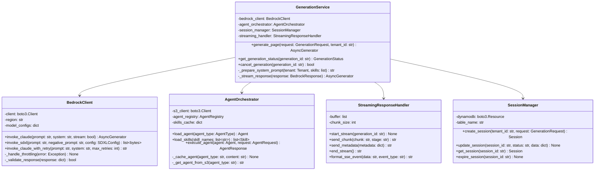

### 4.2 Agent System Classes

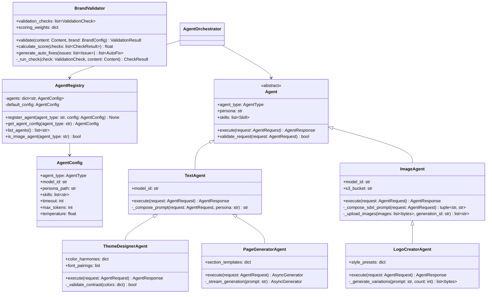

### 4.3 Data Models

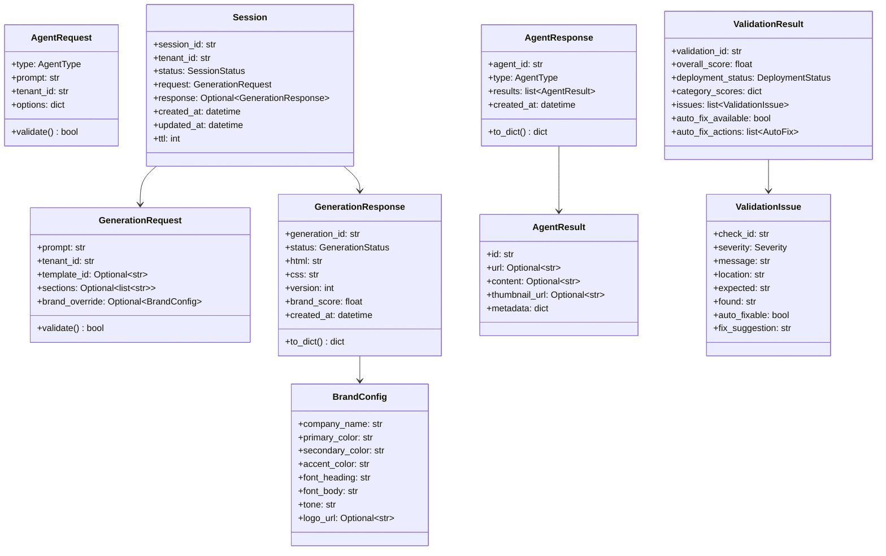

### 4.3.1 Partner Data Models (Epic 9)

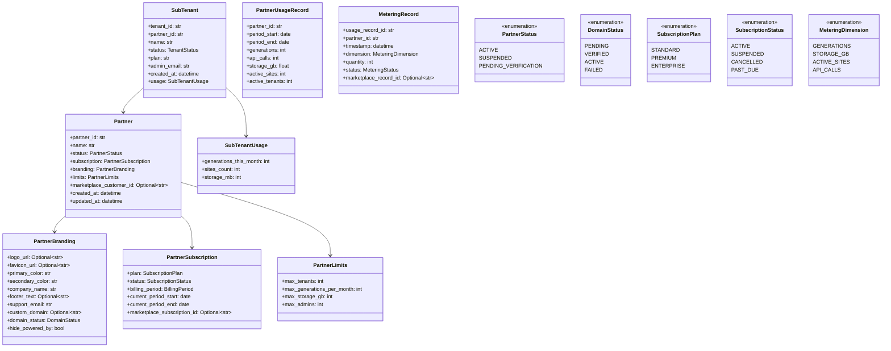

### 4.4 Enumerations

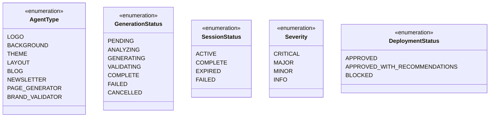

---

## 5. Sequence Diagrams

### 5.1 Page Generation Flow (with SSE Streaming)

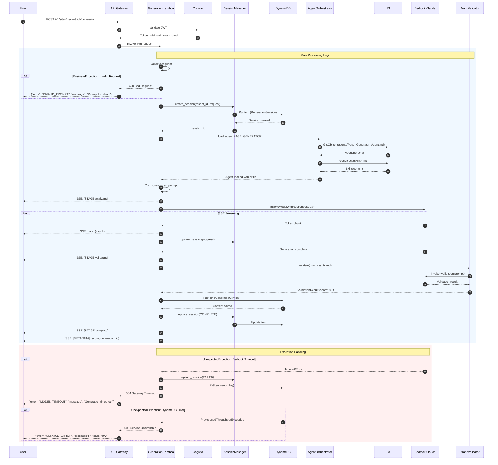

### 5.2 Logo Generation Flow (Image Agent)

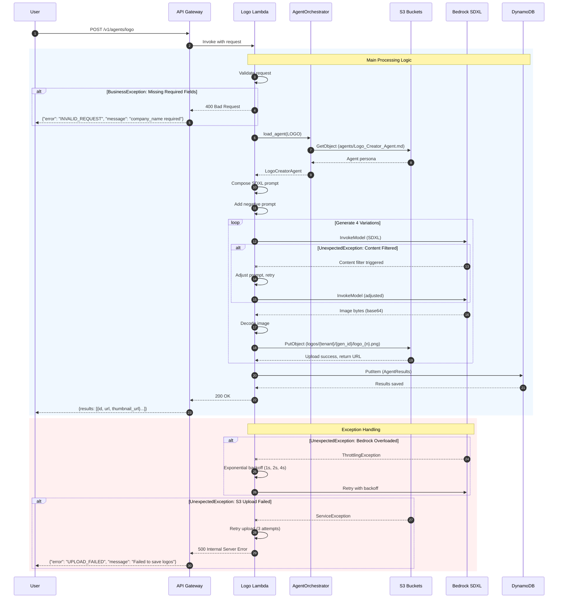

### 5.3 Brand Validation Flow

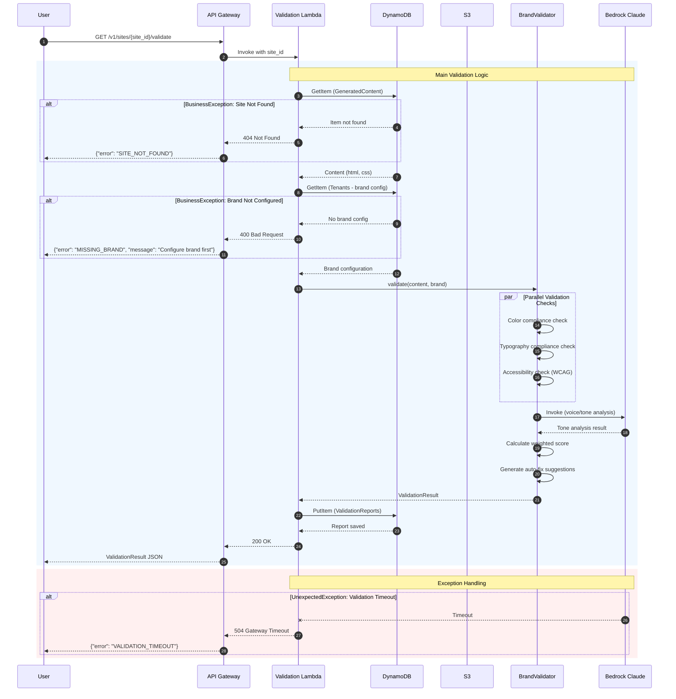

### 5.4 Auto-Fix Application Flow

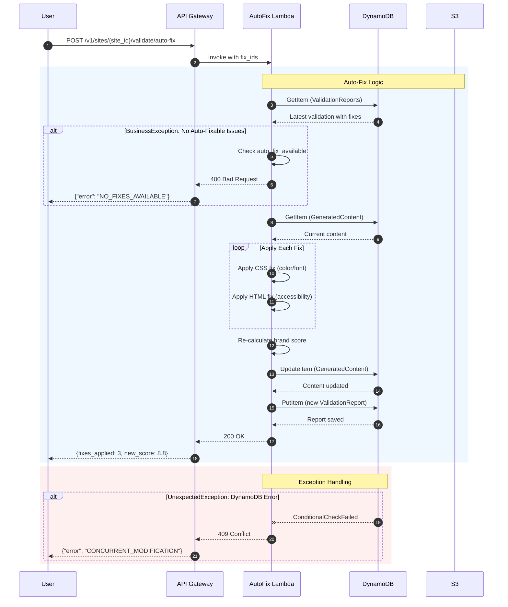

### 5.5 Agent Persona Loading Flow

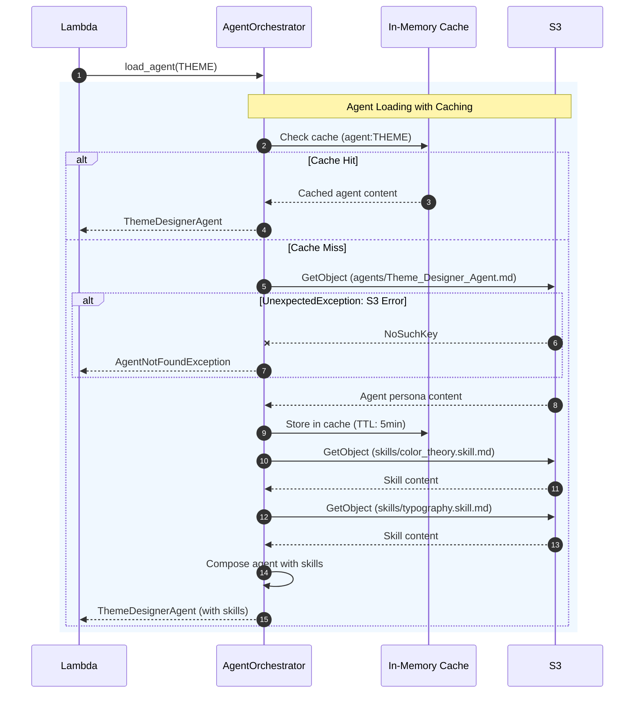

---

## 6. DynamoDB Tables

### 6.1 Single-Table Design Overview

All tables use **on-demand capacity** per project requirements.

```
Table: bbws-{env}-generation

PK                          | SK                          | Type
─────────────────────────────────────────────────────────────────
TENANT#{tenant_id}          | SESSION#{session_id}        | GenerationSession
TENANT#{tenant_id}          | CONTENT#{generation_id}     | GeneratedContent
TENANT#{tenant_id}          | AGENT#{agent_id}            | AgentResult
TENANT#{tenant_id}          | VALIDATION#{validation_id}  | ValidationReport
```

### 6.2 GenerationSessions

**Purpose**: Track active and historical generation sessions

```json
{
  "TableName": "bbws-{env}-generation",
  "AttributeDefinitions": [
    {"AttributeName": "PK", "AttributeType": "S"},
    {"AttributeName": "SK", "AttributeType": "S"},
    {"AttributeName": "GSI1PK", "AttributeType": "S"},
    {"AttributeName": "GSI1SK", "AttributeType": "S"}
  ],
  "KeySchema": [
    {"AttributeName": "PK", "KeyType": "HASH"},
    {"AttributeName": "SK", "KeyType": "RANGE"}
  ],
  "GlobalSecondaryIndexes": [
    {
      "IndexName": "GSI1",
      "KeySchema": [
        {"AttributeName": "GSI1PK", "KeyType": "HASH"},
        {"AttributeName": "GSI1SK", "KeyType": "RANGE"}
      ],
      "Projection": {"ProjectionType": "ALL"}
    }
  ],
  "BillingMode": "PAY_PER_REQUEST"
}
```

**Session Item Schema**:

| Attribute | Type | Description |
|-----------|------|-------------|
| PK | String | `TENANT#{tenant_id}` |
| SK | String | `SESSION#{session_id}` |
| GSI1PK | String | `STATUS#{status}` |
| GSI1SK | String | `{created_at}#{session_id}` |
| session_id | String | UUID |
| tenant_id | String | UUID |
| status | String | `PENDING\|GENERATING\|COMPLETE\|FAILED` |
| request | Map | Original GenerationRequest |
| progress | Number | 0-100 |
| generation_id | String | UUID (set on completion) |
| error_message | String | Set on failure |
| created_at | String | ISO 8601 timestamp |
| updated_at | String | ISO 8601 timestamp |
| ttl | Number | Unix timestamp (24 hours) |

### 6.3 GeneratedContent

**Purpose**: Store generated HTML/CSS content

**Content Item Schema**:

| Attribute | Type | Description |
|-----------|------|-------------|
| PK | String | `TENANT#{tenant_id}` |
| SK | String | `CONTENT#{generation_id}` |
| GSI1PK | String | `SITE#{site_id}` |
| GSI1SK | String | `VERSION#{version}` |
| generation_id | String | UUID |
| site_id | String | UUID |
| version | Number | Auto-incremented |
| html | String | Generated HTML |
| css | String | Generated CSS |
| prompt | String | Original prompt |
| brand_score | Number | 0-10 |
| metadata | Map | Section count, word count, etc. |
| created_at | String | ISO 8601 timestamp |

### 6.4 AgentResults

**Purpose**: Store agent-generated assets (images, themes)

**AgentResult Item Schema**:

| Attribute | Type | Description |
|-----------|------|-------------|
| PK | String | `TENANT#{tenant_id}` |
| SK | String | `AGENT#{agent_id}` |
| GSI1PK | String | `AGENTTYPE#{type}` |
| GSI1SK | String | `{created_at}#{agent_id}` |
| agent_id | String | UUID |
| agent_type | String | `logo\|background\|theme\|layout\|blog\|newsletter` |
| results | List | Array of result objects |
| selected_id | String | User-selected result ID |
| applied_to | String | generation_id where applied |
| created_at | String | ISO 8601 timestamp |
| ttl | Number | Unix timestamp (7 days) |

### 6.5 ValidationReports

**Purpose**: Store brand validation reports

**ValidationReport Item Schema**:

| Attribute | Type | Description |
|-----------|------|-------------|
| PK | String | `TENANT#{tenant_id}` |
| SK | String | `VALIDATION#{validation_id}` |
| GSI1PK | String | `CONTENT#{generation_id}` |
| GSI1SK | String | `{created_at}` |
| validation_id | String | UUID |
| generation_id | String | UUID |
| overall_score | Number | 0-10 |
| category_scores | Map | Detailed breakdown |
| deployment_status | Map | staging/production status |
| issues | List | Array of ValidationIssue |
| auto_fixes | List | Array of AutoFix |
| created_at | String | ISO 8601 timestamp |

### 6.6 Partners (Epic 9)

**Purpose**: Store white-label partner configurations and subscription data

**Partner Item Schema**:

| Attribute | Type | Description |
|-----------|------|-------------|
| PK | String | `PARTNER#{partner_id}` |
| SK | String | `PROFILE` |
| GSI1PK | String | `PARTNERSTATUS#{status}` |
| GSI1SK | String | `{created_at}` |
| GSI2PK | String | `MARKETPLACE#{marketplace_customer_id}` |
| GSI2SK | String | `{partner_id}` |
| partner_id | String | UUID |
| name | String | Partner company name |
| status | String | active/suspended/pending_verification |
| subscription | Map | Plan, status, billing period |
| branding | Map | Logo, colors, domain, etc. |
| limits | Map | max_tenants, max_generations, etc. |
| marketplace_customer_id | String | AWS Marketplace customer ID |
| created_at | String | ISO 8601 timestamp |
| updated_at | String | ISO 8601 timestamp |

**PartnerBranding Sub-Document**:

```json
{
  "logo_url": "https://...",
  "favicon_url": "https://...",
  "primary_color": "#1E3A5F",
  "secondary_color": "#F5A623",
  "company_name": "Acme Partner",
  "footer_text": "Powered by Acme",
  "support_email": "support@acmepartner.com",
  "custom_domain": "builder.acmepartner.com",
  "domain_status": "active",
  "hide_powered_by": true
}
```

**PartnerSubscription Sub-Document**:

```json
{
  "plan": "premium",
  "status": "active",
  "billing_period": "monthly",
  "current_period_start": "2026-01-01",
  "current_period_end": "2026-01-31",
  "marketplace_subscription_id": "sub_abc123"
}
```

### 6.7 SubTenants (Epic 9)

**Purpose**: Store tenants created under a partner (white-label customers)

**SubTenant Item Schema**:

| Attribute | Type | Description |
|-----------|------|-------------|
| PK | String | `PARTNER#{partner_id}` |
| SK | String | `SUBTENANT#{tenant_id}` |
| GSI1PK | String | `TENANT#{tenant_id}` |
| GSI1SK | String | `PARTNER#{partner_id}` |
| tenant_id | String | UUID |
| partner_id | String | UUID |
| name | String | Sub-tenant organisation name |
| status | String | active/suspended/pending |
| plan | String | free/standard/premium |
| admin_email | String | Initial admin email |
| usage | Map | Current month usage metrics |
| created_at | String | ISO 8601 timestamp |

### 6.8 PartnerUsage (Epic 9)

**Purpose**: Store partner usage metrics for billing and alerts

**PartnerUsage Item Schema**:

| Attribute | Type | Description |
|-----------|------|-------------|
| PK | String | `PARTNER#{partner_id}` |
| SK | String | `USAGE#{period}` (YYYY-MM) |
| GSI1PK | String | `USAGEPERIOD#{period}` |
| GSI1SK | String | `{partner_id}` |
| partner_id | String | UUID |
| period | String | YYYY-MM format |
| generations | Number | Total generations this period |
| api_calls | Number | Total API calls |
| storage_gb | Number | Storage used |
| active_sites | Number | Active sites count |
| active_tenants | Number | Active sub-tenants |
| by_tenant | List | Usage breakdown by sub-tenant |
| alert_sent_80 | Boolean | 80% threshold alert sent |
| alert_sent_100 | Boolean | 100% threshold alert sent |
| updated_at | String | ISO 8601 timestamp |

### 6.9 MeteringRecords (Epic 9)

**Purpose**: Store AWS Marketplace metering records for billing

**MeteringRecord Item Schema**:

| Attribute | Type | Description |
|-----------|------|-------------|
| PK | String | `PARTNER#{partner_id}` |
| SK | String | `METER#{timestamp}#{dimension}` |
| GSI1PK | String | `METERSTATUS#{status}` |
| GSI1SK | String | `{timestamp}` |
| usage_record_id | String | UUID |
| partner_id | String | UUID |
| timestamp | String | ISO 8601 timestamp |
| dimension | String | generations/storage_gb/active_sites/api_calls |
| quantity | Number | Metered quantity |
| status | String | pending/submitted/accepted/rejected |
| marketplace_record_id | String | AWS Marketplace record ID (after submission) |
| submitted_at | String | When submitted to Marketplace |

### 6.10 Access Patterns

**Generation & Content Access Patterns**:

| Access Pattern | Key Condition | Index |
|----------------|---------------|-------|
| Get session by ID | PK = `TENANT#{tenant_id}`, SK = `SESSION#{id}` | Table |
| List tenant sessions | PK = `TENANT#{tenant_id}`, SK begins_with `SESSION#` | Table |
| Get sessions by status | GSI1PK = `STATUS#{status}` | GSI1 |
| Get content versions | GSI1PK = `SITE#{site_id}` | GSI1 |
| Get agent results by type | GSI1PK = `AGENTTYPE#{type}` | GSI1 |
| Get validations for content | GSI1PK = `CONTENT#{generation_id}` | GSI1 |

**Partner Access Patterns (Epic 9)**:

| Access Pattern | Key Condition | Index |
|----------------|---------------|-------|
| Get partner by ID | PK = `PARTNER#{partner_id}`, SK = `PROFILE` | Table |
| List partners by status | GSI1PK = `PARTNERSTATUS#{status}` | GSI1 |
| Get partner by Marketplace ID | GSI2PK = `MARKETPLACE#{customer_id}` | GSI2 |
| List sub-tenants for partner | PK = `PARTNER#{partner_id}`, SK begins_with `SUBTENANT#` | Table |
| Get partner for tenant | GSI1PK = `TENANT#{tenant_id}` | GSI1 |
| Get partner usage for period | PK = `PARTNER#{partner_id}`, SK = `USAGE#{period}` | Table |
| List all usage for period | GSI1PK = `USAGEPERIOD#{period}` | GSI1 |
| Get metering records | PK = `PARTNER#{partner_id}`, SK begins_with `METER#` | Table |
| List pending metering records | GSI1PK = `METERSTATUS#pending` | GSI1 |

---

## 7. S3 Bucket Structure

### 7.1 Agent Personas Bucket

**Bucket**: `bbws-{env}-agent-personas`

**Security**: Block all public access

```
bbws-{env}-agent-personas/
├── agents/
│   ├── Page_Generator_Agent.md
│   ├── Logo_Creator_Agent.md
│   ├── Theme_Designer_Agent.md
│   ├── Brand_Validator_Agent.md
│   ├── Background_Creator_Agent.md
│   ├── Layout_Agent.md
│   ├── Blog_Writer_Agent.md
│   └── Newsletter_Agent.md
├── skills/
│   ├── landing_page_design.skill.md
│   ├── brand_guidelines.skill.md
│   ├── html_css_best_practices.skill.md
│   ├── responsive_design.skill.md
│   ├── accessibility_wcag.skill.md
│   ├── copywriting.skill.md
│   ├── seo_optimization.skill.md
│   ├── color_theory.skill.md
│   ├── typography.skill.md
│   └── logo_design_principles.skill.md
└── templates/
    ├── saas_landing.json
    ├── ecommerce.json
    ├── portfolio.json
    └── event.json
```

### 7.2 Generated Assets Bucket

**Bucket**: `bbws-{env}-generated-assets`

**Security**: Block all public access, CloudFront OAI for serving

```
bbws-{env}-generated-assets/
├── logos/
│   └── {tenant_id}/
│       └── {generation_id}/
│           ├── logo_1.png
│           ├── logo_1_thumb.png
│           ├── logo_2.png
│           ├── logo_2_thumb.png
│           └── ...
├── backgrounds/
│   └── {tenant_id}/
│       └── {generation_id}/
│           ├── bg_1.png
│           ├── bg_1_thumb.png
│           └── ...
├── pages/
│   └── {tenant_id}/
│       └── {site_id}/
│           └── {version}/
│               ├── index.html
│               └── styles.css
└── exports/
    └── {tenant_id}/
        └── {export_id}/
            └── site.zip
```

### 7.3 Bucket Policies (Terraform)

```hcl
# Agent personas bucket - Lambda read access only
resource "aws_s3_bucket" "agent_personas" {
  bucket = "bbws-${var.environment}-agent-personas"
}

resource "aws_s3_bucket_public_access_block" "agent_personas_block" {
  bucket = aws_s3_bucket.agent_personas.id

  block_public_acls       = true
  block_public_policy     = true
  ignore_public_acls      = true
  restrict_public_buckets = true
}

# Generated assets bucket - Lambda write, CloudFront read
resource "aws_s3_bucket" "generated_assets" {
  bucket = "bbws-${var.environment}-generated-assets"
}

resource "aws_s3_bucket_public_access_block" "generated_assets_block" {
  bucket = aws_s3_bucket.generated_assets.id

  block_public_acls       = true
  block_public_policy     = true
  ignore_public_acls      = true
  restrict_public_buckets = true
}
```

---

## 8. Deployment Architecture

### 8.1 Deployment Target by Site Type

The Site Builder supports two distinct deployment architectures based on site type:

| Site Type | Infrastructure | Components | Use Case |
|-----------|----------------|------------|----------|
| **WordPress** | ECS + CloudFront | Fargate containers, ALB, RDS MySQL, EFS | Dynamic CMS sites, blogs, e-commerce |
| **Serverless** | S3 + CloudFront | Static assets, CloudFront CDN | AI-generated landing pages, static sites |

```
┌─────────────────────────────────────────────────────────────────────────────┐
│                        DEPLOYMENT ARCHITECTURE                               │
├─────────────────────────────────────────────────────────────────────────────┤
│                                                                              │
│  ┌──────────────────────────────────────┐                                   │
│  │       AI-Generated Content           │                                   │
│  │  (Landing Pages, Static Sites)       │                                   │
│  └──────────────────┬───────────────────┘                                   │
│                     │                                                        │
│                     ▼                                                        │
│  ┌──────────────────────────────────────┐                                   │
│  │     S3 + CloudFront (Serverless)     │                                   │
│  │  • HTML/CSS/JS stored in S3          │                                   │
│  │  • CloudFront CDN distribution       │                                   │
│  │  • No public S3 access (OAI)         │                                   │
│  │  • Pre-signed URLs for uploads       │                                   │
│  └──────────────────────────────────────┘                                   │
│                                                                              │
│  ═══════════════════════════════════════════════════════════════════════   │
│                                                                              │
│  ┌──────────────────────────────────────┐                                   │
│  │         WordPress Sites              │                                   │
│  │    (CMS, Blogs, E-commerce)          │                                   │
│  └──────────────────┬───────────────────┘                                   │
│                     │                                                        │
│                     ▼                                                        │
│  ┌──────────────────────────────────────┐                                   │
│  │   ECS Fargate + CloudFront           │                                   │
│  │  • WordPress containers on ECS       │                                   │
│  │  • ALB for load balancing            │                                   │
│  │  • RDS MySQL (per-tenant DB)         │                                   │
│  │  • EFS for wp-content storage        │                                   │
│  │  • CloudFront CDN distribution       │                                   │
│  └──────────────────────────────────────┘                                   │
│                                                                              │
└─────────────────────────────────────────────────────────────────────────────┘
```

### 8.2 Serverless Deployment (S3 + CloudFront)

**Used For**: AI-generated landing pages, static websites, exported sites

**Architecture Flow**:
```
User Request → API Gateway → Lambda → Bedrock (Generate)
                                   ↓
                            S3 (Store HTML/CSS/JS)
                                   ↓
                            CloudFront (Serve)
                                   ↓
                            https://{site-id}.sites.kimmyai.io
```

**Key Components**:

| Component | Purpose | Configuration |
|-----------|---------|---------------|
| S3 Bucket | Asset storage | Private, SSE-S3 encryption, no public access |
| CloudFront | CDN distribution | OAI for S3 access, HTTPS only, custom domain |
| Lambda@Edge | URL rewriting | Optional, for SPA routing |
| Route 53 | DNS management | Wildcard CNAME to CloudFront |

**Deployment Process**:
1. Generation Lambda creates HTML/CSS/JS
2. Assets uploaded to S3 with tenant prefix: `sites/{tenant_id}/{site_id}/v{version}/`
3. CloudFront invalidation triggered (optional for immediate update)
4. Site accessible via CloudFront distribution

**S3 Structure for Serverless Sites**:
```
bbws-{env}-generated-assets/
└── sites/
    └── {tenant_id}/
        └── {site_id}/
            └── v{version}/
                ├── index.html
                ├── styles.css
                ├── assets/
                │   ├── logo.png
                │   └── hero-bg.jpg
                └── manifest.json
```

### 8.3 WordPress Deployment (ECS + CloudFront)

**Used For**: WordPress CMS sites requiring dynamic content, plugins, e-commerce

**Architecture Flow**:
```
User Request → CloudFront → ALB → ECS Fargate (WordPress)
                                        ↓
                               RDS MySQL (Database)
                                        ↓
                               EFS (File Storage)
```

**Key Components** (from Tenant Provisioner):

| Component | Purpose | Configuration |
|-----------|---------|---------------|
| ECS Fargate | Container orchestration | Task per tenant, 512-1024 CPU, 1-2GB memory |
| ALB | Load balancing | Host-based routing by tenant hostname |
| RDS MySQL | Database | Shared instance, per-tenant database isolation |
| EFS | File storage | Access point per tenant, POSIX isolation |
| CloudFront | CDN | Wildcard domain, caching disabled (dynamic) |
| Secrets Manager | Credentials | Per-tenant DB credentials |

**Tenant Isolation**:
- **Database**: Separate database per tenant (`{tenant}_db`)
- **File System**: EFS access point per tenant (`/{tenant_id}/`)
- **Network**: ALB listener rules route by hostname
- **Secrets**: Per-tenant credentials in Secrets Manager

**WordPress Domain Pattern**:
```
DEV:  https://{tenant_id}.wpdev.kimmyai.io
SIT:  https://{tenant_id}.wpsit.kimmyai.io
PROD: https://{tenant_id}.wp.kimmyai.io
```

**Related Infrastructure**:
- Terraform: `/Users/tebogotseka/Documents/agentic_work/2_bbws_ecs_terraform/`
- Provisioner: `/Users/tebogotseka/Documents/agentic_work/2_bbws_tenant_provisioner/`

### 8.4 Deployment API Endpoints

```yaml
# Additional endpoints for deployment management
paths:
  /sites/{site_id}/deploy:
    post:
      summary: Deploy generated site
      description: Deploy site to appropriate infrastructure based on site type
      operationId: deploySite
      tags:
        - Deployment
      parameters:
        - name: site_id
          in: path
          required: true
          schema:
            type: string
            format: uuid
      requestBody:
        required: true
        content:
          application/json:
            schema:
              type: object
              required:
                - site_type
                - environment
              properties:
                site_type:
                  type: string
                  enum: [serverless, wordpress]
                  description: Target deployment infrastructure
                environment:
                  type: string
                  enum: [dev, sit, prod]
                domain:
                  type: string
                  description: Custom domain (optional)
      responses:
        '200':
          description: Deployment initiated
          content:
            application/json:
              schema:
                type: object
                properties:
                  deployment_id:
                    type: string
                    format: uuid
                  status:
                    type: string
                    enum: [pending, in_progress, complete, failed]
                  site_url:
                    type: string
                    format: uri
                  estimated_time:
                    type: integer
                    description: Estimated completion time in seconds

  /sites/{site_id}/deploy/status:
    get:
      summary: Get deployment status
      operationId: getDeploymentStatus
      tags:
        - Deployment
      parameters:
        - name: site_id
          in: path
          required: true
          schema:
            type: string
            format: uuid
      responses:
        '200':
          description: Deployment status
          content:
            application/json:
              schema:
                type: object
                properties:
                  deployment_id:
                    type: string
                  status:
                    type: string
                  site_url:
                    type: string
                  logs:
                    type: array
                    items:
                      type: string
```

### 8.5 Deployment Sequence Diagram

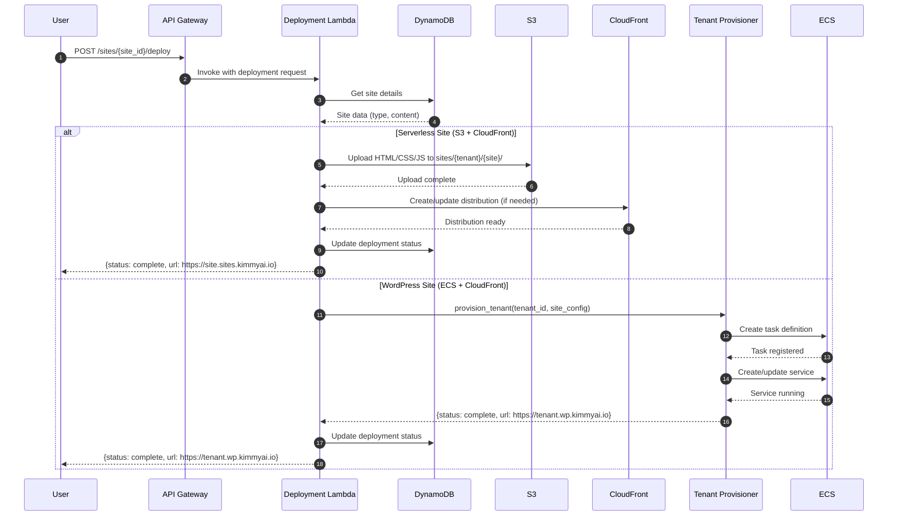

### 8.6 Site Type Selection Logic

```python
class DeploymentService:
    """Handles deployment to appropriate infrastructure"""

    def deploy_site(self, site_id: str, request: DeploymentRequest) -> DeploymentResult:
        """Deploy site based on site_type"""

        if request.site_type == SiteType.SERVERLESS:
            return self._deploy_to_s3_cloudfront(site_id, request)
        elif request.site_type == SiteType.WORDPRESS:
            return self._deploy_to_ecs(site_id, request)
        else:
            raise InvalidSiteTypeException(f"Unknown site type: {request.site_type}")

    def _deploy_to_s3_cloudfront(self, site_id: str, request: DeploymentRequest) -> DeploymentResult:
        """Deploy static site to S3 + CloudFront"""
        # 1. Get generated content from DynamoDB
        content = self.dynamodb.get_generated_content(site_id)

        # 2. Upload to S3
        s3_path = f"sites/{request.tenant_id}/{site_id}/v{content.version}/"
        self.s3.upload_site_assets(content.html, content.css, content.assets, s3_path)

        # 3. Invalidate CloudFront cache (optional)
        if request.invalidate_cache:
            self.cloudfront.create_invalidation(f"/{s3_path}*")

        # 4. Return deployment result
        return DeploymentResult(
            deployment_id=str(uuid.uuid4()),
            status=DeploymentStatus.COMPLETE,
            site_url=f"https://{site_id}.sites.{request.environment}.kimmyai.io"
        )

    def _deploy_to_ecs(self, site_id: str, request: DeploymentRequest) -> DeploymentResult:
        """Deploy WordPress site to ECS via Tenant Provisioner"""
        # 1. Prepare WordPress configuration
        wp_config = self._prepare_wordpress_config(site_id, request)

        # 2. Invoke tenant provisioner
        result = self.provisioner.provision_tenant(
            tenant_id=request.tenant_id,
            environment=request.environment,
            config=wp_config
        )

        # 3. Return deployment result
        domain_suffix = {
            'dev': 'wpdev.kimmyai.io',
            'sit': 'wpsit.kimmyai.io',
            'prod': 'wp.kimmyai.io'
        }

        return DeploymentResult(
            deployment_id=result.deployment_id,
            status=DeploymentStatus.COMPLETE,
            site_url=f"https://{request.tenant_id}.{domain_suffix[request.environment]}"
        )
```

### 8.7 Deployment Configuration by Environment

| Config | Serverless (S3+CF) | WordPress (ECS+CF) |
|--------|--------------------|--------------------|
| **DEV Domain** | `*.sites.dev.kimmyai.io` | `*.wpdev.kimmyai.io` |
| **SIT Domain** | `*.sites.sit.kimmyai.io` | `*.wpsit.kimmyai.io` |
| **PROD Domain** | `*.sites.kimmyai.io` | `*.wp.kimmyai.io` |
| **SSL** | ACM wildcard cert | ACM wildcard cert |
| **CDN** | CloudFront (caching enabled) | CloudFront (caching disabled) |
| **Storage** | S3 (static files) | EFS (wp-content) + RDS (database) |
| **Compute** | N/A (serverless) | ECS Fargate per tenant |

---

## 9. Environment Configuration

### 8.1 Multi-Environment Strategy

| Environment | Region (Primary) | Region (DR) | Purpose |
|-------------|------------------|-------------|---------|
| DEV | eu-west-1 | N/A | Development and testing |
| SIT | eu-west-1 | N/A | System integration testing |
| PROD | af-south-1 | eu-west-1 | Production with DR |

### 8.2 Environment Variables

```python
# Lambda environment variables (parameterized, never hardcoded)
ENVIRONMENT = "dev"  # dev | sit | prod
AWS_REGION = "eu-west-1"  # Primary region
DR_REGION = "eu-west-1"  # DR region (PROD only)

# DynamoDB
DYNAMODB_TABLE = f"bbws-{ENVIRONMENT}-generation"
DYNAMODB_ENDPOINT = None  # Use default

# S3 Buckets
AGENT_PERSONAS_BUCKET = f"bbws-{ENVIRONMENT}-agent-personas"
GENERATED_ASSETS_BUCKET = f"bbws-{ENVIRONMENT}-generated-assets"

# Bedrock Configuration
BEDROCK_CLAUDE_MODEL = "anthropic.claude-sonnet-4-5-20251101"
BEDROCK_SDXL_MODEL = "stability.stable-diffusion-xl-v1"
BEDROCK_ENDPOINT = None  # Use VPC endpoint in PROD

# Cognito
COGNITO_USER_POOL_ID = f"bbws-{ENVIRONMENT}-user-pool"
COGNITO_CLIENT_ID = "<from-ssm>"

# Feature Flags
ENABLE_STREAMING = True
ENABLE_AUTO_FIX = True
MAX_GENERATION_TIMEOUT = 60  # seconds

# Observability
LOG_LEVEL = "INFO"  # DEBUG in DEV
ENABLE_XRAY = True
```

### 8.3 Terraform Workspace Configuration

```hcl
# terraform/environments/dev.tfvars
environment       = "dev"
primary_region    = "eu-west-1"
enable_dr         = false
log_level         = "DEBUG"
enable_waf        = true
bedrock_endpoint  = null

# terraform/environments/sit.tfvars
environment       = "sit"
primary_region    = "eu-west-1"
enable_dr         = false
log_level         = "INFO"
enable_waf        = true
bedrock_endpoint  = null

# terraform/environments/prod.tfvars
environment       = "prod"
primary_region    = "af-south-1"
dr_region         = "eu-west-1"
enable_dr         = true
log_level         = "INFO"
enable_waf        = true
bedrock_endpoint  = "vpce-xxx"  # VPC Endpoint
```

### 8.4 Region-Specific Configuration

| Configuration | DEV/SIT (eu-west-1) | PROD (af-south-1) | DR (eu-west-1) |
|---------------|---------------------|-------------------|----------------|
| API Gateway URL | `api.dev.kimmyai.io` | `api.kimmyai.io` | `api-dr.kimmyai.io` |
| DynamoDB | Single region | Global Tables | Replica |
| S3 | Single region | CRR enabled | Replica |
| Bedrock | Public endpoint | VPC endpoint | Public endpoint |

---

## 10. Non-Functional Requirements (NFRs)

### 10.1 Performance Targets

| Operation | Target | Max Acceptable |
|-----------|--------|----------------|
| Page generation (full) | < 15s | 30s |
| SSE first token | < 500ms | 1s |
| Logo generation (4 images) | < 30s | 45s |
| Theme generation (3 options) | < 10s | 15s |
| Brand validation | < 15s | 20s |
| Auto-fix application | < 5s | 10s |
| Agent persona loading | < 500ms | 1s |

### 10.2 Availability

| Environment | Target Availability | RTO | RPO |
|-------------|--------------------|----|-----|
| DEV | 95% | N/A | N/A |
| SIT | 99% | N/A | N/A |
| PROD | 99.9% | 1 minute | 1 hour |

### 10.3 Scalability

| Metric | Capacity |
|--------|----------|
| Concurrent page generations | 100 |
| Image generations per minute | 500 |
| API requests per second | 1000 |
| DynamoDB write capacity | On-demand (auto-scale) |

### 10.4 Bedrock Quotas (af-south-1)

| Model | Requests/min | Tokens/min |
|-------|--------------|------------|
| Claude Sonnet 4.5 | 60 | 80,000 |
| Stable Diffusion XL | 30 | N/A |

**Mitigation**: Implement request queuing and exponential backoff for quota exceeded.

---

## 11. Security

### 11.1 Authentication and Authorization

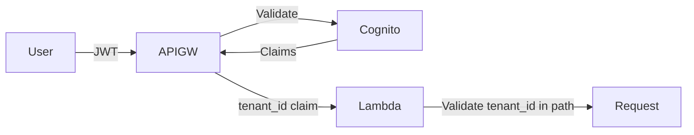

**JWT Claims Required**:
- `sub`: User ID
- `custom:tenant_id`: Tenant identifier
- `custom:org_id`: Organization ID
- `cognito:groups`: User roles

#### 11.1.1 Cognito First Principles Implementation (MANDATORY)

> **CRITICAL REQUIREMENT**: Amazon Cognito authentication MUST be implemented using first principles with direct AWS SDK calls. **Amplify is NOT permitted** in any environment (DEV, SIT, PROD).

**Rationale**: Senior architecture team mandate for:
- Full control over authentication flows
- Reduced bundle size (no Amplify overhead)
- Direct AWS SDK integration for consistency
- Better testability and debugging

**Frontend Implementation - Direct AWS SDK**:

```typescript
// cognito-client.ts - Direct Cognito SDK usage (NO AMPLIFY)
import {
  CognitoIdentityProviderClient,
  InitiateAuthCommand,
  SignUpCommand,
  ConfirmSignUpCommand,
  GetUserCommand,
  GlobalSignOutCommand,
  ForgotPasswordCommand,
  ConfirmForgotPasswordCommand,
  RespondToAuthChallengeCommand,
  type InitiateAuthCommandOutput
} from '@aws-sdk/client-cognito-identity-provider';

// Environment configuration
const cognitoConfig = {
  region: process.env.VITE_AWS_REGION!,
  userPoolId: process.env.VITE_COGNITO_USER_POOL_ID!,
  clientId: process.env.VITE_COGNITO_CLIENT_ID!
};

// Singleton client instance
const cognitoClient = new CognitoIdentityProviderClient({
  region: cognitoConfig.region
});

/**
 * Sign in user with username and password
 * Direct API call to Cognito - NO Amplify
 */
export async function signIn(
  username: string,
  password: string
): Promise<InitiateAuthCommandOutput> {
  const command = new InitiateAuthCommand({
    AuthFlow: 'USER_PASSWORD_AUTH',
    ClientId: cognitoConfig.clientId,
    AuthParameters: {
      USERNAME: username,
      PASSWORD: password
    }
  });

  return cognitoClient.send(command);
}

/**
 * Sign up new user
 * Direct API call to Cognito - NO Amplify
 */
export async function signUp(
  email: string,
  password: string,
  tenantId: string,
  orgId: string
): Promise<void> {
  const command = new SignUpCommand({
    ClientId: cognitoConfig.clientId,
    Username: email,
    Password: password,
    UserAttributes: [
      { Name: 'email', Value: email },
      { Name: 'custom:tenant_id', Value: tenantId },
      { Name: 'custom:org_id', Value: orgId }
    ]
  });

  await cognitoClient.send(command);
}

/**
 * Confirm sign up with verification code
 */
export async function confirmSignUp(
  username: string,
  code: string
): Promise<void> {
  const command = new ConfirmSignUpCommand({
    ClientId: cognitoConfig.clientId,
    Username: username,
    ConfirmationCode: code
  });

  await cognitoClient.send(command);
}

/**
 * Get current authenticated user
 */
export async function getCurrentUser(accessToken: string) {
  const command = new GetUserCommand({
    AccessToken: accessToken
  });

  return cognitoClient.send(command);
}

/**
 * Global sign out (invalidate all tokens)
 */
export async function signOut(accessToken: string): Promise<void> {
  const command = new GlobalSignOutCommand({
    AccessToken: accessToken
  });

  await cognitoClient.send(command);
}

/**
 * Refresh tokens using refresh token
 */
export async function refreshTokens(
  refreshToken: string
): Promise<InitiateAuthCommandOutput> {
  const command = new InitiateAuthCommand({
    AuthFlow: 'REFRESH_TOKEN_AUTH',
    ClientId: cognitoConfig.clientId,
    AuthParameters: {
      REFRESH_TOKEN: refreshToken
    }
  });

  return cognitoClient.send(command);
}
```

**Backend Lambda - JWT Validation**:

```python
# cognito_validator.py - Direct JWT validation (NO Amplify)
import jwt
import requests
from functools import lru_cache
from typing import Dict, Any
import os

COGNITO_USER_POOL_ID = os.environ['COGNITO_USER_POOL_ID']
COGNITO_REGION = os.environ['AWS_REGION']
COGNITO_CLIENT_ID = os.environ['COGNITO_CLIENT_ID']

@lru_cache(maxsize=1)
def get_cognito_jwks() -> Dict[str, Any]:
    """Fetch and cache Cognito JWKS - direct HTTP call"""
    jwks_url = (
        f"https://cognito-idp.{COGNITO_REGION}.amazonaws.com/"
        f"{COGNITO_USER_POOL_ID}/.well-known/jwks.json"
    )
    response = requests.get(jwks_url, timeout=5)
    response.raise_for_status()
    return response.json()

def validate_jwt_token(token: str) -> Dict[str, Any]:
    """
    Validate Cognito JWT token using first principles
    NO Amplify - direct JWT library usage
    """
    # Get JWKS keys
    jwks = get_cognito_jwks()

    # Decode token header to get key ID
    unverified_header = jwt.get_unverified_header(token)
    kid = unverified_header['kid']

    # Find matching key in JWKS
    key = None
    for jwk in jwks['keys']:
        if jwk['kid'] == kid:
            key = jwt.algorithms.RSAAlgorithm.from_jwk(jwk)
            break

    if not key:
        raise ValueError("Unable to find matching key in JWKS")

    # Validate and decode token
    claims = jwt.decode(
        token,
        key,
        algorithms=['RS256'],
        audience=COGNITO_CLIENT_ID,
        issuer=f"https://cognito-idp.{COGNITO_REGION}.amazonaws.com/{COGNITO_USER_POOL_ID}"
    )

    return claims

def extract_tenant_context(claims: Dict[str, Any]) -> Dict[str, str]:
    """Extract tenant context from validated JWT claims"""
    return {
        'user_id': claims['sub'],
        'tenant_id': claims.get('custom:tenant_id'),
        'org_id': claims.get('custom:org_id'),
        'groups': claims.get('cognito:groups', [])
    }
```

**Terraform - Cognito User Pool Configuration**:

```hcl
# cognito.tf - First principles Cognito setup
resource "aws_cognito_user_pool" "site_builder" {
  name = "bbws-${var.environment}-site-builder-pool"

  # Password policy
  password_policy {
    minimum_length    = 12
    require_lowercase = true
    require_uppercase = true
    require_numbers   = true
    require_symbols   = true
  }

  # MFA configuration
  mfa_configuration = var.environment == "prod" ? "OPTIONAL" : "OFF"

  # Custom attributes for multi-tenancy
  schema {
    name                = "tenant_id"
    attribute_data_type = "String"
    mutable             = false
    required            = false

    string_attribute_constraints {
      min_length = 1
      max_length = 256
    }
  }

  schema {
    name                = "org_id"
    attribute_data_type = "String"
    mutable             = false
    required            = false

    string_attribute_constraints {
      min_length = 1
      max_length = 256
    }
  }

  # Account recovery
  account_recovery_setting {
    recovery_mechanism {
      name     = "verified_email"
      priority = 1
    }
  }

  tags = {
    Environment = var.environment
    Project     = "BBWS-SiteBuilder"
  }
}

# App client - NO secret for public client (frontend)
resource "aws_cognito_user_pool_client" "site_builder_frontend" {
  name         = "bbws-${var.environment}-site-builder-frontend"
  user_pool_id = aws_cognito_user_pool.site_builder.id

  # Public client - no secret
  generate_secret = false

  # Allowed auth flows - first principles
  explicit_auth_flows = [
    "ALLOW_USER_PASSWORD_AUTH",
    "ALLOW_REFRESH_TOKEN_AUTH",
    "ALLOW_USER_SRP_AUTH"
  ]

  # Token validity
  access_token_validity  = 1    # 1 hour
  id_token_validity      = 1    # 1 hour
  refresh_token_validity = 30   # 30 days

  token_validity_units {
    access_token  = "hours"
    id_token      = "hours"
    refresh_token = "days"
  }

  # Read attributes
  read_attributes = [
    "email",
    "custom:tenant_id",
    "custom:org_id"
  ]

  # Prevent Amplify usage by NOT enabling hosted UI
  # callback_urls and logout_urls intentionally omitted
}

# API Gateway Cognito Authorizer
resource "aws_api_gateway_authorizer" "cognito" {
  name          = "bbws-${var.environment}-cognito-authorizer"
  rest_api_id   = aws_api_gateway_rest_api.site_builder.id
  type          = "COGNITO_USER_POOLS"
  provider_arns = [aws_cognito_user_pool.site_builder.arn]

  identity_source = "method.request.header.Authorization"
}
```

**Prohibited Patterns - DO NOT USE**:

```typescript
// ❌ PROHIBITED - DO NOT USE AMPLIFY
import { Amplify } from 'aws-amplify';           // BANNED
import { signIn } from '@aws-amplify/auth';      // BANNED
import { Auth } from 'aws-amplify';              // BANNED

// ❌ PROHIBITED - Amplify configuration
Amplify.configure({ ... });                       // BANNED

// ❌ PROHIBITED - Amplify Authenticator component
import { Authenticator } from '@aws-amplify/ui-react';  // BANNED
```

**Code Review Checklist for Cognito**:

- [ ] No `aws-amplify` or `@aws-amplify/*` packages in package.json
- [ ] All auth calls use `@aws-sdk/client-cognito-identity-provider`
- [ ] JWT validation uses direct JWKS fetch, not Amplify libraries
- [ ] No Amplify configuration files (amplifyconfiguration.json, aws-exports.js)
- [ ] Cognito Hosted UI is NOT enabled (prevents Amplify dependency)

### 11.2 Tenant Isolation

```python
def validate_tenant_access(event: dict) -> str:
    """Validate tenant_id in path matches JWT claim"""
    path_tenant_id = event['pathParameters']['tenant_id']
    claims = event['requestContext']['authorizer']['claims']
    jwt_tenant_id = claims['custom:tenant_id']

    if path_tenant_id != jwt_tenant_id:
        raise ForbiddenException("Tenant access denied")

    return path_tenant_id
```

### 11.3 VPC Configuration (PROD)

```hcl
# VPC Endpoints for private Bedrock access
resource "aws_vpc_endpoint" "bedrock" {
  count             = var.environment == "prod" ? 1 : 0
  vpc_id            = var.vpc_id
  service_name      = "com.amazonaws.${var.primary_region}.bedrock-runtime"
  vpc_endpoint_type = "Interface"
  subnet_ids        = var.private_subnet_ids
  security_group_ids = [aws_security_group.bedrock_endpoint.id]
}
```

### 11.4 Data Protection

| Data Type | Protection |
|-----------|------------|
| Generated HTML/CSS | Encrypted at rest (SSE-S3) |
| Agent personas | Encrypted at rest (SSE-S3) |
| Session data | DynamoDB encryption enabled |
| API traffic | TLS 1.2+ enforced |
| Bedrock prompts | Not logged, ephemeral |

### 11.5 S3 Bucket Security

**All buckets have public access blocked**:

```hcl
resource "aws_s3_bucket_public_access_block" "all_buckets" {
  for_each = toset([
    aws_s3_bucket.agent_personas.id,
    aws_s3_bucket.generated_assets.id
  ])

  bucket = each.value

  block_public_acls       = true
  block_public_policy     = true
  ignore_public_acls      = true
  restrict_public_buckets = true
}
```

### 11.6 IAM Roles (Least Privilege)

```json
{
  "Version": "2012-10-17",
  "Statement": [
    {
      "Effect": "Allow",
      "Action": [
        "bedrock:InvokeModel",
        "bedrock:InvokeModelWithResponseStream"
      ],
      "Resource": [
        "arn:aws:bedrock:*:*:model/anthropic.claude-sonnet-4-5-*",
        "arn:aws:bedrock:*:*:model/stability.stable-diffusion-xl-*"
      ]
    },
    {
      "Effect": "Allow",
      "Action": [
        "dynamodb:GetItem",
        "dynamodb:PutItem",
        "dynamodb:UpdateItem",
        "dynamodb:Query"
      ],
      "Resource": "arn:aws:dynamodb:*:*:table/bbws-*-generation*"
    },
    {
      "Effect": "Allow",
      "Action": [
        "s3:GetObject"
      ],
      "Resource": "arn:aws:s3:::bbws-*-agent-personas/*"
    },
    {
      "Effect": "Allow",
      "Action": [
        "s3:PutObject",
        "s3:GetObject"
      ],
      "Resource": "arn:aws:s3:::bbws-*-generated-assets/*"
    }
  ]
}
```

### 11.7 Multi-Tenant Infrastructure Solutions

This section documents the AWS services and features used to implement multi-tenancy at the infrastructure level.

#### Quick Reference: Multi-Tenant Solutions

| Requirement | AWS Service | Feature | Implementation |
|-------------|-------------|---------|----------------|
| Rate limiting | API Gateway | Usage Plans | Per-tenant throttling |
| Audit logs | CloudWatch | Resource tags | Tenant-tagged log groups |
| Cost allocation | Cost Explorer | Cost allocation tags | Tenant cost tracking |
| Authentication | API Gateway | API Keys + Cognito | Dual-layer auth |
| Routing | Lambda | Custom logic | Tenant context routing |

#### 11.7.1 Rate Limiting with API Gateway Usage Plans

```hcl
# Per-tenant usage plans for rate limiting
resource "aws_api_gateway_usage_plan" "tenant_plan" {
  for_each = var.tenant_configs

  name        = "bbws-${var.environment}-${each.key}-usage-plan"
  description = "Usage plan for tenant ${each.key}"

  api_stages {
    api_id = aws_api_gateway_rest_api.generation_api.id
    stage  = aws_api_gateway_stage.main.stage_name
  }

  # Throttle settings per tenant tier
  throttle_settings {
    burst_limit = lookup(each.value, "burst_limit", 100)   # requests per second burst
    rate_limit  = lookup(each.value, "rate_limit", 50)     # requests per second steady
  }

  # Quota settings per tenant tier
  quota_settings {
    limit  = lookup(each.value, "monthly_quota", 10000)    # requests per period
    period = "MONTH"
  }

  tags = {
    Environment = var.environment
    TenantId    = each.key
    CostCenter  = "tenant-${each.key}"
  }
}

# API Keys linked to usage plans
resource "aws_api_gateway_api_key" "tenant_key" {
  for_each = var.tenant_configs

  name    = "bbws-${var.environment}-${each.key}-api-key"
  enabled = true

  tags = {
    Environment = var.environment
    TenantId    = each.key
  }
}

resource "aws_api_gateway_usage_plan_key" "tenant_plan_key" {
  for_each = var.tenant_configs

  key_id        = aws_api_gateway_api_key.tenant_key[each.key].id
  key_type      = "API_KEY"
  usage_plan_id = aws_api_gateway_usage_plan.tenant_plan[each.key].id
}
```

**Tenant Tier Rate Limits**:

| Tier | Burst (req/s) | Steady (req/s) | Monthly Quota | Use Case |
|------|---------------|----------------|---------------|----------|
| Free | 10 | 5 | 1,000 | Trial tenants |
| Standard | 50 | 25 | 10,000 | Small business |
| Professional | 100 | 50 | 50,000 | Medium business |
| Enterprise | 500 | 200 | Unlimited | Large enterprise |

#### 11.7.2 Audit Logs with CloudWatch Resource Tags

```hcl
# Tenant-specific log groups with resource tags
resource "aws_cloudwatch_log_group" "tenant_logs" {
  for_each = var.tenant_configs

  name              = "/bbws/${var.environment}/tenants/${each.key}"
  retention_in_days = var.environment == "prod" ? 365 : 30

  tags = {
    Environment  = var.environment
    TenantId     = each.key
    Application  = "site-builder"
    CostCenter   = "tenant-${each.key}"
    DataClass    = "tenant-data"
  }
}

# Lambda function to route logs by tenant
resource "aws_cloudwatch_log_subscription_filter" "tenant_filter" {
  for_each = var.tenant_configs

  name            = "tenant-${each.key}-filter"
  log_group_name  = aws_cloudwatch_log_group.generation_lambda.name
  filter_pattern  = "{ $.tenant_id = \"${each.key}\" }"
  destination_arn = aws_cloudwatch_log_group.tenant_logs[each.key].arn
}
```

**Structured Logging with Tenant Context**:

```python
import json
from aws_lambda_powertools import Logger

logger = Logger(service="generation-api")

def log_with_tenant_context(tenant_id: str, action: str, details: dict):
    """Log with tenant context for audit trail"""
    logger.info({
        "tenant_id": tenant_id,
        "action": action,
        "timestamp": datetime.utcnow().isoformat(),
        "details": details,
        "audit": True  # Flag for audit log filtering
    })

# Usage
log_with_tenant_context(
    tenant_id="tenant-123",
    action="PAGE_GENERATED",
    details={
        "generation_id": "gen-456",
        "prompt_length": 150,
        "brand_score": 8.5
    }
)
```

#### 11.7.3 Cost Allocation with Cost Explorer Tags

```hcl
# Cost allocation tags for all tenant resources
locals {
  tenant_cost_tags = {
    Environment     = var.environment
    Application     = "bbws-site-builder"
    CostCenter      = "tenant-${var.tenant_id}"
    TenantId        = var.tenant_id
    BillingCategory = "ai-generation"
  }
}

# Apply to Lambda
resource "aws_lambda_function" "generation" {
  # ... other config

  tags = merge(local.tenant_cost_tags, {
    Component = "generation-lambda"
  })
}

# Apply to DynamoDB
resource "aws_dynamodb_table" "generation" {
  # ... other config

  tags = merge(local.tenant_cost_tags, {
    Component = "generation-table"
  })
}

# Apply to S3
resource "aws_s3_bucket" "generated_assets" {
  # ... other config

  tags = merge(local.tenant_cost_tags, {
    Component = "generated-assets"
  })
}
```

**Cost Explorer Configuration**:

```hcl
# Enable cost allocation tags in Cost Explorer
resource "aws_ce_cost_allocation_tag" "tenant_tag" {
  tag_key = "TenantId"
  status  = "Active"
}

resource "aws_ce_cost_allocation_tag" "cost_center_tag" {
  tag_key = "CostCenter"
  status  = "Active"
}
```

**Cost Tracking per Tenant**:

```python
import boto3

def get_tenant_costs(tenant_id: str, start_date: str, end_date: str) -> dict:
    """Get cost breakdown for a specific tenant"""
    ce = boto3.client('ce')

    response = ce.get_cost_and_usage(
        TimePeriod={'Start': start_date, 'End': end_date},
        Granularity='MONTHLY',
        Filter={
            'Tags': {
                'Key': 'TenantId',
                'Values': [tenant_id]
            }
        },
        Metrics=['UnblendedCost'],
        GroupBy=[
            {'Type': 'DIMENSION', 'Key': 'SERVICE'}
        ]
    )

    return {
        'tenant_id': tenant_id,
        'period': f"{start_date} to {end_date}",
        'costs': response['ResultsByTime']
    }
```

#### 11.7.4 Authentication with API Gateway + API Keys

The system uses a dual-layer authentication approach:

1. **Cognito JWT** - User identity and authorization
2. **API Keys** - Tenant identification and rate limiting

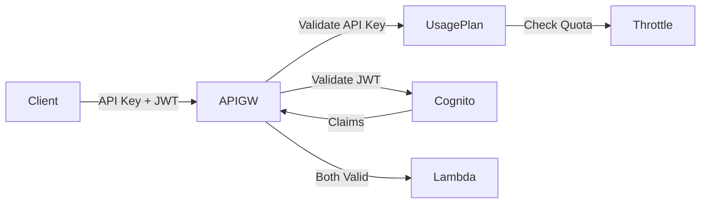

**API Gateway Method Configuration**:

```hcl
resource "aws_api_gateway_method" "generation_post" {
  rest_api_id   = aws_api_gateway_rest_api.generation_api.id
  resource_id   = aws_api_gateway_resource.generation.id
  http_method   = "POST"
  authorization = "COGNITO_USER_POOLS"
  authorizer_id = aws_api_gateway_authorizer.cognito.id

  # Require API Key for rate limiting
  api_key_required = true

  request_parameters = {
    "method.request.header.X-Tenant-Id" = true
  }
}
```

**Lambda Validation**:

```python
def validate_dual_auth(event: dict) -> tuple[str, str]:
    """Validate both API Key (via usage plan) and JWT claims"""

    # API Key already validated by API Gateway (usage plan enforced)
    api_key_id = event['requestContext'].get('identity', {}).get('apiKeyId')

    # JWT claims from Cognito authorizer
    claims = event['requestContext']['authorizer']['claims']
    jwt_tenant_id = claims['custom:tenant_id']

    # X-Tenant-Id header (must match JWT claim)
    header_tenant_id = event['headers'].get('X-Tenant-Id')

    if header_tenant_id != jwt_tenant_id:
        raise TenantForbiddenException("Tenant ID mismatch")

    return jwt_tenant_id, api_key_id
```

#### 11.7.5 Tenant Routing with Lambda Custom Logic

```python
from dataclasses import dataclass
from enum import Enum

class TenantTier(Enum):
    FREE = "free"
    STANDARD = "standard"
    PROFESSIONAL = "professional"
    ENTERPRISE = "enterprise"

@dataclass
class TenantContext:
    tenant_id: str
    tier: TenantTier
    org_id: str
    features: list[str]
    limits: dict

class TenantRouter:
    """Route requests based on tenant context"""

    def __init__(self, dynamodb_client):
        self.dynamodb = dynamodb_client
        self._cache = {}  # In-memory cache for tenant configs

    def get_tenant_context(self, tenant_id: str) -> TenantContext:
        """Load tenant configuration from DynamoDB"""
        if tenant_id in self._cache:
            return self._cache[tenant_id]

        response = self.dynamodb.get_item(
            TableName='bbws-{env}-generation',
            Key={'PK': f'TENANT#{tenant_id}', 'SK': 'CONFIG'}
        )

        item = response.get('Item', {})
        context = TenantContext(
            tenant_id=tenant_id,
            tier=TenantTier(item.get('tier', 'free')),
            org_id=item.get('org_id'),
            features=item.get('features', []),
            limits=item.get('limits', {})
        )

        self._cache[tenant_id] = context
        return context

    def route_to_model(self, context: TenantContext, request_type: str) -> str:
        """Select AI model based on tenant tier"""
        model_mapping = {
            TenantTier.FREE: {
                'generation': 'anthropic.claude-haiku',  # Cost optimization
                'image': None  # Disabled for free tier
            },
            TenantTier.STANDARD: {
                'generation': 'anthropic.claude-sonnet-4-5-20251101',
                'image': 'stability.stable-diffusion-xl-v1'
            },
            TenantTier.PROFESSIONAL: {
                'generation': 'anthropic.claude-sonnet-4-5-20251101',
                'image': 'stability.stable-diffusion-xl-v1'
            },
            TenantTier.ENTERPRISE: {
                'generation': 'anthropic.claude-sonnet-4-5-20251101',
                'image': 'stability.stable-diffusion-xl-v1'
            }
        }

        return model_mapping[context.tier].get(request_type)

    def check_feature_enabled(self, context: TenantContext, feature: str) -> bool:
        """Check if feature is enabled for tenant"""
        tier_features = {
            TenantTier.FREE: ['basic_generation'],
            TenantTier.STANDARD: ['basic_generation', 'logo', 'themes'],
            TenantTier.PROFESSIONAL: ['basic_generation', 'logo', 'themes', 'blog', 'newsletter'],
            TenantTier.ENTERPRISE: ['*']  # All features
        }

        allowed = tier_features[context.tier]
        return '*' in allowed or feature in allowed
```

**Request Handler with Tenant Routing**:

```python
router = TenantRouter(dynamodb_client)

def lambda_handler(event, context):
    # 1. Validate authentication
    tenant_id, api_key_id = validate_dual_auth(event)

    # 2. Load tenant context
    tenant_context = router.get_tenant_context(tenant_id)

    # 3. Check feature access
    if not router.check_feature_enabled(tenant_context, 'logo'):
        raise FeatureDisabledException("Logo generation not available for your plan")

    # 4. Route to appropriate model
    model_id = router.route_to_model(tenant_context, 'image')
    if not model_id:
        raise FeatureDisabledException("Image generation not available for your plan")

    # 5. Execute with tenant context
    return execute_generation(tenant_context, model_id, event['body'])
```

---

## 12. Error Handling

### 12.1 Exception Hierarchy

```python
class GenerationAPIException(Exception):
    """Base exception for Generation API"""
    def __init__(self, message: str, error_code: str, status_code: int):
        self.message = message
        self.error_code = error_code
        self.status_code = status_code
        super().__init__(self.message)

class BusinessException(GenerationAPIException):
    """Expected business errors (4xx) - User can fix"""
    pass

class UnexpectedException(GenerationAPIException):
    """System/technical errors (5xx) - Retry or escalate"""
    pass
```

### 12.2 Business Exceptions (4xx)

| Exception | Code | Status | Message | Resolution |
|-----------|------|--------|---------|------------|
| `InvalidPromptException` | `INVALID_PROMPT` | 400 | Prompt too short/invalid | User provides better prompt |
| `MissingBrandException` | `MISSING_BRAND` | 400 | Brand not configured | User sets up brand |
| `InvalidAgentTypeException` | `INVALID_AGENT_TYPE` | 400 | Agent type not supported | User chooses valid agent |
| `SiteNotFoundException` | `SITE_NOT_FOUND` | 404 | Site not found | User provides valid site_id |
| `TenantForbiddenException` | `TENANT_FORBIDDEN` | 403 | Tenant access denied | User accesses own resources |
| `RateLimitException` | `RATE_LIMIT_EXCEEDED` | 429 | Too many requests | User waits and retries |
| `NoAutoFixesException` | `NO_AUTO_FIXES` | 400 | No auto-fixable issues | User makes manual fixes |

### 12.3 Unexpected Exceptions (5xx)

| Exception | Code | Status | Message | Resolution |
|-----------|------|--------|---------|------------|
| `BedrockTimeoutException` | `MODEL_TIMEOUT` | 504 | Generation timed out | Auto-retry with backoff |
| `BedrockThrottledException` | `MODEL_OVERLOADED` | 503 | High demand | Queue and retry |
| `BedrockContentFilteredException` | `CONTENT_FILTERED` | 500 | Content filtered | Adjust prompt, regenerate |
| `S3UploadException` | `UPLOAD_FAILED` | 500 | Failed to save | Retry upload |
| `DynamoDBException` | `DATABASE_ERROR` | 500 | Database error | Retry with backoff |
| `ValidationException` | `VALIDATION_ERROR` | 500 | Validation failed | Alert and manual review |

### 12.4 Dead Letter Queue Configuration

```hcl
resource "aws_sqs_queue" "generation_dlq" {
  name                      = "bbws-${var.environment}-generation-dlq"
  message_retention_seconds = 1209600  # 14 days
}

resource "aws_sqs_queue" "generation_queue" {
  name                       = "bbws-${var.environment}-generation-queue"
  visibility_timeout_seconds = 120

  redrive_policy = jsonencode({
    deadLetterTargetArn = aws_sqs_queue.generation_dlq.arn
    maxReceiveCount     = 3
  })
}
```

### 12.5 Retry Strategy

```python
from aws_lambda_powertools.utilities.batch import (
    BatchProcessor,
    ExponentialBackoff
)

retry_config = {
    "max_attempts": 3,
    "base_delay": 1,  # seconds
    "max_delay": 10,  # seconds
    "exponential_base": 2,
    "jitter": True
}

def invoke_bedrock_with_retry(prompt: str, max_retries: int = 3):
    """Invoke Bedrock with exponential backoff retry"""
    for attempt in range(max_retries):
        try:
            return bedrock_client.invoke_model(...)
        except botocore.exceptions.ClientError as e:
            if e.response['Error']['Code'] == 'ThrottlingException':
                delay = min(retry_config['max_delay'],
                           retry_config['base_delay'] * (2 ** attempt))
                time.sleep(delay + random.uniform(0, 1))
            else:
                raise
    raise BedrockTimeoutException("Max retries exceeded")
```

---

## 13. Monitoring (CloudWatch)

### 13.1 Custom Metrics

```python
from aws_lambda_powertools import Metrics
from aws_lambda_powertools.metrics import MetricUnit

metrics = Metrics(namespace="BBWS/Generation")

# Generation metrics
metrics.add_metric(
    name="GenerationDuration",
    unit=MetricUnit.Seconds,
    value=generation_time
)

metrics.add_metric(
    name="TokenUsage",
    unit=MetricUnit.Count,
    value=tokens_used
)

metrics.add_metric(
    name="BrandScore",
    unit=MetricUnit.None,
    value=brand_score
)

# Error metrics
metrics.add_metric(
    name="GenerationErrors",
    unit=MetricUnit.Count,
    value=1,
    dimensions={"ErrorType": error_code}
)
```

### 13.2 CloudWatch Alarms

```hcl
# Failed generations alarm
resource "aws_cloudwatch_metric_alarm" "generation_errors" {
  alarm_name          = "bbws-${var.environment}-generation-errors"
  comparison_operator = "GreaterThanThreshold"
  evaluation_periods  = 2
  metric_name         = "GenerationErrors"
  namespace           = "BBWS/Generation"
  period              = 300
  statistic           = "Sum"
  threshold           = 10
  alarm_description   = "High number of generation failures"
  alarm_actions       = [aws_sns_topic.alerts.arn]
}

# Stuck transactions alarm
resource "aws_cloudwatch_metric_alarm" "stuck_sessions" {
  alarm_name          = "bbws-${var.environment}-stuck-sessions"
  comparison_operator = "GreaterThanThreshold"
  evaluation_periods  = 3
  metric_name         = "StuckSessions"
  namespace           = "BBWS/Generation"
  period              = 300
  statistic           = "Sum"
  threshold           = 5
  alarm_description   = "Sessions stuck in GENERATING state"
  alarm_actions       = [aws_sns_topic.alerts.arn]
}

# Bedrock latency alarm
resource "aws_cloudwatch_metric_alarm" "bedrock_latency" {
  alarm_name          = "bbws-${var.environment}-bedrock-latency"
  comparison_operator = "GreaterThanThreshold"
  evaluation_periods  = 2
  metric_name         = "GenerationDuration"
  namespace           = "BBWS/Generation"
  period              = 300
  extended_statistic  = "p95"
  threshold           = 20
  alarm_description   = "High generation latency (p95 > 20s)"
  alarm_actions       = [aws_sns_topic.alerts.arn]
}
```

### 13.3 SNS Notifications

```hcl
resource "aws_sns_topic" "alerts" {
  name = "bbws-${var.environment}-generation-alerts"
}

resource "aws_sns_topic_subscription" "email" {
  topic_arn = aws_sns_topic.alerts.arn
  protocol  = "email"
  endpoint  = var.alert_email  # Parameterized
}
```

### 13.4 CloudWatch Dashboard

```json
{
  "widgets": [
    {
      "type": "metric",
      "properties": {
        "title": "Generation Success Rate",
        "metrics": [
          ["BBWS/Generation", "GenerationSuccess", {"stat": "Sum"}],
          ["BBWS/Generation", "GenerationErrors", {"stat": "Sum"}]
        ],
        "period": 300
      }
    },
    {
      "type": "metric",
      "properties": {
        "title": "Generation Duration (p50, p95)",
        "metrics": [
          ["BBWS/Generation", "GenerationDuration", {"stat": "p50"}],
          ["BBWS/Generation", "GenerationDuration", {"stat": "p95"}]
        ],
        "period": 300
      }
    },
    {
      "type": "metric",
      "properties": {
        "title": "Token Usage",
        "metrics": [
          ["BBWS/Generation", "TokenUsage", {"stat": "Sum"}]
        ],
        "period": 3600
      }
    },
    {
      "type": "metric",
      "properties": {
        "title": "Brand Scores Distribution",
        "metrics": [
          ["BBWS/Generation", "BrandScore", {"stat": "Average"}]
        ],
        "period": 300
      }
    },
    {
      "type": "metric",
      "properties": {
        "title": "DLQ Depth",
        "metrics": [
          ["AWS/SQS", "ApproximateNumberOfMessagesVisible",
           "QueueName", "bbws-${var.environment}-generation-dlq"]
        ],
        "period": 60
      }
    }
  ]
}
```

### 13.5 X-Ray Tracing

```python
from aws_xray_sdk.core import xray_recorder, patch_all

# Patch all supported libraries
patch_all()

@xray_recorder.capture("generate_page")
def generate_page(request: GenerationRequest):
    # Add custom annotations
    xray_recorder.put_annotation("tenant_id", request.tenant_id)
    xray_recorder.put_annotation("template", request.template_id or "none")

    # Add metadata
    xray_recorder.put_metadata("prompt_length", len(request.prompt))

    # Processing...
```

---

## 14. Risks and Mitigations

### 14.1 Technical Risks

| Risk ID | Risk | Likelihood | Impact | Mitigation |
|---------|------|------------|--------|------------|
| R-001 | Bedrock rate limiting during peak usage | Medium | High | Implement request queuing, exponential backoff, cross-region fallback |
| R-002 | SDXL content filter false positives | Medium | Medium | Prompt engineering, automatic retry with adjusted prompts |
| R-003 | Generation timeout for complex pages | Low | Medium | Progressive generation, timeout warnings, partial result caching |
| R-004 | S3/DynamoDB throttling | Low | Medium | On-demand capacity, retry logic, circuit breaker |
| R-005 | Agent persona S3 unavailability | Low | High | In-memory caching (5 min TTL), cross-region replication |

### 14.2 Security Risks

| Risk ID | Risk | Likelihood | Impact | Mitigation |
|---------|------|------------|--------|------------|
| R-006 | Prompt injection attacks | Medium | High | Input sanitization, system prompt protection, Bedrock Guardrails |
| R-007 | Tenant data leakage | Low | Critical | JWT tenant validation on every request, data isolation |
| R-008 | Generated content XSS | Low | Medium | Output sanitization, CSP headers, sandbox preview |

### 14.3 Operational Risks

| Risk ID | Risk | Likelihood | Impact | Mitigation |
|---------|------|------------|--------|------------|
| R-009 | Cost overrun from high usage | Medium | Medium | Budget alerts, token limits, usage quotas |
| R-010 | DR failover not tested | Low | Critical | Quarterly DR drills, automated failover testing |

---

## 15. Troubleshooting Playbook

### 15.1 Generation Stuck in GENERATING State

**Symptoms**: Session remains in GENERATING for > 60 seconds

**Investigation Steps**:
1. Check CloudWatch Logs for Lambda execution
2. Verify Bedrock response in X-Ray trace
3. Check DynamoDB session record

**Resolution**:
```python
# Force expire stuck session
dynamodb.update_item(
    TableName='bbws-{env}-generation',
    Key={'PK': f'TENANT#{tenant_id}', 'SK': f'SESSION#{session_id}'},
    UpdateExpression='SET #status = :failed, error_message = :msg',
    ExpressionAttributeNames={'#status': 'status'},
    ExpressionAttributeValues={
        ':failed': 'FAILED',
        ':msg': 'Session expired due to timeout'
    }
)
```

### 15.2 High Error Rate on Logo Generation

**Symptoms**: > 10% failure rate on `/agents/logo`

**Investigation Steps**:
1. Check SDXL content filter rejections in logs
2. Review prompt patterns causing failures
3. Check S3 upload success rate

**Resolution**:
- Adjust negative prompts to reduce filter triggers
- Implement prompt rewriting for rejected requests
- Scale S3 upload concurrency

### 15.3 Brand Score Consistently Low

**Symptoms**: Most pages scoring < 8.0

**Investigation Steps**:
1. Review common validation failures
2. Check brand configuration completeness
3. Analyze agent persona effectiveness

**Resolution**:
- Update agent personas with better brand adherence rules
- Add pre-generation brand validation
- Implement auto-fix before final scoring

### 15.4 Transaction Tracing

**Trace ID Format**: `gen-{tenant_id}-{session_id}-{timestamp}`

**CloudWatch Insights Query**:
```
fields @timestamp, @message
| filter @message like /gen-TENANT_ID/
| sort @timestamp desc
| limit 100
```

---

## 16. References

### 16.1 Internal Documentation

- [Parent HLD: BBWS AI-Powered Site Builder](../HLDs/3.0_BBSW_Site_Builder_HLD.md)
- [Frontend LLD: Site Builder UI](./3.1.1_LLD_Site_Builder_Frontend.md)
- [Page Generator Agent](../../0_playpen/3_site_builder_agents/agents/Page_Generator_Agent.md)
- [Logo Creator Agent](../../0_playpen/3_site_builder_agents/agents/Logo_Creator_Agent.md)
- [Theme Designer Agent](../../0_playpen/3_site_builder_agents/agents/Theme_Designer_Agent.md)
- [Brand Validator Agent](../../0_playpen/3_site_builder_agents/agents/Brand_Validator_Agent.md)

**Deployment Infrastructure**:
- [Tenant Provisioner (WordPress ECS)](../../2_bbws_tenant_provisioner/) - Python CLI for WordPress tenant provisioning
- [ECS Terraform Infrastructure](../../2_bbws_ecs_terraform/) - Terraform for ECS, ALB, RDS, EFS, CloudFront

### 16.2 AWS Documentation

- [Amazon Bedrock Developer Guide](https://docs.aws.amazon.com/bedrock/)
- [Anthropic Claude on Bedrock](https://docs.aws.amazon.com/bedrock/latest/userguide/model-parameters-anthropic.html)
- [Stable Diffusion on Bedrock](https://docs.aws.amazon.com/bedrock/latest/userguide/model-parameters-stability.html)
- [Lambda Powertools for Python](https://docs.powertools.aws.dev/lambda/python/latest/)

### 16.3 Design Patterns

- [Enterprise Integration Patterns](https://www.enterpriseintegrationpatterns.com/)
- [AWS Well-Architected Framework](https://aws.amazon.com/architecture/well-architected/)

---

## 17. Architecture Decision Records (ADRs)

This section documents key architectural decisions made during the design of the Site Builder Generation API.

### ADR-001: SSE Streaming for Page Generation

**Status**: Accepted

**Context**:
Page generation using Claude Sonnet 4.5 can take 15-60 seconds. Users need real-time feedback during generation to understand progress and see content as it's created.

**Decision Drivers**:
- Frontend LLD (Section 11.2) specifies SSE for streaming
- Users expect < 2s Time to First Token (TTFT)
- Need to display generation progress incrementally

**Options Considered**:

| Option | Pros | Cons |
|--------|------|------|
| **A: WebSocket** | Bi-directional, persistent connection | Complex connection management, requires separate WebSocket API Gateway |
| **B: SSE via Lambda Response Streaming** | Native Lambda support, simpler implementation, HTTP/2 compatible | Unidirectional only, requires Lambda response streaming feature |
| **C: Polling** | Simple implementation | High latency, poor UX, wasteful API calls |

**Decision**: **Option B - SSE via Lambda Response Streaming**

**Rationale**:
- AWS Lambda supports response streaming natively (since 2023)
- Simpler than WebSocket (no connection state management)
- Frontend already designed for SSE consumption
- Achieves TTFT < 2s requirement
- Lower infrastructure complexity and cost

**Consequences**:
- Must use Lambda function URL or API Gateway with response streaming
- Client reconnection logic required for network interruptions
- Maximum response duration limited by Lambda timeout (15 minutes max)

---

### ADR-002: Separate Lambda per Agent

**Status**: Accepted

**Context**:
The Site Builder uses 7+ AI agents (Page Generator, Logo Creator, Background Creator, Theme Selector, Layout Agent, Blog Writer, Brand Validator). Each agent has different AI models, processing requirements, and scaling patterns.

**Decision Drivers**:
- Independent scaling requirements per agent type
- Failure isolation between agents
- Different memory/timeout requirements per agent
- Independent deployment and versioning

**Options Considered**:

| Option | Pros | Cons |
|--------|------|------|
| **A: Monolithic Lambda with routing** | Single deployment, shared code | Coupled failures, over-provisioned memory, complex routing |
| **B: Separate Lambda per agent** | Independent scaling, isolated failures, right-sized resources | More Lambda functions to manage, code duplication |
| **C: Container-based (ECS/Fargate)** | Full control, long-running tasks | Higher cost, slower cold starts, more infrastructure |

**Decision**: **Option B - Separate Lambda per Agent**

**Rationale**:
- Logo/Background (SDXL) need more memory (1024MB+) than text agents (512MB)
- Page generation failures shouldn't affect logo generation
- Each agent can be deployed independently
- Clear cost attribution per agent type
- Aligns with microservices architecture

**Consequences**:
- 7+ Lambda functions to deploy and maintain
- Shared code packaged as Lambda Layer
- Need consistent error handling across all agents
- API Gateway routes to appropriate Lambda

---

### ADR-003: DynamoDB On-Demand Capacity

**Status**: Accepted (Mandatory per CLAUDE.md)

**Context**:
The Generation API needs to store generation sessions, agent configurations, brand assets, and validation results. Traffic patterns are unpredictable based on user activity.

**Decision Drivers**:
- CLAUDE.md requirement: "DynamoDB table capacity mode must always be on-demand"
- Unpredictable traffic patterns
- Cost optimization for variable workloads
- No capacity planning overhead

**Options Considered**:

| Option | Pros | Cons |
|--------|------|------|
| **A: Provisioned Capacity** | Lower cost at steady state, predictable pricing | Requires capacity planning, throttling risk |
| **B: On-Demand Capacity** | Auto-scaling, no throttling, pay-per-request | Higher per-request cost, no reserved capacity discount |

**Decision**: **Option B - On-Demand Capacity** (Mandatory)

**Rationale**:
- Required by CLAUDE.md project constraints
- Site Builder has variable traffic (bursts during business hours)
- No need for capacity planning or monitoring
- Automatic scaling handles traffic spikes
- Supports multi-region DR with Global Tables

**Consequences**:
- Higher per-request cost compared to provisioned at scale
- No capacity-related throttling
- Simplified operations and monitoring
- Easy cross-region replication

---

### ADR-004: Private S3 with Pre-Signed URLs

**Status**: Accepted (Mandatory per CLAUDE.md)

**Context**:
Generated images (logos, backgrounds) and other assets need to be stored and served to users. These assets must be accessible to authorized users only.

**Decision Drivers**:
- CLAUDE.md requirement: "all S3 buckets must never have public access"
- Security best practices
- Tenant data isolation
- Content delivery requirements

**Options Considered**:

| Option | Pros | Cons |
|--------|------|------|
| **A: Public S3 bucket** | Simple URL sharing, easy CDN integration | Security risk, no access control, violates CLAUDE.md |
| **B: Private S3 with pre-signed URLs** | Time-limited access, secure, tenant-isolated | URL expiration management, slightly more complex |
| **C: Private S3 with CloudFront OAC** | CDN performance, secure origin access | More infrastructure, CloudFront costs |

**Decision**: **Option B + C - Private S3 with Pre-Signed URLs and CloudFront OAC**

**Rationale**:
- Mandatory: All public access blocked per CLAUDE.md
- Pre-signed URLs provide time-limited access (15 minutes default)
- CloudFront OAC for CDN distribution without public bucket
- Tenant isolation via S3 key prefixes
- Audit trail via S3 access logs

**Consequences**:
- URL expiration requires refresh for long sessions
- CloudFront distribution required for CDN benefits
- Pre-signed URL generation adds minor latency
- More secure than public bucket approach

---

### ADR-005: Hybrid Brand Scoring (Rule-Based + AI)

**Status**: Accepted

**Context**:
Generated pages must meet brand compliance standards with a minimum score of 8.0/10.0. Brand compliance includes both objective elements (colors, fonts) and subjective elements (tone, messaging).

**Decision Drivers**:
- 8/10 minimum threshold requirement from HLD
- Mix of objective and subjective brand elements
- Consistent and explainable scoring
- Auto-fix capability for common issues

**Options Considered**:

| Option | Pros | Cons |
|--------|------|------|
| **A: Rule-based scoring only** | Fast, deterministic, explainable | Cannot evaluate subjective elements (tone, voice) |
| **B: AI-only scoring** | Comprehensive evaluation, handles subjective | Slower, less deterministic, harder to explain |
| **C: Hybrid approach** | Best of both, comprehensive coverage | More complex implementation |

**Decision**: **Option C - Hybrid Approach**

**Rationale**:
- Rule-based checks for objective elements:
  - Primary color usage (exact match)
  - Font family compliance
  - Logo placement
  - Required sections present
- AI-powered checks for subjective elements:
  - Brand voice and tone
  - Messaging alignment
  - Visual consistency
  - Overall brand impression

**Scoring Formula**:
```
total_score = (rule_score × 0.6) + (ai_score × 0.4)
```

**Consequences**:
- Two-phase validation (rules then AI)
- Explainable deductions from rule-based checks
- AI provides qualitative feedback
- Auto-fix applies to rule-based failures first

---

### ADR-006: Cognito First Principles (No Amplify)

**Status**: Accepted (Mandatory per project requirements)

**Context**:
The Site Builder requires authentication and authorization. AWS provides multiple approaches including Amplify libraries and direct Cognito SDK usage.

**Decision Drivers**:
- Project requirement to avoid Amplify
- Control over authentication flow
- Consistent with existing BBWS services
- Multi-tenant support requirements

**Options Considered**:

| Option | Pros | Cons |
|--------|------|------|
| **A: AWS Amplify** | Quick setup, managed UI components | Abstraction overhead, less control, banned by project |
| **B: Cognito SDK directly** | Full control, consistent with backend | More implementation effort |
| **C: Custom auth system** | Complete control | Security risk, maintenance burden |

**Decision**: **Option B - Cognito SDK Directly**

**Rationale**:
- Project explicitly prohibits Amplify
- Direct SDK provides full control over auth flows
- Consistent with backend Lambda authentication
- Supports custom auth UI requirements
- Better error handling and customization

**Consequences**:
- More code to implement auth flows
- Must handle token refresh manually
- Better alignment with backend services
- Full control over UX

---

### ADR Summary Table

| ADR | Decision | Status | CLAUDE.md Compliance |
|-----|----------|--------|----------------------|
| ADR-001 | SSE Streaming | Accepted | N/A |
| ADR-002 | Separate Lambda per Agent | Accepted | Microservices |
| ADR-003 | DynamoDB On-Demand | Accepted | Mandatory |
| ADR-004 | Private S3 + Pre-Signed URLs | Accepted | Mandatory |
| ADR-005 | Hybrid Brand Scoring | Accepted | N/A |
| ADR-006 | Cognito First Principles | Accepted | No Amplify |

---

## Appendix A: Definition of Terms

| Term | Definition |
|------|------------|
| Agent | AI persona loaded from S3 with specific capabilities |
| Skill | Supplementary knowledge loaded with agents |
| SSE | Server-Sent Events for streaming responses |
| SDXL | Stable Diffusion XL image generation model |
| Brand Score | 0-10 compliance rating against brand guidelines |
| Auto-Fix | Programmatically correctable validation issues |
| Session | Stateful generation tracking entity |
| DLQ | Dead Letter Queue for failed messages |

---

## Appendix B: Signoff

| Signatory | Role | Feedback | Status |
|-----------|------|----------|--------|
| | Security | | Pending |
| | Risk | | Pending |
| | Product Owner | | Pending |
| | Enterprise Architecture | | Pending |

---

**Document generated by LLD Architect Agent**
**Last Updated**: 2026-01-15
