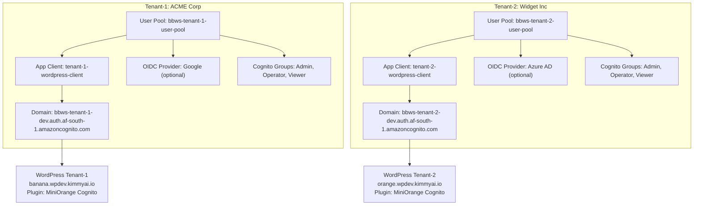
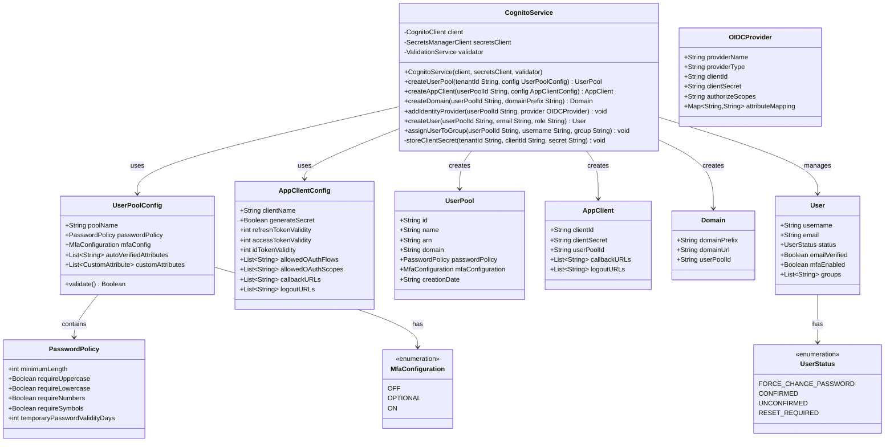
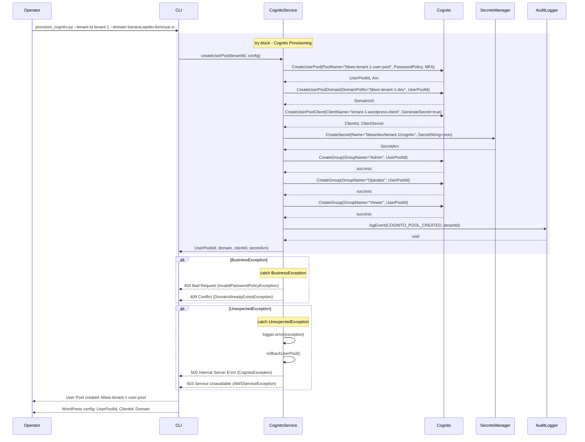
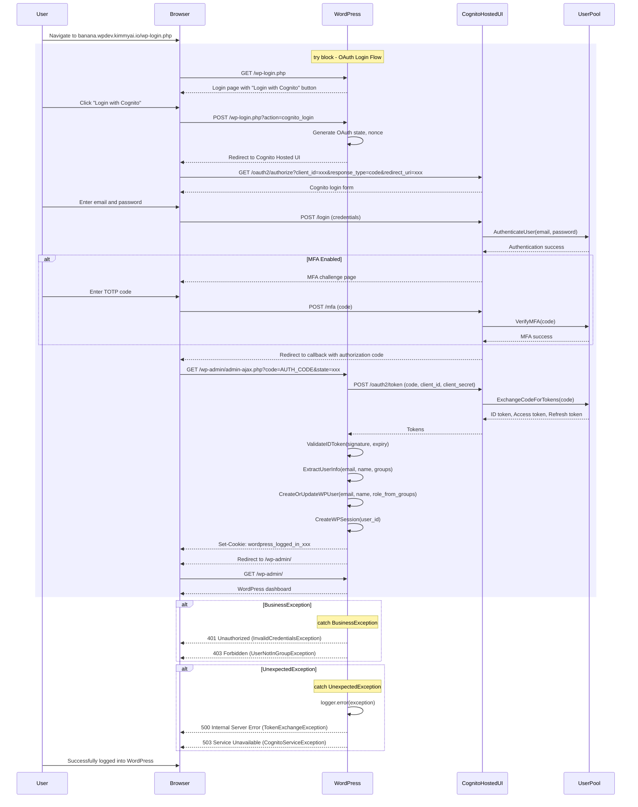

# Cognito Tenant Pools - Low-Level Design

**Version**: 1.0
**Author**: Agentic Architect
**Date**: 2025-12-13
**Status**: Draft for Review
**Parent HLD**: [BBWS ECS WordPress HLD](../BBWS_ECS_WordPress_HLD.md)

---

## Document History

| Version | Date | Changes | Owner |
|---------|------|---------|-------|
| 1.0 | 2025-12-13 | Initial LLD for per-tenant Cognito User Pools with WordPress integration | Agentic Architect |

---

## 1. Introduction

### 1.1 Purpose

This LLD provides implementation details for per-tenant AWS Cognito User Pools integrated with WordPress via OAuth plugins.

### 1.2 Parent HLD Reference

Based on [Cognito Multi-Tenant Investigation](../investigation/poc/docs/cognito_multi_tenant_investigation.md) and User Stories US-005 through US-010 from the [BBWS ECS WordPress HLD](../BBWS_ECS_WordPress_HLD.md).

### 1.3 Component Overview

Cognito Tenant Pools provide:
- Dedicated User Pool per tenant for complete isolation
- Username/password authentication
- Optional OIDC federation (Google, Azure AD)
- Group-based RBAC (Admin, Operator, Viewer)
- WordPress integration via MiniOrange plugin
- MFA support (TOTP)

### 1.4 Technology Stack

| Layer | Technology | Purpose |
|-------|------------|---------|
| Identity Provider | AWS Cognito User Pool | User authentication |
| WordPress Plugin | MiniOrange AWS Cognito Login | OAuth integration |
| OIDC Providers | Google, Azure AD (optional) | Federated login |
| Automation | Python + Boto3 | User Pool provisioning |
| Secrets | AWS Secrets Manager | App Client credentials |

### 1.5 Architecture Decision

**Per-Tenant User Pool** (not shared pool with groups)

| Aspect | Shared Pool | Dedicated Pool (Chosen) |
|--------|-------------|------------------------|
| Isolation | Logical (groups) | Physical (separate pools) |
| Security | Medium | High |
| Tenant Autonomy | Limited | Full |
| Compliance | Shared data plane | Complete separation |

---

## 2. High Level Epic Overview

| User Story ID | User Story | Test Scenario(s) |
|---------------|------------|------------------|
| US-005 | As a DevOps Engineer, I want to configure Cognito User Pool so that platform users can authenticate securely | GIVEN tenant-id WHEN provision_cognito.py executes THEN User Pool created AND App Client configured AND Domain registered |
| US-006 | As an Admin, I want to invite users to the platform so that team members can access tenant management | GIVEN User Pool WHEN invite_user.py executes THEN user created with temp password AND invitation email sent |
| US-007 | As a User, I want to register via invitation so that I can access the platform | GIVEN invitation link WHEN user completes registration THEN password set AND email verified |
| US-008 | As a User, I want to login with MFA so that my account is secure | GIVEN WordPress login page WHEN click "Login with Cognito" THEN redirect to Cognito Hosted UI AND MFA challenge AND login to WordPress |
| US-009 | As a User, I want to reset my password so that I can recover account access | GIVEN forgot password link WHEN user enters email THEN verification code sent AND password reset |
| US-010 | As an Admin, I want to assign roles to users so that access is controlled | GIVEN user-id WHEN assign role THEN Cognito group membership updated |

---

## 3. Component Diagram

### 3.1 Per-Tenant Cognito Architecture



### 3.2 Class Diagram



---

## 4. Cognito Configuration Details

### 4.1 User Pool Settings

```json
{
  "PoolName": "bbws-tenant-1-user-pool",
  "Policies": {
    "PasswordPolicy": {
      "MinimumLength": 8,
      "RequireLowercase": true,
      "RequireUppercase": true,
      "RequireNumbers": true,
      "RequireSymbols": true,
      "TemporaryPasswordValidityDays": 7
    }
  },
  "AutoVerifiedAttributes": ["email"],
  "UsernameAttributes": ["email"],
  "MfaConfiguration": "OPTIONAL",
  "Schema": [
    {
      "Name": "email",
      "AttributeDataType": "String",
      "Required": true,
      "Mutable": true
    },
    {
      "Name": "name",
      "AttributeDataType": "String",
      "Required": false,
      "Mutable": true
    },
    {
      "Name": "tenant_id",
      "AttributeDataType": "String",
      "Required": false,
      "Mutable": false,
      "DeveloperOnlyAttribute": false
    }
  ],
  "AccountRecoverySetting": {
    "RecoveryMechanisms": [
      {
        "Priority": 1,
        "Name": "verified_email"
      }
    ]
  }
}
```

### 4.2 App Client Settings

```json
{
  "ClientName": "tenant-1-wordpress-client",
  "UserPoolId": "af-south-1_XXXXXXXXX",
  "GenerateSecret": true,
  "RefreshTokenValidity": 30,
  "AccessTokenValidity": 1,
  "IdTokenValidity": 1,
  "TokenValidityUnits": {
    "AccessToken": "hours",
    "IdToken": "hours",
    "RefreshToken": "days"
  },
  "ExplicitAuthFlows": [
    "ALLOW_USER_PASSWORD_AUTH",
    "ALLOW_USER_SRP_AUTH",
    "ALLOW_REFRESH_TOKEN_AUTH"
  ],
  "AllowedOAuthFlows": ["code"],
  "AllowedOAuthFlowsUserPoolClient": true,
  "AllowedOAuthScopes": ["openid", "email", "profile"],
  "CallbackURLs": [
    "https://banana.wpdev.kimmyai.io/wp-login.php",
    "https://banana.wpdev.kimmyai.io/wp-admin/admin-ajax.php"
  ],
  "LogoutURLs": [
    "https://banana.wpdev.kimmyai.io/",
    "https://banana.wpdev.kimmyai.io/wp-login.php?loggedout=true"
  ],
  "SupportedIdentityProviders": ["COGNITO"],
  "PreventUserExistenceErrors": "ENABLED"
}
```

### 4.3 Cognito Groups (RBAC)

| Group Name | Description | Permissions |
|------------|-------------|-------------|
| Admin | Full administrative access | Create/delete users, manage WordPress plugins, modify content |
| Operator | Operational access | Manage content, view users, update plugins |
| Viewer | Read-only access | View content, view analytics |

### 4.4 OAuth 2.0 Endpoints

| Endpoint | URL Pattern |
|----------|-------------|
| Authorization | `https://{domain-prefix}.auth.{region}.amazoncognito.com/oauth2/authorize` |
| Token | `https://{domain-prefix}.auth.{region}.amazoncognito.com/oauth2/token` |
| UserInfo | `https://{domain-prefix}.auth.{region}.amazoncognito.com/oauth2/userInfo` |
| Logout | `https://{domain-prefix}.auth.{region}.amazoncognito.com/logout` |
| JWKS | `https://cognito-idp.{region}.amazonaws.com/{user-pool-id}/.well-known/jwks.json` |

**Example for tenant-1:**
```
Authorization: https://bbws-tenant-1-dev.auth.af-south-1.amazoncognito.com/oauth2/authorize
Token:         https://bbws-tenant-1-dev.auth.af-south-1.amazoncognito.com/oauth2/token
UserInfo:      https://bbws-tenant-1-dev.auth.af-south-1.amazoncognito.com/oauth2/userInfo
```

---

## 5. Sequence Diagram

### 5.1 Provision Cognito User Pool Sequence



### 5.2 WordPress Login with Cognito Sequence



---

## 6. WordPress Plugin Configuration

### 6.1 MiniOrange Plugin Settings

**Plugin Name**: AWS Cognito Login
**WordPress.org URL**: https://wordpress.org/plugins/login-with-cognito/

**Configuration Steps**:
1. Install plugin via WordPress admin
2. Navigate to Settings → miniOrange AWS Cognito
3. Configure OAuth settings:

```
User Pool ID:          af-south-1_XXXXXXXXX
App Client ID:         xxxxxxxxxxxxxxxxxxxxxxxxxx
App Client Secret:     [From Secrets Manager: bbws/dev/tenant-1/cognito]
Region:                af-south-1
Domain:                bbws-tenant-1-dev

Authorization URL:     https://bbws-tenant-1-dev.auth.af-south-1.amazoncognito.com/oauth2/authorize
Token URL:             https://bbws-tenant-1-dev.auth.af-south-1.amazoncognito.com/oauth2/token
UserInfo URL:          https://bbws-tenant-1-dev.auth.af-south-1.amazoncognito.com/oauth2/userInfo

Callback URL:          https://banana.wpdev.kimmyai.io/wp-admin/admin-ajax.php
Logout URL:            https://banana.wpdev.kimmyai.io/
```

### 6.2 Attribute Mapping

| Cognito Attribute | WordPress Field | Mapping |
|-------------------|-----------------|---------|
| email | user_email | Direct |
| name | display_name | Direct |
| cognito:groups | wp_role | Admin → administrator, Operator → editor, Viewer → subscriber |
| custom:tenant_id | user_meta | Stored in wp_usermeta |

---

## 7. Non-Functional Requirements

### 7.1 Performance

| Metric | Target | Measurement |
|--------|--------|-------------|
| User Pool creation time | < 30 seconds | CLI execution time |
| Login redirect latency | < 1 second | User experience |
| Token exchange time | < 500ms | OAuth flow duration |
| MFA verification time | < 200ms | TOTP validation |

### 7.2 Security

| Aspect | Implementation |
|--------|----------------|
| Password Policy | Min 8 chars, uppercase, lowercase, numbers, symbols |
| MFA | Optional TOTP (recommended for Admin/Operator) |
| Token Expiry | Access: 1 hour, ID: 1 hour, Refresh: 30 days |
| Client Secret | Stored in Secrets Manager, never exposed to browser |

### 7.3 Cost

| Component | Users | Monthly Cost | Notes |
|-----------|-------|--------------|-------|
| Cognito User Pool | < 50,000 MAU | $0 | Free tier |
| Secrets Manager | 1 secret/tenant | ~$0.40/tenant | App client secret |
| **Total per tenant** | | **~$0.40/month** | Scales with MAU after free tier |

---

## 8. Troubleshooting Playbook

### 8.1 User Cannot Login

**Symptom**: Login redirect fails or loops

**Diagnosis**:
```bash
# Check User Pool status
aws cognito-idp describe-user-pool \
  --user-pool-id af-south-1_XXXXXXXXX \
  --profile Tebogo-dev

# Check callback URL configured
aws cognito-idp describe-user-pool-client \
  --user-pool-id af-south-1_XXXXXXXXX \
  --client-id xxxxxxxxx \
  --profile Tebogo-dev
```

**Resolution**:
- Verify callback URL in App Client matches WordPress URL
- Check App Client has `code` OAuth flow enabled
- Ensure WordPress plugin has correct Client ID/Secret

### 8.2 Token Exchange Fails

**Symptom**: Error after Cognito redirect

**Diagnosis**:
- Check WordPress error logs for OAuth errors
- Verify Client Secret matches Secrets Manager value
- Test token endpoint with curl

**Resolution**:
- Rotate Client Secret if compromised
- Update WordPress plugin with new secret
- Verify token endpoint URL format

---

## 9. References

| Ref ID | Document | Type |
|--------|----------|------|
| REF-COG-001 | [BBWS ECS WordPress HLD](../BBWS_ECS_WordPress_HLD.md) | Parent HLD |
| REF-COG-002 | [Cognito Multi-Tenant Investigation](../investigation/poc/docs/cognito_multi_tenant_investigation.md) | Investigation |
| REF-COG-003 | [Cognito User Pools Developer Guide](https://docs.aws.amazon.com/cognito/latest/developerguide/cognito-user-identity-pools.html) | AWS Documentation |
| REF-COG-004 | [OAuth 2.0 Specification](https://oauth.net/2/) | Standard |

---

**END OF DOCUMENT**
