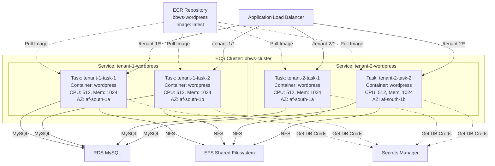
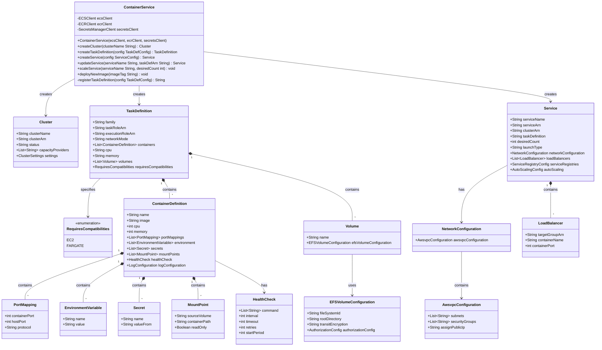
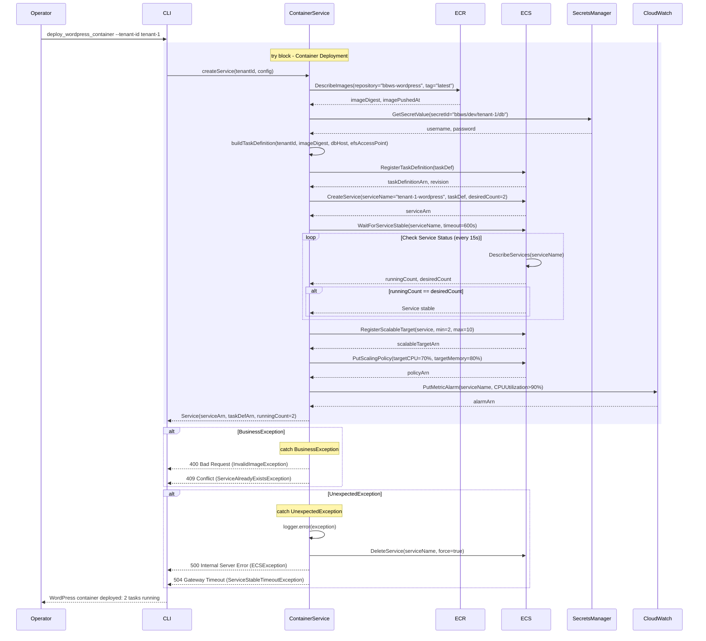

# Container Management - Low-Level Design

**Version**: 1.0
**Author**: Agentic Architect
**Date**: 2025-12-13
**Status**: Draft for Review
**Parent HLD**: [BBWS ECS WordPress HLD](../BBWS_ECS_WordPress_HLD.md)

---

## Document History

| Version | Date | Changes | Owner |
|---------|------|---------|-------|
| 1.0 | 2025-12-13 | Initial LLD for ECS Fargate container management | Agentic Architect |

---

## 1. Introduction

### 1.1 Purpose

This LLD provides implementation details for ECS Fargate cluster management, task definitions, container services, and ECR image registry for multi-tenant WordPress hosting.

### 1.2 Parent HLD Reference

Based on Section 4.3 (Layer 3: Compute) and User Stories US-002, US-012, US-013, US-025, US-026 from the [BBWS ECS WordPress HLD](../BBWS_ECS_WordPress_HLD.md).

### 1.3 Component Overview

Container Management provides:
- Shared ECS Fargate cluster for all tenants
- Per-tenant ECS services with auto-scaling
- WordPress task definitions with environment variables
- ECR repository for WordPress base images
- Service discovery integration
- Container health checks and monitoring

### 1.4 Technology Stack

| Layer | Technology | Purpose |
|-------|------------|---------|
| Container Orchestration | AWS ECS Fargate | Serverless container hosting |
| Container Registry | Amazon ECR | WordPress image storage |
| Base Image | wordpress:latest | Official WordPress image |
| Task CPU | 512 (.5 vCPU) | Per-tenant task resources |
| Task Memory | 1024 MB (1 GB) | Per-tenant task resources |

---

## 2. High Level Epic Overview

| User Story ID | User Story | Test Scenario(s) |
|---------------|------------|------------------|
| US-002 | As a DevOps Engineer, I want to deploy a shared ECS Fargate cluster so that I can host multiple tenant containers | GIVEN AWS account WHEN terraform apply executes THEN ECS cluster created AND capacity provider configured |
| US-012 | As a Platform Operator, I want to provision WordPress for tenant so ECS service is deployed | GIVEN tenant-id WHEN provision executes THEN task definition created AND ECS service deployed AND 2 tasks running |
| US-025 | As a Platform Operator, I want to update WordPress core so sites have latest security patches | GIVEN new WordPress image WHEN update executes THEN ECR image pushed AND task definition updated AND rolling deployment starts |

---

## 3. Component Diagram

### 3.1 ECS Cluster Architecture



### 3.2 Class Diagram



---

## 4. Container Configuration Details

### 4.1 ECS Cluster Configuration

```json
{
  "clusterName": "bbws-cluster",
  "capacityProviders": ["FARGATE", "FARGATE_SPOT"],
  "defaultCapacityProviderStrategy": [
    {
      "capacityProvider": "FARGATE",
      "weight": 1,
      "base": 2
    },
    {
      "capacityProvider": "FARGATE_SPOT",
      "weight": 4,
      "base": 0
    }
  ],
  "settings": [
    {
      "name": "containerInsights",
      "value": "enabled"
    }
  ],
  "tags": [
    {"key": "bbws:component", "value": "ecs"},
    {"key": "bbws:environment", "value": "dev"}
  ]
}
```

### 4.2 Task Definition (Per-Tenant)

```json
{
  "family": "tenant-1-wordpress",
  "networkMode": "awsvpc",
  "requiresCompatibilities": ["FARGATE"],
  "cpu": "512",
  "memory": "1024",
  "taskRoleArn": "arn:aws:iam::536580886816:role/ecsTaskRole",
  "executionRoleArn": "arn:aws:iam::536580886816:role/ecsTaskExecutionRole",
  "containerDefinitions": [
    {
      "name": "wordpress",
      "image": "536580886816.dkr.ecr.af-south-1.amazonaws.com/bbws-wordpress:latest",
      "cpu": 512,
      "memory": 1024,
      "essential": true,
      "portMappings": [
        {
          "containerPort": 80,
          "hostPort": 80,
          "protocol": "tcp"
        }
      ],
      "environment": [
        {"name": "WORDPRESS_DB_HOST", "value": "bbws-db.cluster-xxx.af-south-1.rds.amazonaws.com"},
        {"name": "WORDPRESS_DB_NAME", "value": "tenant_1_db"},
        {"name": "WORDPRESS_TABLE_PREFIX", "value": "wp_"},
        {"name": "WORDPRESS_CONFIG_EXTRA", "value": "define('WP_HOME', 'https://banana.wpdev.kimmyai.io');\ndefine('WP_SITEURL', 'https://banana.wpdev.kimmyai.io');"}
      ],
      "secrets": [
        {
          "name": "WORDPRESS_DB_USER",
          "valueFrom": "arn:aws:secretsmanager:af-south-1:536580886816:secret:bbws/dev/tenant-1/db:username::"
        },
        {
          "name": "WORDPRESS_DB_PASSWORD",
          "valueFrom": "arn:aws:secretsmanager:af-south-1:536580886816:secret:bbws/dev/tenant-1/db:password::"
        }
      ],
      "mountPoints": [
        {
          "sourceVolume": "wp-content",
          "containerPath": "/var/www/html/wp-content",
          "readOnly": false
        }
      ],
      "healthCheck": {
        "command": ["CMD-SHELL", "curl -f http://localhost/ || exit 1"],
        "interval": 30,
        "timeout": 5,
        "retries": 3,
        "startPeriod": 60
      },
      "logConfiguration": {
        "logDriver": "awslogs",
        "options": {
          "awslogs-group": "/ecs/bbws-cluster",
          "awslogs-region": "af-south-1",
          "awslogs-stream-prefix": "tenant-1"
        }
      }
    }
  ],
  "volumes": [
    {
      "name": "wp-content",
      "efsVolumeConfiguration": {
        "fileSystemId": "fs-0123456789abcdef",
        "rootDirectory": "/",
        "transitEncryption": "ENABLED",
        "authorizationConfig": {
          "accessPointId": "fsap-tenant1-xxx",
          "iam": "ENABLED"
        }
      }
    }
  ],
  "tags": [
    {"key": "bbws:tenant-id", "value": "tenant-1"},
    {"key": "bbws:environment", "value": "dev"}
  ]
}
```

### 4.3 ECS Service Configuration

```json
{
  "serviceName": "tenant-1-wordpress",
  "cluster": "bbws-cluster",
  "taskDefinition": "tenant-1-wordpress:1",
  "desiredCount": 2,
  "launchType": "FARGATE",
  "platformVersion": "1.4.0",
  "networkConfiguration": {
    "awsvpcConfiguration": {
      "subnets": [
        "subnet-private-a-xxx",
        "subnet-private-b-xxx"
      ],
      "securityGroups": ["sg-ecs-xxx"],
      "assignPublicIp": "DISABLED"
    }
  },
  "loadBalancers": [
    {
      "targetGroupArn": "arn:aws:elasticloadbalancing:af-south-1:536580886816:targetgroup/tenant-1-tg/xxx",
      "containerName": "wordpress",
      "containerPort": 80
    }
  ],
  "healthCheckGracePeriodSeconds": 60,
  "deploymentConfiguration": {
    "maximumPercent": 200,
    "minimumHealthyPercent": 100,
    "deploymentCircuitBreaker": {
      "enable": true,
      "rollback": true
    }
  },
  "tags": [
    {"key": "bbws:tenant-id", "value": "tenant-1"},
    {"key": "bbws:environment", "value": "dev"}
  ]
}
```

### 4.4 Auto-Scaling Configuration

```json
{
  "ServiceNamespace": "ecs",
  "ResourceId": "service/bbws-cluster/tenant-1-wordpress",
  "ScalableDimension": "ecs:service:DesiredCount",
  "MinCapacity": 2,
  "MaxCapacity": 10,
  "TargetTrackingScalingPolicies": [
    {
      "PolicyName": "tenant-1-cpu-scaling",
      "TargetTrackingScalingPolicyConfiguration": {
        "PredefinedMetricSpecification": {
          "PredefinedMetricType": "ECSServiceAverageCPUUtilization"
        },
        "TargetValue": 70.0,
        "ScaleInCooldown": 300,
        "ScaleOutCooldown": 60
      }
    },
    {
      "PolicyName": "tenant-1-memory-scaling",
      "TargetTrackingScalingPolicyConfiguration": {
        "PredefinedMetricSpecification": {
          "PredefinedMetricType": "ECSServiceAverageMemoryUtilization"
        },
        "TargetValue": 80.0,
        "ScaleInCooldown": 300,
        "ScaleOutCooldown": 60
      }
    }
  ]
}
```

---

## 5. Sequence Diagram

### 5.1 Deploy WordPress Container Sequence



---

## 6. Non-Functional Requirements

### 6.1 Performance

| Metric | Target | Measurement |
|--------|--------|-------------|
| Container startup time | < 60 seconds | ECS task launch duration |
| Image pull time | < 30 seconds | ECR image download |
| Health check interval | 30 seconds | Container health status |
| Service stabilization | < 5 minutes | ECS service deployment |

### 6.2 Scalability

| Aspect | Configuration | Strategy |
|--------|---------------|----------|
| Min tasks per tenant | 2 | High availability across 2 AZs |
| Max tasks per tenant | 10 | Auto-scaling based on CPU/Memory |
| Cluster capacity | 100 tasks | Support 10 tenants × 10 tasks |
| Scale-out trigger | CPU > 70% or Memory > 80% | CloudWatch alarms |
| Scale-in cooldown | 300 seconds | Prevent flapping |

### 6.3 Cost

| Component | Monthly Cost (per tenant) | Notes |
|-----------|---------------------------|-------|
| Fargate vCPU | ~$14.77 | 0.5 vCPU × 2 tasks × $0.04856/hour × 730 hours |
| Fargate Memory | ~$3.25 | 1 GB × 2 tasks × $0.00532/GB-hour × 730 hours |
| ECR Storage | ~$0.50 | 5 GB shared across tenants |
| CloudWatch Logs | ~$2 | Log ingestion and storage |
| **Total Container Cost** | **~$21/tenant/month** | Base 2 tasks, scales with load |

---

## 7. Troubleshooting Playbook

### 7.1 Container Won't Start

**Symptom**: ECS tasks stuck in PENDING or immediately fail

**Diagnosis**:
```bash
# Check service events
aws ecs describe-services \
  --cluster bbws-cluster \
  --services tenant-1-wordpress \
  --profile Tebogo-dev

# Check task stopped reason
aws ecs describe-tasks \
  --cluster bbws-cluster \
  --tasks <task-id> \
  --profile Tebogo-dev

# Check CloudWatch logs
aws logs tail /ecs/bbws-cluster --follow --profile Tebogo-dev
```

**Resolution**:
- Image pull error: Verify ECR repository permissions
- Secret not found: Check Secrets Manager ARN
- Health check failing: Increase startPeriod to 120s
- EFS mount error: Verify EFS access point and IAM permissions

### 7.2 High CPU/Memory Usage

**Symptom**: Tasks consuming > 90% CPU or memory

**Diagnosis**:
```bash
# Check CloudWatch metrics
aws cloudwatch get-metric-statistics \
  --namespace AWS/ECS \
  --metric-name CPUUtilization \
  --dimensions Name=ServiceName,Value=tenant-1-wordpress \
  --start-time 2025-12-13T00:00:00Z \
  --end-time 2025-12-13T23:59:59Z \
  --period 300 \
  --statistics Average \
  --profile Tebogo-dev
```

**Resolution**:
- Increase task CPU/memory allocation
- Enable auto-scaling if not already enabled
- Optimize WordPress plugins and themes
- Enable PHP OpCache in container

---

## 8. References

| Ref ID | Document | Type |
|--------|----------|------|
| REF-CON-001 | [BBWS ECS WordPress HLD](../BBWS_ECS_WordPress_HLD.md) | Parent HLD |
| REF-CON-002 | [ECS Fargate User Guide](https://docs.aws.amazon.com/AmazonECS/latest/userguide/what-is-fargate.html) | AWS Documentation |
| REF-CON-003 | [ECR User Guide](https://docs.aws.amazon.com/AmazonECR/latest/userguide/) | AWS Documentation |

---

**END OF DOCUMENT**
