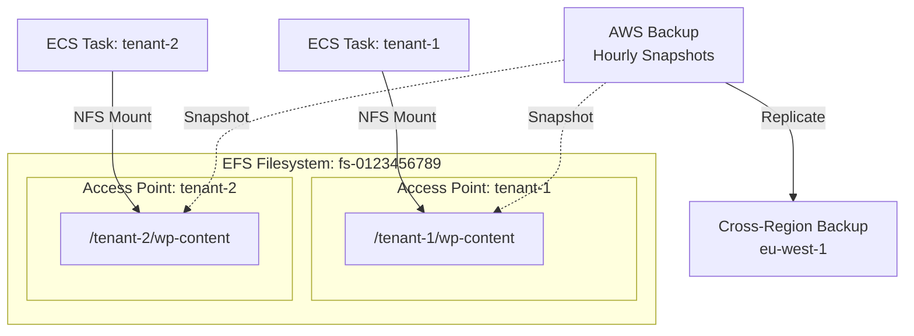
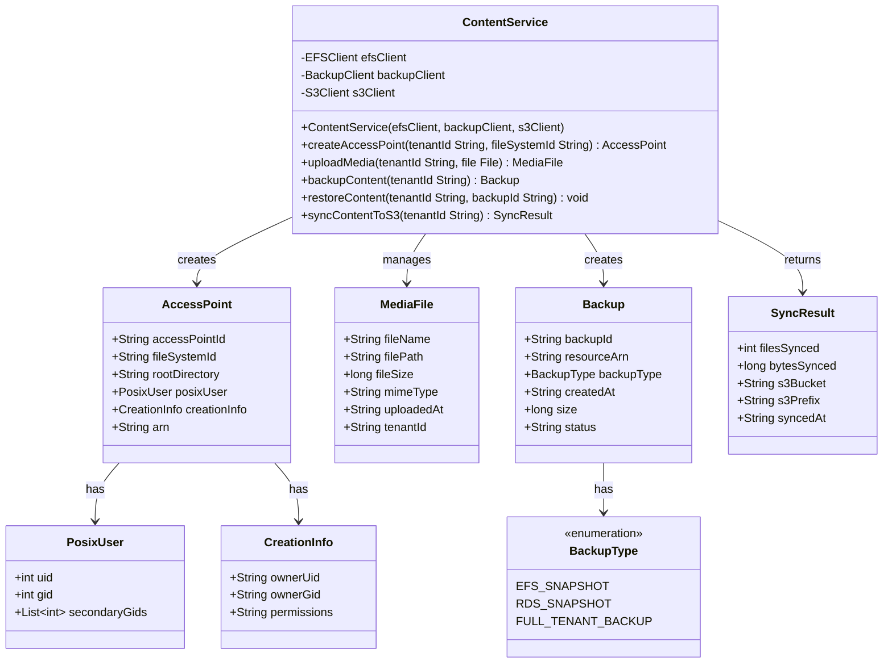
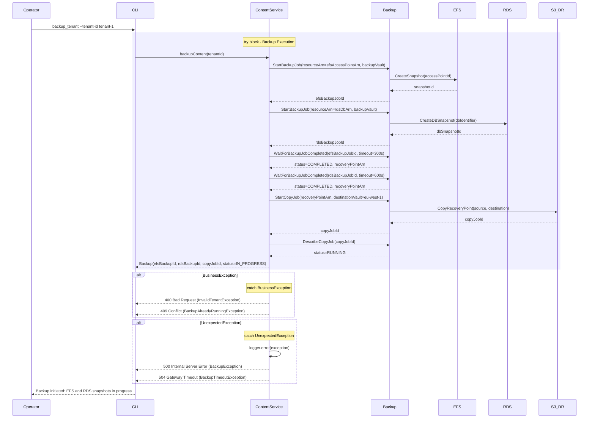
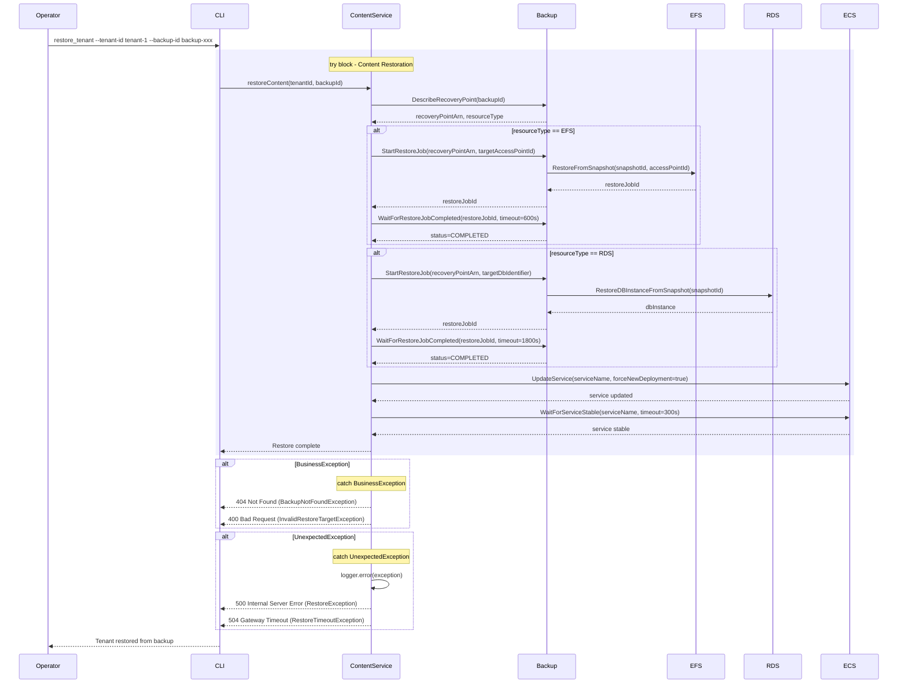

# Content Management - Low-Level Design

**Version**: 1.0
**Author**: Agentic Architect
**Date**: 2025-12-13
**Status**: Draft for Review
**Parent HLD**: [BBWS ECS WordPress HLD](../BBWS_ECS_WordPress_HLD.md)

---

## Document History

| Version | Date | Changes | Owner |
|---------|------|---------|-------|
| 1.0 | 2025-12-13 | Initial LLD for EFS content management and backup strategies | Agentic Architect |

---

## 1. Introduction

### 1.1 Purpose

This LLD provides implementation details for EFS access points, wp-content management, media uploads, backup strategies, and cross-region replication.

### 1.2 Parent HLD Reference

Based on Section 4 Component List and User Stories US-004, US-018, US-019 from the [BBWS ECS WordPress HLD](../BBWS_ECS_WordPress_HLD.md).

### 1.3 Component Overview

Content Management provides:
- Per-tenant EFS access points for filesystem isolation
- wp-content directory management (themes, plugins, uploads)
- Media upload handling and optimization
- EFS backup automation (hourly snapshots)
- Cross-region backup replication to eu-west-1
- RDS snapshot coordination
- Backup restoration procedures

### 1.4 Technology Stack

| Layer | Technology | Purpose |
|-------|------------|---------|
| Storage | Amazon EFS | Persistent file storage |
| Isolation | EFS Access Points | Per-tenant directory isolation |
| Backup | AWS Backup | Automated EFS and RDS backups |
| Replication | Cross-Region Backup Replication | Disaster recovery |
| Throughput Mode | Elastic Throughput | Auto-scaling performance |

---

## 2. High Level Epic Overview

| User Story ID | User Story | Test Scenario(s) |
|---------------|------------|------------------|
| US-004 | As a DevOps Engineer, I want to set up shared EFS filesystem | GIVEN AWS account WHEN provision EFS THEN filesystem created AND mount targets in 2 AZs AND encryption enabled |
| US-018 | As a Platform Operator, I want to execute tenant backups | GIVEN tenant-id WHEN backup executes THEN EFS snapshot created AND RDS snapshot created AND replicated to eu-west-1 |
| US-019 | As a Platform Operator, I want to restore tenant from backup | GIVEN backup-id WHEN restore executes THEN EFS restored to access point AND RDS restored to new instance AND service restarted |

---

## 3. Component Diagram

### 3.1 EFS Architecture



### 3.2 Class Diagram



---

## 4. Configuration Details

### 4.1 EFS Filesystem Configuration

```json
{
  "CreationToken": "bbws-dev-efs-2025-12-13",
  "PerformanceMode": "generalPurpose",
  "ThroughputMode": "elastic",
  "Encrypted": true,
  "KmsKeyId": "arn:aws:kms:af-south-1:536580886816:key/xxx",
  "LifecyclePolicies": [
    {
      "TransitionToIA": "AFTER_30_DAYS"
    },
    {
      "TransitionToPrimaryStorageClass": "AFTER_1_ACCESS"
    }
  ],
  "Tags": [
    {"Key": "bbws:component", "Value": "efs"},
    {"Key": "bbws:environment", "Value": "dev"}
  ]
}
```

### 4.2 EFS Access Point (Per-Tenant)

```json
{
  "FileSystemId": "fs-0123456789abcdef",
  "PosixUser": {
    "Uid": 33,
    "Gid": 33
  },
  "RootDirectory": {
    "Path": "/tenant-1",
    "CreationInfo": {
      "OwnerUid": 33,
      "OwnerGid": 33,
      "Permissions": "0755"
    }
  },
  "Tags": [
    {"Key": "bbws:tenant-id", "Value": "tenant-1"},
    {"Key": "bbws:component", "Value": "efs"},
    {"Key": "bbws:environment", "Value": "dev"}
  ]
}
```

### 4.3 AWS Backup Plan

```json
{
  "BackupPlanName": "bbws-dev-hourly-backup",
  "Rules": [
    {
      "RuleName": "hourly-efs-backup",
      "TargetBackupVaultName": "bbws-dev-backup-vault",
      "ScheduleExpression": "cron(0 * * * ? *)",
      "StartWindowMinutes": 60,
      "CompletionWindowMinutes": 120,
      "Lifecycle": {
        "DeleteAfterDays": 7,
        "MoveToColdStorageAfterDays": 1
      },
      "RecoveryPointTags": {
        "bbws:backup-type": "automated",
        "bbws:component": "efs"
      },
      "CopyActions": [
        {
          "DestinationBackupVaultArn": "arn:aws:backup:eu-west-1:536580886816:backup-vault:bbws-dr-vault",
          "Lifecycle": {
            "DeleteAfterDays": 30
          }
        }
      ]
    },
    {
      "RuleName": "hourly-rds-backup",
      "TargetBackupVaultName": "bbws-dev-backup-vault",
      "ScheduleExpression": "cron(0 * * * ? *)",
      "StartWindowMinutes": 60,
      "CompletionWindowMinutes": 120,
      "Lifecycle": {
        "DeleteAfterDays": 7
      },
      "CopyActions": [
        {
          "DestinationBackupVaultArn": "arn:aws:backup:eu-west-1:536580886816:backup-vault:bbws-dr-vault",
          "Lifecycle": {
            "DeleteAfterDays": 30
          }
        }
      ]
    }
  ],
  "BackupPlanTags": {
    "bbws:environment": "dev",
    "bbws:managed-by": "terraform"
  }
}
```

### 4.4 EFS Mount Configuration (ECS Task)

```json
{
  "volumes": [
    {
      "name": "wp-content",
      "efsVolumeConfiguration": {
        "fileSystemId": "fs-0123456789abcdef",
        "rootDirectory": "/",
        "transitEncryption": "ENABLED",
        "transitEncryptionPort": 2999,
        "authorizationConfig": {
          "accessPointId": "fsap-tenant1-xxx",
          "iam": "ENABLED"
        }
      }
    }
  ],
  "containerDefinitions": [
    {
      "name": "wordpress",
      "mountPoints": [
        {
          "sourceVolume": "wp-content",
          "containerPath": "/var/www/html/wp-content",
          "readOnly": false
        }
      ]
    }
  ]
}
```

---

## 5. Sequence Diagram

### 5.1 Backup Execution Sequence



### 5.2 Restore Content Sequence



---

## 6. Non-Functional Requirements

### 6.1 Performance

| Metric | Target | Measurement |
|--------|--------|-------------|
| EFS throughput | 100 MB/s (bursting) | CloudWatch EFS metrics |
| Backup creation time | < 10 minutes (EFS), < 15 minutes (RDS) | AWS Backup job duration |
| Restore time (RTO) | < 4 hours | Manual testing |
| Data loss tolerance (RPO) | < 1 hour | Hourly backup schedule |

### 6.2 Availability

| Aspect | Target | Implementation |
|--------|--------|----------------|
| EFS availability | 99.99% | Multi-AZ mount targets |
| Backup success rate | 100% | AWS Backup SLA + monitoring |
| Cross-region replication | Daily | AWS Backup copy actions |

### 6.3 Cost (Per Tenant)

| Component | Monthly Cost | Notes |
|-----------|--------------|-------|
| EFS Storage (10 GB) | ~$3 | $0.30/GB-month |
| EFS Infrequent Access (after 30 days) | ~$0.16 | $0.016/GB-month |
| Backup Storage (7 days × 10 GB) | ~$0.50 | $0.05/GB-month |
| Cross-region replication | ~$1 | Data transfer + storage |
| **Total Content Management** | **~$5/tenant/month** | Scales with content size |

---

## 7. Troubleshooting Playbook

### 7.1 EFS Mount Failing

**Symptom**: ECS tasks fail to start with EFS mount error

**Diagnosis**:
```bash
# Check EFS status
aws efs describe-file-systems \
  --file-system-id fs-0123456789abcdef \
  --profile Tebogo-dev

# Check access point
aws efs describe-access-points \
  --access-point-id fsap-tenant1-xxx \
  --profile Tebogo-dev

# Check mount targets
aws efs describe-mount-targets \
  --file-system-id fs-0123456789abcdef \
  --profile Tebogo-dev
```

**Resolution**:
- Verify mount targets exist in all subnets
- Check ECS task IAM role has `elasticfilesystem:ClientMount` permission
- Ensure security group allows NFS (port 2049) from ECS tasks
- Verify access point root directory exists

### 7.2 Backup Job Failing

**Symptom**: AWS Backup jobs in FAILED state

**Diagnosis**:
```bash
# Check backup job status
aws backup describe-backup-job \
  --backup-job-id xxx \
  --profile Tebogo-dev

# Check backup vault
aws backup describe-backup-vault \
  --backup-vault-name bbws-dev-backup-vault \
  --profile Tebogo-dev
```

**Resolution**:
- Verify backup service IAM role has permissions
- Check resource tags match backup plan selection
- Ensure backup window allows enough time
- Review CloudWatch Logs for backup service

---

## 8. References

| Ref ID | Document | Type |
|--------|----------|------|
| REF-CONT-001 | [BBWS ECS WordPress HLD](../BBWS_ECS_WordPress_HLD.md) | Parent HLD |
| REF-CONT-002 | [EFS User Guide](https://docs.aws.amazon.com/efs/latest/ug/) | AWS Documentation |
| REF-CONT-003 | [AWS Backup Developer Guide](https://docs.aws.amazon.com/aws-backup/latest/devguide/) | AWS Documentation |

---

**END OF DOCUMENT**
