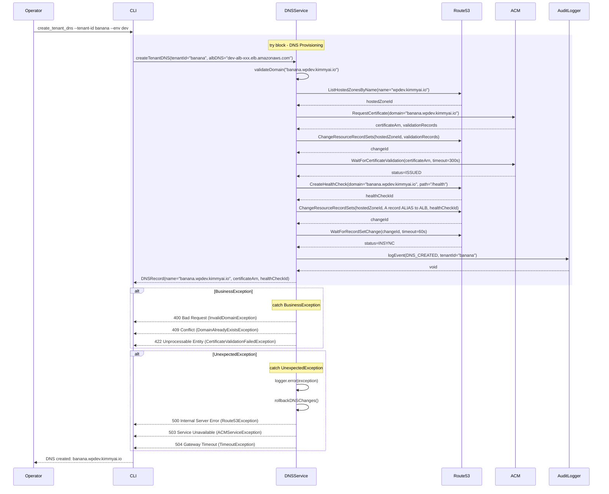

# DNS Management - Low-Level Design

**Version**: 1.0
**Author**: Agentic Architect
**Date**: 2025-12-13
**Status**: Draft for Review
**Parent HLD**: [BBWS ECS WordPress HLD](../BBWS_ECS_WordPress_HLD.md)

---

## Document History

| Version | Date | Changes | Owner |
|---------|------|---------|-------|
| 1.0 | 2025-12-13 | Initial LLD for DNS management across multi-account environments | Agentic Architect |

---

## 1. Introduction

### 1.1 Purpose

This LLD provides implementation details for DNS management across three AWS accounts (DEV, SIT, PROD) with delegation from production to lower environments.

### 1.2 Parent HLD Reference

This LLD details DNS components from Section 4.2 (Layer 2: Edge/Network) and User Stories US-015, US-027, US-028 of the [BBWS ECS WordPress HLD](../BBWS_ECS_WordPress_HLD.md).

### 1.3 Component Overview

DNS Management provides:
- Multi-account DNS architecture with delegation
- Per-tenant subdomain creation and management
- Health check-based failover routing
- SSL certificate management via ACM
- Disaster recovery DNS repointing

### 1.4 Technology Stack

| Layer | Technology | Purpose |
|-------|------------|---------|
| DNS Service | Amazon Route 53 | DNS hosting and routing |
| SSL Certificates | AWS Certificate Manager (ACM) | SSL/TLS certificates |
| Health Checks | Route 53 Health Checks | Endpoint monitoring |
| Infrastructure | Terraform | DNS record provisioning |

### 1.5 DNS Domain Structure

| Account | Hosted Zone | Domain Pattern | Example |
|---------|-------------|----------------|---------|
| PROD | kimmyai.io | wp.kimmyai.io | wp.kimmyai.io |
| DEV | wpdev.kimmyai.io | {tenant}.wpdev.kimmyai.io | banana.wpdev.kimmyai.io |
| SIT | wpsit.kimmyai.io | {tenant}.wpsit.kimmyai.io | banana.wpsit.kimmyai.io |

---

## 2. High Level Epic Overview

| User Story ID | User Story | Test Scenario(s) |
|---------------|------------|------------------|
| US-015 | As a Platform Operator, I want to configure DNS for a tenant so that their site is accessible via domain | GIVEN tenant-id "banana" WHEN I provision DNS THEN Route53 record created for banana.wpdev.kimmyai.io AND health check configured AND SSL certificate issued |
| US-027 | As a Platform Operator, I want to execute DR failover so that service continues during regional outage | GIVEN primary region failure WHEN I execute failover THEN DNS points to eu-west-1 ALB AND health checks validate DR endpoint |
| US-028 | As a Platform Operator, I want to failback to primary region so that normal operations resume | GIVEN DR active WHEN primary region recovered THEN DNS repoints to af-south-1 ALB AND health checks validate primary endpoint |

---

## 3. Component Diagram (DNS Architecture)

### 3.1 Multi-Account DNS Delegation


### 3.2 Class Diagram


---

## 4. DNS Configuration Details

### 4.1 Hosted Zone Setup

#### PROD Account Hosted Zone

```
Domain: kimmyai.io
Zone ID: Z1234567890ABC
Name Servers:
  - ns-1234.awsdns-12.org
  - ns-5678.awsdns-34.com
  - ns-9012.awsdns-56.net
  - ns-3456.awsdns-78.co.uk
```

**Records:**
```
wp.kimmyai.io         A   ALIAS   prod-alb-123456789.af-south-1.elb.amazonaws.com
wpdev.kimmyai.io      NS  ns-dev1.awsdns-12.org, ns-dev2.awsdns-34.com
wpsit.kimmyai.io      NS  ns-sit1.awsdns-56.org, ns-sit2.awsdns-78.com
```

#### DEV Account Hosted Zone

```
Domain: wpdev.kimmyai.io
Zone ID: Z2345678901BCD
Delegation: From PROD kimmyai.io
```

**Records:**
```
banana.wpdev.kimmyai.io    A   ALIAS   dev-alb-987654321.af-south-1.elb.amazonaws.com
orange.wpdev.kimmyai.io    A   ALIAS   dev-alb-987654321.af-south-1.elb.amazonaws.com
```

#### SIT Account Hosted Zone

```
Domain: wpsit.kimmyai.io
Zone ID: Z3456789012CDE
Delegation: From PROD kimmyai.io
```

**Records:**
```
banana.wpsit.kimmyai.io    A   ALIAS   sit-alb-111222333.af-south-1.elb.amazonaws.com
orange.wpsit.kimmyai.io    A   ALIAS   sit-alb-111222333.af-south-1.elb.amazonaws.com
```

### 4.2 Health Check Configuration

```json
{
  "Type": "HTTPS",
  "ResourcePath": "/health",
  "FullyQualifiedDomainName": "banana.wpdev.kimmyai.io",
  "Port": 443,
  "RequestInterval": 30,
  "FailureThreshold": 3,
  "MeasureLatency": true,
  "EnableSNI": true,
  "Regions": ["af-south-1", "eu-west-1", "us-east-1"]
}
```

### 4.3 ACM Certificate Request

```json
{
  "DomainName": "*.wpdev.kimmyai.io",
  "SubjectAlternativeNames": [
    "wpdev.kimmyai.io",
    "*.wpdev.kimmyai.io"
  ],
  "ValidationMethod": "DNS",
  "Tags": [
    {"Key": "bbws:environment", "Value": "dev"},
    {"Key": "bbws:component", "Value": "dns"}
  ]
}
```

---

## 5. Domain Lifecycle Scenarios

This section clarifies the customer journey from development through production, including multi-tenant organizations.

### 5.1 Scenario Overview

| Phase | Domain Pattern | Example | wp-admin Access |
|-------|---------------|---------|-----------------|
| Development | {tenant}.wpdev.kimmyai.io | banana.wpdev.kimmyai.io | banana.wpdev.kimmyai.io/wp-admin |
| Go Live | {custom-domain}.{tld} | banana.co.za | banana.co.za/wp-admin |
| Multi-Tenant Org | Multiple custom domains | banana.co.za, orange.co.za | {domain}/wp-admin per site |

### 5.2 Scenario 1: Single Tenant Development to Go-Live

**Customer Journey**: Customer purchases banana.co.za and wants a WordPress site.

#### Phase 1: Development Assignment

```
Customer Request: "I want a WordPress site for banana.co.za"
↓
System Assigns: banana.wpdev.kimmyai.io (DEV environment)
↓
Customer Access:
  - Site: https://banana.wpdev.kimmyai.io
  - Admin: https://banana.wpdev.kimmyai.io/wp-admin
```

**DNS Records Created (DEV Account)**:
```
banana.wpdev.kimmyai.io    A   ALIAS   dev-alb-xxx.af-south-1.elb.amazonaws.com
```

**ACM Certificate (DEV)**:
```
Domain: banana.wpdev.kimmyai.io
SAN: *.wpdev.kimmyai.io (wildcard covers all tenants)
```

#### Phase 2: Site Development & Testing

During development, the customer:
- Accesses `https://banana.wpdev.kimmyai.io/wp-admin` to build content
- Tests site functionality at `https://banana.wpdev.kimmyai.io`
- Site is NOT publicly accessible on banana.co.za yet

#### Phase 3: Go Live (Custom Domain Activation)

When the site is ready for production:

```
Trigger: Customer approves go-live
↓
DNS Changes Required:
1. Customer updates their registrar (e.g., Domains.co.za, GoDaddy)
   - banana.co.za → CNAME to wp.kimmyai.io OR
   - banana.co.za → A record to PROD ALB IP
2. PROD hosted zone gets new record:
   - banana.co.za    A   ALIAS   prod-alb-xxx.af-south-1.elb.amazonaws.com
3. ACM issues certificate for banana.co.za
↓
Post Go-Live Access:
  - Site: https://banana.co.za
  - Admin: https://banana.co.za/wp-admin
```

**PROD Account DNS Records After Go-Live**:
```
kimmyai.io zone:
  wp.kimmyai.io              A   ALIAS   prod-alb-xxx.af-south-1.elb.amazonaws.com
  wpdev.kimmyai.io           NS  [DEV name servers]
  wpsit.kimmyai.io           NS  [SIT name servers]

banana.co.za zone (new hosted zone):
  banana.co.za               A   ALIAS   prod-alb-xxx.af-south-1.elb.amazonaws.com
  www.banana.co.za           A   ALIAS   prod-alb-xxx.af-south-1.elb.amazonaws.com
```

**ACM Certificate (PROD)**:
```
Domain: banana.co.za
SAN: www.banana.co.za, banana.co.za
ValidationMethod: DNS (customer adds CNAME to their registrar)
```

### 5.3 Scenario 2: Single Tenant Becomes Multi-Tenant Organization

**Customer Journey**: Same customer (banana.co.za) now purchases orange.co.za.

#### Before: Single Tenant

```
Customer: Big Beard Web Solutions
├── Site: banana.co.za
└── Admin: banana.co.za/wp-admin
```

#### After: Multi-Tenant Organization

```
Organization: Big Beard Web Solutions
├── Tenant 1: banana.co.za
│   ├── Site: https://banana.co.za
│   └── Admin: https://banana.co.za/wp-admin
│
└── Tenant 2: orange.co.za
    ├── Development: https://orange.wpdev.kimmyai.io
    ├── Dev Admin: https://orange.wpdev.kimmyai.io/wp-admin
    └── (After Go-Live)
        ├── Site: https://orange.co.za
        └── Admin: https://orange.co.za/wp-admin
```

#### Organization Data Model

```json
{
  "organizationId": "org-bigbeard-001",
  "organizationName": "Big Beard Web Solutions",
  "tenants": [
    {
      "tenantId": "banana",
      "customDomain": "banana.co.za",
      "devDomain": "banana.wpdev.kimmyai.io",
      "status": "LIVE",
      "goLiveDate": "2025-06-15"
    },
    {
      "tenantId": "orange",
      "customDomain": "orange.co.za",
      "devDomain": "orange.wpdev.kimmyai.io",
      "status": "DEVELOPMENT",
      "goLiveDate": null
    }
  ],
  "primaryContactEmail": "admin@bigbeard.co.za"
}
```

#### DNS Records for Multi-Tenant Organization

**DEV Account (wpdev.kimmyai.io zone)**:
```
banana.wpdev.kimmyai.io    A   ALIAS   dev-alb-xxx.elb.amazonaws.com
orange.wpdev.kimmyai.io    A   ALIAS   dev-alb-xxx.elb.amazonaws.com
```

**PROD Account (after both sites go live)**:
```
kimmyai.io zone:
  wp.kimmyai.io              A   ALIAS   prod-alb-xxx.elb.amazonaws.com
  wpdev.kimmyai.io           NS  [DEV name servers]
  wpsit.kimmyai.io           NS  [SIT name servers]

banana.co.za zone:
  banana.co.za               A   ALIAS   prod-alb-xxx.elb.amazonaws.com
  www.banana.co.za           A   ALIAS   prod-alb-xxx.elb.amazonaws.com

orange.co.za zone:
  orange.co.za               A   ALIAS   prod-alb-xxx.elb.amazonaws.com
  www.orange.co.za           A   ALIAS   prod-alb-xxx.elb.amazonaws.com
```

### 5.4 Domain State Machine


### 5.5 ALB Routing Configuration

The ALB uses host-based routing to direct traffic to the correct tenant:

```
ALB Listener Rules (PROD):
┌─────────────────────────────────────────────────────────────┐
│ Priority │ Condition                    │ Action            │
├─────────────────────────────────────────────────────────────┤
│ 1        │ Host: banana.co.za           │ → ECS banana task │
│ 2        │ Host: www.banana.co.za       │ → ECS banana task │
│ 3        │ Host: orange.co.za           │ → ECS orange task │
│ 4        │ Host: www.orange.co.za       │ → ECS orange task │
│ Default  │ *                            │ → 404 page        │
└─────────────────────────────────────────────────────────────┘

ALB Listener Rules (DEV):
┌─────────────────────────────────────────────────────────────┐
│ Priority │ Condition                    │ Action            │
├─────────────────────────────────────────────────────────────┤
│ 1        │ Host: banana.wpdev.kimmyai.io│ → ECS banana task │
│ 2        │ Host: orange.wpdev.kimmyai.io│ → ECS orange task │
│ Default  │ *                            │ → 404 page        │
└─────────────────────────────────────────────────────────────┘
```

### 5.6 WordPress Configuration by Environment

**DEV Environment** (`wp-config.php` or environment variables):
```php
// Tenant: banana in DEV
define('WP_HOME', 'https://banana.wpdev.kimmyai.io');
define('WP_SITEURL', 'https://banana.wpdev.kimmyai.io');
```

**PROD Environment** (after go-live):
```php
// Tenant: banana in PROD
define('WP_HOME', 'https://banana.co.za');
define('WP_SITEURL', 'https://banana.co.za');
```

### 5.7 Customer DNS Requirements (Go-Live Checklist)

When a customer is ready to go live with their custom domain, they must:

| Step | Action | Who | Example |
|------|--------|-----|---------|
| 1 | Verify domain ownership | Customer | Prove ownership of banana.co.za |
| 2 | Add CNAME for ACM validation | Customer | _abc123.banana.co.za → _xyz.acm-validations.aws |
| 3 | Wait for certificate issuance | System | ~5-30 minutes |
| 4 | Update domain A record | Customer | banana.co.za → [PROD ALB IP] or CNAME to wp.kimmyai.io |
| 5 | Add www redirect | Customer | www.banana.co.za → banana.co.za |
| 6 | Test site access | Customer + Platform | https://banana.co.za loads correctly |
| 7 | Test wp-admin access | Customer | https://banana.co.za/wp-admin works |

---

## 6. Sequence Diagrams

### 6.1 Create Tenant DNS Sequence



### 6.2 Custom Domain Go-Live Sequence


### 6.3 DR Failover Sequence


---

## 7. Non-Functional Requirements

### 7.1 Performance

| Metric | Target | Measurement |
|--------|--------|-------------|
| DNS propagation time | < 60 seconds | Route53 change status |
| DNS query latency | < 50ms (p99) | Route53 query metrics |
| Certificate issuance time | < 5 minutes | ACM validation duration |
| Health check interval | 30 seconds | Route53 health check config |
| Failover time (RTO) | < 5 minutes | Manual DNS update + propagation |

### 7.2 Availability

| Aspect | Target | Implementation |
|--------|--------|----------------|
| Route53 availability | 100% | AWS SLA |
| DNS query success rate | 99.99% | Route53 anycast network |
| Health check monitoring | 24/7 | Multiple AWS regions |

### 7.3 Cost

| Component | Monthly Cost | Notes |
|-----------|--------------|-------|
| Hosted Zones (3x) | $1.50 | $0.50/zone |
| DNS Queries | ~$0.80 | First 1B queries: $0.40/million |
| Health Checks (10x) | $5.00 | $0.50/health check |
| ACM Certificates | $0 | Free for public certificates |
| **Total DNS** | **~$7.30/month** | Shared across tenants |

---

## 8. Security

### 8.1 DNSSEC

| Aspect | Implementation |
|--------|----------------|
| DNSSEC Status | Not enabled (Phase 2) |
| Reason | ACM validation requires unsigned zones |
| Future Plan | Enable after certificate provisioning automation |

### 8.2 Access Control

| Resource | Access Method | Authentication |
|----------|---------------|----------------|
| Hosted Zones | AWS Console, CLI, Terraform | IAM credentials, MFA for PROD |
| DNS Record Changes | Terraform | Peer-reviewed PRs |
| Health Checks | Route53 API | IAM roles |

---

## 9. Troubleshooting Playbook

### 9.1 DNS Not Resolving

**Symptom**: Domain doesn't resolve

**Diagnosis**:
```bash
# Test DNS resolution
dig banana.wpdev.kimmyai.io +short

# Check Route53 record
aws route53 list-resource-record-sets \
  --hosted-zone-id Z2345678901BCD \
  --query "ResourceRecordSets[?Name=='banana.wpdev.kimmyai.io.']" \
  --profile Tebogo-dev

# Check delegation from PROD
dig NS wpdev.kimmyai.io +short
```

**Resolution**:
- Verify NS records in PROD zone point to DEV name servers
- Check A record exists in DEV zone
- Wait 60s for DNS propagation

### 9.2 Certificate Validation Stuck

**Symptom**: ACM certificate pending validation

**Diagnosis**:
```bash
# Check certificate status
aws acm describe-certificate \
  --certificate-arn arn:aws:acm:af-south-1:xxx:certificate/yyy \
  --profile Tebogo-dev

# Check validation DNS record
aws route53 list-resource-record-sets \
  --hosted-zone-id Z2345678901BCD \
  --query "ResourceRecordSets[?Type=='CNAME']" \
  --profile Tebogo-dev
```

**Resolution**:
- Verify CNAME validation record exists
- Check CNAME value matches ACM requirement
- Wait up to 30 minutes for validation

---

## 10. References

| Ref ID | Document | Type |
|--------|----------|------|
| REF-DNS-001 | [BBWS ECS WordPress HLD](../BBWS_ECS_WordPress_HLD.md) | Parent HLD |
| REF-DNS-002 | [Route53 Developer Guide](https://docs.aws.amazon.com/route53/) | AWS Documentation |
| REF-DNS-003 | [ACM User Guide](https://docs.aws.amazon.com/acm/) | AWS Documentation |

---

**END OF DOCUMENT**
