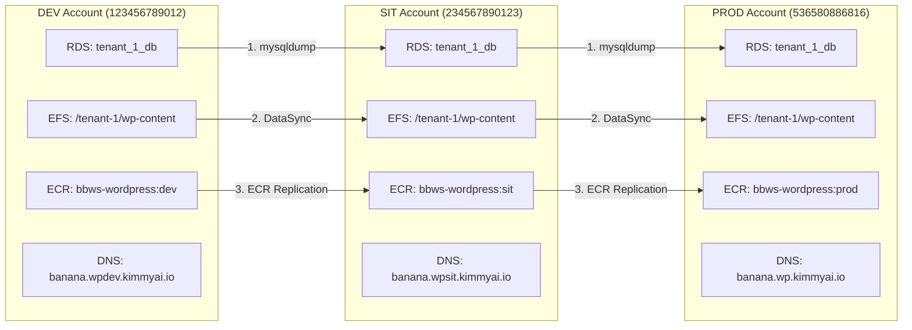
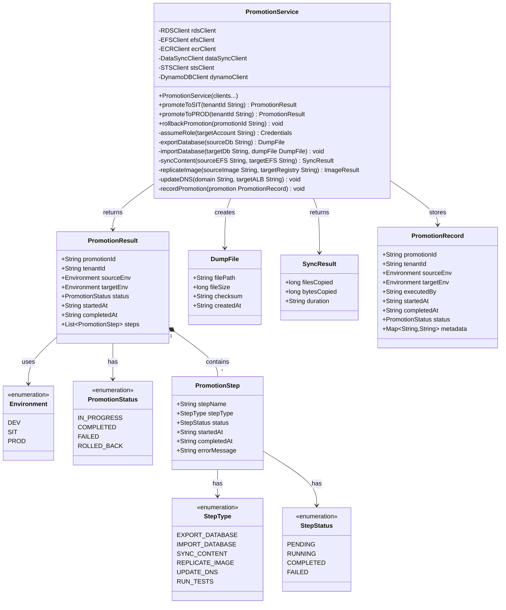
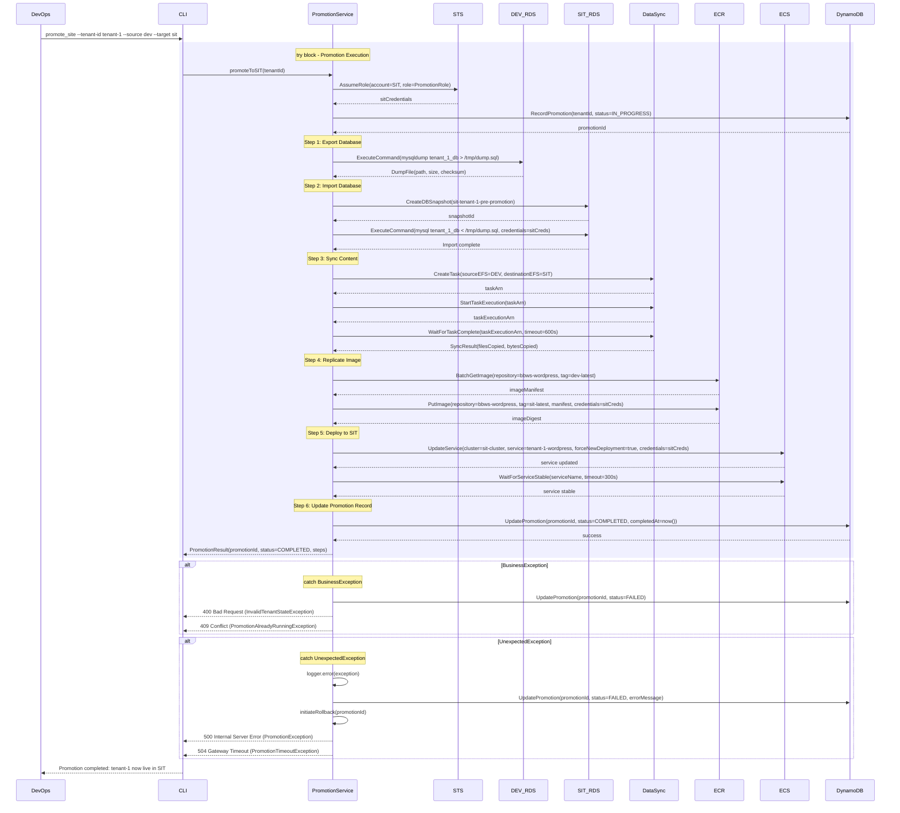

# DevOps Site Promotion Multi-Account - Low-Level Design

**Version**: 1.0
**Author**: Agentic Architect
**Date**: 2025-12-13
**Status**: Draft for Review
**Parent HLD**: [BBWS ECS WordPress HLD](../BBWS_ECS_WordPress_HLD.md)

---

## Document History

| Version | Date | Changes | Owner |
|---------|------|---------|-------|
| 1.0 | 2025-12-13 | Initial LLD for multi-account site promotion workflow (DEV → SIT → PROD) | Agentic Architect |

---

## 1. Introduction

### 1.1 Purpose

This LLD provides implementation details for promoting WordPress sites across AWS accounts (DEV → SIT → PROD) with database migration, content synchronization, and rollback procedures.

### 1.2 Parent HLD Reference

Based on CLAUDE.md global instructions: "I have three environments, dev, sit and prod. Fix defects in DEV and promote to SIT to maintain consistency across environments. Defects must be fixed in DEV and promoted to SIT ALWAYS."

### 1.3 Component Overview

DevOps Site Promotion provides:
- Multi-account promotion workflow (DEV → SIT → PROD)
- Database migration with mysqldump
- EFS content synchronization (rsync or AWS DataSync)
- Container image promotion via ECR replication
- DNS updates for new environment
- Rollback procedures for failed promotions
- Automated testing gates between environments

### 1.4 Technology Stack

| Layer | Technology | Purpose |
|-------|------------|---------|
| Orchestration | Python + Boto3 | Promotion automation |
| Database Migration | mysqldump, mysql | Database export/import |
| Content Sync | AWS DataSync or rsync | EFS content transfer |
| Image Registry | Amazon ECR | Container image replication |
| Cross-Account Access | AWS IAM Roles | AssumeRole for multi-account operations |
| State Management | DynamoDB | Promotion tracking and audit |

### 1.5 AWS Account Structure

| Account | Account ID | Purpose | Domain |
|---------|------------|---------|--------|
| DEV | 123456789012 | Development and testing | wpdev.kimmyai.io |
| SIT | 234567890123 | System Integration Testing | wpsit.kimmyai.io |
| PROD | 536580886816 | Production (read-only after promotion) | wp.kimmyai.io |

---

## 2. High Level Epic Overview

| User Story ID | User Story | Test Scenario(s) |
|---------------|------------|------------------|
| N/A (CLAUDE.md) | As a DevOps Engineer, I want to promote site from DEV to SIT | GIVEN site tested in DEV WHEN promote_site.py executes THEN database exported from DEV AND imported to SIT AND content synced AND container deployed AND DNS updated |
| N/A (CLAUDE.md) | As a DevOps Engineer, I want to promote site from SIT to PROD | GIVEN site tested in SIT WHEN promote_site.py executes THEN database exported from SIT AND imported to PROD AND content synced AND container deployed AND DNS updated |
| N/A (CLAUDE.md) | As a DevOps Engineer, I want to rollback failed promotion | GIVEN promotion failed WHEN rollback_promotion.py executes THEN previous state restored AND DNS reverted |

---

## 3. Component Diagram

### 3.1 Multi-Account Promotion Flow



### 3.2 Class Diagram



---

## 4. Promotion Workflow Details

### 4.1 DEV to SIT Promotion Steps

| Step | Action | Tool | Duration | Rollback Action |
|------|--------|------|----------|-----------------|
| 1 | Assume SIT account role | AWS STS | 5s | N/A |
| 2 | Export DEV database | mysqldump | 2-5 min | N/A (read-only) |
| 3 | Import to SIT database | mysql | 2-5 min | Restore SIT snapshot |
| 4 | Sync wp-content (DEV EFS → SIT EFS) | AWS DataSync | 5-10 min | Restore SIT EFS snapshot |
| 5 | Replicate container image (DEV ECR → SIT ECR) | ECR replication | 1-2 min | Revert to previous SIT image tag |
| 6 | Update SIT task definition | ECS | 30s | Revert to previous task definition |
| 7 | Deploy SIT ECS service | ECS | 2-3 min | Rollback deployment |
| 8 | Update DNS (banana.wpsit.kimmyai.io) | Route53 | 60s | Revert DNS to old ALB |
| 9 | Run smoke tests | Selenium/Pytest | 2-3 min | N/A |
| 10 | Record promotion in DynamoDB | DynamoDB | 1s | Delete promotion record |

**Total Duration**: ~15-30 minutes

### 4.2 SIT to PROD Promotion Steps

| Step | Action | Tool | Duration | Rollback Action |
|------|--------|------|----------|-----------------|
| 1 | **Manual approval gate** | Human review | Variable | N/A |
| 2 | Assume PROD account role | AWS STS | 5s | N/A |
| 3 | Export SIT database | mysqldump | 2-5 min | N/A (read-only) |
| 4 | Import to PROD database | mysql | 2-5 min | Restore PROD snapshot (critical!) |
| 5 | Sync wp-content (SIT EFS → PROD EFS) | AWS DataSync | 5-10 min | Restore PROD EFS snapshot (critical!) |
| 6 | Replicate container image (SIT ECR → PROD ECR) | ECR replication | 1-2 min | Revert to previous PROD image tag |
| 7 | Update PROD task definition | ECS | 30s | Revert to previous task definition |
| 8 | Deploy PROD ECS service | ECS | 2-3 min | Rollback deployment (critical!) |
| 9 | Update DNS (banana.wp.kimmyai.io) | Route53 | 60s | Revert DNS to old ALB (critical!) |
| 10 | Run comprehensive tests | Selenium/Pytest | 5-10 min | N/A |
| 11 | Monitor for 15 minutes | CloudWatch | 15 min | Manual rollback decision |
| 12 | Record promotion in DynamoDB | DynamoDB | 1s | Delete promotion record |

**Total Duration**: ~35-60 minutes (excluding approval gate)

### 4.3 Cross-Account IAM Roles

**DEV Account - Trust Policy for SIT/PROD**

```json
{
  "Version": "2012-10-17",
  "Statement": [
    {
      "Effect": "Allow",
      "Principal": {
        "AWS": [
          "arn:aws:iam::234567890123:root",
          "arn:aws:iam::536580886816:root"
        ]
      },
      "Action": "sts:AssumeRole",
      "Condition": {
        "StringEquals": {
          "sts:ExternalId": "bbws-promotion-secret-key"
        }
      }
    }
  ]
}
```

**Role Permissions** (DEV account role for SIT/PROD to assume):

```json
{
  "Version": "2012-10-17",
  "Statement": [
    {
      "Effect": "Allow",
      "Action": [
        "rds:DescribeDBInstances",
        "rds:DescribeDBSnapshots",
        "rds:CreateDBSnapshot"
      ],
      "Resource": "*"
    },
    {
      "Effect": "Allow",
      "Action": [
        "efs:DescribeFileSystems",
        "efs:DescribeAccessPoints",
        "efs:ClientRead"
      ],
      "Resource": "*"
    },
    {
      "Effect": "Allow",
      "Action": [
        "ecr:GetDownloadUrlForLayer",
        "ecr:BatchGetImage",
        "ecr:BatchCheckLayerAvailability"
      ],
      "Resource": "arn:aws:ecr:af-south-1:123456789012:repository/bbws-wordpress"
    }
  ]
}
```

---

## 5. Sequence Diagram

### 5.1 DEV to SIT Promotion Sequence



---

## 6. Database Migration Details

### 6.1 Database Export (mysqldump)

```bash
#!/bin/bash
# export_database.sh

SOURCE_DB_HOST="dev-rds.cluster-xxx.af-south-1.rds.amazonaws.com"
SOURCE_DB_NAME="tenant_1_db"
SOURCE_DB_USER=$(aws secretsmanager get-secret-value --secret-id bbws/dev/tenant-1/db --query 'SecretString' --output text | jq -r '.username')
SOURCE_DB_PASS=$(aws secretsmanager get-secret-value --secret-id bbws/dev/tenant-1/db --query 'SecretString' --output text | jq -r '.password')

DUMP_FILE="/tmp/tenant_1_db_$(date +%Y%m%d_%H%M%S).sql"

# Export with progress monitoring
mysqldump \
  -h ${SOURCE_DB_HOST} \
  -u ${SOURCE_DB_USER} \
  -p${SOURCE_DB_PASS} \
  --single-transaction \
  --routines \
  --triggers \
  --events \
  --set-gtid-purged=OFF \
  --verbose \
  ${SOURCE_DB_NAME} > ${DUMP_FILE}

# Verify dump
if [ $? -eq 0 ]; then
  echo "Database export successful: ${DUMP_FILE}"
  echo "Size: $(du -h ${DUMP_FILE} | cut -f1)"
  echo "Checksum: $(md5sum ${DUMP_FILE} | cut -d' ' -f1)"
else
  echo "Database export failed"
  exit 1
fi
```

### 6.2 Database Import (mysql)

```bash
#!/bin/bash
# import_database.sh

TARGET_DB_HOST="sit-rds.cluster-yyy.af-south-1.rds.amazonaws.com"
TARGET_DB_NAME="tenant_1_db"
TARGET_DB_USER=$(aws secretsmanager get-secret-value --secret-id bbws/sit/tenant-1/db --profile Tebogo-sit --query 'SecretString' --output text | jq -r '.username')
TARGET_DB_PASS=$(aws secretsmanager get-secret-value --secret-id bbws/sit/tenant-1/db --profile Tebogo-sit --query 'SecretString' --output text | jq -r '.password')

DUMP_FILE=$1

# Pre-import snapshot
aws rds create-db-snapshot \
  --db-instance-identifier sit-rds-tenant-1 \
  --db-snapshot-identifier sit-tenant-1-pre-promotion-$(date +%Y%m%d-%H%M%S) \
  --profile Tebogo-sit

# Import
mysql \
  -h ${TARGET_DB_HOST} \
  -u ${TARGET_DB_USER} \
  -p${TARGET_DB_PASS} \
  --verbose \
  ${TARGET_DB_NAME} < ${DUMP_FILE}

if [ $? -eq 0 ]; then
  echo "Database import successful"

  # Update WordPress site URLs
  mysql -h ${TARGET_DB_HOST} -u ${TARGET_DB_USER} -p${TARGET_DB_PASS} ${TARGET_DB_NAME} <<EOF
UPDATE wp_options SET option_value = 'https://banana.wpsit.kimmyai.io' WHERE option_name = 'siteurl';
UPDATE wp_options SET option_value = 'https://banana.wpsit.kimmyai.io' WHERE option_name = 'home';
EOF

  echo "WordPress URLs updated for SIT environment"
else
  echo "Database import failed"
  exit 1
fi
```

---

## 7. Content Synchronization

### 7.1 AWS DataSync Task Configuration

```json
{
  "SourceLocationArn": "arn:aws:datasync:af-south-1:123456789012:location/loc-dev-efs-xxx",
  "DestinationLocationArn": "arn:aws:datasync:af-south-1:234567890123:location/loc-sit-efs-yyy",
  "Name": "tenant-1-dev-to-sit-sync",
  "Options": {
    "VerifyMode": "POINT_IN_TIME_CONSISTENT",
    "OverwriteMode": "ALWAYS",
    "Atime": "BEST_EFFORT",
    "Mtime": "PRESERVE",
    "Uid": "INT_VALUE",
    "Gid": "INT_VALUE",
    "PreserveDeletedFiles": "PRESERVE",
    "PreserveDevices": "NONE",
    "PosixPermissions": "PRESERVE",
    "BytesPerSecond": -1,
    "TaskQueueing": "ENABLED",
    "LogLevel": "TRANSFER",
    "TransferMode": "CHANGED"
  },
  "Excludes": [
    {
      "FilterType": "SIMPLE_PATTERN",
      "Value": "*/cache/*"
    },
    {
      "FilterType": "SIMPLE_PATTERN",
      "Value": "*/upgrade/*"
    }
  ]
}
```

---

## 8. Non-Functional Requirements

### 8.1 Performance

| Metric | Target | Measurement |
|--------|--------|-------------|
| DEV → SIT promotion time | < 30 minutes | End-to-end automation |
| SIT → PROD promotion time | < 60 minutes | Including manual approval |
| Database export time | < 5 minutes per 1GB | mysqldump performance |
| Content sync time | < 10 minutes per 10GB | DataSync throughput |
| Rollback time (RTO) | < 15 minutes | Restore from snapshot |

### 8.2 Reliability

| Aspect | Target | Implementation |
|--------|--------|----------------|
| Promotion success rate | > 95% | Automated testing gates |
| Rollback success rate | 100% | Pre-promotion snapshots |
| Data loss during promotion | 0% | Read-only source, snapshot backups |

### 8.3 Security

| Aspect | Implementation |
|--------|----------------|
| Cross-account access | IAM AssumeRole with ExternalId |
| Credential management | AWS Secrets Manager (never hardcoded) |
| Encryption in transit | TLS for database dumps, DataSync encryption |
| Audit logging | All promotions logged to DynamoDB + CloudTrail |
| PROD write protection | Read-only mode after promotion (manual override only) |

---

## 9. Troubleshooting Playbook

### 9.1 Database Import Fails

**Symptom**: mysql import returns error

**Diagnosis**:
```bash
# Check dump file integrity
md5sum /tmp/tenant_1_db_xxx.sql

# Check target database connectivity
mysql -h sit-rds.cluster-yyy.af-south-1.rds.amazonaws.com -u admin -p -e "SHOW DATABASES;"

# Check for disk space
aws rds describe-db-instances \
  --db-instance-identifier sit-rds-tenant-1 \
  --query 'DBInstances[0].[AllocatedStorage,DBInstanceStatus]' \
  --profile Tebogo-sit
```

**Resolution**:
- Verify dump file checksum matches source
- Ensure target RDS has sufficient storage
- Check for conflicting data (truncate target tables first)
- Review MySQL error log in CloudWatch

### 9.2 DataSync Task Stuck

**Symptom**: DataSync task running for > 30 minutes

**Diagnosis**:
```bash
# Check task execution status
aws datasync describe-task-execution \
  --task-execution-arn arn:aws:datasync:af-south-1:234567890123:task/task-xxx/execution/exec-yyy \
  --profile Tebogo-sit

# Check CloudWatch metrics
aws cloudwatch get-metric-statistics \
  --namespace AWS/DataSync \
  --metric-name BytesTransferred \
  --dimensions Name=TaskId,Value=task-xxx \
  --start-time 2025-12-13T00:00:00Z \
  --end-time 2025-12-13T23:59:59Z \
  --period 300 \
  --statistics Sum \
  --profile Tebogo-sit
```

**Resolution**:
- Verify source and destination EFS mount targets are healthy
- Check security groups allow NFS traffic
- Review DataSync agent logs
- Consider increasing bandwidth limit if throttled

---

## 10. Rollback Procedure

### 10.1 Rollback Steps

1. **Stop ongoing promotion** (if in progress)
2. **Restore database from pre-promotion snapshot**
3. **Restore EFS from pre-promotion backup**
4. **Revert ECS task definition to previous version**
5. **Rollback ECS service deployment**
6. **Revert DNS to previous ALB**
7. **Update promotion record in DynamoDB (status=ROLLED_BACK)**
8. **Notify operations team**

### 10.2 Rollback Script

```python
# rollback_promotion.py

import boto3
import sys

def rollback_promotion(promotion_id):
    # Retrieve promotion details
    dynamodb = boto3.client('dynamodb')
    response = dynamodb.get_item(
        TableName='Promotions',
        Key={'promotionId': {'S': promotion_id}}
    )

    promotion = response['Item']
    target_env = promotion['targetEnv']['S']
    tenant_id = promotion['tenantId']['S']

    print(f"Rolling back promotion {promotion_id} for {tenant_id} in {target_env}")

    # 1. Restore database
    rds = boto3.client('rds', region_name='af-south-1')
    snapshot_id = promotion['prePromotionSnapshot']['S']

    print(f"Restoring database from snapshot: {snapshot_id}")
    rds.restore_db_instance_from_db_snapshot(
        DBInstanceIdentifier=f'{target_env}-tenant-{tenant_id}-restored',
        DBSnapshotIdentifier=snapshot_id
    )

    # 2. Revert ECS service
    ecs = boto3.client('ecs', region_name='af-south-1')
    previous_task_def = promotion['previousTaskDefinition']['S']

    print(f"Reverting ECS service to task definition: {previous_task_def}")
    ecs.update_service(
        cluster=f'{target_env}-cluster',
        service=f'tenant-{tenant_id}-wordpress',
        taskDefinition=previous_task_def
    )

    # 3. Update DynamoDB
    dynamodb.update_item(
        TableName='Promotions',
        Key={'promotionId': {'S': promotion_id}},
        UpdateExpression='SET #status = :status, rolledBackAt = :timestamp',
        ExpressionAttributeNames={'#status': 'status'},
        ExpressionAttributeValues={
            ':status': {'S': 'ROLLED_BACK'},
            ':timestamp': {'S': datetime.utcnow().isoformat()}
        }
    )

    print(f"Rollback complete for promotion {promotion_id}")

if __name__ == '__main__':
    rollback_promotion(sys.argv[1])
```

---

## 11. References

| Ref ID | Document | Type |
|--------|----------|------|
| REF-PROMO-001 | [BBWS ECS WordPress HLD](../BBWS_ECS_WordPress_HLD.md) | Parent HLD |
| REF-PROMO-002 | [CLAUDE.md Global Instructions](../../../CLAUDE.md) | Project Instructions |
| REF-PROMO-003 | [AWS DataSync User Guide](https://docs.aws.amazon.com/datasync/) | AWS Documentation |
| REF-PROMO-004 | [Cross-Account Access with IAM](https://docs.aws.amazon.com/IAM/latest/UserGuide/tutorial_cross-account-with-roles.html) | AWS Documentation |

---

**END OF DOCUMENT**
