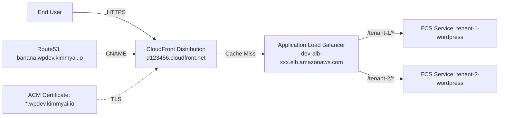
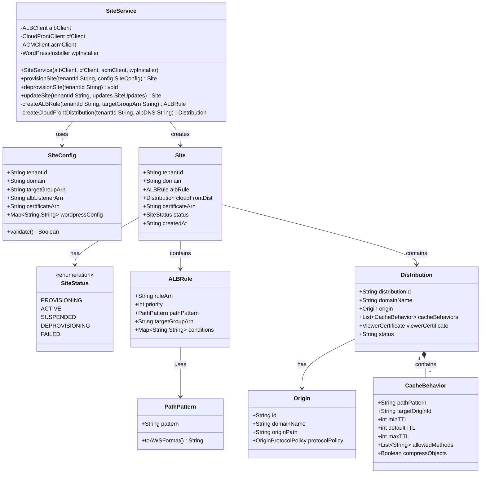
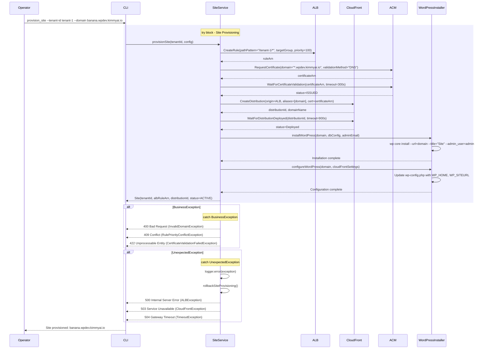

# Site Management - Low-Level Design

**Version**: 1.0
**Author**: Agentic Architect
**Date**: 2025-12-13
**Status**: Draft for Review
**Parent HLD**: [BBWS ECS WordPress HLD](../BBWS_ECS_WordPress_HLD.md)

---

## Document History

| Version | Date | Changes | Owner |
|---------|------|---------|-------|
| 1.0 | 2025-12-13 | Initial LLD for WordPress site lifecycle management | Agentic Architect |

---

## 1. Introduction

### 1.1 Purpose

This LLD provides implementation details for WordPress site provisioning, configuration, lifecycle management, ALB routing, and CloudFront distribution management.

### 1.2 Parent HLD Reference

Based on Section 4 Component List and User Stories US-012, US-013, US-014, US-015 from the [BBWS ECS WordPress HLD](../BBWS_ECS_WordPress_HLD.md).

### 1.3 Component Overview

Site Management provides:
- WordPress site provisioning and deprovisioning
- ALB path-based routing configuration
- CloudFront CDN distribution per tenant
- SSL certificate management via ACM
- WordPress installation automation
- Site health monitoring

### 1.4 Technology Stack

| Layer | Technology | Purpose |
|-------|------------|---------|
| Load Balancing | AWS Application Load Balancer | Path-based routing |
| CDN | Amazon CloudFront | Global content delivery |
| SSL/TLS | AWS Certificate Manager | SSL certificates |
| WordPress | WordPress 6.x | CMS platform |
| Automation | Python + WP-CLI | Site configuration |

---

## 2. High Level Epic Overview

| User Story ID | User Story | Test Scenario(s) |
|---------------|------------|------------------|
| US-012 | As a Platform Operator, I want to provision WordPress instance for tenant | GIVEN tenant-id WHEN provision executes THEN ALB rule created AND CloudFront distribution created AND WordPress installed |
| US-013 | As a Platform Operator, I want to deprovision tenant | GIVEN tenant-id WHEN deprovision executes THEN ALB rule removed AND CloudFront distribution deleted |
| US-014 | As a Platform Operator, I want to provision CloudFront distribution for tenant | GIVEN tenant-id WHEN provision CloudFront THEN distribution created with ALB origin AND cache behaviors configured |
| US-015 | As a Platform Operator, I want to configure DNS for tenant | GIVEN tenant-id WHEN configure DNS THEN Route53 record points to CloudFront AND SSL certificate associated |

---

## 3. Component Diagram

### 3.1 Site Architecture



### 3.2 Class Diagram



---

## 4. Configuration Details

### 4.1 ALB Listener Rule (Per-Tenant)

```json
{
  "Priority": 100,
  "Conditions": [
    {
      "Field": "path-pattern",
      "Values": ["/tenant-1/*"]
    }
  ],
  "Actions": [
    {
      "Type": "forward",
      "TargetGroupArn": "arn:aws:elasticloadbalancing:af-south-1:536580886816:targetgroup/tenant-1-tg/xxx"
    }
  ]
}
```

### 4.2 CloudFront Distribution (Per-Tenant)

```json
{
  "DistributionConfig": {
    "CallerReference": "tenant-1-2025-12-13",
    "Aliases": ["banana.wpdev.kimmyai.io"],
    "DefaultRootObject": "index.php",
    "Origins": [
      {
        "Id": "ALB-tenant-1",
        "DomainName": "dev-alb-xxx.af-south-1.elb.amazonaws.com",
        "OriginPath": "/tenant-1",
        "CustomOriginConfig": {
          "HTTPPort": 80,
          "HTTPSPort": 443,
          "OriginProtocolPolicy": "https-only",
          "OriginSslProtocols": ["TLSv1.2"],
          "OriginReadTimeout": 30,
          "OriginKeepaliveTimeout": 5
        }
      }
    ],
    "DefaultCacheBehavior": {
      "TargetOriginId": "ALB-tenant-1",
      "ViewerProtocolPolicy": "redirect-to-https",
      "AllowedMethods": ["GET", "HEAD", "OPTIONS", "PUT", "POST", "PATCH", "DELETE"],
      "CachedMethods": ["GET", "HEAD"],
      "ForwardedValues": {
        "QueryString": true,
        "Cookies": {"Forward": "all"},
        "Headers": ["Host", "CloudFront-Forwarded-Proto", "X-Forwarded-For"]
      },
      "MinTTL": 0,
      "DefaultTTL": 0,
      "MaxTTL": 31536000,
      "Compress": true
    },
    "CacheBehaviors": [
      {
        "PathPattern": "/wp-content/*",
        "TargetOriginId": "ALB-tenant-1",
        "ViewerProtocolPolicy": "redirect-to-https",
        "AllowedMethods": ["GET", "HEAD"],
        "MinTTL": 86400,
        "DefaultTTL": 604800,
        "MaxTTL": 31536000,
        "Compress": true
      },
      {
        "PathPattern": "/wp-admin/*",
        "TargetOriginId": "ALB-tenant-1",
        "ViewerProtocolPolicy": "redirect-to-https",
        "AllowedMethods": ["GET", "HEAD", "OPTIONS", "PUT", "POST", "PATCH", "DELETE"],
        "MinTTL": 0,
        "DefaultTTL": 0,
        "MaxTTL": 0,
        "Compress": false
      }
    ],
    "ViewerCertificate": {
      "ACMCertificateArn": "arn:aws:acm:us-east-1:536580886816:certificate/xxx",
      "SSLSupportMethod": "sni-only",
      "MinimumProtocolVersion": "TLSv1.2_2021"
    },
    "Enabled": true,
    "PriceClass": "PriceClass_100"
  }
}
```

### 4.3 WordPress Initial Configuration

```php
// wp-config.php additions
define('WP_HOME', 'https://banana.wpdev.kimmyai.io');
define('WP_SITEURL', 'https://banana.wpdev.kimmyai.io');

define('FORCE_SSL_ADMIN', true);
if (isset($_SERVER['HTTP_CLOUDFRONT_FORWARDED_PROTO'])
    && $_SERVER['HTTP_CLOUDFRONT_FORWARDED_PROTO'] === 'https') {
    $_SERVER['HTTPS'] = 'on';
}

// CloudFront remote IP
if (isset($_SERVER['HTTP_CLOUDFRONT_VIEWER_ADDRESS'])) {
    $ip_parts = explode(':', $_SERVER['HTTP_CLOUDFRONT_VIEWER_ADDRESS']);
    $_SERVER['REMOTE_ADDR'] = $ip_parts[0];
}

// Cache control
define('WP_CACHE', true);
```

---

## 5. Sequence Diagram

### 5.1 Provision Site Sequence



---

## 6. Non-Functional Requirements

### 6.1 Performance

| Metric | Target | Measurement |
|--------|--------|-------------|
| Site provisioning time | < 15 minutes | Full automation duration |
| ALB rule creation | < 5 seconds | AWS API response |
| CloudFront deployment | < 15 minutes | Distribution status |
| WordPress installation | < 2 minutes | WP-CLI execution |
| Cache hit ratio | > 80% | CloudFront metrics |

### 6.2 Cost (Per Tenant)

| Component | Monthly Cost | Notes |
|-----------|--------------|-------|
| CloudFront | ~$1-5 | Depends on data transfer |
| ALB rules | $0 | Included with ALB |
| ACM Certificate | $0 | Free for public certificates |
| **Total Site Management** | **~$1-5/tenant/month** | Variable with traffic |

---

## 7. Troubleshooting Playbook

### 7.1 ALB Rule Not Routing

**Symptom**: Requests not reaching tenant containers

**Diagnosis**:
```bash
# Check ALB rules
aws elbv2 describe-rules \
  --listener-arn arn:aws:elasticloadbalancing:af-south-1:536580886816:listener/app/dev-alb/xxx/yyy \
  --profile Tebogo-dev

# Test path pattern
curl -v http://dev-alb-xxx.af-south-1.elb.amazonaws.com/tenant-1/
```

**Resolution**:
- Verify rule priority doesn't conflict
- Check path pattern matches request path
- Ensure target group has healthy targets

### 7.2 CloudFront Not Serving Content

**Symptom**: CloudFront returns errors

**Diagnosis**:
```bash
# Check distribution status
aws cloudfront get-distribution \
  --id E123456789ABC \
  --profile Tebogo-dev

# Check origin health
curl -v https://d123456.cloudfront.net
```

**Resolution**:
- Verify origin domain name is ALB DNS
- Check origin path is `/tenant-1`
- Ensure ACM certificate in us-east-1 for CloudFront
- Validate CNAME (alias) matches Route53 record

---

## 8. References

| Ref ID | Document | Type |
|--------|----------|------|
| REF-SITE-001 | [BBWS ECS WordPress HLD](../BBWS_ECS_WordPress_HLD.md) | Parent HLD |
| REF-SITE-002 | [ALB User Guide](https://docs.aws.amazon.com/elasticloadbalancing/latest/application/) | AWS Documentation |
| REF-SITE-003 | [CloudFront Developer Guide](https://docs.aws.amazon.com/cloudfront/) | AWS Documentation |
| REF-SITE-004 | [WordPress CLI](https://wp-cli.org/) | Tool Documentation |

---

**END OF DOCUMENT**
