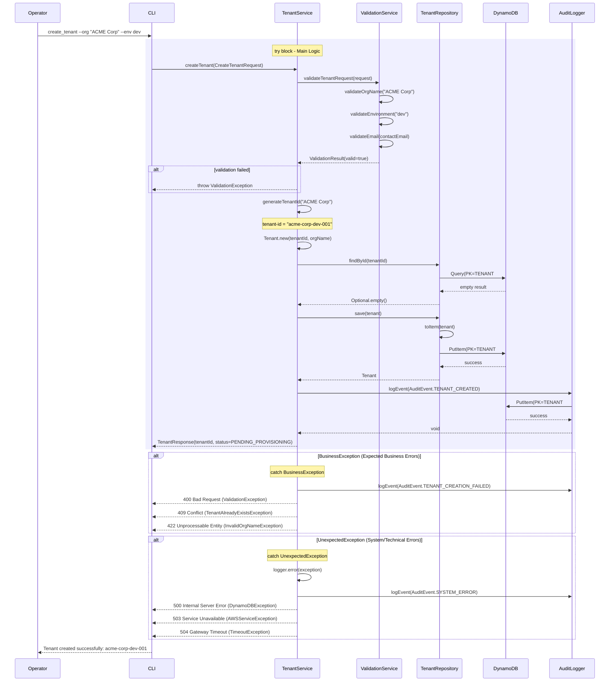
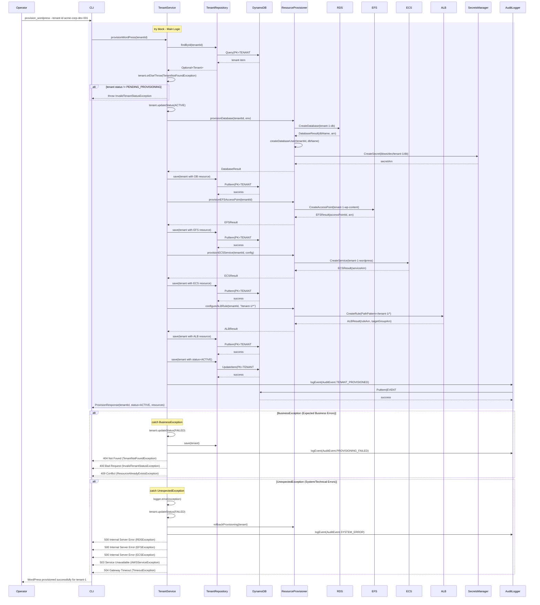
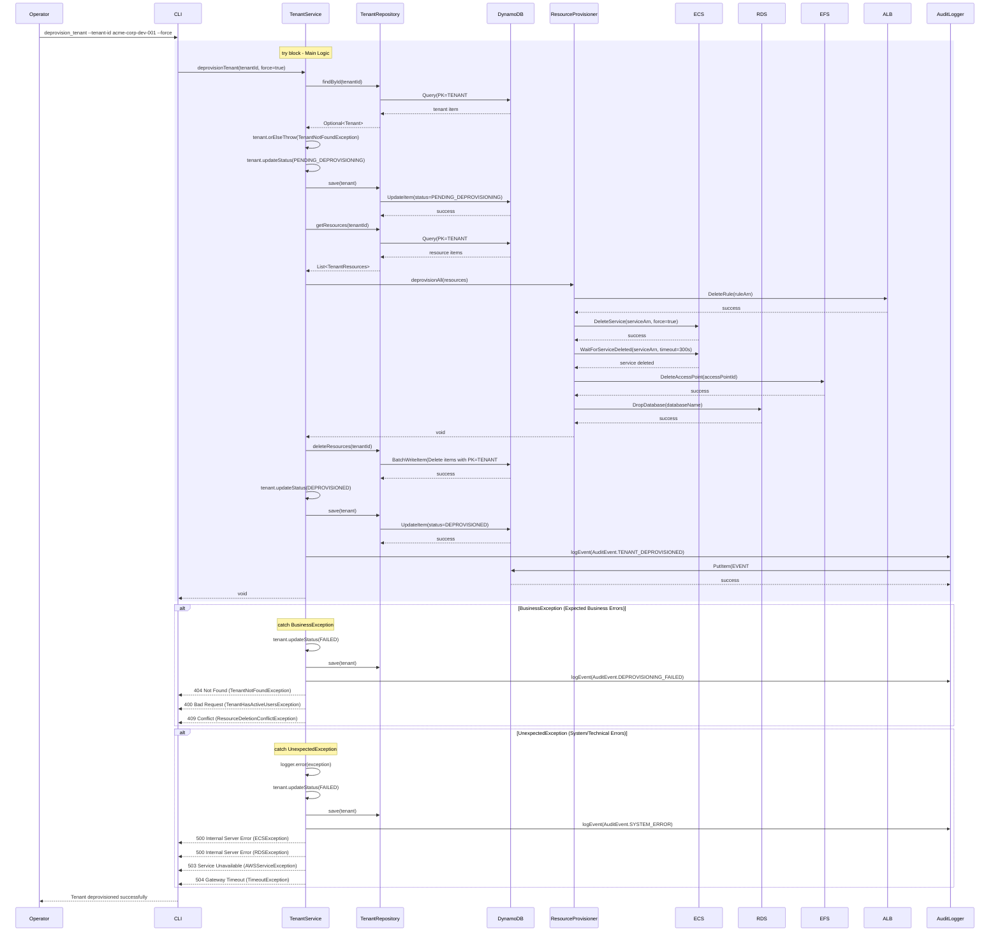

# Tenant Management - Low-Level Design

**Version**: 1.0
**Author**: Agentic Architect
**Date**: 2025-12-13
**Status**: Draft for Review
**Parent HLD**: [BBWS ECS WordPress HLD](../BBWS_ECS_WordPress_HLD.md)

---

## Document History

| Version | Date | Changes | Owner |
|---------|------|---------|-------|
| 1.0 | 2025-12-13 | Initial LLD for Tenant Management component with DynamoDB single table design | Agentic Architect |

---

## 1. Introduction

### 1.1 Purpose

This Low-Level Design (LLD) document provides implementation-level details for the **Tenant Management** component of the BBWS ISP-Style ECS Fargate WordPress Hosting Platform. This document is intended for developers who will implement the tenant provisioning, deprovisioning, and lifecycle management capabilities.

### 1.2 Parent HLD Reference

This LLD details the Tenant Management component specified in Section 4.3 and Section 2 (User Stories US-011 through US-016) of the [BBWS ECS WordPress HLD](../BBWS_ECS_WordPress_HLD.md).

### 1.3 Component Overview

The Tenant Management component is responsible for:
- Creating and provisioning WordPress tenant organizations
- Managing tenant metadata and configuration
- Tracking tenant resources (databases, EFS access points, ECS services)
- Supporting organization hierarchy (Division → Group → Team → User)
- Deprovisioning tenants and cleaning up resources
- Assigning users to tenants
- Maintaining tenant state and audit trail

### 1.4 Technology Stack

| Layer | Technology | Purpose |
|-------|------------|---------|
| Programming Language | Python 3.11+ | CLI scripts and automation |
| Data Store | Amazon DynamoDB | Tenant metadata and state management |
| Access Pattern | Single Table Design | Optimized query performance |
| Infrastructure | Terraform | Resource provisioning |
| Secrets | AWS Secrets Manager | Credentials storage |
| CLI | Click framework | Interactive command-line interface |

### 1.5 Business Benefits

- **Fast Provisioning**: Tenant creation in < 15 minutes (BA-003)
- **Clean Deprovisioning**: Complete resource cleanup without affecting other tenants (BA-004)
- **Multi-Tenancy**: Support for 5 initial tenants with growth to 20+ (BA-013)
- **Organization Hierarchy**: Flexible tenant organization structure supporting Division → Group → Team → User
- **Audit Trail**: Complete history of tenant lifecycle events

### 1.6 Dependencies

| Dependency | Type | Purpose |
|------------|------|---------|
| AWS DynamoDB | Data Store | Tenant metadata storage |
| AWS Secrets Manager | Secret Store | Database credentials |
| AWS ECS | Compute | WordPress containers |
| AWS RDS | Database | MySQL instances |
| AWS EFS | Storage | Persistent file storage |
| AWS ALB | Load Balancer | Routing rules |

---

## 2. High Level Epic Overview

This component addresses the following epics and user stories from the parent HLD:

### Epic 3: Tenant Management

| User Story ID | User Story | Test Scenario(s) |
|---------------|------------|------------------|
| US-011 | As a Platform Operator, I want to create a tenant organization so that customers are logically grouped | GIVEN operator credentials WHEN I execute `create_tenant.py --org-name "ACME Corp"` THEN tenant organization is created with unique ID AND organization hierarchy is initialized |
| US-012 | As a Platform Operator, I want to provision a new WordPress instance for a tenant so that a customer can have their site | GIVEN valid tenant-id WHEN I provision WordPress site THEN database is created AND EFS access point is created AND ECS service is deployed AND ALB rule is configured AND tenant status is ACTIVE |
| US-013 | As a Platform Operator, I want to deprovision a tenant so that resources are cleaned up when customer leaves | GIVEN tenant-id WHEN I execute deprovision THEN ECS service is removed AND database is deleted AND EFS access point is deleted AND ALB rule is removed AND tenant status is DEPROVISIONED |
| US-016 | As an Admin, I want to assign users to tenants so that access is scoped to specific customers | GIVEN tenant-id and user-email WHEN I assign user to tenant THEN user record is created with tenant association AND assignment is recorded in audit log |

---

## 3. Component Diagram (Class Diagram)

### 3.1 Internal Class Structure

```mermaid
classDiagram
    class TenantService {
        -TenantRepository repository
        -ResourceProvisioner provisioner
        -ValidationService validator
        -AuditLogger auditLogger
        +TenantService(repository, provisioner, validator, auditLogger)
        +createTenant(request CreateTenantRequest) TenantResponse
        +provisionWordPress(tenantId String) ProvisionResponse
        +deprovisionTenant(tenantId String, force Boolean) void
        +assignUserToTenant(tenantId String, userId String) void
        +getTenantById(tenantId String) Optional~Tenant~
        +listTenants(status TenantStatus) List~Tenant~
        -validateTenantRequest(request CreateTenantRequest) void
        -generateTenantId(orgName String) String
        -recordAuditEvent(event AuditEvent) void
    }

    class CreateTenantRequest {
        +String organizationName
        +String environment
        +String contactEmail
        +String division
        +String group
        +String team
        +Map~String,String~ metadata
        +validate() Boolean
    }

    class TenantResponse {
        +String tenantId
        +String organizationName
        +TenantStatus status
        +String createdAt
        +String createdBy
        +OrganizationHierarchy hierarchy
    }

    class Tenant {
        -String tenantId
        -String organizationName
        -String environment
        -TenantStatus status
        -OrganizationHierarchy hierarchy
        -TenantResources resources
        -String contactEmail
        -LocalDateTime createdAt
        -LocalDateTime updatedAt
        -Map~String,String~ metadata
        +Tenant(tenantId String, orgName String)
        +updateStatus(newStatus TenantStatus) void
        +addResource(resourceType String, resourceArn String) void
        +removeResource(resourceType String) void
        +validate() Boolean
    }

    class OrganizationHierarchy {
        +String division
        +String group
        +String team
        +List~UserAssignment~ users
        +addUser(userId String, role String) void
        +removeUser(userId String) void
        +getUserRole(userId String) Optional~String~
    }

    class UserAssignment {
        +String userId
        +String email
        +String role
        +String assignedBy
        +LocalDateTime assignedAt
    }

    class TenantResources {
        +String databaseName
        +String databaseArn
        +String efsAccessPointId
        +String ecsServiceArn
        +String albTargetGroupArn
        +String albListenerRuleArn
        +String secretArn
        +toMap() Map~String,String~
    }

    class TenantStatus {
        <<enumeration>>
        PENDING_PROVISIONING
        ACTIVE
        SUSPENDED
        PENDING_DEPROVISIONING
        DEPROVISIONED
        FAILED
    }

    class TenantRepository {
        <<interface>>
        +save(tenant Tenant) Tenant
        +findById(tenantId String) Optional~Tenant~
        +findByOrganization(orgName String) List~Tenant~
        +findByStatus(status TenantStatus) List~Tenant~
        +delete(tenantId String) void
        +assignUser(tenantId String, assignment UserAssignment) void
    }

    class DynamoDBTenantRepository {
        -DynamoDBClient client
        -String tableName
        -AWSXRayRecorder xrayRecorder
        +save(tenant Tenant) Tenant
        +findById(tenantId String) Optional~Tenant~
        +findByOrganization(orgName String) List~Tenant~
        +findByStatus(status TenantStatus) List~Tenant~
        +delete(tenantId String) void
        +assignUser(tenantId String, assignment UserAssignment) void
        -toItem(tenant Tenant) Map~String,AttributeValue~
        -fromItem(item Map~String,AttributeValue~) Tenant
        -executeQuery(keyCondition String, indexName String) List~Tenant~
    }

    class ResourceProvisioner {
        <<interface>>
        +provisionDatabase(tenantId String, env String) DatabaseResult
        +provisionEFSAccessPoint(tenantId String) EFSResult
        +provisionECSService(tenantId String, config ServiceConfig) ECSResult
        +configureALBRule(tenantId String, path String) ALBResult
        +deprovisionAll(resources TenantResources) void
    }

    class AWSResourceProvisioner {
        -RDSClient rdsClient
        -EFSClient efsClient
        -ECSClient ecsClient
        -ELBv2Client albClient
        -SecretsManagerClient secretsClient
        +provisionDatabase(tenantId String, env String) DatabaseResult
        +provisionEFSAccessPoint(tenantId String) EFSResult
        +provisionECSService(tenantId String, config ServiceConfig) ECSResult
        +configureALBRule(tenantId String, path String) ALBResult
        +deprovisionAll(resources TenantResources) void
        -createDatabaseUser(tenantId String, dbName String) Credentials
        -storeCredentials(tenantId String, credentials Credentials) String
    }

    class ValidationService {
        <<interface>>
        +validateTenantRequest(request CreateTenantRequest) ValidationResult
        +validateTenantId(tenantId String) Boolean
        +validateEnvironment(env String) Boolean
    }

    class TenantValidationService {
        -List~String~ allowedEnvironments
        -Pattern tenantIdPattern
        +validateTenantRequest(request CreateTenantRequest) ValidationResult
        +validateTenantId(tenantId String) Boolean
        +validateEnvironment(env String) Boolean
        -validateEmail(email String) Boolean
        -validateOrgName(name String) Boolean
    }

    class AuditLogger {
        <<interface>>
        +logEvent(event AuditEvent) void
        +getEventsByTenant(tenantId String) List~AuditEvent~
    }

    class DynamoDBAuditLogger {
        -DynamoDBClient client
        -String tableName
        +logEvent(event AuditEvent) void
        +getEventsByTenant(tenantId String) List~AuditEvent~
    }

    class AuditEvent {
        +String eventId
        +String tenantId
        +EventType eventType
        +String performedBy
        +LocalDateTime timestamp
        +Map~String,String~ details
        +String toJSON() String
    }

    class EventType {
        <<enumeration>>
        TENANT_CREATED
        TENANT_PROVISIONED
        TENANT_DEPROVISIONED
        USER_ASSIGNED
        USER_REMOVED
        STATUS_CHANGED
        RESOURCE_ADDED
        RESOURCE_REMOVED
    }

    TenantService --> TenantRepository : uses
    TenantService --> ResourceProvisioner : uses
    TenantService --> ValidationService : uses
    TenantService --> AuditLogger : uses
    TenantService --> Tenant : manages
    TenantService --> CreateTenantRequest : receives
    TenantService --> TenantResponse : returns

    TenantRepository <|.. DynamoDBTenantRepository : implements
    ResourceProvisioner <|.. AWSResourceProvisioner : implements
    ValidationService <|.. TenantValidationService : implements
    AuditLogger <|.. DynamoDBAuditLogger : implements

    Tenant --> TenantStatus : has
    Tenant --> OrganizationHierarchy : contains
    Tenant --> TenantResources : contains
    OrganizationHierarchy "1" *-- "*" UserAssignment : contains

    AuditLogger --> AuditEvent : creates
    AuditEvent --> EventType : has
```



### 3.2 Design Patterns Used

| Pattern | Application | Benefit |
|---------|-------------|---------|
| Repository | DynamoDBTenantRepository | Abstracts data access logic from business logic |
| Service Layer | TenantService | Encapsulates business logic and orchestration |
| Strategy | ResourceProvisioner interface | Allows different provisioning implementations |
| Value Object | TenantResources, OrganizationHierarchy | Immutable data structures |
| Dependency Injection | Constructor injection | Testability and loose coupling |

---

## 4. DynamoDB Single Table Design

### 4.1 Table Schema

**Table Name**: `Tenants` (environment-prefixed: `dev-Tenants`, `sit-Tenants`, `prod-Tenants`)

**Capacity Mode**: On-Demand (as per CLAUDE.md requirement)

**Encryption**: AWS managed KMS key

### 4.2 Primary Key Design

| Attribute | Type | Description |
|-----------|------|-------------|
| PK | String | Partition Key (entity type and ID) |
| SK | String | Sort Key (entity subtype or relationship) |
| GSI1PK | String | GSI1 Partition Key (for alternate access patterns) |
| GSI1SK | String | GSI1 Sort Key |
| GSI2PK | String | GSI2 Partition Key (for status queries) |
| GSI2SK | String | GSI2 Sort Key |

### 4.3 Entity Patterns

#### Pattern 1: Tenant Metadata

```
PK: TENANT#{tenant-id}
SK: METADATA
GSI1PK: ORG#{organization-name}
GSI1SK: TENANT#{tenant-id}
GSI2PK: STATUS#{status}
GSI2SK: CREATED#{timestamp}

Attributes:
- tenantId: "tenant-1"
- organizationName: "ACME Corporation"
- environment: "dev"
- status: "ACTIVE"
- contactEmail: "admin@acme.com"
- division: "IT"
- group: "Infrastructure"
- team: "WordPress"
- createdAt: "2025-12-13T10:00:00Z"
- updatedAt: "2025-12-13T10:00:00Z"
- createdBy: "operator@bbws.com"
- metadata: {json object}
```

#### Pattern 2: Tenant Resources

```
PK: TENANT#{tenant-id}
SK: RESOURCE#{resource-type}
GSI1PK: RESOURCE#{resource-type}
GSI1SK: TENANT#{tenant-id}

Attributes:
- tenantId: "tenant-1"
- resourceType: "database" | "efs" | "ecs" | "alb" | "secret"
- resourceArn: "arn:aws:rds:af-south-1:123456789012:db:tenant-1-db"
- resourceName: "tenant-1-db"
- provisionedAt: "2025-12-13T10:05:00Z"
- status: "active"
- metadata: {json object}
```

#### Pattern 3: User Assignments

```
PK: TENANT#{tenant-id}
SK: USER#{user-id}
GSI1PK: USER#{user-id}
GSI1SK: TENANT#{tenant-id}

Attributes:
- tenantId: "tenant-1"
- userId: "user-123"
- email: "john.doe@acme.com"
- role: "Admin" | "Operator" | "Viewer"
- assignedBy: "operator@bbws.com"
- assignedAt: "2025-12-13T11:00:00Z"
```

#### Pattern 4: Organization Hierarchy

```
PK: ORG#{organization-name}
SK: HIERARCHY#{division}#{group}#{team}
GSI1PK: DIVISION#{division}
GSI1SK: GROUP#{group}#TEAM#{team}

Attributes:
- organizationName: "ACME Corporation"
- division: "IT"
- group: "Infrastructure"
- team: "WordPress"
- createdAt: "2025-12-13T10:00:00Z"
- tenantCount: 3
```

#### Pattern 5: Audit Events

```
PK: TENANT#{tenant-id}
SK: EVENT#{timestamp}#{event-id}
GSI1PK: EVENT#{event-type}
GSI1SK: TIMESTAMP#{timestamp}

Attributes:
- tenantId: "tenant-1"
- eventId: "evt-abc123"
- eventType: "TENANT_CREATED"
- performedBy: "operator@bbws.com"
- timestamp: "2025-12-13T10:00:00Z"
- details: {json object}
```

### 4.4 Access Patterns

| Access Pattern | Method | Key Condition | Index |
|----------------|--------|---------------|-------|
| Get tenant by ID | `findById(tenantId)` | `PK = TENANT#{id} AND SK = METADATA` | Table |
| List all resources for tenant | `getResources(tenantId)` | `PK = TENANT#{id} AND begins_with(SK, "RESOURCE#")` | Table |
| Find tenants by organization | `findByOrganization(orgName)` | `GSI1PK = ORG#{name}` | GSI1 |
| Find tenants by status | `findByStatus(status)` | `GSI2PK = STATUS#{status}` | GSI2 |
| Find user's tenants | `getTenantsByUser(userId)` | `GSI1PK = USER#{id}` | GSI1 |
| Get tenant users | `getUsersByTenant(tenantId)` | `PK = TENANT#{id} AND begins_with(SK, "USER#")` | Table |
| Find resources by type | `getResourcesByType(type)` | `GSI1PK = RESOURCE#{type}` | GSI1 |
| Get audit events | `getAuditEvents(tenantId)` | `PK = TENANT#{id} AND begins_with(SK, "EVENT#")` | Table |
| Query events by type | `getEventsByType(type)` | `GSI1PK = EVENT#{type}` | GSI1 |

### 4.5 Global Secondary Indexes

#### GSI1: Organization and Resource Lookup

```
Name: GSI1
Partition Key: GSI1PK (String)
Sort Key: GSI1SK (String)
Projection: ALL
Capacity: On-Demand
```

**Purpose**: Query by organization, user, resource type

#### GSI2: Status and Time-based Queries

```
Name: GSI2
Partition Key: GSI2PK (String)
Sort Key: GSI2SK (String)
Projection: ALL
Capacity: On-Demand
```

**Purpose**: Query by tenant status, creation time

### 4.6 Example Multi-Row Tenant Data

**Tenant: tenant-1 (ACME Corporation)**

```json
[
  {
    "PK": "TENANT#tenant-1",
    "SK": "METADATA",
    "GSI1PK": "ORG#ACME Corporation",
    "GSI1SK": "TENANT#tenant-1",
    "GSI2PK": "STATUS#ACTIVE",
    "GSI2SK": "CREATED#2025-12-13T10:00:00Z",
    "tenantId": "tenant-1",
    "organizationName": "ACME Corporation",
    "environment": "dev",
    "status": "ACTIVE",
    "contactEmail": "admin@acme.com",
    "division": "IT",
    "group": "Infrastructure",
    "team": "WordPress",
    "createdAt": "2025-12-13T10:00:00Z",
    "updatedAt": "2025-12-13T10:00:00Z",
    "createdBy": "operator@bbws.com"
  },
  {
    "PK": "TENANT#tenant-1",
    "SK": "RESOURCE#database",
    "GSI1PK": "RESOURCE#database",
    "GSI1SK": "TENANT#tenant-1",
    "tenantId": "tenant-1",
    "resourceType": "database",
    "resourceArn": "arn:aws:rds:af-south-1:536580886816:db:tenant-1-db",
    "resourceName": "tenant_1_db",
    "provisionedAt": "2025-12-13T10:05:00Z",
    "status": "active"
  },
  {
    "PK": "TENANT#tenant-1",
    "SK": "RESOURCE#efs",
    "GSI1PK": "RESOURCE#efs",
    "GSI1SK": "TENANT#tenant-1",
    "tenantId": "tenant-1",
    "resourceType": "efs",
    "resourceArn": "arn:aws:elasticfilesystem:af-south-1:536580886816:access-point/fsap-abc123",
    "resourceName": "tenant-1-wp-content",
    "provisionedAt": "2025-12-13T10:06:00Z",
    "status": "active"
  },
  {
    "PK": "TENANT#tenant-1",
    "SK": "RESOURCE#ecs",
    "GSI1PK": "RESOURCE#ecs",
    "GSI1SK": "TENANT#tenant-1",
    "tenantId": "tenant-1",
    "resourceType": "ecs",
    "resourceArn": "arn:aws:ecs:af-south-1:536580886816:service/bbws-cluster/tenant-1-wordpress",
    "resourceName": "tenant-1-wordpress",
    "provisionedAt": "2025-12-13T10:10:00Z",
    "status": "active"
  },
  {
    "PK": "TENANT#tenant-1",
    "SK": "USER#user-123",
    "GSI1PK": "USER#user-123",
    "GSI1SK": "TENANT#tenant-1",
    "tenantId": "tenant-1",
    "userId": "user-123",
    "email": "john.doe@acme.com",
    "role": "Admin",
    "assignedBy": "operator@bbws.com",
    "assignedAt": "2025-12-13T11:00:00Z"
  },
  {
    "PK": "TENANT#tenant-1",
    "SK": "EVENT#2025-12-13T10:00:00Z#evt-001",
    "GSI1PK": "EVENT#TENANT_CREATED",
    "GSI1SK": "TIMESTAMP#2025-12-13T10:00:00Z",
    "tenantId": "tenant-1",
    "eventId": "evt-001",
    "eventType": "TENANT_CREATED",
    "performedBy": "operator@bbws.com",
    "timestamp": "2025-12-13T10:00:00Z",
    "details": {
      "organizationName": "ACME Corporation",
      "environment": "dev"
    }
  }
]
```

---

## 5. Sequence Diagram

### 5.1 Create Tenant Sequence



### 5.2 Provision WordPress Sequence



### 5.3 Deprovision Tenant Sequence



---

## 6. Messaging and Notifications

### 6.1 Notification Targets

| Environment | Email | Purpose |
|-------------|-------|---------|
| DEV | dev-ops@bbws.com | Development alerts |
| SIT | sit-ops@bbws.com | SIT environment alerts |
| PROD | prod-ops@bbws.com, platform-admins@bbws.com | Production alerts |

### 6.2 Alert Types

| Alert | Trigger | Severity | Notification Method |
|-------|---------|----------|---------------------|
| Tenant provisioning failed | Provision operation exception | High | SNS → Email |
| Tenant deprovisioning failed | Deprovision operation exception | High | SNS → Email |
| DynamoDB throttling | ProvisionedThroughputExceededException | Critical | SNS → Email + SMS |
| Resource quota exceeded | AWS quota limit reached | Critical | SNS → Email |
| Orphaned resources detected | Resource without tenant metadata | Medium | SNS → Email (daily digest) |

---

## 7. Non-Functional Requirements

### 7.1 Performance

| Metric | Target | Measurement |
|--------|--------|-------------|
| Tenant creation time | < 5 seconds | CloudWatch metric |
| WordPress provisioning time | < 15 minutes | CloudWatch metric |
| Tenant lookup (by ID) | < 100ms | X-Ray trace |
| List tenants (by status) | < 500ms | X-Ray trace |
| DynamoDB read latency | < 10ms (p99) | CloudWatch metric |
| DynamoDB write latency | < 20ms (p99) | CloudWatch metric |

### 7.2 Scalability

| Aspect | Target | Strategy |
|--------|--------|----------|
| Initial tenants | 5 | DEV environment |
| Growth target | 20+ tenants | SIT/PROD environments |
| Concurrent provisioning | 3 simultaneous | Python multiprocessing |
| DynamoDB throughput | On-Demand auto-scaling | AWS managed |

### 7.3 Availability

| Aspect | Target | Implementation |
|--------|--------|----------------|
| Service availability | 99.9% | Multi-AZ DynamoDB, retry logic |
| Data durability | 99.999999999% (11 nines) | DynamoDB replication |
| Backup frequency | Hourly | DynamoDB Point-in-Time Recovery |
| Cross-region replication | Daily | DynamoDB Global Tables (PROD) |

### 7.4 Cost

| Component | Monthly Cost (per tenant) | Notes |
|-----------|---------------------------|-------|
| DynamoDB storage | ~$0.25/GB | On-Demand pricing |
| DynamoDB requests | ~$1.25/million writes | Based on lifecycle events |
| Secrets Manager | ~$0.40/secret | 1 secret per tenant (DB credentials) |
| **Total Tenant Mgmt** | **< $2/tenant** | Excludes compute/storage resources |

---

## 8. Risks and Mitigations

| Risk ID | Risk | Likelihood | Impact | Mitigation |
|---------|------|------------|--------|------------|
| R-TM-001 | DynamoDB throttling during bulk operations | Medium | High | Use batch operations with exponential backoff |
| R-TM-002 | Orphaned AWS resources due to partial deprovisioning | Medium | Medium | Implement resource tagging and daily orphan detection |
| R-TM-003 | Tenant ID collision | Low | Critical | Use UUID + timestamp in ID generation |
| R-TM-004 | DynamoDB eventual consistency issues | Low | Medium | Use strongly consistent reads for critical operations |
| R-TM-005 | Resource provisioning timeout | Medium | High | Implement async provisioning with status polling |
| R-TM-006 | Audit log loss during DynamoDB failures | Low | Medium | Dual-write to S3 for critical events |

---

## 9. Tagging Strategy

### 9.1 AWS Resource Tags

All AWS resources provisioned for tenants MUST include these tags:

| Tag Key | Tag Value | Purpose |
|---------|-----------|---------|
| `bbws:tenant-id` | `{tenant-id}` | Tenant identification |
| `bbws:environment` | `dev | sit | prod` | Environment classification |
| `bbws:component` | `tenant-management` | Component ownership |
| `bbws:cost-center` | `{organization-name}` | Cost allocation |
| `bbws:provisioned-by` | `{operator-email}` | Audit trail |
| `bbws:provisioned-at` | `{ISO8601-timestamp}` | Lifecycle tracking |
| `bbws:managed-by` | `terraform | script` | Management method |

### 9.2 Cost Monitoring

- Enable AWS Cost Explorer with tag-based filtering
- Create monthly cost reports per tenant (`bbws:tenant-id` tag)
- Alert when tenant cost exceeds $50/month threshold

---

## 10. Troubleshooting Playbook

### 10.1 Tenant Creation Failures

**Symptom**: `create_tenant` command fails with error

**Diagnosis**:
```bash
# Check DynamoDB table exists
aws dynamodb describe-table --table-name dev-Tenants --profile Tebogo-dev

# Check IAM permissions
aws sts get-caller-identity --profile Tebogo-dev

# Check tenant already exists
aws dynamodb get-item \
  --table-name dev-Tenants \
  --key '{"PK": {"S": "TENANT#acme-corp-dev-001"}, "SK": {"S": "METADATA"}}' \
  --profile Tebogo-dev
```

**Resolution**:
- If table doesn't exist: Run Terraform to create DynamoDB table
- If permissions issue: Update IAM policy with DynamoDB permissions
- If tenant exists: Use different organization name or delete existing tenant

### 10.2 Provisioning Timeout

**Symptom**: WordPress provisioning exceeds 15 minutes

**Diagnosis**:
```bash
# Check ECS service status
aws ecs describe-services \
  --cluster bbws-cluster \
  --services tenant-1-wordpress \
  --profile Tebogo-dev

# Check RDS database status
aws rds describe-db-instances \
  --db-instance-identifier tenant-1-db \
  --profile Tebogo-dev

# Check EFS access point
aws efs describe-access-points \
  --access-point-id fsap-abc123 \
  --profile Tebogo-dev
```

**Resolution**:
- ECS service stuck: Check ECS events, verify security groups allow traffic
- RDS slow: Check instance class, upgrade if needed
- EFS error: Verify mount targets in correct subnets

### 10.3 Orphaned Resources

**Symptom**: AWS resources exist without corresponding DynamoDB tenant record

**Diagnosis**:
```bash
# List ECS services without tenant tag
aws ecs list-services --cluster bbws-cluster --profile Tebogo-dev

# Query DynamoDB for tenant resources
aws dynamodb query \
  --table-name dev-Tenants \
  --key-condition-expression "PK = :pk AND begins_with(SK, :sk)" \
  --expression-attribute-values '{":pk": {"S": "TENANT#tenant-1"}, ":sk": {"S": "RESOURCE#"}}' \
  --profile Tebogo-dev
```

**Resolution**:
- Run orphan detection script (daily cron job)
- Manually tag orphaned resources with `bbws:orphaned=true`
- Review and delete or reassign orphaned resources

### 10.4 DynamoDB Consistency Issues

**Symptom**: Tenant appears in one query but not another

**Diagnosis**:
```bash
# Use strongly consistent read
aws dynamodb get-item \
  --table-name dev-Tenants \
  --key '{"PK": {"S": "TENANT#tenant-1"}, "SK": {"S": "METADATA"}}' \
  --consistent-read \
  --profile Tebogo-dev
```

**Resolution**:
- Use `--consistent-read` for critical operations
- Implement retry logic with exponential backoff
- Allow 1-2 seconds for eventual consistency in non-critical paths

---

## 11. Security

### 11.1 Authentication and Authorization

| Aspect | Implementation |
|--------|----------------|
| CLI Authentication | AWS credentials via profiles (Tebogo-dev, Tebogo-sit, Tebogo-prod) |
| Authorization | IAM policies restricting DynamoDB and AWS service access |
| MFA Requirement | Enforced for PROD environment operations |
| Audit Logging | All operations logged to DynamoDB audit events |

### 11.2 Data Protection

| Aspect | Implementation |
|--------|----------------|
| Encryption at Rest | DynamoDB encryption with AWS managed KMS key |
| Encryption in Transit | TLS 1.2+ for all AWS API calls |
| Secrets Storage | AWS Secrets Manager for database credentials |
| Access Control | IAM policies with least privilege |

### 11.3 Network Security

| Aspect | Implementation |
|--------|----------------|
| VPC Isolation | DynamoDB VPC endpoint for private access |
| Security Groups | Restrictive ingress rules for ECS, RDS, EFS |
| NACLs | Subnet-level traffic filtering |

### 11.4 Compliance

| Requirement | Implementation |
|-------------|----------------|
| Data Residency | af-south-1 (Cape Town) primary region |
| Audit Trail | Complete event log in DynamoDB |
| Access Logging | CloudTrail enabled for all AWS API calls |
| Change Management | Terraform state tracking all infrastructure changes |

---

## 12. Signoff

| Signatory | Role | Feedback | Status | Date |
|-----------|------|----------|--------|------|
| | Security | | Pending | |
| | Risk | | Pending | |
| | Product Owner | | Pending | |
| | Enterprise Architecture | | Pending | |
| | DevOps Lead | | Pending | |

---

## 13. To Be Confirmed (TBC)

| TBC ID | Category | Description | Owner | Status |
|--------|----------|-------------|-------|--------|
| TBC-TM-001 | Decision | DynamoDB table name prefix convention (env-Tenants vs Tenants-env) | DevOps | Open |
| TBC-TM-002 | Decision | Tenant ID format (uuid vs slug) | Platform Ops | Open |
| TBC-TM-003 | Decision | Organization hierarchy levels (current: Division→Group→Team, future: customizable?) | Product | Open |
| TBC-TM-004 | Clarification | Soft delete vs hard delete for deprovisioned tenants | Data Governance | Open |
| TBC-TM-005 | Decision | Audit event retention period (default: indefinite, proposed: 1 year) | Compliance | Open |
| TBC-TM-006 | Decision | Multi-region DynamoDB Global Tables for PROD (latency vs cost trade-off) | FinOps | Open |

---

## 14. Definition of Terms

| Term | Definition | Category |
|------|------------|----------|
| Access Pattern | Specific query operation against DynamoDB table | DynamoDB Concept |
| Audit Event | Immutable record of tenant lifecycle operation | Domain-Specific |
| Bridge Model | Per-tenant databases within shared RDS instance | Architecture Pattern |
| Composite Key | Combination of PK and SK for unique item identification | DynamoDB Concept |
| GSI | Global Secondary Index - alternate query path in DynamoDB | DynamoDB Concept |
| On-Demand | DynamoDB capacity mode with pay-per-request pricing | AWS Service |
| Organization Hierarchy | Structured tenant grouping (Division→Group→Team→User) | Domain-Specific |
| Orphaned Resource | AWS resource without corresponding tenant metadata | Operational Concept |
| PK | Partition Key - primary key component in DynamoDB | DynamoDB Concept |
| Provisioning | Process of creating and configuring tenant resources | Domain-Specific |
| Single Table Design | DynamoDB pattern storing multiple entity types in one table | DynamoDB Pattern |
| SK | Sort Key - sorting key component in DynamoDB | DynamoDB Concept |
| Tenant | Customer organization with dedicated WordPress instance | Domain-Specific |
| Tenant ID | Unique identifier for tenant (e.g., acme-corp-dev-001) | Domain-Specific |
| Tenant Metadata | Core tenant information (org name, status, contact, hierarchy) | Domain-Specific |
| Tenant Resources | AWS resources allocated to tenant (DB, EFS, ECS, ALB) | Domain-Specific |
| User Assignment | Association between user and tenant with role | Domain-Specific |

---

## 15. Appendices

### Appendix A: Sample CLI Commands

#### Create Tenant
```bash
python scripts/create_tenant.py \
  --org-name "ACME Corporation" \
  --environment dev \
  --contact-email admin@acme.com \
  --division IT \
  --group Infrastructure \
  --team WordPress \
  --profile Tebogo-dev
```

#### Provision WordPress
```bash
python scripts/provision_wordpress.py \
  --tenant-id acme-corp-dev-001 \
  --profile Tebogo-dev
```

#### List Tenants
```bash
python scripts/list_tenants.py \
  --status ACTIVE \
  --environment dev \
  --profile Tebogo-dev
```

#### Deprovision Tenant
```bash
python scripts/deprovision_tenant.py \
  --tenant-id acme-corp-dev-001 \
  --force \
  --profile Tebogo-dev
```

#### Assign User to Tenant
```bash
python scripts/assign_user.py \
  --tenant-id acme-corp-dev-001 \
  --user-email john.doe@acme.com \
  --role Admin \
  --profile Tebogo-dev
```

### Appendix B: DynamoDB IAM Policy

```json
{
  "Version": "2012-10-17",
  "Statement": [
    {
      "Effect": "Allow",
      "Action": [
        "dynamodb:PutItem",
        "dynamodb:GetItem",
        "dynamodb:UpdateItem",
        "dynamodb:DeleteItem",
        "dynamodb:Query",
        "dynamodb:Scan",
        "dynamodb:BatchWriteItem",
        "dynamodb:BatchGetItem"
      ],
      "Resource": [
        "arn:aws:dynamodb:af-south-1:536580886816:table/dev-Tenants",
        "arn:aws:dynamodb:af-south-1:536580886816:table/dev-Tenants/index/*"
      ]
    },
    {
      "Effect": "Allow",
      "Action": [
        "dynamodb:DescribeTable",
        "dynamodb:ListTables"
      ],
      "Resource": "*"
    }
  ]
}
```

### Appendix C: Terraform DynamoDB Table

```hcl
resource "aws_dynamodb_table" "tenants" {
  name           = "${var.environment}-Tenants"
  billing_mode   = "PAY_PER_REQUEST"
  hash_key       = "PK"
  range_key      = "SK"

  attribute {
    name = "PK"
    type = "S"
  }

  attribute {
    name = "SK"
    type = "S"
  }

  attribute {
    name = "GSI1PK"
    type = "S"
  }

  attribute {
    name = "GSI1SK"
    type = "S"
  }

  attribute {
    name = "GSI2PK"
    type = "S"
  }

  attribute {
    name = "GSI2SK"
    type = "S"
  }

  global_secondary_index {
    name            = "GSI1"
    hash_key        = "GSI1PK"
    range_key       = "GSI1SK"
    projection_type = "ALL"
  }

  global_secondary_index {
    name            = "GSI2"
    hash_key        = "GSI2PK"
    range_key       = "GSI2SK"
    projection_type = "ALL"
  }

  point_in_time_recovery {
    enabled = true
  }

  server_side_encryption {
    enabled = true
  }

  tags = {
    "bbws:component"   = "tenant-management"
    "bbws:environment" = var.environment
    "bbws:managed-by"  = "terraform"
  }
}
```

---

## 16. References

| Ref ID | Document | Type | Description |
|--------|----------|------|-------------|
| REF-LLD-001 | [BBWS ECS WordPress HLD](../BBWS_ECS_WordPress_HLD.md) | Parent HLD | High-level architecture and business context |
| REF-LLD-002 | [AWS DynamoDB Best Practices](https://docs.aws.amazon.com/amazondynamodb/latest/developerguide/best-practices.html) | AWS Documentation | Single table design patterns |
| REF-LLD-003 | [DynamoDB Single Table Design](https://www.alexdebrie.com/posts/dynamodb-single-table/) | Article | Alex DeBrie's comprehensive guide |
| REF-LLD-004 | [Cognito Multi-Tenant Investigation](../investigation/poc/docs/cognito_multi_tenant_investigation.md) | Internal | Cognito integration research |
| REF-LLD-005 | [Repository Pattern](https://martinfowler.com/eaaCatalog/repository.html) | Design Pattern | Martin Fowler's repository pattern |
| REF-LLD-006 | [AWS Well-Architected Framework](https://aws.amazon.com/architecture/well-architected/) | Best Practice | Operational excellence pillar |

---

**END OF DOCUMENT**
