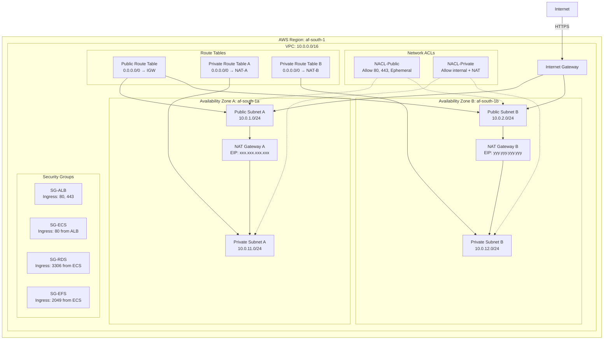
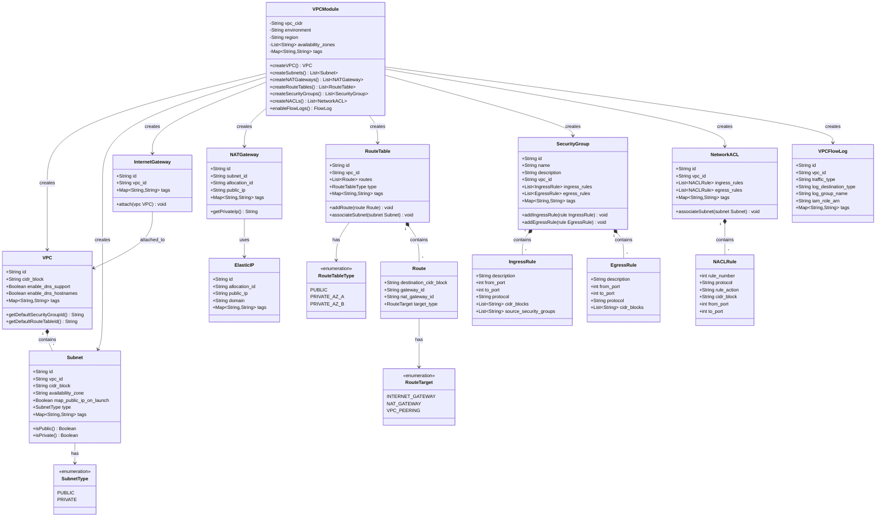

# VPC and Network Infrastructure - Low-Level Design

**Version**: 1.0
**Author**: Agentic Architect
**Date**: 2025-12-13
**Status**: Draft for Review
**Parent HLD**: [BBWS ECS WordPress HLD](../BBWS_ECS_WordPress_HLD.md)

---

## Document History

| Version | Date | Changes | Owner |
|---------|------|---------|-------|
| 1.0 | 2025-12-13 | Initial LLD for VPC and network infrastructure | Agentic Architect |

---

## 1. Introduction

### 1.1 Purpose

This Low-Level Design (LLD) document provides implementation-level details for the **VPC and Network Infrastructure** component of the BBWS ISP-Style ECS Fargate WordPress Hosting Platform. This document is intended for DevOps engineers who will implement the network foundation for the multi-tenant WordPress hosting platform.

### 1.2 Parent HLD Reference

This LLD details the VPC component specified in Section 4.3 (Layer 3: Compute) and User Story US-001 of the [BBWS ECS WordPress HLD](../BBWS_ECS_WordPress_HLD.md).

### 1.3 Component Overview

The VPC and Network Infrastructure component provides:
- Isolated network environment for WordPress hosting platform
- Multi-AZ deployment for high availability
- Public subnets for internet-facing load balancers
- Private subnets for ECS containers, RDS, and EFS
- NAT Gateway for outbound internet access from private subnets
- Internet Gateway for inbound traffic
- Security Groups for granular traffic control
- Network ACLs for subnet-level protection
- VPC Flow Logs for network traffic analysis

### 1.4 Technology Stack

| Layer | Technology | Purpose |
|-------|------------|---------|
| Infrastructure | AWS VPC | Network isolation |
| Configuration | Terraform | Infrastructure as Code |
| CIDR Planning | /16 network | 65,536 IP addresses |
| Availability Zones | 2 AZs (af-south-1a, af-south-1b) | High availability |
| DNS | Route53 Resolver | Internal DNS resolution |

### 1.5 Business Benefits

- **Network Isolation**: Complete isolation from other AWS workloads (BA-005)
- **High Availability**: Multi-AZ design for 99.9% availability (NFR)
- **Security**: Defense-in-depth with Security Groups and NACLs (BA-009)
- **Scalability**: Large CIDR block supports 20+ tenants (BA-013)

### 1.6 Dependencies

| Dependency | Type | Purpose |
|------------|------|---------|
| AWS Region | Infrastructure | af-south-1 (Cape Town) |
| Availability Zones | Infrastructure | af-south-1a, af-south-1b |
| Terraform | Tooling | Infrastructure provisioning |
| AWS CLI | Tooling | Validation and testing |

---

## 2. High Level Epic Overview

### Epic 1: Infrastructure Setup

| User Story ID | User Story | Test Scenario(s) |
|---------------|------------|------------------|
| US-001 | As a DevOps Engineer, I want to provision the core VPC infrastructure so that I have a secure network foundation | GIVEN AWS account WHEN I execute `terraform apply -target=module.vpc` THEN VPC is created with CIDR 10.0.0.0/16 AND 2 public subnets AND 2 private subnets AND NAT Gateway AND Internet Gateway AND Security Groups are configured |

---

## 3. Component Diagram (Network Architecture)

### 3.1 VPC Architecture



### 3.2 Class Diagram (Terraform Module Structure)



---

## 4. Network Design Specifications

### 4.1 CIDR Allocation

| Network Component | CIDR Block | IP Count | Purpose |
|-------------------|------------|----------|---------|
| VPC | 10.0.0.0/16 | 65,536 | Overall network |
| Public Subnet A | 10.0.1.0/24 | 256 | ALB, NAT Gateway (AZ-A) |
| Public Subnet B | 10.0.2.0/24 | 256 | ALB, NAT Gateway (AZ-B) |
| Private Subnet A | 10.0.11.0/24 | 256 | ECS, RDS, EFS (AZ-A) |
| Private Subnet B | 10.0.12.0/24 | 256 | ECS, RDS, EFS (AZ-B) |
| Reserved for future | 10.0.3.0/24 - 10.0.10.0/24 | ~2,000 | Additional public subnets |
| Reserved for future | 10.0.13.0/24 - 10.0.255.0/24 | ~62,000 | Additional private subnets |

### 4.2 Availability Zone Mapping

| AZ | Public Subnet | Private Subnet | NAT Gateway | Resources |
|----|---------------|----------------|-------------|-----------|
| af-south-1a | 10.0.1.0/24 | 10.0.11.0/24 | NAT-GW-A | ALB (primary), ECS tasks, RDS (primary) |
| af-south-1b | 10.0.2.0/24 | 10.0.12.0/24 | NAT-GW-B | ALB (standby), ECS tasks, RDS (standby) |

### 4.3 Security Group Rules

#### SG-ALB: Application Load Balancer

**Ingress Rules:**

| Rule # | Protocol | Port | Source | Description |
|--------|----------|------|--------|-------------|
| 1 | TCP | 80 | 0.0.0.0/0 | HTTP from internet |
| 2 | TCP | 443 | 0.0.0.0/0 | HTTPS from internet |

**Egress Rules:**

| Rule # | Protocol | Port | Destination | Description |
|--------|----------|------|-------------|-------------|
| 1 | TCP | 80 | SG-ECS | Forward to ECS containers |

#### SG-ECS: ECS Fargate Containers

**Ingress Rules:**

| Rule # | Protocol | Port | Source | Description |
|--------|----------|------|--------|-------------|
| 1 | TCP | 80 | SG-ALB | HTTP from ALB |

**Egress Rules:**

| Rule # | Protocol | Port | Destination | Description |
|--------|----------|------|-------------|-------------|
| 1 | TCP | 3306 | SG-RDS | MySQL queries |
| 2 | TCP | 2049 | SG-EFS | NFS mount |
| 3 | TCP | 443 | 0.0.0.0/0 | HTTPS to internet (updates, plugins) |
| 4 | TCP | 80 | 0.0.0.0/0 | HTTP to internet (updates, plugins) |

#### SG-RDS: RDS MySQL Database

**Ingress Rules:**

| Rule # | Protocol | Port | Source | Description |
|--------|----------|------|--------|-------------|
| 1 | TCP | 3306 | SG-ECS | MySQL from ECS containers |

**Egress Rules:**

| Rule # | Protocol | Port | Destination | Description |
|--------|----------|------|-------------|-------------|
| (none) | - | - | - | No outbound required |

#### SG-EFS: Elastic File System

**Ingress Rules:**

| Rule # | Protocol | Port | Source | Description |
|--------|----------|------|--------|-------------|
| 1 | TCP | 2049 | SG-ECS | NFS from ECS containers |

**Egress Rules:**

| Rule # | Protocol | Port | Destination | Description |
|--------|----------|------|-------------|-------------|
| (none) | - | - | - | No outbound required |

### 4.4 Network ACL Rules

#### NACL-Public: Public Subnets

**Ingress Rules:**

| Rule # | Protocol | Port Range | Source | Action | Description |
|--------|----------|------------|--------|--------|-------------|
| 100 | TCP | 80 | 0.0.0.0/0 | ALLOW | HTTP |
| 110 | TCP | 443 | 0.0.0.0/0 | ALLOW | HTTPS |
| 120 | TCP | 1024-65535 | 0.0.0.0/0 | ALLOW | Ephemeral ports (return traffic) |
| * | ALL | ALL | 0.0.0.0/0 | DENY | Default deny |

**Egress Rules:**

| Rule # | Protocol | Port Range | Destination | Action | Description |
|--------|----------|------------|-------------|--------|-------------|
| 100 | TCP | 80 | 0.0.0.0/0 | ALLOW | HTTP to internet |
| 110 | TCP | 443 | 0.0.0.0/0 | ALLOW | HTTPS to internet |
| 120 | TCP | 1024-65535 | 0.0.0.0/0 | ALLOW | Ephemeral ports |
| * | ALL | ALL | 0.0.0.0/0 | DENY | Default deny |

#### NACL-Private: Private Subnets

**Ingress Rules:**

| Rule # | Protocol | Port Range | Source | Action | Description |
|--------|----------|------------|--------|--------|-------------|
| 100 | TCP | 80 | 10.0.0.0/16 | ALLOW | HTTP from VPC |
| 110 | TCP | 443 | 10.0.0.0/16 | ALLOW | HTTPS from VPC |
| 120 | TCP | 3306 | 10.0.0.0/16 | ALLOW | MySQL from VPC |
| 130 | TCP | 2049 | 10.0.0.0/16 | ALLOW | NFS from VPC |
| 140 | TCP | 1024-65535 | 0.0.0.0/0 | ALLOW | Ephemeral ports (return traffic) |
| * | ALL | ALL | 0.0.0.0/0 | DENY | Default deny |

**Egress Rules:**

| Rule # | Protocol | Port Range | Destination | Action | Description |
|--------|----------|------------|-------------|--------|-------------|
| 100 | TCP | 80 | 0.0.0.0/0 | ALLOW | HTTP to internet (via NAT) |
| 110 | TCP | 443 | 0.0.0.0/0 | ALLOW | HTTPS to internet (via NAT) |
| 120 | TCP | 3306 | 10.0.0.0/16 | ALLOW | MySQL within VPC |
| 130 | TCP | 2049 | 10.0.0.0/16 | ALLOW | NFS within VPC |
| 140 | TCP | 1024-65535 | 0.0.0.0/0 | ALLOW | Ephemeral ports |
| * | ALL | ALL | 0.0.0.0/0 | DENY | Default deny |

### 4.5 Route Tables

#### Public Route Table

| Destination | Target | Purpose |
|-------------|--------|---------|
| 10.0.0.0/16 | local | VPC internal traffic |
| 0.0.0.0/0 | igw-xxxxxx | Internet access |

**Associated Subnets:** Public Subnet A, Public Subnet B

#### Private Route Table A

| Destination | Target | Purpose |
|-------------|--------|---------|
| 10.0.0.0/16 | local | VPC internal traffic |
| 0.0.0.0/0 | nat-xxxxxx (NAT-GW-A) | Internet access via NAT Gateway A |

**Associated Subnets:** Private Subnet A

#### Private Route Table B

| Destination | Target | Purpose |
|-------------|--------|---------|
| 10.0.0.0/16 | local | VPC internal traffic |
| 0.0.0.0/0 | nat-yyyyyy (NAT-GW-B) | Internet access via NAT Gateway B |

**Associated Subnets:** Private Subnet B

---

## 5. Sequence Diagram

### 5.1 VPC Provisioning Sequence

```mermaid
sequenceDiagram
    participant DevOps
    participant Terraform
    participant AWS_VPC
    participant AWS_EC2
    participant CloudWatch

    DevOps->>Terraform: terraform apply -target=module.vpc

    rect rgb(240, 240, 255)
        Note over Terraform: try block - VPC Provisioning

        Terraform->>AWS_VPC: CreateVPC(cidr=10.0.0.0/16, enableDnsSupport=true)
        AWS_VPC-->>Terraform: vpc-id

        Terraform->>AWS_VPC: CreateTags(vpc-id, Name=bbws-dev-vpc)
        AWS_VPC-->>Terraform: success

        Terraform->>AWS_EC2: CreateInternetGateway()
        AWS_EC2-->>Terraform: igw-id

        Terraform->>AWS_VPC: AttachInternetGateway(vpc-id, igw-id)
        AWS_VPC-->>Terraform: success

        Terraform->>AWS_EC2: CreateSubnet(vpc-id, cidr=10.0.1.0/24, az=af-south-1a)
        AWS_EC2-->>Terraform: subnet-public-a-id

        Terraform->>AWS_EC2: CreateSubnet(vpc-id, cidr=10.0.2.0/24, az=af-south-1b)
        AWS_EC2-->>Terraform: subnet-public-b-id

        Terraform->>AWS_EC2: CreateSubnet(vpc-id, cidr=10.0.11.0/24, az=af-south-1a)
        AWS_EC2-->>Terraform: subnet-private-a-id

        Terraform->>AWS_EC2: CreateSubnet(vpc-id, cidr=10.0.12.0/24, az=af-south-1b)
        AWS_EC2-->>Terraform: subnet-private-b-id

        Terraform->>AWS_EC2: AllocateAddress(domain=vpc)
        AWS_EC2-->>Terraform: eip-a-allocation-id, public-ip-a

        Terraform->>AWS_EC2: AllocateAddress(domain=vpc)
        AWS_EC2-->>Terraform: eip-b-allocation-id, public-ip-b

        Terraform->>AWS_EC2: CreateNatGateway(subnet-public-a-id, eip-a-allocation-id)
        AWS_EC2-->>Terraform: nat-gw-a-id

        Terraform->>AWS_EC2: CreateNatGateway(subnet-public-b-id, eip-b-allocation-id)
        AWS_EC2-->>Terraform: nat-gw-b-id

        Terraform->>AWS_EC2: WaitForNatGatewayAvailable(nat-gw-a-id, timeout=300s)
        AWS_EC2-->>Terraform: available

        Terraform->>AWS_EC2: WaitForNatGatewayAvailable(nat-gw-b-id, timeout=300s)
        AWS_EC2-->>Terraform: available

        Terraform->>AWS_EC2: CreateRouteTable(vpc-id, Name=public-rt)
        AWS_EC2-->>Terraform: rt-public-id

        Terraform->>AWS_EC2: CreateRoute(rt-public-id, destination=0.0.0.0/0, gateway=igw-id)
        AWS_EC2-->>Terraform: success

        Terraform->>AWS_EC2: AssociateRouteTable(rt-public-id, subnet-public-a-id)
        AWS_EC2-->>Terraform: association-id

        Terraform->>AWS_EC2: AssociateRouteTable(rt-public-id, subnet-public-b-id)
        AWS_EC2-->>Terraform: association-id

        Terraform->>AWS_EC2: CreateRouteTable(vpc-id, Name=private-rt-a)
        AWS_EC2-->>Terraform: rt-private-a-id

        Terraform->>AWS_EC2: CreateRoute(rt-private-a-id, destination=0.0.0.0/0, nat_gateway=nat-gw-a-id)
        AWS_EC2-->>Terraform: success

        Terraform->>AWS_EC2: AssociateRouteTable(rt-private-a-id, subnet-private-a-id)
        AWS_EC2-->>Terraform: association-id

        Terraform->>AWS_EC2: CreateRouteTable(vpc-id, Name=private-rt-b)
        AWS_EC2-->>Terraform: rt-private-b-id

        Terraform->>AWS_EC2: CreateRoute(rt-private-b-id, destination=0.0.0.0/0, nat_gateway=nat-gw-b-id)
        AWS_EC2-->>Terraform: success

        Terraform->>AWS_EC2: AssociateRouteTable(rt-private-b-id, subnet-private-b-id)
        AWS_EC2-->>Terraform: association-id

        Terraform->>AWS_EC2: CreateSecurityGroup(vpc-id, Name=sg-alb)
        AWS_EC2-->>Terraform: sg-alb-id

        Terraform->>AWS_EC2: AuthorizeSecurityGroupIngress(sg-alb-id, protocol=tcp, port=80, cidr=0.0.0.0/0)
        AWS_EC2-->>Terraform: success

        Terraform->>AWS_EC2: AuthorizeSecurityGroupIngress(sg-alb-id, protocol=tcp, port=443, cidr=0.0.0.0/0)
        AWS_EC2-->>Terraform: success

        Terraform->>AWS_EC2: CreateSecurityGroup(vpc-id, Name=sg-ecs)
        AWS_EC2-->>Terraform: sg-ecs-id

        Terraform->>AWS_EC2: AuthorizeSecurityGroupIngress(sg-ecs-id, protocol=tcp, port=80, source_sg=sg-alb-id)
        AWS_EC2-->>Terraform: success

        Terraform->>AWS_EC2: CreateSecurityGroup(vpc-id, Name=sg-rds)
        AWS_EC2-->>Terraform: sg-rds-id

        Terraform->>AWS_EC2: AuthorizeSecurityGroupIngress(sg-rds-id, protocol=tcp, port=3306, source_sg=sg-ecs-id)
        AWS_EC2-->>Terraform: success

        Terraform->>AWS_EC2: CreateSecurityGroup(vpc-id, Name=sg-efs)
        AWS_EC2-->>Terraform: sg-efs-id

        Terraform->>AWS_EC2: AuthorizeSecurityGroupIngress(sg-efs-id, protocol=tcp, port=2049, source_sg=sg-ecs-id)
        AWS_EC2-->>Terraform: success

        Terraform->>CloudWatch: CreateLogGroup(name=/aws/vpc/bbws-dev-flow-logs)
        CloudWatch-->>Terraform: log-group-arn

        Terraform->>AWS_EC2: CreateFlowLogs(vpc-id, traffic-type=ALL, log-destination=log-group-arn)
        AWS_EC2-->>Terraform: flow-log-id

        Terraform-->>DevOps: VPC provisioned successfully
    end

    alt BusinessException (Expected Configuration Errors)
        Note over Terraform: catch BusinessException
        Terraform->>Terraform: logger.error(exception)
        Terraform-->>DevOps: 400 Bad Request (InvalidCIDRException)
        Terraform-->>DevOps: 409 Conflict (CIDROverlapException)
        Terraform-->>DevOps: 422 Unprocessable Entity (InvalidSubnetConfigException)
    end

    alt UnexpectedException (System/Technical Errors)
        Note over Terraform: catch UnexpectedException
        Terraform->>Terraform: logger.error(exception)
        Terraform->>Terraform: rollback partial resources
        Terraform-->>DevOps: 500 Internal Server Error (AWSServiceException)
        Terraform-->>DevOps: 503 Service Unavailable (EC2ServiceException)
        Terraform-->>DevOps: 504 Gateway Timeout (TimeoutException)
    end

    DevOps->>DevOps: Verify VPC with aws ec2 describe-vpcs
```



---

## 6. Messaging and Notifications

### 6.1 Notification Targets

| Environment | Email | Purpose |
|-------------|-------|---------|
| DEV | dev-network@bbws.com | Network infrastructure alerts |
| SIT | sit-network@bbws.com | SIT network alerts |
| PROD | prod-network@bbws.com, infra-team@bbws.com | Production network alerts |

### 6.2 Alert Types

| Alert | Trigger | Severity | Notification Method |
|-------|---------|----------|---------------------|
| NAT Gateway failure | NAT Gateway state != available | Critical | SNS → Email + SMS |
| High VPC Flow Logs rejected traffic | > 1000 rejected packets/min | High | SNS → Email |
| Subnet IP exhaustion | < 10 IPs available | High | SNS → Email |
| Security group modification | SG rule added/removed | Medium | SNS → Email |
| VPC peering failure | Peering connection state != active | High | SNS → Email |

---

## 7. Non-Functional Requirements

### 7.1 Performance

| Metric | Target | Measurement |
|--------|--------|-------------|
| VPC provisioning time | < 5 minutes | Terraform execution time |
| NAT Gateway latency | < 10ms (p99) | VPC Flow Logs analysis |
| Inter-AZ latency | < 2ms | VPC Flow Logs analysis |
| DNS resolution time | < 50ms | Route53 Resolver metrics |

### 7.2 Availability

| Aspect | Target | Implementation |
|--------|--------|----------------|
| VPC availability | 99.99% | AWS SLA |
| NAT Gateway availability | 99.9% per AZ | Multi-AZ deployment |
| Network redundancy | 100% | 2 AZs, 2 NAT Gateways |

### 7.3 Scalability

| Aspect | Current | Future | Strategy |
|--------|---------|--------|----------|
| Subnets | 4 (2 public, 2 private) | 20+ | Pre-allocated CIDR blocks |
| IP addresses | 1,024 usable | 65,000+ | /16 VPC CIDR |
| Security groups | 4 | 50+ | VPC quota increase |
| NAT Gateways | 2 | 4+ | Additional AZs |

### 7.4 Cost

| Component | Monthly Cost | Notes |
|-----------|--------------|-------|
| NAT Gateway (2x) | ~$65 | $0.045/hour × 2 × 730 hours |
| Elastic IPs (2x) | ~$7 | $0.005/hour × 2 × 730 hours (if not attached) |
| VPC Flow Logs | ~$10 | CloudWatch Logs storage |
| Data transfer | Variable | $0.045/GB NAT Gateway data processing |
| **Total VPC** | **~$82/month** | Shared across all tenants |

---

## 8. Risks and Mitigations

| Risk ID | Risk | Likelihood | Impact | Mitigation |
|---------|------|------------|--------|------------|
| R-VPC-001 | NAT Gateway single point of failure per AZ | Medium | High | Deploy 2 NAT Gateways (one per AZ) |
| R-VPC-002 | CIDR block exhaustion | Low | High | Use /16 CIDR (65,536 IPs) with monitoring |
| R-VPC-003 | Security group misconfiguration | Medium | Critical | IaC validation, peer review, automated testing |
| R-VPC-004 | VPC Flow Logs storage costs | Medium | Low | Retention policy (30 days), S3 lifecycle |
| R-VPC-005 | NAT Gateway data transfer costs | High | Medium | Monitor egress traffic, use VPC endpoints |
| R-VPC-006 | Inter-AZ data transfer costs | Medium | Medium | Optimize cross-AZ communication |

---

## 9. Tagging Strategy

### 9.1 VPC Resource Tags

| Tag Key | Tag Value | Purpose |
|---------|-----------|---------|
| `bbws:component` | `vpc` | Component identification |
| `bbws:environment` | `dev | sit | prod` | Environment classification |
| `bbws:managed-by` | `terraform` | Management method |
| `bbws:cost-center` | `infrastructure` | Cost allocation |
| `bbws:provisioned-at` | `{ISO8601-timestamp}` | Lifecycle tracking |
| `Name` | `bbws-{env}-{resource-type}` | Human-readable name |

### 9.2 Example Tags

**VPC:**
```
Name: bbws-dev-vpc
bbws:component: vpc
bbws:environment: dev
bbws:managed-by: terraform
bbws:cost-center: infrastructure
```

**Subnet:**
```
Name: bbws-dev-public-subnet-a
bbws:component: vpc
bbws:subnet-type: public
bbws:availability-zone: af-south-1a
bbws:environment: dev
bbws:managed-by: terraform
```

---

## 10. Troubleshooting Playbook

### 10.1 NAT Gateway Connectivity Issues

**Symptom**: ECS containers cannot reach internet

**Diagnosis**:
```bash
# Check NAT Gateway status
aws ec2 describe-nat-gateways \
  --filter "Name=vpc-id,Values=vpc-xxxxxx" \
  --profile Tebogo-dev

# Check route table associations
aws ec2 describe-route-tables \
  --filters "Name=vpc-id,Values=vpc-xxxxxx" \
  --profile Tebogo-dev

# Check VPC Flow Logs for rejected traffic
aws logs filter-log-events \
  --log-group-name /aws/vpc/bbws-dev-flow-logs \
  --filter-pattern "[version, account, eni, source, destination, srcport, destport, protocol, packets, bytes, windowstart, windowend, action=REJECT, flowlogstatus]" \
  --profile Tebogo-dev
```

**Resolution**:
- Verify NAT Gateway state is `available`
- Confirm route table has `0.0.0.0/0 → nat-xxxxx`
- Check security group egress rules allow HTTPS (443)
- Verify subnet NACL allows ephemeral ports (1024-65535)

### 10.2 Security Group Blocking Traffic

**Symptom**: ALB cannot reach ECS containers

**Diagnosis**:
```bash
# Describe security group rules
aws ec2 describe-security-groups \
  --group-ids sg-ecs-xxxx \
  --profile Tebogo-dev

# Check VPC Flow Logs
aws logs tail /aws/vpc/bbws-dev-flow-logs --follow --profile Tebogo-dev
```

**Resolution**:
- Verify SG-ECS ingress allows TCP 80 from SG-ALB
- Check security group references (not CIDR blocks)
- Ensure no NACL conflicts

### 10.3 Subnet IP Exhaustion

**Symptom**: Cannot launch new ECS tasks

**Diagnosis**:
```bash
# Check available IPs
aws ec2 describe-subnets \
  --subnet-ids subnet-private-a-xxxx \
  --query 'Subnets[0].AvailableIpAddressCount' \
  --profile Tebogo-dev
```

**Resolution**:
- Add additional private subnets from reserved CIDR blocks
- Scale down unused ECS tasks
- Consider larger subnet CIDR (/23 instead of /24)

### 10.4 VPC Flow Logs Not Logging

**Symptom**: No traffic logs appearing in CloudWatch

**Diagnosis**:
```bash
# Check Flow Log status
aws ec2 describe-flow-logs \
  --filter "Name=resource-id,Values=vpc-xxxxxx" \
  --profile Tebogo-dev

# Verify IAM role permissions
aws iam get-role --role-name vpc-flow-logs-role --profile Tebogo-dev
```

**Resolution**:
- Verify Flow Log status is `ACTIVE`
- Check IAM role has `logs:CreateLogStream` and `logs:PutLogEvents`
- Confirm CloudWatch log group exists

---

## 11. Security

### 11.1 Network Security Layers

| Layer | Control | Implementation |
|-------|---------|----------------|
| Perimeter | Internet Gateway | Only in public subnets |
| Subnet | Network ACLs | Stateless filtering at subnet boundary |
| Instance | Security Groups | Stateful filtering at ENI level |
| Application | WAF (future) | OWASP rules on ALB |

### 11.2 Encryption

| Aspect | Implementation |
|--------|----------------|
| Data in Transit | TLS 1.2+ enforced on ALB |
| VPC Traffic | No encryption (private network) |
| VPC Flow Logs | Encrypted with CloudWatch Logs KMS |

### 11.3 Access Control

| Resource | Access Method | Authentication |
|----------|---------------|----------------|
| VPC Management | AWS Console, CLI | IAM credentials |
| Security Group Changes | Terraform | Peer-reviewed PRs |
| VPC Flow Logs | CloudWatch Logs | IAM roles |

### 11.4 Compliance

| Requirement | Implementation |
|-------------|----------------|
| Data Residency | af-south-1 region (South Africa) |
| Network Logging | VPC Flow Logs enabled for all traffic |
| Change Tracking | CloudTrail logs all VPC API calls |
| Infrastructure as Code | Terraform state in S3 with versioning |

---

## 12. Signoff

| Signatory | Role | Feedback | Status | Date |
|-----------|------|----------|--------|------|
| | Network Architect | | Pending | |
| | Security Engineer | | Pending | |
| | DevOps Lead | | Pending | |
| | Cloud Architect | | Pending | |

---

## 13. To Be Confirmed (TBC)

| TBC ID | Category | Description | Owner | Status |
|--------|----------|-------------|-------|--------|
| TBC-VPC-001 | Decision | VPC peering for multi-account setup (DEV/SIT/PROD) | Network Team | Open |
| TBC-VPC-002 | Decision | VPC endpoints for S3, DynamoDB to reduce NAT costs | FinOps | Open |
| TBC-VPC-003 | Clarification | Flow Log retention period (30 days vs 90 days) | Compliance | Open |
| TBC-VPC-004 | Decision | Third AZ deployment for production (af-south-1c) | Reliability Team | Open |
| TBC-VPC-005 | Decision | Transit Gateway for future multi-VPC connectivity | Network Team | Open |

---

## 14. Definition of Terms

| Term | Definition | Category |
|------|------------|----------|
| Availability Zone (AZ) | Isolated location within AWS region | AWS Infrastructure |
| CIDR Block | Classless Inter-Domain Routing IP range notation | Networking |
| Elastic IP (EIP) | Static public IPv4 address | AWS Service |
| Internet Gateway (IGW) | VPC component enabling internet access | AWS Service |
| Multi-AZ | Deployment across multiple availability zones | Architecture Pattern |
| NAT Gateway | Network Address Translation for private subnet egress | AWS Service |
| Network ACL (NACL) | Stateless firewall at subnet level | AWS Service |
| Route Table | Routing rules for subnet traffic | AWS Service |
| Security Group | Stateful firewall at instance level | AWS Service |
| VPC | Virtual Private Cloud - isolated network | AWS Service |
| VPC Flow Logs | Network traffic logging | AWS Service |

---

## 15. Appendices

### Appendix A: Terraform VPC Module

```hcl
# terraform/modules/vpc/main.tf

variable "environment" {
  type        = string
  description = "Environment name (dev, sit, prod)"
}

variable "vpc_cidr" {
  type        = string
  description = "CIDR block for VPC"
  default     = "10.0.0.0/16"
}

variable "availability_zones" {
  type        = list(string)
  description = "Availability zones"
  default     = ["af-south-1a", "af-south-1b"]
}

resource "aws_vpc" "main" {
  cidr_block           = var.vpc_cidr
  enable_dns_support   = true
  enable_dns_hostnames = true

  tags = {
    Name                 = "bbws-${var.environment}-vpc"
    "bbws:component"     = "vpc"
    "bbws:environment"   = var.environment
    "bbws:managed-by"    = "terraform"
  }
}

resource "aws_internet_gateway" "main" {
  vpc_id = aws_vpc.main.id

  tags = {
    Name                 = "bbws-${var.environment}-igw"
    "bbws:component"     = "vpc"
    "bbws:environment"   = var.environment
  }
}

resource "aws_subnet" "public" {
  count                   = 2
  vpc_id                  = aws_vpc.main.id
  cidr_block              = "10.0.${count.index + 1}.0/24"
  availability_zone       = var.availability_zones[count.index]
  map_public_ip_on_launch = true

  tags = {
    Name                      = "bbws-${var.environment}-public-subnet-${count.index + 1}"
    "bbws:component"          = "vpc"
    "bbws:subnet-type"        = "public"
    "bbws:availability-zone"  = var.availability_zones[count.index]
    "bbws:environment"        = var.environment
  }
}

resource "aws_subnet" "private" {
  count             = 2
  vpc_id            = aws_vpc.main.id
  cidr_block        = "10.0.${count.index + 11}.0/24"
  availability_zone = var.availability_zones[count.index]

  tags = {
    Name                      = "bbws-${var.environment}-private-subnet-${count.index + 1}"
    "bbws:component"          = "vpc"
    "bbws:subnet-type"        = "private"
    "bbws:availability-zone"  = var.availability_zones[count.index]
    "bbws:environment"        = var.environment
  }
}

resource "aws_eip" "nat" {
  count  = 2
  domain = "vpc"

  tags = {
    Name                 = "bbws-${var.environment}-nat-eip-${count.index + 1}"
    "bbws:component"     = "vpc"
    "bbws:environment"   = var.environment
  }
}

resource "aws_nat_gateway" "main" {
  count         = 2
  allocation_id = aws_eip.nat[count.index].id
  subnet_id     = aws_subnet.public[count.index].id

  tags = {
    Name                 = "bbws-${var.environment}-nat-gw-${count.index + 1}"
    "bbws:component"     = "vpc"
    "bbws:environment"   = var.environment
  }

  depends_on = [aws_internet_gateway.main]
}

# Continue with route tables, security groups, NACLs, Flow Logs...
```

### Appendix B: Network Testing Script

```bash
#!/bin/bash
# test_vpc_connectivity.sh

VPC_ID=$1
ENVIRONMENT=$2
PROFILE=$3

echo "Testing VPC connectivity for ${ENVIRONMENT}..."

# Test 1: VPC exists
aws ec2 describe-vpcs --vpc-ids ${VPC_ID} --profile ${PROFILE} || exit 1

# Test 2: Internet Gateway attached
IGW=$(aws ec2 describe-internet-gateways --filters "Name=attachment.vpc-id,Values=${VPC_ID}" --query 'InternetGateways[0].InternetGatewayId' --output text --profile ${PROFILE})
echo "Internet Gateway: ${IGW}"

# Test 3: NAT Gateways available
NAT_COUNT=$(aws ec2 describe-nat-gateways --filter "Name=vpc-id,Values=${VPC_ID}" "Name=state,Values=available" --query 'NatGateways | length(@)' --profile ${PROFILE})
echo "NAT Gateways available: ${NAT_COUNT}"

if [ ${NAT_COUNT} -lt 2 ]; then
  echo "ERROR: Expected 2 NAT Gateways, found ${NAT_COUNT}"
  exit 1
fi

# Test 4: Route tables configured
ROUTE_TABLE_COUNT=$(aws ec2 describe-route-tables --filters "Name=vpc-id,Values=${VPC_ID}" --query 'RouteTables | length(@)' --profile ${PROFILE})
echo "Route tables: ${ROUTE_TABLE_COUNT}"

# Test 5: Security groups created
SG_COUNT=$(aws ec2 describe-security-groups --filters "Name=vpc-id,Values=${VPC_ID}" --query 'SecurityGroups | length(@)' --profile ${PROFILE})
echo "Security groups: ${SG_COUNT}"

echo "VPC connectivity test passed!"
```

---

## 16. References

| Ref ID | Document | Type | Description |
|--------|----------|------|-------------|
| REF-VPC-001 | [BBWS ECS WordPress HLD](../BBWS_ECS_WordPress_HLD.md) | Parent HLD | High-level architecture |
| REF-VPC-002 | [AWS VPC User Guide](https://docs.aws.amazon.com/vpc/latest/userguide/) | AWS Documentation | VPC configuration guide |
| REF-VPC-003 | [AWS VPC Best Practices](https://docs.aws.amazon.com/vpc/latest/userguide/vpc-security-best-practices.html) | AWS Documentation | Security best practices |
| REF-VPC-004 | [VPC Flow Logs Guide](https://docs.aws.amazon.com/vpc/latest/userguide/flow-logs.html) | AWS Documentation | Flow logs configuration |
| REF-VPC-005 | [NAT Gateway Pricing](https://aws.amazon.com/vpc/pricing/) | AWS Pricing | Cost estimation |

---

**END OF DOCUMENT**
