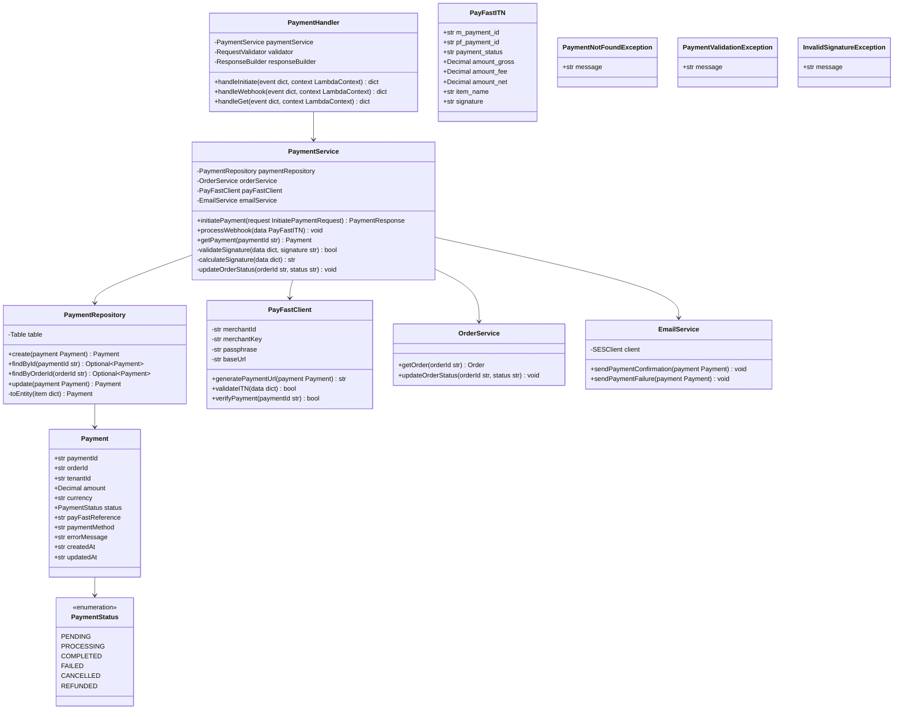
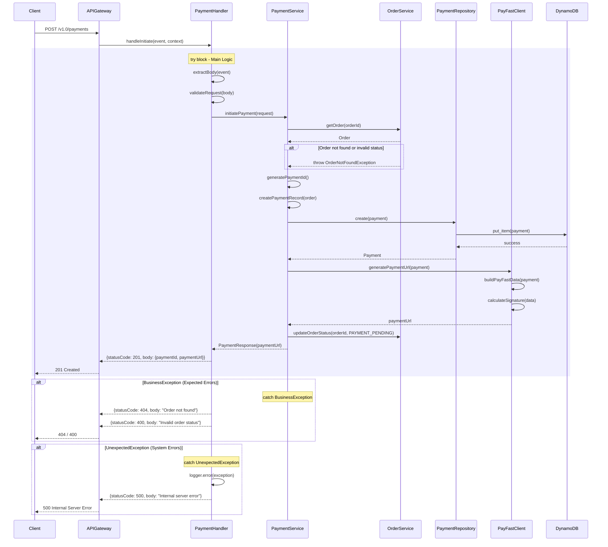
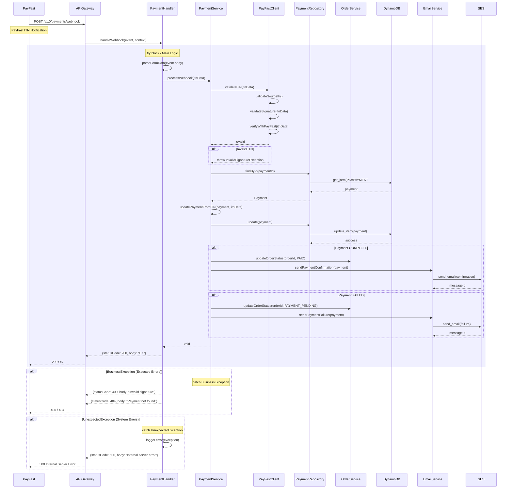
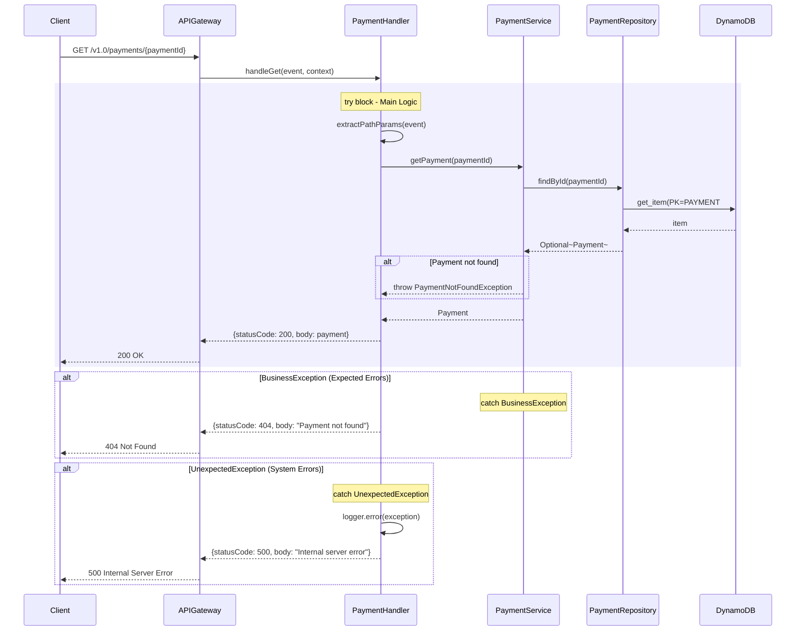

# CPP Payment Lambda - Low-Level Design

**Version**: 2.0
**Created**: 2025-12-15
**Updated**: 2026-01-05
**Status**: Active
**Component**: Payment Service (2_bbws_payment_lambda)
**Parent HLD**: [HLD 2.1.9 Payment Management](../HLDs/2.1.9_HLD_Payment_Management.md)
**Parent BRS**: [BRS 2.1.9 Payment Management](../BRS/2.1.9_BRS_Payment_Management.md)
**Payment Research**: [PayFast Integration Research](../research/pay_research.md)

---

## Document Control

| Version | Date | Author | Changes |
|---------|------|--------|---------|
| 1.0 | 2025-12-15 | Agentic Architect | Initial version |
| 2.0 | 2026-01-05 | Agentic Architect | Enhanced PayFast integration details, signature algorithm, ITN validation, environment config |

---

## 1. Introduction

### 1.1 Purpose

This LLD provides implementation-level details for the Payment Lambda service, which handles payment processing via PayFast payment gateway for the Customer Portal Public application.

### 1.2 Component Overview

| Attribute | Value |
|-----------|-------|
| Repository | `2_bbws_payment_lambda` |
| Runtime | Python 3.12 |
| Memory | 512MB |
| Timeout | 30s |
| Architecture | arm64 |

### 1.3 Lambda Functions (3 Total)

| Function | Endpoint | Description |
|----------|----------|-------------|
| initiate_payment | POST /v1.0/payments | Initiate PayFast payment |
| payment_webhook | POST /v1.0/payments/webhook | Handle PayFast ITN callback |
| get_payment | GET /v1.0/payments/{paymentId} | Get payment details |

---

## 2. High Level Epic Overview

| User Story # | Epic | User Story | Test Scenario(s) |
|--------------|------|------------|------------------|
| US-PAY-001 | Payments | As a user, I want to initiate payment | Given order, then PayFast redirect URL returned |
| US-PAY-002 | Payments | As system, I process payment notifications | Given ITN callback, then payment status updated |
| US-PAY-003 | Payments | As a user, I want to view payment status | Given paymentId, then payment details returned |
| US-PAY-004 | Payments | As system, I validate payment signatures | Given ITN, then signature validated |
| US-PAY-005 | Payments | As a user, I see payment failure reasons | Given failed payment, then error message shown |

---

## 3. Component Diagram



---

## 4. Sequence Diagrams

### 4.1 Initiate Payment Flow



### 4.2 PayFast Webhook (ITN) Flow



### 4.3 Get Payment Flow



---

## 5. Data Models

### 5.1 DynamoDB Schema

#### Payment Entity

| Attribute | Type | Description |
|-----------|------|-------------|
| PK | String | `PAYMENT#{paymentId}` |
| SK | String | `METADATA` |
| paymentId | String | UUID (sent to PayFast as m_payment_id) |
| orderId | String | Associated order |
| tenantId | String | Tenant reference |
| amount | Number | Amount in cents |
| currency | String | Currency code (ZAR) |
| status | String | Payment status |
| payFastReference | String | PayFast pf_payment_id |
| paymentMethod | String | Payment method used |
| errorMessage | String | Error details if failed |
| itnData | Map | Raw ITN data for audit |
| createdAt | String | ISO 8601 timestamp |
| updatedAt | String | ISO 8601 timestamp |

#### GSI: OrderIndex

| Attribute | Type |
|-----------|------|
| PK (orderId) | String |
| SK (createdAt) | String |

### 5.2 Pydantic Models

```python
from pydantic import BaseModel, Field
from decimal import Decimal
from typing import Optional, Dict, Any
from enum import Enum
from datetime import datetime

class PaymentStatus(str, Enum):
    PENDING = "PENDING"
    PROCESSING = "PROCESSING"
    COMPLETED = "COMPLETED"
    FAILED = "FAILED"
    CANCELLED = "CANCELLED"
    REFUNDED = "REFUNDED"

class Payment(BaseModel):
    payment_id: str = Field(..., alias="paymentId")
    order_id: str = Field(..., alias="orderId")
    tenant_id: str = Field(..., alias="tenantId")
    amount: Decimal
    currency: str = "ZAR"
    status: PaymentStatus
    pay_fast_reference: Optional[str] = Field(None, alias="payFastReference")
    payment_method: Optional[str] = Field(None, alias="paymentMethod")
    error_message: Optional[str] = Field(None, alias="errorMessage")
    itn_data: Optional[Dict[str, Any]] = Field(None, alias="itnData")
    created_at: datetime = Field(..., alias="createdAt")
    updated_at: datetime = Field(..., alias="updatedAt")

class InitiatePaymentRequest(BaseModel):
    order_id: str = Field(..., alias="orderId")
    return_url: str = Field(..., alias="returnUrl")
    cancel_url: str = Field(..., alias="cancelUrl")

class PaymentResponse(BaseModel):
    payment_id: str = Field(..., alias="paymentId")
    payment_url: str = Field(..., alias="paymentUrl")
    status: PaymentStatus

class PayFastITN(BaseModel):
    m_payment_id: str  # Our paymentId
    pf_payment_id: str  # PayFast reference
    payment_status: str
    item_name: str
    amount_gross: Decimal
    amount_fee: Decimal
    amount_net: Decimal
    name_first: Optional[str] = None
    name_last: Optional[str] = None
    email_address: Optional[str] = None
    merchant_id: str
    signature: str
```

---

## 6. Messaging and Notifications

### 6.1 Email Templates

| Template | Recipient | Trigger |
|----------|-----------|---------|
| payment_confirmation | Customer | Payment successful |
| payment_failed | Customer | Payment failed |
| payment_refunded | Customer | Payment refunded |

### 6.2 Admin Notifications

| Event | Notification |
|-------|--------------|
| Payment failed (3+ times) | Admin alert via SNS |
| Large payment (>R10,000) | Admin notification |

---

## 7. NFRs

| Metric | Target |
|--------|--------|
| Initiate payment latency (p95) | < 500ms |
| Webhook processing latency (p95) | < 1000ms |
| Payment data retention | 7 years |
| Webhook idempotency | Guaranteed |

---

## 8. Risks and Mitigations

| Risk | Impact | Mitigation |
|------|--------|------------|
| ITN not received | High | Implement payment status polling |
| Duplicate ITN processing | High | Idempotency via paymentId |
| Invalid ITN signature | High | Strict signature validation |
| PayFast service unavailable | High | Retry with exponential backoff |

---

## 9. Tagging

| Tag | Value |
|-----|-------|
| Project | BBWS |
| Component | PaymentLambda |
| CostCenter | BBWS-CPP |

---

## 10. Troubleshooting Playbook

| Issue | Resolution |
|-------|------------|
| Payment stuck in PENDING | Check PayFast dashboard, verify ITN endpoint |
| Invalid signature error | Verify passphrase, check URL encoding |
| ITN not received | Check API Gateway logs, verify PayFast IP whitelist |

---

## 11. Security

- PayFast credentials stored in AWS Secrets Manager
- ITN webhook validates:
  - Source IP (PayFast IP ranges)
  - Signature verification
  - Server-to-server confirmation
- PCI DSS compliance (no card data stored)
- All payment data encrypted at rest

### 11.1 PayFast IP Whitelist

```
197.97.145.144/28
197.97.145.160/28
41.74.179.192/27
```

---

## 12. Signoff

| Role | Name | Date | Signature |
|------|------|------|-----------|
| Technical Lead | | | |
| Business Owner | | | |

---

## 13. TBC

| # | Item | Status |
|---|------|--------|
| TBC-001 | EFT payment support | Open |
| TBC-002 | Recurring payments | Open |
| TBC-003 | Refund automation | Open |

---

## 14. Definition of Terms

| Term | Definition |
|------|------------|
| ITN | Instant Transaction Notification from PayFast |
| PayFast | South African payment gateway |
| PCI DSS | Payment Card Industry Data Security Standard |
| Idempotency | Ensuring duplicate requests have same effect |

---

## 15. Appendices

### 15.1 Project Structure

```
2_bbws_payment_lambda/
├── src/
│   ├── handlers/
│   │   ├── initiate_payment.py
│   │   ├── payment_webhook.py
│   │   └── get_payment.py
│   ├── services/
│   │   ├── payment_service.py
│   │   ├── order_service.py
│   │   ├── payfast_client.py
│   │   └── email_service.py
│   ├── repositories/
│   │   └── payment_repository.py
│   └── models/
│       ├── payment.py
│       └── payfast_itn.py
├── tests/
├── terraform/
└── requirements.txt
```

### 15.2 PayFast Integration Configuration

| Environment | Merchant ID | Base URL |
|-------------|-------------|----------|
| dev | sandbox_merchant | sandbox.payfast.co.za |
| sit | sandbox_merchant | sandbox.payfast.co.za |
| prod | live_merchant | www.payfast.co.za |

### 15.3 PayFast Signature Generation

**CRITICAL: Parameter Order**

The signature MUST be generated with parameters in this exact order (NOT alphabetical):

```python
PAYFAST_PARAM_ORDER = [
    'merchant_id', 'merchant_key', 'return_url', 'cancel_url',
    'notify_url', 'name_first', 'name_last', 'email_address',
    'cell_number', 'm_payment_id', 'amount', 'item_name',
    'item_description', 'custom_int1', 'custom_int2', 'custom_int3',
    'custom_int4', 'custom_int5', 'custom_str1', 'custom_str2',
    'custom_str3', 'custom_str4', 'custom_str5', 'email_confirmation',
    'confirmation_address', 'payment_method', 'subscription_type',
    'billing_date', 'recurring_amount', 'frequency', 'cycles'
]
```

**Signature Generation Algorithm:**

```python
import hashlib
from urllib.parse import quote_plus

def calculate_signature(data: dict, passphrase: str) -> str:
    """
    Generate MD5 signature for PayFast.

    IMPORTANT: Parameters must be in PayFast-specified order, NOT alphabetical.
    """
    # 1. Build parameter string in correct order (only non-empty values)
    param_string = ''
    for key in PAYFAST_PARAM_ORDER:
        if key in data and data[key] and str(data[key]).strip():
            value = str(data[key])
            # URL encode with spaces as '+' not '%20'
            encoded_value = quote_plus(value).replace('%20', '+')
            param_string += f"{key}={encoded_value}&"

    # 2. Add passphrase (required for sandbox, optional for production)
    if passphrase:
        param_string += f"passphrase={quote_plus(passphrase).replace('%20', '+')}"
    else:
        # Remove trailing '&' if no passphrase
        param_string = param_string.rstrip('&')

    # 3. Generate MD5 hash
    return hashlib.md5(param_string.encode()).hexdigest()
```

**Common Signature Issues:**

| Issue | Cause | Solution |
|-------|-------|----------|
| Signature mismatch | Wrong parameter order | Use exact PayFast order (NOT alphabetical) |
| Signature mismatch | Incorrect URL encoding | Encode spaces as '+' not '%20' |
| Signature mismatch | Empty passphrase in prod | Don't include passphrase param if empty |
| Signature mismatch | Including empty values | Only include non-empty parameters |

### 15.4 ITN Validation Steps

The ITN handler MUST perform these validation steps in order:

```python
async def validate_itn(itn_data: dict, source_ip: str) -> bool:
    """
    Validate PayFast ITN notification.
    All steps must pass for ITN to be valid.
    """
    # Step 1: Verify source IP (PayFast servers only)
    if not is_payfast_ip(source_ip):
        logger.warning(f"ITN from invalid IP: {source_ip}")
        return False

    # Step 2: Validate signature
    received_signature = itn_data.pop('signature', '')
    calculated_signature = calculate_signature(itn_data, PASSPHRASE)
    if received_signature != calculated_signature:
        logger.warning("ITN signature mismatch")
        return False

    # Step 3: Verify payment amount matches
    payment = await get_payment(itn_data['m_payment_id'])
    if payment.amount != Decimal(itn_data['amount_gross']):
        logger.warning("ITN amount mismatch")
        return False

    # Step 4: Verify with PayFast server
    is_valid = await verify_with_payfast_server(itn_data)
    if not is_valid:
        logger.warning("PayFast server verification failed")
        return False

    return True

async def verify_with_payfast_server(data: dict) -> bool:
    """Server-to-server verification with PayFast."""
    host = 'www.payfast.co.za' if ENVIRONMENT == 'prod' else 'sandbox.payfast.co.za'

    async with aiohttp.ClientSession() as session:
        response = await session.post(
            f'https://{host}/eng/query/validate',
            data=data,
            headers={'Content-Type': 'application/x-www-form-urlencoded'}
        )
        result = await response.text()
        return result == 'VALID'
```

---

## 16. References

- [Parent HLD: BBWS Customer Portal Public](../BBWS_Customer_Portal_Public_HLD.md)
- [PayFast Integration Documentation](https://developers.payfast.co.za/)

---

**End of Document**
